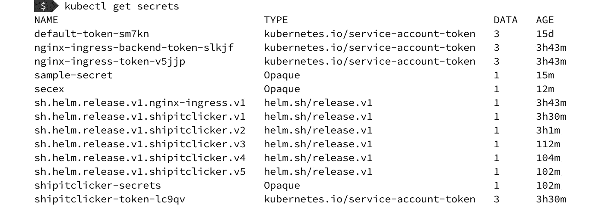

# *第八章*：将 Docker 应用程序部署到 Kubernetes

最近，很多容器编排工具如雨后春笋般涌现，但有一个编排工具准备主导市场：Kubernetes，来自云原生计算基金会。Google 最初发布 Kubernetes 的目的是将其内部使用的 Borg 集群系统的复杂性引入开源容器运行时世界。

我们将首先了解不同的 Kubernetes 发行版以及为什么你可能会选择使用每个版本。我们将从在本地开发工作站上使用 Kubernetes 开始，然后在本地安装一个示例应用程序。

在本章的进展过程中，你将学习如何通过 **Elastic Kubernetes Service**（**EKS**）在 **Amazon Web Services**（**AWS**）上创建一个 Kubernetes 集群，并将应用程序部署到运行在多个 **Elastic Compute Cloud**（**EC2**）节点上的集群中。我们将使用 AWS CloudFormation，这是一个基础设施即代码系统，用于部署 EKS 集群。一旦我们将集群部署到 AWS 后，我们将学习如何使用标签和命名空间来组织我们的应用程序。

运行 Kubernetes 集群比迄今为止介绍的其他方案更为复杂，但它为运行集群化应用程序提供了一个庞大的工具和技术世界，采用供应商中立的云原生方法。Kubernetes 不仅对云部署有用，对本地部署和本地开发也同样适用。

在本章中，我们将涵盖以下主要主题：

+   Kubernetes 本地安装选项

+   部署示例应用程序 – ShipIt Clicker v4

+   选择 Kubernetes 发行版

+   熟悉 Kubernetes 概念

+   使用 CloudFormation 启动 AWS EKS

+   将带有资源限制的应用程序部署到 AWS EKS 上的 Kubernetes

+   在 AWS EKS 上使用 AWS Elastic Container Registry

+   使用标签和命名空间来隔离环境

让我们从在本地工作站上启动 Kubernetes 开始。然后，我们将了解可用的各种 Kubernetes 发行版。

# 技术要求

对于本章，你需要在本地工作站上设置 Kubernetes，可以通过 Docker Desktop 或安装 Kubernetes 发行版（如 Minikube）。此外，为了将容器部署到 AWS，你需要提前设置好 AWS 账户。

如果你还没有 AWS 账户，可以通过以下网址注册：

[`aws.amazon.com/`](https://aws.amazon.com/)

本章的代码文件可以从 `chapter8` 目录下载，网址为 [`github.com/PacktPublishing/Docker-for-Developers/`](https://github.com/PacktPublishing/Docker-for-Developers/)。

查看以下视频，观看代码演示：

[`bit.ly/3fXO5xy`](https://bit.ly/3fXO5xy)

# Kubernetes 本地安装选项

您需要设置一个本地 Kubernetes 安装环境，以便在将 Docker 应用程序部署到云端生产环境之前进行构建、打包和测试。请查阅 Kubernetes *入门指南* 文档（[`kubernetes.io/docs/setup/`](https://kubernetes.io/docs/setup/)）。这份文档将这个本地环境称为 **学习环境**。可以将本地环境视为在将应用程序推向云端的生产环境之前，用来了解和测试应用程序的一个途径。接下来，我们将继续评估选项，首先从 Docker Desktop 的 Kubernetes 支持开始。

启用 Kubernetes 的 Docker Desktop

对于大多数人来说，这是开始尝试 Kubernetes 的最简单方式。如果您选择这样做，您不需要设置云账户或进行复杂的安装即可开始。要安装 Docker Desktop，请访问 [`www.docker.com/products/docker-desktop`](https://www.docker.com/products/docker-desktop) 下载安装。

在最近版本的 Docker Desktop 中，您可以启用 Kubernetes 支持，并在工作站上运行和开发 Kubernetes 应用程序。打开工作站上的 Docker Desktop 应用程序，进入 **首选项** 菜单，打开 **设置** 对话框。勾选 **启用 Kubernetes** 选项，然后点击 **应用并重启** 按钮：


图 8.1 – 启用 Kubernetes 的示例

这将激活您本地工作站上的单节点 Kubernetes 集群。一旦启用了 Kubernetes，您就可以验证您的本地安装是否正常工作。请参见下文了解如何操作。

## Minikube

如果您不想通过 Docker Desktop 运行 Kubernetes，您应该使用 Minikube 来设置一个本地的 Kubernetes 单节点集群环境。此环境适用于 Windows、Macintosh 以及各种 Linux 操作系统发行版。

要安装 Minikube，请根据您的操作系统访问 [`kubernetes.io/docs/tasks/tools/install-minikube/`](https://kubernetes.io/docs/tasks/tools/install-minikube/) 上的安装说明，然后按照以下章节中的说明验证您的 Minikube 安装是否正常工作。

## 验证 Kubernetes 安装是否正常工作

与 Kubernetes 进行交互大多是通过 **命令行界面** (**CLI**) 完成的。您可以执行以下命令来查看您的环境是否正常工作；该命令将显示所有正在运行的 pod，包括系统 pod：

```
kubectl get pods -A
```

输出将类似于以下内容：


](img/B11641_08_002.jpg)

图 8.2 – kubectl get pods 输出

现在你已经在本地工作站上运行了 Kubernetes，可以使用 Kubernetes 开发和部署应用程序。你开发并用 Kubernetes 打包的应用程序可以使用你在本地使用的相同工具进行部署——但在云中可以扩展到更大的规模。然而，在将应用程序部署到云端之前，我们应该先展示如何将一个打包的应用程序部署到本地。

# 部署一个示例应用程序——ShipIt Clicker v4

假设前面章节中介绍的 ShipIt Clicker 应用程序已经上线到生产环境，而负责运维的团队对该应用程序的扩展能力感到担忧，因为它仅部署在一台服务器上。为了将该 Docker 应用程序扩展到多个服务器，团队决定迁移到 Kubernetes，并使用 Helm 包管理器为 Kubernetes 打包软件。接下来，让我们安装 Helm 并进行测试。

安装 Helm

Helm 对 Kubernetes 的作用类似于包管理器对现代操作系统的作用。它允许开发人员指定如何在 Kubernetes 集群中打包和部署应用程序。Helm 不仅是一个包管理器，还是一个用于生成 Kubernetes 配置和以受控方式应用这些配置的模板系统。Helm 允许开发人员定义一整套容器及其相互关联的 Kubernetes 配置。一旦在 Helm 中定义了一个应用程序，安装和更新该应用程序就变得非常简单。

你可以通过以下命令，使用 Homebrew 在 macOS 上轻松安装它：

```
brew install helm
```

对于其他操作系统，请按照 [`helm.sh/docs/intro/install/`](https://helm.sh/docs/intro/install/) 上的 Helm 安装说明进行操作。

安装 Helm 后，使用以下命令安装稳定的 Helm 仓库（这样我们就可以安装 Helm 支持的其他软件包，比如 NGINX Ingress 控制器）：

```
helm repo add stable https://kubernetes-charts.storage.googleapis.com/
```

安装完成后，你可以使用 Helm 从目录中安装应用程序到本地 Kubernetes 实例。你还可以使用 Helm 安装在本地 Helm 图表中定义的应用程序。我们将使用 Helm 将 ShipIt Clicker 部署到 Kubernetes，并结合另一个 Helm 包——NGINX Ingress 控制器。在本章中，我们将首先将 ShipIt Clicker 应用程序部署到本地学习环境的 Kubernetes 集群，稍后我们将把 ShipIt Clicker 部署到 Amazon EKS 云环境中。

## 在本地部署 NGINX Ingress 控制器和 ShipIt Clicker

让我们使用 Helm 安装一个打包的应用程序——NGINX Ingress 控制器，然后用它来安装 ShipIt Clicker。Ingress 控制器是 Kubernetes 网络代理，允许外部请求访问部署在 Kubernetes 上的应用程序，并提供清晰的接口来帮助连接这些应用程序。稳定的 Helm 仓库包含了 NGINX Ingress 控制器。安装步骤如下：

```
helm install nginx-ingress stable/nginx-ingress
```

在本章的后面部分，我们将更详细地探讨 Ingress Controller。暂时知道，这个简单的安装已经足够通过正确的配置将服务暴露到 Kubernetes 集群内部的 `localhost`，以便你进行测试。

接下来，我们将构建 ShipIt Clicker Docker 容器、为其打标签，并将其推送到 Docker Hub。Kubernetes 依赖于从 Docker 镜像注册表拉取 Docker 镜像，因此仅仅在本地系统上拥有容器是不够的。执行以下命令，替换 `dockerfordevelopers` 为你的 Docker Hub 用户名：

```
$ cd chapter8
$ docker build . -t dockerfordevelopers/shipitclicker:0.4.0
$ docker push dockerfordevelopers/shipitclicker:0.4.0
```

编辑 `shipitclicker/values.yaml` 文件，并在此段落中将 `dockerfordevelopers` 替换为你的 Docker Hub 用户名：

```
# Default values for shipitclicker.
# This is a YAML-formatted file.
# Declare variables to be passed into your templates.
replicaCount: 1
image:
  repository: dockerfordevelopers/shipitclicker
  pullPolicy: IfNotPresent
```

然后，将 ShipIt Clicker 部署到 Kubernetes 本地环境中。在这种情况下，我们将使用本地 Helm Chart，而不是来自网络 Helm Chart 仓库的 Helm Chart。ShipIt Clicker 的 Helm Chart 位于 GitHub 仓库的 `chapter8/shipitclicker` 目录中。使用 Helm 安装它，命令如下：

```
$ helm install shipitclicker shipitclicker NAME: shipitclicker
LAST DEPLOYED: Fri Apr 24 23:21:22 2020
NAMESPACE: default
STATUS: deployed
REVISION: 1
NOTES:
1\. Get the application URL by running these commands:
  http://localhost
```

访问 `http://localhost/` 来查看 ShipIt Clicker 应用程序。你应该能看到正在运行的应用程序启动画面。

### 本地安装故障排除

如果你无法在 `http://localhost/` 访问应用程序，可能是因为在端口 `80` 上运行了另一个 Web 服务器，例如 Apache 2。

现在，我们在 Kubernetes 上运行此应用程序，你需要使用 Kubernetes 命令连接到集群内部的服务，而这些服务并未通过 Ingress Controller 暴露。

要从 Kubernetes 集群中暴露 Redis 端口进行测试，使用以下命令：

```
$ brew install redis
$ kubectl port-forward deployment/shipitclicker 6379 &
$ redis-cli
> keys *
> quit
```

现在，你已经将 ShipIt Clicker 应用程序部署到本地 Kubernetes 安装中，可以继续将其部署到更大的云环境中，并为生产就绪做配置。

# 选择 Kubernetes 发行版

那么，如何在不将 Kubernetes 安装在工作站上的情况下托管 Kubernetes 呢？当选择 Kubernetes 发行版时，你会面临许多选择，正如我们在 *第五章* *生产环境中部署和运行容器的替代方案* 中所看到的那样。现在，我们将重新回顾一些最流行的选项，帮助你根据你的云服务提供商或裸机数据中心设置，了解可用的选择，并解释为什么我们选择使用 EKS 来演示将 ShipIt Clicker 示例应用程序迁移到 Kubernetes。

## Google Kubernetes Engine

**Google Kubernetes Engine** (**GKE**) 是 Google 在基于 Kubernetes 的环境中托管容器的关键服务。GKE（前身为 Google Container Engine）在 2014 年 11 月发布了 Alpha 版本，并于 2015 年 8 月开始面向公众上线。

它目前提供了云服务商提供的最成熟的 Kubernetes 服务之一，包括以下功能：

+   一个单一集群的快速启动选项，用于试用该服务

+   容器漏洞扫描

+   内置数据加密

+   多种升级、修复和发布渠道

+   与 Google 监控服务的集成

+   自动扩展和负载均衡

+   Google 管理的底层硬件

有兴趣的读者可以在 GKE 网站上找到更多文档：[`cloud.google.com/kubernetes-engine/docs`](https://cloud.google.com/kubernetes-engine/docs)。

现在我们来与亚马逊的产品进行比较。

## AWS EKS

亚马逊针对云中容器服务和管理的解决方案是其 EKS 服务。与 GKE 一样，亚马逊的 Kubernetes 服务 EKS 提供托管服务。不同于 Google 的产品，它是稍晚进入市场的，直到 2018 年初才发布。然而，EKS 在成熟度上有所欠缺，但在功能上却弥补了这一点。

这些特性包括：

+   通过 AWS Fargate 进行无服务器托管 ([`aws.amazon.com/fargate/`](https://aws.amazon.com/fargate/))

+   EC2 上的服务器部署选项

+   零停机升级和补丁

+   自动检测不健康的节点

+   使用 AWS Outposts 的混合托管解决方案 ([`aws.amazon.com/outposts/`](https://aws.amazon.com/outposts/))

+   Kubernetes 批处理作业

你可以在官方网页上阅读更多关于 EKS 的信息：[`aws.amazon.com/eks/features/`](https://aws.amazon.com/eks/features/)。

本章及后续章节中，我们将更详细地探讨 EKS，主要是因为它是主导云服务商提供的托管 Kubernetes 服务。然而，其他发行版也有其优势，因此我们也将研究一些其他的选择。接下来是 Red Hat OpenShift。

Red Hat OpenShift

OpenShift 是由 Red Hat 开发的一组软件，专为容器化应用架构而设计。像 GKE 和 EKS 一样，OpenShift 以 Kubernetes 为核心；然而，它的不同之处在于，OpenShift 更侧重于构建相关的工件和本地镜像库。

在本书中使用 Jenkins 的项目之后，你现在应该熟悉 `kubectl` 命令，了解包括机制在内的 CI/CD 功能，这些功能通常需要使用 Jenkins 或 Spinnaker 等软件来实现。这包括创建构建、测试运行和部署的能力。

还有一些其他关键特性，使得 OpenShift 成为一个值得选择的选项：

+   自动化升级和生命周期管理

+   GitHub 上的开源代码库 ([`github.com/openshift`](https://github.com/openshift))

+   可部署于任何云环境、数据中心或本地

+   一个镜像注册库

+   监控和日志聚合

如需了解更多关于 Red Hat OpenShift 的信息，请务必查看 GitHub 上的文档 ([`github.com/openshift/openshift-docs`](https://github.com/openshift/openshift-docs)) 或访问官方网站 ([`www.openshift.com/`](https://www.openshift.com/))。

## Microsoft Azure Kubernetes 服务

到目前为止，我们已经介绍了主要的参与者，但当然，在深入之前，必须提到微软对 Kubernetes 生态系统的贡献。对于使用微软云产品的用户，**Azure Kubernetes Service**（**AKS**）提供了一种机制，用于在基于 Kubernetes 的环境中提供 Docker 容器服务。

让我们简要浏览一下 AKS 提供的功能：

+   服务的弹性供应

+   与 Azure DevOps 和监控服务的集成

+   使用 Active Directory 进行身份和访问管理

+   故障检测和容器健康监控

+   金丝雀发布

+   日志聚合

如你所见，对于 Azure 用户来说，它提供了一组与 EKS 和 GKE 类似的功能。如果你想了解更多信息，请参考 AKS 文档（[`docs.microsoft.com/en-us/azure/aks/`](https://docs.microsoft.com/en-us/azure/aks/)）。在这里，你还可以找到一个快速入门指南，帮助你快速体验该服务提供的功能。

在介绍构成 Kubernetes 基础的各个组件之前，我们先简要回顾一下其他可用的选项。

## 回顾其他相关选项

EKS、OpenShift、GKE 和 AKS 代表了市场上最流行的 Kubernetes 服务。然而，它们并不是唯一的。Digital Ocean 为那些希望尝试托管服务，而不是自己部署 RedShift 基础设施或注册大云服务提供商的用户提供了一个选择。你可以在[`www.digitalocean.com/products/kubernetes/`](https://www.digitalocean.com/products/kubernetes/)阅读更多相关内容。

许多读者应该熟悉 IBM，他们也提供云托管服务。如果你想在他们的云环境中尝试 Kubernetes，可以在他们的网站上找到相关详情，包括如何设置一个免费集群（[`www.ibm.com/cloud/container-service/`](https://www.ibm.com/cloud/container-service/)）。

任何熟悉 VMware 的用户可能也想了解他们的 Kubernetes 解决方案——VMware Tanzu Kubernetes Grid——它在构建混合云方面具有优势（[`tanzu.vmware.com/kubernetes-grid`](https://tanzu.vmware.com/kubernetes-grid)）。

最后，寻求完全托管 Kubernetes 服务的用户，或者已经是 Rackspace 客户的用户，可以选择查看他们的**Kubernetes as a Service**（**KaaS**）服务（[`www.rackspace.com/managed-kubernetes`](https://www.rackspace.com/managed-kubernetes)）。

这就结束了我们对容器部署托管平台的快速浏览。

本章剩余部分我们将使用 Amazon 的 EKS 服务。如果你还没有创建账户，建议你现在立即注册：

[`aws.amazon.com/`](https://aws.amazon.com/)

注意

其他云服务提供商的用户可能会发现，如果愿意，他们可以将以下部分内容适配到自己的服务上。

现在，让我们深入探讨 Kubernetes 的核心概念，包括 pods、nodes 和 namespaces。

熟悉 Kubernetes 的概念

现在，您知道了可以在哪些地方部署 Kubernetes，让我们深入了解一些关键概念（包括对象、ConfigMap、Pod、节点、服务、Ingress 控制器、秘密和命名空间）以及它们如何工作。我们先从一个架构图开始，展示系统中各个组件之间的关系：


图 8.3 – Kubernetes 架构图

图 8.3 – Kubernetes 架构图

在 Kubernetes 中，集群由一个控制平面和一组工作节点组成。控制平面管理 Kubernetes 集群的各个方面（包括与云提供商的接口），而工作节点是托管集群中的应用程序的地方。开发人员和集群操作员通过控制平面与 Kubernetes 交互，控制平面中的进程通过 `kubelet` 进程与各个工作节点上的进程进行通信，工作节点上的进程被组织为 Pod，通过每个节点上运行的 `kube-proxy` 进程相互通信。

## 对象

Kubernetes 中最基本的概念是 `kubectl` 工具，它用于创建、查询和修改各种 Kubernetes 对象，以及配置集群。

`kubectl` 命令行工具可以接收描述对象的 YAML 格式文件，并使用这些文件来创建和更新系统的状态。这是定义、安装和升级 Kubernetes 应用程序的最基本方式。我们用于安装应用程序的 Helm 工具则进一步提供了模板化和生命周期管理功能。

我们推荐通过 Helm Charts 配置您的应用程序。您在本章开始时简要了解了如何使用 Helm。Helm Chart 只是包含关于您的容器化应用程序信息的一组 YAML 配置文件。

您可以使用以下命令创建一个新的 Helm Chart：

```
helm create my-chart
```

这会设置一个 Helm Chart 结构，包含可以定制的模板文件。

## ConfigMap

Kubernetes 使用名为 ConfigMap 的概念来处理应用程序配置。接着，我们需要定义容器本身的配置。这通过 ConfigMap 来处理。

ConfigMap 的核心理念是，您可以将重要的配置与镜像本身的内容分离开来。这样做是为了更好地实现微服务和应用程序的可移植性。

ConfigMap 可以通过 `kubectl` 使用以下命令直接创建：

```
kubectl create configmap sample-configmap-name
```

ConfigMap 将包含应用程序使用的信息，以及其他键值对，例如命名空间。以下示例展示了一个应用程序的 ConfigMap 可能是什么样子：

```
apiVersion: v1 
kind: ConfigMap 
metadata: 
    name: shipitclicker-configmap 
data: 
    language: "JavaScript"
    node.version: "13.x"
```

我们刚才演示的 ConfigMap 将存储在 Helm Chart 目录中的 templates 文件夹里——例如，`shipitclicker/templates/configmap.yaml`。

在这个基本设置完成后，你可以通过`helm install`命令安装你的配置。我们将在本章的后续部分更详细地探讨 ConfigMap 和 Helm Chart 格式的配置。

## Pods

Kubernetes 中的 Pod 用于将*1*到*n*个容器化组件组合在一起，然后在共享的上下文中运行。它们还包括共享资源，例如 IP 地址、存储和容器如何运行的定义。在 Pod 中一起运行的多个容器可以通过`localhost`上的固定端口互相通信，从而大大简化应用配置。

在定义应该在 Pod 中运行的内容时，最好的方法是将其视为包含系统或应用所需所有容器的容器组。然后，可以将多个 Pod 添加到 Kubernetes 中，水平扩展你的应用。这使你能够创建冗余，并帮助应对流量和负载的增加。

Pod 所使用的共享上下文是通过 Linux 概念（如 cgroups 和 namespaces）实现的。在*第十二章*《容器安全概述》中，我们将深入探讨一些与容器安全相关的概念。

## 节点

托管 Docker 容器的机器在 Kubernetes 生态系统中被称为**节点**，尽管你也可能遇到术语*minions*或*workers*——它们的意思相同，但节点是官方术语。Kubernetes 支持物理机或虚拟机类型的节点。像 Amazon 的 EKS 这样的服务提供了部署节点基础设施的机制。你将 Kubernetes Pod 部署在节点上；Pod 包括容器和共享资源。

在我们使用的学习环境中，我们的本地开发工作站是集群中唯一的节点。在本章稍后的部分，我们将创建一个由 EKS 管理的 Kubernetes 集群，节点部署在 AWS EC2 上。Kubernetes 节点通过 Pod 和其他 Kubernetes 对象（如 DaemonSets）来运行容器。

替代的容器运行时

Kubernetes 节点可能运行不同的容器运行时。Kubernetes 不仅支持 Docker 容器，还支持其他容器技术，包括 containerd、CRI-O 和 Frakti。由于本书主要讲解 Docker，我们将在示例中专门使用 Docker 运行时。

## 服务

Kubernetes 服务是一种声明应用如何向外界暴露其接口的方式。它通常定义一个网络端口，其他 Kubernetes Pod 可以使用该端口与应用进行通信。

ShipIt Clicker 的 Helm Chart 会发出一个服务模板，定义一个`ClusterIP`服务定义：

```
$ helm template shipitclicker ./shipitclicker | less
…
# Source: shipitclicker/templates/service.yaml
apiVersion: v1
kind: Service
metadata:
  name: shipitclicker
  labels:
    helm.sh/chart: shipitclicker-0.1.10
    app.kubernetes.io/name: shipitclicker
    app.kubernetes.io/instance: shipitclicker
    app.kubernetes.io/version: "0.4.0"
    app.kubernetes.io/managed-by: Helm
spec:
  type: ClusterIP
  ports:
    - port: 8008
      targetPort: http
      protocol: TCP
      name: http
  selector:
    app.kubernetes.io/name: shipitclicker
    app.kubernetes.io/instance: shipitclicker
```

这份声明描述了 ShipIt Clicker 在每个 Pod 上通过`8008`端口暴露 HTTP 作为服务的事实。这让其他 Kubernetes 服务能够发现并与其建立连接。

## Ingress 控制器

Kubernetes 管理一个内部网络，在该网络中，集群中的应用程序可以通过私有网络相互通信。默认情况下，无法从外部访问运行在 Kubernetes 集群内的应用程序。Ingress Controller 充当代理和连接经纪人。根据你是部署在本地还是云端，不同类型的 Ingress Controller 有不同的用途。例如，在本章前面，我们安装了`nginx-ingress` Ingress Controller，以便让我们能够访问本地 Kubernetes 安装上运行的应用程序。当你希望以与供应商无关的方式授予访问 Kubernetes 应用程序的权限时，这个控制器也是很有用的。

其他 Ingress Controllers 允许 Kubernetes 与不同类型的外部负载均衡器（例如`aws-alb-ingress-controller`）平滑协作，`aws-alb-ingress-controller`使得可以使用`k8s-bigip-ctlr`，后者允许使用 F5 BIG-IP 负载均衡器，这些负载均衡器在许多数据中心中都有使用。

你可以使用 Ingress Controllers 将域名和 HTTP 路径映射到 Kubernetes 服务。这使得在不同的 URL 下暴露不同的服务变得非常简单。如果你有一组微服务，你可以使用这种模式将它们暴露在不同的 API 端点上。通过声明一个 Ingress 对象并为你的应用程序广告如何将你的服务连接到外部世界，你可以利用 Ingress Controllers。例如，对于 ShipIt Clicker 示例，我们使用以下方式将服务映射到默认命名空间中的`localhost`：

```
$ helm template shipitclicker ./shipitclicker | less
…
# Source: shipitclicker/templates/ingress.yaml
apiVersion: networking.k8s.io/v1beta1
kind: Ingress
metadata:
  name: shipitclicker
  labels:
    helm.sh/chart: shipitclicker-0.1.10
    app.kubernetes.io/name: shipitclicker
    app.kubernetes.io/instance: shipitclicker
    app.kubernetes.io/version: "0.4.0"
    app.kubernetes.io/managed-by: Helm
  annotations:
    kubernetes.io/ingress.class: nginx
    kubernetes.io/tls-acme: "true"
spec:
  rules:
    - host: "localhost"
      http:
        paths:
          - path: /
            backend:
              serviceName: shipitclicker
              servicePort: 8008
…
```

Kubernetes 系统使用这个 Ingress Controllers 定义处理外部与集群内托管的应用程序的连接。这意味着，当你首次开发你的应用程序时，你不需要担心它是如何连接到外部世界的。启用 Ingress Controllers 的 Kubernetes 配置也可以通过 Helm Charts 进行管理。

接下来，我们将探讨 Kubernetes 如何处理敏感信息——通过使用密钥。

## 密钥

每个应用程序都有需要保护的值，从数据库密码到 API 密钥，因此拥有一个安全存储和检索它们的机制是一个重要功能。在 Kubernetes 中，这是通过一个名为“secrets”的机制来处理的。你可以使用配置文件和`kubectl`命令的组合来共享和修改需要保护的信息，这些信息与你的 Pod 及其运行的容器相关联。一旦你创建了一个密钥，你可以通过多种机制在你的应用程序中使用它，包括将密钥暴露为环境变量，或者创建一个文件供在 Pod 中运行的容器来检索。

Kubernetes 中与密钥相关的关键操作如下：

+   创建一个密钥

+   描述一个密钥

+   检索一个密钥

+   编辑一个密钥

让我们从创建一个密钥开始，探索这四个概念。

### 创建一个密钥

我们可以通过几种方法来创建一个机密。可以通过命令行手动添加，或者将其存储在 YAML 模板文件中并从中使用。

要通过命令行添加存储在文本文件中的机密，可以使用以下命令：

```
$ echo "new-secret" > secret.txt
$ kubectl create secret generic secex --from-file=./secret.txt
```

如果我们这样做，`kubectl` 将为我们处理机密的 Base64 编码。

让我们用另一种方式准备一个机密，使用配置文件。为了为这个文件准备一个文本机密，必须进行 Base64 编码。你可以通过以下命令在 macOS 或 Linux 的命令行中完成此操作：

```
$ echo -n "changed-api-key" | base64
Y2hhbmdlZC1hcGkta2V5
```

如果我们想将机密存储在配置文件中，并使用 `kubectl` 将其添加到 Kubernetes 中，我们可以创建以下的 `secret-api-token.yaml` 文件：

```
---
apiVersion: v1
kind: Secret
metadata:
  name: api-token
  namespace: default
type: Opaque
data:
  token: "Y2hhbmdlZC1hcGkta2V5"
```

然后，使用 `kubectl apply` 命令行选项，我们可以创建机密：

```
kubectl apply –f ./secret-api-token.yaml
```

你会注意到，机密的配置文件格式与我们检查的示例 ConfigMap 非常相似。

因为 `shipitclicker` 使用 Helm 来管理其 Kubernetes 对象，所以它的模板内置了对机密的支持。本章代码中引用的唯一机密与 Node.js 服务器端框架设置有关，特别是样例应用程序中用于处理服务器会话的 Express 框架。这个机密被称为 `SESSION_SECRET`，它存储在 `chapter8/shipitclicker/templates/secrets.yaml` 文件中：

```
---
apiVersion: v1
kind: Secret
metadata:
  name: {{ .Release.Name}}-secrets
  namespace: {{ .Release.Namespace }}
type: Opaque
data:
  SESSION_SECRET: "bXlTZWNyZXQtdjQK"
```

请注意，这里使用了模板表达式来设置 `name` 和 `namespace`，以便与 Helm 转换的其他模板对齐。

我们在本章早些时候使用 `helm install` 命令安装 `shipitclicker` Helm 模板时创建了这个机密。这就是使用 Helm 模板创建机密的方法。

现在我们已经看到几种创建机密的方法，接下来我们将展示如何查询 Kubernetes 知道哪些机密。

### 描述一个机密

创建机密后，可以使用 `kubectl get secrets` 命令列出它。这将类似地列出机密：



图 8.4 – 机密列表

要了解更多关于机密的信息，可以使用 `kubectl describe` 命令：

```
kubectl describe secrets/shipitclicker-secrets
```

上述命令的输出将在以下截图中显示：


图 8.5 – `kubectl describe` 命令输出，显示机密的元数据

你将看到显示的有关机密的元数据，包括机密的键——在此例中为 `SESSION_SECRET`。不过，它不会显示机密的值。

### 检索一个机密

Kubernetes 应用程序检索简单机密的典型方式是将其定义为传递给容器的环境变量，该变量引用了机密。请参见从渲染的 Helm 图表模板中摘录的内容：

```
# Source: shipitclicker/templates/deployment.yaml
apiVersion: apps/v1
kind: Deployment
metadata:
  name: shipitclicker …      containers:
        - name: shipitclicker
…
          env:…            - name: REDIS_PORT
              valueFrom:
                configMapKeyRef:
                  name: shipitclicker-configmap
                  key: REDIS_PORT
            - name: SESSION_SECRET
              valueFrom:
                secretKeyRef:
                  name: shipitclicker-secrets
                  key: SESSION_SECRET
```

你可以看到，映射到 `shipitclicker` 容器部署的环境变量引用了 `configMapKeyRef` 和 `secretKeyRef` 两个条目。

对于更复杂的机密，比如完整的文件（如 SSH 私钥），机制类似。有关更多场景的详细信息，请参阅 Kubernetes 机密文档：[`kubernetes.io/docs/concepts/configuration/secret/`](https://kubernetes.io/docs/concepts/configuration/secret/)。

为了故障排除，我们可以通过命令行从 Kubernetes 中检索机密：

```
$ template='go-template={{index .data "SESSION_SECRET"}}'
$ kubectl get secrets shipitclicker-secrets -o "$template" | base64 -D
mySecret-v4
```

现在我们已经了解了如何检索一个机密，接下来我们将学习如何编辑机密。

### 编辑机密

如果您希望在创建后编辑机密，可以使用`kubectl edit`命令：

```
kubectl edit secrets secex
```

这将打开您的默认编辑器（默认是 vi），您可以编辑机密。您需要准备好 Base64 编码的替换值。它看起来应该像这样：

```
apiVersion: v1
data:
  secret.txt: Y2hhbmdlZC1hcGkta2V5LTI=
kind: Secret
metadata:
  creationTimestamp: "2020-04-25T20:54:31Z"
  name: secex
  namespace: default
  resourceVersion: "826562"
  selfLink: /api/v1/namespaces/default/secrets/sample-secret
  uid: ce8fbf27-33ba-461e-9bb8-1ca31fa3e888
type: Opaque
```

您可以通过这种方式直接编辑机密。更新机密后，可能需要重新部署您的应用程序，具体取决于它如何使用该机密。手动管理这一过程可能变得复杂，这也是我们使用 Helm 打包应用程序的原因之一。

### 更新 ShipIt Clicker 会话密钥

对于通过 Helm 部署的应用程序，通常的做法是通过 Helm 模板进行更改，而不是使用原始的`kubectl`命令。现在，我们将通过以下步骤，使用 Helm 更改 ShipIt Clicker 的`SESSION_SECRET`密钥：

1.  使用以下命令生成一个 Base64 编码的机密：

    ```
    echo -n "new-session-secret" | base64
    ```

1.  编辑模板`chapter8/shipitclicker/templates/secrets.yaml`文件。

1.  使用`openssl`命令输出的值作为新的`SESSION_SECRET`值。

1.  编辑`chapter8/shipitclicker/Chart.yaml`文件，并增加图表的`version`号。

1.  每次更新 Helm 图表时，您都需要执行此操作。然后，使用以下命令更新模板：

    ```
    helm upgrade shipitclicker ./shipitclicker
    ```

如您所见，添加和编辑机密的基本命令非常简单。但在我们的应用程序中使用它们稍微复杂一些。这将让您对如何创建机密值以及如何检索相关信息有所了解，以便探索该功能。

注意

欲了解更多关于机密的信息，请查看最新的 Kubernetes 文档：[`kubernetes.io/docs/concepts/configuration/secret/`](https://kubernetes.io/docs/concepts/configuration/secret/)。

在*第十四章*，*高级 Docker 安全性——机密、机密命令、标记和标签*中，我们探讨了与 Docker Swarm 相关的机密存储和使用。虽然 Docker Swarm 逐渐失宠，许多团队正在转向 Kubernetes，但理解这些概念对于维护遗留系统非常重要。此外，您可能会发现自己需要将系统从 Docker Swarm 迁移到 Kubernetes。本章提供的信息和*第十四章*，*高级 Docker 安全性——机密、机密命令、标记和标签*中的内容，将帮助您将一个技术的概念映射到另一个技术。

## 命名空间

为了在 Kubernetes 中划分资源，我们可以使用一个叫做命名空间的概念。命名空间提供了一种机制，将容器资源分组到不重叠的集合中，这样就可以根据业务需求，在同一个集群中进一步细分 Kubernetes 资源。这可能包括从环境（开发、测试和生产）到微服务组的所有内容。你应该考虑的一个重要因素是，同一命名空间中的应用程序可以读取该命名空间中的任何机密，因此它也代表了一个安全边界。

一旦你了解了这个功能，可能会忍不住想在各处使用它，但 Kubernetes 文档对此做出了警告。主要的命名空间内容页面 ([`kubernetes.io/docs/concepts/overview/working-with-objects/namespaces/`](https://kubernetes.io/docs/concepts/overview/working-with-objects/namespaces/)) 中写道：

"*对于有少数到几十个用户的集群，你根本不需要创建或考虑命名空间*。"

然而，请记住，不同的团队可能希望将应用程序相互隔离，命名空间是一个很好的方法，因为它提供了一个安全边界。在本章后面的*使用标签和命名空间来隔离环境*部分，我们将探索如何使用这一概念，将应用程序同时部署到 AWS 中的测试环境和生产环境。

接下来，让我们通过 CloudFormation 设置 AWS EKS，以便使用 Kubernetes 将我们的应用程序部署到公有云。

# 使用 CloudFormation 启动 AWS EKS

现在，我们已经完成了 Kubernetes 本地安装的介绍，并探索了一些云供应商选项，我们将尝试将容器部署到 AWS 托管的 Kubernetes 环境中。这将是我们在本章上一节中简要介绍的 EKS 服务。

为了实现这一目标，我们将描述如何使用 AWS CloudFormation 创建和管理 EKS 集群，CloudFormation 是他们的基础设施即代码服务。有关 CloudFormation 的更多信息，务必查看 AWS 的指南和文档：[`docs.aws.amazon.com/cloudformation/`](https://docs.aws.amazon.com/cloudformation/)。

假设你之前已经创建了 AWS 账户，或者按照本章*技术要求*部分的说明操作，打开 AWS 云控制台。

要继续，我们需要设置 EKS。获得一个工作中的 EKS 集群有很多方法，每种方法需要不同的工作量：

+   通过 AWS 控制台手动逐步设置所有内容。我们*不推荐*这种方法，因为它需要深厚的 AWS 知识来正确执行，而且会导致一个难以复制的环境，并且缺乏控制。

+   从零开始编写基础设施即代码模板，使用 AWS CloudFormation 或 Terraform 来控制所需的所有资源。如果你是 CloudFormation 或 Terraform 的专家，并且已经有了在 CloudFormation 或 Terraform 工具上的投资，这种方法可能适合你，但我们*不建议初学者使用这种方法*。

+   使用 `eksctl` 工具（见 [`eksctl.io`](https://eksctl.io)）通过简单的 CLI 工具创建一个集群。如果你已经熟悉 AWS，并希望将集群放置在特定区域并调整更多集群参数，这个方法可能会很有效。我们*仅建议在你已经熟悉 AWS 和 EKS 的情况下使用此方法*。

+   研究并采用已经有人编写的基础设施即代码模板。AWS 和许多其他人已经创建了 CloudFormation 和 Terraform 模板。

我们将采用最后一种方法，使用 AWS 快速启动 CloudFormation 模板来创建我们的第一个云 Kubernetes 集群。

## 介绍 AWS EKS 快速启动 CloudFormation 模板

亚马逊提供了一套便捷的 CloudFormation 模板，称为 Quick Starts，由其专家云架构师构建，用于快速启动 AWS 服务和场景的广泛选择（[`aws.amazon.com/quickstart/`](https://aws.amazon.com/quickstart/)）。

我们将在本章的下一部分使用 AWS EKS 快速启动模板。

但是，在你部署 EKS 快速启动 CloudFormation 模板之前，请花一点时间为你的 AWS 账户做准备工作。

## 准备 AWS 账户

如果你刚开始使用 AWS，在继续操作之前有一些关键的事项需要注意，以保护你的账户。这些预防措施和准备工作同样适用于如果你选择了除使用 AWS 快速启动 CloudFormation 模板以外的其他方法来创建 EKS 集群。

如果你已经是经验丰富的 AWS 用户，拥有 AWS `us-east-2` 区域，并且知道你的公共 IPv4 地址，你可以跳到*启动 AWS EKS 快速启动 CloudFormation 模板*部分。不过，请避免使用具有管理员权限的假定 IAM 角色来创建 CloudFormation 模板——这样会导致一些子模板进入 `UPDATE_ROLLBACK_FAILED` 状态，恢复起来非常困难。

### 使用 IAM 管理员用户而不是根账户用户

首先，确保你不是以根账户用户身份使用 AWS 控制台。这是一个重大的安全风险。你将需要一个具有管理员权限的 AWS IAM 用户账户。如果你刚创建了 AWS 根账户，可以按照 AWS 指南在 [`docs.aws.amazon.com/IAM/latest/UserGuide/getting-started_create-admin-group.html`](https://docs.aws.amazon.com/IAM/latest/UserGuide/getting-started_create-admin-group.html) 上的步骤创建一个。

在按照说明设置好此用户并启用 IAM 用户的账单访问后，前往 [`console.aws.amazon.com/iam/home#/home`](https://console.aws.amazon.com/iam/home#/home) 页面，将 IAM 用户的登录链接复制到剪贴板。编辑您的网页浏览器书签，并使用此 URL 创建一个**AWS IAM 登录**项。您将需要使用此项通过管理员账户登录到您的 AWS 账户，而不是使用根账户。

在您的本地系统中，创建一个 `eks-notes.txt` 文件，并将登录链接记录在那里。还要从 [`console.aws.amazon.com/iam/home?region=us-east-2#/users/Administrator`](https://console.aws.amazon.com/iam/home?region=us-east-2#/users/Administrator) URL 中记录管理员用户的**用户 ARN**值：


](img/B11641_08_006.jpg)

图 8.6 – 管理员用户的 AWS IAM 用户摘要

这个**Amazon 资源名称**（**ARN**）用户是一个字符串，类似于 Web **统一资源标识符**（**URI**），但它是专属于 Amazon 的。现在我们已经设置了一个管理员用户，接下来让我们设置**多重身份验证**（**MFA**）来保护根账户和管理员用户。

### 设置 MFA

我们建议您使用 MFA 来保护根账户和每个具有管理员权限的 IAM 用户账户。如果有人破解了您的根账户，他们可能通过启动昂贵的云资源来产生巨额账单，窃取您的信息，甚至删除您的所有数据。在开始时，我们建议您使用虚拟 MFA 设备和支持软件（如 Google Authenticator、Authy 或 1Password）来启用 MFA。

为了增强安全性，您可以选择使用受支持的硬件令牌解决方案，但虚拟 MFA 也可以正常工作。有关设置 MFA 的更多详情，请参阅 AWS MFA 文档：

[`aws.amazon.com/iam/features/mfa/`](https://aws.amazon.com/iam/features/mfa/)

### 使用 IAM 用户账户登录 AWS 控制台

确保您已退出根账户。然后，使用您的`eks-notes.txt`文档中的登录 URL，使用您的管理员 IAM 用户账户登录 AWS 控制台，才可继续操作。

### 为 IAM 管理员用户创建访问密钥

为了使用 AWS 命令行工具，您需要生成 AWS 访问密钥。您可以在 [`docs.aws.amazon.com/general/latest/gr/aws-sec-cred-types.html`](https://docs.aws.amazon.com/general/latest/gr/aws-sec-cred-types.html) 阅读更多关于访问密钥和其他类型 AWS 凭证的信息。

在 AWS 控制台中，进入 IAM 服务，并在**用户**部分找到您刚刚创建的管理员用户。然后，导航到**安全凭证**选项卡，通过点击**创建访问密钥**按钮创建新的访问密钥：


图 8.7– 管理员用户的 AWS IAM 用户摘要

将这些访问密钥作为 CSV 文件下载到本地系统。你需要打开该文件并检查密钥，以便配置 AWS CLI，接下来我们将进行此操作。

### 在本地工作站上配置 AWS CLI

为了完成 EKS 集群的配置，你需要在本地工作站上安装一个有效的 AWS CLI。如果你还没有安装，请按照 [`aws.amazon.com/cli/`](https://aws.amazon.com/cli/) 上的说明进行安装。

安装完成后，执行 `aws configure` 命令，并使用你在上节中保存的访问密钥 CSV 文件中的访问 ID 和秘密密钥来配置 CLI，以便使用管理员用户。使用 `aws sts get-caller-identity` 命令验证是否配置成功。检查输出，确保没有错误消息，然后验证该命令为活动用户发出的 ARN 与在 IAM Web 控制台中显示的管理员用户 ARN 相同。输出应该类似于以下内容：


图 8.8 – aws sts get-caller-identity 输出

在配置 ALB Ingress Controller 时，你需要完成这个设置，详细内容将在本章后面介绍。

### 为 EKS 集群创建 EC2 密钥对

为了执行 EKS 集群的初始配置，你需要通过 SSH 连接到 CloudFormation 模板设置的 EC2 虚拟服务器，该服务器被称为堡垒主机。选择 `us-east-2` 区域。以你的 IAM 管理员身份登录，访问 [`console.aws.amazon.com/ec2`](https://console.aws.amazon.com/ec2)，然后确保从区域选择器中将区域切换到 **us-east-2**：


图 8.9 – 切换 AWS 区域

然后，在左侧菜单中找到并点击密钥对链接，创建一个名为 `ec2-eks` 的新密钥对，并下载它。你将在配置 EKS 集群时需要这个密钥对。为此，将该密钥对复制到本地用户主目录下的 `.ssh` 目录，并设置权限，以便 SSH 可以使用它：

```
$ mkdir -p ~/.ssh
$ chmod 0700 ~/.ssh
$ cp ~/Downloads/ec2-eks.pem ~/.ssh/
$ chmod 0600 ~/.ssh/ec2-eks.pem
```

你稍后将需要这个密钥来连接到 EKS 集群的堡垒主机。接下来，确保你知道你的公共 IP 地址。

### 以 CIDR 表示法记录你的公共 IP 地址

我们将通过限制访问仅限于你当前使用的公共 IPv4 地址来限制来自互联网对 Kubernetes 集群的访问。这将防止恶意黑客和攻击互联网主机的人扫描你的系统。为此，请访问 [`whatismyip.com/`](https://whatismyip.com/)，并复制你的公共 IPv4 地址（CIDR 格式），即在原始数字地址后附加 `/32`。例如，如果是 `192.2.0.15`，那么你的 IPv4 地址的 CIDR 格式将是 `192.2.0.15/32`。在本地系统中，打开 `eks-notes.txt` 文件并记录该 CIDR 地址。

## 启动 AWS EKS 快速启动 CloudFormation 模板

你可以在 [`aws.amazon.com/quickstart/architecture/amazon-eks/`](https://aws.amazon.com/quickstart/architecture/amazon-eks/) 找到有关 AWS EKS 快速启动 CloudFormation 模板的文档。

要全面了解此快速启动所提供的内容，请阅读 AWS 提供的相关部署指南：

[`docs.aws.amazon.com/quickstart/latest/amazon-eks-architecture/welcome.html`](https://docs.aws.amazon.com/quickstart/latest/amazon-eks-architecture/welcome.html)

至少浏览该页面的概要。当你准备好继续部署时，点击 **如何部署** 部分。你会看到在部署 CloudFormation 模板时有两个选项，如下所示：

+   **部署到新 VPC** ([`fwd.aws/6dEQ7`](https://fwd.aws/6dEQ7))

+   **部署到现有 VPC** ([`fwd.aws/e37MA`](https://fwd.aws/e37MA))

在开始之前，如果你仍然使用 root 账户登录 AWS 控制台，请注销并使用你在 `eks-notes.txt` 文件中记录的 IAM 登录 URL 作为管理员用户登录。

我们建议你从将此基础设施部署到新的 **虚拟专用云**（**VPC**）开始。点击该链接或使用前面的 URL 访问 CloudFormation 堆栈创建表单。大部分表单中的项目可以保持默认，但有些必须填写，以完成初始集群配置，并确保不会意外创建不安全的配置。

### EKS 快速启动 CloudFormation 创建指南

创建 CloudFormation 堆栈需要你填写一个四页的 CloudFormation 参数表单，可以通过点击前一部分中的 **部署到新 VPC** 链接来完成。这是该表单的第一页：


图 8.10 – CloudFormation 表单，第 1 页，共 4 页：准备模板

本指南将帮助你完成相关步骤，以便在大约 30 分钟内启动一个可用的 EKS 集群。

#### 创建堆栈 – 前提条件 – 准备模板

保持表单上的所有项目为默认设置，然后点击 **下一步** 按钮。这将带你进入 **指定堆栈详细信息** 页面。

#### 指定堆栈详细信息

你几乎可以保持所有项目的默认设置，但需要为以下参数指定项目：

+   `us-east-2a`、`us-east-2b` 和 `us-east-2c`。

+   `192.2.0.15/32`。

+   **EKS 集群名称**：选择一个简短的集群名称。

+   `8`。

+   `eks-ec2`。

+   **额外的 EKS 管理员 ARN (IAM 角色)**：如果你有其他 AWS IAM 角色并希望授予访问权限，则填写该字段，否则保持为空。

+   **额外的 EKS 管理员 ARN (IAM 用户)**：如果你有其他 AWS IAM 用户并希望授予访问权限，则填写该字段，否则保持为空。

+   **Kubernetes 版本**：1.15。

    注意

    如果你想尝试*第九章*中描述的 Spinnaker，请不要使用 1.16 或更高版本，因为 Spinnaker 不支持更高版本的 Kubernetes，*云原生持续部署使用 Spinnaker*。

+   **EKS 公共访问终端**：已启用。

+   `192.2.0.15/32`。

+   **ALB Ingress Controller**：已启用。

+   **集群自动缩放器**：已启用。

+   **EFS 存储类**：已启用。

+   **监控堆栈**：Prometheus 和 Grafana。

选择这些选项将最终允许你使用`kubectl`、`helm`和`eksctl`工具从本地工作站管理 EKS 集群。一旦指定了这些，点击表单底部的**Next**按钮。此操作将带你进入**Configure Stack Options**屏幕。

#### 配置堆栈选项

保持所有默认设置。点击表单底部的**Next**按钮。此操作将带你进入**Review**屏幕。

#### 审查

滚动到表单底部，勾选两个复选框，确认这可能会创建具有自定义名称的 IAM 资源，并且可能需要`CAPABILITY_AUTO_EXPAND`权限。点击表单底部的**Next**按钮以创建 CloudFormation 模板。等待大约 30 分钟，并在 CloudFormation 控制台中查看模板的创建状态——它应该会顺利完成。在继续之前，请检查所有 CloudFormation 模板是否已完成。它应该类似于下面的状态：


](img/B11641_08_011.jpg)

图 8.11 - CloudFormation 控制台，状态为 CREATE_COMPLETE

现在，你的 EKS 集群已准备好进行初步配置。

## 配置 EKS 集群

部署 CloudFormation 模板后，你将拥有一个包含以下 AWS 服务的环境：

+   一个作为集群网络基础设施的 VPC

+   由 AWS 管理的 EKS Kubernetes 控制平面

+   用于配置集群的 EC2 堡垒主机

+   Kubernetes 基础设施，包括三个 EC2 实例，作为节点部署在三个 AWS 可用区中

+   一个允许外部访问集群服务的 ALB Ingress 控制器

要获得对集群的初始访问，查看堆栈的 CloudFormation 输出，并记录标记为`BastionIP`的 IPv4 地址。然后，使用该地址 SSH 连接到主机，替换`192.2.10`为该 IP 地址：

```
ssh -i ~/.ssh/eks-ec2.pem ec2-user@192.2.0.10
```

部署完成后，按照 AWS 部署指南验证集群状态：

[`docs.aws.amazon.com/quickstart/latest/amazon-eks-architecture/step-3.html`](https://docs.aws.amazon.com/quickstart/latest/amazon-eks-architecture/step-3.html)

使用你已经学到的一些命令，如`kubectl get all -A`、`kubectl get nodes`和`kubectl describe service/kubernetes`，从堡垒主机探索集群配置。

Bastion 节点已经安装了 `kubectl`、`helm` 和 `git`，因此你可以选择使用它来执行一些集群维护任务。Helm 安装中甚至已经安装了稳定的图表仓库，你可以通过 `helm repo list` 命令来验证这一点。

关注 AWS 成本

一旦你部署了 EKS 基础设施，AWS 将开始按小时收费，直到它停止运行。在 EKS 集群和 EC2 服务器运行期间，你将负责所有产生的费用。保持这个 EKS 集群运行可能每天花费高达 **$10-20**。请访问 **Billing & Cost Management** 仪表板，网址是 [`console.aws.amazon.com/billing/home?#/`](https://console.aws.amazon.com/billing/home?#/)，以查看你的月度费用和预计费用。我们建议你定期让 AWS 生成费用和使用报告，以帮助你跟踪支出。有关如何启用此功能的信息，请访问 [`docs.aws.amazon.com/cur/latest/userguide/cur-create.html`](https://docs.aws.amazon.com/cur/latest/userguide/cur-create.html)。

### 验证 ALB Ingress Controller 是否正常工作

由于我们在创建 EKS 集群时启用了 ALB Ingress Controller 可选附加组件，我们可以跳过 ALB 用户指南中的详细说明（[`docs.aws.amazon.com/eks/latest/userguide/alb-ingress.html`](https://docs.aws.amazon.com/eks/latest/userguide/alb-ingress.html)），无需为 EKS 设置 ALB Ingress Controller。由于 ALB Ingress Controller 已经设置好，集群将在找到正确注解的 Ingress 对象时自动创建新的 Ingress Controller 和应用程序负载均衡器。

作为练习，你可以部署用户指南最后一节中描述的 2048 游戏，来验证 ALB 是否按预期工作。

# 将带有资源限制的应用程序部署到 AWS EKS 上的 Kubernetes

在 Kubernetes 中，我们可以为应用程序设置资源限制，以防止它占用集群中所有可用的 CPU 和内存资源。这是为了保护系统免受资源枯竭的影响，并确保那些存在内存泄漏或存在导致其 CPU 使用超过预期的 Bug 的应用程序不会导致整个集群崩溃。

为了演示如何设置资源限制，我们将把之前在本章*部署示例应用程序*部分中部署到本地 Kubernetes 安装的 ShipIt Clicker Docker 容器和 Helm 图表，部署到 EKS 集群。

为了演示如何设置资源限制，我们现在将演示将 ShipIt Clicker 应用程序部署到由 AWS EKS 服务管理的 Kubernetes 上，并启用 CPU 和内存限制。我们还将使用 Ingress Controller 将该应用程序暴露给全世界。

配置资源限制以防止内存泄漏和 CPU 使用过高

既然我们正在部署到 EKS，我们希望确保我们的 pod 容器在集群中是合格的成员。为此，我们将指定资源请求和限制。请求为 Kubernetes 提供关于初始分配给应用程序的每种资源的数量的指导，并帮助调度器在将容器和 pod 放置到节点时做出决策。只有在节点有足够的可用资源来支持请求时，Kubernetes 才会调度 pod 到该节点。限制则为调度器提供了资源分配的硬性最大限制。如果容器超出了其内存限制，其进程将被以 **内存溢出** (**OOM**) 错误终止。

我们将使用 `chapter8/shipitclicker-eks/` 中的 Helm 模板，进行首次更改，而不是使用我们在本地系统上安装的基础 Helm 模板。

在 `chapter8/shipitclicker-eks/values.yaml` 中，我们现在指定了容器的 CPU 和内存请求与限制：

```
resources:
   limits:
     cpu: 500m
     memory: 512Mi
   requests:
     cpu: 500m
     memory: 512Mi 
```

这些配置适用于 Redis 和 ShipIt Clicker 容器。

## 为 ShipIt Clicker 添加注解以使用 ALB Ingress Controller

为了确保 Ingress Controller 注解与 EKS 设置兼容，需要对 `chapter8/shipitclicker-eks/values.yaml` 文件进行一些更改。我们需要调整注解，使其指向 EKS。同时，我们将移除主机限制，并确保路径的配置包含通配符。由于我们使用的是 `ClusterIP` 服务端点，因此我们还需要为 ALB Ingress Controller 使用 `ip` 目标类型：

```
ingress:
  enabled: true
  annotations:
    kubernetes.io/ingress.class: alb
    alb.ingress.kubernetes.io/scheme: internet-facing
    alb.ingress.kubernetes.io/target-type: ip
  hosts:
  #  - host: "*"
    - paths: ['/*']
```

如果没有这些注解，ALB Ingress Controller 将很难连接到服务。

将 ShipIt Clicker 部署到 EKS

SSH 登录到堡垒主机，克隆仓库，并使用 Helm 部署软件：

```
$ git clone https://github.com/PacktPublishing/Docker-for-Developers.git
$ cd Docker-for-Developers helm install shipitclicker chapter8/shipitclicker-eks/
```

在 AWS EC2 控制台中检查是否有弹性负载均衡器正在创建。可能需要几分钟才能变为可用。当它可用时，在浏览器中输入其 DNS 名称，您应该能够看到 ShipIt Clicker 游戏。

如果看不见它，请通过查看 Ingress Controller 日志进行故障排查：

```
kubectl logs -n kube-system   deployment.apps/alb-ingress-controller
```

现在，我们已将 ShipIt Clicker 应用程序部署到 EKS，并通过 ALB Ingress Controller 向外部暴露，让我们来看看如何隔离环境，以便不同的 Docker 容器可以在不互相干扰的情况下运行。

# 使用 AWS Elastic Container Registry 与 AWS EKS

使用存储在 Docker Hub 中的公共镜像对于某些应用程序来说是可以的，但对于更敏感的应用程序，您可能希望将 Docker 容器存储在私有 Docker 注册表中。AWS 提供了一个这样的注册表：**Elastic Container Registry** (**ECR**)。您可以在主产品网站 [`aws.amazon.com/ecr/`](https://aws.amazon.com/ecr/) 阅读更多关于 ECR 的基本信息。

为了让 Kubernetes 集群使用来自私有仓库的镜像，你必须为集群配置正确的凭据，以便它能够从仓库中拉取镜像。大多数仓库的过程可以在 Kubernetes 文档中找到，具体请参见[`kubernetes.io/docs/tasks/configure-pod-container/pull-image-private-registry/`](https://kubernetes.io/docs/tasks/configure-pod-container/pull-image-private-registry/)。

然而，AWS ECR 使用增强的安全系统，该系统依赖于 AWS IAM 来授予临时访问令牌，这些令牌用于与 ECR 进行身份验证。Kubernetes 内建对该认证过程的支持，具体说明请参见关于使用私有注册表的镜像文档（[`kubernetes.io/docs/concepts/containers/images/#using-aws-ec2-container-registry`](https://kubernetes.io/docs/concepts/containers/images/#using-aws-ec2-container-registry)）。

在使用 ECR 与 Kubernetes 时，你需要在 Pod 配置或它们的 Helm 模板中使用 ECR 标识符来指定镜像。你可以通过以下语法指定镜像，而不是使用默认的 Docker Hub 镜像规范：

`ACCOUNT.dkr.ecr.REGION.amazonaws.com/imagename:tag`

AWS 的 EKS 文档解释了，运行 Pods 的工作节点必须通过 IAM 角色应用正确的 IAM 策略，以便获取认证令牌并检索镜像：

[`docs.aws.amazon.com/AmazonECR/latest/userguide/ECR_on_EKS.html`](https://docs.aws.amazon.com/AmazonECR/latest/userguide/ECR_on_EKS.html)

幸运的是，我们用来设置 EKS 集群的 AWS CloudFormation 模板会生成具有正确权限的工作节点，使用`eksctl`工具设置集群的所有集群也是如此（如果你选择了这种替代路径）。前面 EKS 网页中描述的 ECR 访问控制规则将授予 EKS 节点读取账户中任何 ECR 仓库中镜像的权限。

因此，要将 ECR 与 EKS 一起使用，我们需要确保将容器推送到与 EKS 集群位于同一账户中的 ECR 仓库，并且我们使用 ECR 样式的仓库 URI 作为 Kubernetes Pod 中运行容器的标识符。

接下来，让我们创建一个 ECR 仓库，以便为集成 ECR 和 EKS 做准备。

## 创建 ECR 仓库

在网页浏览器中，登录到 AWS 控制台。确保切换到`us-east-2`区域（与 EKS 集群所在的区域相同），然后点击**Services**链接，选择**Elastic Container Registry**。如果你尚未创建任何注册表，请点击**Get Started**按钮。AWS 控制台会提示你输入命名空间和仓库。

或者，访问以下 URL 开始创建过程：

[`console.aws.amazon.com/ecr/create-repository?region=us-east-2`](https://console.aws.amazon.com/ecr/create-repository?region=us-east-2)

无论哪种方式，你都会看到类似这样的内容：


图 8.12 – ECR 创建仓库表单

保持其他设置为默认值。创建仓库后，记下仓库的 URI；你将需要它来推送容器到注册表。你将在类似下面的界面中看到 URI：


图 8.13 – ECR 仓库页面

然后，点击 **查看推送命令** 按钮。这将为你提供详细的说明，告诉你如何使用 AWS CLI 获取临时凭证，并使用这些凭证完成 Docker 推送到 ECR 仓库。

### 练习 – 将 ShipIt Clicker 推送到 ECR 仓库

按照在点击 `REPO` 值后显示的说明操作，使用从 **创建** 表单生成的 URI 中的 ECR 注册表主机名：

```
$ cd Docker-for-Developers/chapter8	
$ REPO=143970405955.dkr.ecr.us-east-2.amazonaws.com
$ IMAGE=dockerfordevelopers/shipitclicker
$ aws ecr get-login-password --region us-east-2 | \
  docker login --username AWS --password-stdin $REPO
$ docker build -t $IMAGE:latest .
$ docker tag $IMAGE:latest $REPO/$IMAGE:latest
$ docker push $REPO/$IMAGE:latest 
```

如果成功，你将看到类似下面的输出：


图 8.14 – 推送 Docker 到 ECR

在下一章中，我们将使用 ECR 存储通过 Jenkins 构建的 Docker 镜像，并通过 Spinnaker 和 Helm 部署。

现在我们已经看到如何将 Docker 容器镜像存储在 ECR 仓库中，接下来我们将探讨如何使用标签和命名空间来隔离环境。

使用标签和命名空间来隔离环境

我们在本章早些时候了解了什么是命名空间。现在，我们将探讨如何使用命名空间和标签，在本地环境和 EKS 集群中创建独立的环境。

## 本地示例 – 默认命名空间中的标签化环境

假设你正在开发 ShipIt Clicker 应用程序，并希望保持一个稳定的工作环境，以便向他人展示，并将你正在修改的代码中的新行为与稳定的行为进行比较。虽然你可以使用命名空间来隔离应用程序，但使用不同标签的部署重新部署 Helm Chart 会更简单。你可以使用多个具有不同标签的部署，结合一些模板覆盖，在不必处理多个命名空间复杂性的情况下，通过 Helm 完成这一操作。

为此，我们需要执行以下操作：

1.  定义一个主机名来访问服务。

1.  配置 ShipIt Clicker 的 Ingress Controller 以使用该主机名。

1.  在 `chapter8/shipitclicker/Chart.yaml` 中配置并增加 Chart 版本。

1.  使用与已部署的名称不同的名称部署 Helm Chart，例如 `shipit-stable`。

1.  测试我们是否可以访问备用环境。

让我们逐步完成这些步骤，以便使用命名空间设置这个稳定的环境。

向本地环境添加多个主机名

添加本地环境的替代名称的经得起时间考验的方法是编辑操作系统的 hosts 文件——在类 UNIX 系统中（如 Linux 和 macOS）为`/etc/hosts`，在 Windows 系统中为`C:\Windows\System32\Drivers\etc\hosts`。不过，你必须以具有管理员权限的用户身份执行此操作。你可能需要向`hosts`文件中添加类似`127.0.0.1 shipit-stable.internal.`的条目，遵循[`tools.ietf.org/html/rfc6762#appendix-G`](https://tools.ietf.org/html/rfc6762#appendix-G)的部分指导，以选择一个不太可能导致操作问题的 TLD。

然而，现在有一种更简单的方法来实现这一点。你可以使用`name.A.B.C.D.nip.io`形式的主机名，它会映射到你提供的任何 IP 地址，这得益于免费的[nip.io 服务](https://nip.io/)。这使得创建`localhost`别名变得非常方便，因为我们可以使用`shipit-stable.127.0.0.1.nip.io`以及类似的名称进行本地开发。

### 临时配置 shipit-stable 环境的 Helm Chart

编辑`chapter8/shipitclicker/values.yaml`文件，修改主机名使其匹配`shipit-stable.127.0.0.1.nip.io`，并更新图表版本。然后，使用 Helm 通过命令`helm install shipit-stable shipitclicker/`部署应用程序。之后，你应该能够通过访问 http://shipit-stable.127.0.0.1.[nip.io/](http://nip.io/)在网页浏览器中看到应用程序。

## 分阶段环境——开发、QA、暂存和生产

在 EKS 环境中，你也可以通过部署带标签的堆栈来实现良好的环境隔离。你可以为堆栈添加前缀或后缀标签，指示它们属于哪个环境。通过 ALB 支持，每个暴露给外界的独立服务都会有自己独特的负载均衡器，无论它们是否在不同的命名空间中。

但是有一些情况你可能仍然需要使用命名空间。例如，如果你在集群中同时托管生产和非生产资源，你可以让非生产资源的命名空间使用配额。有关配额的更多信息，请参考[`kubernetes.io/docs/concepts/policy/resource-quotas/`](https://kubernetes.io/docs/concepts/policy/resource-quotas/)。

练习

使用`kubectl`创建一个`qa`命名空间，并使用 Helm 将 ShipIt Clicker 部署到该命名空间。然后，为该命名空间设置内存配额，确保它不会使用超过 1GB 的 RAM。

对于更高级的命名空间实践，你应该参考最佳实践文档，链接为[`cloud.google.com/blog/products/gcp/kubernetes-best-practices-organizing-with-namespaces`](https://cloud.google.com/blog/products/gcp/kubernetes-best-practices-organizing-with-namespaces)。

现在我们已经设置了一个通过命名空间隔离的独立环境，我们在部署和管理应用程序时将具有更多的灵活性。接下来，让我们回顾一下本章所学的内容。

# 总结

在这一章中，我们学习了 Kubernetes 以及在云中托管 Kubernetes 的选项。我们走访了一些市场上的云托管平台，并对 Kubernetes 的关键组件进行了简要概述。

随后，我们开发了一个将 Docker 容器部署到 AWS EKS 的过程，使用 AWS ECR 作为 Docker 容器注册表。在此过程中，你还有机会尝试 Amazon 的 CloudFormation 技术，这是一个开发基础设施即代码的平台。

接下来，我们学习了 Helm 和 Helm Charts，并在 ShipIt Clicker 应用程序的基础上进行了构建。这个应用在 AWS 上部署，并设置了资源限制。

如果你愿意，现在你应该能够轻松地将这个过程重复应用于另一个项目！

现在我们的基础 Kubernetes 设置已经准备好，接下来我们需要解决哪些问题，才能将其用于可扩展的生产项目？我们已经看到了如何使用 Jenkins 进行持续部署，但编写所有脚本来管理一个复杂的 Kubernetes 集群，并将应用程序可靠地部署到其中，仍然会非常繁琐。

本章介绍了一组简化的 Helm Charts，这些 Charts 生成 Kubernetes 配置，从而启动一个运行中的应用程序，但我们需要做一些优化，以确保应用程序适合生产环境，就像我们在之前的章节中使用 Docker Compose 一样。

在下一章中，我们将介绍 Spinnaker，作为一个云原生的 CI/CD 平台，帮助我们为 Kubernetes 实现 CI/CD，以完成这个特定的任务。

深入阅读

这些文章可能有助于你更好地理解一些 Kubernetes 的基本概念：

+   通过这个幽默的指南，轻松介绍 Kubernetes 概念：[`www.cncf.io/the-childrens-illustrated-guide-to-kubernetes/`](https://www.cncf.io/the-childrens-illustrated-guide-to-kubernetes/)

+   另一本由云原生计算基金会提供的 Kubernetes 概念插图指南，主角是 Phippy：[`www.cncf.io/phippy-goes-to-the-zoo-book/`](https://www.cncf.io/phippy-goes-to-the-zoo-book/)

+   为什么 Kubernetes 如此流行？请参阅这篇博客文章：[`stackoverflow.blog/2020/05/29/why-kubernetes-getting-so-popular/`](https://stackoverflow.blog/2020/05/29/why-kubernetes-getting-so-popular/)

+   许多应用程序需要你使用私有 Docker 镜像注册表，无论是 Docker Hub、AWS ECR，还是其他平台。阅读这篇文章，了解如何将注册表密钥集成到你的 Kubernetes 配置文件中：[`kubernetes.io/docs/tasks/configure-pod-container/pull-image-private-registry/`](https://kubernetes.io/docs/tasks/configure-pod-container/pull-image-private-registry/)

+   虽然这篇文章面向的是使用 Digital Ocean 的 Kubernetes 服务的客户，但它非常出色地解释了 NGINX Ingress 控制器：[`www.digitalocean.com/community/tutorials/how-to-set-up-an-nginx-ingress-on-digitalocean-kubernetes-using-helm`](https://www.digitalocean.com/community/tutorials/how-to-set-up-an-nginx-ingress-on-digitalocean-kubernetes-using-helm)

+   EKS 用户指南。这里充满了关于运行 EKS 的超详细信息：[`docs.aws.amazon.com/eks/latest/userguide/what-is-eks.html`](https://docs.aws.amazon.com/eks/latest/userguide/what-is-eks.html)

+   部署 Kubernetes 仪表板。这是可选的，但它将为你提供一个漂亮的 web 用户界面，可以查看更多有关集群的信息：[`docs.aws.amazon.com/eks/latest/userguide/dashboard-tutorial.html`](https://docs.aws.amazon.com/eks/latest/userguide/dashboard-tutorial.html)

+   使用 Kubernetes 命名空间的高级配置示例可能包括使用 Kubernetes **基于角色的访问控制** (**RBAC**) 系统，进一步限制不同命名空间中应用程序的交互方式：[`kubernetes.io/docs/reference/access-authn-authz/rbac/`](https://kubernetes.io/docs/reference/access-authn-authz/rbac/)

+   了解更多关于 EKS 安装选项的信息，包括使用混合策略（结合 NGINX 和 ALB Ingress Controller 等）进行 Terraform 配置：[`medium.com/`](https://medium.com/)@dmaas/setting-up-amazon-eks-what-you-must-know-9b9c39627fbc
