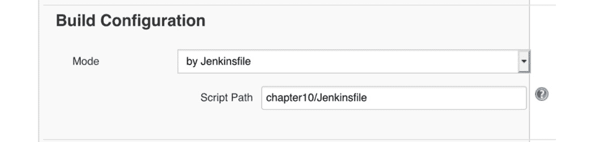
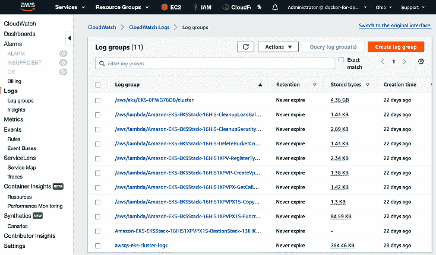
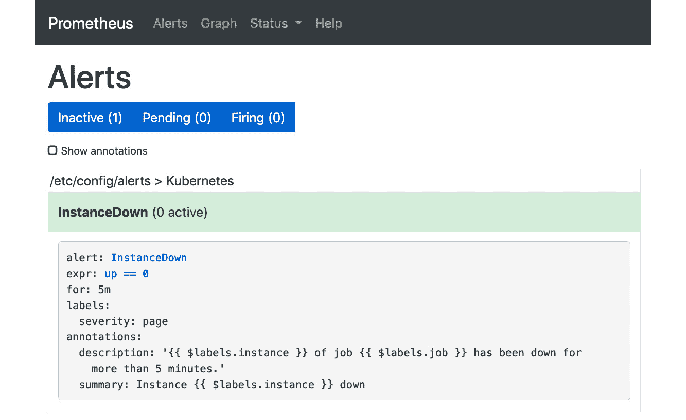
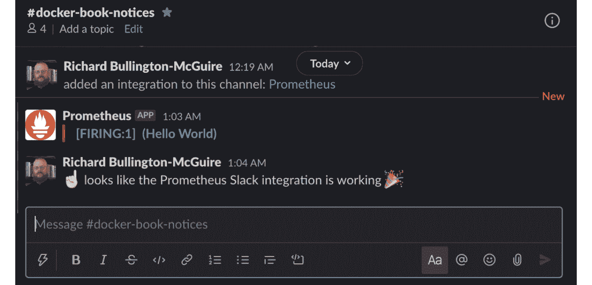
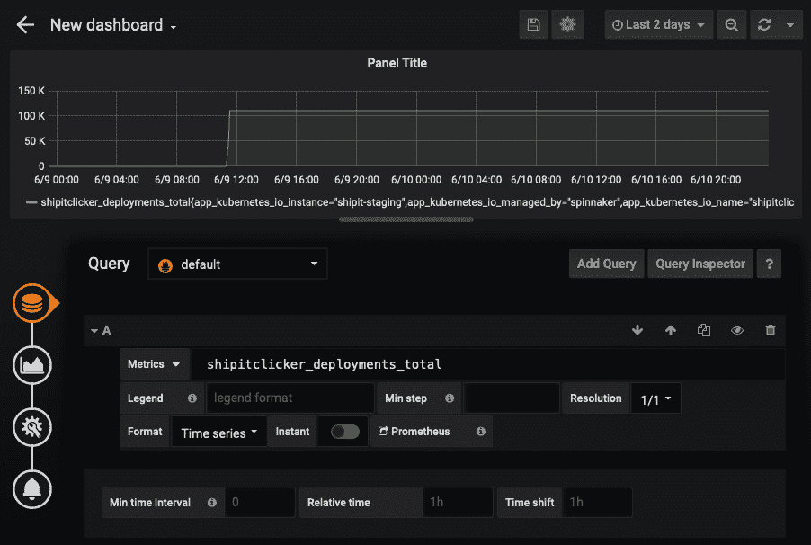
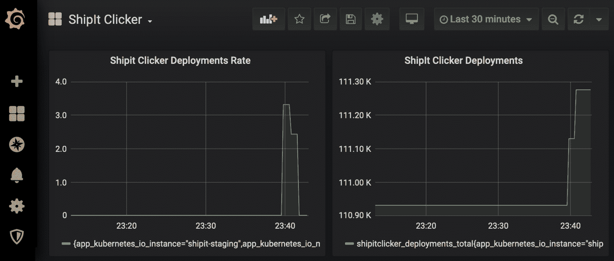
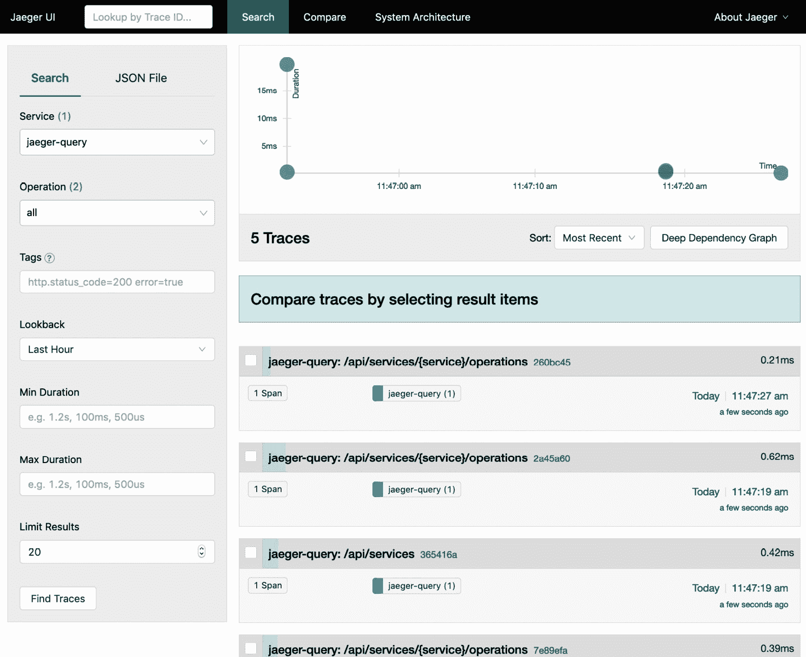
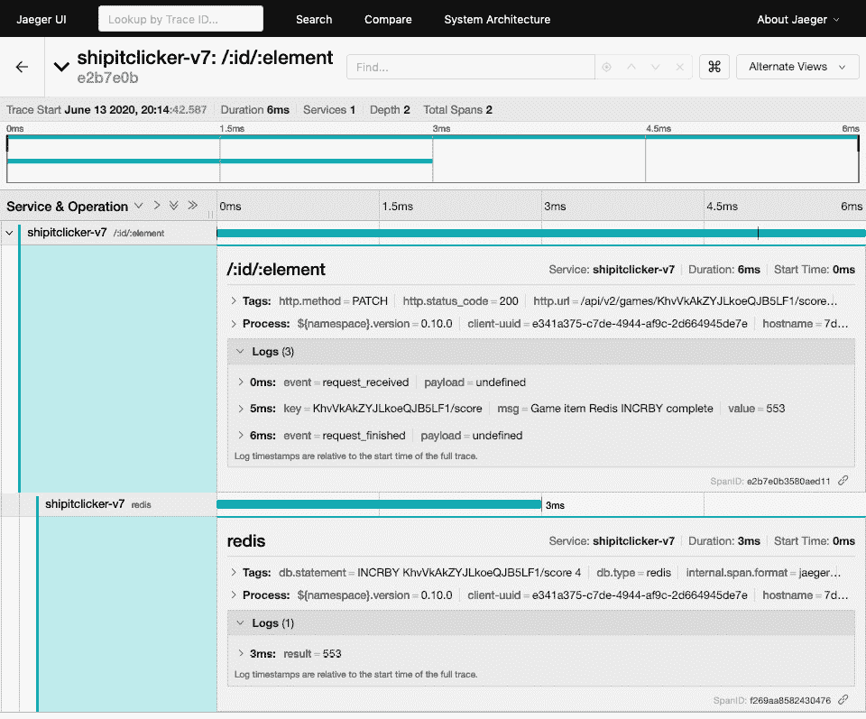

# *第十章*：使用 Prometheus、Grafana 和 Jaeger 监控 Docker

为了了解应用程序在生产环境中运行时的行为，开发人员和系统运维人员依赖于日志记录、监控和警报系统。这些系统既能洞察应用程序及其环境是否正常运行，又能在故障排除时提供线索。随着系统变得越来越复杂，对应用程序及其支持软件的深入洞察需求也在增加。那些能够在不修改运行系统代码的情况下深入检查所有这些问题的系统，可以被认为具有良好的**可观察性**特征。

本章将教你如何为你的应用程序及其运行时环境添加监控，以提高整个系统的可观察性。你将学习日志记录、监控和警报的许多方面。具体来说，你将学习如何查看、查询和存储来自 Kubernetes 集群的日志，既可以在集群内查看，也可以存储到 CloudWatch 和 Amazon **简单存储服务**（**S3**）。你将学习如何实现特定于云原生应用程序需求的存活性和就绪性探针，在出现问题时获取警报，并使用 Prometheus 捕获应用程序度量。你还将学习如何使用 Grafana 可视化性能和可用性指标。最后，我们将深入探讨通过 Jaeger 获取应用程序特定的代码和数据库层级的度量。

本章将涵盖以下主题：

+   Docker 日志记录和容器运行时日志记录

+   在 Kubernetes 中使用存活性和就绪性探针

+   使用 Prometheus 收集度量并发送警报

+   使用 Grafana 可视化操作数据

+   使用 Jaeger 进行应用程序性能监控

接下来，让我们确保你准备好测试这些系统，并学习如何将它们协同使用，以实现系统的可观察性。

# 技术要求

本章侧重于 Kubernetes 与一些 AWS 服务的集成，包括 CloudWatch、Kinesis 和 S3，因此你必须拥有一个具有管理员权限的有效 AWS 账户。你需要在 AWS 中拥有一个有效的 Kubernetes 集群，正如前一章中使用 AWS `eksctl` 设置的那样。

你还需要在本地工作站上安装当前版本的 AWS CLI、`kubectl` 和 `helm` 3.x，如前一章所述。本章中的 `helm` 命令使用的是 `helm` 3.x 语法。EKS 集群必须设置有有效的 ALB Ingress Controller。

你可以像前几章中设置的那样使用 Spinnaker 和 Jenkins 来部署本章中的应用程序，但这不是必需的。

查看以下视频，看看代码是如何运行的：

[`bit.ly/3iIqgvM`](https://bit.ly/3iIqgvM)

## 设置演示应用程序 – ShipIt Clicker v7

为了有一个样例应用进行仪表监控，我们将使用以下 GitHub 仓库中 `chapter10` 目录下的 ShipIt Clicker 版本：

[`github.com/PacktPublishing/Docker-for-Developers/`](https://github.com/PacktPublishing/Docker-for-Developers/)

本版本的应用相比上一章的版本有一些重要的生产就绪更新。它不再紧密依赖于特定的 Redis 安装，而是使用单独安装的 Redis 服务器。我们需要在安装最新版本的 ShipIt Clicker 之前，先将 Redis 集群部署到 Kubernetes 上。

为了准备我们的 Kubernetes 环境，既包括本地学习环境，也包括 AWS 云中的 EKS 集群，我们首先需要使用 Helm 安装 Redis。

### 从 Bitnami Helm 仓库安装 Redis

为了部署这个版本，我们将需要将 Redis 服务器独立部署，而不是将其与 ShipIt Clicker pod 一起部署。这代表了比之前章节中 ShipIt Clicker Kubernetes pod 中同时运行 Redis 服务器和无状态应用容器的场景更现实的情况。

我们将使用由 Bitnami 维护的 Redis 版本（[`bitnami.com/`](https://bitnami.com/)），它提供了独立的读取和写入端点。首先通过 Helm 部署 Redis，先在本地 Kubernetes 安装中，然后在你的云 Kubernetes 安装中（当你运行以下命令时，将 `docker-desktop` 和 AWS ARN 替换为你安装的上下文 ID）：

```
$ helm repo add bitnami https://charts.bitnami.com/bitnami
$ kubectl config use-context docker-desktop
$ helm install redis bitnami/redis
$ kubectl config use-context arn:aws:eks:us-east- 2:143970405955:cluster/EKS-8PWG76O8
$ helm install redis bitnami/redis
```

这将部署一个包含一个接受读写的节点和多个只读的副本节点的 Redis 集群。本章中的 ShipIt Clicker 版本已适配为使用此外部 Redis 服务，该服务通过 Kubernetes secret 存储用于身份验证的密码。

攻击性术语——master 和 slave 被认为是有害的

Bitnami Redis 模板和 Redis 本身使用 *master* 和 *slave* 的术语来描述分布式系统中节点的角色。请注意，尽管这些术语在信息技术中很常见，但许多人认为这些术语是过时且冒犯的。其他术语，例如 primary/secondary 或 reader/writer，传达相同的信息，但没有负面的含义。更多关于这个争议性问题的内容请参见这篇文章：

`medium.com/@zookkini/masters-and-slaves-in-the-tech-world-132ef1c87504`

接下来，让我们构建并安装 ShipIt Clicker 到我们的学习环境中。

本地安装最新版本的 ShipIt Clicker

接下来，我们将构建 ShipIt Clicker Docker 容器，标记它，并将其推送到 Docker Hub，正如我们在前面的章节中所做的那样。执行以下命令，将 `dockerfordevelopers` 替换为你的 Docker Hub 用户名：

```
$ docker build . -t dockerfordevelopers/shipitclicker:0.10.0
$ docker push dockerfordevelopers/shipitclicker:0.10.0
$ kubectl config use-context docker-desktop
$ helm install --set image.repository=dockerfordevelopers/shipitclicker:0.10.0 shipit-v7 shipitclicker
```

使用`kubectl get all`检查正在运行的 pods 和服务，以验证 pod 是否正在运行，记下其名称，然后使用`kubectl logs`查看启动日志。日志中不应有任何错误。

接下来，让我们在 EKS 上安装这个版本。

### 通过 ECR 在 EKS 上安装最新版本的 ShipIt Clicker

现在你已经构建了 Docker 容器并在本地安装了它，将其安装到 AWS EKS，通过`values.yaml`为其在 Route 53 区域中设置主机名，如`shipit-v7.eks.example.com`（将 ECR 引用替换为与你的 AWS 账户和区域对应的引用，并将`example.com`替换为你的域名）：

```
$ docker tag dockerfordevelopers/shipitclicker:0.10.0 143970405955.dkr.ecr.us-east-2.amazonaws.com/dockerfordevelopers/shipitclicker:0.10.0
$ aws ecr get-login-password --region us-east-2 | docker login --username AWS --password-stdin 143970405955.dkr.ecr.us-east-2.amazonaws.com
$ docker push 143970405955.dkr.ecr.us-east-2.amazonaws.com/dockerfordevelopers/shipitclicker:0.10.0
$ kubectl config use-context arn:aws:eks:us-east-2:143970405955:cluster/EKS-8PWG76O8
$ kubectl config use-context arn:aws:eks:us-east-2:143970405955:cluster/EKS-8PWG76O8
$ helm install shipit-v7 -f values.yaml --set image.repository=143970405955.dkr.ecr.us-east-2.amazonaws.com/dockerfordevelopers/shipitclicker:0.10.0 ./shipitclicker
```

检查 Kubernetes 日志，确保应用程序已成功部署到集群：

```
kubectl logs services/shipit-v7-shipitclicker
```

如果部署没有问题，获取 AWS ALB Ingress Controller 的入口地址，如前一章所述，并在 Route 53 控制台中为部署的应用程序创建 DNS 条目，使用 ALB 地址。然后，你应该能够通过类似`https://shipit-v7.eks.example.com/`的 URL 访问你的应用程序（将`example.com`替换为你的域名）。

### 本章 Jenkins 和 Spinnaker 的配置

你可能会想知道，是否可以使用你之前为本章设置的 Jenkins 和 Spinnaker 配置。可以，只需对 Jenkins 作业中的`Spinnaker`多分支管道项和 Spinnaker 管道定义做一些简单的配置更改。首先修复 Jenkins。编辑作业的配置并更改`chapter10/Jenkinsfile`，然后点击**保存**按钮：



图 10.1 – Spinnaker 多分支管道项的 Jenkins 构建配置设置

Jenkins 将重新扫描仓库，并使用来自`chapter10`的文件，而不是`chapter9`的文件。

然后，进入 Spinnaker，在配置管道阶段编辑用于暂存环境的管道，并将所有`chapter9`的引用更改为`chapter10`。

然后，你可以按照前一章中描述的使用`git push --force origin HEAD:staging`来触发 Spinnaker 的 Kubernetes 部署。

本章中 ShipIt Clicker 的 Helm 模板已经通过以下命令打包成一个归档文件`chapter10/helm.tar.gz`：

```
$ cd chapter10
$ helm package shipitclicker
Successfully packaged chart and saved it to: /Users/richard/Documents/Docker-for-Developers/chapter10/shipitclicker-0.10.0.tgz
$ mv shipitclicker-*.tgz helm.tar.gz
```

如果你更改了 Helm Charts 并且正在使用 Spinnaker，确保使用前面的命令重新打包`helm.tar.gz`文件，因为 Spinnaker 期望在该特定文件中找到这些 chart。

接下来，让我们详细了解 Docker 容器和容器运行时日志，例如 Kubernetes 控制平面的日志。

# Docker 日志和容器运行时日志

当你在排查应用程序问题时，拥有详细的日志对解决问题非常有帮助，包括来自应用程序本身和它运行的任何系统的日志。每个 Docker 容器，无论是在本地运行还是使用像 Kubernetes 这样的云容器运行时管理器运行，都生成自己的日志，你可以查询这些日志。

在前几章中，我们使用了`docker logs`命令和`kubectl logs`命令，以便在本地工作站和 Kubernetes 云环境中运行演示应用程序时检查日志。这些命令可以为您的系统提供有关事件的关键见解，包括应用程序日志消息以及错误和异常日志。它们仍然是您最常使用的基本工具；但是，特别是当我们需要使用 Kubernetes 扩展应用程序时，我们将需要一种更复杂的方法。

## 理解 Kubernetes 容器日志

每个在 Kubernetes pod 中运行的 Docker 容器都会产生日志。默认情况下，Kubernetes 运行时会临时存储每个运行中容器的最后 10MB 日志。这使得只需使用`kubectl logs`工具，就能对每个运行中的应用程序进行日志采样。当 pod 从节点上驱逐或容器重启时，*Kubernetes 将删除这些临时日志文件*；它*不会*自动将日志保存到永久存储中。如果您需要排查问题，尤其是当问题发生在很久之前，导致那些日志已经滚动，且较旧的日志条目无法获取时，这样的做法远非理想。

如前一章所示，您可以使用`kubectl`一次检查多个日志，针对显示多个 Spinnaker 容器日志，您还可以使用常见的命令行工具，如`grep`、`awk`、`jq`和`less`，对日志进行进一步的基本搜索和过滤。然而，日志滚动的问题会阻碍一些搜索尝试。

考虑到 Kubernetes 系统在日志保留和搜索方面的基本功能限制，明智的做法是探索如何缓解这些问题。接下来，让我们讨论我们希望日志管理系统具备的特点。

## 理想的日志管理系统特性

理想情况下，您希望使用具有以下某些特征的日志管理系统：

+   可以在中央控制台查看日志消息

+   从日志事件发生到可供搜索的延迟时间较低

+   从多个来源收集日志，包括 Kubernetes 对象，如 pods、节点、部署和 Docker 容器

+   易于使用的搜索界面，能够保存并重复使用临时查询

+   一种可视化搜索结果直方图的方式，支持通过点击和拖动图表来缩放图表（这一功能被称为*刷选*）

+   根据日志消息内容发送警报的方式

+   配置日志消息保留期限的方式

在过去的 20 年里，各种组织构建了许多优秀的日志存储和分析系统，包括以下第三方日志管理系统：

+   Splunk ([`www.splunk.com/`](https://www.splunk.com/))

+   Elasticsearch ([`www.elastic.co/`](https://www.elastic.co/))

+   Loggly ([`www.loggly.com/`](https://www.loggly.com/))

+   Papertrail ([`www.papertrail.com/`](https://www.papertrail.com/))

+   New Relic Logs ([`newrelic.com/products/logs`](https://newrelic.com/products/logs))

+   Datadog Log Management ([`docs.datadoghq.com/logs/`](https://docs.datadoghq.com/logs/))

云服务提供商还拥有出色的集成日志存储和分析系统，包括以下几种：

+   AWS CloudWatch ([`aws.amazon.com/cloudwatch/`](https://aws.amazon.com/cloudwatch/))

+   Google Cloud Logging ([`cloud.google.com/logging`](https://cloud.google.com/logging))

+   Microsoft Azure Monitor Logs ([`docs.microsoft.com/en-us/azure/azure-monitor/platform/data-platform-logs`](https://docs.microsoft.com/en-us/azure/azure-monitor/platform/data-platform-logs))

作为开发者或系统运维人员，你可以使用这些系统来存储和搜索日志条目。然而，为了做到这一点，你必须使用 **日志传输工具** 从日志源提取日志并将其转发到日志管理系统。

我们将很快探讨如何将 Kubernetes 容器日志转发到这些系统中的一个，但首先，让我们研究另一个关键系统方面：Kubernetes 控制平面的日志记录，它负责节点、Pod 以及 Kubernetes 对象家族的协调工作。

## 使用日志排查 Kubernetes 控制平面问题

如果你自己运行 Kubernetes 集群并管理控制平面服务器，可能会在排查系统级别问题时遇到困难。Kubernetes 故障排除指南提供了关于查看控制平面集群中各个机器日志文件的指导，这可能是一个痛苦的过程：

[`kubernetes.io/docs/tasks/debug-application-cluster/debug-cluster/`](https://kubernetes.io/docs/tasks/debug-application-cluster/debug-cluster/)

然而，如果你使用的是托管的 Kubernetes 服务，例如 AWS EKS，你将无法直接访问这些系统。你可能会问，*我该如何获取这些日志*？托管的 Kubernetes 服务提供商都有将这些日志转发到另一个系统的方式，以帮助故障排除。幸运的是，AWS EKS 提供了一个可选的配置设置，允许它将控制平面的日志直接转发到 CloudWatch：

[`docs.aws.amazon.com/eks/latest/userguide/control-plane-logs.html`](https://docs.aws.amazon.com/eks/latest/userguide/control-plane-logs.html)

如果你使用了 *第八章* 中描述的 AWS EKS 快速启动来创建 EKS 集群，系统会为你自动设置这一配置。你可以前往 `us-east-2` 区域的 CloudWatch Logs 控制台进行验证：[`us-east-2.console.aws.amazon.com/cloudwatch/home?region=us-east-2#logs:`](https://us-east-2.console.aws.amazon.com/cloudwatch/home?region=us-east-2#logs:)

你将看到类似以下的日志组列表：



图 10.2 – 显示 EKS 控制平面日志的 CloudWatch 日志组

主要的 Kubernetes 控制平面日志组将类似于 `/aws/eks/EKS-8PWG76O8/cluster`，但名称会包含你的 EKS 集群名称。你可以导航到这里，并通过控制台详细查看日志。

如果你使用 `eksctl` 创建了 EKS 集群，你可能没有启用 CloudWatch 日志记录。你可以使用这里的说明通过 `eksctl` 启用 EKS 的 CloudWatch 日志记录：

[`eksctl.io/usage/cloudwatch-cluster-logging/`](https://eksctl.io/usage/cloudwatch-cluster-logging/)

现在你已经验证了 EKS 集群控制平面日志已发送到 CloudWatch，并学习了如何基本查看日志，我们将继续在 CloudWatch Logs 中捕获其余的 Kubernetes 日志，并使用 CloudWatch Logs Insights 进行分析。

## 使用 CloudWatch Logs 存储日志

AWS 提供了一个云规模的服务，处理日志、时间序列度量、数据摄取、存储和分析，称为 **CloudWatch**。许多 AWS 服务，包括 EKS，都通过 CloudWatch 提供日志集成功能。像许多 AWS 服务一样，你只为实际使用的部分付费。你可以在 [`aws.amazon.com/cloudwatch/`](https://aws.amazon.com/cloudwatch/) 学习有关 CloudWatch 的基础知识。

我们在上一节中看到，AWS 允许我们配置 EKS 控制平面直接将日志发送到 CloudWatch。这很好，但如果我们要在一个中央位置管理日志，我们应该尽量将 *所有* 日志都存储在那里。

接下来，我们将了解如何通过 AWS 推荐的解决方案将更多日志发送到 CloudWatch，该解决方案在 EKS 文档中有所描述——Fluent Bit ([`fluentbit.io/`](https://fluentbit.io/))。

AWS 提供了一个关于如何在 EKS 上设置 Fluent Bit 的优秀教程，网址是 [`aws.amazon.com/blogs/containers/kubernetes-logging-powered-by-aws-for-fluent-bit/`](https://aws.amazon.com/blogs/containers/kubernetes-logging-powered-by-aws-for-fluent-bit/)。

本章稍后描述的脚本和配置文件灵感来源于并部分借鉴了那篇文章。

接下来，我们将学习如何使用脚本快速且可重复地安装 Fluent Bit 及其支持的 AWS 资源。

### 安装 Fluent Bit 以将日志发送到 CloudWatch

尽管你可以手动按照之前引用的 AWS 博客中的步骤操作，但为了简化这些操作并使其与 AWS EKS 快速启动更加无缝配合，你可以使用本章中的 `install-fluentbit-daemonset.sh` 脚本，以 DaemonSet 的形式在 EKS 集群中安装 Fluent Bit，并使用一个将日志发送到 CloudWatch Logs 的配置。将 EKS 集群的 CloudFormation 模板名称作为命令行参数传入：

```
chapter10/bin/install-fluentbit-daemonset.sh Amazon-EKS
```

配置 Fluent Bit 以与 AWS 配合使用，比与其他一些云平台配合使用要多一些工作；例如，如果你使用的是 Google Cloud Platform 的 GKE，它会为你自动安装。

一旦你将容器的日志流式传输到 CloudWatch，你可以使用 CloudWatch AWS 控制台查看容器日志以及控制平面日志。

### 更改 CloudWatch 日志保留周期

默认情况下，CloudWatch 会无限期地存储日志。为了节省日志存储费用，你应该考虑为 CloudWatch 日志设置相对较短的保留期限——例如 60 天。你可以通过控制台或命令行执行此操作，以下命令设置由 `install-fluentbit-daemonset.sh` 脚本创建的 `fluentbit-cloudwatch` 日志组的保留周期：

```
aws logs put-retention-policy --log-group-name fluentbit-cloudwatch --retention-in-days 60 --region us-east-2
```

你可能会考虑为每个 CloudWatch 日志组进行此操作，即使是由 AWS EKS 快速入门 CloudFormation 模板创建的日志组。

接下来，我们来看一下如何将日志存储到 S3 中。

## 使用 AWS S3 长期存储日志

为了经济高效地长期存储日志数据，可以使用廉价的云对象存储系统，如 Amazon S3（[`aws.amazon.com/s3/`](https://aws.amazon.com/s3/)）。

如果你有长期保留日志的严重需求——例如，如果你有一个敏感的金融应用程序，其中规定要求所有应用日志必须存储 5 年——S3 可能是一个不错的选择。你可以通过为存储桶设置 S3 生命周期规则，将对象迁移到更便宜的存储层，迁移到 Amazon Glacier（[`aws.amazon.com/glacier/`](https://aws.amazon.com/glacier/)），或使旧记录过期并删除，从而使长期存储更加经济实惠。

AWS 发布了一篇博客文章（[`aws.amazon.com/blogs/opensource/centralized-container-logging-fluent-bit/`](https://aws.amazon.com/blogs/opensource/centralized-container-logging-fluent-bit/)），概述了你可以使用 Kinesis Firehose 作为额外的 Fluent Bit 目标将日志流式传输到 S3 的路径。你可以按照博客中 *跨集群的日志分析* 部分的说明，将日志以这种方式流式传输到 S3，但这可能会比较具有挑战性，因为你需要以多种方式调整脚本，以适应 EKS 快速入门，包括更改 AWS 区域并假设你使用 `eksctl` 来设置集群。

一个名为 `CloudWatch2S3` 的项目，灵感来自于那篇博客，可以通过部署一个 CloudFormation 模板来帮助完成这个过程。它的优点是可以将 *所有* CloudWatch 日志组发送到 S3，并且你可以通过应用单个 CloudFormation 模板来安装它。它还可以收集来自多个 AWS 账户的 CloudWatch 日志，如果你选择这么做的话。克隆 GitHub 仓库 [`github.com/CloudSnorkel/CloudWatch2S3`](https://github.com/CloudSnorkel/CloudWatch2S3) 到你的工作站，并按照仓库中的指引来设置将 CloudWatch 日志流式传输到 S3。在继续之前，你可能考虑创建一个 Amazon **Key Management Service** (**KMS**) 密钥来加密 Kinesis Firehose 和 S3 存储桶的内容。根据需要，你可以使用 AWS 控制台或 CLI 安装 CloudFormation 模板。

现在我们已经了解了如何在 CloudWatch 和 S3 中存储日志，接下来学习如何查询这些日志会非常有用。

使用 CloudWatch Insights 和 Amazon Athena 分析日志

既然你已经在 CloudWatch 和 S3 中存储了日志，你可以使用 CloudWatch Insights 或 Amazon Athena 来查询这些日志。

### 使用 CloudWatch Insights 分析存储在 CloudWatch 中的日志

执行查询 AWS 中存储日志的最简单方法是使用 CloudWatch Insights。这个基于 Web 的查询接口提供了一个交互式查询构建器，并且能够以直方图和表格数据格式可视化结果。它具备保存查询管理器的功能，这是一个关键功能，因为它让你能够构建并优化一组可以跨越一个或多个日志组的查询。有关 CloudWatch Insights 的文档可以参考 [`docs.aws.amazon.com/AmazonCloudWatch/latest/logs/AnalyzingLogData.html`](https://docs.aws.amazon.com/AmazonCloudWatch/latest/logs/AnalyzingLogData.html)。

你可以在 AWS 控制台中探索该服务的示例查询，以更好地了解 CloudWatch Insights 提供的功能。

## 使用 AWS Athena 分析存储在 S3 中的日志

当日志存储在 S3 中时，你无法以与使用 CloudWatch Insights 或其他日志管理系统完全相同的方式进行查询。然而，仍然有方法可以高效地查询存储在 S3 中的日志。最直接的方法是使用一个名为 Amazon Athena 的查询工具：

[`aws.amazon.com/athena/`](https://aws.amazon.com/athena/)

Athena 允许你使用类似 SQL 的查询语言查询存储在 S3 存储桶中的半结构化数据。你按照查询付费，费用根据扫描的数据量和所需的处理时间来计算。为了让 Athena 理解你的 S3 数据的结构，你需要使用 AWS Glue 目录配置虚拟表：

[`docs.aws.amazon.com/athena/latest/ug/glue-athena.html`](https://docs.aws.amazon.com/athena/latest/ug/glue-athena.html)

设置 AWS Glue 和 Athena 的组合相当复杂，超出了本章内容的范围。有关设置 Athena 以便查询存储在 S3 中的数据的更多信息，请参阅本章末尾的 *进一步阅读* 部分中的链接。

练习 – 查找玩过的 ShipIt 点击器游戏数量

ShipIt 点击器演示应用程序每当启动一个游戏时都会发出如下形式的日志信息：

```
{"level":30,"time":1591067727743,"pid":17,"hostname":"shipit-staging-shipitclicker-776c589c4f-z9tgg","name":"Shipit-Clicker -shipit-staging","msg":"Game created in Redis","key":"WWoor1SAYT_H98G4DDR-T","value":"OK","v":1}
```

在 CloudWatch Insights 中创建一个查询，计算已创建的游戏总数。对于 CloudWatch Insights，你需要选择 `fluentbit-cloudwatch` 日志组。

### 解决方案

请参考以下文件获取解决方案：

[`github.com/PacktPublishing/Docker-for-Developers/tree/master/chapter10/cloudwatch-insights.txt`](https://github.com/PacktPublishing/Docker-for-Developers/tree/master/chapter10/cloudwatch-insights.txt)

# 在 Kubernetes 中使用存活性、就绪性和启动探针

Kubernetes 有多种类型的健康检查，称为 **探针**，用于确保其运行的 Docker 容器能够处理流量。你可以在[`kubernetes.io/docs/tasks/configure-pod-container/configure-liveness-readiness-startup-probes/`](https://kubernetes.io/docs/tasks/configure-pod-container/configure-liveness-readiness-startup-probes/)中详细阅读它们。

探针的类型处理不同的关注点：

+   **存活性**：确定应用程序是否能够处理请求。

+   **就绪性**：确定容器是否已准备好接收真实流量，特别是当容器依赖于必须可访问或已连接的外部资源时。

+   **启动**：确定容器是否准备好开始接收另外两种类型的流量，适用于启动较慢的传统应用程序，给它们时间启动。由于这些探针主要用于传统应用程序，我们将不会详细讨论它们。

你可以配置探针在运行中的容器内执行命令、进行 TCP 端口检查或检查 HTTP 端点。探针有合理的默认超时和检查间隔值——默认情况下，探针每 10 秒检查一次，并在 1 秒内超时失败。默认情况下，探针必须连续失败三次才会进入失败状态，必须成功一次才会进入成功状态。你可以通过模板注解覆盖这些值，例如在 Helm Charts 中的 `deployment.yaml` 文件中。

如果容器的存活性探针失败足够多次，Kubernetes 将终止容器并重启它。如果一个 Pod 中容器的就绪性探针失败，Kubernetes 将不会将依赖该 Pod 的服务的流量指向该容器。接下来，我们将详细探讨存活性和就绪性探针。

## 使用存活性探针查看容器是否能够响应

对于像 ShipIt Clicker 这样的服务，一个好的存活检查是，应用程序可以完全依赖内部配置的资源进行响应——例如，依赖于部署在同一 pod 中的容器。在前几章中，应用程序的存活和就绪检查是通过 HTTP 获取 `/` 资源进行的。本章的存活检查保持不变，因为能够提供一个简单的 HTML 页面是 Express 应用程序的一个不错的存活检查。请查看以下来自 `chapter10/shipitclicker/templates/deployment.yaml` 的片段：

```
          livenessProbe:
            httpGet:
              path: /
              port: http
```

这使得 Express 提供 `chapter10/src/public/index.html` 文件。这个做法提供了一个不错的存活探针，但它并不意味着 pod 已准备好处理需要访问外部资源的请求。为此，我们应该使用就绪探针。

使用就绪探针来确保服务能够接收流量

一些应用程序需要完成一系列初始化操作，比如进行数据库调用和调用外部服务，才能准备好接收流量。对于 ShipIt Clicker，应用程序必须在准备好接收流量之前能够联系到 Redis。接下来，我们将检查 ShipIt Clicker 早期版本中的缺陷，以及为了支持存活和就绪探针所做的修复，因为这些变化是你在应用程序中可能会遇到的更改的典型示例。

## 更改 ShipIt Clicker 以支持独立的存活和就绪探针

ShipIt Clicker 的早期版本会在连接 Redis 失败时遇到致命异常。只要 `src/server/index.js` 中的初始化例程加载，这种情况就会发生，因为它加载的模块会实例化位于 `src/server/api/services/redis-service.js` 的 `RedisDatabase` 类，而该类会立即连接到 Redis 服务器。这个类缺少 Redis 错误处理程序，因此抛出的错误是致命的，会导致进程终止。

这个故障会立即重复，因为 Kubernetes 尝试启动另一个容器，并触发一系列崩溃，进而激活 Kubernetes 崩溃循环检测器。

`chapter10/src/server/api/services/redis.service.js` 中 `RedisDatabase.init()` 方法的新错误处理程序如下所示，它将所有 Redis 错误记录到控制台——因此，也会记录到 Kubernetes 日志系统——以便更容易进行故障排除：

```
   client.on("error", err => l.error({msg: "Redis error", err:err}));
```

本章的代码还采用了懒加载模式，避免在类实例化时立即连接 Redis。通过懒加载，你将对象或资源的创建推迟到实际需要时。我们通过 `RedisDatabase.instance()` 方法实现了懒加载，该方法使用了 Redis 客户端连接的单例设计模式：

```
  instance() {
    return this._client ? this._client : this._client = this.init();
  }
  async ping() {
    return this.instance().pingAsync();
  }
```

使用懒加载将允许我们推迟连接 Redis 服务器，直到到达一个真正需要它的请求。回想一下，在这个版本的应用程序中，我们将 Redis 服务器从 ShipIt Clicker 服务中拆分出来，并单独运行。鉴于此，准备探针应该连接到 Redis 服务器，并确保 ShipIt Clicker 确实可以与它通信，然后再接受流量。这个版本有一个新的 API 端点 `/api/v2/games/ready`，它执行 Redis 的 `PING` 操作以确保应用程序准备好接收流量：

```
          readinessProbe:
            httpGet:
              path: /api/v2/games/ready
              port: http
```

如果 Redis 服务器不可用，则此就绪探针将失败，Kubernetes 将从服务中移除未通过健康检查的容器。

## 练习 – 强制 ShipIt Clicker 失败就绪检查

接下来，我们将进行一个实验，看看当存活探针通过但就绪检查失败时会发生什么。使用 `kubectl` 切换到本地学习环境的 Kubernetes 上下文。暂时更改 `chapter10/shipitclicker/template/configmap.yaml` 文件，修改 `REDIS_PORT` 值为无效数字，例如 `1234`，以破坏 Redis 安装。然后，使用 Helm 安装替代名称为 `shipit-ready-fail` 的 chart。使用 `kubectl get pods` 验证新 pod 的状态为 `RUNNING`，但标记为 `READY` 的 pod 数量为 `0/1`。你的输出应该类似于以下内容：

```
$ kubectl get pods | grep -E '^NAME|fail'
NAME                                               READY   STATUS    RESTARTS   AGE
shipit-ready-fail-shipitclicker-57c67d76cd-qklh6   0/1     Running   0          3m20s
```

这个安装版本的 ShipIt Clicker 的准备检查将立即开始失败。如果你描述这个 pod，你会看到它不再是就绪状态。当你完成后，使用 Helm 卸载 `shipit-ready-fail` chart，并将 `configmap.yaml` 文件中的值恢复为原始值。

# 使用 Prometheus 收集指标并发送警报

Prometheus 是一个主导的基于 Kubernetes 的系统，用于收集集群操作的指标数据。Prometheus 提供了与处理时间序列数据、可视化数据、查询数据和基于指标数据发送警报相关的广泛功能。

这些指标数据可能包括多种时间序列数据，例如节点和 pod 的 CPU 使用情况；存储利用率；由就绪探针定义的应用程序健康状况；以及其他特定于应用程序的指标。Prometheus 使用拉取模型，它会定期轮询端点以获取数值数据。支持 Prometheus 的 Pods、DaemonSets 以及其他 Kubernetes 资源通过注解声明 Kubernetes 应该通过 HTTP 从它们那里抓取指标数据，通常是通过 `/metrics` 端点。这可能包括来自节点的数据，通过一个名为 `node_exporter` 的 DaemonSet 来暴露该数据，该 DaemonSet 在每个节点上运行。

它通过将接收到的指标数据与指标名称以及键值对格式的标签集合关联，并附带毫秒分辨率的时间戳来存储这些数据。这种标签方式不仅允许高效存储，还可以在时间序列数据库中查询这些指标。系统管理员和自动化系统可以查询此数据库，以调查系统的健康状况和性能。

它不仅提供了一个时间序列数据库用于存储指标，还提供了一个警报子系统，帮助系统管理员在应用程序遇到问题时主动采取措施。

你可以在[`prometheus.io/docs/introduction/overview/`](https://prometheus.io/docs/introduction/overview/)了解更多关于 Prometheus 的整体架构和功能。

## Prometheus 的历史

虽然 Prometheus 最初是由 SoundCloud 于 2012 年开发的，但它在 2016 年成为了**云原生计算基金会**（**CNCF**）的顶级项目，并且它独立于任何单一公司，就像 Kubernetes 本身一样。它的设计灵感来自 Google 的 Borgmon 系统。

## 通过查询和图形网页界面探索 Prometheus

如果你按照*第八章*中描述的方式，使用 AWS EKS 快速启动 CloudFormation 模板安装了 EKS 集群，*部署 Docker 应用到 Kubernetes*，你应该已经有一个可以工作的 Prometheus 应用程序。如果没有，你可以按照此处的说明使用 Helm 安装它：

[`docs.aws.amazon.com/eks/latest/userguide/prometheus.html`](https://docs.aws.amazon.com/eks/latest/userguide/prometheus.html)

你可以通过使用`kubectl`创建一个端口转发代理连接到 Prometheus 服务并开始探索它。你应该按如下方式将`prometheus-server` Kubernetes 服务连接到本地工作站（将`use-context`后的表达式替换为你的 AWS EKS 集群 ARN）：

```
$ kubectl config use-context arn:aws:eks:us-east-2:143970405955:cluster/EKS-8PWG76O8
$ kubectl port-forward -n prometheus service/prometheus-server 9090:80
```

然后，打开一个网页浏览器并访问`http://localhost:9090/`，你将看到 Prometheus 查询控制台。

一个很好的初学者查询是使用`node_load1`，它显示了底层 Kubernetes 节点的 1 分钟负载平均值。将其输入查询字段并点击**执行**按钮，然后激活**图形**选项卡。你将看到一个显示负载平均值的图表。

**Prometheus 查询语言**叫做**PromQL**，它与其他时间序列数据库查询语言非常不同。你需要学习更多关于 PromQL 的内容，以便编写自己的查询。在`medium.com/@valyala/promql-tutorial-for-beginners-9ab455142085`上阅读更多相关内容。

虽然 Prometheus 可以独立绘制查询结果的图表，但 Kubernetes 用户通常会将 Grafana 与 Prometheus 一起使用，以提供更复杂的图表和仪表盘。我们将在本章后面深入探讨 Grafana。接下来，我们将研究如何将 Prometheus 指标添加到应用程序中。

## 向应用程序添加 Prometheus 指标

为了将应用程序与 Prometheus 集成，您需要通过 Prometheus 客户端库暴露一个特殊结构的 HTTP API。Prometheus 为多种语言提供官方客户端库，社区也为其他语言创建了许多客户端库。您可以在 Prometheus 文档中阅读更多关于一般过程的内容，链接为 [`prometheus.io/docs/instrumenting/clientlibs/`](https://prometheus.io/docs/instrumenting/clientlibs/)。

为了演示这个集成，本章中的 ShipIt Clicker 版本暴露了默认指标集和一个名为 `shipitclicker_deployments_total` 的自定义计数器指标。为了做到这一点，我们通过 Node.js 集成了用于 JavaScript 应用程序的 Prometheus 客户端：

[`github.com/siimon/prom-client`](https://github.com/siimon/prom-client)

为了执行集成，我们通过 `npm install prom-client --save` 命令安装并保存了 prom-client Node 模块，然后根据提供的示例代码，松散地集成了客户端，参考链接为 [`github.com/siimon/prom-client/blob/master/example/server.js`](https://github.com/siimon/prom-client/blob/master/example/server.js)。

### 启用指标的 ShipIt Clicker 程序结构

ShipIt Clicker 中的 Prometheus 指标发布代码在结构上遵循了使用 Express 框架编写的 Node 应用程序的常规方式，指标路由被添加到与游戏 API 路由相同的模块化模式中的主路由 `chapter10/src/server/routes.js`。主路由导入了 `chapter10/src/server/api/controllers/metrics/router.js`，该路由定义了 `/metrics` 和特殊路由 `/metrics/shipitclicker_deployment_total` 的 HTTP 路由，并使用 `chapter10/src/server/api/controllers/metrics/controller.js` 中定义的控制器类。该控制器包含与位于 `chapter10/src/server/api/services/prometheus.service.js` 中定义的 Prometheus 服务类集成的方法，该服务类与 `prom-client` 库集成并暴露了默认指标以及自定义的 `shipitclicker_deployments_total` 指标。请参考以下服务代码摘录，了解我们如何封装 `prom-client` 库：

```
import * as client from 'prom-client';
…
export class Prometheus {
…
    this.register = client.register;
    this.deploymentCounter = new client.Counter({
      name: 'shipitclicker_deployments_total',
      help: 'Total of in-game deployments in this ShipIt Clicker process',
    });
    client.collectDefaultMetrics({
      timeout: 10000,
      gcDurationBuckets: [0.001, 0.01, 0.1, 1, 2, 5],
    });
  }
}
export default new Prometheus();
```

提供指标的控制器类具有适当的异常处理和错误日志记录框架，而 `prom-client` 的基础示例中缺少这些功能。如果您愿意，您可以轻松地将路由器、控制器和服务类适配到新应用程序中，几乎不需要额外的工作。

为了简化故障排除，度量指标与应用程序的其余部分绑定在同一个 HTTP 端口：端口 `3000`。这意味着你可以从任何安装了 ShipIt Clicker 并集成了此代码的版本中获取度量指标——例如，从 [`shipit-v7.eks.example.com/metrics`](https://shipit-v7.eks.example.com/metrics)（将 `example.com` 替换为你的域名）。你应该会看到一长串度量指标，以下列内容为开头：

```
# HELP shipitclicker_deployments_total Total of in-game deployments in this ShipIt Clicker process
# TYPE shipitclicker_deployments_total counter
shipitclicker_deployments_total 0
# HELP process_cpu_user_seconds_total Total user CPU time spent in seconds.
# TYPE process_cpu_user_seconds_total counter
process_cpu_user_seconds_total 2.5176489999999996
…
```

现在我们已经看到了原始度量指标，让我们检查一下让 Prometheus 发现演示应用程序的配置是如何工作的。

### 让 Prometheus 发现 ShipIt Clicker 应用程序

通过 AWS EKS 快速启动 CloudFormation 模板配置的 Prometheus 安装已配置为执行支持 Prometheus 度量指标的 Pod 的服务发现。为了使你的 Kubernetes Pod 被发现，它们必须带有 Prometheus 特定的元数据注释，包括 `prometheus.io/scrape: "true"` 注释。请参阅 `chapter10/shipitclicker/template/deployment.yaml`，了解用于将 ShipIt Clicker 暴露给 Prometheus 的注释：

```
  template:
    metadata:
      labels:
        {{- include "shipitclicker.selectorLabels" . | nindent 8 }}
      annotations:
        prometheus.io/scrape: "true"
        prometheus.io/port: "3000"
```

只要这些注释存在于 Pod 上，Prometheus 就会知道必须抓取 Pod 的 `/metrics` 端点以获取数据。

现在我们已经看到程序及其配置模板是如何扩展以支持 Prometheus 度量指标的，让我们查询 Prometheus 以获取自定义度量指标。

## 查询 Prometheus 以获取自定义度量指标

在 [`shipit-v7.eks.example.com/`](https://shipit-v7.eks.example.com/) 上玩游戏一两分钟（将 `example.com` 替换为你的域名）。然后，使用本章前面解释的端口转发方法连接到 Prometheus 控制台，并发出查询 `shipitclicker_deployments_total`，然后切换到 `Graph` 标签。你应该会看到一张图表，显示随着时间推移，部署数量不断增加。

如果你继续玩游戏并在 Prometheus 控制台中持续重新发出查询，你将看到部署数量增加。Prometheus 使用的默认抓取间隔和目标定义在 `prometheus.yml` 文件中，该文件嵌入在 `prometheus-server` ConfigMap 中，位于 `prometheus` 命名空间内。默认情况下，抓取间隔设置为 `30` 秒，因此你不会看到 Prometheus 查询结果的即时变化。

接下来，让我们探索 Prometheus 对警报的支持。

## 配置 Prometheus 警报

Prometheus 具有定期自我查询的能力，以检测重要的条件——这是警报系统的基础。你可以应用强大的 Prometheus 查询语言来检测系统中具有 Prometheus 度量指标的部分是否过载、响应过慢或不可用。

对于大多数应用程序，基础告警项必须回答的问题是 *应用程序是否可用*？如果应用程序正在运行，它就准备好为用户请求提供服务。Prometheus 有一个名为 `up` 的指标，可以帮助回答这个问题 – 如果服务可用，它的值为 `1`，如果不可用，则为 `0`。如果你查询 Prometheus 中的 `up`，你将看到它监控的每个服务的基本可用性状态。如果任何服务的值不是 `1` 且持续 5 分钟或更长时间，你可能会想要触发告警。这是 Prometheus 文档中给出的告警基础示例（参见 [`prometheus.io/docs/prometheus/latest/configuration/alerting_rules/`](https://prometheus.io/docs/prometheus/latest/configuration/alerting_rules/)）。接下来，我们将展示如何将文档中的 `InstanceDown` 示例规则添加到我们的 Prometheus 服务配置中。

AWS EKS 快速启动模板中的 Prometheus 安装最初没有定义告警，因此我们需要自己定义一个或多个告警。如果你在本地工作站上安装了 Prometheus，你将编辑 `/etc` 目录中的配置文件来完成此操作，然后触发配置文件的重新加载。然而，在 Kubernetes 设置中，必须有另一个机制来允许编辑这些值。

AWS EKS 快速启动 Prometheus 设置使用了一个位于 `prometheus` 命名空间中的 Kubernetes ConfigMap，名为 `prometheus-service`，该 ConfigMap 内嵌了多个 YAML 配置文件，并且在每个 Prometheus 服务器 Pod 中运行一个容器（参见 [`github.com/jimmidyson/configmap-reload`](https://github.com/jimmidyson/configmap-reload)），该容器监控 ConfigMap 文件的变化，并向 Pod 中运行的 Prometheus 服务器发送 HTTP `POST` 请求，触发其重新加载更改。ConfigMap 文件每分钟更新一次。编辑告警配置的周期如下所示：

1.  使用 `kubectl` 编辑 `prometheus-service` ConfigMap。

1.  等待 1 分钟，直到 ConfigMap 更改传播到 Pods。

1.  通过端口转发的 Prometheus 控制台查看告警，地址为 `http://localhost:9090/alerts`。

为了添加监控，我们运行以下命令来编辑 ConfigMap，并在 `alerts:` 部分下添加规则，如下所示：

```
kubectl -n prometheus edit configmap/prometheus-server
```

查看文件顶部，并使`alerts:`部分与以下文本匹配：

```
apiVersion: v1
data:
  alerting_rules.yml: |
    {}
  alerts: |
    groups:
    - name: Kubernetes
      rules:
      - alert: InstanceDown
        expr: up == 0
        for: 5m
        labels:
          severity: page
        annotations:
          summary: "Instance {{ $labels.instance }} down"
          description: "{{ $labels.instance }} of job {{ $labels.job }} has been down for more than 5 minutes."
  prometheus.yml: |
```

编辑完文件后，保存它，文件将在 1 分钟内传播到 Pods。

故障排除提示 – YAML 格式文件要求严格

`prometheus-server` Pods 中的大小写和空格问题）– 或者更糟糕的是，无法添加你打算设置的告警。

然后，你应该能在 Prometheus 控制台的 **Alerts** 部分看到告警定义；点击 **InstanceDown**，应该能显示告警定义：



图 10.3 – 显示 `InstanceDown` 的 Prometheus 告警

现在你已经定义了警报，你可以配置 Prometheus 根据该警报发送通知。

## 使用 Prometheus Alertmanager 发送通知

Prometheus 最强大的功能之一就是它支持通过名为 **Alertmanager** 的组件发送警报通知。该组件从 Prometheus 获取原始警报信息，进行进一步处理，然后发送通知。你可以在 [`prometheus.io/docs/alerting/overview/`](https://prometheus.io/docs/alerting/overview/) 找到 Prometheus 警报的详细概述。

该警报系统支持多个渠道，包括电子邮件、PagerDuty、Pushover、Slack 等，均通过 webhooks 实现。我们将配置一个 Slack 集成，演示如何发送警报。为此，我们将修改存储在名为 `prometheus-alertmanager` 的 Kubernetes ConfigMap 中的 Alertmanager 配置。

要添加 Slack 集成，确保你有一个通过浏览器登录的 Slack 帐户，然后访问 [`api.slack.com/`](https://api.slack.com/)，为 Slack 创建一个新应用。在 **Features** 配置屏幕中，配置一个新的 incoming webhook，并选择一个 Slack 渠道接收通知。然后，将 incoming hook 的 URL 复制到剪贴板，并将其存储在本地文本文件中。配置 Alertmanager 时需要用到它。配置你认为相关的其他设置，包括 Slack 集成的图标。然后，使用以下命令编辑 Alertmanager 的 ConfigMap：

```
kubectl -n prometheus edit configmap/prometheus-alertmanager
```

ConfigMap 中将会有一个空的 `{}` 子句用于 `global:` 部分，我们将删除它，然后添加 `slack_api_url` 和 `slack_configs` 部分，具体如下（将单引号中的值替换为来自 Slack 应用的 incoming webhook URL，并将频道替换为 Slack 频道的 hashtag 名称，警报将在该频道中显示）：

```
apiVersion: v1
data:
  alertmanager.yml: |
    global:
      slack_api_url: 'https://hooks.slack.com/services/A/B/C'
    receivers:
    - name: default-receiver
      slack_configs:
      - channel: '#docker-book-notices'
    route: 
```

这将为你提供一个非常基础的警报设置，你可以在此基础上扩展，获取停机的通知。你可以通过 Prometheus Alertmanager API 发送测试警报来测试 Alertmanager 是否已经连接。首先，将 Alertmanager 服务的端口转发到本地机器：

```
kubectl -n prometheus port-forward service/prometheus-alertmanager 9093:80
```

在另一个控制台窗口中，输入以下命令：

```
curl  -d '[{"status": "firing", "labels":{"alertname":"Hello World"}}]' -H "Content-Type: application/json" http://localhost:9093/api/v1/alerts
```

你应该从 `curl` 命令中收到 `{"status":"success"}` 响应，然后你应该在你的 Slack 中看到 `Hello World` 警报：



图 10.4 – Prometheus 警报在 Slack 中

练习 - 部署一个故障的 ShipIt Clicker，期待 AlertManager 通知

编辑 `chapter10/shipitclicker/templates/deployment.yaml` 文件，将 Prometheus 探针重定向到端口 `3001`，并使用 Helm 部署这个损坏的 ShipIt Clicker 应用程序，以查看警报的实际效果。将应用程序命名为 `shipit-broken`。检查 Prometheus 控制台，验证警报进入待处理状态。这应该在 1 分钟以内发生。10 分钟内，您应该会在 Slack 上看到类似 `[FIRING:1] (InstanceDown shipit-broken shipitclicker 10.0.87.39:3000 kubernetes-pods default shipit-broken-shipitclicker-6658f47599-pkxwk 6658f47599 page)` 的警报。收到警报后，卸载 `shipit-broken` Helm Chart，恢复 `deployment.yaml` 文件的更改，您应该不再收到该特定问题的通知。

一旦收到警报，卸载 `shipit-broken` Helm Chart，您应该不再收到关于该特定问题的通知。

## 深入探索 Prometheus 查询和外部监控

关于如何构建 Prometheus 查询以及如何扩展 Prometheus 以监控外部系统的话题非常深入，超出了本章的范围。请查阅 Prometheus 文档以及本章末尾的 *进一步阅读* 部分，了解更多关于创建 Prometheus 查询和配置它以使用额外的指标数据源的信息。

接下来，让我们看看如何使用 Grafana 来可视化 Prometheus 收集的数据。

# 使用 Grafana 可视化操作数据

Prometheus 通常与 Grafana 一起部署（[`grafana.com/`](https://grafana.com/)），以提供复杂的仪表板和更精密的监控 UI。AWS EKS 快速启动中安装的 Kubernetes 包含了 Grafana，并配置了一些仪表板。让我们来探索 Grafana 安装并看看它是如何与 Prometheus 集成的。

## 获取 Grafana 访问权限

Grafana 安装默认通过 Kubernetes LoadBalancer 暴露，在 EKS 中，它会为实际的 ELB DNS 名称创建一个 AWS EC2-Classic `EXTERNAL-IP` 字段：

```
$ kubectl -n grafana get service
NAME      TYPE           CLUSTER-IP    EXTERNAL-IP                                                               PORT(S)        AGE
grafana   LoadBalancer   172.20.5.46   aaa-bbb.us-east-2.elb.amazonaws.com   80:30669/TCP   39d
```

将该 DNS 地址放入您的网页浏览器中，前缀加上 `http://`，您将看到 Grafana 登录界面。您需要从 Kubernetes 密钥中获取管理员用户名和密码才能登录：

```
$ kubectl -n grafana get secrets/grafana --template='{{index .data "admin-user"}}' | base64 -D
[username redacted]
$ kubectl -n grafana get secrets/grafana --template='{{index .data "admin-password"}}' | base64 -D [password redacted]
```

使用这些值登录到 Grafana 控制台。然后，您可以探索 UI，包括仪表板和 Prometheus 查询浏览器。某些仪表板可能没有完全填充数据，例如 **Kubernetes All Nodes** 仪表板，但无需过于担心，因为可以添加社区提供的详细且完全填充集群统计数据的仪表板。查看 **Kubernetes Pods** 仪表板并选择不同的 Pod，包括 Redis Pod 和 ShipIt Clicker Pod，以了解如何使用仪表板。使用右上角的控件更改时间窗口，以显示一天或一周的数据，然后点击并拖动感兴趣的区域进行缩放。

接下来，我们将添加一些社区提供的仪表板，以便体验系统所能提供的全部功能。

## 添加社区提供的仪表板

Grafana 提供了一个官方和社区提供的仪表板仓库，地址为 [`grafana.com/grafana/dashboards`](https://grafana.com/grafana/dashboards)。

这些仪表板包含种类繁多的选项。你应该根据自己的需求，详细探索这些仪表板。

当你添加一个仪表板时，其中一个选项是 **Import**。选择这个选项后，它会要求你输入社区网站的仪表板 ID 或 URL。

以下是四个值得添加到你的安装中的通用仪表板：

+   **Cluster Monitoring for Kubernetes**：这个来自 Pivotal Observatory 的紧凑型仪表板让你一眼就能看到哪些 Pod 消耗了最多的 CPU、内存和网络资源 – [`grafana.com/grafana/dashboards/10000`](https://grafana.com/grafana/dashboards/10000)。

+   **Kubernetes Cluster (Prometheus)**：一个简洁的仪表板，展示了集群范围内的关键指标 – [`grafana.com/grafana/dashboards/6417`](https://grafana.com/grafana/dashboards/6417)。

+   **1 Node Exporter for Prometheus Dashboard EN v20191102**：一个集群级的复杂仪表板，展示了许多 CPU、磁盘和网络指标 – [`grafana.com/grafana/dashboards/11074`](https://grafana.com/grafana/dashboards/11074)。

+   **Node Exporter Full**：这是一个展示 **Prometheus Node Exporter** 所有可能指标的仪表板，网站上非常受欢迎，下载量超过两百万次 – [`grafana.com/grafana/dashboards/1860`](https://grafana.com/grafana/dashboards/1860)。

## 添加一个自定义查询的新仪表板

添加自定义查询的新仪表板的步骤如下：

1.  在左侧菜单中，点击 **+** 图标以添加新的仪表板。然后，在 **New Panel** 区域，点击 **Add Query**。在 **Metrics** 旁边的字段中添加以下查询：

    ```
    shipitclicker_deployments_total
    ```

    它应该看起来像这样：

    

    图 10.5 – Grafana 自定义仪表板项目定义

1.  然后，在 `ShipIt Clicker Deployments` 中，点击屏幕左上角的左箭头，返回定义小部件的界面。

1.  在顶部菜单中，点击带有加号的图表以添加另一个小部件：

    图 10.6 – Grafana 添加小部件

1.  添加另一个类似的面板，使用以下查询并设置标题为 `ShipIt Clicker Deployments Rate`：

    ```
    rate(shipitclicker_deployments_total[2m])
    ```

1.  然后，点击顶部菜单中的齿轮图标，将仪表板的名称更改为 `ShipIt Clicker Dashboard`，然后保存仪表板。

1.  接下来，休息一下，玩几分钟的 ShipIt Clicker 游戏。这将生成你可以在图表中看到的流量。停止游戏几分钟后，你的仪表板可能会看起来像这样：



图 10.7 – Grafana 中的 ShipIt Clicker 自定义仪表板

理解速率和计数器

请注意，在停止播放后，速率仪表板会回落到 0，但仅计算总数的仪表板会继续增加并保持不变。在 Prometheus 中选择以 `total` 结尾的速率查询通常是您想要测量吞吐量的方式。

现在我们已经了解了如何使用 Grafana 绘制应用程序指标并构建仪表板，接下来让我们探索另一个主题：使用 Jaeger 进行应用程序性能监控和分布式追踪。

# 使用 Jaeger 进行应用程序性能监控

我们现在将简要浏览 Jaeger，了解它如何在微服务架构中用于性能监控。在实现微服务架构与单体应用程序的性能和错误追踪时，面临的一个关键问题是，微服务架构本身就是一个分布式环境。

早期尝试解决这个问题的工具，如 OpenCensus ([`opencensus.io/tracing/`](https://opencensus.io/tracing/))，由于使用了不同的术语、方法和不兼容的系统，面临了一些问题。为了克服这些问题，性能监控社区创建了 OpenTracing API。

## 理解 OpenTracing API

**OpenTracing** 项目 ([`opentracing.io/`](https://opentracing.io/)) 旨在允许工程师使用一种非特定厂商的通用 API 规范，将性能监控功能添加到他们的项目中。

实现这个目标的 OpenTracing 的一些关键特性如下：

+   API 规范本身 ([`github.com/opentracing/specification`](https://github.com/opentracing/specification))

+   实现 API 规范的框架和库

+   综合文档 ([`opentracing.io/docs/`](https://opentracing.io/docs/))

现在让我们来看一下这个规范的两个最重要的核心概念：span 和 tracing。

### Span

Span 代表一个工作单元，是这种追踪系统的基本构建块。每个 span 包含一个操作名称、开始和结束时间、一个 **SpanContext**，以及最后的 **tags** 和 **logs** 键值对。

您的标签键值对适用于整个 span，并包含诸如 `db.type` 和 `http.url` 等信息。常见标签的列表可以在 GitHub 上找到：[`github.com/opentracing/specification/blob/master/semantic_conventions.md`](https://github.com/opentracing/specification/blob/master/semantic_conventions.md)。

日志键值对用于定义与特定事件或事故相关的日志消息，而不是整个 span。例如，您可以使用这组键值对来记录调试信息。

Span 中的最终概念是 SpanContext，它用于跨进程边界传递数据。它的两个关键组成部分是表示 trace 中特定 span 的状态，以及被称为 **baggage items** 的概念。这些本质上是跨进程边界的键值对。

你可以在 OpenTracing 网站的文档中阅读更多关于 spans 的内容，链接地址为 [`opentracing.io/docs/overview/spans/`](https://opentracing.io/docs/overview/spans/)。

### Traces 和 tracers

接下来我们将研究的概念是 traces 和 tracers。

Trace 是将一个或多个 spans 按照一个称为 **trace 标识符** 的单一标识符进行分组的方式。它可以用来理解分布式系统中的工作流，例如微服务架构。

Tracer 是 OpenTracing API 规范的实际实现，它收集 spans 并发布它们。实现 OpenTracing 的一些 tracer 示例包括 Datadog（我们将在 *第十四章*, *高级 Docker 安全性 – 密码、秘密命令、标签和标签* 中进行探索）、Instana、Lightstep 和 Jaeger。

如果你想阅读更多关于 tracers 和 traces 的内容，可以在官方文档中找到，链接为 [`opentracing.io/docs/overview/tracers/`](https://opentracing.io/docs/overview/tracers/)。

让我们探索一个实现了 OpenTracing API 的工具 —— Jaeger。

## Jaeger 介绍

Jaeger 是一个开源的应用程序追踪框架，允许开发人员和系统操作员收集正在运行的应用程序的信息，并确定应用程序如何消耗时间以及它如何与其他分布式系统组件进行交互，使用的是 OpenTracing API。Jaeger 网站地址为 [`www.jaegertracing.io/`](https://www.jaegertracing.io/)。

### Jaeger 的历史

Jaeger，源自德语中的“猎人”一词，最初由运输公司 Uber 开发。由 Yuri Shkuro 领导的工程师团队在此基础上构建了这个分布式追踪框架。受到 Google 关于其追踪框架 Dapper（[`research.google/pubs/pub36356/`](https://research.google/pubs/pub36356/)）以及 Zipkin 追踪框架（[`zipkin.io/`](https://zipkin.io/)）的论文启发，他们创造了 Jaeger 作为一个云原生追踪框架。Uber 自 2015 年以来一直在使用 Jaeger，并于 2017 年将其贡献给 CNCF；CNCF 在 2019 年将其晋升为顶级项目。你可以在 Uber 工程博客上阅读更多关于 Jaeger 历史的内容，链接为 [`eng.uber.com/distributed-tracing/`](https://eng.uber.com/distributed-tracing/)。

### Jaeger 的组件

构成 Jaeger 生态系统的一些重要组件包括以下内容：

+   客户端库，可作为包或直接从 GitHub 获取

+   Jaeger 代理用于监听 spans

+   Collector，负责汇总从代理发送的数据

+   Jaeger 查询，用于通过 UI 分析数据

+   Ingester，它允许我们从 Kafka 主题收集数据，然后将数据写入 AWS Elasticsearch 等服务

让我们测试 Jaeger，看看它在实践中如何运作。

### 探索 Jaeger UI

要探索 Jaeger，我们可以使用 Docker 运行最新的 all-in-one 镜像：

```
$ docker run --rm -i -p6831:6831/udp -p16686:16686 jaegertracing/all-in-one:latest
```

然后，我们可以打开一个网页浏览器并访问`http://localhost:16686/`查看 UI 界面。Jaeger 搜索界面本身已被设置为向收集器发送追踪信息，所以一旦看到 UI 界面，刷新页面一次以生成更多的追踪信息，并填充**服务**下拉框。接着，点击**查找追踪**按钮。它应该看起来像这样：



图 10.8 – Jaeger UI 搜索界面

探索完成后，通过按下*Ctrl* + *C*停止运行中的 Docker 容器。接下来，让我们探索如何通过查看 ShipIt Clicker 与 OpenTracing 和 Jaeger 的集成来为应用程序添加追踪功能。

## 使用 ShipIt Clicker 探索 Jaeger 客户端

Jaeger 客户端支持多种编程语言。我们的示例将使用 Node.js，但也支持 Go、Java 和 Python 等语言。你可以访问以下网址查看官方客户端文档以了解更多信息：

[`www.jaegertracing.io/docs/1.18/client-libraries/`](https://www.jaegertracing.io/docs/1.18/client-libraries/)

ShipIt Clicker v7 已经安装了 Jaeger 客户端、OpenTracing JavaScript Express 中间件和 OpenTracing API 客户端：

+   Jaeger 客户端：[`github.com/jaegertracing/jaeger-client-node`](https://github.com/jaegertracing/jaeger-client-node)

+   Express 中间件：[`github.com/opentracing-contrib/javascript-express`](https://github.com/opentracing-contrib/javascript-express)

+   OpenTracing 客户端：`github.com/opentracing/opentracing-javascript`

如果你有一个希望与 Jaeger 一起使用的 Express 应用程序，你可以执行以下命令安装相同的库组合：

```
$ npm install --save jaeger-client express-opentracing opentracing
```

在 GitHub 仓库中（[`github.com/PacktPublishing/Docker-for-Developers`](https://github.com/PacktPublishing/Docker-for-Developers)），`chapter10/src/server/common/jaeger.js`中的 Jaeger 客户端配置示例展示了如何使用环境变量和默认值的混合方式配置 Jaeger 客户端。`docker-compose`配置文件和 ShipIt Clicker 的 Helm 模板都已更新，使用一些环境变量来配置 Jaeger，为`jaeger.js`提供适当的环境上下文；该文件导入了`jaeger-client`模块，进行配置，并导出`tracer`对象。我们在`chaper10/src/server/common/server.js`文件中的`express-opentracing`中间件使用了这个`tracer`对象：

```
import tracer from './jaeger';
import middleware from 'express-opentracing';
…
export default class ExpressServer {
  constructor() {
…
    app.use(middleware({ tracer: tracer }));
  }
```

使用中间件或其他可以与常见库进程挂钩的软件，能够为我们提供提升，并让我们避免编写样板代码。`express-opentracing`中间件对象为 Express 的`res`响应对象装饰了一个`span`属性，这使我们能够在控制器和请求处理程序中使用 OpenTracing 的跨度。

我们还可以使用更明确的风格，在其中程序化地创建跨度和日志条目：

1.  要查看实际操作，请检查 ShipItClicker 的 API 控制器`chapter10/src/server/api/controllers/games/controller.js`：

    ```
      async incrementGameItem(req, res) {
        const key = `${req.body.id}/${req.body.element}`;
        const value = req.body.value;
        const span = tracer.startSpan('redis', {
          childOf: req.span,
    ```

1.  下一段代码展示了如何在 span 中创建一个标签，用于保存更详细的跟踪信息：

    ```
          tags: {
            [opentracing.Tags.SPAN_KIND]: opentracing.Tags.SPAN_KIND_RPC_CLIENT,
            'span.kind': 'client',
            'db.type': 'redis',
            'db.statement': `INCRBY ${key} ${value}`,
          },
        });
    ```

1.  上面的代码通过`req.span`使用主 span 初始化了一个子 span，用于 Redis。然后，我们立即调用 Redis，记录结果，并完成 span：

    ```
        try {
          var redis = await RedisService.incrby(key, value);
          span.log({ result: redis }).finish();
    ```

1.  接下来，我们在与父 span 关联的 span 中记录一条消息：

    ```
          const msg = {
            msg: 'Game item Redis INCRBY complete',
            key: key,
            value: redis,
          };
          req.span.log(msg);
    ```

1.  现在，我们使用常规日志机制记录消息，并在此请求递增`deploys`元素时更新 Prometheus 自定义指标：

    ```
          l.info(msg);
          if (req.body.element === 'deploys') {
            const incr = parseInt(req.body.value, 10);
            PrometheusService.deploymentCounter.inc(incr);
          }
    ```

1.  如果我们到达这里，Redis 请求已经成功，我们可以向客户端返回一个 JSON 响应：

    ```
          return res.json({
            id: req.params.id,
            element: req.params.element,
            value: redis,
          });
    ```

1.  如果请求失败——例如 Redis 无法访问——我们必须进行错误处理。首先，我们构造一条包含详细错误信息的消息：

    ```
        } catch (err) {
          const msg = {
            key: req.body.id,
            element: req.body.element,
            message: err.message,
            stack: err.stack,
          };
    ```

1.  然后，我们将错误记录到 OpenTracing span 和常规错误日志中，并返回一个 404 Not Found HTTP 响应给客户端：

    ```
          span.log(msg).finish();      l.warn(msg);
          return res.status(404).json({
            status: 404,
            msg: 'Not Found',
          });
        }
      }
    ```

    上面的代码展示了如何使用 tracer 对象在`req.span`中启动一个子 span，并包含记录 Redis 操作结果的日志元素。

为了方便演示 Jaeger 集成，本章提供了一个 Docker Compose 文件`chapter10/docker-compose.yml`，它集成了 ShipIt Clicker 容器、Redis 和 Jaeger。你可以通过在`chapter10`目录下执行以下命令来运行它们：

```
docker-compose build && docker-compose up -d
```

然后，你可以访问`http://localhost:3010/`，玩一分钟的 ShipIt Clicker 游戏以生成一些跟踪数据，再访问`http://localhost:16686/`查看 Jaeger 查询界面的实际操作。查询`shipitclicker-v7`服务，点击图表中的一个跟踪记录，然后展开两个 spans 和其中显示的日志，你应该会看到类似这样的内容：



图 10.9 – 显示 ShipIt Clicker HTTP 事务和 Redis spans 的 Jaeger 跟踪

与*第六章*《使用 Docker Compose 部署应用程序》中展示的`docker-compose.yml`文件相比，本章中的文件是专门为开发环境设置的，而不是作为生产环境的配置。它暴露了 Redis 和 Jaeger 的端口，方便使用，因此在没有额外加固的情况下，不适合用于生产环境。然而，这使得它在调试和开发应用程序时非常方便。你甚至可以通过运行`npm run dev`在本地工作站上运行 ShipIt Clicker 应用代码，并让它连接到 Docker 托管的 Redis 和 Jaeger 服务——这可能是尝试更改最快的方式。

你也可以在 Kubernetes 中安装 Jaeger，既可以在本地学习环境中安装，也可以在 AWS EKS Kubernetes 集群中安装。为此，我们将使用 Jaeger Operator。

## 安装 Jaeger Operator

我们已经了解了如何通过原始的`docker`命令和`docker-compose`在本地使用 Jaeger。接下来，我们将学习如何将 Jaeger 部署到 Kubernetes。Jaeger 的 Helm Charts（[`github.com/jaegertracing/helm-charts`](https://github.com/jaegertracing/helm-charts)）并没有完全得到支持，且在 Helm 3 中可能会出现问题。Jaeger 团队正在积极投资 Jaeger Operator，作为安装和维护该系统的主要方法。Kubernetes **Operator**是一种特殊类型的资源，它协调整个相关对象和配置的安装和维护，通常涉及复杂的分布式系统。

要部署到 Kubernetes 环境中，我们可以使用以下 GitHub 仓库作为指南：

[`github.com/jaegertracing/jaeger-operator`](https://github.com/jaegertracing/jaeger-operator)

使用那里的`kubectl`命令集来安装 Operator 命名空间及相关的 Kubernetes 对象。运行不仅是主要的`kubectl`命令，还包括一组`kubectl`命令，以通过角色绑定赋予 Operator 集群范围的权限。为了使 Jaeger 在所有命名空间中顺利运行，请编辑部署并从`WATCH_NAMESPACE`变量中移除值：

```
kubectl -n observability edit deployment/jaeger-operator
```

文件中包含`WATCH_NAMESPACE`部分的内容应该如下所示：

```
    spec:
      containers:
      - args:
        - start
        env:
        - name: WATCH_NAMESPACE
        - name: POD_NAME
```

完成此步骤后，你可以安装 Jaeger Operator 实例，它将自动启动 Jaeger 的服务、Pod 和 DaemonSets。一个适用于开发或轻量级生产使用的示例 Operator 定义，使用 DaemonSet 在所有节点上部署 Jaeger 并仅使用内存存储跟踪数据，位于`chapter10/jaeger.yaml`文件中。使用`kubectl`进行安装：

```
kubectl apply -n observability -f chapter10/jaeger.yaml
```

这将安装所有必需的组件，包括一个没有任何注解的`jaeger-query` Ingress Controller，因此 EKS 集群将不会将其连接到任何内容。有关具有注解的版本，请参见`chapter10/jaeger-ingress.yaml`文件，该版本使用 ALB Ingress Controller 将其连接到互联网。你可以使用与其他 Kubernetes 服务和 Route 53 相同的基本程序，从 Kubernetes 暴露 Jaeger 控制台；或者，你也可以保持不变，仅在需要时通过端口转发连接到 Jaeger 控制台。

如果你在本地的 Kubernetes 学习环境中进行安装，你还可以将 NGINX Ingress Controller 注解添加到 Ingress Controller 中。

为了进一步扩展 Jaeger，你可能考虑添加一个存储后端，如 Cassandra 或 Elasticsearch，这样跟踪数据就可以在 Jaeger Pod 的生命周期之外持久化。我们将在此处暂时停止对 Jaeger 的讨论，但你可以自由深入探讨。

接下来，我们将回顾一下本章所学的内容。

# 总结

在本章中，你已经了解了关于可观测性的一切——如何使用 Kubernetes 原生方法以及 AWS 服务对 Docker 应用进行日志记录和监控。

你学习了如何将应用程序与常见服务（如 Redis）解耦，以提高生产就绪性。为了帮助故障排除和分析应用程序及系统问题，你学习了如何将日志扩展到 Kubernetes 集群中运行的容器之外，进入 AWS CloudWatch 和 S3，以及如何使用 CloudWatch Insights 和 AWS Athena 查询这些日志存储系统。你还了解到如何为应用程序添加更复杂的 Kubernetes 活跃性和就绪性探针，以及如何使错误处理更加健壮。

接下来，你学习了如何使用 Prometheus 从应用程序和支持系统中收集详细的指标，如何查询这些指标，以及如何使用 Prometheus Alertmanager 设置警报。Prometheus 和 Grafana 是相辅相成的；你发现了如何配置社区提供的 Grafana 仪表板，并如何添加一个显示应用程序特定指标的自定义仪表板。最后，你学习了如何使用 Jaeger 和 OpenTracing API 为应用程序添加追踪，通过使用开源中间件并明确标注应用程序，深入了解应用程序的性能。

在下一章中，我们将探索如何通过自动扩展来扩展应用程序，如何使用 Envoy 和断路器模式保护它免于过载，以及如何使用 k6 进行负载测试。

# 进一步阅读

你可以探索以下资源，以扩展你对可观测性、Kubernetes 日志、Prometheus 监控、Grafana、Jaeger 以及管理 Kubernetes 集群的知识：

+   可观测性简介：[`docs.honeycomb.io/learning-about-observability/intro-to-observability/`](https://docs.honeycomb.io/learning-about-observability/intro-to-observability/)。

+   使用 k9s 风格管理你的 Kubernetes 集群 – 一个快速简便的终端界面，类似于 Midnight Commander，是使用 `kubectl` 查询和控制 Kubernetes 集群的替代方案：[`k9scli.io/`](https://k9scli.io/)。

+   Kail – Kubernetes 日志尾部工具：[`github.com/boz/kail`](https://github.com/boz/kail)。

+   Athena 入门：[`docs.aws.amazon.com/athena/latest/ug/getting-started.html`](https://docs.aws.amazon.com/athena/latest/ug/getting-started.html)。

+   使用 AWS Athena 查询 S3 文件中的数据：[`towardsdatascience.com/query-data-from-s3-files-using-aws-athena-686a5b28e943`](https://towardsdatascience.com/query-data-from-s3-files-using-aws-athena-686a5b28e943)。

+   Kubernetes 入门 – 可观测性：你的应用程序健康吗？ 活跃性和就绪性探针：[`www.alibabacloud.com/blog/getting-started-with-kubernetes-%7C-observability-are-your-applications-healthy_596077`](https://www.alibabacloud.com/blog/getting-started-with-kubernetes-%7C-observability-are-your-applications-healthy_596077)。

+   *Kubernetes 存活探针和就绪探针：如何避免自毁前程*：[`blog.colinbreck.com/kubernetes-liveness-and-readiness-probes-how-to-avoid-shooting-yourself-in-the-foot/`](https://blog.colinbreck.com/kubernetes-liveness-and-readiness-probes-how-to-avoid-shooting-yourself-in-the-foot/)

+   超棒的 Prometheus 告警——不仅适用于 Kubernetes，还适用于 Prometheus 能监控的其他系统，且采用了知识共享许可协议：[`awesome-prometheus-alerts.grep.to/rules`](https://awesome-prometheus-alerts.grep.to/rules)。

+   配置 Prometheus Operator Helm Chart 与 AWS EKS 的方法中包含了更多详细的 Alertmanager 配置示例：[`medium.com/zolo-engineering/configuring-prometheus-operator-helm-chart-with-aws-eks-c12fac3b671a`](https://medium.com/zolo-engineering/configuring-prometheus-operator-helm-chart-with-aws-eks-c12fac3b671a)。

+   分布式系统监控——来自 Google SRE 书中的内容——特别关注**四个黄金信号**：[`landing.google.com/sre/sre-book/chapters/monitoring-distributed-systems/`](https://landing.google.com/sre/sre-book/chapters/monitoring-distributed-systems/)。

+   如何在 Kubernetes 中监控黄金信号：[`sysdig.com/blog/golden-signals-kubernetes/`](https://sysdig.com/blog/golden-signals-kubernetes/)。

+   PromQL 初学者教程：`medium.com/@valyala/promql-tutorial-for-beginners-9ab455142085`。

+   理解 Prometheus 告警的延迟：[`pracucci.com/prometheus-understanding-the-delays-on-alerting.html`](https://pracucci.com/prometheus-understanding-the-delays-on-alerting.html)。

+   Kubernetes 在生产环境中的监控——使用 Prometheus 监控资源指标的终极指南：[`www.replex.io/blog/kubernetes-in-production-the-ultimate-guide-to-monitoring-resource-metrics`](https://www.replex.io/blog/kubernetes-in-production-the-ultimate-guide-to-monitoring-resource-metrics)。

+   Kubernetes 与 Prometheus 监控——终极指南（第一部分）——是的，有多篇文章声称自己是终极指南，但这篇确实提供了详细信息，并且第二部分也涉及到 Grafana：[`sysdig.com/blog/kubernetes-monitoring-prometheus/`](https://sysdig.com/blog/kubernetes-monitoring-prometheus/)。

+   Kubernetes：使用 Prometheus 监控——exporter、服务发现及其角色。包含一个关于设置 Redis exporter 的章节，您可以通过它更好地探索 ShipIt Clicker 的操作：[`itnext.io/kubernetes-monitoring-with-prometheus-exporters-a-service-discovery-and-its-roles-ce63752e5a1`](https://itnext.io/kubernetes-monitoring-with-prometheus-exporters-a-service-discovery-and-its-roles-ce63752e5a1)。

+   在 Prometheus 中利用 Deadman's Switch：[`jpweber.io/blog/taking-advantage-of-deadmans-switch-in-prometheus/`](https://jpweber.io/blog/taking-advantage-of-deadmans-switch-in-prometheus/)（结合 [`deadmanssnitch.com/`](https://deadmanssnitch.com/) 来创建完整的 Deadman's Switch 警报系统）。

+   在 Amazon CloudWatch 中使用 Prometheus 指标：[`aws.amazon.com/blogs/containers/using-prometheus-metrics-in-amazon-cloudwatch/`](https://aws.amazon.com/blogs/containers/using-prometheus-metrics-in-amazon-cloudwatch/)。

+   通过计划的 Lambda 函数定期将 CloudWatch 日志导出到 S3 的替代方案：[`medium.com/searce/exporting-cloudwatch-logs-to-s3-through-lambda-before-retention-period-f425df06d25f`](https://medium.com/searce/exporting-cloudwatch-logs-to-s3-through-lambda-before-retention-period-f425df06d25f)。
