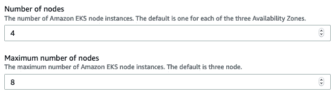
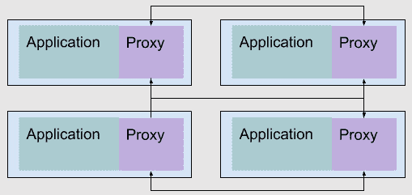
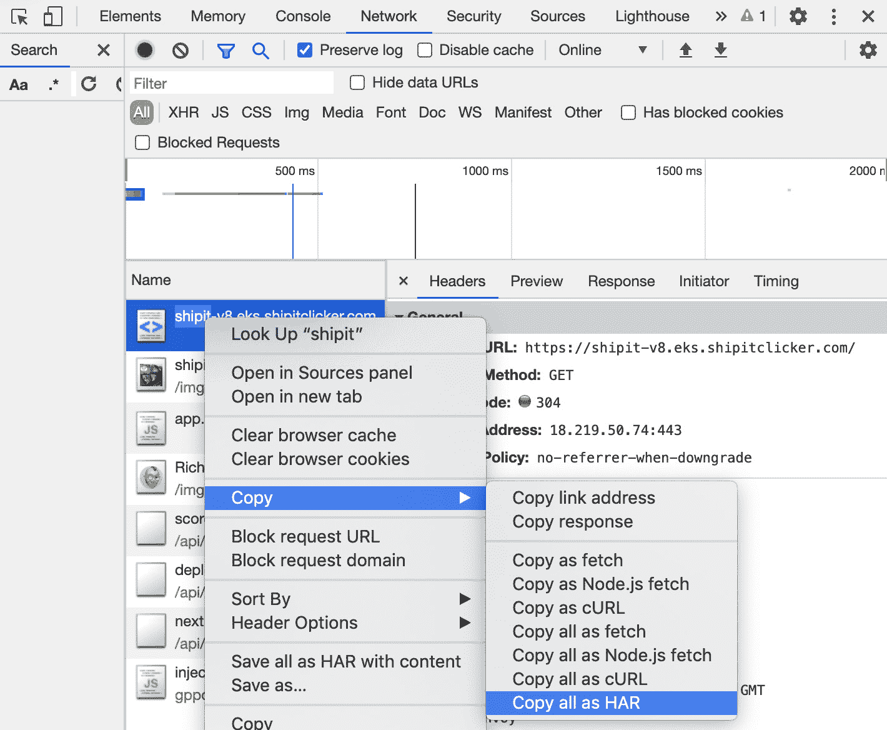
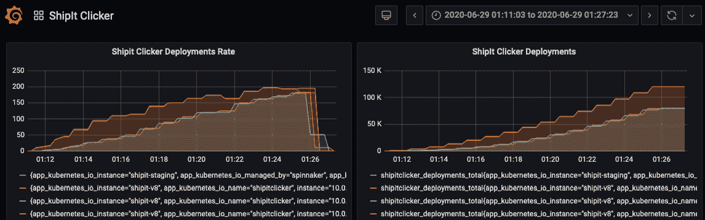

# *第十一章*：扩展和负载测试 Docker 应用

像 Google、Facebook、Lyft 和 Amazon 这样的科技巨头部分采用容器编排系统，是为了能够以非常高的利用率运行他们的海量计算资源。为了做到这一点，你必须有一种方法将你的应用扩展到一批服务器上，这些服务器可能是从云服务提供商动态分配的。即使你有一个能够在高流量时扩展、在需求减少时缩减的集群，你仍然可能需要额外的工具来确保其正确运行。你还需要确保如果超出容量限制，服务能够平稳降级。

你可以使用像 Envoy、Istio 或 Linkerd 这样的服务网格来处理这些问题。Envoy 是服务网格领域中较为简单的选项之一；它提供了负载均衡以及先进的流量路由和过滤能力。所有这些能力提供了所需的粘合剂，以便为高需求的用户提供流量。一些更复杂的服务网格使用 Envoy 作为构建块，因为它非常灵活。

为了证明扩展策略有效，你需要进行负载测试。为此，我们将使用 k6.io，一个云原生负载测试和 API 测试工具。

在本章中，你将学习如何使用 Horizontal Pod Autoscaler（水平 Pod 自动扩展器）、Vertical Pod Autoscaler（垂直 Pod 自动扩展器）和 Cluster Autoscaler（集群自动扩展器）来配置你的 Kubernetes 集群，以便实现扩展。你将了解 Envoy 以及为什么你可能需要使用它来提供一个代理层和服务网格，搭建在 Kubernetes 之上。这包括如何在 Kubernetes 集群之上创建一个 Envoy 服务网格，以及如何为其配置断路器。接下来，你将学习如何验证服务网格和自动扩展机制是否按预期工作。最后，你将学习如何使用 k6.io 进行负载测试，并观察当服务面临压力测试时如何失败。

本章将覆盖以下内容：

+   扩展你的 Kubernetes 集群

+   什么是 Envoy，为什么我可能需要它？

+   使用 k6 测试可扩展性和性能

# 技术要求

你需要拥有一个本地 Kubernetes 学习环境以及一个可用的云端 Kubernetes 集群，如在 *第八章* 中所述，*将 Docker 应用部署到 Kubernetes*。你还需要在本地工作站上安装当前版本的 AWS CLI、`kubectl` 和 `helm` 3.x，正如前一章所描述的那样。本章中的 Helm 命令使用的是 `helm` 3.x 语法。

对于本地 Kubernetes 学习环境，你应该配置一个可用的 NGINX Ingress Controller，你可以通过运行 `chapter11/bin/`[deploy-nginx-ingress.sh](http://deploy-nginx-ingress.sh) 脚本来安装它。你还需要有一个本地 Jaeger 操作符，你可以通过运行 `chapter11/bin/deploy-jaeger.sh` 脚本来安装它。

对于云托管的集群，您可以重用 AWS 的`eksctl`。EKS 集群必须已设置并且工作正常的 ALB Ingress Controller。你还应该拥有一个用于云集群的 `deploy-jaeger.sh` 脚本。

查看以下视频，了解代码如何运行：

[`bit.ly/2CwdZeo`](https://bit.ly/2CwdZeo)

## 使用更新后的 ShipIt Clicker v8

我们将使用以下 GitHub 仓库中 `chapter11` 目录提供的 ShipIt Clicker 版本：[`github.com/PacktPublishing/Docker-for-Developers/`](https://github.com/PacktPublishing/Docker-for-Developers/)。

您使用的应用程序版本与上一章中的操作类似，在 Kubernetes 中使用时，依赖于通过 `bitnami/redis` Helm Charts 安装的外部 Redis 版本。

### 理解与之前版本 ShipIt Clicker 的区别

在每一章中，我们都对 ShipIt Clicker 进行了增强，以展示与章节内容相关的更改，并且像生产发布过程中的修复一样完善应用程序。

这个版本的 ShipIt Clicker 与上一章中提供的版本类似，但它新增了一个名为`/faults/spin`的 API 端点，作为*故障注入*测试策略的一部分，用于在运行应用程序的节点上诱发 CPU 负载，以测试集群自动扩缩容策略。`spin`端点在调用频率增加时会变慢，但如果调用频率减少，它会恢复并变快。这模拟了一个性能较差的应用程序的行为，无需编写复杂的实际低效代码和数据库服务器。它提供了一种人工的 CPU 负载，便于进行基于 CPU 的自动扩缩容测试。请查看`chapter11/src/server/common/spin.js`和`chapter11/src/server/controllers/faults/controller.js`中的代码，了解其工作原理。

这个版本的 ShipIt Clicker 还增强了与 Prometheus 指标相关的功能：通过配置 Express 监听一个独立的端口，使其暴露这些指标，并提供 `/metrics` 端点。这样有助于避免暴露包含应用程序信息的指标，普通用户不需要这些信息，并且使得在与 ShipIt Clicker 同一个 Pod 中的多个容器也能暴露 Prometheus 指标。请查看 `chapter11/src/server/index.js` 文件中的代码，它增加了另一个 HTTP 监听器和一个用于指标的路由。`chapter11/shipitclicker/templates/deployment.yaml` 中的 Helm 模板也进行了更改，以支持这个新端点。

接下来，我们将把 ShipIt Clicker 构建并安装到本地 Kubernetes 学习环境中。

### 在本地安装 ShipIt Clicker 的最新版本

在本节中，我们将构建 ShipIt Clicker Docker 容器，给它打标签，并像前几章一样将其推送到 Docker Hub。执行以下命令，将 `dockerfordevelopers` 替换为你的 Docker Hub 用户名：

```
$ docker build . -t dockerfordevelopers/shipitclicker:1.11.7
$ docker push dockerfordevelopers/shipitclicker:1.11.7
$ kubectl config use-context docker-desktop
$ helm install --set image.repository=dockerfordevelopers/shipitclicker:1.11.7 shipit-v8 shipitclicker
```

使用 `kubectl get all` 检查正在运行的 pod 和服务，以验证 pod 是否正在运行，记下其名称，然后使用 `kubectl logs` 检查日志以查看启动日志。日志中不应有任何错误。

接下来，我们将在 EKS 中安装此版本。

### 通过 ECR 在 EKS 中安装 ShipIt Clicker 的最新版本

现在你已经构建了 Docker 容器并在本地安装了它，我们将在 AWS EKS 中通过 ECR 安装它。编辑 `chapter11/values.yaml` 文件，为其在 Route 53 DNS 区域中设置一个主机名，例如 [shipit-v8.eks.example.com](http://shipit-v8.eks.example.com)（将 ECR 引用替换为与你的 AWS 账户和区域对应的引用，并将 `example.com` 替换为你的域名）：

```
$ docker tag dockerfordevelopers/shipitclicker:1.11.7 143970405955.dkr.ecr.us-east-2.amazonaws.com/dockerfordevelopers/shipitclicker:1.11.7
$ aws ecr get-login-password --region us-east-2 | docker login --username AWS --password-stdin 143970405955.dkr.ecr.us-east-2.amazonaws.com
$ docker push 143970405955.dkr.ecr.us-east-2.amazonaws.com/dockerfordevelopers/shipitclicker:1.11.7
$ kubectl config use-context arn:aws:eks:us-east-2:143970405955:cluster/EKS-8PWG76O8
$ helm install shipit-v8 -f values.yaml --set image.repository=143970405955.dkr.ecr.us-east-2.amazonaws.com/dockerfordevelopers/shipitclicker:1.11.7 ./shipitclicker
```

检查 Kubernetes 日志，确保应用程序已成功部署到集群中：

```
kubectl logs services/shipit-v8-shipitclicker shipitclicker
```

如果部署一切正常，获取 AWS ALB Ingress 控制器的地址，如 *第九章* 中所述，*使用 Spinnaker 的云原生持续部署*，并在 Route 53 控制台中为已部署的应用程序创建 DNS 条目，使用 ALB 地址。然后你应该能够通过类似 [`shipit-v8.eks.example.com/`](https://shipit-v8.eks.example.com/) 的 URL 访问你的应用程序（将 `example.com` 替换为你的域名）。

# 扩展你的 Kubernetes 集群

为了支持更多的流量和更多的应用程序，你的 Kubernetes 集群可能需要扩大其初始规模。你可以使用手动方法和动态编程方法来实现这一点，特别是当你在使用基于云的 Kubernetes 集群时。要扩展一个应用程序，你需要控制两个维度：运行特定应用程序的 pod 数量和集群中的节点数量。在具有相同节点数量的集群中，你不能无限扩展 pod 数量；与 CPU、内存和网络相关的实际限制最终会要求集群也要扩展节点数量。

扩展集群的方式会有很大差异，具体取决于云服务提供商和 Kubernetes 分发版。Kubernetes 文档解释了通用流程，并提供了一些针对在 Google 和 Microsoft Azure 云中运行的集群的具体说明：

[`kubernetes.io/docs/tasks/administer-cluster/cluster-management/`](https://kubernetes.io/docs/tasks/administer-cluster/cluster-management/)

一般来说，你必须启动并配置一台新服务器，该服务器的配置应与现有集群节点类似，然后通过 `kubeadm join` 命令将其加入集群：

[`kubernetes.io/docs/reference/setup-tools/kubeadm/kubeadm-join/`](https://kubernetes.io/docs/reference/setup-tools/kubeadm/kubeadm-join/)

Kubernetes 发行版和云服务提供商通过依赖机器镜像和自动扩展组等机制使这一过程变得更加简便。我们将向您展示如何通过 Amazon EKS 扩展您的集群。在 *第八章*，*将 Docker 应用程序部署到 Kubernetes* 中，我们在 *使用 CloudFormation 启动 AWS EKS* 部分中设置了 EKS 与 AWS Quick Start CloudFormation 模板。以下部分假设您已经使用该方法设置了一个使用自动扩展组的集群。

## 手动扩展集群

鉴于我们想要增加集群中的节点数量，我们将需要识别并遵循针对我们的 Kubernetes 安装的特定程序。对于 Amazon EKS 集群，请参阅以下文档：

[`docs.aws.amazon.com/eks/latest/userguide/launch-workers.html`](https://docs.aws.amazon.com/eks/latest/userguide/launch-workers.html)

您也可以启动一个全新的节点组，但通常只需要调整一个或两个参数就能增加集群的大小。这种方法用于扩大集群的规模，称为 *扩展*，而当缩小集群的规模时，称为 *缩减*。接下来，我们将学习如何调整一个简单的参数，以便扩展集群中的节点数量。

### 手动扩展节点

为了简化，我们假设您最初使用了 AWS Quick Start 的 EKS CloudFormation 模板来创建您的集群。由于该方法使用 CloudFormation 来管理集群，因此您应该优先使用 CloudFormation 来更新集群的配置。要手动扩展您的集群，请进入 AWS 控制台，更新 CloudFormation 部署，将 **节点数量** 和 **最大节点数量** 的默认值从当前值修改为更高的值，如 **4** 和 **8**：



图 11.1 – 更新 AWS EKS Quick Start CloudFormation 模板

继续完成 CloudFormation 更新表单并应用更改。查看 CloudFormation 事件以获取更新，并等待几分钟。然后，您可以检查 CloudFormation 模板的更新是否顺利完成。接着，您可以检查自动扩展组的大小，确保其已经增加。

您还可以通过 EC2 控制台更新自动扩展组的大小，分别将最小、期望和最大节点数设置为 **4**、**4** 和 **8**。但是，这会导致您的部署配置与 CloudFormation 模板产生偏差，这是不理想的，因为实际状态将与 CloudFormation 期望的模型不再匹配。有关此问题的更多信息，请参见以下帖子：[`aws.amazon.com/blogs/aws/new-cloudformation-drift-detection/`](https://aws.amazon.com/blogs/aws/new-cloudformation-drift-detection/)。

如果你使用 `eksctl` 创建了集群，你可以按照 [`eksctl.io/usage/managing-nodegroups/`](https://eksctl.io/usage/managing-nodegroups/) 中的说明扩展其创建的节点组。

### 手动扩展节点

你可以逆向操作来缩减集群（减小其规模），但请注意，手动缩减集群规模更加复杂。安全地进行此操作需要一个叫做“驱逐”的过程，详情请参阅以下 Kubernetes 文档：[`kubernetes.io/docs/tasks/administer-cluster/safely-drain-node/`](https://kubernetes.io/docs/tasks/administer-cluster/safely-drain-node/)。仅更改自动扩展组的大小会终止实例，而不允许你选择终止哪个实例或给你机会去驱逐该实例。如果你*真的*想这样做，你必须完成以下所有步骤：

+   将自动扩展组的最小规模减少一个。

+   使用 `kubectl drain` 命令驱逐节点。

+   使用 AWS CLI 命令终止节点，该命令会减少期望容量。

调整完自动扩展组的最小规模后，你可以执行以下命令（在每个命令中替换为要终止的节点的节点名称和实例 ID）：

```
$ kubectl drain \
    ip-10-0-94-28.us-east-2.compute.internal \
    --ignore-daemonsets
$ aws autoscaling terminate-instance-in-auto-scaling-group \
    --instance-id i-09c88021d2324e821 \
    --should-decrement-desired-capacity
```

这个过程涉及较多，容易导致手动错误。它还可能导致与 CloudFormation 模板的配置漂移，因此你应该考虑编写脚本，或者依赖自动扩展机制。

### 通过部署手动扩展 Pod

手动扩展部署或 ReplicaSet 中的 Pod 数量相对简单，只要集群中有足够的资源。你可以使用 `kubectl scale` 命令来设置副本数量。你可能需要执行几个 `kubectl get` 命令，直到你看到所有副本都变为就绪状态，如以下转录所示：

```
$ kubectl get deployment/shipit-v8-shipitclicker
NAME                      READY   UP-TO-DATE   AVAILABLE   AGE
shipit-v8-shipitclicker   2/2     2            2           57m
$ kubectl scale deployment/shipit-v8-shipitclicker --replicas=4
deployment.apps/shipit-v8-shipitclicker scaled
$ kubectl get deployment/shipit-v8-shipitclicker
NAME                      READY   UP-TO-DATE   AVAILABLE   AGE
shipit-v8-shipitclicker   2/4     4            1           58m
$ kubectl get deployment/shipit-v8-shipitclicker
NAME                      READY   UP-TO-DATE   AVAILABLE   AGE
shipit-v8-shipitclicker   4/4     4            4           59m
```

接下来，我们将探讨如何将程序化扩展应用于集群，既包括节点，也包括 Pod。

## 动态扩展集群（自动扩展）

现在，经过前面三章的练习，你已经探讨了 Kubernetes 容器编排系统相关的复杂概念，你可能会想：所有这些努力值得吗？在本节中，我们将探讨一个关键特性，它可以让管理这些系统的痛苦变得值得——自动扩展。通过动态扩展集群中的应用程序和集群本身，你可以实现集群资源的高利用率，这意味着你需要更少的计算机（无论是虚拟的还是物理的）来运行你的系统。当你将动态扩展与 Kubernetes 系统的自愈能力结合时，即使在某些领域具有较高的复杂性和学习曲线，这一特性仍然非常吸引人。

Kubernetes 支持几种动态扩展机制，包括集群自动扩展器、水平 Pod 自动扩展器和垂直 Pod 自动扩展器。我们来一一探讨这些机制。

### 配置 Cluster Autoscaler

`kube-system` 命名空间使用云 API 来启动和终止节点。

如果您使用 AWS EKS 快速启动 Cloudformation 模板来创建集群并告诉它启用 Cluster Autoscaler，则无需进一步配置。如果您使用 `eksctl` 或其他方法创建集群，则可能需要使用此处提供的说明进一步配置：[`docs.aws.amazon.com/eks/latest/userguide/cluster-autoscaler.html`](https://docs.aws.amazon.com/eks/latest/userguide/cluster-autoscaler.html)。

您可以通过查询来验证 Cluster Autoscaler 是否正在运行：

```
$ kubectl -n kube-system get deployments | grep autoscaler
cluster-autoscaler-1592701624-aws-cluster-autoscaler   1/1     1            1
```

现在我们已经了解了一些有关 Cluster Autoscaler 的信息，让我们发现如何配置应用程序以利用其功能。

#### 配置无状态应用程序以与 Cluster Autoscaler 协同工作

无状态应用程序（例如 ShipIt Clicker）可以容忍启动和停止其任何一个 pod，并且可以在集群中的任何节点上运行。它不需要特殊配置即可与 Cluster Autoscaler 协同工作。需要挂载本地存储和某些其他类别应用程序的有状态应用程序，在可能的情况下必须避免某些扩展操作，并可能需要特殊处理。有关详细信息，请参阅 Autoscaling FAQ：[`github.com/kubernetes/autoscaler/blob/master/cluster-autoscaler/FAQ.md`](https://github.com/kubernetes/autoscaler/blob/master/cluster-autoscaler/FAQ.md)。

您可以通过 **PodDisruptionBudget**（**PDB**）来提示 Cluster Autoscaler 不应缩减超出某一点的 pod 数量，并且它应努力保持一定数量或百分比的健康 pod 可用性：[`kubernetes.io/docs/tasks/run-application/configure-pdb/`](https://kubernetes.io/docs/tasks/run-application/configure-pdb/)。

我们已经在其 Helm Chart 中使用 PDB 配置了 ShipIt Clicker。有关更多信息，请参见 `chapter11/src/shipitclicker/templates/pdb.yaml`。您可以在 `chapter11/src/shipitclicker/values.yaml` 中找到其默认值。默认情况下，ShipIt Clicker 现在配置为部署两个 pod，并且具有至少一个可用 pod 的 PDB。这为 Cluster Autoscaler 和其他 Kubernetes 应用程序提供了提示，表明即使在进行节点维护时，也应始终保持至少一个 pod 处于运行状态。

接下来，我们将演示 Cluster Autoscaler 的运行情况。

#### 演示 Cluster Autoscaler 的运行情况

为了让 Cluster Autoscaler 更改集群大小，我们可以启动超过其当前处理能力的更多 pod。要观察此过程的执行过程，可以尾随 `cluster-autoscaler` 服务的日志。打开终端窗口并运行以下命令以尾随服务的日志：

```
$ service=service/$(kubectl get services -n kube-system \
   | awk '/cluster-autoscaler/{ print $1 }')
$ kubectl logs -f -n kube-system "$service"
```

每 10 秒，您将看到日志条目，指示服务正在寻找*不可调度*的 pod（这将导致集群扩展节点的数量），以及符合缩放条件的节点。

然后，在另一个终端窗口中，手动将 ShipIt Clicker 的部署扩展到 `50` 个 pod：

```
kubectl scale deployment/shipit-v8-shipitclicker --replicas=50
```

默认 EKS 集群中的每个`t3.medium`节点大约可以处理 4 到 16 个 ShipIt Clicker pod，具体取决于每个节点上运行的其他 pod 数量。这会触发集群自动扩展器，并使其至少扩展一个额外的节点。你将会在集群自动扩展器的日志中看到它已发现无法调度的 pod，并且很快，它会完成扩展操作。

要从节点和 pod 的角度查看进度，可以每隔几秒钟执行以下命令：

```
kubectl get nodes; kubectl get deployments
```

你将看到节点启动并且越来越多的副本变为就绪状态，直到副本集稳定。当这发生时，将其缩减回一个较低的默认状态：

```
kubectl scale deployment/shipit-v8-shipitclicker --replicas=2
```

完成操作后，你可能会注意到节点不会立即缩减，因为在扩展操作完成后，节点会进入一个 10 分钟的冷却状态。然而，在冷却期结束后的一分钟，集群自动扩展器会发现这些节点的 CPU 使用率接近零，然后它会对集群进行缩减，终止那些不再有 pod 可用的节点。集群自动扩展器在执行缩减操作时会遵循 PDB 策略——这允许你在缩减集群中的 pod 和节点数量时，根据需求谨慎操作。

现在你已经学会了如何使用集群自动扩展器来扩展和缩减集群节点，接下来让我们学习如何使用 Horizontal Pod Autoscaler 设置扩展策略。

### 配置 Horizontal Pod Autoscaler

**Horizontal Pod Autoscaler** 允许你设置规则，通过考虑 CPU 使用率或其他自定义指标来扩展 Kubernetes pod 集合。这个服务还可以扩展由部署、ReplicaSets 和复制控制器管理的 pod。你可以在这里阅读更多关于它如何工作的理论：[`kubernetes.io/docs/tasks/run-application/horizontal-pod-autoscale/`](https://kubernetes.io/docs/tasks/run-application/horizontal-pod-autoscale/)。

这是你实现一个可以根据需求自动扩展和缩减的集群之前需要解决的最后一个关键步骤。

你需要安装 Metrics Server，以使 Horizontal Pod Autoscaler 正常工作。我们接下来将进行安装。

#### 安装 Metrics Server

若要在你的 Kubernetes 集群中获取更详细的统计信息，供支持动态扩展的组件使用（包括 Horizontal Pod Autoscaler），你需要运行标准的**Metrics Server**。它会聚合集群中关于节点的内存、CPU 以及其他资源利用率的统计信息，并以 Kubernetes 各种自动扩展机制可以理解和操作的格式提供这些数据。AWS EKS 的指南中有关于如何安装的介绍，详情见此：

[`docs.aws.amazon.com/eks/latest/userguide/metrics-server.html`](https://docs.aws.amazon.com/eks/latest/userguide/metrics-server.html)

要安装它，确保你的 `kubectl config` 上下文已设置为你的云集群。然后，从你的本地工作站发出以下命令：

```
kubectl apply -f https://github.com/kubernetes-sigs/metrics-server/releases/download/v0.3.6/components.yaml
```

安装 Metrics Server 后，验证它是否正在运行：

```
$ kubectl -n kube-system get deployment metrics-server
NAME             READY   UP-TO-DATE   AVAILABLE   AGE
metrics-server   1/1     1            1           6m
```

接下来，我们将为 ShipIt Clicker 应用启用 Horizontal Pod Autoscaler，以演示它是如何工作的。

#### 启用 Horizontal Pod Autoscaler

AWS EKS 指南展示了安装 Horizontal Pod Autoscaler 所需的步骤：[`docs.aws.amazon.com/eks/latest/userguide/horizontal-pod-autoscaler.html`](https://docs.aws.amazon.com/eks/latest/userguide/horizontal-pod-autoscaler.html)。

我们需要安装的主要组件是指标服务。事实证明，Horizontal Pod Autoscaler 已经内置在 Kubernetes 中。我们可以发出如下命令，启用某个部署的 Horizontal Pod Autoscaler：

```
kubectl autoscale deployment shipit-v8-shipitclicker --cpu-percent=50 --min=2 --max=50
```

如果你需要编辑这些参数，可以使用以下命令：

```
kubectl edit hpa/shipit-v8-shipitclicker
```

你可以通过发出以下命令，详细查看 Horizontal Pod Autoscaler 最近执行的操作：

```
kubectl describe hpa/shipit-v8-shipitclicker
```

为了测试 Horizontal Pod Autoscaler 和 Cluster Autoscaler 是否按预期工作，我们需要施加 CPU 负载。这时，`/faults/spin` 端点就派上用场了。在本章稍后的 *使用 k6 测试可扩展性和性能* 部分，我们将看到如何为 ShipIt Clicker 应用构建一个真实的负载测试。然而，为了验证自动扩缩容，我们将使用一个暴力方法，通过 Docker 运行 Apache Bench 工具（将 `example.com` 替换为你的域名）：

```
$ url=https://shipit-v8.eks.example.com/faults/spin
$ docker run --rm jordi/ab -c 50 -t 900 "$url"
```

使用 `kubectl get deployments`、`kubectl get pods`、`kubectl get nodes` 和 `kubectl describe hpa` 命令反复执行，观察部署副本的增长。或者，使用 Kubernetes 监控工具，例如 k9s（[`k9scli.io/`](https://k9scli.io/)）来观察 pod 和节点数在最初 10 分钟内的增长，然后在接下来的 15 分钟内逐渐减少。你也可以查看上一章中描述的 Grafana 仪表盘和 Jaeger 跟踪，以查看集群如何处理负载，或者查看在 EC2 控制台中出现的 CloudWatch 指标，这些是针对活动节点的。

接下来，我们将考虑何时使用 Vertical Pod Autoscaler。

### 配置 Vertical Pod Autoscaler

Vertical Pod Autoscaler 是一种较新的扩展机制，它观察 pod 请求的内存和 CPU 使用量，以及实际使用的量，从而优化内存和 CPU 请求——它执行右-sizing，以提升集群利用率。这是最适合有状态 Pod 的扩展机制。

然而，Vertical Pod Autoscaler 的文档目前指出，它与 Horizontal Pod Autoscaler 不兼容，因此你应避免配置它以管理相同的 Pods。你可以尝试将它用于你的应用，但请记住文档中关于避免将其与 Horizontal Pod Autoscaler 使用 CPU 指标进行混合的建议。Vertical Pod Autoscaler 的安装过程也比配置其他自动扩展器要复杂，因此我们不会在此详细展示所有步骤——请参考 Vertical Pod Autoscaler 文档获取详细配置说明：[`github.com/kubernetes/autoscaler/tree/master/vertical-pod-autoscaler`](https://github.com/kubernetes/autoscaler/tree/master/vertical-pod-autoscaler)。

在本节中，我们学习了如何使用手动和动态方法来扩展我们的应用程序。在下一节中，我们将了解 Envoy，它是一个服务网格，提供一些关于 Kubernetes 集群中 Pod 通信的高级控制和安全性。

# 什么是 Envoy，为什么我可能需要它？

Envoy ([`www.envoyproxy.io/`](https://www.envoyproxy.io/)) 是一个 C++ 开源的 **服务网格** 和边缘代理，专为微服务部署而设计。由 Lyft 团队开发，它特别适用于开发基于 Kubernetes 托管的应用程序的团队，正如本书中你所看到的应用。

那么，为什么我们需要部署 Envoy 呢？在开发基于云的生产系统时，使用多个容器来托管分布式服务，你会遇到许多与可观察性和网络相关的问题。

Envoy 旨在通过引入一个代理服务来解决这两个问题，该服务提供可运行时配置的网络和指标收集功能，可以作为创建更高级别系统的构建模块，帮助管理这些问题。无论你是在构建一个小型的分布式应用，还是一个围绕服务网格模型设计的大型微服务架构，Envoy 的功能使我们能够以云平台无关的方式抽象出网络这一棘手的问题。

Lyft 团队使用以下概念开发了 Envoy：

+   **进程外架构**：Envoy 是一个自包含的进程，可以与现有应用程序一起部署。

+   `localhost` 并且对网络拓扑一无所知。采用 L3/L4 过滤架构用于网络代理。你可以向代理中添加自定义过滤器，以支持诸如 TLS 客户端证书认证等任务。

+   **语言无关性**：Envoy 支持多种语言，并允许你混合使用不同的应用框架。例如，通过使用 Envoy 的 PHP 和 Python，容器化应用程序可以互相通信。

+   **HTTP L7 过滤器和路由**：与 L3/L4 过滤器一样，L7 层也支持过滤。这允许开发用于不同任务的插件，从缓冲到与 AWS 服务（如 DynamoDB）交互。Envoy 的路由功能允许你部署一个路由子系统，根据多种标准（如路径和内容类型）重定向请求。

+   **负载均衡和前端/边缘代理支持**：Envoy 支持高级负载均衡技术，包括自动重试、断路器、健康检查和限流。此外，你可以在网络边缘部署 Envoy 以处理 TLS 终止和 HTTP/2 请求。

+   **可观察性和透明性**：Envoy 收集统计数据以支持应用层和网络层的可观察性。你可以将 Envoy 与 Prometheus、Jaeger、Datadog 和其他支持指标和追踪的监控平台结合使用。

让我们更详细地探索一下 Envoy 的一些功能，以便更好地理解这些概念。

## 使用 Envoy 服务网格进行网络流量管理

你应该已经熟悉负载均衡器的概念，它是一种网络流量管理器。但究竟什么是服务网格？为什么你需要使用它？Envoy 如何在这方面帮助我们？

服务网格是一个基础设施层，专门用于处理服务间通信，通常通过代理服务实现。使用服务网格的好处如下：

+   对网络通信的透明性和可观察性。

+   你可以支持网络上的安全连接。

+   指标收集，包括服务失败时重试成功所需的时间。

+   你可以将代理部署为**边车**。这意味着它们与每个服务并行运行，而不是嵌入其中。反过来，这使我们能够将代理服务与应用程序本身解耦。

四个应用程序的服务网格示例可以如下可视化：



图 11.2 – 一个包含四个微服务和边车代理的服务网格示例

在这里，我们的每个容器化应用程序都有一个相应的边车代理。应用程序与代理进行通信，代理则通过服务网格与我们托管的其他容器化服务进行通信。应用程序并不知道代理的存在，也不需要任何修改即可与代理协作。所有配置都可以通过容器编排系统将端口连接起来，方式对应用程序是不可见的。

现在，让我们动手实际操作，启动并运行 Envoy。

## 设置 Envoy

由于 Envoy 的架构，你在部署软件时具有灵活性：

+   明确配置为边车容器，使用静态配置文件，与应用容器并排部署

+   动态配置作为服务网格控制平面的一部分，容器可能作为组件被注入到 Kubernetes pod 中，使用如 Istio ([`istio.io/`](https://istio.io/)) 或 AWS App Mesh ([`aws.amazon.com/app-mesh/`](https://aws.amazon.com/app-mesh/)) 等软件。

第二种选择提供了更大的功能，但增加了较大的复杂性。

Envoy 的示例配置（参见 [`www.envoyproxy.io/docs/envoy/latest/start/start#sandboxes`](https://www.envoyproxy.io/docs/envoy/latest/start/start#sandboxes)）都属于第一类，具有明确的 Envoy 代理配置。要了解 Envoy，考虑这些明确的配置示例更为简单。本章提供的 ShipIt Clicker 版本已经被修改，可以在 Kubernetes 部署时通过静态配置文件添加一个 Envoy sidecar 容器，采用简化的方式展示 Envoy 的特性。

### 为 Envoy 配置 ShipIt Clicker

现在，让我们来检查一下为了支持 Envoy 在 ShipIt Clicker 中所需进行的具体更改。应用程序的 JavaScript 代码不需要任何更改；所有更改都在 Helm Charts 中。查看 `chapter11/shipitclicker` 中的 Helm Charts，并与 `chapter10/shipitclicker` 中的进行对比；你将看到在 `chapter11/shipitclicker/templates/deployment.yaml` 中定义了一个新的 Envoy sidecar 容器，使用在 `chapter11/shipitclicker/values.yml` 中定义的镜像进行配置：

```
        - name: envoy-sidecar
          image: "{{ .Values.envoy.repository }}"
          imagePullPolicy: {{ .Values.envoy.pullPolicy }}
          command: ["/usr/local/bin/envoy"]
          args: ["-c", "/etc/envoy-config/config.yaml"]
```

模板中的前几行使用配置文件 `/etc/envoy-config/config.yaml` 启动 Envoy 容器，该配置文件在 ConfigMap 中定义。Envoy 需要为其管理或代理的每个服务提供端口定义，包括其管理界面的端口定义：

```
          ports:
            - name: envoy-admin
              containerPort: 9901
              protocol: TCP
            - name: envoy-http
              containerPort: 4000
              protocol: TCP
```

我们可以查询管理 API，确保 Envoy 处于活动状态并准备好接受流量，符合 Kubernetes 的最佳实践：

```
          livenessProbe:
            httpGet:
              path: /server_info
              port: envoy-admin
          readinessProbe:
            httpGet:
              path: /ready
              port: envoy-admin
```

为了将配置文件暴露给容器，我们使用一个卷挂载来暴露 `config.yaml` 文件：

```
          volumeMounts:
            - name: envoy-config-vol
              mountPath: /etc/envoy-config/
      volumes:
        - name: envoy-config-vol
          configMap:
            name: {{ .Release.Name }}-envoy-sidecar-configmap
            items:
              - key: envoy-config
                path: config.yaml
```

`config.yaml` 文件在 `chapter11/shipitclicker/templates/configmap-envoy.yaml` 中定义，并为以下内容定义了监听器和集群：

+   一个为 pod 内部的 ShipIt Clicker 容器提供的入口代理。

+   为 Redis Kubernetes 服务配置的出口代理，可以在集群中的 `redis-master` 处访问。

+   一个入口代理，允许 Prometheus 从 pod 中的 Envoy sidecar 拉取指标。

`chapter11/shipitclicker/templates/configmap.yaml` 中的 ShipIt Clicker 的 ConfigMap 已被修改，以便它连接到 `localhost:6379` 的 Redis，Envoy 监听此端口并通过 TCP L4 代理将其代理到 Redis 服务。该服务在集群中的其他地方的 `redis-master:6379` 处进行监听。

`chapter11/shipitclicker/templates/service.yaml` 中的 Kubernetes 服务现在调用 `envoy-http` 端口，而不是直接调用应用程序容器的端口。

#### 为什么不使用 Envoy Redis 协议代理？

此处使用的示例文件使用的是普通的 TCP 代理，而不是 Envoy 的 Redis 协议代理（请参见 [`www.envoyproxy.io/docs/envoy/latest/api-v3/extensions/filters/network/redis_proxy/v3/redis_proxy.proto`](https://www.envoyproxy.io/docs/envoy/latest/api-v3/extensions/filters/network/redis_proxy/v3/redis_proxy.proto) 和 [`github.com/envoyproxy/envoy/tree/master/examples/redis`](https://github.com/envoyproxy/envoy/tree/master/examples/redis)）。

这是因为 ShipIt Clicker 应用程序设置了 Redis 密码认证，而该认证与 Envoy 的 Redis 代理不兼容。ShipIt Clicker 被配置为使用从 Kubernetes Secret 中检索的密码，而该密码由 Bitnami Redis Helm Chart 存储。然而，Envoy 不会通过该密码；当配置为使用 Redis 协议代理时，ShipIt Clicker 尝试进行身份验证时，出现了错误信息：`警告：Redis 服务器不需要密码，但提供了密码`。事实证明，如果使用 Envoy Redis 协议支持，则必须通过存储在 ConfigMap 中的配置文件为客户端（以及可选的服务器）配置代理本身的密码认证。然而，Bitnami Redis 服务器使用的密码仅作为 Kubernetes 秘密存在，因此重新构建系统以支持这一点会增加复杂性。

作为练习，如果你愿意，可以安装没有密码的 Redis，并从 ShipIt Clicker 的配置中移除密码。如果你这么做了，你还可以将 Redis 实现切换到 Bitnami Redis Cluster Helm Chart（请参见 [`github.com/bitnami/charts/tree/master/bitnami/redis-cluster`](https://github.com/bitnami/charts/tree/master/bitnami/redis-cluster)），然后使用 Envoy 支持 Redis 集群来实现读写分离模式。

到目前为止，我们已经看到了如何部署 Envoy 来创建服务网格。接下来，我们将探索电路断路器模式。

### 配置 Envoy 支持电路断路器模式

电路断路器模式是一种配置失败阈值的机制。其目标是防止故障蔓延到你的微服务平台，并停止持续请求一个未响应的服务。

在 Envoy 上配置该模式相对简单。我们可以通过 `circuit_breakers` 字段，将电路断路值配置为 Envoy 集群定义的一部分。

要查看其工作原理，请查看以下 ConfigMap 文件，其中包含了电路断路器的定义（`chapter11/shipitclicker/templates/configmap-envoy.yaml`）：

```
        circuit_breakers:
          thresholds:
            - priority: DEFAULT
              max_connections: {{ .Values.envoy.maxRequests }}
              max_pending_requests: {{ .Values.envoy.maxRequests }}
              max_requests: {{ .Values.envoy.maxRequests }}
              max_retries: {{ .Values.envoy.maxRetries }}
```

这个阈值定义指定了 Envoy 将建立的最大连接数和最大并发请求数。在我们的示例中，我们有一个默认优先级阈值配置，以及一个用于高优先级（用于 HTTP 1.1）和最大请求数（用于 HTTP/2）的第二个阈值。如果 Envoy 检测到的流量超过这些阈值，它将抛出错误并拒绝请求，而不会将请求传递到目标服务。请注意，由于我们使用 Helm Charts，我们通过 Helm 模板变量替换指定实际值，这些值来自 `chapter11/shipitclicker/values.yaml` 或 Helm Chart 值的某个覆盖机制。默认值来自 `values.yaml` 文件中指定 Envoy 特定值的部分：

```
envoy:
  repository: envoyproxy/envoy:v1.14.2
  pullPolicy: IfNotPresent
  accessLog: "/dev/null"
  maxRequests: 1024
  maxRetries: 2
```

这些默认值适用于此应用程序的生产环境，但我们如何测试断路器是否有效，而不产生巨大的负载呢？我们接下来会展示如何做到这一点。

### 测试 Envoy 断路器

为了测试 Envoy 断路器是否正常工作，我们将把 ShipIt Clicker 部署到云 Kubernetes 集群中，设置一个人为降低的请求限制，并执行快速负载测试以验证其是否有效。发出 Helm `upgrade` 命令，随后执行 `kubectl rollout restart` 命令，类似以下内容，以将最大并发请求设置为 `10`（将 `image.repository` 替换为你的 ECR 仓库引用）：

```
$ helm upgrade shipit-v8 -f values.yaml --set image.repository=143970405955.dkr.ecr.us-east-2.amazonaws.com/dockerfordevelopers/shipitclicker:1.11.7 --set envoy.maxRequests=2 ./shipitclicker
Release "shipit-v8" has been upgraded. Happy Helming!
NAME: shipit-v8
LAST DEPLOYED: Sun Jun 28 22:34:15 2020
NAMESPACE: default
STATUS: deployed
REVISION: 17
NOTES:
1\. Get the application URL by running these commands:
  http://shipit-v8.eks.example.com/*
$ kubectl rollout restart deployment/shipit-v8-shipitclicker
deployment.apps/shipit-v8-shipitclicker restarted
```

接下来，我们将使用 Apache Bench 测试已部署的应用程序，从单个并发请求开始：

```
$ url=https://shipit-v8.eks.example.com/faults/spin
$ docker run --rm jordi/ab -c 1 -n 400 $url | grep requests:
Completed 100 requests
Completed 200 requests
Completed 300 requests
Completed 400 requests
Finished 400 requests
Complete requests:      400
Failed requests:        0
```

在这里，你可以看到当只运行一个并发请求时，所有请求都成功。接下来，我们将把并发增加到 `50` 个并发连接：

```
$ docker run --rm jordi/ab -c 50 -n 400 $url | grep requests:
Completed 100 requests
Completed 200 requests
Completed 300 requests
Completed 400 requests
Finished 400 requests
Complete requests:      400
Failed requests:        72
```

如果我们将并发设置为 `50` 个并发请求，其中许多将因断路器触发而失败。我们已经看到如何为我们的集群设置一个具有两个阈值的基本断路器。还有更高级的断路器模式，包括基于延迟和重试的断路器。如果你认为你的应用程序需要，你可以进一步探索这些模式。

现在你已经用低连接阈值测试过了断路器，请将阈值恢复到原始值，并重新部署应用程序，以便为更多负载测试做好准备。

如果我们能很好地衡量每个 Pod 在不失败的情况下能够处理多少真实用户流量，我们可以用它来为断路器设置一个更好的值。然而，Apache Bench 是一个笨重的工具，它不能让我们模拟现实的用户负载。为此，我们需要使用一个更复杂的负载测试框架。现在，我们将看看如何使用 k6 来测试可扩展性，k6 是一个基于 Docker 的负载测试框架。

# 使用 k6 测试可扩展性和性能

k6 框架([`k6.io`](https://k6.io))是一个可编程的开源负载测试工具。我们将向你展示如何使用它生成比简单负载生成器（如**Apache Bench**（**ab**））更真实的负载模式。

这个框架由于其 Docker 镜像的存在，设置和使用起来相当简单，该镜像可以在 Docker Hub 上找到。你可以在[`k6.io/docs/getting-started/running-k6`](https://k6.io/docs/getting-started/running-k6)找到快速开始说明。

要使用 k6 创建负载测试，你需要使用 JavaScript 并调用 k6 的库函数。要进行冒烟测试，你的脚本大致需要如下所示：

```
import http from 'k6/http';
export default function() {
  http.get('https://shipit-v8.eks.example.com/');
}
```

这个脚本大致相当于使用`ab`工具对 Web 服务器进行压力测试。创建一个名为`hello.js`的文件，使用前面的源代码，并将`shipit-v8.eks.example.com`替换为你网站的完全限定域名。

遵循 Docker 最佳实践，你应该确保在 Docker 命令行中添加`--rm`标志，以避免在本地安装中积累过时的容器。

```
$ docker run --rm -i loadimpact/k6 run - < hello.js
```

这将运行 k6 并获取`hello.js`中指定的 URL。

有几个关键概念是你必须了解的：

+   你必须提供一个默认函数。

+   K6 是*不是*Node.js，它没有事件循环。

+   你的默认函数被称为**虚拟用户（VU）**。

+   在默认函数外定义的代码会在程序启动时执行一次。

+   默认函数会重复执行，直到测试结束。

+   你可以根据需要使用任意数量的虚拟用户，并运行任意时长。

    注意

    k6 提供了许多命令行选项，可以用来在一段时间内逐步增加或减少虚拟用户（VU），以及指定测试的运行时长和要模拟的虚拟用户数量。默认设置只有一个虚拟用户（VU），并且只有一个测试迭代。

让我们使用一些选项来用更多的用户并更长时间运行测试：

```
$ docker run --rm -i loadimpact/k6 run --vus 50 --duration 30s - < hello.js
```

以这种方式运行 k6 将执行与 Apache Bench 负载测试几乎相同的负载测试，默认并发为`50`，持续时间为`30`秒。

然而，由于你可以使用 JavaScript 的全部功能，你可以利用多种策略编写更细致的负载测试。

## 记录并重放网络会话

编写类似`hello.js`的脚本的替代方案是使用记录和重放策略。许多负载测试框架，包括 k6，都支持这种范式。为此，使用 Chrome 浏览器及其**检查**功能。你可以使用调试器的**网络**选项卡来捕获并保存与应用程序后端之间的网络流量。

你从调试器中的空网络历史记录开始。然后，加载并开始游戏。每次点击都会触发应用程序和后端之间的 API 请求。

当你对录制的内容满意时，右键点击**网络**面板，选择**复制所有内容为 HAR**。这将把 HAR 格式的文本放入系统剪贴板：



图 11.3 – Google Chrome 检查器调试控制台 – 复制全部为 HAR

从剪贴板粘贴到一个名为`chapter11/src/test/k6/session.har`的文件中。然后，运行一个转换脚本，将 HAR 文件转换为位于`chapter11/src/test/k6/har-session.js`的 JavaScript 文件，并运行另一个 shell 脚本，通过 Docker 和正确的参数运行 k6，启动一个 60 秒、1 个用户的测试：

```
$ chapter11/bin/k6-convert-har.sh
$ chapter11/bin/k6-run-har.sh
```

`k6-run-har.sh`脚本设置了使用环境变量覆盖 VUs 的`USERS`变量，并使用`DURATION`变量覆盖测试时长。因此，你可以像这样为脚本加上前缀，并运行一个持续`300`秒的 10 用户测试：

```
$ USERS=10 DURATION=300 chapter11/bin/k6-run-har.sh
```

但是，使用这种播放和记录策略时有一些细节需要注意：该过程是非常字面意义上的，导致生成的文件在请求之间没有延迟。运行该测试会在目标服务上产生巨大的机器速度负载。请求之间的延迟没有随机化，这是你需要做的，以便更真实地模拟一个真实用户会对服务造成的负载。

为了创建一个更真实的测试，我们需要进行一些 JavaScript 编程。

## 手工制作一个更真实的负载测试

在`chapter11/src/tests/k6/`目录下，有一个`test.js`脚本，旨在真实地测试 ShipIt Clicker，无论它是部署在本地还是在云端。

这个脚本通过以下策略模拟一个人类玩游戏的过程：

+   获取构成应用程序的 HTML、样式表、图像和 JavaScript 文件

+   执行 HTTP POST 以开始一个新游戏

+   获取初始得分、部署次数和`nextPurchase`值

+   尝试模拟人类玩家点击流的行为

这些 HTTP 请求是通过在浏览器（如 Google Chrome）中玩游戏时，通过其**检查**功能并查看**网络**选项卡来识别的，在游戏加载并开始时记录请求。然后，我们编写了一个测试，模拟了一系列请求，尽可能贴近真实用户行为，包括加入了真实的随机延迟。

让我们检查一下`chapter11/src/test/k6/test.js`中的代码。这里，我们从 k6 提供的库中导入了`http`类和`sleep()`方法：

```
import http from "k6/http";
import { sleep } from "k6";
```

我们通过环境变量将参数传递给`test.js`脚本：

+   `DEBUG`环境变量让我们触发更详细的日志记录。

+   `MOVES`环境变量包含每个游戏的移动次数。

+   `TARGET`环境变量类似于`http://192.2.0.10:3011`，用于`localhost`开发，其中`192.2.0.10`是你的工作站的 IPv4 局域网地址。

这些参数从`__ENV`对象中获取，如下所示：

```
const DEBUG = __ENV.DEBUG;
const MOVES = __ENV.MOVES;
const target = __ENV.TARGET;
```

`ENDPOINTS`数组用于迭代游戏跟踪的三个主要元素：

```
const ENDPOINTS = ['score', 'deploys', 'nextPurchase'];
```

`deploy()`方法模拟人类点击`http.patch()`两次——一次更新部署次数，一次更新得分：

```
const deploy = id => {
  validate(
    http.patch(
      `${target}/api/v2/games/${id}/deploys`,
      JSON.stringify({
        id: id,
        element: 'deploys',
        value: 1,
      }),
      params
    )
  );
```

这个函数还会更新分数：

```
  validate(
    http.patch(
      `${target}/api/v2/games/${id}/score`,
      JSON.stringify({
        id: id,
        element: 'score',
        value: 1,
      }),
      params
    )
  );
};
```

`validate()` 方法是 `deploy()` 方法调用的，用于简单验证服务器是否返回有效响应：

```
  validate(
    http.patch(
      `${target}/api/v2/games/${id}/score`,
      JSON.stringify({
        id: id,
        element: 'score',
        value: 1,
      }),
      params
    )
  );
};
```

`getStaticAssets()` 方法模拟了用户浏览器获取构成游戏的 HTML、CSS、图片和 JavaScript 文件：

```
const getStaticAssets = () =>
  [
    target,
    `${target}/stylesheet.css`,
    `${target}/img/shipit-640x640-lc.jpg`,
    `${target}/img/Richard-Cartoon-Headshot-Jaunty-180x180.png`,
    `${target}/app.js`,
  ]
    .map(http.get)
    .map(validate);
```

`getGameId()` 方法模拟了新游戏的开始：

```
const getGameId = () => {
  const uri = `${target}/api/v2/games/`;
  const response = validate(http.post(uri, {}, params));
  return JSON.parse(response.body).id;
};
```

`getScores()` 方法使用 `map` 函数式编程技术检索现有分数，既用于迭代端点，也用于对 HTTP 响应运行验证函数：

```
const getScores = id => {
  return ENDPOINTS.map(element =>
    http.get(`${target}/api/v2/games/${id}/${element}`)
  ).map(validate);
};
```

`putScores()` 方法用于重置所有游戏分数，例如在新游戏开始时：

```
const putScores = (id, score) => {
  return ENDPOINTS.map(element =>
    http.put(
      `${target}/api/v2/games/${id}/${element}`,
      JSON.stringify({
        id: id,
        element: element,
        value: score,
      }),
      params
    )
  ).map(validate);
};
```

默认函数是 k6 为每个虚拟用户循环执行的函数：

```
export default function() {
  const startDelay = random_gaussian(6000, 1000) / 1000;
  log.debug(`Loading static assets, then wait ${startDelay}s to start game`);
  getStaticAssets();
  sleep(startDelay);
```

在这个函数加载静态资源后，它会随机延迟一段时间，模拟用户在启动画面等待的状态：

```
  const gameDelay = random_gaussian(1500, 250) / 1000;
  const id = getGameId();
  log.debug(
    `Game ${id}: Reset game scores, then wait ${startDelay}s to start game`
  );
  getScores();
  putScores(id, 0);
  sleep(gameDelay);
```

在模拟用户看到游戏画面后的另一次延迟之后，测试程序进入一个循环，开始快速模拟点击：

```
  log.info(`Game ${id}: Simulating ${MOVES} moves, starting in ${gameDelay}s`);
  for (let i = 0; i < MOVES; i++) {
    const moveDelay = random_gaussian(125, 25) / 1000;
```

请注意，我们使用带有高斯分布的随机生成延迟，其中均值为 `125` 毫秒，标准差为 `25` 毫秒。这模拟了约 8 次点击/秒的速率，这是我们在 iPhone 上玩 ShipIt Clicker 时测得的速率——在 1 分钟内，我们记录了 480 次点击：

```
    log.debug(`Game ${id}: move #${i}, then sleep ${moveDelay}s`);
    deploy(id);
    sleep(moveDelay);
  }
  log.info(`Game ${id}: Done with ${MOVES} moves`);
}
```

用于每个虚拟用户的 `default` 函数会获取与用户浏览器首次加载页面时相同的 URL。请注意所有的随机延迟，这些延迟真实地模拟了一个真实用户所做的延迟。在一个紧凑的循环中，测试模拟了用户尽可能快地点击，点击之间的延迟通过一个正常分布的随机数微妙地随机化，模拟了人类无法像机器人一样精准点击的事实。

`chapter11/bin/k6-run.sh` 脚本使用与 `k6-har-run.sh` 脚本相同的环境变量模式覆盖来运行测试，但包含更多变量。它允许你设置以下参数：

+   `USERS`: 用户数量

+   `DURATION`: 持续时间（秒）

+   `MOVES`: 游戏中的移动次数

+   `STAGES`: 指定一组 k6 阶段，可以随时间变化虚拟用户数量

脚本需要一个命令行参数，这是测试的目标 URL。如前所述，这可能是类似 `http://192.2.0.10:80/` 的地址，用于测试部署在工作站上的应用程序基础设施。或者，也可以是已部署到云中集群上的应用程序，例如 [`shipit-v8.eks.shipitclicker.com/`](https://shipit-v8.eks.shipitclicker.com/)。

## 运行压力测试

为了运行压力测试，你需要逐步增加应用程序的负载，直到它开始出现故障的迹象。我们可以尝试使用 `script.js` k6 程序和 `k6-run.sh` 测试工具来实现这一点。我们必须指定的关键元素是 `STAGES` 参数：

```
$ MOVES=400 STAGES=900s:100 chapter11/bin/k6-run.sh https://shipit-v8.eks.example.com
```

您可能会发现，使用默认设置下的两个 pod 时，这个初步测试不会显示出任何故障迹象。您可以使用 `kubectl` 命令，结合 Prometheus、Grafana 和 Jaeger 来监控测试进度，以及集群中的 CPU 和内存利用率，正如前一章所描述的那样。例如，这是前述负载测试后 Grafana 的截图：



图 11.4 – Grafana 仪表板显示负载测试期间 ShipIt Clicker 部署的速率

为了在压力测试过程中让这个部署失败，我们不希望它自动扩展。因此，我们将删除 Horizontal Pod Autoscaler：

```
kubectl delete hpa/shipit-v8-shipitclicker
```

我们还希望对单个 pod 进行压力测试，以了解它能承受多少压力，因此我们将部署中的副本数量缩减为仅 `1`：

```
kubectl scale deployment/shipit-v8-shipitclicker --replicas=1
```

此时，我们可以使用前述的 `k9-run.sh` 命令重新运行压力测试。观察输出。您可能会看到一些失败的请求，这些请求应以警告的形式记录在 k9 输出中，类似于以下内容：

```
time="2020-06-29T05:52:31Z" level=info msg="WARNING: PATCH https://shipit-v8.eks.example.com/api/v2/games/t2iAHlWtnhJhbsXfJI3zB/deploys: status 503"
```

一旦完成压力测试，我们可以重新创建 Horizontal Pod Autoscaler，并将部署的副本数量重置为更高的数字。

到此为止，我们已经学习了如何使用 k6 创建一个现实的负载测试，并用它来对 ShipIt Clicker 进行压力测试。

# 总结

本章我们探讨了如何使用 Cluster Autoscaler 和 Horizontal Pod Autoscaler 扩展 Kubernetes 集群。随后，我们研究了服务网格的概念，并设置了一个简化的 Envoy 服务网格，以提供代理和透明的网络通信，用于复杂的微服务架构。

接下来，我们探讨了如何使用断路器模式来防止服务被流量压垮。然后，我们使用连接阈值来测试断路器是否有效，并结合简单的负载测试技术，使用 Docker 和 Apache Bench 进行测试。之后，我们学习了使用 k6 时更加复杂的负载测试技巧，包括录制和回放以及精心设计的详细负载测试，旨在模拟真实用户行为。

这标志着我们《*生产中运行容器*》部分的结束。接下来我们将转向安全性方面的内容。在这一部分中，我们将学习如何将一些技术应用到我们迄今为止在本书中开发的项目和技能中，以改善我们的容器安全性态势。那么，接下来让我们进入 *第十二章*，*容器安全入门*。

# 深入阅读

使用以下资源来扩展您对自动扩展、Envoy 服务网格和负载测试的知识：

+   Lyft 的 Envoy 演示文稿：[`www.slideshare.net/datawire/lyfts-envoy-from-monolith-to-service-mesh-matt-klein-lyft`](https://www.slideshare.net/datawire/lyfts-envoy-from-monolith-to-service-mesh-matt-klein-lyft)。

+   *使用 New Relic 和 JMeter 进行性能修复*，这是 *Docker for Developers* 合著者 Richard Bullington-McGuire 的三部文章系列之一。涵盖负载测试和性能改进基础知识。您可以使用 Prometheus、Grafana、Jaeger 和 k6.io 将这些技术适配到 Kubernetes 中：[`moduscreate.com/blog/performance-remediation-using-new-relic-jmeter-part-1-3/`](https://moduscreate.com/blog/performance-remediation-using-new-relic-jmeter-part-1-3/).

+   在 Amazon EKS 上使用 Network Load Balancer 和 NGINX Ingress Controller – 对于许多场景来说，这是使用 ALB Ingress Controller 的经济且灵活的替代方案：[`aws.amazon.com/blogs/opensource/network-load-balancer-nginx-ingress-controller-eks/`](https://aws.amazon.com/blogs/opensource/network-load-balancer-nginx-ingress-controller-eks/).

+   *Kubernetes 自动缩放 101：集群自动缩放器、水平 Pod 自动缩放器和垂直 Pod 自动缩放器*：[`levelup.gitconnected.com/kubernetes-autoscaling-101-cluster-autoscaler-horizontal-pod-autoscaler-and-vertical-pod-2a441d9ad231`](https://levelup.gitconnected.com/kubernetes-autoscaling-101-cluster-autoscaler-horizontal-pod-autoscaler-and-vertical-pod-2a441d9ad231).

+   使用 Velero 备份和恢复您的 Kubernetes 集群。可以备份和恢复整个集群、一个命名空间或按标签过滤的对象：[`velero.io/`](https://velero.io/).

+   将 Envoy 的 Prometheus 指标公开为 `/metrics`。查看此问题，了解集成到 ShipIt Clicker 的 Envoy 配置中的解决方法，通过添加额外的 Envoy 映射，使 Envoy 的指标可以被 Prometheus 指标抓取器获取：[`github.com/prometheus/prometheus/issues/3756`](https://github.com/prometheus/prometheus/issues/3756).

+   使用 Envoy、Istio 和 Kubernetes 进行微服务化：[`thenewstack.io/microservicing-with-envoy-istio-and-kubernetes/`](https://thenewstack.io/microservicing-with-envoy-istio-and-kubernetes/).

+   使用 Envoy 进行 Jaeger 原生跟踪 – 一种高级跟踪策略：[`www.envoyproxy.io/docs/envoy/latest/start/sandboxes/jaeger_native_tracing`](https://www.envoyproxy.io/docs/envoy/latest/start/sandboxes/jaeger_native_tracing).

+   Redis 与 Envoy 速查表 – 使用 TLS 和 Redis Auth 设置 Redis 和 Envoy：[`blog.salrashid.me/posts/redis_envoy/`](https://blog.salrashid.me/posts/redis_envoy/).

+   *现代网络负载均衡和代理简介*，来自 Lyft 的 Matt Klein：[`blog.envoyproxy.io/introduction-to-modern-network-load-balancing-and-proxying-a57f6ff80236`](https://blog.envoyproxy.io/introduction-to-modern-network-load-balancing-and-proxying-a57f6ff80236).

+   *Matt Klein 谈 Envoy 的成功与服务网格的未来*：[`thenewstack.io/matt-klein-on-the-success-of-envoy-and-the-future-of-the-service-mesh/`](https://thenewstack.io/matt-klein-on-the-success-of-envoy-and-the-future-of-the-service-mesh/).

+   *AWS 上 Kubernetes 的成本优化*。一旦掌握了扩展操作，下一步就是降低成本。使用 AWS EKS 快速启动 CloudFormation 模板中的默认设置，EKS 集群每天的运行成本可能在$10 到$20 之间：[`aws.amazon.com/blogs/containers/cost-optimization-for-kubernetes-on-aws/`](https://aws.amazon.com/blogs/containers/cost-optimization-for-kubernetes-on-aws/)。
