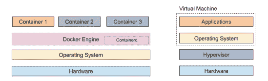
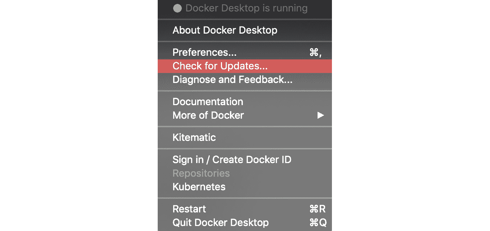

# *第十二章*：容器安全介绍

在开发技术项目时，安全性应是一个基本关注点。我们生活在一个被安全威胁环绕的世界，从恶意软件和病毒到数据泄露，各种安全威胁层出不穷。成为网络犯罪或信息泄露的受害者可能会带来越来越严重的后果，特别是在欧盟的**通用数据保护条例**（**GDPR**）等法规下。

当发生侵犯或妥协时，通过良好的架构实践限制其范围的能力至关重要。这通过所谓的横向移动限制概念来实现。我们指的是利用一个被入侵系统访问另一个系统，从而使攻击者能够在您的系统中穿越，进一步侵害系统并窃取数据。

幸运的是，正确部署的容器化可以通过多种功能帮助您通过本书最后一部分将要探讨的功能提高安全姿态。但是，首先，我们应该探讨 Docker 安全架构的技术基础，以便开始构建。本章中的一些概念将是我们在本书其他地方探讨的想法的总结，并以安全设置的方式呈现。这不仅有助于巩固您的学习过程中的这些概念，还有助于您理解如何保护您的应用开发项目。

在本章中，我们将简要概述容器的安全架构及其与虚拟化的关系和比较，以及 Docker Engine 和 containerd 从安全角度工作的方式及其从 Linux 继承的概念。我们还将查看您可以实施的利用 Docker 安全架构的最佳实践概述。这将为后续章节深入探讨该主题奠定基础。

我们将在本章中涵盖以下主题：

+   虚拟化和 hypervisor 安全模型

+   容器安全模型

+   Docker Engine 和 containerd – Linux 安全功能

+   cgroups 说明

+   最佳实践概述

因此，让我们首先回顾容器和虚拟化的区别，以及安全如何成为两者的基本组成部分。

# 技术要求

对于本章，您需要访问运行 Docker 的 Linux 机器。我们建议您继续使用本书中迄今为止使用的设置。

如果您已跳转到安全部分作为起点，我们建议您从[`docs.docker.com/v17.09/engine/installation/`](https://docs.docker.com/v17.09/engine/installation/)安装 Docker Community Edition。

查看以下视频，了解代码实际操作：

[`bit.ly/3gW33FD`](https://bit.ly/3gW33FD)

# 虚拟化和 hypervisor 安全模型

在之前的章节中，我们探讨了 Docker 是如何工作的，以及它与其他技术（如 FreeBSD jail 和虚拟化）的比较。基于我们在这里学到的内容，我们现在将进一步理解支撑 Docker 的安全模型。

首先，让我们来看看虚拟化工具是如何实现安全性的，这样我们就能理解 Docker 与这些工具的相似与不同之处。

## 虚拟化与保护环

在使用**虚拟机**（**VMs**）时，你可能会遇到“超管程序”（hypervisor）这个术语。它是一个协调虚拟机如何在系统上运行以及如何与底层硬件交互的程序。有些超管程序产品被称为类型 1 超管程序，它们直接运行在硬件之上。其他的，如 VirtualBox，是通过现有操作系统安装的，可以让你加载额外的操作系统作为虚拟机。

超管程序如何与底层硬件协作，是由所谓的保护环来决定的。这些保护环决定了特权的层级，实际上决定了计算机系统的软件（例如操作系统、驱动程序和桌面应用程序）能够访问底层硬件的哪些部分。

通常，你会看到保护环被建模为一组同心圆，如下所示：


图 12.1 – 保护环示例

有时**设备驱动程序**环也可能会显示为两个独立的环（如图中的虚线圆圈所示）。

每种硬件架构在适应保护环模型时会有所不同，因此，运行在其上的操作系统可能也会在不同的层级上运行代码。然而，通常会看到环 0——即位于中心、特权最高的环——被称为**内核环**（有时也叫做**内核空间**）。

恶意软件通常会尝试攻击内核，以便获得对系统的完全访问权限并执行低级系统进程。这类软件通常被称为内核模式根套件。因此，保护内核至关重要，同时也要确保如果系统被恶意应用程序、库或软件包攻破，它无法提升特权以获取对内核的访问权限，这是至关重要的。

外层环则可能处理设备驱动程序和应用程序。每个环都有其对应的层级，而包含用户应用程序的外层环通常被称为**用户空间**。网关处理每个环如何与下层环进行交互。与内核一样，恶意软件有可能感染运行在这些层级上的应用程序，包括运行在第 3 层的用户模式根套件（rootkit）。

考虑到这些威胁，保护环模型有助于防止你在桌面上安装的程序恶意访问底层硬件并绕过内核。因此，恶意软件编写者被迫寻找安全漏洞和其他混淆其攻击手段的方式，比如将他们的代码注入到其他进程中。你可以把这些安全层看作是需要突破的一道道门，而不是攻击者能直接进入并获得底层硬件的访问权限。

这些分层的隔离措施，虽然不是万无一失的，但有助于提供所谓的分层安全方法。其思路是通过在一个安全层上再增加另一个安全层，我们使得攻击变得越来越难以实现。

### 虚拟化与恶意软件

由于我们关注虚拟化以及虚拟化与 Docker 容器的比较，我们自然会关注虚拟化如何融入这个模型。那么，虚拟化如何防御根套件（rootkits）和其他恶意软件呢？

许多现代硬件架构，如 ARMv7-A，包含一个超管程序（hypervisor）作为我们的环模型中的一个权限级别，这个权限级别比操作系统权限更高。这使得超管程序能够在上面一环的操作系统之间切换。

一些架构还实现了被称为**环-1**的机制。这允许超管程序运行在一个更深的安全环中，而客操作系统内核运行在环 0。例如，如果你在 x86 平台上运行 VirtualBox，取决于是否支持硬件虚拟化，VirtualBox 将运行在环-1 或环 0。

虚拟机（VM）由于多种原因在进行恶意软件分析时非常有用，其中之一是机器可以被锁定，因此它是一个自包含的环境。一旦分析人员完成对代码及其效果的分析，虚拟机可以被删除，而无需重新安装整台机器的操作系统，或者（如果正确配置）避免恶意软件访问底层硬件的风险。

总结来说，保护环提供了一种机制，用于将软件进行分段，使其只能访问某些特定资源。在虚拟化模型中，超管程序可以运行在权限最高的环中，以便在操作系统之间切换。超管程序可以通过现有的操作系统（如 Windows）安装，或部署在裸机上，如 VMware ESXi 产品。它也可以用来创建一个沙箱环境，防止恶意代码感染底层硬件或操作系统。

那么，这与 Docker 有什么关系，保护环模型如何应用到 Docker 中？

## Docker 与保护环

和虚拟机一样，Docker 容器提供了一个隔离的环境，用于在现有操作系统上运行你的代码。这个操作系统可以是虚拟化的，也可以直接安装在裸机上。

那么，这究竟是如何运作的呢？你可能还记得，Docker 容器运行在 Docker Engine 上，而 Docker Engine 又通过一个名为 **containerd** 的中间组件运行在操作系统之上。这与我们之前讨论的类型 1 虚拟化程序不同，类型 1 虚拟化程序运行在基础设施之上，而客户操作系统则运行在虚拟化程序之上。

因此，Docker 容器都在同一个操作系统上运行，无论它是否被虚拟化。事实上，在某些情况下，例如在 Windows 上运行 Linux 容器时，你可能会注意到它使用了一个中间步骤。这包括运行一个虚拟化版本的 Linux，进而运行 Docker 引擎。在这种情况下，所有容器都运行在同一个虚拟化的 Linux 操作系统上。

注意

Docker Engine 企业版也支持原生 Windows 容器。你可以在[`www.docker.com/products/windows-containers`](https://www.docker.com/products/windows-containers)阅读更多关于它们的信息。

所有这一切的关键概念是，隔离发生在容器级别，而不是（或除了）虚拟机级别。因此，从基础层面来看，Docker 并不提供与虚拟机本身相同的沙箱功能。

以下图示展示了两者的区别：



图 12.2 – Docker 和虚拟机中的隔离示例

在前面的图示中，如果我们在虚拟机堆栈上运行 Docker，我们将用 **Docker Engine**/**Containerd** 和容器层替换 **应用程序** 层。

正如你可能看到的，这提供了一个额外的安全层，除了由底层主机操作系统提供的安全性之外，或者在适用时由虚拟化层提供的额外安全层。然而，当这个安全层在主机操作系统上运行而不是通过虚拟机时，这意味着如果 Docker Engine 存在安全漏洞，你将面临额外的风险。

因此，Docker 容器访问底层系统/内核是通过引擎进行调节的，而引擎则通过 containerd 发出系统调用（在大多数情况下，是通过 `runc` 调用的）。

注意

如果你想更详细地了解 containerd 和 runc，可以查看官方网页 [`containerd.io/`](https://containerd.io/)。

在这里，我们为每个容器与底层操作系统和硬件之间提供了一个隔离层。Docker Engine 不运行在 ring 0 或 ring -1，而是运行在 ring 3，这意味着尽管它容易受到其他形式的攻击，但它不像虚拟化程序那样直接访问硬件。

注意

即便采用这种分层的安全方式，过去也曾发现漏洞。你可以在[`www.twistlock.com/labs-blog/breaking-docker-via-runc-explaining-cve-2019-5736/`](https://www.twistlock.com/labs-blog/breaking-docker-via-runc-explaining-cve-2019-5736/)了解更多信息。

此外，每个容器都是一个独立的自包含库和应用程序集合，它们只能通过 Docker 引擎相互通信。如我们所提到的，容器默认情况下无法访问 Docker 引擎所在的底层操作系统。事实上，任何对底层操作系统资源的访问调用，必须在设置 Dockerfile 时显式配置。因此，Docker 容器运行在环级 3，即用户空间，并且在此基础上增加了额外的安全层。

现在我们已经了解了环模型以及 Docker 和虚拟化如何与之协作，接下来让我们看看容器安全模型以及它们从 Linux 的最佳实践和技术中继承了什么。

# 容器安全模型

从硬件层开始，经过虚拟机管理程序和基础操作系统如何调解访问的方式，我们可以开始审视在环级 3 上运行的软件层发生了什么。为了深入了解这一点，我们需要理解 Docker 容器安全模型中的两个关键特性：

+   应用程序与底层宿主系统隔离。

+   容器化应用程序相互隔离。

那么，Docker 是如何实现这些目标的呢？答案正如你所猜测的，通过 Docker 引擎和相关组件，如 containerd。这些组件继承了 Linux 的许多关键特性和概念，并在安全性方面带来了主要好处，包括以下内容：

+   **runc**：轻量级容器运行时

+   **Namespaces**：Linux 用于分割内核资源的方法

+   **控制组（cgroups）**：限制 CPU 使用等资源的内核特性

此外，它还允许实现 Linux 内核中发现的其他安全特性，例如：

+   **SELinux**：用于处理访问控制安全策略的 Linux 内核安全模块

+   **AppArmor**：用于限制应用程序能力的 Linux 特性

+   **TOMOYO**：用于处理**强制访问控制**（**MAC**）的 Linux 安全模块

+   **GRSEC**：为 Linux 内核提供的一系列安全增强功能

这些经过验证的最佳实践确保容器能够以安全的方式彼此隔离，并与宿主操作系统隔离。接下来我们将深入探讨 Docker 引擎和 containerd，以更好地理解这些安全特性是如何实现的。

# Docker 引擎和 containerd – Linux 安全特性

你之前安装的 Docker 引擎作为所有应用容器的协调者。除了引擎外，还有其他一些关键组件构成了 Docker 生态系统。最初，许多组件被集成到 Docker 引擎中，但随着时间的推移，为了使引擎更小更快，一些组件，如用于管理容器的运行时机制，被拆分为独立的项目。

其中一个例子是 containerd 项目。containerd 实现了 `runc`，它支持容器管理，并且被多个与 Docker 相关的项目使用，包括 Kubernetes CRI。

注意

你可以从 GitHub 下载并查看 containerd 的源代码，链接为 [`github.com/docker/containerd`](https://github.com/docker/containerd)，以及 `runc` 的源代码，链接为 [`github.com/opencontainers/runc`](https://github.com/opencontainers/runc)。

containerd 解决了聚合 Linux 内核中多个功能并提供一个抽象层来处理 **系统调用** (**syscalls**) 的问题。因此，Docker 引擎位于其上方，并利用它与底层操作系统进行交互。一个由 Docker 引擎交给它的任务例子是将进程附加到现有容器上。

这种模块化的方法不限于引擎及其与操作系统的交互。例如，容器和引擎不需要位于同一台机器上。因此，可以对托管选项进行拆分。

这种分布式模型的运作方式是，Docker 实现了客户端-服务器模型，容器引擎作为服务器，而每个容器作为客户端。此架构的一些关键特性如下：

+   服务器作为 Linux 守护进程运行 ([`man7.org/linux/man-pages/man7/daemon.7.html`](https://man7.org/linux/man-pages/man7/daemon.7.html))。

+   终端中的 Docker `docker` 命令。

+   容器与引擎之间通过 REST API 进行通信。

需要注意的是，容器与引擎之间的通信通道可以通过 SSL/TLS 加密。

SSL/TLS 是加密 Web 端点之间流量的事实标准。当你通过 HTTPS 协议访问网站内容时，可能已经见过它的应用。稍后，我们将探讨如何启用 SSL/TLS 来帮助保护 Docker 守护进程套接字。

Docker 提供了一整套用于配置复杂网络的功能，关于这一点的详细信息可以在 Docker 网站上阅读：[`docs.docker.com/v17.09/engine/userguide/networking/`](https://docs.docker.com/v17.09/engine/userguide/networking/)。

客户端-服务器架构提供的隔离性，使得主机操作系统与各个容器之间（无论是否位于同一台机器上或分布式）可以基于最小访问原则进行操作。这意味着每个 Docker 容器仅能访问其所需的资源，如磁盘或网络资源，而无法访问其他资源。此外，一个 Docker 容器无法访问另一个容器的进程。

最小访问模型的实现得益于 Linux 命名空间，它用于将进程隔离开来。通过虚拟化的 Linux 环境托管引擎在 Windows 上运行 Docker，是 Windows 用户能够享受此技术的方式之一。

注意

如果你想了解更多关于原生 Windows 容器如何实现进程和 Hyper-V 隔离的信息，可以访问 Windows 容器网站：[`docs.microsoft.com/en-us/virtualization/windowscontainers/manage-containers/hyperv-container`](https://docs.microsoft.com/en-us/virtualization/windowscontainers/manage-containers/hyperv-container)。

当 Docker 引擎部署一个容器时，它会生成一些 Linux 命名空间。这些命名空间如下：

+   **进程 ID**（**PID**）命名空间

+   **挂载**（**MNT**）命名空间

+   **网络**（**NET**）命名空间

+   **进程间通信**（**IPC**）命名空间

+   **Unix 时分共享**（**UTS**）命名空间

+   `USER`命名空间

现在我们将更详细地了解这些命名空间，以理解它们的安全影响。

## PID 命名空间

正如你所知道的，Linux 操作系统中的每个进程都位于一个树形结构中，并被分配一个称为 PID 的 ID。PID 命名空间允许进程的隔离。通过实现 PID 命名空间，我们可以防止容器查看系统进程。除了安全性上的好处外，它还带来了额外的好处，即可以重用系统 PID，如 PID 1。

如果你希望允许容器访问系统进程，那么你必须在 Dockerfile 中显式地编码这一点。这遵循了前面提到的最小权限原则。因此，在以这种方式实现任何功能之前，请仔细考虑。

## MNT 命名空间

MNT 命名空间允许容器访问自己的根目录集合和文件挂载。这种方法使你可以创建一个私有文件系统，从而隔离哪些文件可以被哪些容器访问，减少了被攻破的容器访问不该访问的文件或造成意外文件损坏的风险。

## NET 命名空间

Docker，如我们简要讨论过的，提供了多种网络工具。默认情况下，当你部署一个容器时，它将启用网络功能。这将允许容器进行外部连接。默认情况下，容器将使用主机配置的相同 DNS 服务器，并且会为其分配一个 MAC 地址。IPv4 和 IPv6 的 IP 地址可以通过相关标志进行设置。如果你选择通过可用标志覆盖 MAC 地址，你应该知道，系统没有机制自动检查 MAC 地址是否唯一。重复的 MAC 地址可能会导致 MAC 地址冲突。

如果你希望禁用特定容器的网络功能作为安全防护的一部分，可以在执行`run`命令时，通过覆盖设置`--network`标志来实现。将该标志设置为`none`将禁用所有外部访问，仅保留环回地址可访问。

还有许多其他配置选项可用于自定义容器网络设置，这些选项可以通过帮助菜单进行访问。

## IPC 命名空间

IPC 命名空间用于提供命名共享内存段的隔离，以及消息队列。

IPC 命名空间被锁定，以防止一个命名空间中的进程访问另一个命名空间中的进程。这个模型的好处是，容器可以安全地部署一组需要使用内存段的服务，例如你在金融科技领域可能会遇到的应用程序类型。

## UTS 命名空间

UTS 命名空间允许我们为在该命名空间中运行的进程设置域名和主机名。这个命名空间是默认功能，因此所有容器都有启用，它允许你为每个容器分配不同的主机名。

## USER 命名空间

我们将讨论的最后一个命名空间类别是 `USER` 命名空间。这是一种机制，允许你将用户和用户组映射到容器中。一旦映射，用户可以被分配不同的用户 ID。

从安全角度来看，这个功能的一个非常有用的好处是，它有助于防止容器被用于特权升级攻击。实现这一点的示例不仅包括以非特权用户身份运行应用程序，还包括在 Docker 主机级别将容器内的 root 用户映射到一个较低权限的用户。因此，容器内以 root 身份运行的进程，其特权级别被限制在它们所在的容器内。

# 关于 cgroups 的说明

Linux **cgroups** 是一种机制，用于控制可生成的进程数量，从而防止系统出现严重的性能损失，甚至崩溃。

通过使用 cgroups，我们可以限制通过 `fork()` 和 `clone()` 操作生成的进程数量。一旦达到限制，就无法在该 cgroup 下生成更多进程。此外，cgroups 支持设置 CPU 和内存限制。你可以在[`www.man7.org/linux/man-pages/man7/cgroups.7.html`](https://www.man7.org/linux/man-pages/man7/cgroups.7.html)阅读它们的完整选项列表。

使用这个功能可以让你更精细地控制容器所使用的系统资源。在容器遭到入侵的情况下，防止其过度消耗系统资源是一个有用的机制，可以在你修复问题之前限制损害。

在了解了 Docker 引擎和 containerd 如何使用 Linux 最佳实践之后，我们现在来看一下我们可以使用的一些最佳实践，这些实践也实现了我们迄今为止讨论的一些功能。

# 最佳实践概述

在接下来的章节中，我们将深入探讨确保容器安全的技术。你会高兴地知道，有许多最佳实践可以让你从一开始就确保你在最基本的层面上思考并实施安全性。

首先需要理解的一点是，您可能已经注意到了，Docker 容器与虚拟机相比，提供的安全性并不相同。我们之前举过一个例子，说明虚拟机如何因其沙盒化环境被用来进行恶意软件分析。因此，从安全的角度来看，您应将容器视为一种用于优化系统资源和应用程序开发及交付的机制（内置了一些非常有用的安全性），而不是把它当作微型虚拟机来使用。

记住这一点后，让我们来看一些在使用 Docker 时可以应用的最佳实践。

## 保持 Docker 更新

与您运行的任何应用程序一样，保持 Docker 更新非常重要。例如，Docker Engine 中未打补丁的安全漏洞可以被恶意行为者利用，在发生安全事件时，通过访问您的某个容器进行攻击。

例如，在 macOS 中，Docker Desktop 应用程序提供了检查更新的选项，并且偏好设置允许您自动检查更新：



图 12.3 – macOS 上检查更新的示例

在实施 Docker 时，您可能还希望根据安全补丁或是否使用 Docker 企业版来手动升级软件。

每个补丁/版本的列表可以在 Docker 网站上找到，包含新增的功能或已解决的问题：

[`docs.docker.com/engine/release-notes/`](https://docs.docker.com/engine/release-notes/)

您会注意到，这里列出的一些项目带有 **CVE** 前缀，代表 **常见漏洞和暴露**。CVE 列表是公开披露的安全问题集合。当 Docker 的安全问题被发现时，它可能会列在 CVE 数据库中，并且在修复后，问题的 CVE ID 会出现在发布说明中。

关于这个话题的最后一点，请记得也要保持 Docker 运行所在的底层操作系统的补丁和加固。

## 保护 Docker 守护进程套接字

除了确保 Docker 定期打补丁外，我们还需要保护守护进程套接字。这意味着要对其进行锁定，防止攻击者利用它获得对底层主机的 root 权限。Docker 安全文档提供了一个详尽的指南来实现这一点；但在此我们将做一个总结。

注意

要了解更多关于守护进程套接字的信息，请参考 Docker 网站上的官方文档：[`docs.docker.com/engine/reference/commandline/dockerd/#daemon-socket-option`](https://docs.docker.com/engine/reference/commandline/dockerd/#daemon-socket-option)。

您可以在 Linux 系统中找到域套接字文件，路径为 `/var/run/docker.sock`。

该文件应仅通过 root 权限或 Docker 组中的账户访问。

我们现在将设置通过 TLS/SSL 加密访问 Docker 守护进程，以增加额外的保护层。

如您所知，通过使用`-H`标志启用未加密的 TCP 套接字，包括 TCP 协议、主机和端口号。按惯例，未加密连接的端口是`2375`。往后，如果您一直使用这种方法，建议您停止使用，并改用内建的 TLS/SSL 支持。

在我们能够通过安全通道连接客户端和主机之前，需要生成以下文件：

+   **证书授权中心**（**CA**）私钥和公钥

+   服务器密钥

+   服务器**证书签名请求**（**CSR**）

+   签名证书

+   客户端密钥

+   客户端 CSR

根据您的操作系统，生成这些 OpenSSL 文件的步骤会有所不同。Docker 网站提供了一个方便的步骤列表。Windows 用户也可以使用 Linux 虚拟机执行这些步骤：

[`docs.docker.com/engine/security/https/`](https://docs.docker.com/engine/security/https/)

通过启用 Docker 守护进程使用 CA、服务器证书和服务器密钥，可以以以下方式实现加密。在此示例中，我们将在`0.0.0.0`上运行守护进程，并使用端口`2376`：

```
dockerd --tlsverify --tlscacert=tlsca.pem --tlscert=tlsservercert.pem --tlskey=tlsserverkey.pem -H=0.0.0.0:2376
```

现在，我们可以测试连接。首先，确保客户端证书、密钥和 CA 可用。然后，运行以下命令：

```
docker --tlsverify --tlscacert=tlsca.pem --tlscert=tlscert.pem --tlskey=tlskey.pem -H=$HOST:2376 version
```

现在，您应该能够通过加密通道成功连接到 Docker 守护进程。

## Docker 无法修复糟糕的代码

Docker 可以做很多事情来帮助缓解安全问题的影响，但它不能修复糟糕的代码。在编写应用程序时，适用于部署在 EC2 实例、VMware 或任何其他平台上的最佳实践同样适用于应用程序开发。

应用程序安全的一个好起点是 OWASP 十大漏洞。除了标准文档，OWASP 还提供了许多有用的备忘单指南，用于应用程序安全开发。

您可以在[`cheatsheetseries.owasp.org/`](https://cheatsheetseries.owasp.org/)找到它们。

## 始终设置无特权用户

我们简要讨论了`USER`命名空间的主题，以及它如何帮助您提高 Docker 配置的安全性。您应该实施的一项实践是确保尽可能配置容器使用无特权用户。从一开始就这样做，将有助于养成良好的习惯。

实现这一点的两种最简单方法如下：

+   向 Dockerfile 中添加用户。

+   运行 Docker 时，在`run`命令中添加`--user`标志。

在第一种情况下，可以通过以下方式实现：

```
FROM alpine

RUN addgroup -S secureusers && adduser -S secureuser -G secureusers
#Execute any root commands prior to needing to switch users
USER secureuser
```

对于第二种选项，我们可以将标志应用于命令行，如下所示：

```
docker run --user 5000:500
```

在这里，我们包含了用户 ID 和组 ID。

现在我们已经掌握了一些基础知识，在进一步深入一些基本原理并动手实践之前，让我们快速回顾一下我们已经学到的内容。

# 总结

在本章过程中，我们了解了虚拟机和 Docker 如何与底层操作系统、硬件以及彼此协同工作。

接下来，我们探讨了 Docker 从 Linux 到实现的各种功能，以解决安全问题。

最后，我们回顾了一些适用于我们开发的应用程序的最佳实践。现在，让我们进入一些安全基础知识，并在下一章学习 Docker 镜像安全、命令以及构建过程。
