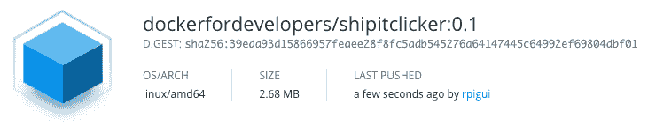

# 第十四章：*第十三章*：Docker 安全基础和最佳实践

为了确保我们的容器在开发和生产环境中都能得到加固，我们可以实施许多技术和最佳实践来实现这一目标。在许多情况下，这仅仅是修改你在本书中学到的现有命令或行为，为你的实践添加额外的安全层。

在本章中，我们将基于我们对 Docker 和容器安全的基础知识进行扩展。这将涉及构建和修改容器的实践操作。内容涵盖了诸如通过使用 Docker 命令和签名镜像来保障镜像安全等主题。完成以下练习后，你应该能够在实际的开发和 DevOps 环境中自如地应用这些技能。

在本章中，我们将覆盖以下主要主题：

+   **Docker 镜像安全性**：在这里，我们将学习镜像安全性，包括使用最小基础镜像、签名和验证过的镜像以及避免数据泄露。

+   在构建 Docker 镜像时使用 `COPY` 而不是 `ADD`。

+   **构建过程的安全性**：在这里，我们将学习构建过程的最佳实践，包括多阶段构建。

让我们通过了解 Docker 镜像安全性和一些最佳实践开始吧。

# 技术要求

本章需要你有一台运行 Docker 的 Linux 机器。我们建议你使用本书中一直在使用的设置。

此外，你还需要在 Docker Hub 上有一个帐户，以便访问其中的镜像。如果你还没有设置，可以在[`hub.docker.com`](https://hub.docker.com)上进行设置。

如果你已经有一个正在运行 SSH 的容器或服务，可以在本章后续部分使用。如果没有，别担心，我们提供了一个来自官方 Docker 文档的示例 Dockerfile，你可以使用它。

查看以下视频，观看代码实践：

[`bit.ly/30WkOPE`](https://bit.ly/30WkOPE)

# Docker 镜像安全性

当你在本书中逐步学习时，你会越来越熟悉镜像。这是 Docker 生态系统中的一个基础构建模块。镜像是文件系统和参数的组合，当 Docker 运行时，它会变成你的容器。

在确保 Docker 本身已经打上补丁并得到加固，确保我们的应用代码健壮，以及确保我们运行容器时它们具有限制权限的情况下，我们还需要确保镜像本身是安全的。

Docker 的一大优点是，像 Docker Hub 这样的服务允许我们共享和重用容器镜像。然而，我们需要小心下载的内容是安全的，且未被恶意方上传：


图 13.1 – Docker Hub 显示示例仓库

然而，即使是合法/官方的网站，你也应该始终保持谨慎。

过去曾有几起恶意镜像被上传到 Docker Hub 的案例，恶意上传者希望这些镜像能被毫无防备的用户下载。恶意代码的例子包括伪装成 **tomcat**、**mysql** 和 **cron** 相关的镜像。例如，包含内核漏洞的被攻击容器可能导致对底层主机的攻击。

Kromtech 安全中心在 2018 年的某一时间段内发现了 Docker Hub 上的 17 个恶意 Docker 镜像。你可以阅读他们的报告《*加密劫持侵袭云端：现代容器化趋势如何被攻击者利用*》，链接：[`kromtech.com/blog/security-center/cryptojacking-invades-cloud-how-modern-containerization-trend-is-exploited-by-attackers`](https://kromtech.com/blog/security-center/cryptojacking-invades-cloud-how-modern-containerization-trend-is-exploited-by-attackers)。

因此，在任何项目中使用第三方工具和代码时，你的第一步应该是验证这些工件的来源是否可信。保持关注安全警报也很重要，确保你不会不小心下载带有漏洞的镜像。

对于 Docker 镜像，一旦你确认来源的有效性，就可以添加额外的验证过程，检查工件本身是否安全。事实上，你可能已经在使用的其他技术中熟悉这个概念，比如在下载操作系统时验证文件完整性哈希。

一个帮助确保我们下载的源是合法的机制是使用 Docker Hub 提供的签名 Docker 认证镜像。正如我们在 Kromtech 报告中看到的，即使是像 Docker Hub 这样的合法主机，我们也永远不能太小心。这些认证镜像已由主机审查并认证为真实。许多流行的应用环境可以在 Docker Hub 上找到，包括以下内容：

+   Splunk 企业版： [`hub.docker.com/_/splunk-enterprise`](https://hub.docker.com/_/splunk-enterprise)

+   Datadog: [`hub.docker.com/_/datadog-agent`](https://hub.docker.com/_/datadog-agent)

+   Dynatrace: [`hub.docker.com/_/dynatrace`](https://hub.docker.com/_/dynatrace)

+   Oracle Java 8 SE（服务器 JRE）：[`hub.docker.com/_/oracle-serverjre-8`](https://hub.docker.com/_/oracle-serverjre-8)

你可以在 Docker Hub 网站上找到更多内容：

[`hub.docker.com/search?q=&type=image&certification_status=certified`](https://hub.docker.com/search?q=&type=image&certification_status=certified)

现在让我们采取实际操作的方法来检查镜像的合法性，包括与 Docker Hub 的互动。启动你的命令行工具，然后继续下一部分。

## 镜像验证

我们需要理解的第一个概念是内容信任。这是 Docker 在镜像上应用的安全模型。

**Docker 内容信任** (**DCT**) 模型的核心是使用数字签名来证明托管在 Docker Hub 等平台上的镜像的完整性。启用 DCT 后，用户可以确保不拉取不可信的镜像（即未签名的镜像），除非他们明确做出例外。

默认情况下，Docker 禁用了 DCT，这允许你在不验证镜像安全性的情况下拉取镜像。这使得你面临下载包含恶意软件或其他安全漏洞的制品的风险。

幸运的是，我们可以使用 `DOCKER_CONTENT_TRUST` 标志来确保在拉取镜像时进行验证。这通过检查镜像是否已由创建者签名，或我们是否正在使用与镜像相关的显式哈希来工作。要在系统范围内启用它，将其包含在 `.bashrc` 文件中，如下所示：

```
$ vim /<path>/<to>/.bashrc
export DOCKER_CONTENT_TRUST=1 
:x
$ source /<path>/<to>/.bashrc
```

如果由于某种原因，你希望与未标签的镜像交互，可以通过在命令中使用 `--disable-content-trust` 标志临时禁用此设置。

`DOCKER_CONTENT_TRUST` 标志可以仅限于单个 shell，而不仅仅是系统范围的覆盖。要在新 shell 中快速启用它，输入以下内容：

```
$ export DOCKER_CONTENT_TRUST=1 
```

只需记住，当你关闭 shell 时，你需要重新启用该标志，或按前述方式在 `.bashrc` 文件中设置系统范围属性。

实际上，当此设置在系统范围内（或在单个 shell 中）启用时，这意味着与带标签镜像交互的命令行操作需要具备两项内容之一。这些可以是附加到镜像上的内容哈希，或者镜像本身需要是已经通过使用签名密钥预先签名的镜像。

签名密钥

签名密钥是一组用于签署镜像的组件。它们包括一个离线密钥，它是 DCT 信任镜像标签的基础，以及一个用于签署标签的标签密钥，最后是一个用于强制执行安全保证的服务器管理密钥集合。

所以，从实际的角度来看，运行命令时到底会有什么结果？让我们通过一个使用 `shipitclicker` 镜像的简单示例来看一看。

如果我们希望在启用 `DOCKER_CONTENT_TRUST` 标志时拉取 `shipitclicker` 镜像，可以使用 `@` 符号将哈希附加到镜像。比如以下示例：

```
$ docker pull dockerfordevelopers/shipitclicker@sha256:b20caa037ac2c36a9845f719ebb12952bbb3e749d4b05fcdcd8d 38201a7de795
```

只要内容哈希 `sha256:b20caa037ac2c36a9845f719ebb12952bbb3e749d4b05fcdcd8d382 01a7de795` 存在，命令就会成功。否则，假设我们想拉取该镜像的最新版本或版本号，比如以下示例：

```
$ docker shipitclicker:v0.1
```

在这种情况下，我们需要确保镜像已经被签名，否则命令将会失败。`pull` 命令并不是唯一与可信内容交互的操作，其他包括以下内容：

+   `$docker push`

+   `$docker build`

+   `$docker create`

+   `$docker run`

我们现在可以进行测试了。我们已提前为你创建了 `shipitclicker` 镜像，你可以从 Docker Hub 拉取，位于 Packt Docker 书籍仓库中的 [`hub.docker.com/r/dockerfordevelopers/shipitclicker`](https://hub.docker.com/r/dockerfordevelopers/shipitclicker)。

你可以尝试使用以下命令拉取此镜像：

```
$ docker pull dockerfordevelopers/shipitclicker:v0.1
```

你现在应该会看到一个类似于 *请求被拒绝* 的错误：

```
Error: remote trust data does not exist for docker.io/ dockerfordevelopers/shipitclicker: notary.docker.io does not have trust data for docker.io/ dockerfordevelopers/shipitclicker
```

确保在自动化构建过程中启用此标志也是必须的，因为它可以防止未经验证的镜像意外进入你的环境。

这种非常简单的 DCT 使用方法对于确保你避免使用来自 Docker Hub 的不信任内容非常有效。现在，让我们更仔细地看看基础镜像。

## 使用最小化基础镜像

所以我们知道我们正在拉取签名镜像或特定的哈希值，但我们是否需要考虑我们在容器中使用的镜像类型？答案是 *是的*。

使用镜像时，你应该问问自己，是否真的需要整个操作系统，包括所有预装的包？在某些情况下，这可能会引入漏洞，因为你可能会在容器中包含未修补的库和其他代码。因此，最好的方法是从简单的镜像开始，然后逐步构建。这将有助于减少整体攻击面。

现在让我们从 Docker Hub 拉取一个最小化的镜像，这样我们可以在本章其余部分进行操作。我们将使用的镜像是 `shipitclicker:v0.1`，它刚刚通过 `DOCKER_CONTENT_TRUST` 进行了测试，并基于 Alpine。

注意

如果你有兴趣查看，并且还没有这样做，Alpine 镜像仅有 5 MB 大小，并且是 Docker Hub 官方镜像计划的一部分。这些镜像是一些仓库，提供所有基本的必要内容，同时确保所有安全补丁定期应用。除此之外，官方 Docker 镜像也是签名的，因此可以保证本章讨论的镜像验证安全措施。

首先，你需要在当前的 shell 中禁用 `DOCKER_CONTENT_TRUST`，或者获取镜像的哈希值，以便你现在可以拉取它。如果你希望禁用 `DOCKER_CONTENT_TRUST`，可以通过在当前 shell 中执行以下命令来实现：

```
$ export DOCKER_CONTENT_TRUST=0
```

只要记住，如果你关闭了 shell 并创建了一个新的，你需要再次运行此命令。我们建议你将标志保留为 `1`，而是拉取哈希版本。

你可以在仓库的 **Tags** 标签下找到哈希值，如以下链接所示：

[`hub.docker.com/r/dockerfordevelopers/shipitclicker/tags`](https://hub.docker.com/r/dockerfordevelopers/shipitclicker/tags)

从这里，选择你感兴趣的版本下显示的摘要值。这将显示 `sha256` 哈希值，例如以下所示：

```
DIGEST:sha256:39eda93d15866957feaee28f8fc5adb545276a64147445c 64992ef69804dbf01
```

以下截图显示了你可以找到用于 `docker pull` 命令的哈希位置：



图 13.2 – Docker 镜像的信息

包含 `sha256` 之后的字符串部分可以在拉取请求中使用：

```
$ docker pull  dockerfordevelopers/shipitclicker@ sha256:39eda93d15866957feaee28f8fc5adb545276a64147445c64992ef 69804dbf01
```

你现在应该在终端中看到类似以下内容：

```
sha256:39eda93d15866957feaee28f8fc5adb545276a64147445c64992ef 69804dbf01: Pulling from dockerfordevelopers/shipitclicker
Digest: sha256:39eda93d15866957feaee28f8fc5adb545276a64147445c 4992ef69804dbf01
```

现在运行 `docker images` 命令应该能看到它已出现在你的系统中。

在构建自己的镜像时，另一个需要考虑的因素是使用 `.dockerignore` 文件帮助减少整个容器的大小。

在构建上下文目录中包含 `.dockerignore` 文件时，文件中列出的任何文件将不会被添加到镜像中。正如你将很快看到的，这还有一个方便的好处。从镜像大小的角度来看，考虑到我们提倡的最佳实践——保持干净，我们可以利用这一点避免像 Python `.pyc` 文件和类似的二进制文件被意外添加到镜像中。以下示例的 `.dockerignore` 文件演示了我们如何做到这一点：

```
 # ignore .pyc and .git files/directories
.git
**/*.pyc
```

这种方法非常简单，如果你习惯使用 `.gitignore` 文件的话，应该已经非常熟悉了。

现在我们有了最小的基础镜像，我们应该看看在创建容器时限制权限的一些方法，以防止意外的安全漏洞。

## 限制权限

在上一章中，我们研究了分配用户和组来限制启动镜像时的权限提升。我们可以在此基础上，进一步使用一个有用的参数 `no-new-privileges`。

该标志利用了底层 Linux 内核的 `no_new_privs` 功能。这个功能的基本思想是确保任何进程，包括子进程，在生成时无法获得额外的权限。启用此选项后，应用程序将无法使用 `setuid` 等功能。

注意

`setuid` 功能允许用户以提升的权限运行和执行某些程序。这构成了一个安全威胁，因为攻击者可以利用它执行他们通常无法访问的代码和程序。

通过此功能生成的进程也无法取消 `no_new_privs` 标志，因此防止攻击者通过 `setgid` 或 `setuid` 禁用此功能并提升权限。

要在运行容器时启用 `no-new-privileges` 功能，你需要包括 `--security-opt` 标志并将其作为参数添加。

让我们试试刚刚下载的镜像：

```
$ docker run -d -it --security-opt=no-new-privileges dockerfordevelopers/shipitclicker@sha256:39eda93d15866957 feaee28f8fc5adb545276a64147445c64992ef69804dbf01
```

镜像现在应该已经以这种模式运行。记住，我们可以通过运行以下命令获取容器名称：

```
$ docker ps -a
```

禁用容器获取更高权限的能力也有助于防止容器突破。**突破**这个术语是用来指代一个已被攻破的容器能够访问底层主机上的敏感数据的情况。在容器被利用且漏洞允许攻击者提升权限（例如，如果之前讨论的标志未包含在内）的场景下，他们可能会尝试转移攻击并通过 Docker 进一步攻破其他容器，或者利用主机本身获得其他利益。

正如我们将在本章后面学习的那样，通过限制容器的权限（称为能力），在运行时可以进一步加固我们的系统。

现在我们来看一些可以添加的标志，以及其他一些确保我们使用的数据保持安全的技术。

## 避免你的镜像数据泄露

在 Linux 中，我们可以实现用户和组的管理，以确保只有需要读取和写入文件的用户才能执行这些操作。这种精细化的访问权限系统对于防止数据泄露非常重要。另一个保护镜像文件系统的方法是将文件系统和所有卷设置为只读状态。

让我们从查看一个可能想要挂载的卷开始。我们将基于`shipitclicker`镜像运行一个新容器，并将本地文件系统挂载到其中。为了实现这一点，除了`--mount`标志，我们还将在`run`命令中加入一个`readonly`语句。

首先，在你的本地操作系统上创建一个空文件夹，我们可以用它来挂载文件系统：

```
$mkdir testfiles
```

接下来，尝试运行以下命令。它将挂载本地文件夹并运行容器，并尝试向`/mnt/testfiles`目录写入一个名为`test.file`的文件：

```
$ docker run --mount source=testfiles,destination=/mnt/testfiles,readonly dockerfordevelopers/shipitclicker@ sha256:39eda93d15866957feaee28f8fc5adb545276a64147445c64992ef 69804dbf01 sh -c 'touch /mnt/testfiles/test.file'
```

现在你应该会看到一个错误，告知你文件系统是只读的：

```
touch: /mnt/testfiles/test.file: Read-only filesystem
```

通过这种机制，我们可以读取挂载到容器上的文件，但避免容器能够将文件写回，从而防止意外地将密钥或其他数据写入主机上不应存放的目录。

注意

一个重要的要点是，root 账户可以覆盖任何文件权限，因此可以读取容器中的任何文件。如果有人获得了 root 访问权限，他们可以窃取你的数据！

那么如何保护容器本身的文件系统呢，例如`/tmp`目录？幸运的是，Docker 提供了一个简单的方法来实现这一点，通过`--read-only`标志。我们可以尝试一下，看看它在实践中的效果。首先，停止我们刚才创建的容器。记住，你可以在运行`docker ps -a`命令时获取容器的名称。

一旦你获得了容器名称，停止容器。我们这里使用了`nervous_sinoussi`作为示例名称；请用你容器的唯一名称替换它：

```
$ docker stop nervous_sinoussi
```

现在，我们将使用`--read-only`标志重新创建容器。在`run`命令中将包括尝试将名为`test`的文件写入`/tmp`目录的示例。启用`--read-only`标志后，我们应该会看到一个错误，提示此操作不被允许。

让我们删除之前创建的容器，以保持环境的清洁：

```
$docker container rm nervous_sinoussi
```

所以，尝试运行以下命令，记得包括你的容器名称：

```
$ docker run --read-only dockerfordevelopers/shipitclicker@ sha256:39eda93d15866957feaee28f8fc5adb545276a64147445c64992e f69804dbf01 sh -c 'echo "Testing" > /tmp/test'
```

你现在应该会看到如下错误：

```
sh: can't create /tmp/test: Read-only filesystem
```

检查正在运行的 Docker 进程列表时，你将看到命令已执行并退出。让我们清理这个容器并尝试重新运行不带标志的命令，同时回显我们创建的文件内容：

```
$ docker run dockerfordevelopers/shipitclicker@sha256:39eda93d15866957feaee28f8fc5adb545276a64147445c64992ef69804 dbf01 sh -c 'echo "Testing" > /tmp/test | echo "File content is: $(cat /tmp/test)"'
```

现在，通过`echo`命令显示文件系统已写入的确认信息，`echo`命令会打印`/tmp/test`的内容：

```
File content is: Testing
```

因此，为了避免文件系统可以被写入的第二种情况，始终包括`--read-only`标志。

此外，记得不要在 Dockerfile 中包含敏感信息，如私钥和 API 令牌。你可以使用一些服务来避免这种情况，包括 HashiCorp Vault、Docker Swarm 以及云提供商（如 AWS）内置的服务，例如 SSM。*第十四章*，*高级 Docker 安全——机密、机密命令、标记和标签*，将更详细地讲解这些内容。

牢记一些最佳实践后，让我们来看看我们将用来构建自己镜像的命令，以及需要考虑的安全问题。

# Docker 命令的安全性

我们很快将探讨构建过程以及如何从安全角度加强这一过程。为了做到这一点，然而，我们首先需要更详细地了解一些我们将要使用的命令，以便知道哪些是安全的，哪些可能构成潜在威胁。让我们从`COPY`和`ADD`命令开始。

## COPY 与 ADD——这其中有什么区别？

当你开始构建镜像时，你需要将文件从主机复制到镜像中。通常，做这件事有两种方法。如果你做过一些在线研究，你可能见过类似“不要使用`ADD`命令”的评论。那么，为什么呢？

`ADD`命令允许我们递归地将文件复制到镜像中，类似于 Linux 中的`cp -r`命令，如果需要，我们还可以通过`zip`命令来压缩。简而言之，它扩展归档文件并创建目标位置不存在的目录。

命令的输入是一个 URL，可以引用本地或远程（归档）文件。正如你可以想象的那样，从远程位置拉取时，有很多风险需要考虑。

+   远程主机上的文件是否已被修改并遭到破坏？

+   你知道远程主机上的文件来源吗？

+   关于**中间人攻击**（**MITM**）有哪些考虑因素？

这个命令在 Dockerfile 中的使用示例如下：

```
ADD https://github.com/PacktPublishing/Docker-for-Developers/archive/master.zip /tmp/ch13/
```

在这种情况下，将下载并解压缩本书 GitHub 账户上托管的仓库的压缩版本到 `tmp` 目录。

我们之前讨论了使用 `.dockerignore` 文件来帮助保持镜像大小小巧。除了这个好处，它们还可以防止文件在使用 `ADD` 命令时被意外添加。例如，你可以确保像配置 `.ENV` 文件或类似文件不会被复制过去。

`COPY` 命令的工作方式与 `ADD` 略有不同。像 `ADD` 一样，它会递归地复制文件。然而，你必须明确提供源文件夹和目标文件夹。这意味着你必须声明文件的来源和去向。例如，从 A 复制到 B 的 ZIP 文件仍然是一个 ZIP 文件，不会展开，从而避免了任何意外后果。

我们可以看到这个命令语法的示例如下：

```
COPY master.zip /tmp/ch13
```

将添加文件的过程分解为多个步骤是更安全的做法，比如先下载文件、扫描文件，然后再复制文件。当访问远程内容时，你还应始终使用 SSL/TLS 连接。这可以通过实现加密安全和经过身份验证的通信路径，防止 MITM 攻击成为问题。

注意

MITM 攻击是指恶意方秘密窃听、转发或篡改两方之间的通信。

我们刚刚看过 `COPY` 命令如何避免一些 `ADD` 命令的问题，但递归复制呢？这里是否存在风险？

## 递归 COPY – 使用时请谨慎

正如你可能知道的，递归复制会将一个位置的内容复制到另一个位置，并包括所有嵌套的子文件夹和文件。

在使用 Docker 的递归复制命令时，有可能不小心将文件复制到镜像中，这是你并不打算复制的文件。

让我们看一个例子。在下面的截图中，我们可以看到一个示例目录，里面包含一个名为 `oops` 的文件夹和一个 `my_secret` 文件。这个文件包含了一个假设的秘密，比如一个 API 令牌，它被意外地留在了文件夹中：


图 13.3 – 示例：秘密被意外地留在源代码中

假设我们运行以下命令：

```
COPY . . 
```

以及所有文件夹所在的父目录，这个秘密文件也会被复制过去，因为命令会递归复制所有内容，包括 `oops` 目录和我们的嵌套文件。

为了避免这些负面影响，更新你的 `.dockerignore` 文件，确保排除敏感文件类型总是一个好习惯。

正如我们之前提到的，如果你熟悉 `.gitignore` 文件，将文件类型添加到 `.dockerignore` 文件应该很简单。以下是一些需要记住的快捷规则：

```
# comment – the line is ignored
* # matches anything up to the * e.g. *.txt matches all text files 
**# matches any number of folders e.g. **/*.txt matches all text files in build context
! #can be used to exclude a specific file e.g. !id_rsa.pub 
tmp? # Any files or folder that start with tmp and include a subsequent character are 
           #ignored  
*/tmp* # Will exclude any directories or files starting with tmp directly below root
*/*/tmp* # Similar to the above however works for two directories below root 
```

使用这些机制，你可以确保各种文件被排除在容器之外，比如 `*.pem` 和 `*.ENV` 文件。

因此，如果你确实计划在 Dockerfile 中使用递归复制，请确保 `.dockerignore` 文件是最新的，并且已经审计过你的应用程序，确保所有被复制的内容都是按预期进行的。

现在，让我们关注构建过程以及如何在这个阶段提升安全性。在这里，我们将看到 `COPY` 等命令如何作为更大过程的一部分发挥作用。

# 构建过程的安全性

我们已经看到如何拉取镜像并以安全的方式运行它们。那么，自己构建容器镜像呢？正如你现在已经熟悉的那样，某些命令在加入到 Dockerfile 时会带来额外的风险。在本章的这一部分，我们将探讨如何使用我们迄今为止学到的技巧来确保构建过程的安全。这将包括使用一个最小的基础镜像（`shipitclicker`）作为起点，然后在运行容器时，使用我们已对该镜像进行过安全测试的调整。

## 使用多阶段构建

正如我们之前所说，我们需要小心处理机密信息，确保它们不会被意外泄露。避免这种情况的一种方法是不要将它们包含在 Dockerfile 中。然而，在构建阶段呢？你很可能会不时需要使用私钥来配合构建过程，例如，从一个使用公钥加密保护的远程服务中拉取代码。

使用密钥的一个安全方法是通过使用多阶段构建。这个过程使用一个一次性中间层，确保数据不会意外泄露到最终的构建过程中。让我们看一个简单的示例。如果你希望运行这段代码，你需要运行一个 SSH 服务器并将你的公钥添加到它。

如果你还没有运行 SSH 服务器，可以重复使用位于 [`docs.docker.com/engine/examples/running_ssh_service/`](https://docs.docker.com/engine/examples/running_ssh_service/) 的 Dockerfile 来构建一个运行 SSH 的容器。

接下来，让我们看一个多阶段构建过程的示例，以及如何将其与访问 SSH 服务结合使用。

将以下代码复制到一个新的 Dockerfile 中，以便你进行操作。在运行 SSH 服务器的容器上，添加一个名为 `file.txt` 的文件，然后更新 Dockerfile 代码，包含你的用户、IP/主机名，以及你刚创建的文件的路径。

在我们构建之前，先快速了解一下这里发生了什么：

```
FROM  dockerfordevelopers/shipitclicker@sha256:39eda93 d15866957feaee28f8fc5adb545276a64147445c64992ef69804dbf01 as intermediate
WORKDIR /test
ARG ssh_prv_key
RUN echo "$ssh_prv_key" > /tmp/id_rsa_test
RUN chmod 600 /tmp/*
RUN apk add openssh
RUN scp -i /tmp/id_rsa_test user@server:/path/to/file.txt .
FROM dockerfordevelopers/shipitclicker@sha256:39eda93 d15866957feaee28f8fc5adb545276a64147445c64992ef69804dbf01
WORKDIR /test
COPY --from=intermediate /test .
```

这段代码做了几件事情。首先，它将我们的 `shipitclicker` 镜像作为一个中间构建步骤。

接下来，它将 `WORKDIR` 设置为 test，并创建一个名为 `ssh_prv_key` 的 `ARG` 值。这个 `ARG` 值将允许我们传入连接远程 SSH 服务器所需的 RSA 私钥的路径。

根据我们的输入，我们将其作为文件输出，然后设置该文件的权限为 `600`。接着，我们安装 `openssh`，以便可以使用 `scp` 命令行功能。接下来才是有趣的部分。

`RUN scp`命令将注入的私钥用于连接远程服务器，以检索名为`file.txt`的文件，并将其复制回当前目录。这一步完成了构建的第一阶段。

在第二阶段，我们再次使用`shipitclicker`镜像，并使用相同的`WORKDIR`，即`test`。然而，最后一行才是魔法发生的地方。它从我们在第一阶段完成的中间步骤中复制出从远程服务器检索到的文件，并将其复制到最终的构建阶段。

从结果中可以看到，最终的容器并不包含我们用来从远程 SSH 服务器检索文件的私钥，因此它不会意外地进入最终的容器中。

一旦你有了一个远程位置来复制文件，可以使用以下命令来构建这个 Dockerfile：

```
$docker build --build-arg ssh_prv_key="$(cat ~/.ssh/id_rsa_test)" .
```

正如你从这个可以猜到的，`ssh_prv_key`构建参数实际上只是我们的私钥的值，连接到变量中。

一旦我们构建好了容器，当我们运行它时，我们希望确保它不会消耗超过所需的资源。这有助于在发生不幸的安全漏洞时减轻损害。

最后需要注意的是，多阶段构建还可以帮助保持镜像的小巧，这是一种理想的特性，正如前面所讨论的。接下来让我们来看看如何进一步限制 Docker 中的功能和资源使用。

# 在部署构建时限制资源和能力

你可以限制容器可用的各种资源，包括 CPU 使用率和内存。这有助于防止拒绝服务攻击。在这种情况下，容器会被利用去消耗主机的底层资源，从而导致整体性能下降，甚至更糟，导致底层主机崩溃。

此外，访问控制机制是确保容器不仅限制使用的资源，还限制权限和访问的重要组成部分。

## 限制资源

为了避免前面提到的 DOS 攻击类型，我们可以使用一组合适的标志来限制容器可以消耗的底层主机资源。

我们将首先关注的领域是内存。Docker 使我们能够通过硬限制和软限制的结合，限制容器能够使用的内存。

我们可以使用`-m`/`--memory`标志为容器设置硬限制。这将为指定的内存量预留，并且不允许容器超过此限制。如果容器被攻破，硬限制功能将防止恶意进程不断消耗底层主机的内存。

设置内存限制时，确保它与你的应用程序预期的功能相匹配。内存过少可能会防止在容器被攻破时发生问题，但可能不足以运行你的应用程序。

`–memory` 标志也可以与 `–memory-reservation` 标志一起使用。第二个特性允许你指定一个比 `–memory` 更小的软限制。当 Docker 发现底层宿主机出现问题，例如内存不足时，它会激活此特性。激活后，Docker 将尝试限制容器可用的内存量。

与内存类似，我们也需要意识到被利用的容器可能会消耗比预期更多的 CPU 资源，这反过来可能会对宿主机产生负面影响。

注意

如果你使用的是 Docker 1.12 或更低版本，你需要使用 `–cpu-period` 和 `–cpu-quota` 标志，而不是 `–cpus` 标志。

使用 `–cpus` 标志，你可以定义容器可访问的 CPU 数量。如果你有多个 CPU（例如，四个），并且将值设置为 `–cpus="2"`，容器将被限制为最多只能使用两个 CPU，而不能更多。

我们已经看到了如何使用一些标志来限制容器在运行时可用的资源。接下来，我们来看看一些其他的标志，可以进一步限制运行容器时可能的安全风险。

## 删除能力

一些可以帮助避免其他风险的技术包括在运行容器时删除能力。能力是 Linux 的一个特性，它将与 root/超级用户账户相关的权限分割成独立的组件。

容器通常具有的能力列表包括`chown`、`dac_override`、`fowner`、`fsetid`、`kill`、`setgid`、`setuid`、`setpcap`、`net_bind_service`、`net_raw`、`sys_chroot`、`mknod`、`audit_write`和`setfcap`。要了解每项能力的具体功能，请参考 Linux man-pages 文档：[`man7.org/linux/man-pages/man7/capabilities.7.html`](http://man7.org/linux/man-pages/man7/capabilities.7.html)。

要删除像 `chown` 这样的能力，你可以在运行容器时使用 `–cap-drop` 标志。请参考以下示例：

```
$ docker run -d -it --cap-drop=chown  --security-opt=no-new-privileges dockerfordevelopers/shipitclicker@sha256:39eda 93d15866957feaee28f8fc5adb545276a64147445c64992ef69804dbf01
```

删除生产容器不需要的强大能力，可以帮助防止攻击者突破容器进行攻击。

本章内容到此结束，关于提高基础安全态势的技术。我们在进入更高级的技术之前，快速回顾一下到目前为止学到的内容。

# 摘要

在本章中，我们回顾了一些基本步骤，确保在拉取镜像、构建和运行容器时，能够减少攻击面。

我们学习了如何确保从 Docker Hub 拉取的镜像是安全的。此外，我们还了解了如何使用只读权限来防止对文件系统的写入访问。

我们讨论了多阶段构建，以展示如何将容器构建过程拆分为多个步骤，从而确保不会意外地将 SSH 密钥等包含在最终产品中。我们从安全角度简要回顾了 `.dockerignore` 文件，最后，我们讨论了如何通过移除能力来限制系统资源并实施访问控制。

在下一章中，我们将探讨如何通过使用扫描工具和实施监控来自动化一些安全流程。
