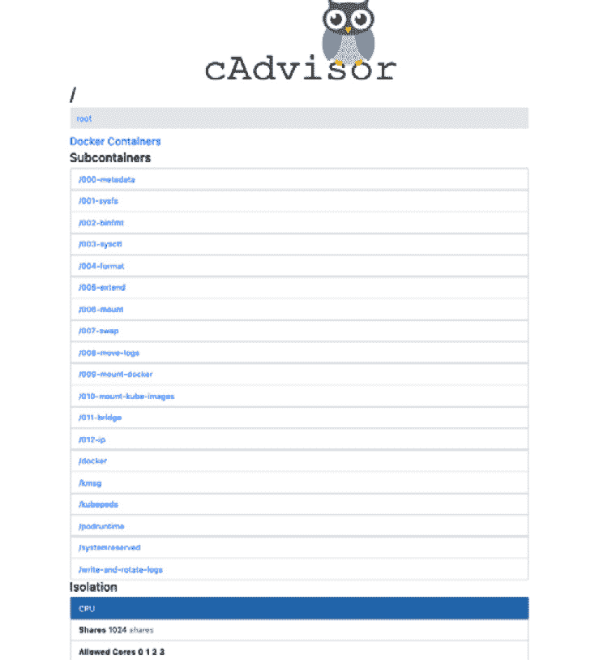
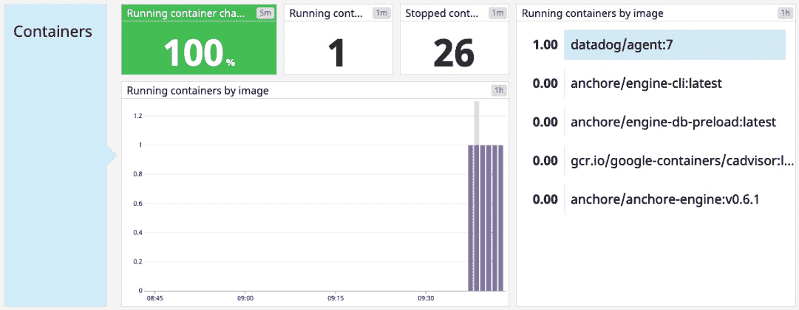
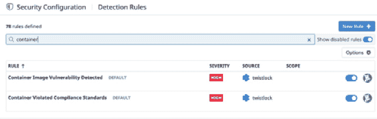
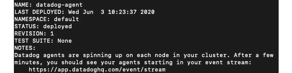
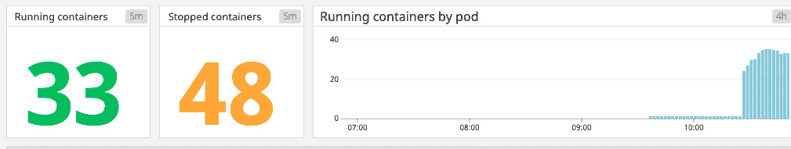
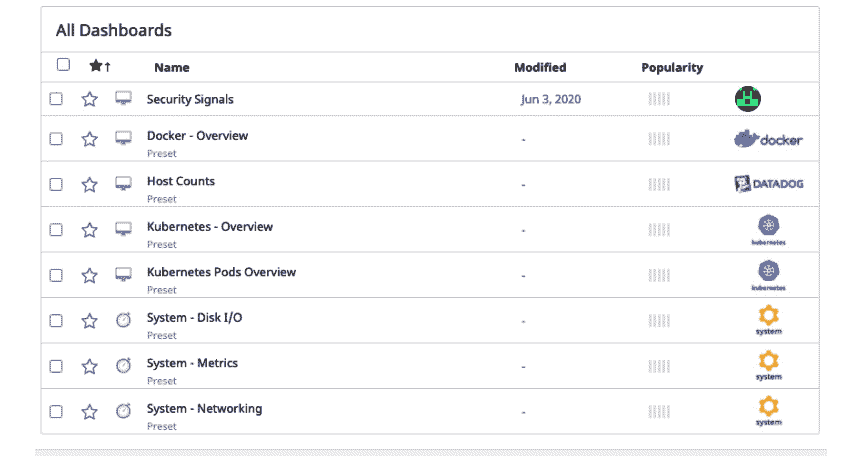

# 第十六章：*第十五章*：扫描、监控和使用第三方工具

到目前为止，我们已经探讨了如何手动配置 Docker 容器，确保安全性优先。在本章中，我们将介绍一些可以自动扫描镜像并监控生产负载的工具。这将为你提供一个出发点，让你能够根据使用的云服务提供商进一步扩展基于 Docker 的项目。

我们将首先查看 DevOps 解决方案，例如 Anchore Engine，用于扫描镜像中的安全漏洞，回顾 `docker stats` 并了解它的用途，设置 cAdvisor 进行本地监控，并理解如何将 Datadog 作为基于云的解决方案，用于收集容器统计数据。

本章还将简要回顾 AWS 的安全选项，包括用于监控生产环境的 GuardDuty，并介绍微软 Azure 提供的一些功能。你将了解**谷歌云平台**（**GCP**）用户可以使用的工具，并将 Datadog Agent 部署到你的容器环境中。

在本章中，我们将涵盖以下主要内容：

+   扫描和监控 – 云端与 DevOps 安全性在容器中的应用

+   使用 AWS 保护你的容器

+   使用 Azure 保护你的容器

+   使用 GCP 保护你的容器

让我们开始了解监控容器、扫描安全问题的技术。

# 技术要求

对于本章，你需要访问一台运行 Docker 的 Linux 机器。我们建议你继续使用本书中至今为止的设置。

除此之外，你还需要在 Docker Hub 上注册一个账户，以便访问其中的镜像。如果你之前没有设置过账户，可以通过[`hub.docker.com:`](https://hub.docker.com:)进行注册。

为了使用本章中探讨的许多程序，你需要从网上下载它们。我们将在相关部分提供链接，以便你知道从哪里获取它们。在某些情况下，你可能需要注册账户才能使用某项服务或下载某个工具。

查看以下视频，观看代码的实际应用：

[`bit.ly/30VfWu8`](https://bit.ly/30VfWu8)

# 扫描和监控 – 云端与 DevOps 安全性在容器中的应用

在我们开始查看用于监控和扫描容器的具体工具之前，首先需要明确定义在安全环境中我们所说的监控是什么意思。

正如你在本书中所见，容器提供了一种在小型自包含环境中提供应用程序的机制。然而，我们需要确保发布的软件在运行时不会出现性能下降。例如，我们需要知道一个容器是否消耗了大量资源，从而影响我们环境的整体性能。你可能已经从*第十章*《使用 Prometheus、Grafana 和 Jaeger 监控 Docker》中对这一概念有了一定的了解。

此外，监控使我们能够查找可能表明系统遭受攻击或已被某种方式入侵的异常情况。虽然本书的其他部分集中于确保系统稳定性和性能的监控，但我们将从安全的角度使用这些概念。安全扫描应用程序是任何工具链的重要组成部分，但可能无法发现所有问题，特别是较新的漏洞。因此，查找恶意软件存在的负面副作用是一个重要的防御机制。因此，在发布前进行扫描、发布后进行监控以及事件响应是运行生产容器系统的重要部分。

关于沙箱环境的说明

另一个可能有用的概念是沙箱环境。沙箱为隔离和测试不受信任的代码提供了一个环境。这些环境对于审查可能感染恶意软件的容器非常有用，且无需冒着影响实时系统或团队使用的开发环境的风险。

在本章中，我们将首先了解 CI/CD（DevOps）流水线中的扫描阶段，然后再探讨如何将监控工具与它们结合使用，以保护我们的系统。让我们从使用 Anchore Engine 扫描容器开始。

## 使用 Anchore Engine 进行扫描

在构建 DevOps 流水线时，扫描我们的容器以查找安全问题是一个重要的考虑因素。典型 CI 过程的最后一步之一是构建容器本身，此前我们已经测试了计划部署到其中的软件。正如你在本书中所见，我们在容器中实验了多种技术。尽管每种语言都有许多安全工具，无论是 JavaScript 还是 PHP（这些在本书的范围之外），但我们不应忽视通过使用自动化工具减少容器级别的手动安全负担。

虽然我们已经看到拉取签名镜像的重要性，但扫描它们也无妨。正如俗话所说，*小心驶得万年船！*

如果我们发现构建中包含的镜像已被入侵，或某个标签违反了内部工作安全政策或合规性规定，我们就知道整个构建因此容易受到攻击，并可以防止其进入生产环境。

因此，我们可以将安全扫描过程视为以下两个相互关联的步骤：

1.  查看我们在 `Dockerfile` 中包含的镜像，以及 `Dockerfile` 本身的配置。

1.  确保容器符合我们可能有的任何内部要求，比如不使用黑名单中的镜像。在这种情况下，镜像可能并非仅因安全原因而被列入黑名单，还可能是出于性能考虑。

为了适应这两个因素，我们需要一个容器扫描工具，它允许我们在标准安全考虑的基础上定义自己的策略。

市场上最受欢迎的开源工具之一，允许我们实现这两个目标的是 Anchore Engine。你可以访问其官方网站：[`anchore.com/engine/`](https://anchore.com/engine/)。

除了我们很快将要探讨的大量功能外，它还是一个开源项目。所以，如果你想为它做出贡献，确保访问 GitHub 仓库：[`github.com/anchore/anchore-engine`](https://github.com/anchore/anchore-engine)。

Anchore 的核心是一个扫描容器安全问题的引擎。它可以轻松集成到你的 CI 流水线中，在部署前提供漏洞和策略扫描。让我们看看如何安装并对最新的 Alpine 镜像进行基本扫描。

### 安装 Anchore Engine

安装 Anchore Engine 非常简单。首先，我们需要从产品的引擎部分开始。让我们创建并进入一个名为 `aevolume` 的新目录：

```
$ mkdir ~/aevolume
$ cd ~/aevolume
```

接下来，拉取最新版本的 Anchore Engine：

```
$ docker pull docker.io/anchore/anchore-engine:latest
```

现在，我们可以运行 Docker 的 `create` 命令：

```
$ docker create --name ae docker.io/anchore/anchore-engine:latest
```

使用 curl 获取 docker-compose.yaml

你也可以通过 curl 复制 `docker-compose.yaml`，使用：`curl` [`docs.anchore.com/current/docs/engine/quickstart/docker-compose.yaml`](https://docs.anchore.com/current/docs/engine/quickstart/docker-compose.yaml) `> docker-compose.yaml`

将 `docker-compose` 文件复制到当前目录，然后删除创建的 `ae` 文件夹：

```
$ docker cp ae:/docker-compose.yaml ~/aevolume/docker-compose.yaml
$ docker rm ae
```

最后，运行 `pull` 和 `up` 命令，如下所示：

```
$ docker-compose pull
$ docker-compose up -d
```

接下来，我们需要安装一个可以与引擎交互的 CLI。你有几个选择，其中包括 Docker 容器：

```
$ docker pull anchore/engine-cli:latest
```

你还可以使用这里列出的一种方法，这将把 CLI 安装到你本地的机器上：[`github.com/anchore/anchore-cli`](https://github.com/anchore/anchore-cli)。

可以使用以下命令安装 Python 版本的 CLI：

```
apt-get update 
apt-get install python-pip 
pip install anchorecli
```

如果你已经拉取了容器镜像并希望使用默认凭据，请运行以下命令进入 CLI shell：

```
$ docker run  -it anchore/engine-cli
```

在接下来的部分中，我们将使用 Python 版本的 CLI 来与引擎交互。

你现在可以在容器 shell 内或如果手动安装了 CLI，也可以从 CLI 执行命令。以下示例演示了如何通过 CLI 调用端点，传递凭证和端点，并请求系统状态信息：

```
$ anchore-cli --u admin --p foobar --url http://localhost:8228/v1/ system status
```

现在你应该在控制台中看到一些状态结果，表明引擎已启动：

```
Service analyzer (anchore-quickstart, http://engine-analyzer:8228): up
Service simplequeue (anchore-quickstart, http://engine-simpleq:8228): up
Service policy_engine (anchore-quickstart, http://engine-policy-engine:8228): up
Service apiext (anchore-quickstart, http://engine-api:8228): up
Service catalog (anchore-quickstart, http://engine-catalog:8228): up
Engine DB Version: 0.0.12
Engine Code Version: 0.6.1
```

现在让我们回顾一下扫描步骤。

### 添加并扫描镜像

让我们尝试使用 Anchore Engine 扫描最新的 Alpine 容器。你会记得，Alpine 是我们 `shipitclicker` 镜像版本 0.1 到目前为止使用的基础操作系统。因此，确认它没有问题是一个不错的第一步。

当我们运行扫描时，它会根据一组**策略**检查镜像。Anchore 中的策略是镜像必须通过的白名单和检查的集合。

启动扫描的过程如下：

1.  让我们通过执行以下命令，使用 CLI 添加 Alpine 镜像：

    ```
    $ anchore-cli --u admin --p foobar --url http://localhost:8228/v1/ image add alpine:latest
    ```

1.  当此步骤成功完成时，你应该会看到类似以下的内容。这告诉我们镜像已经被添加：

    ```
    Image Digest: sha256:ddba4d27a7ffc3f86dd6c2f92041af252a1 f23a8e742c90e6e1297bfa1bc0c45
    Parent Digest: sha256:ab00606a42621fb68f2ed6ad3c88be54397f 981a7b70a79db3d1172b11c4367d
    Analysis Status: not_analyzed
    Image Type: docker
    Analyzed At: None
    Image ID: e7d92cdc71feacf90708cb59182d0df1b911f8ae022d29 e8e95d75ca6a99776a
    Dockerfile Mode: None
    Distro: None
    Distro Version: None
    Size: None
    Architecture: None
    Layer Count: None

    Full Tag: docker.io/alpine:latest
    Tag Detected At: 2020-02-04T16:22:19Z

    ```

1.  我们的镜像尚未通过 Anchore 分析。这是我们提取和分类元数据的地方。所以，让我们按以下步骤将镜像移动到这个状态：

    ```
    $ anchore-cli --u admin --p foobar --url http://localhost:8228/v1/ image wait alpine:latest
    ```

1.  完成后，我们现在可以使用此命令在 Alpine 镜像上运行漏洞扫描。在这里，我们使用 `os` 属性检查操作系统级别的包漏洞。除了 `os`，我们还可以选择检查 `non-os`（这包括语言特定的包，如 Python PIP 和 Ruby GEM 类型）和 `all`：

    ```
    $ anchore-cli --u admin --p foobar --url http://localhost:8228/v1/ image vuln alpine:latest os
    ```

    如果一切顺利且镜像通过，你将不会在屏幕上看到任何漏洞。

    如果发现漏洞，它将以以下格式返回：

    ```
    Vulnerability ID  Package      Severity   Fix     Vulnerability URL 
    CVE-1111-1111     package.zip  Negligible None https://somewebsite
    ```

默认情况下，基本的 Anchore 安装策略将扫描 CVE 问题和 Dockerfile 问题，像我们在前几章中探讨过的那些问题。

现在你已经配置了扫描引擎，可以开始构建自己的策略并进行扫描。更多信息，请参见 Anchor 策略文档：

[`docs.anchore.com/current/docs/using/cli_usage/policies/`](https://docs.anchore.com/current/docs/using/cli_usage/policies/)

此外，要查看你可以复制和修改的策略示例，请查看 GitHub 上的 Anchore Hub 页面：

[`github.com/anchore/hub`](https://github.com/anchore/hub)

无论是定义自定义策略还是重用其他策略，这些 JSON 文件都可以通过 CLI 添加：

```
$ anchore-cli policy add /path/to/image/policy/bundle.json
```

一旦添加完成，就可以使用 `activate` 命令激活它们：

```
$ anchore-cli policy activate <Policy ID>
```

如果你需要知道一个策略 ID，可以使用 CLI 中的`policy list`命令：

```
anchore-cli --u admin --p foobar policy list
```

作为实验，你可能希望在 Docker for Developers Docker Hub 仓库中的其他镜像上运行默认的或你自己的策略：

[`hub.docker.com/r/dockerfordevelopers/shipitclicker/tags`](https://hub.docker.com/r/dockerfordevelopers/shipitclicker/tags)

这涵盖了启动和运行的基础。如果您希望将扫描功能添加到您的 DevOps 流水线中，Anchore 可以与多个 CI/CD 系统集成，包括以下系统：

+   CloudBees

+   GitHub

+   GitLab

+   CircleCI

+   Codefresh

每个平台的集成说明可以在 Anchore 网站上找到：

[`docs.anchore.com/current/docs/using/integration/ci_cd/`](https://docs.anchore.com/current/docs/using/integration/ci_cd/)

Anchore 还包括一个 Jenkins 插件，因此您可以尝试将其与本书中我们早些时候完成的 Jenkins 设置集成：

[`plugins.jenkins.io/anchore-container-scanner/`](https://plugins.jenkins.io/anchore-container-scanner/)

在我们继续了解监控工具之前，先简单提一下另一个工具。

## 简要提及 Chef InSpec

另一个您可能感兴趣的扫描容器基础设施的工具是 Chef InSpec。

Chef InSpec 是一个开源框架，类似于 Anchore，但它专注于测试和审计所有应用程序和基础设施。这包括对 Docker 进行审计测试。如果您在寻找一个不仅限于容器环境的基础设施一体化解决方案，这可能符合您的需求。

注意

本书的范围不包括 InSpec 的完整操作指南，但如果您想了解更多，可以访问 InSpec 网站的文档门户：[`www.inspec.io/docs/`](https://www.inspec.io/docs/)。

总结来说，我们可以在部署容器之前对其进行扫描，以检查其安全性。现在让我们继续，了解 Docker stats 用于容器监控。

## 使用 Docker stats 进行本地原生监控

现在我们已经部署了容器，并相信它们是安全的，我们应考虑使用监控工具来检查性能，并在出现问题时帮助调查。

在探索云中一些复杂且全面的工具之前，我们可以使用 Docker 的原生 stats 工具快速概览容器的健康状况。如果您怀疑某些软件可能在容器中异常消耗资源，例如怀疑 Web 应用程序可能感染了未在 CI 阶段被发现的矿工程序，这时该工具会非常有用，尤其是当您快速测试一个孤立沙箱环境中的容器时。

注意

在虚拟机沙箱中运行容器，并允许您探查性能指标，能够在不冒感染底层机器风险的情况下安全地扫描容器的安全问题。

要访问容器性能数据，您可以执行以下命令：

```
$ docker stats <container id>
```

对于每个容器，您将看到 CPU 使用率、内存使用率、内存限制（`MEM`）、`% NET I/O` 和最后的 `BLOCK I/O`。以下示例展示了一个典型的输出：

```
CONTAINER CPU % MEM USAGE/LIMIT MEM % NET I/O  BLOCK I/O
ebb12326ae94 1% 73.63 MiB/490 MiB 15.02% 90.2 MB/275.5 MB 26.8 MB/873.7 MB
```

虽然 `stats` 命令在进行本地开发或快速获取系统性能快照时很有用，但收集更全面的指标会更好。实现这一目标的一种方法是使用 Stats API。我们现在简要了解一下它，并考虑它的安全影响。

### 使用 Stats API

Stats API 是一组更全面的结果，以 JSON 格式返回，并可以通过 Docker 套接字访问：

```
$ /var/run/docker.sock
```

你应该还记得在*第十二章*中的 *《守护进程套接字安全》* 部分提到，我们需要确保攻击者无法攻破套接字，并利用它获得对底层主机的 root 访问权限。我们可以通过使用 TLS 加密流量来实现这一点。如果你需要帮助设置，可以参考这一章。

Stats API 使用 REST 架构，因此接受 HTTP 请求作为查询。你可以在官方文档站点查看示例：[`docs.docker.com/engine/api/latest/`](https://docs.docker.com/engine/api/latest/)。

可以通过命令行使用 netcat 或 `curl` 发送 API 请求，也可以使用第三方工具如 Postman，或者你可以使用 Python、Bash 等编写脚本来访问 API 端点。

以`curl`为例，你可以将命令中的值替换为你自己的，然后执行它：

```
$ curl -sk <options> https://<ip>:<port>/<rest endpoint>  --cert <path/to/cert.pem> --key <path/to/key.pem -cacert <path/to/ca.pem>
```

你应该看到一个返回的 JSON 对象，包含结果。这些结果比使用 Docker 命令更为全面，如果你想将其保存为 JSON 文件以供进一步分析（例如，如果你认为某个容器可能被攻击时），它们可能会更有用。

除了本地 Docker 工具，谷歌还提供了 **容器顾问** (**cAdvisor**) 用于收集容器的指标。我们现在简要介绍一下它，作为本地监控的第三种选择。

### cAdvisor 用于容器监控

cAdvisor 是一个由谷歌管理的软件项目，用于提供容器性能和资源使用情况的洞察。cAdvisor 的源代码可以在 GitHub 上找到，网址如下：

[`github.com/google/cadvisor`](https://github.com/google/cadvisor)

要测试，你可以使用谷歌提供的标准演示容器。只需运行以下命令，从 Google Container Registry 拉取并启动它：

```
$ sudo docker run \
    --volume=/:/rootfs:ro \
    --volume=/var/run:/var/run:ro \
    --volume=/sys:/sys:ro \
    --volume=/var/lib/docker/:/var/lib/docker:ro \
    --volume=/dev/disk/:/dev/disk:ro \
    --publish=8080:8080 \
    --detach=true \
    --name=cadvisor \
    gcr.io/google-containers/cadvisor:latest
```

你现在可以在 `localhost` 的 `8080` 端口访问 cAdvisor 的 Web 门户。如果该端口上有其他服务运行，例如 Jenkins，你可以在之前的命令中更改 cAdvisor 的端口。

尝试访问 `http://localhost:8080/containers/`，你应该能看到以下截图中的仪表板：



图 15.1 – cAdvisor 仪表板

从此仪表盘，你可以探索从文件系统、内存到 CPU 和进程等各种指标。监控这些指标以识别性能问题，可以作为我们在其他地方提到的监控安全问题的有用工具。

例如，如果资源使用量异常高，这可能表明软件无法正常运行，或者是潜在的安全问题，比如恶意软件在容器中运行。

所有这些对于小型本地系统以及可能对潜在被攻破的容器进行快速调查非常有用，但如果我们认为在生产环境中可能存在安全问题，如何监控我们的容器并收集可操作的数据呢？我们可以考虑使用一些市场上流行的第三方工具，来收集指标并构建全面的仪表盘和告警系统。

为了演示这一点，我们将看一下市场上最受欢迎的用于收集 Kubernetes 和 Docker 环境监控数据的工具之一，Datadog。

## 在云中使用 Datadog 聚合监控数据

对于那些将环境部署到云环境或自建数据中心的商业项目，我们需要一个平台，能够从各种输入源聚合数据，并以你可以操作的方式呈现数据。

Datadog 是一个能够实现这一目标的产品，提供了适用于简单的 Docker 和高级 Kubernetes 环境的插件。它还支持多个平台，包括主要的云服务商，如 AWS。Datadog（[`www.datadoghq.com/`](https://www.datadoghq.com/)）提供 14 天免费的试用期，你可以尝试其容器功能，看看是否符合你的需求。你会发现它是一些在前几章中探索过的工具的有力竞争者。

现在，让我们来看看你可以在节点上运行的 Kubernetes 和 Docker 代理，以开始将数据发送回 Datadog。

### Docker 和 Kubernetes 的 Datadog 代理

一旦你在[`www.datadoghq.com/`](https://www.datadoghq.com/)设置了账户，你就可以在测试节点上安装 Datadog 代理来监控性能。

提示

我们建议在尝试部署到生产环境之前，先从测试环境开始。我们还建议在部署到生产环境之前，先熟悉 Docker 和 Kubernetes 代理文档，网址是：[`docs.datadoghq.com/agent/docker/?tab=standard`](https://docs.datadoghq.com/agent/docker/?tab=standard)。

以下示例将涵盖安装 Docker 代理和 Kubernetes 代理。每个示例都使用仅包含单个节点的集群进行演示。你可以重复使用*第十二章*中的 Docker 容器，*容器安全简介*，或者本书其他地方使用的容器之一。

#### 安装并监控 Docker 代理

你的第一个任务是安装主机上的 Docker 代理。Datadog Docker 代理负责收集度量数据并将其传回你的账户仪表板。

现在安装代理变得非常简单。从你的主机内执行以下 Docker 命令，以包含 Datadog 代理：

```
$ docker run -d --name dd-agent \
    -v /var/run/docker.sock:/var/run/docker.sock:ro \
    -v /proc/:/host/proc/:ro \
    -v /path/to/cgroup/:/host/sys/fs/cgroup:ro \
    -e DD_API_KEY={API_KEY} \
    datadog/docker-dd-agent:latest
```

根据你的操作系统版本和已安装的代理版本，你可以通过检查此处的命令列表来确认它是否正在运行：

https://docs.datadoghq.com/agent/guide/agent-commands/?tab=agentv6v7#agent-status-and-information

从 Datadog 仪表板中，你现在应该能看到返回的数据。你可以开始探索从容器返回的度量数据，并在出现问题时设置警报：



图 15.2 – Datadog 仪表板显示度量的示例

你可能感兴趣的下一个领域是菜单中的**安全**选项。选择该项并按照向导设置安全监控。完成后，你可以启用和禁用安全**检测规则**，如下图所示：



图 15.3 – Datadog 中的检测规则

有关在 Datadog 中为容器设置监视器和警报的更多信息，请参阅此文档：

[`docs.datadoghq.com/monitors/`](https://docs.datadoghq.com/monitors/)

现在我们来看一下 Kubernetes 代理的对应内容。

#### 安装并监控 Kubernetes 代理

和我们之前的 Docker 示例一样，我们需要先安装代理。为此，我们可以通过 Helm 部署一个 DaemonSet。以下指令使用的是 Helm 3 版本。

提示

如果你还没有运行，记得添加 `helm repo add stable,` [`kubernetes-charts.storage.googleapis.com`](https://kubernetes-charts.storage.googleapis.com)，以将 stable 添加到你的仓库。

你可以从 GitHub 下载包含配置的官方 Helm 文件（`values.yaml`），地址为([`github.com/helm/charts/blob/master/stable/datadog/values.yaml`](https://github.com/helm/charts/blob/master/stable/datadog/values.yaml))。

接下来，你需要从你的账户中获取 API 密钥。使用 API 密钥，我们现在可以完成安装过程。在以下命令中，将`{API_KEY}`替换为你自己的密钥：

```
helm install datadog-agent -f values.yaml  --set datadog.apiKey={API KEY} stable/datadog
```

你应该在终端中看到一个确认信息，表明部署已成功：



图 15.4 – Datadog 代理部署

现在你已经部署了代理，它将开始从 Kubernetes 收集度量数据：



图 15.5 – 仪表板度量示例

在这个安装过程中，`kube-state-metrics` Helm 图表也被包含在内。这个 Helm 图表安装了`kube-state-metrics`服务([`github.com/kubernetes/kube-state-metrics`](https://github.com/kubernetes/kube-state-metrics))。

此服务收集了多种数据，你可以通过 [`github.com/kubernetes/kube-state-metrics/tree/master/docs`](https://github.com/kubernetes/kube-state-metrics/tree/master/docs) 查看暴露的指标。

例如，你可能对与机密相关的指标感兴趣，这样你就可以通过查看 Kubernetes 日志收集文档来了解收集了哪些数据。你还可以通过 Helm 启用日志收集。为此，更新 `datadog-values.yaml` 文件，将 `enabled` 和 `containerCollectAll` 键值对都设置为 `true`。完成后，运行 `helm upgrade` 更新 Datadog Helm 图表。

通过将节点的指标发送回 Datadog 默认的 Kubernetes 仪表盘，你可以开始配置警报和监控，并探索 Datadog 提供的众多功能。

例如，你可以创建一个自定义仪表盘，显示发现的安全信号数量：



图 15.6 – 仪表盘列表

我们已经简要了解了如何使用第三方工具在安全上下文中监控我们的容器。这可以帮助我们对可能表现为性能问题的安全问题发出警报。

现在让我们来看看一些主要云平台提供的工具。我们之前讨论的 Datadog 和 CI/CD 扫描管道可以与以下各节中列出的提供商集成，以提供更加全面的安全防护。

# 使用 AWS 来保护你的容器

我们可以采取多种方法来保护云中的容器。我们将从 **Amazon Web Services**（通常称为 **AWS**）开始。本书的这一部分假设你已经熟悉在 AWS 中托管基于容器的项目。如果你使用的是其他服务，如 Azure 或 GCP，可以跳过并直接阅读 *Azure 容器安全* 和 *Google 容器安全选项* 部分。AWS 和容器托管的主题也在 *第五章*，*生产环境中部署和运行容器的替代方案*，以及 *第八章*，*将 Docker 应用部署到 Kubernetes* 中进行了讨论。让我们看看在 AWS 中用于监控的工具。

## 使用 GuardDuty 的 AWS 安全警报

AWS 或作为第三方插件存在的多种工具可以用于监控托管容器基础设施的 Amazon 环境。

亚马逊用于监控 VPC 中安全问题的主要工具是 GuardDuty ([`aws.amazon.com/guardduty/`](https://aws.amazon.com/guardduty/))。

我们已经看到如何使用 Datadog 监控容器健康状况，但也看到监控支持我们基础设施的环境是多么重要。复杂的生产实例通常会使用 AWS 服务，这些服务位于**弹性 Kubernetes 服务**（**EKS**）、**弹性容器服务**（**ECS**）和**弹性计算云**（**EC2**）之外。例如，您可能在本书早些时候设置 CloudWatch 指标或 S3 存储桶时使用的 IAM 角色。

AWS GuardDuty 提供了一种机制来监控我们的云环境，确保可以追踪到托管容器的 VPC 中发生的任何攻击。这是通过与 CloudWatch 集成实现的，CloudWatch 使我们能够基于我们看到的警报类型触发某些安全操作，例如触发 Lambda 函数，或将事件发送到第三方应用程序或 S3 存储桶进行存储。

如果您希望启用 GuardDuty，您需要一个托管容器的 VPC 设置，例如在*第八章*中配置的那种，*将 Docker 应用部署到 Kubernetes*。

在此基础上，您现在可以创建一个规则，允许 CloudWatch 发送 GuardDuty 发现的任何事件。这对于检测容器是否在您的 VPC 中生成可疑的网络流量尤其有用。

使用 AWS CLI，我们现在可以启用 CloudWatch，开始发送之前提到的事件。为此，请执行以下命令：

```
$ aws events put-rule --name PacktContainerSecurity --event-pattern "{\"source\":[\"aws.guardduty\"]}"
```

启用这些事件后，您将有多种选择来进行后续操作。例如，您可以附加一个 Lambda 函数，该函数将处理被触发的事件并对其进行操作，或者按照这里的说明，将 CloudWatch GuardDuty 事件与您的 Datadog 设置集成：

[`github.com/DataDog/datadog-serverless-functions/tree/master/aws/logs_monitoring`](https://github.com/DataDog/datadog-serverless-functions/tree/master/aws/logs_monitoring)

如果您希望将 CloudWatch GuardDuty 事件的结果写入*第十章*中创建的 S3 存储桶，*使用 Prometheus、Grafana 和 Jaeger 监控 Docker*部分中的*长期存储日志到 AWS S3*，那么您可以将 Lambda 函数附加为事件规则：

```
$ aws events put-targets --rule PacktContainerSecurity --targets Id=1,Arn=arn:aws:lambda:<zone>:<ARN digits>:function:<function>
```

AWS 提供了一个可以用来将数据写入 S3 存储桶的 Lambda 函数示例，链接如下：

[`aws.amazon.com/blogs/database/monitoring-your-security-with-guardduty-in-real-time-with-amazon-elasticsearch-service/`](https://aws.amazon.com/blogs/database/monitoring-your-security-with-guardduty-in-real-time-with-amazon-elasticsearch-service/)

一旦您根据需要修改了这个 Lambda 并将其添加到 `<` 和 `>` 括号之间，您可以通过运行以下命令来添加所需的权限：

```
$ aws lambda add-permission --function-name <function> --statement-id 1 --action 'lambda:InvokeFunction' --principal events.amazonaws.com
```

这应该作为一个出发点，帮助您更详细地探索 GuardDuty，并扩展您在本书中所创建的设置。

将发现结果存储到 S3 的另一种方式

你也可以使用 AWS 提供的以下步骤，将 GuardDuty 发现结果导出到 S3 存储桶：[`docs.aws.amazon.com/guardduty/latest/ug/guardduty_exportfindings.html`](https://docs.aws.amazon.com/guardduty/latest/ug/guardduty_exportfindings.html)

在 AWS 中，你可能感兴趣的其他安全功能包括：

+   用于分析应用程序安全的 Amazon Inspector：[`aws.amazon.com/inspector/`](https://aws.amazon.com/inspector/)

+   用于创建统一安全中心的 AWS Security Hub：[`aws.amazon.com/security-hub/`](https://aws.amazon.com/security-hub/)

+   用于检测潜在安全问题的 Amazon Detective：[`aws.amazon.com/detective/`](https://aws.amazon.com/detective/)

这些服务都可以通过你的 AWS 网站控制台启用。现在，让我们继续，看看 Microsoft Azure 中可用的一些选项。

# 使用 Azure 保护你的容器

Azure 是微软的旗舰云服务，提供一系列工具，可以帮助你部署和监控 Docker 容器。本节假设你对 Azure 和 Log Analytics 服务有一定的了解。

## Azure 中的容器监控

微软的容器监控解决方案提供了一种机制，可以从一个地方管理 Docker 和 Windows 主机，并支持 Kubernetes 和 Docker Swarm，这两者在本书中都有讨论。

如果你已经在使用微软的 AKS 服务，你可能已经熟悉 AKS 页面上可用的监控服务，但你也可以在 Azure 中监控整个微软基础设施中的容器。

要启用容器监控，你需要先通过将其添加到 Log Analytics 来启用此功能。你可以通过点击 Azure Marketplace 网站上的**立即获取**按钮来完成：

[`azuremarketplace.microsoft.com/en-us/marketplace/apps/microsoft.containersoms?tab=overview`](https://azuremarketplace.microsoft.com/en-us/marketplace/apps/microsoft.containersoms?tab=overview)

完成后，你可以创建一个新的 Log Analytics 工作区。从这个新工作区中，记录你选择的名称，并获取工作区 ID 和密钥。这些信息可以在工作区的**高级设置**下找到，并位于**连接的源** | **Linux 服务器**选项中。

为了本概述的目的，我们假设一个单主机的环境，就像我们为 Linux 上的 Datadog 所做的那样。在这种情况下，你需要按照以下步骤安装 Log Analytics 代理：

```
$ wget https://raw.githubusercontent.com/Microsoft/OMS-Agent-for-Linux/master/installer/scripts/onboard_agent.sh && sh onboard_agent.sh -w <workspace_id> -s <workspace_key>
```

现在，你可以使用以下命令重新启动代理：

```
$ sudo /opt/microsoft/omsagent/bin/service_control restart [<workspace_id>]
```

现在，让我们尝试对容器运行监控，如下所示：

```
$ sudo docker run --privileged -d -v /var/run/docker.sock:/var/run/docker.sock -v /var/lib/docker/containers:/var/lib/docker/containers -e WSID="<workspace_id>" -e KEY="<workspace_key>" -h=`hostname` -p 127.0.0.1:25225:25225 --name="omsagent" --restart=always microsoft/oms
```

我们可以在 Log Analytics 工作区的**数据**选项下修改我们收集的事件数据。在这里，我们可以添加 syslog，并启用 Linux 性能计数器。

一旦启用该解决方案，你将看到**容器**磁贴出现。然后，你可以深入**容器**仪表盘收集指标。

现在我们已经有了一些监控措施，让我们来看看 Azure 中可用于基于容器平台的一些安全功能。

## 使用安全中心保护 Azure 中的容器

通过监控到位后，您可以继续查看微软的容器安全工具。在 Azure 中实现这一点的推荐本地工具是安全中心服务。

您可以通过点击[`azure.microsoft.com/en-us/services/security-center/`](https://azure.microsoft.com/en-us/services/security-center/)上的**开启安全中心**按钮来注册并将其添加到您的 Azure 帐户中，如果愿意，您还可以同时注册一个 Azure 帐户。

一旦启用此功能，您将看到安全中心提供多个功能，包括以下内容：

+   容器运行时保护

+   漏洞管理

+   环境加固

我们将简要看一下这些内容。

### 容器运行时保护

安全中心为容器环境提供的运行时保护功能，允许您生成实时的威胁指标，用于规划修复工作。威胁检测机制分为两个核心领域：

+   **在主机级别**：在此级别，我们可以监控容器是否存在恶意或可疑行为，包括暴露的 Docker 守护进程或容器内运行的特权命令。

+   **在 AKS 集群级别**：AKS 集群级别的威胁检测会分析 Kubernetes 审计日志中的可疑活动，例如创建高度特权角色或检测到矿工程序。

这两个功能结合使用有助于查看容器堆栈的各个层次并检测可疑活动。

### 漏洞管理

在这里，您可以使用容器注册表包在推送新镜像时进行扫描。安全中心与第三方安全提供商 Qualys 的集成扫描容器，检测我们在本书中讨论的一些漏洞。

当检测到问题时，它将被记录在仪表板上，并附有推荐的修复步骤。

### 环境加固

安全中心提供了多种工具来监控容器环境的安全性。最重要的功能之一是运行基准测试，如 CIS Docker 基准测试，如果您的环境配置被削弱，它会发出警告。CIS 控制的一个示例是检查容器之间是否存在不受限制的网络流量交换。

您可以从 CIS 网站免费下载 CIS Docker 基准测试的副本：

[`learn.cisecurity.org/benchmarks`](https://learn.cisecurity.org/benchmarks)

注意

InSpec 用户可能对下载用于 CIS Docker 基准测试的 InSpec 配置文件感兴趣，链接在此：[`github.com/dev-sec/cis-docker-benchmark`](https://github.com/dev-sec/cis-docker-benchmark)。

当安全中心发现您的环境存在问题时，它会在仪表板的**建议**页面上标记出来，以便您可以开始修复该问题。

我们简要地了解了 Azure 中可用的功能。现在，让我们通过快速浏览 GCP 的一些功能来结束本部分。

# 使用 GCP 保护您的容器

Google 为在 Anthos 和**Google Kubernetes Engine**（**GKE**）中监控容器提供了多个工具。

对于不熟悉 Google 产品的人来说，Anthos 是一个设计用于混合云和多云部署的平台，它允许您在其中部署容器导向的平台，如 Kubernetes 等。GKE 是 Google 提供的企业级 Kubernetes 平台，提供于**Google Cloud Platform**（**GCP**），可以视为与 Amazon 的 EKS 竞争的对手。Google 的容器注册表是一个用于存储镜像的平台，这些镜像可以在您的项目中重用。

在以下部分中，假设您已具备一定的 GCP 基础知识。如果您想了解更多关于如何开始使用 GCP 的信息，请访问以下链接：

[`cloud.google.com/gcp/getting-started`](https://cloud.google.com/gcp/getting-started)

我们从 GCP 中的容器安全开始。

## GCP 中的容器分析和二进制授权

Google 提供的一个有用功能是**容器分析**扫描器，用于容器注册表。此功能允许您扫描镜像中的安全问题，并暴露一个 API 供您使用，您可以通过它提取元数据结果。如果您在账户中启用此功能，它将扫描所有推送到注册表的新镜像，但对于现有镜像，您需要重新推送它们以触发扫描。

容器分析的两个核心功能如下：

+   **增量扫描**：此功能负责扫描新镜像并生成相关的元数据。

+   **持续监控**：增量扫描生成的元数据会不断进行分析，以查看是否与新的安全漏洞集匹配。

在运行扫描时，会为匹配的安全问题分配一个严重性级别（由 Linux 发行版所有者定义的级别）和**常见漏洞评分系统**（**CVSS**）得分。

注意

如果您想了解更多关于 CVSS 的信息，请访问 CVSS 官方网站：[`www.first.org/cvss/specification-document`](https://www.first.org/cvss/specification-document)。

严重性级别的分类如下：

+   严重

+   高

+   中

+   低

+   最小

这些结果存储在您的容器注册表账户中，并可以从那里查看。此外，它们可以通过 RESTful API 进行检索。有关可用 REST 命令的概述，请参阅容器分析 API 文档：

[`cloud.google.com/container-registry/docs/reference/rest`](https://cloud.google.com/container-registry/docs/reference/rest)

要进一步探索容器分析，您可以在账户中启用该功能，并通过将现有镜像推送到注册表来进行测试。例如，您可以使用本书中介绍的`shipitclicker`项目之一。执行此操作时，请记得首先为镜像打标签：

```
$ docker tag <source_image> <hostname>/<project_id>/<image>:<tag>
```

主机名将是以下四个存储区域之一：

+   [gcr.io](http://gcr.io)（美国）

+   [us.gcr.io](http://us.gcr.io)（美国）

+   [eu.gcr.io](http://eu.gcr.io)（欧盟）

+   [asia.gcr.io](http://asia.gcr.io)（亚洲）

然后，使用`docker push`命令，以以下格式推送到注册表：

```
$ docker push <hostname>/<project_id>/<image>:<tag>
```

就这么简单，您可以随时拉取容器镜像，并使用容器分析服务。除了对容器进行分析外，我们还可以执行规则，要求使用签名镜像来补充这一点。

Google 构建了一个部署时的安全功能，旨在防止不受信任的容器镜像进入 GKE。这被称为**二进制授权**（[`cloud.google.com/binary-authorization`](https://cloud.google.com/binary-authorization)）。

**Kritis**是二进制授权的核心，它定义了 Kubernetes 应用程序部署授权的规范。您可以在 GitHub 上查看更多关于它的信息：

[`github.com/grafeas/kritis/blob/master/docs/binary-authorization.md`](https://github.com/grafeas/kritis/blob/master/docs/binary-authorization.md)

使用此服务将使您能够执行规则，要求 Docker 镜像必须由可信的授权方签名。这涉及到一个名为“证明”的过程。实际上，每个容器镜像都有一个唯一的哈希值（称为摘要），该哈希值由签署者签名。您可能还记得我们在本书的*第十三章*中看到过摘要如何使用，*Docker 安全基础与最佳实践*。

当摘要被签名时，这就是所谓的“证明”。当我们部署容器镜像时，我们可以使用二进制授权验证者来验证证明。这使我们能够防止未经授权的（即未签名的）容器镜像被使用。

如果您有兴趣了解更多，您可以按照这里记录的简单步骤来设置二进制分析：

[`cloud.google.com/binary-authorization/docs/quickstart`](https://cloud.google.com/binary-authorization/docs/quickstart)

现在，让我们来看看 GCP 的另一个功能——安全指挥中心。

## 通过安全指挥中心了解您的攻击面

我们将快速了解的最后一个工具是 Google 的安全指挥中心。为此，您需要在 GCP 中设置组织和项目。如果没有，请参考前面的部分，获取 Google 的快速入门指南链接。

要为此新组织和项目启用安全指挥中心，请按照以下步骤操作：

1.  登录到 Cloud Console：[`console.cloud.google.com`](https://console.cloud.google.com)。

1.  通过`organizationAdmin`（`roles/resourcemanager.organizationAdmin`）和**安全中心** | **安全中心管理员**的`securitycenter.admin`（`roles/securitycenter.admin`）角色，添加以下两个角色。

1.  保存更改并导航到 Web 控制台中的安全指挥中心页面。

1.  从名为**组织**的下拉列表中选择您在第 2 步中添加的组织。

1.  现在将为您展示**启用资产发现**页面。

1.  启用**所有当前和未来的项目**选项。

1.  资产发现现在开始。

一旦安全指挥中心完成扫描您的资源，您就能在仪表板上查看结果。默认情况下，异常检测已启用，然而，Google 提供了许多您可以集成的安全来源，或者您可以插入特定于容器的第三方服务。

您可以在此找到可集成的所有潜在来源列表：

[`cloud.google.com/security-command-center/docs/how-to-security-sources`](https://cloud.google.com/security-command-center/docs/how-to-security-sources)

配置好这两个基本服务后，您现在可以自由探索集成其他第三方供应商，例如 Twistlock，或尝试这些服务以便熟悉将它们部署到生产环境中的流程。

这就是我们对几个主要云提供商产品的简短介绍。让我们总结一下我们所查看的内容。

# 总结

在本章中，我们为您提供了一些指引，帮助您决定接下来将云技能应用到哪里。我们讨论了扫描工具如 Anchore，回顾了度量收集平台如 Datadog，并简要了解了主要云提供商提供的一些功能。

这些云平台包括 AWS、Microsoft Azure 和 GCP。每个公司还提供了一些其他基于云的容器基础设施产品，您可能希望进一步探索。

我们希望这个高层次的概述能为您提供一些深思熟虑的见解，帮助您将这些技能应用到自己的项目中。本章中的每个主题应作为一个跳板，帮助您进一步探索每个工具，或者为您提供基础，开始在基于云的容器环境中进行监控实验。对于那些处理本地项目的人，Docker stats 和 cAdvisor 等工具将为您提供便捷的监控容器性能机制。

现在我们将进入最后一章，在这一章中，我们将回顾整个书中的学习内容，并为您总结一些关键要点，帮助您决定接下来要如何进行学习。

# 进一步阅读

别忘了，您可以访问每个提供商的网站，查看这些额外功能的列表：

+   AWS 上的容器：[`aws.amazon.com/containers/services/`](https://aws.amazon.com/containers/services/)

+   Azure 中的容器服务：[`azure.microsoft.com/en-us/product-categories/containers/`](https://azure.microsoft.com/en-us/product-categories/containers/)

+   GCP 中的容器选项：[`cloud.google.com/container-options`](https://cloud.google.com/container-options)
