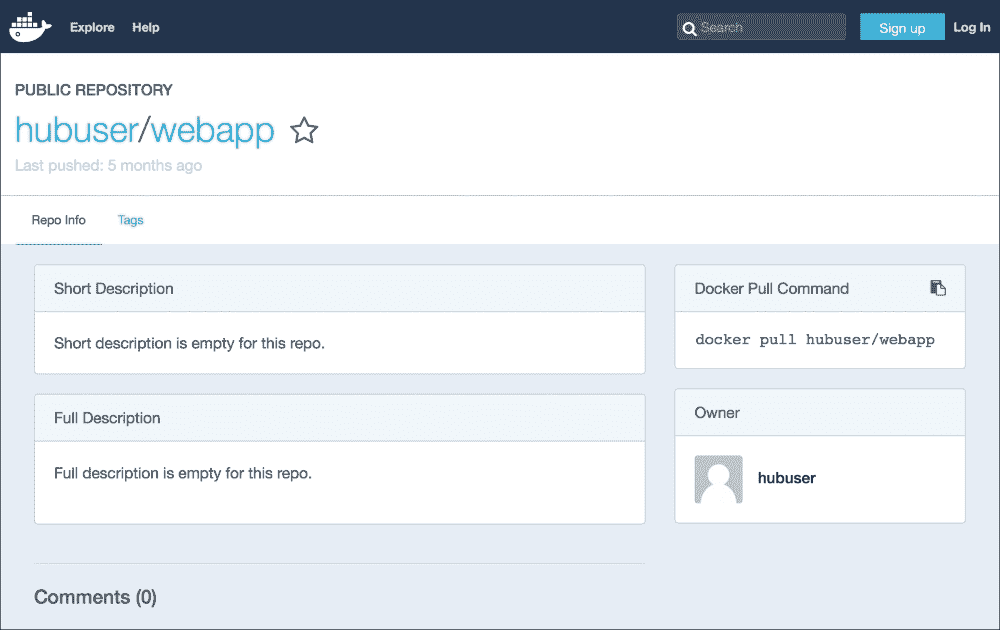

# 第一章 准备 Docker 主机

Docker 使我们能够更快地将应用交付给客户。它通过使我们能够轻松创建并启动 Docker 容器，简化了将代码从开发到生产所需的工作流程。本章将简要回顾如何准备我们的环境，以便运行基于 Docker 的开发和运维工作流，具体包括：

+   准备 Docker 主机

+   使用 Docker 镜像

+   运行 Docker 容器

本章的大部分内容是我们已经熟悉的概念，并且可以在 Docker 文档网站上轻松找到。本章展示了在后续章节中将使用的与 Docker 主机的选定命令和交互。

# 准备 Docker 主机

假设我们已经熟悉如何设置 Docker 主机。本书的大多数章节将基于以下环境来运行示例，除非另有明确说明：

+   操作系统——Debian 8.2 Jessie

+   Docker 版本——1.10.0

以下命令显示操作系统和 Docker 版本：

```
$ ssh dockerhost
dockerhost$ lsb_release –a
No LSB modules are available.
Distributor ID: Debian
Description:   Debian GNU/Linux 8.2 (jessie)
Release:        8.2
Codename:       jessie
dockerhost$ docker version
Client:
 Version:     1.10.0
 API version:  1.21
 Go version:   go1.4.2
 Git commit:   a34a1d5
 Built:        Fri Nov 20 12:59:02 UTC 2015
 OS/Arch:      linux/amd64

Server:
 Version:     1.10.0
 API version:  1.21
 Go version:   go1.4.2
 Git commit:   a34a1d5
 Built:        Fri Nov 20 12:59:02 UTC 2015
 OS/Arch:      linux/amd64

```

如果我们还没有设置 Docker 环境，可以按照 Docker 官网的[`docs.docker.com/installation/debian`](https://docs.docker.com/installation/debian)上的说明来准备 Docker 主机。

### 提示

**下载示例代码**

你可以从你的账户中下载所有你购买的 Packt 书籍的示例代码文件，网址为[`www.packtpub.com`](http://www.packtpub.com)。如果你是在其他地方购买的这本书，可以访问[`www.packtpub.com/support`](http://www.packtpub.com/support)并注册，文件将通过电子邮件直接发送给你。

# 使用 Docker 镜像

Docker 镜像是包含我们的应用程序和其他支持组件的工件，帮助运行它们，比如操作系统基础镜像、运行时和开发库等。它们被部署并下载到 Docker 主机中，以便将我们的应用作为 Docker 容器运行。本节将涵盖以下与 Docker 镜像相关的命令：

+   `docker build`

+   `docker images`

+   `docker push`

+   `docker pull`

### 注意

本节中的大部分内容可以在 Docker 文档网站[`docs.docker.com/userguide/dockerimages`](https://docs.docker.com/userguide/dockerimages)上轻松找到。

## 构建 Docker 镜像

我们将使用 Docker 教育团队提供的`training/webapp`的`Dockerfile`来构建一个 Docker 镜像。接下来的几步将展示如何构建这个 Web 应用：

1.  首先，我们将克隆`webapp`的 Git 仓库，可以通过以下命令从[`github.com/docker-training/webapp`](https://github.com/docker-training/webapp)获取：

    ```
    dockerhost$ git clone https://github.com/docker-training/webapp.git training-webapp
    Cloning into 'training-webapp'...
    remote: Counting objects: 45, done.
    remote: Total 45 (delta 0), reused 0 (de..., pack-reused 45
    Unpacking objects: 100% (45/45), done.
    Checking connectivity... done.

    ```

1.  然后，通过执行以下命令使用`docker build`命令构建 Docker 镜像：

    ```
    dockerhost$ cd training-webapp
    dockerhost$ docker build -t hubuser/webapp .
    Sending build context to Docker daemon 121.3 kB
    Sending build context to Docker daemon
    Step 0 : FROM ubuntu:14.04
    Repository ubuntu already being ... another client. Waiting.
     ---> 6d4946999d4f
    Step 1 : MAINTAINER Docker Education Team <education@docker.com>
     ---> Running in 0fd24c915568
     ---> e835d0c77b04
    Removing intermediate container 0fd24c915568
    Step 2 : RUN apt-get update
     ---> Running in 45b654e66939
    Ign http://archive.ubuntu.com trusty InRelease
    ...
    Removing intermediate container c08be35b1529
    Step 9 : CMD python app.py
     ---> Running in 48632c5fa300
     ---> 55850135bada
    Removing intermediate container 48632c5fa300
    Successfully built 55850135bada

    ```

    ### 注意

    `-t` 标志用于将镜像标记为 `hubuser/webapp`。将容器标记为 `<username>/<imagename>` 是推送 Docker 镜像到后续部分的重要约定。有关 `docker build` 命令的更多细节，可以参考 [`docs.docker.com/reference/commandline/build`](https://docs.docker.com/reference/commandline/build)，或运行 `docker build --help`。

1.  最后，让我们通过 `docker images` 命令确认镜像已经在我们的 Docker 主机中可用：

    ```
    dockerhost$ docker images
    REPOSITORY      TAG      IMAGE ID  CREATED        VIRTUAL SIZE
    hubuser/webapp  latest   55850135  5 minutes ago  360 MB
    ubuntu          14.04    6d494699  3 weeks ago    188.3 MB

    ```

## 将 Docker 镜像推送到仓库

现在我们已经制作了一个 Docker 镜像，让我们将其推送到仓库中，以便在其他 Docker 主机之间共享和部署。Docker 的默认安装会将镜像推送到 Docker Hub。Docker Hub 是由 Docker, Inc. 公共托管的一个仓库，任何拥有账户的人都可以推送和分享他们的 Docker 镜像。以下步骤将展示如何操作：

1.  在能够推送到 Docker Hub 之前，我们需要使用 `docker login` 命令进行身份验证，如下所示：

    ```
    dockerhost$ docker login
    Username: hubuser
    Password: ********
    Email: hubuser@hubemail.com
    WARNING: login credentials saved in /home/hubuser/.dockercfg.
    Login Succeeded

    ```

    ### 注意

    如果我们还没有 Docker Hub 账户，可以按照以下指示在 [`hub.docker.com/account/signup`](https://hub.docker.com/account/signup) 注册一个账户。

1.  现在我们可以将镜像推送到 Docker Hub。正如前面部分提到的，镜像的标签标识了仓库中的 `<username>/<imagename>`。使用以下 `docker push` 命令来推送我们的镜像到 Docker Hub：

    ```
    dockerhost$ docker push hubuser/webapp
    The push refers to a repository [hubuser/webapp] (len: 1)
    Sending image list
    Pushing repository hubuser/webapp (1 tags)
    428b411c28f0: Image already pushed, skipping
    ...
    7d04572a66ec: Image successfully pushed
    55850135bada: Image successfully pushed
    latest: digest: sha256:b00a3d4e703b5f9571ad6a... size: 2745

    ```

现在我们已经成功地将 Docker 镜像推送到 Docker Hub，它将会在 Docker Hub 中可用。我们还可以在 Docker Hub 页面中获取我们推送的镜像的更多信息，页面与下图类似。在这个例子中，我们的 Docker Hub URL 是 `https:// hub.docker.com/r/hubuser/webapp`：



### 注意

更多关于将 Docker 镜像推送到仓库的细节，请参考 `docker push --help` 和 [`docs.docker.com/reference/commandline/push`](https://docs.docker.com/reference/commandline/push)。

Docker Hub 是一个很好的开始托管我们 Docker 镜像的地方。然而，在某些情况下，我们可能希望托管自己的镜像仓库。例如，当我们希望在将镜像拉取到 Docker 主机时节省带宽时。另一个原因可能是我们的 Docker 主机位于数据中心内部，可能已将 Internet 防火墙隔离开来。在第二章，*优化 Docker 镜像*中，我们将更详细地讨论如何运行我们自己的 Docker 注册表，以便拥有一个内部的 Docker 镜像仓库。

## 从仓库拉取 Docker 镜像

一旦我们的 Docker 镜像构建并推送到如 Docker Hub 的仓库中，我们可以将它们拉取到 Docker 主机上。当我们在开发工作站的 Docker 主机上首次构建 Docker 镜像，并希望将其部署到云中生产环境的 Docker 主机时，这一工作流程特别有用。这样就不需要在其他 Docker 主机上重新构建相同的镜像。拉取镜像也可以用来从 Docker Hub 获取现有的 Docker 镜像，在此基础上构建我们的 Docker 镜像。所以，与我们之前克隆 Git 仓库并在其他 Docker 主机上重新构建不同，我们可以选择拉取镜像。接下来的步骤将引导我们拉取我们之前推送的`hubuser/webapp` Docker 镜像：

1.  首先，让我们清理现有的 Docker 主机，确保我们将从 Docker Hub 下载镜像。输入以下命令，确保我们从干净的环境开始：

    ```
    dockerhost$ dockerhost rmi hubuser/webapp

    ```

1.  接下来，我们可以使用`docker pull`命令下载镜像，如下所示：

    ```
    dockerhost$ docker pull hubuser/webapp
    latest: Pulling from hubuser/webapp
    e9e06b06e14c: Pull complete
    ...
    b37deb56df95: Pull complete
    02a8815912ca: Already exists
    Digest: sha256:06e9c1983bd6d5db5fba376ccd63bfa529e8d02f23d5
    Status: Downloaded newer image for hubuser/webapp:latest

    ```

1.  最后，我们通过执行以下命令再次确认是否成功下载了镜像：

    ```
    dockerhost$ docker images
    REPOSITORY      TAG     IMAGE ID  CREATED      VIRTUAL SIZE
    ubuntu          14.04   6d494699  3 weeks ago  188.3 MB
    hubuser/webapp  latest  2a8815ca  7 weeks ago  348.8 MB

    ```

### 注意

有关如何拉取 Docker 镜像的更多详细信息，请参见`docker pull --help`和[`docs.docker.com/reference/commandline/pull`](https://docs.docker.com/reference/commandline/pull)。

# 运行 Docker 容器

现在我们已经拉取或构建了 Docker 镜像，可以使用`docker run`命令来运行和测试它们。本节将回顾一些我们将在后续章节中使用的命令行标志，并使用以下 Docker 命令获取关于在 Docker 主机内运行的 Docker 容器的更多信息：

+   `docker ps`

+   `docker inspect`

### 注意

更全面的命令行标志详细信息可以在`docker run --help`和[`docs.docker.com/reference/commandline/run`](https://docs.docker.com/reference/commandline/run)找到。

## 暴露容器端口

在`training/webapp`示例中，其 Docker 容器作为 Web 服务器运行。为了让应用程序能够为容器环境外的 Web 流量提供服务，Docker 需要知道该应用程序绑定的端口。Docker 将这些信息称为暴露端口。本节将引导我们在运行容器时如何暴露端口信息。

回到我们之前使用的`training/webapp` Docker 镜像，该应用程序提供了一个监听端口`5000`的 Python Flask Web 应用程序，具体内容见`webapp/app.py`中的突出部分：

```
import os
from flask import Flask
app = Flask(__name__)
@app.route('/')
def hello():
    provider = str(os.environ.get('PROVIDER', 'world'))
    return 'Hello '+provider+'!'
if __name__ == '__main__':
    # Bind to PORT if defined, otherwise default to 5000.
 port = int(os.environ.get('PORT', 5000))
    app.run(host='0.0.0.0', port=port)
```

相应地，Docker 镜像通过`Dockerfile`中的`EXPOSE`指令让 Docker 主机知道该应用程序在端口`5000`上监听，具体说明如下：

```
FROM ubuntu:14.04
MAINTAINER Docker Education Team <education@docker.com>
RUN apt-get update
RUN DEBIAN_FRONTEND=noninteractive apt-get \
        install -y -q python-all python-pip 
ADD ./webapp/requirements.txt /tmp/requirements.txt
RUN pip install -qr /tmp/requirements.txt
ADD ./webapp /opt/webapp/
WORKDIR /opt/webapp
EXPOSE 5000
CMD ["python", "app.py"]
```

现在我们已经对 Docker 如何暴露容器的端口有了基本了解，接下来的步骤将引导我们运行`hubuser/webapp`容器：

1.  使用`docker run`命令，并带上`-d`标志，以守护进程方式运行容器，如下所示：

    ```
    dockerhost$ docker run --name ourapp -d hubuser/webapp

    ```

1.  最后，通过`docker ps`确认 Docker 主机上容器运行并暴露了`5000`端口。我们可以通过以下命令来执行此操作：

    ```
    dockerhost:~/training-webapp$ docker ps
    CONTAINER ID  IMAGE  ...   STATUS        PORTS    NAMES
    df3e6b788fd8  hubuser...   Up 4 seconds  5000/tcp ourapp

    ```

除了`EXPOSE`指令外，还可以在运行时通过`--expose=[]`标志覆盖暴露的端口。例如，使用以下命令使`hubuser/webapp`应用暴露`4000`到`4500`端口：

```
dockerhost$ docker run -d --expose=4000-4500 \
 --name app hubuser/webapp
dockerhost $ docker ps
CONTAINER ID   IMAGE      ...              PORTS                   NAMES
ca4dc1da26d    hubuser/webapp:latest  ...  4000-4500/tcp,5000/tcp  app
df3e6b788fd8   hubuser/webapp:l...         5000/tcp                ourapp

```

这个临时的`docker run`标志在调试应用时非常有用。例如，假设我们的 Web 应用使用`4000`到`4500`端口。然而，我们通常不希望这些端口范围在生产环境中可用。我们可以使用`--expose=[]`暂时启用它，以启动一个可调试的容器。有关如何使用此类技术来排除 Docker 容器故障的更多细节，将在第七章，*容器故障排除*中讨论。

## 发布容器端口

暴露仅使端口在容器内可用。为了使应用能够在其 Docker 主机外部提供服务，端口需要被发布。`docker run`命令使用`-P`和`-p`标志来发布容器的暴露端口。本节将讲解如何使用这两个标志在 Docker 主机上发布端口。

### --publish-all

`-P`或`--publish-all`标志将容器的所有暴露端口发布到 Docker 主机的随机高端口，这些端口位于`/proc/sys/net/ipv4/ip_local_port_range`定义的临时端口范围内。接下来的几步将回到我们之前使用的`hubuser/webapp Docker`镜像，探讨如何发布暴露的端口：

1.  首先，输入以下命令运行一个发布所有暴露端口的容器：

    ```
    dockerhost$ docker run -P –d --name exposed hubuser/webapp

    ```

1.  接下来，让我们确认 Docker 主机将端口`32771`发布到 Docker 容器暴露的端口`5000`。输入如下的`docker ps`命令进行验证：

    ```
    dockerhost$ docker ps
    CONTAINER ID IMAGE  ...                PORTS                     NAMES
    508cf1fb3e5  hubuser/webapp:latest ... 0.0.0.0:32771->5000/tcp   exposed

    ```

1.  我们还可以验证分配的端口`32771`是否位于我们 Docker 主机配置的临时端口范围内：

    ```
    dockerhost$ cat /proc/sys/net/ipv4/ip_local_port_range
    32768   61000

    ```

1.  此外，我们还可以通过以下命令确认 Docker 主机正在监听分配的端口`32771`：

    ```
    dockerhost$ ss -lt 'sport = *:32771'
    State   Recv-Q Send-Q  Local Address:Port Peer Address:Port
    LISTEN  0      128     :::32771           :::*

    ```

1.  最后，我们可以通过实际发起 HTTP 请求来验证 Docker 主机的端口`32771`确实映射到正在运行的 Docker 容器，并确认它是由`training/webapp` Python 应用响应的。运行以下命令进行确认：

    ```
    $ curl  http://dockerhost:32771
    Hello world!

    ```

### --publish

`-p`或`--publish`标志将容器端口发布到 Docker 主机。如果容器端口尚未暴露，则该容器也会被暴露。根据文档，`-p`标志可以使用以下格式来发布容器端口：

+   `containerPort`

+   `hostPort:containerPort`

+   `ip::containerPort`

+   `ip:hostPort:containerPort`

通过指定`hostPort`，我们可以确定将容器端口映射到 Docker 主机的哪个端口，而不是分配随机的临时端口。通过指定`ip`，我们可以限制 Docker 主机接受连接的接口，以将数据包中继到映射的 Docker 容器的暴露端口。回到`hubuser/webapp`的例子，以下是将 Python 应用程序的暴露端口`5000`映射到我们 Docker 主机的端口`80`的回环接口的命令：

```
$ ssh dockerhost
dockerhost$ docker run -d -p 127.0.0.1:80:5000 training/webapp
dockerhost$ curl http://localhost
Hello world!
dockerhost$ exit
logout
Connection to dockerhost closed.
$ curl http://dockerhost
curl: (7) Failed connect to dockerhost:80; Connection refused

```

使用上述的`docker run`调用，Docker 主机只能从`http://localhost`中提供应用程序的 HTTP 请求。

## 连接容器

在前面的部分描述的发布端口还允许容器通过连接到发布的 Docker 主机端口相互通信。另一种直接连接容器的方法是建立容器链接。链接的容器允许源容器将信息发送到目标容器。它使得通信的容器可以安全地发现彼此。

### 注意

更多关于链接容器的详细信息可以在 Docker 文档网站上找到：[`docs.docker.com/userguide/dockerlinks`](https://docs.docker.com/userguide/dockerlinks)。

在本节中，我们将使用`--link`标志安全地连接容器。接下来的几个步骤将为我们展示如何使用链接的容器的示例：

1.  作为准备工作，请确保我们的`hubuser/webapp`容器仅运行具有暴露端口的情况。我们将创建一个名为`source`的容器，作为我们的源容器。输入以下命令以重新创建此容器：

    ```
    dockerhost$ docker run --name source –d hubuser/webapp

    ```

1.  接下来，我们将创建一个目标容器。我们将使用`--link` `<source>:<alias>`来创建从名为`source`的源容器到名为`webapp`的别名的链接。输入以下命令以创建到我们目标容器的链接：

    ```
    dockerhost$ docker run -d --link source:webapp \
     --name destination busybox /bin/ping webapp

    ```

1.  现在通过检查新创建的目标容器`destination`，来确认链接已经建立。执行以下命令：

    ```
    dockerhost$ docker inspect -f "{{ .HostConfig.Links }}" \
     destination
    [/source:/destination/webapp]

    ```

在链接过程中发生的情况是 Docker 主机在两个容器之间创建了一个安全隧道。我们可以在 Docker 主机的 iptables 中确认这个隧道，如下所示：

```
dockerhost$ docker inspect -f "{{ .NetworkSettings.IPAddress }}" \
 source
172.17.0.15
dockerhost$ docker inspect -f "{{ .NetworkSettings.IPAddress }}" \
 destination
172.17.0.28
dockerhost$ iptables -L DOCKER
Chain DOCKER (1 references)
target     prot opt source         destination 
ACCEPT     tcp  --  172.17.0.28    172.17.0.15       tcp dpt:5000
ACCEPT     tcp  --  172.17.0.15    172.17.0.28       tcp spt:5000

```

在上述 iptables 中，Docker 主机允许名为`destination (172.17.0.28)`的目标容器接受到来自名为`source (172.17.0.15)`的源容器端口`5000`的出站连接。第二个 iptables 条目允许容器`source`从容器`destination`接收到其端口`5000`的连接。

除了 Docker 主机之间建立的安全连接之外，Docker 主机还通过以下方式向目标容器公开源容器的信息：

+   环境变量

+   `/etc/hosts`中的条目

这两种信息源将在下一节中作为使用交互式容器的示例用例进一步探讨。

## 交互式容器

通过指定 `-i` 标志，我们可以指定一个在前台运行的容器连接到标准输入流。结合使用 `-t` 标志时，还会为容器分配一个伪终端。这样，我们就可以像正常的 Shell 一样使用 Docker 容器进行交互式操作。当我们想要调试并检查 Docker 容器内发生的事情时，这个功能非常有用。从前面的章节继续，我们可以通过以下步骤调试容器链接发生的情况：

1.  为了准备，输入以下命令以建立与先前运行的名为 `source` 的容器链接的交互式容器会话：

    ```
    dockerhost$ docker run -i -t --link source:webapp \
     --name interactive_container \
     busybox /bin/sh
    / # 

    ```

1.  接下来，让我们首先通过以下命令探索暴露给交互式目标容器的环境变量：

    ```
    / # env | grep WEBAPP
    WEBAPP_NAME=/interactive_container/webapp
    WEBAPP_PORT_5000_TCP_ADDR=172.17.0.15
    WEBAPP_PORT_5000_TCP_PORT=5000
    WEBAPP_PORT_5000_TCP_PROTO=tcp
    WEBAPP_PORT_5000_TCP=tcp://172.17.0.15:5000
    WEBAPP_PORT=tcp://172.17.0.15:5000

    ```

    ### 注意

    通常，在链接的容器中会设置以下环境变量：

    +   `<alias>_NAME=/container_name/alias_name` 针对每个源容器

    +   `<alias>_PORT_<port>_<protocol>` 显示每个暴露端口的 URL。它还作为一个独特的前缀，扩展到以下更多的环境变量：

        +   `<prefix>_ADDR` 包含源容器的 IP 地址

        +   `<prefix>_PORT` 显示暴露端口的号码

        +   `<prefix>_PROTO` 描述了暴露端口的协议，可以是 TCP 或 UDP

    +   `<alias>_PORT` 显示源容器的第一个暴露端口

1.  链接容器中的第二个容器发现功能是更新过的 `/etc/hosts` 文件。`webapp` 链接容器的别名被映射到 `source` 源容器的 IP 地址，源容器的名称也映射到相同的 IP 地址。以下片段是我们交互式容器会话中 `/etc/hosts` 文件的内容，包含了这个映射：

    ```
    172.17.0.29     d4509e3da954
    127.0.0.1       localhost
    ::1     localhost ip6-localhost ip6-loopback
    fe00::0 ip6-localnet
    ff00::0 ip6-mcastprefix
    ff02::1 ip6-allnodes
    ff02::2 ip6-allrouters
    172.17.0.15     webapp 85173b8686fc source

    ```

1.  最后，我们可以使用别名连接到源容器。在以下示例中，我们将通过向别名 `webapp` 发起 HTTP 请求来连接运行在源容器中的 Web 应用：

    ```
    / # nc webapp 5000
    GET /

    Hello world!
    / #

    ```

    ### 注意

    交互式容器也可以用来构建容器，配合 `docker commit` 使用。但这是一个繁琐的过程，而且这种开发过程不能扩展到多个开发者。应该改用 `docker build`，并在版本控制中管理我们的 `Dockerfile`。

# 总结

希望到这个时候，我们已经重新熟悉了本书中将要使用的大部分命令。我们准备了一个 Docker 主机来与 Docker 容器进行交互。接着，我们构建、下载并上传了各种 Docker 镜像，以便在我们的开发和生产 Docker 主机上开发和部署容器。最后，我们从构建或下载的 Docker 镜像中运行了 Docker 容器。此外，我们还通过学习 Docker 容器的运行方式，掌握了如何与正在运行的容器进行通信和交互的一些基本技能。

在下一章中，你将学习如何优化我们的 Docker 镜像。那么，让我们直接开始吧！
