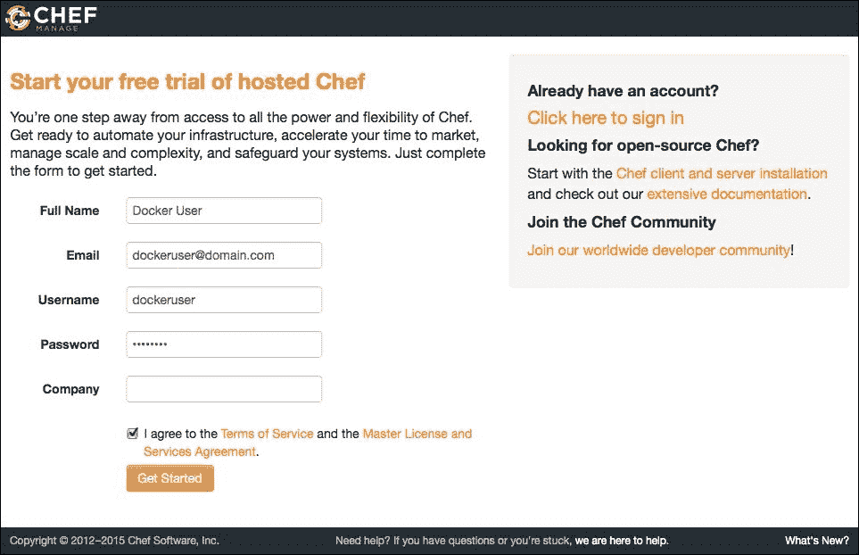
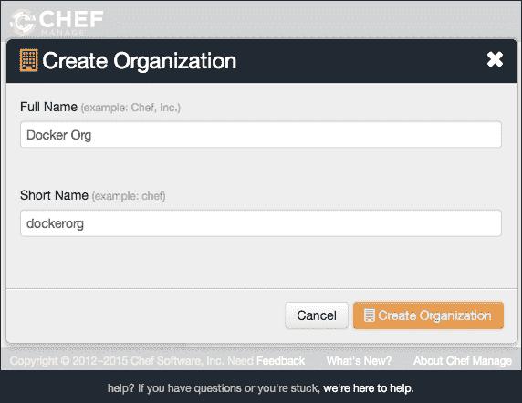
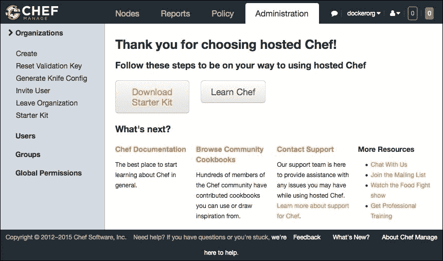
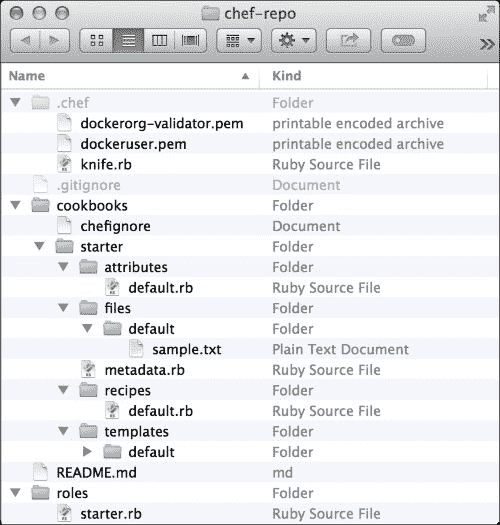
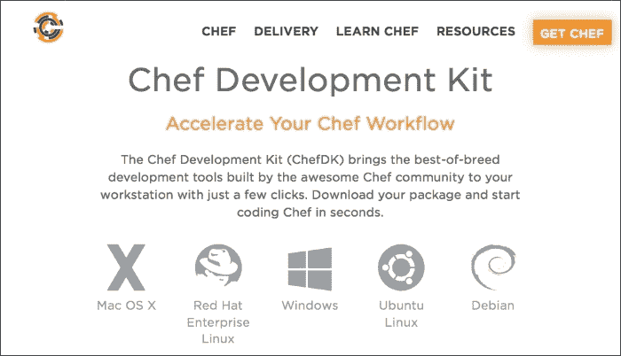
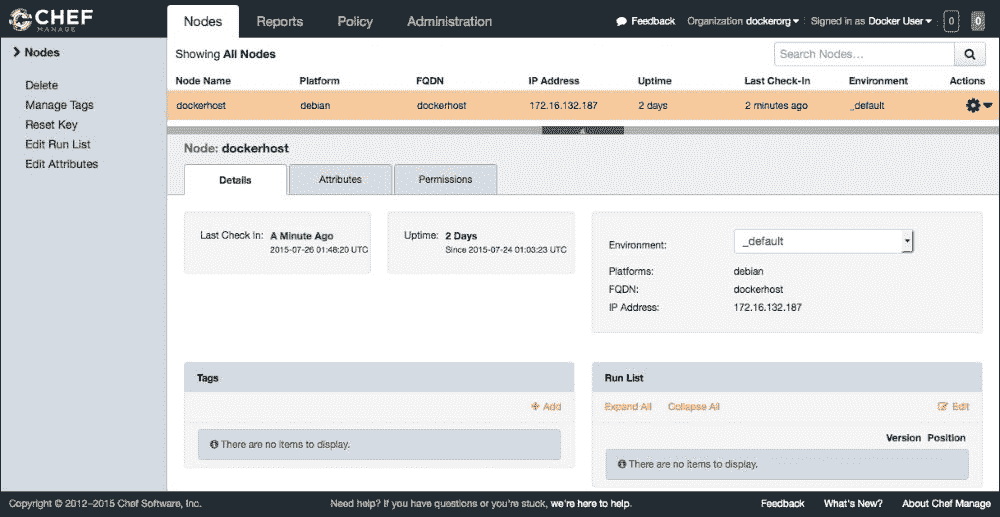
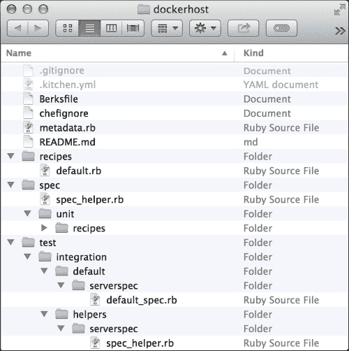
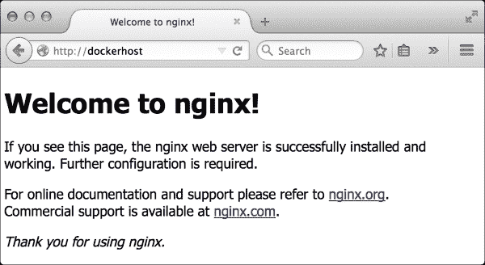

# 第三章 使用 Chef 自动化 Docker 部署

到目前为止，我们已经了解了 Docker 生态系统的各个方面。Docker 主机有几个配置参数。然而，手动配置 Docker 主机是一个缓慢且容易出错的过程。如果我们没有自动化策略，Docker 部署在生产环境中的扩展就会遇到问题。

在本章中，我们将学习配置管理的概念，以解决这个问题。我们将使用 Chef，一款配置管理软件，来大规模管理 Docker 主机。本章将涵盖以下主题：

+   配置管理的重要性

+   Chef 简介

+   自动配置 Docker 主机

+   部署 Docker 容器

+   替代自动化工具

# 配置管理简介

Docker 引擎有几个需要调整的参数，如 cgroups、内存、CPU、文件系统、网络等。确定哪些 Docker 容器运行在哪些 Docker 主机上是配置的另一个方面。Docker 容器本身也需要使用不同的 cgroups 设置、共享卷、链接容器、公用端口等进行配置。找到优化应用程序的参数组合需要一些时间。

将所有前述配置项复制到另一个 Docker 主机是手动执行非常困难的。我们可能无法记住创建主机所需的所有步骤，而且这也是一个容易出错且缓慢的过程。创建一份“文档”来记录这个过程也没有帮助，因为这样的文档往往随着时间的推移而变得过时。

如果我们不能及时、可靠地配置新的 Docker 主机，就没有空间扩展我们的 Docker 应用程序。以一致和快速的方式准备和配置 Docker 主机同样重要。否则，Docker 为我们的应用程序创建容器包的能力很快就会变得毫无意义。

配置管理是一种管理我们应用程序各方面变化的策略，它报告并审计我们系统所做的更改。这不仅仅适用于开发应用程序的过程中。在我们的案例中，它记录了所有 Docker 主机的更改以及 Docker 容器本身的运行情况。从某种意义上说，Docker 实现了我们应用程序的配置管理的以下几个方面：

+   Docker 容器可以复制我们应用程序的任何环境，从开发到预发布、测试、生产等环境。

+   构建 Docker 镜像是一种简单的方式，能够对应用程序进行更改并将其部署到所有环境。

+   Docker 使得所有团队成员都能获得有关我们应用程序的信息，并进行所需的更改，以高效地将软件交付给客户。通过查看`Dockerfile`，他们可以了解应用程序的哪个部分需要更新，以及为了正常运行，应用程序需要哪些内容。

+   Docker 跟踪我们环境中任何 Docker 镜像的变化。然后，它将变化追溯到相应版本的 `Dockerfile`。它追踪变化的内容、是谁做的、以及何时做的。

然而，运行我们应用程序的 Docker 主机怎么办？就像 `Dockerfile` 允许我们在版本控制中管理我们应用的环境一样，配置管理工具也可以用代码描述我们的 Docker 主机。它简化了创建 Docker 主机的过程。在扩展我们的 Docker 应用时，我们可以轻松地从头开始重新创建一个新的 Docker 主机。当发生硬件故障时，我们可以从已知配置中在其他地方启动新的 Docker 主机。如果我们想部署一个新的 Docker 容器版本，只需更新 Docker 主机的配置代码以指向新的镜像。配置管理使我们能够大规模管理 Docker 部署。

# 使用 Chef

Chef 是一个配置管理工具，它提供了一种领域特定语言来建模我们基础设施的配置。我们基础设施中的每个配置项都被建模为一个资源。资源基本上是一个 Ruby 方法，它接受一个代码块中的多个参数。以下示例资源描述了安装 `docker-engine` 包：

```
package 'docker-engine' do
  action :install
end
```

这些资源随后将一起写入 Ruby 源文件中，称为食谱（recipes）。当在服务器（在我们的案例中是 Docker 主机）上运行食谱时，所有定义的资源将被执行，以达到所需的状态配置。

一些 Chef 食谱可能依赖于其他补充项目，如配置模板和其他食谱。所有这些信息都与食谱一起收集在烹饪书中。烹饪书是将配置和策略分发到我们服务器的基本单元。

我们将编写 Chef 食谱，以表示我们 Docker 主机的所需状态配置。我们的食谱将组织在 Chef 烹饪书中，并分发到我们的基础设施中。然而，首先，让我们准备我们的 Chef 环境，以便开始用食谱描述基于 Docker 的基础设施。Chef 环境由三部分组成：

+   一个 Chef 服务器

+   一个工作站

+   一个节点

接下来的几个子章节将详细描述每个组件。然后，我们将设置它们以准备我们的 Chef 环境，以便管理我们的 Docker 主机。

### 注意

设置 Chef 环境的更多细节超出了本章的范围。更多信息可以在 Chef 文档网站 [`docs.chef.io`](http://docs.chef.io) 找到。

## 注册一个 Chef 服务器

Chef 服务器是烹饪书和其他治理我们整个基础设施的政策项的中央存储库。它包含关于我们所管理的基础设施的元数据。在我们的案例中，Chef 服务器包含了烹饪书、策略和关于我们的 Docker 主机的元数据。

要准备一个 Chef 服务器，我们只需要注册一个托管的 Chef 服务器账户。免费的 Chef 服务器账户允许我们在基础架构中管理最多五个节点。请按照以下步骤准备一个托管的 Chef 服务器账户：

1.  访问[`manage.chef.io/signup`](https://manage.chef.io/signup)，并按照以下截图填写账户信息：

1.  创建用户账户后，托管的 Chef 服务器会提示我们创建一个组织。组织用于管理 Chef 服务器的基于角色的访问控制。通过填写表单中的详细信息并点击**创建组织**按钮来创建一个组织：

1.  我们现在几乎完成了托管 Chef 服务器账户的创建。最后，点击**下载启动工具包**。这将下载一个包含我们启动 chef-repo 的 zip 文件。我们将在下一部分详细讨论 chef-repo。

## 设置我们的工作站

我们的 Chef 环境的第二部分是工作站。工作站用于与 Chef 服务器进行交互。这是我们进行大部分准备工作并编写代码以发送到 Chef 服务器的地方。在工作站中，我们将准备基础架构的配置项，并将它们放入 Chef 仓库中。

Chef 仓库包含了与 Chef 服务器交互和同步所需的所有信息。它包含用于认证和与 Chef 服务器交互的私钥以及其他配置文件。这些文件将位于我们 Chef 仓库中的`.chef`目录下。它还包含我们稍后编写并与 Chef 服务器同步的食谱（cookbooks），这些文件位于`cookbooks/`目录下。Chef 仓库中还有其他文件和目录，如数据包（data bags）、角色（roles）和环境（environments）等。不过，目前了解食谱和认证文件就足够了，它们可以帮助我们配置 Docker 主机。

你还记得我们在上一部分下载的启动工具包吗？解压这个文件，提取我们的 chef-repo。我们应该在目录树中看到以下文件：



工作站中的另一个重要组成部分是 Chef 开发工具包。它包含了所有必要的程序，帮助我们读取 chef-repo 中的所有配置并与 Chef 服务器进行交互。Chef 开发工具包中还提供了创建、开发和测试食谱的便捷程序。我们将在本章的其余部分中使用开发工具包中的各种程序。

现在，根据我们工作站的操作系统平台，从[`downloads.chef.io/chef-dk`](https://downloads.chef.io/chef-dk)下载 Chef 开发工具包。



接下来，打开下载的安装程序。根据我们的平台提示安装 Chef 开发工具包。最后，通过以下命令确认安装成功：

```
$ chef -v
Chef Development Kit Version: 0.6.2
chef-client version: 12.3.0
berks version: 3.2.4
kitchen version: 1.4.0

```

现在我们已经设置好了工作站，接下来让我们进入`chef-repo/`目录，准备 Chef 环境的最后一个组件。

## 启动节点

我们 Chef 环境的最后一部分是节点。节点是任何由 Chef 管理的计算机。它可以是物理机器、虚拟机、云中的服务器或网络设备。在我们的案例中，我们的 Docker 主机就是一个节点。

任何节点被 Chef 管理的核心组件是 chef-client。它连接到 Chef 服务器，下载必要的文件以将我们的节点带到其配置状态。当 chef-client 在我们的节点上运行时，它执行以下步骤：

1.  它将节点注册并认证到 Chef 服务器。

1.  它收集我们节点的系统信息以创建节点对象。

1.  然后，它同步我们节点所需的 Chef 食谱。

1.  它通过加载我们节点所需的配方来编译资源。

1.  接下来，它执行所有资源并执行相应的操作以配置我们的节点。

1.  最后，它将 chef-client 运行的结果报告回 Chef 服务器以及其他已配置的通知端点。

现在，让我们通过从工作站启动 Docker 主机来准备它作为一个节点。启动过程将安装并配置 chef-client。运行以下命令开始启动过程：

```
$ knife bootstrap dockerhost
...
Connecting to dockerhost
dockerhost Installing Chef Client...
...
dockerhost trying wget...
dockerhost Comparing checksum with sha256sum...
dockerhost Installing Chef 12.3.0
dockerhost installing with dpkg...
...
dockerhost Thank you for installing Chef!
dockerhost Starting first Chef Client run...
dockerhost Starting Chef Client, version 12.3.0
dockerhost Creating a new client identity for dockerhost using the validator key.
dockerhost resolving cookbooks for run list: []
dockerhost Synchronizing Cookbooks:
dockerhost Compiling Cookbooks...
dockerhost ... WARN: Node dockerhost has an empty run list.
dockerhost Converging 0 resources
dockerhost 
dockerhost Running handlers:
dockerhost Running handlers complete
dockerhost Chef Client finished, 0/0 resources updated in 12.78s

```

如我们在前面的命令中所见，启动过程做了两件事。首先，它在我们的 Docker 主机节点上安装并配置了 chef-client。接下来，它启动了 chef-client 以将其期望的状态与我们的 Chef 服务器进行同步。由于我们尚未为 Docker 主机分配任何设计状态，因此它没有执行任何操作。

### 注意

我们可以根据需要定制此启动过程。关于如何使用`knife bootstrap`的更多信息，请参见[`docs.chef.io/knife_bootstrap.html`](http://docs.chef.io/knife_bootstrap.html)。

在某些情况下，云服务提供商已经深度集成了 Chef。因此，我们将不使用`knife bootstrap`，而是使用云服务提供商的 SDK。在那里，我们只需指定希望集成 Chef 即可。我们将为其提供必要的信息，如 chef-client 的`client.rb`配置和验证密钥的凭据。

我们的 Docker 主机现在已正确注册到 Chef 服务器，准备获取其配置。请访问[`manage.chef.io/organizations/dockerorg/nodes/dockerhost`](https://manage.chef.io/organizations/dockerorg/nodes/dockerhost)查看我们的 Docker 主机作为 Chef 环境中的一个节点，如下图所示：



# 配置 Docker 主机

现在我们已经正确设置了所有 Chef 环境组件，可以开始编写 Chef 配方，实际描述我们的 Docker 主机应该具备什么样的配置。此外，我们将通过利用 Chef 生态系统中现有的 Chef 烹饪书来提升我们的生产力。由于 Docker 是一个流行的基础设施堆栈，用于部署容器，我们可以使用一些现成的烹饪书来配置我们的 Docker 主机。社区提供的 Chef 烹饪书可以在 Chef 超市中找到。我们可以访问[`supermarket.chef.io`](http://supermarket.chef.io)来发现其他可以直接使用的烹饪书。

在本节中，您将学习如何编写 Chef 配方并将其应用于我们的节点。请按照以下步骤为我们的 Docker 主机编写配方：

1.  使用 Chef 开发工具包的 `chef generate cookbook` 命令来生成我们烹饪书的样板文件。在进入烹饪书目录后，发出以下命令：

    ```
    $ cd cookbooks
    $ chef generate cookbook dockerhost

    ```

    标准的烹饪书目录结构将类似于以下截图：

    

1.  接下来，我们将准备编辑我们的烹饪书。通过以下命令将工作目录更改为我们之前创建的烹饪书所在的目录：

    ```
    $ cd dockerhost

    ```

1.  从 Chef 超市安装以下烹饪书作为依赖项：`apt` 和 `docker`。这些烹饪书提供了可以在我们的配方中使用的额外资源定义。稍后我们将使用它们作为构建块来设置我们的 Docker 主机。要添加依赖项，请更新 `metadata.rb` 文件，如下所示：

    ```
    name 'dockerhost'
    maintainer 'The Authors'
    maintainer_email 'you@example.com'
    license 'all_rights'
    description 'Installs/Configures dockerhost'
    long_description 'Installs/Configures dockerhost'
    version '0.1.0'

    depends 'apt', '~> 2.7.0'
    depends 'docker', '~> 0.40.3'

    ```

    ### 注意

    `metadata.rb` 文件提供有关我们的 Chef 烹饪书的元数据。元数据中的信息为 Chef 服务器提供提示，以便烹饪书可以正确部署到我们的节点。有关如何配置 Chef 烹饪书的元数据，请访问[`docs.chef.io/config_rb_metadata.html`](http://docs.chef.io/config_rb_metadata.html)。

1.  现在我们已经声明了依赖关系，可以通过发出以下命令来下载它们：

    ```
    $ berks install
    Resolving cookbook dependencies...
    Fetching 'dockerhost' from source at .
    Fetching cookbook index from https://supermarket.chef.io...
    Installing apt (2.7.0)
    Installing docker (0.40.3)
    Using dockerhost (0.1.0) from source at .

    ```

1.  最后，我们将编写与[`blog.docker.com/2015/07/new-apt-and-yum-repos`](http://blog.docker.com/2015/07/new-apt-and-yum-repos)中找到的安装说明等效的 Chef 配方。我们将使用之前添加的**apt** 依赖烹饪书提供的 `apt_repository` 资源。然后，将以下内容添加到 `recipes/default.rb` 文件中：

    ```
    apt_repository 'docker' do
      uri 'http://apt.dockerproject.org/repo'
      components %w(debian-jessie main)
      keyserver 'p80.pool.sks-keyservers.net'
      key '58118E89F3A912897C070ADBF76221572C52609D'
      cache_rebuild true
    end

    package 'docker-engine'
    ```

现在，我们已经完成了 `dockerhost/` Chef 烹饪书的准备工作。最后一步是将其应用于我们的 Docker 主机，以便它可以选择所需的配置。请按照以下剩余步骤进行操作：

1.  首先，将 Chef 烹饪书上传到我们的 Chef 服务器。请注意，在以下命令的输出中，我们依赖的 `apt` 和 `docker` 烹饪书也会自动上传：

    ```
    $ berks upload
    Uploaded apt (2.7.0) to: 'https://api.opscode.../dockerorg'
    Uploaded docker (0.40.3) to: 'https://api.ops.../dockerorg'
    Uploaded dockerhost (0.1.0) to: 'https://api.opscode.com:443/organizations/dockerorg'

    ```

1.  接下来，通过设置其 `run_list` 来将我们之前编写的 `dockerhost` 配方应用于节点（即 Docker 主机），使用以下命令：

    ```
    $ knife node run_list set dockerhost dockerhost
    dockerhost:
     run_list: recipe[dockerhost]

    ```

1.  最后，在 `dockerhost` 上运行 chef-client。chef-client 将获取 Docker 主机的节点对象，并应用我们在前面步骤中所设置的期望状态配置，如下所示：

    ```
    $ ssh dockerhost
    dockerhost$ sudo chef-client
    Starting Chef Client, version 12.3.0
    resolving cookbooks for run list: ["dockerhost"]
    Synchronizing Cookbooks:
     - apt
     - dockerhost
     - docker
    Compiling Cookbooks...
    Converging 2 resources
    Recipe: dockerhost::default
     * apt_repository[docker] action add
     * execute[install-key 58118E89F3A912897C...] action run
     ...
     * apt_package[docker-engine] action install
     - install version 1.7.1-0~j... of package docker-engine

    Running handlers:
    Running handlers complete
    Chef Cl... finished, 6/7 resources updated in 24.69 seconds

    ```

现在，我们已经通过 Chef 在 Docker 主机上安装并配置了 Docker。每当我们需要添加另一个 Docker 主机时，只需在云服务提供商中创建另一个服务器，并使用之前编写的 `dockerhost` Chef 配方进行初始化配置。当我们想要更新所有 Docker 主机中 Docker 守护进程的配置时，只需更新 Chef cookbook 并重新运行 chef-client。

### 提示

在生产环境中，安装配置管理软件的目的是让我们的 Docker 主机无需登录即可进行配置更新。手动运行 chef-client 只是自动化的一半。

我们希望将 chef-client 作为守护进程运行，这样我们就不必每次执行更新时都运行它。chef-client 守护进程将定期轮询 Chef 服务器，检查是否有任何更新需要应用到它所管理的节点。默认情况下，轮询间隔设置为 30 分钟。

有关如何将 chef-client 配置为守护进程的更多信息，请参阅 Chef 文档：[`docs.chef.io/chef_client.html`](https://docs.chef.io/chef_client.html)。

# 部署 Docker 容器

管理大规模 Docker 的下一步是自动化将 Docker 容器部署到我们的 Docker 主机池。到目前为止，我们已经构建了一些 Docker 应用程序，并且大致了解这些容器如何相互通信并相互消费。Chef 配方可以用来在代码中表示这种架构拓扑，这对于大规模管理我们的整个应用程序和基础设施至关重要。我们可以识别出需要运行的 Docker 容器，并了解每个容器如何与其他容器连接。我们可以确定 Docker 容器的部署位置。将整个架构用代码表示，可以为我们的应用程序制定编排策略。

在本节中，我们将创建一个 Chef 配方，用于编排将 Nginx Docker 镜像部署到我们的 Docker 主机。我们将使用在上一节中添加的 `docker` cookbook 提供的 Chef 资源来配置我们的 Docker 主机。请按照以下步骤进行部署：

1.  首先，创建我们将要使用的 Chef 配方。以下命令将在我们的 `dockerhost/` cookbook 中创建 `recipes/containers.rb` 配方文件：

    ```
    $ chef generate recipe . containers

    ```

1.  接下来，将官方 Nginx Docker 镜像从 [`registry.hub.docker.com/_/nginx`](https://registry.hub.docker.com/_/nginx) 拉取到我们的 Docker 主机。请在 `recipes/containers.rb` 中编写以下代码：

    ```
    docker_image 'nginx' do
      tag '1.9.3'
    end
    ```

1.  下载 Docker 镜像后，配置 Docker 主机以运行容器。从`docker`菜谱的版本 0.40.3 开始，我们需要指定我们的 Debian Jessie Docker 主机部署使用`systemd`作为其`init`系统。还需要将以下内容添加到`recipes/containers.rb`中：

    ```
    node.set['docker']['container_init_type'] = 'systemd'

    directory '/usr/lib/systemd/system'

    docker_container 'nginx' do
      tag '1.9.3'
      container_name 'webserver'
      detach true
      port '80:80'
    end
    ```

    ### 注意

    `docker_container`和`docker_image`有其他一些选项，我们可以调整这些选项来指定我们想对容器执行的操作。`docker`菜谱还包含其他资源，可以与我们的 Docker 主机进行交互。有关选项和进一步使用的信息，可以在其项目页面[`github.com/bflad/chef-docker`](https://github.com/bflad/chef-docker)找到。

1.  接下来，我们将为发布准备新版本的菜谱。为此，请在`metadata.rb`中更新版本信息，具体如下：

    ```
    name 'dockerhost'
    maintainer 'The Authors'
    maintainer_email 'you@example.com'
    license 'all_rights'
    description 'Installs/Configures dockerhost'
    long_description 'Installs/Configures dockerhost'
    version '0.2.0'

    depends 'apt', '~> 2.7.0'
    depends 'docker', '~> 0.40.3'
    ```

1.  更新`Berksfile.lock`文件，以固定我们将在下一步上传到 Chef 服务器的所有菜谱的版本。输入以下命令以执行更新：

    ```
    $ berks install
    Resolving cookbook dependencies...
    Fetching 'dockerhost' from source at .
    Fetching cookbook index from https://supermarket.chef.io...
    Using dockerhost (0.2.0) from source at .
    Using apt (2.7.0)
    Using docker (0.40.3)

    ```

1.  现在，我们的新菜谱的所有工件已经准备好，我们将输入以下命令将更新后的菜谱上传到我们的 Chef 服务器。请注意，`berks upload`命令会自动识别出只有`dockerhost`菜谱需要更新，并跳过上传`apt`和`docker`菜谱：

    ```
    $ berks upload
    Skipping apt (2.7.0) (frozen)

    Skipping docker (0.40.3) (frozen)
    Uploaded dockerhost (0.2.0) to: 'https://ap.../dockerorg'

    ```

1.  接下来，将`recipes/containers.rb`添加到 Docker 主机的运行列表中。输入以下命令以更新表示 Docker 主机的节点：

    ```
    $ knife node run_list add dockerhost dockerhost::containers
    dockerhost:
     run_list:
     recipe[dockerhost]
     recipe[dockerhost::containers]

    ```

1.  最后，重新运行 chef-client 以获取 Docker 主机的新配置。如果我们将 chef-client 配置为以守护进程方式运行，我们也可以等待 chef-client 的重新运行。执行以下命令：

    ```
    $ ssh dockerhost
    dockerhost$ sudo chef-client
    Starting Chef Client, version 12.3.0
    resolving cookbooks for run list: ["dockerhost", "dockerhost::containers"]
    Synchronizing Cookbooks:
     - dockerhost
     - apt
     - docker
    Compiling Cookbooks...
    Converging 5 resources
    Recipe: dockerhost::default
    ...
    Recipe: dockerhost::containers
     * docker_image[nginx] action pull

     * directory[/usr/lib/systemd/system] action create
     - create new directory /usr/lib/systemd/system
     * docker_container[nginx] action run
     * template[/usr/lib/.../webserver.socket] action create
     ...
     * service[webserver] action enable (up to date)
     * service[webserver] action start
     - start service service[webserver]
     * template[webserver.socket] action nothing ...
     * template[webserver.service] action nothing ...
     * service[webserver] action nothing ...

    Running handlers:
    Running handlers complete
    Chef Client finished, 6/10 resources updated in 42.83 seconds

    ```

我们现在已经让 Docker 主机运行了 nginx Docker 容器。我们可以通过访问`http://dockerhost`来确认它是否正常工作。我们应该能够看到如下图所示的页面：



# 其他方法

还有其他通用的配置管理工具，可以配置我们的 Docker 主机。以下是我们可以使用的其他工具的简短列表：

+   **Puppet**：请参阅[`puppetlabs.com`](http://puppetlabs.com)。

+   **Ansible**：可以在[`ansible.com`](http://ansible.com)找到。

+   **CFEngine**：可以在[`cfengine.com`](http://cfengine.com)找到。

+   **SaltStack**：可以在[`saltstack.com`](http://saltstack.com)找到更多信息。

+   **Docker 机器**：这是一个非常特定的配置管理工具，允许我们在基础设施中配置和管理 Docker 主机。有关 Docker 机器的更多信息，请参阅 Docker 文档页面[`docs.docker.com/machine`](https://docs.docker.com/machine)。

如果我们不想管理 Docker 主机基础设施，我们可以使用 Docker 托管服务。流行的云服务提供商已经开始提供作为预配置云镜像的 Docker 主机，我们可以使用它们。其他提供商则提供更全面的解决方案，让我们能够将所有云中的 Docker 主机当作一个虚拟 Docker 主机来交互。以下是一些流行的云服务提供商及其与 Docker 生态系统集成的链接：

+   Google Container Engine ([`cloud.google.com/container-engine`](https://cloud.google.com/container-engine))

+   Amazon EC2 容器服务 ([`aws.amazon.com/documentation/ecs`](http://aws.amazon.com/documentation/ecs))

+   Azure Docker VM 扩展 ([`github.com/Azure/azure-docker-extension`](https://github.com/Azure/azure-docker-extension))

+   Joyent 弹性容器服务 ([`www.joyent.com/public-cloud`](https://www.joyent.com/public-cloud))

在部署 Docker 容器方面，有几种容器工具可以帮助我们实现这一目标。它们提供 API 来运行和部署我们的 Docker 容器。某些提供的 API 甚至与 Docker 引擎本身兼容。这让我们可以像操作一个虚拟 Docker 主机一样与 Docker 主机池进行交互。以下是一些可以帮助我们协调容器部署到 Docker 主机池的工具：

+   Docker Swarm ([`www.docker.com/docker-swarm`](https://www.docker.com/docker-swarm))

+   Google Kubernetes ([`kubernetes.io`](http://kubernetes.io))

+   CoreOS fleet ([`coreos.com/fleet`](https://coreos.com/fleet))

+   Mesophere Marathon ([`mesosphere.github.io/marathon`](https://mesosphere.github.io/marathon))

+   SmartDataCenter Docker 引擎 ([`github.com/joyent/sdc-docker`](https://github.com/joyent/sdc-docker))

然而，我们仍然需要像 Chef 这样的配置管理工具来部署和配置我们的编排系统，以管理我们 Docker 主机池之上的系统。

# 总结

在本章中，我们学习了如何自动化配置我们的 Docker 部署。使用 Chef 使我们能够配置和提供多个 Docker 主机的规模。它还使我们能够为应用程序部署并协调 Docker 容器到我们的 Docker 主机池。从此以后，你可以编写 Chef 配方来保持本书中你将学习到的所有 Docker 优化技术。

在下一章中，我们将介绍如何对整个 Docker 基础设施和应用程序进行监控。这将帮助我们进一步了解如何优化 Docker 部署，以提高性能。
