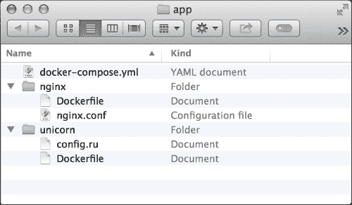
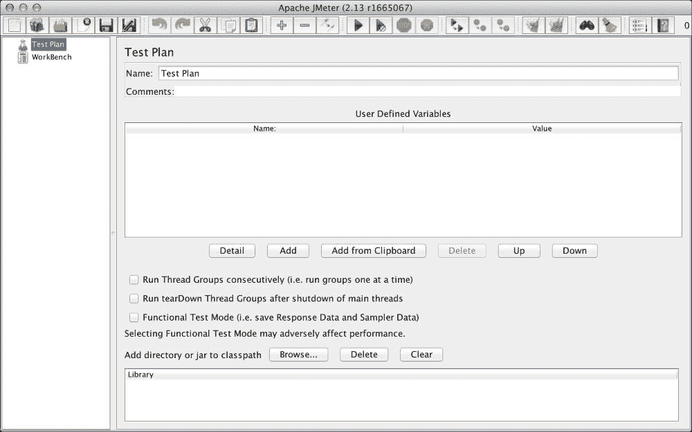
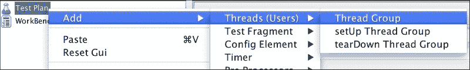
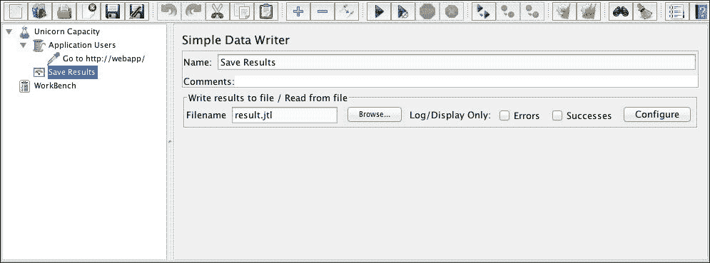
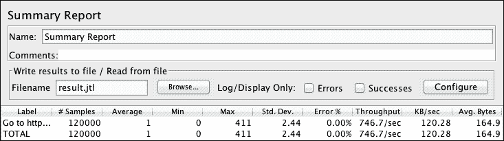
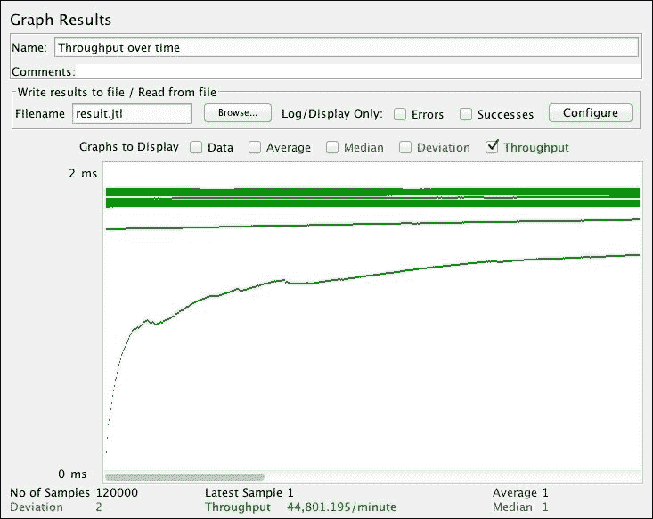
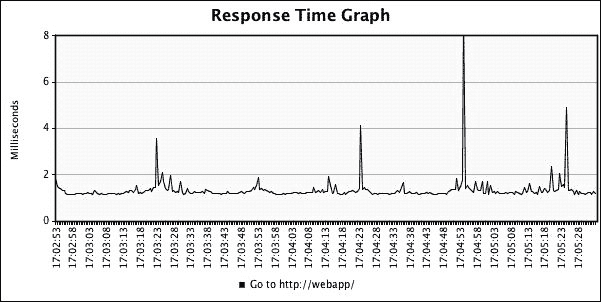
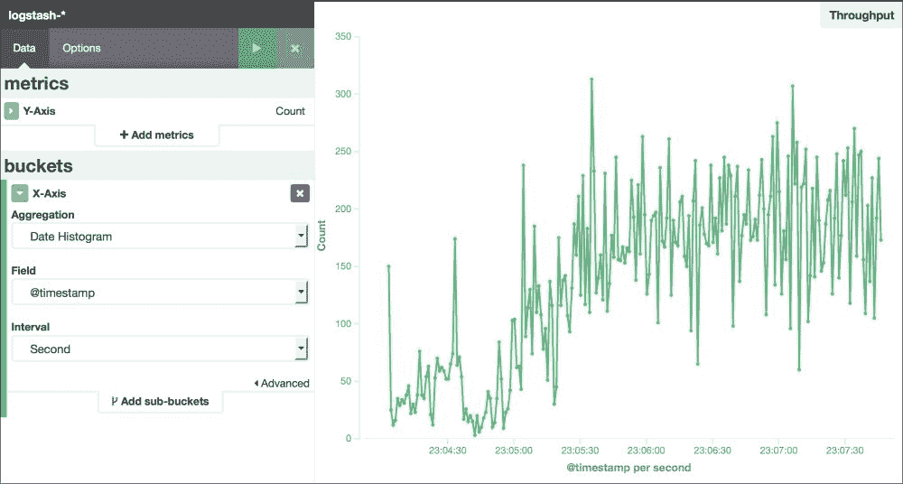
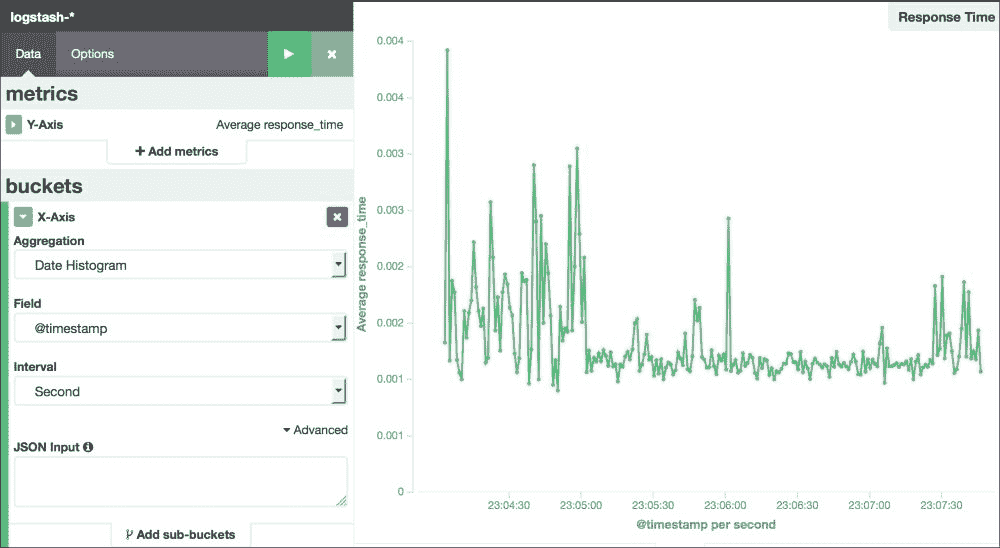
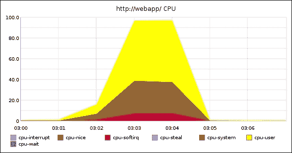

# 第五章：基准测试

在优化我们的 Docker 应用程序时，验证我们调整的参数是非常重要的。基准测试是一种实验性的方式，用于确定我们在 Docker 容器中修改的元素是否按预期执行。我们的应用程序将有广泛的选项可以优化。运行这些应用程序的 Docker 主机也有自己的参数集，如内存、网络、CPU 和存储等。根据我们应用程序的性质，这些参数中的一个或多个可能会成为瓶颈。进行一系列测试以通过基准测试验证每个组件对于指导我们的优化策略非常重要。

此外，通过创建适当的性能测试，我们还可以识别当前 Docker 基础应用程序配置的极限。有了这些信息，我们可以开始探索基础设施参数，例如通过将应用程序部署到更多 Docker 主机上来进行横向扩展。我们还可以利用这些信息，通过将工作负载迁移到内存、存储或 CPU 更强大的 Docker 主机上来纵向扩展相同的应用程序。而当我们有混合云部署时，我们可以利用这些测量数据来确定哪个云服务商能为我们的应用程序提供最佳性能。

测量我们的应用程序如何响应这些基准测试对于规划我们 Docker 基础设施所需的容量至关重要。通过创建一个模拟峰值和正常状态的测试工作负载，我们可以预测应用程序一旦发布到生产环境中，它将如何表现。

在本章中，我们将涵盖以下内容，以基准测试我们在 Docker 基础设施中部署的一个简单 Web 应用程序：

+   设置 Apache JMeter 进行基准测试

+   创建和设计基准工作负载

+   分析应用性能

# 设置 Apache JMeter

Apache JMeter 是一种流行的应用程序，用于测试 Web 服务器的性能。除了对 Web 服务器进行负载测试外，这个开源项目还支持测试其他网络协议，如 LDAP、FTP，甚至是原始的 TCP 数据包。它具有高度的可配置性，并且足够强大，能够设计复杂的工作负载以适应不同的使用模式。这个功能可以用来模拟成千上万的用户突然访问我们的 Web 应用程序，从而引发负载激增。

任何负载测试软件中预期的另一项功能是其数据捕获和分析功能。JMeter 具有如此多样化的数据记录、绘图和分析功能，我们可以立即查看基准测试的结果。最后，它拥有广泛的插件，可能已经具备了我们计划使用的负载模式、分析或网络连接。

### 注意

关于 Apache JMeter 的功能和使用方法的更多信息，请访问其官方网站：[`jmeter.apache.org`](http://jmeter.apache.org)。

在本节中，我们将部署一个示例应用程序进行基准测试，并准备我们的工作站运行我们的第一个基于 JMeter 的基准测试。

## 部署示例应用程序

如果需要，我们也可以带上自己想要基准测试的 web 应用程序。但在本章的其余部分，我们将基准测试本节中描述的以下应用程序。该应用程序是一个简单的 Ruby web 应用程序，通过 Unicorn（一个流行的 Ruby 应用服务器）部署。它通过 Nginx 的 Unix 套接字接收流量。这个设置对于大多数现实中的 Ruby 应用程序来说非常典型。

在本节中，我们将把这个 Ruby 应用程序部署到名为 `webapp` 的 Docker 主机上。我们将为应用程序、基准工具和监控使用不同的 Docker 主机。这种分离非常重要，因为我们运行的基准测试和监控工具不会影响基准测试结果。

接下来的几步将展示如何构建和部署我们的简单 Ruby web 应用栈：

1.  首先，通过创建以下 Rack `config.ru` 文件来创建 Ruby 应用程序：

    ```
    app =  proc do |env|

      Math.sqrt rand
      [200, {}, %w(hello world)]
    end
    run app
    ```

1.  接下来，我们将使用以下 `Dockerfile` 将应用程序打包为 Docker 容器：

    ```
    FROM ruby:2.2.3

    RUN gem install unicorn
    WORKDIR /app

    COPY . /app

    VOLUME /var/run/unicorn

    CMD unicorn -l /var/run/unicorn/unicorn.sock
    ```

1.  现在我们将创建 Nginx 配置文件 `nginx.conf`。它将通过我们在前一步中创建的 Unix 套接字将请求转发到我们的 Unicorn 应用服务器。在记录请求日志时，我们将记录 `$remote_addr` 和 `$response_time`。稍后在分析基准测试结果时，我们将特别关注这些指标：

    ```
    events { }

    http {
      log_format unicorn ''$remote_addr [$time_local]''
                 '' ""$request"" $status''
                 '' $body_bytes_sent $request_time'';
      access_log /var/log/nginx/access.log unicorn; 

      upstream app_server {
        server unix:/var/run/unicorn/unicorn.sock;
      }
      server {
        location / {
          proxy_pass http://app_server;
        }
      }
    }
    ```

1.  上述的 Nginx 配置文件将被打包为一个 Docker 容器，并使用以下 `Dockerfile`：

    ```
    FROM nginx:1.9.4

    COPY nginx.conf /etc/nginx/nginx.conf
    ```

1.  最后一个组件将是一个 `docker-compose.yml` 文件，用于将两个 Docker 容器连接在一起进行部署：

    ```
    web:
      log_opt:
        syslog-tag: nginx
      build: ./nginx
      ports:
        - 80:80
      volumes_from:
        - app
    app:
      build: ./unicorn
    ```

最终，我们的代码库中将包含如下截图所示的文件：



在准备好我们的 Docker 化 web 应用程序后，现在通过输入以下命令将其部署到 Docker 主机上：

```
webapp$ docker-compose up -d

```

### 注意

Docker Compose 是一个用于创建多容器应用程序的工具。它在 YML 文件中定义了一个模式，用于描述我们希望 Docker 容器如何运行以及如何相互连接。

Docker Compose 支持 curl | bash 类型的安装方式。为了在 Docker 主机上快速安装它，请输入以下命令：

```
dockerhost$ curl -L https://github.com/docker/compose/releases/download/1.5.2/docker-compose-`uname -s`-`uname -m` \> /usr/local/bin/docker-compose

```

本章中我们只简单提到过 Docker Compose。然而，我们可以在 Docker Compose 的文档网站上获得更多信息：[`docs.docker.com/compose`](http://docs.docker.com/compose)。

最后，让我们进行初步测试，以确定我们的应用程序是否正常工作：

```
$ curl http://webapp.dev
hello world

```

现在我们已经准备好了要基准测试的应用程序。在接下来的部分，我们将通过安装 Apache JMeter 来准备我们的工作站进行基准测试。

## 安装 JMeter

在本章的其余部分，我们将使用 Apache JMeter 2.13 版本来进行基准测试。在本节中，我们将下载并安装它到我们的工作站上。按照接下来的几步正确设置 JMeter：

1.  首先，访问 JMeter 的下载网页：[`jmeter.apache.org/download_jmeter.cgi`](http://jmeter.apache.org/download_jmeter.cgi)。

1.  选择 **apache-jmeter-2.13.tgz** 的链接以开始下载二进制文件。

1.  下载完成后，通过输入以下命令解压 tarball：

    ```
    $ tar -xzf apache-jmeter-2.13.tgz

    ```

1.  接下来，我们将把 `bin/` 目录添加到我们的 `$PATH` 中，以便可以轻松地从命令行启动 JMeter。为此，我们将输入以下命令：

    ```
    $ export PATH=$PATH:`pwd`/apache-jmeter-2.13/bin

    ```

1.  最后，通过输入以下命令启动 JMeter：

    ```
    $ jmeter

    ```

我们现在将看到 JMeter 的 UI，和以下截图一样。现在我们终于准备好为我们的应用程序编写基准测试了！：



### 注意

请注意，Apache JMeter 是一个 Java 应用程序。根据 JMeter 网站的信息，它至少需要 Java 1.6 才能正常运行。在安装 JMeter 之前，确保你已经正确设置了 **Java 运行环境**（**JRE**）。

如果我们在 Mac OSX 环境中，可以使用 Homebrew，并输入以下命令：

```
$ brew install jmeter

```

对于其他平台，前面描述的安装说明应该足够让你入门。有关如何安装 JMeter 的更多信息，可以参考 [`jmeter.apache.org/usermanual/get-started.html`](http://jmeter.apache.org/usermanual/get-started.html)。

# 构建基准工作负载

为应用程序编写基准测试是一个开放的探索领域。刚开始使用 Apache JMeter 时可能会觉得有些复杂。它有许多选项需要调整，以便编写我们的基准测试。首先，我们可以使用我们应用程序的“故事”作为起点。以下是我们可以问自己的几个问题：

+   我们的应用程序做了什么？

+   我们用户的角色是什么？

+   他们如何与我们的应用程序进行互动？

从这些问题开始，我们可以将它们转化为对我们应用程序的实际请求。

在我们前面写的示例应用程序中，我们有一个 Web 应用程序，它会向用户展示 `Hello World`。在 Web 应用程序中，我们通常关注的是吞吐量和响应时间。吞吐量指的是一次能有多少用户接收到 `Hello World`。响应时间则是指从用户请求 `Hello World` 到接收到 `Hello World` 消息之间的时间延迟。

在本节中，我们将创建一个初步的基准测试，在 Apache JMeter 中进行。接着，我们将使用 JMeter 的分析工具和我们在第四章，*监控 Docker 主机和容器*中部署的监控堆栈开始分析我们的初步结果。之后，我们将对我们开发的基准进行迭代并进行调整。通过这种方式，我们可以确保我们的应用程序基准测试是正确的。

## 在 JMeter 中创建测试计划

一系列的基准测试在 Apache JMeter 中由一个测试计划描述。测试计划描述了 JMeter 将执行的一系列步骤，例如对一个 Web 应用程序进行请求。测试计划中的每个步骤都称为一个元素。这些元素本身也可以包含一个或多个子元素。最终，我们的测试计划看起来就像一棵树——一个元素的层次结构，用来描述我们为应用程序设计的基准测试。

要将元素添加到我们的测试计划中，我们只需右键单击我们想要的父元素，然后选择**添加**。这会打开一个上下文菜单，列出可以添加到选定父元素的元素。在以下截图中，我们向主元素**测试计划**添加了一个**线程组**元素：



接下来的几个步骤展示了如何创建一个测试计划，进行我们想要的基准测试：

1.  首先，让我们将**测试计划**重命名为一个更合适的名称。点击**测试计划**元素。这将更新右侧的主要 JMeter 窗口。在标有**名称**的表单字段中，将值设置为**Unicorn Capacity**。

1.  在**Unicorn Capacity**测试计划下，创建一个线程组。将其命名为**应用程序用户**。我们将配置该线程组，初始时从单个线程发送 10,000 个请求到我们的应用程序。使用以下参数填写表单以实现此设置：

    +   **线程数**: 1

    +   **Ramp-up 时间**: 0 秒

    +   **循环次数**: 120,000 次

        ### 提示

        当我们开始制定测试计划时，使用较低的循环次数是有用的。与其设置 120,000 次循环，不如从 10,000 次甚至仅仅 10 次开始。我们的基准测试时间较短，但在开发过程中能立即得到反馈，比如在进行下一步时。完成整个测试计划后，我们随时可以回溯并调整它，以生成更多的请求。

1.  接下来，在**应用程序用户**线程组下，我们通过添加**采样器，HTTP 请求**来创建实际的请求。这是配置我们如何向 Web 应用程序发出请求的设置：

    +   **名称**: 访问`http://webapp/`

    +   **服务器名称**: `webapp`

1.  最后，我们通过在**Unicorn Capacity**测试计划下添加监听器来配置如何保存测试结果。为此，我们将添加一个**Simple Data Writer**，并将其命名为**保存结果**。我们将**文件名**字段设置为`result.jtl`，以便将基准测试结果保存到该文件中。稍后在分析基准测试结果时，我们会引用此文件。

现在我们有了一个基本的基准负载，它会生成 120,000 个 HTTP 请求到`http://webapp/`。然后，测试计划会将每个请求的结果保存在名为`result.jtl`的文件中。以下是创建测试计划最后一步后 JMeter 的屏幕截图：



最后，到了运行基准测试的时候了。进入**运行**菜单，然后选择**开始**以开始执行测试计划。在基准测试运行时，**开始**按钮会变灰并禁用。执行完成后，按钮会重新启用。

在运行基准测试后，我们将在下一节使用 JMeter 的分析工具查看 `result.jtl` 文件来分析结果。

### 注意

在 JMeter 测试计划中，可以放置多种类型的元素。除了我们之前用来为应用程序创建基本基准的三个元素外，还有一些其他元素可以调控请求、执行其他网络请求和分析数据。

测试计划元素的全面列表及其描述可以在 JMeter 页面找到：[`jmeter.apache.org/usermanual/component_reference.html`](http://jmeter.apache.org/usermanual/component_reference.html)。

# 分析基准测试结果

在本节中，我们将分析基准测试结果，并识别 120,000 次请求如何影响我们的应用程序。在创建 Web 应用程序基准时，通常有两个我们关注的方面：

+   我们的应用程序一次能处理多少请求？

+   每个请求在我们的应用程序中被处理的时间有多长？

这两个低级 Web 性能指标可以很容易地转化为我们应用程序的业务影响。例如，有多少客户正在使用我们的应用程序？另一个是，他们如何从用户体验的角度感知我们应用程序的响应性？我们可以关联应用程序中的二级指标，如 CPU、内存和网络，以确定我们的系统容量。

## 查看 JMeter 运行结果

JMeter 的多个监听器元素具有渲染图形的功能。在运行基准测试时启用这一功能对于开发测试计划很有用。但 UI 渲染结果所花费的时间，加上实际基准请求的时间，会影响测试性能。因此，我们最好将基准测试的执行和分析组件分开。在本节中，我们将创建一个新的测试计划，并查看一些 JMeter 监听器元素，用于分析我们在 `result.jtl` 中获得的数据。

为了开始分析，我们首先创建一个新的测试计划，并将其命名为**分析结果**。我们将在这个测试计划的父元素下添加各种监听器元素。接下来，按照以下步骤添加可以用来分析基准结果的 JMeter 监听器。

### 计算吞吐量

对于我们的第一次分析，我们将使用**汇总报告**监听器。这个监听器将显示我们应用程序的吞吐量。吞吐量的测量将显示我们的应用程序每秒可以处理的事务数量。

要显示吞吐量，执行以下步骤：

加载监听器后，填写**文件名**字段，选择我们在运行基准测试时生成的`result.jtl`文件。对于我们之前执行的测试，以下截图显示了以每秒 746.7 次请求的吞吐量向`http://webapp/`发送了 120,000 个 HTTP 请求：



我们还可以通过**图形结果**监听器查看在基准测试过程中吞吐量的变化。在**分析结果**测试计划元素下创建这个监听器，并将其命名为**吞吐量随时间变化**。确保只选中**吞吐量**复选框（不过你也可以稍后查看其他数据点）。创建监听器后，再次加载我们的`result.jtl`测试结果。以下截图展示了吞吐量随时间的变化情况：



如我们在前面的截图中看到的，吞吐量在 JMeter 尝试预热其单线程请求池时起初较慢。但是当基准测试继续运行后，吞吐量水平逐渐稳定。通过在线程组中提前设置较多的循环次数，我们能够最小化早期预热期的影响。

这样，在**汇总报告**中显示的吞吐量更或多或少是一个一致的结果。请注意，**图形结果**监听器会在采样几次后将其数据点环绕。

### 提示

记住，在基准测试中，获取更多的样本数据，我们的观察结果会更加精确！

### 绘制响应时间

在基准测试应用程序时，我们感兴趣的另一个指标是**响应时间**。响应时间显示了 JMeter 在收到来自我们应用程序的网页响应之前必须等待的时间。就真实用户而言，我们可以将其视为用户从输入我们网页应用的 URL 到一切显示在他们浏览器中的时间（如果我们的应用程序渲染了一些较慢的 JavaScript，这可能无法完全代表真实情况，但对于我们之前制作的应用程序，这种类比应该足够了）。

为了查看我们应用程序的响应时间，我们将使用**响应时间图**监听器。作为初步设置，我们可以将间隔设置为 500 毫秒。这将在`result.jtl`中对一些响应时间进行 500 毫秒的平均处理。在下面的图片中，你可以看到我们应用程序的响应时间大部分都保持在 1 毫秒左右：



如果我们想更精细地显示响应时间，可以将间隔减少到 1 毫秒。请注意，这会需要更多时间来显示，因为 JMeter 界面需要在应用程序中绘制更多的数据点。有时，当样本过多时，JMeter 可能会崩溃，因为我们的工作站没有足够的内存来显示整个图表。在进行大规模基准测试时，我们最好通过监控系统来观察结果。我们将在下一节中查看这些数据。

## 在 Graphite 和 Kibana 中观察性能

可能会有一种情况，我们的工作站太旧，以至于 Java 无法在 JMeter 界面中显示 120,000 个数据点。为了解决这个问题，我们可以通过减少基准测试中生成的请求量，或像之前绘制响应时间图时那样对一些数据进行平均，来减少数据量。然而，有时我们希望看到数据的完整分辨率。这种完整视图在我们想要检查应用程序行为的细节时非常有用。幸运的是，我们已经为我们的 Docker 基础设施建立了一个监控系统，如第四章，*监控 Docker 主机和容器*中所述。

### 注意

在本节中，我们的监控和日志系统部署在名为 `monitoring` 的 Docker 主机上。运行应用程序容器的 Docker 主机 `webapp` 将会收集事件并通过 Rsyslog 发送到 Docker 主机 `monitoring`。

记得我们在描述基准测试时提到过 Nginx 配置吗？从 Nginx 容器标准生成的访问日志被 Docker 捕获。如果我们使用第四章，*监控 Docker 主机和容器*中 Docker 守护进程的相同设置，这些日志事件将由本地 Rsyslog 服务捕获。然后，这些 Syslog 条目会被转发到 Logstash Syslog 收集器，并存储到 Elasticsearch 中。接着，我们可以使用 Kibana 的可视化功能查看我们应用的吞吐量。以下分析是通过计算 Elasticsearch 每秒收到的访问日志条目数量得出的：



我们还可以在基准测试过程中，在 Kibana 中绘制应用程序的响应时间。为此，我们首先需要重新配置 Logstash 配置文件，以解析从访问日志接收到的数据，并使用过滤器将响应时间提取为一个指标。为此，更新第四章，*监控 Docker 主机和容器*中的 `logstash.conf` 文件，加入 `grok {}` 过滤器，如下所示：

```
input {
  syslog {
    port => 1514
    type => syslog
  }
}

filter {
 if [program] == ""docker/nginx"" {
 grok {
 patterns_dir => [""/etc/logstash/patterns""]
 match => {
 ""message"" => ""%{NGINXACCESS}""
 }
 }
 }
}

output {
  elasticsearch {
    host => ""elasticsearch""
  }
}
```

### 注意

Logstash 的过滤器插件用于在事件到达目标存储端点（如 Elasticsearch）之前进行中间处理。它将原始数据（如文本行）转换为 JSON 格式的更丰富数据架构，然后我们可以在后续分析中使用。关于 Logstash 过滤器插件的更多信息，请访问[`www.elastic.co/guide/en/logstash/current/filter-plugins.html`](https://www.elastic.co/guide/en/logstash/current/filter-plugins.html)。

在前面的代码中提到的`NGINXACCESS`模式是在外部定义的，称为`grok {}`过滤器所调用的`patterns`文件。将以下内容写入其中：

```
REQUESTPATH \""%{WORD:method} %{URIPATHPARAM} HTTP.*\""
HTTPREQUEST %{REQUESTPATH} %{NUMBER:response_code}
WEBMETRICS %{NUMBER:bytes_sent:int} %{NUMBER:response_time:float}
NGINXSOURCE %{IP:client} \[%{HTTPDATE:requested_at}\]
NGINXACCESS %{NGINXSOURCE} %{HTTPREQUEST} %{WEBMETRICS}
```

最后，从第四章，*监控 Docker 主机和容器*中重建我们的`hubuser/logstash` Docker 容器。别忘了按照以下方式更新`Dockerfile`，以将模式文件添加到我们的 Docker 上下文中：

```
FROM logstash:1.5.3

ADD logstash.conf /etc/logstash.conf
ADD patterns /etc/logstash/patterns/nginx
EXPOSE 1514/udp
EXPOSE 25826/udp
```

现在我们已经从 Nginx 访问日志中提取了响应时间，可以在 Kibana 可视化中绘制这些数据点。以下是 Kibana 的截图，显示了我们先前运行的基准测试的每秒平均响应时间：



我们可以探索的另一个结果是 Docker 主机`webapp`如何响应基准测试负载。首先，我们可以检查我们的 Web 应用程序如何消耗 Docker 主机的 CPU。让我们登录到监控系统的 graphite-web 仪表板，并绘制`webapp.cpu-0.cpu-*`的度量值，排除`cpu-idle`。正如我们在以下图像中看到的，当我们开始向应用程序发送大量请求时，Docker 主机的 CPU 使用率迅速达到 100%：



我们可以探索 Docker 主机的其他系统度量，看看它是如何受到 HTTP 请求负载影响的。关键点是，我们使用这些数据并进行关联，看看我们的 Web 应用程序的表现如何。

### 注意

Apache JMeter 版本 2.13 及更高版本包括一个后端监听器，我们可以使用它实时将 JMeter 数据度量发送到外部端点。默认情况下，它支持 Graphite wire 协议。我们可以利用这个功能将基准测试结果发送到我们在第四章，*监控 Docker 主机和容器*中构建的 Graphite 监控基础设施。关于如何使用此功能的更多信息，请访问[`jmeter.apache.org/usermanual/realtime-results.html`](http://jmeter.apache.org/usermanual/realtime-results.html)。

# 调整基准测试

到目前为止，我们已经拥有了在 Apache JMeter 中创建测试计划并分析初步结果的基本工作流程。在此基础上，我们可以调整几个参数来实现基准测试目标。在本节中，我们将迭代我们的测试计划，以识别 Docker 应用程序的限制。

## 增加并发量

我们可能希望调整的第一个参数是增加 **循环次数**。推动我们的测试计划生成更多请求将帮助我们观察负载对应用程序的影响。这提高了基准实验的精度，因为网络连接缓慢或硬件故障等异常事件（除非我们专门测试这些情况！）会影响我们的测试结果。

在为我们的基准测试收集到足够的数据点后，我们可能会发现生成的负载不足以对抗我们的 Docker 应用程序。例如，第一轮分析得到的当前吞吐量可能无法模拟真实用户的行为。假设我们希望每秒处理 2000 个请求。为了提高 JMeter 生成请求的速率，我们可以增加先前创建的线程组中的线程数量。这将增加 JMeter 同时生成的并发请求数。如果我们想要模拟用户数的逐步增加，我们可以将 ramp-up 时间设定得更长。

### 提示

对于我们希望模拟用户突然增加的工作负载，可以保持 ramp-up 时间为 0，立即启动所有线程。在我们希望调整其他行为（例如恒定负载然后突然激增）时，可以使用 **Stepping Thread Group** 插件。

我们还可能希望将其限制为每秒仅 100 个请求。在这种情况下，我们可以使用 `Timer` 元素来控制线程生成请求的方式。为了开始限制吞吐量，我们可以使用 **常量吞吐量定时器**。当 JMeter 发现来自我们的 web 应用程序的吞吐量增加过快时，它会自动减慢线程速度。

这里的一些基准测试技术很难通过内置的 Apache JMeter 组件来应用。为了简化生成负载以驱动应用程序的过程，存在多种插件可供使用。它们作为插件提供。Apache JMeter 常用的社区插件列表可以在[`jmeter-plugins.org`](http://jmeter-plugins.org)找到。

## 运行分布式测试

调整并发参数一段时间后，我们意识到结果并没有变化。我们可以设置 JMeter 一次生成 10,000 个请求，但这很可能会导致我们的 UI 崩溃！在这种情况下，我们在构建基准测试时已经达到了工作站的性能极限。从这里开始，我们可以考虑使用多个运行 JMeter 的服务器池来创建分布式测试。分布式测试非常有用，因为我们可以从云端获取几台性能更高的服务器来模拟流量峰值。它也适用于模拟来自多个源的负载。这种分布式设置对于模拟高延迟场景非常有用，尤其是当我们的用户从世界各地访问我们的 Docker 应用时。

执行以下步骤以在多个 Docker 主机上部署 Apache JMeter，进行分布式基准测试：

1.  首先，创建以下 `Dockerfile` 来创建一个名为 `hubuser/jmeter` 的 Docker 镜像：

    ```
    FROM java:8u66-jre

    # Download URL for JMeter
    RUN curl http://www.apache.org/dist/jmeter/binaries/apache-jmeter-2.13.tgz  | tar xz
    WORKDIR /apache-jmeter-2.13

    EXPOSE 1099
    EXPOSE 1100

    ENTRYPOINT ["./bin/jmeter", "-j", "/dev/stdout", "-s", \
                "-Dserver_port=1099", "-Jserver.rmi.localport=1100"]
    ```

1.  接下来，根据我们的云或服务器提供商，配置所需的 Docker 主机数量。记下每个 Docker 主机的主机名或 IP 地址。在我们的案例中，我们创建了两个名为 `dockerhost1` 和 `dockerhost2` 的 Docker 主机。

1.  现在，我们将在 Docker 主机上运行 JMeter 服务器。登录到每台主机，并输入以下命令：

    ```
    dockerhost1$ docker run -p 1099:1099 -p 1100:1100 \
     hubuser/jmeter -Djava.rmi.server.hostname=dockerhost1
    dockerhost2$ docker run -p 1099:1099 -p 1100:1100 \
     hubuser/jmeter -Djava.rmi.server.hostname=dockerhost2

    ```

1.  要完成我们的 JMeter 集群，我们将输入以下命令启动 JMeter UI 客户端，并连接到 JMeter 服务器：

    ```
    $ jmeter -Jremote_hosts=dockerhost1,dockerhost2

    ```

有了 Apache JMeter 集群，我们现在可以运行分布式测试了。请注意，测试计划中的线程数指定了每个 JMeter 服务器上的线程数。在我们之前章节中制作的测试计划中，我们的 JMeter 基准测试将生成 240,000 个请求。我们应该根据预期的测试负载调整这些计数。前面章节中提到的一些指南可以用来调整我们的远程测试。

最后，要启动远程测试，从 **Run** 菜单中选择 **Remote Start All**。这将把我们在测试计划中创建的线程组分配到 `dockerhost1` 和 `dockerhost2` 上的 JMeter 服务器。当我们查看 Nginx 的访问日志时，我们现在可以看到 IP 来源来自两个不同的源。以下 IP 地址分别来自我们的两个 Docker 主机：

```
172.16.132.216 [14/Sep/2015:16:...] ""GET / HTTP/1.1"" 200 20 0.003
172.16.132.187 [14/Sep/2015:16:...] ""GET / HTTP/1.1"" 200 20 0.003
172.16.132.216 [14/Sep/2015:16:...] ""GET / HTTP/1.1"" 200 20 0.003
172.16.132.187 [14/Sep/2015:16:...] ""GET / HTTP/1.1"" 200 20 0.002
172.16.132.216 [14/Sep/2015:16:...] ""GET / HTTP/1.1"" 200 20 0.002
172.16.132.187 [14/Sep/2015:16:...] ""GET / HTTP/1.1"" 200 20 0.003

```

### 注意

有关分布式和远程测试的更多信息，请访问 [`jmeter.apache.org/usermanual/remote-test.html`](http://jmeter.apache.org/usermanual/remote-test.html)。

# 其他基准测试工具

还有一些专门用于基准测试基于 Web 的应用程序的工具。以下是这些工具的简短列表及其链接：

+   **Apache** **Bench**: [`httpd.apache.org/docs/2.4/en/programs/ab.html`](http://httpd.apache.org/docs/2.4/en/programs/ab.html)

+   **HP Lab's** **Httperf**: [`www.hpl.hp.com/research/linux/httperf`](http://www.hpl.hp.com/research/linux/httperf)

+   **Siege**: [`www.joedog.org/siege-home`](https://www.joedog.org/siege-home)

# 总结

在本章中，我们创建了衡量 Docker 应用程序性能的基准。通过使用 Apache JMeter 和我们在第四章中设置的监控系统，*监控 Docker 主机和容器*，我们分析了应用程序在不同条件下的表现。现在我们对应用程序的局限性有了了解，并将利用这些信息进一步优化或扩展它。

在下一章中，我们将讨论负载均衡器，如何扩展我们的应用程序以提高其容量。
