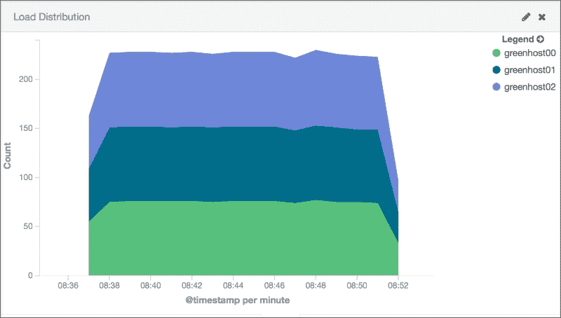
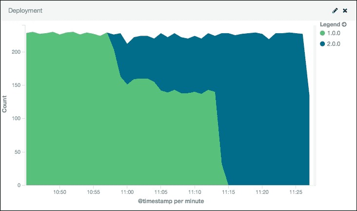

# 第六章：负载均衡

无论我们如何调优 Docker 应用程序，都将达到应用程序的性能极限。使用我们在上一章中讨论的基准测试技术，我们应该能够识别应用程序的容量。在不久的将来，我们的 Docker 应用程序的用户将超过这个限制。仅仅因为我们的 Docker 应用程序无法再处理他们的请求，我们不能拒绝这些用户。我们需要扩展我们的应用程序，以便能够服务更多的用户。

在本章中，我们将讨论如何扩展我们的 Docker 应用程序以增加容量。我们将使用负载均衡器，这是各种 Web 大规模应用程序架构中的关键组成部分。负载均衡器将我们的应用程序用户分配到多个部署在 Docker 主机集群中的 Docker 应用程序上。本章中将介绍的以下步骤将帮助我们实现这一目标：

+   准备 Docker 主机集群

+   使用 Nginx 进行负载均衡

+   扩展我们的 Docker 应用程序

+   使用负载均衡器管理零停机时间发布

# 准备一个 Docker 主机集群

在对 Docker 应用程序进行负载均衡时，一个关键组成部分是有一组服务器来分发应用程序的请求。在我们的基础设施中，这涉及到准备一组 Docker 主机来部署我们的应用程序。可扩展的做法是拥有一个由配置管理软件（例如 Chef）管理的通用基础配置，正如我们在第三章中讨论的那样，*使用 Chef 自动化 Docker 部署*。

在准备好 Docker 主机集群后，接下来就是准备我们要运行的应用程序。在本章中，我们将扩展一个简单的 NodeJS 应用程序。接下来的部分将描述该应用程序是如何工作的。

该 Web 应用程序是一个小型的 NodeJS 应用程序，代码写在名为 `app.js` 的文件中。为了可视化我们应用程序的负载均衡方式，我们还会记录一些关于应用程序和它运行的 Docker 主机的信息。`app.js` 文件将包含以下代码：

```
var http = require('http');

var server = http.createServer(function (request, response) {
  response.writeHead(200, {"Content-Type": "text/plain"});
  var version = "1.0.0";
  var log = {};
  log.header = 'mywebapp';
  log.name = process.env.HOSTNAME;
  log.version = version;
  console.log(JSON.stringify(log));
  response.end(version + " Hello World  "+ process.env.HOSTNAME);
});
server.listen(8000);
```

要部署前面的应用程序代码，我们将把它打包成一个名为 `hubuser/app:1.0.0` 的 Docker 镜像，使用以下的 `Dockerfile`：

```
FROM node:4.0.0

COPY app.js /app/app.js
EXPOSE 8000
CMD ["node", "/app/app.js"]
```

确保我们的 Docker 镜像已经构建并且可以在 Docker Hub 上使用。这样，我们就可以轻松地进行部署。使用以下命令运行：

```
dockerhost$ docker build -t hubuser/app:1.0.0 .
dockerhost$ docker push hubuser/app:1.0.0

```

作为准备工作的最后一步，我们将把 Docker 应用程序部署到三个 Docker 主机上：`greenhost00`、`greenhost01` 和 `greenhost02`。登录到每个主机，并输入以下命令以启动容器：

```
greenhost00$ docker run -d -p 8000:8000 hubuser/app:1.0.0
greenhost01$ docker run -d -p 8000:8000 hubuser/app:1.0.0
greenhost02$ docker run -d -p 8000:8000 hubuser/app:1.0.0

```

### 提示

更好的是，我们可以编写一个 Chef 食谱，来部署我们刚才编写的 Docker 应用程序。

# 使用 Nginx 进行负载均衡

现在我们已经有了一个 Docker 应用池来转发流量，我们可以准备我们的负载均衡器。在本节中，我们将简要介绍 Nginx，它是一款具有高并发性和高性能的流行 Web 服务器。它通常作为反向代理，将请求转发到更动态的 Web 应用程序，例如我们之前编写的 NodeJS 应用程序。通过配置 Nginx 使其具有多个反向代理目标（如我们的 Docker 应用池），它将平衡发送到它的请求负载，分配到池中。

在我们的负载均衡器部署中，我们将在名为 `dockerhost` 的 Docker 主机中部署 Nginx Docker 容器。部署后，Nginx 容器将开始将流量转发到名为 `greenhost*` 的 Docker 主机池，该池是我们在之前的章节中配置的。

以下是一个简单的 Nginx 配置，将流量转发到我们之前部署的 Docker 应用池。将此文件保存在 `dockerhost` Docker 主机中的 `/root/nginx.conf`，如以下所示：

```
events { }

http {
  upstream app_server {
    server greenhost00:8000;
    server greenhost01:8000;
    server greenhost02:8000;
  }
  server {
    location / {
      proxy_pass http://app_server;
    }
  }
}
```

上面的 Nginx 配置文件基本上由指令组成。每个指令都会对 Nginx 的配置产生相应的影响。为了定义我们的应用池，我们将使用`upstream`指令来定义一组服务器。接下来，我们将使用`server`指令将服务器列表添加到我们的池中。池中的服务器通常以`<hostname-or-ip>:<port>`格式定义。

### 注意

以下是提到的指令的参考文献：

+   `upstream`—[`nginx.org/en/docs/http/ngx_http_upstream_module.html#upstream`](http://nginx.org/en/docs/http/ngx_http_upstream_module.html#upstream)

+   `server`—[`nginx.org/en/docs/http/ngx_http_upstream_module.html#server`](http://nginx.org/en/docs/http/ngx_http_upstream_module.html#server)

+   `proxy_pass`—[`nginx.org/en/docs/http/ngx_http_proxy_module.html#proxy_pass`](http://nginx.org/en/docs/http/ngx_http_proxy_module.html#proxy_pass)

讨论指令基础知识的入门材料可以在 [`nginx.org/en/docs/beginners_guide.html#conf_structure`](http://nginx.org/en/docs/beginners_guide.html#conf_structure) 找到。

现在我们已经准备好 `nginx.conf` 文件，可以将其与 Nginx 容器一起部署。要进行此部署，请在我们的 `dockerhost` Docker 主机中运行以下命令：

```
dockerhost$ docker run -p 80:80 -d --name=balancer \
 --volume=/root/nginx.conf:/etc/nginx/nginx.conf:ro nginx:1.9.4

```

我们的 Web 应用现在可以通过 `http://dockerhost` 访问。每个请求将被路由到我们部署到 Docker 主机池中的 `hubuser/webapp:1.0.0` 容器之一。

为了确认我们的部署情况，我们可以查看 Kibana 可视化，展示流量在我们三个主机之间的分布。为了展示流量分布，我们必须首先为应用程序生成负载。我们可以使用在第五章中描述的 JMeter 测试基础设施，*基准测试*，来实现这一点。为了快速测试，我们还可以使用类似下面的长时间运行命令生成负载：

```
$ while true; do curl http://dockerhost && sleep 0.1; done
1.0.0 Hello World  56547aceb063
1.0.0 Hello World  af272c6968f0
1.0.0 Hello World  7791edeefb8c
1.0.0 Hello World  56547aceb063
1.0.0 Hello World  af272c6968f0
1.0.0 Hello World  7791edeefb8c
1.0.0 Hello World  56547aceb063
1.0.0 Hello World  af272c6968f0
1.0.0 Hello World  7791edeefb8c

```

记住，在我们之前准备的应用程序中，我们将`$HOSTNAME`作为 HTTP 响应的一部分打印出来。在之前的情况下，响应显示的是 Docker 容器的主机名。注意，Docker 容器默认将其容器 ID 的短哈希值作为主机名。正如我们从测试工作负载的初始输出中看到的，我们收到了来自三个容器的响应。

如果我们按照第四章中所做的那样设置我们的日志基础设施，我们可以在 Kibana 可视化中更好地展示响应。在以下屏幕截图中，我们可以根据日志条目来自的 Docker 主机计算每分钟的响应数量：



我们可以从前面的图中注意到，Nginx 将我们的工作负载均匀地分配到三个 Docker 主机：**greenhost00**、**greenhost01**和**greenhost02**。

### 提示

为了在 Kibana 中正确地可视化我们的部署，我们必须对 Docker 容器进行注释，并在 Logstash 中过滤这些日志条目，以便它们能够正确地注释到 Elasticsearch。我们可以通过以下步骤实现：

首先，我们需要确保在部署 Docker 容器时使用`syslog-tag`选项。这样可以使我们以后在 Logstash 中过滤应用程序时更容易。运行以下代码：

```
greenhost01$ docker run -d -p 8000:8000 \
 --log-driver syslog \
 --log-opt syslogtag=webapp \
 hubuser/app:1.0.0

```

这样，Logstash 将接收到带有`docker/webapp`标签的 Docker 容器日志条目。然后，我们可以使用 Logstash 的`filter`，如下所示，将这些信息导入到 Elasticsearch 中：

```
filter {
  if [program] == "docker/webapp" {
    json {
      source => "message"
    }
  }
}
```

# 扩展我们的 Docker 应用程序

现在，假设前一部分中的工作负载开始超载我们三个 Docker 主机中的每一个。没有像我们之前设置的 Nginx 这样的负载均衡器时，我们的应用程序性能将开始下降。这可能意味着应用程序用户的服务质量下降，或者在半夜接到电话，进行紧急的系统操作。然而，通过负载均衡器管理应用程序的连接，我们可以很简单地增加更多的容量来扩展应用程序的性能。

由于我们的应用程序已经设计为负载均衡，因此扩展过程非常简单。接下来的几步形成了一个典型的工作流，展示了如何为负载均衡的应用程序添加容量：

1.  首先，提供与我们 Docker 主机池中前三个主机相同基础配置的新 Docker 主机。在本节中，我们将创建两个新 Docker 主机，分别命名为 `greenhost03` 和 `greenhost04`。

1.  我们扩展过程中的下一步是将我们的应用程序部署到这些新 Docker 主机中。请在每个新 Docker 主机上键入以下与之前相同的命令进行部署：

    ```
    greenhost03$ docker run -d -p 8000:8000 hubuser/app:1.0.0greenhost04$ docker run -d -p 8000:8000 hubuser/app:1.0.0

    ```

1.  此时，我们池中的新应用程序服务器已经准备好接收连接。现在是时候将它们作为目标添加到基于 Nginx 的负载均衡器中。要将它们添加到我们的上游服务器池中，首先更新 `/root/nginx.conf` 文件，如下所示：

    ```
    events { }

    http {
      upstream app_server {
        server greenhost00:8000;
        server greenhost01:8000;
        server greenhost02:8000;
     server greenhost03:8000;
     server greenhost04:8000;
      }
      server {
        location / {
          proxy_pass http://app_server;
        }
      }
    }
    ```

1.  最后，我们将通知正在运行的 Nginx Docker 容器重新加载其配置。在 Nginx 中，重新加载是通过向其主进程发送 `HUP` Unix 信号来完成的。要向 Docker 容器中的主进程发送信号，请键入以下 Docker 命令。发送重新加载信号：

    ```
    dockerhost$ docker kill -s HUP balancer

    ```

    ### 注意

    有关如何使用各种 Unix 信号控制 Nginx 的更多信息，请参阅 [`nginx.org/en/docs/control.html`](http://nginx.org/en/docs/control.html)。

现在我们已经完成了 Docker 应用程序的扩展，让我们回顾一下我们的 Kibana 可视化效果，观察其影响。以下截图显示了我们当前五个 Docker 主机之间的流量分布：


我们可以在前面的截图中看到，在重新加载 Nginx 后，它开始在新的 Docker 容器之间分配负载。在此之前，每个 Docker 容器仅接收 Nginx 的三分之一流量。而现在，池中的每个 Docker 应用程序只接收五分之一的流量。

## 零停机部署

拥有 Docker 应用程序负载均衡的另一个优势是，我们可以使用相同的负载均衡技术来更新我们的应用程序。通常，运维工程师需要安排停机时间或维护窗口才能更新生产环境中部署的应用程序。然而，由于我们的应用程序流量首先会流向负载均衡器，再到达我们的应用程序，我们可以利用这一中间步骤来为自己谋利。在本节中，我们将采用一种名为蓝绿部署的技术，以零停机时间更新我们的正在运行的应用程序。

我们当前的`hubuser/app:1.0.0` Docker 容器池被称为我们的*绿色* Docker 主机池，因为它会主动接收来自 Nginx 负载均衡器的请求。我们将把 Nginx 负载均衡器服务的应用程序更新为 `hubuser/app:2.0.0` Docker 容器池。以下是执行更新的步骤：

1.  首先，让我们通过修改 `app.js` 文件中的版本字符串来更新我们的应用程序，如下所示：

    ```
    var http = require('http');

    var server = http.createServer(function (request, response) {
      response.writeHead(200, {"Content-Type": "text/plain"});
      var version = "2.0.0";
      var log = {};
      log.header = 'mywebapp';
      log.name = process.env.HOSTNAME;
      log.version = version;
      console.log(JSON.stringify(log));
      response.end(version + " Hello World  "+ process.env.HOSTNAME);
    });

    server.listen(8000);
    ```

1.  在更新内容后，我们将准备一个新的 Docker 镜像版本，名为 `hubuser/app:2.0.0`，并通过以下命令将其发布到 Docker Hub：

    ```
    dockerhost$ docker build -t hubuser/app:2.0.0 .
    dockerhost$ docker push hubuser/app:2.0.0

    ```

1.  接下来，我们将通过我们的云服务提供商或购买实际硬件来配置一组 Docker 主机，命名为 `bluehost01`、`bluehost02` 和 `bluehost03`。这将成为我们的*蓝色* Docker 主机池。

1.  现在我们的 Docker 主机已经准备好，我们将在每个新主机上部署新的 Docker 应用程序。请在每个 Docker 主机上输入以下命令进行部署：

    ```
    bluehost00$ docker run -d -p 8000:8000 hubuser/app:2.0.0
    bluehost01$ docker run -d -p 8000:8000 hubuser/app:2.0.0
    bluehost02$ docker run -d -p 8000:8000 hubuser/app:2.0.0

    ```

我们的*蓝色* Docker 主机池现在已经准备好。之所以称其为蓝色，是因为尽管它现在已经在线并运行，但它还没有接收到用户流量。此时，我们可以执行必要的操作，例如在将用户转向新版本的应用程序之前，进行预飞行检查和测试。

在确认我们的蓝色 Docker 主机池完全正常并投入使用后，就该开始将流量发送到它了。与扩展 Docker 主机池的过程类似，我们只需将蓝色 Docker 主机添加到 `/root/nginx.conf` 配置中的服务器列表中，如下所示：

```
events { }

http {
  upstream app_server {
    server greenhost00:8000;
    server greenhost01:8000;
    server greenhost02:8000;
    server greenhost03:8000;
    server greenhost04:8000;
 server bluehost00:8000;
 server bluehost01:8000;
 server bluehost02:8000;
  }
  server {
    location / {
      proxy_pass http://app_server;
    }
  }
}
```

为完成激活，重新加载我们的 Nginx 负载均衡器，通过以下命令向其发送 `HUP` 信号：

```
dockerhost$ docker kill -s HUP balancer

```

此时，Nginx 将流量同时发送到旧版本（`hubuser/app:1.0.0`）和新版本（`hubuser/app:2.0.0`）的 Docker 应用程序。通过这种方式，我们可以完全验证新应用程序是否按预期工作，因为它现在正在处理来自我们应用程序用户的实时流量。如果在某些情况下它没有正常工作，我们可以通过删除池中的 `bluehost*` Docker 主机并向我们的 Nginx 容器重新发送 `HUP` 信号来安全回滚。

但是，假设我们已经对新应用程序感到满意。我们可以安全地从负载均衡器的配置中移除旧的 Docker 应用程序。在我们的 `/root/nginx.conf` 文件中，我们可以通过删除所有 `greenhost*` 行来完成此操作，如下所示：

```
http {
  upstream app_server {
    server bluehost00:8000;
    server bluehost01:8000;
    server bluehost02:8000;
  }
  server {
    location / {
      proxy_pass http://app_server;
    }
  }
}
```

现在，我们可以通过向 Nginx 发送另一个 `HUP` 信号来完成零停机时间部署。此时，我们的蓝色 Docker 主机池处理我们应用程序的所有生产流量。因此，它成为了我们的新绿色 Docker 主机池。我们也可以选择停用旧的绿色 Docker 主机池，以节省资源使用。

我们之前做的整个蓝绿部署过程可以通过以下 Kibana 可视化进行总结：



请注意，在上面的图表中，尽管我们更新了应用程序，但我们的应用仍然在处理流量。还请注意，在此之前，所有的流量都分配给了我们的五个**1.0.0**版本的应用程序。启用蓝色 Docker 主机池后，三分之八的流量开始转向我们应用程序的**2.0.0**版本。最终，我们停用了旧的绿色 Docker 主机池中的所有端点，所有应用的流量现在都由**2.0.0**版本的应用程序处理。

### 注意

关于蓝绿部署和其他零停机发布技术的更多信息，可以参考 Jez Humble 和 Dave Farley 的书《*持续交付*》。该书的网站可以在[`continuousdelivery.com`](http://continuousdelivery.com)找到。

# 其他负载均衡器

还有其他可以用于负载均衡应用程序的工具。一些工具类似于 Nginx，其中配置通过外部配置文件进行定义。然后，我们可以向正在运行的进程发送信号，以重新加载更新后的配置。有些工具将其池配置存储在外部存储中，如 Redis、etcd，甚至是常规数据库，以便负载均衡器本身动态加载该列表。即便是 Nginx，其商业版本也具有一些此类功能。还有一些开源项目通过第三方模块扩展了 Nginx。

以下是我们可以以某种形式作为 Docker 容器部署到基础设施中的负载均衡器简短列表：

+   Redx ([`github.com/rstudio/redx`](https://github.com/rstudio/redx))

+   HAProxy ([`www.haproxy.org`](http://www.haproxy.org))

+   Apache HTTP Server ([`httpd.apache.org`](http://httpd.apache.org))

+   Vulcand ([`vulcand.github.io/`](http://vulcand.github.io/))

+   CloudFoundry 的 GoRouter ([`github.com/cloudfoundry/gorouter`](https://github.com/cloudfoundry/gorouter))

+   dotCloud 的 Hipache ([`github.com/hipache/hipache`](https://github.com/hipache/hipache))

也有基于硬件的负载均衡器，我们可以自行采购并通过它们自己专有的格式或 API 进行配置。如果我们使用云服务提供商，它们的一些负载均衡器服务将会有自己的云 API，我们也可以使用。

# 总结

在本章中，你了解了使用负载均衡器的好处以及如何使用它们。我们在 Docker 容器中部署并配置了 Nginx 作为负载均衡器，以便扩展我们的 Docker 应用程序。我们还使用负载均衡器执行了零停机发布，将我们的应用程序更新为新版本。

在下一章，我们将继续通过调试我们部署的 Docker 容器来提升 Docker 优化技能。
