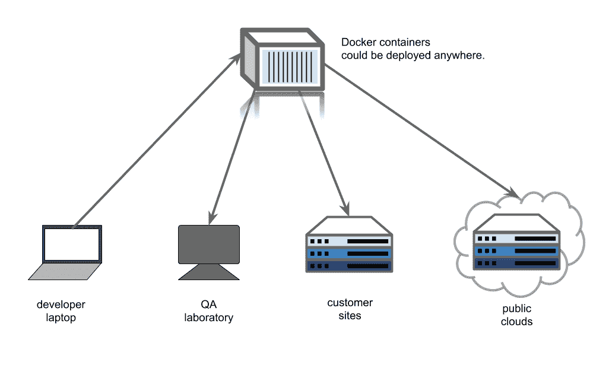
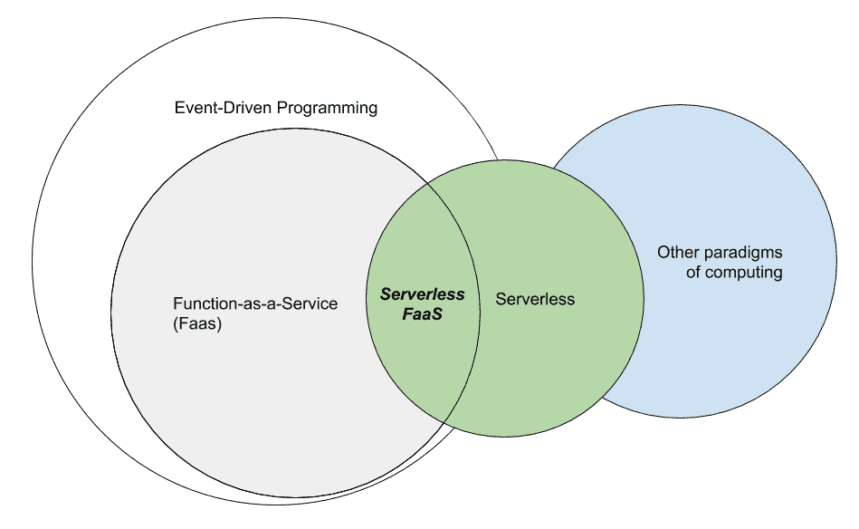
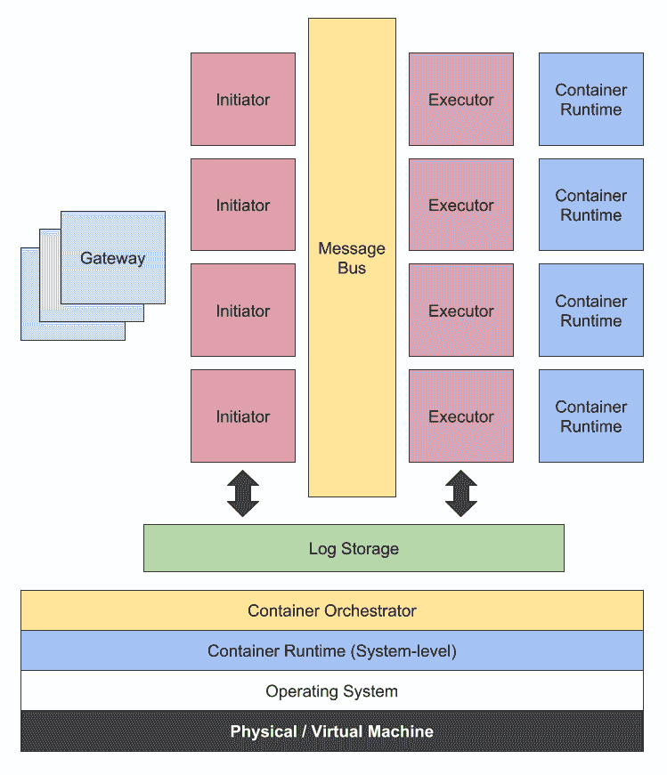

# 无服务器与 Docker

说到容器，大多数人已经知道如何将应用程序打包成容器作为部署单元。Docker 允许我们以其 *事实标准* 格式将应用程序部署到几乎所有地方，从我们的笔记本电脑、QA 集群、客户站点，甚至是公共云，如下图所示：



图 1.1：将 Docker 容器部署到各种基础设施和平台

如今，在公共云上运行 Docker 容器已被视为常态。我们已经从按需启动云实例、按需付费的账单中受益。无需等待硬件购买，我们还可以通过敏捷方法并使用持续交付管道来更快地优化资源。

根据 Docker 的一份报告，**总拥有成本**（**TCO**）在其客户使用 Docker 将现有应用程序迁移到云端时减少了 66%。不仅可以大幅降低 TCO，使用 Docker 的公司还可以将上市时间从几个月缩短为几天。这是一个巨大的胜利。

将容器部署到云基础设施，如 AWS、Google Cloud 或 Microsoft Azure，已经简化了许多事情。云基础设施使组织无需购买自己的硬件，也不需要专门的团队来维护这些硬件。

然而，即使在使用公共云基础设施时，组织仍然需要某些角色，例如架构师，来负责站点可靠性和可扩展性。一些人被称为 **SRE**，即 **站点可靠性工程师**。

此外，组织还需要处理系统级的软件包和依赖项。由于软件堆栈会不断变化，他们需要自己进行应用程序安全性和操作系统内核的修补。在许多场景中，这些组织中的团队必须根据负载峰值的需求，意外地扩展集群的规模。此外，工程师还需要尽可能地将集群缩小，以减少云计算费用，因为这是一种按需付费的模式。

开发人员和工程团队总是努力提供出色的用户体验和站点可用性。在此过程中，按需实例的过度配置或低效利用可能会带来高昂的成本。根据 AWS 的一份白皮书，[`d0.awsstatic.com/whitepapers/optimizing-enterprise-economics-serverless-architectures.pdf`](https://d0.awsstatic.com/whitepapers/optimizing-enterprise-economics-serverless-architectures.pdf)，低效利用的实例多达已配置机器的 85%。

无服务器计算平台，如 AWS Lambda、Google Cloud Functions、Azure Functions 和 IBM Cloud Functions，旨在解决这些过度配置和低效利用的问题。

本章将涵盖以下主题：

+   无服务器

+   无服务器 FaaS 的常见架构

+   无服务器/FaaS 使用案例

+   Hello world，FaaS/Docker 方式

# 什么是无服务器？

试着想象我们生活在一个完全由智能软件驱动的世界。

那将是一个我们可以在不做任何事情的情况下开发软件的世界。只需要说出我们希望运行什么样的软件，几分钟后，它就会出现在互联网上，为许多用户提供服务。我们只需要为用户发出的请求付费。嗯，那样的世界太不真实了。

现在，让我们更加现实一点，想象一个我们仍然需要自己开发软件的世界。至少目前，我们不需要关心任何服务器的配置和管理。实际上，这至少是一个对开发者来说最好的世界，我们可以将应用部署到数百万用户面前，而无需担心任何服务器，甚至不需要知道这些服务器在哪里。我们唯一真正想要的，是创建一个能够按规模解决业务需求、价格合理的应用。无服务器平台就是为了解决这些问题而创建的。

作为对开发者和快速增长企业的回应，无服务器平台似乎是一个巨大的胜利。但它们究竟是什么？

# 无服务器与 FaaS 之间的关系

下图展示了事件驱动编程、FaaS 和无服务器 FaaS 的位置关系，其中无服务器 FaaS 是 FaaS 和无服务器之间的交集区域：



图 1.2：展示无服务器与 FaaS 之间关系的维恩图

无服务器是一种范式转变，使得开发者不再需要担心服务器的配置和运营。计费方式是按请求计费。此外，公共云上有许多有用的服务供我们选择，我们可以将它们连接起来并用来解决业务问题，从而完成任务。

无服务器架构中的应用通常使用第三方服务来完成其他任务，如身份验证、数据库系统或文件存储。虽然无服务器应用不一定需要使用这些第三方服务，但以这种方式架构应用能够充分利用基于云的无服务器平台。这种架构中的前端应用通常是一个厚重、强大的前端，例如单页面应用或移动应用。

这一无服务器计算转变的执行引擎是 **Function as a Service** 或 **FaaS** 平台。FaaS 平台是一种计算引擎，允许我们编写一个简单、自包含、单一目的的函数来处理或计算任务。FaaS 平台的计算单元是一个推荐无状态的函数。这个无状态属性使得函数可以被平台完全管理和扩展。

FaaS 平台不一定要运行在无服务器环境中，比如 AWS Lambda，但也有许多 FaaS 实现，比如 OpenFaaS、Fn 项目和 OpenWhisk，允许我们在自己的硬件上部署和运行 FaaS。如果 FaaS 平台运行在无服务器环境中，它将被称为**无服务器 FaaS**。例如，我们在本地运行 OpenWhisk，那么它就是我们的 FaaS 平台。但当它在 IBM Cloud 上运行作为 IBM Cloud Functions 时，它就是一个无服务器 FaaS。

每个 FaaS 平台都被设计为使用事件驱动的编程模型，以便能够高效地连接到公共云上的其他服务。通过异步事件模型和函数的无状态特性，这种环境使得无服务器 FaaS 成为下一代计算的理想模型。

# 无服务器 FaaS 的缺点

那么这种方法的缺点是什么呢？它们如下：

+   我们基本上不拥有服务器。 当我们需要对基础设施进行细粒度控制时，无服务器模型并不适用。

+   无服务器 FaaS 有很多限制，尤其是函数执行的时间限制，以及每个函数实例的内存限制。它还引入了一种固定且特定的应用程序开发方式。可能直接将现有系统迁移到 FaaS 会有些困难。

+   如果不允许将所有工作负载迁移出组织，那么在私有或混合基础设施上完全使用无服务器平台是不可能的。无服务器架构的一个真正好处是云上存在便捷的公共服务。

# Docker 来救援

本书讨论了我们自己的基础设施上的 FaaS 与无服务器 FaaS 之间的平衡。我们尝试通过选择三个主要的 FaaS 平台来简化和统一 FaaS 的部署模型，这些平台允许我们将 Docker 容器作为函数部署，且我们在本书中会详细讨论这些平台。

以 Docker 容器作为部署单元（函数），Docker 作为开发工具，Docker 作为编排引擎和网络层，我们可以开发无服务器应用程序，并将其部署在我们可用的硬件上，部署在我们自己的私有云基础设施上，或是一个混合云，将我们的硬件与公共云的硬件混合在一起。

其中一个最重要的点是，使用具备 Docker 技能的小型开发团队足够轻松地管理这种基础设施。

回顾一下前面的*图 1.2*。如果你在阅读完本章后有所启发，让我们猜测一下这本书将讨论的内容。我们应该处于这个图中的哪个位置呢？答案将在本章结束时揭晓。

# 无服务器 FaaS 的常见架构

在进入其他技术章节之前，本书在撰写过程中对至少六个无服务器 FaaS 平台的常见架构进行了调查和研究，结果如图所示。这是现有 FaaS 平台的提炼概述，如果你想创建一个新的平台，它是一个推荐的架构：



图 1.3：描述 FaaS 平台常见架构的框图

# 系统层

从下到上的架构描述如下：

+   我们有一些物理或虚拟机器。这些机器可以位于公有云或私有云中。有些可能是位于防火墙内的物理设备，或者位于组织内部。它们可以混合在一起，作为混合基础设施。

+   下一层是 **操作系统**，当然还有内核。我们需要一个支持容器隔离的现代内核操作系统，例如 Linux，或者至少兼容 runC。Windows 或 Windows Server 2016 拥有基于 Hyper-V 的隔离，兼容 Docker。

+   架构中的下一层是 **容器运行时（系统级）**。我们强调它是系统级容器运行时，因为它并不是用来直接运行 FaaS 函数的。这个层级负责为集群提供服务。

+   接下来是可选的容器编排引擎，或 **容器编排器** 层。这个层级包括 Docker Swarm 或 Kubernetes。本书中我们使用 Docker Swarm，但你可能会发现本书介绍的一些 FaaS 平台并未使用任何编排工具。基本上，只有 Docker 和容器网络就足够让 FaaS 平台有效启动和运行。

# FaaS 层

现在，我们将讨论实际的 FaaS 层。我们将从左到右展开讨论：

+   整个架构的前沿组件是 FaaS **网关**。在一些实现中，网关是可选的，但在许多实现中，这个组件有助于提供 HTTPS 服务并缓存一些静态内容，例如平台的 UI 部分。网关实例有助于提高吞吐量。它通常是一个无状态的基于 HTTP 的反向代理。因此，这个组件易于扩展。

+   **启动器** 是 FaaS 最重要的组件之一。启动器负责模拟实际的调用请求给平台的其他部分。在 OpenWhisk 中，这个组件被称为 **控制器**，例如。在 Fn 中，其 Fn 服务器内部的部分充当 **启动器**。

+   **消息总线** 是 FaaS 平台的消息骨干。一些没有此组件的架构在实现异步调用或重试模式时会遇到困难，进而影响平台的鲁棒性。消息总线将启动器与执行器解耦。

+   **执行器**是执行真正函数调用的组件。它连接到自己的容器运行时（应用级别），启动真正的函数执行顺序。所有结果和日志将被写入中央日志存储。

+   **日志存储**是平台的唯一真相来源。它应该设计成存储几乎所有内容，从函数活动到每次调用的错误日志。

+   **容器运行时**（应用级别）是负责启动函数容器的组件。在本书中，我们简单地使用 Docker 及其底层引擎作为运行时组件。

# Serverless/FaaS 的使用案例

Serverless/FaaS 是一种通用的计算模型。因此，几乎可以使用这种编程范式实现任何类型的工作负载。Serverless/FaaS 的使用案例可以从常规 Web 应用的 API、移动应用的 RESTful 后台、日志或视频处理的函数、WebHook 系统的后台，到流数据处理程序等。


图 1.4：演示项目的框图

在第八章，*将它们整合在一起*，我们将讨论一个如前图所示的系统，并涵盖以下使用案例：

+   WebHook 系统的 API：在前图中，你可能看到**UI 的后台**。该系统允许我们定义一个 WebHook，并将其实现为 FaaS 函数，使用本书后面章节中讨论的某个框架。

+   用于封装遗留系统的 API：在前图的右上角，我们会看到一组函数连接到**Chrome Headless**（一个功能完备的运行中的 Google Chrome 实例）。该函数将一组命令封装起来，指示 Google Chrome 为我们操作遗留系统。

+   APIs 作为其他服务的抽象：在右下角有两个简单的模块，第一个是运行在 FaaS 平台上的函数，连接到第二个模块，**Mock Core Bank System**，它是一个更复杂的 REST API。这个系统部分展示了如何使用 FaaS 函数作为抽象层，简化复杂系统的接口。

+   流数据处理：我们还将实现一个数据处理代理，一个事件监听器，它监听一个事件源——你可能会看到*以太坊的标志*，旁边有一个从左侧连接过来的圆圈。这个代理会监听来自源的数据流，然后调用运行在 FaaS 平台上的函数。

# Hello world，FaaS/Docker 方式

本书涵盖了 FaaS 在 Docker 上的三大主要框架。因此，如果我选择一个特定框架用于第一章的*hello world*程序，那就不太公平了。我会让你根据自己的喜好选择一个。

以下是在 Linux 机器上的常见设置。对于 Mac 或 Windows 用户，请跳过此步骤并下载 Docker for Mac 或 Docker for Windows：

```
$ curl -sSL https://get.docker.com | sudo sh
```

如果你选择在本章中使用 OpenFaaS，可以通过使用 *Play with Docker* ([`labs.play-with-docker.com/`](https://labs.play-with-docker.com/)) 来简化此设置过程，该平台会自动在单节点 Docker Swarm 上安装 OpenFaaS。

当我们安装好 Docker 后，只需初始化 Swarm，以使我们的单节点集群准备好运行：

```
$ docker swarm init --advertise-addr=eth0
```

如果之前的命令失败，尝试将网络接口名称更改为与你的名称匹配。但如果仍然失败，只需输入机器的其中一个 IP 地址即可。

如果一切设置成功，让我们开始在各个 FaaS 平台上运行一系列的 hello world 程序。

# Hello OpenFaas

我们将尝试使用 OpenFaaS 运行 `echoit` 函数进行 `hello world`。首先，从 [`github.com/openfaas/faas`](https://github.com/openfaas/faas) 克隆项目，并只进行一层深度克隆，以加快克隆过程：

```
$ git clone --depth=1 https://github.com/openfaas/faas
```

然后，进入 `faas` 目录，并使用以下命令简单地部署 OpenFaaS 默认堆栈：

```
$ cd faas
$ docker stack deploy -c docker-compose.yml func
```

等待堆栈启动完成。然后，我们用 `curl` 命令进行 `hello world`：

```
$ curl -d "hello world." -v http://localhost:8080/function/func_echoit
* Trying 127.0.0.1...
* Connected to localhost (127.0.0.1) port 8080 (#0)
> POST /function/func_echoit HTTP/1.1
> Host: localhost:8080
> User-Agent: curl/7.47.0
> Accept: */*
> Content-Length: 12
> Content-Type: application/x-www-form-urlencoded
> 
* upload completely sent off: 12 out of 12 bytes
< HTTP/1.1 200 OK
< Content-Length: 12
< Content-Type: application/x-www-form-urlencoded
< Date: Fri, 23 Mar 2018 16:37:30 GMT
< X-Call-Id: 866c9294-e243-417c-827c-fe0683c652cd
< X-Duration-Seconds: 0.000886
< X-Start-Time: 1521823050543598099
< 
* Connection #0 to host localhost left intact
hello world.
```

玩了一会儿后，我们也可以使用 `docker stack rm` 来移除所有正在运行的服务：

```
$ docker stack rm func
```

# Hello OpenWhisk

让我们快速进入 OpenWhisk。要使用 OpenWhisk 进行 `hello world`，我们还需要一个 `docker-compose` 二进制文件。请访问 [`github.com/docker/compose/releases`](https://github.com/docker/compose/releases) 并按照那里的说明进行安装。

使用 OpenWhisk 时，整个堆栈的启动时间可能会比 OpenFaaS 稍长。但是，由于 `hello world` 已经内置，整体命令会更简洁。

首先，从其 GitHub 仓库克隆 OpenWhisk 开发工具：

```
$ git clone --depth=1 https://github.com/apache/incubator-openwhisk-devtools devtools
```

然后进入 `devtools/docker-compose` 目录，并使用以下命令手动拉取镜像：

```
$ cd devtools/docker-compse
$ docker-compose pull
$ docker pull openwhisk/nodejs6action
```

之后，只需调用 `make quick-start` 来执行设置：

```
$ make quick-start
```

等待 OpenWhisk 集群启动。这可能需要最多 10 分钟。

之后，运行以下命令 `make hello-world` 来注册并调用 `hello world` 操作：

```
$ make hello-world
creating the hello.js function ...
invoking the hello-world function ... 
adding the function to whisk ...
ok: created action hello
invoking the function ...
invokation result: { "payload": "Hello, World!" }
{ "payload": "Hello, World!" }
deleting the function ...
ok: deleted action hello
```

确保你处于一个快速的网络环境中。OpenWhisk 拉取 invoke 和 controller 时的慢速往往会导致 `make quick-start` 失败。

要清理环境，只需使用 `make destroy` 命令来终止目标：

```
$ make destroy
```

# 向 Fn 项目问好

这是本书中覆盖的另一个 FaaS 项目。我们通过安装 Fn CLI 快速完成 `hello world`。然后使用它启动一个本地 Fn 服务器，创建一个应用程序，并创建一个路由，将其链接到应用程序下的一个预构建的 `Go` 函数。之后，我们将使用 `curl` 命令测试部署的 `hello world` 函数。

这是安装 Fn 客户端的标准命令：

```
$ curl -LSs https://raw.githubusercontent.com/fnproject/cli/master/install | sudo sh
```

之后，我们可以使用 `fn` 命令。让我们启动一个 Fn 服务器。使用 `--detach` 使其在后台运行：

```
$ fn start --detach
```

好的，如果我们看到一个容器 ID，就可以开始了。接下来，快速创建一个 Fn 应用程序，并将其命名为 `goapp`：

```
$ fn apps create goapp
```

然后，我们已经在 Docker Hub 上有一个预构建的镜像，名为`chanwit/fn_ch1:0.0.2`。只需使用它即可。我们使用`fn routes create`命令将新路由与镜像连接。此步骤的目的是实际定义一个函数：

```
$ fn routes create --image chanwit/fn_ch1:0.0.2 goapp /fn_ch1
/fn_ch1 created with chanwit/fn_ch1:0.0.2
```

好的，路由已准备好。现在，我们可以使用 `curl` 命令直接调用我们在 Fn 上的 `hello world` 程序：

```
$ curl -v http://localhost:8080/r/goapp/fn_ch1
* Trying 127.0.0.1...
* Connected to localhost (127.0.0.1) port 8080 (#0)
> GET /r/goapp/fn_ch1 HTTP/1.1
> Host: localhost:8080
> User-Agent: curl/7.47.0
> Accept: */*
> 
< HTTP/1.1 200 OK
< Content-Length: 26
< Content-Type: application/json; charset=utf-8
< Fn_call_id: 01C99YJXCE47WG200000000000
< Xxx-Fxlb-Wait: 383.180124ms
< Date: Fri, 23 Mar 2018 17:30:34 GMT
< 
{"message":"Hello World"}
* Connection #0 to host localhost left intact
```

好的，看起来 Fn 一切都按照预期正常工作。让我们在它完成后移除服务器：

```
$ docker rm -f fnserver
```

# 练习

每章末尾都会有一组问题，帮助我们复习当前章节的内容。让我们尝试不翻回章节内容，直接回答每个问题：

1.  无服务器架构的定义是什么？

1.  FaaS 的定义是什么？

1.  描述 FaaS 和无服务器之间的区别？

1.  Docker 在无服务器应用程序世界中的角色是什么？

1.  FaaS 的常见架构是什么样的？

1.  尝试解释为什么我们处于下图中的阴影区域：


图 1.5：FaaS 和本书涵盖的无服务器区域的范围

# 总结

本章介绍了无服务器架构和 Docker，定义了无服务器架构和 FaaS。我们了解了无服务器的优势、何时使用它以及何时避免使用它。无服务器 FaaS 是由供应商在公共云上运行的 FaaS 平台，而 FaaS 可能需要在私有、混合或本地环境中运行。这时，我们可以使用 Docker。Docker 将帮助我们构建 FaaS 应用程序，并为运行基于容器的函数准备容器基础设施。

我们预览了将在后续章节中一步步构建的演示项目。然后，我们快速地在三个领先的 FaaS 平台上完成了 Docker 的 `hello world` 示例，展示了在我们自己的 Docker 集群上运行 FaaS 平台是多么简单。

在下一章中，我们将回顾容器的概念以及它背后的技术。我们还将介绍 Docker 及其工作流程，接着我们将学习 Docker Swarm 集群的概念以及如何准备它。最后，我们将讨论 Docker 如何适应无服务器的世界。
