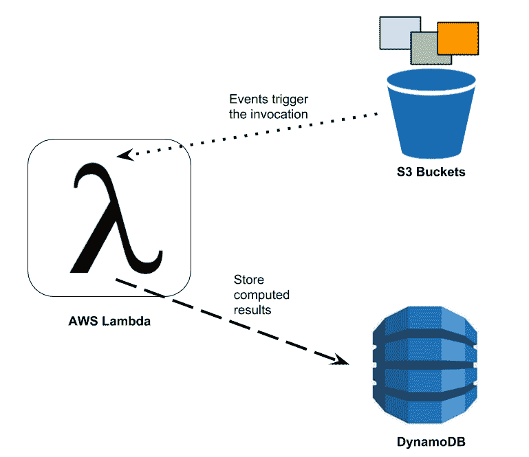
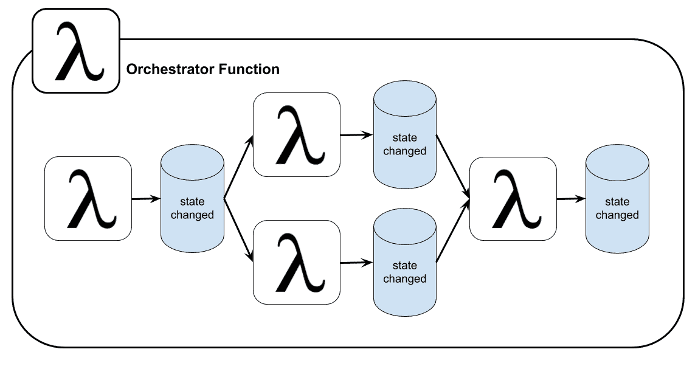
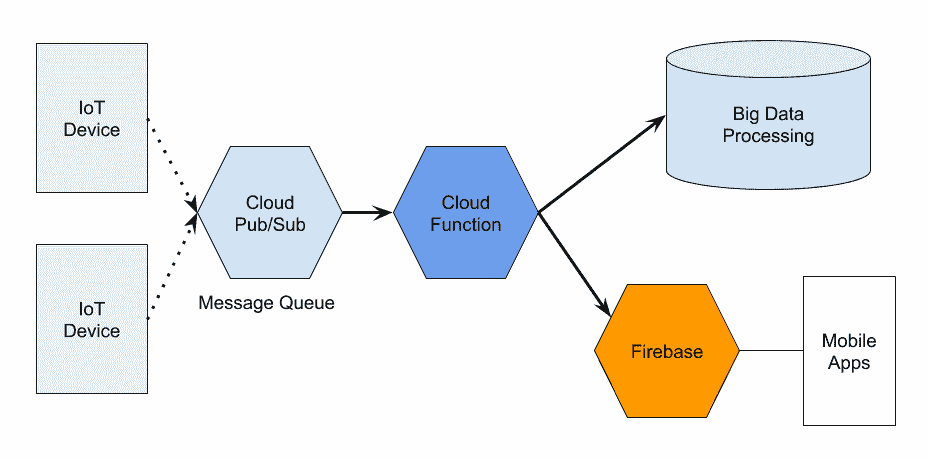

# 第三章：无服务器框架

本章讨论无服务器框架。它们是什么？纯粹的无服务器框架目前有哪些限制？Docker 如何部分解决无服务器框架的限制？我们将从了解 AWS Lambda 开始，然后是 Azure Functions 和 Google Cloud Functions。我们会简要提及 IBM Cloud Functions，但实际上它的引擎是 OpenWhisk，接下来的几章会详细讨论它。

我们还将在本章最后一部分讨论无服务器框架，一个帮助我们开发云独立无服务器应用程序的工具包。

# AWS Lambda

在云服务提供商提供的无服务器架构中，AWS Lambda 是最受欢迎的，并且具有一些高级功能。

FaaS/无服务器是微服务的自然进化，或者我们可以把它看作是对微服务架构的扩展。在许多场景中，我们可以使用函数或 Lambda 来补充我们的微服务架构。如果你已经是 AWS 客户，将代码从 EC2 迁移到 Lambda 是完全自然的，并且能够节省大量资金。下面的图表展示了一个使用**AWS Lambda**与**S3 存储桶**和**DynamoDB**的简单用例：



图 3.1：在 AWS 上使用 Lambda 函数的简单用例

在 S3 中，可以触发事件到特定的端点。我们将 Lambda 函数的端点放在那里。当用户上传或更改 S3 存储桶中的内容时，它会触发一个调用请求发送到 Lambda 函数。这可以视为一种 WebHooks 的形式。之后，Lambda 函数接收事件并开始计算其应用逻辑。完成后，Lambda 将结果传输并存储到 DynamoDB 实例中。

我们将在第八章中演示一个类似的场景，*将它们全部整合起来*。

# 限制

Lambda 支持多种语言运行时；例如，Node.js、Go、Java、Python 和 C#。每个 AWS Lambda 都有一些限制，来限制每次调用所使用的资源。在内存方面，Lambda 支持的 RAM 范围从 128 MB 到 3,008 MB，按 64 MB 的增量分配。如果内存使用超过限制，函数将自动终止。

在磁盘空间方面，Lambda 函数可以使用`/tmp`目录，最多 512 MB。这个磁盘卷是临时性的，因此在 Lambda 完成工作后，它会被清除。此外，Lambda 函数中允许的文件描述符数量限制为 1,024，而在单次调用中可以分叉的进程和线程数也限制为 1,024。

对于每个请求，同步 HTTP 调用的请求体大小限制为 6 MB，而异步、事件触发调用的请求体大小限制为 128 KB。

这里最重要的方面是*时间限制*。AWS Lambda 允许一个函数运行最长不超过 5 分钟（或 300 秒）。如果执行时间超过 5 分钟，函数将被自动终止。

# Lambda 终止

Lambda 背后的技术实际上是基于容器的，这意味着它将一个函数与其他实例隔离开来。容器的沙箱为每个配置提供特定的资源。

Lambda 函数可以通过多种方式终止：

+   **超时**：如前所述，当达到 5 分钟限制时，不管当前函数在做什么，都会停止执行。

+   **受控终止**：如果函数提供了回调，并且回调被执行以调用`context.done()`方法，则无论函数正在做什么，函数都会终止。

+   **默认终止**：函数结束并正常终止。同时，不会调用回调来触发`context.done()`方法。这种情况将被视为默认终止。

+   **函数崩溃** **或调用了`process.exit()`**：如果函数发生崩溃或产生了段错误，函数将终止，因此容器也会停止。

# 容器重用

存在一种情况，即刚刚终止的函数容器可以被重用。

重用已完成的函数容器的能力可以大大减少启动时间，因为初始化过程会被完全跳过。同时，如果一个容器被重用，之前执行时写入`/tmp`目录的文件可能仍然存在，这是一个缺点。

# 本地可执行文件

Lambda 实际上是为了在任何语言中运行代码而设计的，因为 Lambda 的沙箱只是一个容器。诀窍在于，我们可以使用一个 Node.js 程序在上传之前执行任何与 ZIP 文件一起打包的二进制文件。

值得注意的是，在为 Lambda 准备我们自己的二进制文件时，它必须是静态编译的，或者与 Amazon Linux 提供的共享库相匹配（因为 Lambda 上使用的所有容器都是基于 Amazon Linux 的）。我们有责任自己跟踪 Amazon Linux 的版本。

一个像 LambCI 这样的项目（[`github.com/lambci/docker-lambda`](http://github.com/lambci/docker-lambda)）可以帮助解决这个问题。LambCI 提供了一个本地沙箱环境，作为 Docker 容器，通过安装相同的软件、库、文件结构和权限来模拟 AWS Lambda 环境。它还定义了相同的一组环境变量以及其他行为。此外，用户名和组也被定义为与 Lambda 匹配，例如`sbx_user1051`。

有了这个本地环境，我们可以在这个 Docker 容器内安全地测试我们的代码，并确保它在 Lambda 上运行时不会出问题。

# Azure Functions

Azure Functions 是微软提供的无服务器计算平台，作为 Azure 云的一部分。所有设计目标与其他无服务器/FaaS 服务相同，Azure Functions 使我们能够执行应用逻辑，而无需管理自己的基础设施。

Azure Functions 在被事件触发时，以脚本的形式运行程序。当前版本的 Azure Functions 支持如 C#、F#、PHP、Node.js 或 Java 等语言运行时。对于 Azure 来说，支持 C# 和 F# 作为其功能的第一语言是很自然的，因为它们是微软自有的编程语言。无论如何，目前仅有 C#、F# 和 JavaScript（Node.js）是正式支持的语言。

使用 C#、F# 或 .NET 语言时，Azure Functions 允许我们通过 NuGet（.NET 的著名包管理器）安装依赖项。如果我们使用 Node.js 编写 JavaScript，Azure 还提供了对 NPM 包管理的访问。

类似于其他云服务提供商，Azure Functions 在访问其他 Azure 服务时具有优势，例如 Azure Cosmos DB、Azure Event Hubs、Azure Storage 和 Azure Service Bus。

很有趣的一点是，Azure Functions 的定价模型与 Amazon 或 Google 的产品有所不同。在 Azure 中，有两种定价计划可以满足不同的需求。

第一个是*消费计划*。这与其他云服务提供商提供的计划类似，我们只需为代码执行的时间付费。第二个是*应用服务计划*。在这种情况下，函数被视为其他应用程序的应用服务的一部分。如果函数属于这一类别，我们无需额外支付费用。

Azure Functions 的一个有趣特点是它的触发和绑定机制。Azure Functions 允许定义如何触发一个函数，以及如何在每个函数的输入和输出之间进行数据绑定，这些配置是分开的。这些机制有助于避免在调用函数时进行硬编码，以及在函数调用链中进行数据的进出转换。

# 扩展性

在 Azure 中，有一个组件可以实时监控每个 Azure Function 的请求数量。这个组件被称为**扩展控制器**。它收集数据，然后做出决定，来扩展或缩减该功能实例的数量。Azure 引入了应用服务的概念，一个功能应用可能包含多个功能实例。

所有决策都是基于启发式算法来处理不同类型的事件触发器。当功能扩展时，所有与该功能相关的资源也会被扩展。如果没有请求发送到该功能应用，功能实例的数量将自动缩减为零。

# 限制

每个函数实例将由函数应用的主机限制为 1.5 GB 的内存，这就像多个函数实例共享资源的一个组语义。所有函数都共享同一资源。

一个函数应用最多可以同时容纳 200 个函数实例。但没有并发限制。实际上，一个函数实例可以接受一个或多个请求。

每个事件触发器，例如，Azure Service Bus，都有其独特的启发式方式来扩展底层函数。

# 持久化函数

Azure Functions 最先进的扩展之一是**持久化函数**。持久化函数是一种在无服务器计算环境中实现有状态函数的技术。通过这个持久化扩展，提供了更多的状态管理、检查点和重启的概念。我们从这种函数中获得的是一个有状态的工作流，并且会有一个驱动程序作为协调者来调用其他函数，如下图所示：



图 3.2：Azure 中使用持久化函数扩展的协调器函数

当它完成调用其他函数后，无论是同步还是异步，协调器函数将允许将状态保存为本地变量。如果调用过程必须重新开始，或运行此协调器函数的虚拟机重新启动时，还会有一个*检查点技术*来继续/恢复协调器的状态。

# Google Cloud Functions

谷歌公司提供的无服务器计算服务被称为**Google Cloud Functions**（**GCF**）。

本节中我们通常称其为 GCF。像其他无服务器平台一样，GCF 提供了执行环境和 SDK，帮助我们开发和管理整个函数生命周期。它提供了一个 SDK 帮助我们开始使用该框架。GCF 主要支持的语言是 JavaScript，并且有一个 Node.js Docker 镜像供我们使用。通过 Docker，构建一个函数非常方便。部署时，也可以通过 Google Cloud CLI 工具轻松部署。GCF 自然允许我们高效地连接到其他 Google 基于服务：



图 3.3：使用 Google Cloud Functions 实现的常见物联网用例

上述图示展示了一个在 Google Cloud 上实现的常见用例。它是一个使用所有 Google Cloud 服务的物联网管道示例。Google Cloud Function 用来计算来自消息队列的数据，并将其分发到大数据堆栈和 Firebase。Firebase 服务充当移动应用程序的**后端即服务**（**BaaS**）。在后面的章节中，我们将展示使用**Parse 平台**实现的类似 BaaS。

# 概述

在 FaaS 或无服务器平台中，函数的定义是它应该专注于单一的目标。由于函数的特性，它不应该过于复杂。正如我们在第一章中描述的，*无服务器与 Docker*，无服务器 FaaS 实际上是事件驱动编程模型的一个子集。GCF 上的所有云函数都遵循这种行为。我们应用程序流水线的每个单独组件通过将事件发送给另一个组件来连接。此外，事件是可以被监控的。当我们从源接收到一个事件时，关联的云函数将被触发并执行。

GCF 支持的函数必须使用 JavaScript 编写，或者使用能够转译为 JavaScript 的语言。本文写作时，执行函数的环境是 Node.js v6.11.5。基本上，开发人员会使用与该版本匹配的任何 Node.js 运行时。使用 JavaScript 和 Node.js 可以带来良好的可移植性，并允许开发人员在本地测试函数。此外，使用 Node.js 可以访问大量的 Node.js 库，包括平台提供的 API（[`cloud.google.com/nodejs/apis`](https://cloud.google.com/nodejs/apis)），这些库有助于简化开发和集成。

GCF 被设计为连接或粘合服务的层。在某些用例中，我们使用函数来扩展现有的云服务。

通过事件驱动模型，函数可以监听并等待直到文件上传事件被触发，也就是当某些文件被放入云存储时。我们还可以监听远程区块链环境中的日志变化，或者我们订阅一个 Pub/Sub 主题并接收通知以触发函数。

我们通常将一些复杂的业务逻辑放在函数内部。Google 拥有的云函数能够访问 GCP 的凭据系统，因此它可以与大量的 GCP 服务进行身份验证。这个特性通常使得云函数在其平台上非常有用。

所有基础设施和系统软件层由 Google 的平台完全管理，因此我们只需关心我们的代码。自动扩展也是这种平台的常见特性。当触发次数增多时，额外的计算资源将自动进行配置。部署的函数将自动扩展以处理数百万次请求，而无需我们进一步的配置。

FaaS 函数的精细粒度概念使得这种计算非常适合实现自包含的 API 和 WebHooks（我们将在后续章节中演示）。Google Cloud Functions 支持多种工作负载的方面，例如数据处理/ELT、WebHooks、实现 API、作为移动应用程序的后端，以及接收来自 IoT 设备的流数据。

GCF 支持无服务器计算的多个方面。目前显而易见的局限性是它仅支持 Node.js 作为编程语言。GCF 在内部使用容器包装 Node.js 代码，并部署到其内部编排的 FaaS 系统上。这项工程的一部分已作为名为**distroless**的项目开源。我们可以通过提议的声明式容器的概念在最后一章中实现类似的功能。使用这个概念允许我们像 GCF 一样部署只包含应用程序的工作负载。

所有这些由 GCF 允许的用例将在后续章节中使用 Docker 和 FaaS 平台展示不同的方法。

# 执行模型

Google 为我们处理一切，包括硬件级别、操作系统、网络和应用程序运行时。在 GCF 上部署的函数将在一个自动管理的平台上运行。每个云函数将在基于容器的隔离环境中单独执行，这是一个安全的执行上下文。每个函数独立运行，不会干扰其他函数，同时共享同一主机。这与 Docker 和其他容器实现使用的概念相同。

在撰写本文时，Google Cloud Functions 选择仅支持运行在 Node.js v6.11.5 上的 JavaScript；然而，文档称他们将通过尽快与**长期支持**（**LTS**）版本的发布保持 Node.js 版本的更新。我们可以确信，Node.js 运行时的所有补丁版本和次要更新都将与上游发布匹配。

正如之前提到的，云函数也被放置在一个容器中。在谷歌云函数的情况下，其根文件系统基于*Debian*。 GCF 的基础镜像定期更新，并作为 Docker 镜像提供。可以从`gcr.io/google-appengine/nodejs`拉取。以下是系统通过继承镜像并向其中安装 Node.js 版本 6.11.5 来准备基础镜像的方式：

```
FROM gcr.io/google-appengine/nodejs
RUN install_node v6.11.5
```

# 无状态性

在编写无服务器 FaaS 函数时，无状态是首选模型。为什么？因为在完全托管的执行环境中，我们不能期望我们函数的状态被保留。因此最好不要将任何东西保存到函数的本地存储中。如果我们需要内存，例如可能跨函数实例共享的全局变量，这些变量必须由外部存储服务显式管理。

在某些情况下，说一个函数是完全无状态的，会让我们没有充分利用该函数的执行上下文。正如我们所知道的，函数实际上是在容器隔离中运行的。当然，函数在执行期间向本地存储写入一些数据是完全可以的，但不期望将状态共享到容器外部。当我们在容器的上下文中说“无状态”时，它很可能指的是“无共享”（*share-nothing*）模式，而不是“无状态”本身。无共享模型是更适合用来描述基于容器的 FaaS 无状态性的术语。

# 超时

一般来说，无服务器平台通常会限制云函数的执行时间，以防止平台计算资源的过度使用。对于 Google Cloud Functions，默认的超时时间设为 1 分钟，用户可以根据需要将其延长至 9 分钟。当函数超时，运行的代码会被终止。例如，如果一个函数被计划在启动后 3 分钟运行，而超时时间设置为 2 分钟，那么这个函数将永远不会运行。

# 执行保证

在函数执行过程中，可能会发生错误。如果函数失败，它可能不会只执行一次。执行模型取决于函数的类型。

例如，一个简单的同步 HTTP 请求最多会被调用一次。这意味着函数调用将失败，并且不会重试。调用方需要自己处理错误和重试策略。

虽然异步函数至少会被调用一次，这是这些异步调用的特性，因此我们需要为该类型函数可能被多次调用的情况做好准备。此外，这些函数要修改的状态应该是幂等的且具备鲁棒性。例如，我们可能需要实现一个状态机来控制系统的状态。

# IBM Cloud Functions

IBM Cloud Functions 是 IBM Cloud 提供的一项服务，它由 Apache OpenWhisk 提供支持；实际上是 IBM 向 Apache 基金会捐赠了 OpenWhisk。我们在本书后面有专门的章节介绍 OpenWhisk。

IBM 提供的 Cloud Functions 服务，在概念上与其他函数服务非常相似。函数围绕应用的业务逻辑进行封装，并在由 IBM 管理的事件驱动的 FaaS 环境中运行。

函数旨在响应来自其他 Web 或移动应用的直接 HTTP 调用，或者响应由其他支持的系统触发的事件，例如 Cloudant。IBM Cloud 提供了 Cloudant，这是一个建立在 CouchDB 之上的商业支持的 JSON 数据存储。我们可以在 Cloudant 系统中准备一个触发器，并在 Cloudant 中的数据发生变化时触发事件来调用 IBM Cloud Functions 中定义的函数。

函数的设计目标在各云服务提供商之间通常是相同的。它们为我们开发者提供了一种方式，让我们只专注于编写应用的业务逻辑，然后将代码作为云函数上传到各自的云服务。

要进一步探索 OpenWhisk 背后的概念，该引擎是 IBM Cloud 的一部分，请随时跳转到第六章，*在 Docker 上运行 OpenWhisk*，以了解更多关于 OpenWhisk 的信息。

# Serverless 框架

Serverless 框架是一个应用开发框架和工具，适用于无服务器计算模式。这个框架与无服务器并无直接关系，它们只是共享了相同的名字，请不要混淆。

Serverless 框架的作者认为，无服务器应用是云原生生态系统中应用开发的下一个进化。这种应用需要一定程度的自动化，这一理念成为了框架的起源。

设计理念将托管服务和函数视为紧密耦合的实体。为了围绕它们构建应用，工具应提供构建、测试和部署命令，以使整个开发生命周期实现完全自动化。

还应有一种一致的方式来构建、测试和部署无服务器应用到多个云服务提供商，同时最小化代码变更。框架应该根据以下内容帮助配置每个云服务提供商的设置：

+   语言运行时

+   由应用开发者选择的云服务提供商

通过这种抽象层级，框架带来了实际的优势，使开发人员可以专注于应用的业务逻辑，而不是不断调整云配置以适应不同的云服务提供商。

Serverless 框架的创始人描述了四个优点：

+   Serverless 框架有助于加速开发过程，因为该框架包含基于 CLI 的命令来创建项目、构建，并且还帮助在相同的开发环境中测试应用。它节省了时间，因为 Serverless 框架独立于任何云服务提供商。框架还有一个机制，可以将新版本部署到云端，并允许在失败时回滚到之前的版本。

+   使用 Serverless 框架，我们可以独立于任何云服务提供商开发代码。因此，具有良好编程风格的代码可以在不同的云服务提供商之间迁移。例如，我们可以通过简单地将 YAML 文件中的提供商从 AWS Lambda 切换为 Google Cloud，然后重新部署，就能轻松迁移我们的函数。但实际上，这只是整个问题的一部分。真正让你绑定到某个供应商的不是代码，而是供应商提供的服务。因此，明智地选择支持的服务，可以有效解决这个问题。

+   Serverless Framework 帮助实现 **基础设施即代码** (**IaC**) 。通过可以通过一组 API 进行部署的方式，我们实现了一定程度的自动化。这使我们能够将系统完全部署为多云应用程序。

+   最后，这个框架被广泛使用，并且有一个非常活跃的社区。这也是选择工具时的一个重要因素。由于他们为框架选择了 JavaScript 和 Node.js 作为基础语言，社区积极开发框架扩展。因此，向框架中添加新的提供商相对容易。一个值得注意的社区支持的提供商是 Kubeless。

# 练习

让我们通过尝试回答问题来复习一下，而不回顾内容：

1.  AWS Lambda 的时间限制是多久？

1.  你为什么认为云提供商限制 FaaS 函数的计算时间？

1.  什么是 Azure 的持久性函数？它们有什么好处？

1.  我们如何仅使用 Docker 测试 AWS Lambda 程序？

1.  IBM Cloud Functions 背后的引擎是什么？你认为 IBM 开源它背后的原因是什么？

1.  什么是 Serverless Framework？为什么它很重要？

1.  我们如何使 FaaS 函数跨云提供商工作？你认为这真的可能吗？

1.  请解释无状态和“无共享”模型之间的区别。

# 总结

在本节中，我们讨论了四个主要的无服务器计算平台、它们的一些特性和局限性。我们还讨论了 Serverless Framework，这是一个旨在帮助构建、测试和部署应用程序到多个无服务器计算平台的框架和工具。

在接下来的三章中，我们将看到云提供商提供的无服务器平台和允许我们使用 Docker 技术自行部署的无服务器/FaaS 平台的真正不同之处。
