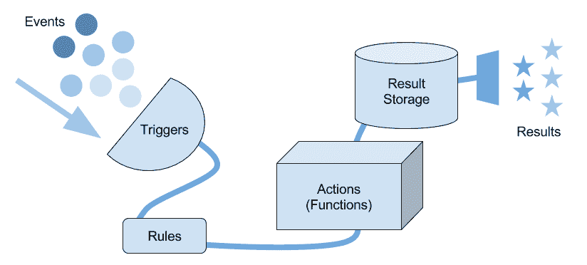
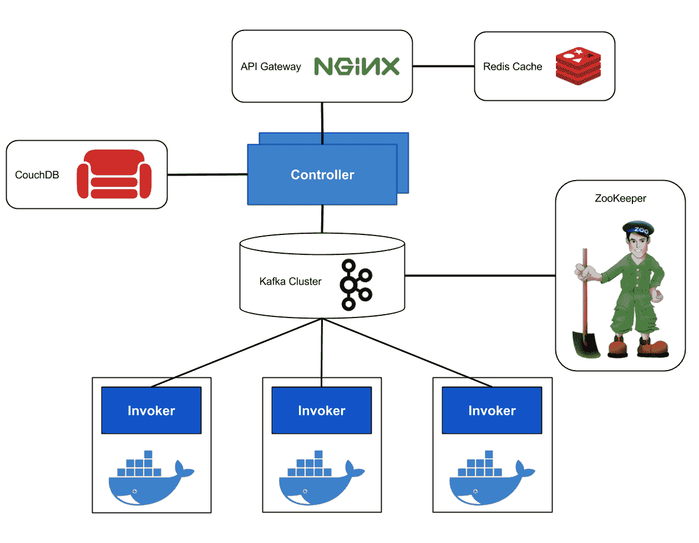
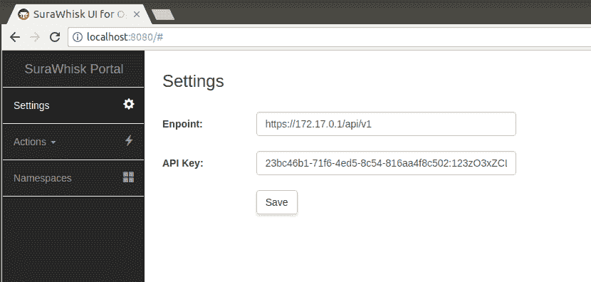
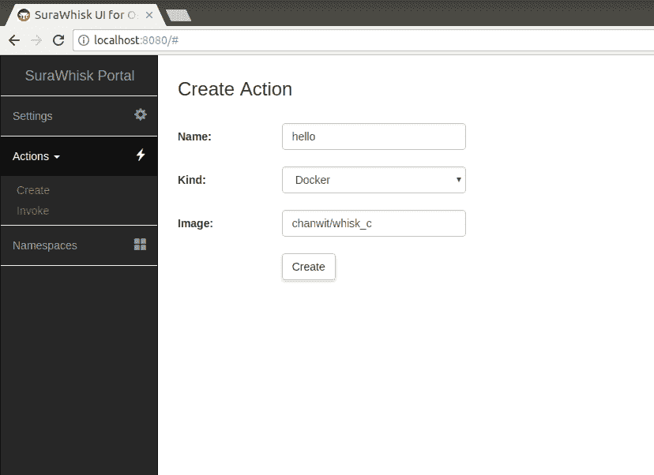
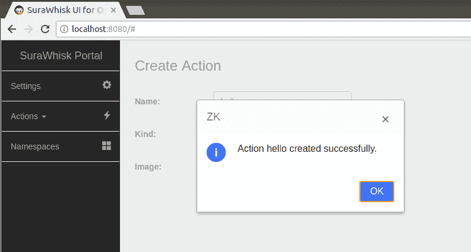
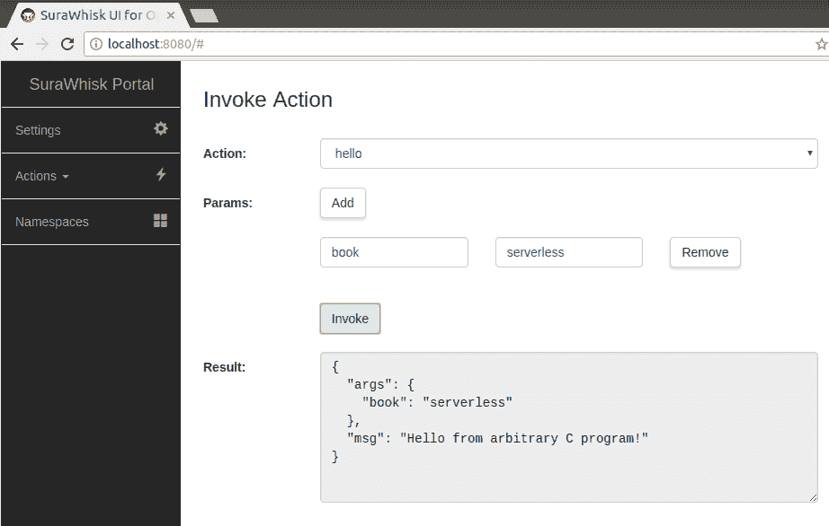

# OpenWhisk on Docker

本章将讨论服务器无关平台中的另一个角色——OpenWhisk。首先将概述 OpenWhisk 平台、其设计原理和功能，之后本章将介绍如何部署本地 OpenWhisk 实例以进行函数开发，如何使用其命令行界面，OpenWhisk 的组件和架构，以及如何准备函数以部署到该平台。

# 什么是 OpenWhisk？

OpenWhisk 被捐赠给 Apache 基金会，是一个强大的 FaaS 平台，最初由 IBM 和 Adobe 开发。它建立在 Docker 容器技术之上，可以部署在云端或本地硬件上。它是一个平台，能够解放开发者，让他们无需担心代码的生命周期或执行代码的容器运行时的管理。OpenWhisk 旨在具有可扩展性，并支持大量函数调用。目前，OpenWhisk 是 IBM Cloud Functions 的引擎。

OpenWhisk 的扩展机制并非建立在 Docker Swarm 或 Kubernetes 调度器之上，而是直接连接到每个 Docker 实例以启动和扩展函数容器。凭借这种设计，OpenWhisk 与普通的 Docker 基础设施相比，更适合与其结合，而不是 Kubernetes。

对于开发者来说，OpenWhisk 通过围绕函数的高级编程模型提供了许多引人注目的功能。其事件触发机制如图 6.1 所示：



图 6.1：OpenWhisk 事件触发流程

类似于其他平台，OpenWhisk 的最小部署单元是一个函数。在 OpenWhisk 中，函数称为操作。操作可以响应事件进行执行。事件以触发器的形式出现，通过规则进行处理，选择适当的操作进行执行。操作执行后，其结果将存储在结果存储中，然后返回到事件的源头。

OpenWhisk 原生支持许多语言运行时。然而，本章仅专注于其 Docker 运行时，允许开发者将任何类型的工作负载打包到容器中，并让 OpenWhisk 完成剩下的工作。OpenWhisk 中的操作可以同步调用、异步调用，甚至按计划触发。除了操作，OpenWhisk 还提供了一种声明式编程构造，例如序列，允许多个操作链接起来并作为一个流程执行。

# 安装 OpenWhisk

在撰写本文时，安装 OpenWhisk 在本地机器上的最快方式是使用 Docker 和 Docker Compose。

要安装 Docker Compose，我们可以按照 [`github.com/docker/compose/releases`](https://github.com/docker/compose/releases) 上的说明进行操作：

```
$ sudo curl -L https://github.com/docker/compose/releases/download/1.17.1/docker-compose-`uname -s`-`uname -m` -o /usr/local/bin/docker-compose
$ sudo chmod +x /usr/local/bin/docker-compose
```

要检查 Docker Compose 的版本，请使用以下命令：

```
$ docker-compose --version
docker-compose version 1.17.1, build 6d101fb
```

本章使用的是 Docker Compose 1.17.1。

还需要检查是否已经安装 Git。如果安装了 Git，现在我们可以准备安装本地的 OpenWhisk 实例。

首先，从 GitHub 克隆 OpenWhisk Dev tools 仓库（[`github.com/apache/incubator-openwhisk-devtools`](https://github.com/apache/incubator-openwhisk-devtools)），使用以下命令：

```
$ git clone --depth=1 https://github.com/apache/incubator-openwhisk-devtools
```

`--depth=1` 告诉 `git` 浅克隆仓库，这意味着只有 Git 历史的最新版本会被下载，以节省时间和空间：

接下来，进入 `incubator-openwhisk-devtools/docker-compose` 目录。该目录包含 `docker-compose.yml` 文件和启动单节点 OpenWhisk 实例所需的环境变量。在那里找到一个 `Makefile`，它包含 `quick-start` 目标，用于提供实例、设置初始数据并调用示例函数：

```
$ make quick-start
```

该命令将执行以下操作：

首先，它将从 GitHub 仓库的 `master` 分支下载 OpenWhisk 的最新源代码以及 `wsk` CLI 二进制文件。第二步，它将启动一个 OpenWhisk 本地集群，并使用 OpenWhisk 源代码树中附带的 Ansible playbook 初始化数据。然后，它将注册 `hello-world` 函数，最后调用它：

```
Response body size is 9 bytes
Response body received:
["guest"]
ok: whisk auth set. Run 'wsk property get --auth' to see the new value.
ok: whisk API host set to 192.168.1.40:443
ok: whisk namespace set to guest
waiting for the Whisk invoker to come up ... 
creating the hello.js function ...
invoking the hello-world function ... 
adding the function to whisk ...
ok: created action hello
invoking the function ...
invocation result: { "payload": "Hello, World!" }
{ "payload": "Hello, World!" }
deleting the function ...
ok: deleted action hello
To invoke the function again use: make hello-world
To stop openwhisk use: make destroy
```

有时，当进程启动并运行时，实例可能会变得不稳定。只需按 *Ctrl* + *C*，然后使用 `make run` 命令代替 `make quick-start` 再次尝试启动实例。如果您希望重新开始，只需运行 `make destroy` 命令销毁实例。销毁后，您可以使用 `make quick-start` 重新开始。

如果输出以此结束，OpenWhisk 现在已准备好在 `localhost:443` 提供服务：

```
Response body received:
["guest"]
ok: whisk auth set. Run 'wsk property get --auth' to see the new value.
ok: whisk API host set to localhost:443
ok: whisk namespace set to guest
```

然后，我们可以使用 `docker ps` 命令再次检查所有 OpenWhisk 容器是否在运行：

```
$ docker ps --format "table {{.ID}}\t{{.Image}}"
CONTAINER ID    IMAGE
5e44dca4c542    openwhisk/nodejs6action:latest
d784018ef3de    adobeapiplatform/apigateway:1.1.0
74b6b1d71510    openwhisk/controller
0c0cb4779412    openwhisk/invoker
b0111898e1a8    nginx:latest
874dac58a7c1    landoop/kafka-topics-ui:0.9.3
611e9b97ad74    confluentinc/cp-kafka-rest:3.3.1
4e1a82df737e    wurstmeister/kafka:0.11.0.1
9c490336abff    redis:2.8
abc4c0845fac    couchdb:1.6
451ab4c7bf45    zookeeper:3.4
```

# 使用 wsk 客户端：

`wsk` 客户端已经通过 `make quick-start` 命令安装。`wsk` 二进制文件可以在 `openmaster/bin/wsk` 找到。我们通常将 `wsk` CLI 复制到 `/usr/local/bin` 并为其设置 Bash 自动补全：

```
$ sudo cp openwhisk-master/bin/wsk /usr/local/bin

$ wsk sdk install bashauto
The bash auto-completion script (wsk_cli_bash_completion.sh) is installed in the current directory.
To enable command line completion of wsk commands, source the auto completion script into your bash environment

$ source wsk_cli_bash_completion.sh
$ wsk

 ____      ___                   _    _ _     _     _
 /\   \    / _ \ _ __   ___ _ __ | |  | | |__ (_)___| | __
 /\  /__\   \  | | | | '_ \ / _ \ '_ \| |  | | '_ \| / __| |/ /
 /  \____ \  /  | |_| | |_) |  __/ | | | |/\| | | | | \__ \   <
 \   \  /  \/    \___/| .__/ \___|_| |_|__/\__|_| |_|_|___/_|\_\
 \___\/ tm           |_|

Usage:
 wsk [command]

...
```

这里介绍的第一个子命令是`wsk property get`。它用于显示 OpenWhisk 的信息，包括当前的命名空间、认证密钥和构建号。例如，我们使用`-i`或`--insecure`选项不安全地连接到 OpenWhisk 实例，因为生成的证书是自签名的：

```
$ wsk -i property get
client cert 
Client key 
whisk auth              23bc46b1-71f6-4ed5-8c54-816aa4f8c502:123zO3xZCLrMN6v2BKK1dXYFpXlPkccOFqm12CdAsMgRU4VrNZ9lyGVCGuMDGIwP
whisk API host          localhost:443
whisk API version       v1
whisk namespace         guest
whisk CLI version       2017-12-05T00:51:32+00:00
whisk API build         "09/01/2016"
whisk API build number  "latest"
```

这些信息告诉我们什么？我们当前位于访客 `namespace`，使用的是 API 版本 1，且以 `23bc` 开头的长字符串是我们的 API 密钥用于认证。任何 OpenWhisk 客户端，包括 `wsk` 本身，都需要这个密钥才能连接到 OpenWhisk 实例。我们当前的 API 网关位于 `localhost:443`，它将把所有请求转发给底层控制器。每个 OpenWhisk 组件的概述和架构将在下一节中讨论：

# 组件与架构：

在本节中，我们讨论 OpenWhisk 的架构和组件。OpenWhisk 被设计为一个坚如磐石的 FaaS 平台，它为 IBM Cloud Function 提供支持，IBM Cloud Function 是 IBM 已经推出的 FaaS 生产系统之一。这个坚如磐石的架构的关键是 Kafka。OpenWhisk 巧妙地使用 Kafka 作为其主干，保证 Kafka 接受的每一个函数请求都会传递到调用层。让我们从查看它的整体架构开始。

# 架构

下图 *图 6.2* 显示了 OpenWhisk 的整体架构：



图 6.2：OpenWhisk 的整体架构。

边缘组件是基于 NGINX 和 OpenResty 构建的 API 网关。API 网关可选择使用 Redis 进行缓存。API 网关位于一个或多个控制器之前。控制器将所有配置存储在 CouchDB 集群中。控制器背后是一个由 ZooKeeper 法定节点协调的 Kafka 集群。Kafka 集群非常重要；每一个调用都能得到保证执行。Kafka 作为控制器和调用者之间的一个弹性缓冲区。每个调用者负责调用函数的真实实现，在本例中是 Docker 容器。因此，调用者需要特殊权限才能连接到主机的 Docker 套接字。调用者可选择使用 `docker-runc` 来提升调用过程的性能。OpenWhisk 的每个组件都能够在容器内运行，比如我们通过 Docker Compose 部署时的情况。

# 组件

现在我们将进入每个组件的详细信息。

# API 网关

OpenWhisk 的 API 网关组件建立在 NGINX 和 OpenResty 技术之上。选择 NGINX 的主要原因是它作为平台的边缘组件提供高性能。NGINX 位于系统中所有其他组件之前。API 网关能够通过 OpenResty 与 Redis 集群进行通信来缓存请求。然而，Redis 是一个可选组件，可以通过从 Docker Compose 配置中移除它来轻松禁用。API 网关还负责从用户处提供安全的 HTTPS 协议。

当前版本的 API 网关是 `adobeapiplatform/apigateway:1.1.0`。这是 Adobe 和 IBM 联合开发的 API 网关版本。

# 控制器

控制器是 OpenWhisk 中最重要的组件之一。顾名思义，它主要控制集群的调用过程。控制器可以在没有 API 网关的情况下工作。控制器直接提供 HTTP 协议，在不安全的形式下进行通信，因为 HTTPS 部分是 API 网关的功能。基本上，控制器源代码是 OpenWhisk 项目的一部分。本章使用的配置是 OpenWhisk 发布的最新 Docker 镜像。

# 数据库

OpenWhisk 的存储组件是 CouchDB。CouchDB 是一种高度可用的文档型数据存储。控制器与 CouchDB 通信，以存储与函数调用相关的所有实体。存储在 CouchDB 中的最重要实体是激活数据。激活数据包含每次调用过程的信息。操作的进展及其结果以 *激活文档* 形式存储。

当前配置中使用的是官方的 CouchDB 版本 1.6，`couchdb:1.6`。

# Kafka

Kafka 在系统中扮演着非常重要的角色。从本质上讲，Kafka 是一个消息代理，它存储每个接收到的消息并可靠地重放它们。以 Kafka 为骨干，操作调用的请求将可靠地传递给调用者。

Kafka 通过使用 ZooKeeper 集群来组成。Kafka 在默认网络中的 `9092` 端口上运行。在本章的配置中，我们使用 `wurstmeister/kafka:0.11.0.1` 镜像。

# 调用者

调用者是负责接收来自 Kafka 主题的调用请求的组件，消息队列消费者可以订阅这些主题以接收消息。接收到消息后，调用者使用后台运行时执行函数。OpenWhisk 支持本地和 Docker 运行时。Docker 运行时在内部被称为 **blackbox**。

OpenWhisk 还可以选择直接使用 Docker 的 `runc` 来提高函数性能。在这种架构下，调用者需要访问本地 Docker 主机的 `/var/run/docker.sock`。这个限制阻止了 OpenWhisk 在 Swarm 模式下的高效扩展。我们将在后续章节讨论 OpenWhisk 在 Swarm 上的新架构，届时我们将讨论 OpenWhisk 在生产环境中的部署。

# 操作运行时

OpenWhisk 提供了几种运行时环境。例如，Java、Node.js 和 Python 是本地运行时。正如前面提到的，Docker 运行时被称为 blackbox。

运行时会使用在操作创建过程中注册的 Docker 镜像。然后它启动 Docker 容器以接受请求。运行时可以保持容器持续运行，从而使后续调用显著更快。

# 函数准备

本节我们讨论如何使用 OpenWhisk 提供的 Docker 模板 **Docker skeleton** 来准备一个函数。

# OpenWhisk Docker SDK

要安装 Docker 模板，通常我们需要执行以下操作：

```
$ wsk -i sdk install docker
```

如果文件在本地 OpenWhisk 中不存在，你可以直接从 [`github.com/apache/incubator-openwhisk-runtime-docker/releases/download/sdk%400.1.0/blackbox-0.1.0.tar.gz`](https://github.com/apache/incubator-openwhisk-runtime-docker/releases/download/sdk%400.1.0/blackbox-0.1.0.tar.gz) 下载。

以下步骤是下载 SDK，解压 SDK，切换目录从 `dockerSkeleton` 到 `docker_c`，然后进入 `docker_c` 目录查看其内容：

```
$ curl -sSL -O https://github.com/apache/incubator-openwhisk-runtime-docker/releases/download/sdk%400.1.0/blackbox-0.1.0.tar.gz $ tar xf blackbox-0.1.0.tar.gz
$ mv dockerSkeleton docker_c
$ cd docker_c
$ ls
buildAndPush.sh Dockerfile example.c README.md
```

骨架包含一个 Dockerfile，一个简单的 C 程序，一个用于构建并将完成的功能推送到 Docker Hub 的 Bash 脚本，以及一个 `README.md` 文件。

我们从 C 程序的内容开始，看看它的作用。附带的 Docker 骨架 SDK 中的 C 程序只包含一个 `main` 函数，并有几个 `printf` 语句：

```
#include <stdio.h>

int main(int argc, char *argv[]) {
    printf("This is a log message from an arbitrary C program!\n");
    printf("{ \"msg\": \"Hello from C program!\", \"args\": %s }",
      (argc == 1) ? "undefined" : argv[1]);
}
```

最后一行 `printf` 向我们讲述了 OpenWhisk action 的整个故事。这个 action 通过将 JSON 数据打印到 STDOUT 返回数据。该 action 通过 `main` 函数的 `argv` 接受参数，参数形式也是 JSON。action 需要负责解码这些参数并将输出编码回来。

接下来，我们来看看它的 `Dockerfile`。

该文件首先声明 `openwhisk/dockerskeleton` 作为基础镜像。在下一行，环境变量 `FLASK_PROXY_PORT` 被定义为 `8080`。你可能会猜到，这里作为每个 Docker 函数包装器的框架是 `Flask`，一个 Python Web 框架。

接下来的两行将 C 程序添加到构建容器中，安装 GCC 编译器，然后编译程序。输出的二进制文件名为 `exec`，必须放置在 `/action/exec`。这是 OpenWhisk 的 `actionproxy` 所需的执行文件的必需位置。

什么是 `actionproxy`？它是 OpenWhisk 版本的函数包装服务器。该服务器通过其暴露的端口 `8080` 接受 Web 请求。如前所述，它是用 Python 和 Flask 框架编写的，因此每个 OpenWhisk 函数都需要 Python 和 Flask 依赖项才能启动 `actionproxy`。这种设置已经通过继承基础镜像 `openwhisk/dockerskeleton` 完成：

```
# Dockerfile for example whisk docker action
FROM openwhisk/dockerskeleton

ENV FLASK_PROXY_PORT 8080

### Add source file(s)
ADD example.c /action/example.c

RUN apk add --no-cache --virtual .build-deps \
        bzip2-dev \
        gcc \
        libc-dev \
### Compile source file(s)
 && cd /action; gcc -o exec example.c \
 && apk del .build-deps

CMD ["/bin/bash", "-c", "cd actionProxy && python -u actionproxy.py"]
```

我们将不使用提供的脚本，而是使用 `docker build` 命令自己构建。请记住，你需要使用自己的 `<DOCKER ID>` 作为仓库名称，以便将构建的镜像推送到 Docker Hub：

```
$ docker build -t chanwit/whisk_c .

Sending build context to Docker daemon 6.656kB
Step 1/5 : FROM openwhisk/dockerskeleton
latest: Pulling from openwhisk/dockerskeleton
...
 ---> 25d1878c2f31
Step 2/5 : ENV FLASK_PROXY_PORT 8080
 ---> Running in 932e3e3d6c0b
 ---> 647789067bf0
Removing intermediate container 932e3e3d6c0b
Step 3/5 : ADD example.c /action/example.c
 ---> 91eb99956da2
Step 4/5 : RUN apk add --no-cache --virtual .build-deps bzip2-dev gcc 
       libc-dev && cd /action; gcc -o exec example.c && apk del .build-deps
 ---> Running in 943930981ac6
fetch http://dl-cdn.alpinelinux.org/alpine/v3.4/main/x86_64/APKINDEX.tar.gz
fetch http://dl-cdn.alpinelinux.org/alpine/v3.4/community/x86_64/APKINDEX.tar.gz
(1/19) Upgrading musl (1.1.14-r15 -> 1.1.14-r16)
...
(17/17) Purging libgcc (5.3.0-r0)
Executing busybox-1.24.2-r13.trigger
OK: 32 MiB in 35 packages
 ---> d1cc0ed0f307
Removing intermediate container 943930981ac6
Step 5/5 : CMD /bin/bash -c cd actionProxy && python -u actionproxy.py
 ---> Running in fc68fc0ba06f
 ---> 924277b2a3a0
Removing intermediate container fc68fc0ba06f
Successfully built 924277b2a3a0
Successfully tagged chanwit/whisk_c:latest
```

如果一切正常，别忘了使用 `docker push` 命令将这个镜像存储到 Hub 上。

# 准备 Go 函数

接下来，我们将使用 Go 编程语言编写一个函数，向你展示如何使用 Go 内置库解码 JSON 参数。当然，我们将通过添加 Go 编译器来修改 OpenWhisk 的 Docker 骨架，并使用多阶段构建来优化构建过程。

让我们从头开始。

我们将再次解压 Docker 骨架，这次我们将 `dockerSkeleton` 目录重命名为 `docker_go`：

```
$ tar xf blackbox-0.1.0.tar.gz
$ mv dockerSkeleton docker_go
$ cd docker_go
```

在 `docker_go` 目录下，我们将编写一个 Go 程序，用于解码 action 的 JSON `params`，重新排列它们，重新编码为 JSON，然后写入调用者：

```
package main

import (
  "encoding/json"
  "fmt"
  "os"
)

func main() {
  rawParams := []byte(os.Args[1])
  params := map[string]string{}

  // decode JSON to a Go map
  err := json.Unmarshal(rawParams, &params)
  if err != nil {
    fmt.Printf(`{"error":%q}`, err.Error())
    os.Exit(0)
  }

  // re-arrange
  keys := []string{}
  values := []string{}
  for k, v := range params {
    keys = append(keys, k)
    values = append(values, v)
  }

  result := map[string]interface{}{
    "message": "Hello from Go",
    "keys": keys,
    "values": values,
  }

  // encode
  rawResult, err := json.Marshal(result)
  if err != nil {
    fmt.Printf(`{"error":%q}`, err.Error())
    os.Exit(0)
  }

  // write JSON back to the caller
  fmt.Print(string(rawResult))
}
```

在继续进行下一步之前，我们将此程序保存为`main.go`，然后编写用于多阶段构建的 Dockerfile 来编译 Go 程序，并将其打包为 OpenWhisk 动作。下面是新的`Dockerfile`版本。它的第一阶段是使用 Go 1.9.2 编译 Go 程序。请注意，我们将其编译为静态链接的二进制文件，以便它可以在 OpenWhisk 基础镜像内独立运行。在第二阶段构建中，我们将从第一阶段复制二进制文件`/go/src/app/main`到`/action/exec`，这是 OpenWhisk `actionproxy` 执行所需的二进制文件位置：

```
# Compile the Go program
FROM golang:1.9.2-alpine3.6

WORKDIR /go/src/app
COPY main.go .

RUN CGO_ENABLED=0 go build -a -ldflags '-extldflags "-static"' main.go

# Build using the base image for whisk docker action
FROM openwhisk/dockerskeleton

ENV FLASK_PROXY_PORT 8080

COPY --from=0 /go/src/app/main /action/exec

CMD ["/bin/bash", "-c", "cd actionProxy && python -u actionproxy.py"]
```

现在`Dockerfile`已经准备好了。让我们使用`docker build`命令来构建它：

```
$ docker build -t chanwit/whisk_go .
Sending build context to Docker daemon 2.242MB
Step 1/8 : FROM golang:1.9.2-alpine3.6
 ---> bbab7aea1231
Step 2/8 : WORKDIR /go/src/app
 ---> a219190c401f
Removing intermediate container 2a665bded884
Step 3/8 : COPY main.go .
 ---> f0df3a87489d
Step 4/8 : RUN CGO_ENABLED=0 go build -a -ldflags '-extldflags "-static"' main.go
 ---> Running in ec72e6f59a57
 ---> e0f943bac9a5
Removing intermediate container ec72e6f59a57
Step 5/8 : FROM openwhisk/dockerskeleton
 ---> 25d1878c2f31
Step 6/8 : ENV FLASK_PROXY_PORT 8080
 ---> Running in 846db07a0f5b
 ---> 543e673a9c79
Removing intermediate container 846db07a0f5b
Step 7/8 : COPY --from=0 /go/src/app/main /action/exec
 ---> 8ec5987098d8
Step 8/8 : CMD /bin/bash -c cd actionProxy && python -u actionproxy.py
 ---> Running in ea25c9a65bcc
 ---> a4193ccd5f48
Removing intermediate container ea25c9a65bcc
Successfully built a4193ccd5f48
Successfully tagged chanwit/whisk_go:latest
```

动作镜像现在已经准备好，名称为`chanwit/whisk_go`。请再次使用你自己的 Docker Hub ID，而不是我的，作为镜像仓库，并且不要忘记将其推送到 Hub。

# 调用函数

本节描述了 OpenWhisk 如何调用其动作的内部流程。我们将学习如何创建（或注册）一个 Docker 容器作为 OpenWhisk 动作，并如何调用它。

# 调用流程

由于 OpenWhisk 是一个事件驱动的平台，任何传递到它的事件都可以被拦截和解释。然而，在本示例中，我们只展示通过直接请求网关触发的事件。

调用流程以基于 HTTP 的请求开始，并发送到 API 网关。例如，我们可以使用 wsk CLI 发起这种请求。在 API 网关收到请求后，它会将该请求转发给背后的控制器。

OpenWhisk 最重要的组件之一是控制器。控制器是用 Scala 编写的，并使用臭名昭著的框架 Akka 和 Spray 来实现一组 REST API。控制器接受各种请求；如果它接受一个 POST 请求，它会将其解释为一个 OpenWhisk 动作的调用。

然后控制器开始对请求的动作进行身份验证和授权。

控制器将查找凭据信息并根据存储在 CouchDB 实例中的数据进行验证。

如果未找到动作，控制器会直接返回 404 给调用者，例如。如果在验证凭据后拒绝访问，控制器将返回一段 JSON 给调用者，表示他们没有权限访问该动作。

如果一切都被授权，控制器将进入下一步。

然后控制器再次查找有关动作的信息：它是什么，属于什么类型，如何调用它。

在我们的例子中，我们使用 Docker 作为动作原语。所以，控制器会发现我们的动作是一个黑盒子。现在它准备好调用该动作了。

控制器不会直接向调用者发起请求；相反，它会向 Kafka 集群发起请求，Kafka 是消息系统的骨干。如前所述，使用 Kafka 可以防止调用丢失，并通过在系统负载过重时排队调用，使系统更加健壮。

所以控制器向 Kafka 发布一条消息。请求消息包含调用操作所需的所有信息。这条消息也会被 Kafka 持久化，以便在系统崩溃时能够重放。

一旦 Kafka 收到消息，控制器将返回一个激活 ID，供稍后获取调用结果使用。

在 Kafka 的另一端，一组调用者订阅请求消息。一旦消息在队列中可用，调用者会收到通知。然后调用者会执行实际的工作，调用真正的 Docker 容器。在获得结果后，调用者会将它们存储在同一激活 ID 下的 CouchDB 实例中。

# 操作调用

好的，现在我们准备好尝试之前部分章节中新创建的 C 和 Go 函数了。首先，我们将使用 `wsk action create` 命令创建一个操作，开始使用 C 程序：

```
$ wsk -i action create --docker chanwit/whisk_c whisk_c
ok: created action whisk_c
```

如果一切顺利，`wsk` 会告诉我们 `ok: created action`。接下来，我们将使用 `wsk action invoke` 命令来调用该操作。`invoke` 命令接受一个或多个 `--param` 参数来传递给操作。我们还可以使用 `--result` 来同步获取结果。结果当然是以 JSON 格式返回的：

```
$ wsk -i action invoke --param key value --result whisk_c
{
 "args": {
 "key": "value"
 },
 "msg": "Hello from C program!"
}
```

我们再试一次，这次使用 Go 程序。首先，创建操作：

```
$ wsk -i action create --docker chanwit/whisk_go whisk_go
ok: created action whisk_go
```

然后，使用 `wsk action invoke` 调用该操作：

```
$ wsk -i action invoke --param hello world --result whisk_go
{
 "keys": [
 "hello"
 ],
 "message": "Hello from Go",
 "values": [
 "world"
 ]
}
```

正如我们所见，我们将操作打包到 Docker 中，这基本上简化了整个过程，从操作准备、创建到调用。

# 获取激活结果

每次调用操作时，OpenWhisk 都会为其创建一个激活记录。要查看激活记录，我们可以在没有 `--result` 参数的情况下调用一个操作，例如：

```
$ wsk -i action invoke --param hello world whisk_go
ok: invoked /guest/whisk_go with id 6ba2c0fd6f4348b8a2c0fd6f4388b864
```

`6ba2c0fd6f4348b8a2c0fd6f4388b864` 这个 ID 被称为激活 ID。我们现在可以使用 `wsk activation get` 命令获取激活记录。在激活 ID 后加上字段名称将对结果进行过滤，仅显示该字段。以下示例仅显示激活记录 `6ba2c0` 的 `response` 字段：

```
$ wsk -i activation get 6ba2c0fd6f4348b8a2c0fd6f4388b864 response
ok: got activation 6ba2c0fd6f4348b8a2c0fd6f4388b864, displaying field response
{
 "status": "success",
 "statusCode": 0,
 "success": true,
 "result": {
 "keys": [
 "hello"
 ],
 "message": "Hello from Go",
 "values": [
 "world"
 ]
 }
}
```

在激活记录中，JSON 结果被放置在 `result` 键下。你可以观察到所有数据都正确地序列化为 JSON 并记录在其中。

# 用户界面

写作时，OpenWhisk 没有公开的开源门户。为了让开发者更方便使用 OpenWhisk，我正在开发一个 UI 门户。SuraWhisk 是一个开源项目，托管在 GitHub 上。其源代码可以在 [`github.com/surawhisk/ui`](https://github.com/surawhisk/ui) 找到。如果你不想查看源代码，可以直接从现成的 Docker 镜像启动 UI。

首先，创建一个卷来存储设置数据。端点及其 API 密钥将存储在该卷中，用于身份验证：

```
$ docker volume create surawhisk_vol
```

然后可以使用以下命令运行 UI：

```
$ docker run -d -p 8080:8080 -v surawhisk_vol:/root/data surawhisk/ui
```

在启动 SuraWhisk UI 后，将浏览器指向`http://localhost:8080`。UI 的左侧导航栏当前包含三个基本项目：设置、操作和命名空间。

设置页面，如*图 6.3*所示，用于设置 OpenWhisk 端点及其 API 密钥。SuraWhisk 容器在桥接网络上运行；因此，它可以通过 Docker 的网关桥接 IP `172.17.0.1` 访问 OpenWhisk 的 API 网关。也就是说，我们本地 OpenWhisk 实例的端点将是`https://172.17.0.1/api/v1`。可以通过运行以下命令的 `wsk` CLI 获取当前访客命名空间的 API 密钥。如果桥接 IP 无法使用，可以尝试本地机器的 IP，因为 OpenWhisk 的 API 网关也通过机器的 IP 公开：

```
$ wsk property get --auth
whisk auth     23bc46b1-71f6-4ed5-8c54-816aa4f8c502:123zO3xZCLrMN6v2BKK1dXYFpXlPkccOFqm12CdAsMgRU4VrNZ9lyGVCGuMDGIwP
```

命令的结果提供了一个长字符串，表示它是一个`whisk auth`。将整个字符串`23b...IwP`复制并粘贴到设置页面的 API 密钥文本框中，然后点击保存按钮：



图 6.3：SuraWhisk 的设置屏幕，用于指定端点和 API 密钥

现在，SuraWhisk 门户将能够与 OpenWhisk 实例通信。我们将进入定义新函数的步骤。

在操作/创建页面（如*图 6.4*所示），可以定义一个函数，作为 OpenWhisk 中的操作。这里将使用本章前面构建的 Docker 镜像。在以下示例中，我们创建一个名为 `hello` 的函数，作为一个 Docker 容器，其镜像为 `chanwit/whisk_c`：



图 6.4：操作创建屏幕，允许我们在 OpenWhisk 中定义一个新操作

当一切准备就绪时，点击创建按钮。门户将连接到 OpenWhisk 实例并请求创建一个新操作。在这个阶段不会拉取 Docker 镜像，因此此步骤会迅速完成。如果 `hello` 操作创建成功，将会弹出对话框，如图 6.5 所示。



图 6.5：对话框显示操作已成功创建

要调用操作，请转到左侧导航栏的菜单 Actions/Invoke，如*图 6.6*所示。当前命名空间中的所有操作将列出在操作下拉框中。每个调用都接受作为操作参数的键/值对。可以通过点击添加按钮添加它们。在以下示例中，`book` 参数设置为包含值 `serverless`。可以通过点击每个键值对的删除按钮随时删除一个参数。这些参数将在传递给操作之前被编码为 JSON：



图 6.6：SuraWhisk 中的调用操作屏幕，显示结果

在选择要调用的动作后，点击调用按钮将启动调用过程。在前面的示例中，`hello`动作是以 Docker 容器的形式存在的。

# 练习

下面是一些帮助你复习本章内容的问题：

1.  OpenWhisk 有哪些优势？

1.  请描述 OpenWhisk 的架构。

1.  OpenWhisk 控制器的作用是什么？

1.  Kafka 的作用是什么？它为什么对 OpenWhisk 很重要？

1.  什么是调用器？

1.  为什么控制器和调用器没有直接连接？

1.  我们如何在 OpenWhisk 平台上定义并调用一个动作？

1.  我们如何提高调用器的性能？

# 总结

本章介绍了 OpenWhisk，特别是我们如何使用 Docker 作为其生态系统的一部分。OpenWhisk 是一个功能完备、容错性强、支持多种语言的无服务器平台，允许你以任何语言编写的函数在虚拟环境中运行。

本章介绍了 OpenWhisk 的组件和架构，并讨论了如何使用`wsk`命令行工具准备、创建和调用 OpenWhisk 函数。本章还介绍了 SuraWhisk，一个 OpenWhisk 的 Web 界面，帮助我们更轻松地管理和调用 OpenWhisk 的动作。

我们已经了解了三大 FaaS 平台的相关内容。在下一章，我们将讨论如何准备和操作 Docker 集群，以便在其上配置和管理 FaaS 平台。
