# 第八章：将所有内容整合在一起

本章将通过一个示例演示如何在 Docker 集群上让无服务器平台协同工作，并展示几个无服务器/FaaS 的使用案例。

我们将讨论一个移动支付场景，并通过函数实现它，但不同于以往在这种基础设施层次下，我们将把三个 FaaS 平台连接在一起。本章的主要思想是使用函数作为**粘合剂**，使用函数封装传统的基于 Web 的应用程序，以及将函数作为数据流处理程序。

在接下来的部分中，我们将从本章所使用的设置和场景开始。

本章涵盖的主题有：

+   一个移动支付场景

+   Parse 平台作为后端

+   在 Fn 中准备 WebHook

+   带区块链的事件状态机

+   使用函数包装传统系统

+   使用函数作为粘合剂

+   一个流处理器

+   跨 FaaS 平台的网络连接

# 一个移动支付场景

我们正在使用一个允许两家银行之间进行资金转账的移动支付场景作为本章的案例。对于资金转账，业务逻辑很容易理解。因此，我们无需担心这一部分。我们将集中精力在架构的复杂性上。

在两家不同银行之间进行资金转账，并且两家银行有不同的底层实现是困难的。这是因为我们不能直接应用*传统交易的概念*来应对外部系统。系统的结构如下图所示：


图 8.1：移动支付系统的总体框架图

本章没有涵盖哪些内容？

本书的范围不包括用户界面部分，因此它们不可用。**收据生成器**和**收据存储**是可选的。如果有兴趣，你可以自行实现它们。

我们要实现并演示什么？我们来讨论一下：

+   Parse 平台作为 UI 的后端。

+   **银行路由**函数。它是用 Java 编写的，并部署在 Fn 上。这个组件叫做`routing_fn`。

+   **银行#1**及其调用传统 Web 系统的函数。这里的函数是用 Node.js 编写的，并使用`chromeless`库（[`github.com/graphcool/chromeless`](https://github.com/graphcool/chromeless)）。该函数连接到无头的 Chrome 实例，也就是我们熟悉的 Web 浏览器。该函数驱动 Chrome 进行导航并在实际的 ERP 系统中为我们创建交易。我们使用 Moqui 作为我们的 ERP 后端。实际上，Moqui 自带完整的 REST API，但我们故意使用其 Web 界面来模拟需要现代化某些传统系统的场景。此部分的功能被称为`hivectl`。

+   **银行 #2** 及其功能 `account_ctl`，连接到基于 REST 的银行系统。该功能使用 `Go` 编写，并将在 OpenWhisk 上运行。该组件背后的模拟银行服务器是一个简单的服务器，使用 Grails/Spring Boot 框架编写。我们使用这个组件来演示如何编写 FaaS 函数，以封装和简化基于 REST 的 API。**银行路由**功能 `routing_fn` 将由每个银行选择性地调用。这个 **银行 #2** 组件将与 **银行 #1** 一起使用。

+   一组用 **Solidity** 编写的智能合约，用于维护移动号码与银行账户的映射。此外，另一组智能合约将用于维护每笔交易的资金转移状态。

+   一个用 Java 编写的代理，并使用 RxJava 库演示一个数据流处理组件，该组件调用一个函数并将事件转发到系统的其他部分。

# 作为后端的 Parse 平台

什么是 Parse？类似于 Firebase，Parse 是一个 **后端即服务**（**BaaS**）平台。使用 Parse，开发者无需为他们的 UI 或移动应用程序编写后端系统代码。Parse 被移动应用程序开发者使用，以帮助加速开发过程。与 Parse 仪表盘一起，它们提供了一个简易的 UI，用于构建处理基本业务逻辑所需的所有数据实体，称为 *类*。

# 准备工作

这是如何创建 Docker 网络并部署一组 Docker Compose 文件。我们使用元堆栈的概念来部署多个堆栈，并有一些标签和命名约定将它们组合在一起：

```
$ docker network create \
 --driver=weaveworks/net-plugin:2.1.3 \
 --subnet=10.32.2.0/24 \
 --attachable \
 parse_net

$ docker volume create mongo_data

$ docker stack deploy -c mongodb.yml         parse_01
$ docker stack deploy -c parse.yml           parse_02
$ docker stack deploy -c parse_dashboard.yml parse_03
$ docker stack deploy -c ingress.yml         parse_04
```

在生产环境中部署时，我们不使用任何 Docker Compose 文件来设置网络和卷。所有堆栈都应引用外部卷和网络。

从 MongoDB 开始，我们已经为其设置了一个卷。以下是 MongoDB 服务器的设置：

```
version: '3.3'

services:
  mongo:
    image: mongo:3.6.1-jessie
    volumes:
      - mongo_data:/data/db

volumes:
  mongo_data:
    external: true

networks:
  default:
    external:
      name: parse_net
```

我们进入下一个组件，即 Parse 平台。为了使容器与 Træfik 一起工作，我们为服务添加了一些标签，表示它将位于 `parse_net` 网络上，并将端口 `1337` 暴露给 Træfik 的 ingress。

我们添加了一条规则，允许每种 HTTP 方法，同时定义自定义入口点，并允许 `Origin=*`，以便下一个部分的 Parse 仪表盘能够连接到 Parse 服务器：

```
version: '3.3'

services:

  parse_server:
    image: parseplatform/parse-server:2.6.5
    command: --appId APP1 --masterKey MASTER_KEY --databaseURI mongodb://mongo/prod
    deploy:
      labels:
        - "traefik.docker.network=parse_net"
        - "traefik.port=1337"
        - "traefik.frontend.rule=Method: GET,POST,PUT,DELETE,OPTIONS,HEAD,CONNECT"
        - "traefik.frontend.entryPoints=parse_server"
        - "traefik.frontend.headers.customresponseheaders.Access-Control-Allow-Origin=*"

networks:
  default:
    external:
      name: parse_net
```

这是 Parse 仪表盘及其配置。当前仪表盘版本为 `1.1.2`。它将通过 Træfik 的 ingress 暴露到端口 `4040`：

```
version: '3.3'

services:

  parse_dashboard:
    image: parseplatform/parse-dashboard:1.1.2
    environment:
      - PARSE_DASHBOARD_ALLOW_INSECURE_HTTP=true
    deploy:
      labels:
        - "traefik.docker.network=parse_net"
        - "traefik.port=4040"
        - "traefik.frontend.rule=Method: GET,POST,PUT,DELETE,OPTIONS,HEAD,CONNECT"
        - "traefik.frontend.entryPoints=parse_dashboard"
        - "traefik.frontend.headers.customresponseheaders.Access-Control-Allow-Origin=*"
    configs:
      - source: config.json
        target: /src/Parse-Dashboard/parse-dashboard-config.json

configs:
  config.json:
    file: ./config.json

networks:
  default:
    external:
      name: parse_net
```

配置定义了默认的用户名和密码，并且指出服务器允许通过 HTTP 连接。将 `INSECURE` 设置为 `true` 是可以的，因为我们可以简单地在 ingress 层使用 Træfik 实现 SSL：

```
{
  "apps": [
    {
      "serverURL": "http://localhost:1337/parse",
      "appId": "APP1",
      "masterKey": "MASTER_KEY",
      "appName": "APP1",
      "iconName": "MyAppIcon.png",
      "supportedPushLocales": ["en", "ru", "fr"]
    }
  ],
  "users": [
    {
      "user":"admin",
      "pass":"password"
    }
  ],
  "iconsFolder": "icons",
  "allowInsecureHTTP": true
}
```

以下 YAML 代码用于定义 Parse 和 Parse 仪表盘的 L7 Træfik ingress。我们还需要将 Parse 暴露到外部，因为仪表盘是一个胖客户端，而不是服务器端渲染。这是我们需要设置 `Allow-Origin=*` 的主要原因：

```
version: '3.3'

services:

  l7:
    image: traefik:1.5.2
    command: --docker
      --docker.swarmmode
      --docker.watch
      --docker.endpoint=tcp://docker-api:2375
      --entryPoints="Name:parse_server Address::1337"
      --entryPoints="Name:parse_dashboard Address::4040"
      --web --logLevel=DEBUG
    ports:
      - published: 1337
        target: 1337
        protocol: tcp
        mode: host
      - published: 4040
        target: 4040
        protocol: tcp
        mode: host

networks:
  default:
    external:
      name: parse_net
```

如果一切顺利，我们可以打开我们喜欢的浏览器，访问 `localhost:4040` 以查看 Parse 仪表盘，如下图所示。默认的用户名和密码是：`admin`/`password`：

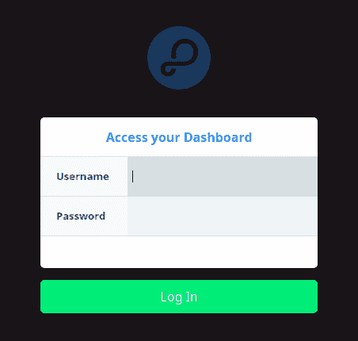

图 8.2：Parse 仪表盘的登录页面

在以下截图中，我们的 Parse 平台 APP1 仪表盘连接到 `http://localhost:1337` 的 Parse 实例：

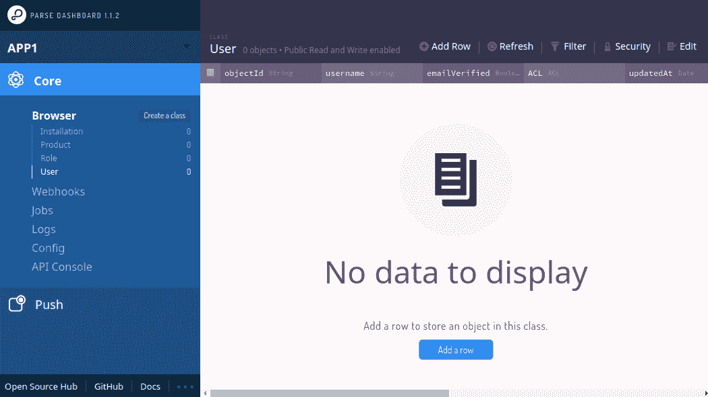

图 8.3：显示核心部分的 Parse 应用界面

# 定义转账实体

在左侧导航面板中，我们可以看到 Core | Browser 菜单。这里我们可以查看 Parse 平台上的所有数据。虽然已有一些内置类，但我们将定义一个新类来帮助进行资金转账。

点击 Core | Browser 菜单中的“创建一个类”。如以下截图所示，将会弹出一个对话框。我们将在此命名我们的新类，`Transfer`。它将成为我们处理移动支付和，当然，资金转账的主要实体：

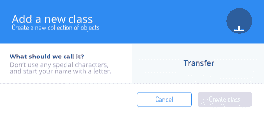

图 8.4：定义 Parse 中新类的对话框

接下来，我们需要为这个实体设置一些新列。我们定义了以下列：

+   from: 付款人的手机号码。

+   to: 收款人的手机号码。

+   amount: 需要支付的金额。

+   sent: 当我们要开始处理交易时，需要将此标志设置为 `true`。如果该字段为 `null` 或 `false`，WebHook（见下文）将仅接收数据而不执行任何操作。

+   processed: 如果交易处理完毕，标志将自动设置为 `true`。

我们如何使用这个类？通过仪表盘，如下图所示，我们为 from、to 和 amount 列设置了手机号码。然后，当我们准备好时，只需将 sent 列设置为 `true`。

如果处理出错，发送标志将由 WebHook 自动重置为 `null`：

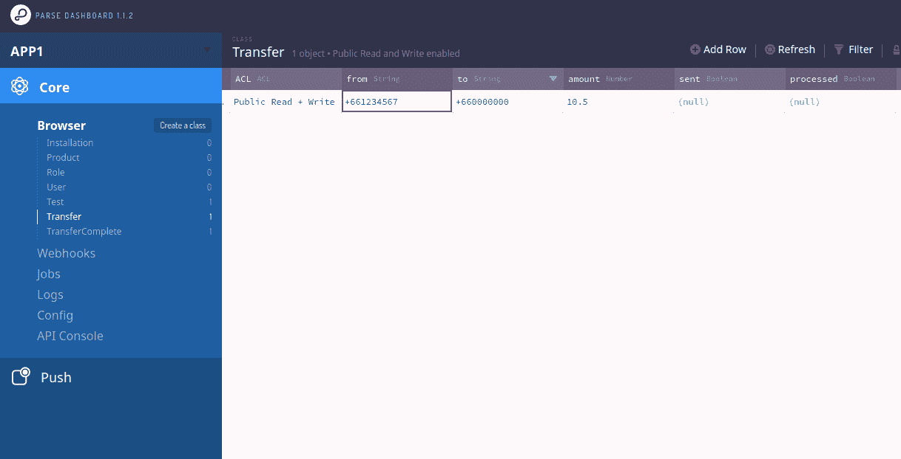

图 8.5：通过仪表盘浏览 Transfer 类

# WebHook

Parse 平台提供了一个可扩展的机制，允许我们在外部处理业务逻辑。这就是函数的作用。这个机制称为 **WebHook**。

我们可能会有作为外部进程运行的函数，这些函数在 Parse 平台外部，并与 Parse 的 WebHook 一起使用，以执行复杂的业务逻辑。正如前面的例子中所示，我们已经有了 `Transfer` 类。然后，我们为这个类定义一个 WebHook，每次在保存每个 `Transfer` 实体之前，调用外部函数。我们为此 WebHook 指定一个 FaaS 网关的 URL。`HTTP POST` 方法将发送到指定的 URL，JSON 数据将作为请求体。请求体包含当前 `Transfer` 实体的数据。

可以通过访问 Core | Webhooks 并点击小的“创建一个 Webhook”选项来创建一个 WebHook：

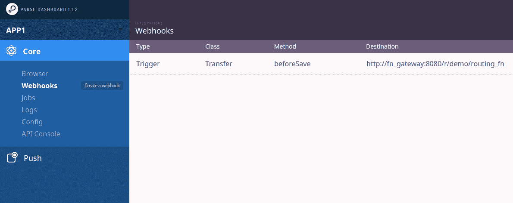

图 8.6：列出现有 WebHooks 的屏幕

Parse 中有两种 WebHook：Cloud Code 函数和触发器。本章使用的 WebHook 类型是 **触发器**。WebHook 触发器可以挂钩到多个地方，例如 beforeSave、afterSave、beforeDelete 和 afterDelete。

在本章讨论的示例中，将使用如下一截图所示的 beforeSave 触发器。我们选择 Transfer 作为该钩子的目标类。然后我们需要指定 WebHook URL，这是部署到 Fn 上的银行路由函数：

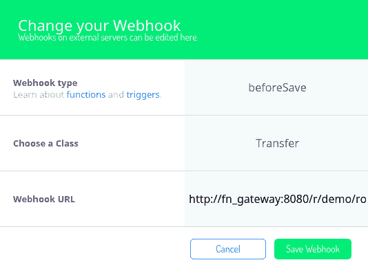

图 8.7：定义新 WebHook 的对话框；适用于 Transfer 类的 beforeSave

我们将在下一节讨论银行路由 WebHook，但在深入了解其细节之前，先简要展示其运行效果。

我们通过创建一个新的 `Transfer` 类实例来测试 WebHook。以下截图中，手机号码 `+661234567` 尚未注册。因此无法进行查找，WebHook 返回错误消息：

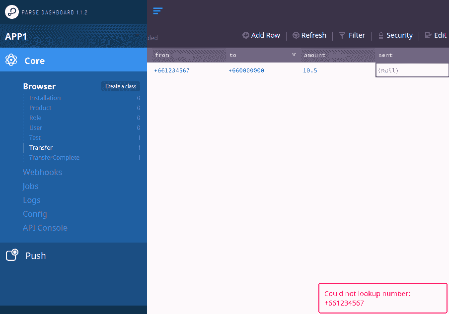

图 8.8：从 WebHook 返回的错误消息将在右下角弹出

要查看错误日志，请点击 Core | Logs，如下截图所示。这里是 WebHook 返回以下 JSON 的示例：

```
{"error": "Could not lookup number: +661234567"}
```

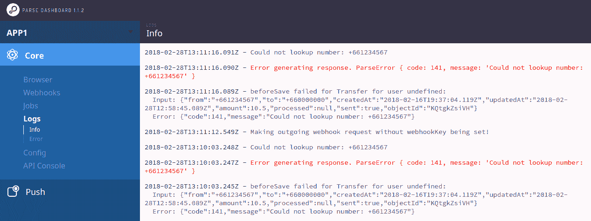

图 8.9：信息级别的日志屏幕，显示各种日志，包括错误

返回消息的规范是 `{"success": object}` 用于将数据更新回 Parse 平台，`{"error":"msg"}` 用于显示错误消息。

# 在 Fn 中准备 WebHook

Fn 项目最适合使用 Java 编写的函数。当调用函数时，框架能够自动将请求体转换为入口方法的参数。在以下示例中，请求中的 JSON 将被转换为字符串，作为此 Fn 函数的入口方法 `handleRequest` 的参数：

```
public Object handleRequest(String body) {
    if (body == null || body.isEmpty()) {
        body = "{}";
    }
     Input input;
    try {
        val mapper = new ObjectMapper();
        input = mapper.readValue(body, Input.class);
    } catch (IOException e) {
        return new Error(e.getMessage());
    }
     if (input == null) {
        return new Error(body);
     }
     /* process the rest of business logic */
}
```

这是 **数据传输对象** (**DTO**) 类的列表，用于在 Fn 函数中正确地编码和解码 Parse 的 WebHook 消息。借助 Project Lombok 和 Jackson，我们可以显著减少代码行数。`Input` 对象是 Java 的 `Transfer` 对象的包装器，包含与我们在 Parse 平台上定义的 `Transfer` 类相似的所有列。

请注意，我们在系统的两端都有一个 **Transfer** 类，一个在 Parse 平台上，另一个在 Fn 平台上。

`Success` 和 `Error` 类用于将处理结果返回到 Parse：

```
@Data
@AllArgsConstructor
@JsonIgnoreProperties(ignoreUnknown = true)
public static class Input {
    private Transfer object;
}

@Data
@NoArgsConstructor
@JsonIgnoreProperties(ignoreUnknown = true)
public static class Transfer {
    private String objectId;
    private String from;
    private String to;
    private Double amount;
    private Boolean sent;
    private Boolean processed;
}

@Data
@AllArgsConstructor
public static class Success {
    private Transfer success;
}

@Data
@AllArgsConstructor
public static class Error {
    private String error;
}
```

由于这是一个 Java 项目，我们不需要在容器内部构建它。以下是 Gradle 构建文件，可以使用 `gradle installDist` 命令进行构建：

```
plugins {
    id 'io.franzbecker.gradle-lombok' version '1.11'
    id 'java'
    id 'groovy'
    id 'application'
}

mainClassName = 'App'

dependencies {
    // FN Project
    compile 'com.fnproject.fn:api:1.0.56'

    // JSON encoding
    compile 'com.fasterxml.jackson.core:jackson-annotations:2.9.4'
    compile 'com.fasterxml.jackson.core:jackson-databind:2.9.4'

    // REST client
    compile 'com.squareup.okhttp3:okhttp:3.9.1'

    // Simplify Java syntax
    compile group: 'org.projectlombok', name: 'lombok-maven',
            version: '1.16.20.0', ext: 'pom'

    // Ethereum Client
    compile 'org.web3j:core:3.2.0'

    // Testing
    testCompile 'com.fnproject.fn:testing:1.0.56'
    testCompile 'junit:junit:4.12'
    testCompile 'org.codehaus.groovy:groovy-all:2.4.12'
    testCompile 'org.spockframework:spock-core:1.0-groovy-2.4'
}

repositories {
    mavenCentral()
    jcenter()
    maven {
        url "https://dl.bintray.com/fnproject/fnproject"
    }
}
```

以下是用于构建 Fn 项目的 Dockerfile。它需要继承自`fn-java-fdk`。在本书的示例中，我们使用`jdk9-1.0.56`。你需要做的是将`build`目录中的所有 JAR 文件复制到容器镜像中的`/function/app`目录：

```
FROM fnproject/fn-java-fdk:jdk9-1.0.56

WORKDIR /function

COPY ./build/install/routing_fn/lib/*.jar /function/app/

CMD ["com.example.fn.TransferFunction::handleRequest"]
```

以下步骤是准备 Fn 服务器，然后我们使用`gradle`命令构建函数。接着，我们将其 Docker 镜像构建并推送到 Hub，然后重新定义为 Fn 路由。

首先，我们使用以下`docker run`命令手动部署 Fn 服务器。同时，我们将 Fn 连接到`parse_net`。为了使每个由 Fn 启动的容器都位于同一个网络中，我们对 Fn 进行了特别的黑客处理，如`FN_NETWORK`中所指定的：

```
docker run \
 --name fnserver \
 --detach \
 -v /var/run/docker.sock:/var/run/docker.sock \
 -v fn_vol:/app/data \
 -p 28080:8080 \
 --network=parse_net \
 --network-alias=fn_gateway \
 -e FN_LOG_LEVEL=debug \
 -e FN_NETWORK=parse_net \
 fnproject/fnserver
```

这是构建和推送脚本。将以下脚本保存为`./buildAndPush`：

```
./gradlew installDist

VERSION=$1

docker build -t chanwit/routing_fn:$VERSION .
docker push chanwit/routing_fn:$VERSION

fn routes delete demo /routing_fn
fn routes create /routing_fn -i chanwit/routing_fn:$VERSION demo
```

然后，我们可以通过调用带有特定版本号的脚本来开始构建和推送过程，如下所示：

```
./buildAndPush v1
```

在下一节中，我们将讨论 WebHook 函数如何从区块链中查找账户数据，以及如何跟踪每个资金转账交易的状态。

# 一个带区块链的事件状态机

我们使用*以太坊区块链*作为该事件状态机来处理资金转账系统。在这个角色中，区块链用于存储以下内容：

+   电话号码与银行账户的映射关系

+   每个转账交易的整体状态

在区块链内部，有两种类型的智能合约。第一种实现了**仓库模式**，第二种实现了**实体模型**。

我们使用 Truffle ([`truffleframework.com/`](http://truffleframework.com/)) 来创建这个事件状态机。请查看 GitHub 仓库中名为*eventmachine*的子项目 ([`github.com/chanwit/eventmachine`](https://github.com/chanwit/eventmachine))。

这里有一个位于`entities/`目录下的智能合约，`TransferState.sol`。这个智能合约维护着每个转账交易的状态。每个交易的初始状态是**NONE**，然后是**STARTED**、**PENDING**，最终是**COMPLETED**。下图展示了智能合约`TransferState`与其仓库实现协作的过程：

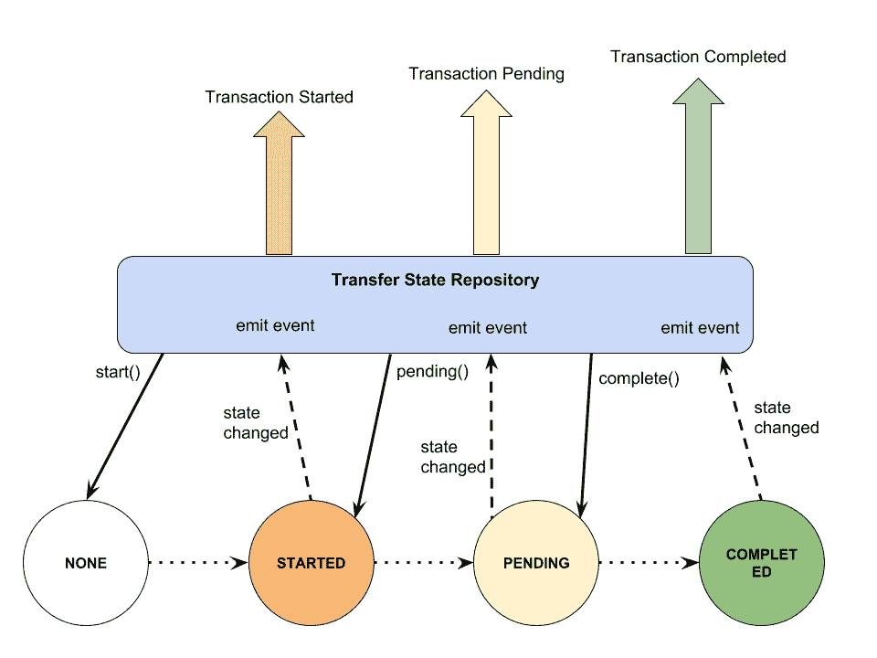

图 8.10：智能合约的状态转换和事件触发流程

然后我们稍微探讨一下其代码。在转换到下一个状态时，我们使用`require`语句进行检查，如果不满足前置条件，智能合约将抛出异常：

```
contract TransferState {

  enum State { NONE, STARTED, PENDING, COMPLETED }

  string txId;
  State state;

  function TransferState(string _txId) {
    state = State.NONE;
    txId = _txId;
  }

  function start() public {
    require(state == State.NONE);
    state = State.STARTED;
  }

  function pending() public {
    require(state == State.STARTED);
    state = State.PENDING;
  }

  function complete() public {
    require(state == State.PENDING);
    state = State.COMPLETED;
  }

  function currentState() public constant returns (uint8) {
    return uint8(state);
  }
}
```

如前所述，`TransferState` 是由智能合约 `TransferStateRepository` 管理的。基本上，这是仓储模式的实现（[`hub.packtpub.com/domain-driven-design/`](https://hub.packtpub.com/domain-driven-design/)）。此外，该智能合约自然运行在区块链上。为了使其与外界通信，每个智能合约必须触发一种事件。在这个 `TransferStateRepository` 中，它被设计为在每个事务将其状态更改为 `STARTED`、`PENDING` 和 `COMPLETED` 时触发事件。请参见 *图 8.10* 中的事件签名：

```
contract TransferStateRepository {

    event TransferStarted(string txId);
    event TransferPending(string txId);
    event TransferCompleted(string txId);

    mapping(bytes32 => address) states;

    function start(string txId) public {
        /* register the state, set to STARTED */
        TransferStarted(txId);
    }

    function pending(string txId) public {
        /* check the state, set to PENDING */
        TransferPending(txId);
    }

    function complete(string txId) public {
        /* check the state, set to COMPLETED */
        TransferCompleted(txId);
    }

    function getStateOf(string txId) public constant returns (string) {
        /**/
        if (state == 0) return "NONE";
        else if (state == 1) return "STARTED";
        else if (state == 2) return "PENDING";
        else if (state == 3) return "COMPLETED";
    }
}
```

电话号码与银行账户之间的映射由 `RegistrationRepository` 维护。该智能合约使用相同的技术与外界通信，触发事件。

`RegistrationRepository` 设计了四个事件。当我们将一个新的电话号码注册到映射中时，会触发 `Registered` 事件。如果我们尝试再次注册相同的号码，则会触发来自区块链的 `AlreadyExisted` 事件。

`RegistrationFound` 是在通过 `findTelByNo` 函数根据姓名找到手机号时触发的事件，当此函数无法找到与输入手机号匹配的注册信息时，会触发 `RegistrationNotFound` 事件：

```
contract RegistrationRepository {

    mapping(bytes32 => address) registrations;

    event Registered(string telNo, address registration);
    event AlreadyExisted(string telNo);
    event RegistrationFound(string telNo, string bank, string accNo);
    event RegistrationNotFound(string telNo);

    function register(string telNo, string bank, string accNo) public {
        /**/
        Registered(telNo, address(r));
    }

    function findByTelNo(string telNo) public returns (address) {
        /**/
        Registration r = Registration(registrations[key]);
        RegistrationFound(telNo, to_s(r.bank()), to_s(r.accNo()));

        return address(r);
    }

}
```

使用 Truffle 框架，我们可以在开发过程中通过 JavaScript 初始化一些数据。以下是一个迁移脚本，位于 `migrations/` 目录下，用于将智能合约部署到区块链，并注册两个手机号码。第一个号码关联到由 **银行 #1**（OpenFaaS 银行）管理的账户。第二个手机号码已注册并关联到 **银行 #2**（OpenWhisk 银行）。在所有银行中，我们已有包含存款的账户：

```
var RegistrationRepository = artifacts.require(
  "./v2/repository/RegistrationRepository.sol");
var TransferStateRepository = artifacts.require(
  "./v2/repository/TransferStateRepository.sol");

module.exports = function(deployer) {

  deployer.deploy(TransferStateRepository);

  deployer.deploy(RegistrationRepository).then(function() {
    RegistrationRepository.deployed().then(function(repo){
      repo.register("+661234567", "faas", "55700").then();
      repo.register("+661111111", "whisk", "A1234").then();
    });
  });

};
```

我们使用 Parity（一款最稳定的以太坊客户端之一）搭建了一个以太坊区块链网络。以下是设置过程。我们将运行中的 Parity 容器连接到 Fn 和 Parse 平台的同一网络：

```
docker run --rm --name=parity_dev -d -p 8545:8545 -p 8180:8180 \
 --network=parse_net \
 --network-alias=blockchain \
 parity/parity:stable-release \
 --geth --chain dev --force-ui \
 --reseal-min-period 0 \
 --jsonrpc-cors http://localhost \
 --jsonrpc-apis all \
 --jsonrpc-interface 0.0.0.0 \
 --jsonrpc-hosts all
```

对于生产环境的私有区块链网络，我们需要采用不同的设置方式。例如，我们需要设置自己的创世区块以及网络的挖矿行为。无论如何，这已经超出了本书的范围。然后，我们通过 Truffle 部署智能合约：

```
$ cd eventmachine
$ truffle exec scripts/unlock.js
$ truffle migrate
```

# WebHook 如何使用区块链

在讨论每个组件后，我们将定期回到 WebHook。

我们已经知道区块链和智能合约是如何工作的。它们记录手机号码注册，并维护转账交易的状态。在这一部分，我们讨论 WebHook 功能如何与区块链交互。以下是 WebHook 函数中的代码片段。函数中的查找方法获取智能合约`RegistrationRepository`，然后在区块链上调用`findByTelNo()`。结果随后会出现在交易回执中。我们检查回执中存储了什么事件。如果是`RegistrationFound`事件，那么该方法返回一个包含银行名称和账户号码信息的结果对象。

这个检查还有改进的空间。

读者应该如何优化智能合约，以便仅触发一个事件并有意义地检查电话号是否已注册？

基本上，这就是查找部分：

```
@Data
@AllArgsConstructor
static class RegistrationResult {
    private String bankName;
    private String accountId;
}

public RegistrationResult lookup(String telNo) throws Exception {
    val repo = ContractRegistry.registrationRepository();
    val receipt = repo.findByTelNo(telNo).send();
    val foundEvents = repo.getRegistrationFoundEvents(receipt);
    if (foundEvents.isEmpty() == false) {
        val reg = foundEvents.get(0);
        return new RegistrationResult(reg.bank, reg.accNo);
    } else {
        val notFoundEvents = repo.getRegistrationNotFoundEvents(receipt);
        if(notFoundEvents.isEmpty() == false) {
            val reg = notFoundEvents.get(0);
            return null;
        }
    }

    throw new Exception("Lookup does not find any event in receipt.");
}
```

转账状态管理部分是通过一组方法实现的，这些方法的名称以`transfer`开头。

这是告诉我们如何开始新的交易的方法，交易 ID 为`txId`。它使用`ContractRegistry`来获取智能合约`TransferStateRepository`。然后我们创建一个新的交易状态，并将其状态设置为`STARTED`。如果一切正常，我们应该从调用中获取一个交易回执，回执中嵌入了一个事件`TransferStartedEvent`：

```
private boolean transferStart(String txId) {
    try {
        val repo = ContractRegistry.transferStateRepository();
        val receipt = repo.start(txId).send();
        val events = repo.getTransferStartedEvents(receipt);
        if (events.isEmpty()) {
            return false;
        }
        return true;
    } catch (Exception e) {
        return false;
    }
}
```

# 用函数包装一个遗留系统

在这一部分，我们将演示如何为一个遗留的基于 Web 的系统编写包装函数。为此，我们使用`chromeless`库（[`github.com/graphcool/chromeless`](https://github.com/graphcool/chromeless)）连接到一个无头的 Chrome 实例。然后，`chromeless`脚本驱动 Chrome 浏览器为我们完成其余的工作。

以下图表显示了系统这一部分的工作机制：

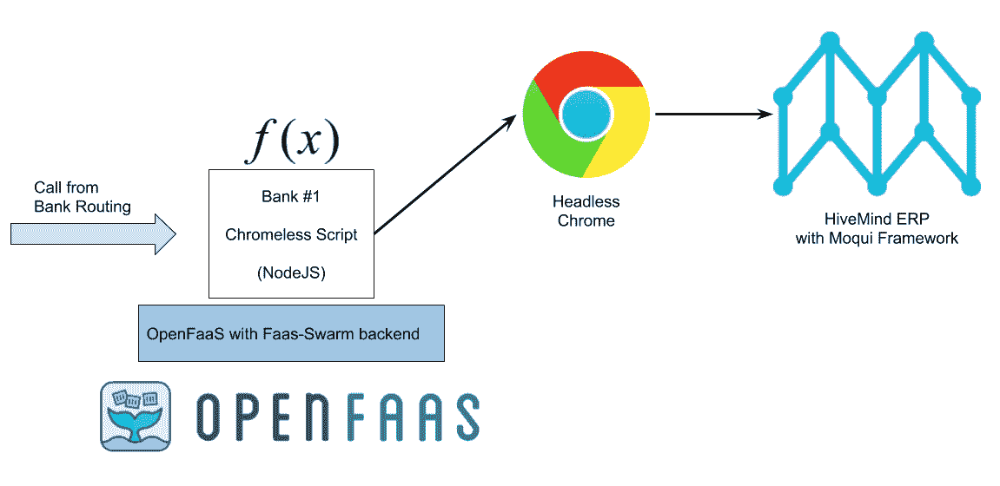

图 8.11：实现一个 OpenFaaS 函数来包装基于 UI 的 ERP 的图示

`chromeless`做什么？`chromeless`是一个 Node.js 库，可以用于执行浏览器自动化，类似于 PhantomJS 或 Selenium。但是它真的非常快速。结合无头的 Chrome 实例，`chromeless`可以提供非常快的性能。因此，它可以用作无服务器函数。

我们首先使用 FaaS CLI 创建一个项目。我们称这个函数为`hivectl`，它是一个控制使用 Moqui 框架构建的 ERP 程序 HiveMind 的程序。设置完这个函数后，我们将简要介绍 HiveMind：

```
$ faas new hivectl --lang node
2018/03/04 22:28:49 No templates found in current directory.
2018/03/04 22:28:50 Attempting to expand templates from https://github.com/openfaas/templates.git
2018/03/04 22:28:55 Fetched 11 template(s) : [csharp dockerfile go go-armhf node node-arm64 node-armhf python python-armhf python3 ruby] from https://github.com/openfaas/templates.git
Folder: hivectl created.

$ cd hivectl
```

这是`hivectl.yml`的内容，它是`hivectl`函数的 OpenFaaS 函数描述符：

```
provider:
  name: faas
  gateway: http://localhost:8080

functions:
  hivectl:
    lang: node
    handler: ./hivectl
    image: chanwit/hivectl:0.4
```

这是一个示例配置，使`chromeless`连接到在同一网络上另一个容器内运行的无头 Chrome。诀窍是将`launchChrome`设置为`false`，并将`cdp`，**Chrome 开发工具协议**，指向`host:'chrome', port: 9222`：

```
const chromeless = new Chromeless({
  launchChrome: false,
  cdp: { host: 'chrome', port: 9222, secure: false, closeTab: true }
})
```

这是主要的`chromeless`脚本，用于远程控制无头 Chrome 实例。我们将程序放到`hivectl/handler.js`中：

```
const { Chromeless } = require('chromeless')
const url = 'http://hivemind/vapps/hmadmin/Accounting/FinancialAccount/FinancialAccountTrans?finAccountId='

module.exports = (content, callback) => {

  async function run(accountId, amount) {

    const chromeless = new Chromeless({
      launchChrome: false,
      cdp: { host: 'chrome', port: 9222, secure: false, closeTab: true }
    })

    const screenshot = await chromeless
      .goto('http://hivemind/Login/logout')
      .click('#TestLoginLink_button')
      .wait('.btn-danger')
      .goto(url + accountId)
      .wait('#AdjustDialog-button')
      .click('#AdjustDialog-button')
      .type(amount, '#AdjustFinancialAccount_amount')
      .mousedown('#select2-AdjustFinancialAccount_reasonEnumId-container')
      .mouseup('#select2-AdjustFinancialAccount_reasonEnumId-container')
      .press(40, 5)
      .press(13)
      .click('#AdjustFinancialAccount_submitButton')
      .screenshot()
      .catch(e => {
        console.log('{"error":"' + e.message + '"}')
        process.exit(1);
      })

    console.log('{"success": "ok", "screenshot":"' + screenshot + '"}')

    await chromeless.end()
  }

  const opt = JSON.parse(content)
  run(opt.accountId, opt.amount).catch(console.error.bind(console))

};
```

使用 OpenFaaS，我们可以通过以下命令简单地构建函数容器：

```
$ faas build -f ./hivectl.yml
...
Successfully built 1f7cc398fc61
Successfully tagged chanwit/hivectl:0.4
Image: chanwit/hivectl:0.4 built.
[0] < Building hivectl done.
[0] worker done.
```

接下来，我们将在 OpenFaaS 中定义这个函数。在 OpenFaaS UI 中，定义一个新函数，弹出对话框允许我们将新函数附加到特定网络，在这个例子中是`parse_net`。

+   **镜像**：`chanwit/hivectl:0.4`

+   **名称**：`hivectl`

+   **网络**：`parse_net`

我们启动一个无头的 Chrome 实例，并将其暴露为`chrome`，与调用函数处于同一网络。这个无头的 Chrome 将监听 TCP 端口`9222`：

```
docker run -d --network=parse_net \
 --network-alias=chrome \
 --cap-add=SYS_ADMIN \
 justinribeiro/chrome-headless
```

现在我们启动一个 ERP 系统。它是使用 Moqui 框架构建的 HiveMind ERP。我们可以从 GitHub 上的 Moqui 仓库下载它（[`github.com/moqui/moqui-framework`](https://github.com/moqui/moqui-framework)）。幸运的是，Moqui 团队还准备了一个 Docker 镜像供使用。所以只需运行它并将其附加到主`parse_net`网络。端口`10000`仅用于调试：

```
$ docker run -p 10000:80 \
 -d --network=parse_net \
 --network-alias=hivemind \
 moqui/hivemind
```

以下截图显示了将由`chromeless`函数处理的财务账户页面：

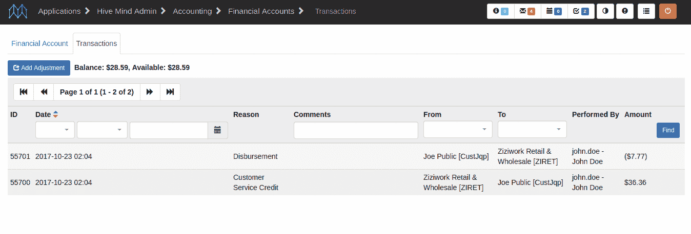

图 8.12：HiveMind 财务账户页面

回到**回调路由**，这是 WebHook（在 Fn 上运行）调用`hivectl`函数（在 OpenFaaS 上运行）中的代码。WebHook 代码创建一个 HTTP 客户端，然后将两个参数`accountId`和`amount`发送给`hivectl`函数：

```
public boolean faasAdjust(String txId, 
                          String accountId, 
                          Double amount) throws Exception {
    val env = System.getenv("FAAS_GATEWAY_SERVICE");
    val faasGatewayService = (env == null? "http://gateway:8080" : env);

    val JSON = MediaType.parse("application/json; charset=utf-8");
    val client = new OkHttpClient();
    val json = new ObjectMapper().writeValueAsString(new HashMap<String,String>(){{
        put("accountId", accountId);
        put("amount", String.valueOf(amount));
    }});
    val body = RequestBody.create(JSON, json);
    val request = new Request.Builder()
            .url(faasGatewayService + "/function/hivectl")
            .post(body)
            .build();
    val response = client.newCall(request).execute();
    System.out.println(response);

    if(response.code() == 200) {
        val str = response.body().string();
        return true;
    }

     throw new Exception(response.toString());
}
```

# 函数作为粘合剂

除了编写一个简单的处理器，本节中的技术是使用函数的最简单形式之一。我们有一个暴露 REST API 的银行后端。所以我们写一个函数作为粘合剂，隐藏后端复杂的接口。在这个示例中，我们使用`Go`作为语言来实现函数。

这个场景是我们有一个 REST API 服务器，并希望将它与另一个类似的服务统一。在本章的示例中，我们有两个不同交互方式的银行后端。第一个是没有 REST 接口的基于 Web 的 UI，另一个是本节中的 REST API：

```
func main() {
  input := os.Args[1]

  // OpenWhisk params are key/value paris
  params := map[string]interface{}{}
  err := json.Unmarshal([]byte(input), params)
  if err != nil {
    fmt.Printf(`{"error":"%s", "input": "%s"}`, err.Error(), string(input))
    os.Exit(-1)
  }

  entry := Entry{
    Account: Account{
      Id: params["accountId"].(string),
    },
    Amount: params["amount"].(float64),
  }

  jsonValue, err := json.Marshal(entry)
  if err != nil {
    fmt.Printf(`{"error":"%s"}`, err.Error())
    os.Exit(-1)
  }

  accountService := os.Getenv("ACCOUNT_SERVICE")
  if accountService == "" {
    accountService = "http://accounting:8080/entries"
  }

  resp, err := http.Post(accountService,
    "application/json",
    bytes.NewBuffer(jsonValue))

  if err != nil {
    fmt.Printf(`{"error":"%s"}`, err.Error())
    os.Exit(-1)
  }

  if resp.StatusCode >= 200 resp.StatusCode <= 299 {
    fmt.Println(`{"success": "ok"}`)
    os.Exit(0)
  }

  fmt.Printf(`{"error": "%s"}`, resp.Status)
}
```

我们使用多阶段构建。在这里的第一阶段使用`go build`命令生成静态二进制文件。然后我们将其复制到第二阶段，`/action/exec`：

```
# Stage 0
FROM golang:1.8.5-alpine3.6

WORKDIR /go/src/app
COPY account_ctl.go .

RUN CGO_ENABLED=0 GOOS=linux GOARCH=amd64 go build -a -tags netgo -ldflags '-extldflags "-static"' -o exec account_ctl.go

# Stage 1
FROM openwhisk/dockerskeleton

ENV FLASK_PROXY_PORT 8080

COPY --from=0 /go/src/app/exec /action/
RUN chmod +x /action/exec

CMD ["/bin/bash", "-c", "cd actionProxy python -u actionproxy.py"]
```

在继续下一步之前，别忘了将镜像推送到 Docker Hub。

然后我们使用`wsk` CLI 命令来定义函数：

```
$ docker build -t chanwit/account_ctl:v1 .
$ docker push chanwit/account_ctl:v1

$ wsk -i action delete account_ctl
$ wsk -i action create --docker=chanwit/account_ctl:v1 account_ctl
```

为了让容器能够与其他 FaaS 平台网关进行通信，我们需要修改 OpenWhisk 调用器的配置，使每个容器都在`parse_net`网络内启动。调用器镜像固定为`3a7dce`，OpenWhisk 网络配置在调用器服务的环境变量部分，`CONFIG_whisk_containerFactory_containerArgs_network`被设置为`parse_net`：

```
invoker:
    image: openwhisk/invoker@sha256:3a7dcee078905b47306f3f06c78eee53372a4a9bf47cdd8eafe0194745a9b8d6
    command: /bin/sh -c "exec /init.sh 0 >> /logs/invoker-local_logs.log 2> 1"
    privileged: true
    pid: "host"
    userns_mode: "host"
    links:
      - db:db.docker
      - kafka:kafka.docker
      - zookeeper:zookeeper.docker
    depends_on:
      - db
      - kafka
    env_file:
      - ./docker-whisk-controller.env # env vars shared
      - ~/tmp/openwhisk/local.env # generated during make setup
    environment:
      COMPONENT_NAME: invoker
      SERVICE_NAME: invoker0
      PORT: 8085

      KAFKA_HOSTS: kafka.docker:9092
      ZOOKEEPER_HOSTS: zookeeper.docker:2181

      DB_PROVIDER: CouchDB
      DB_PROTOCOL: http
      DB_PORT: 5984
      DB_HOST: db.docker
      DB_USERNAME: whisk_admin
      DB_PASSWORD: some_passw0rd

      EDGE_HOST: ${DOCKER_COMPOSE_HOST}
      EDGE_HOST_APIPORT: 443

      CONFIG_whisk_containerFactory_containerArgs_network: parse_net

      WHISK_API_HOST_NAME: ${DOCKER_COMPOSE_HOST}
    volumes:
      - ~/tmp/openwhisk/invoker/logs:/logs
      - /var/run/docker.sock:/var/run/docker.sock
      - /var/lib/docker/containers:/containers
      - /sys/fs/cgroup:/sys/fs/cgroup
    ports:
      - "8085:8085"
```

为了统一它们，我们创建一个函数来包装 REST API，并使这两个接口尽可能相似。

为了启动 REST API 服务器，我们使用`docker run`命令，并将其附加到`parse_net`网络，使用会计别名。端口`18080`仅用于调试目的：

```
docker run -p 18080:8080 -d \
 --network=parse_net \
 --network-alias=accounting \
 --name accounting \
 chanwit/accounting:0.1
```

# 一个流处理器

函数的另一个用例是将其作为数据流的处理器。流可能来自任何类型的源，例如数据总线或事件总线。Kafka、Twitter 或区块链（在我们这个例子中是以太坊）可以是数据流的来源。当某个动作发生时，Ethereum 区块链可能会触发某些智能合约相关的事件。

为了高效地观察这些以数据流形式呈现的事件，我们需要使用一种响应式客户端。RxJava 就是其中之一。幸运的是，我们使用的以太坊客户端`web3j`已经提供了 RxJava 的可观察对象，以便接收来自以太坊区块链的流式数据。

我们将这个组件称为`listener`。下图展示了我们将在事件监听器周围实现的内容：

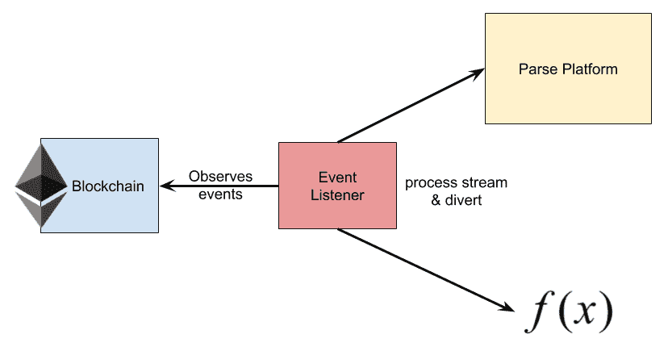

图 8.13：图示说明了事件监听器周围的关系

一个要求是，我们需要将代理（**事件监听器**）作为容器在与区块链相同的网络上运行。我们使用代理将每个交易信息转发到其他端点。在这个示例中，我们有两个端点。第一个是 Parse 中的记录，另一个是 S3 兼容存储 Minio。当交易完成时，我们将文件上传到 Minio。

以下展示了如何使用合约可观察对象来监听区块链事件：

```
public class Main {

    public static void main(String[] args) throws Exception {

        val tsrContract = ContractRegistry.unlock((web3j, tm) -> {
            return TransferStateRepository.load(
                        "0x62d69f6867a0a084c6d313943dc22023bc263691",
                        web3j, tm, ManagedTransaction.GAS_PRICE, Contract.GAS_LIMIT);
        });

        tsrContract.transferCompletedEventObservable(
            DefaultBlockParameterName.LATEST,
            DefaultBlockParameterName.LATEST).subscribe(event -> {

            System.out.printf("Transfer completed: %s\n", event.txId );

        });
    }

}
```

我们为该组件使用一个简单的 Gradle 构建脚本。该项目可以像往常一样使用`gradle installDist`命令构建：

```
plugins {
    id 'io.franzbecker.gradle-lombok' version '1.11'
    id 'java'
    id 'application'
}

mainClassName = "event.listener.Main"

repositories {
    mavenCentral()
    jcenter()
}

dependencies {
    compile 'org.slf4j:slf4j-api:1.7.21'
    compile 'org.web3j:core:3.2.0'

    testCompile 'junit:junit:4.12'
}
```

这是该组件的 Dockerfile：

```
FROM openjdk:8u151-jdk-alpine

RUN mkdir /app
COPY ./build/install/listener/lib/*.jar /app/

ENV BLOCKCHAIN_SERVICE http://blockchain:8545/

WORKDIR /app
CMD ["java", "-cp", "*", "event.listener.Main"]
```

这是 Gradle 构建步骤，`docker build`和`docker push`命令：

```
$ gradle installDist

$ docker build -t chanwit/listener:v1 .
$ docker push chanwit/listener:v1
```

# 跨 FaaS 平台的网络通信

为了使不同平台的所有功能能够相互通信，我们需要设置一个合适的容器网络。本章讨论的演示项目并不是一个简单的 FaaS 示例，而是一个复杂的场景，其中功能允许调用不同 FaaS 平台上的其他功能。

通常，在一些无服务器平台如 Lambda 上，我们有时会假设所有功能都运行在提供商的平面网络上。相比之下，当我们在自己的平台上运行功能时，我们可以自己划分网络，功能网络化将成为一个挑战。然而，由于 Docker 和 Swarm 中的网络模型是平面网络，网络化将相对简单。

我们如何实现这一点？通过以下方式：

1.  我们创建了一个可附加的 Swarm 范围网络

1.  我们启动一个 FaaS 框架，并让其网关连接到该网络

1.  我们还需要告诉框架，必须将该网络附加到每个它创建的容器上

在 OpenFaas 中，允许你创建在特定网络上运行的函数。在 OpenWhisk 中，我们可以通过配置 invoker 来指定这一点。对于 Fn 项目，我们需要额外的 hack。以下是需要修改的内容，以便将函数容器附加到指定网络（`FN_NETWORK`）：

```
var networkingConfig *docker.NetworkingConfig
fnNetwork := os.Getenv("FN_NETWORK")
if fnNetwork != "" {
    log.Debugf("Env FN_NETWORK found: %s. Create container %s with network.", 
               fnNetwork, task.Id())
    networkingConfig = docker.NetworkingConfig{
        EndpointsConfig: map[string]*docker.EndpointConfig{
            fnNetwork: {
                Aliases: []string{task.Id()},
            },
        },
    }
}
container := docker.CreateContainerOptions{
    Name: task.Id(),
    Config: docker.Config{
        Env: envvars,
        Cmd: cmd,
        Memory: int64(task.Memory()),
        MemorySwap: int64(task.Memory()),
        KernelMemory: int64(task.Memory()),
        CPUShares: drv.conf.CPUShares,
        Hostname: drv.hostname,
        Image: task.Image(),
        Volumes: map[string]struct{}{},
        OpenStdin: true,
        AttachStdin: true,
        StdinOnce: true,
    },
    HostConfig: docker.HostConfig{
        LogConfig: docker.LogConfig{
            Type: "none",
        },
    },
    NetworkingConfig: networkingConfig,
    Context: ctx,
}
```

带有函数网络补丁的版本可在 [`github.com/chanwit/fn`](https://github.com/chanwit/fn) 下载。

# 练习

本章涵盖了许多实践和 hack，帮助使演示项目的整个堆栈——一个移动支付系统——能够正常运行。请阅读本章所有部分的内容：

1.  为什么我们需要 hack Fn 来构建定制版本的 Fn 服务器？

1.  跨 FaaS 平台网络的概念是什么？为什么它很重要？

1.  在演示项目中，Ethereum 区块的两个角色是什么？

1.  OpenWhisk 函数的参数数据类型是什么？

1.  我们如何在 Fn 中使用 Java 编码 JSON？

1.  我们如何在 Golang 中编码 JSON？

1.  什么是 Parse 平台？

1.  Parse WebHook 的作用是什么？

1.  什么是 Glue 函数的概念？

1.  我们如何编写函数来封装传统的基于 Web 的应用程序？

# 总结

本章通过展示如何在 FaaS 平台上开发移动支付系统，演示了一个用例。

我们使用 Parse 作为 UI 后端。然后，我们通过 Parse WebHook 机制将 Parse 连接到在 Fn 上运行的银行路由函数。接着我们演示了如何使用函数，相对容易地调用现代基础设施，如区块链。我们模拟了两家银行，展示了函数的用例，一个作为 Glue 的函数，以及一个封装传统系统的函数。然后，我们演示了如何将函数与流代理结合使用，处理数据流。

所有三个 FaaS 平台都已连接在一起，并在同一个 Docker Swarm 集群上运行。将 OpenWhisk 和 OpenFaaS 函数连接在一起相当简单，但在 Fn 的情况下，稍显复杂，因为当前版本的 Fn 不允许你定义容器网络。

下一章将是本书的最后一章。我们将总结函数的概念，并展望 FaaS 世界之外的未来发展。
