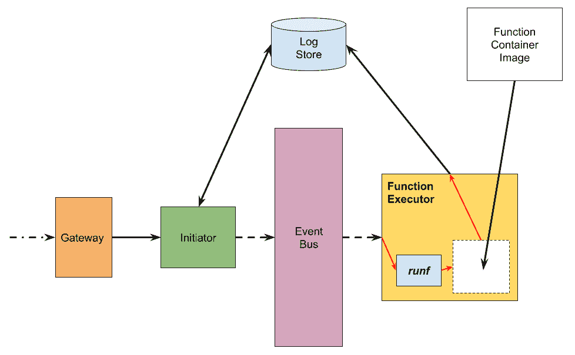
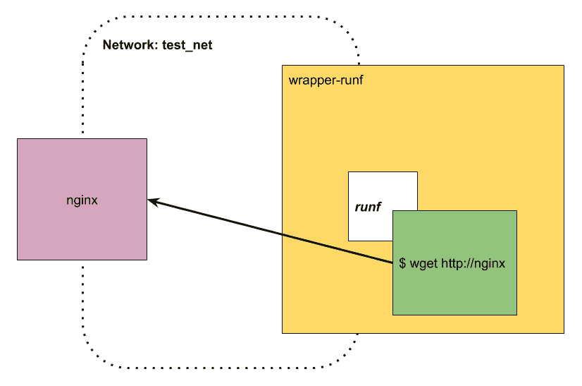
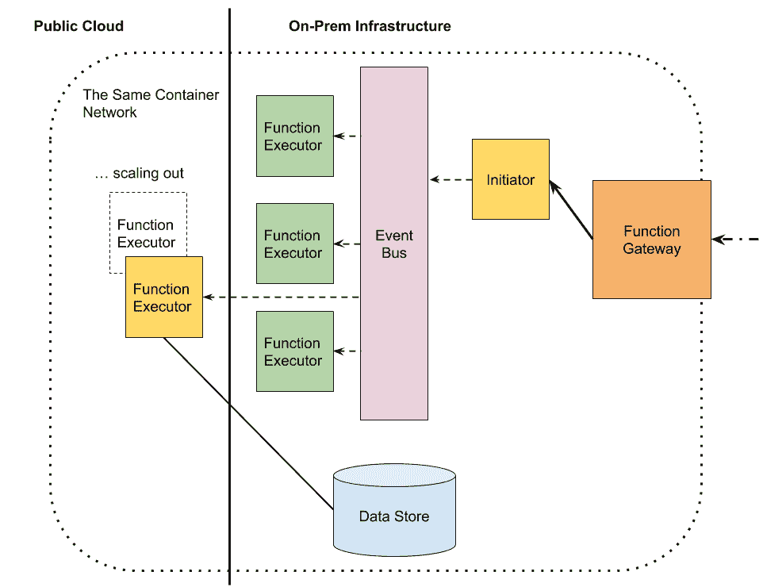
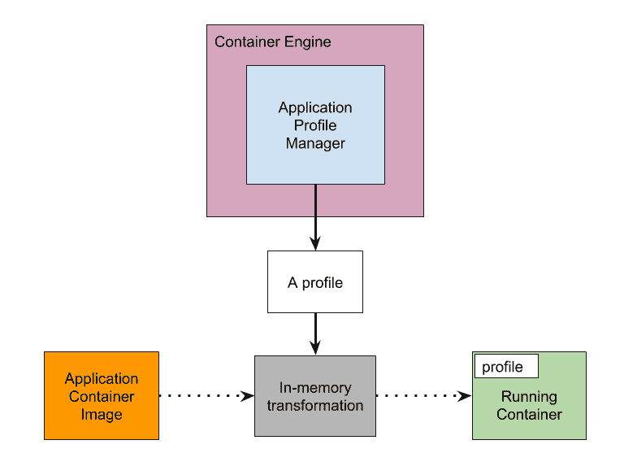

# 无服务器的未来

本章讨论了 FaaS 之外的未来发展。我们将首先讨论一种新型的实验性技术，通过引入 RunF（一种基于 libcontainer 的运行时，旨在调用不可变函数容器）来恢复容器运行时的速度。本章还将继续讨论使用 LinuxKit 为 FaaS 平台准备不可变基础设施的可能性。最后，我们将探讨一种新架构，将本地的 FaaS 架构与公共云上的无服务器架构结合起来。

在讨论这些话题之前，让我们首先总结一下迄今为止学到的内容。

本章将讨论以下主题：

+   FaaS 和 Docker 回顾

+   函数容器的运行时

+   LinuxKit – 为 FaaS 提供不可变基础设施

+   超越无服务器架构

+   声明式容器

# FaaS 和 Docker 回顾

本书介绍了无服务器架构、FaaS 平台以及 Docker 与该技术的相关性。我们共同学习了如何在生产环境中设置 Docker Swarm 集群。

本书讨论了三个知名的 FaaS 平台，分别是*OpenFaaS*、*OpenWhisk* 和 *Fn 项目*。OpenFaaS 使用基于 Swarm 的调度器，而 OpenWhisk 和 Fn 使用自己的调度技术，在普通的 Docker 上运行。

然后，我们在第八章《*将它们整合在一起*》中展示了一个项目，介绍了如何通过在 Docker 集群的同一网络上运行这三个平台，将它们联通在一起。该项目展示了如何调用其他 FaaS 平台的服务。演示了用多种编程语言编写的函数，包括 Java、Go 和 JavaScript（Node.js）。

我们使用 Java 编写了一个简单的函数。对于现代编程模型，我们可以使用 RxJava 库来帮助编写响应式风格的 Java 程序，这非常适合事件驱动编程。

在 JavaScript 中，我们编写了一个基于 Chrome 的脚本进行连接。我们还部署了一个区块链，以展示它如何与 FaaS 计算模型良好配合。

在接下来的章节中，我们将讨论一些高级的、实验性的话题，这些话题深入或超出了当前无服务器架构和 FaaS 的范围。然而，其中一些可能很快会成为主流。

# 函数容器的运行时

容器生态系统中最重要的组件之一是**容器运行时**。在 Docker 的早期，运行时是 LXC，后来它被更改为 Docker 拥有的 libcontainer。libcontainer 后来被捐赠给了 **OCI**（**开放容器倡议**）项目，该项目由 Linux 基金会支持。之后，RunC 项目启动。RunC 是一个围绕 libcontainer 的命令行工具，允许开发者从终端启动容器。开发者可以通过调用 RunC 二进制文件并传递根文件系统和容器规范来启动容器。

RunC 是一个非常稳定的软件。自 Docker 1.12 版本以来就一直与 Docker 一起，并已被数百万用户使用。`docker run` 命令实际上会将其参数发送给另一个守护程序 containerd，后者将这些信息转换为 RunC 的配置文件。

运行 RunC 简化了依赖关系，我们只需一个单一的二进制文件，一个根文件系统和一个配置文件来启动一个容器。

由于 RunC 只是 libcontainer 的一个薄包装，其代码非常直接。如果具备一定的 Go 编程知识，直接使用 libcontainer 相对容易。RunC 的唯一缺点是它被设计和构建用于一般容器运行。在下一节中，我们将介绍 *RunF*，一个专门设计用于高效运行函数容器的最小运行时环境。

# 遇见 RunF

本节介绍了 RunF。它是 RunC 的对应物，专为运行不可变函数容器而设计。RunF 是一个实验性项目，使用 *libcontainer* 实现了一个新的运行时环境，以在只读和无根的环境中运行容器。使用 RunF 启动的容器预期在其他容器内部高效运行。RunF 允许通过将主机上的非 root 用户映射到容器内部的 root 用户 ID 来执行无根容器。

我们如何使用它？以下图表说明了场景。我们有一个 FaaS 平台，**网关**接受传入请求并将其转发给函数**初始化程序**。通过**事件总线**，**函数执行器**然后使用它来调用函数容器，而不是 Docker。通过这种架构，我们可以提高平台的整体性能：



图 9.1：展示了一个以 RunF 为运行时的 FaaS 架构的块图。

无根容器是允许在无 root 用户的情况下运行的容器，例如 AWS Lambda。我们希望有一个不可变的函数版本，具有只读和无根权限，因为无根容器使系统和基础架构更加安全。

然后是网络约束。一个函数不应该意识到任何与网络相关的配置。到目前为止，我们实现的所有当前 FaaS 平台都有这个限制。假设我们需要将一个正在运行的函数附加到某个网络，以使其正确工作，并能够解析其他依赖服务的名称。

在第八章《将它们全部结合起来》中，我们发现使功能容器在平台提供的任何网络下正常工作是很棘手的。*RunF* 旨在通过让功能容器使用外部容器的网络命名空间来解决这个问题。通过这种执行模型，*功能代理* 负责将自己附加到网络，而功能容器也会使用这些网络来访问其他服务。如果功能容器运行在功能代理的容器内部，所有的网络配置都可以被省略。

在性能方面，通过使用像 *RunF* 这样的特殊容器运行时，能够将所有必要的文件系统缓存到每个功能代理内，并使其变为不可变。这样，我们就可以实现与热函数机制类似的最高性能。

现在，让我们来看看实现中的内容，看看它是如何满足所有要求的：

+   不可变

+   无根

+   默认使用主机网络

+   零配置。

我们主要直接使用 libcontainer API。在这里，我们详细解释了 RunF 如何利用 libcontainer 实现功能容器的可变运行时。

程序通过初始化 libcontainer 开始，并使用 `Cgroupfs` 配置，表示 libcontainer 将使用 `Cgroup` 来控制进程的资源：

```
func main() {

  containerId := namesgenerator.GetRandomName(0)

  factory, err := libcontainer.New("/tmp/runf",
    libcontainer.Cgroupfs,
    libcontainer.InitArgs(os.Args[0], "init"))
  if err != nil {
    logrus.Fatal(err)
    return
  }
```

以下代码片段创建了一个配置。`rootfs` 的默认位置是当前目录下的 `./rootfs`。我们将标志 `Readonlyfs` 设置为 `true`，以实现不可变文件系统。`NoNewPrivileges` 设置为 `true`，以防止进程获得任何新特权。`Rootless` 设置为 `true`，表示我们将把非根 UID 和 GID 映射到容器的根 ID。初始化标志后，我们设置进程的能力。以下是能力列表：

+   `CAP_AUDIT_WRITE` 是写入内核审计日志的能力

+   `CAP_KILL` 是进程发送信号的能力

+   `CAP_NET_BIND_SERVICE` 是绑定套接字到特权端口的能力。

```
  defaultMountFlags := unix.MS_NOEXEC | unix.MS_NOSUID | unix.MS_NODEV

  cwd, err := os.Getwd()
  currentUser, err := user.Current()
  uid, err := strconv.Atoi(currentUser.Uid)
  gid, err := strconv.Atoi(currentUser.Gid)
  caps := []string{
    "CAP_AUDIT_WRITE",
    "CAP_KILL",
    "CAP_NET_BIND_SERVICE",
  }

  config := &configs.Config{
    Rootfs:          cwd + "/rootfs",
    Readonlyfs:      true,
    NoNewPrivileges: true,
    Rootless:        true,
    Capabilities: &configs.Capabilities{
      Bounding:    caps,
      Permitted:   caps,
      Inheritable: caps,
      Ambient:     caps,
      Effective:   caps,
    },
```

`Namespaces` 属性是容器运行时最重要的设置之一。在此配置块中，我们将其设置为使用以下命名空间：`NS`、`UTS`（主机名和域名）、`IPC`、`PID` 和 `USER`。用户命名空间 `NSUSER` 是允许以无根模式运行容器的关键设置。我们省略了 `NET` 命名空间。原因是 `runf` 会在另一个容器内部启动一个功能容器，即*功能执行器*。如果没有 `NET` 命名空间的隔离，功能容器将与外部容器共享同一网络命名空间，从而能够访问附加到功能执行器网络的任何服务。

另一个设置是 `Cgroup` 设置。此设置允许对进程的资源进行层次控制。这个设置大多是默认配置：

```
Namespaces: configs.Namespaces([]configs.Namespace{
  {Type: configs.NEWNS},
  {Type: configs.NEWUTS},
  {Type: configs.NEWIPC},
  {Type: configs.NEWPID},
  {Type: configs.NEWUSER},
}),
Cgroups: &configs.Cgroup{
  Name:      "runf",
  Parent:    "system",
  Resources: &configs.Resources{
    MemorySwappiness: nil,
    AllowAllDevices:  nil,
    AllowedDevices:   configs.DefaultAllowedDevices,
  },
},
```

`MaskPaths`和`ReadonlyPaths`设置如下。此设置主要是为了防止运行中的进程对系统所做的更改：

```
MaskPaths: []string{
  "/proc/kcore",
  "/proc/latency_stats",
  "/proc/timer_list",
  "/proc/timer_stats",
  "/proc/sched_debug",
  "/sys/firmware",
  "/proc/scsi",
},
ReadonlyPaths: []string{
  "/proc/asound",
  "/proc/bus",
  "/proc/fs",
  "/proc/irq",
  "/proc/sys",
  "/proc/sysrq-trigger",
},
```

所有设备都设置为自动创建。然后，`Mount`设置定义了一组需要从主机挂载到容器中的文件系统。对于 RunF，它是从函数执行器到函数容器的嵌套挂载：

```
Devices: configs.DefaultAutoCreatedDevices,
Hostname: containerId,
Mounts: []*configs.Mount{
  {
    Source:      "proc",
    Destination: "/proc",
    Device:      "proc",
    Flags:       defaultMountFlags,
  },
  {
    Source:      "tmpfs",
    Destination: "/dev",
    Device:      "tmpfs",
    Flags:       unix.MS_NOSUID | unix.MS_STRICTATIME,
    Data:        "mode=755",
  },
  {
    Device:      "devpts",
    Source:      "devpts",
    Destination: "/dev/pts",
    Flags:       unix.MS_NOSUID | unix.MS_NOEXEC,
    Data:        "newinstance,ptmxmode=0666,mode=0620",
  },
  {
    Device:      "tmpfs",
    Source:      "shm",
    Destination: "/dev/shm",
    Flags:       defaultMountFlags,
    Data:        "mode=1777,size=65536k",
  },
},
```

这是从主机 ID（`HostID`）到容器内部 ID（`ContainerID`）的 UID 和 GID 映射。在以下示例中，我们将当前用户 ID 映射到容器内`root`用户的 ID：

```
    Rlimits: []configs.Rlimit{
      {
        Type: unix.RLIMIT_NOFILE,
        Hard: uint64(1024),
        Soft: uint64(1024),
      },
    },
    UidMappings: []configs.IDMap{
      {
        ContainerID: 0,
        HostID:      uid,
        Size:        1,
      },
    },
    GidMappings: []configs.IDMap{
      {
        ContainerID: 0,
        HostID:      gid,
        Size:        1,
      },
    },
  }
```

我们使用 libcontainer 的工厂方法创建一个带有生成 ID 和我们已设置的`config`的容器：

```
  container, err := factory.Create(containerId, config)
  if err != nil {
    logrus.Fatal(err)
    return
  }
```

然后，我们准备环境变量。它们只是一个*字符串数组*。每个元素是一个*key=value*对，表示我们希望为进程设置的每个变量。我们使用`libcontainer.Process`准备一个要运行的进程。进程的输入、输出和错误会被重定向到默认的标准对等端：

```
  environmentVars := []string{
    "PATH=/usr/local/sbin:/usr/local/bin:/usr/sbin:/usr/bin:/sbin:/bin",
    "HOSTNAME=" + containerId,
    "TERM=xterm",
  }
  process := &libcontainer.Process{
    Args:   os.Args[1:],
    Env:    environmentVars,
    User:   "root",
    Cwd:    "/",
    Stdin:  os.Stdin,
    Stdout: os.Stdout,
    Stderr: os.Stderr,
  }

  err = container.Run(process)
  if err != nil {
    container.Destroy()
    logrus.Fatal(err)
    return
  }

  _, err = process.Wait()
  if err != nil {
    logrus.Fatal(err)
  }

  defer container.Destroy()
}
```

然后我们将准备并构建`runf`二进制文件。这需要*libcontainer*及其他一些工具来构建。我们通常使用`go get`命令来完成。之后，只需使用`go build`命令进行构建：

```
$ go get golang.org/x/sys/unix
$ go get github.com/Sirupsen/logrus
$ go get github.com/docker/docker/pkg/namesgenerator
$ go get github.com/opencontainers/runc/libcontainer

$ go build runf.go
```

为了准备根文件系统，我们使用`undocker.py`和`docker save`命令。`undocker.py`脚本可以从[`github.com/larsks/undocker`](https://github.com/larsks/undocker)下载。

这是将根文件系统准备到`rootfs`目录的命令，来源于`busybox`镜像：

```
$ docker save busybox | ./undocker.py --output rootfs -W -i busybox
```

现在，让我们测试运行一些容器。我们将看到`ls`命令列出容器内的文件：

```
$ ./runf ls
bin dev etc home proc root sys tmp usr var
```

# 在 Docker 网络内

接下来，我们将尝试一些稍微复杂的操作，准备一个小系统，其外观类似于以下图示。场景是我们希望由**runf**启动的容器位于另一个容器**wrapper-runf**（实际上是一个函数执行器）内，连接到同一 Docker 网络上运行的一些网络服务，**test_net**：



图 9.2：在 Docker 网络中使用 RunF 的示例

诀窍是我们将标准 Docker Swarm 模式中的`resolv.conf`放置为`./rootfs/etc/resolv.conf`，使得嵌套容器内的进程能够解析附加 Docker 网络上的所有服务名称。以下是`resolv.conf`的内容：

```
search domain.name
nameserver 127.0.0.11
options ndots:0
```

然后，我们为`wrapper-runf`容器准备一个 Dockerfile：

```
FROM ubuntu:latest

RUN apt-get update && apt-get install -y curl

WORKDIR /root

COPY ./runf /usr/bin/runf
COPY rootfs /root/rootfs
COPY resolv.conf /root/rootfs/etc/resolv.conf
```

我们可以通过`docker build`命令正常构建它：

```
$ docker build -t wrapper-runf .
```

以下代码段是创建一个 Docker 网络的准备，接着将`nginx`连接到该网络，然后在其中运行一个带有`/bin/bash`的`wrapper-runf`容器。

最后，我们启动一个通过`runf`连接到`nginx`的嵌套容器：

```
$ docker network create -d overlay --attachable test_net

$ docker run -d \
 --network=test_net \
 --network-alias=nginx \
 nginx

$ docker run --rm -it \
 --network=test_net \
 --privileged \
 -v /sys/fs/cgroup:/sys/fs/cgroup \
 wrapper-runf /bin/bash

/ # runf wget http://nginx
```

# 接下来是什么？

使用 `runf`，它可能是朝着另一个步骤——使用特殊运行时的快速不可变功能迈进的方式。您可以尝试实现一个代理容器，包装在 `runf` 周围，并使其在实际平台中运行函数。这被留作一个（稍微高级一点的）练习。

# LinuxKit – FaaS 的不可变基础设施

LinuxKit 是一套用于准备不可变基础设施工具的集合。它旨在将容器组合成一个可供使用的操作系统。当然，LinuxKit 生成的操作系统是用于运行容器的。为了构建一个不可变且可扩展的 FaaS 平台基础设施，LinuxKit 是最好的选择之一。

以下是一个 LinuxKit YAML 文件示例，用于构建一个用于 Docker 的不可变操作系统。内核块表示该操作系统将使用 Linux 内核 4.14.23 启动。`boot` 命令和 `cmdline` 表示内核将在四个不同的 TTY 上启动控制台：

```
kernel:
  image: linuxkit/kernel:4.14.23
  cmdline: "console=tty0 console=ttyS0 console=ttyAMA0 console=ttysclp0"
```

`init` 块中声明的接下来的四个容器是将直接解压到文件系统中的基本程序。所有 `init` 级别的程序包括 `runc` 和 containerd。此外，CA 证书将直接安装到文件系统中，以便在接下来的 `onboot` 块声明的程序继续运行之前：

```
init:
  - linuxkit/init:b212cfeb4bb6330e0a7547d8010fe2e8489b677a
  - linuxkit/runc:7c39a68490a12cde830e1922f171c451fb08e731
  - linuxkit/containerd:37e397ebfc6bd5d8e18695b121166ffd0cbfd9f0
  - linuxkit/ca-certificates:v0.2
```

`onboot` 块和 `mountie` 命令将自动将第一个可用分区挂载到 `/var/lib/docker`。请注意，LinuxKit 仅允许您挂载到 `/var` 目录下的目录：

```
onboot:
  - name: sysctl
    image: linuxkit/sysctl:v0.2
  - name: sysfs
    image: linuxkit/sysfs:v0.2
  - name: format
    image: linuxkit/format:v0.2
  - name: mount
    image: linuxkit/mount:v0.2
    command: ["/usr/bin/mountie", "/var/lib/docker"]
```

`services` 块声明了系统容器，它们作为长期运行的服务。这些服务都是由容器运行和维护的，由 `init` 块中的 `init` 进程启动。

在此块中声明的服务可以按任意顺序启动。

在以下示例中，`docker` 是其中一个服务。使用的 Docker 镜像 `docker:17.09.0-ce-dind` 用于运行这个 Docker 服务。该服务运行在主机网络上。这与 RancherOS 的概念基本相同。由 `docker` 服务运行的 `dockerd` 实例是用户级的容器管理系统，而 `init` 块中的 containerd 是系统级的容器管理系统。其他系统容器包括 `rngd`——随机数生成守护进程，`dhcpd`——DHCP 服务，`ntpd`——用于同步机器时钟的 OpenNTPD 守护进程等：

```
services:
  - name: getty
    image: linuxkit/getty:v0.2
    env:
     - INSECURE=true
  - name: rngd
    image: linuxkit/rngd:v0.2
  - name: dhcpcd
    image: linuxkit/dhcpcd:v0.2
  - name: ntpd
    image: linuxkit/openntpd:v0.2
  - name: docker
    image: docker:17.09.0-ce-dind
    capabilities:
     - all
    net: host
    mounts:
     - type: cgroup
       options: ["rw","nosuid","noexec","nodev","relatime"]
    binds:
     - /etc/resolv.conf:/etc/resolv.conf
     - /var/lib/docker:/var/lib/docker
     - /lib/modules:/lib/modules
     - /etc/docker/daemon.json:/etc/docker/daemon.json
    command: ["/usr/local/bin/docker-init", "/usr/local/bin/dockerd"]
```

文件块用于声明我们希望在不可变文件系统中拥有的*文件*或*目录*。在以下示例中，我们声明了 `/var/lib/docker` 并创建了 Docker 的守护进程配置 `/etc/docker/daemon.json`，其中包含内容 `{"debug": true}`。这些文件将在镜像构建阶段创建：

```
files:
  - path: var/lib/docker
    directory: true
  - path: etc/docker/daemon.json
    contents: '{"debug": true}'
trust:
  org:
    - linuxkit
    - library
```

我们有另一个`files`块的例子。这是将公钥放入文件系统镜像的标准方法。`mode`属性用于设置复制文件到最终镜像时的文件模式。在这个例子中，我们要求公钥文件的模式为`0600`。通过这个配置和正在运行的`sshd`服务，我们将被允许远程 SSH 进入机器：

```
files:
  - path: root/.ssh/authorized_keys
    source: ~/.ssh/id_rsa.pub
    mode: "0600"
    optional: true
```

这是构建 LinuxKit 命令行的步骤：

```
$ go get -u github.com/linuxkit/linuxkit/src/cmd/linuxkit
```

如果我们已经使用 GVM 安装了 Go 编程语言，那么二进制文件将可用来运行。

我们将构建一个 Docker 操作系统，详见[`github.com/linuxkit/linuxkit/blob/master/examples/docker.yml`](https://github.com/linuxkit/linuxkit/blob/master/examples/docker.yml)：

```
$ linuxkit build docker.yml 
Extract kernel image: linuxkit/kernel:4.14.26
Pull image: docker.io/linuxkit/kernel:4.14.26@sha256:9368a ...
...
Add files:
 var/lib/docker
 etc/docker/daemon.json
Create outputs:
 docker-kernel docker-initrd.img docker-cmdline
```

# 超越无服务器

混合无服务器将是一种将混合云与无服务器部署模型连接的部署模式。它已经由 IT 供应商开始提供硬件租赁服务，以私有云的形式部署到客户的组织中，并按需计费。

当无服务器和 FaaS 计算平台部署在这种混合基础设施之上时，它们就变成了**混合无服务器**。这可能是下一代计算平台，允许你将敏感数据存储在组织内部，运行一些重要的 FaaS 功能在本地系统中，同时利用按请求付费的额外计算资源。如果客户的组织不需要维护或管理任何硬件服务器，它将符合无服务器的定义。幸运的是，当将这种模式与我们在本书中讨论的内容混合时，使用 Docker 作为基础设施仍然适用于这种架构。Docker 仍然是平衡自主维护基础设施和让无服务器平台为我们做剩余工作的良好选择。

在下图中，整体系统展示了一种混合架构。如果仅在组织内部使用 FaaS 平台，请求将首先发送到本地基础设施。当负载增大时，函数执行实例会横向扩展，最终爆发到公共云基础设施。然而，数据存储通常放置在组织内部。因此，外部函数执行器必须能够访问这些数据，就像它们在本地运行一样：



图 9.3：FaaS 的混合架构

# 声明式容器

声明式容器可以被看作是一种介于普通容器和运行在 FaaS 上的容器之间的技术。让我们看一下下面的假想 Dockerfile：

```
FROM openjdk:8

COPY app.jar /app/app.jar

CMD ["/opt/jdk/bin/java", "-Xmx2G", "-jar", "/app/app.jar"]
```

我们在这里看到了什么？第一次阅读时，它看起来像是一个普通的 Dockerfile。没错，就是它。但这并不是一种声明式的方式来定义应用容器。为什么？

我们已经知道这是一个 Java 应用程序在为我们做一些工作。但它硬编码了一些重要且脆弱的配置，例如，当 `openjdk:8` 锁定应用程序只使用那个实现时，而 `-Xmx2G` 限制了应用程序的内存使用。

目前所有的 FaaS 平台都以相同的方式使用容器。它们将一些特定的配置绑定到函数容器中，但实际上人们需要的是一种非常中立且可移植的方式来部署函数。

那么，声明式容器是什么样的？

它看起来像这样：

```
FROM scratch

COPY app.jar /app/app.jar

CMD ["java", "-jar", "/app/app.jar"]
```

你可能会认为目前无法在任何运行时环境中运行这个容器。答案是你是对的。但我仍然认为应用程序应该以相同的方式声明。我们应该尽可能地将所有脆弱的配置从 `Dockerfile` 中移除。然后，我们应该让一个新的实体，可能是在容器引擎内部，来管理应用程序周围的环境。

例如，拦截容器创建过程并计算容器允许的内存限制（例如通过 `docker run -m`）并将该值传递给 `java` 命令行以在应用程序层面限制内存，这相对容易。负责这类工作的容器引擎内部实体被称为 **应用配置文件管理器**，如下图所示：



图 9.4：带有应用配置文件管理器的容器引擎

像这样的交叉概念并不新鲜。我们已经有一个类似的概念应用于 Docker。你猜怎么着？那就是安全性问题。Docker 已经对每个运行中的容器应用了默认的 AppArmor 配置文件，并启用了 AppArmor 子系统。这就是安全性问题。这是在更应用特定的层面上的关注，那么为什么我们不能有一个类似的概念来帮助让我们的生活更轻松呢？

在这个概念下，容器镜像将变成声明式容器，因为没有为它们硬编码任何特定的环境或配置。而 **应用配置文件管理器** 负责选择性地为容器应用合适的配置文件，并使其正常工作。

声明式容器的实际好处是什么？这里有一个我们之前讨论的 Java 应用的具体解释。

在 Java 的世界中，应用架构已经被设计成解耦应用程序和运行时环境。由于 JVM 的强大规范，运行应用程序的 JVM 总是可以被交换和替换。例如，如果我们开始使用 OpenJDK 运行应用程序，并且对其性能不满意，我们可以安全地将 JVM 更换为 Zulu JVM 或 IBM J9。

通过声明式容器的方法，Java 运行时可以在不重新构建 Docker 镜像的情况下动态切换。这还允许你对运行中的系统应用 JVM 热修复。

我们可以从[`github.com/joconen/engine`](http://github.com/joconen/engine)下载带有此声明式特性的修改版 Docker，以便为 Java 使用。

# 练习

现在是时候回顾本章的所有概念了：

1.  你认为在无服务器时代之后，未来会有什么发展？

1.  你可能在想的下一代计算是什么？

1.  libcontainer 的特性是什么，允许无根执行？

1.  Linux 提供了哪些命名空间？

1.  解释为什么 RunF 在其他容器内部运行时能够访问网络服务。

1.  使用 LinuxKit 准备基础设施有什么好处？

1.  容器的声明式方法是什么？它如何应用到 Java 以外的其他应用平台？

1.  当我们希望访问来自组织外部的服务时，如何设计一个混合的无服务器架构？

# 总结

本章通过讨论我们可以使用什么来推动 FaaS 的发展，结束了这本书。我们回顾了在 Docker 和其上运行的三个主要 FaaS 平台上的经历。

Docker 是一个很好的基础设施，因为考虑到这三个 FaaS 平台实际上都在使用 Docker 的直接特性，而不是仅仅依赖它的调度器功能。为什么？也许是因为 FaaS 计算模型适合这种简单的基础设施，而不是复杂的基础设施。

如果我们可以简单地执行`docker run`，然后容器被转化为一个 FaaS 功能，在集群的某个地方提供它的功能呢？功能包装器、动作代理或功能监视器可以注入到一个简单的容器中，通过标准 I/O 处理输入和输出，并将其转变为一个在线功能。然后，一种神奇的基础设施将为我们处理一切。我们正逐步迈向这一现实。

# 参考文献

1.  Apache Foundation. *Apache OpenWhisk*。可在：[`openwhisk.apache.org/.`](https://openwhisk.apache.org/)（访问日期：2018 年 3 月 28 日）。

1.  Microsoft Corp. Azure Functions—无服务器架构 | Microsoft Azure。可在：[`azure.microsoft.com/en-us/services/functions/.`](https://azure.microsoft.com/en-us/services/functions/)（访问日期：2018 年 3 月 28 日）。

1.  Burns, B., Grant, B., Oppenheimer, D., Brewer, E. & Wilkes, J. Borg, Omega, 和 Kubernetes。Queue 14, 10:70–10:93（2016）。

1.  Schickling, J., Lüthy, M., Suchanek, T. 等人 *chromeless: 简化的 Chrome 自动化*。（Graphcool，2018）。

1.  Google Inc. 概念 | 云功能。*Google Cloud* 可在：[`cloud.google.com/functions/docs/concepts.`](https://cloud.google.com/functions/docs/concepts)（访问日期：2018 年 3 月 28 日）。

1.  Crosby, M., Day, S., Laventure, K.-M., McGowan, D. 等人 *containerd: 一个开放且可靠的容器运行时*。（containerd，2018）。

1.  Docker Inc. Docker。（2018）。可在：[`www.docker.com/.`](https://www.docker.com/.)（访问日期：2018 年 3 月 28 日）。

1.  Smith, R. *Docker 调度*。（Packt Publishing Ltd，2017）。

1.  Merkel, D. Docker：轻量级 Linux 容器，确保开发和部署的一致性。*Linux J.* **2014 年**，（2014 年）。

1.  Go 社区。文档 - Go 编程语言。可在以下链接查看：[`golang.org/doc/.`](https://golang.org/doc/.) （访问日期：2018 年 3 月 30 日）。

1.  The Linux Foundation. Envoy Proxy - 首页。可在以下链接查看：[`www.envoyproxy.io/.`](https://www.envoyproxy.io/.) （访问日期：2018 年 4 月 1 日）。

1.  以太坊基金会。以太坊项目。可在以下链接查看：[`www.ethereum.org/.`](https://www.ethereum.org/.) （访问日期：2018 年 3 月 30 日）。

1.  Avram, A. FaaS、PaaS 和无服务器架构的好处。*从‘InfoQ’检索* [`www.infoq.com/news/2016/06/faasserverless-architecture`](https://www.infoq.com/news/2016/06/faasserverless-architecture) 于**2016 年 6 月 28 日**检索。

1.  Oracle Inc. Fn 项目 - 容器原生的无服务器框架。可在以下链接查看：[`fnproject.io/.`](https://fnproject.io/.) （访问日期：2018 年 3 月 28 日）。

1.  Arimura, C., Reeder, T. & 等人。*Fn：容器原生、云无关的无服务器平台。*（Oracle 公司，2018 年）。

1.  Google Inc. Google Cloud Functions 文档 | Cloud Functions. *Google Cloud* 可在以下链接查看：[`cloud.google.com/functions/docs/.`](https://cloud.google.com/functions/docs/.) （访问日期：2018 年 3 月 28 日）。Kaewkasi, C. & Chuenmuneewong, K. 使用蚁群优化改进 Docker 容器调度。在 *知识与智能技术（KST），2017 年第九届国际会议* 254–259 （IEEE，2017 年）。

1.  Apache Foundation. incubator-openwhisk：*Apache OpenWhisk 是一个无服务器的基于事件的编程服务，也是一个 Apache 孵化项目。*（Apache 软件基金会，2018 年）。

1.  Cormack, J. & 等人。linuxkit：*用于构建安全、便携和精简容器操作系统的工具包。*（LinuxKit，2018 年）。

1.  Janakiraman, B. Martin Fowler 的 Bliki：无服务器。*martinfowler.com*（2016 年）。可在以下链接查看：[`martinfowler.com/bliki/Serverless.html.`](https://martinfowler.com/bliki/Serverless.html.) （访问日期：2018 年 3 月 28 日）。

1.  Sharma, S. *使用 Java 9 精通微服务。*（Packt Publishing Ltd，2017 年）。

1.  Moby Community, The. Moby. *GitHub* 可在以下链接查看：[`github.com/moby.`](https://github.com/moby.) （访问日期：2018 年 3 月 30 日）。

1.  Moby Community, The. moby：*Moby 项目* - 一个容器生态系统的协作项目，用于组装基于容器的系统。（Moby，2018 年）。

1.  Jones, D. E. & 等人。Moqui 生态系统。可在以下链接查看：[`www.moqui.org/.`](https://www.moqui.org/.) （访问日期：2018 年 3 月 30 日）。

1.  Soppelsa, F. & Kaewkasi, C. *使用 Swarm 实现原生 Docker 集群。*（Packt Publishing - 电子书帐户，2017 年）。

1.  Marmol, V., Jnagal, R. & Hockin, T. 容器和容器集群中的网络。*netdev 0.1 会议论文集，2015 年 2 月*（2015 年）。

1.  Ellis, A. *OpenFaaS - 为 Docker 和 Kubernetes 简化的无服务器函数。*（OpenFaaS，2018 年）。

1.  亚马逊网络服务公司（AWS）。通过无服务器架构优化企业经济学。（2017 年）。

1.  Parse Community, The。Parse + 开源。*Parse 开源平台* 可访问：[`parseplatform.org/.`](http://parseplatform.org/.)（访问日期：2018 年 3 月 30 日）。

1.  Vilmart, F. 等人。parse-server：*兼容 Parse 的 API 服务器模块，适用于 Node/Express*。（Parse，2018 年）。

1.  Linux 基金会。*runc：根据 OCI 规范生成和运行容器的 CLI 工具*。（开放容器倡议，2018 年）。

1.  Christensen, B., Karnok, D. 等人。*RxJava – JVM 的反应式扩展 – 用于在 Java 虚拟机上使用可观察序列来编写异步和基于事件的程序的库*。（ReactiveX，2018 年）。

1.  Roberts, M. 无服务器架构。*martinfowler.com*（2016 年）。可访问：[`martinfowler.com/articles/serverless.html.`](https://martinfowler.com/articles/serverless.html.)（访问日期：2018 年 3 月 28 日）。

1.  Baldini, I. 等人。无服务器计算：当前趋势与开放问题。见*云计算研究进展*，1-20 页（Springer，2017 年）。

1.  GOTO Conferences。*无服务器：软件架构的未来——由 Peter Sbarski 讲述。*（2017 年）。

1.  Fox, G. C., Ishakian, V., Muthusamy, V. & Slominski, A. 无服务器计算与函数即服务（FaaS）在行业与研究中的现状。*arXiv 预印本 arXiv:1708.08028*（2017 年）。

1.  Docker Inc. Swarm 模式概述。*Docker 文档（2018）*。可访问：[`docs.docker.com/engine/swarm/.`](https://docs.docker.com/engine/swarm/.)（访问日期：2018 年 3 月 28 日）。

1.  Kaewkasi, C. 等人。*Docker Swarm 2000 协作项目。*（SwarmZilla 协作项目，2016 年）。

1.  Containous。Træfik。可访问：[`traefik.io/.`](https://traefik.io/.)（访问日期：2018 年 4 月 1 日）。

1.  Lubin, J. 等人。Truffle Suite - 你的以太坊瑞士军刀。*Truffle Suite* 可访问：[`truffleframework.com.`](http://truffleframework.com./)（访问日期：2018 年 3 月 30 日）。

1.  Weaveworks Inc. Weave Net：跨环境的网络容器 | Weaveworks。可访问：[`www.weave.works/oss/net/.`](https://www.weave.works/oss/net/.)（访问日期：2018 年 3 月 30 日）。
