# 第六章 扩展你的基础设施

在第二章，*介绍第一方工具*中，我们介绍了 Docker 提供的用于扩展核心 Docker 引擎功能的工具。在本章中，我们将介绍一些第三方工具，这些工具扩展了管理 Docker 配置、构建和启动容器的方式。我们将讨论的工具如下：

+   **Puppet**: [`puppetlabs.com/`](http://puppetlabs.com/)

+   **Ansible**: [`www.ansible.com/docker/`](http://www.ansible.com/docker/)

+   **Vagrant**: [`docs.vagrantup.com/v2/docker/`](https://docs.vagrantup.com/v2/docker/)

+   **Packer**: [`www.packer.io/docs/builders/docker.html`](https://www.packer.io/docs/builders/docker.html)

+   **Jenkins**: [`jenkins-ci.org/content/jenkins-and-docker/`](https://jenkins-ci.org/content/jenkins-and-docker/)

对于每个工具，我们将讨论如何安装、配置和使用它们与 Docker 一起使用。在讨论如何使用这些工具之前，让我们先讨论一下为什么我们会想要使用它们。

# 为什么要使用这些工具？

到目前为止，我们一直在关注那些使用主 Docker 客户端或使用 Docker 和其他第三方提供的工具来支持主 Docker 客户端的工具。

很长一段时间，这些工具所拥有的功能在 Docker 支持产品中并不存在。例如，如果你想启动一个 Docker 主机，你不能仅仅使用 Docker Machine，而是必须使用像 Vagrant 这样的工具来启动虚拟机（本地或在云中），然后使用 bash 脚本、Puppet 或 Ansible 来安装 Docker。

一旦你启动了 Docker 主机，你就可以使用这些工具将容器放置在主机上，因为当时还没有 Docker Swarm 或 Docker Compose（记住，Docker Compose 最初是一个名为 Fig 的第三方工具）。

所以，虽然 Docker 慢慢发布了他们自己的工具，但一些第三方选项实际上更为成熟，并且有一个相当活跃的社区支持它们。

让我们从 Puppet 开始。

# Puppetize all the things

很久以前，在以下的*把所有东西容器化*迷因开始频繁出现在人们的演示文稿中之前：

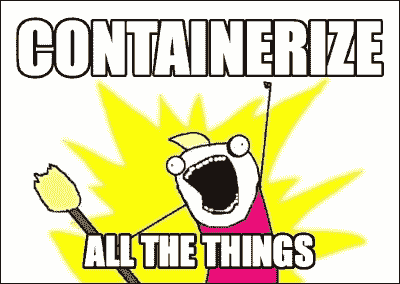

人们也在谈论关于 Puppet 的同样问题。那么，Puppet 是什么？为什么你要把它应用于所有事物？

Puppet Labs（Puppet 的开发者）将 Puppet 描述为：

> *“使用 Puppet，你可以定义 IT 基础设施的状态，Puppet 会自动强制执行所需的状态。Puppet 自动化了软件交付过程的每一步，从物理和虚拟机器的配置到编排和报告；从早期的代码开发到测试、生产发布和更新。”*

在 Puppet 等工具之前，作为系统管理员的工作有时会变得相当繁琐：如果你没有在处理问题，就得自己编写脚本来引导已经建好的服务器，或者更糟糕的是，你需要从内部 Wiki 中复制粘贴命令来安装和配置你的软件堆栈。

服务器很快就会与最初的安装配置脱节，当它们出现故障时（所有服务器最终都会故障），事情可能会变得非常复杂、棘手、可怕、糟糕，甚至是所有这些情况迅速发生。

这就是 Puppet 发挥作用的地方；你定义所需的服务器配置，Puppet 为你完成繁重的工作，确保你的配置不仅被应用，而且还会被持续维护。

例如，如果我有几个服务器位于负载均衡器后面，提供我的 PHP 网站服务，那么确保这些服务器配置一致非常重要，这意味着它们都应该具备以下内容：

+   相同的 NGINX 或 Apache 配置

+   相同版本的 PHP 以及相同的配置

+   安装相同版本的 PHP 模块

在 Puppet 之前，我必须确保不仅保留一个用于初始安装的脚本，而且还必须小心手动地将相同的配置更改应用到所有服务器，或者编写一个脚本来同步集群中的更改。

我还必须确保任何有权访问服务器的人都遵循我制定的流程和操作程序，以便在我的负载均衡 Web 服务器之间保持一致性。

如果没有这些，我就会开始出现配置漂移，或者更糟的是，每 x 次请求中，可能有一次是从运行着与其他服务器不同的代码库/配置的服务器上提供的。

使用 Puppet，如果我需要运行最新版本的 PHP 5.6，因为我的应用程序在 PHP 7 下无法正常工作，那么我可以使用以下定义来确保满足我的需求：

```
package { 'php' :
  ensure => '5.6',
}
```

这将确保 `php` 包被安装，并且版本保持在 5.6，我可以将这个单一配置应用到我的所有 Web 服务器上。

那么，这与 Docker 有什么关系呢？

## Docker 和 Puppet

在 Docker Machine、Docker Compose 和 Docker Swarm 之前，我使用 Puppet 来引导和管理我的 Docker 主机和容器。让我们来看看 Gareth Rushgrove 编写的优秀 Docker Puppet 模块。

首先，我们需要一个虚拟机来工作。在前面的章节中，我们一直在使用 Docker Machine 启动虚拟机，以便运行我们的容器。

然而，正如我们希望 Puppet 管理 Docker 的安装以及我们将使用 Vagrant 启动本地虚拟机的容器一样，令人困惑的是，我们稍后将在本章中也提到 Vagrant，因此在这里我们不做过多详细讲解。

首先，你需要确保已经安装了 Vagrant，你可以从 [`www.vagrantup.com/`](https://www.vagrantup.com/) 获取最新版本，并且可以在 [`www.vagrantup.com/docs/getting-started/`](https://www.vagrantup.com/docs/getting-started/) 找到安装指南。

一旦安装了 Vagrant，你可以通过运行以下命令，使用 VirtualBox 启动一个 Ubuntu 14.04 虚拟服务器：

```
mkdir  ubuntu && cd ubuntu/
vagrant init ubuntu/trusty64; vagrant up --provider VirtualBox

```

这将下载并启动虚拟服务器，将所有内容存储在 `ubuntu` 文件夹中。它还会使用 `/vagrant` 路径将 `ubuntu` 文件夹挂载为文件系统共享：

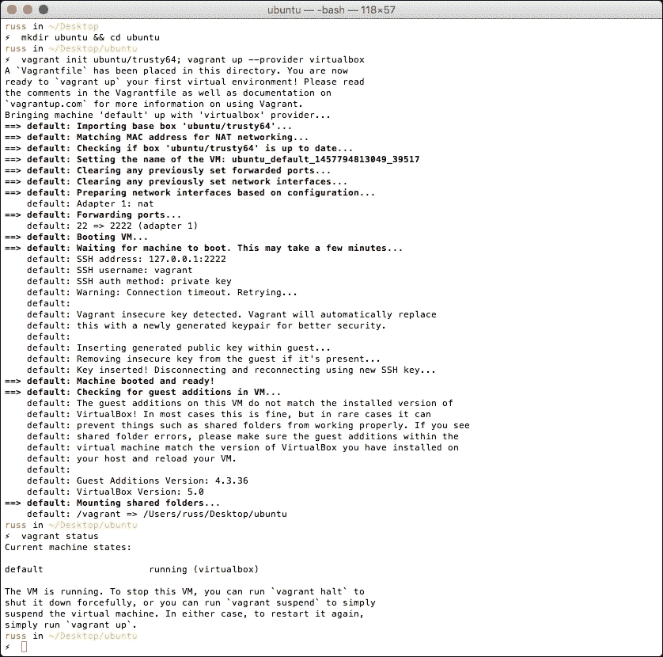

现在我们已经让虚拟服务器启动并运行，让我们连接到它并安装 Puppet 代理：

```
vagrant ssh
sudo su -
curl -fsS https://raw.githubusercontent.com/russmckendrick/puppet-install/master/ubuntu | bash

```

你应该看到类似于以下的终端会话：

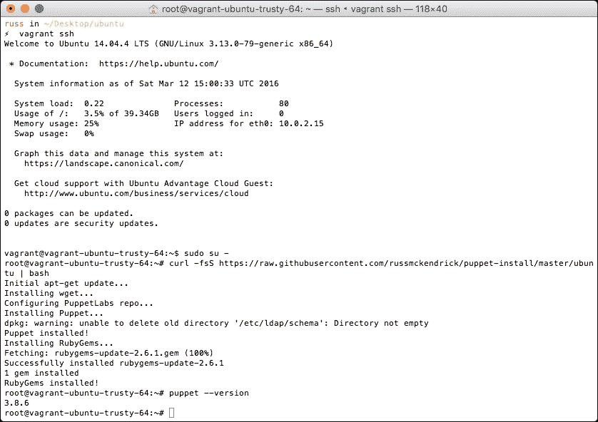

现在我们已经安装了 Puppet 代理，最后一步是从 Puppet Forge 安装 Docker 模块：

```
puppet module install garethr-docker

```

你可能会看到以下终端会话中的警告信息；不必担心这些，它们只是为了告知你即将进行的 Puppet 更改：

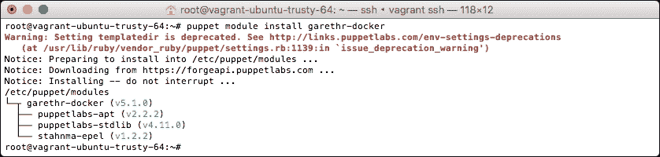

此时，值得指出的是，我们还没有实际安装 Docker，所以现在通过运行我们的第一个 Puppet 清单来安装它。在你的本地机器上，在 `ubuntu` 文件夹中创建一个名为 `docker.pp` 的文件，文件内容应如下所示：

```
include 'docker'

docker::image { 'russmckendrick/base': }

docker::run { 'helloworld':
  image   => 'russmckendrick/base',
  command => '/bin/sh -c "while true; do echo hello world; sleep 1; done"',
}
```

当我们使用 `puppet apply` 运行这个清单时，Puppet 会知道我们需要安装 Docker，才能下载 `russmckendrick/base` 镜像并启动 `helloworld` 容器。

回到我们的虚拟机，运行以下命令应用清单：

```
puppet apply /vagrant/docker.pp

```

你会看到命令输出大量内容，如以下截图所示：

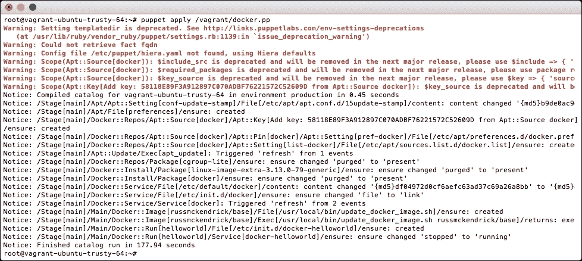

首先发生的事情是 Puppet 会编译一个清单，这本质上是一个任务清单，列出了它需要完成的所有任务，以便应用我们在清单文件中定义的配置。然后，Puppet 会执行这些任务。你应该能看到 Puppet：

+   添加官方 Docker APT 仓库

+   执行 `apt` 更新以初始化新仓库

+   安装 Docker 及其依赖

+   下载 `russmckendrick/base` 镜像

+   启动 `helloworld` 容器

让我们通过确认 Docker 版本、查看下载的镜像、检查正在运行的容器，最后连接到 `helloworld` 容器来检查是否成功：

```
docker --version
docker images
docker ps
docker attach helloworld

```

要从容器中分离，按下键盘上的 *Ctrl* + *C*。这不仅会将提示符返回到虚拟机，还会停止 `helloworld` 容器：

```
docker ps -a

```

你可以看到我在运行命令时获得的输出，如以下终端会话所示：

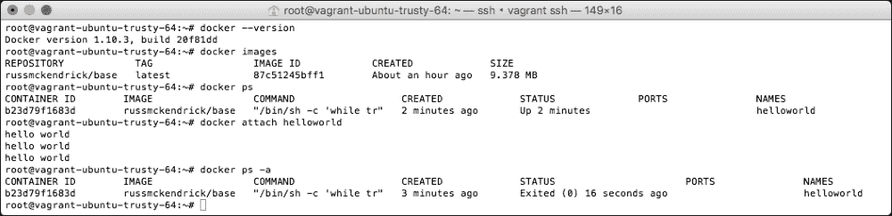

那么如果我们再次应用这个清单会发生什么呢？让我们通过第二次运行 `puppet apply /vagrant/docker.pp` 来看看。

这次你应该看到的输出会少很多，实际上，除了警告信息，你应该看到的唯一输出是确认`helloworld`容器已经开始备份：

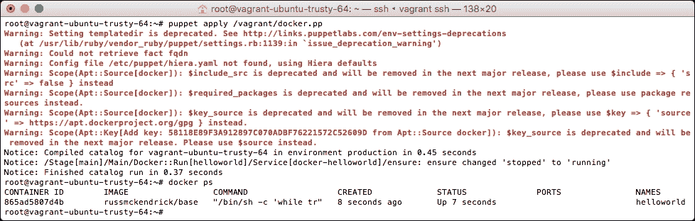

现在我们已经了解了如何启动一些基本的东西，接下来让我们部署 WordPress 安装。首先，默认情况下，我们的虚拟机配置相对简单，因此让我们先移除虚拟机并启动一个更复杂的配置。

要移除虚拟机，请在终端中输入 exit，直到你返回到本地 PC；到达后，输入以下命令：

```
vagrant destroy

```

一旦你按下 Enter，系统会提示 *你确定要销毁 'default' 虚拟机吗？*，回答 yes，虚拟机将被关闭并移除。

接下来，替换 `ubuntu` 文件夹中名为 `Vagrantfile` 的文件的全部内容：

```
# -*- mode: ruby -*-
# vi: set ft=ruby :

VAGRANTFILE_API_VERSION = "2"

Vagrant.configure(VAGRANTFILE_API_VERSION) do |config|
    config.vm.box = "ubuntu/trusty64"
    config.vm.network "private_network", ip: "192.168.33.10"
    HOSTNAME = 'docker'
    DOMAIN   = 'media-glass.es'
    Vagrant.require_version '>= 1.7.0'
    config.ssh.insert_key = false

  config.vm.host_name = HOSTNAME + '.' + DOMAIN

  config.vm.provider "VirtualBox" do |v|
    v.memory = 2024
    v.cpus = 2
  end

  config.vm.provider "vmware_fusion" do |v|
    v.vmx["memsize"] = "2024"
    v.vmx["numvcpus"] = "2"
  end

$script = <<SCRIPT
sudo sh -c 'curl -fsS https://raw.githubusercontent.com/russmckendrick/puppet-install/master/ubuntu | bash'
sudo puppet module install garethr-docker
SCRIPT

config.vm.provision "shell",
    inline: $script
end
```

你还可以在本书的 GitHub 仓库中找到该文件的副本，仓库地址是：[`github.com/russmckendrick/extending-docker/blob/master/chapter06/puppet-docker/Vagrantfile`](https://github.com/russmckendrick/extending-docker/blob/master/chapter06/puppet-docker/Vagrantfile)。

一旦 `Vagrantfile` 配置好，重新运行 `vagrant up`，虚拟机将会启动。

这台虚拟机和我们之前启动的虚拟机的不同之处在于，它的 IP 地址是`192.168.33.10`，仅能从本地 PC 访问。同时，`Vagrantfile`还会运行安装 Puppet 和 Docker Puppet 模块的命令。

在虚拟机启动时，将以下 Puppet 清单文件放入你的 `ubuntu` 文件夹，并命名为 `wordpress.pp`：

```
include 'docker'

docker::image { 'wordpress': }
docker::image { 'mysql': }

docker::run { 'wordpress':
  image           => 'wordpress',
  ports           => ['80:80'],
  links           => ['mysql:mysql'],
}

docker::run { 'mysql':
  image           => 'mysql',
  env             => ['MYSQL_ROOT_PASSWORD=password', 'FOO2=BAR2'],
}
```

正如你所见，格式本身类似于我们在第二章，*介绍第一方工具*中用于启动 WordPress 安装的 Docker Compose 文件。虚拟机启动后，连接到它，并运行以下命令以应用 `wordpress.pp` 清单：

```
vagrant ssh
sudo puppet apply /vagrant/wordpress.pp

```

如前所述，你将会看到相当多的输出：

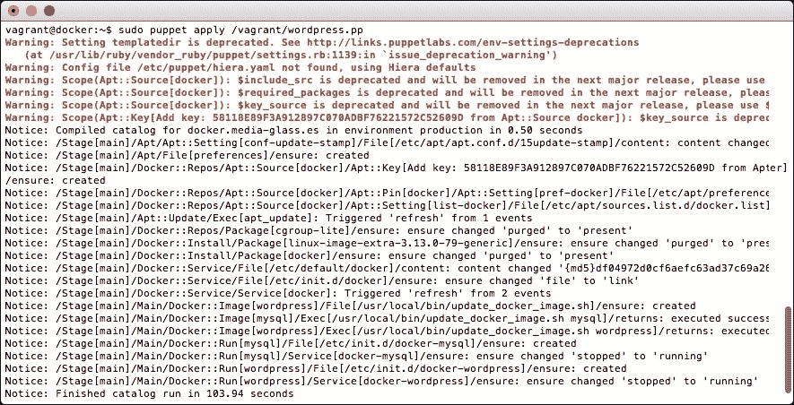

一旦清单应用完毕，你应该可以通过浏览器访问 `http:// 192.168.33.10/` 或使用以下 URL：[`docker.media-glass.es/`](http://docker.media-glass.es/)，这个 URL 会解析到 `Vagrantfile` 中配置的 IP 地址，且仅在虚拟机启动并应用清单后才可访问。

从这里开始，你可以像在其他章节中一样安装 WordPress。完成后，别忘了使用`vagrant destroy`命令销毁你的虚拟机，因为它会很高兴地在后台占用资源。

所以，到了这里，你已经获得了一个非常基础的关于如何将 Puppet 和 Docker 一起运行的实用介绍。

## 一个更高级的 Puppet 示例

到目前为止，我们一直在单一的虚拟机上运行 Puppet，但这并不是它的强项所在。

Puppet 的优势在于当你部署 Puppet Master 服务器并让你的主机上的 Puppet Agent 与 Master 进行通信时。在这里，你能够精确地定义你希望主机的配置。例如，以下图示展示了一个 Puppet Master 服务器控制四个 Docker 节点：

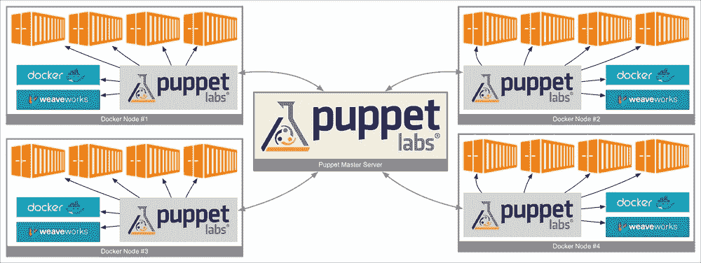

在这个例子中，我们可以在 Puppet 主服务器上为每个主机创建一个 Puppet 清单，同时还可以有一个用于配置所有四个节点共有配置的清单。

在这个例子中，我已经在每个节点上安装了 Weave，你可以查看 Puppet Forge 网站 [`forge.puppetlabs.com/`](https://forge.puppetlabs.com/)，那里有一个名为 `tayzlor/weave` 的模块，允许你管理 Weave。这个模块和 `garethr/docker` 一起，可以帮助你完成以下任务：

+   在每个节点上安装 Docker

+   在每个节点上安装 Weave

+   在所有四个节点之间创建一个 Weave 网络

+   管理每个节点上的镜像

+   在每个节点上启动容器，并配置它们使用 Weave 网络

默认情况下，每个节点上的 Puppet agent 会每 15 分钟回调到 Puppet 主服务器；当它回调时，它会处理适用于该节点的清单。如果有任何更改，这些更改将在 Puppet Agent 运行时应用；如果清单没有更改，则不会执行任何操作。

另外，Puppet 配置（包括清单文件）非常适合使用源代码控制进行管理，这样你可以创建一些非常有用的工作流程。

这种配置的唯一缺点是它并不能替代 Docker Swarm，因为所有有关容器启动位置的逻辑都在每个清单文件中手动定义。并不是说不能使用 Puppet 启动一个 Swarm 集群，你可以，只是需要更多的工作。

我们不会详细讲解这个例子，因为在这一章中我们还有四个工具要介绍，Puppetlabs 网站上有很多资源可以参考：

+   **学习虚拟机**: [`puppetlabs.com/download-learning-vm`](https://puppetlabs.com/download-learning-vm)

+   **Puppet 开源文档**: [`docs.puppetlabs.com/puppet/`](https://docs.puppetlabs.com/puppet/)

你可以找到更多关于我提到的两个 Puppet 模块的详细信息：

+   **Docker 模块**: [`forge.puppetlabs.com/garethr/docker/`](https://forge.puppetlabs.com/garethr/docker/)

+   **Weave 模块**: [`forge.puppetlabs.com/tayzlor/weave/`](https://forge.puppetlabs.com/tayzlor/weave/)

## 关于 Puppet 的最后一点说明

在本章的下一部分，我们将讨论 Ansible，我猜大多数人认为它和 Puppet 做的工作完全相同。虽然这两者之间确实有很多重叠，但我认为 Ansible 更擅长作为一个编排工具，而 Puppet 更擅长做配置管理。

由于 Puppet 是一个非常优秀的配置管理工具，很多人会有将 Puppet Agent 打包进容器的冲动，将它作为镜像构建过程的一部分，或者甚至在容器启动时进行实时配置。

尽量避免这样做，因为这可能会给你的容器增加不必要的负担，并引入额外的进程。记住，在理想的情况下，你的容器应该只运行一个进程，并且一启动就能工作。

# 使用 Ansible 进行编排

我猜很多人会期待本章的这一部分开篇讲 Ansible 与 Puppet 的对比。事实上，正如前一部分结尾提到的，虽然这两种工具有很多交集，但它们的优势在于完成两种不同的工作。

它们的工作方式也完全不同。我们现在不深入细节，直接跳过，安装 Ansible，并使用 Ansible playbook 启动我们的 WordPress 容器吧。

## 准备工作

### 注意

请注意，如果因为任何原因你无法完成本章这一部分，我已经录制了一个视频教程，展示了当你启动 Ansible playbook 时会发生什么，视频可以在 [`asciinema.org/a/39537`](https://asciinema.org/a/39537) 找到。

在启动容器之前，我们需要做几件事。第一件事是安装 Ansible。

如果你使用的是 OS X，我建议使用 Homebrew 安装 Ansible。Homebrew 可以在 [`brew.sh/`](http://brew.sh/) 找到，并且可以通过以下命令安装：

```
/usr/bin/ruby -e "$(curl -fsSL https://raw.githubusercontent.com/Homebrew/install/master/install)"

```

跟随屏幕上的提示操作后，你应该能够使用以下命令安装 Ansible：

```
brew install ansible

```

现在 Ansible 安装好了，我们需要安装一个特定版本的 DigitalOcean Python 库。为此，我们需要使用 `pip` 命令。如果你还没有安装 `pip`，你需要运行：

```
sudo easy_install pip

```

现在 `pip` 已经安装好了，运行以下命令来安装我们所需的正确版本的 Python 库：

```
sudo pip install dopy==0.3.5

```

最后你需要的就是你的 DigitalOcean 密钥名称。我们将要运行的 Ansible playbook 会为你创建一个，并在没有预先配置的情况下将其上传，如果你已经有了，可以跳过这部分。

如果你已经有了与 DigitalOcean 账户关联的密钥，那么你需要提供密钥名称来启动两个实例并连接到它们。

要找出这个信息，请登录到 [`cloud.digitalocean.com/`](https://cloud.digitalocean.com/) 的 DigitalOcean 控制面板，并点击屏幕右上方的 `齿轮图标`，在弹出的菜单中点击 **设置** 按钮。一旦设置页面加载完毕，点击 **安全性** 按钮，你应该会看到一个 SSH 密钥的列表，记下你想要使用的密钥名称：

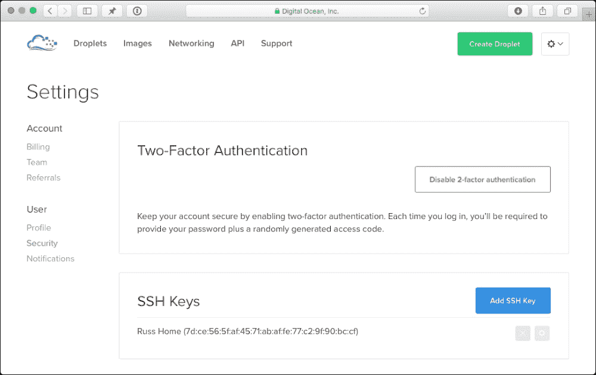

在上面的例子中，我的 SSH 密钥被创意性地命名为 `Russ Home`。

是时候获取我们将要运行的 Ansible playbook 了。代码可以在本书 GitHub 仓库中的 `chapter06/docker-ansible` 文件夹中找到，完整的 URL 如下：

[`github.com/russmckendrick/extending-docker/tree/master/chapter06/docker-ansible`](https://github.com/russmckendrick/extending-docker/tree/master/chapter06/docker-ansible)

下载 playbook 后，打开终端并进入 `docker-ansible` 文件夹。进入后，运行以下命令，并将 DigitalOcean API 替换为你自己的：

```
echo 'do_api_token: "sdnjkjdfgkjb345kjdgljknqwetkjwhgoih314rjkwergoiyu34rjkherglkhrg0"' > group_vars/do.yml
echo 'ssh_key_name: "Your Key Name"' >> group_vars/do.yml

```

现在我们可以运行 playbook 了，但在此之前，请记住，此 playbook 将连接到你的 DigitalOcean 账户并启动两个实例。

要启动 playbook，运行以下命令并等待：

```
ansible-playbook -i hosts site.yml

```

完整的过程大约需要几分钟，但你最终应该会在你的 DigitalOcean 账户中启动两个 Ubuntu 14.04 Droplet。每个 droplet 都会安装最新版本的 Docker 和 Weave，Weave 将被配置为使得这两个主机可以相互通信。

一个 droplet 将运行我们的 WordPress 容器，第二个将运行我们的 MySQL 容器，两个容器将通过跨主机的 Weave 网络相互通信。

一旦任务完成，你应该会看到类似下面的截图：

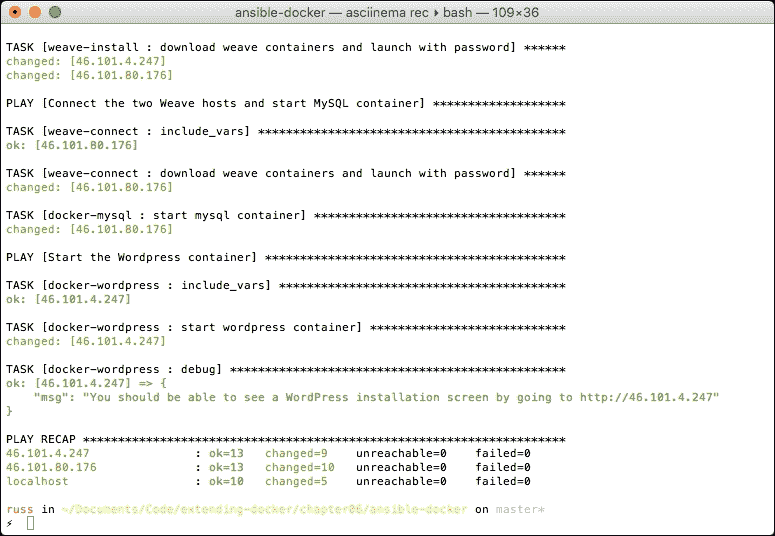

如你所见，在我的案例中，我可以在浏览器中访问 `http://46.101.4.247` 来开始 WordPress 安装。

如果由于某种原因，部分安装失败，例如有时 droplets 启动可能会稍微慢一点，并且在 Ansible 尝试通过 SSH 连接时无法访问它们，请不要担心，你可以使用以下命令重新运行 Ansible playbook：

```
ansible-playbook -i hosts site.yml

```

Ansible 还会再次执行整个 playbook，这一次，它会跳过任何已经创建或操作过的内容。

如果你没有按照这个示例操作，或者遇到问题，我已经录制了整个启动 playbook 的过程，并再次运行的过程，你可以在 [`asciinema.org/a/39537`](https://asciinema.org/a/39537) 上查看。

## playbook

playbook 包含了很多部分，如以下文件夹和文件列表所示：

```
├── ansible.cfg
├── group_vars
│   ├── do.yml
│   └── environment.yml
├── hosts
├── roles
│   ├── docker-install
│   │   └── tasks
│   │       └── main.yml
│   ├── docker-mysql
│   │   └── tasks
│   │       └── main.yml
│   ├── docker-wordpress
│   │   └── tasks
│   │       └── main.yml
│   ├── droplet
│   │   ├── tasks
│   │   │   └── main.yml
│   │   └── templates
│   │       └── dyn.yml.j2
│   ├── weave-connect
│   │   └── tasks
│   │       └── main.yml
│   └── weave-install
│       └── tasks
│           └── main.yml
└── site.yml
```

我们在启动 playbook 时调用的主要文件是 `site.yml` 文件，该文件定义了在 roles 文件夹中定义的任务执行顺序。让我们来看一下这个文件的内容以及被调用的角色。

### 第一部分

该文件本身分为四个部分，以下第一部分处理从本地机器连接到 DigitalOcean 的 API 并启动两个 Droplet：

```
- name: "Provision two droplets in DigitalOcean"
  hosts: localhost
  connection: local
  gather_facts: True
  vars_files:
    - group_vars/environment.yml
    - group_vars/do.yml
  roles:
    - droplet
```

它加载了主 `environment.yml` 变量文件，在这里我们定义了 droplet 启动所在的区域、droplet 的名称、要使用的大小，以及应该启动的镜像。

它还加载了包含你 DigitalOcean API 密钥和 SSH 密钥名称的`do.yml`文件。如果你查看`droplet`文件夹中的角色任务文件，你会看到在启动两个 droplet 的同时，它还创建了以下三个主机组：

+   `dockerhosts`：这个组包含两个 droplet

+   `dockerhost01`：这个组包含我们的第一个 droplet

+   `dockerhost02`：这个组包含第二个 droplet

在此阶段采取的最后一个动作是写入一个文件到 `group_vars` 文件夹，其中包含我们两个 droplet 的公共 IP 地址。

### 第二部分

`site.yml` 文件的下一部分处理在 `dockerhosts` 组中的 droplet 上安装一些基本的前提条件、Docker 和 Weave：

```
- name: "Install Docker & Weave on our two DigitalOcean hosts"
  hosts: dockerhosts
  remote_user: root
  gather_facts: False
  vars_files:
    - group_vars/environment.yml
  roles:
    - docker-install
    - weave-install
```

第一个角色处理 Docker 的安装，我们来看看该角色任务文件中的内容。

首先，我们将使用 `apt` 包管理器安装 curl，因为稍后我们需要用到它：

```
- name: install curl
  apt: pkg=curl update_cache=yes
```

一旦安装了 curl，我们将开始配置官方的 Docker APT 仓库，首先添加该仓库的密钥：

```
- name: add docker apt keys
  apt_key: keyserver=p80.pool.sks-keyservers.net id=58118E89F3A912897C070ADBF76221572C52609D
```

然后，我们将添加实际的仓库：

```
- name: update apt
  apt_repository: repo='deb https://apt.dockerproject.org/repo ubuntu-trusty main' state=present
```

一旦添加了仓库，我们可以实际安装 Docker，确保在安装软件包之前更新缓存的仓库列表：

```
- name: install Docker
  apt: pkg=docker-engine update_cache=yes
```

现在 Docker 已安装，我们需要确保 Docker 守护进程已启动：

```
- name: start Docker
  service: name=docker state=started
```

现在我们需要安装 Ansible 用来与我们主机上的 Docker 守护进程交互的工具，像 Ansible 一样，这也是一个 Python 程序。为了确保可以安装它，我们需要确保 `pip`（Python 包管理器）已安装：

```
- name: install pip
  apt:
    pkg: "{{ item }}"
    state: installed
  with_items:
    - python-dev
    - python-pip
```

现在我们知道 pip 已安装，我们可以安装 `docker-py` 包：

```
- name: install docker-py
  pip:
    name: docker-py
```

这个包是一个由 Docker 提供的 Python 编写的 Docker 客户端。有关该客户端的更多详细信息，请访问 [`github.com/docker/docker-py`](https://github.com/docker/docker-py)。

这结束了在 `site.yml` 文件第二部分中调用的第一个角色。现在 Docker 已安装，是时候安装 Weave 了，这由 `weave-install` 任务处理。

首先，我们从 `environment.yml` 文件中定义的 URL 下载 weave 二进制文件到文件系统路径，该路径也在 `environment.yml` 文件中定义：

```
- name: download and install weave binary
  get_url: url={{ weave_url }} dest={{ weave_bin }}
```

一旦我们下载了二进制文件，我们需要检查该文件的正确读、写和执行权限，以便能够执行它：

```
- name: setup permissions on weave binary  
  file: path={{ weave_bin }} mode="u+rx,g+rx,o+rwx"
```

最后，我们需要启动 weave 并为其传递一个密码以启用加密，密码也在`environment.yml`文件中定义：

```
- name: download weave containers and launch with password
  command: weave launch --password {{ weave_password}}
  ignore_errors: true
```

如你所见，在这一部分任务的最后，我们指示 Ansible 忽略此处产生的任何错误。这是因为，如果 playbook 第二次启动并且 weave 已经在运行，它会提示说 weave 路由器已经激活。此时，playbook 将停止执行，因为 Ansible 会将此消息视为一个严重错误。

由于这个原因，我们必须告诉 Ansible 忽略它认为这是一个关键错误，以便 playbook 能够继续进行。

### 第三部分

`site.yml` 文件的下一部分在启动构成我们 WordPress 安装的容器之前执行最后一部分配置。所有这些角色都在我们的第一个 droplet 上运行：

```
- name: "Connect the two Weave hosts and start MySQL container"
  hosts: dockerhost01
  remote_user: root
  gather_facts: False
  vars_files:
    - group_vars/environment.yml
  roles:
    - weave-connect
    - docker-mysql
```

第一个角色被称为，将两个主机上的两个 weave 网络连接在一起：

```
- include_vars: group_vars/dyn.yml
- name: download weave containers and launch with password
  command: weave connect {{ docker_host_02 }}
```

正如您所见，在这里首次加载包含我们两个 droplet IP 地址的变量文件，并用于获取第二个 droplet 的 IP 地址；这个名为 `dyn.yml` 的文件是由最初启动两个 droplet 的角色创建的。

一旦我们有了第二个 droplet 的 IP 地址，执行 `weave connect` 命令，完成 weave 网络的配置。现在我们可以启动容器了。

我们需要启动的第一个容器是数据库容器：

```
- name: start mysql container
  docker:
    name: my-wordpress-database
    image: mysql
    state: started
    net: weave
    dns: ["172.17.0.1"]
    hostname: mysql.weave.local
    env:
      MYSQL_ROOT_PASSWORD: password
    volumes:
       - "database:/var/lib/mysql/"
```

正如您所见，这与 Docker Compose 文件非常类似的语法；然而，可能存在细微差异，因此请在 Ansible 核心模块文档站点上仔细检查 Docker 页面，以确保您使用的是正确的语法。

一旦 `my-wordpress-database` 容器启动，意味着我们在 `dockerhost01` 上需要执行的所有任务已经完成。

### 第四部分

`site.yml` 文件的最后一部分连接到我们的第二个 droplet，然后启动 WordPress 容器：

```
- name: "Start the Wordpress container"
  hosts: dockerhost02
  remote_user: root
  gather_facts: False
  roles:
    - docker-wordpress
```

所有这个角色所做的就是再次启动 WordPress 容器，文件与 Docker Compose 文件非常相似：

```
- include_vars: group_vars/dyn.yml
- name: start wordpress container
  docker:
    name: my-wordpress-app
    image: wordpress
    state: started
    net: weave
    dns: ["172.17.0.1"]
    hostname: wordpress.weave.local
    ports:
      - "80:80"
    env:
      WORDPRESS_DB_HOST: mysql.weave.local:3306
      WORDPRESS_DB_PASSWORD: password
    volumes:
       - "uploads:/var/www/html/wp-content/uploads/"
- debug: msg="You should be able to see a WordPress installation screen by going to http://{{ docker_host_02 }}"
```

最后的调试行在 playbook 运行结束时打印包含第二个 droplet IP 地址的消息。

## Ansible 和 Puppet

与 Puppet 类似，使用像我们讨论过的这种 playbook 的 Ansible 可以用作 Docker Machine 和 Docker Compose 的替代品。

然而，您可能已经注意到的一件事是，与 Puppet 不同，我们没有在目标机器上安装代理。

当您运行 Ansible playbook 时，它会在本地编译，然后通过 SSH 推送编译后的脚本到目标服务器上，然后执行。

这也是为什么在 playbook 运行期间，我们必须在两个 droplet 上安装 Docker Python 库的原因之一，没有这个库，编译后的 playbook 将无法启动这两个容器。

另一个工具之间的一个重要区别是，Ansible 按照 playbook 中定义的顺序执行任务。

我们讨论的 Puppet 示例并不复杂到足以真正展示为何在运行 Puppet 清单时可能会成为问题，但 Puppet 使用的是事件一致性概念，这意味着可能需要几次清单运行才能应用您的配置。

的确，可以在 Puppet 清单中添加要求，例如，在执行 ABC 后需要执行 XYZ。但是，如果你的清单非常庞大，这可能会导致性能问题；另外，你可能会发现自己处于清单完全无法正常工作的情况，因为 Puppet 无法按照你定义的顺序成功执行清单。

这就是为什么在我看来，Ansible 在编排方面要比 Puppet 更加优秀的原因。

正是像这种情况，你所定义的任务必须按精确的顺序执行，而不是由你使用的工具决定最有效的任务执行方式。

对我来说，这就是你不应该抱着“我需要选择一个工具并且只用它来做所有事”的态度去处理任何任务的原因。你应该总是选择适合你想做的工作的工具。

对于我们在本章中讨论的许多工具，可能都可以这样说；我们不应将工具仅仅从“这个与那个”的角度进行评估，而应该问“这个或那个”，甚至是“这个和那个”，而不是自我限制。

# Vagrant（再一次）

正如我们在本章前面已经发现的那样，Vagrant 可以作为虚拟机管理器来使用。我们已经使用它通过 VirtualBox 在本地机器上启动了一个 Ubuntu 14.04 实例；然而，如果我们愿意，我们也可以选择使用 VMware Fusion、Amazon Web Services、DigitalOcean，甚至是 OpenStack 来实现这一点。

像 Puppet 和 Ansible 一样，当 Docker 最初发布时，关于 Vagrant 与 Docker 的比较文章层出不穷。事实上，当 Stack Overflow 上有人提问时，Vagrant 和 Docker 的作者都参与了讨论。你可以在[`stackoverflow.com/questions/16647069/should-i-use-vagrant-or-docker-for-creating-an-isolated-environment`](http://stackoverflow.com/questions/16647069/should-i-use-vagrant-or-docker-for-creating-an-isolated-environment)查看完整的讨论。

那么，Vagrant 可以以哪些方式支持 Docker 呢？我们将要探讨的有两种主要方式。第一种是提供者（provisioner）。

## 使用 Vagrant 进行配置

当我们使用 Puppet 时，我们通过 Vagrant 使用 VirtualBox 本地启动了 Ubuntu 14.04；在此过程中，我们使用了 Shell 提供者来安装 Puppet 并部署 Docker Puppet 模块。Vagrant 提供了以下几种提供者：

+   **File**：这会将文件复制到 Vagrant 主机上。

+   **Shell**：这会将 bash 脚本编译/复制到主机上并执行它们。

+   **Ansible**：这会在主机上或针对主机运行 Ansible 剧本。

+   **Chef 和 Puppet**：你可以使用 Chef 或 Puppet 通过大约十种不同的方式来提供 Vagrant 主机。

+   **Docker**：这是我们将用来在 Vagrant 主机上提供容器的工具。

`Vagrantfile` 看起来与我们用于部署 Puppet WordPress 示例的文件非常相似：

```
# -*- mode: ruby -*-
# vi: set ft=ruby :

VAGRANTFILE_API_VERSION = "2"

Vagrant.configure(VAGRANTFILE_API_VERSION) do |config|

  config.vm.box = "ubuntu/trusty64"
  config.vm.network "private_network", ip: "192.168.33.10"
  HOSTNAME = 'docker'
  DOMAIN   = 'media-glass.es'
  Vagrant.require_version '>= 1.7.0'
  config.ssh.insert_key = false
  config.vm.host_name = HOSTNAME + '.' + DOMAIN

  config.vm.provider "VirtualBox" do |v|
    v.memory = 2024
    v.cpus = 2
  end

  config.vm.provider "vmware_fusion" do |v|
    v.vmx["memsize"] = "2024"
    v.vmx["numvcpus"] = "2"
  end

  config.vm.provision "docker" do |d|
    d.run "mysql",
      image: "mysql",
      args: "-e 'MYSQL_ROOT_PASSWORD=password'"
    d.run "wordpress",
      image: "wordpress",
      args: "-p 80:80 --link mysql:mysql -e WORDPRESS_DB_PASSWORD=password"
  end

end
```

如你所见，这将下载（如果你尚未安装的话）并启动一个 Ubuntu 14.04 服务器，然后配置两个容器，一个是 WordPress，一个是 MySQL。

要启动主机，运行以下命令：

```
vagrant up --provider VirtualBox

```

你应该会看到类似以下的终端输出：

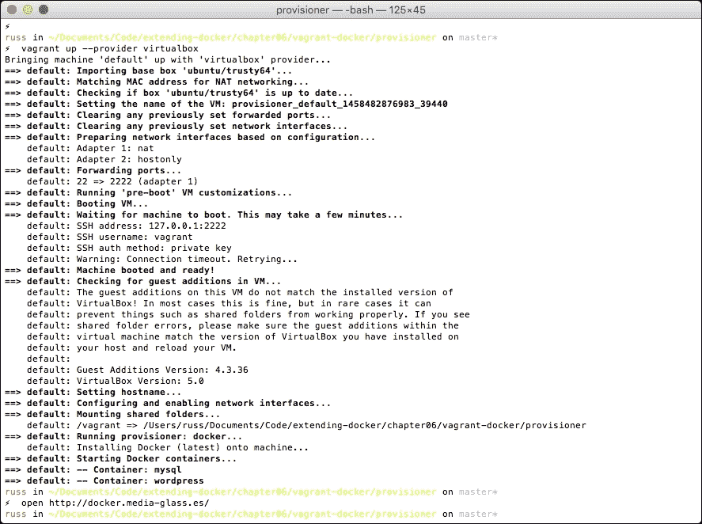

你还可以运行以下命令来打开浏览器并进入 WordPress 安装屏幕（记住：我们已经使用固定的本地 IP 地址启动了 Vagrant 主机，这意味着以下 URL 应该会解析到你的本地安装）：

```
open http://docker.media-glass.es/

```

你可能已经注意到当我们启动 Vagrant 主机时发生的一件事：我们不需要向 Vagrant 提供任何安装 Docker 的命令；它为我们处理了这一切。

此外，我们必须先启动 MySQL 容器，再启动 WordPress 容器。这是因为我们已经将 WordPress 容器与 MySQL 容器链接。如果我们尝试先启动 WordPress 容器，系统会给出错误提示，告诉我们正在尝试连接一个不存在的链接。

如你从以下终端输出中看到的，你可以使用 `vagrant ssh` 命令连接到你的 Vagrant 主机：

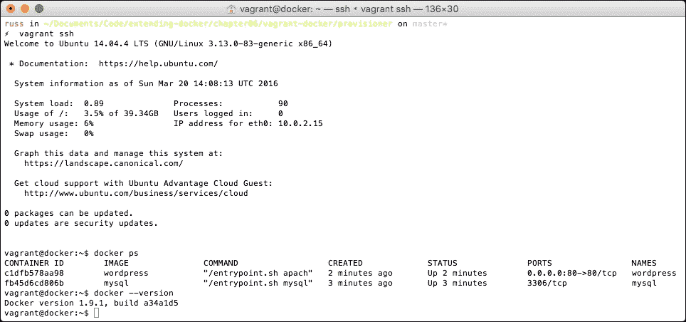

你可能还会注意到安装的 Docker 版本不是最新的；这是因为 Vagrant 安装的是操作系统默认仓库中的版本，而不是 Docker 在其仓库中提供的最新版本。

## Vagrant Docker 提供者

如我所提到的，你可以通过两种方式在 Vagrant 中使用 Docker：我们刚才看到的是一种配置器方式，第二种是使用提供者方式。

那么，什么是提供者呢？我们在本章中已经两次使用了提供者，当我们启动 Docker 主机时就用了提供者。提供者是一个虚拟机进程、管理器或 API，Vagrant 可以连接到它，并从中启动虚拟机。

Vagrant 内置了以下提供者：

+   VirtualBox

+   Docker

+   Hyper-V

还有一个由作者提供的商业插件，它添加了以下提供者：

+   VMware Fusion 和 Workstation

最后，Vagrant 支持自定义提供者，例如 Amazon Web Services、libvirt，甚至 LXC 等。你可以在 [`vagrant-lists.github.io/`](http://vagrant-lists.github.io/) 找到完整的自定义提供者和其他 Vagrant 插件列表。

显然，如果你使用的是 OS X，那么你将无法原生使用 Docker 提供者；然而，Vagrant 会为你处理这个问题。让我们来看看使用 Docker 提供者而不是配置器启动一个 NGINX 容器。

`Vagrantfile` 看起来与我们之前使用的稍有不同：

```
VAGRANTFILE_API_VERSION = "2"
Vagrant.configure(VAGRANTFILE_API_VERSION) do |config|
  config.vm.define "boot2docker", autostart: false do |dockerhost|
    dockerhost.vm.box = "russmckendrick/boot2docker"
    dockerhost.nfs.functional = false
    dockerhost.vm.network :forwarded_port, guest: 80, host: 9999
    dockerhost.ssh.shell = "sh"
    dockerhost.ssh.username = "docker"
    dockerhost.ssh.password = "tcuser"
    dockerhost.ssh.insert_key = false
  end
  config.vm.define "nginx", primary: true do |v|
    v.vm.provider "docker" do |d|
      d.vagrant_vagrantfile = "./Vagrantfile"
      d.vagrant_machine = "boot2docker"
      d.image = "russmckendrick/nginx"
      d.name  = "nginx"
      d.ports = ["80:80"]
    end
  end
end
```

如你所见，它被分为两部分：一部分是 Boot2Docker 虚拟机，另一部分是容器本身。如果你运行 `vagrant up`，你将看到类似以下的终端输出：

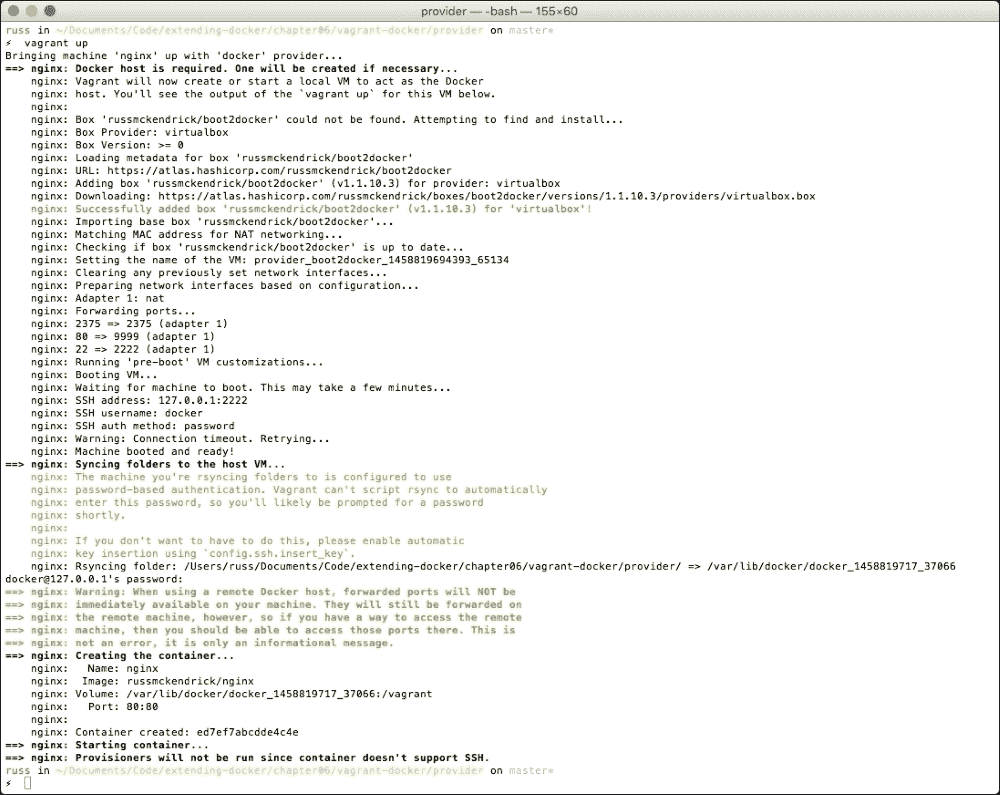

如你所见，由于我使用的是 OS X，Vagrant 知道我可以原生运行 Docker，因此它会使用 `Vagrantfile` 的第一部分并启动一个 Boot2Docker 实例。Boot2Docker 是支持 Docker Machine 默认驱动的轻量级 Linux 发行版。

下载完 Boot2Docker Vagrant Box 后，它会启动虚拟机，并将虚拟机的 `22` 端口映射到我们本地 PC 的 `2222` 端口，以便我们可以通过 SSH 访问。此外，按照 `Vagrantfile` 中的定义，虚拟机的 `80` 端口被映射到本地 PC 的 `9999` 端口。

值得注意的是，如果我在安装了 Docker 的 Linux PC 上运行此操作，那么这一步骤将会被跳过，Vagrant 会利用我本地的 Docker 安装。

现在 Boot2Docker 已启动，可以运行 `Vagrantfile` 的第二部分。如果像我一样，Vagrant 已下载并启动了 Boot2Docker Vagrant Box，那么它会要求输入密码；这是因为我们没有与 Boot2Docker 虚拟机交换密钥。密码是 `tcuser`。

输入密码后，Vagrant 会从 [`hub.docker.com/r/russmckendrick/nginx/`](https://hub.docker.com/r/russmckendrick/nginx/) 下载 NGINX 镜像并启动容器，打开 `80` 端口。

容器启动后，你应该能够通过 `http://localhost:9999/` 访问 NGINX 欢迎页面。

如果你愿意，你可以通过 SSH 连接到 Boot2Docker 虚拟机，因为 Vagrant 主要管理容器，而不是 Boot2Docker 虚拟机。你需要使用以下命令：

```
ssh docker@localhost -p2222

```

同样，由于我们没有交换密钥，你将需要输入密码 `tcuser`。然后你应该会看到如下信息：

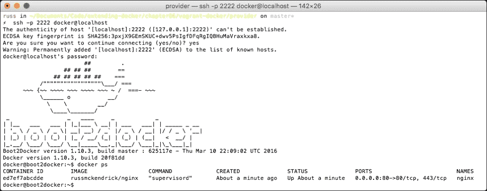

一旦通过 SSH 连接，你将能够在本地运行 Docker 命令。最后，要终止容器和虚拟机，可以在与 `Vagrantfile` 相同的文件夹中运行以下命令，你将看到类似如下的输出：

```
vagrant destroy

```

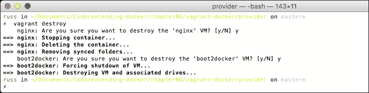

这会提示你是否确认要移除容器和虚拟机，然后你需要对这两个问题都回答“是”。

你一定注意到，在讲解 Docker 提供者时，我们没有提到 WordPress 示例。原因在于，我认为 Docker 提供者的功能现在基本上是多余的，尤其是它有很多限制，这些限制可以通过使用提供程序或其他工具轻松克服。

其中一个限制是它只能使用端口映射；我们不能为虚拟机分配 IP 地址。如果我们这样做，它会悄无声息地失败，并从虚拟机恢复到主机 PC 的端口映射。

此外，当启动容器时，其提供的功能并不像我们本章中讨论的其他工具那样符合 Docker 的最新版本和功能。

因此，我建议你在考虑使用 Vagrant 时，使用 provisioner 而不是 provider。

# 镜像打包

到目前为止，我们一直在从 Docker Hub 下载预构建镜像来进行测试。接下来，我们将着眼于创建自己的镜像。在我们深入了解如何使用第三方工具创建镜像之前，应该先快速了解一下如何在 Docker 中构建镜像。

## 一个应用程序

在我们开始构建自己的镜像之前，实际上我们应该有一个应用程序来“烘焙”进镜像。我猜想你可能已经对一遍又一遍地进行 WordPress 安装感到厌倦了。我们将探索一些完全不同的东西。

因此，我们将构建一个安装了 Moby Counter 的镜像。Moby Counter 是由 Kai Davenport 编写的一个应用程序，他这样描述它：

> *"一个小型应用程序，用于演示如何在 docker-compose 应用程序中保持状态。"*

该应用程序在浏览器中运行，并将在你点击的页面上添加 Docker 徽标，目的是它使用 Redis 或 Postgres 后端来存储 Docker 徽标的数量及其位置，这演示了如何在像我们在第三章中看到的 *Volume 插件* 这样的卷上持久化数据。你可以在 [`github.com/binocarlos/moby-counter/`](https://github.com/binocarlos/moby-counter/) 找到该应用程序的 GitHub 仓库。

## Docker 方式

既然我们对即将发布的应用程序有所了解，那么让我们来看看如何使用 Docker 本身构建镜像。

本章的代码可以从本书附带的 GitHub 仓库中获取；你可以在 [`github.com/russmckendrick/extending-docker/tree/master/chapter06/images/docker`](https://github.com/russmckendrick/extending-docker/tree/master/chapter06/images/docker) 找到它。

基本构建的 `Dockerfile` 非常简单：

```
FROM russmckendrick/nodejs
ADD . /srv/app
WORKDIR /srv/app
RUN npm install
EXPOSE 80
ENTRYPOINT ["node", "index.js"]
```

当我们运行构建时，它将从 Docker Hub 下载 `russmckendrick/nodejs` 镜像；正如你可能已经猜到的那样，这个镜像中安装了 NodeJS。

一旦镜像下载完成，Docker 将启动容器并添加当前工作目录的内容，该目录包含 Moby Counter 代码。然后，它会将工作目录切换到代码上传的位置 `/srv/app`。

接着，它将通过执行 `npm install` 命令来安装运行应用程序所需的先决条件；由于我们已经设置了工作目录，所有命令将在该目录下运行，这意味着将使用 `package.json` 文件。

随附 `Dockerfile` 的还有一个 Docker Compose 文件，这个文件启动了 Moby Counter 镜像的构建，下载官方的 Redis 镜像，并启动这两个容器，将它们连接起来。

在我们进行之前，我们需要启动一台机器来运行构建；为此，运行以下命令启动一个基于 VirtualBox 的本地 Docker 主机：

```
docker-machine create --driver "VirtualBox" chapter06

```

现在 Docker 主机已启动，运行以下命令将本地 Docker 客户端配置为直接与其通信：

```
eval $(docker-machine env chapter06)

```

现在你已经准备好主机并配置了客户端，运行以下命令来构建镜像并启动应用程序：

```
docker-compose up -d

```

当你运行命令时，应该能在终端中看到类似以下的输出：

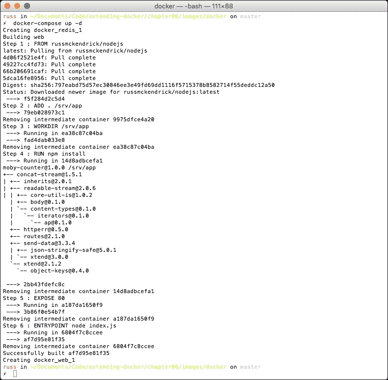

现在应用程序已经启动，应该能够通过运行以下命令打开浏览器：

```
open http://$(docker-machine ip chapter06)/

```

你将看到一个页面，页面上写着点击以添加标志，如果你点击页面，Docker 标志会开始出现。如果你点击刷新，你添加的标志会保留下来，并且它们的位置会存储在 Redis 数据库中。

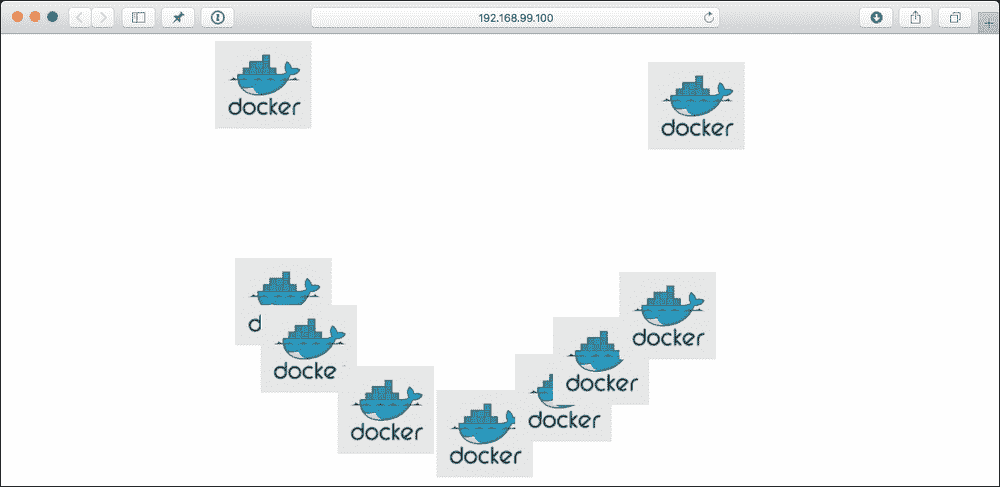

要停止容器并将其删除，运行以下命令：

```
docker-compose stop
docker-compose rm

```

在我们探讨使用 Docker 构建容器镜像的优缺点之前，先来看一个第三方替代方案。

## 使用 Packer 构建

Packer 是由 *Mitchell Hashimoto* 编写的，来自 *Hashicorp*，与 Vagrant 的作者相同。因此，我们将使用的术语之间有很多相似之处。

Packer 网站可能是对该工具最好的描述：

> *“Packer 是一个开源工具，用于从单一源配置创建多个平台的相同机器镜像。Packer 轻量，支持所有主要操作系统，且性能优异，能够并行为多个平台创建机器镜像。Packer 并不替代 Chef 或 Puppet 这样的配置管理工具。事实上，在构建镜像时，Packer 可以使用 Chef 或 Puppet 等工具在镜像中安装软件。”*

我自 Packer 发布以来就开始使用它来为 Vagrant 和公共云构建镜像。

你可以从 [`www.packer.io/downloads.html`](https://www.packer.io/downloads.html) 下载 Packer，或者如果你已安装 Homebrew，可以运行以下命令：

```
brew install packer

```

现在你已经安装了 Packer，我们来看看一个配置文件。Packer 配置文件都是用 JSON 定义的。

### 注意

**JavaScript 对象表示法** (**JSON**) 是一种轻量级的数据交换格式。它易于人类读取和编写，也便于机器解析和生成。

以下文件几乎完全做了我们之前的 `Dockerfile` 所做的工作：

```
{
  "builders":[{
    "type": "docker",
    "image": "russmckendrick/nodejs",
    "export_path": "mobycounter.tar"
  }],
  "provisioners":[
    {
      "type": "file",
      "source": "app",
      "destination": "/srv"
    }, 
    {
      "type": "file",
      "source": "npmrc",
      "destination": "/etc/npmrc"
    },
    {
      "type": "shell",
      "inline": [
        "cd /srv/app",
        "npm install"
      ]
    }
  ]
}
```

再次提醒，构建镜像所需的所有文件，以及用于运行它的 Docker Compose 文件，都可以在 GitHub 仓库中找到，链接是 [`github.com/russmckendrick/extending-docker/tree/master/chapter06/images/packer`](https://github.com/russmckendrick/extending-docker/tree/master/chapter06/images/packer)。

我们将不使用 Docker Compose 文件来构建镜像，而是需要运行 **packer**，然后导入镜像文件。要开始构建，请运行以下命令：

```
packer build docker.json

```

你应该在终端中看到以下内容：

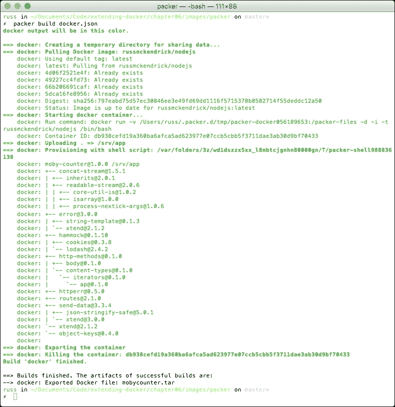

一旦 Packer 完成构建镜像，它会将镜像副本保存在你启动 Packer 构建命令的文件夹中；在我们的案例中，镜像文件叫做 `mobycounter.tar`。

要导入镜像以供使用，请运行以下命令：

```
docker import mobycounter.tar mobycounter

```

这将导入镜像并将其命名为 `mobycounter`；你可以运行以下命令来检查镜像是否可用：

```
docker images

```

你应该看到类似这样的内容：

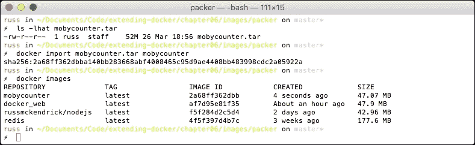

一旦你确认镜像已经导入并命名为 `mobycounter`，可以通过运行以下命令启动一个容器：

```
docker-compose up -d

```

再次强调，你可以通过运行以下命令，打开浏览器并开始点击来放置 logo：

```
open http://$(docker-machine ip chapter06)/

```

虽然看起来差异不大，但让我们看看背后到底发生了什么。

## Packer 与 Docker Build 的对比

在我们详细讨论两种构建镜像的方法之间的差异之前，让我们再试一次运行 Packer。

不过这次，让我们尝试减少镜像的大小：与其使用已经预装了 nodejs 的 `russmckendrick/nodejs` 镜像，不如使用构建这个镜像的基础镜像 `russmckendrick/base`。

这个镜像仅安装了 bash；通过 Packer 安装 NodeJS 和应用程序：

```
{
  "builders":[{
    "type": "docker",
    "image": "russmckendrick/base",
    "export_path": "mobycounter-small.tar"
  }],
  "provisioners":[
    {
      "type": "file",
      "source": "app",
      "destination": "/srv"
    }, 
    {
      "type": "file",
      "source": "npmrc",
      "destination": "/etc/npmrc"
    }, 
    {
      "type": "shell",
      "inline": [
        "apk update",
        "apk add --update nodejs",
        "npm -g install npm",
        "cd /srv/app",
        "npm install",
        "rm -rf /var/cache/apk/**/",
        "npm cache clean"
      ]
    }
  ]
}
```

如你所见，我们在 shell 提供程序中添加了一些命令；这些命令使用 Alpine Linux 的包管理器执行更新、安装 nodejs、配置应用程序，最后清理 apk 和 npm 缓存。

如果你愿意，可以使用以下命令构建镜像：

```
packer build docker-small.json

```

这将为我们留下两个镜像文件。我还在容器运行时，通过以下命令导出了我们使用 `Dockerfile` 构建的容器副本：

```
docker export docker_web_1 > docker_web.tar

```

我现在有三个镜像文件，三个都在运行相同的应用程序，并且安装了相同的软件堆栈，尽可能使用相同的命令。如以下文件大小列表所示，镜像大小是有差异的：

+   **Dockerfile**（使用`russmckendrick/nodejs`）= 52 MB

+   **Packer**（使用`russmckendrick/nodejs`）= 47 MB

+   **Packer**（使用 packer 安装完整堆栈）= 40 MB

12 MB 可能看起来不多，但当你处理的是一个只有 52 MB 的镜像时，这样的节省还是相当可观的。

那么，为什么会有差异呢？让我们先讨论 Docker 镜像的工作方式。

它们本质上是由基于基础镜像上层的更改层组成的。当我们使用 `Dockerfile` 构建第一个镜像时，你可能注意到每一行 `Dockerfile` 都生成了构建过程中的一个不同步骤。

每个步骤实际上是 Docker 启动一个新的文件系统层来存储该构建步骤的更改。例如，当我们的`Dockerfile`运行时，我们有六个文件系统层：

```
FROM russmckendrick/nodejs
ADD . /srv/app
WORKDIR /srv/app
RUN npm install
EXPOSE 80
ENTRYPOINT ["node", "index.js"]
```

第一层包含基础操作系统以及 NodeJS 安装所在的层，第二层包含应用程序本身的文件。

第三层仅包含设置`workdir`变量的元数据；接下来是包含应用程序的 NodeJS 依赖项的层。第五层和第六层仅包含配置暴露端口和“入口点”的元数据。

由于每一层实际上是镜像文件中的一个单独的归档文件，我们还需为这些归档文件承担额外的开销。

更好的示例是查看 Docker Hub 上一些最受欢迎的镜像，这些镜像可以通过 ImageLayers 网站找到，网址为[`imagelayers.io/`](https://imagelayers.io/)。

该网站是 Century Link Labs 提供的一个工具([`labs.ctl.io/`](https://labs.ctl.io/))，用于可视化通过`Dockerfile`构建的 Docker 镜像。

从以下屏幕截图可以看到，一些官方镜像非常复杂，并且也相当大：

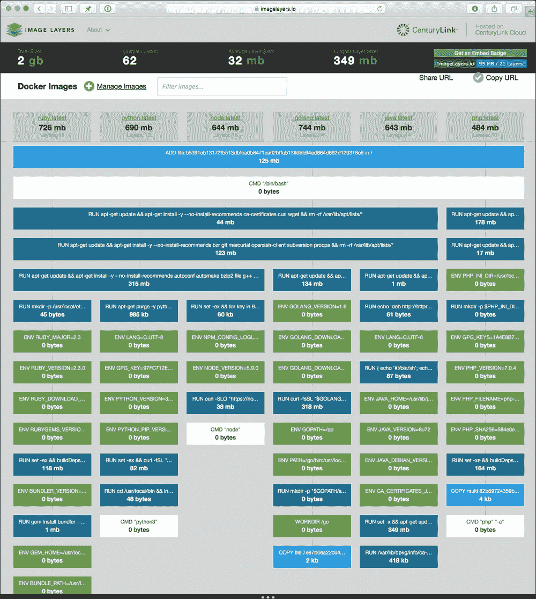

你可以通过以下网址查看上一页：

[`imagelayers.io/?images=java:latest,golang:latest,node:latest,python:latest,php:latest,ruby:latest`](https://imagelayers.io/?images=java:latest,golang:latest,node:latest,python:latest,php:latest,ruby:latest)。

即使官方镜像因为 Docker 聘请了 Alpine Linux 的创始人并将官方镜像迁移到更小的基础操作系统而变得更小（查看以下黑客新闻帖子获取更多信息[`news.ycombinator.com/item?id=11000827`](https://news.ycombinator.com/item?id=11000827)），这也不会改变每个镜像所需的层数。同样值得注意的是，每个镜像最多可以包含 127 层。

那么 Packer 做得有什么不同呢？它不是为每个步骤创建一个单独的文件系统层，而是仅生成两个层：第一个层是你定义的基础镜像，第二个层则包含其他所有内容——这就是我们节省空间的地方。

使用 Packer 相较于 Dockfiles 的另一个优点是你可以重用脚本。想象一下，你在本地开发时使用了 Docker，但当你需要进入生产环境时，出于某种原因，你必须在容器化的虚拟机上启动。使用 Packer，你可以做到这一点，因为你可以使用与开发容器相同的构建脚本来引导虚拟机。

如我之前提到的，我已经使用 Packer 一段时间了，它帮助我极大地提高了效率，可以使用一个工具针对不同平台构建相同的构建脚本。这个方法带来的持续性非常值得学习 Packer 这类工具的初期投入，因为从长远来看，你将节省大量时间；它还帮助消除了我们在第一章 *扩展 Docker 简介*中讨论过的“在开发环境中有效”的误区。

使用这种方法有一些缺点，可能会让一些人却步。

在我看来，最大的一个问题是，虽然你可以将最终镜像自动推送到 Docker Hub，但无法将其添加为自动构建。

这意味着，尽管该镜像可能对用户开放下载，但由于人们无法看到具体添加了哪些内容，因此它可能不被认为是可信的。

接下来是缺乏对元数据的支持——配置运行时选项（例如暴露端口和容器启动时默认执行的命令）的功能当前不受支持。

尽管这可以被看作是一个缺点，但通过在 Docker Compose 文件中定义你在 `Dockerfile` 中定义的内容，或者通过 `docker run` 命令直接传递信息，可以轻松克服。

## 镜像摘要

总结一下，如果你需要构建不仅仅是容器镜像，还需要针对不同平台进行构建，那么 Packer 正是你需要的工具。如果你只是需要构建容器镜像，那么坚持使用 `Dockerfile` 构建可能会更好。

我们在本章中看过的其他一些工具，例如 Ansible 和 Puppet，也支持通过对 `Dockerfile` 执行 `docker build` 命令来构建镜像，因此有很多方法可以将其集成到你的工作流程中，这将引导我们进入下一个要讨论的工具：Jenkins。

在继续之前，让我们快速检查一下你是否没有运行任何 Docker 主机。为此，运行以下命令检查是否有 Docker 主机，并将其移除：

```
docker-machine ls
docker-machine rm <name-of-host>

```

不要忘记只移除你在本书中跟随操作时使用的主机；不要移除任何你用于自己项目的主机！

# 使用 Jenkins 提供 Docker 服务

Jenkins 是一个相当庞大的主题，很难在单章的小节中全部覆盖，因此本教程将非常基础，仅涉及构建和启动容器。

另外需要注意的是，我将介绍 Jenkins 2.0；在撰写本文时，首个 beta 版本刚刚发布，这意味着虽然随着主题等的改进，某些细节可能会有所变化，但所有功能和基本功能已基本确定。

我们选择讲解 Jenkins 2.0 而不是 Jenkins 1.x 分支的原因是，因为在 Jenkins 看来，Docker 现在已经是一个一级公民，这意味着它完全支持并接受 Docker 的工作方式。关于 Jenkins 2.0 当前状态的完整概述，可以在 [`jenkins.io/2.0/`](https://jenkins.io/2.0/) 查阅。

那么，什么是 Jenkins 呢？Jenkins 是一款用 Java 编写的开源持续集成工具，它有很多用途。

就我个人而言，我对于 Jenkins 的接触相当晚；由于我是从运维背景过来的，一直把它当作一个用于运行单元测试的工具忽视了；然而，随着我逐渐深入到编排和自动化的工作中，我发现确实需要一个工具，能够根据单元测试的结果来执行任务。

正如我之前提到的，我不会详细讲解 Jenkins 的测试部分；关于这个功能，有很多资源可以参考，例如以下内容：

+   *精通 Jenkins*，作者：Jonathan McAllister

+   *Jenkins* *持续集成手册*，作者：Alan Mark Berg

这些都可以从 [`www.packtpub.com/`](https://www.packtpub.com/) 获取。

## 准备环境

与其在本地运行，我们不如启动一个 DigitalOcean 虚拟机，并在那里安装 Jenkins。首先，我们需要使用 Docker Machine 启动虚拟机：

```
docker-machine create \
 --driver digitalocean \
 --digitalocean-access-token sdnjkjdfgkjb345kjdgljknqwetkjwhgoih314rjkwergoiyu34rjkherglkhrg0 \
 --digitalocean-region lon1 \
 --digitalocean-size 1gb \
 jenkins

```

一旦虚拟机启动，我们就不需要配置本地 Docker 客户端与虚拟机进行通信了，因为 Jenkins 会处理与 Docker 相关的所有操作。

因为我们需要 Jenkins 来运行 Docker，所以我们需要直接在虚拟机上安装 Jenkins，而不是作为容器来运行；首先，我们需要通过 SSH 登录到虚拟机。为此，请运行以下命令：

```
docker-machine ssh jenkins

```

现在，在这个虚拟机上，我们需要安装 Docker Compose、Jenkins 以及所有相关的前置条件。让我们从安装 Docker Compose 开始。我已经写了一个快速脚本来完成这个操作，执行以下命令即可运行：

```
curl -fsS https://raw.githubusercontent.com/russmckendrick/docker-install/master/install-compose | bash

```

现在我们已经安装了 Docker Compose，接下来是安装 Jenkins。由于版本 2 当前还在 beta 阶段，因此它尚未进入任何主要的软件仓库；不过，它有一个 DEB 包可以使用。

为了安装它，我们需要下载本地副本并运行以下命令：

```
apt-get install gdebi-core

```

这将安装 `gdebi` 工具，接着我们将使用它来安装 Jenkins 及其依赖项：

```
wget http://pkg.jenkins-ci.org/debian-rc/binary/jenkins_2.0_all.deb
gdebi jenkins_2.0_all.deb

```

现在 Jenkins 已经安装好了，我们需要将 Jenkins 用户添加到 Docker 组中，以便该用户可以与 Docker 进行交互：

```
usermod -aG docker jenkins

```

最后，为了确保 Jenkins 能够识别到它已经被加入到组中，我们需要使用以下命令重启它：

```
/etc/init.d/jenkins restart

```

现在，你可以打开浏览器来完成安装：

```
open http://$(docker-machine ip jenkins):8080/

```

当你的浏览器打开时，你应该看到如下界面：

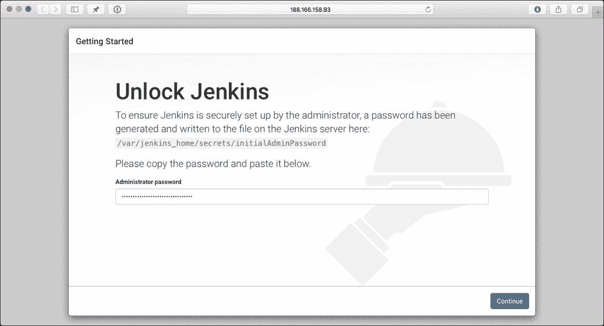

出于安全原因，在启动 Jenkins 容器时，会生成一个随机字符串；在继续安装之前，Jenkins 会要求你确认该字符串是什么。你可以通过运行此命令来找出它：

```
less /var/lib/jenkins/secrets/initialAdminPassword

```

你可以按*Q*键退出`less`。

这一功能非常受欢迎，因为如果一开始没有正确地保护你的 Jenkins 安装，可能会产生严重的后果，正如我发现的那样——第三方劫持了我一直忘记关闭的一个测试 Jenkins 1.x 安装版本——哎呀！

输入初始管理员密码后，点击**继续**按钮。

下一页将会询问你希望安装哪些插件：

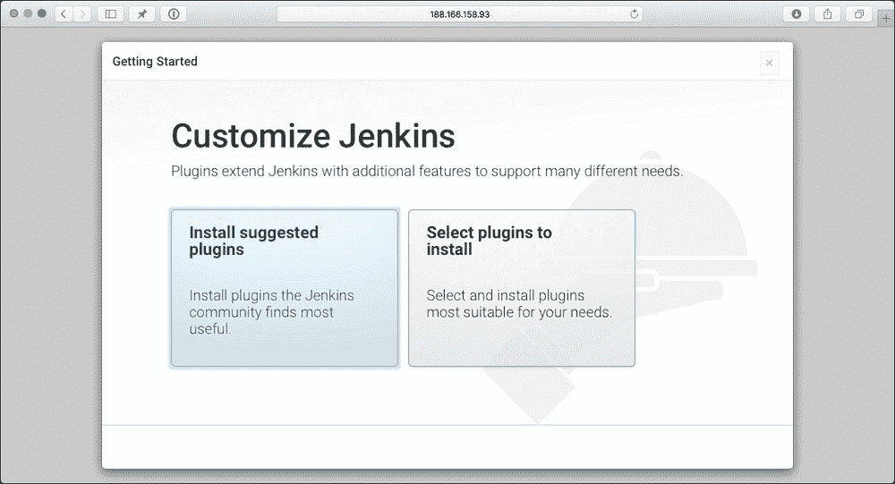

对于我们的目的，只需点击**安装推荐插件**，该选项已高亮显示。下一页将展示推荐插件的安装进度：

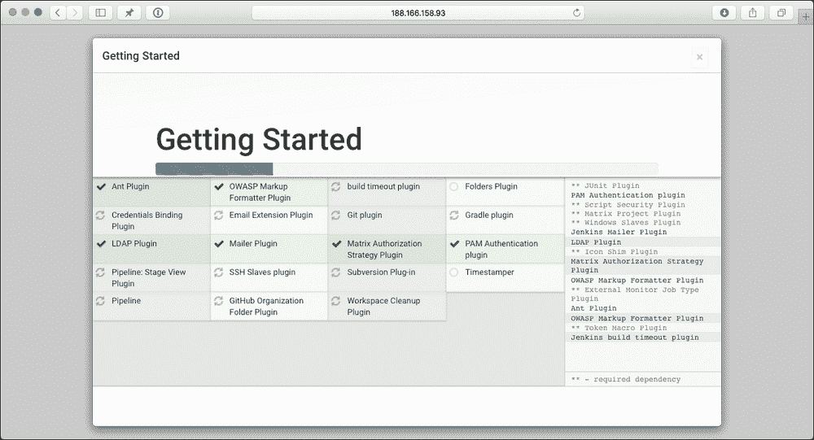

完成安装需要一两分钟。安装完成后，系统将要求你创建一个 Jenkins 用户：

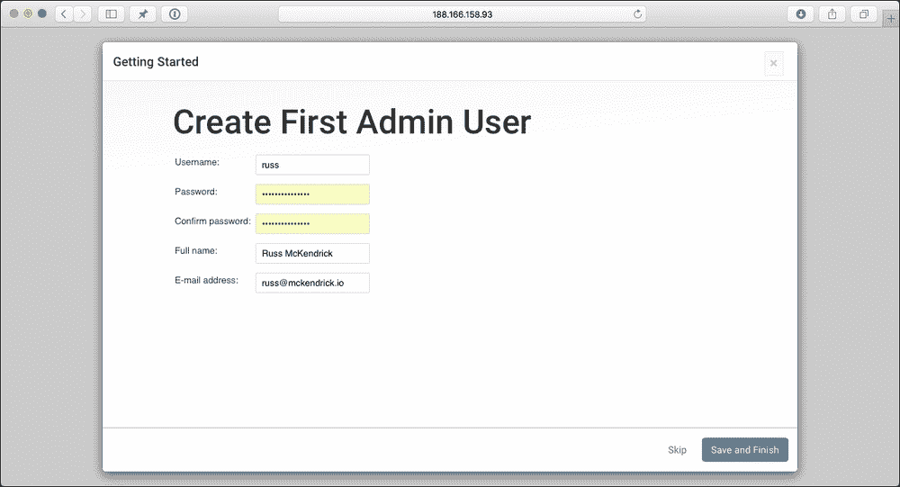

正如我之前提到的，确保一开始就保护好你的 Jenkins 安装非常重要，所以我建议你不要跳过这一步。填写完所需的信息后，点击**保存并完成**按钮。如果一切顺利，你将看到以下页面：

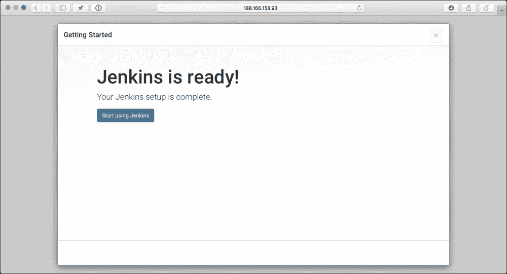

现在你需要做的就是点击**开始使用 Jenkins**，然后你将会登录并进入起始页面，界面如下所示：

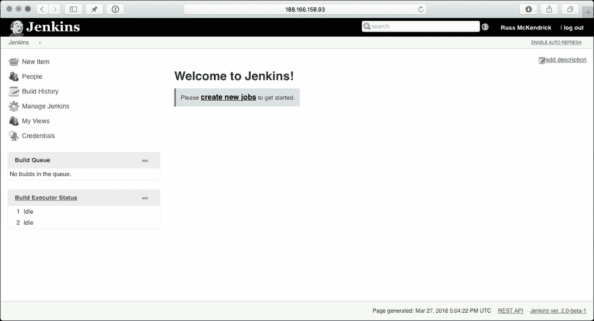

这个安装过程是 Jenkins 2 带来的许多改进之一；以前，你需要先安装 Jenkins，然后手动完成几个向导和程序来同时确保安全性和配置软件，正如我之前提到的，如果没有做好这些，可能会带来严重后果。

设置的最后一步是安装 CloudBees Docker Pipeline 插件；为此，请点击左侧菜单中的**管理 Jenkins**按钮，然后点击**管理插件**按钮。

由于这是一个新安装，你可能会看到关于插件更新的消息。忽略重启 Jenkins 的请求；我们将在安装过程中完成这一操作。

主屏幕上有四个标签；点击**可用**按钮，你将看到所有 Jenkins 插件的列表。

在主屏幕的右上角，有一个标为**筛选**的搜索框。在这里输入`Docker Pipeline`，你应该会看到一个结果。勾选安装框，然后点击**现在下载并在重启后安装**按钮。

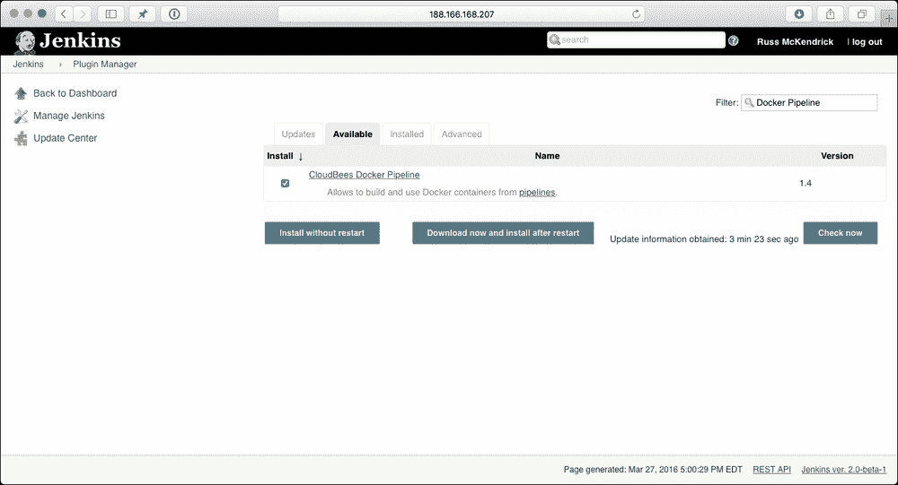

重新启动 Jenkins 需要一两分钟；重启后，你将被提示使用安装过程中提供的凭据重新登录。

现在你已经安装并配置好 Jenkins，接下来是添加我们的管道。为此，我们需要一个应用程序来添加。

## 创建应用程序

以下 GitHub 仓库提供了一个基于 Moby Counter 的示例应用程序：`https://github.com/russmckendrick/jenkins-docker-example/tree/master`。主页如下所示：

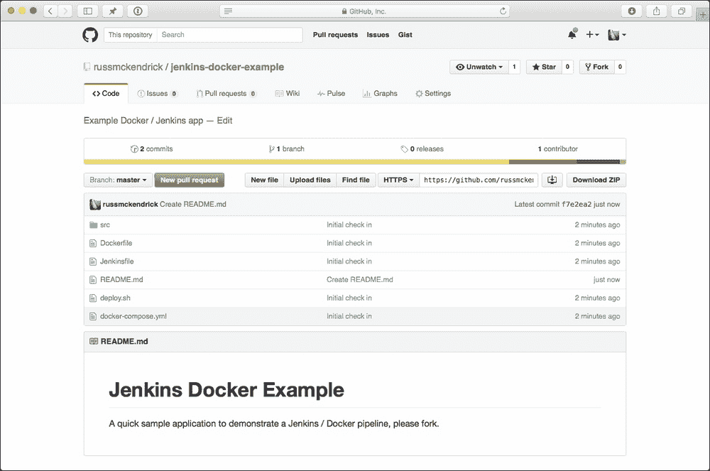

在我们添加应用程序之前，最好先 fork 代码，因为我们稍后将对代码库进行更改。为此，请点击屏幕右上角的**Fork**按钮。系统将询问你希望将仓库 fork 到哪里。fork 完成后，记下仓库的 URL。

由于我拥有这个仓库，我无法将其 fork。为此，我创建了一个名为`jenkins-pipeline`的副本，因此你将在接下来的部分中看到对此的引用。

## 创建管道

现在 Jenkins 已经配置好，我们也有一个包含应用程序的 GitHub 仓库，接下来我们想要部署。是时候撸起袖子，在 Jenkins 中配置管道了。

首先，在主页点击**创建新作业**按钮，你将进入一个包含多个选项的页面，在顶部框中输入管道的名称。

我将我的命名为`Docker Pipeline`，然后点击**Pipeline**按钮。你应该会看到一个小框，底部有一个写着**OK**的按钮，点击**OK**按钮以创建管道，这将带你进入配置界面：

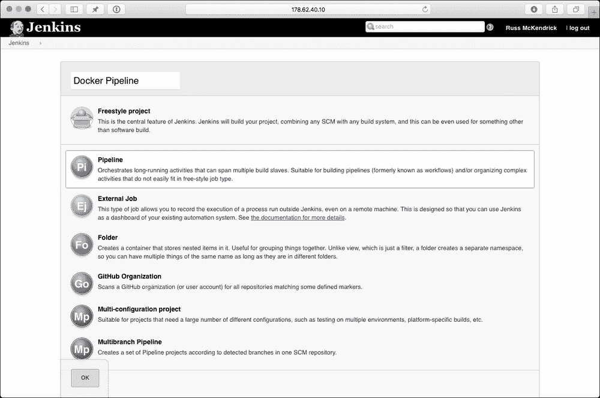

你现在将处于管道配置界面，正如你所看到的，有很多选项。我们将保持非常简单，只添加一个管道脚本。脚本看起来类似于以下代码：

```
node {
  stage 'Checkout'
  git url: 'https://github.com/russmckendrick/jenkins-pipeline.git'

  stage 'build'
  docker.build('mobycounter')

  stage 'deploy'
  sh './deploy.sh'
}
```

在你将脚本添加到配置页面的 Pipeline 部分之前，请将 Git URL 替换为你自己仓库的 URL。其他所有选项保持不变，点击**Save**按钮：

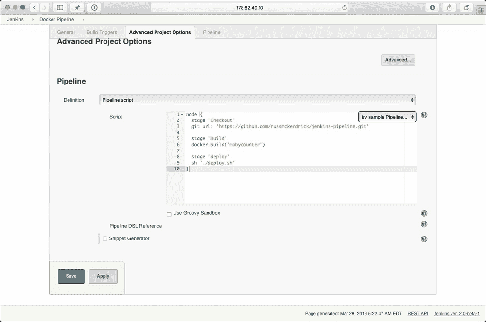

就这样，我们的管道已经配置好。我们告诉 Jenkins 每次触发构建时执行以下三项任务：

+   **Checkout**：这将从你的 GitHub 仓库下载我们应用程序的最新代码。

+   **Build**：这使用 GitHub 仓库中的`Dockerfile`来构建`Mobycounter`镜像。

+   **Deploy**：这运行一个脚本，清除任何当前正在运行的容器，然后使用包含的 Docker Compose 文件重新启动应用程序。在启动 Redis 时，Docker Compose 文件使用内建的 volume 驱动程序来处理`/data`，这意味着 Docker 图标的位置将在容器重新启动之间保持不变。

要触发构建，请点击左侧菜单中的**立即构建**按钮。如果一切顺利，你应该会看到类似以下截图的内容：

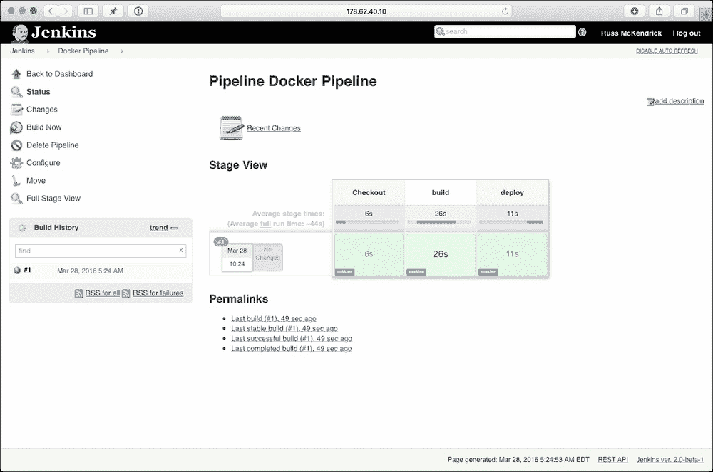

如你所见，所有三个任务都顺利执行。你应该能够通过打开浏览器并使用以下命令查看应用程序：

```
open http://$(docker-machine ip jenkins)/

```

放置一些标志来测试一切是否按预期工作，完成了，你已经使用 Jenkins 部署了你的应用：

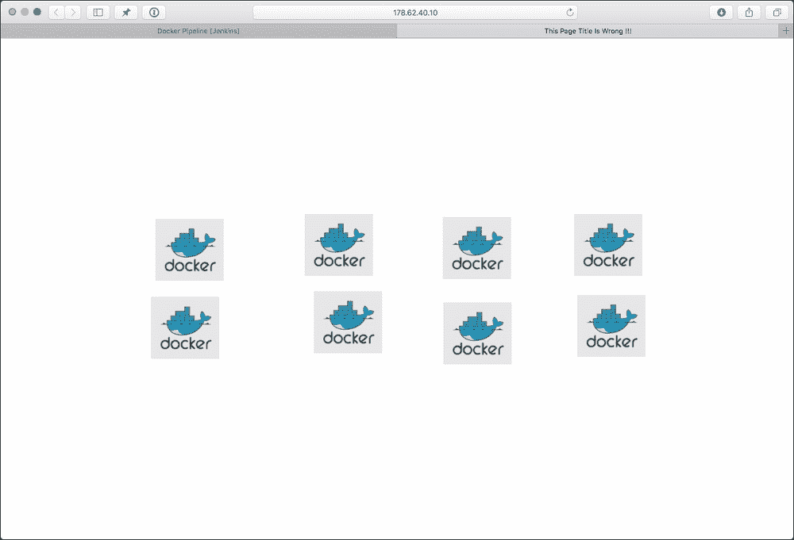

等一下——出现了问题！正如你可能已经注意到的，页面标题是错误的。

让我们来修复这个问题。为此，请进入你的 GitHub 仓库中的以下页面：`your-github-repo` | `src` | `client` | `index.html`。在这里，点击**编辑**按钮。进入编辑页面后，在 `<title>` 和 `</title>` 标签之间更新标题，然后点击**提交更改**按钮。

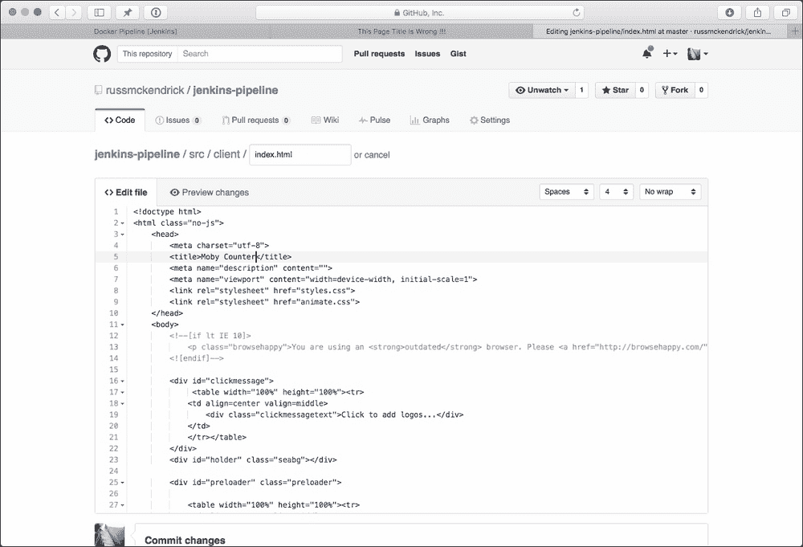

现在你已经更新了应用程序代码，回到 Jenkins，再次点击**立即构建**。这将触发第二次构建，部署我们在 GitHub 中所做的更改。

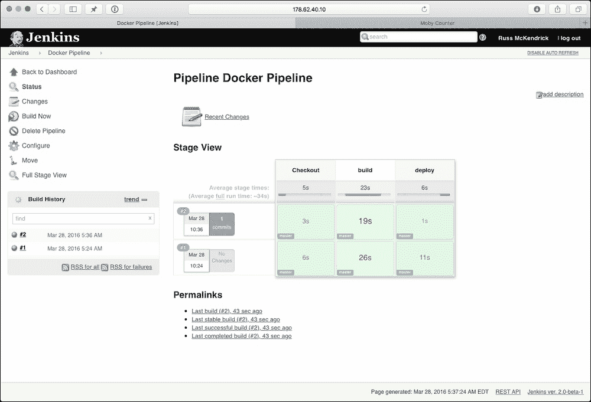

如前截图中第二个浏览器标签所示，我们的应用程序标题已经更改，第二次构建也成功了。如果你刷新应用程序窗口，你应该能看到标题已更新，Docker 标志也仍在你放置的位置。

还需要注意的是，第二次构建确认了我们的初始构建和当前构建之间有一个提交差异。此外，构建本身所需的时间比原始构建少；这是因为 Docker 不需要第二次下载基础镜像。

你可以通过将鼠标悬停在你想查看日志的阶段上，并点击**日志**链接来查看每个任务的日志。这会弹出一个对话框，显示该任务的日志：

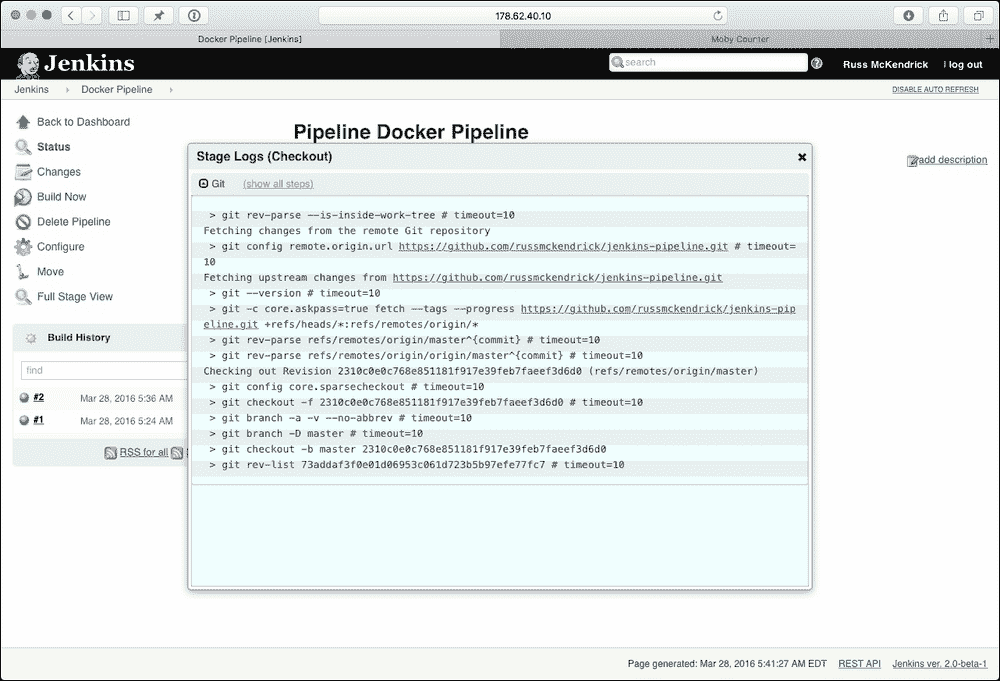

你还可以通过点击左侧菜单中的构建编号，例如 `#2`，然后点击**控制台输出**按钮，查看每次构建的完整控制台输出：

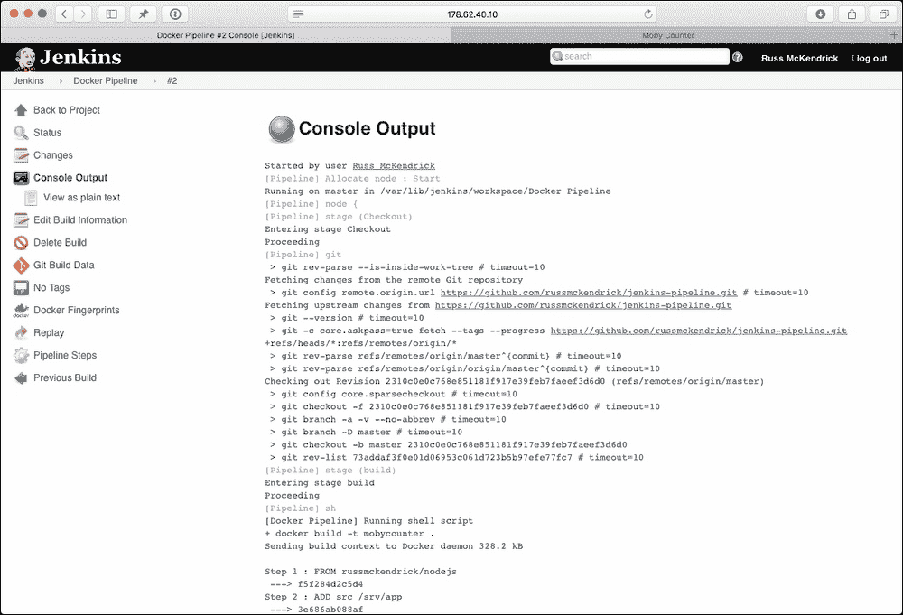

这在你的构建有错误时非常有用。尝试点击一些选项，如**Docker 指纹**和**更改**，查看每次构建过程中记录的其他信息。

返回到 Jenkins 的主页面，你应该能够看到一个快速的构建概览。你还应该能看到管道旁边有一个太阳图标，这意味着一切正常。

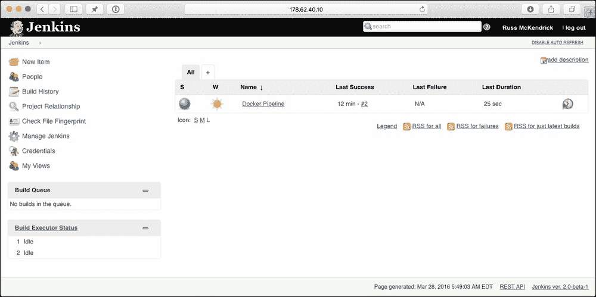

如果第二次构建有问题怎么办？假设在我们编辑页面标题时在 Dockerfile 中犯了语法错误，会发生什么呢？

Jenkins 会从 GitHub 检查更新文件，启动更新镜像的构建，检测到错误后失败。由于这一阶段会产生错误，因此部署阶段不会执行，这意味着我们的应用程序仍将以当前状态运行，错误的标题也会保留。

这正是 Jenkins 的强大之处，如果你在代码和部署管道中配置了足够的测试，你可以防止任何可能影响服务的变更被部署，而且它还记录了足够的信息，当出现错误时，它能成为一个极为宝贵的资源，帮助你追踪问题。

## Jenkins 总结

正如你可能注意到的，我们在 Jenkins 的讨论中只是触及了冰山一角，许多功能我们并未覆盖，因为它超出了本书的范围。

然而，从我们所讨论的内容中，我希望你能看到使用像 Jenkins 这样的持续集成和部署平台的价值，它可以帮助你构建和部署容器及代码。如果你部署任何类型的代码，千万不要像我一样迟到了，考虑使用 Jenkins 来协助你，不要等到你部署了一个严重影响应用程序的错误之后才后悔。

# 总结

本章中我们所讨论的所有工具有一个共同点，那就是它们都迅速发展，提供对 Docker 的支持，填补了核心 Docker 工具集中缺失的功能空白。

在过去的 12 个月里，Docker 的快速发展意味着其中一些工具可能不再是必需的。

然而，由于这些工具在 Docker 之外提供了广泛的功能，这意味着它们仍然可以成为你日常工作流程中非常有价值的一部分，即使 Docker 只是你所使用的技术之一。

使用本章中的工具有一个不足之处，那就是它们缺乏对容器部署位置的智能决策，你仍然需要指示工具去*将容器 A 放置在 Docker 主机 Z 上*。

在我们的下一章中，我们将会介绍调度程序，它们会根据主机的可用性、利用率以及其他规则（例如*不要将容器 A 与容器 B 部署在同一主机上*）来决定将容器部署到哪里，这意味着你不再局限于固定的基础设施。
