# 发布镜像

在上一章中，你学习了如何构建 Docker 镜像。下一步就是将这些镜像发布到公共仓库，供公众发现和使用。因此，本章将重点介绍如何在 Docker Hub 上发布镜像，以及如何充分利用 Docker Hub。我们将创建一个新的 Docker 镜像，使用`commit`命令和`Dockerfile`进行构建，并将其推送到 Docker Hub。本章还会讨论 Docker 可信仓库的概念。这个 Docker 可信仓库是从 GitHub 或 Bitbucket 创建的，可以与 Docker Hub 集成，自动构建镜像，从而随着仓库更新而生成镜像。这个 GitHub 上的仓库用于存储之前创建的`Dockerfile`。此外，我们将展示全球各地的组织如何使其开发团队能够设计和贡献多种 Docker 镜像，并将它们存储在 Docker Hub 中。Docker Hub 的 REST API 可以用于用户管理和通过编程方式操作仓库。

本章涵盖的主题包括：

+   了解 Docker Hub

+   将镜像推送到 Docker Hub

+   镜像的自动构建

+   Docker Hub 上的私有仓库

+   在 Docker Hub 上创建组织

+   Docker Hub REST API

## 了解 Docker Hub

Docker Hub 是用于存储 Docker 镜像的中心平台，无论是公共仓库还是私有仓库。Docker Hub 提供了诸如 Docker 镜像仓库、用户认证、自动构建镜像、与 GitHub 或 Bitbucket 集成、管理组织和小组等功能。Docker Hub 的 Docker Registry 组件负责管理 Docker 镜像仓库。此外，你还可以使用 Docker 安全扫描来保护你的仓库，目前这一功能是免费的。此功能首次在 IBM 容器仓库中启用。

Docker Registry 是用于存储镜像的存储系统。自动构建是 Docker Hub 的一个功能，但在撰写本书时，它尚未开源。下图展示了典型功能：


为了使用 Docker Hub，你需要注册并创建一个 Docker Hub 账户，注册链接为 [`hub.docker.com/`](https://hub.docker.com/)。你可以更新 Docker Hub ID、电子邮件地址和密码字段，如下图所示：

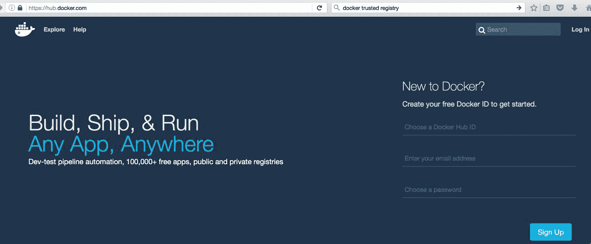

完成注册流程后，你需要完成通过电子邮件收到的验证。完成电子邮件验证后，你在登录 Docker Hub 时将看到类似以下的截图：

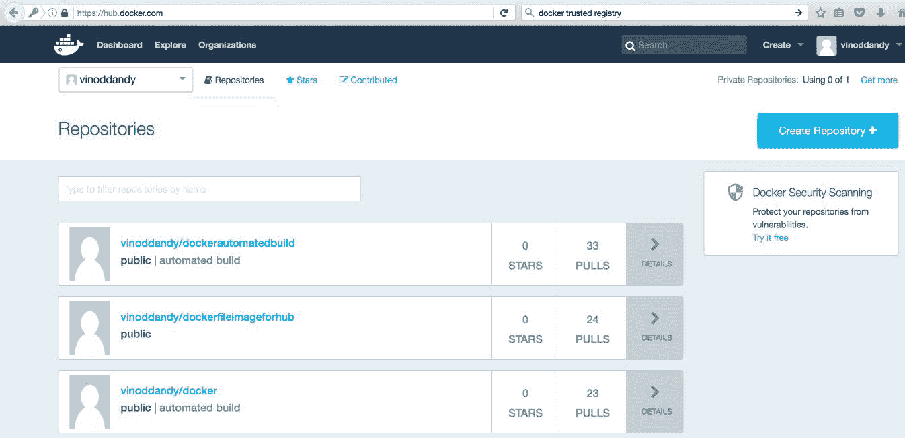

Docker Hub 账户的创建已成功完成，现在你可以从[`hub.docker.com/login/`](https://hub.docker.com/login/)登录到你的 Docker Hub 账户，如下图所示：

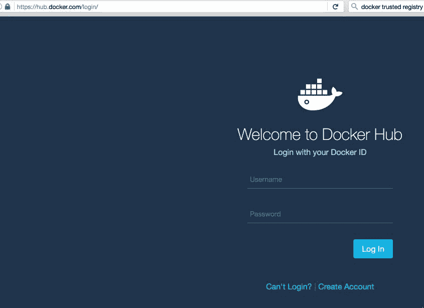

Docker Hub 还支持使用 Ubuntu 终端访问 Docker Hub 的命令行：

```
$ sudo docker login  

```

使用你的 Docker ID 登录，以便从 Docker Hub 推送和拉取镜像。如果你没有 Docker ID，可以访问[`hub.docker.com`](https://hub.docker.com)创建一个。然后在终端中输入你的用户名和密码：

```
Username: vinoddandy
Password: 

```

成功登录后，输出如下：

```
Login Succeeded

```

你可以在 Docker Hub 上浏览可用的镜像，网址是[`hub.docker.com/explore/`](https://hub.docker.com/explore/)：

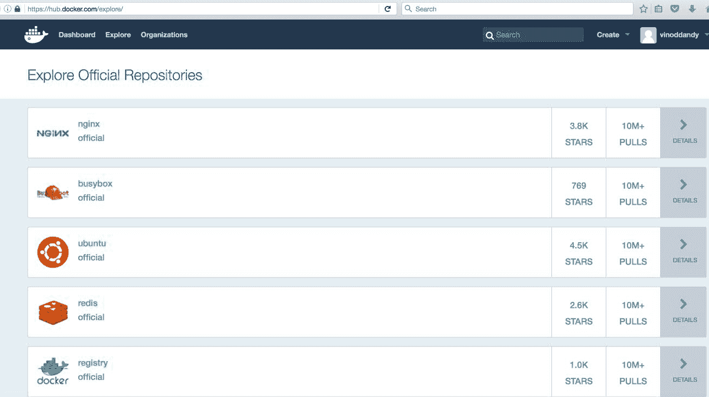

你还可以查看你的设置，更新个人资料，并获取支持社区的详细信息，如 Twitter、Stack Overflow、#IRC、Google Groups 和 GitHub。

## 将镜像推送到 Docker Hub

在这里，我们将在本地机器上创建一个 Docker 镜像，并将其推送到 Docker Hub。你需要执行以下步骤：

1.  在本地机器上创建 Docker 镜像，方法如下：

+   使用`docker commit`子命令

+   使用`docker commit`子命令和`Dockerfile`

1.  将这个创建的镜像推送到 Docker Hub

1.  从 Docker Hub 删除镜像

我们将使用`ubuntu`基础镜像，运行容器，添加一个新目录和一个新文件，然后创建一个新镜像。在第三章《构建镜像》中，我们学习了如何使用`Dockerfile`创建 Docker 镜像。你可以参考该章节，查看`Dockerfile`语法的详细信息。

我们将使用`ubuntu`基础镜像，以`containerforhub`为容器名运行容器，如下面的终端代码所示：

```
$ sudo docker run -i --name="containerforhub" -t ubuntu /bin/bash 
Unable to find image 'ubuntu:latest' locally 
latest: Pulling from library/ubuntu 
952132ac251a: Pull complete 
Digest: sha256:f4691c96e6bbaa99d99ebafd9af1b68ace2aa2128ae95a60369c506dd6e6f6ab 
Status: Downloaded newer image for ubuntu:latest 
root@1068a1fae7da:/#  

```

接下来，我们将在`containerforhub`容器中创建一个新的目录和文件。我们还将更新这个新文件，添加一些示例文本，以便稍后进行测试：

```
root@1068a1fae7da:/# mkdir mynewdir 
root@1068a1fae7da:/# cd mynewdir 
root@1068a1fae7da:/mynewdir# echo 'this is my new container to make image and then push to hub' > mynewfile 
root@1068a1fae7da:/mynewdir# cat mynewfile 
this is my new container to make image and then push to hub 
root@1068a1fae7da:/mynewdir# 

```

让我们使用`docker commit`命令从刚刚创建的容器中构建新镜像。

`commit`命令将从主机机器上执行，而不是从容器内部执行：

```
$ sudo docker commit -m="NewImage for second edition" containerforhub vinoddandy/imageforhub2 
sha256:619a25519578b0525b4c098e3d349288de35986c1f3510958b6246fa5d3a3f56 

```

你应该用你自己的 Docker Hub 用户名替代`vinoddandy`，以创建镜像。

现在，我们在本地机器上有一个新的 Docker 镜像，名称为`vinoddandy/imageforhub2`。此时，一个包含`mynewdir`和`mynewfile`的新镜像已经在本地创建：

```
$ sudo docker images -a 
REPOSITORY TAG IMAGE ID CREATED SIZE 
vinoddandy/imageforhub2 latest 619a25519578 
2 minutes ago 126.6 MB 

```

我们将使用`sudo docker login`命令登录 Docker Hub，正如本章之前所讨论的。

让我们从主机机器推送这个镜像到 Docker Hub：

```
$ sudo docker push vinoddandy/imageforhub2 
The push refers to a repository [docker.io/vinoddandy/imageforhub2] 
0ed7a0595d8a: Pushed 
0cad5e07ba33: Mounted from library/ubuntu 
48373480614b: Mounted from library/ubuntu 
latest: digest: sha256:cd5a86d1b26ad156b0c74b0b7de449ddb1eb51db7e8ae9274307d27f810280c9 size: 1564 

```

现在，我们将登录 Docker Hub，并在 Repositories 中验证该镜像。

要测试来自 Docker Hub 的镜像，让我们从本地机器中删除这个镜像。首先，我们需要停止容器，然后删除容器：

```
$ sudo docker stop containerforhub 
$ sudo docker rm containerforhub 

```

我们还将删除`vinoddandy/imageforhub2`镜像：

```
$ sudo docker rmi vinoddandy/imageforhub2
Untagged: vinoddandy/imageforhub2:latest 
Untagged: vinoddandy/imageforhub2@sha256:cd5a86d1b26ad156b0c74b0b7de449ddb1eb51db7e8ae9274307d27f810280c9 
Deleted: sha256:619a25519578b0525b4c098e3d349288de35986c1f3510958b6246fa5d3a3f56 

```

我们将从 Docker Hub 拉取新创建的镜像，并在本地机器上运行新容器：

```
$ sudo docker run -i --name="newcontainerforhub" -t \ vinoddandy/imageforhub2 /bin/bash 
Unable to find image 'vinoddandy/imageforhub2:latest' locally 
latest: Pulling from vinoddandy/imageforhub2 

952132ac251a: Already exists 
82659f8f1b76: Already exists 
Digest: sha256:cd5a86d1b26ad156b0c74b0b7de449ddb1eb51db7e8ae9274307d27f810280c9 
Status: Downloaded newer image for vinoddandy/imageforhub2:latest 
root@9dc6df728ae9:/# cat /mynewdir/mynewfile 
this is my new container to make image and then push to hub 
root@9dc6df728ae9::/# 

```

所以，我们已经从 Docker Hub 拉取了最新镜像，并使用新创建的`vinoddandy/imageforhub2`镜像创建了容器。请注意，`Unable to find image 'vinoddandy/imageforhub2:latest' locally`消息确认镜像是从 Docker Hub 的远程仓库下载的。

`mynewfile`中的文本验证了它与之前创建的镜像相同。

最后，我们将在[`hub.docker.com/r/vinoddandy/imageforhub2/`](https://hub.docker.com/r/vinoddandy/imageforhub/)从 Docker Hub 删除该镜像，然后点击“设置”，再点击“删除”，如以下截图所示：

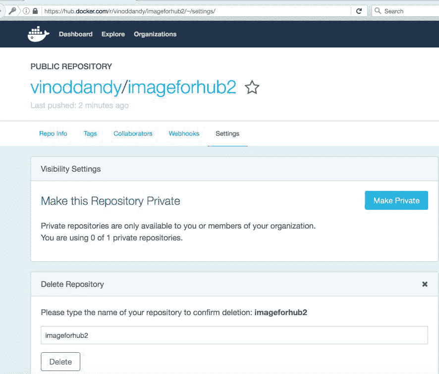

我们将再次创建此镜像，但这次使用`Dockerfile`过程。所以，让我们使用在第三章《构建镜像》中解释的`Dockerfile`概念来创建 Docker 镜像，并将该镜像推送到 Docker Hub。

本地机器上的`Dockerfile`如下所示：

```
########################################### 
# Dockerfile to build a new image 
########################################### 
# Base image is Ubuntu 
FROM ubuntu:16.04 
# Author: Dr. Peter 
MAINTAINER Dr. Peter <peterindia@gmail.com> 
# create 'mynewdir' and 'mynewfile' 
RUN mkdir mynewdir 
RUN touch /mynewdir/mynewfile 
# Write the message in file 
   RUN echo 'this is my new container to make image and then push to hub'  
 >/mynewdir/mynewfile 

```

现在我们将使用以下命令在本地构建镜像：

```
$ sudo docker build -t="vinoddandy/dockerfileimageforhub1" .
Sending build context to Docker daemon 16.74 MB
Step 1 : FROM ubuntu:16.04
16.04: Pulling from library/ubuntu
862a3e9af0ae: Pull complete 
7a1f7116d1e3: Pull complete 
Digest: sha256:5b5d48912298181c3c80086e7d3982029b288678fccabf2265899199c24d7f89
Status: Downloaded newer image for ubuntu:16.04
---> 4a725d3b3b1c
Step 2 : MAINTAINER Dr. Peter <peterindia@gmail.com>
---> Running in 5be5edc9b970
---> 348692986c9b
Removing intermediate container 5be5edc9b970
Step 3 : RUN mkdir mynewdir
---> Running in ac2fc73d75f3
---> 21585ffffab5
Removing intermediate container ac2fc73d75f3
Step 4 : RUN touch /mynewdir/mynewfile
---> Running in c64c98954dd3
---> a6304b678ea0
Removing intermediate container c64c98954dd3
Step 5 : RUN echo 'this is my new container to make image and then push to hub' > /mynewdir/mynewfile
---> Running in 7f6d087e29fa
---> 061944a9ba54
Removing intermediate container 7f6d087e29fa
Successfully built 061944a9ba54  

```

我们将使用此镜像运行容器，如下所示：

```
$ sudo docker run -i --name="dockerfilecontainerforhub" -t vinoddandy/dockerfileimageforhub1 /bin/bash 
root@236bfb39fd48:/# cat /mynewdir/mynewfile 
this is my new container to make image and then push to hub 

```

`mynewdir`中的文本确认新镜像已经正确构建，并且包含一个新的目录和新文件。

重复在 Docker Hub 中的登录过程并推送这个新创建的镜像：

```
$ sudo docker login
Login with your Docker ID to push and pull images from Docker Hub. If you don't have a Docker ID, head over to https://hub.docker.com to create one.
Username (vinoddandy): vinoddandy
Password: 
Login Succeeded

$ sudo docker push vinoddandy/dockerfileimageforhub1
The push refers to a repository [docker.io/vinoddandy/dockerfileimageforhub1]
92e394693590: Pushed 
821a2be25576: Pushed 
dca059944a2e: Pushed 
ffb6ddc7582a: Mounted from library/ubuntu 
344f56a35ff9: Mounted from library/ubuntu 
530d731d21e1: Mounted from library/ubuntu 
24fe29584c04: Mounted from library/ubuntu 
102fca64f924: Mounted from library/ubuntu 
latest: digest: sha256:c418c88f260526ec51ccb6422e2c90d0f6fc16f1ab81da9c300160d0e0f7bd87 size: 1979

```

最后，我们可以验证该镜像是否在 Docker Hub 上可用：

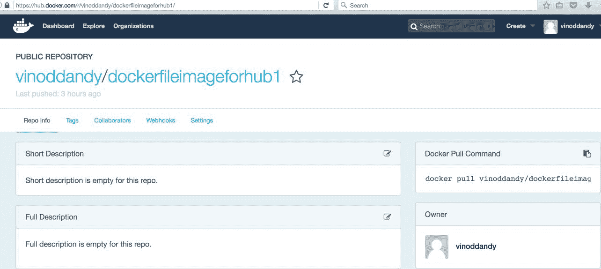

## 自动化镜像构建过程

你已经学会了如何在本地构建镜像并将这些镜像推送到 Docker Hub。Docker Hub 还具有从 GitHub 或 Bitbucket 的仓库中`Dockerfile`自动构建镜像的能力。自动构建在 GitHub 和 Bitbucket 的私有和公共仓库中都受支持。Docker Hub Registry 保存所有自动构建的镜像。Docker Hub Registry 是开源的，可以从[`github.com/docker/docker-registry`](https://github.com/docker/docker-registry)访问。

我们将讨论实现自动化构建过程所需的步骤：

1.  我们首先将 Docker Hub 与我们的 GitHub 账户连接。

1.  从[`hub.docker.com/login/`](https://hub.docker.com/login/)登录 Docker Hub，点击“创建”，然后导航到“创建自动构建”，如以下截图所示：

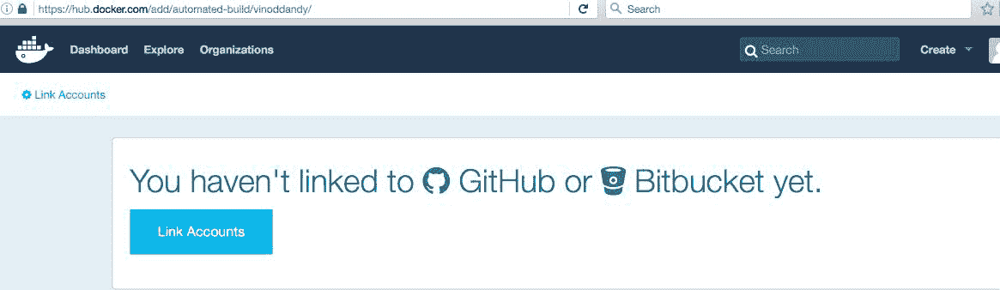

1.  我们现在选择“链接账户”：

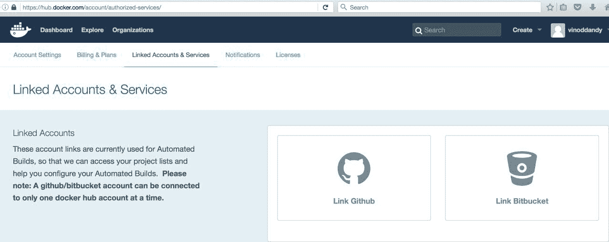

1.  一旦选择 GitHub，我们将选择“公开”和“私有（推荐）”，如图所示：

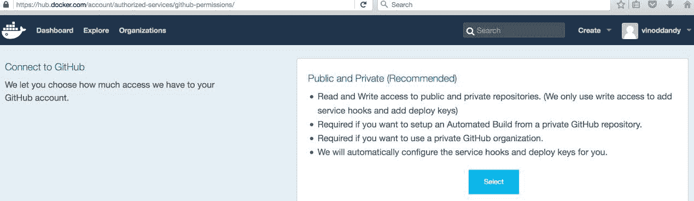

点击“选择”后，您的 GitHub 仓库将显示出来。

1.  现在，提供 GitHub 凭据以将 GitHub 账户与 Docker Hub 连接，然后选择“登录”：

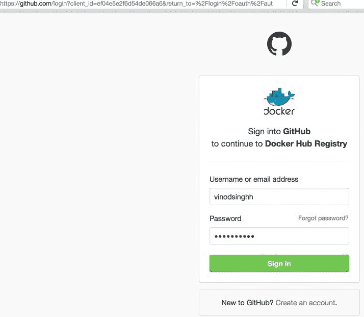

1.  成功登录后，Linked Accounts & Services 屏幕将如下所示：

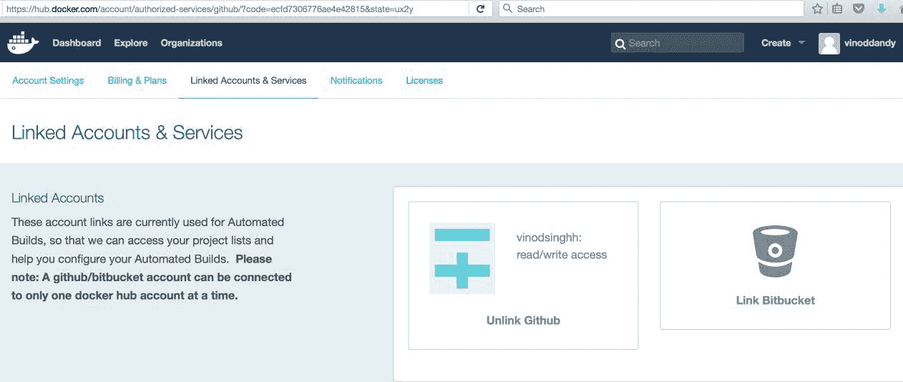

因此，每当 GitHub 中的`Dockerfile`更新时，自动构建会触发，并且新镜像将被存储在 Docker Hub Registry 中。我们可以随时检查构建历史。我们可以更改本地机器上的`Dockerfile`并将其推送到 GitHub。现在，我们可以在[`hub.docker.com/r/vinoddandy/dockerautomatedbuild/builds/`](https://hub.docker.com/r/vinoddandy/dockerautomatedbuild/builds/)看到 Docker Hub 的自动构建链接：

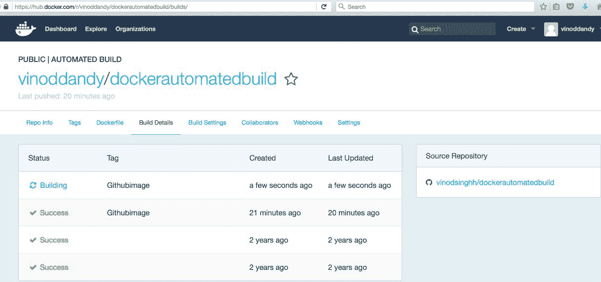

## Docker Hub 上的私有仓库

Docker Hub 提供了公共和私有仓库。公共仓库对用户免费，私有仓库则是付费服务。带有私有仓库的计划有不同的尺寸，例如微型、小型、中型或大型订阅。

Docker 已将其公共仓库代码开源，网址是[`github.com/docker/docker-registry`](https://github.com/docker/docker-registry)。

通常，企业不希望将他们的 Docker 镜像存储在 Docker 的公共或私有仓库中。它们更倾向于保留、维护和支持自己的仓库。因此，Docker 还为企业提供了创建和安装自己仓库的选项。

让我们使用 Docker 提供的`registry`镜像在本地机器上创建一个仓库。我们将使用来自 Docker 的`registry`镜像在本地机器上运行注册表容器：

```
$ sudo docker run -p 5000:5000 -d registry 
768fb5bcbe3a5a774f4996f0758151b1e9917dec21aedf386c5742d44beafa41

```

在自动化构建部分，我们构建了`vinoddandy/dockerfileimageforhub1`镜像。现在，让我们将`224affbf9a65`镜像 ID 标记到我们本地创建的注册表镜像上。此镜像标记是为了在本地仓库中进行唯一标识。该镜像注册表可能在仓库中有多个变种，因此这个标签将帮助你识别特定的镜像：

```
$ sudo docker tag 224affbf9a65 \ localhost:5000/vinoddandy/dockerfileimageforhub1  

```

标记完成后，使用`docker push`命令将此镜像推送到新的注册表：

```
$ sudo docker push localhost:5000/vinoddandy/dockerfile
imageforhub1
The push refers to a repository [localhost:5000/vinoddandy/dockerfileimageforhub1
] (len: 1)
Sending image list
Pushing repository localhost:5000/vinoddandy/dockerfileimageforhub1 (1 tags)
511136ea3c5a: Image successfully pushed
d497ad3926c8: Image successfully pushed
----------------------------------------------------
224affbf9a65: Image successfully pushed
Pushing tag for rev [224affbf9a65] on {http://localhost:5000/v1/repositories/vinoddandy/dockerfileimageforhub1/tags/latest}  

```

现在，新的镜像已经在本地仓库中可用。你可以从本地注册表中获取这个镜像并运行容器。这个任务留给你来完成。

## Docker Hub 上的组织和团队

私有仓库的一个有用方面是，你可以仅与组织或团队的成员共享它们。Docker Hub 让你创建组织，在其中你可以与同事协作并管理私有仓库。接下来，你将学习如何创建和管理组织。

第一步是在 Docker Hub 上创建一个组织，网址是[`hub.docker.com/organizations/add/`](https://hub.docker.com/organizations/add/)，如下图所示：

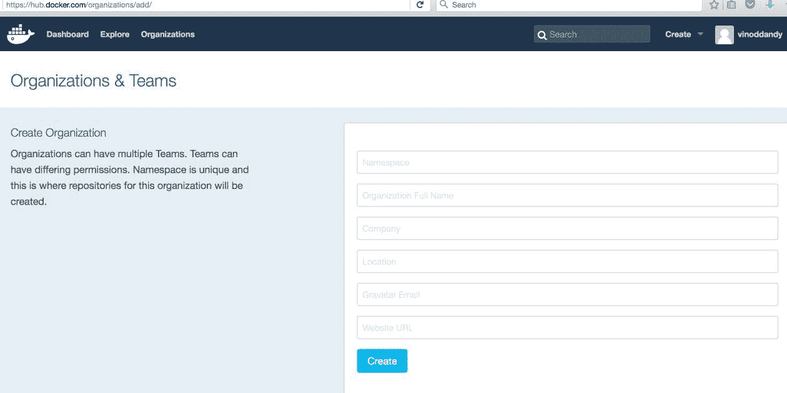

在你的组织内部，你可以添加更多的组织，然后将成员添加到其中：

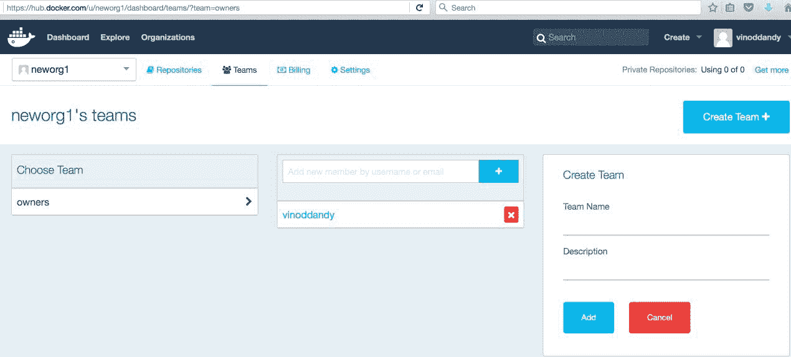

你组织和团队的成员可以与组织和团队协作。这个功能在私有仓库的情况下会更加有用。

## Docker Hub 的 REST API

Docker Hub 提供了一个 REST API，可以通过程序集成 Hub 的功能。REST API 支持用户和仓库管理。

用户管理支持以下功能：

+   **用户登录**：用于用户登录到 Docker Hub：

```
 GET /v1/users 
 $ curl --raw -L --user vinoddandy:password 
 https://index.docker.io/v1/users 
 4 
 "OK" 
 0 

```

+   **用户注册**：用于注册新用户：

```
 POST /v1/users 

```

+   **更新用户**：用于更新用户的密码和电子邮件：

```
 PUT /v1/users/(username)/ 

```

仓库管理支持以下功能：

+   **创建用户仓库**：用于创建用户仓库：

```
 PUT /v1/repositories/(namespace)/(repo_name)/ 
 $ curl --raw -L -X POST --post301 -H 
 "Accept:application/json" -H "Content-Type: 
 application/json" --data-ascii '{"email": 
 "singh_vinod@yahoo.com", "password": "password", 
 "username": "singhvinod494" }' 
 https://index.docker.io/v1/users 
 e 
 "User created" 
 0 

```

在你创建仓库后，你的仓库将在这里列出，如以下截图所示：

+   **删除用户存储库**：这将删除一个用户存储库：

```
 DELETE /v1/repositories/(namespace)/(repo_name)/ 

```

+   **创建库存储库**：这将创建一个库存储库，并且仅对 Docker 管理员可用：

```
 PUT /v1/repositories/(repo_name)/ 

```

+   **删除库存储库**：这将删除一个库存储库，并且仅对 Docker 管理员可用：

```
 DELETE /v1/repositories/(repo_name)/ 

```

+   **更新用户存储库镜像**：这将更新用户存储库中的镜像：

```
 PUT /v1/repositories/(namespace)/(repo_name)/images 

```

+   **列出用户存储库镜像**：这将列出用户存储库中的镜像：

```
 GET /v1/repositories/(namespace)/(repo_name)/images 

```

+   **更新库存储库镜像**：这将更新库存储库中的镜像：

```
 PUT /v1/repositories/(repo_name)/images 

```

+   **列出库存储库镜像**：这将列出库存储库中的镜像：

```
 GET /v1/repositories/(repo_name)/images 

```

+   **为库存储库授权令牌**：这将为库存储库授权一个令牌：

```
 PUT /v1/repositories/(repo_name)/auth 

```

+   **为用户存储库授权令牌**：这将为用户的存储库授权一个令牌：

```
 PUT /v1/repositories/(namespace)/(repo_name)/auth 

```

## 摘要

Docker 镜像是用于生成现实世界 Docker 容器的最突出的构建块，可以作为任何网络服务公开。开发人员可以查找和检查镜像的独特能力，并根据自己的需求使用它们，以构建高度可用、公开可发现、网络可访问和认知可组合的容器。所有精心制作的镜像都需要放在公共注册库中。在本章中，我们清楚地解释了如何在存储库中发布镜像。我们还讨论了可信存储库及其独特的特征。最后，我们展示了如何利用存储库的 REST API 来推送和处理 Docker 镜像以及用户管理，以编程方式进行操作。

Docker 镜像需要存储在公共、受控和网络可访问的位置，以便全球软件工程师和系统管理员可以轻松找到并利用。Docker Hub 被誉为集中聚合、策划和管理 Docker 镜像的最佳方法，源自 Docker 爱好者（内部和外部）。然而，企业无法承担将其 Docker 镜像保存在公共域中的成本，因此接下来的章节将专门解释在私有 IT 基础设施中进行镜像部署和管理所需的步骤。
