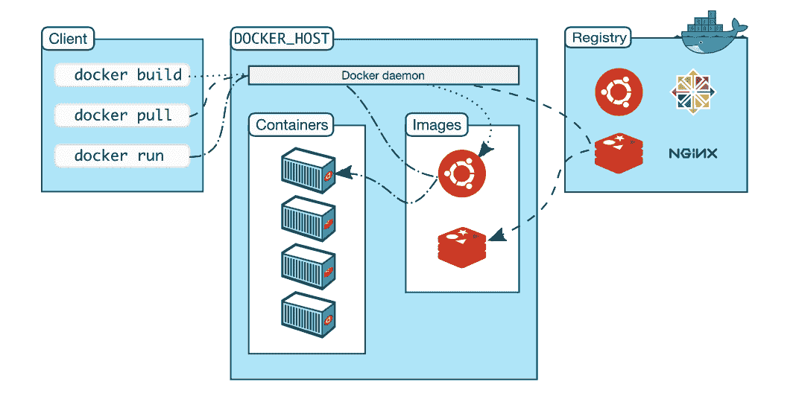
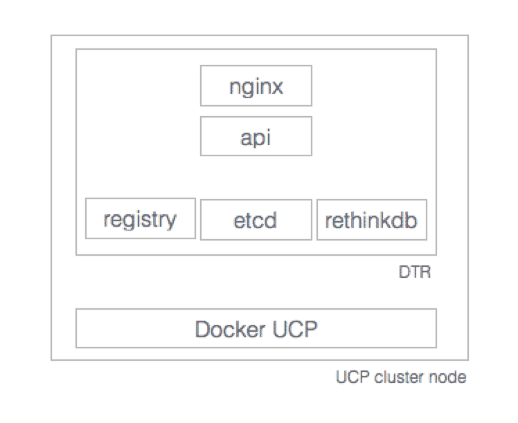
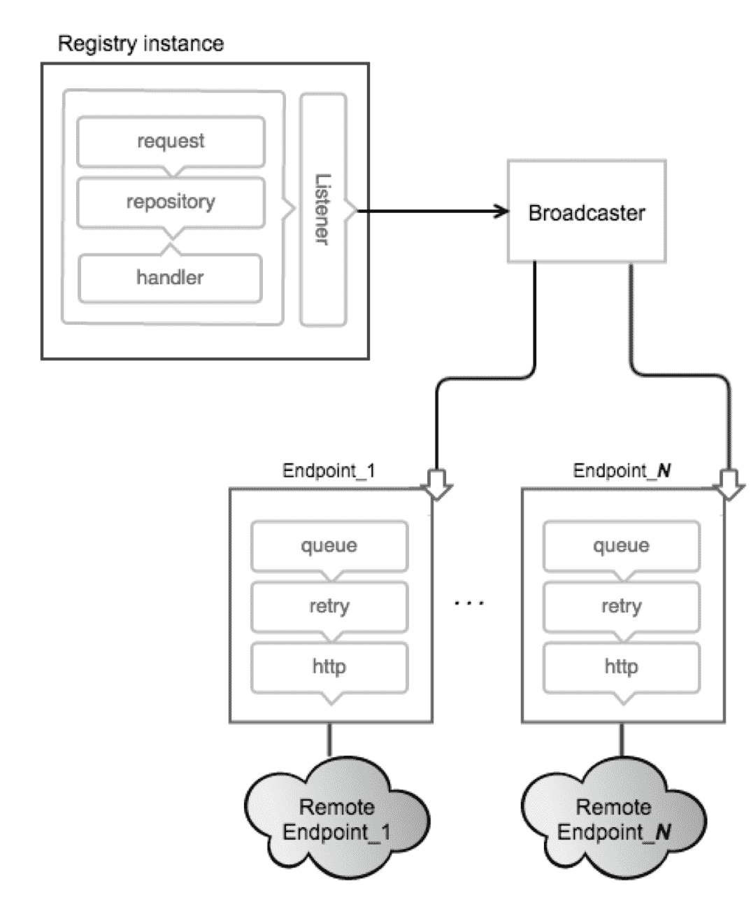

# 运行您的私有 Docker 基础设施

在第四章《发布镜像》中，我们讨论了 Docker 镜像，并清晰地解释了 Docker 容器是 Docker 镜像的运行时实现。如今，Docker 镜像和容器数量众多，因为容器化范式已经在 IT 领域掀起了风暴。因此，全球企业有必要出于安全考虑，将其 Docker 镜像存放在自己的私有基础设施中。因此，将 Docker Hub 部署到我们自己的基础设施的概念应运而生并不断发展。Docker Hub 对于注册和存储日益增多的 Docker 镜像至关重要且相关。Docker Hub 主要用于集中管理以下内容：

+   用户账户

+   镜像的校验和

+   公共命名空间

本章重点提供相关信息，帮助您和 Docker 容器开发者设计、构建并运行您自己的私有 Docker Hub。这一章涵盖以下重要内容：

+   Docker 注册表

+   Docker 注册表的使用案例

+   运行您自己的 Docker 注册表并将镜像推送到新创建的注册表

+   Webhook 通知

+   支持 Docker 注册表 HTTP API

## Docker 注册表

Docker 注册表的实现已完全改变，与本书早期版本中提到的旧版本不同。Docker 注册表 2.0 是用于存储和分发 Docker 镜像的新实现。它取代了先前的 Docker 注册表实现（[`github.com/docker/docker-registry`](https://github.com/docker/docker-registry)）。新实现可以在 [`github.com/docker/distribution`](https://github.com/docker/distribution) 上找到。它是 Apache 许可证下的开源项目。该注册表是一个无状态、高度可扩展的服务器端应用程序，用于存储和分发 Docker 镜像。新版本中不再使用 Docker 注册表索引。以前，Docker 注册表内部使用索引来进行用户认证。

Docker 注册表 2.0 已完成，采用全新的 Go 实现，并支持 Docker 注册表 HTTP API v2。当前的 Docker Hub ([`hub.docker.com`](https://hub.docker.com)) 基于新版本的 Docker 注册表 2.0，并支持 Docker Engine 1.6 或更高版本。这使得它对用户来说更加可靠且透明。所有云服务提供商，包括 AWS 和 IBM，已采用这一新的 Docker 注册表。

新的注册表实现提供以下优势：

+   更快的推送与拉取

+   安全高效的实现

+   简化部署

+   可插拔存储后端

+   Webhook 通知

Docker 注册表的总体架构如下图所示，展示了它如何在前端与 Nginx 集成，在后端与存储集成：



注册表的显著特点如下：

+   该注册表与 Docker Engine 1.6.0 或更高版本兼容。

+   默认存储驱动为本地 POSIX 文件系统，适用于开发或小型部署。它还支持不同的存储后端（S3、Microsoft Azure、OpenStack Swift 和阿里云 OSS）。

+   它原生支持 TLS 和基本身份验证。

+   在新版本中，注册表还支持强大的通知系统。注册表支持在注册表内部发生事件时发送 Webhook 通知。通知响应镜像清单和图层的推送与拉取。所有这些操作都被序列化为事件，事件会被排入注册表内部广播系统，该系统排队并将事件分发到端点（[`docs.docker.com/registry/notifications/#endpoints`](https://docs.docker.com/registry/notifications/#endpoints)）。

最新的 Docker 注册表发布了两种选项：

+   Docker 可信注册表

+   Docker 注册表

让我们详细讨论一下这两种选项：

+   **Docker 可信注册表**（**DTR**）：这是 Docker 的企业级解决方案。DTR 支持高可用性，并安装在 Docker **通用控制平面**（**UCP**）集群中。详细信息请参见以下网站：

    [`docs.docker.com/docker-trusted-registry/`](https://docs.docker.com/docker-trusted-registry/)。

DTR 支持镜像管理，并具有内置的安全性和访问控制。它还可以与 LDAP 和**Active Directory**（**AD**）集成，并支持**基于角色的访问控制**（**RBAC**）。

DTR 的一般架构如下图所示：



DTR 具有内置的身份验证机制。运行在节点上的 DTR 由以下容器组成：

+   `dtr-api-<replica_id>`：执行 DTR 业务逻辑。它为 DTR Web 应用程序和 API 提供服务。

+   `dtr-garant-<replica_id>`：管理 DTR 身份验证。

+   `dtr-jobrunner-<replica_id>`：在后台运行清理作业。

+   `dtr-nautilusstore-<replica_id>`：存储安全扫描数据。

+   `dtr-nginx-<replica_id>`：接收 HTTP 和 HTTPS 请求，并将其代理到其他 DTR 组件。默认监听主机的`80`和`443`端口。

+   `dtr-notary-server-<replica_id>`：接收、验证并提供内容信任元数据，在启用内容信任时，推送或拉取到 DTR 时会咨询此服务。

+   `dtr-notary-signer-<replica_id>`：为内容信任元数据执行服务器端时间戳和快照签名。

+   `dtr-registry-<replica_id>`：实现拉取和推送 Docker 镜像的功能，并处理镜像的存储方式。

+   `dtr-rethinkdb-<replica_id>`：用于持久化仓库元数据的数据库。

DTR 使用以下内部命名卷来持久化数据：

+   `dtr-ca`：私钥和证书存储在这里

+   `dtr-etcd`：这是 etcd 用于存储 DTR 内部配置的组件

+   `dtr-registry`：这是存储镜像的卷

+   `dtr-rethink`：RethinkDB 用于持久化 DTR 数据，如用户和仓库

默认情况下，DTR 将镜像存储在主机机器的本地文件系统上。对于高度可用的 DTR 安装，它还支持云存储或网络文件系统。DTR 可以配置为支持 Amazon S3、OpenStack Swift 和 Microsoft Azure。

+   **Docker Registry**：Registry 是一个无状态、高度可扩展的服务器端应用程序，用于存储和分发 Docker 镜像。Registry 是开源的，采用宽松的 Apache 许可证（[`en.wikipedia.org/wiki/Apache_License`](http://en.wikipedia.org/wiki/Apache_License)）。

本书将重点介绍开源 Docker Registry 的第二种选择。

## Docker Registry 的使用场景

Docker Registry 存储 Docker 镜像，并提供拉取、推送和删除镜像的基本功能。在典型的工作流中，对源代码版本控制系统的提交将触发 CI 系统上的构建，如果构建成功，CI 系统将把新镜像推送到 Registry。Registry 会发送通知，触发在暂存环境中的部署，或通知其他系统新镜像已可用。

当用户需要执行以下操作时，会使用 Docker Registry：

+   严格控制镜像存储位置

+   拥有镜像分发管道

+   将镜像存储和分发与后端开发工作流集成

Registry 的重要使用场景如下：

+   **拉取或下载镜像**：用户使用 Docker 客户端从 Docker Registry 请求镜像，Registry 会返回给用户相关的 Registry 详细信息。然后，Docker 客户端将直接请求 Registry 获取所需的镜像。Registry 内部会通过索引对用户进行身份验证。

+   **推送或上传镜像**：用户请求推送镜像，获取 Registry 信息，然后将镜像直接推送到 Registry。Registry 会验证用户身份，最后回应用户。

+   **删除镜像**：用户还可以请求从仓库中删除镜像。

用户可以选择使用带有或不带有索引的 Registry。使用不带索引的 Registry 最适合存储私有镜像。

除了前述的使用场景，Docker Registry 还支持镜像的版本控制。它可以与 **持续集成**（**CI**）和 **持续开发**（**CD**）系统集成。当一个新镜像成功推送到 Registry 时，Registry 会发送通知，触发在暂存环境中的部署，或通知其他系统新镜像已可用。

在 Docker Registry V2 中，还支持以下新使用场景：

+   **镜像验证**：Docker Engine 想要运行已验证的镜像，因此它需要确保镜像是从受信任的来源下载的，并且没有被篡改。Docker Registry V2 会返回一个清单，Docker Engine 会验证该清单的签名，然后才会下载镜像。在每一层下载之后，Engine 会验证该层的摘要，以确保内容符合清单所指定的内容。

+   **可恢复推送**：在将镜像上传到 Docker Registry 时，可能会丢失网络连接。现在，Docker Registry 具备通知 Docker Engine 文件上传已开始的能力。因此，Docker Engine 将只发送剩余的数据来完成镜像上传。

+   **可恢复拉取**：在下载镜像时，如果连接在完成之前中断，Docker Engine 会保留部分数据并请求避免重新下载重复的数据。这是通过 HTTP 范围请求实现的。

+   **层上传去重**：公司 Y 的构建系统通过构建过程 A 和 B 创建了两个相同的 Docker 层。构建过程 A 在 B 之前完成该层的上传。当 B 过程尝试上传该层时，注册表会指示不需要，因为该层已知。如果 A 和 B 同时上传相同的层，两个操作都会继续，首先完成的操作会被存储在注册表中（请注意，我们可能会修改此行为以防止同时请求发生，并使用某些锁机制来处理）。

这就是 Docker Registry V2 需要 Docker Engine 版本 1.6 或更高版本来支持这些功能的原因。

## 运行 Docker Registry 并推送镜像

安装和运行 Docker Registry 相对简单，但在生产环境中操作还需要考虑其他非功能性要求，如安全性、可用性和可扩展性。此外，日志记录和日志处理、系统监控以及安全基础知识也是生产级系统所必需的功能。如前所述，许多提供商使用 DTR 作为生产系统的一部分。然而，Docker Registry 足以在非生产环境中使用，尤其是在内部网络环境中。

在本节中，我们将使用 Ubuntu 14.04 机器来安装、运行和测试 Docker Registry。Docker Engine 的安装过程已在第一章《*Docker 入门*》中介绍。我们将执行以下步骤来运行我们自己的注册表，最后推送镜像：

1.  **在本地主机上运行 Docker Registry**：像大多数服务器一样，Docker Registry 不需要安装在运行 Docker 客户端的客户端系统上。Docker Registry 可以安装在任何支持 Docker 且可以通过网络访问的服务器上。因此，多个 Docker 客户端可以访问正在运行的 Docker Registry。

Docker Registry 在 TCP 端口 `5000` 上接收连接，因此不会被系统中的防火墙阻塞。

如果你向 Docker Registry 推送大量镜像，它们会很快占满空间，因此建议为存储镜像配置足够的空间。在本地文件系统中，存储路径通常是`/var/lib/registry`。

1.  **启动 Registry**：以下命令从 Docker Hub 下载 Registry 镜像，并在后台启动一个容器：

```
 $ sudo docker run -d -p 5000:5000 \ 
 --restart=always --name registry registry:2 
 Unable to find image 'registry:2' locally 
 2: Pulling from library/registry 
 df53ce740974: Pull complete 
 9ce080a7bfae: Pull complete 
 Digest: 
 sha256:1cfcd718fd8a49fec9ef16496940b962e30e39
 27012e851f99905db55f1f4199 
 Status: Downloaded newer image for registry:2 
 8e5c4b02a43a033ec9f6a38072f58e6b06b87570ba951b3cce5
 d9a031601656e  

```

1.  **检查 Docker Registry 是否在本地运行**：以下命令验证 Docker Registry 是否在本地的`5000`端口上运行：

```
 $ sudo docker ps -a 
 CONTAINER ID IMAGE COMMAND 
 CREATED STATUS PORTS 
 NAMES 
 8e5c4b02a43a registry:2 "/entrypoint.sh /etc/" 
 3 minutes ago Up 3 minutes 0.0.0.0:5000->5000/tcp 
 registry 

```

1.  **获取并标记镜像**：最常见的测试 Docker 镜像是 Docker Hub 提供的`hello-world`镜像。通过本地注册表拉取该镜像：

```
 $ sudo docker pull hello-world 
 Using default tag: latest 
 latest: Pulling from library/hello-world 

 c04b14da8d14: Pull complete 
 Digest: 
 sha256:0256e8a36e2070f7bf2d0b0763dbabdd677985124
 11de4cdcf9431a1feb60fd9 
 Status: Downloaded newer image for 
 hello-world:latest 

```

以下命令将镜像标记为`localhost:5000`：

```
 $ sudo docker tag hello-world 
 localhost:5000/hello-world 

```

最后，本地机器上可用的镜像列表如下：

```
 $ sudo docker images 
 REPOSITORY TAG IMAGE ID 
 CREATED SIZE 
 registry 2 541a6732eadb 
 2 days ago 33.3 MB 
 localhost:5000/hello-world latest c54a2cc56cbb 
 12 weeks ago 1.848 kB 
 hello-world latest c54a2cc56cbb 
 12 weeks ago 1.848 kB 

```

1.  **推送镜像**：现在可以将这个`hello-world`镜像推送到新创建的 Docker Registry：

```
 $ sudo docker push localhost:5000/hello-world 
 The push refers to a repository [localhost:5000/
 hello-world] 
 a02596fdd012: Pushed 
 latest: digest: 
 sha256:a18ed77532f6d6781500db650194e0f9396ba5f
 05f8b50d4046b294ae5f83aa4 size: 524 

```

1.  **拉取镜像**：现在可以从新创建的 Docker Registry 拉取这个`hello-world`镜像：

```
 $ sudo docker pull localhost:5000/hello-world 
 Using default tag: latest 
 latest: Pulling from hello-world 

 Digest: 
 sha256:a18ed77532f6d6781500db650194e0f9396ba5f0
 5f8b50d4046b294ae5f83aa4 
 Status: Downloaded newer image for localhost:5000/
 hello-world:latest 

```

1.  **停止 Docker Registry 并删除**：现在使用以下命令停止并删除 Docker Registry：

```
 $ sudo docker stop registry && sudo docker \ 
 rm -v registry 
 registry 
 registry 

```

1.  **存储**：Docker Registry 会将所有注册数据保存在主机文件系统的 Docker 卷中。Docker 卷可以挂载到`/var/lib/registry`路径，并使用以下命令将 Docker Registry 指向此路径：

```
 $ sudo docker run -d -p 5000:5000 \ 
 --restart=always --name registry -v \
 `pwd`/data:/var/lib/registry registry:2 
 Unable to find image 'registry:2' locally 
 2: Pulling from library/registry 
 517dc3530502: Pull complete 
 Digest: sha256:1cfcd718fd8a49fec9ef16496940b962e30e
 3927012e851f99905db55f1f4199 
 Status: Downloaded newer image for registry:2 
 5c0ea3042397720eb487f1c3fdb9103ebb0d149421aa114a
 8c5a9133f775332a 

```

存储驱动程序可以配置为`inmemory`、`s3`、`azure`、`swift`、`oss`和`gcs`：[`github.com/docker/distribution/blob/master/docs/storage-drivers/index.md`](https://github.com/docker/docker.github.io/blob/master/registry/storage-drivers/index.md)。

## 在本地使用 SSL 证书运行 Docker Registry

在本节中，我们将模拟使用 SSL 安全运行 Docker Registry 的概念。在当前的本地 Docker Registry 运行场景下，需要使用 TLS 对 Docker 引擎进行加密。

按照以下步骤安全运行 Docker Registry：

1.  **获取证书**：我们将使用自签名证书作为 TLS 证书。首先创建`certs`目录，然后运行`openssl`命令：

```
 $ mkdir certs
 $ openssl req -newkey rsa:4096 -nodes -sha256 \ 
 -keyout certs/domain.key -x509 -days 365 -out \ 
 certs/domain.crt 
 Generating a 4096 bit RSA private key 
 .....................++ 
 ........................................
 .........++ 
 writing new private key to 'certs/domain.key' 
 ----- 
 You are about to be asked to enter information 
 that will be incorporated into your certificate 
 request. 
 What you are about to enter is what is called a 
 Distinguished Name or a DN. 
 There are quite a few fields but you can leave 
 some blank 
 For some fields there will be a default value, 
 If you enter '.', the field will be left blank. 
 ----- 
 Country Name (2 letter code) [AU]:US 
 State or Province Name (full name) [Some-State]: 
 Locality Name (eg, city) []: 
 Organization Name (eg, company) 
 [Internet Widgits Pty Ltd]: 
 Organizational Unit Name (eg, section) []: 
 Common Name (e.g. server FQDN or YOUR name) 
 []:myregistrydomain.com 
 Email Address []: 
 $ 

```

1.  将`certs`目录复制到 Ubuntu 16.04 中`/usr/local/share/ca-certificates`路径下的证书目录。该路径特定于 Ubuntu（Debian）系统，如果使用的是 Red Hat 系统，可能需要使用不同的路径：

```
 $ sudo cp certs/domain.crt \
 /usr/local/share/ca-certificates/myregistrydomain.com.crt 
 $ sudo update-ca-certificates

```

还需将`domain.crt`文件复制到`/etc/docker/certs.d/myregistrydomain.com:5000/ca.crt`。

确保在运行上述命令之前创建`certs.d`和`myregistrydomain.com:5000`目录。

1.  重启 Docker 引擎：

```
 $ sudo service docker restart 

```

1.  可以如下所示启动 Docker Registry 并以安全模式运行：

```
 $ sudo docker run -d -p 5000:5000 \ 
 --restart=always --name registry \ 
 > -v `pwd`/certs:/certs 
 > -e REGISTRY_HTTP_TLS_CERTIFICATE=
 /certs/domain.crt 
 > -e REGISTRY_HTTP_TLS_KEY=/certs/domain.key 
 > registry:2 
 Unable to find image 'registry:2' locally 
 2: Pulling from library/registry 

 c0cb142e4345: Pull complete 
 a5002dfce871: Pull complete 
 df53ce740974: Pull complete 
 Digest: sha256:1cfcd718fd8a49fec9ef16496940b962e30e
 3927012e851f99905db55f1f4199 
 Status: Downloaded newer image for registry:2 
 d7c41de81343313f6760c2231c037008581adf07acceea
 0b3372ec2c05a5a321 
 $ 

```

1.  现在，你应该能够从远程 Docker 主机推送镜像：

```
 docker pull ubuntu 
 docker tag ubuntu myregistrydomain.com:5000/ubuntu 

```

通过更新`/etc/hosts`并添加`127.0.0.1 myregistrydomain.com`，将`myregistrydomain.com`指向本地地址（`127.0.0.1`）。

```
 docker push myregistrydomain.com:5000/ubuntu 
 docker pull myregistrydomain.com:5000/ubuntu 

```

## 使用限制运行 Docker Registry

Docker Registry 的安全性至关重要。建议您将其放置在安全的防火墙和**入侵保护系统**（**IPS**）/ **入侵防御系统**（**IDS**）后，并位于安全的网络中。此外，假定注册表将仅接受 HTTPS 上的安全连接。除了这些，Docker Registry 还可以提供访问限制，最简单的实现方式是通过基本身份验证。基本身份验证是通过使用登录名和密码进行的标准 Web 服务器身份验证：

```
$ mkdir auth
$ sudo docker run --entrypoint htpasswd 
registry:2 -Bbn testvinod testpassword > auth/htpasswd
$

```

下面列出了安全访问 Docker Registry 所需的步骤：

1.  由于我们在安全模式下运行此注册表，请使用自签名证书并启用 TLS。

1.  同时，重启 Docker 进程以获取更新的配置。

1.  现在重新运行注册表，并确保当前正在运行的注册表已停止：

```
 $ sudo docker run -d -p 5000:5000 --restart=always \
 --name registry \
 > -v `pwd`/auth:/auth 
 > -e "REGISTRY_AUTH=htpasswd" 
 > -e "REGISTRY_AUTH_HTPASSWD_REALM=Registry Realm" 
 > -e REGISTRY_AUTH_HTPASSWD_PATH=/auth/htpasswd 
 > -v `pwd`/certs:/certs 
 > -e REGISTRY_HTTP_TLS_CERTIFICATE=/certs/domain.crt 
 > -e REGISTRY_HTTP_TLS_KEY=/certs/domain.key 
 > registry:2

```

1.  用户需要从远程机器登录以测试注册表的用户身份验证：

```
 $ sudo docker login myregistrydomain.com:5000 
 Username: testuser 
 Password:testpassword 

 Login Succeeded 

```

1.  从远程机器推送和拉取镜像：

```
 $ sudo docker pull ubuntu 
 Using default tag: latest 
 latest: Pulling from library/ubuntu 
 cad964aed91d: Pull complete 
 3a80a22fea63: Pull complete 
 Digest: sha256:28d4c5234db8d5a634d5e621c363d900f8f241240ee0a6a978784c978fe9c737 
 Status: Downloaded newer image for ubuntu:latest 
 ubuntu@ip-172-30-0-126:~$ sudo docker tag ubuntu 
 myregistrydomain.com:5000/ubuntu 
 $ sudo docker push myregistrydomain.com:5000/ubuntu 
 The push refers to a repository 
 [myregistrydomain.com:5000/ubuntu] 
 f215f043863e: Pushed 
 0c291dc95357: Pushed 
 latest: digest: sha256:68ae734b19b499ae57bc8d9dd4c4f90d5ff17cfe801ffbd7b840b120f d61d3b4 size: 1357 
 $ sudo docker rmi myregistrydomain.com:5000/ubuntu 
 Untagged: myregistrydomain.com:5000/ubuntu:latest 
 Untagged: myregistrydomain.com:5000/ubuntu@sha256:68ae734b19b499ae57bc8d9dd4c4f90d5ff17cfe801ffbd7b840b120fd61d3b4 
 $ sudo docker pull myregistrydomain.com:5000/ubuntu 
 Using default tag: latest 
 latest: Pulling from ubuntu 
 Digest: sha256:68ae734b19b499ae57bc8d9dd4c4f90d5ff17cfe801ffbd7b840b120fd61d3b4 
 Status: Downloaded newer image for 
 myregistrydomain.com:5000/ubuntu:latest 

```

## 使用 Docker Compose 管理 Docker Registry

随着 Docker Registry 越来越复杂，处理其配置将变得繁琐。因此，强烈建议您使用 Docker Compose。Docker Compose 将在第八章中讨论，*容器编排*。

`docker-compose.yml` 文件的创建如下：

```
registry:
 image: registry:2
 ports:
   - 5000:5000
 environment:
   REGISTRY_HTTP_TLS_CERTIFICATE: /certs/domain.crt
   REGISTRY_HTTP_TLS_KEY: /certs/domain.key
   REGISTRY_AUTH: htpasswd
   REGISTRY_AUTH_HTPASSWD_PATH: /auth/htpasswd
   REGISTRY_AUTH_HTPASSWD_REALM: Registry Realm
 volumes:
   - /path/data:/var/lib/registry
   - /path/certs:/certs
   - /path/auth:/auth

```

现在，运行命令以启动注册表：

```
$ sudo docker-compose up -d 
Creating ubuntu_registry_1  

```

这确保 Docker Registry 再次正常运行。

## 负载均衡考虑

在 Docker Registry 的企业部署中，需要负载均衡器来分配负载到注册表集群。为了确保负载均衡器正确工作，我们需要确保存储驱动程序、HTTP 密钥和 Redis 缓存（如果已配置）在注册表集群中保持一致。如果这些参数有所不同，注册表将无法正常处理请求。

例如，用于 Docker 镜像的存储驱动程序应在所有注册表实例中保持一致。如果某个特定的挂载点被用作文件系统，它应该在所有注册表实例中可访问并连接。类似地，如果使用的是 S3 或 IBM 对象存储，注册表应能够访问相同的存储资源。HTTP 密钥上传坐标也必须在各个实例间保持一致。实际上，为不同的注册表实例配置不同的 Redis 缓存目前可能是可行的。然而，这并不是一个好做法，因为这会导致更多请求被重定向到后端，增加开销。

## Webhook 通知

Docker Registry 内置了根据注册表活动发送通知的功能：



通知通过 HTTP 发送到各个端点。这个完整的通知基于监听器和广播器架构。每个端点都有自己的队列，所有操作（推送/拉取/删除）都会触发事件。这些事件会排队，当事件到达队列末尾时，会触发一个 HTTP 请求到端点。事件会发送到每个端点，但事件的顺序不能保证。

事件具有明确定义的 JSON 结构，并作为通知的正文发送。一个或多个事件以此结构发送，并称为 **信封**。一个信封可以包含一个或多个事件。Registry 也能够接收来自端点的响应。带有 2XX 或 3XX 响应码的响应被视为有效响应，并认为消息已成功发送。

## Docker Registry HTTP API 支持

Docker Registry 具有与 Docker 引擎交互的 HTTP 接口。它用于管理 Docker 镜像的信息并支持镜像的分发。

从 V1 到 V2 的主要更新是 Docker 镜像格式和签名清单概念的变化。新的自包含镜像清单简化了镜像定义并提高了安全性。这个规范将在此基础上构建，利用清单格式的新属性来提高性能，减少带宽使用，并降低后端损坏的可能性。

Docker Registry V2 API 的完整文档可以在此找到：

[`github.com/docker/distribution/blob/master/docs/spec/api.md.`](https://github.com/docker/distribution/blob/master/docs/spec/api.md)

这里讨论了重要的 API：

+   API 版本检查：

`GET /v2/`：此 API 提供基于响应状态的版本支持信息。

这是检查 Docker Registry API 版本的 `curl` 命令：

```
 $ curl -i http://localhost:5000/v2/
 HTTP/1.1 200 OK
 Content-Length: 2
 Content-Type: application/json; charset=utf-8
 Docker-Distribution-Api-Version: registry/2.0
 X-Content-Type-Options: nosniff
 Date: Mon, 21 Nov 2016 18:37:06 GMT

```

支持的错误代码有 `401 Unauthorized` 和 `404 Not Found`。

+   列出仓库：

`GET /v2/_catalog`：此 API 提供仓库的内容。

这是获取仓库内容的 `curl` 命令：

```
 $ curl -i http://localhost:5000/v2/_catalog
 HTTP/1.1 200 OK
 Content-Type: application/json; charset=utf-8
 Docker-Distribution-Api-Version: registry/2.0
 X-Content-Type-Options: nosniff
 Date: Mon, 21 Nov 2016 18:36:42 GMT
 Content-Length: 33
 {"repositories":["hello-world"]}

```

读者可能会回忆起，在启动 Docker Registry 时，我们只上传了一个文件。

+   拉取镜像：Docker 镜像主要由两部分组成——一个 JSON 格式的清单和单独的镜像层文件。

拉取镜像清单可以使用以下 URL 获取：

```
 GET /v2/<name>/manifests/<reference>

```

这是获取镜像清单详情的 `curl` 命令。

```

 curl -i http://localhost:5000/v2/
 hello-world/manifests/latestHTTP/1.1 200 OK
 Content-Length: 2742
 Content-Type: application/vnd.docker.distribution.
 manifest.v1+prettyjws
 Docker-Content-Digest: 
 sha256:f18d040ea7bf47c7ea8f7ff1a8682811cf375
 51c747158e37b9c75f5450e6fac
 Docker-Distribution-Api-Version: registry/2.0
 Date: Mon, 21 Nov 2016 18:54:05 GMT
 {
 "schemaVersion": 1,
 "name": "hello-world",
 "tag": "latest",
 "architecture": "amd64",
 "fsLayers": [
 {
 "blobSum": 
 "sha256:a3ed95caeb02ffe68cdd9fd8440
 6680ae93d633cb16422d00e8a7c22955b46d4"
 },
 {
 "blobSum": 
 "sha256:c04b14da8d1441880ed3fe6106fb2cc
 6fa1c9661846ac0266b8a5ec8edf37b7c"
 }
 ],
 "history": [ 
 }{ 
 "v1Compatibility": "----
 }
 ],
 "signatures":[
 {
 "----------------"
 }
 ]
 }

```

+   拉取存储在 Blob 中的镜像层：

```
 GET /v2/<name>/blobs/<digest> 

```

这将是一个练习，读者可以使用在前面的拉取清单 API 中收到的 `<digest>` 来下载镜像。

以下表格涵盖了一些方法和 URI：

| **方法** | **路径** | **实体** | **描述** |
| --- | --- | --- | --- |
| `GET` | `/v2/` | 基础 | 检查该端点是否实现了 Docker Registry API V2 |
| `GET` | `/v2/<name>/tag/list` | 标签 | 获取由名称标识的仓库下的标签 |
| `GET` | `/v2/<name>/manifests/<reference>` | 清单 | 获取由名称和引用标识的清单，其中引用可以是标签或 digest |
| `PUT` | `/v2/<name>/manifests/<reference>` | 清单 | 提交由名称和引用标识的清单，其中引用可以是标签或摘要 |
| `Delete` | `/v2/<name>/manifests/<reference>` | 清单 | 删除由名称和引用标识的清单，其中引用可以是标签或摘要 |
| `GET` | `/v2/<name>/blobs/<digest>` | Blob | 从注册中心检索由摘要标识的 Blob |
| `DELETE` | `/v2/<name>/blobs/<digest>` | Blob | 从注册中心删除由摘要标识的 Blob |
| `POST` | `/v2/<name>/blobs/uploads` | 启动 Blob 上传 | 启动一个可恢复的 Blob 上传；如果成功，将提供一个上传位置来完成上传 |
| `GET` | `/v2/<name>/blobs/uploads/<uuid>` | Blob 上传 | 检索由 `uuid` 标识的上传状态 |
| `PATCH` | `/v2/<name>/blobs/uploads/<uuid>` | Blob 上传 | 更新指定上传的一个数据块 |
| `PUT` | `/v2/<name>/blobs/uploads/<uuid>` | Blob 上传 | 完成由 `uuid` 标识的上传 |
| `DELETE` | `/v2/<name>/blobs/uploads/<uuid>` | Blob 上传 | 取消未完成的上传过程，释放相关资源 |
| `GET` | `/v2/_catalog` | 目录 | 从注册中心检索排序后的仓库 JSON 列表 |

## 总结

Docker 引擎允许所有增值软件解决方案被容器化、索引、注册和存储。Docker 正逐渐成为一个用于系统化开发、运输、部署和在任何地方运行容器的伟大工具。虽然 `docker.io` 允许你将 Docker 创建物免费上传到其注册中心，但你上传的任何内容都可以被公开发现和访问。创新者和公司对此并不热衷，因此坚持使用私有 Docker Hub。在本章中，我们以易于理解的方式解释了所有步骤、语法和语义。我们展示了如何获取镜像以生成 Docker 容器，并描述了如何以安全的方式将镜像推送到 Docker Registry，以便经过身份验证的开发人员能够找到并使用它们。身份验证和授权机制是整个过程的重要组成部分，已进行了详细解释。准确来说，本章的设计和实现是作为设置你自己的 Docker Hub 的指南。随着全球组织对容器化云的示范性兴趣，私有容器 Hub 正变得更加重要。

到此为止，我们已经理解了使用 Docker Hub、DTR 和 Docker 开源注册中心来分发和管理 Docker 镜像。Docker Hub 和 DTR 都是商业产品，将开源注册中心的功能集成到各自的解决方案中。Docker Hub 是一个多租户服务，而 DTR 和开源注册中心则为用户提供了在自己防火墙后或专用云环境中托管私有注册中心的选项。

在下一章，我们将深入探讨容器，这是从镜像开始的自然发展。我们将展示在 Docker 容器中运行服务的能力，例如 web 服务器，以及它与主机和外部世界的交互。
