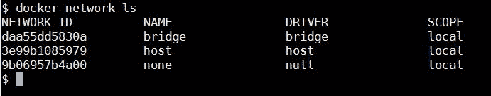
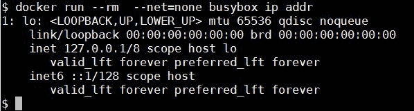
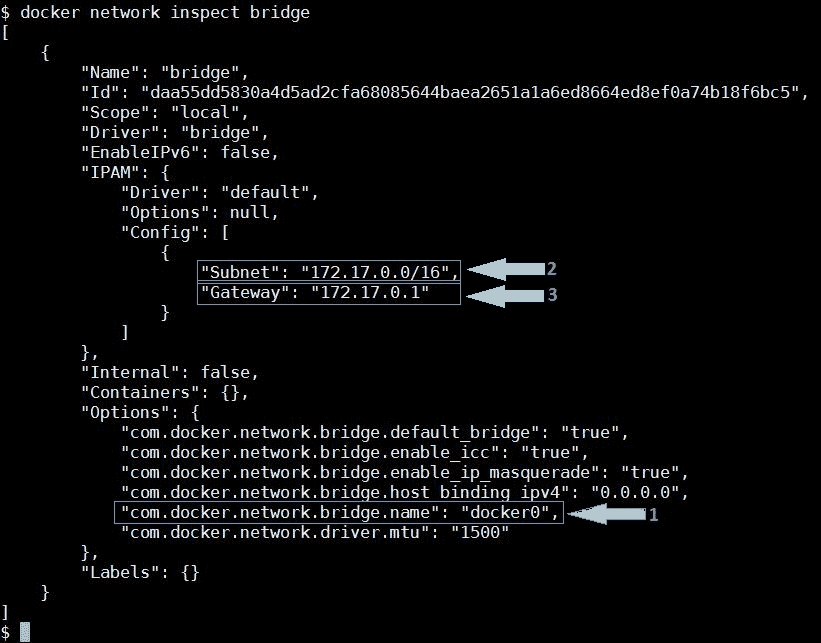
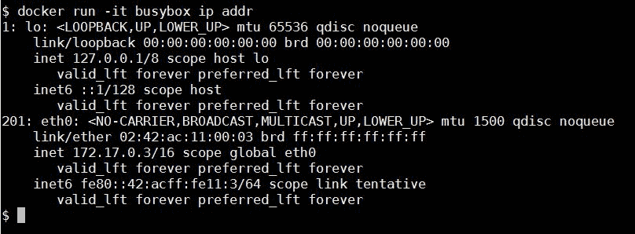
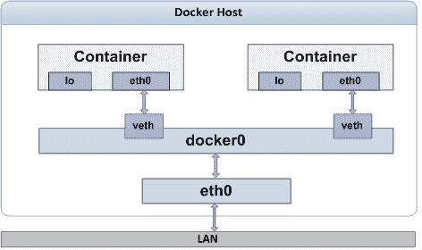

# 第三章：在容器中运行服务

到目前为止，我们已经通过仔细讲解 Docker 技术的各个方面，打下了坚实的基础。前几章无疑为广泛接受的 Docker 平台奠定了基础，接下来的章节将像在这一宏大基础上精心打造的建筑一样。

我们已经描述了构建强大 Docker 容器的重要构件（高度可用和可重用的 Docker 镜像）。有关于如何通过精心设计的存储框架存储和共享 Docker 镜像的简要说明，涵盖了各种易学易用的技巧和方法。通常，镜像必须经过一系列验证、确认和完善，以确保其对开发社区的需求具有正确性和相关性。

在这一章中，我们将通过详细介绍创建一个小型 Web 服务器的关键步骤，将我们的学习提升到一个新的层次，在容器内运行该服务器，并允许外部通过互联网连接到容器化的 Web 服务器。

在这一章中，我们将涵盖以下主题：

+   容器网络

+   **容器即服务** (**CaaS**) – 构建、运行、暴露和连接容器服务

+   发布和检索容器的端口

+   将容器绑定到特定的 IP 地址

+   自动生成 Docker 主机端口

+   使用 `EXPOSE` 和 `-P` 选项进行端口绑定

## 容器网络概述

网络是企业和云 IT 的关键基础设施组成部分。特别是随着计算变得极为分布式，网络变得不可或缺。通常，一个 Docker 主机包含多个 Docker 容器，因此网络已经成为实现复合容器化应用程序的关键组成部分。Docker 容器还需要与本地及远程容器进行交互与协作，以实现分布式应用。准确地说，不同的分布式容器需要公开可见、可网络访问和可组合，以推动面向业务和流程感知的应用程序。

Docker 容器化模式的一个关键优势是能够实现无缝网络连接，用户无需花费太多精力。Docker 的早期版本仅支持桥接网络；后来，Docker 收购了 SDN 初创公司 SocketPlane，增加了更多的网络功能。从那时起，Docker 的网络能力大幅提升，并引入了一组独立的子命令，即 `docker network connect`、`docker network create`、`docker network disconnect`、`docker network inspect`、`docker network ls` 和 `docker network rm`，用于处理 Docker 网络的细节。默认情况下，在安装时，Docker 引擎会为你创建三个网络，你可以通过 `docker network ls` 子命令列出它们，如下所示：



如你在前面的截图中看到的，在 Docker 设置过程中，Docker 引擎创建了 `bridge`、`host` 和 `none`（`null`）网络。当 Docker 启动一个新的容器时，默认情况下，它会为容器创建一个网络堆栈，并附加到默认的 `bridge` 网络。然而，你也可以选择通过 `docker run` 子命令的 `--net` 选项将容器连接到 `host` 或 `none` 网络，或者用户自定义网络。如果选择 `host` 网络，容器将连接到 `host` 网络堆栈，并共享主机的 IP 地址和端口。`none` 网络模式只会创建一个具有回环（`lo`）接口的网络堆栈。我们可以通过使用 `docker run --rm --net=none busybox ip addr` 命令来验证这一点，如下所示：



显然，正如你在前面的截图中看到的，容器只有一个回环接口。由于这个容器只有回环接口，它无法与其他容器或外部世界通信。

`bridge` 网络是 Docker 引擎分配给容器的默认网络接口，除非通过 `docker run` 子命令的 `--net` 选项配置网络。为了更好地理解 `bridge` 网络，我们可以使用 `docker network inspect` 子命令进行检查，如下所示：



在前面的截图中，我们突出了三个重要的见解。你可以找到关于 Docker 安装过程中发生的相关描述：

+   `docker0`：Docker 在 Linux 内核中创建了一个名为 `docker0` 的以太网桥接口。这个接口用作桥梁，将以太网帧传递在容器之间以及容器与外部网络之间。

+   `子网`：Docker 还从 `172.17.0.0` 到 `172.17.255.255` 的地址范围中选择了一个私有 IP 子网，并为其容器保留。前面的截图中，Docker 为容器选择了 `172.17.0.0/16` 子网。

+   `网关`：`docker0` 接口是 `bridge` 网络和 Docker 的网关，Docker 会从之前选择的 IP 子网范围中分配一个 IP 地址给 `docker0`。在前面的示例中，`172.17.0.1` 被分配为网关地址。

我们可以通过使用 `ip addr show` Linux 命令列出 `docker0` 接口来交叉验证网关地址：

```
$ ip addr show docker0

```

输出的第三行显示了分配的 IP 地址及其网络前缀：

```
inet 172.17.0.1/16 scope global docker0 

```

显然，从前面的文字中可以看出，`172.17.0.1` 是分配给 `docker0` 的 IP 地址，`docker0` 是以太网桥接口，它也被列为 `docker network inspect bridge` 命令输出中的网关地址。

现在我们对桥接器的创建以及子网/网关地址选择过程有了清晰的理解，接下来让我们更详细地探讨一下 `bridge` 模式下的容器网络。在 `bridge` 网络模式下，Docker 引擎在启动容器时会创建一个网络栈，其中包含一个环回 (`lo`) 接口和一个以太网 (`eth0`) 接口。我们可以通过运行 `docker run --rm busybox ip addr` 命令快速检查这一点：



显然，`ip addr` 命令的前述输出显示 Docker 引擎已经为容器创建了一个网络栈，并且该栈有两个网络接口，分别如下：

+   第一个接口是 `lo`（环回）接口，Docker 引擎为其分配了 `127.0.0.1` 的环回地址。环回接口用于容器内部的本地通信。

+   第二个接口是 `eth0`（以太网）接口，Docker 引擎为其分配了 `172.17.0.3` 的 IP 地址。显然，这个地址也位于 `docker0` 以太网桥接接口的相同 IP 地址范围内。此外，分配给 `eth0` 接口的地址用于容器之间的通信以及主机与容器之间的通信。

`ip addr` 和/或 `ifconfig` 命令并不是所有 Docker 镜像都支持的，包括 `ubuntu:14.04` 和 `ubuntu:16.04`。`docker inspect` 子命令是查找容器 IP 地址的可靠方式。

之前我们提到过，`docker0` 以太网桥接接口作为容器之间以及容器与外部世界之间传递以太网帧的通道。不过，我们还没有说明容器是如何连接到 `docker0` 桥接器的。下图揭示了这一连接的一些奥秘：



如此图所示，容器的 `eth0` 接口通过 `veth` 连接到 `docker0` 桥接器。`eth0` 和 `veth` 接口属于一种特殊类型的 Linux 网络接口，称为 **虚拟以太网** (**veth**) 接口。`veth` 接口总是成对出现，它们就像一根水管，数据从一个 `veth` 接口发送出去，最终会从另一个接口出来，反之亦然。Docker 引擎将其中一个 `veth` 接口分配给容器并命名为 `eth0`，并将容器的 IP 地址分配给该接口。成对的另一个 `veth` 接口则绑定到 `docker0` 桥接器接口。这样确保了 Docker 主机与容器之间的数据流畅通无阻。

Docker 为容器分配私有 IP 地址，这些地址无法从 Docker 主机外部访问。然而，容器的 IP 地址对于在 Docker 主机内部进行调试非常有用。正如我们之前所提到的，许多 Docker 镜像不支持 `ip addr` 或 `ifconfig` 命令，此外，我们可能没有直接访问容器提示符以运行这些命令的权限。幸运的是，Docker 提供了一个 `docker inspect` 子命令，就像瑞士军刀一样方便，可以深入查看 Docker 容器或镜像的底层细节。`docker inspect` 子命令报告了很多细节，包括 IP 地址和网关地址。为了实际操作，这里你可以选择一个正在运行的容器或暂时启动一个容器，如下所示：

```
$ sudo docker run -itd ubuntu:16.04   

```

这里，假设容器 ID 是 `4b0b567b6019`，并运行 `docker inspect` 子命令，如下所示：

```
$ sudo docker inspect 4b0b567b6019

```

这个命令生成了关于容器的很多信息。这里，我们展示了从 `docker inspect` 子命令输出中提取的一些容器网络配置片段：

```
"Networks": {
 "bridge": {
 "IPAMConfig": null,
 "Links": null,
 "Aliases": null,
 "NetworkID": "ID removed for readability",
 "EndpointID": "ID removed for readability",
 "Gateway": "172.17.0.1",
 "IPAddress": "172.17.0.3",
 "IPPrefixLen": 16,
 "IPv6Gateway": "",
 "GlobalIPv6Address": "",
 "GlobalIPv6PrefixLen": 0,
 "MacAddress": "02:42:ac:11:00:03"
 }
}

```

以下是网络配置中一些重要字段的详细信息：

+   `Gateway`：这是容器的网关地址，也是 `bridge` 接口的地址。

+   `IPAddress`：这是分配给容器的 IP 地址。

+   `IPPrefixLen`：这是 IP 前缀长度，另一种表示子网掩码的方式。

毫无疑问，`docker inspect` 子命令非常方便，用来查找容器或镜像的细节。然而，逐一浏览那些复杂的细节并找到我们需要的信息是一项繁琐的工作。或许，你可以通过使用 `grep` 命令缩小范围，找到所需的信息。更好的是，`docker inspect` 子命令通过 `--format` 选项帮助你从 JSON 数组中选择正确的字段。

值得注意的是，在以下示例中，我们使用 `docker inspect` 子命令的 `--format` 选项，只获取容器的 IP 地址。IP 地址可以通过 JSON 数组中的 `.NetworkSettings.IPAddress` 字段访问：

```
$ sudo docker inspect \
 --format='{{.NetworkSettings.IPAddress}}' 4b0b567b6019
172.17.0.3

```

除了 `none`、`host` 和 `bridge` 网络模式外，Docker 还支持 `overlay`、`macvlan` 和 `ipvlan` 网络模式。

## 将容器视为一种服务

我们已经打下了 Docker 技术基础的良好基础。在这一部分，我们将专注于创建一个带有 HTTP 服务的镜像，在容器内启动 HTTP 服务，并演示容器内运行的 HTTP 服务的连接性。

### 构建 HTTP 服务器镜像

在这一部分，我们将构建一个 Docker 镜像，用以在 Ubuntu 16.04 基础镜像上安装 Apache2，并使用 `ENTRYPOINT` 指令配置一个可执行的 Apache HTTP 服务器。

在第三章，《构建镜像》一节中，我们阐述了使用`Dockerfile`在 Ubuntu 16.04 基础镜像上构建 Apache2 镜像的概念。在此示例中，我们将通过设置 Apache 日志路径并使用`ENTRYPOINT`指令将 Apache2 设置为默认执行应用程序，来扩展该`Dockerfile`。以下是`Dockerfile`内容的详细说明：

我们将使用`ubuntu:16.04`作为基础镜像，使用`FROM`指令构建一个镜像，正如在`Dockerfile`片段中所示：

```
########################################### 
# Dockerfile to build an apache2 image 
########################################### 
# Base image is Ubuntu 
FROM ubuntu:16.04 

```

使用`MAINTAINER`指令设置作者的详细信息：

```
# Author: Dr. Peter 
MAINTAINER Dr. Peter <peterindia@gmail.com> 

```

使用一个`RUN`指令，我们将同步 APT 仓库源列表，安装`apache2`包，然后清理已获取的文件：

```
# Install apache2 package 
RUN apt-get update && \ 
     apt-get install -y apache2 && \ 
     apt-get clean 

```

使用`ENV`指令设置 Apache 日志目录路径：

```
# Set the log directory PATH 
ENV APACHE_LOG_DIR /var/log/apache2 

```

现在，最后的指令是使用`ENTRYPOINT`指令启动`apache2`服务器：

```
# Launch apache2 server in the foreground 
ENTRYPOINT ["/usr/sbin/apache2ctl", "-D", "FOREGROUND"] 

```

在前面的行中，你可能会惊讶地看到`FOREGROUND`参数。这是传统模式和容器模式之间的一个关键区别。在传统模式下，服务器应用程序通常会作为服务或守护进程在后台启动，因为主机系统是通用系统。然而，在容器模式下，必须将应用程序启动在前台，因为镜像是为单一目的而制作的。

在`Dockerfile`中指定了镜像构建指令后，让我们进入下一个逻辑步骤，使用`docker build`子命令构建镜像，并将镜像命名为`apache2`，如下所示：

```
$ sudo docker build -t apache2 .  

```

现在让我们使用`docker images`子命令对镜像进行快速验证：

```
$ sudo docker images

```

正如我们在前面的章节中所看到的，`docker images`命令显示了 Docker 主机中所有镜像的详细信息。然而，为了准确地展示使用`docker build`子命令创建的镜像，我们从完整的镜像列表中突出显示了`apache2:latest`（目标镜像）和`ubuntu:16.04`（基础镜像）的详细信息，如下所示的输出片段：

```
    apache2 latest 1b34e47c273d About a minute ago 265.5 MB
ubuntu 16.04 f753707788c5 3 weeks ago 127.2 MB 

```

构建完 HTTP 服务器镜像后，让我们继续下一节，学习如何运行 HTTP 服务。

### 以服务的方式运行 HTTP 服务器镜像

在本节中，我们将使用前一节中制作的 Apache HTTP 服务器镜像启动一个容器。这里，我们使用`docker run`子命令的`-d`选项以分离模式（类似于 UNIX 守护进程）启动容器：

```
$ sudo docker run -d apache2
9d4d3566e55c0b8829086e9be2040751017989a47b5411c9c4f170ab865afcef  

```

启动容器后，让我们运行`docker logs`子命令查看我们的 Docker 容器是否会在其标准输入（stdin）或标准错误（stderr）上生成任何输出：

```
$ sudo docker logs \
9d4d3566e55c0b8829086e9be2040751017989a47b5411c9c4f170ab865afcef 

```

由于我们尚未完全配置 Apache HTTP 服务器，你将看到以下警告，作为`docker logs`子命令的输出：

```
AH00558: apache2: Could not reliably determine the server's fully qualified domain name, using 172.17.0.13\. Set the 'ServerName' directive globally to suppress this message

```

从前面的警告信息中可以明显看出，分配给此容器的 IP 地址是`172.17.0.13`。

### 连接到 HTTP 服务

在前一节中，从警告信息中我们发现容器的 IP 地址是`172.17.0.13`。在完全配置好的 HTTP 服务器容器上，不会有这样的警告，因此我们仍然运行`docker inspect`子命令，使用容器 ID 来获取 IP 地址：

```
$ sudo docker inspect \
--format='{{.NetworkSettings.IPAddress}}' 
9d4d3566e55c0b8829086e9be2040751017989a47b5411c9c4f170ab865afcef
172.17.0.13

```

在找到了容器的 IP 地址`172.17.0.13`之后，让我们快速地在 Docker 主机的 shell 提示符中通过`wget`命令在这个 IP 地址上发起一个 Web 请求。在这里，我们选择使用`-qO -`选项运行`wget`命令，以便在安静模式下运行，并将获取的 HTML 文件显示在屏幕上：

```
$ wget -qO - 172.17.0.13

```

在这里，我们展示的是获取到的 HTML 文件的前五行：

```
<!DOCTYPE html PUBLIC "-//W3C//DTD XHTML 1.0 Transitional//EN" 
 "http://www.w3.org/TR/xhtml1/DTD/xhtml1-transitional.dtd"> 
<html > 
  <!-- 
    Modified from the Debian original for Ubuntu 
    Last updated: 2014-03-19 

```

很棒，对吧？我们已经在容器中运行了第一个服务，并且能够从 Docker 主机访问我们的服务。

此外，在一个普通的 Docker 安装中，一个容器提供的服务是可以被同一 Docker 主机上的任何其他容器访问的。你可以继续启动一个新的 Ubuntu 容器并以交互模式运行，使用`apt-get`安装`wget`包，然后运行与我们在 Docker 主机中相同的`wget -qO - 172.17.0.13`命令。当然，你会看到相同的输出。

## 曝露容器服务

到目前为止，我们成功启动了一个 HTTP 服务，并从 Docker 主机以及同一 Docker 主机内的其他容器访问了该服务。此外，正如在第二章《处理 Docker 容器》中的*从容器构建镜像*一节中所展示的那样，通过连接到公开可用的 APT 仓库并通过互联网访问，容器能够成功安装`wget`包。然而，默认情况下，外界无法访问容器提供的服务。乍一看，这似乎是 Docker 技术的一个限制，但实际上，容器在设计上就与外界隔离。

Docker 通过 IP 地址分配标准来实现容器的网络隔离，具体列举如下：

+   为容器分配一个私有 IP 地址，该地址无法从外部网络访问

+   为容器分配一个在主机 IP 网络之外的 IP 地址

因此，即使是连接到与 Docker 主机相同 IP 网络的系统，也无法访问 Docker 容器。这个分配方案还提供了保护，防止可能出现的 IP 地址冲突。

现在，你可能会想知道如何让容器内部运行的服务对外界可访问，换句话说，如何曝露容器服务。好吧，Docker 通过在幕后利用 Linux 的`iptables`功能，巧妙地弥补了这个连接性差距。

在前端，Docker 为其用户提供了两种不同的构建块，用于弥合连接性差距。其中一个构建块是使用`-p`（将容器端口发布到主机接口）选项，通过`docker run`子命令绑定容器端口。另一个替代方法是结合使用`Dockerfile`中的`EXPOSE`指令和`docker run`子命令的`-P`（将所有暴露的端口发布到主机接口）选项。

### 发布容器端口 - `-p`选项

Docker 允许您通过将容器的端口绑定到主机接口，发布容器内提供的服务。`docker run`子命令的`-p`选项使您能够将容器端口绑定到 Docker 主机的用户指定端口或自动生成端口。因此，任何发送到 Docker 主机的 IP 地址和端口的通信都会被转发到容器的端口。实际上，`-p`选项支持以下四种格式的参数：

+   `<hostPort>:<containerPort>`

+   `<containerPort>`

+   `<ip>:<hostPort>:<containerPort>`

+   `<ip>::<containerPort>`

这里，`<ip>`是 Docker 主机的 IP 地址，`<hostPort>`是 Docker 主机的端口号，`<containerPort>`是容器的端口号。在本节中，我们向您展示`-p <hostPort>:<containerPort>`格式，并将在后续部分介绍其他格式。

为了更好地理解端口绑定过程，让我们重新使用之前制作的`apache2` HTTP 服务器镜像，并使用`docker run`子命令的`-p`选项启动一个容器。`80`端口是 HTTP 服务的发布端口，作为默认行为，我们的`apache2` HTTP 服务器也在端口`80`上可用。在这里，为了演示这个功能，我们将使用`docker run`子命令的`-p <hostPort>:<containerPort>`选项，将容器的`80`端口绑定到 Docker 主机的`80`端口，如下命令所示：

```
$ sudo docker run -d -p 80:80 apache2
baddba8afa98725ec85ad953557cd0614b4d0254f45436f9cb440f3f9eeae134

```

现在，我们已经成功启动了容器，可以通过任何外部系统的 Web 浏览器（只要该系统具有网络连接）连接到我们的 HTTP 服务器，从而访问我们的 Docker 主机。

到目前为止，我们还没有向我们的`apache2` HTTP 服务器镜像添加任何网页。因此，当我们从 Web 浏览器连接时，将看到以下屏幕，这只是 Ubuntu Apache2 包随附的默认页面：


### 容器的 NAT

在上一节中，我们看到`-p 80:80`选项是如何起作用的，对吧？实际上，在幕后，Docker 引擎通过自动配置 Linux `iptables`配置文件中的**网络地址转换**（**NAT**）规则，实现了这种无缝连接。

为了说明 Linux `iptables`中 NAT 规则的自动配置，下面我们查询 Docker 主机的`iptables`以获取其 NAT 条目，如下所示：

```
$ sudo iptables -t nat -L -n  

```

以下文本摘自由 Docker 引擎自动添加的 `iptables` NAT 条目：

```
Chain DOCKER (2 references)
target prot opt source destination
DNAT tcp -- 0.0.0.0/0 0.0.0.0/0 tcp dpt:80 to:172.17.0.14:80

```

从前面的摘录可以明显看出，Docker 引擎已经有效地添加了一个 `DNAT` 规则。以下是该 `DNAT` 规则的详细信息：

+   `tcp` 关键字表示此 `DNAT` 规则仅适用于 TCP 传输协议。

+   第一个 `0.0.0.0/0` 地址是源地址的元 IP 地址。该地址表示连接可以来自任何 IP 地址。

+   第二个 `0.0.0.0/0` 地址是 Docker 主机上目标地址的元 IP 地址。该地址表示可以连接到 Docker 主机中的任何有效 IP 地址。

+   最后，`dpt:80 to:172.17.0.14:80` 是转发指令，用于将 Docker 主机上的 `80` 端口的任何 TCP 活动转发到 `172.17.0.17` IP 地址，这是我们容器的 IP 地址，并且是端口 `80`。

因此，Docker 主机收到的任何 TCP 数据包都会转发到容器的 `80` 端口。

### 检索容器端口

Docker 引擎提供了至少三种不同的选项来检索容器的端口绑定信息。在这里，我们先探索这些选项，然后继续解析检索到的信息。选项如下：

+   `docker ps` 子命令总是显示容器的端口绑定信息，如下所示：

```
 $ sudo docker ps
 CONTAINER ID IMAGE COMMAND 
 CREATED STATUS PORTS 
 NAMES
 baddba8afa98 apache2:latest 
 "/usr/sbin/apache2ct 
 26 seconds ago Up 25 seconds 
 0.0.0.0:80->80/tcp 
 furious_carson

```

+   `docker inspect` 子命令是另一种选择；但是，你需要浏览相当多的详细信息。运行以下命令：

```
      $ sudo docker inspect baddba8afa98

```

+   `docker inspect` 子命令显示与端口绑定相关的信息，分为三个 JSON 对象，如下所示：

+   `ExposedPorts` 对象枚举了通过 `Dockerfile` 中的 `EXPOSE` 指令暴露的所有端口，以及使用 `docker run` 子命令中的 `-p` 选项映射的容器端口。由于我们没有在 `Dockerfile` 中添加 `EXPOSE` 指令，因此我们只有通过 `-p 80:80` 参数传递给 `docker run` 子命令映射的容器端口：

```
             "ExposedPorts": {
 "80/tcp": {}
 },

```

+   `PortBindings` 对象是 `HostConfig` 对象的一部分，该对象列出了通过 `docker run` 子命令中的 `-p` 选项进行的所有端口绑定。此对象永远不会列出通过 `Dockerfile` 中的 `EXPOSE` 指令暴露的端口：

```
 "PortBindings": {
 "80/tcp": [
 {
 "HostIp": "",
 "HostPort": "80"
 }
 ]
 },

```

+   `NetworkSettings` 对象中的 `Ports` 对象具有与前述 `PortBindings` 对象相同的详细级别。然而，该对象包含了通过 `Dockerfile` 中的 `EXPOSE` 指令暴露的所有端口，以及使用 `docker run` 子命令中的 `-p` 选项映射的容器端口：

```
 "NetworkSettings": {
 "Bridge": "",
 "SandboxID":"ID removed for readability",
 "HairpinMode": false,
 "LinkLocalIPv6Address": "",
 "LinkLocalIPv6PrefixLen": 0,
 "Ports": {
 "80/tcp": [
 {
 "HostIp": "0.0.0.0",
 "HostPort": "80"
 }
 ]
 },

```

当然，特定的端口字段可以使用 `docker inspect` 子命令的 `--format` 选项进行过滤。

`docker port` 子命令使你能够通过指定容器的端口号来获取 Docker 主机上的端口绑定信息：

```
$ sudo docker port baddba8afa98 80
0.0.0.0:80  

```

显然，在所有前面的输出摘录中，突出显示的信息是`0.0.0.0` IP 地址和`80`端口号。`0.0.0.0` IP 地址是一个元地址，代表了所有在 Docker 主机上配置的 IP 地址。实际上，`80`容器端口绑定到了 Docker 主机上所有有效的 IP 地址。因此，HTTP 服务可以通过 Docker 主机上任何有效的 IP 地址进行访问。

### 将容器绑定到特定 IP 地址

到目前为止，使用你学到的方法，容器总是绑定到 Docker 主机上所有配置的 IP 地址。然而，你可能希望在不同的 IP 地址上提供不同的服务。换句话说，某个特定的 IP 地址和端口将被配置来提供特定的服务。我们可以通过 Docker 的 `docker run` 子命令的 `-p <ip>:<hostPort>:<containerPort>` 选项来实现这一点，正如以下示例所示：

```
$ sudo docker run -d -p 198.51.100.73:80:80 apache2
92f107537bebd48e8917ea4f4788bf3f57064c8c996fc23ea0fd8ea49b4f3335  

```

在这里，IP 地址必须是 Docker 主机上的有效 IP 地址。如果指定的 IP 地址不是 Docker 主机上的有效 IP 地址，容器启动将失败，并出现如下错误信息：

```
2014/11/09 10:22:10 Error response from daemon: Cannot start container 
99db8d30b284c0a0826d68044c42c370875d2c3cad0b87001b858ba78e9de53b: 
Error starting user land proxy: listen tcp 10.110.73.34:49153: bind:cannot assign requested address

```

现在，让我们快速回顾一下前面示例中的端口映射和 NAT 条目：

+   以下文本是 `docker ps` 子命令输出的摘录，显示了该容器的详细信息：

```
 92f107537beb apache2:latest "/usr/sbin/apache2ct 
 About a minute ago Up About a minute 198.51.100.73:80->80/tcp 
 boring_ptolemy

```

+   以下文本是 `iptables -n nat -L -n` 命令输出的摘录，显示了为该容器创建的 `DNAT` 条目：

```
 DNAT tcp -- 0.0.0.0/0 198.51.100.73 tcp dpt:80 
 to:172.17.0.15:80

```

在查看了 `docker run` 子命令的输出和 `iptables` 的 `DNAT` 条目后，你会发现 Docker 引擎如何优雅地配置了容器提供的服务，绑定到了 Docker 主机上 `198.51.100.73` IP 地址和 `80` 端口。

### 自动生成 Docker 主机端口

Docker 容器天生轻量级，由于其轻量化的特点，你可以在单一 Docker 主机上运行多个容器，提供相同或不同的服务。特别是，根据需求，多个容器间的同一服务自动扩展是现代 IT 基础设施的需求。在本节中，你将了解启动多个相同服务容器的挑战，以及 Docker 如何应对这一挑战。

在本章早些时候，我们通过将容器绑定到 Docker 主机的 `80` 端口来启动了一个使用 Apache2 HTTP 服务器的容器。现在，如果我们尝试启动一个绑定到相同 `80` 端口的容器，该容器将无法启动，并且会出现错误信息，正如以下示例所示：

```
$ sudo docker run -d -p 80:80 apache2
6f01f485ab3ce81d45dc6369316659aed17eb341e9ad0229f66060a8ba4a2d0e
2014/11/03 23:28:07 Error response from daemon: Cannot start container 
6f01f485ab3ce81d45dc6369316659aed17eb341e9ad0229f66060a8ba4a2d0e: 
Bind for 0.0.0.0:80 failed: port is already allocated  

```

显然，在前面的示例中，容器启动失败是因为之前的容器已经将 `0.0.0.0`（Docker 主机的所有 IP 地址）和 `80` 端口进行了映射。在 TCP/IP 通信模型中，IP 地址、端口和传输协议（如 TCP、UDP 等）的组合必须是唯一的。

我们本可以通过手动选择 Docker 主机的端口号来解决这个问题（例如，`-p 81:80` 或 `-p 8081:80`）。虽然这是一个很好的解决方案，但对于自动扩展场景来说，它的扩展性较差。相反，如果将控制权交给 Docker，它将自动生成 Docker 主机上的端口号。通过在 `docker run` 子命令中使用 `-p <containerPort>` 选项来实现端口号的自动生成，如下例所示：

```
$ sudo docker run -d -p 80 apache2
ea3e0d1b18cff40ffcddd2bf077647dc94bceffad967b86c1a343bd33187d7a8  

```

成功启动具有自动生成端口的新容器后，我们来回顾一下端口映射以及前述示例的 NAT 条目：

+   以下文本是 `docker ps` 子命令输出的摘录，显示了此容器的详细信息：

```
 ea3e0d1b18cf apache2:latest "/usr/sbin/apache2ct 
 5 minutes ago Up 5 minutes 0.0.0.0:49158->80/tcp 
 nostalgic_morse  

```

+   以下文本是 `iptables -n nat -L -n` 命令输出的摘录，显示为此容器创建的 `DNAT` 条目：

```
 DNAT tcp -- 0.0.0.0/0 0.0.0.0/0 tcp dpt:49158 
 to:172.17.0.18:80  

```

在回顾了 `docker run` 子命令的输出和 `iptables` 的 `DNAT` 条目后，突出显示的是端口号 `49158`。该端口号是 Docker 引擎在 Docker 主机上巧妙地自动生成的，借助底层操作系统的帮助。此外，`0.0.0.0` 元 IP 地址表示容器提供的服务可以通过 Docker 主机上配置的任何有效 IP 地址从外部访问。

您可能有一个用例，需要自动生成端口号。然而，如果您仍然希望将服务限制为 Docker 主机的特定 IP 地址，可以使用 `docker run` 子命令中的 `-p <IP>::<containerPort>` 选项，如下例所示：

```
$ sudo docker run -d -p 198.51.100.73::80 apache2
6b5de258b3b82da0290f29946436d7ae307c8b72f22239956e453356532ec2a7

```

在前述的两种场景中，Docker 引擎自动生成了 Docker 主机上的端口号，并将其暴露给外部世界。网络通信的普遍规范是通过预定义的端口号暴露任何服务，以便任何知道 IP 地址和端口号的人都可以轻松访问提供的服务。而在这里，端口号是自动生成的，因此外部世界无法直接访问该服务。因此，这种容器创建方法的主要目的是实现自动扩展，并且以这种方式创建的容器将与预定义端口上的代理或负载均衡服务进行交互。

### 使用 EXPOSE 和 -P 选项进行端口绑定

到目前为止，我们已经讨论了四种将容器内部运行的服务发布到外部世界的不同方法。在这四种方法中，端口绑定的决定是在容器启动时做出的，并且镜像对服务提供的端口没有任何信息。到目前为止，这种方法运作良好，因为镜像是我们构建的，我们非常清楚服务提供的端口号。

然而，在第三方镜像的情况下，容器内的端口使用必须明确发布。此外，如果我们为第三方使用或甚至是为了我们自己的使用构建镜像，明确声明容器提供服务的端口是一个良好的实践。也许，镜像构建者可以随镜像附带一个 README 文档。然而，将端口信息嵌入镜像本身会更好，这样你可以更轻松地通过手动方式或自动化脚本从镜像中找到端口详情。

Docker 技术允许我们使用`EXPOSE`指令在`Dockerfile`中嵌入端口信息，正如我们在第三章 *构建镜像*中介绍的那样。在这里，让我们编辑在本章之前用于构建`apache2` HTTP 服务器镜像的`Dockerfile`，并添加`EXPOSE`指令，如以下代码所示。HTTP 服务的默认端口是端口`80`，因此端口`80`被暴露：

```
########################################### 
# Dockerfile to build an apache2 image 
########################################### 
# Base image is Ubuntu 
FROM ubuntu:16.04 
# Author: Dr. Peter 
MAINTAINER Dr. Peter <peterindia@gmail.com> 
# Install apache2 package 
RUN apt-get update &&  
     apt-get install -y apache2 &&  
     apt-get clean 
# Set the log directory PATH 
ENV APACHE_LOG_DIR /var/log/apache2 
# Expose port 80 
EXPOSE 80 
# Launch apache2 server in the foreground 
ENTRYPOINT ["/usr/sbin/apache2ctl", "-D", "FOREGROUND"] 

```

现在我们已经在`Dockerfile`中添加了`EXPOSE`指令，让我们进入下一步，使用`docker build`命令来构建镜像。这里我们将重新使用之前的`apache2`镜像名称，如下所示：

```
$ sudo docker build -t apache2 .  

```

成功构建镜像后，让我们检查一下该镜像，以验证`EXPOSE`指令对镜像的影响。如我们之前所学，我们可以使用`docker inspect`子命令，如下所示：

```
$ sudo docker inspect apache2  

```

通过仔细查看前面命令生成的输出，你会发现 Docker 将暴露的端口信息存储在`Config`对象的`ExposedPorts`字段中。以下是一个摘录，展示了暴露的端口信息如何显示：

```
"ExposedPorts": {
 "80/tcp": {}
},  

```

另外，你也可以使用`--format`选项应用于`docker inspect`子命令，以便将输出限制为非常具体的信息。在这种情况下，`Config`对象的`ExposedPorts`字段在以下示例中展示：

```
$ sudo docker inspect --format='{{.Config.ExposedPorts}}' apache2
map[80/tcp:map[]]  

```

为了继续讨论`EXPOSE`指令，我们现在可以使用我们刚刚制作的`apache2`镜像启动容器。然而，`EXPOSE`指令本身并不能在 Docker 主机上创建端口绑定。为了为通过`EXPOSE`指令声明的端口创建端口绑定，Docker 引擎在`docker run`子命令中提供了`-P`选项。

在以下示例中，容器是从之前重新构建的`apache2`镜像启动的。这里使用`-d`选项将容器以分离模式启动，`-P`选项用于在 Docker 主机上为所有通过`Dockerfile`中的`EXPOSE`指令声明的端口创建端口绑定：

```
$ sudo docker run -d -P apache2
fdb1c8d68226c384ab4f84882714fec206a73fd8c12ab57981fbd874e3fa9074  

```

既然我们已经使用通过`EXPOSE`指令创建的镜像启动了新的容器，就像之前的容器一样，让我们查看端口映射以及前面示例中的 NAT 条目：

+   以下文本摘自`docker ps`子命令的输出，展示了该容器的详细信息：

```
      ea3e0d1b18cf apache2:latest "/usr/sbin/apache2ct 
 5 minutes ago Up 5 minutes 0.0.0.0:49159->80/tcp 
 nostalgic_morse 

```

+   以下文本摘自`iptables -t nat -L -n`命令的输出，展示了为该容器创建的`DNAT`条目：

```
      DNAT tcp -- 0.0.0.0/0 0.0.0.0/0 
 tcp dpt:49159 to:172.17.0.19:80

```

`docker run`子命令的`-P`选项不接受任何额外的参数，如 IP 地址或端口号；因此，无法对端口绑定进行精细调节，类似于`docker run`子命令的`-p`选项。如果端口绑定的精细调节对你至关重要，你始终可以使用`docker run`子命令的`-p`选项。

## 概述

容器在隔离或独立的方式下无法提供任何实质性功能。它们需要系统地构建，并配备网络接口和端口号。这些因素促成了容器向外界的标准化展示，便于其他主机或容器在任何网络上发现、绑定并利用它们的独特功能。因此，网络可访问性对容器而言至关重要，使其能够被广泛察觉并以多种方式加以利用。本章旨在展示容器如何作为一种服务进行设计和部署，以及容器网络功能如何在日新月异的容器服务领域中，发挥精准而丰富的作用。在接下来的章节中，我们将详细探讨 Docker 容器在软件密集型 IT 环境中的各种能力。
