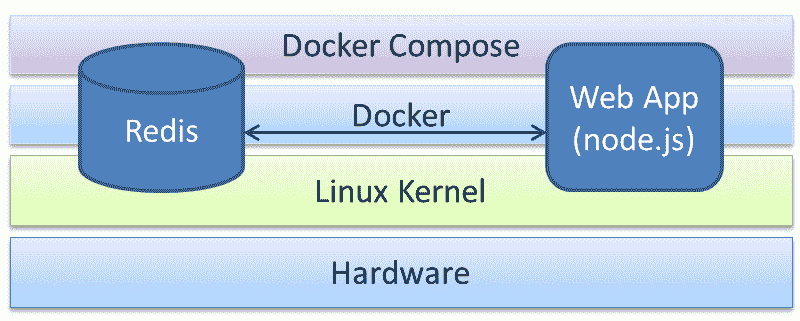

# 容器编排

在前面的章节中，我们已经为容器网络的需求打下了坚实的基础，讨论了如何在 Docker 容器中运行服务，以及如何通过开放网络端口和其他前提条件将该服务暴露给外部世界。然而，最近，出现了一些先进的机制，并且一些第三方编排平台也进入了市场，旨在巧妙地建立分布式且功能各异的容器之间的动态和决定性连接，以便为处理中心、分层和企业级分布式应用程序组合出强大的容器。在这个高度多样化但又紧密相连的世界里，容器编排的概念不可能长期被忽视。本章正是为了详细解释容器编排的细节，其直接作用是从一组离散的容器中系统地组合出更符合不同业务需求和期望的复杂容器。

在本章中，我们将详细讨论以下主题：

+   连接容器

+   容器编排

+   使用`docker-compose`工具编排容器

随着关键任务应用程序越来越多地通过松散耦合、但高度凝聚的组件/服务构建，并且这些组件/服务将在地理分布的 IT 基础设施和平台上运行，组合的概念受到了越来越多的关注和重视。为了保持容器化进程的顺利推进，容器编排被视为在随之而来的即时启动、适应性强且智能的 IT 时代中的关键要求之一。现在有一些经过验证的、有前景的方法和符合标准的工具，用于实现这个神秘的编排目标。

## Docker 内置的服务发现

Docker 平台本身支持通过嵌入式**域名服务**（**DNS**）为附加到任何用户定义网络的容器提供服务发现功能。自`1.10`版本以来，Docker 就加入了此功能。嵌入式 DNS 功能使得 Docker 容器能够通过它们的名称或别名在用户定义的网络中互相发现。换句话说，容器的名称解析请求首先发送到嵌入式 DNS。用户定义的网络随后使用一个特殊的`127.0.0.11` IP 地址为嵌入式 DNS 提供服务，这个地址也列在`/etc/resolv.conf`中。

以下示例将帮助更好地理解 Docker 内置的服务发现功能：

1.  让我们首先通过以下命令创建一个用户定义的桥接网络`mybridge`：

```
      $ sudo docker network create mybridge

```

1.  检查新创建的网络以了解子网范围和网关 IP：

```
 $ sudo docker network inspect mybridge
 [
 {
 "Name": "mybridge",
 "Id": "36e5e088543895f6d335eb92299ee8e118cd0610e0d023f7c42e6e603b935e17",
 "Created": 
 "2017-02-12T14:56:48.553408611Z",
 "Scope": "local",
 "Driver": "bridge",
 "EnableIPv6": false,
 "IPAM": {
 "Driver": "default",
 "Options": {},
 "Config": [
 {
 "Subnet": "172.18.0.0/16",
 "Gateway": "172.18.0.1"
 }
 ]
 },
 "Internal": false,
 "Attachable": false,
 "Containers": {},
 "Options": {},
 "Labels": {}
 }
 ]

```

在这里，`mybridge`网络分配的子网是`172.18.0.0/16`，网关是`172.18.0.1`。

1.  现在，让我们创建一个容器并将其连接到 `mybridge` 网络，如下所示：

```
      $ sudo docker container run \
 -itd --net mybridge --name testdns ubuntu  

```

1.  继续列出分配给容器的 IP 地址，如下所示：

```
 $ sudo docker container inspect --format \
 '{{.NetworkSettings.Networks.mybridge.IPAddress}}' \
 testdns 
 172.18.0.2

```

显然，`testdns` 容器被分配了一个`172.18.0.2`的 IP 地址。这个`172.18.0.2` IP 地址来自 `mybridge` 网络的子网（即`172.18.0.0/16`）。

1.  获得容器的 IP 地址后，让我们使用 `docker container exec` 子命令查看容器的 `/etc/resolv.conf` 文件内容，如下所示：

```
 $ sudo docker container exec testdns \
 cat /etc/resolv.conf 
 nameserver 127.0.0.11
 options ndots:0

```

在这里，`nameserver` 配置为 `127.0.0.11`，这是嵌入式 DNS 的 IP 地址。

1.  最后一步，让我们使用 `busybox` 镜像来 ping `testdns` 容器。我们选择 `busybox` 镜像，因为 `ubuntu` 镜像不包含 `ping` 命令：

```
 $ sudo docker container run --rm --net mybridge \ 
 busybox ping -c 2 testdns
 PING testdns (172.18.0.2): 56 data bytes
 64 bytes from 172.18.0.2: seq=0 ttl=64 
 time=0.085 ms
 64 bytes from 172.18.0.2: seq=1 ttl=64 
 time=0.133 ms

 --- testdns ping statistics ---
 2 packets transmitted, 2 packets received, 
 0% packet loss
 round-trip min/avg/max = 0.085/0.109/0.133 ms

```

太棒了，不是吗！Docker 背后的开发团队将其做得如此简单，以至于我们几乎无需任何努力，就能发现同一网络中的容器。

## 链接容器

在引入用户定义网络的概念之前，容器链接主要用于容器间的发现和通信。也就是说，协作容器可以相互链接，提供复杂且具业务意识的服务。链接的容器之间具有某种源-目标关系，其中源容器会链接到目标容器，而目标容器会安全地接收来自源容器的各种信息。然而，源容器对其链接的目标容器一无所知。另一个值得注意的特点是，在安全设置下，链接容器可以通过安全隧道进行通信，而不暴露设置所使用的端口给外部世界。虽然你会发现许多部署使用容器链接技术，但它们配置繁琐且耗时，同时也容易出错。因此，嵌入式 DNS 的新方法被高度偏好，胜过传统的容器链接技术。

Docker 引擎在 `docker run` 子命令中提供了 `--link` 选项，用于将源容器与目标容器连接起来。

`--link` 选项的格式如下：

```
--link <container>:<alias>

```

在这里，`<container>` 是源容器的名称，`<alias>` 是目标容器看到的名称。容器的名称在 Docker 主机中必须是唯一的，而别名非常具体并且局限于目标容器，因此别名在 Docker 主机中不必唯一。这为在目标容器中实现和集成功能提供了很大的灵活性，可以使用固定的源别名名称。

当两个容器被链接在一起时，Docker 引擎会自动将一些环境变量导出到目标容器。这些环境变量有明确的命名规则，变量名称总是以别名的大写形式作为前缀。例如，如果`src`是源容器的别名，那么导出的环境变量将以`SRC_`开头。Docker 导出三类环境变量，如下所示：

+   `NAME`：这是第一类环境变量。这些变量的形式为`<ALIAS>_NAME`，其值为目标容器的层次名称。例如，如果源容器的别名是`src`，目标容器的名称是`rec`，则环境变量及其值为`SRC_NAME=/rec/src`。

+   `ENV`：这是第二类环境变量，用于导出源容器中通过`docker run`子命令的`-e`选项或`Dockerfile`的`ENV`指令配置的环境变量。这类环境变量的形式为`<ALIAS>_ENV_<VAR_NAME>`。例如，如果源容器的别名是`src`，变量名是`SAMPLE`，则环境变量为`SRC_ENV_SAMPLE`。

+   `PORT`：这是第三类也是最后一类环境变量，用于导出源容器的连接详细信息到目标容器。Docker 会为源容器通过`docker run`子命令的`-p`选项或`Dockerfile`的`EXPOSE`指令暴露的每个端口创建一组变量。

这些变量采用`<ALIAS>_PORT_<port>_<protocol>`的形式。该形式用于将源容器的 IP 地址、端口和协议作为 URL 共享。例如，如果源容器的别名是`src`，暴露的端口是`8080`，协议是`tcp`，IP 地址是`172.17.0.2`，那么环境变量及其值将是`SRC_PORT_8080_TCP=tcp://172.17.0.2:8080`。这个 URL 进一步分解为以下三个环境变量：

+   `<ALIAS>_PORT_<port>_<protocol>_ADDR`：这种形式携带 URL 中的 IP 地址部分（例如，`SRC_PORT_8080_TCP_ADDR=172.17.0.2`）。

+   `<ALIAS>_PORT_<port>_<protocol>_PORT`：这种形式携带 URL 中的端口部分（例如，`SRC_PORT_8080_TCP_PORT=8080`）。

+   `<ALIAS>_PORT_<port>_<protocol>_PROTO`：这种形式携带 URL 中的协议部分（例如，`SRC_PORT_8080_TCP_PROTO=tcp`）。

除了前面的环境变量之外，Docker Engine 还会导出一个以`<ALIAS>_PORT`形式的环境变量，其值将是源容器所有暴露端口中最低编号端口的 URL。例如，如果源容器的别名是`src`，暴露的端口号是`7070`、`8080`和`80`，协议是`tcp`，IP 地址是`172.17.0.2`，那么环境变量及其值将是`SRC_PORT=tcp://172.17.0.2:80`。

Docker 以结构化的格式导出这些自动生成的环境变量，使得它们可以轻松地通过程序进行发现。因此，接收容器可以非常容易地发现关于源容器的信息。此外，Docker 会自动更新源 IP 地址及其别名，并将其作为条目添加到接收容器的`/etc/hosts`文件中。

在本章中，我们将深入探讨 Docker Engine 为容器链接提供的功能，并通过一系列实际示例进行说明。

首先，我们选择一个简单的容器链接示例。在这里，我们将向您展示如何在两个容器之间建立链接，并将一些基本信息从源容器传输到接收容器，具体步骤如下所示：

1.  我们从启动一个可用于链接的交互式容器开始，使用以下命令：

```
      $ sudo docker run --rm --name example -it \
 busybox:latest

```

容器使用`--name`选项命名为`example`。此外，使用`--rm`选项可以在退出容器后立即清理容器。

1.  使用`cat`命令显示源容器的`/etc/hosts`条目：

```
 / # cat /etc/hosts
 172.17.0.3 a02895551686
 127.0.0.1 localhost
 ::1 localhost ip6-localhost ip6-loopback
 fe00::0 ip6-localnet
 ff00::0 ip6-mcastprefix
 ff02::1 ip6-allnodes
 ff02::2 ip6-allrouters

```

这里，`/etc/hosts`文件中的第一条条目是源容器的 IP 地址（`172.17.0.3`）及其主机名（`a02895551686`）。

1.  我们将继续使用`env`命令显示源容器的环境变量：

```
 / # env
 HOSTNAME=a02895551686
 SHLVL=1
 HOME=/root
 TERM=xterm
 PATH=
 /usr/local/sbin:/usr/local/bin:/usr/sbin:/usr/bin:/sbin:/bin
 PWD=/

```

1.  我们现在已经启动了源容器。在同一 Docker 主机的另一个终端中，我们将启动交互式接收容器，并通过`docker run`子命令的`--link`选项将其与我们的源容器链接，如下所示：

```
      $ sudo docker run --rm --link example:ex \ 
 -it busybox:latest 

```

这里，名为`example`的源容器通过`ex`作为别名与接收容器链接。

1.  使用`cat`命令显示接收容器的`/etc/hosts`文件内容：

```
 / # cat /etc/hosts
 172.17.0.4 a17e5578b98e
 127.0.0.1 localhost
 ::1 localhost ip6-localhost ip6-loopback
 fe00::0 ip6-localnet
 ff00::0 ip6-mcastprefix
 ff02::1 ip6-allnodes
 ff02::2 ip6-allrouters
 72.17.0.3 ex

```

当然，与往常一样，`/etc/hosts`文件中的第一条条目是容器的 IP 地址及其主机名。然而，`/etc/hosts`文件中值得注意的条目是最后一条，其中源容器的 IP 地址（`172.17.0.3`）及其别名（`ex`）会自动添加。

1.  我们将继续使用`env`命令显示接收容器的环境变量：

```
 / # env
 HOSTNAME=a17e5578b98e
 SHLVL=1
 HOME=/root
 EX_NAME=/berserk_mcclintock/ex
 TERM=xterm
 PATH=/usr/local/sbin:/usr/local/bin:/usr/sbin:/usr/bin:/sbin:/bin
 PWD=/

```

显然，一个新的`EX_NAME`环境变量自动添加到`/berserk_mcclintock/ex`中，作为其值。这里，`EX`是别名`ex`的大写形式，`berserk_mcclintock`是接收容器的自动生成名称。

1.  最后一步，使用广泛使用的`ping`命令对源容器进行 ping 操作，发送两次请求，并使用别名作为 ping 地址：

```
 / # ping -c 2 ex
 PING ex (172.17.0.3): 56 data bytes
 64 bytes from 172.17.0.3: seq=0 ttl=64 
 time=0.108 ms
 64 bytes from 172.17.0.3: seq=1 ttl=64 
 time=0.079 ms

 --- ex ping statistics ---
 2 packets transmitted, 2 packets received, 
 0% packet loss
 round-trip min/avg/max = 0.079/0.093/0.108 ms

```

显然，源容器的别名`ex`解析为`172.17.0.3` IP 地址，并且接收容器能够成功地访问源容器。如果启用了安全容器通信，容器之间的 ping 操作将被禁止。关于容器安全的更多细节，请参见第十一章，*Docker 容器安全性*。

在前面的示例中，我们可以将两个容器连接在一起，还可以观察到通过更新接收容器`/etc/hosts`文件中源容器的 IP 地址，容器之间的网络连接是如何优雅地启用的。

下一个示例演示如何通过容器链接将源容器的环境变量导出到接收容器，这些变量通过`docker run`子命令的`-e`选项或`Dockerfile`的`ENV`指令进行配置。为此，我们将编写一个名为`Dockerfile`的文件，使用`ENV`指令，构建一个镜像，使用该镜像启动源容器，然后通过链接将接收容器启动并与源容器连接：

1.  我们从编写一个带有`ENV`指令的`Dockerfile`开始，如下所示：

```
      FROM busybox:latest 
      ENV BOOK="Learning Docker"  \
          CHAPTER="Orchestrating Containers" 

```

在这里，我们设置了两个环境变量，`BOOK`和`CHAPTER`。

1.  使用前面的`Dockerfile`，通过`docker build`子命令构建一个 Docker 镜像`envex`：

```
      $ sudo docker build -t envex .

```

1.  现在，让我们使用刚刚构建的`envex`镜像，启动一个名为`example`的交互式源容器：

```
      $ sudo docker run -it --rm \
 --name example envex

```

1.  在源容器的提示符下，通过调用`env`命令显示所有环境变量：

```
 / # env
 HOSTNAME=b53bc036725c
 SHLVL=1
 HOME=/root
 TERM=xterm
 PATH=/usr/local/sbin:/usr/local/bin:/usr/sbin:/usr/bin:/sbin:/bin
 BOOK=Learning Docker
 CHAPTER=Orchestrating Containers
 PWD=/

```

在所有前面的环境变量中，`BOOK`和`CHAPTER`变量都是通过`Dockerfile`中的`ENV`指令进行配置的。

1.  最后一步，为了说明`ENV`类别的环境变量，使用`env`命令启动接收容器，如下所示：

```
 $ sudo docker run --rm --link example:ex \
 busybox:latest env
 PATH=/usr/local/sbin:/usr/local/bin:/usr/sbin:/usr/bin:/sbin:/bin
 HOSTNAME=a5e0c07fd643
 TERM=xterm
 EX_NAME=/stoic_hawking/ex
 EX_ENV_BOOK=Learning Docker
 EX_ENV_CHAPTER=Orchestrating Containers
 HOME=/root

```

这个示例也可以在 GitHub 上找到：[`github.com/thedocker/learning-docker/blob/master/chap08/Dockerfile-Env`](https://github.com/thedocker/learning-docker/blob/master/chap08/Dockerfile-Env)。

值得注意的是，在前面的输出中，带有`EX_`前缀的变量是容器链接的结果。我们关注的环境变量是`EX_ENV_BOOK`和`EX_ENV_CHAPTER`，它们最初通过`Dockerfile`设置为`BOOK`和`CHAPTER`，但由于容器链接的效果，它们被修改为`EX_ENV_BOOK`和`EX_ENV_CHAPTER`。尽管环境变量的名称发生了转换，但存储在这些环境变量中的值保持不变。我们在前面的示例中已经讨论过`EX_NAME`变量名。

在前面的示例中，我们体验了 Docker 如何优雅且轻松地将`ENV`类别的变量从源容器导出到接收容器。这些环境变量与源容器和接收容器完全解耦，因此在一个容器中这些环境变量的值发生变化不会影响另一个容器。更准确地说，接收容器所接收的值是源容器启动时设置的值。源容器启动后，所做的任何对这些环境变量值的更改都不会影响接收容器。接收容器的启动时间无关紧要，因为这些值是从 JSON 文件中读取的。

在我们最终的容器链接示例中，我们将向您展示如何利用 Docker 的功能在两个容器之间共享连接信息。为了在容器之间共享连接信息，Docker 使用`PORT`类别的环境变量。以下是创建两个容器并在它们之间共享连接信息的步骤：

1.  编写一个`Dockerfile`，使用`EXPOSE`指令暴露`80`和`8080`端口，如下所示：

```
      FROM busybox:latest 
      EXPOSE 8080 80 

```

1.  使用刚才创建的`Dockerfile`，通过运行以下命令构建一个`portex` Docker 镜像：

```
      $ sudo docker build -t portex .

```

1.  现在，让我们使用之前构建的`portex`镜像启动一个名为`example`的交互式源容器：

```
      $ sudo docker run -it --rm --name example portex

```

1.  现在我们已经启动了源容器，让我们继续在另一个终端中创建一个接收容器，并将其链接到源容器，然后调用`env`命令以显示所有环境变量，如下所示：

```
 $ sudo docker run --rm --link example:ex \
 busybox:latest env
 PATH=/usr/local/sbin:/usr/local/bin:/usr/sbin:/usr/bin:/sbin:/bin
 HOSTNAME=c378bb55e69c
 TERM=xterm
 EX_PORT=tcp://172.17.0.4:80
 EX_PORT_80_TCP=tcp://172.17.0.4:80
 EX_PORT_80_TCP_ADDR=172.17.0.4
 EX_PORT_80_TCP_PORT=80
 EX_PORT_80_TCP_PROTO=tcp
 EX_PORT_8080_TCP=tcp://172.17.0.4:8080
 EX_PORT_8080_TCP_ADDR=172.17.0.4
 EX_PORT_8080_TCP_PORT=8080
 EX_PORT_8080_TCP_PROTO=tcp
 EX_NAME=/prickly_rosalind/ex
 HOME=/root

```

这个示例也可以在 GitHub 上找到，链接为：[`github.com/thedocker/learning-docker/blob/master/chap08/Dockerfile-Expose`](https://github.com/thedocker/learning-docker/blob/master/chap08/Dockerfile-Expose)。

从`env`命令的前述输出中，可以明显看出，Docker 引擎为每个使用`EXPOSE`指令暴露的端口导出了四个`PORT`类别的环境变量。此外，Docker 还导出了另一个`PORT`类别变量`EX_PORT`。

## 容器编排

在 IT 领域，编排这一先锋概念已经存在很长时间了。例如，在**服务计算**（**SC**）领域，服务编排的理念以空前的方式蓬勃发展，旨在生成并维持高度稳健和弹性的服务。离散的或原子服务本身并没有实际意义，除非它们按照特定的顺序组合起来，从而得出过程感知的复合服务。由于编排服务在企业中表达和展示其独特能力的方式——即通过可识别/可发现、可互操作、可用和可组合的服务形式——在战略上对企业有着更大的优势，因此企业对拥有一个易于搜索的服务库（包括原子服务和复合服务）表现出了极大的兴趣。反过来，这个服务库能够帮助企业实现大规模的数据和过程密集型应用。显然，服务的多样性对于组织的增长和繁荣至关重要。这一日益增长的需求通过使用认知编排能力得到了有效解决。

现在，随着我们快速迈向容器化的 IT 环境，应用和数据容器应当智能地组合，以实现一系列新一代的软件服务。

然而，为了生成高效的编排容器，既需要精确选择和启动特定用途的容器，也需要选择与用途无关的容器，并且按正确的顺序进行启动，以便创建编排容器。这个顺序可以来自流程（控制流和数据流）图。手动进行这一复杂且令人畏惧的活动，往往会引发一系列的冷嘲热讽和批评。幸运的是，Docker 领域中有许多编排工具可以帮助构建、运行和管理多个容器，以构建企业级服务。负责生成和推广 Docker 灵感的容器生成与组装的 Docker 公司，推出了一款标准化且简化的编排工具（命名为 `docker-compose`），旨在减轻开发人员和系统管理员的工作负担。

SC 范式的成熟组合技术在这里被复制应用于快速发展的容器化范式中，以期收获容器化原本预期的益处，特别是在构建强大的应用感知容器方面。

**微服务架构**（**MSA**）是一种架构概念，旨在通过将软件功能分解成一组离散的服务来解耦软件解决方案。这是通过在多个原则上应用架构级别来实现的。MSA 正在逐渐成为设计和构建大规模 IT 和商业系统的主流方式。它不仅促进了松散和轻量级的耦合及软件模块化，还为敏捷开发世界中的持续集成和部署提供了巨大帮助。对应用程序的任何更改都需要对整个应用程序进行大规模修改。这一直是持续部署方面的一个障碍和难题。微服务旨在解决这种情况，因此，MSA 需要轻量级机制、小型、可独立部署的服务，并确保可扩展性和可移植性。这些要求可以通过使用 Docker 支持的容器来满足。

微服务是围绕业务能力构建的，并且可以通过完全自动化的部署机制独立部署。每个微服务可以在不影响其他微服务的情况下部署，而容器为服务提供了理想的部署和执行环境，并且提供了其他显著的优势，例如减少部署时间、隔离管理和简单的生命周期管理。新版本的服务可以轻松地在容器中快速部署。所有这些因素导致了使用 Docker 提供的功能的微服务爆炸式增长。

如前所述，Docker 被定位为下一代容器化技术，提供了一种经过验证并且潜力巨大的机制，用于高效、分布式地分发应用程序。其优势在于，开发人员可以在容器内调整应用程序组件，同时保持容器的整体完整性。这带来了更大的影响，因为现在的趋势是，企业不再将大型单体应用程序部署在单个物理或虚拟服务器上，而是构建较小、自定义、易于管理和独立的服务，将它们容器化并标准化自动化。简而言之，Docker 的容器化技术为微服务时代的到来提供了巨大的助力。

Docker 的构建和发展旨在实现*一次运行，到处运行*的理想目标。Docker 容器通常在进程级别进行隔离，具有跨 IT 环境的可移植性，并且容易重复。单个物理主机可以承载多个容器，因此，每个 IT 环境通常都充斥着各种 Docker 容器。容器的前所未有的增长意味着容器管理将面临挑战。容器的多样性及其异质性大大增加了容器管理的复杂性。因此，容器编排技术及其蓬勃发展的编排工具为加速容器化进程提供了战略性支持，帮助在安全的环境中推进这一进程。

跨多个容器编排包含微服务的应用程序，已经成为 Docker 世界的一个重要组成部分，通过 Google 的 Kubernetes 或 Flocker 等项目得以实现。Decking 是另一个用于促进 Docker 容器编排的选项。Docker 在这一领域的最新产品是一组三种编排服务，旨在涵盖分布式应用程序动态生命周期的各个方面，从应用程序开发到部署和维护。Helios 是另一个 Docker 编排平台，用于跨整个集群部署和管理容器。一开始，`fig`是最受欢迎的容器编排工具。然而，在最近，领先的 Docker 技术推广公司推出了一个先进的容器编排工具（`docker-compose`），旨在使开发人员在处理 Docker 容器并经历容器生命周期的过程中更加轻松。

意识到为下一代、业务关键且容器化的工作负载提供容器编排能力的重要性后，Docker 公司收购了最早构思并实现`fig`工具的公司。然后，Docker 公司适当地将该工具重命名为`docker-compose`，并进行了大量增强，使其更加符合容器开发人员和运维团队的各种期望。

下面是`docker-compose`的概述，它被定位为一种未来主义的、灵活的工具，用于定义和运行复杂的 Docker 应用程序。使用`docker-compose`，你可以在一个文件中定义应用程序的各个组件（它们的容器、配置、链接、卷等），然后只需一个命令就可以启动所有内容，完成一切工作，确保应用程序顺利运行。

该工具通过提供一套内置工具，简化了容器管理，完成许多目前仍需手动操作的任务。在本节中，我们提供了所有使用`docker-compose`进行容器编排的详细信息，旨在支持下一代分布式应用程序的流畅运行。

### 使用 docker-compose 进行容器编排

本节将讨论广泛使用的容器编排工具`docker-compose`。`docker-compose`是一个非常简单但强大的工具，旨在方便地运行一组 Docker 容器。换句话说，`docker-compose`是一个编排框架，让您能够定义并控制一个多容器服务。它使您能够创建一个快速且隔离的开发环境，同时在生产中编排多个 Docker 容器。`docker-compose`工具在内部利用 Docker 引擎拉取镜像、构建镜像、按正确顺序启动容器，并根据`docker-compose.yml`文件中的定义，在容器/服务之间建立正确的连接/链接。

### 安装 docker-compose

在写这本书时，`docker-compose`的最新版本是 1.11.2，建议您与 Docker 版本 1.9.1 或更高版本一起使用。您可以在 GitHub 的官方发布页面找到`docker-compose`的最新版本（[`github.com/docker/compose/releases/latest`](https://github.com/docker/compose/releases/latest)）。

我们已经自动化了`docker-compose`的安装过程，并将其公开提供，地址为[`sjeeva.github.io/getcompose`](http://sjeeva.github.io/getcompose)。这些自动化脚本可以准确识别`docker-compose`的最新版本，下载并将其安装到`/usr/local/bin/docker-compose`位置：

+   使用`wget`工具，如下所示：

```
      $ wget -qO- http://sjeeva.github.io/getcompose \
 | sudo sh

```

+   使用`curl`工具，如下所示：

```
      $ curl -sSL http://sjeeva.github.io/getcompose \
 | sudo sh

```

或者，您可以选择直接从 GitHub 软件仓库安装特定版本的`docker-compose`。在这里，您可以找到下载和安装`docker-compose`版本`1.11.2`的方法：

使用`wget`工具，如下所示：

```
sudo sh -c 'wget -qO- \
 https://github.com/docker/compose/releases/tag/1.11.2/ \
 docker-compose-`uname -s`-`uname -m` > \
 /usr/local/bin/docker-compose; \
 chmod +x /usr/local/bin/docker-compose'

```

使用`curl`工具，如下所示：

```
curl -L https://github.com/docker/compose/releases/download/1.11.2/docker-compose-`uname -s`-`uname -m` > /usr/local/bin/docker-compose
chmod +x /usr/local/bin/docker-compose

```

`docker-compose`工具也可以作为 Python 包安装，您可以使用`pip`安装器进行安装，方法如下：

```
$ sudo pip install -U docker-compose  

```

如果系统上未安装`pip`，请先安装`pip`包，再进行`docker-compose`的安装。

成功安装`docker-compose`后，您现在可以检查`docker-compose`的版本：

```
$ docker-compose --version
docker-compose version 1.11.2, build dfed245

```

### docker-compose 文件

`docker-compose` 工具使用 **YAML**（一种叫做 **Yet Another Markup Language** 的语言）来编排容器，这就是 `docker-compose` 文件的格式。YAML 是一种人类友好的数据序列化格式。Docker 最初作为一个容器工具出现，现如今作为一个自动化和加速大部分任务（如容器配置、网络、存储、管理、编排、安全、治理和持久性等）的生态系统，发展迅猛。因此，`docker-compose` 文件格式及其版本被多次修订，以跟上 Docker 平台的变化。在撰写本版本时，`docker-compose` 文件的最新版本为 3。以下表格列出了 `docker-compose` 文件与 Docker 引擎版本的兼容性矩阵：

| **Docker Compose 文件格式** | **Docker 引擎** | **备注** |
| --- | --- | --- |
| 3, 3.1 | 1.13.0+ | 提供对 `docker stack deploy` 和 `docker secrets` 的支持 |
| 2.1 | 1.12.0+ | 引入了一些新参数 |
| 2 | 1.10.0+ | 引入对命名卷和网络的支持 |
| 1 | 1.9.0+ | 将在未来的 Compose 版本中弃用 |

`docker-compose` 工具默认使用名为 `docker-compose.yml` 或 `docker-compose.yaml` 的文件来编排容器。可以使用 `docker-compose` 工具的 `-f` 选项修改此默认文件。以下是 `docker-compose` 文件的格式：

```
version: "<version>" 
services: 
  <service>: 
    <key>: <value> 
    <key>: 
       - <value> 
       - <value> 
networks: 
  <network>: 
    <key>: <value> 

volumes: 
  <volume>: 
    <key>: <value> 

```

这里使用的选项如下：

+   `<version>`：这是 `docker-compose` 文件的版本。请参阅前面的版本表。

+   `<service>`：这是服务的名称。你可以在一个 `docker-compose` 文件中定义多个服务。服务名称后面可以跟一个或多个键。不过，所有服务必须至少有一个 `image` 或 `build` 键，后面可以跟任意数量的可选键。除了 `image` 和 `build` 键，其他键可以直接映射到 `docker run` 子命令中的选项。值可以是单一值，也可以是多个值。所有 `<service>` 定义必须归类在顶级 `services` 键下。

+   `<network>`：这是服务使用的网络的名称。所有 `<network>` 定义必须归类在顶级 `networks` 键下。

+   `<volume>`：这是服务使用的卷的名称。所有 `<volume>` 定义必须归类在顶级 `volume` 键下。

在这里，我们列出了 `docker-compose` 文件版本 3 支持的几个键。有关 `docker-compose` 支持的所有键，请参考 [`docs.docker.com/compose/compose-file`](https://docs.docker.com/compose/compose-file)。

+   `image`：这是标签或镜像 ID。

+   `build`：这是包含 `Dockerfile` 的目录路径。

+   `command`：此键覆盖默认命令。

+   `deploy`：此键有许多子键，用于指定部署配置。仅在 `docker swarm` 模式下使用。

+   `depends_on`：此选项用于指定服务之间的依赖关系，可以进一步扩展，以根据服务的条件链接服务。

+   `cap_add`：此选项向容器添加功能。

+   `cap_drop`：此选项删除容器的某项功能。

+   `dns`：此选项设置自定义 DNS 服务器。

+   `dns_search`：此选项设置自定义 DNS 搜索服务器。

+   `entrypoint`：此关键字覆盖默认的入口点。

+   `env_file`：此关键字允许您通过文件添加环境变量。

+   `environment`：此选项用于添加环境变量，可以使用数组或字典的形式。

+   `expose`：此关键字暴露端口，但不会将它们发布到主机机器。

+   `extends`：此选项扩展同一或不同配置文件中定义的其他服务。

+   `extra_hosts`：此选项使您能够向容器内的 `/etc/hosts` 添加额外的主机。

+   `healthcheck`：此命令允许我们配置服务健康检查。

+   `labels`：此关键字允许您为容器添加元数据。

+   `links`：此关键字用于连接到另一个服务中的容器。强烈不推荐使用链接。

+   `logging`：用于配置服务的日志记录。

+   `network`：此选项用于将服务加入到顶层 `networks` 关键字定义的网络中。

+   `pid`：此选项启用主机和容器之间的 PID 空间共享。

+   `ports`：此关键字用于暴露端口并指定 `HOST_port:CONTAINER_port` 的端口映射。

+   `volumes`：此关键字用于挂载路径或命名卷。命名卷需要在顶层的 `volumes` 关键字中定义。

### `docker-compose` 命令

`docker-compose` 工具提供了复杂的 orchestration 功能，支持一组命令。在本节中，我们将列出 `docker-compose` 的选项和命令：

```
docker-compose [<options>] <command> [<args>...]  

```

`docker-compose` 工具支持以下选项：

+   `-f`、`--file <file>`：此选项指定 `docker-compose` 使用的替代文件（默认是 `docker-compose.yml` 文件）。

+   `-p`、`--project-name <name>`：此选项指定一个替代的项目名称（默认是目录名称）。

+   `--verbose`：显示更多的输出。

+   `-v`、`--version`：此选项打印版本并退出。

+   `-H`、`--host <host>`：用于指定要连接的守护进程套接字。

+   `-tls`、`--tlscacert`、`--tlskey` 和 `--skip-hostname-check`：`docker-compose` 工具还支持这些标志来启用**传输层安全性**（**TLS**）。

`docker-compose` 工具支持以下命令：

+   `build`：此命令用于构建或重建服务。

+   `bundle`：此命令用于从 compose 文件创建 Docker bundle，这是 Docker 1.13 中的实验性功能。

+   `config`：此命令用于验证和显示 compose 文件。

+   `create`：此命令用于创建 compose 文件中定义的服务。

+   `down`：此命令用于停止并删除容器和网络。

+   `events`：此命令可用于查看实时的容器生命周期事件。

+   `exec`：此命令使您能够在运行中的容器中执行命令，主要用于调试目的。

+   `kill`：此命令用于终止运行中的容器。

+   `logs`：此命令显示来自容器的输出。

+   `pause`：此命令用于暂停服务。

+   `port`：此命令打印端口绑定的公共端口。

+   `ps`：此命令列出容器。

+   `pull`：此命令从仓库拉取镜像。

+   `push`：此命令将镜像推送到仓库。

+   `restart`：此命令用于重启在 compose 文件中定义的服务。

+   `rm`：此命令移除已停止的容器。

+   `run`：此命令运行一次性命令。

+   `scale`：此命令用于为服务设置容器数量。

+   `start`：此命令启动 compose 文件中定义的服务。

+   `stop`：此命令停止服务。

+   `unpause`：此命令用于恢复暂停的服务。

+   `up`：此命令用于创建并启动容器。

+   `version`：此命令打印 Docker Compose 的版本。

### 常见用法

在这一部分中，我们将通过一个示例来体验 Docker Compose 框架提供的编排功能。为此，我们将构建一个二层 Web 应用程序，它通过 URL 接收输入并返回相应的响应文本。这个应用程序使用以下两个服务构建，具体如下：

+   **Redis**：这是一个键值数据库，用于存储键及其相关联的值。

+   **Node.js**：这是一个 JavaScript 运行时环境，用于实现 Web 服务器功能以及应用程序逻辑。

每个服务都被打包在两个不同的容器中，并通过 `docker-compose` 工具将它们连接在一起。以下是服务的架构表示：



在这个示例中，我们首先实现 `example.js` 模块，这是一个 Node.js 文件，用于实现 Web 服务器和关键字查找功能。接下来，我们将在与 `example.js` 文件相同的目录中编写 `Dockerfile`，用于打包 Node.js 运行时环境，并定义使用 `docker-compose.yml` 文件进行服务编排，文件与 `example.js` 位于同一目录。

以下是 `example.js` 文件，这是一个 Node.js 实现的简单请求/响应 Web 应用程序。为了演示，在这个示例代码中，我们将请求和响应限制为两个 `docker-compose` 命令（`build` 和 `kill`）。为了让代码更加易于理解，我们在代码中添加了注释：

```
// A Simple Request/Response web application 

// Load all required libraries 
var http = require('http'); 
var url = require('url'); 
var redis = require('redis'); 

// Connect to redis server running 
// createClient API is called with 
//  -- 6379, a well-known port to which the 
//           redis server listens to 
//  -- redis, is the name of the service (container) 
//            that runs redis server 
var client = redis.createClient(6379, 'redis'); 

// Set the key value pair in the redis server 

// Here all the keys proceeds with "/", because 
// URL parser always have "/" as its first character 
client.set("/", "Welcome to Docker-Compose helpernEnter the docker-compose command in the URL for helpn", redis.print); 
client.set("/build", "Build or rebuild services", redis.print); 
client.set("/kill", "Kill containers", redis.print); 

var server = http.createServer(function (request, response) { 
  var href = url.parse(request.url, true).href; 
  response.writeHead(200, {"Content-Type": "text/plain"}); 

  // Pull the response (value) string using the URL 
  client.get(href, function (err, reply) { 
    if ( reply == null ) response.write("Command: " + 
    href.slice(1) + " not supportedn"); 
    else response.write(reply + "n"); 
    response.end(); 
  }); 
}); 

console.log("Listening on port 80"); 
server.listen(80); 

```

这个示例也可以在[`github.com/thedocker/learning-docker/tree/master/chap08/orchestrate-using-compose`](https://github.com/thedocker/learning-docker/tree/master/chap08/orchestrate-using-compose)查看。

以下是打包 Node.js 镜像、Node.js 用的 `redis` 驱动和前面定义的 `example.js` 文件的 `Dockerfile` 内容：

```
############################################### 
# Dockerfile to build a sample web application 
############################################### 

# Base image is node.js 
FROM node:latest 

# Author: Dr. Peter 
MAINTAINER Dr. Peter <peterindia@gmail.com> 

# Install redis driver for node.js 
RUN npm install redis 

# Copy the source code to the Docker image 
ADD example.js /myapp/example.js 

```

这个代码也可以在[`github.com/thedocker/learning-docker/tree/master/chap08/orchestrate-using-compose`](https://github.com/thedocker/learning-docker/tree/master/chap08/orchestrate-using-compose)查看。

以下文本来自`docker-compose.yml`文件，该文件定义了 Docker Compose 工具管理的服务：

```
version: "3.1" 
services: 
  web: 
    build: . 
    command: node /myapp/example.js 
    depends_on: 
       - redis 
    ports: 
    - 8080:80 
  redis: 
    image: redis:latest 

```

这个示例也可以在[`github.com/thedocker/learning-docker/tree/master/chap08/orchestrate-using-compose`](https://github.com/thedocker/learning-docker/tree/master/chap08/orchestrate-using-compose)找到。

我们在这个`docker-compose.yml`文件中定义了两个服务，这些服务分别执行以下任务：

+   名为`web`的服务是使用当前目录中的`Dockerfile`构建的。此外，指示启动容器时需要运行`node`（Node.js 运行时）并传入`/myapp/example.js`（Web 应用实现）作为其参数。由于此 Node.js 应用使用了`redis`数据库，因此`web`服务必须在`redis`服务启动后启动，使用`depends_on`指令来实现。此外，`80`容器端口映射到`8080`的 Docker 主机端口。

+   名为`redis`的服务被指示使用`redis:latest`镜像启动容器。如果该镜像不存在于 Docker 主机中，Docker 引擎将从中央仓库或私有仓库中拉取它。

现在，让我们继续执行示例，通过使用`docker-compose build`命令构建 Docker 镜像，使用`docker-compose up`命令启动容器，并通过浏览器连接以验证请求/响应功能，如此处逐步解释的那样：

1.  `docker-compose`命令必须在存储`docker-compose.yml`文件的目录中执行。此外，`docker-compose`将每个`docker-compose.yml`文件视为一个项目，并从该文件所在的目录假定项目名称。当然，可以使用`-p`选项覆盖此设置。因此，作为第一步，让我们切换到存储`docker-compose.yml`文件的目录：

```
      $ cd ~/example

```

1.  使用`docker-compose build`命令构建服务：

```
      $ sudo docker-compose build

```

1.  使用`docker-compose pull`命令从仓库中拉取镜像：

```
      $ sudo docker-compose pull

```

1.  使用`docker-compose up`命令根据`docker-compose.yml`文件中的指示启动服务：

```
 $ sudo docker-compose up
 Creating network "example_default" with the default
 driver
 Creating example_redis_1
 Creating example_web_1
 Attaching to example_redis_1, example_web_1
 redis_1 | 1:C 03 Feb 18:09:40.743 # Warning: no 
 config file specified, using the default config. 
 In order to specify a config file use redis-server 
 /path/to/redis.conf 
 . . . TRUNCATED OUTPUT . . .
 redis_1 | 1:M 03 Feb 18:03:47.438 * The server 
 is now ready to accept connections on port 6379
 web_1 | Listening on port 80
 web_1 | Reply: OK
 web_1 | Reply: OK
 web_1 | Reply: OK

```

由于目录名是`example`，`docker-compose`工具已假定项目名称为`example`。如果您注意输出的第一行，您会看到创建了`example_default`网络。Docker Compose 工具默认创建此桥接网络，并且此网络由服务用于 IP 地址解析。因此，服务可以通过使用在 Compose 文件中定义的服务名称相互访问。

1.  成功使用`docker-compose`工具编排服务后，让我们从另一个终端调用`docker-compose ps`命令，列出与示例`docker-compose`项目相关的容器：

```
 $ sudo docker-compose ps
 Name Command 
 State Ports
 -------------------------------------------------- 
 -------------------------
 example_redis_1 /entrypoint.sh redis-server 
 Up 6379/tcp
 example_web_1 node /myapp/example.js 
 Up 0.0.0.0:8080->80/tcp

```

显然，`example_redis_1`和`example_web_1`这两个容器已经启动并正在运行。容器名称以`example_`为前缀，这是`docker-compose`项目的名称。

1.  在 Docker 主机的另一个终端上探索我们自己的请求/响应 Web 应用程序的功能，如下所示：

```
 $ curl http://localhost:8080
 Welcome to Docker-Compose helper
 Enter the docker-compose command in the URL for help
 $ curl http://localhost:8080/build
 Build or rebuild services
 $ curl http://localhost:8080/something
 Command: something not supported

```

在这里，我们直接通过`http://localhost:8080`连接到`web`服务，因为`web`服务绑定到 Docker 主机的`8080`端口。你也可以通过 Docker 主机的 IP 地址和端口`8080`外部访问该服务（`https://<docker host ip>:8080`），前提是 IP 地址和端口可以从外部系统访问。

很酷，不是吗？只需极少的努力，再加上`docker-compose.yml`文件的帮助，我们就能够将两个不同的服务组合在一起，提供一个复合服务。

## 总结

本章被纳入本书的目的是为了提供所有关于无缝编排多个容器的详细探讨和建议。我们广泛讨论了容器编排的必要性以及简化和流畅化越来越复杂的容器编排过程的工具。为了证明容器编排在构建企业级容器中的便捷性和帮助，并展示编排过程，我们采用了一种广受欢迎的方式，通过一个简单的示例来讲解整个过程。我们开发了一个 Web 应用，并将其封装在一个标准容器中。同样，我们还使用了一个数据库容器，它是前端 Web 应用的后端。数据库在另一个容器内执行。我们看到了如何通过 Docker 引擎的容器链接特性，使 Web 应用容器能够感知数据库，并使用不同的技术实现这一点。我们使用了一个开源工具（`docker-compose`）来实现这一目标。

在下一章，我们将讨论 Docker 如何促进软件测试，特别是集成测试，并提供一些实用的示例。
