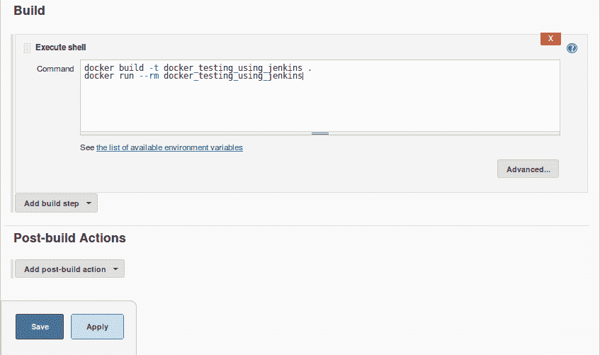

# 第六章：使用 Docker 进行测试

毫无疑问，测试这一特性一直处于软件工程学科的前沿。如今，软件在我们日常环境中每种有形物体中的深远影响已广泛被接受，这些物体都为了拥有大量智能、连接和数字化的资产。此外，随着对分布式和同步软件的关注增加，软件的设计、开发、测试、调试、部署和交付的复杂性也在不断上升。各种手段和机制被发现，以简化和优化软件构建自动化以及验证软件的可靠性、弹性和可持续性。Docker 正在成为一个极其灵活的工具，用于测试各种软件应用程序。在本章中，我们将讨论如何有效地利用 Docker 的显著进展进行软件测试，并探讨其在加速和增强测试自动化方面的独特优势。

本章讨论的主题包括：

+   **测试驱动开发（TDD）**概述

+   在 Docker 中测试你的代码

+   将 Docker 测试过程集成到 Jenkins 中

目前，Docker 容器被广泛用于创建与生产环境完全相同的开发和测试环境。与虚拟机相比，容器所需的开销更小，虚拟机一直是开发、预发布和部署环境的主要方式。让我们从下一代软件的**测试驱动开发（TDD）**概述开始，看看 Docker 启发的容器化如何在简化 TDD 过程时变得非常实用。

## **测试驱动开发（TDD）**概述

软件开发这条漫长而艰辛的旅程在过去几十年中经历了许多曲折变化，而**测试驱动开发（TDD）**无疑是其中一个突出的软件工程技术。

欲了解更多关于 TDD 的详细信息和文档，请访问 [`agiledata.org/essays/tdd.html`](http://agiledata.org/essays/tdd.html)。

简而言之，TDD 是一种软件开发实践，其中开发周期以编写一个会失败的测试用例开始，然后编写实际的软件以通过该测试，接着持续重构并重复这一周期，直到软件达到可接受的水平。这个过程如下图所示：


## 在 Docker 中测试你的代码

在本节中，我们将带领你踏上一个旅程，展示如何使用存根（stubs）进行 TDD，并演示在等同于部署系统的环境中开发软件时 Docker 如何发挥作用。为了这个目的，我们选择了一个网页应用的使用案例，其中有一个功能可以跟踪每个用户的访问次数。在这个例子中，我们使用 Python 作为实现语言，`redis` 作为存储用户访问次数的键值数据库。此外，为了展示 Docker 的测试能力，我们将实现限制为两个函数——`hit` 和 `getHit`。

本章中的所有示例都使用 Python 3 作为运行环境。Ubuntu 16.04 安装默认包含 Python 3。如果你的系统没有安装 Python 3，请参考相应的手册进行安装。

根据 TDD 实践，我们首先为`hit`和`getHit`函数添加单元测试用例，如以下代码片段所示。这里，测试文件命名为`test_hitcount.py`：

```
import unittest 
import hitcount 

class HitCountTest (unittest.TestCase): 
     def testOneHit(self): 
         # increase the hit count for user user1 
         hitcount.hit("user1") 
         # ensure that the hit count for user1 is just 1 
         self.assertEqual(b'1', hitcount.getHit("user1")) 

if __name__ == '__main__': 
    unittest.main() 

```

该示例也可以在[`github.com/thedocker/testing/tree/master/src`](https://github.com/thedocker/testing/tree/master/src)找到。

在这里，第一行我们导入了`unittest` Python 模块，它提供了必要的框架和功能来运行单元测试，并生成关于测试执行的详细报告。第二行，我们导入了`hitcount` Python 模块，在该模块中我们将实现点击计数功能。然后，我们将继续添加测试代码，以测试`hitcount`模块的功能。

现在，使用 Python 的单元测试框架运行测试套件，如下所示：

```
$ python3 -m unittest   

```

以下是单元测试框架生成的输出：

```
E
======================================================================
ERROR: test_hitcount (unittest.loader.ModuleImportFailure)
----------------------------------------------------------------------
Traceback (most recent call last):
...OUTPUT TRUNCATED ...
ImportError: No module named 'hitcount'

----------------------------------------------------------------------
Ran 1 test in 0.001s

FAILED (errors=1)

```

如预期所示，测试失败并显示`ImportError: No module named 'hitcount'`错误信息，因为我们还没有创建该文件，因此无法导入`hitcount`模块。

现在，在与`test_hitcount.py`相同的目录下创建一个名为`hitcount.py`的文件：

```
$ touch hitcount.py  

```

继续运行单元测试套件：

```
$ python3 -m unittest  

```

以下是单元测试框架生成的输出：

```
E
======================================================================
ERROR: testOneHit (test_hitcount.HitCountTest)
----------------------------------------------------------------------
Traceback (most recent call last):
 File "/home/user/test_hitcount.py", line 10, in testOneHit
 hitcount.hit("peter")
AttributeError: 'module' object has no attribute 'hit'

---------------------------------------------------------------------- 
Ran 1 test in 0.001s

FAILED (errors=1)

```

如之前一样，测试套件失败了，但错误信息有所不同，显示为`AttributeError: 'module' object has no attribute 'hit'`。我们之所以收到此错误，是因为我们还没有实现`hit`函数。

让我们继续在`hitcount.py`中实现`hit`和`getHit`函数，如下所示：

```
import redis 
# connect to redis server 
r = redis.StrictRedis(host='0.0.0.0', port=6379, db=0) 

# increase the hit count for the usr 
def hit(usr): 
    r.incr(usr) 

# get the hit count for the usr 
def getHit(usr): 
    return (r.get(usr)) 

```

该示例也可以在 GitHub 上找到：[`github.com/thedocker/testing/tree/master/src`](https://github.com/thedocker/testing/tree/master/src)。

要继续这个示例，你必须有与 Python 3 兼容的包管理器版本（`pip3`）。

以下命令用于安装`pip3`：

```
$ wget -qO- https://bootstrap.pypa.io/get-pip.py | sudo python3 -

```

在前述程序的第一行，我们导入了`redis`驱动，它是连接`redis`数据库的驱动。在接下来的行中，我们将连接到`redis`数据库，然后继续实现`hit`和`getHit`函数。

`redis`驱动是一个可选的 Python 模块，因此我们接下来将使用`pip`安装器安装`redis`驱动，如下所示：

```
$ sudo pip3 install redis  

```

即使安装了`redis`驱动程序，我们的`unittest`模块仍然会失败，因为我们尚未运行`redis`数据库服务器。因此，我们可以运行`redis`数据库服务器以成功完成单元测试，或者采用模拟`redis`驱动程序的传统 TDD 方法。模拟是一种测试方法，其中复杂的行为被预定义或模拟的行为替代。在我们的示例中，为了模拟`redis`驱动程序，我们将利用一个名为`mockredis`的第三方 Python 包。此模拟包可在[`github.com/locationlabs/mockredis`](https://github.com/locationlabs/mockredis)获取，并且`pip`安装器名称为`mockredispy`。让我们使用`pip`安装器安装这个模拟：

```
$ sudo pip3 install mockredispy  

```

安装了`mockredispy`模拟`redis`后，让我们重构我们之前编写的测试代码`test_hitcount.py`，以使用`mockredis`模块提供的模拟`redis`功能。这可以通过`unittest.mock`模拟框架提供的`patch`方法来实现，如下所示的代码所示：

```
import unittest 
from unittest.mock import patch 

# Mock for redis 
import mockredis 
import hitcount 

class HitCountTest(unittest.TestCase): 

    @patch('hitcount.r',
        mockredis.mock_strict_redis_client(host='0.0.0.0', 
        port=6379,  db=0)) 
    def testOneHit(self): 
        # increase the hit count for user user1 
        hitcount.hit("user1") 
        # ensure that the hit count for user1 is just 1 
        self.assertEqual(b'1', hitcount.getHit("user1")) 

if __name__ == '__main__': 
    unittest.main() 

```

此示例也可在 GitHub 上获取，地址为[`github.com/thedocker/testing/tree/master/src`](https://github.com/thedocker/testing/tree/master/src)。

现在，再次运行测试套件：

```
$ python3 -m unittest
.
----------------------------------------------------------------------
Ran 1 test in 0.000s

OK

```

最后，正如我们在前面的输出中所看到的，我们成功通过测试、代码和重构周期实现了访客计数功能。

### 在容器内运行测试

在前一节中，我们为您介绍了 TDD 的完整周期，我们安装了额外的 Python 包以完成开发。然而，在现实世界中，一个人可能会在多个可能存在冲突的项目上工作，因此需要隔离运行时环境。在 Docker 技术出现之前，Python 社区通常使用 Virtualenv 工具来隔离 Python 运行时环境。Docker 通过打包操作系统、Python 工具链和运行时环境进一步加强了这种隔离。这种隔离方式为开发社区提供了很大的灵活性，可以根据项目需求使用适当的软件版本和库。

下面是将上一节的测试和访客计数实现打包到 Docker 容器中并在容器内执行测试的逐步过程：

1.  编写一个`Dockerfile`来构建一个包含`python3`运行时环境、`redis`和`mockredispy`包以及`test_hitcount.py`测试文件和访客计数实现`hitcount.py`的镜像，最后启动单元测试：

```
      ############################################# 
      # Dockerfile to build the unittest container 
      ############################################# 

      # Base image is python 
      FROM python:latest 

      # Author: Dr. Peter 
      MAINTAINER Dr. Peter <peterindia@gmail.com> 

      # Install redis driver for python and the redis mock 
      RUN pip install redis && pip install mockredispy 

      # Copy the test and source to the Docker image 
      ADD src/ /src/ 

      # Change the working directory to /src/ 
      WORKDIR /src/ 

      # Make unittest as the default execution 
      ENTRYPOINT python3 -m unittest 

```

此示例也可在 GitHub 上获取，地址为[`github.com/thedocker/testing/tree/master/src`](https://github.com/thedocker/testing/tree/master/src)。

1.  现在创建一个名为`src`的目录，我们在其中编写了我们的`Dockerfile`。将`test_hitcount.py`和`hitcount.py`文件移动到新创建的`src`目录。

1.  构建`hit_unittest` Docker 镜像使用`docker build`子命令：

```
 $ sudo docker build -t hit_unittest .
 Sending build context to Docker daemon 11.78 kB
 Sending build context to Docker daemon
 Step 0 : FROM python:latest
 ---> 32b9d937b993
 Step 1 : MAINTAINER Dr. Peter <peterindia@gmail.com>
 ---> Using cache
 ---> bf40ee5f5563
 Step 2 : RUN pip install redis && pip install mockredispy
 ---> Using cache
 ---> a55f3bdb62b3
 Step 3 : ADD src/ /src/
 ---> 526e13dbf4c3
 Removing intermediate container a6d89cbce053
 Step 4 : WORKDIR /src/
 ---> Running in 5c180e180a93
 ---> 53d3f4e68f6b
 Removing intermediate container 5c180e180a93
 Step 5 : ENTRYPOINT python3 -m unittest
 ---> Running in 74d81f4fe817
 ---> 063bfe92eae0
 Removing intermediate container 74d81f4fe817
 Successfully built 063bfe92eae0  

```

1.  现在我们已成功构建了镜像，让我们使用 `docker run` 子命令启动包含单元测试包的容器，如下所示：

```
 $ sudo docker run --rm -it hit_unittest .
 --------------------------------------------------------------- 
 -------
 Ran 1 test in 0.001s 
 OK

```

显然，单元测试运行成功了，没有错误，因为我们已经打包了经过测试的代码。

在这种方法中，对于每一个变更，都会构建 Docker 镜像，然后启动容器完成测试。

#### 使用 Docker 容器作为运行时环境

在前一节中，我们构建了一个 Docker 镜像来执行测试。特别是在 TDD 实践中，单元测试用例和代码会经历多次更改。因此，需要多次构建 Docker 镜像，这是一项令人望而却步的任务。在本节中，我们将看到一种替代方法，其中 Docker 容器带有运行时环境，开发目录作为卷挂载，并在容器内执行测试。

在这个 TDD 周期中，如果需要额外的库或更新现有库，那么容器将使用所需的库更新，并且更新后的容器将被提交为一个新镜像。这种方法提供了开发者梦寐以求的隔离性和灵活性，因为运行时及其依赖项存在于容器内，任何配置错误的运行时环境都可以被丢弃，并且可以从先前工作的镜像构建一个新的运行时环境。这也有助于保持 Docker 主机的清醒状态，避免因库的安装和卸载而导致混乱。

以下示例是如何将 Docker 容器作为一个非污染但非常强大的运行时环境的逐步说明：

1.  我们首先启动 Python 运行时的交互式容器，使用 `docker run` 子命令：

```
      $ sudo docker run -it \
 -v /home/peter/src/hitcount:/src \
 python:latest /bin/bash

```

在这个例子中，`/home/peter/src/hitcount` Docker 主机目录被指定为源代码和测试文件的占位符。这个目录作为 `/src` 挂载到容器中。

1.  现在，在 Docker 主机的另一个终端上，将 `test_hitcount.py` 测试文件和 `hitcount.py` 访问者计数实现复制到 `/home/peter/src/hitcount` 目录中。

1.  切换到 Python 运行时的交互式容器终端，将当前工作目录更改为 `/src`，并运行单元测试：

```
 root@a8219ac7ed8e:~# cd /src
 root@a8219ac7ed8e:/src# python3 -m unittest
 E
 =====================================================
 =================
 ERROR: test_hitcount 
 (unittest.loader.ModuleImportFailure)
 . . . TRUNCATED OUTPUT . . . 
 File "/src/test_hitcount.py", line 4, in <module>
 import mockredis
 ImportError: No module named 'mockredis'
 --------------------------------------------------------------- 
 Ran 1 test in 0.001s 
 FAILED (errors=1)

```

显然，由于找不到 `mockredis` Python 库，测试失败了。

1.  继续安装 `mockredispy` pip 包，因为之前的步骤由于在运行时环境中找不到 `mockredis` 库而失败了：

```
      root@a8219ac7ed8e:/src# pip install mockredispy

```

1.  重新运行 Python 单元测试：

```
 root@a8219ac7ed8e:/src# python3 -m unittest
 E
 =====================================================
 ============
 ERROR: test_hitcount 
 (unittest.loader.ModuleImportFailure)
 . . . TRUNCATED OUTPUT . . . 
 File "/src/hitcount.py", line 1, in <module>
 import redis
 ImportError: No module named 'redis'

 Ran 1 test in 0.001s

 FAILED (errors=1)

```

再次，由于尚未安装 `redis` 驱动程序，测试失败了。

1.  继续使用 `pip` 安装器安装 `redis` 驱动程序，如下所示：

```
      root@a8219ac7ed8e:/src# pip install redis

```

1.  成功安装了 `redis` 驱动程序后，让我们再次运行单元测试：

```
 root@a8219ac7ed8e:/src# python3 -m unittest
 .
 ---------------------------------------------------------------
 --
 Ran 1 test in 0.000s

 OK

```

显然，这次单元测试通过了，没有任何警告或错误消息。

1.  现在我们拥有了一个足够好的运行时环境来运行测试用例。最好将这些更改提交到 Docker 镜像中以便重复使用，使用 `docker commit` 子命令：

```
      $ sudo docker commit a8219ac7ed8e \ 
 python_rediswithmock
fcf27247ff5bb240a935ec4ba1bddbd8c90cd79cba66e52b21e1b48f984c7db2

```

1.  从现在开始，我们可以使用 `python_rediswithmock` 镜像启动新容器进行我们的 TDD。

在本节中，我们生动地展示了如何使用 Docker 容器作为测试环境，同时通过将运行时依赖关系限制在容器内，保持 Docker 主机的正常性和神圣性。

## 将 Docker 测试集成到 Jenkins 中

在前一节中，我们为软件测试奠定了刺激的基础，展示了如何利用 Docker 技术进行软件测试，以及在测试阶段容器技术的独特优势。在本节中，我们将向您介绍准备 Jenkins 环境以进行 Docker 测试所需的步骤，然后演示如何扩展 Jenkins 集成并自动化 Docker 测试，使用广为人知的点击计数用例。

### 准备 Jenkins 环境

在本节中，我们将引导您完成安装 Jenkins、Jenkins 的 GitHub 插件以及 `git` 和版本控制工具的步骤。步骤如下：

1.  我们首先添加 Jenkins 的受信任 PGP 公钥：

```
 $ wget -q -O - \
 https://jenkins-ci.org/debian/jenkins-ci.org.key | \
 sudo apt-key add -

```

在这里，我们使用 `wget` 下载 PGP 公钥，然后使用 `apt-key` 工具将其添加到受信任的密钥列表中。由于 Ubuntu 和 Debian 共享相同的软件包，因此 Jenkins 提供了一个通用的软件包，适用于这两个系统。

1.  将 Debian 软件包位置添加到 `apt` 软件包源列表中，如下所示：

```
 $ sudo sh -c \
 'echo deb http://pkg.jenkins-ci.org/debian binary/ > \
 /etc/apt/sources.list.d/jenkins.list'

```

1.  添加软件包源后，继续运行 `apt-get` 命令的 `update` 选项以重新同步来自源的软件包索引：

```
      $ sudo apt-get update

```

1.  现在，使用 `apt-get` 命令的 `install` 选项安装 Jenkins，如下所示：

```
      $ sudo apt-get install jenkins

```

1.  最后，使用 `service` 命令激活 Jenkins 服务：

```
      $ sudo service jenkins start

```

Jenkins 服务可以通过任何 Web 浏览器访问，只需指定安装 Jenkins 的系统的 IP 地址（`54.86.87.243`）。Jenkins 的默认端口号是 `8080`。最新版本的 Jenkins 2.62 已经安装。以下截图是 Jenkins 的入口页面或仪表盘：


1.  提供文件中的密码并登录。此用户为管理员：

```
 $ sudo cat \
 /var/lib/jenkins/secrets/initialAdminPassword
 b7ed7cfbde1443819455ab1502a19de2

```

1.  这将带您进入“自定义 Jenkins”页面，如下截图所示：


1.  在屏幕左侧选择“安装推荐插件”，这将带我们进入安装页面。

1.  在创建第一个管理员用户页面，选择“继续作为管理员”：

****

这将带我们进入“Jenkins 已准备好！”页面，如下截图所示：


1.  现在，点击“开始使用 Jenkins”按钮将带您进入“欢迎使用 Jenkins！”页面：


1.  确保已安装`git`包，否则请使用`apt-get`命令安装`git`包：

```
      $ sudo apt-get install git

```

1.  到目前为止，我们一直使用`sudo`命令运行 Docker 客户端，但不幸的是，我们无法在 Jenkins 中调用`sudo`，因为有时它会提示输入密码。为了解决`sudo`密码提示问题，我们可以利用 Docker 组，Docker 组中的任何用户都可以在不使用`sudo`命令的情况下调用 Docker 客户端。Jenkins 安装过程中会自动创建一个名为`jenkins`的用户和组，并使用该用户和组运行 Jenkins 服务。因此，我们只需要将`jenkins`用户添加到 Docker 组中，就可以使 Docker 客户端在没有 sudo 命令的情况下正常工作：

```
 $ sudo gpasswd -a jenkins docker
 Adding user jenkins to group docker  

```

1.  使用以下命令重启 Jenkins 服务，以便使组更改生效：

```
 $ sudo service jenkins restart
 * Restarting Jenkins Continuous Integration Server
 jenkins [ OK ]  

```

我们已经设置了一个 Jenkins 环境，现在可以自动从[`github.com`](http://github.com)仓库中拉取最新的源代码，将其打包成 Docker 镜像，并执行预定的测试场景。

我们还建议您从官方 Jenkins Docker 镜像中以 Docker 容器形式运行 Jenkins，镜像地址为[`github.com/jenkinsci/docker`](https://github.com/jenkinsci/docker)。这也是一个很好的练习，能帮助您验证前几章中学习的 Docker 容器概念。

### 自动化 Docker 测试过程

在本节中，我们将探讨如何使用 Jenkins 和 Docker 实现自动化测试。如前所述，我们将使用 GitHub 作为我们的代码仓库。我们已经将之前示例中的`Dockerfile`、`test_hitcount.py`和`hitcount.py`文件上传到了 GitHub，地址为[`github.com/thedocker/testing`](https://github.com/thedocker/testing)，接下来的示例将使用这些文件。然而，我们强烈建议您创建自己的代码仓库，地址为

[`github.com`](http://github.com)，使用 fork 选项，您可以在[`github.com/thedocker/testing`](https://github.com/thedocker/testing)找到此选项，并在接下来的示例中将此地址替换为合适的地方。

以下是自动化 Docker 测试的详细步骤：

配置 Jenkins 以在 GitHub 仓库中的文件被修改时触发构建，以下是相关子步骤的说明：

1.  再次连接到 Jenkins 服务器。

1.  选择创建新任务。

1.  如下图所示，为项目命名（例如，`Docker-Testing`），并选择自由风格项目：


1.  如下图所示，在源代码管理下选择 Git 单选按钮，并在仓库 URL 文本框中指定 GitHub 仓库的 URL：


1.  在构建触发器下选择 Poll SCM，以安排每次

    15 分钟间隔。在 Schedule 文本框中输入以下代码`H/15 * * * *`，如下图所示。出于测试目的，您可以减少轮询间隔：


1.  向下滚动屏幕，点击“Build”下的“Add build step”按钮。在下拉列表中，选择“Execute shell”，并输入文本，如下截图所示：



1.  最后，通过点击“保存”按钮保存配置。

1.  返回 Jenkins 仪表板，你可以在仪表板上看到你的测试列出：


1.  你可以等候 Jenkins 计划启动构建，或者点击屏幕右侧的时钟图标立即启动构建。构建完成后，仪表板会更新构建状态为成功或失败，并显示构建编号：


1.  如果你将鼠标悬停在构建编号上，你会看到一个下拉按钮，提供一些选项，如“Changes”和“Console Output”，如下截图所示：


1.  “Console Output”选项将显示构建的详细信息，如下所示：

```
 Started by user Vinod Singh
 Building in workspace 
 /var/lib/jenkins/workspace/Docker-testing
 Cloning the remote Git repository
 Cloning repository 
 https://github.com/thedocker/testing
 > git init \ 
 /var/lib/jenkins/workspace/Docker-testing \
 # timeout=10
 Fetching upstream changes from 
 https://github.com/thedocker/testing
 > git --version # timeout=10
 Removing intermediate container 76a53284f1e3
 Successfully built d9e22d1d52c6
 + docker run --rm docker_testing_using_jenkins
 .
 --------------------------------------------
 --------------------------
 Ran 1 test in 0.000s

 OK
 Finished: SUCCESS

```

1.  现在，让我们测试由于错误的模块名`error_hitcount`导致的失败案例，这是我们故意引入的。现在，让我们通过故意在`test_hitcount.py`中引入一个 bug 来实验一个负面场景，并观察其对 Jenkins 构建的影响。正如我们配置的 Jenkins，它会忠实地轮询 GitHub 并启动构建。

显然，构建失败正如我们预期的那样：


1.  最后一步，打开失败构建的控制台输出：

```
 Started by an SCM change
 Building in workspace 
 /var/lib/jenkins/jobs/Docker-Testing/workspace
 . . . OUTPUT TRUNCATED . . . 
 ImportError: No module named 'error_hitcount'

 ---------------------------------------------
 -------------------------
 Ran 1 test in 0.001s

 FAILED (errors=1)
 Build step 'Execute shell' marked build as failure
 Finished: FAILURE  

```

显然，测试失败是由于我们故意引入的错误模块名`error_hitcount`。

酷吧？我们通过 Jenkins 和 Docker 实现了自动化测试。而且，我们能够体验到 Jenkins 和 Docker 带来的测试自动化的强大。在大规模项目中，Jenkins 和 Docker 可以结合使用，以自动化整个单元测试需求，从而自动捕捉由任何开发人员引入的缺陷和不足。

## 总结

容器化的潜在好处正在软件工程的各个领域得到发现。以往，测试复杂的软件系统需要多个昂贵且难以管理的服务器模块和集群。考虑到成本和复杂性，大部分软件测试都通过模拟过程和桩程序来完成。随着 Docker 技术的成熟，所有这些都将永远结束。Docker 的开放性和灵活性使其能够与其他技术无缝协作，显著减少测试时间和复杂性。

长期以来，测试软件系统的主要方式包括模拟、依赖注入等。这些方式通常要求在代码中创建许多复杂的抽象层。当前，开发和运行测试用例的做法实际上是在存根（stub）上进行，而不是在完整的应用程序上进行。这意味着，通过容器化工作流，完全有可能在具有所有依赖项的真实应用程序容器上进行测试。因此，Docker 范式，特别是在测试现象和阶段中的贡献，最近得到了细致的阐述和记录。准确来说，软件工程领域正朝着更加智能和光明的未来迈进，Docker 领域的创新正推动这一进程。

在本章中，我们清晰地阐述和解释了一种强大的集成应用程序测试框架，该框架采用了 Docker 启发的容器化范式。对于敏捷世界来说，经过验证且具有潜力的 TDD 方法正被坚持作为高效的软件构建和维持方法论。本章利用 Python 单元测试框架来说明 TDD 方法论如何成为软件工程的开创性工具。单元测试框架经过调整，以高效且优雅地容器化，并且 Docker 容器与 Jenkins 无缝集成。Jenkins 是一个现代的持续交付部署工具，是敏捷编程世界的重要组成部分，如本章所述。Docker 容器的源代码在进入 GitHub 代码仓库之前会进行预检查。Jenkins 工具从 GitHub 下载代码并在容器内运行测试。在下一章中，我们将深入探讨并描述通过容器技术进行进程隔离的理论方面，以及各种调试工具和技术。
