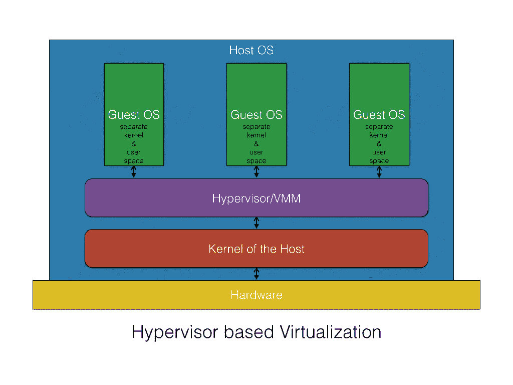
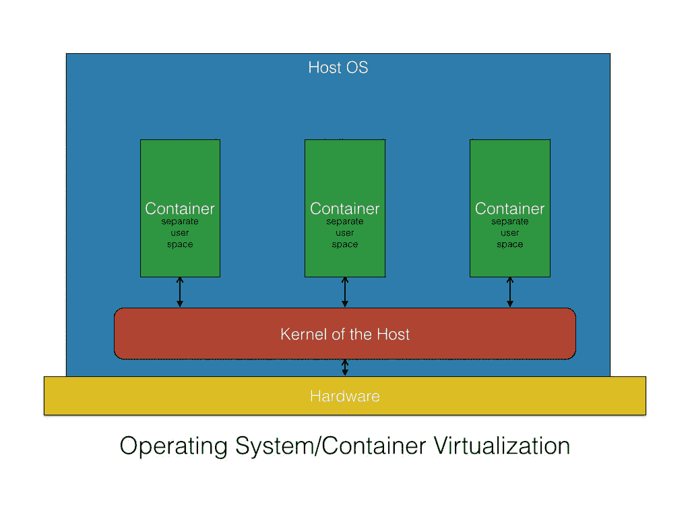

# 容器安全性

到目前为止，我们在本书中已经讨论了很多快速发展的 Docker 技术。如果不详细阐述 Docker 特有的安全问题及其解决方法，那就不算是一个完整的结尾。因此，本章特别为此而编写，并加入到本书中，目的是全面解释 Docker 启发的容器化的安全挑战。我们还希望更多地揭示如何通过一系列开创性的技术、高质量的算法、支持工具和最佳实践来应对长期存在的安全隐患。本章中，我们将详细讨论以下关键主题：

+   Docker 容器安全吗？

+   容器的安全特性

+   新兴的安全支持方法

+   确保容器安全的最佳实践

## 容器化领域的安全态势

确保任何 IT 系统和商业服务的不可破坏和无法渗透的安全性，一直是几十年来 IT 领域的主要需求和主导挑战。聪明的人才能够识别并利用各种安全漏洞和缺陷（其中一些在系统构思和实现阶段就已经被疏忽或无意间引入）。这些漏洞最终会导致无数的安全 breaches 和混乱，影响 IT 服务的交付。有时，系统甚至变得无法为消费者和客户提供服务。

然而，安全专家和工程师们则尝试使用各种技巧和技术，力图阻止黑客在他们的恶意旅程中得逞。然而，到目前为止，这场战斗并没有取得彻底的胜利。时不时地，来自未知来源的侵入事件引发了令人不安的 IT 系统慢速，有时甚至崩溃。因此，全球的组织和政府正在大量投资他们的才智、时间和财富于安全研究，以完全消除所有与安全和安全性相关的事件和事故。许多专注于安全的产品供应商和托管安全服务提供商致力于最小化安全威胁和漏洞对 IT 系统造成的无法修复和难以描述的后果。准确来说，对于任何现有或新兴技术，安全一直是最至关重要的方面。需要注意的是，企业和云计算 IT 团队在满足安全需求时，不能掉以轻心或自满。

基于 Docker 的容器化代表了从物理、未充分利用、封闭、单体且单租户的 IT 资源到灵活、开放、经济、自动化、共享、面向服务、优化利用并虚拟化的 IT 资源的不可抗拒而又充满意义的旅程的下一个逻辑步骤。精确来说，我们正朝着软件定义和容器化云环境的方向发展，以便收获一系列广泛表述的商业、技术和用户利益。正如本书多次强调的那样，Docker 容器通常包括文件系统、网络栈、进程空间以及运行应用所需的一切。这意味着每个 Docker 容器都包含指定的应用程序及其所有依赖项，并以独立的方式进行打包、托管和执行。然而，这种广受赞誉的抽象化，容易受到新型且先进的安全攻击、漏洞和缺口的影响。系统可能无法访问，数据集可能被突破，服务可能会停止，等等。

精确来说，炙手可热的 Docker 技术承诺将极大地改变全球企业开发、部署和管理关键软件应用程序的方式。然而，容器并不是万能的。我们在混合 IT 环境中部署和交付应用程序时面临的相同挑战，也会在容器中得到复制。本章明确指出了减轻容器化引发的安全问题的有效方法。随着云环境被广泛容器化，坚不可摧且无法渗透的容器最终确保了安全、可靠和智能的云数据中心。长期目标是将许多强大、弹性和有价值的容器放置在公开可发现的地点。毫无疑问，已经有一些开创性的工具和平台，通过混合和协作，将这些可定制、可配置和紧凑的容器组合成更大、更好的容器。

### Docker 容器的安全影响

Docker 技术日益流行，主要是因为 Docker 公司与其他相关方合作，推出了一个开源且具有行业强度的镜像格式，用于高效地打包、分发和运行软件应用程序。然而，将许多应用程序塞入一个系统中会带来明显的担忧和漏洞：

+   **利用主机内核**：容器共享相同的主机内核，而这种共享可能会成为容器化范式的单点故障。主机内核中的缺陷可能允许容器内的进程突破并使主机机器崩溃。因此，Docker 安全领域的工作就是探索各种选项，限制和控制内核的攻击面。安全管理员和架构师必须精心利用主机操作系统的安全功能来保护内核。

+   **拒绝服务（DoS）攻击**：所有容器都必须共享内核资源。如果某个容器可以垄断对某些资源（包括内存和处理能力）的访问，那么宿主机上的其他容器必定会因计算、存储和网络资源的不足而无法正常工作。最终，DoS 的问题就会悄然出现，合法用户将难以访问服务。

+   **容器突破**：一旦攻击者获得了对某个容器的访问权限，就不应能够访问其他容器或宿主机。默认情况下，用户没有命名空间，因此，任何突破容器的进程将拥有与在容器中相同的权限。也就是说，如果某个进程具有 root 权限，那么它在宿主机上也拥有 root 权限。这意味着用户可以通过应用程序代码中的漏洞获取提升的权限，甚至是 root 权限。最终，结果将是无法修复的损害。因此，我们需要遵循最小权限原则：每个进程和容器都应该以最小的访问权限和资源集运行。

+   **中毒镜像**：Docker 镜像也可能被破坏和篡改，从而导致不良容器和宿主机的出现。我们曾经讨论过如何在镜像仓库中彻底清理和管理 Docker 镜像。类似地，也采取了强有力的访问控制机制，以减轻镜像中毒的风险。

因此，Docker 镜像、容器、集群、宿主机和云服务将不可避免地受到病毒、恶意软件和其他关键威胁的影响。因此，Docker 安全领域近年来已经成为研究人员和从业者最具挑战性的领域之一，未来我们可以期待一系列具有突破性且增强安全性的算法、方法和论述。

### 安全方面 - 虚拟机与 Docker 容器对比

随着 Docker 容器的采用和适应不断增加，Docker 安全性被赋予了极高的重要性。毫无疑问，为了确保 Docker 容器的最大安全性，已经有大量的工作在进行，而 Docker 平台的最新版本也嵌入了多种安全增强功能。

在本节中，我们将描述在安全问题上，Docker 容器所处的位置。由于容器与**虚拟机**（**VMs**）正在密切配合进行研究，我们将从虚拟机和容器的一些安全相关点开始。首先，了解虚拟机和容器之间的区别。通常，虚拟机是重量级的，因此显得臃肿，而容器则是轻量级的，因此精简且流畅。下表概述了虚拟机和容器的知名特点：

| **虚拟机** | **容器** |
| --- | --- |
| 一些虚拟机在单一物理机器上共同运行（低密度）。 | 数十个容器可以在单一物理机器或虚拟机上运行（高密度）。 |
| 这确保了虚拟机的完全隔离以增强安全性。 | 这使得在进程级别上实现隔离，并通过诸如命名空间（namespace）和控制组（cgroups）等特性提供额外的隔离。 |
| 每个虚拟机都有自己的操作系统和由底层虚拟机监控程序管理的物理资源。 | 容器与 Docker 主机共享相同的内核。 |
| 在网络方面，虚拟机可以与虚拟交换机或物理交换机连接。虚拟机监控程序具有用于提高 I/O 性能、NIC 绑定等的缓冲区。 | 容器利用标准的进程间通信（IPC）机制，如信号、管道、套接字等来实现网络通信。每个容器都有自己的网络栈。 |

以下图表展示了基于虚拟机监控程序的虚拟化如何实现从物理机中创建虚拟机：



以下图表生动地展示了容器化如何显著偏离基于虚拟机监控程序的虚拟化：



关于虚拟机（VM）和容器的安全性讨论正变得越来越激烈。对于这两者，都有支持和反对的观点。在虚拟化范式中，虚拟机监控程序（hypervisor）是虚拟机的集中式核心控制器。任何新创建虚拟机的访问都必须通过这个虚拟机监控程序解决方案，它作为一道坚固的防线，防止任何未经认证、未授权和不道德的目的。因此，虚拟机的攻击面相较于容器来说要小。黑客必须攻破或入侵虚拟机监控程序，才能影响其他虚拟机。这意味着攻击者必须先绕过虚拟机内核和虚拟机监控程序，才能接触到宿主机内核。

与虚拟化范式不同，容器直接部署在宿主系统的内核之上。这种简洁高效的架构提供了更高的效率，因为它完全消除了虚拟机监控程序的仿真层，并且能够提供更高的容器密度。然而，与虚拟机范式不同，容器范式没有那么多的层次结构，因此如果任何容器被攻破，攻击者就很容易访问宿主机和其他容器。因此，容器的攻击面相较于虚拟机来说要大。

然而，Docker 平台的设计者已经充分考虑了这一安全风险，并设计了系统来防止大多数安全风险。在接下来的部分，我们将讨论系统中天生设计的安全性、为显著增强容器安全性而采取的解决方案以及最佳实践和指南。

### 容器的突出安全实现特性

Linux 容器，尤其是 Docker 容器，天生具备一些有趣的安全实现特性。

如前所述，Docker 使用了一系列安全防护措施来防止容器越狱。也就是说，如果一个安全机制被突破，其他机制会迅速阻止容器被黑客攻击。在评估 Docker 容器的安全性时，有几个主要领域需要检查。如前所述，Docker 为容器化应用程序提供了多种隔离功能，显著提高了它们的安全性。大多数功能是开箱即用的。细粒度的策略添加、废除和修改功能能够满足容器化的安全需求。Docker 平台允许您执行以下操作：

+   将应用程序彼此隔离

+   将应用程序与宿主机隔离

+   通过限制应用程序的能力来提高其安全性

+   鼓励采用最小权限原则

这个开源平台天生能够为不同运行时环境（如虚拟机、裸金属服务器和传统 IT）中的各种应用程序提供这些隔离功能。

## 不可变基础设施

当您为应用程序部署更新时，应该创建新的实例（服务器和/或容器）并销毁旧的实例，而不是尝试在原地进行升级。一旦应用程序开始运行，*你就不再触碰它了!* 这样带来的好处包括可重复性、减少管理开销、便于回滚等。一张**不可变镜像**是包含运行应用程序所需的一切内容的镜像，因此它包含了源代码。Docker 容器的一个原则是镜像是不可变的。也就是说，一旦构建完成，它就不能更改，如果你想做更改，你将得到一个新的镜像作为结果。

Docker 容器是自给自足的，因此我们只需要运行容器，而不必为其他事项（如挂载卷）担忧。这意味着我们可以以更简单、更透明的方式与用户或合作伙伴共享我们的应用程序。直接的结果是，我们可以通过 Kubernetes 等工具轻松地以自动化的方式扩展我们的系统，这些工具允许我们在一组机器上运行一组容器，也就是说，一个**集群**。

最后，不可变的容器如果被人尝试篡改，必定会崩溃，因此任何导致故障的操作都会在最初阶段就被无效化。

### 资源隔离

正如我们所知，容器正逐步成为**微服务架构**（**MSA**）时代的核心组成部分。也就是说，在一个系统中，可以有多个通用的以及特定目的的服务，它们可以动态地协作，以实现易于维护的分布式应用程序。随着物理系统中服务的多样性和异质性不断增加，安全复杂性自然会急剧上升。因此，需要明确界定和隔离资源，以避免任何潜在的安全漏洞。被广泛接受的安全方法是利用内核特性，包括命名空间。以下是命名空间和 cgroups 的解释：

+   **命名空间**：Linux 命名空间将一组系统资源封装，并将其呈现给命名空间内的进程，使得它们看起来似乎是专门为这些进程分配的。简而言之，命名空间是一种资源管理工具，有助于为进程隔离系统资源。内核命名空间提供了最基本的隔离形式。运行在容器中的进程不会影响其他容器或主机系统中的进程。网络命名空间确保每个容器都拥有自己的网络栈，从而限制了对其他容器接口的访问。

+   **Cgroups**：这是一个 Linux 内核概念，用于管理一组进程的系统资源隔离和使用情况，如 CPU 和内存。例如，如果你有一个占用大量 CPU 周期和内存的应用程序，比如科学计算应用，你可以将该应用放入一个 cgroup 中，以限制其 CPU 和内存的使用。它确保每个容器能够公平地分配内存、CPU 和磁盘 I/O，更重要的是，单个容器无法通过耗尽这些资源导致系统崩溃。

#### 资源计量与控制

容器需要消耗不同的物理资源，以提供其独特的功能。然而，资源消耗必须有序、规范，因此需要严格的管理。当出现偏差时，容器无法按时执行指定任务的可能性就会增大。例如，如果资源使用不同步，就可能导致 DoS（拒绝服务）问题。

Linux 容器利用 cgroups 实现资源计量和审计，以无障碍地运行应用程序。正如我们所知道的，运行容器成功所需的资源有很多。它们提供许多有用的度量，并确保每个容器获得其公平的内存、CPU 和磁盘 I/O 配额。此外，它们保证单个容器无法通过耗尽这些资源中的任何一项来使系统崩溃。此功能帮助你防御一些 DoS 攻击。此功能有助于在云环境中以多租户方式运行容器，以确保其正常运行时间和性能。任何其他容器的利用行为都会被主动识别并从源头上杜绝，从而避免任何不当行为。

### root 权限 - 影响及最佳实践

Docker 引擎通过利用前面提到的资源隔离和控制技术，有效地保护容器免受任何恶意活动。然而，由于 Docker 守护进程以 root 权限运行，Docker 暴露出一些潜在的安全威胁。在本节中，我们列出了一些安全风险以及缓解这些风险的最佳实践。

另一个需要遵循的重要原则是最小权限。容器中的每个进程必须以最小的访问权限和资源运行，以完成其功能。这里的优势在于，如果一个容器被攻破，其他资源和数据可以避免进一步的攻击。

### 受信任用户控制

由于 Docker 守护进程以 root 权限运行，因此它有能力将 Docker 主机上的任何目录挂载到容器中，而不会限制任何访问权限。也就是说，你可以启动一个容器，其中 `/host` 目录将是主机上的 `/` 目录，而容器将能够在没有任何限制的情况下更改主机文件系统。这只是众多恶意用途中的一个例子。考虑到这些活动，Docker 的后续版本通过 UNIX 套接字限制了对 Docker 守护进程的访问。如果你明确决定这样做，Docker 可以配置为通过 HTTP 的 REST API 访问守护进程。然而，你应该确保它仅能从受信任的网络或 VPN 访问，或者通过 stunnel 和客户端 SSL 证书保护。你还可以通过 HTTPS 和证书来保护它们。

#### 非根容器

如前所述，Docker 容器默认以根权限运行，容器内运行的应用程序也是如此。从安全角度来看，这是另一个主要的担忧，因为黑客可以通过攻击容器内运行的应用程序获得 Docker 主机的根权限。Docker 提供了一个简单而强大的解决方案，将容器的权限更改为非根用户，从而防止恶意的根访问 Docker 主机。这个非根用户的修改可以通过 `docker run` 子命令中的 `-u` 或 `--user` 选项，或者通过 `Dockerfile` 中的 `USER` 指令来实现。

在本节中，我们将通过展示 Docker 容器的默认根权限，并继续使用 `Dockerfile` 中的 `USER` 指令将根权限修改为非根用户，来进行演示。

首先，通过在 `docker run` 子命令中运行简单的 `id` 命令，展示 Docker 容器的默认根权限，如下所示：

```
$ sudodocker run --rm ubuntu:16.04 id
uid=0(root) gid=0(root) groups=0(root)  

```

现在，让我们执行以下步骤：

1.  编写一个 `Dockerfile`，创建一个非根权限用户，并将默认的根用户修改为新创建的非根权限用户，如下所示：

```
      ##########################################
      # Dockerfile to change from root to 
      # non-root privilege
      ###########################################
      # Base image is Ubuntu
      FROM ubuntu:16.04
      # Add a new user "peter" with user id 7373
      RUN useradd -u 7373 peter
      # Change to non-root privilege
      USER peter 

```

1.  使用 `docker build` 子命令构建 Docker 镜像，如下所示：

```
      $ sudo docker build -t nonrootimage .

```

1.  最后，让我们通过在 `docker run` 子命令中使用 `id` 命令来验证容器当前的用户：

```
 $ sudo docker run --rm nonrootimage id
 uid=7373(peter) gid=7373(peter) groups=7373(peter) 

```

显然，容器的用户、组和组现在已更改为非根用户。

将默认的根权限修改为非根权限是防止恶意渗透到 Docker 主机内核的一个非常有效的方式。

到目前为止，我们讨论了与安全相关的独特内核特性和功能。通过理解和应用这些内核特性，大多数安全漏洞可以被修补。安全专家和倡导者在考虑到容器化理念在生产环境中的快速普及后，提出了更多的安全解决方案，具体描述如下。这些安全方法在开发、部署和交付企业级容器时，开发人员和系统管理员必须给予极高的重视，以防范任何内部或外部的安全攻击。

### 容器安全的 SELinux

**增强安全 Linux**（**SELinux**）是一个勇敢的尝试，旨在清除 Linux 容器中的安全漏洞，并且它是**强制访问控制**（**MAC**）机制、**多级安全**（**MLS**）和**多类别安全**（**MCS**）在 Linux 内核中的实现。有一个新的协作项目，称为 sVirt 项目，它正在基于 SELinux 构建，并且正与 Libvirt 集成，为虚拟机和容器提供一个适应性的 MAC 框架。这一新架构为容器提供了一个受保护的隔离和安全网，主要是防止容器内的 root 进程与外部其他进程进行交互和干扰。Docker 容器会自动分配到 SELinux 策略中指定的 SELinux 上下文。

SELinux 总是在标准**自主访问控制**（**DAC**）完全检查之后，检查所有允许的操作。SELinux 可以根据定义的策略在 Linux 系统上建立和执行文件和进程的规则，并对其行为进行管理。根据 SELinux 的规格，文件（包括目录和设备）被称为对象。类似地，进程，如运行命令的用户，则被称为主体。大多数操作系统使用 DAC 系统来控制主体如何与对象及彼此之间进行交互。通过在操作系统上使用 DAC，用户可以控制自己对象的权限。例如，在 Linux 操作系统上，用户可以使他们的主目录可读，从而给用户和主体提供了窃取潜在敏感信息的途径。然而，仅仅依靠 DAC 并不能提供万无一失的安全方法，DAC 的访问决策完全依赖于用户身份和所有权。通常，DAC 忽略了其他安全启用的参数，例如用户的角色、程序的功能、可信度以及数据的敏感性和完整性。

由于每个用户通常对自己的文件拥有完全的自由裁量权，因此确保系统范围的安全策略非常困难。此外，每个用户运行的程序仅继承授予该用户的所有权限，用户可以自由地更改对其文件的访问权限。这一切导致了对恶意软件的最低保护。许多系统服务和特权程序以粗粒度的权限运行，因此这些程序中的任何漏洞都可以轻松被利用，并进一步扩展，导致系统的灾难性访问。

如开头所述，SELinux 在 Linux 内核中增加了 MAC 机制。这意味着对象的所有者无法控制或决定对象的访问。内核强制执行 MAC，它是一种通用的 MAC 机制，并且需要能够强制执行管理员设定的安全策略，应用于系统中的所有进程和文件。这些文件和进程将基于包含各种安全相关信息的标签来做出决策。

MAC 具有足够保护系统的内在能力。此外，MAC 确保应用程序的安全性，防止任何恶意的黑客攻击和篡改。MAC 还提供强大的应用程序隔离，使任何被攻击或被破坏的应用程序能够独立运行。

接下来是 MCS。它主要用于保护容器免受其他容器的影响。也就是说，任何受影响的容器都没有能力使同一 Docker 主机中的其他容器崩溃。MCS 基于 MLS 能力，并独特地利用 SELinux 标签的最后一个组件，*MLS 字段*。一般来说，当容器启动时，Docker 守护进程会选择一个随机的 MCS 标签。Docker 守护进程会将容器内的所有内容标记为该 MCS 标签。当守护进程启动容器进程时，它会告诉内核用相同的 MCS 标签标记这些进程。内核只允许容器进程读写与其 MCS 标签匹配的文件系统内容。内核会阻止容器进程读取或写入带有不同 MCS 标签的内容。这样，被攻击的容器进程就无法攻击其他容器。Docker 守护进程负责确保没有容器使用相同的 MCS 标签。通过巧妙使用 MCS，容器之间的错误级联被有效地阻止。

SELinux 在 Ubuntu 16.04 中默认未安装，与 Red Hat Fedora 或 CentOS 发行版不同，因此需要通过运行`apt-get`命令来安装 SELinux，如下所示：

```
$ sudo apt-get install selinux

```

然后通过运行以下`sed`脚本继续启用 SELinux 模式：

```
$ sudo sed -i 's/SELINUX=.*/SELINUX=enforcing/' /etc/selinux/config
$ sudo sed -i 's/SELINUXTYPE=.*/SELINUXTYPE=default/' \
/etc/selinux/config  

```

**应用程序保护**（**AppArmor**）是一个有效且易于使用的 Linux 应用程序安全系统。AppArmor 主动保护操作系统和应用程序免受任何外部或内部威胁，并防止即使是未知的应用程序漏洞被黑客滥用。AppArmor 现已用于确保 Docker 容器及容器内的应用程序的安全。政策制定正在成为确保容器安全的强大机制。政策制定和自动化执行政策在确保容器安全方面发挥着重要作用。Ubuntu 16.04 默认配备了 AppArmor，因此强烈建议使用它。

在 Docker 版本 1.13.0 及之后的版本中，Docker 二进制文件会在 TMPFS 中生成此配置文件，然后将其加载到内核中。而在 1.13.0 之前的 Docker 版本中，这个配置文件则会生成在`/etc/apparmor.d/docker`中。

`docker-default`配置文件是运行容器时的默认配置文件。它提供适度的保护，同时保持广泛的应用程序兼容性。当你运行容器时，除非使用`security-opt`选项覆盖，否则会使用`docker-default`策略。例如，以下明确指定了默认策略：

```
$ docker run --rm -it --security-opt \
 apparmor=docker-default hello-world

```

**安全计算模式**（**seccomp**）由 Docker 引擎支持，这是一项在 Linux 内核中提供的安全特性。它允许管理员限制容器内可用的操作，细化到单一系统调用的粒度。这一能力极大地限制了应用程序容器对宿主系统的访问，从而减少执行操作的可能性。企业可以根据需要配置 seccomp 配置文件，并将其应用于 Docker 环境。

默认的 seccomp 配置文件为使用 seccomp 运行的容器提供了一个合理的默认设置，禁用了 300 多个系统调用中的大约 44 个。它提供了适度的保护，同时保证了广泛的应用兼容性。

大多数应用程序都可以在默认配置文件下正常运行。事实上，默认配置文件已经能够主动保护 Docker 化的应用程序免受几个以前未知的错误影响。

该功能在 Ubuntu 16.04 中默认启用：

```
$ cat /boot/config-`uname -r` | grep CONFIG_SECCOMP= CONFIG_SECCOMP=y

```

**SCONE：基于 Intel SGX 的安全 Linux 容器**，由 Sergei Arnautov 及其团队描述，是一种为 Docker 设计的安全容器机制，利用 Intel CPU 的 SGX 受信执行支持来保护容器进程免受外部攻击。SCONE 的设计目标如下：

+   首先，它实现了小的**受信计算基础**（**TCB**）

+   其次，它必须具有较低的性能开销

SCONE 提供了一个安全的 C 标准库接口，透明地加密/解密 I/O 数据，显著减少了线程同步和系统调用在 SGX 安全区内的性能影响。SCONE 支持用户级线程和异步系统调用。根据他们的研究论文，Docker 爱好者对 SCONE 的评估给予了高度评价。

#### 加载 Docker 镜像及其安全影响

Docker 通常从网络拉取镜像，这些镜像通常在源头经过策划和验证。然而，为了备份和恢复的目的，Docker 镜像可以使用`docker save`子命令保存，并使用`docker load`子命令加载回来。这个机制也可以用来通过非常规方式加载第三方镜像。不幸的是，在这种实践中，Docker 引擎无法验证来源，因此镜像可能包含恶意代码。因此，作为安全的第一个防线，Docker 会在*chrooted*子进程中提取镜像以进行权限分离。尽管 Docker 确保了权限分离，但不推荐加载任意镜像。

**使用容器扫描来确保 Docker 部署的安全性**：**Docker 内容信任**（**DCT**）为发布者提供了一种简便而快速的方式，保证在如 Docker Hub 这样的 web 大规模仓库中发布的容器的真实性。然而，组织需要采取务实的措施，访问、评估并采取相应的行动，以确保容器化应用程序在整个生命周期中的安全性。准确来说，DCT 是一种确保你创建的 Docker 镜像的签名安全的方法，以确保它们的来源可信。

**使用 Black Duck Hub 管理容器安全性**：Black Duck Hub 是一款重要工具，用于在整个应用生命周期中管理应用容器的安全性。Black Duck Hub 允许组织识别和追踪其环境中的开源应用和组件的漏洞。评估工作基于 Black Duck 的知识库，该库包含 110 万个开源项目的信息，以及超过 100,000 个已知开源漏洞的详细数据，覆盖超过 3500 亿行代码。通过与 Red Hat 的合作，Black Duck 能够识别和清点开源及专有代码生产环境，这一能力也正在应用于容器化环境。Red Hat 推出了 **深度容器检查**（**DCI**），这是一款面向企业的解决方案，将容器认证、策略和信任整合到一个部署和管理应用容器的整体架构中。作为 DCI 的一部分，Red Hat 与 Black Duck 合作，提供一种在部署前、部署中和部署后验证容器内容的方式。

Black Duck Hub 的漏洞扫描和映射能力集成使 OpenShift 用户能够以更高的信心和安全性使用、开发和运行容器化应用程序，知道这些应用程序包含已经经过独立验证和认证的代码。该集成还提供了跟踪新披露的漏洞或与容器老化相关的变化的手段，这些变化可能会影响安全性和风险。Black Duck Hub 的应用漏洞扫描和映射能力使 Docker 用户能够在部署前后识别漏洞，并发现随着容器化应用老化或暴露于新的安全漏洞和攻击时出现的问题。

### 使用 TUF 进行镜像签名和验证

Docker 社区期望对 Docker 化软件的代码和版本提供强有力的加密保证。DCT 是与 Docker 平台 1.8 版本相关的新安全功能。DCT 本质上将 **更新框架**（**TUF**）集成到 Docker 中，使用 Notary 这一开源工具，为任何内容提供信任保障。

TUF 帮助开发者保护新的或现有的软件更新系统，这些系统通常容易受到许多已知攻击的威胁。TUF 通过提供一个全面且灵活的安全框架来解决这个普遍问题，开发者可以将其与任何软件更新系统集成。软件更新系统是一个在客户端系统上运行的应用程序，用于获取和安装软件。这可以包括已安装软件的更新，甚至是全新的软件。

**防镜像伪造的保护**：一旦建立了信任，DCT 提供了防范恶意攻击者（拥有特权网络位置的攻击者，也称为**中间人攻击**（**MitM**））的能力。

**防重放攻击的保护**：在典型的重放攻击中，之前有效的负载被重新发送，以欺骗另一个系统。在软件更新系统中，旧版本的签名软件可能会被呈现为最新版本。如果用户被诱导安装了较旧版本的软件，恶意攻击者可以利用已知的安全漏洞来攻陷用户的主机。DCT 在发布镜像时使用时间戳密钥，以防止重放攻击。这确保了用户收到的是最新的版本。

**防密钥泄露的保护**：如果密钥被泄露，你可以利用该离线密钥进行密钥轮换。密钥轮换只能由拥有离线密钥的人执行。在这种情况下，你需要创建一个新密钥，并使用离线密钥对其进行签名。

其他增强安全性的项目包括：

+   **Clair**：这是一个开源项目，用于静态分析应用程序 Docker 容器中的漏洞（[`github.com/coreos/clair`](https://github.com/coreos/clair)）。它会在本地审计 Docker 镜像，并检查容器注册表集成中的漏洞。最后，在第一次运行时，Clair 会通过其数据源引导其数据库，填充漏洞数据。

+   **Notary**：Docker Notary 项目是一个框架，允许任何人在潜在不安全的网络上安全地发布和访问内容（例如 Docker 镜像）。Notary 允许用户对内容进行数字签名和验证。

+   **Project Nautilus**：Nautilus 是 Docker 的镜像扫描功能，它可以检查 Docker Hub 中的镜像，以帮助识别可能存在的 Docker 容器漏洞。今天，Nautilus 只支持 Docker Hub，不支持私有或本地注册表。

+   **AuthZ 插件**：原生的 Docker 访问控制是全有或全无——你要么可以访问所有 Docker 资源，要么完全没有访问权限。AuthZ 框架是 Twistlock 对 Docker 代码库的贡献。AuthZ 允许任何人编写 Docker 的授权插件，从而为 Docker 资源提供细粒度的访问控制。

+   **Docker 受信任注册中心**（**DTR**）：这是 Docker 的企业版 Docker Hub。你可以在本地或虚拟私有云中运行 DTR，以满足安全或合规性要求。Docker Hub 是开源的，而 DTR 是由 Docker 销售的基于订阅的产品。与注册中心的通信使用 TLS，以确保保密性和内容完整性。默认情况下，使用公共 PKI 基础设施信任的证书是强制性的，但 Docker 允许将公司内部 CA 根证书添加到信任存储中。

### 新兴的安全方法

正如我们所知，Docker 平台使开发人员能够轻松地更新和控制容器中的数据和软件。同样，Docker 也能高效地确保构成应用程序的所有组件始终保持最新和一致。Docker 还天生提供了同一物理主机上应用程序的逻辑隔离。这种著名的隔离完美地促进了安全策略的细粒度和高效执行。然而，正如传统环境一样，静态数据容易受到来自网络和内部攻击者的各种攻击。Docker 环境还面临着其他潜在的负面威胁，可能遭受沉重的攻击。因此，必须采取适当的保障措施。容器和数据的快速、便捷传播可能会显著增加针对容器化云的威胁数量和类型。

关于 Vormetric 透明加密

组织可以高效地在 Docker 实现中围绕敏感数据建立强有力的控制。该解决方案支持静态数据加密、特权用户访问控制，并收集结构化数据库和非结构化文件的安全智能日志。通过这些功能，组织可以围绕存储的 Docker 镜像建立持久且强大的控制，并保护所有由 Docker 容器生成的数据，尤其是在数据写入 Docker 主机存储（如 NFS 挂载或本地文件夹）时。

## 容器安全的最佳实践

存在强大且弹性的安全解决方案，可以增强供应商和用户对容器化进程的信心，使其以清晰和敏捷的方式推进。在本节中，我们提供了一些来自不同来源的提示、最佳实践和关键指南，帮助安全管理员和顾问紧密地保护 Docker 容器。归根结底，如果容器运行在多租户系统中，并且你没有采用经过验证的安全实践，那么在安全方面肯定会存在潜在的危险。

首先最重要的建议是，不要在系统上运行随机的、未经测试的 Docker 镜像。要有策略，利用受信任的 Docker 镜像和容器仓库来订阅和使用应用程序以及数据容器，用于应用程序开发、打包、运输、部署和交付。从以往的经验来看，任何从公共领域下载的不受信任的容器都可能导致恶意和混乱的情况。像**Red Hat 企业版 Linux**（**RHEL**）这样的 Linux 发行版已经实施了以下机制，帮助管理员确保系统的最大安全性。

Docker 专家（Daniel Walsh，Red Hat 咨询工程师）广泛推荐的最佳实践如下：

+   只运行来自可信方的容器镜像

+   容器应用应尽可能降权或在没有特权的情况下运行

+   确保内核始终更新到最新的安全修复；安全内核至关重要

+   确保有支持团队监控内核中的安全漏洞

+   使用一个良好质量、受支持的宿主系统来运行容器，并定期进行安全更新

+   不要禁用宿主操作系统的安全功能

+   检查容器镜像是否存在安全漏洞，并确保提供商及时修复这些问题

如前所述，最大的问题在于 Linux 中的所有内容并未被命名空间化。目前，Docker 使用五种命名空间来改变进程对系统的视图：进程、网络、挂载、主机名和共享内存。虽然这些能为用户提供一定程度的安全性，但远不是像 KVM 那样全面的安全性。在 KVM 环境中，虚拟机中的进程不会直接与宿主内核通信。它们无法访问内核文件系统。设备节点可以与虚拟机内核通信，而不能与宿主内核通信。因此，要想在虚拟机中进行权限提升，进程必须首先颠覆虚拟机的内核，找到虚拟化程序中的漏洞，突破 SELinux 控制（sVirt），并攻击宿主内核。在容器环境中，方法是保护宿主机免受容器内进程的影响，同时保护容器免受其他容器的影响。这一切都在于将多个安全控制组合或集群起来，来防御容器及其内容。

基本上，我们希望设置尽可能多的安全屏障，以防止任何形式的突破。如果一个特权进程能够突破某一限制机制，那么我们的目标是用下一个安全屏障将其阻挡。在 Docker 中，尽可能利用 Linux 的各种安全机制是可行的。以下是可以采取的安全措施：

+   **文件系统保护**：文件系统需要是只读的，以避免任何未经授权的写入。也就是说，特权容器进程不能对其进行写入，并且不会影响主机系统。通常，大多数应用程序不需要对其文件系统进行任何写入。有几个 Linux 发行版提供了只读文件系统。因此，可以阻止特权容器进程将文件系统重新挂载为可读写。这完全是通过阻止容器内任何文件系统的挂载能力来实现的。

+   **写时复制文件系统**：Docker 一直使用**高级多层统一文件系统**（**AUFS**）作为容器的文件系统。AUFS 是一种分层文件系统，可以透明地叠加一个或多个现有的文件系统。当进程需要修改文件时，AUFS 会首先创建该文件的副本，并能够将多个层合并成一个文件系统的表现。这一过程被称为写时复制（copy-on-write），它防止一个容器看到另一个容器的更改，即使它们写入相同的文件系统镜像。一个容器不能更改镜像内容以影响另一个容器中的进程。

+   **能力选择**：通常，有两种方式进行权限检查：特权进程和非特权进程。特权进程绕过所有类型的内核权限检查，而非特权进程则根据进程的凭证进行完整的权限检查。最近的 Linux 内核将传统上与超级用户相关联的权限划分为独立的单元，称为**能力**（capabilities），这些能力可以独立启用或禁用。能力是每个线程的属性。移除能力可以带来 Docker 容器的一些积极变化。能力通常决定了 Docker 的功能、可访问性、可用性、安全性等。因此，在增加或移除能力时需要深入思考。

+   **保持系统和数据安全**：在企业和服务提供商在生产环境中使用容器之前，某些安全问题需要得到解决。容器化最终将使得应用程序更容易获得安全保障，原因有三：

+   +   较小的负载减少了安全漏洞的暴露面

    +   与其逐步修补操作系统，不如直接更新它

    +   通过允许清晰的责任分离，容器帮助 IT 和应用团队有目的地进行协作

IT 部门负责基础设施中与安全漏洞相关的事务。应用团队则修复容器内部的漏洞，并且还负责运行时的依赖关系。缓解 IT 和应用开发团队之间的紧张关系有助于顺利过渡到混合云模型。每个团队的责任划分明确，以确保容器及其运行时基础设施的安全。在这种明确的分工下，系统化地完成主动识别任何显性或隐性安全风险，并及时消除这些风险，进行政策制定和执行，进行精准和完美的配置，利用合适的安全挖掘和缓解工具等工作，已经成为常态。

+   **利用 Linux 内核功能**：一台普通的服务器（裸金属或虚拟机）需要以 root 权限运行一堆进程。这些进程通常包括 `ssh`、`cron`、`syslogd`、硬件管理工具（例如，加载模块）和网络配置工具（例如，处理 DHCP、WPA 或 VPN）。容器则大不相同，因为几乎所有这些任务都是由容器托管和运行的基础设施处理的。在各种由安全专家撰写的博客中，提供了若干最佳实践、关键指南、技术诀窍等。你可以在 [`docs.docker.com/`](https://docs.docker.com/) 找到一些最有趣和启发性的安全相关细节。

### Docker 容器的安全部署指南

Docker 容器越来越多地在生产环境中托管，以便被公众发现并广泛使用。尤其是随着云技术的快速采用，全球各大组织和机构的 IT 环境正通过系统化的优化和转型，巧妙且果断地托管更多种类的虚拟机和容器。为了加速将容器带入云环境（私有云、公有云、混合云和社区云），例如 Flocker 和 Clocker 等新技术不断涌现和启用。在部署容器时需要遵循一些建议。正如我们所知，容器通过允许开发者和系统管理员无缝部署应用程序和服务，从而显著降低了开销，这些应用程序和服务是业务运营所必需的。然而，由于 Docker 利用与宿主系统相同的内核来减少对资源的需求，如果配置不当，容器可能会面临重大的安全风险。在部署容器时，开发者和系统管理员必须严格遵守一些经过仔细注解的指南。例如，[`github.com/GDSSecurity/Docker-Secure-Deployment-Guidelines`](https://github.com/GDSSecurity/Docker-Secure-Deployment-Guidelines) 在表格形式中详细列出了所有正确的细节。

不可否认的事实是，分布式和复杂应用中的软件缺陷为智能攻击者和黑客突破托管关键、机密及客户数据的系统打开了大门。因此，安全解决方案正在被坚持并深入到 IT 栈的各个层级，因此在不同的层次和级别上会出现许多类型的安全漏洞。例如，仅解决部分问题的边界安全，因为需要根据变化的需求允许员工、客户和合作伙伴访问网络。类似地，还有防火墙、入侵检测和防御系统、**应用交付控制器**（**ADCs**）、访问控制、多因素认证与授权、补丁修复等。然后，为了保护数据在传输、持久存储和应用使用过程中的安全，采用了加密、隐写术和混合安全模型。这些都是反应性和现实机制，但越来越多的趋势是虚拟企业坚持采取前瞻性和先发制人的安全方法。随着 IT 朝着备受期待的虚拟 IT 发展，安全问题和影响正受到安全专家的额外关注。

### Docker 安全的未来

在不久的将来，容器化领域将会有许多值得关注的创新、转型和颠覆。通过一系列的创新和集成，Docker 平台正被定位为强化容器化旅程的领先平台。以下是通过智能利用 Docker 技术所取得的主要成就：

+   **加强分布式范式**：随着计算越来越向分布式和联合式发展，MSA 在 IT 中扮演着至关重要和更深层次的角色。Docker 容器正成为托管和交付日益增多的微服务的最有效方式。随着容器编排技术和工具获得更广泛的认可，微服务（无论是特定的还是通用的）被识别、匹配、编排和协调，形成业务感知的复合服务。

+   **赋能云计算范式**：云计算概念正强力抓住 IT 世界，推动 IT 基础设施的理性化、简化、标准化、自动化和优化。抽象化和虚拟化概念——这些是云计算范式前所未有成功的关键——正渗透到每种 IT 模块中。从最初的服务器虚拟化到现在的存储和网络虚拟化，技术的进步使得软件定义基础设施（软件定义计算、存储和网络）得到了广泛关注。Docker 引擎，作为 Docker 平台的核心和关键部分，已经得到了坚实的巩固，以确保容器能够在软件定义的环境中顺利运行。

+   **启用 IT 弹性、可移植性、敏捷性和适应性**：容器正在成为灵活且具有未来感的 IT 构建模块，以增强弹性、多样性、优雅性和柔韧性。为了确保更高的可用性和实时可扩展性，快速配置 IT 资源，消除开发与运维团队之间的所有摩擦，保证 IT 的原生性能，实现有序且优化的 IT 以提高 IT 生产力等，这些都是 Docker 容器面向智能 IT 所设想的典型应用。

容器将成为虚拟机和裸金属服务器的战略补充，以实现更深层次的 IT 自动化、加速和增强，从而实现备受期待的业务敏捷性、自治性和可负担性。

## 摘要

安全性无疑是一个挑战，也是不能忽视的重要方面。如果一个容器被攻破，那么摧毁容器宿主机并不难。因此，确保容器及其宿主机的安全是容器化概念蓬勃发展的关键，尤其是在 IT 系统集中化和联合化日益上升的今天。本章专门聚焦于 Docker 容器中令人痛心和破坏性的安全问题，并解释了为容纳动态企业级和关键任务应用程序的容器提供万无一失的安全解决方案的方法和手段。在未来的日子里，将会有新的安全方法和解决方案来保证 Docker 容器和宿主机的安全性不可渗透且牢不可破，因为容器及其内容的安全对服务提供商和消费者至关重要。
