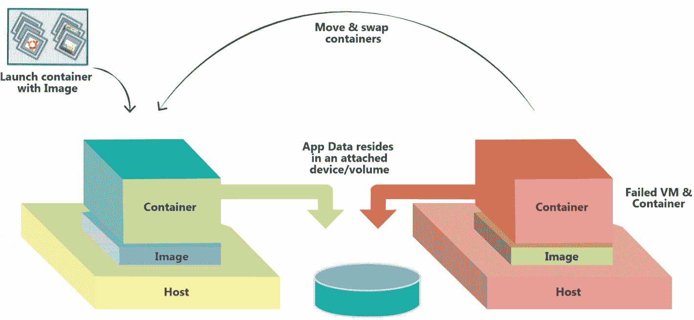
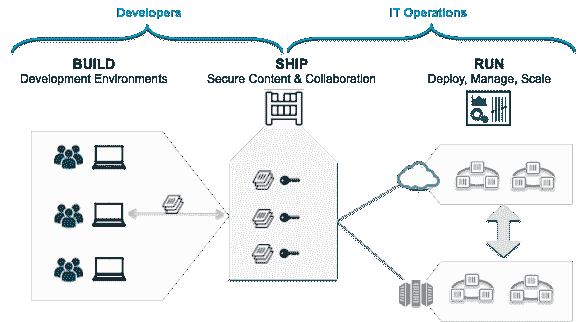

# Docker 平台 - 独特的能力和使用案例

毫无疑问，IT 领域在任何时刻都是最活跃和最显眼的领域。随着每种企业（小型、中型和大型）都通过 IT 空间中令人垂涎的进步来实现业务，IT 与业务之间存在直接而决定性的关系。由于全球经济停滞甚至滑坡，企业巨头年复一年地削减 IT 预算，这明确要求 IT 专业人士做更多的事情，用更少的资源。也就是说，通过系统地利用经过验证和有前景的技术、工具和技巧，坚持更深入、更熟练地自动化各种业务操作。通过混合云进行基础设施优化，通过集成和编排技术进行流程优化，DevOps 文化的迅速传播，通过虚拟化和容器化方法进行部门化的基础方面，API 的渗透性、普及性和说服力，MSA 的快速出现，认知分析等等，都被广泛认可和接受作为业务敏捷性、可负担性、适应性和自主性的主导和突出前进方式。

Docker 可启用的容器化是一种深受关注的机制，它具有天生的能力来为软件工程领域带来某些关键的颠覆。Docker 范式完全围绕着任何类型的软件应用程序及其依赖项的最佳打包，以便在任何本地和外部环境中进行传送、部署和执行。容器化的应用程序（应用程序及其执行容器）与当前软件行业中现有的选项相比，极为轻量级、便携、可扩展、可复制和可重复使用。

Docker 的理念促进了许多有意义的创新。Docker（通过其独特的打包格式和高度集成的平台）简化并加速了公开可发现、网络可访问和远程部署的容器化应用程序的形成，这些应用程序易于组合、消耗和配置。此外，还有用于强大的容器监控、测量和管理的软件解决方案。在本章中，我们将讨论 Docker 范式加速成熟和稳定性如何确保急需的业务转型。文献讨论了 Docker 技术对下一代 IT 的几个改变性影响，而本章旨在揭开 Docker 的神秘面纱。

## 描述容器

包括虚拟化和容器化在内的隔离化是 IT 敏捷性的新时代标准。虚拟化一直是云计算巨大成功的神秘基础。现在，随着容器化概念的普及和可用性，越来越多的关注被投入到使用容器来加速应用程序构建、部署和交付上。容器特别配备了一些改变游戏规则的能力，因此有一股力量在推动拥抱和发展容器化技术和工具。

容器在业界非常火热。从本质上讲，容器是轻量级、虚拟化的且可移植的，**软件定义环境**（**SDE**）使得软件可以在与同一物理主机上运行的其他软件隔离的环境中运行。容器内运行的软件通常是单一功能的应用程序。容器为 IT 环境带来了备受追捧的模块化、可移植性和简洁性。开发人员喜爱容器，因为它们加速了软件工程，而运维团队则喜爱容器，因为他们可以专注于运行时任务，如日志记录、监控、生命周期管理和资源利用，而不是管理部署和依赖关系。

### 区分 Docker 容器

严格来说，Docker 容器将一段软件包装在一个完整的文件系统中，该文件系统包含运行所需的一切：源代码、运行时、系统工具和系统库（任何可以安装在服务器上的东西）。这保证了软件无论在什么操作环境下运行，都会始终如一。

启用 Docker 容器化的主要动机如下：

+   运行在单台机器上的容器共享相同的操作系统内核。它们能够立即启动并使用更少的 RAM。容器镜像是由分层的文件系统构建而成，并共享公共文件，从而使磁盘使用和镜像下载更加高效。

+   Docker 容器基于开放标准。这种标准化使得容器可以在所有主要的 Linux 发行版以及其他操作系统，如 Microsoft Windows 和 Apple Macintosh 上运行。

与 Docker 容器相关的几个好处如下：

+   **效率**：如前所述，多个容器可以在一台机器上共享同一个内核，因此它们轻量、可以瞬间启动，并且更加高效地利用 RAM。

+   +   **资源共享**：这种工作负载之间的共享相比于使用专用和单一用途的设备可以提高效率。资源共享提升了资源的利用率。

    +   **资源分区**：这确保资源被适当划分，以满足每个工作负载的系统需求。此分区的另一个目标是防止工作负载之间发生任何不良的交互。

    +   **资源即服务（RaaS）**：可以单独或共同选择、配置并直接提供各种资源给应用或用户以运行应用。

+   **原生性能**：由于容器的轻量特性和较少的资源浪费，容器保证了更高的性能。

+   **可移植性**：应用、依赖项和配置被打包在完整的文件系统中，确保应用能够在任何环境中无缝运行（虚拟机、裸金属服务器、本地或远程、通用或专用机器等）。这种可移植性的主要优势是，可以在部署之间更改运行时依赖项（甚至是编程语言）。

下图展示了容器如何在多个主机之间移动和交换：

+   **实时可扩展性**：可以在几秒钟内配置任意数量的全新容器，以应对用户和数据负载。相反，当需求减少时，可以关闭额外配置的容器。这确保了按需提供更高的吞吐量和容量。Docker Swarm、Kubernetes 和 Apache Mesos 等工具进一步简化了弹性扩展。

+   **高可用性**：通过运行多个容器，可以在应用中建立冗余。如果一个容器失败，那么提供相同功能的存活容器将继续提供服务。通过编排，失败的容器可以自动重新创建（重新调度），无论是在同一主机还是不同主机上，从而恢复完整的容量和冗余。

+   **机动性**：运行在 Docker 容器中的应用可以轻松修改、更新或扩展，而不会影响主机中其他容器。

+   **灵活性**：开发者可以自由选择他们偏好的编程语言和开发工具。

+   **集群化**：容器可以根据需求进行集群化，并且有集成的管理平台来启用和管理集群。

+   **组合性**：托管在容器中的软件服务可以被发现、匹配并链接，以形成业务关键、过程感知和复合型服务。

+   **安全性**：容器通过为应用提供额外的保护层，将应用与彼此及底层基础设施隔离开来。

+   **可预测性**：通过不可变的镜像，由于代码包含在镜像中，镜像在任何地方都会表现出相同的行为。这对于部署和应用生命周期管理具有重要意义。

+   **可重复性**：使用 Docker，用户可以构建一个镜像，测试该镜像，然后在生产环境中使用相同的镜像。

+   **可复制性**：使用容器，轻松实例化完整应用栈和配置的相同副本。新员工、合作伙伴、支持团队等可以使用这些副本在隔离环境中安全地进行实验。

## Docker 平台简介

Linux 容器非常复杂且不易于用户操作。意识到这一事实后，一个开源项目启动，旨在创建一个复杂而模块化的平台，包括一个能够简化和优化各种容器生命周期阶段的引擎。这意味着 Docker 平台旨在自动化轻量、可扩展和自给自足容器中的任何软件应用的制作、打包、运输、部署和交付。Docker 被定位为实现高度灵活和面向未来的容器化技术，适用于高效和企业级分布式应用。这将对 IT 行业产生敏锐和决定性的影响，因为公司不再依赖于单一物理或虚拟服务器上分发的大型单块应用，而是构建更小、自定义、可持续、易管理和独立的应用。简言之，服务正在变成微服务，以推动容器化运动。

Docker 平台允许艺术般地从不同的分布式组件中组装应用程序，并消除在代码发布过程中可能出现的任何缺陷和偏差。通过一系列脚本和工具，Docker 简化了软件应用的隔离，并通过在临时容器中运行它们使它们自给自足。Docker 为每个应用程序提供了与其他应用程序以及底层主机的必要隔离。我们习惯于通过额外的间接层形成的虚拟机来实现必要的隔离。然而，这种额外的层级和开销消耗了大量宝贵资源，因此是系统减速的不良原因。另一方面，Docker 容器共享所有资源（计算、存储和网络），因此可以运行得更快。标准形式的 Docker 镜像可以广泛共享和轻松存储，以生产更大、更好的应用程序容器。简而言之，Docker 平台为各种 IT 基础设施的最佳消耗、管理和操纵奠定了刺激和引人入胜的基础。

Docker 平台是一个开源的容器化解决方案，智能迅速地将任何软件应用程序和服务打包成容器，并加速在任何 IT 环境（本地或远程系统、虚拟化或裸机、通用或嵌入式设备等）中部署容器化应用程序。Docker 平台完全负责容器的生命周期管理任务。整个过程从为识别的软件及其依赖项形成标准化和优化的镜像开始。现在，Docker 平台使用准备好的镜像来形成容器化软件。公开和私有位置都提供了镜像存储库。开发人员和运维团队可以利用它们以自动化方式加快软件部署。

Docker 生态系统正在快速发展，有许多第三方产品和工具开发者致力于将 Docker 打造成一个企业规模的容器化平台。它帮助跳过开发环境和特定语言工具的设置和维护。相反，它专注于创建和添加新功能，修复问题并发布软件。"构建一次，到处运行"是 Docker 启用的容器化的典型口号。简而言之，Docker 平台带来了以下能力：

+   **灵活性**：开发人员可以自由定义环境，并能创建应用程序。IT 运营团队可以更快地部署应用程序，使业务能够超越竞争对手。

+   **可控性**：开发人员拥有从基础架构到应用程序的所有代码。

+   **可管理性**：IT 运营团队成员具备标准化、安全化和扩展操作环境的管理能力，同时降低组织的总体成本。

### Docker 平台不断发展的组件

Docker 是一个平台，用于开发、发布和运行由分布式微服务构建的强大应用程序。该平台在第三方产品供应商和 Docker 空间的初创公司的持续支持下正在扩展。为不同的使用案例，正在构建并发布额外的自动化工具到市场上：

+   Docker Hub

+   Docker Trusted Registry

+   Docker Engine

+   Docker Kitematic

+   Docker Toolbox

+   Docker Registry

+   Docker Machine

+   Docker Swarm

+   Docker Compose

+   Docker Cloud

+   Docker 数据中心

随着持续的需求，我们可以安全地预期在未来几天内将有新的添加到上述列表中。Docker 团队正在积极主动地研发各种工具，以实现所需的自动化和简化，减少 IT 专业人员的工作量。

## Docker 技术的影响

通过系统化和明智地使用 Docker 理念，全球各地的企业和组织必将在其业务转型需求中获得巨大的好处。本节将描述 Docker 范式的重大影响和潜力。毫无疑问，容器现在是一个热门话题。企业、服务提供商（云、通信等）和消费者都在追寻 Docker 的梦想。Docker 已经在企业和云 IT 领域创造了多方面的印象和影响。系统化利用 Docker 技术无疑能为企业带来可喜的进步。

### 现代企业开发

从概念上讲，容器镜像可以被视为容器文件系统的快照，可以存储在磁盘上。容器文件系统通常是按层次结构排列的，每次更改都会被仔细地捕捉到一个独立的层中。这使得容器镜像能够标明其派生自哪个父镜像。Docker 镜像通过标准化和简化的格式表示，最终能够实现软件应用的快速和高效部署与执行。容器具有可移植性。这意味着“一次构建，处处运行”是可移植性目标的核心。容器可以在任何运行相关操作系统的硬件上运行。

当然也有挑战。由于一个 Docker 主机中可能有多个容器，因此在云环境（私有、公共和混合）中可能会出现容器蔓延的问题。为了有效的监控和管理，正在利用集群和编排的概念，以便查找和绑定不同的分布式容器。此外，为了通过容器化应用程序构建分布式应用，提倡通过编排技术进行服务组合。Docker Compose 是构建复合应用的关键解决方案。针对容器级别的工作，已经有自动化监控、度量、管理和编排的软件解决方案（如 Docker Swarm、Kubernetes 和 Mesos）。在接下来的部分，我们将解释为什么容器最适合灵活和高效的企业。这并不意味着虚拟化已退出历史舞台。在某些情况下，虚拟化和容器化的混合使用会产生奇妙的效果。

将这些特殊功能与容器镜像结合，形成一个可行且值得尊敬的抽象层，实现了应用程序与底层操作系统之间的清晰隔离。这种镜像和操作系统的干净解耦使得在开发、测试、预发布和生产环境中部署软件应用成为可能，且没有任何障碍或问题。Docker 使能的统一性和普遍性提高了部署的可靠性，并通过消除各种不一致和不必要的摩擦，加速了现代企业开发。广泛推荐的做法是，拥有一个严密的容器镜像，它可以将应用程序的所有依赖项打包在一起。然后，这个镜像可以被部署到容器中，确保应用程序可以随时随地运行。

### MSA 和 Docker 容器

服务使能的成功推进是由多种原因和目标驱动的。每个系统（物理、机械、电气和电子）都通过易于消费的接口进行系统化使能。由于其简单性，RESTful 接口和服务已经变得无处不在。在最近，随着互联网、企业、移动和云应用的迅速普及，REST 理念显然吸引了大量关注。人们很快发现，将业务功能拆分成可重用的服务是非常有效的；然而，这也带来了一个风险点。这意味着，每当一个服务更新时，所有依赖于该更新服务的其他服务都必须经过各种正式的验证和确认。这是因为服务不可避免地需要查找、绑定并利用其他服务及其独特的功能和数据点，以确保其正确性和相关性。这种不受限制的共享可以在本地或通过网络与远程服务发生。

基本上，微服务方法简而言之规定，与其拥有一个庞大的代码库供所有开发人员操作（这往往变得难以管理），不如拥有多个较小的代码库，由小型灵活的团队负责管理，这些团队分布在不同的时区。每个代码库都必须通过良好设计和定义的 API 进行互操作。每个代码库的体积较小，且相互完全解耦。依赖关系完全消失，从而带来了更好的安全性、可靠性、简易性、可扩展性、可用性等。代码库被称为微服务。微服务如此前所未有地蓬勃发展背后的动机有很多，特别是细粒度的扩展、易管理性、灵活性、可重新配置性和可扩展性、通过 API 访问实现的强大安全性、容器作为最佳运行时环境的适用性等，都是被广泛提及的。微服务可以独立部署、横向扩展，支持任何后端数据库（SQL、NoSQL、NewSQL、内存数据库等），并且可以使用任何编程语言构建。

Docker 容器最适合承载微服务。将单个服务或进程进行容器化，使得管理、更新和扩展这些服务变得非常简单。现在，随着任何 IT 环境中微服务数量的快速增长，管理复杂度也在急剧增加。这意味着，面临的挑战包括如何在集群中管理单个服务，以及如何应对分布式和不同主机上的多个服务。Kubernetes、MaestroNG、Mesosphere 和 Fleet 应运而生，满足了这一日益增长的需求。

总结来说，一个显著的原因是微服务的兴起和大量推广，这使得容器的不可或缺性得以显现。微服务所期待的各种目标通过将微服务封装进容器中得到了实现。这一有趣的组合注定将在全球企业的 IT 团队中发挥至关重要的作用。实际上，容器化原则的广泛应用为特定目的和通用微服务的爆炸性增长奠定了激励基础。

#### 案例研究

SA Home Loans 在开发和生产过程中面临挑战。SA 目前有四个 Scrum 团队，每个团队都拥有一个开发和系统测试实验室。团队面临着部署速度慢的问题，只能在开发实验室中构建和部署两个应用程序，导致部署周期长，有时需要花费多达 2 周的时间才能将应用程序部署到测试环境。这一问题也延伸到生产环境中。主要的住房贷款服务软件是使用传统技术构建的单体应用。

IT 团队作出了有意识的决定，采用微服务架构（MSA）以获得灵活性、可移植性和可扩展性，并且这一决策导致了 50 个微服务的诞生。在理解了 Docker 技术的巨大潜力后，团队将所有微服务迁移到了容器中。

团队还需要一个生产就绪的编排服务，能够为其提供一个集中管理和分发容器到各个节点的单一入口，并且为团队提供所有容器的高层次监控。Docker Swarm 就是编排工具。SA Home Loans 现在使用 Docker Datacenter，这是一种本地托管的解决方案，通过支持的**容器即服务**（**CaaS**）平台将容器管理和部署服务带入企业。SA Home Loans 现在每天构建和部署应用程序多达 20 到 30 次。**统一控制平面**（**UCP**）内嵌 Swarm，提供生产就绪的容器编排解决方案。

### 基础设施优化

虚拟化一直是大幅优化和组织各种 IT 基础设施（服务器、存储设备、网络和安全解决方案）的主要机制。通过虚拟机实现的已验证的分而治之技术是 IT 优化的主要目标。近期，Docker 容器作为一种“伪装的福音”出现了。容器只包含构建、传输和运行软件应用所需的内容。与虚拟机不同，容器不需要来宾操作系统或虚拟机监控程序。这使得企业能够大幅减少存储量，并完全消除虚拟机监控程序的许可费用。与在物理机器中堆叠虚拟机的数量相比，物理主机或虚拟机中可以容纳的容器数量更多。这意味着容器是细粒度的，而虚拟机是粗粒度的。在容器化的情况下，资源浪费非常少。容器使得 IT 基础设施和资源得到有条理的使用。

可移植性是另一个因素。这使得 IT 运维团队能够在不同的云服务、物理服务器或虚拟机之间移动工作负载，而不必将它们锁定在特定的基础设施工具中。通过容器进行的工作负载整合或优化是无误的，因为容器可以在任何地方运行。在虚拟机的情况下，考虑到虚拟机监控程序/**虚拟机监控器**（**VMMs**）的多样性，虚拟机的部署是一个复杂且困难的事务。这里的关键点是，Docker 使企业能够优化基础设施的利用率，并减少维护现有应用程序的成本，这恰恰是企业 IT 团队每天面临的最大挑战。

Docker 大大缩短了安装应用程序、扩展以满足客户需求或简单启动新容器所需的时间。这意味着，将新产品推向市场的速度极快，因为底层基础设施（无论是虚拟还是物理）只需几秒钟就能准备好。

#### 案例研究

需要建立并提供**数据库即服务**（**DaaS**）功能的客户已经决定每个数据库实例都部署在自己的虚拟机（VM）中。有时可能会有 100 个虚拟机运行着 100 个数据库。这是极其低效的，浪费了大量昂贵的资源。而现在，相同数量的数据库实例可以在同样数量的容器中运行，容器又可以在少数几个虚拟机中运行。结果是巨大的成本节约。以下是另一个案例研究：

+   **客户详情**：Swisscom 是瑞士领先的电信服务提供商，提供一系列企业和消费者服务。

+   **业务挑战**：包括为客户提供可靠且易于维护的 DaaS，同时实现高服务器密度，以确保高效运行。

+   **解决方案方法**：ClusterHQ 的 Flocker 提供了程序化管理 Docker 容器持久数据的能力，这些数据存储在 EMC ScaleIO 中。

+   **业务成果**：该解决方案显著提高了每台服务器上托管的应用程序密度，改善了数据库的运维管理，并为消费级和企业级 IT 部门的可持续创新铺设了充满活力的平台。

### 启用 DevOps

如今，IT 行业越来越多地遵循敏捷开发，以优雅地确保业务敏捷性、适应性和可负担性。这意味着，通过严格采用有效的 IT 敏捷方法，满足了广泛需求的业务敏捷性。为实现 IT 敏捷性，有一系列日益可行且值得尊敬的机制。主要地，IT 敏捷性是通过敏捷编程方法来推动的，如结对编程、**极限编程**（**XP**）、精益开发、Scrum 和看板、**测试驱动开发**（**TDD**）和**行为驱动开发**（**BDD**）。

现在，软件开发过程的速度显著加快。然而，开发和运维之间存在着很大的脱节。这意味着，只有当运维团队也严格遵循敏捷、适应性和自动化的 IT 操作时，真正的 IT 敏捷性才能实现。企业级 DevOps 是建立开发者和运维人员之间有效联系的最有前途的方式，从而使 IT 系统能够快速启动。容器化是推动 DevOps 普及、渗透和具有说服力的最积极的发展趋势。

Docker 非常适合快速设置开发和测试环境以及沙箱环境。Docker 有趣的是为确保高效的 DevOps 提供了更好的关注点分离；容器开发者只需专注于构建 Docker 镜像并提交它们，使其成为容器。运维团队可以监控、管理和维护这些容器。最后，Docker 可以轻松集成到多个 DevOps 工具中，实现更好的工作流自动化和持续集成。此外，它还使 DevOps 团队能够快速、经济高效地扩展开发和测试环境，并无缝地将应用程序从开发、测试迁移到生产。

### 持续集成与持续部署

**持续集成**（**CI**）和**持续部署**（**CD**）是实现敏捷 IT 最受欢迎的技术和工具。过去，开发人员会使用任一构建工具来自动化他们的构建过程。然后，他们会将代码交给运维团队进行部署、管理、维护和支持。为了自动化繁琐且艰难的软件部署和交付过程，存在许多配置管理和软件部署工具。这种分离的模式带来了一些重复出现的问题。使用容器后，运维团队可以构建他们希望部署和交付的完整栈的标准容器镜像。开发人员可以使用这些镜像来部署代码并进行单元测试。经过测试、优化和加固后的相同镜像可以在所有环境（开发、测试、预生产和生产）中使用，每次都能得到相同的结果。这种容器化支持的设置专门加速了软件部署和交付活动，以无风险的方式进行。

根据 Docker 官网，CI/CD 通常将开发与测试结合起来，使开发人员能够协作构建代码，将其提交到主分支，并检查是否存在问题。这意味着开发人员可以在应用程序开发生命周期的早期阶段构建和测试代码，从而尽早发现 bug。由于 Docker 可以与 Jenkins 和 GitHub 等工具集成，开发人员可以在 GitHub 中提交代码，测试代码，并使用 Jenkins 自动触发构建。构建完成后，镜像可以添加到 Docker 注册中心。这最终简化了过程，节省了构建和设置过程的时间，同时允许开发人员并行运行测试并自动化它们，从而在测试运行时可以继续进行其他项目工作。通过容器化，环境依赖性和不一致性得到了消除。

### 持续交付

**持续交付**方法涉及快速的软件开发迭代和频繁、安全的应用程序更新。这完全是为了通过在短时间内生产可靠的软件来减少风险，并更快速地交付价值。由于 Docker 封装了应用程序及其环境或基础设施配置，它为持续交付管道的两个关键方面提供了基础构件。Docker 使得测试您将要部署的内容变得更加容易。在交接过程中出现严重错误或引入任何不希望的变化的可能性因此减少。Docker 容器鼓励持续交付的核心原则：它们在管道的每个步骤中重用相同的二进制文件，确保在构建过程中不会引入错误。

如前所述，Docker 容器为不可变基础设施提供了基础。应用程序可以被添加、移除、克隆，或其组成部分可以发生变化，而不会留下任何残余。IT 基础设施可以在不影响其上运行的应用程序的情况下进行更改。Docker 工具生态系统是其成长轨迹，因此许多与交付相关的工作得以自动化并加速，以增加业务价值。正如 Martin Fowler 所说，您实际上会在以下情况下进行持续交付：

+   如果您的软件在整个生命周期内都可以部署

+   如果您的团队优先考虑保持软件可部署，而不是开发新功能

+   如果任何人在对系统进行更改时，可以随时获得关于其生产就绪情况的快速自动反馈

+   如果您可以按需将任何版本的软件部署到任何环境

Docker 还可以轻松与 CI 和持续交付平台集成，使得开发和测试能够无缝地将更新交付到生产环境中。在任何类型的故障发生时，可以回滚到之前的工作版本。

#### 精确测试

Docker 通过为构建、测试和管理分布式应用程序创建一个通用框架，从而加速了 DevOps 的进程，这一框架不依赖于编程语言、开发工具或环境变量。Docker 通过允许开发人员、**质量保证**（**QA**）团队和系统管理员高效地共享代码、交换内容和集成应用程序，改善了协作。我们可以确信，我们的 QA 环境与即将在生产环境中部署的环境完全一致。

#### 促进 CaaS

我们一直在调整 IT 基础设施和**平台即服务**（**PaaS**）。裸金属服务器和虚拟机是 IT 中心中的关键计算资源。现在，随着容器的成功普及，**容器即服务**（**CaaS**）正变得异常流行并充满诱惑。传统环境中的 PaaS 存在一些问题，CaaS 被视为克服 PaaS 问题的解决方案：

高级 CaaS 架构

在前面的图中，位于左侧的开发人员正在从受信任和精心挑选的基础镜像库中拉取和推送应用内容。位于右侧的运维团队则负责监控和管理已部署的应用和基础设施。这两个团队可以通过一个工具集进行协作，工具集使得两个团队在应用生命周期内保持关注点分离的同时，能够统一协作。Docker 平台就是这样一个工具集，它使得构建一个符合不同业务需求的 CaaS 成为可能。

添加新技术组件变得极为简单。假设一家公司想要将 MongoDB 加入其技术栈中。现在，可以从 Docker Hub 拉取一个经过认证的镜像，根据需要进行调整，并迅速部署。然后，开发人员可以使用这个容器。容器还允许更多的实验。由于构建和拆除容器非常容易，开发人员可以快速比较堆栈组件的特性。例如，开发人员想要测试三种不同 NoSQL 数据库技术的性能，他们只需启动每种 NoSQL 技术的相应容器，无需处理管理基础设施和底层技术栈的复杂性。然后，开发人员可以针对每个不同的容器运行性能测试，并快速选择合适的容器。

容器天生具备令人惊叹的能力，能够提供类似 JVM 的可移植性，完全抽象掉底层基础设施。一个真正的 CaaS 模型是为多容器应用在多云环境中的部署铺平道路。

### 加速工作负载现代化

有各种工作负载需要适当地现代化并迁移到强大的环境（云端），以便全球用户可以轻松查找、绑定并使用这些工作负载来生产业务关键应用。工作负载通常代表软件应用、 middleware、平台等。在过去，**面向服务的架构**（**SOA**）通过集成和组合促进了软件的现代化。最近，MSA 被誉为现代化遗留系统、单体应用和大型应用的最佳方法。应用程序因此被拆分，以便更容易管理。随着复杂应用以互操作、可移植和可组合的微服务集合的形式呈现和暴露，开发、部署和管理的复杂性预计会降低。这意味着应用模块将被重构，并准备好实现松耦合，甚至解耦。此外，推荐将应用设计为无状态的，以便于扩展和独立部署。

一些应用程序可以采取“提升和转移”路径到云端。这意味着如果进行一些代码修改，它们可以被显著重构，以充分利用云中心的独特优势。应用程序正在重新设计、重新编码，并为特定的云平台重新定位。这赋予了遗留应用程序新的生命和新的用途。

容器是托管和交付微服务的高度优化和有组织的运行时环境。容器与微服务相结合，在许多方面正成为 IT 世界中最关键的组合。使用容器来“包装”或容器化现有的遗留应用程序具有一些优势。容器负责底层平台和基础设施以及与之相关的复杂性。容器化的应用程序具有可移植性，并加快了遗留应用程序现代化的速度。通过使用容器，云迁移变得更加顺畅。可以轻松快速地将安全性、Web 和服务启用以及治理等附加功能应用到容器化应用程序上。此外，现代化的遗留应用程序更适合分布式计算。

将当前和传统应用程序现代化，并将它们迁移到云端的一个好方法是利用 Kubernetes 和 Mesos 等技术，而不是构建所有的**非功能需求**（**NFRs**），如可扩展性、安全性和可持续性。

#### Docker 用于状态应用程序

容器通常是无状态的。然而，对于某些应用程序，状态计算资源是必需的。Docker 在将这些计算资源在主机之间迁移时，原生并未提供存储卷管理或数据持久化。ClusterHQ 的 Flocker 解决方案解决了这些需求，并通过提供一个框架来管理卷和数据持久化，使容器能够用于状态应用程序，如数据库，当计算资源从一个主机迁移到另一个主机时。Flocker 与所有主要的容器管理器兼容（包括 Docker Swarm、Kubernetes 和 Apache Mesos）。

#### 边缘计算的容器

安全性担忧以及缺乏可视性和可控性被认为是云计算的广泛认同的缺点。私有云和云小单元是可行的选择。然而，它们也面临着某些限制。然而，最近的边缘计算或雾计算现象被认为是克服云计算所有弱点的最成功的计算范式。

边缘计算的核心在于将数据处理和存储从集中式位置（云端）转移到分布式和去中心化的环境（本地）。这意味着通过将计算、网络和存储能力更接近用户，**服务质量**（**QoS**）属性 / 非功能性要求（NFRs）能够轻松且高效地完成。传统上，所有计算和存储都发生在云环境中（本地和非本地）。然而，某些场景，如实时分析和更快的响应，需要在用户端进行计算。可以毫不夸张地说，当 IT 变得以人为中心、情境感知、具有适应性、实时性和多模态时，QoS 和用户体验会显著提高。现实世界和实时应用及服务必然要求在边缘进行计算。即使在边缘计算方面也有若干架构上的复杂性，但随着应用和容器体积的成熟和稳定，边缘计算自然得到了急需的推动。

##### 设备网络、服务启用和集群

一般来说，边缘设备如植入设备、可穿戴设备、便携式设备、网关、移动设备、手持设备、消费电子产品和机器人通常是资源受限的。这些设备大多数不是静态的，通常是流动的。在它们之间建立无缝连接以进行过程、应用和数据整合确实是一项艰巨的任务。因此，边缘设备上的地理分布计算需要一个轻量级、本质上可扩展且智能的平台来处理极为脆弱的服务部署、交付和管理。**开放服务网关接口**（**OSGi**）是一个有趣的框架，用于优雅地激活和管理资源受限的嵌入式和连接设备及其独特的服务。任何服务或应用程序都可以容器化，并可以与各种参与设备一起加载。然后，OSGi 包的一个实例可以被容器化并托管在用户环境中一台功能较强的设备上，从而发现并管理所有设备及其服务容器。这种设置使得集中式（来自云端）以及去中心化的设备服务监控、测量和管理成为可能。Docker 化平台是一种经过验证的机制，用于安装、配置、管理、升级和终止正在运行的服务。

##### 设备服务注册与发现

在特定环境中可能有成千上万的边缘设备。为了以系统化的方式发现、索引和管理异构、动态和分布式的设备，强烈需要服务注册和发现能力。管理平台必须具备此功能，以便自动地发现、绑定和利用多个设备。

##### 容错

平台必须具备容错能力，以保证高可用性和可靠性，从而确保业务连续性。

##### 缓存

可以在边缘设备上执行缓存操作，以实现更快的访问并提升整体应用性能。如果 Docker 镜像存储并缓存于边缘设备，则可以大大加速应用的配置过程。另一个使用案例是将应用数据存储在缓存中，从而显著提高应用性能。

布哈里·伊赫万·伊斯梅尔（Bukhary Ikhwan Ismail）及其团队建立了一个测试平台，以考察 Docker 作为边缘计算或雾计算候选技术之一的可行性。该测试平台由一个数据中心和三个边缘站点组成，用于模拟环境。在每个边缘站点上，都会设置一个 Docker Registry，用于在本地存储 Docker 镜像。边缘站点的 Docker 守护进程可以从 Docker Registry 中搜索并拉取 Docker 镜像。在每个边缘站点上配置 Docker Swarm，用于管理多个 Docker 守护进程。Docker Swarm 充当集群和编排工具。根据实验和评估，Docker 提供了快速部署、小巧的占用空间和良好的性能，这使其有可能成为一个可行的边缘计算平台。

马塞尔·格罗斯曼（Marcel Grossmann）及其团队开发了**Hypriot Cluster Lab**（**HCL**）。这是一个基于 ARM 架构的云解决方案，利用 Docker 进行操作。嵌入式系统和其他**单板计算机**（**SBCs**）已经获得了巨大的计算能力。随着设备的互联互通和网络化，大量的机器数据被生成，日益增长的需求是快速收集和处理这些数据，以提取实时洞察。正如前面所述，边缘/雾计算时代正在迅速发展。HCL 可以为虚拟化边缘提供基础，因为它运行在 ARM 架构上，像一个小型数据中心一样工作，并通过设计提供节能功能。

## Docker 的使用案例

容器化正在成为软件行业发展的方向，它为构建和打包各种软件、将其运输并在任何地方运行提供了一种更新、更丰富的方式。这就是容器化快速发展的方面，它承诺并提供软件的可移植性，这一直是 IT 开发人员和管理员多年来的一个持续难题。Docker 的理念在这里蓬勃发展，得益于多种推动因素和方面。本节特别准备了 Docker 理念的关键使用案例。

### 将容器集成到工作流中

工作流是一种广泛接受并使用的抽象方法，用于明确表示任何复杂的大规模商业和科学应用程序的相关细节，并将其在分布式计算系统（如集群、云和网格）上执行。然而，工作流管理系统在传达工作流中任务运行的底层环境的相关信息方面一直存在问题。这意味着，工作流中的任务可以在为其设计的环境中完美运行。真正的挑战在于如何在不同的 IT 环境中运行这些任务，而无需修改和扭曲所需任务的源代码。随着不同操作系统、中间件、编程语言和框架、数据库等的不断发展，IT 环境日益异构。通常，工作流系统关注任务之间的数据交换，并且是特定于环境的。一个在某个环境中运行良好的工作流，迁移到不同的 IT 环境后就会崩溃。各种已知和未知的依赖关系与不兼容性会浮现出来，拖延整个 IT 设置、应用程序安装与配置、部署和交付的过程。容器是解决这个复杂局面的一劳永逸的最佳选择。

在文章《将容器集成到工作流中：使用 Makeflow、Work Queue 和 Docker 的案例研究》中，*Chao Zheng* 和 *Douglas Thain* 做得很好，分析了几种方法，旨在通过实验证明容器在提升工作流/过程管理系统方面的独特贡献。他们探讨了在 Docker 启用的集群上运行大规模生物信息学工作负载的表现，并观察到，最佳配置是在多个任务之间共享的容器上进行本地管理。

### Docker 在 HPC 和 TC 应用程序中的应用

根据 Douglas M. Jacobsen 和 Richard Shane Canon 的说法，目前，容器在 Web、企业、移动和云应用程序中被广泛使用。然而，关于容器是否能够作为承载技术和科学计算应用程序的可行运行时，仍然存在疑问。尤其是，许多**高性能计算**（**HPC**）应用程序渴望找到一个完美的部署和执行环境。这篇研究论文的作者们意识到，Docker 容器可以成为 HPC 工作负载的完美答案。

在许多情况下，用户希望能够在开发过程中使用的相同环境中轻松执行他们的科学应用和工作流，或者使用他们社区采用的环境。一些研究人员尝试过云计算选项，但挑战依然很多。用户需要解决如何处理工作负载管理、文件系统和基本配置的问题。容器承诺提供云类型系统的灵活性，并结合裸金属系统的性能。此外，容器有潜力更容易地集成到传统的高性能计算环境中，这意味着用户可以在无需管理系统其他层（例如批处理系统、文件系统等）的负担下，获得灵活性的好处。

Minh Thanh Chung 和团队分析了虚拟机和容器在高性能应用中的性能，并对结果进行了基准测试，清楚地表明容器是下一代高性能计算应用的运行时。简而言之，Docker 在高性能计算环境中提供了许多吸引人的优点。为了验证这些，IBM Platform LSF 和 Docker 已在 Platform LSF 核心外进行了集成，并且该集成利用了丰富的 Platform LSF 插件框架。

我们都知道，隔离化的一个方面是资源的划分和配置。这意味着物理机器被划分为多个逻辑机器（虚拟机和容器）。现在，从另一个角度看，这种由多个物理机器划分出的逻辑系统可以被链接在一起，构建一个虚拟超级计算机，以解决某些复杂的问题。*Hsi-En Yu* 和 *Weicheng Huang* 在研究论文 *通过 Docker 构建一个带自动扩展的虚拟 HPC 集群* 中描述了他们如何构建虚拟高性能计算集群。他们将服务发现的自动扩展功能与轻量化虚拟化范式（Docker）集成，并开始在物理集群硬件上实现虚拟集群。

#### 通信应用的容器

*Csaba Rotter 和团队* 探讨并发布了一篇题为 *在通信应用中使用 Linux 容器* 的调查文章。通信应用具有较强的性能和高可用性要求；因此，将它们运行在容器中需要额外的研究**。** 一款通信应用是一个或多个节点的应用，负责执行特定的任务。通信应用通过标准化接口与其他网络元素连接并实现标准化功能。在标准化功能之上，通信应用可以具备供应商特定的功能。它有一组 QoS 和 **体验质量** (**QoE**) 属性，如高可用性、容量、性能/吞吐量等。该论文清晰地阐明了容器在下一代通信应用中的独特贡献。

*使用 Docker-Hadoop 高效原型化容错 Map-Reduce 应用程序* 由 *Javier Rey 和团队* 提出，主张分布式计算是面向计算和数据密集型工作负载的未来发展方向。存在两个主要趋势。数据变得庞大，而且人们认识到，通过利用开创性的算法、脚本和并行语言（如 Scala）、集成平台、新一代数据库以及动态 IT 基础设施，大数据能够带来深刻的洞察。MapReduce 是一种并行编程范式，当前用于对大量数据进行计算。Docker-Hadoop1 是一个虚拟化测试平台，旨在快速部署 Hadoop 集群。通过 Docker-Hadoop，可以控制节点的特性，运行规模性和性能测试，这些测试在其他情况下可能需要庞大的计算环境。Docker-Hadoop 促进了不同故障场景的模拟和重现，以验证应用程序的可靠性。

关于互动社交媒体应用程序，*Alin Calinciuc 和团队* 发布了名为 *OpenStack 和 Docker：为互动社交媒体应用程序构建高性能 IaaS 平台* 的研究论文。一个广为人知的事实是，互动社交媒体应用面临着有效地配置新资源的挑战，以满足不断增长的应用用户需求。作者详细描述了 Docker 如何作为一个虚拟机监控器运行，以及如何利用他们开发的 `nova-docker` 插件，在 OpenStack IaaS 中快速配置计算资源。

## 摘要

在当前时刻，Docker 已经成为一种流行趋势，全球各地的企业都在为其极端的自动化、转型和颠覆性技术而痴迷，容器化浪潮正席卷全球。随着混合 IT 的蓬勃发展，Docker 驱动的容器化在智能赋能 IT 支撑的企业中的作用日益增长。在本章中，我们讨论了 Docker 模式的主要功能和贡献。我们描述了如何将一个典型的软件包进行容器化。此外，你还可以看到一些工业和企业级的应用案例。
