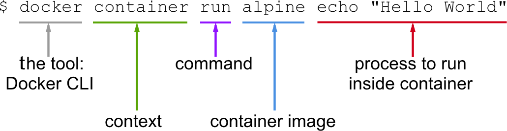
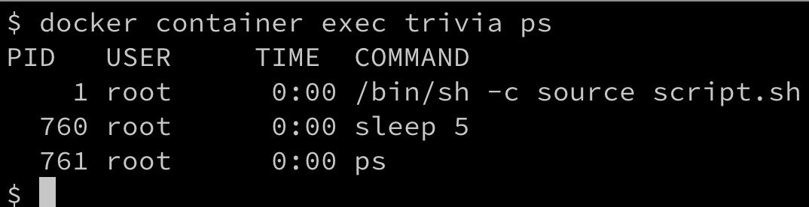

# 第四章：精通容器

在上一章中，你学会了如何优化地准备你的工作环境，以便高效、顺畅地使用 Docker。在本章中，我们将开始动手实践，学习与容器相关的所有重要内容。以下是我们将在本章中覆盖的主题：

+   运行第一个容器

+   启动、停止和删除容器

+   检查容器

+   进入正在运行的容器

+   附加到正在运行的容器

+   检索容器日志

+   容器的结构

完成本章后，你将能够做到以下几点：

+   基于现有镜像（例如 Nginx、BusyBox 或 Alpine）运行、停止和删除容器。

+   列出系统上的所有容器。

+   检查正在运行或已停止容器的元数据。

+   检索在容器内运行的应用程序生成的日志。

+   在已运行的容器中运行诸如 ` /bin/sh` 的进程。

+   将终端附加到一个已经在运行的容器。

+   用你自己的话向一个感兴趣的外行解释容器的基本原理。

# 技术要求

对于本章内容，你应该已经在你的 macOS 或 Windows 电脑上安装了 Docker for Desktop。如果你使用的是较旧版本的 Windows 或 Windows 10 家庭版，那么你应该已经安装并准备好使用 Docker Toolbox。在 macOS 上，请使用终端应用程序，而在 Windows 上，使用 PowerShell 或 Bash 控制台，来尝试你将要学习的命令。

# 运行第一个容器

在我们开始之前，我们要确保 Docker 已正确安装在你的系统上并准备好接受你的命令。打开一个新的终端窗口并输入以下命令：

```
$ docker version
```

如果你使用的是 Docker Toolbox，请使用与 Toolbox 一起安装的 Docker Quickstart Terminal，而不是 macOS 上的终端或 Windows 上的 PowerShell。

如果一切正常，你应该能在终端中看到已安装的 Docker 客户端和服务器的版本信息。在撰写本文时，它看起来像这样（为了可读性已缩短）：

```
Client: Docker Engine - Community
 Version: 19.03.0-beta3
 API version: 1.40
 Go version: go1.12.4
 Git commit: c55e026
 Built: Thu Apr 25 19:05:38 2019
 OS/Arch: darwin/amd64
 Experimental: false

Server: Docker Engine - Community
 Engine:
 Version: 19.03.0-beta3
 API version: 1.40 (minimum version 1.12)
 Go version: go1.12.4
 Git commit: c55e026
 Built: Thu Apr 25 19:13:00 2019
 OS/Arch: linux/amd64
 ...
```

你可以看到我在我的 macOS 上安装了 `beta3` 版本 `19.03.0`。

如果这对你不起作用，那么说明你的安装可能有问题。请确保你按照上一章中关于如何在系统上安装 Docker for Desktop 或 Docker Toolbox 的说明进行了操作。

所以，你已经准备好看到一些操作了。请在终端窗口中输入以下命令并按 *Return*：

```
$ docker container run alpine echo "Hello World" 
```

当你第一次运行前面的命令时，你应该会在终端窗口中看到类似这样的输出：

```
Unable to find image 'alpine:latest' locally
latest: Pulling from library/alpine
e7c96db7181b: Pull complete
Digest: sha256:769fddc7cc2f0a1c35abb2f91432e8beecf83916c421420e6a6da9f8975464b6
Status: Downloaded newer image for alpine:latest
Hello World
```

这很简单！让我们尝试再次运行完全相同的命令：

```
$ docker container run alpine echo "Hello World" 
```

第二次、第三次，或 *n*^(th) 次运行前面的命令时，你应该只在终端中看到这个输出：

```
 Hello World  
```

尝试推理一下为什么第一次运行命令时，输出和后续的所有输出都不同。但如果你无法弄清楚，也不用担心；我们将在本章的后续部分详细解释原因。

# 启动、停止和删除容器

你在上一节中已经成功运行了一个容器。现在，我们想详细调查一下到底发生了什么，以及为什么会这样。让我们再看看我们使用的命令：

```
$ docker container run alpine echo "Hello World" 
```

这个命令包含多个部分。首先，我们有`docker`这个词。这是 Docker **命令行接口** (**CLI**) 工具的名称，我们用它与负责运行容器的 Docker 引擎进行交互。接下来是`container`这个词，表示我们正在处理的上下文。因为我们想运行一个容器，所以我们的上下文是`container`这个词。接下来是我们想在给定上下文中执行的实际命令，即`run`。

让我总结一下——到目前为止，我们有 `docker container run`，这意味着，*嘿，Docker，我们要运行一个容器。*

现在，我们还需要告诉 Docker 运行哪个容器。在这种情况下，就是所谓的`alpine`容器。

`alpine` 是一个基于 Alpine Linux 的最小 Docker 镜像，带有完整的软件包索引，大小仅为 5 MB。

最后，我们需要定义当容器运行时，应该在容器内部执行什么样的进程或任务。在我们的例子中，这就是命令的最后一部分，`echo "Hello World"`。

也许以下截图能帮助你更好地理解整个过程：



Docker 容器运行表达式的组成

现在我们已经理解了运行容器命令的各个部分，接下来让我们尝试运行另一个容器，并在其中执行不同的进程。请输入以下命令到你的终端：

```
$ docker container run centos ping -c 5 127.0.0.1
```

你应该在终端窗口中看到类似以下的输出：

```
Unable to find image 'centos:latest' locally
latest: Pulling from library/centos
8ba884070f61: Pull complete
Digest: sha256:b5e66c4651870a1ad435cd75922fe2cb943c9e973a9673822d1414824a1d0475
Status: Downloaded newer image for centos:latest
PING 127.0.0.1 (127.0.0.1) 56(84) bytes of data.
64 bytes from 127.0.0.1: icmp_seq=1 ttl=64 time=0.104 ms
64 bytes from 127.0.0.1: icmp_seq=2 ttl=64 time=0.059 ms
64 bytes from 127.0.0.1: icmp_seq=3 ttl=64 time=0.081 ms
64 bytes from 127.0.0.1: icmp_seq=4 ttl=64 time=0.050 ms
64 bytes from 127.0.0.1: icmp_seq=5 ttl=64 time=0.055 ms
--- 127.0.0.1 ping statistics ---
5 packets transmitted, 5 received, 0% packet loss, time 4127ms
rtt min/avg/max/mdev = 0.050/0.069/0.104/0.022 ms
```

这次改变的是，我们使用的容器镜像是 `centos`，而我们在 `centos` 容器中执行的进程是 `ping -c 5 127.0.0.1`，它会向回环地址发送五次 ping 请求，直到停止。

`centos` 是 CentOS Linux 的官方 Docker 镜像，CentOS 是一个由 **Red Hat** 提供支持的社区发行版，源代码免费公开，源自 **Red Hat Enterprise Linux** (**RHEL**)。

让我们详细分析输出内容。

第一行如下：

```
Unable to find image 'centos:latest' locally
```

这告诉我们 Docker 没有在系统的本地缓存中找到名为 `centos:latest` 的镜像。因此，Docker 知道它必须从某个存储容器镜像的注册表中拉取镜像。默认情况下，Docker 环境配置为从 Docker Hub（`docker.io`）拉取镜像。第二行表达了这一点，如下所示：

```
latest: Pulling from library/centos 
```

接下来的三行输出如下：

```
8ba884070f61: Pull complete
Digest: sha256:b5e66c4651870a1ad435cd75922fe2cb943c9e973a9673822d1414824a1d0475
Status: Downloaded newer image for centos:latest
```

这告诉我们 Docker 已成功从 Docker Hub 拉取了 `centos:latest` 镜像。

所有后续的输出行都是由我们在容器内运行的进程生成的，在这个例子中是 Ping 工具。如果你到目前为止一直很专注，那么你可能已经注意到 `latest` 关键字出现了几次。每个镜像都有一个版本（也叫做 `tag`），如果我们没有明确指定版本，Docker 会默认认为它是 `latest`。

如果我们再次在系统中运行前面的容器，输出的前五行将会缺失，因为这次 Docker 会在本地找到已缓存的容器镜像，因此不需要先下载它。试试看，验证我刚才告诉你的内容。

# 运行一个随机问答问题容器

在本章的后续部分，我们需要一个容器，它会在后台持续运行并产生一些有趣的输出。这就是为什么我们选择了一个会产生随机问答问题的算法。生成这些免费随机问答问题的 API 可以在 [`jservice.io/`](http://jservice.io/) 找到。

现在的目标是在容器内运行一个进程，该进程每五秒产生一个新的随机问答问题，并将问题输出到 `STDOUT`。以下脚本将准确地做到这一点：

```
while : 
do 
 wget -qO- http://jservice.io/api/random | jq .[0].question 
 sleep 5 
done
```

在终端窗口中尝试一下。通过按 *Ctrl* + *C* 停止脚本。输出应该类似于下面这样：

```
"In 2004 Pitt alumna Wangari Maathai became the first woman from this continent to win the Nobel Peace Prize"
"There are 86,400 of these in every day"
"For $5 million in 2013 an L.A. movie house became TCL Chinese Theatre, but we bet many will still call it this, after its founder"
^C
```

每个响应都是一个不同的问答问题。

你可能需要先在 macOS 或 Windows 计算机上安装 `jq`。`jq` 是一个常用的工具，通常用于漂亮地筛选和格式化 JSON 输出，从而提高它在屏幕上的可读性。

现在，让我们在 `alpine` 容器中运行这个逻辑。由于这不仅仅是一个简单的命令，我们希望将前面的脚本包装在一个脚本文件中并执行该文件。为了简化操作，我创建了一个名为 `fundamentalsofdocker/trivia` 的 Docker 镜像，其中包含了所有必要的逻辑，这样我们就可以直接在这里使用它。稍后，当我们介绍 Docker 镜像时，我们将进一步分析这个容器镜像。目前，让我们直接使用它。执行以下命令以将容器作为后台服务运行。在 Linux 中，后台服务也称为守护进程：

```
$ docker container run -d --name trivia fundamentalsofdocker/trivia:ed2
```

在前面的表达式中，我们使用了两个新的命令行参数，`-d` 和 `--name`。现在，`-d` 告诉 Docker 以 Linux 守护进程的方式运行容器中的进程。`--name` 参数则可以用来为容器指定一个明确的名称。在前面的示例中，我们选择的名称是 `trivia`。

如果我们在运行容器时没有指定明确的容器名称，那么 Docker 会自动为容器分配一个随机但唯一的名称。这个名称通常由一个著名科学家的名字和一个形容词组成。类似的名称可能是 `boring_borg` 或 `angry_goldberg`。它们相当幽默，不是吗，我们的 Docker 工程师，*是不是？*

我们还为容器使用了 `ed2` 标签。这个标签只是告诉我们，这个镜像是为本书的第二版创建的。

一个重要的要点是容器名称在系统中必须是唯一的。让我们确保 `trivia` 容器正在运行：

```
$ docker container ls -l
```

这应该给我们类似于下面的结果（为了可读性，已缩短）：

```
CONTAINER ID  IMAGE                            ... CREATED         STATUS ...
0ff3d7cf7634  fundamentalsofdocker/trivia:ed2  ... 11 seconds ago  Up 9 seconds ...
```

上面输出的重要部分是 `STATUS` 列，在本例中显示为 `Up 9 seconds`，也就是说，容器已经运行了 9 秒钟。

如果你还不熟悉最后一条 Docker 命令，不用担心，我们将在下一节中再次讲解它。

为了完成本节内容，让我们通过以下命令停止并删除 `trivia` 容器：

```
$ docker rm -f trivia
```

现在是时候学习如何列出系统中正在运行或悬挂的容器了。

# 列出容器

随着我们不断运行容器，系统中会积累很多容器。要查看当前在主机上运行的容器，我们可以使用 `container ls` 命令，如下所示：

```
$ docker container ls
```

这将列出当前正在运行的所有容器。这样的列表可能会类似于：


列出系统上所有运行的容器

默认情况下，Docker 输出七列，含义如下：

|  **Column**

|  **Description**

|

| `Container ID` | 这是容器的唯一 ID，采用 SHA-256 格式。 |
| --- | --- |
| `Image` | 这是该容器所基于的容器镜像的名称。 |
| `Command` | 这是用于在容器中运行主进程的命令。 |
| `Created` | 这是容器创建的日期和时间。 |
| `Status` | 这是容器的状态（创建中、重启中、运行中、删除中、暂停中、已退出或已死亡）。 |
| `Ports` | 这是已映射到主机的容器端口列表。 |
| `Names` | 这是分配给此容器的名称（可以有多个名称）。 |

如果我们不仅想列出当前正在运行的容器，还想列出所有已定义的容器，则可以使用命令行参数 `-a` 或 `--all`，如以下所示：

```
$ docker container ls -a
```

这将列出所有状态的容器，如 `created`（创建），`running`（运行中），或 `exited`（退出）。

有时，我们只需要列出所有容器的 ID。为此，我们可以使用 `-q` 参数：

```
$ docker container ls -q
```

你可能会想，这有什么用处。我会在这里给你展示一个非常有用的命令：

```
$ docker container rm -f $(docker container ls -a -q)
```

放松一下，深呼吸。然后，试着找出上面的命令到底做了什么。直到你找出答案或者放弃之前，不要继续往下读。

上面的命令会删除系统中当前定义的所有容器，包括已停止的容器。`rm` 命令表示删除，稍后会解释。

在上一节中，我们在列出命令中使用了 `-l` 参数。尝试使用 Docker 帮助来了解 `-l` 参数的含义。你可以通过以下方式获取列出命令的帮助：

```
$ docker container ls -h 
```

接下来，让我们学习如何停止和重启容器。

# 停止和启动容器

有时，我们希望（暂时）停止一个正在运行的容器。让我们用之前使用过的 trivia 容器来试试：

1.  使用这个命令重新启动容器：

```
$ docker container run -d --name trivia fundamentalsofdocker/trivia:ed2
```

1.  现在，如果我们想停止这个容器，可以通过发出这个命令来做到：

```
$ docker container stop trivia
```

当你尝试停止 trivia 容器时，你可能会注意到该命令执行时需要一些时间。准确来说，大约需要 10 秒钟。*为什么会这样？*

Docker 会向容器内运行的主进程发送一个 Linux 的`SIGTERM`信号。如果该进程没有响应这个信号并自行终止，Docker 会等待 10 秒钟，然后发送`SIGKILL`，强制终止进程并停止容器。

在上面的命令中，我们使用了容器的名称来指定我们想要停止哪个容器。但我们也可以使用容器 ID 代替。

*我们如何获取一个容器的 ID？* 有几种方法可以做到这一点。手动的方法是列出所有正在运行的容器，然后从列表中找到我们要找的容器。从那里，我们复制它的 ID。一种更自动化的方式是使用一些 Shell 脚本和环境变量。例如，如果我们想获取 trivia 容器的 ID，可以使用这个表达式：

```
$ export CONTAINER_ID=$(docker container ls -a | grep trivia | awk '{print $1}')
```

我们在使用 Docker 的`container ls`命令时加上了`-a`参数，以列出所有容器，包括停止的容器。在这种情况下这是必要的，因为我们刚刚停止了 trivia 容器。

现在，我们可以在表达式中使用`$CONTAINER_ID`变量，而不是使用容器名称：

```
$ docker container stop $CONTAINER_ID 
```

一旦我们停止了容器，它的状态会变为`Exited`。

如果一个容器被停止，可以使用`docker container start`命令再次启动它。让我们用我们的 trivia 容器来演示。将它重新启动是件好事，因为我们将在本章的后续部分需要它：

```
$ docker container start trivia 
```

现在是讨论如何处理那些我们不再需要的停止容器的时候了。

# 删除容器

当我们运行`docker container ls -a`命令时，我们可以看到许多处于`Exited`状态的容器。如果我们不再需要这些容器，那么移除它们是件好事；否则，它们会不必要地占用宝贵的资源。移除容器的命令如下：

```
$ docker container rm <container ID>
```

另一个移除容器的命令如下：

```
$ docker container rm <container name>
```

尝试使用容器 ID 删除一个已退出的容器。

有时，删除容器会失败，因为容器仍在运行。如果我们想强制删除一个容器，无论容器当前的状态如何，我们可以使用命令行参数`-f`或`--force`。

# 审查容器

容器是镜像的运行时实例，具有许多与之相关的数据，这些数据描述了它们的行为。为了获取有关特定容器的更多信息，我们可以使用`inspect`命令。像往常一样，我们必须提供容器 ID 或名称来识别我们想要获取数据的容器。那么，让我们检查一下我们的示例容器：

```
$ docker container inspect trivia 
```

响应是一个包含详细信息的大 JSON 对象。它看起来类似于这个：

```
[
    {
        "Id": "48630a3bf188...",
        ...
        "State": {
            "Status": "running",
            "Running": true,
            ...
        },
        "Image": "sha256:bbc92c8f014d605...",
        ...
        "Mounts": [],
        "Config": {
            "Hostname": "48630a3bf188",
            "Domainname": "",
            ...
        },
        "NetworkSettings": {
            "Bridge": "",
            "SandboxID": "82aed83429263ceb6e6e...",
            ...
        }
    }
]
```

输出已被简化以提高可读性。

请花点时间分析你得到的信息。你应该会看到如下内容：

+   容器的 ID

+   容器的创建日期和时间

+   容器构建所用的镜像

输出的许多部分，比如`Mounts`或`NetworkSettings`，现在看起来没有太大意义，但我们肯定会在本书的后续章节中讨论这些内容。你在这里看到的数据也被称为容器的元数据。在本书的剩余部分，我们将频繁使用`inspect`命令作为获取信息的来源。

有时，我们只需要一小部分整体信息，为了实现这一点，我们可以使用`grep`工具或过滤器。前者的方法并不总是能得到预期的答案，所以我们来看一下后者的方法：

```
$ docker container inspect -f "{{json .State}}" trivia | jq .
```

`-f`或`--filter`参数用于定义过滤器。过滤器表达式本身使用 Go 模板语法。在这个例子中，我们只希望看到整个输出中的`state`部分，且格式为 JSON。

为了美化输出，我们将结果通过管道传输到`jq`工具：

```
{
  "Status": "running",
  "Running": true,
  "Paused": false,
  "Restarting": false,
  "OOMKilled": false,
  "Dead": false,
  "Pid": 18252,
  "ExitCode": 0,
  "Error": "",
  "StartedAt": "2019-06-16T13:30:15.776272Z",
  "FinishedAt": "2019-06-16T13:29:38.6412298Z"
}
```

在我们学会如何检索关于容器的大量重要和有用的元信息之后，现在我们想要研究如何在正在运行的容器中执行它。

# 进入正在运行的容器

有时，我们希望在已经运行的容器内运行另一个进程。一个典型的原因可能是尝试调试一个行为异常的容器。*我们该怎么做呢？* 首先，我们需要知道容器的 ID 或名称，然后我们可以定义想要运行的进程以及它如何运行。再次，我们使用当前正在运行的 trivia 容器，并使用以下命令在其中交互式地运行一个 Shell：

```
$ docker container exec -i -t trivia /bin/sh
```

`-i`标志表示我们希望以交互方式运行附加进程，`-t`则告诉 Docker 我们希望它为命令提供 TTY（终端仿真器）。最后，我们运行的进程是`/bin/sh`。

如果我们在终端中执行前面的命令，我们将看到一个新的提示符`/app #`。我们现在位于 trivia 容器的 Shell 中。我们可以通过执行`ps`命令轻松验证这一点，它会列出该上下文中的所有正在运行的进程：

```
/app # ps
```

结果应该类似于这个：


在 trivia 容器内运行的进程列表

我们可以清楚地看到，`PID 1`的进程是我们定义在 trivia 容器内运行的命令。`PID 1`的进程也被称为主进程。

按下*Ctrl* + *D*离开容器。我们不仅可以在容器中执行交互式的额外进程。请考虑以下命令：

```
$ docker container exec trivia ps
```

输出显然看起来与之前的输出非常相似：



列出 trivia 容器中运行的进程

我们甚至可以使用`-d`标志以守护进程的方式运行进程，并使用`-e`标志定义环境变量，如下所示：

```
$ docker container exec -it \
 -e MY_VAR="Hello World" \
 trivia /bin/sh
/app # echo $MY_VAR
Hello World
/app # <CTRL-d>
```

很好，我们已经学会了如何进入一个正在运行的容器并运行额外的进程。但是，还有另一种重要的方式可以与正在运行的容器进行交互。

# 附加到正在运行的容器

我们可以使用`attach`命令将终端的标准输入、输出和错误（或三者的任意组合）通过容器的 ID 或名称附加到正在运行的容器上。我们以我们的 trivia 容器为例：

```
$ docker container attach trivia
```

在这种情况下，我们会看到大约每五秒钟输出中出现一个新的引用。

若要退出容器而不停止或杀死它，我们可以按下*Ctrl* + *P* + *Ctrl* + *Q*的组合键。这会使我们从容器中分离，同时保持容器在后台运行。另一方面，如果我们想要同时分离并停止容器，只需按下*Ctrl* + *C*即可。

让我们运行另一个容器，这次是一个 Nginx web 服务器：

```
$ docker run -d --name nginx -p 8080:80 nginx:alpine
```

在这里，我们将 Alpine 版的 Nginx 作为守护进程运行在名为`nginx`的容器中。`-p 8080:80`命令行参数会为主机上的 Nginx web 服务器打开`8080`端口，以便访问容器内部的 Nginx 服务。这里的语法不需要担心，我们将在第十章中更详细地解释这一特性，*单主机网络*：

1.  让我们看看是否可以通过`curl`工具访问 Nginx，并运行以下命令：

```
$ curl -4 localhost:8080
```

如果一切正常，你应该会看到 Nginx 的欢迎页面（已简化以便阅读）：

```
<html> 
<head> 
<title>Welcome to nginx!</title> 
<style> 
    body { 
        width: 35em; 
        margin: 0 auto; 
        font-family: Tahoma, Verdana, Arial, sans-serif; 
    } 
</style> 
</head> 
<body> 
<h1>Welcome to nginx!</h1> 
...
</html> 
```

1.  现在，让我们将终端附加到`nginx`容器上，观察发生了什么：

```
$ docker container attach nginx
```

1.  一旦你附加到容器，你首先不会看到任何内容。但是现在打开另一个终端窗口，并在这个新窗口中多次重复`curl`命令，例如使用以下脚本：

```
$ for n in {1..10}; do curl -4 localhost:8080; done 
```

你应该看到 Nginx 的日志输出，类似于以下内容：

```
172.17.0.1 - - [16/Jun/2019:14:14:02 +0000] "GET / HTTP/1.1" 200 612 "-" "curl/7.54.0" "-"
172.17.0.1 - - [16/Jun/2019:14:14:02 +0000] "GET / HTTP/1.1" 200 612 "-" "curl/7.54.0" "-"
172.17.0.1 - - [16/Jun/2019:14:14:02 +0000] "GET / HTTP/1.1" 200 612 "-" "curl/7.54.0" "-"
...
```

1.  按下*Ctrl* + *C*退出容器。这将分离你的终端，同时停止`nginx`容器。

1.  为了清理，使用以下命令删除`nginx`容器：

```
$ docker container rm nginx 
```

在接下来的部分，我们将学习如何操作容器日志。

# 检索容器日志

对于任何优秀的应用程序来说，生成一些日志信息是最佳实践，开发人员和运维人员都可以用它来了解应用程序在某一时刻正在做什么，以及是否有任何问题，从而帮助定位问题的根本原因。

当容器内部运行时，应用程序最好将日志项输出到`STDOUT`和`STDERR`，而不是写入文件。如果日志输出定向到`STDOUT`和`STDERR`，那么 Docker 可以收集这些信息，并准备好供用户或其他外部系统使用：

1.  要访问给定容器的日志，我们可以使用`docker container logs`命令。例如，如果我们想检索`trivia`容器的日志，可以使用以下表达式：

```
$ docker container logs trivia
```

这将检索应用程序从一开始就生成的完整日志。

停，等一下——我刚才说的不完全正确。默认情况下，Docker 使用所谓的`json-file`日志驱动程序。该驱动程序将日志信息存储在文件中。如果定义了文件滚动策略，那么`docker container logs`只会检索当前活动日志文件中的内容，而不会检索可能仍在宿主机上可用的之前滚动的文件。

1.  如果我们只想获取一些最新的日志条目，可以使用`-t`或`--tail`参数，如下所示：

```
$ docker container logs --tail 5 trivia
```

这将仅检索容器内部运行的进程生成的最后五个条目。

有时，我们希望跟踪容器生成的日志。使用`-f`或`--follow`参数时，这是可能的。以下表达式将输出最后五个日志条目，并在容器化进程生成日志时跟随输出：

```
$ docker container logs --tail 5 --follow trivia 
```

通常，使用容器日志的默认机制是不够的。我们需要一种不同的日志记录方式。以下部分将讨论这一点。

# 日志驱动程序

Docker 包括多种日志机制，帮助我们从运行中的容器中获取信息。这些机制被称为**日志驱动程序**。可以在 Docker 守护进程级别配置使用哪种日志驱动程序。默认的日志驱动程序是`json-file`。目前本地支持的部分驱动程序如下：

| **驱动程序** | **描述** |
| --- | --- |
| `none` | 不会为特定容器生成日志输出。 |
| `json-file` | 这是默认驱动程序。日志信息存储在格式为 JSON 的文件中。 |
| `journald` | 如果宿主机上运行`journald`守护进程，我们可以使用此驱动程序，它将日志转发到`journald`守护进程。 |
| `syslog` | 如果宿主机上运行`syslog`守护进程，我们可以配置此驱动程序，将日志消息转发到`syslog`守护进程。 |
| `gelf` | 使用此驱动程序时，日志消息将写入**Graylog 扩展日志格式**（**GELF**）端点。此类端点的常见示例有 Graylog 和 Logstash。 |
| `fluentd` | 假设主机系统上已安装`fluentd`守护进程，此驱动程序将日志消息写入该守护进程。 |

如果你更改了日志驱动程序，请注意，`docker container logs`命令仅适用于`json-file`和`journald`驱动程序。

# 使用容器特定的日志驱动程序

我们已经看到，日志驱动程序可以在 Docker 守护进程配置文件中全局设置。但我们也可以为每个容器单独定义日志驱动程序。在以下示例中，我们运行一个`busybox`容器，并使用`--log-driver`参数配置`none`日志驱动程序：

```
$ docker container run --name test -it \
 --log-driver none \
 busybox sh -c 'for N in 1 2 3; do echo "Hello $N"; done'
```

我们应该看到以下内容：

```
Hello 1
Hello 2
Hello 3 
```

现在，让我们尝试获取前一个容器的日志：

```
$ docker container logs test
```

输出如下：

```
Error response from daemon: configured logging driver does not support reading
```

这是预期的结果，因为`none`驱动程序不会产生任何日志输出。让我们清理并删除`test`容器：

```
$ docker container rm test
```

# 高级主题 – 更改默认日志驱动程序

让我们更改 Linux 主机的默认日志驱动程序：

1.  做这件事最简单的方法是在一个真实的 Linux 主机上。为此，我们将使用带有 Ubuntu 镜像的 Vagrant：

```
$ vagrant init bento/ubuntu-17.04
$ vagrant up
$ vagrant ssh
```

**Vagrant**是由 Hashicorp 开发的一个开源工具，通常用于构建和维护可移植的虚拟软件开发环境。

1.  进入 Ubuntu 虚拟机后，我们需要编辑 Docker 守护进程配置文件。请导航到`/etc/docker`文件夹并按如下方式运行`vi`：

```
$ vi daemon.json 
```

1.  输入以下内容：

```
{
  "Log-driver": "json-log",
  "log-opts": {
    "max-size": "10m",
    "max-file": 3
  }
}
```

1.  通过先按*Esc*键，然后输入`:w:q`，最后按*Enter*键，保存并退出`vi`。

前面的定义告诉 Docker 守护进程使用`json-log`驱动程序，最大日志文件大小为 10MB，当日志文件达到该大小时会滚动，并且系统上可以存在的最大日志文件数量是`3`，超过这个数量时，最旧的文件会被清除。

现在，我们必须向 Docker 守护进程发送一个`SIGHUP`信号，以便它能够读取配置文件中的更改：

```
$ sudo kill -SIGHUP $(pidof dockerd)
```

请注意，前面的命令只是重新加载配置文件，并不会重启守护进程。

# 容器的结构

许多人错误地将容器与虚拟机进行比较。然而，这是一个值得质疑的比较。容器不仅仅是轻量级的虚拟机。那么，*容器的正确描述是什么？*

容器是运行在主机系统上的特殊封装和安全进程。容器利用了 Linux 操作系统中可用的许多特性和原语。最重要的特性是*命名空间*和*控制组（cgroups）*。所有在容器中运行的进程仅共享底层主机操作系统的 Linux 内核。这与虚拟机有根本不同，因为每个虚拟机都有自己完整的操作系统。

一个典型容器的启动时间可以用毫秒来衡量，而虚拟机通常需要几秒到几分钟才能启动。虚拟机的设计目的是长时间运行。每个运维工程师的首要目标是最大化虚拟机的正常运行时间。与此相反，容器的设计目的是临时的。它们来得快，去得也快。

让我们首先从高层次了解一下使我们能够运行容器的架构。

# 架构

这里，我们有一个架构图，展示了所有这些如何结合在一起：


Docker 高层架构

在前述图的下半部分，我们有 Linux 操作系统及其 **cgroups**、**命名空间** 和 **层级能力**，以及我们此处不需要明确提及的 **其他操作系统功能**。然后，是由 **containerd** 和 **runc** 组成的中介层。所有这些上面现在是 **Docker 引擎**。**Docker 引擎** 提供了一个 RESTful 接口，可以通过任何工具访问，例如 Docker CLI、Docker for macOS 和 Docker for Windows 或 Kubernetes，举几个例子。

现在，让我们更详细地描述一下主要的构建模块。

# 命名空间

在 Docker 使用容器之前，Linux 命名空间已经存在多年。命名空间是全局资源的抽象，例如文件系统、网络访问、进程树（也称为 PID 命名空间），或系统组 ID 和用户 ID。Linux 系统通过每种命名空间类型的单一实例进行初始化。初始化后，可以创建或加入额外的命名空间。

Linux 命名空间起源于 2002 年的 2.4.19 内核。在 3.8 版本的内核中，用户命名空间被引入，从此命名空间准备好被容器使用。

如果我们将一个正在运行的进程，比如，封装在一个文件系统命名空间中，那么该进程会有一种它拥有自己完整文件系统的错觉。当然，这并不是真的；它只是一个虚拟文件系统。从宿主的角度看，封装的进程得到的是整体文件系统的一个受保护子集。这就像是一个文件系统中的文件系统：


Linux 上的文件系统命名空间

同样的情况适用于所有其他存在命名空间的全局资源。用户 ID 命名空间就是另一个例子。通过使用用户命名空间，我们现在可以在系统中多次定义一个 `jdoe` 用户，只要它生活在自己的命名空间中。

PID 命名空间是确保一个容器中的进程无法看到或与另一个容器中的进程交互的机制。一个进程可能在容器内看起来有 PID **1**，但如果我们从宿主系统查看它，它会有一个普通的 PID，比如 **334**：


Docker 主机上的进程树

在给定的命名空间中，我们可以运行一个或多个进程。这在我们谈论容器时非常重要，并且我们已经在执行另一个进程时体验过，在一个已经运行的容器中执行。

# 控制组（cgroups）

Linux cgroups 被用于限制、管理和隔离系统上运行的进程集合的资源使用。资源包括 CPU 时间、系统内存、网络带宽，或者这些资源的组合，等等。

Google 的工程师最初在 2006 年实现了这个功能。cgroups 功能在 Linux 内核版本 2.6.24 中合并到主线内核，该版本于 2008 年 1 月发布。

使用 cgroups，管理员可以限制容器能够消耗的资源。通过这种方式，我们可以避免经典的 *噪声邻居* 问题，即容器中运行的恶意进程消耗所有的 CPU 时间或占用大量的内存，从而导致主机上运行的其他进程（无论它们是否容器化）被饿死。

# 联合文件系统（Unionfs）

Unionfs 构成了所谓容器镜像的基础。我们将在下一章详细讨论容器镜像。在此时，我们仅需要稍微了解一下 Unionfs 是什么，以及它如何工作。Unionfs 主要用于 Linux，并允许不同文件系统的文件和目录进行叠加，从而形成一个统一的文件系统。在这种情况下，单独的文件系统被称为分支。具有相同路径的目录内容将在合并后的新虚拟文件系统中作为一个统一的目录显示。当合并分支时，会指定分支之间的优先级。通过这种方式，当两个分支包含相同的文件时，优先级较高的文件会出现在最终的文件系统中。

# 容器管道

Docker 引擎构建之上的基础层就是 **容器管道**，它由两个组件组成：**runc** 和 **containerd**。

最初，Docker 是以单体方式构建的，包含了运行容器所需的所有功能。随着时间的推移，这种方式变得过于僵化，Docker 开始将一些功能拆分成独立的组件。其中两个重要的组件是 runc 和 containerd。

# runC

runC 是一个轻量级、可移植的容器运行时。它完全支持 Linux 命名空间，并且原生支持 Linux 上的所有安全功能，如 SELinux、AppArmor、seccomp 和 cgroups。

runC 是一个根据 **开放容器倡议**（**OCI**）规范启动和运行容器的工具。它是一个正式规范的配置格式，受 **开放容器项目**（**OCP**）的管理，OCP 是由 Linux 基金会主办的。

# Containerd

runC 是一个低级容器运行时实现；containerd 基于它并添加了更高级的功能，如镜像传输与存储、容器执行和监控，以及网络与存储附件。通过这些，containerd 管理容器的完整生命周期。Containerd 是 OCI 规范的参考实现，是目前最受欢迎和广泛使用的容器运行时。

Containerd 于 2017 年捐赠给 CNCF 并被接纳。OCI 规范有其他替代实现。其中一些包括 CoreOS 的 rkt、RedHat 的 CRI-O 和 Linux Containers 的 LXD。然而，当前 containerd 无疑是最受欢迎的容器运行时，并且是 Kubernetes 1.8 及以上版本和 Docker 平台的默认运行时。

# 概述

在本章中，你学习了如何使用基于现有镜像的容器。我们展示了如何运行、停止、启动和删除容器。然后，我们检查了容器的元数据，提取了容器的日志，并学习了如何在一个已经运行的容器中执行任意进程。最后，我们深入探讨了容器是如何工作的，以及它们如何利用底层 Linux 操作系统的功能。

在下一章中，你将学习什么是容器镜像以及我们如何构建和共享自己的自定义镜像。我们还将讨论构建自定义镜像时常用的最佳实践，如最小化镜像大小和利用镜像缓存。敬请期待！

# 问题

为了评估你的学习进度，请回答以下问题：

1.  容器的状态有哪些？

1.  哪个命令帮助我们查找当前在 Docker 主机上运行的内容？

1.  哪个命令用于列出所有容器的 ID？

# 深入阅读

以下文章为你提供了更多关于我们在本章讨论主题的相关信息：

+   Docker 容器请访问[`dockr.ly/2iLBV2I`](http://dockr.ly/2iLBV2I)

+   开始使用容器请访问[`dockr.ly/2gmxKWB`](http://dockr.ly/2gmxKWB)

+   使用用户命名空间隔离容器请访问[`dockr.ly/2gmyKdf`](http://dockr.ly/2gmyKdf)

+   限制容器资源请访问[`dockr.ly/2wqN5Nn`](http://dockr.ly/2wqN5Nn)
