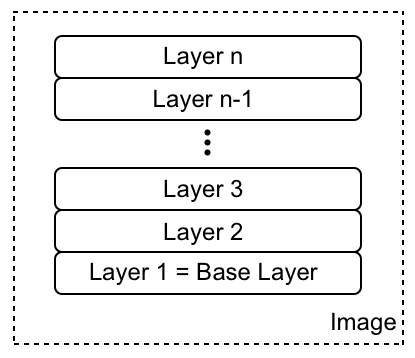
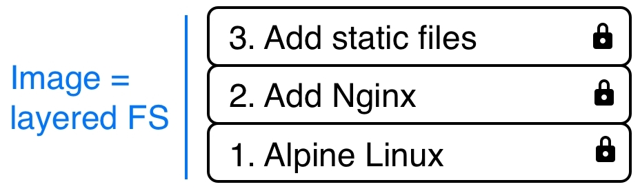
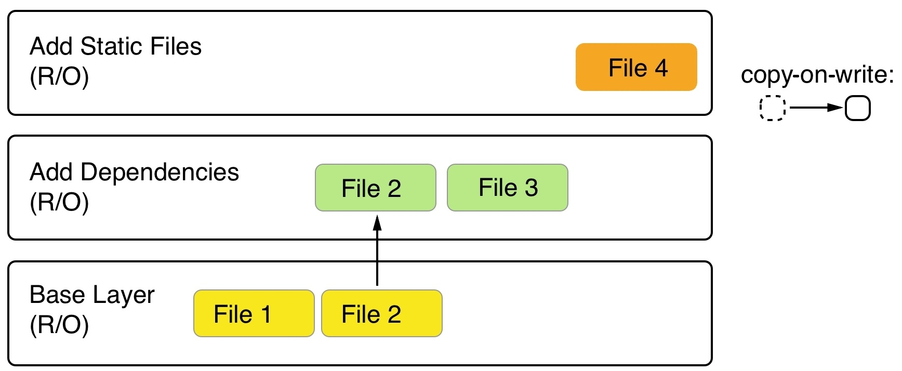
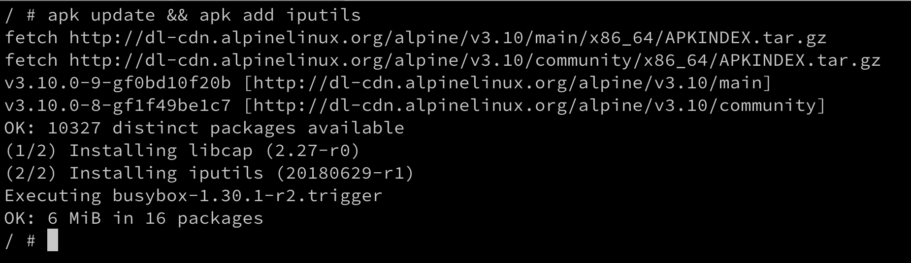
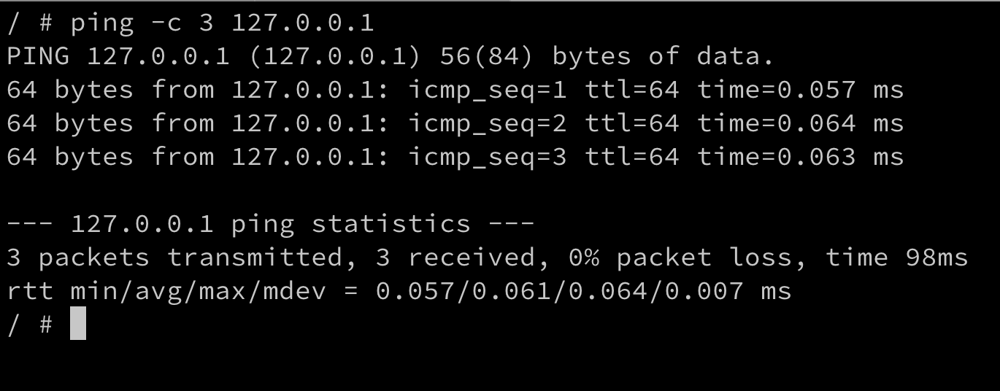
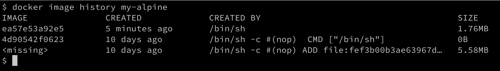
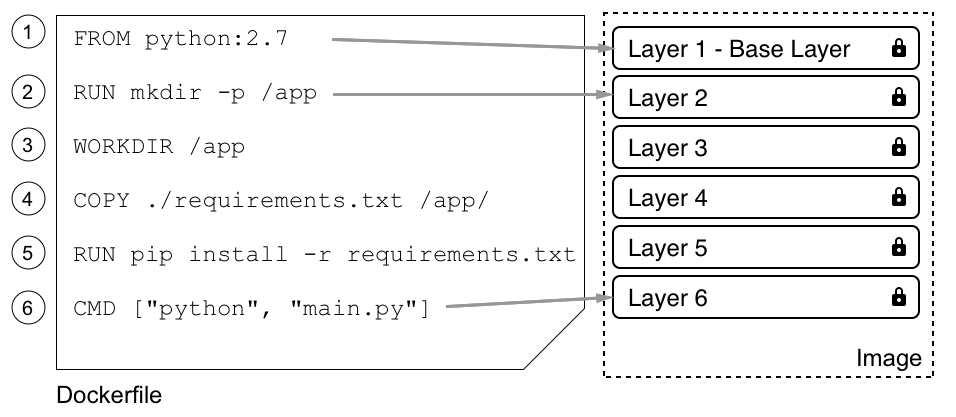
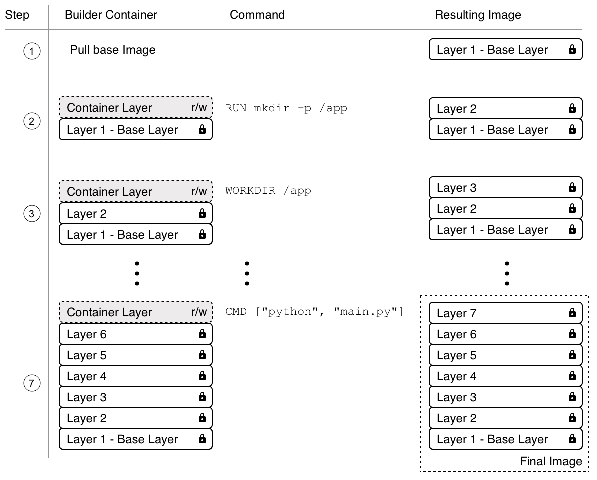

# 创建和管理容器镜像

在上一章中，我们了解了容器是什么，以及如何运行、停止、删除、列出和检查它们。我们提取了部分容器的日志信息，在已运行的容器内运行了其他进程，最后深入了解了容器的结构。每当我们运行容器时，都会使用容器镜像创建它。在本章中，我们将熟悉这些容器镜像。我们将详细了解它们是什么，如何创建它们以及如何分发它们。

本章将涵盖以下主题：

+   什么是镜像？

+   创建镜像

+   提升与迁移：将遗留应用程序容器化

+   分享或传输镜像

完成本章后，您将能够执行以下操作：

+   列举出容器镜像的三个最重要特点。

+   通过交互式更改容器层并提交来创建自定义镜像。

+   编写一个简单的 `Dockerfile` 以生成自定义镜像。

+   使用 `docker image save` 导出现有镜像，并使用 `docker image load` 将其导入到另一个 Docker 主机中。

+   编写一个两步的 Dockerfile，通过仅在最终镜像中包含生成的产物来最小化结果镜像的大小。

# 什么是镜像？

在 Linux 中，一切都是文件。整个操作系统基本上是一个包含文件和文件夹的文件系统，存储在本地磁盘上。记住这一点对于理解容器镜像的概念非常重要。正如我们将看到的，镜像基本上是一个包含文件系统的大 tar 包。更具体地说，它包含了一个分层的文件系统。

# 分层文件系统

容器镜像是用于创建容器的模板。这些镜像并非由一个单一的整体块组成，而是由许多层构成。镜像中的第一层也称为基础层。我们可以在以下图示中看到这一点：



镜像作为一层一层的堆栈

每个单独的层包含文件和文件夹。每一层只包含相对于底层的文件系统的变化。Docker 使用联合文件系统——如第三章《掌握容器》中所讨论的——通过将这些层结合起来，创建了一个虚拟文件系统。存储驱动程序处理这些层如何相互作用的详细信息。在不同的情况下，存在具有不同优缺点的存储驱动程序。

容器镜像的各个层都是不可变的。不可变意味着一旦生成，该层就永远不能改变。影响该层的唯一操作是物理删除它。层的不可变性非常重要，因为它为我们提供了巨大的机会，正如我们将看到的那样。

在下图中，我们可以看到一个用于 Web 应用程序的自定义镜像，使用 Nginx 作为 Web 服务器，可能是这样的：



基于 Alpine 和 Nginx 的示例自定义镜像

我们的基础层由**Alpine Linux**发行版组成。然后，在它之上，我们有一个**Add Nginx**层，Nginx 被添加到 Alpine 上。最后，第三层包含构成 Web 应用程序的所有文件，如 HTML、CSS 和 JavaScript 文件。

如前所述，每个镜像都以一个基础镜像开始。通常，这个基础镜像是 Docker Hub 上找到的官方镜像之一，如 Linux 发行版、Alpine、Ubuntu 或 CentOS。然而，也可以从头开始创建一个镜像。

Docker Hub 是一个公开的容器镜像注册中心。它是一个理想的中心平台，非常适合共享公共容器镜像。

每一层只包含与上一层相比的差异。每一层的内容都映射到主机系统上的一个特殊文件夹，通常是`/var/lib/docker/`的子文件夹。

由于层是不可变的，它们可以被缓存且永不失效。这是一个很大的优势，正如我们将看到的那样。

# 可写容器层

正如我们所讨论的，容器镜像由一系列不可变或只读层组成。当 Docker 引擎从这样的镜像创建容器时，它会在这些不可变层的堆栈上添加一个可写的容器层。我们的堆栈现在看起来如下：


可写容器层

**容器层**被标记为可读写。镜像层的不可变性带来的另一个好处是，它们可以在许多从该镜像创建的容器之间共享。所需的只是每个容器的一个薄的、可写的容器层，如下图所示：


多个容器共享相同的镜像层

当然，这种技术极大地减少了资源消耗。此外，它还帮助减少了容器的加载时间，因为一旦镜像层加载到内存中（这只会发生在第一个容器上），只需创建一个薄的容器层即可。

# 写时复制

Docker 在处理镜像时使用了写时复制技术。写时复制是一种共享和复制文件的策略，以最大化效率。如果某一层使用了低层中可用的文件或文件夹，那么它就直接使用这个文件。如果，另一方面，一层想要修改一个来自低层的文件，它会先将该文件复制到目标层，并进行修改。在以下截图中，我们可以看到这一过程的简要示意：



使用写时复制的 Docker 镜像

第二层想要修改**文件 2**，该文件存在于**基础层**中。因此，它将文件复制上来并进行修改。现在，假设我们位于前面截图的最上层。这个层将使用**基础层**中的**文件 1**和第二层中的**文件 2**和**文件 3**。

# 图形驱动程序

图形驱动程序使联合文件系统成为可能。图形驱动程序也被称为存储驱动程序，通常用于处理分层的容器镜像。图形驱动程序将多个镜像层合并成容器挂载命名空间的根文件系统。换句话说，驱动程序控制着如何在 Docker 主机上存储和管理镜像及容器。

Docker 支持使用可插拔架构的多种不同图形驱动程序。首选驱动程序是`overlay2`，其次是`overlay`。

# 创建镜像

有三种方式可以在系统上创建一个新的容器镜像。第一种是通过交互式构建一个容器，该容器包含所有所需的附加内容和更改，然后将这些更改提交到一个新镜像中。第二种，也是最重要的方式，是使用`Dockerfile`来描述新镜像中的内容，然后使用该`Dockerfile`作为清单来构建镜像。最后，第三种方式是通过从 tarball 导入镜像到系统中。

现在，让我们详细看看这三种方式。

# 交互式镜像创建

创建自定义镜像的第一种方式是通过交互式构建容器。也就是说，我们从一个基础镜像开始，作为模板来使用，并交互式地运行它的容器。假设这就是 Alpine 镜像。

跟随步骤交互式创建镜像：

1.  运行容器的命令如下所示：

```
$ docker container run -it \
    --name sample \
    alpine:3.10 /bin/sh
```

上述命令基于`alpine:3.10`镜像运行一个容器。

我们通过使用`-it`参数与附加的**电传打字机**（**TTY**）交互式运行容器，使用`--name`参数命名为`sample`，最后在容器内使用`/bin/sh`运行一个 shell。

在运行上述命令的终端窗口中，你应该会看到类似这样的内容：

```
Unable to find image 'alpine:3.10' locally
3.10: Pulling from library/alpine
921b31ab772b: Pull complete
Digest: sha256:ca1c944a4f8486a153024d9965aafbe24f5723c1d5c02f4964c045a16d19dc54
Status: Downloaded newer image for alpine:3.10
/ #
```

默认情况下，`alpine`容器并未安装`ping`工具。假设我们想要创建一个包含`ping`工具的自定义新镜像。

1.  在容器内，我们可以运行以下命令：

```
/ # apk update && apk add iputils
```

这使用`apk`Alpine 包管理器安装`iputils`库，其中`ping`是其一部分。上面命令的输出应该大致如下所示：



在 Alpine 上安装`ping`

1.  现在，我们确实可以使用`ping`，如下所示的代码片段：



在容器内使用 ping

1.  一旦我们完成自定义工作，可以在提示符下输入`exit`退出容器。

如果我们现在列出所有容器，并使用`ls -a` Docker 容器命令，我们可以看到我们的示例容器的状态是`Exited`，但仍然存在于系统中，如下所示：

```
$ docker container ls -a | grep sample
040fdfe889a6 alpine:3.10 "/bin/sh" 8 minutes ago Exited (0) 4 seconds ago
```

1.  如果我们想查看相对于基础镜像，我们的容器发生了哪些变化，可以使用`docker container diff`命令，如下所示：

```
$ docker container diff sample
```

输出应该呈现对容器文件系统所做的所有修改的列表，如下所示：

```
C /usr
C /usr/sbin
A /usr/sbin/getcap
A /usr/sbin/ipg
A /usr/sbin/tftpd
A /usr/sbin/ninfod
A /usr/sbin/rdisc
A /usr/sbin/rarpd
A /usr/sbin/tracepath
...
A /var/cache/apk/APKINDEX.d8b2a6f4.tar.gz
A /var/cache/apk/APKINDEX.00740ba1.tar.gz
C /bin
C /bin/ping
C /bin/ping6
A /bin/traceroute6
C /lib
C /lib/apk
C /lib/apk/db
C /lib/apk/db/scripts.tar
C /lib/apk/db/triggers
C /lib/apk/db/installed
```

为了更好地阅读，我们已将前面的输出缩短。在列表中，`A`代表*添加*，`C`代表*更改*。如果我们有任何删除的文件，它们将以**`D`**为前缀。

1.  我们现在可以使用`docker container commit`命令来持久化我们的修改，并从中创建一个新镜像，如下所示：

```
$ docker container commit sample my-alpine
sha256:44bca4141130ee8702e8e8efd1beb3cf4fe5aadb62a0c69a6995afd49c2e7419
```

通过前面的命令，我们已指定新镜像的名称为`my-alpine`。前面命令生成的输出对应的是新生成的镜像的 ID。

1.  我们可以通过列出系统上所有的镜像来验证这一点，如下所示：

```
$ docker image ls
```

我们可以看到这个镜像的 ID（简化版），如下所示：

```
REPOSITORY   TAG      IMAGE ID       CREATED              SIZE
my-alpine    latest   44bca4141130   About a minute ago   7.34MB
...
```

我们可以看到名为`my-alpine`的镜像具有预期的 ID `44bca4141130`，并且自动分配了`latest`标签。因为我们没有显式定义标签，所以 Docker 会默认使用`latest`标签。

1.  如果我们想查看我们的自定义镜像是如何构建的，可以使用`history`命令，如下所示：

```
$ docker image history my-alpine
```

这将打印出我们镜像所包含的所有层的列表，如下所示：



my-alpine Docker 镜像的历史

前面输出的第一层就是我们刚刚通过添加`iputils`包创建的那一层。

# 使用 Dockerfiles

手动创建自定义镜像，如本章前面部分所示，在进行探索、创建原型或撰写可行性研究时非常有帮助。但它有一个严重的缺点：这是一个手动过程，因此不可重复或不可扩展。它也和任何其他由人类手动执行的任务一样容易出错。必须有更好的方法。

这就是所谓的`Dockerfile`的作用。`Dockerfile`是一个文本文件，通常被称为`Dockerfile`。它包含了如何构建自定义容器镜像的指令。这是一种声明式的构建镜像方式。

**声明式与命令式**：

在计算机科学中，一般而言，特别是在 Docker 中，通常使用声明式方式来定义任务。我们描述预期的结果，并让系统决定如何实现这一目标，而不是给系统提供一步步的指令来达到这一目标。后者是一种命令式方法。

让我们看一个示例`Dockerfile`，如下所示：

```
FROM python:2.7
RUN mkdir -p /app
WORKDIR /app
COPY ./requirements.txt /app/
RUN pip install -r requirements.txt
CMD ["python", "main.py"]
```

这是一个 `Dockerfile`，用于将一个 Python 2.7 应用程序容器化。如我们所见，文件有六行，每行以关键字如 `FROM`、`RUN` 或 `COPY` 开头。尽管按惯例将关键字写成大写字母，但这并不是强制要求。

每一行 `Dockerfile` 都会生成一个最终镜像中的层。在下图中，镜像与本章前面的插图不同，显示为从下到上的一堆层。这里，**基础层** 显示在顶部。不要让自己被这个搞混，实际上基础层总是堆叠中的最低层：



Dockerfile 和镜像中的层的关系

现在，让我们更详细地看看各个关键字。

# `FROM` 关键字

每个 `Dockerfile` 都以 `FROM` 关键字开始。通过它，我们定义了从哪个基础镜像开始构建我们的自定义镜像。例如，如果我们想从 CentOS 7 开始构建，我们会在 `Dockerfile` 中写下如下内容：

```
FROM centos:7
```

在 Docker Hub 上，有适用于所有主要 Linux 发行版的官方或精选镜像，也有许多重要的开发框架或语言的镜像，如 Python、Node.js、Ruby、Go 等等。根据我们的需求，我们应该选择最合适的基础镜像。

比如，如果我想将一个 Python 3.7 应用程序容器化，我可能会选择相关的官方 `python:3.7` 镜像。

如果我们真的想从零开始，我们也可以使用以下语句：

```
FROM scratch
```

这在构建超简 minimal 镜像时非常有用，这些镜像只包含——例如——一个二进制文件：实际的静态链接可执行文件，如 `Hello-World`。`scratch` 镜像字面上就是一个空的基础镜像。

`FROM scratch` 在 `Dockerfile` 中是一个“空操作”，因此不会在最终的容器镜像中生成层。

# `RUN` 关键字

下一个重要的关键字是`RUN`。`RUN`的参数是任何有效的 Linux 命令，例如以下内容：

```
RUN yum install -y wget
```

前面的命令使用 `yum` CentOS 包管理器将 `wget` 包安装到运行中的容器中。这假设我们的基础镜像是 CentOS 或 **Red Hat Enterprise Linux**（**RHEL**）。如果我们的基础镜像是 Ubuntu，那么命令看起来会类似于以下内容：

```
RUN apt-get update && apt-get install -y wget
```

它看起来是这样的，因为 Ubuntu 使用 `apt-get` 作为包管理器。类似地，我们也可以定义一行使用 `RUN`，如下所示：

```
RUN mkdir -p /app && cd /app
```

我们也可以这么做：

```
RUN tar -xJC /usr/src/python --strip-components=1 -f python.tar.xz
```

在这里，前者在容器中创建一个`/app`文件夹并切换到该目录，后者则将一个文件解压到指定位置。完全可以，而且建议将 Linux 命令格式化为多行，例如这样：

```
RUN apt-get update \
 && apt-get install -y --no-install-recommends \
 ca-certificates \
 libexpat1 \
 libffi6 \
 libgdbm3 \
 libreadline7 \
 libsqlite3-0 \
 libssl1.1 \
 && rm -rf /var/lib/apt/lists/*
```

如果我们使用多行命令，我们需要在行尾加上反斜杠（`\`），以指示命令在下一行继续。

尝试找出前面的命令是做什么的。

# `COPY` 和 `ADD` 关键字

`COPY`和`ADD`关键字非常重要，因为最终我们希望向现有的基础镜像中添加一些内容，使其成为一个自定义镜像。大多数时候，这些内容可能是一个网页应用程序的源文件，或者是一个已编译应用程序的几个二进制文件。

这两个关键字用于将文件和文件夹从主机复制到我们正在构建的镜像中。这两个关键字非常相似，唯一的区别是，`ADD`关键字还允许我们复制并解压 TAR 文件，并且可以提供一个 URL 作为要复制的文件和文件夹的来源。

让我们来看一些如何使用这两个关键字的示例，具体如下：

```
COPY . /app
COPY ./web /app/web
COPY sample.txt /data/my-sample.txt
ADD sample.tar /app/bin/
ADD http://example.com/sample.txt /data/
```

在前面的代码行中，以下内容适用：

+   第一行将当前目录中的所有文件和文件夹递归地复制到容器镜像中的`app`文件夹。

+   第二行将`web`子文件夹中的所有内容复制到目标文件夹`/app/web`。

+   第三行将一个单独的文件`sample.txt`复制到目标文件夹`/data`，并同时将其重命名为`my-sample.txt`。

+   第四条语句将`sample.tar`文件解压到目标文件夹`/app/bin`。

+   最后，最后一条语句将远程文件`sample.txt`复制到目标文件`/data`。

源路径中允许使用通配符。例如，以下语句将所有以`sample`开头的文件复制到镜像内部的`mydir`文件夹：

```
COPY ./sample* /mydir/
```

从安全的角度来看，默认情况下，镜像内部的所有文件和文件夹将具有**用户 ID**（**UID**）和**组 ID**（**GID**）为`0`。幸运的是，对于`ADD`和`COPY`，我们可以使用可选的`--chown`标志来更改文件在镜像内的所有权，具体如下：

```
ADD --chown=11:22 ./data/web* /app/data/
```

上述语句将复制所有以`web`开头的文件，并将它们放入镜像中的`/app/data`文件夹，同时将用户`11`和组`22`赋给这些文件。

除了数字，还可以使用用户名和组名，但这些实体必须已经在镜像的根文件系统中的`/etc/passwd`和`/etc/group`中定义；否则，镜像的构建会失败。

# `WORKDIR`关键字

`WORKDIR`关键字定义了在从我们自定义的镜像运行容器时使用的工作目录或上下文。所以，如果我想将上下文设置为镜像内部的`/app/bin`文件夹，我在`Dockerfile`中的表达式应该如下所示：

```
WORKDIR /app/bin
```

在前一行之后发生的所有活动都将使用这个目录作为工作目录。需要特别注意的是，以下两个`Dockerfile`的代码片段并不相同：

```
RUN cd /app/bin
RUN touch sample.txt
```

将前面的代码与以下代码进行比较：

```
WORKDIR /app/bin
RUN touch sample.txt
```

前者将在镜像文件系统的根目录下创建文件，而后者将在 `/app/bin` 文件夹的预期位置创建文件。只有 `WORKDIR` 关键字在镜像的各个层之间设置了上下文。单独使用 `cd` 命令不会在层之间保持。

# CMD 和 ENTRYPOINT 关键字

`CMD` 和 `ENTRYPOINT` 关键字是特殊的。虽然所有其他为 `Dockerfile` 定义的关键字在 Docker 构建器构建镜像时被执行，但这两个实际上是定义当从我们定义的镜像启动容器时会发生什么。当容器运行时启动容器时，它需要知道容器内部将要运行的进程或应用程序。这正是 `CMD` 和 `ENTRYPOINT` 的作用——告诉 Docker 启动过程是什么，以及如何启动该过程。

现在，`CMD` 和 `ENTRYPOINT` 之间的区别是微妙的，老实说，大多数用户并没有完全理解它们，也没有按照预期的方式使用它们。幸运的是，在大多数情况下，这不是问题，容器还是会正常运行；只是处理方式没有预期的那样直观。

为了更好地理解如何使用这两个关键字，我们来分析一下典型的 Linux 命令或表达式是什么样的。我们以 `ping` 工具为例，如下所示：

```
$ ping -c 3 8.8.8.8
```

在前面的表达式中，`ping` 是命令，`-c 3 8.8.8.8` 是该命令的参数。我们来看看另一个表达式：

```
$ wget -O - http://example.com/downloads/script.sh
```

再次地，在前面的表达式中，`wget` 是命令，`-O - http://example.com/downloads/script.sh` 是参数。

既然我们已经处理了这个问题，我们可以回到 `CMD` 和 `ENTRYPOINT`。`ENTRYPOINT` 用于定义表达式中的命令，而 `CMD` 用于定义命令的参数。因此，使用 Alpine 作为基础镜像并将 `ping` 定义为容器中运行的进程的 `Dockerfile` 可能如下所示：

```
FROM alpine:3.10
ENTRYPOINT ["ping"]
CMD ["-c","3","8.8.8.8"]
```

对于 `ENTRYPOINT` 和 `CMD`，它们的值格式化为字符串的 JSON 数组，其中每个项对应于表达式中由空格分隔的令牌。这是定义 `CMD` 和 `ENTRYPOINT` 的首选方式，也称为 *exec* 形式。

另外，也可以使用所谓的 shell 形式，如下所示：

```
CMD command param1 param2
```

我们现在可以从前面的 `Dockerfile` 构建一个名为 `pinger` 的镜像，操作如下：

```
$ docker image build -t pinger .
```

然后，我们可以从刚刚创建的 `pinger` 镜像运行一个容器，像这样：

```
$ docker container run --rm -it pinger
PING 8.8.8.8 (8.8.8.8): 56 data bytes
64 bytes from 8.8.8.8: seq=0 ttl=37 time=19.298 ms
64 bytes from 8.8.8.8: seq=1 ttl=37 time=27.890 ms
64 bytes from 8.8.8.8: seq=2 ttl=37 time=30.702 ms
```

这样做的好处是，我现在可以在创建新容器时，通过在 `docker container run` 表达式的末尾添加新值来覆盖我在 `Dockerfile` 中定义的 `CMD` 部分（记得它是 `["-c", "3","8.8.8.8"]`），像这样：

```
$ docker container run --rm -it pinger -w 5 127.0.0.1
```

这样就会导致容器进行 5 秒钟的回环 ping 操作。

如果我们想要覆盖在`Dockerfile`中定义的`ENTRYPOINT`，我们需要在`docker container run`表达式中使用`--entrypoint`参数。假设我们想要在容器中执行一个 shell，而不是`ping`命令。我们可以通过以下命令来实现：

```
$ docker container run --rm -it --entrypoint /bin/sh pinger
```

然后我们就会进入容器内部。输入`exit`可以退出容器。

如我之前提到的，我们不一定非要遵循最佳实践，通过`ENTRYPOINT`定义命令，并通过`CMD`定义参数；我们可以直接将整个表达式作为`CMD`的值，这样也能工作，具体示例如下所示：

```
FROM alpine:3.10
CMD wget -O - http://www.google.com
```

在这里，我甚至使用了 shell 形式来定义`CMD`。但在这种`ENTRYPOINT`未定义的情况下，究竟发生了什么呢？如果你将`ENTRYPOINT`保持为空，它将默认值为`/bin/sh -c`，并且`CMD`的值将作为字符串传递给 shell 命令。上述定义将导致进入以下代码来在容器中运行进程：

```
/bin/sh -c "wget -O - http://www.google.com"
```

因此，`/bin/sh`是容器内部运行的主要进程，它将启动一个新的子进程来运行`wget`工具。

# 一个复杂的 Dockerfile

我们已经讨论了 Dockerfile 中常用的最重要的关键字。接下来，让我们看一个现实的、稍微复杂一些的`Dockerfile`示例。感兴趣的读者可能会注意到，它与我们在本章中介绍的第一个`Dockerfile`非常相似。下面是内容：

```
FROM node:12.5-stretch
RUN mkdir -p /app
WORKDIR /app
COPY package.json /app/
RUN npm install
COPY . /app
ENTRYPOINT ["npm"]
CMD ["start"]
```

好的，那么这里到底发生了什么？显然，这是一个用于为 Node.js 应用程序构建镜像的`Dockerfile`；我们可以从使用`node:12.5-stretch`基础镜像这一事实推测出来。然后，第二行是一个指令，要求在镜像的文件系统中创建一个`/app`文件夹。第三行定义了镜像中的工作目录或上下文为这个新的`/app`文件夹。接着，在第四行，我们将`package.json`文件复制到镜像内部的`/app`文件夹中。之后，在第五行，我们在容器内执行`npm install`命令；记住，我们的上下文是`/app`文件夹，因此，`npm`会在那里找到我们在第四行复制的`package.json`文件。

在安装完所有的 Node.js 依赖项后，我们将把主机当前文件夹中的其余应用程序文件复制到镜像的`/app`文件夹中。

最后，在最后两行中，我们定义了从此镜像运行容器时启动的命令。在我们的例子中，是`npm start`，它将启动 Node.js 应用程序。

# 构建镜像

让我们来看一个具体的例子，并构建一个简单的 Docker 镜像，如下所示：

1.  在你的主目录中，创建一个`fod`文件夹（**Fundamentals of Docker**的缩写），并在其中创建一个`ch04`子文件夹，然后导航到这个文件夹，方法如下：

```
$ mkdir -p ~/fod/ch04 && cd ~/fod/ch04
```

1.  在上面的文件夹中，创建一个`sample1`子文件夹并导航到其中，如下所示：

```
$ mkdir sample1 && cd sample1
```

1.  使用你喜欢的编辑器，在此示例文件夹内创建一个名为`Dockerfile`的文件，文件内容如下：

```
FROM centos:7
RUN yum install -y wget
```

4\. 保存文件并退出编辑器。

5\. 返回终端窗口，我们现在可以使用前面的`Dockerfile`作为清单或构建计划来构建一个新的容器镜像，如下所示：

```
$ docker image build -t my-centos .
```

请注意，前一个命令的末尾有一个句号。这个命令意味着 Docker 构建器正在使用当前目录中的`Dockerfile`创建一个名为`my-centos`的新镜像。这里命令末尾的句号代表*当前目录*。我们也可以按照以下方式编写前面的命令，结果是一样的：

```
$ docker image build -t my-centos -f Dockerfile .
```

但是我们可以省略`-f`参数，因为构建器默认认为`Dockerfile`的文件名就是`Dockerfile`。只有在`Dockerfile`有不同名称或不在当前目录时，我们才需要`-f`参数。

上述命令会输出以下（简化版）结果：

```
Sending build context to Docker daemon 2.048kB
Step 1/2 : FROM centos:7
7: Pulling from library/centos
af4b0a2388c6: Pull complete
Digest: sha256:2671f7a3eea36ce43609e9fe7435ade83094291055f1c96d9d1d1d7c0b986a5d
Status: Downloaded newer image for centos:7
---> ff426288ea90
Step 2/2 : RUN yum install -y wget
---> Running in bb726903820c
Loaded plugins: fastestmirror, ovl
Determining fastest mirrors
* base: mirror.dal10.us.leaseweb.net
* extras: repos-tx.psychz.net
* updates: pubmirrors.dal.corespace.com
Resolving Dependencies
--> Running transaction check
---> Package wget.x86_64 0:1.14-15.el7_4.1 will be installed
...
Installed:
  wget.x86_64 0:1.14-15.el7_4.1
Complete!
Removing intermediate container bb726903820c
---> bc070cc81b87
Successfully built bc070cc81b87
Successfully tagged my-centos:latest
```

让我们来分析以下输出：

1.  首先，我们看到以下一行：

```
Sending build context to Docker daemon 2.048kB
```

构建器首先会打包当前构建上下文中的文件，排除在`.dockerignore`文件中（如果存在）提到的文件和文件夹，然后将生成的`.tar`文件发送到`Docker daemon`。

1.  接下来，我们看到以下几行：

```
Step 1/2 : FROM centos:7
7: Pulling from library/centos
af4b0a2388c6: Pull complete
Digest: sha256:2671f7a...
Status: Downloaded newer image for centos:7
---> ff426288ea90
```

第一行告诉我们构建器当前正在执行`Dockerfile`中的哪个步骤。在这里，我们的`Dockerfile`只有两个语句，我们处于*步骤 1*中的*2*。我们还可以看到该部分的内容。在这里，它是基础镜像的声明，我们想在其上构建自定义镜像。构建器接下来会从 Docker Hub 拉取这个镜像，如果它在本地缓存中不存在的话。前一段代码的最后一行表示刚构建的镜像层被分配了哪个 ID。

1.  现在，按照下一个步骤操作。我已经将其简化得比前一个步骤更为简洁，以便集中于核心部分：

```
Step 2/2 : RUN yum install -y wget
---> Running in bb726903820c
...
...
Removing intermediate container bb726903820c
---> bc070cc81b87
```

在这里，第一行再次告诉我们我们处于*步骤 2*中的*2*。它还显示了`Dockerfile`中的相应条目。在第二行，我们可以看到`Running in bb726903820c`，这告诉我们构建器已经创建了一个 ID 为`bb726903820c`的容器，并在其中执行`RUN`命令。

我们在代码片段中省略了`yum install -y wget`命令的输出，因为在这一部分不重要。当该命令完成时，构建器停止容器，将其提交为新的一层，然后移除该容器。在这个特定的例子中，新层的 ID 是`bc070cc81b87`。

1.  在输出的最后，我们看到以下两行：

```
Successfully built bc070cc81b87
Successfully tagged my-centos:latest
```

这告诉我们，生成的自定义镜像被分配了 ID `bc070cc81b87`，并且被标记为`my-centos:latest`。

那么，构建器究竟是如何工作的呢？它从基础镜像开始。一旦将此基础镜像下载到本地缓存，构建器会创建一个容器，并在这个容器中运行`Dockerfile`的第一条指令。然后，它停止容器并将容器中所做的更改保存为新的镜像层。接着，构建器从基础镜像和新层创建一个新容器，并在这个新容器中运行第二条指令。结果再次提交为新的层。这个过程会一直重复，直到遇到`Dockerfile`中的最后一条指令。完成最后一层新镜像的提交后，构建器为此镜像创建一个 ID，并用我们在`build`命令中提供的名称为镜像打标签，如下截图所示：



镜像构建过程可视化

现在我们已经分析了 Docker 镜像的构建过程以及涉及的步骤，接下来让我们谈谈如何通过引入多步骤构建进一步优化这个过程。

# 多步骤构建

为了演示为什么使用多个构建步骤的`Dockerfile`很有用，让我们做一个示例`Dockerfile`。我们以一个用 C 语言编写的 Hello World 应用程序为例。这里是`hello.c`文件中的代码：

```
#include <stdio.h>
int main (void)
{
    printf ("Hello, world!\n");
    return 0;
}
```

跟随学习，体验多步骤构建的优势：

1.  为了容器化这个应用程序，我们首先编写一个`Dockerfile`，其内容如下：

```
FROM alpine:3.7
RUN apk update &&
apk add --update alpine-sdk
RUN mkdir /app
WORKDIR /app
COPY . /app
RUN mkdir bin
RUN gcc -Wall hello.c -o bin/hello
CMD /app/bin/hello
```

1.  接下来，让我们构建这个镜像：

```
$ docker image build -t hello-world .
```

这会给我们一个相当长的输出，因为构建器需要安装 Alpine **软件开发工具包**（**SDK**），该工具包包含了我们需要的 C++编译器，用于构建应用程序。

1.  构建完成后，我们可以列出镜像并查看其大小，如下所示：

```
$ docker image ls | grep hello-world
hello-world   latest   e9b...   2 minutes ago   176MB
```

结果镜像的大小为 176MB，实在是太大了。最终，它只是一个 Hello World 应用程序。之所以这么大，是因为镜像不仅包含了 Hello World 二进制文件，还包含了所有用于从源代码编译和链接应用程序的工具。但在生产环境中运行应用程序时，这显然是不理想的。理想情况下，我们只希望镜像中包含最终的二进制文件，而不是完整的 SDK。

正因为如此，我们应该将 Dockerfile 定义为多阶段的。我们有一些阶段用于构建最终的构件，然后是一个最终阶段，在这个阶段中，我们使用最小的基础镜像并将构件复制进去。这样会得到非常小的 Docker 镜像。看看这个修改过的`Dockerfile`：

```
FROM alpine:3.7 AS build
RUN apk update && \
    apk add --update alpine-sdk
RUN mkdir /app
WORKDIR /app
COPY . /app
RUN mkdir bin
RUN gcc hello.c -o bin/hello

FROM alpine:3.7
COPY --from=build /app/bin/hello /app/hello
CMD /app/hello
```

这里，我们有第一阶段，使用`build`别名来编译应用程序，然后第二阶段使用相同的`alpine:3.7`基础镜像，但不安装 SDK，仅使用`--from`参数将`build`阶段的二进制文件复制到这个最终镜像中：

1.  让我们再次构建这个镜像，如下所示：

```
$ docker image build -t hello-world-small .
```

1.  当我们比较镜像的大小时，得到以下输出：

```
$ docker image ls | grep hello-world
hello-world-small  latest   f98...   20 seconds ago   4.16MB
hello-world        latest   469...   10 minutes ago   176MB
```

我们已经成功将镜像大小从 176 MB 减少到 4 MB，缩小了 40 倍。较小的镜像有很多优势，比如较小的攻击面，减少内存和磁盘占用，容器启动时间更快，以及减少从镜像仓库（如 Docker Hub）下载镜像所需的带宽。

# Dockerfile 最佳实践

在编写`Dockerfile`时，有一些推荐的最佳实践需要考虑，具体如下：

+   首先，我们需要考虑到容器是暂时性的。所谓暂时性，意味着容器可以停止并销毁，之后可以构建并部署一个新的容器，几乎不需要任何设置和配置。这意味着我们应该尽力保持初始化容器内应用程序的时间最短，同时减少终止或清理应用程序所需的时间。

+   接下来的最佳实践告诉我们，我们应该按照顺序排列`Dockerfile`中的各个命令，以尽可能地利用缓存。构建镜像的一层可能需要相当长的时间——有时需要几秒钟，甚至几分钟。在开发应用程序时，我们需要多次构建应用程序的容器镜像。我们希望将构建时间保持在最短。

当我们重新构建一个之前构建的镜像时，只有已更改的层会被重新构建，但如果一层需要重新构建，那么所有后续的层也需要重新构建。记住这一点非常重要。考虑以下示例：

```
FROM node:9.4
RUN mkdir -p /app
WORKIR /app
COPY . /app
RUN npm install
CMD ["npm", "start"]
```

在这个例子中，`Dockerfile`第五行的`npm install`命令通常需要最长时间。一个典型的 Node.js 应用程序有许多外部依赖项，而这些依赖项都会在此步骤中下载和安装。这可能需要几分钟才能完成。因此，我们希望避免在每次重建镜像时都执行`npm install`，但开发人员在应用程序开发过程中会不断更改源代码。这意味着第四行的`COPY`命令的结果每次都会发生变化，因此这一层必须被重新构建。但正如我们之前讨论的，这也意味着所有后续的层必须重新构建，这在这个案例中包括`npm install`命令。为了避免这种情况，我们可以稍微修改`Dockerfile`，并如下所示：

```
FROM node:9.4
RUN mkdir -p /app
WORKIR /app
COPY package.json /app/
RUN npm install
COPY . /app
CMD ["npm", "start"]
```

我们在这里所做的是，在第四行，只复制了`npm install`命令所需的单个文件，即`package.json`文件。这个文件在典型的开发过程中很少发生变化。因此，`npm install`命令也只在`package.json`文件发生变化时执行。所有其他经常变化的内容是在`npm install`命令执行后才加入镜像的。

+   另一个最佳实践是保持镜像的层数尽可能少。镜像的层数越多，图形驱动程序需要花费更多的时间将这些层合并为对应容器的单一根文件系统。当然，这需要时间，因此镜像的层数越少，容器启动的时间可能会越快。

但是，*我们如何保持层数较少*呢？记住，在`Dockerfile`中，每一行以`FROM`、`COPY`或`RUN`等关键字开头都会创建一个新的层。减少层数的最简单方法是将多个单独的`RUN`命令合并为一个。例如，假设我们在`Dockerfile`中有如下内容：

```
RUN apt-get update
RUN apt-get install -y ca-certificates
RUN rm -rf /var/lib/apt/lists/*
```

我们可以将这些命令合并成一个单一的连接表达式，如下所示：

```
RUN apt-get update \
    && apt-get install -y ca-certificates \
    && rm -rf /var/lib/apt/lists/*
```

前者会在生成的镜像中创建三个层，而后者只会创建一个层。

接下来的三个最佳实践都能生成更小的镜像。为什么这很重要？较小的镜像减少了从注册表下载镜像所需的时间和带宽。它们还减少了在 Docker 主机上存储镜像副本所需的磁盘空间，以及加载镜像所需的内存。最后，较小的镜像也意味着更小的攻击面，降低了黑客攻击的风险。以下是提到的最佳实践：

+   第一个有助于*减少*镜像大小的最佳实践是使用`.dockerignore`文件。我们希望避免将不必要的文件和文件夹复制到镜像中，以保持其尽可能精简。`.dockerignore`文件的工作原理与`.gitignore`文件完全相同，对于熟悉 Git 的人来说也是如此。在`.dockerignore`文件中，我们可以配置模式，排除某些文件或文件夹在构建镜像时被包含在上下文中。

+   下一个最佳实践是避免将不必要的包安装到镜像的文件系统中。同样，这是为了保持镜像尽可能精简。

+   最后但同样重要的是，建议使用多阶段构建，以确保生成的镜像尽可能小，并且仅包含运行应用程序或应用服务所需的最基本内容。

# 保存和加载镜像

创建新容器镜像的第三种方法是通过从文件中导入或加载镜像。容器镜像不过是一个 tarball。为了演示这一点，我们可以使用`docker image save`命令将现有镜像导出为 tarball，像这样：

```
$ docker image save -o ./backup/my-alpine.tar my-alpine
```

上述命令将我们之前构建的`my-alpine`镜像导出到名为`./backup/my-alpine.tar`的文件中。

如果我们手头有一个现有的 tarball，并且想将其作为镜像导入到我们的系统中，我们可以使用`docker image load`命令，如下所示：

```
$ docker image load -i ./backup/my-alpine.tar 
```

在接下来的章节中，我们将讨论如何为现有的遗留应用程序创建 Docker 镜像，从而在容器中运行它们，并从中获益。

# 提升并迁移：将遗留应用容器化

我们并不总是能从零开始，开发一个全新的应用程序。更常见的是，我们会发现自己拥有一大堆传统的应用程序，这些应用程序已经在生产环境中运行，并为公司或公司客户提供了至关重要的价值。通常，这些应用程序是自然发展起来的，结构复杂。文档稀缺，而且没有人愿意去接触这些应用程序。通常，“*永远不要触碰正在运行的系统*”这句话是适用的。然而，市场需求发生变化，随之而来的是更新或重写这些应用程序的需求。由于资源和时间的限制，或者由于过高的成本，完全重写往往是不可能的。那么，我们该如何处理这些应用程序呢？我们是否可以将它们容器化，并从容器带来的好处中获益？

事实证明我们

让我们暂时想象一下这样的传统应用程序。假设我们有一个 10 年前写的旧 Java 应用程序，并且在接下来的 5 年里持续更新。这个应用程序基于 Java SE 6，后者是在 2006 年 12 月发布的。它使用环境变量和属性文件进行配置。像数据库连接字符串中使用的用户名和密码等敏感信息会从一个密钥库中提取出来，比如 HashiCorp 的 Vault。

# 外部依赖分析

现代化过程的第一步之一是发现并列出该传统应用程序的所有外部依赖项。

我们需要问自己以下问题：

1.  它使用数据库吗？如果是，使用的是哪个数据库？连接字符串是什么样的？

1.  它是否使用外部 API，如信用卡批准或地理定位 API？API 密钥和密钥秘密是什么？

1.  它是从**企业服务总线**（**ESB**）中消费数据还是发布数据？

这些只是脑海中浮现出来的一些可能的依赖项。实际上还有更多。这些是应用程序与外界的接口，我们需要关注它们并创建一个清单。

# 源代码和构建指令

下一步是找到所有源代码和其他资产，例如作为应用程序一部分的图像、CSS 和 HTML 文件。理想情况下，这些文件应该位于一个文件夹中。这个文件夹将是我们项目的根目录，并且可以根据需要包含多个子文件夹。这个项目根文件夹将是我们要为传统应用程序创建容器镜像时的上下文。记住，Docker 构建器仅包括该上下文中包含的文件；在我们的案例中，这就是根项目文件夹。

然而，也有一个选项是在构建过程中从不同位置下载或复制文件，使用`COPY`或`ADD`命令。有关如何使用这两个命令的确切细节，请参考在线文档。如果你的传统应用程序源无法轻易地包含在单一的本地文件夹中，这个选项非常有用。

一旦我们了解了所有构成最终应用程序的部分，我们需要研究应用程序是如何构建和打包的。在我们的案例中，这很可能是通过使用 Maven 完成的。Maven 是最流行的 Java 构建自动化工具，并且已经——并且仍然——在大多数开发 Java 应用程序的企业中使用。对于传统的 .NET 应用程序，它很可能是通过使用 MSBuild 工具完成的；对于 C/C++ 应用程序，最有可能使用 Make 工具。

再次，我们需要扩展我们的清单并记录下使用的精确构建命令。我们在编写`Dockerfile`时稍后将需要这些信息。

# 配置

应用程序需要配置。在配置过程中提供的信息可以是——例如——应用程序日志记录类型、数据库的连接字符串、指向 ESB 或外部 API 的主机名或 URI 等。

我们可以区分几种类型的配置，如下所示：

+   **构建时间**：这是在构建应用程序和/或其 Docker 镜像时所需的信息。它需要在我们创建 Docker 镜像时可用。

+   **环境**：这是与应用程序运行环境相关的配置信息——例如，开发环境（DEVELOPMENT）与预发布（STAGING）或生产环境（PRODUCTION）。这种配置会在容器启动时应用到应用程序，例如在生产环境中。

+   **运行时**：这是应用程序在运行时获取的信息，例如访问外部 API 所需的密钥。

# 密钥

每个关键业务应用程序都需要以某种形式处理机密。最常见的机密是用于访问数据库的连接信息，这些数据库用于持久化应用程序生产或使用的数据。其他机密包括访问外部 API 所需的凭据，比如信用评分查询 API。需要注意的是，这里所说的机密是指应用程序必须提供给其使用或依赖的服务提供商的机密，而不是应用程序用户提供的机密。这里的主体是我们的应用程序，它需要通过外部授权机构和服务提供商进行身份验证和授权。

传统应用程序获取机密的方式有很多种。最差也是最不安全的方式是将机密硬编码在代码中，或者从配置文件或环境变量中读取，这些机密通常以明文形式存在。更好的方式是通过运行时从一个特殊的机密存储中读取机密，该存储以加密方式持久化机密，并通过安全连接（如**传输层安全性**（**TLS**））将其提供给应用程序。

我们需要再次创建一个清单，列出应用程序使用的所有机密以及它们的获取方式。是通过环境变量或配置文件，还是通过访问外部密钥库，比如 HashiCorp 的 Vault？

# 编写 Dockerfile

一旦我们完成了前几个部分讨论的所有项目的清单，我们就可以开始编写我们的`Dockerfile`了。但我要提醒你：不要期望这是一项一次完成的任务。你可能需要几次迭代，直到你制作出最终的`Dockerfile`。`Dockerfile`可能会相当长，而且看起来很不优雅，但这不是问题，只要我们得到一个有效的 Docker 镜像。我们可以在得到一个有效版本后随时对`Dockerfile`进行微调。

# 基础镜像

让我们从确定要使用的基础镜像开始，并以此为基础构建我们的镜像。是否有一个符合我们要求的官方 Java 镜像？记住，我们的假设应用程序基于 Java SE 6。如果有这样的基础镜像，那就使用它。否则，我们希望从一个 Linux 发行版开始，如 Red Hat、Oracle 或 Ubuntu。在后一种情况下，我们将使用相应的发行版包管理器（`yum`、`apt`或其他）来安装所需版本的 Java 和 Maven。为此，我们在`Dockerfile`中使用`RUN`关键字。记住，`RUN`允许我们在构建过程中执行镜像中的任何有效 Linux 命令。

# 汇总源代码

在这一步，我们确保所有源文件和其他构建应用程序所需的工件都包含在镜像中。在这里，我们主要使用`Dockerfile`中的两个关键字：`COPY`和`ADD`。最初，镜像内部的源结构应该与主机上的完全相同，以避免任何构建问题。理想情况下，你应该使用一个`COPY`命令，将主机上根项目文件夹的所有内容复制到镜像中。相应的`Dockerfile`片段可能会像这样简单：

```
WORKDIR /app
COPY . .
```

别忘了提供一个位于项目根文件夹的`.dockerignore`文件，列出所有不应成为构建上下文一部分的文件和（子）文件夹。

如前所述，你也可以使用`ADD`关键字将源文件和其他工件下载到 Docker 镜像中，这些文件不在构建上下文中，而是位于通过 URI 可访问的位置，如下所示：

```
ADD http://example.com/foobar ./ 
```

这将会在镜像的工作目录中创建一个`foobar`文件夹，并将所有来自 URI 的内容复制过来。

# 构建应用程序

在这一步，我们确保创建最终的工件，这些工件构成了我们的可执行遗留应用程序。通常，这可能是一个 JAR 或 WAR 文件，可能带有或不带有一些附加的 JAR 文件。`Dockerfile`的这一部分应该完全模拟你在容器化之前传统构建应用程序的方式。因此，如果使用 Maven 作为构建自动化工具，则`Dockerfile`的相应片段可能会像这样简单：

```
RUN mvn --clean install
```

在这一步，我们还可能需要列出应用程序使用的环境变量，并提供合理的默认值。但永远不要为提供机密信息的环境变量（例如数据库连接字符串）提供默认值！使用`ENV`关键字来定义变量，如下所示：

```
ENV foo=bar
ENV baz=123
```

此外，声明应用程序监听的所有端口，并通过`EXPOSE`关键字使这些端口能够从容器外部访问，如下所示：

```
EXPOSE 5000
EXPOSE 15672/tcp
```

# 定义启动命令

通常，如果是独立的 Java 应用程序，它会通过类似`java -jar <main application jar>`的命令启动。如果是 WAR 文件，则启动命令可能会有所不同。因此，我们可以定义`ENTRYPOINT`或`CMD`来使用这个命令。因此，我们的`Dockerfile`中的最终语句可能是这样的：

```
ENTRYPOINT java -jar pet-shop.war
```

然而，这种方式通常过于简单，我们需要执行一些预运行任务。在这种情况下，我们可以编写一个脚本文件，包含需要执行的命令序列，用于准备环境并运行应用程序。这样的文件通常叫做`docker-entrypoint.sh`，但你可以根据需要命名它。确保该文件是可执行的——例如，可以使用以下命令：

```
chmod +x ./docker-entrypoint.sh
```

`Dockerfile`的最后一行将会是这样的：

```
ENTRYPOINT ./docker-entrypoint.sh
```

现在，你已经了解了如何容器化一个遗留应用程序，是时候回顾一下并问问自己：*这真的值得付出这么多努力吗？*

# 为什么要费心呢？

现在，我能看到你在挠头并自问：*为什么要费这个劲？* 为什么要花这么大的力气仅仅是为了将一个传统应用容器化？这样做有什么好处？

事实证明，**投资回报率**（**ROI**）非常高。Docker 的企业客户曾在 DockerCon 2018 和 2019 等会议上公开披露，他们在将传统应用容器化时，获得了两个主要的好处：

+   维护成本节省超过 50%。

+   部署新版本之间的时间减少高达 90%。

通过减少维护开销所节省的成本可以直接再投资，用于开发新功能和新产品。在发布传统应用的新版本时节省的时间使企业变得更加灵活，能够更快地应对客户或市场需求的变化。

既然我们已经详细讨论了如何构建 Docker 镜像，现在是时候学习如何通过软件交付流水线的各个阶段将这些镜像发布出去。

# 分享或发布镜像

为了能够将我们的自定义镜像发布到其他环境中，我们需要首先给它一个全球唯一的名称。这个操作通常叫做 *标记* 镜像。然后，我们需要将镜像发布到一个中央位置，其他有兴趣或有权限的方可以从这个位置拉取它。这个中央位置称为 *镜像注册表*。

# 标记镜像

每个镜像都有一个所谓的 *标签*。标签通常用来标记镜像的版本，但它的作用远不止是作为版本号。如果我们在操作镜像时没有明确指定标签，那么 Docker 会默认认为我们指的是 `latest` 标签。这在从 Docker Hub 拉取镜像时是有意义的，下面是一个示例：

```
$ docker image pull alpine
```

上述命令将从 Docker Hub 拉取 `alpine:latest` 镜像。如果我们想明确指定标签，可以这样做：

```
$ docker image pull alpine:3.5
```

这将拉取被标记为 `3.5` 的 `alpine` 镜像。

# 镜像命名空间

到目前为止，我们一直在拉取各种镜像，并没有太过担心这些镜像的来源。你的 Docker 环境已配置好，默认情况下，所有镜像都从 Docker Hub 拉取。我们也只从 Docker Hub 拉取所谓的官方镜像，如 `alpine` 或 `busybox`。

现在，是时候拓宽我们的视野，了解一下镜像是如何命名空间的。定义镜像最通用的方式是使用其完全限定名称，格式如下：

```
<registry URL>/<User or Org>/<name>:<tag>
```

让我们详细看看：

+   `<registry URL>`：这是我们希望从中拉取镜像的注册表 URL。默认情况下，这是 `docker.io`。更广泛地说，它可以是 `https://registry.acme.com`。

除了 Docker Hub，还有很多公共注册表你可以从中拉取镜像。以下是其中一些的列表，顺序不分先后：

+   +   Google，地址：[`cloud.google.com/container-registry`](https://cloud.google.com/container-registry)

    +   亚马逊 AWS **Amazon Elastic Container Registry** (**ECR**)，网址为 [`aws.amazon.com/ecr/`](https://aws.amazon.com/ecr/)

    +   微软 Azure，网址为 [`azure.microsoft.com/en-us/services/container-registry/`](https://azure.microsoft.com/en-us/services/container-registry/)

    +   Red Hat，网址为 [`access.redhat.com/containers/`](https://access.redhat.com/containers/)

    +   Artifactory，网址为 [`jfrog.com/integration/artifactory-docker-registry/`](https://jfrog.com/integration/artifactory-docker-registry/)

+   `<User or Org>`：这是 Docker Hub 上定义的个人或组织的私有 Docker ID——或者说任何其他注册表中的 ID——例如 `microsoft` 或 `oracle`。

+   `<name>`：这是镜像的名称，通常也被称为仓库。

+   `<tag>`：这是镜像的标签。

让我们来看一个示例，如下所示：

```
https://registry.acme.com/engineering/web-app:1.0
```

在这里，我们有一个名为 `web-app` 的镜像，标记为版本 `1.0`，并且属于 `engineering` 组织，托管在 `https://registry.acme.com` 的私有注册表中。

现在，有一些特殊约定：

+   如果省略了注册表 URL，则默认使用 Docker Hub。

+   如果我们省略标签，则默认使用 `latest`。

+   如果它是 Docker Hub 上的官方镜像，则不需要用户或组织命名空间。

下面是一些以表格形式呈现的示例：

| **镜像** | **描述** |
| --- | --- |
| `alpine` | Docker Hub 上官方的 `alpine` 镜像，标签为 `latest`。 |
| `ubuntu:19.04` | Docker Hub 上官方的 `ubuntu` 镜像，标签为 `19.04` 或版本号为 `19.04`。 |
| `microsoft/nanoserver` | Docker Hub 上微软的 `nanoserver` 镜像，标签为 `latest`。 |
| `acme/web-api:12.0` | `web-api` 镜像版本 `12.0`，关联到 `acme` 组织。该镜像托管在 Docker Hub 上。 |
| `gcr.io/gnschenker/sample-app:1.1` | 属于个人 `gnschenker` 的 `sample-app` 镜像，标签为 `1.1`，托管在 Google 的容器注册表中。 |

现在我们知道了 Docker 镜像的完整名称是如何定义的，以及它的各个部分，那么让我们来讨论一下在 Docker Hub 上可以找到的一些特殊镜像。

# 官方镜像

在前面的表格中，我们提到了 *官方镜像*。这需要进一步解释。镜像存储在 Docker Hub 注册表中的仓库中。官方仓库是由个人或组织策划的仓库集合，这些个人或组织对镜像中的软件也负有责任。我们来看一个例子。Ubuntu Linux 发行版背后有一个官方组织。这个团队还提供包含其 Ubuntu 发行版的 Docker 镜像的官方版本。

官方镜像旨在提供基本的操作系统镜像、流行编程语言运行时的镜像、常用的数据存储和其他重要服务的镜像。

Docker 支持一个团队，负责审查并发布所有在 Docker Hub 公共仓库中的精选镜像。此外，Docker 会对所有官方镜像进行漏洞扫描。

# 推送镜像到注册表

创建自定义镜像是好事，但在某个时候，我们希望将镜像共享或推送到目标环境，例如测试、**质量保证**（**QA**）或生产系统。为此，我们通常使用容器注册表。其中最受欢迎的公共注册表之一是 Docker Hub。它在你的 Docker 环境中被配置为默认注册表，也是我们迄今为止从中拉取所有镜像的注册表。

在注册表上，通常可以创建个人账户或组织账户。例如，我在 Docker Hub 上的个人账户是 `gnschenker`。个人账户适用于个人使用。如果我们希望专业地使用注册表，那么我们可能会希望在 Docker Hub 上创建一个组织账户，如 `acme`。后者的优势在于，组织可以拥有多个团队，团队之间可以拥有不同的权限。

要将镜像推送到我的个人账户上，我需要相应地为其打标签：

1.  假设我想将 Alpine 的最新版本推送到我的账户，并给它打上 `1.0` 标签。我可以通过以下方式进行：

```
$ docker image tag alpine:latest gnschenker/alpine:1.0
```

1.  现在，为了能够推送镜像，我必须先登录到我的账户，如下所示：

```
$ docker login -u gnschenker -p <my secret password>
```

1.  成功登录后，我可以像这样推送镜像：

```
$ docker image push gnschenker/alpine:1.0
```

在终端中，我会看到类似这样的内容：

```
The push refers to repository [docker.io/gnschenker/alpine]
04a094fe844e: Mounted from library/alpine
1.0: digest: sha256:5cb04fce... size: 528
```

对于每一个我们推送到 Docker Hub 的镜像，我们都会自动创建一个仓库。一个仓库可以是私有的，也可以是公开的。任何人都可以从公开仓库拉取镜像。而从私有仓库拉取镜像，必须先登录到注册表，并且配置好必要的权限。

# 总结

在本章中，我们详细讨论了容器镜像是什么以及如何构建和推送它们。如我们所见，创建镜像有三种不同的方式——手动创建、自动创建，或者通过将 tarball 导入系统来创建。我们还了解了一些在构建自定义镜像时常用的最佳实践。

在下一章中，我们将介绍可以用于持久化容器状态的 Docker 卷。我们还将展示如何为容器内运行的应用定义单独的环境变量，以及如何使用包含完整配置设置的文件。

# 问题

请尝试回答以下问题，以评估你的学习进展：

1.  如何创建一个继承自 Ubuntu 版本 `19.04` 的 Dockerfile，并在容器启动时安装 `ping` 并运行 `ping` 呢？`ping` 的默认地址将是 `127.0.0.1`。

1.  如何创建一个新的容器镜像，使用 `alpine:latest` 并安装 `curl`？将新镜像命名为 `my-alpine:1.0`。

1.  创建一个 `Dockerfile`，该文件使用多个步骤创建一个最小大小的 Hello World 应用镜像，该应用用 C 或 Go 编写。

1.  请列举 Docker 容器镜像的三个基本特征。

1.  你想将一个名为 `foo:1.0` 的镜像推送到 Docker Hub 上的 `jdoe` 个人账户。以下哪种方案是正确的？

A. `$ docker container push foo:1.0` B. `$ docker image tag foo:1.0 jdoe/foo:1.0`

`$ docker image push jdoe/foo:1.0` C. `$ docker login -u jdoe -p <your password>`

`$ docker image tag foo:1.0 jdoe/foo:1.0`

`$ docker image push jdoe/foo:1.0` D. `$ docker login -u jdoe -p <your password>`

`$ docker container tag foo:1.0 jdoe/foo:1.0`

`$ docker container push jdoe/foo:1.0` E. `$ docker login -u jdoe -p <your password>`

`$ docker image push foo:1.0 jdoe/foo:1.0`

# 进一步阅读

以下参考文献列表为你提供了深入了解容器镜像编写与构建的相关材料：

+   编写 Dockerfile 的最佳实践，参见[`dockr.ly/22WiJiO`](http://dockr.ly/22WiJiO)

+   使用多阶段构建，参见[`dockr.ly/2ewcUY3`](http://dockr.ly/2ewcUY3)

+   关于存储驱动程序，参见[`dockr.ly/1TuWndC`](http://dockr.ly/1TuWndC)

+   图形驱动插件，参见[`dockr.ly/2eIVCab`](http://dockr.ly/2eIVCab)

+   Docker for Mac 的用户引导缓存，参见[`dockr.ly/2xKafPf`](http://dockr.ly/2xKafPf)
