# 在容器中调试代码

在上一章中，我们学习了如何使用有状态容器，即那些消耗和生成数据的容器。我们还学习了如何使用环境变量和配置文件在运行时和镜像构建时配置容器。

在本章中，我们将介绍一些常用的技术，允许开发者在容器中运行代码时进行演进、修改、调试和测试。掌握这些技术后，你将体验到容器内应用程序的顺畅开发过程，类似于开发本地运行的应用程序时的体验。

下面是我们将讨论的主题列表：

+   在容器中演进和测试代码

+   代码在更改后自动重启

+   在容器内逐行调试代码

+   为你的代码加入有意义的日志记录信息

+   使用 Jaeger 进行监控和故障排除

完成本章后，你将能够做到以下几点：

+   在正在运行的容器中挂载宿主机上的源代码

+   配置在容器中运行的应用程序，在代码更改后自动重启

+   配置 Visual Studio Code 逐行调试在容器内运行的 Java、Node.js、Python 或 .NET 编写的应用程序

+   从应用程序代码中记录重要事件

# 技术要求

在本章中，如果你想跟着代码一起操作，你需要在 macOS 或 Windows 上安装 Docker for Desktop 和代码编辑器——最好是 Visual Studio Code。此示例在安装了 Docker 和 VS Code 的 Linux 机器上也能运行。

# 在容器中演进和测试代码

在开发最终将在容器中运行的代码时，通常最好从一开始就让代码在容器中运行，以确保不会出现意外问题。但我们必须以正确的方式进行操作，避免在开发过程中引入不必要的摩擦。让我们先看看一种我们可以在容器中运行和测试代码的初步方法：

1.  创建一个新的项目文件夹并导航到该文件夹：

```
$ mkdir -p ~/fod/ch06 && cd ~/fod/ch06
```

1.  让我们使用`npm`创建一个新的 Node.js 项目：

```
$ npm init
```

1.  接受所有默认设置。注意，一个`package.json`文件将被创建，其内容如下：

```
{
  "name": "ch06",
  "version": "1.0.0",
  "description": "",
  "main": "index.js",
  "scripts": {
    "test": "echo \"Error: no test specified\" && exit 1"
  },
  "author": "",
  "license": "ISC"
}
```

1.  我们希望在 Node 应用程序中使用 Express.js 库，因此使用`npm`安装它：

```
$ npm install express --save
```

这将安装 Express.js 的最新版本，并且由于`--save`参数的使用，它会在我们的`package.json`文件中添加一个类似于以下内容的引用：

```
"dependencies": {
  "express": "⁴.17.1"
}
```

1.  从此文件夹内启动 VS Code：

```
$ code .
```

1.  在 VS Code 中，创建一个新的`index.js`文件并将以下代码片段添加到其中。不要忘记保存：

```
const express = require('express');
const app = express();

app.listen(3000, '0.0.0.0', ()=>{
    console.log('Application listening at 0.0.0.0:3000');
})

app.get('/', (req,res)=>{
    res.send('Sample Application: Hello World!');
})
```

1.  从终端窗口内启动应用程序：

```
$ node index.js
```

你应该看到以下输出：

```
Application listening at 0.0.0.0:3000
```

这意味着应用程序正在运行并准备在 `0.0.0.0:3000` 上监听。你可能会问，`0.0.0.0` 这个主机地址的含义是什么，为什么我们选择了它。稍后，当我们在容器内运行应用程序时，我们会回到这个问题。暂时只需要知道，`0.0.0.0` 是一个具有特殊意义的保留 IP 地址，类似于回环地址 `127.0.0.1`。`0.0.0.0` 地址表示 *本地机器上的所有 IPv4 地址*。如果一台主机有两个 IP 地址，比如 `52.11.32.13` 和 `10.11.0.1`，而主机上运行的服务器监听在 `0.0.0.0`，那么它可以通过这两个 IP 地址访问。

1.  现在打开你最喜欢的浏览器新标签页，并导航到 `localhost:3000`。你应该看到如下内容：

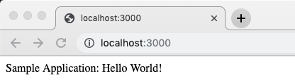

在浏览器中运行的示例 Node.js 应用程序

太棒了——我们的 Node.js 应用程序正在开发机器上运行。在终端按 *Ctrl* + *C* 停止应用程序。

1.  现在，我们想通过在容器内运行应用程序来测试我们目前开发的应用程序。为此，我们必须首先创建一个 `Dockerfile`，以便可以构建一个容器镜像，从该镜像中我们可以运行容器。让我们再次使用 VS Code 向项目文件夹中添加一个名为 `Dockerfile` 的文件，并给它以下内容：

```
FROM node:latest
WORKDIR /app
COPY package.json ./
RUN npm install
COPY . .
CMD node index.js
```

1.  然后我们可以使用这个 `Dockerfile` 来构建一个名为 `sample-app` 的镜像，如下所示：

```
$ docker image build -t sample-app .
```

1.  构建完成后，使用以下命令在容器中运行应用程序：

```
$ docker container run --rm -it \
    --name my-sample-app \
    -p 3000:3000 \
    sample-app
```

上面的命令会从容器镜像 `sample-app` 运行一个名为 `my-sample-app` 的容器，并将容器的端口 `3000` 映射到主机的相应端口。端口映射是必要的，否则我们无法从容器外部访问容器内运行的应用程序。我们将在 *第十章*、*单主机网络* 中了解更多关于端口映射的内容。

与我们直接在主机上运行应用程序时类似，输出如下：

```
Application listening at 0.0.0.0:3000
```

1.  刷新之前的浏览器标签页（如果你关闭了它，可以打开一个新的浏览器标签页并导航到 `localhost:3000`）。你应该看到应用程序仍然在运行，并产生与本地运行时相同的输出。这很好。我们刚刚证明了我们的应用程序不仅在主机上运行，而且也可以在容器内运行。

1.  在终端按 *Ctrl* + *C* 停止并移除容器。

1.  现在让我们修改代码并添加一些额外的功能。我们将在 `/hobbies` 定义另一个 `HTTP GET` 端点。请将以下代码片段添加到 `index.js` 文件中：

```
const hobbies = [
  'Swimming', 'Diving', 'Jogging', 'Cooking', 'Singing'
];

app.get('/hobbies', (req,res)=>{
  res.send(hobbies);
})
```

我们可以通过在主机上运行 `node index.js` 来先测试新功能，然后在浏览器中导航到 `localhost:3000/hobbies`。我们应该能够在浏览器窗口中看到预期的输出。测试完成后，别忘了按 *Ctrl* + *C* 停止应用程序。

1.  接下来，我们需要在容器内运行代码进行测试。因此，首先，我们创建一个新的容器镜像版本：

```
$ docker image build -t sample-app .
```

1.  接下来，我们从这个新镜像运行一个容器：

```
$ docker container run --rm -it \
    --name my-sample-app \
    -p 3000:3000 \
    sample-app 
```

现在，我们可以在浏览器中导航到`localhost:3000/hobbies`，并确认应用程序在容器内也按预期工作。再次提醒，完成后不要忘记按*Ctrl* + *C*停止容器。

我们可以对每个添加的特性或改进的现有特性反复执行这一系列任务。与所有应用程序总是直接在主机上运行的时代相比，事实证明，这增加了很多摩擦。

然而，我们可以做得更好。在下一节中，我们将介绍一种可以去除大部分摩擦的技术。

# 将不断变化的代码挂载到运行中的容器中

如果在代码更改后，我们不需要重建容器镜像并重新运行容器呢？如果修改能够立即生效，正如我们在 VS Code 等编辑器中保存时，它也能在容器内生效，那不是太棒了吗？嗯，正是通过卷映射可以实现这一点。在上一章中，我们学习了如何将任意主机文件夹映射到容器内的任意位置。在本节中，我们正是想利用这一点。

我们在*第五章*《数据卷与配置》中看到，如何将主机文件夹映射为容器中的卷。如果我想例如将主机文件夹`/projects/sample-app`挂载到容器的`/app`，其语法如下所示：

```
$ docker container run --rm -it \
 --volume /projects/sample-app:/app \
 alpine /bin/sh
```

注意行`--volume <host-folder>:<container-folder>`。主机文件夹的路径需要是绝对路径，如示例中所示，`/projects/sample-app`。

如果我们现在想从我们的`sample-app`容器镜像中运行一个容器，并且如果我们从项目文件夹中运行它，那么我们可以将当前文件夹映射到容器的`/app`文件夹，具体如下：

```
$ docker container run --rm -it \
 --volume $(pwd):/app \
    -p 3000:3000 \
```

请注意`$(pwd)`代替主机文件夹路径。`$(pwd)`会解析为当前文件夹的绝对路径，这非常方便。

现在，如果我们像上面描述的那样将当前文件夹挂载到容器中，那么`sample-app`容器镜像中的`/app`文件夹中的任何内容都会被映射的主机文件夹的内容覆盖，也就是我们当前文件夹的内容。这正是我们想要的——我们希望将当前的源代码从主机映射到容器中。

让我们测试一下它是否有效：

1.  如果你已经启动了容器，按*Ctrl* + *C*来停止容器。

1.  然后将以下代码片段添加到`index.js`文件的末尾：

```
app.get('/status', (req,res)=>{
  res.send('OK');
})
```

不要忘记保存。

1.  然后再次运行容器——这次不先重建镜像——来看看会发生什么：

```
$ docker container run --rm -it \
    --name my-sample-app \
 --volume $(pwd):/app \
 -p 3000:3000 \
 sample-app
```

1.  在你的浏览器中，导航到`localhost:3000/status`，你应该能看到浏览器窗口中显示`OK`输出。或者，你也可以在另一个终端窗口中使用`curl`：

```
$ curl localhost:3000/status
OK
```

对于所有在 Windows 和/或 Windows 上使用 Docker 的人员，您可以使用 PowerShell 命令 `Invoke-WebRequest` 或简称为 `iwr`，而不是 `curl`。然后，前面命令的等效命令将是 `iwr -Url localhost:3000/status`。

1.  暂时保持容器中运行的应用程序，并进行另一个更改。在导航到 `/status` 时，我们希望返回消息 `OK, all good` 而不仅仅是返回 `OK`。进行您的修改并保存更改。

1.  然后再次执行 `curl` 命令，或者如果您使用了浏览器，请刷新页面。看到了什么？没错——什么也没发生。我们所做的更改没有反映在运行的应用程序中。

1.  嗯，让我们再次检查更改是否已传播到运行中的容器中。为此，让我们执行以下命令：

```
$ docker container exec my-sample-app cat index.js
```

我们应该看到类似于这样的情况——为了便于阅读，我已经缩短了输出：

```
...
app.get('/hobbies', (req,res)=>{
 res.send(hobbies);
})

app.get('/status', (req,res)=>{
 res.send('OK, all good');
})
...
```

显然，我们的更改如预期地传播到了容器中。那么，为什么更改没有反映在运行的应用程序中呢？答案很简单：为了应用更改到应用程序中，必须重新启动应用程序。

1.  让我们试试这个。通过按下 *Ctrl* + *C* 停止运行应用程序的容器。然后重新执行前述的 `docker container run` 命令，并使用 `curl` 探测端点 `localhost:3000/status`。现在，应该显示以下新消息：

```
$ curl localhost:3000/status
 OK, all good
```

因此，通过映射运行容器中的源代码，我们在开发过程中显著减少了摩擦。现在我们可以添加新的或修改现有的代码，并在不必先构建容器镜像的情况下进行测试。然而，仍然存在一些摩擦。我们必须每次想要测试新的或修改的代码时手动重新启动容器。我们能自动化这个过程吗？答案是肯定的！我们将在下一节中演示如何做到这一点。

# 在代码更改时自动重启代码

在上一节中，我们展示了如何通过在容器中进行源代码文件的卷映射，大大减少摩擦，从而避免反复重建容器镜像和重新运行容器。

然而，我们仍然感觉到一些残留的摩擦。容器内运行的应用程序在代码更改时不会自动重启。因此，我们必须手动停止和重新启动容器才能应用新的更改。

# Node.js 的自动重启

如果您已经编程了一段时间，您肯定听说过一些有用的工具，它们可以在检测到代码库中的更改时运行您的应用程序并自动重启它们。对于 Node.js 应用程序，最流行的此类工具是 `nodemon`。我们可以使用以下命令在系统上全局安装 `nodemon`：

```
$ npm install -g nodemon
```

现在，有了 `nodemon` 可用，我们可以不再像在主机上那样使用 `node index.js` 启动我们的应用程序，而是只需执行 `nodemon`，然后我们应该看到以下内容：

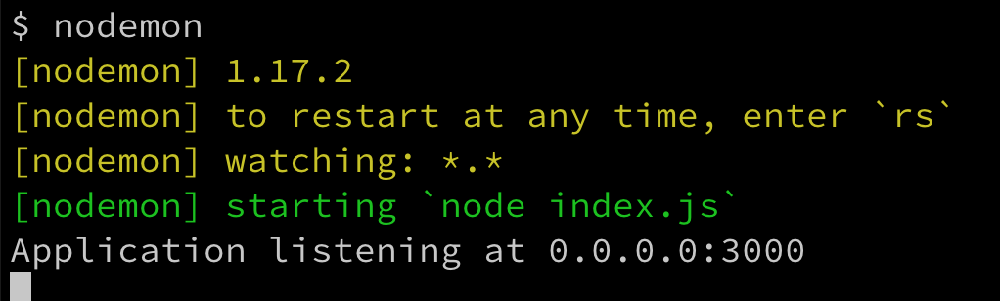

使用 nodemon 运行 Node.js 应用程序

显然，`nodemon`已经通过解析我们的`package.json`文件，识别到应该使用`node index.js`作为启动命令。

现在尝试修改一些代码，例如，在`index.js`的末尾添加以下代码片段，然后保存文件：

```
app.get('/colors', (req,res)=>{
 res.send(['red','green','blue']);
})
```

看一下终端窗口。你看到什么了吗？你应该看到以下附加输出：

```
[nodemon] restarting due to changes...
[nodemon] starting `node index.js`
Application listening at 0.0.0.0:3000
```

这清楚地表明，`nodemon`已经检测到某些更改，并自动重启了应用程序。通过浏览器访问`localhost:3000/colors`，你应该在浏览器中看到以下预期的输出：

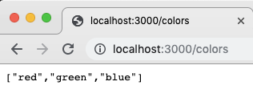

获取颜色

这很酷——你不需要手动重启应用程序就能得到这个结果。这使我们更具生产力。现在，我们能在容器中做同样的事情吗？是的，我们可以。我们不会使用`Dockerfile`最后一行定义的启动命令`node index.js`：

```
CMD node index.js
```

我们将使用`nodemon`。

我们需要修改`Dockerfile`吗？还是我们需要两个不同的`Dockerfile`，一个用于开发，一个用于生产环境？

我们原来的`Dockerfile`创建的镜像不幸没有包含`nodemon`。因此，我们需要创建一个新的`Dockerfile`。我们将其命名为`Dockerfile-dev`，它应该如下所示：

```
FROM node:latest          
RUN npm install -g nodemon
WORKDIR /app
COPY package.json ./
RUN npm install
COPY . .
CMD nodemon
```

与我们原来的 Dockerfile 比较，我们添加了第 2 行，其中安装了`nodemon`。我们还修改了最后一行，现在使用`nodemon`作为我们的启动命令。

我们将按如下方式构建我们的开发镜像：

```
$ docker image build -t sample-app-dev .
```

我们将像这样运行一个容器：

```
$ docker container run --rm -it \
   -v $(pwd):/app \
   -p 3000:3000 \
   sample-app-dev
```

现在，在容器中运行应用程序时，修改一些代码并保存，注意容器中的应用程序会自动重启。因此，我们在容器中达到了与直接在主机上运行时相同的减少摩擦效果。

你可能会问，这是否仅适用于 Node.js？不，幸运的是，许多流行的编程语言都支持类似的概念。

# Python 的自动重启

让我们看看 Python 中如何实现相同的功能：

1.  首先，为我们的示例 Python 应用程序创建一个新的项目文件夹，并进入该文件夹：

```
$ mkdir -p ~/fod/ch06/python && cd ~/fod/ch06/python
```

1.  使用命令`code .`从该文件夹打开 VS Code。

1.  我们将创建一个使用流行 Flask 库的示例 Python 应用程序。因此，向该文件夹中添加一个`requirements.txt`文件，并包含`flask`内容。

1.  接下来，添加一个`main.py`文件，并将其内容设置为：

```
from flask import Flask
app = Flask(__name__)

@app.route("/")
def hello():
  return "Hello World!"

if __name__ == "__main__":
  app.run()
```

这是一个简单的**Hello World**类型应用程序，它在`localhost:5000/`实现了一个单一的 RESTful 接口。

1.  在我们运行和测试此应用程序之前，我们需要安装依赖项——在我们的例子中是 Flask。在终端中，运行以下命令：

```
$ pip install -r requirements.txt
```

这应该在你的主机上安装 Flask。现在我们准备好了。

1.  使用 Python 时，我们也可以使用`nodemon`让我们的应用程序在任何代码更改时自动重启。例如，假设你启动 Python 应用程序的命令是`python main.py`。那么你只需要使用`nodemon`，如下所示：

```
$ nodemon main.py
```

你应该看到如下内容：

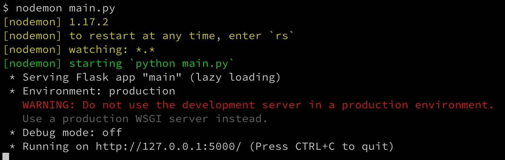

1.  使用`nodemon`启动并监控 Python 应用程序，我们可以通过使用`curl`来测试该应用程序，应该会看到如下输出：

```
$ curl localhost:5000/
Hello World!
```

1.  现在，修改代码，在`main.py`中，在定义`/`端点之后添加以下代码片段，并保存：

```
from flask import jsonify

@app.route("/colors")
def colors():
   return jsonify(["red", "green", "blue"])
```

`nodemon`会发现这些更改并重新启动 Python 应用程序，如我们在终端中看到的输出：

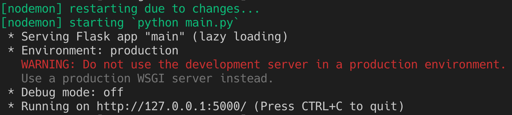

nodemon 发现了 Python 代码的变化

1.  再次提醒，相信是好的，但测试更好。所以，让我们再次使用我们的好朋友`curl`来探测新的端点，看看我们得到的是什么：

```
$ curl localhost:5000/colors
["red", "green", "blue"]
```

太好了——它有效！至此，我们已经覆盖了 Python 部分。`.NET`是另一个流行的平台。让我们看看在开发 C#应用程序时，能否做类似的事情。

# .NET 的自动重启

我们的下一个候选者是一个用 C#编写的.NET 应用程序。让我们看看在.NET 中自动重启是如何工作的。

1.  首先，为我们的示例 C#应用程序创建一个新的项目文件夹并进入该文件夹：

```
$ mkdir -p ~/fod/ch06/csharp && cd ~/fod/ch06/csharp
```

如果你之前没有做过，请在你的笔记本或工作站上安装.NET Core。你可以在[`dotnet.microsoft.com/download/dotnet-core`](https://dotnet.microsoft.com/download/dotnet-core)获取它。截至写作时，2.2 版本是当前的稳定版本。安装完成后，可以通过`dotnet --version`检查版本，对我来说是`2.2.401`。

1.  导航到本章的源文件夹：

```
$ cd ~/fod/ch06
```

1.  在此文件夹内，使用`dotnet`工具创建一个新的 Web API，并将其放置在`dotnet`子文件夹中：

```
$ dotnet new webapi -o dotnet
```

1.  导航到这个新的项目文件夹：

```
$ cd dotnet
```

1.  再次使用`code .`命令从`dotnet`文件夹内打开 VS Code。

如果这是你第一次在 VS Code 中打开.NET Core 2.2 项目，那么编辑器会开始下载一些 C#依赖项。请等待所有依赖项下载完成。编辑器还可能弹出一个提示，询问你是否需要添加我们`dotnet`项目中缺少的依赖项。在这种情况下，点击`Yes`按钮。

在 VS Code 的项目资源管理器中，你应该看到如下内容：

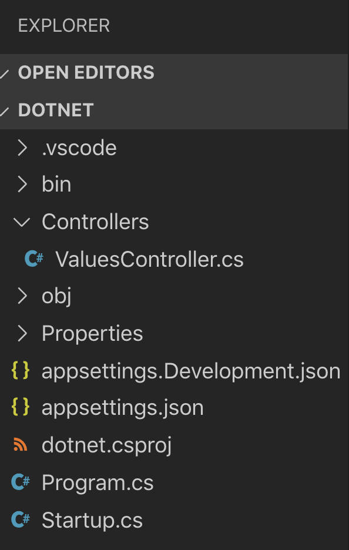

在 VS Code 项目资源管理器中看到 DotNet Web API 项目

1.  请注意`Controllers`文件夹中有`ValuesController.cs`文件。打开此文件并分析其内容。它包含了`ValuesController`类的定义，该类实现了一个简单的 RESTful 控制器，具有`GET`、`PUT`、`POST`和`DELETE`端点，路径为`api/values`。

1.  从终端运行应用程序，命令是`dotnet run`。你应该会看到如下输出：

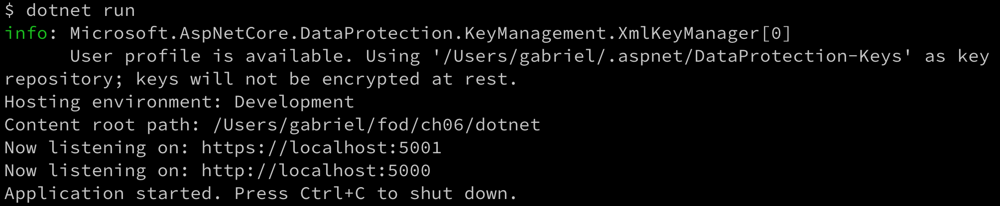

在主机上运行.NET 示例 Web API

1.  我们可以使用`curl`来测试应用程序，例如：

```
$ curl --insecure https://localhost:5001/api/values ["value1","value2"]
```

应用程序运行并返回预期的结果。

请注意，默认情况下，应用程序被配置为将`http://localhost:5000`重定向到`https://localhost:5001`。但是，这是一个不安全的端点，为了抑制警告，我们使用`--insecure`开关。

1.  现在我们可以尝试修改`ValuesController.cs`中的代码，从第一个`GET`端点返回三个项目，而不是两个：

```
[HttpGet]
public ActionResult<IEnumerable<string>> Get()
{
    return new string[] { "value1", "value2", "value3" };
}
```

1.  保存更改并重新运行`curl`命令。注意结果中没有包含新添加的值。这是我们在 Node.js 和 Python 中观察到的相同问题。为了看到更新后的返回值，我们需要（手动）重新启动应用程序。

1.  因此，在终端中，使用*Ctrl* + *C*停止应用程序，然后使用`dotnet run`重新启动它。再次尝试`curl`命令。结果现在应该反映出你的更改。

1.  幸运的是，`dotnet`工具有`watch`命令。通过按*Ctrl* + *C*停止应用程序，然后执行`dotnet watch run`。你应该看到类似如下的输出：

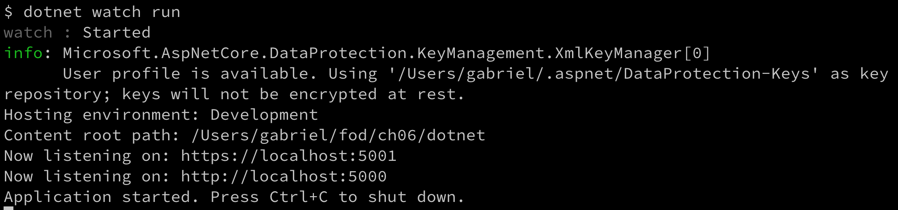

运行带有 watch 任务的.NET 示例应用程序

注意前述输出中的第二行，它表明正在运行的应用程序现在正在监视更改。

1.  在`ValuesController.cs`中进行另一次更改；例如，向第一个`GET`端点的返回值中添加第四项并保存。观察终端中的输出，应该类似如下：

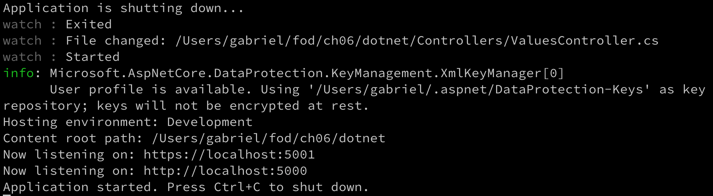

自动重启正在运行的示例.NET Core 应用程序

1.  通过在代码更改后自动重新启动应用程序，结果立即可用，我们可以通过运行`curl`命令轻松测试它：

```
$ curl --insecure https://localhost:5001/api/values ["value1","value2","value3","value4"]
```

1.  现在，我们已经让主机上的自动重启正常工作，可以编写一个 Dockerfile，让容器内运行的应用程序也执行相同的操作。在 VS Code 中，向项目添加一个名为`Dockerfile-dev`的新文件，并将以下内容添加到其中：

```
FROM mcr.microsoft.com/dotnet/core/sdk:2.2
WORKDIR /app
COPY dotnet.csproj ./
RUN dotnet restore
COPY . .
CMD dotnet watch run
```

1.  在我们继续并构建容器镜像之前，我们需要对.NET 应用程序的启动配置做一些小修改，使得 Web 服务器（此例为 Kestrel）能够监听，例如`0.0.0.0:3000`，从而能够在容器内运行并且能够从容器外部访问。打开`Program.cs`文件，并对`CreateWebHostBuilder`方法进行以下修改：

```
public static IWebHostBuilder CreateWebHostBuilder(string[] args) =>
    WebHost.CreateDefaultBuilder(args)
    .UseUrls("http://0.0.0.0:3000")
    .UseStartup<Startup>();
```

使用`UseUrls`方法，我们告诉 Web 服务器监听所需的端点。

现在我们准备好构建容器镜像：

1.  要构建镜像，请使用以下命令：

```
$ docker image build -f Dockerfile-dev -t sample-app-dotnet .
```

1.  一旦镜像构建完成，我们可以从中运行一个容器：

```
$ docker container run --rm -it \
   -p 3000:3000 \
   -v $(pwd):/app \
   sample-app-dotnet
```

我们应该看到与本地运行时类似的输出：

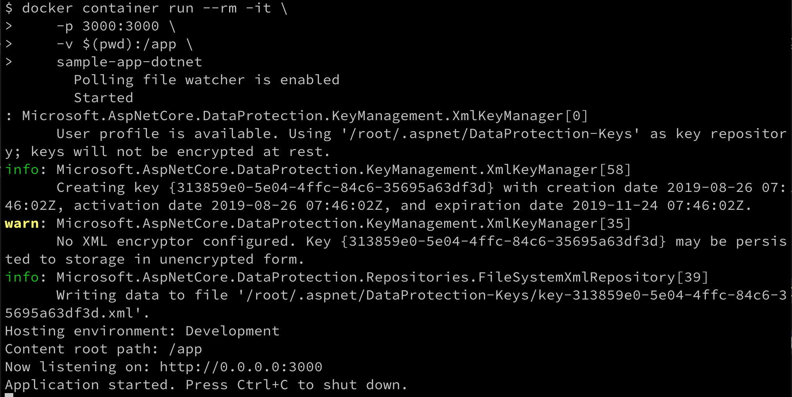

一个在容器中运行的.NET 示例应用程序

1.  让我们通过我们的朋友`curl`来测试应用程序：

```
$ curl localhost:3000/api/values
["value1","value2","value3","value4"]
$
$ curl localhost:3000/api/values/1
value
```

没有什么意外的——它按预期工作。

1.  现在让我们在控制器中做个代码更改并保存。观察终端窗口发生了什么。我们应该看到类似这样的输出：

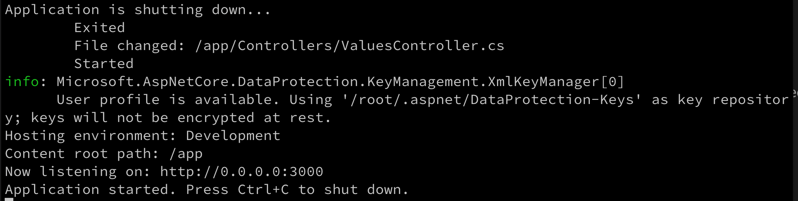

.NET 示例应用程序在容器内自动重启

嗯，这正是我们预期的结果。这样一来，我们就消除了在开发.NET 应用程序时使用容器带来的大部分摩擦。

# 容器内逐行代码调试

在深入讲解如何逐行调试容器中运行的代码之前，先做个免责声明。你将在这里学到的内容通常应该是最后的手段，如果其他方法都无法解决问题。理想情况下，当你采用测试驱动开发方法来开发应用程序时，代码大部分是有保障的，因为你已经为它编写了单元测试和集成测试，并且将这些测试应用到你的代码上，而这些代码也运行在容器内。或者，如果单元测试或集成测试未能为你提供足够的洞察，并且你真的需要逐行调试代码，你可以让代码直接在主机上运行，从而利用像 Visual Studio、Eclipse 或 IntelliJ 等开发环境的支持，举几个 IDE 的例子。

经过所有这些准备后，你应该很少需要手动调试运行在容器中的代码。话虽如此，我们来看一下你该如何操作！

在本节中，我们将专注于如何在使用 Visual Studio Code 时进行调试。其他编辑器和 IDE 可能提供或不提供类似的功能。

# 调试一个 Node.js 应用程序

我们将从最简单的一个开始——Node.js 应用程序。我们将使用本章之前在`~/fod/ch06/node`文件夹中的示例应用程序：

1.  确保你进入该项目文件夹并从其中打开 VS Code：

```
$ cd ~/fod/ch06/node
$ code .
```

1.  在终端窗口中，从项目文件夹内运行一个带有我们示例 Node.js 应用程序的容器：

```
$ docker container run --rm -it \
   --name my-sample-app \
   -p 3000:3000 \
   -p 9229:9229 \
   -v $(pwd):/app \
   sample-app node --inspect=0.0.0.0 index.js
```

请注意，我是如何将端口`9229`映射到主机的。这个端口是调试器使用的，VS Studio 会通过这个端口与我们的 Node 应用程序通信。因此，打开此端口非常重要——但仅限于调试会话期间！还要注意，我们通过`node --inspect=0.0.0.0 index.js`覆盖了 Dockerfile 中定义的标准启动命令（`node index.js`）。`--inspect=0.0.0.0`告诉 Node 以调试模式运行，并监听容器内所有 IP4 地址。

现在我们准备好为当前情境定义一个 VS Code 启动任务，也就是我们的代码运行在容器内的情景：

1.  要打开`launch.json`文件，按下*Ctrl*+*Shift*+*P*（在 Windows 上为*Ctrl*+*Shift*+*P*）以打开命令面板，搜索`Debug:Open launch.json`并选择它。`launch.json`文件应该在编辑器中打开。

1.  点击蓝色的**Add Configuration...**按钮，以添加我们在容器内调试所需的新配置。

1.  从选项中选择`Docker: Attach to Node`。这将向`launch.json`文件的配置列表中添加一个新条目。它应该看起来像这样：

```
{
  "type": "node",
  "request": "attach",
  "name": "Docker: Attach to Node",
  "remoteRoot": "/usr/src/app"
},
```

因为我们的代码位于容器中的`/app`文件夹，所以我们需要相应地更改`remoteRoot`的值。将`/usr/src/app`的值修改为`/app`。不要忘记保存您的更改。就这样，我们准备好开始了。

1.  在 VS Code 中按`command` + `Shift` + `D`（Windows 系统为`Ctrl` + `Shift` + `D`）打开调试视图。

1.  确保在视图顶部绿色启动按钮旁边的下拉菜单中选择正确的启动任务。选择`Docker: Attach to Node`，如下所示：

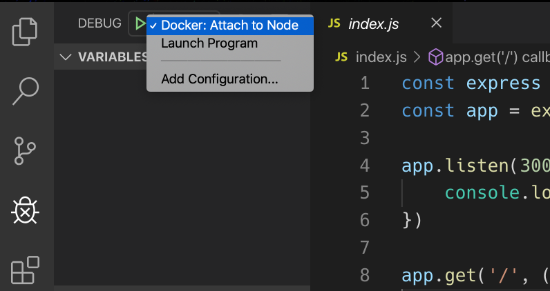

在 VS Code 中选择正确的启动任务以进行调试

1.  接下来，点击绿色启动按钮，将 VS Code 附加到容器中运行的 Node 应用程序。

1.  在编辑器中打开`index.js`，并在调用`'/'`端点时返回消息`"Sample Application: Hello World!"`的那一行设置断点。

1.  在另一个终端窗口中，使用`curl`访问`localhost:3000/`并观察代码执行在断点处停止：

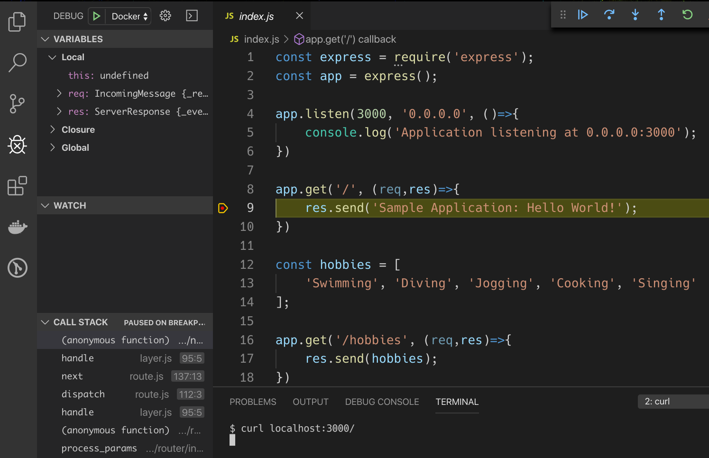

代码执行在断点处停止

在上面的截图中，我们可以看到黄色条表示代码执行在断点处停止。在右上角，我们有一个工具栏，可以让我们逐步导航代码。例如，逐步执行。在左侧，我们可以看到`VARIABLES`、`WATCH`和`CALL STACK`窗口，可以用来观察运行中的应用程序的详细信息。我们通过终端窗口可以验证我们正在调试的是运行在容器内部的代码，我们在启动容器时看到的输出`Debugger attached.`就是我们在 VS Code 中开始调试时生成的。

让我们看看如何进一步改善调试体验：

1.  要停止容器，请在终端中输入以下命令：

```
$ docker container rm -f my-sample-app
```

1.  如果我们希望使用`nodemon`来获得更多灵活性，那么我们需要稍微修改`container run`命令：

```
$ docker container run --rm -it \
   --name my-sample-app \
   -p 3000:3000 \
   -p 9229:9229 \
   -v $(pwd):/app \
   sample-app-dev nodemon --inspect=0.0.0.0 index.js
```

请注意我们如何使用启动命令，`nodemon --inspect=0.0.0.0 index.js`。这样做的好处是，当代码发生任何更改时，容器内运行的应用程序将自动重启，正如我们在本章中之前学习的那样。你应该看到如下内容：

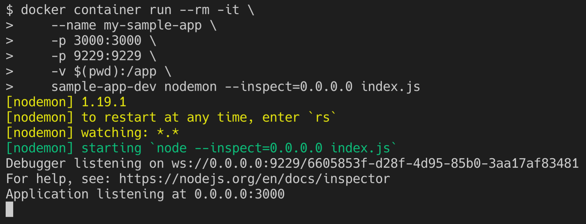

使用 nodemon 启动 Node.js 应用程序并开启调试

1.  不幸的是，应用程序重启的后果是调试器与 VS Code 失去连接。但别担心——我们可以通过在`launch.json`文件中的启动任务中添加`"restart": true`来缓解这一问题。将任务修改如下：

```
{
  "type": "node",
  "request": "attach",
  "name": "Docker: Attach to Node",
  "remoteRoot": "/app",
  "restart": true
},
```

1.  保存更改后，在 VS Code 中通过点击调试窗口中的绿色启动按钮启动调试器。在终端中，你应该再次看到输出`Debugger attached.`信息。除此之外，VS Code 在底部显示了一个橙色状态栏，表示编辑器处于调试模式。

1.  在另一个终端窗口中，使用`curl`尝试访问`localhost:3000/`，以测试逐行调试是否仍然有效。确保代码执行会在你设置的任何断点处停下来。

1.  一旦确认调试仍然有效，尝试修改一些代码；例如，将消息`"Sample Application: Hello World!"`改为`"Sample Application: Message from within container"`并保存更改。观察`nodemon`如何重新启动应用程序，并且调试器会自动重新附加到容器内运行的应用程序：

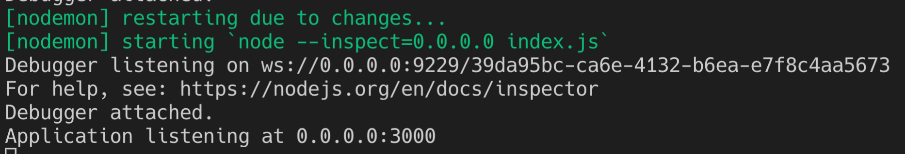

nodemon 重新启动应用程序，并且调试器会自动重新附加到应用程序上

至此，我们已经完成了所有配置，现在可以像在主机上本地运行代码一样，操作在容器内运行的代码。我们已经去除了容器引入的几乎所有开发过程中的摩擦。现在，我们可以尽情享受将代码部署在容器中的好处。

要清理，按*Ctrl* + *C*停止容器。

# 调试 .NET 应用程序

现在，我们想快速演示如何逐行调试一个 .NET 应用程序。我们将使用本章之前创建的示例 .NET 应用程序。

1.  导航到项目文件夹并从其中打开 VS Code：

```
$ cd ~/fod/ch06/dotnet
$ code .
```

1.  为了使用调试器，我们需要先在容器中安装调试器。因此，我们将在项目目录中创建一个新的`Dockerfile`。命名为`Dockerfile-debug`并添加以下内容：

```
FROM mcr.microsoft.com/dotnet/core/sdk:2.2
RUN apt-get update && apt-get install -y unzip && \
    curl -sSL https://aka.ms/getvsdbgsh | \
        /bin/sh /dev/stdin -v latest -l ~/vsdbg
WORKDIR /app
COPY dotnet.csproj ./
RUN dotnet restore
COPY . .
CMD dotnet watch run
```

请注意`Dockerfile`的第二行，该行使用`apt-get`安装`unzip`工具，然后使用`curl`下载并安装调试器。

1.  我们可以从这个`Dockerfile`构建一个名为`sample-app-dotnet-debug`的镜像，具体操作如下：

```
$ docker image build -t sample-app-dotnet-debug .
```

该命令执行可能需要一些时间，因为调试器需要被下载和安装等操作。

1.  完成此操作后，我们可以交互式地从此镜像运行一个容器：

```
$ docker run --rm -it \
   -v $(pwd):/app \
   -w /app \
   -p 3000:3000 \
   --name my-sample-app \
   --hostname sample-app \
   sample-app-dotnet-debug
```

我们将看到如下内容：

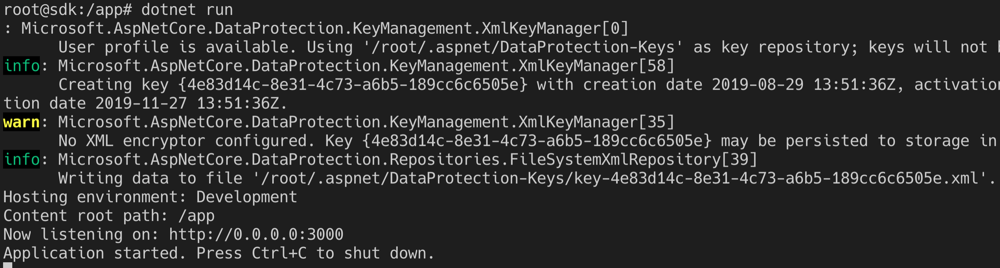

示例 .NET 应用程序在 SDK 容器内交互式启动

1.  在 VS Code 中，打开`launch.json`文件并添加以下启动任务：

```
{
   "name": ".NET Core Docker Attach",
   "type": "coreclr",
   "request": "attach",
   "processId": "${command:pickRemoteProcess}",
   "pipeTransport": {
      "pipeProgram": "docker",
      "pipeArgs": [ "exec", "-i", "my-sample-app" ],
      "debuggerPath": "/root/vsdbg/vsdbg",
      "pipeCwd": "${workspaceRoot}",
      "quoteArgs": false
   },
   "sourceFileMap": {
      "/app": "${workspaceRoot}"
   },
   "logging": {
      "engineLogging": true
   }
},
```

1.  保存更改并切换到 VS Code 的调试窗口（使用*command* + *Shift* + *D* 或 *Ctrl* + *Shift* + *D* 打开）。确保选择了正确的调试启动任务——它的名称是`.NET Core Docker Attach`：

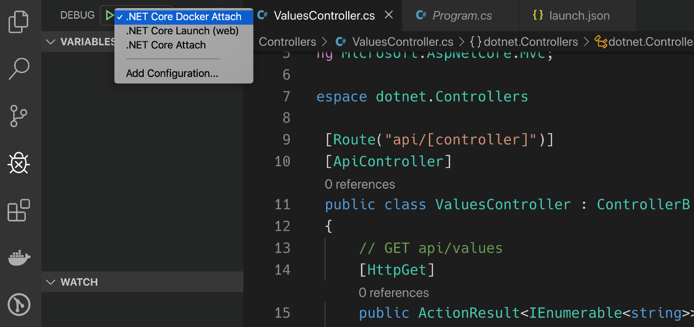

在 VS Code 中选择正确的调试启动任务

1.  现在点击绿色的开始按钮启动调试器。结果，选择进程的弹窗会显示潜在进程的列表。选择看起来像下面屏幕截图中标记的进程：

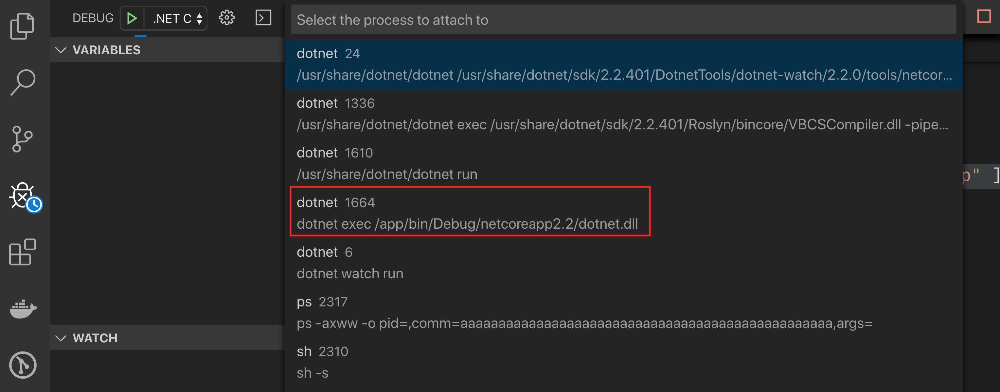

选择要附加调试器的进程

1.  让我们在`ValuesController.cs`文件的第一个`GET`请求处设置断点，然后执行一个`curl`命令：

```
$ curl localhost:3000/api/values
```

代码执行应该在断点处停止，如下所示：

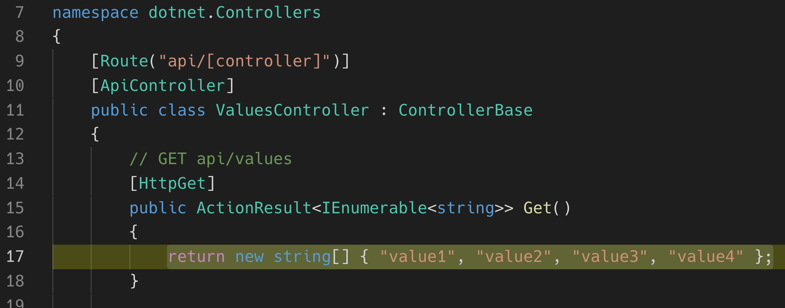

逐行调试在容器中运行的.NET Core 应用程序

1.  现在我们可以逐步执行代码、定义监视，或分析应用程序的调用栈，类似于我们在示例 Node.js 应用程序中所做的。在调试工具栏上点击继续按钮或按*F5*继续代码执行。

1.  现在更改一些代码并保存更改。观察终端窗口中，应用程序如何自动重启。

1.  再次使用`curl`测试您的更改是否对应用程序可见。实际上，您的更改已经生效，但您注意到什么了吗？是的——代码执行并没有在断点处启动。不幸的是，重新启动应用程序导致调试器断开连接。您必须通过点击 VS Code 调试视图中的开始按钮，并选择正确的进程，重新附加调试器。

1.  要停止应用程序，请在您启动容器的终端窗口中按*Ctrl* + *C*。

现在我们知道如何逐行调试在容器中运行的代码，是时候对代码进行仪器化，以生成有意义的日志信息。

# 对代码进行仪器化，以生成有意义的日志信息

一旦应用程序在生产环境中运行，就无法或强烈不建议以交互方式调试应用程序。因此，我们需要想出其他方法来查找系统异常行为或错误的根本原因。最好的方法是让应用程序生成详细的日志信息，然后由开发人员用来追踪错误。由于日志记录是一个非常常见的任务，所有相关的编程语言或框架都提供了库，使得在应用程序内部生成日志信息变得简单。

将应用程序输出的信息作为日志，通常会被分类为所谓的严重性级别。以下是这些严重性级别的列表，并附有每个级别的简短说明：

| **安全级别** | **说明** |
| --- | --- |
| TRACE | 非常细粒度的信息。在这个级别，您将捕获尽可能多的关于应用程序行为的每一个细节。 |
| DEBUG | 相对细粒度的信息，主要是诊断信息，有助于找出潜在问题。 |
| INFO | 正常的应用程序行为或里程碑。 |
| WARN | 应用程序可能遇到了问题，或者您检测到了异常情况。 |
| ERROR | 应用程序遇到了严重问题。这很可能代表了一个重要应用任务的失败。 |
| FATAL | 应用程序的灾难性故障。建议立即关闭应用程序。 |

生成日志信息时使用的严重性级别列表

日志记录库通常允许开发人员定义不同的日志接收器，即日志信息的目的地。常见的接收器包括文件接收器或流式输出到控制台。在使用容器化应用程序时，强烈建议始终将日志输出定向到控制台或`STDOUT`。Docker 随后将通过`docker container logs`命令提供这些信息。其他日志收集器，如 Prometheus，也可以用来抓取这些信息。

# 对 Python 应用程序进行日志记录

现在让我们尝试为我们现有的 Python 示例应用程序添加日志记录：

1.  首先，在终端中，导航到项目文件夹并打开 VS Code：

```
$ cd ~/fob/ch06/python
$ code .
```

1.  打开`main.py`文件，并将以下代码片段添加到文件顶部：

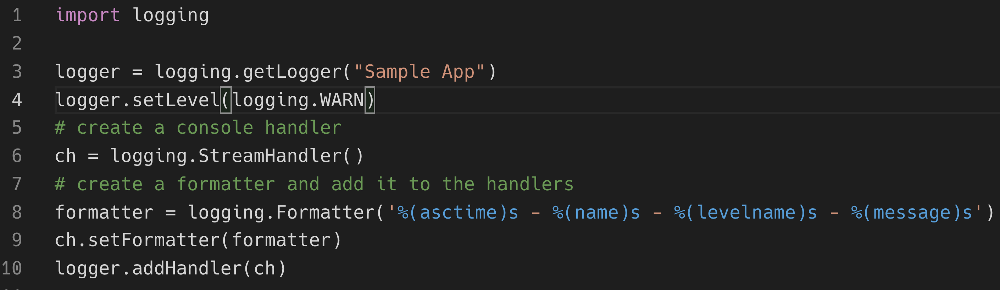

为我们的 Python 示例应用程序定义一个 logger

在第`1`行，我们导入了标准的`logging`库。然后在第`3`行我们为示例应用程序定义了一个`logger`。在第`4`行，我们定义了用于日志记录的过滤器。在这个例子中，我们将其设置为`WARN`。这意味着所有由应用程序生成的日志消息，如果其严重性等于或高于`WARN`，将输出到我们在本节开始时定义的`logging`处理程序或接收器。对于我们来说，只有日志级别为`WARN`、`ERROR`或`FATAL`的日志消息会被输出。

在第`6`行，我们创建了一个日志接收器或处理程序。在我们的例子中，它是`StreamHandler`，它将输出到`STDOUT`。然后，在第`8`行，我们定义了我们希望`logger`格式化输出消息的方式。这里我们选择的格式将输出时间和日期、应用程序（或`logger`）名称、日志严重性级别，最后是我们开发人员在代码中定义的实际消息。在第`9`行，我们将格式化器添加到日志处理程序中，并在第`10`行将该处理程序添加到`logger`中。请注意，我们可以为每个 logger 定义多个处理程序。现在我们已经准备好使用`logger`了。

1.  让我们为`hello`函数添加日志记录，该函数在我们访问端点`/`时被调用：

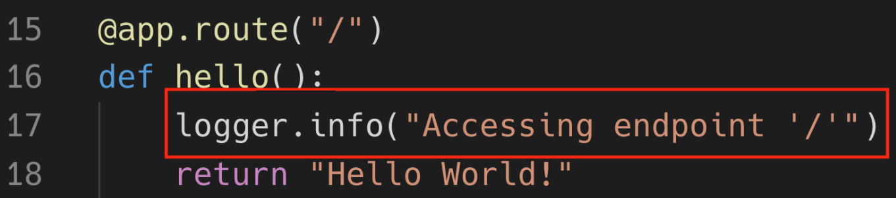

使用日志记录为方法添加日志

如你在前面的截图中看到的，我们添加了第`17`行，在该行中我们使用`logger`对象生成了一个日志级别为`INFO`的日志消息。消息内容是：“访问端点'/'”。

1.  让我们为另一个函数添加日志记录，并输出日志级别为`WARN`的消息：

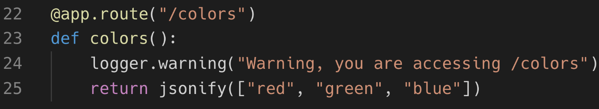

生成警告

这一次，我们在第`24`行的`colors`函数中生成了一个日志级别为`WARN`的消息。到目前为止，一切顺利—这并不难！

1.  现在让我们运行应用程序，看看我们得到什么输出：

```
$ python main.py
```

1.  然后，在浏览器中，先访问 `localhost:5000/`，然后访问 `localhost:5000/colors`。你应该会看到类似以下的输出：

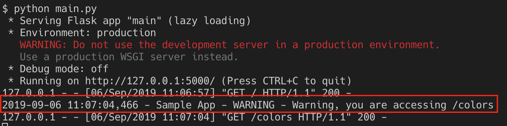

运行已仪器化的示例 Python 应用程序

如你所见，只有警告被输出到控制台；`INFO` 消息没有被输出。这是由于我们在定义日志记录器时设置的过滤器。还要注意，日志消息的格式是以日期和时间开始，然后是日志记录器的名称、日志级别，最后是我们在应用程序第 `24` 行定义的实际消息。完成后，请按 *Ctrl* + *C* 停止应用程序。

# 对 .NET C# 应用程序进行仪器化

现在让我们对我们的示例 C# 应用程序进行仪器化：

1.  首先，导航到项目文件夹，从那里你将打开 VS Code：

```
$ cd ~/fod/ch06/dotnet
$ code .
```

1.  接下来，我们需要向项目中添加包含日志记录库的 NuGet 包：

```
$ dotnet add package Microsoft.Extensions.Logging
```

这应该会将以下行添加到你的 `dotnet.csproj` 项目文件中：

```
<PackageReference Include="Microsoft.Extensions.Logging" Version="2.2.0" />
```

1.  打开 `Program.cs` 类，并注意我们在第 `21` 行调用了 `CreateDefaultBuilder(args)` 方法：

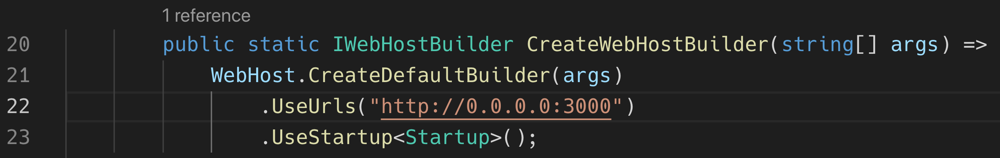

配置 ASP.NET Core 2.2 中的日志记录

默认情况下，这个方法会向应用程序添加一些日志记录提供程序，其中包括控制台日志记录提供程序。这非常方便，免去了我们必须先进行复杂配置的麻烦。当然，你可以随时使用自己的设置覆盖默认设置。

1.  接下来，打开 `Controllers` 文件夹中的 `ValuesController.cs` 文件，并在文件顶部添加以下 `using` 语句：

```
using Microsoft.Extensions.Logging;
```

1.  然后，在类体中，添加一个类型为 `ILogger` 的实例变量 `_logger`，并添加一个接受 `ILogger<T>` 类型参数的构造函数。将该参数赋值给实例变量 `_logger`：

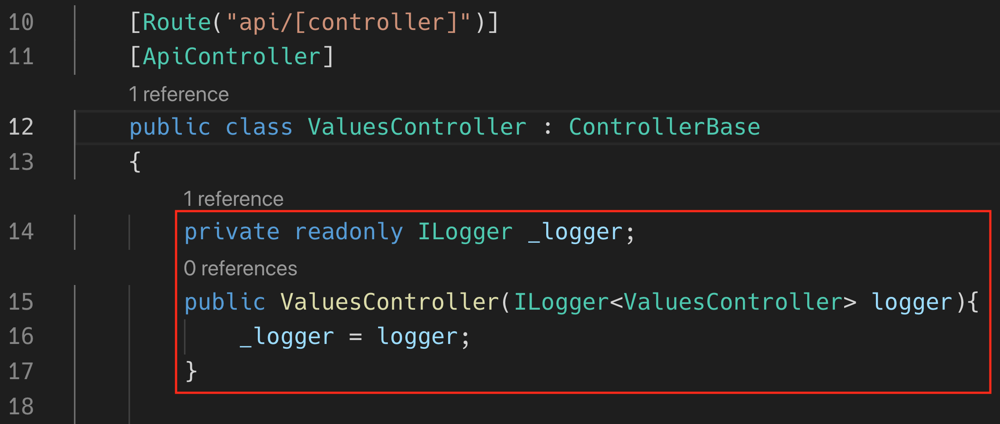

为 Web API 控制器定义日志记录器

1.  现在我们可以在控制器方法中使用日志记录器了。让我们在 `Get` 方法中添加一个 `INFO` 消息：

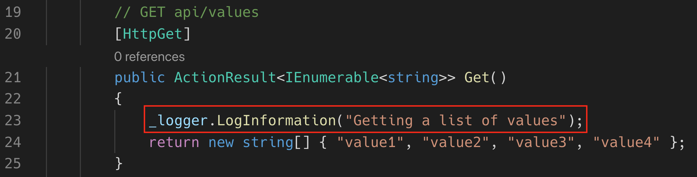

从 API 控制器记录 INFO 消息

1.  现在让我们对 `Get(int id)` 方法进行仪器化：

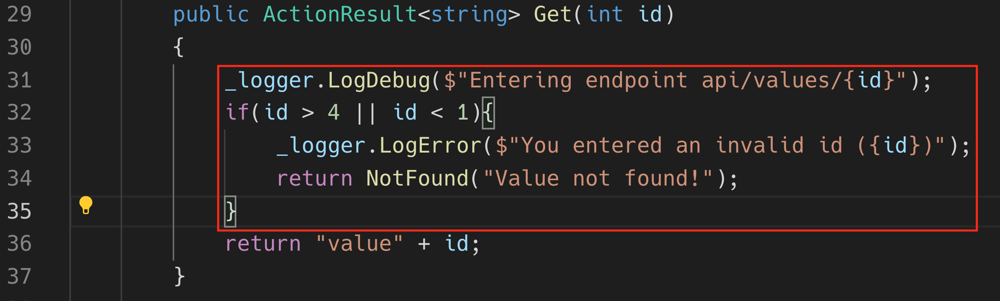

使用 WARN 和 ERROR 日志级别记录消息

在第 `31` 行，我们让日志记录器生成一个 `DEBUG` 消息，然后在第 `32` 行我们有一些逻辑来捕获 `id` 的意外值，并生成 `ERROR` 消息并返回 HTTP 响应状态 `404`（未找到）。

1.  让我们使用以下命令运行应用程序：

```
$ dotnet run
```

1.  我们在访问 `localhost:3000/api/values` 时应该看到这个：

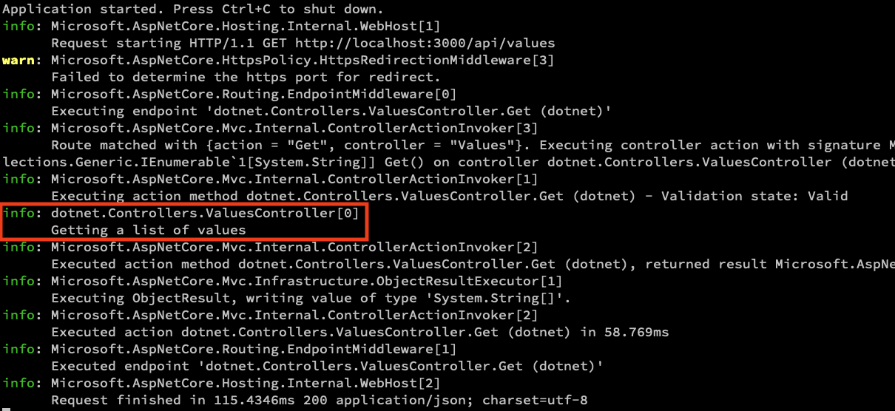

访问端点 `/api/values` 时，我们示例 .NET 应用程序的日志

我们可以看到类型为 `INFO` 的日志消息输出。所有其他日志项都是由 ASP.NET Core 库生成的。如果你需要调试应用程序，可以看到很多有用的信息。

1.  现在让我们尝试访问 `/api/values/{id}` 端点，并为 `{id}` 提供一个无效的值。我们应该会看到类似这样的内容：

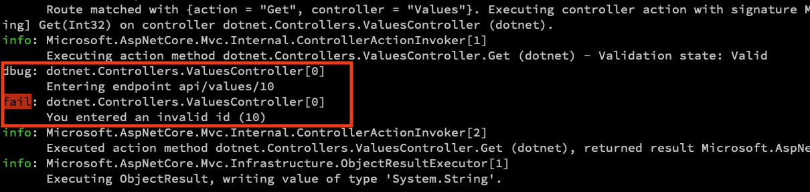

我们 .NET 示例应用程序生成的调试和错误日志项

我们可以清楚地看到，首先是 `DEBUG` 级别的日志项，然后是 `ERROR` 级别的日志项。输出中的后者被标记为红色的 `fail`。

1.  完成后，请使用 *Ctrl +* C 结束应用程序。

现在我们已经了解了如何进行仪表化，接下来我们将在下一节中介绍 Jaeger。

# 使用 Jaeger 进行监控和故障排除

当我们想要监控和故障排除一个复杂分布式系统中的事务时，我们需要一些比我们刚刚学到的东西更强大的工具。当然，我们可以并且应该继续用有意义的日志消息来仪表化我们的代码，但我们还需要一些更高层次的东西。这个 *更高层次的东西* 就是能够追踪一个请求或事务从头到尾的能力，追踪它如何在由多个应用服务组成的系统中流动。理想情况下，我们还希望捕获其他有趣的指标，比如每个组件所花费的时间与请求总时间的对比。

幸运的是，我们不必重新发明轮子。外面有经过实战验证的开源软件，可以帮助我们实现前面提到的目标。Jaeger（[`www.jaegertracing.io/`](https://www.jaegertracing.io/)）就是这样的一个基础设施组件或软件示例。使用 Jaeger 时，我们运行一个中央的 Jaeger 服务器组件，而每个应用程序组件使用一个 Jaeger 客户端，透明地将调试和追踪信息转发到 Jaeger 服务器组件。Jaeger 客户端适用于所有主流编程语言和框架，如 Node.js、Python、Java 和 .NET。

本书中我们不会深入探讨如何使用 Jaeger 的所有细节，而是会对其概念性工作原理进行高层次概述：

1.  首先，我们定义一个 Jaeger 的 `tracer` 对象。这个对象基本上协调了整个通过分布式应用程序追踪请求的过程。我们可以使用这个 `tracer` 对象，还可以从中创建一个 `logger` 对象，我们的应用程序代码可以用它生成日志项，类似于我们在之前的 Python 和 .NET 示例中所做的。

1.  接下来，我们需要将每个我们想要追踪的方法用 Jaeger 所谓的 `span` 包裹起来。`span` 有一个名称，并为我们提供一个 `scope` 对象。让我们来看一下以下的 C# 伪代码，它说明了这一点：

```
public void SayHello(string helloTo) {
  using(var scope = _tracer.BuildSpan("say-hello").StartActive(true)) {
    // here is the actual logic of the method
    ...
    var helloString = FormatString(helloTo);
    ...
  }
}
```

如你所见，我们正在对 `SayHello` 方法进行仪表化。通过一个 `using` 语句创建一个 span，我们将该方法的整个应用程序代码包裹在其中。我们将 span 命名为 `"say-hello"`，这将是我们在 Jaeger 生成的追踪日志中识别该方法的 ID。

请注意，方法调用了另一个嵌套方法 `FormatString`。这个方法在仪表化代码方面会非常相似：

```
public void string Format(string helloTo) {
   using(var scope = _tracer.BuildSpan("format-string").StartActive(true)) {
       // here is the actual logic of the method
       ...
       _logger.LogInformation(helloTo);
       return 
       ...
   }
}
```

在此方法中，我们的 `tracer` 对象构建的跨度将是调用方法的子跨度。这里的子跨度被称为 `"format-string"`。另请注意，我们在前面的方法中使用 `logger` 对象显式生成了一个 `INFO` 级别的日志项。

在本章包含的代码中，您可以找到一个完整的 C# 示例应用程序，其中包含一个 Jaeger 服务器容器和两个应用程序容器，分别名为 client 和 library，它们使用 Jaeger 客户端库来对代码进行检测。

1.  导航到项目文件夹：

```
$ cd ~/fod/ch06/jaeger-sample
```

1.  接下来，启动 Jaeger 服务器容器：

```
$ docker run -d --name jaeger \
   -e COLLECTOR_ZIPKIN_HTTP_PORT=9411 \
   -p 5775:5775/udp \
   -p 6831:6831/udp \
   -p 6832:6832/udp \
   -p 5778:5778 \
   -p 16686:16686 \
   -p 14268:14268 \
   -p 9411:9411 \
   jaegertracing/all-in-one:1.13
```

1.  接下来，我们需要运行 API，它作为 ASP.NET Core 2.2 Web API 组件实现。导航到 `api` 文件夹并启动该组件：

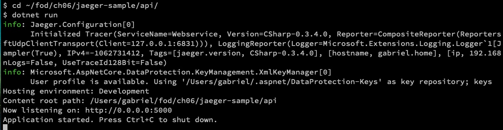

启动 Jaeger 示例的 API 组件

1.  现在打开一个新的终端窗口，导航到 `client` 子文件夹，然后运行应用程序：

```
$ cd ~/fod/ch06/jaeger-sample/client
 $ dotnet run Gabriel Bonjour
```

请注意，我传递的两个参数——`Gabriel` 和 `Bonjour`——分别对应 `<name>` 和 `<greeting>`。您应该看到类似以下内容：

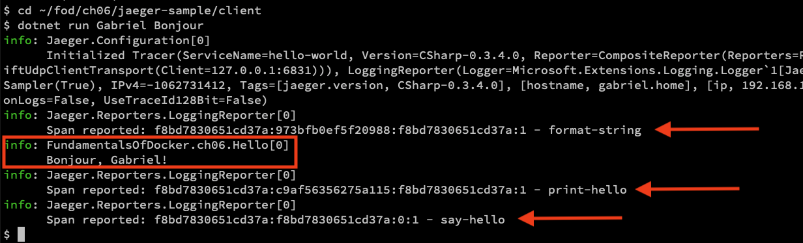

运行 Jaeger 示例应用程序的客户端组件

在前面的输出中，您可以看到三个用红色箭头标记的跨度，从最内部的跨度到最外部的跨度。我们还可以使用 Jaeger 的图形界面查看更多详细信息：

1.  在您的浏览器中，导航到 `http://localhost:16686` 以访问 Jaeger UI。

1.  在搜索面板中，确保选择了 `hello-world` 服务。将操作设置为 `all`，然后点击查找跟踪按钮。您应该会看到以下内容：

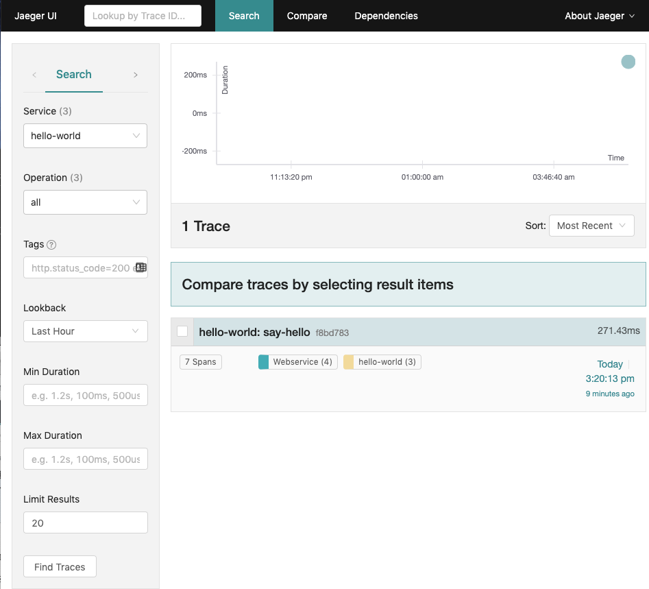

Jaeger UI 的搜索视图

1.  现在点击（唯一的）条目 `hello-world: say-hello` 查看该请求的详细信息：

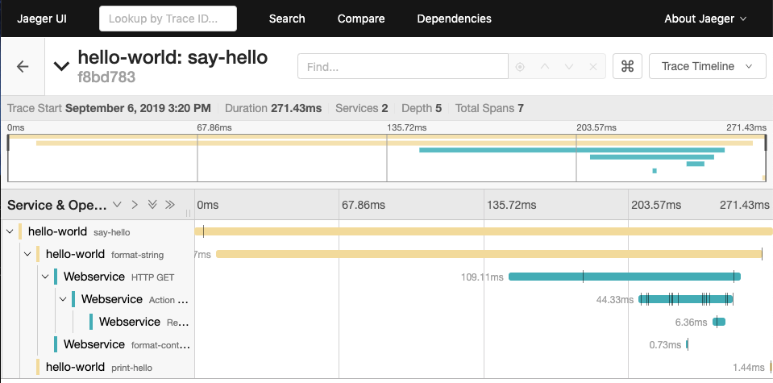

Jaeger 报告的请求详细信息

在前面的截图中，我们可以看到请求是如何从 `hello-world` 组件中的 `say-hello` 方法开始的，然后导航到同一组件中的 `format-string` 方法，接着调用 `Webservice` 中的一个端点，其逻辑由 `FormatController` 控制器实现。在每个步骤中，我们都能看到精确的时间以及其他有趣的信息。您可以在此视图中深入查看，了解更多细节。

在继续之前，您可能需要花点时间浏览一下我们刚刚用于此演示的 API 代码和 `client` 组件的代码。

1.  为了清理，停止 Jaeger 服务器容器：

```
$ docker container rm -f jaeger
```

同时停止 API，使用 *Ctrl* + *C*。

# 总结

在本章中，我们学习了如何调试在容器内运行的 Node.js、Python、Java 和 .NET 代码。我们首先通过将源代码从宿主机挂载到容器中，以避免每次代码更改时都重新构建容器镜像。接着，我们通过启用代码变更时容器内应用程序的自动重启，进一步优化了开发流程。然后，我们学习了如何配置 Visual Studio Code，使其能够启用容器内代码的完整交互式调试。最后，我们学习了如何为我们的应用程序添加监控，使其生成日志信息，帮助我们在生产环境中进行故障排查和根因分析。

在下一章，我们将展示如何使用 Docker 容器来大幅提升你的自动化流程，从在容器中运行简单的自动化任务，到使用容器构建 CI/CD 管道。

# 问题

请尝试回答以下问题，以评估你的学习进度：

1.  请列举两种方法，它们可以帮助减少使用容器所引入的开发过程中的摩擦。

1.  如何实现容器内代码的实时更新？

1.  你何时以及为什么会使用逐行调试容器内运行的代码？

1.  为什么为代码添加良好的调试信息至关重要？

# 进一步阅读

+   使用 Docker 进行实时调试：[`www.docker.com/blog/live-debugging-docker/`](https://www.docker.com/blog/live-debugging-docker/)

+   在本地 Docker 容器中调试应用程序：[`docs.microsoft.com/en-us/visualstudio/containers/edit-and-refresh?view=vs-2019`](https://docs.microsoft.com/en-us/visualstudio/containers/edit-and-refresh?view=vs-2019)

+   使用 IntelliJ IDEA 在 Docker 中调试 Java 应用程序：*[`blog.jetbrains.com/idea/2019/04/debug-your-java-applications-in-docker-using-intellij-idea/`](https://blog.jetbrains.com/idea/2019/04/debug-your-java-applications-in-docker-using-intellij-idea/)*
