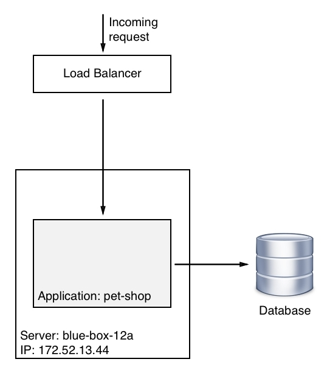
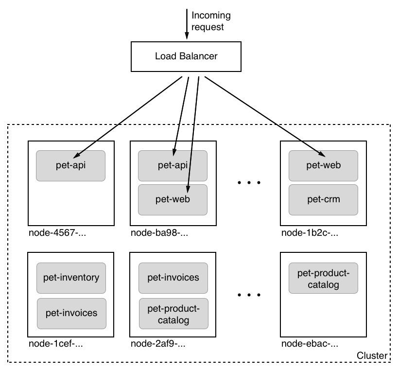
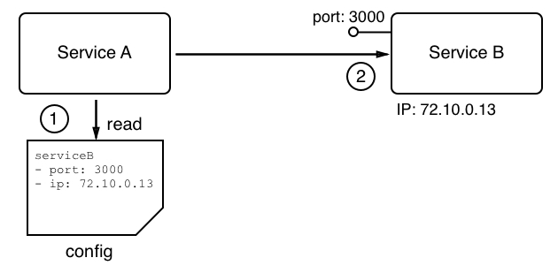
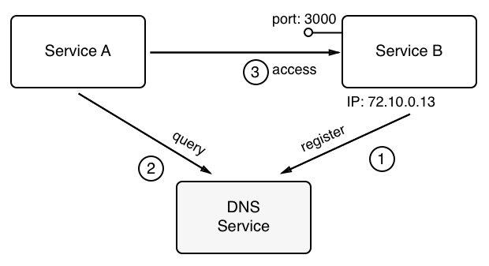
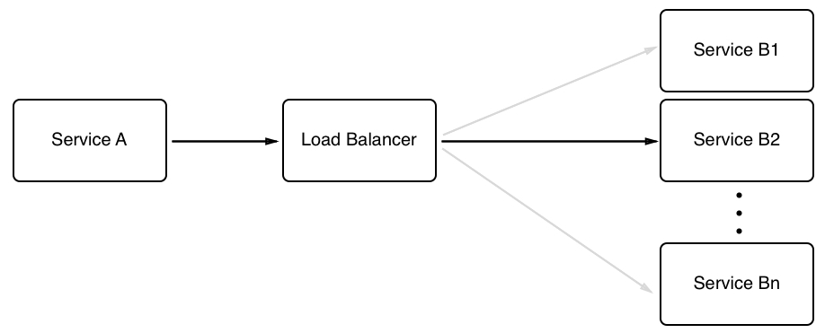
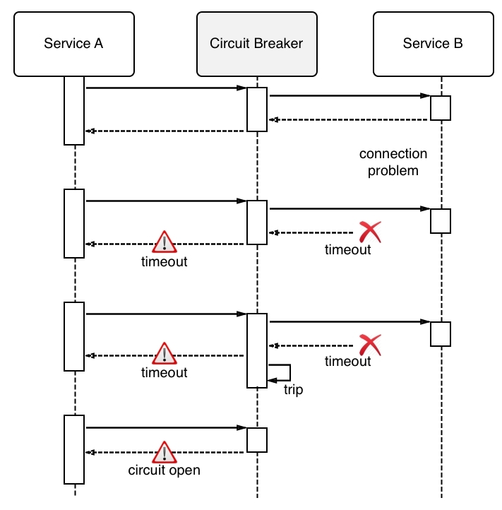
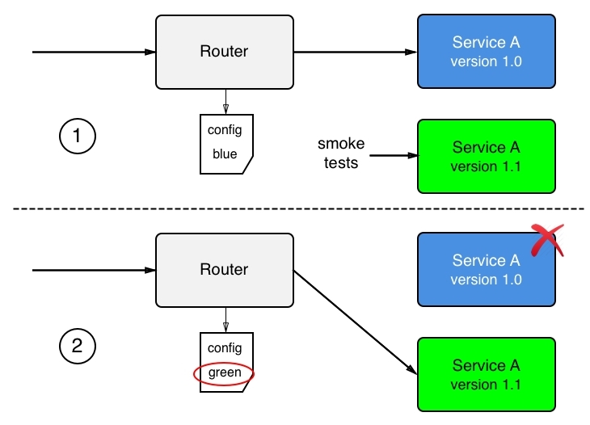
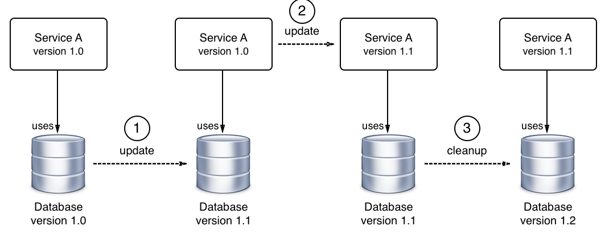

# 分布式应用架构

在上一章中，我们讨论了在将复杂的分布式应用容器化时，或在使用 Docker 自动化复杂任务时，如何利用一些高级技巧、窍门和概念。

在本章中，我们将介绍分布式应用架构的概念，并讨论成功运行分布式应用所需的各种模式和最佳实践。最后，我们将讨论在生产环境中运行这种应用程序所需满足的额外要求。

在本章中，我们将讨论以下主题：

+   理解分布式应用架构

+   模式和最佳实践

+   在生产环境中运行

完成本章后，你将能够完成以下任务：

+   至少列出分布式应用架构的四个特征

+   列出实现生产就绪的分布式应用所需的三到四个模式

# 理解分布式应用架构

在本节中，我们将解释当我们谈到分布式应用架构时，究竟指的是什么。首先，我们需要确保我们使用的所有词汇或缩写都有明确的定义，并且我们在讨论时使用的是相同的语言。

# 定义术语

在本章以及后续章节中，我们将讨论许多可能对每个人来说都不太熟悉的概念。为了确保大家都在使用相同的术语，接下来我们将简要介绍并解释这些概念或词汇中最重要的部分：

| **术语** | **解释** |
| --- | --- |
| 虚拟机（VM） | 虚拟机的缩写。它是一个虚拟计算机。 |
| 节点 | 用于运行应用程序的独立服务器。这可以是物理服务器，通常称为裸金属服务器，或是虚拟机（VM）。它可以是大型机、超级计算机、标准商业服务器，甚至是树莓派。节点可以是公司自有数据中心中的计算机，也可以是云中的计算机。通常，节点是集群的一部分。 |
| 集群 | 通过网络连接的一组节点，用于运行分布式应用程序。 |
| 网络 | 集群中各节点及其运行的程序之间的物理和软件定义的通信路径。 |
| 端口 | 应用程序（如 Web 服务器）监听传入请求的通道。 |
| 服务 | 这个词不幸地有很多含义，它的真正意义取决于使用的上下文。如果我们在应用程序的上下文中使用“服务”一词，比如应用服务，它通常指的是一段实现有限功能的软件，其他部分的应用程序会使用这些功能。随着本书的深入，我们还将讨论其他类型的服务，它们有着稍微不同的定义。 |

简单来说，分布式应用架构可以被看作是与单体应用架构的对立面，但从某种角度看，先理解这种单体架构并不无道理。传统上，大多数商业应用都是以一种方式编写的，可以看作是一个单一、紧密耦合的程序，运行在数据中心某个命名的服务器上。所有的代码被编译成一个单一的二进制文件或几个紧密耦合的二进制文件，运行该应用时需要将这些文件共同放置。此时，应用运行所在的服务器，或更一般的主机，有一个明确的名称或静态 IP 地址，也是非常重要的。让我们看看以下图示，更清晰地说明这种应用架构：

单体应用架构

在前面的图示中，我们可以看到一台名为`blue-box-12a`的**服务器**，其**IP**地址为`172.52.13.44`，正在运行一个名为`pet-shop`的应用程序，这个应用是一个由主模块和几个紧密耦合的库组成的单体应用。

现在，让我们看看下面的图示：

分布式应用架构

在这里，突然之间，我们不再只有一台命名的服务器；相反，我们有很多台服务器，它们没有人类友好的名称，而是一些类似于**通用唯一标识符**（**UUID**）这样的独特 ID。宠物商店应用程序也突然不再是一个单一的单体块，而是由许多交互的、但松散耦合的服务组成，如**pet-api**、**pet-web**和**pet-inventory**。此外，每个服务在这群服务器或主机的集群中运行多个实例。

你可能会想知道，为什么我们要在一本关于 Docker 容器的书中讨论这个问题，你问得很对。虽然我们要探讨的所有主题同样适用于没有（还没有）容器的世界，但必须意识到，容器和容器编排引擎在更高效、直接的方式上解决了所有这些问题。在分布式应用架构中曾经非常难以解决的大部分问题，在容器化的世界中变得相当简单。

# 模式和最佳实践

分布式应用架构有许多引人注目的优势，但与单体应用架构相比，它也有一个非常显著的缺点——前者的复杂度要高得多。为了控制这种复杂性，业界提出了一些重要的最佳实践和模式。在接下来的章节中，我们将更详细地探讨其中一些最重要的内容。

# 松散耦合的组件

解决复杂问题的最佳方式一直是将其分解为更小、更易管理的子问题。例如，如果一次性建造一座房子，那将是疯狂复杂的。通过将房子从简单的部分开始构建，然后将这些部分组合成最终结果，会容易得多。

同样的道理也适用于软件开发。如果我们将一个非常复杂的应用分解为几个互相协作并构成整体应用的小组件，开发这些组件将会容易得多。如果这些组件之间的耦合较松散，那么开发它们将更加容易。也就是说，组件 A 不需要假设组件 B 和 C 的内部工作原理，只关心如何通过定义良好的接口与这两个组件进行通信。

如果每个组件都有一个定义良好且简单的公共接口，通过这个接口可以与系统中的其他组件及外部世界进行通信，那么这将使我们能够独立地开发每个组件，而不依赖于其他组件。在开发过程中，系统中的其他组件可以轻松地被存根或模拟对象替代，从而使我们能够测试我们的组件。

# 有状态与无状态

每个有意义的业务应用都会创建、修改或使用数据。在信息技术领域，数据的同义词是*状态*。创建或修改持久数据的应用服务被称为有状态组件。典型的有状态组件包括数据库服务或创建文件的服务。另一方面，不创建或修改持久数据的应用组件被称为无状态组件。

在分布式应用架构中，无状态组件比有状态组件更容易处理。无状态组件可以轻松地扩展或收缩。此外，它们可以快速且无痛地被销毁并在集群的完全不同节点上重启——这一切都因为它们没有与之相关的持久数据。

鉴于这一点，设计系统时，尽可能让大部分应用服务保持无状态是非常有帮助的。最好将所有有状态组件推到应用的边界，并限制其数量。管理有状态组件是非常困难的。

# 服务发现

随着我们构建由许多独立组件或服务组成的应用，这些组件或服务之间需要相互通信，我们需要一种机制，使得这些独立组件能够在集群中相互发现。相互发现通常意味着你需要知道目标组件在哪个节点上运行，以及它在哪个端口监听通信。通常，节点是通过 IP 地址和端口来标识的，而端口只是一个在定义良好的范围内的数字。

从技术上讲，我们可以告诉**服务 A**，它需要与目标**服务 B**通信，目标的**IP**地址和**端口**号是什么。这可以通过配置文件中的条目来实现，例如：

组件是硬连接的

虽然这种方式在单体应用程序（它运行在一个或只有几个知名且经过精心管理的服务器上）的背景下可能效果很好，但在分布式应用架构中完全行不通。首先，在这种场景下，我们有许多组件，手动跟踪它们将变得非常困难。这显然是不可扩展的。此外，**服务 A**通常不应该，也永远不会知道集群中其他组件在哪个节点上运行。由于应用程序外部的各种原因，组件 B 的位置可能并不稳定，可能会从节点 X 移动到节点 Y。因此，我们需要另一种方法，允许**服务 A**定位**服务 B**，或任何其他服务。最常用的方法是使用一个外部权限服务，它可以随时了解系统的拓扑结构。

这个外部权限或服务知道当前属于集群的所有节点及其 IP 地址；它知道所有正在运行的服务及其所在位置。通常，这类服务被称为**DNS 服务**，其中**DNS**代表**域名系统**。正如我们将看到的，Docker 在其底层引擎中实现了一个 DNS 服务。Kubernetes —— 我们将在第十二章《编排器》中讨论的第一大容器编排系统 —— 也使用**DNS 服务**来促进集群中运行的组件之间的通信：

组件查询外部定位服务

在前面的图示中，我们可以看到**服务 A**想要与**服务 B**通信，但不能直接进行。首先，它必须查询外部权限服务，一个注册服务（这里称为**DNS 服务**），以获取**服务 B**的位置。注册服务会返回所请求的信息，并提供**服务 A**可以用来联系**服务 B**的 IP 地址和端口号。然后，**服务 A**使用这些信息并与**服务 B**建立通信。当然，这只是低层次上实际发生情况的一个简单示意图，但它是帮助我们理解服务发现架构模式的一个很好的图示。

# 路由

路由是将数据包从源组件发送到目标组件的机制。路由被分为不同的类型。所谓的 OSI 模型（更多信息请参见本章的*进一步阅读*部分）用于区分不同类型的路由。在容器和容器编排的上下文中，2、3、4、7 层的路由是相关的。我们将在后续章节中深入讨论路由。这里，我们先简单说一下，2 层路由是最底层的路由类型，它将一个 MAC 地址连接到另一个 MAC 地址，而 7 层路由，也叫做应用层路由，是最顶层的路由类型。后者例如用于将带有目标标识符的请求（即一个 URL，如[`acme.com/pets`](https://acme.com/pets)）路由到我们系统中的适当目标组件。

# 负载均衡

负载均衡用于当**服务 A**需要与**服务 B**进行通信时，例如在请求-响应模式中，但**服务 B**有多个实例运行，如下图所示：

服务 A 的请求被负载均衡到服务 B

如果我们在系统中运行多个服务实例，比如**服务 B**，我们希望确保每个实例都能分配到相等的工作负载。这是一个通用任务，这意味着我们不希望调用者来执行负载均衡，而是一个外部服务来拦截请求并负责决定将请求转发到哪个目标服务实例。这个外部服务被称为负载均衡器。负载均衡器可以使用不同的算法来决定如何将传入的请求分发到目标服务实例。最常用的算法是轮询算法。这个算法以重复的方式分配请求，从实例 1 开始，然后是实例 2，直到实例 n。服务完最后一个实例后，负载均衡器会从实例 1 重新开始。

在前面的例子中，**负载** **均衡器** 还促进了高可用性，因为来自**服务 A**的请求将被转发到健康的**服务 B**实例。**负载均衡器**还承担定期检查每个 B 实例健康状况的角色。

# 防御性编程

在为分布式应用程序开发服务时，重要的是要记住，服务不会是独立的，它依赖于其他应用服务，甚至是第三方提供的外部服务，例如信用卡验证服务或股票信息服务，仅举两个例子。所有这些其他服务都是外部服务，我们无法控制它们的正确性或在任何给定时间的可用性。因此，在编码时，我们总是需要假设最坏的情况并希望最好的情况发生。假设最坏意味着我们必须明确处理潜在的故障。

# 重试

当存在外部服务可能暂时不可用或响应不及时的情况时，可以采用以下步骤。当调用其他服务失败或超时时，调用代码应按如下方式构建：在短暂等待后重复相同的调用。如果调用再次失败，等待时间应稍长一点再进行下一次尝试。调用应重复进行，直到达到最大重试次数，每次增加等待时间。之后，服务应放弃并提供降级服务，这可能意味着返回一些陈旧的缓存数据或根本不返回数据，具体取决于情况。

# 日志记录

在服务上执行的重要操作应该**始终**进行日志记录。日志信息需要进行分类，才能具有实际价值。常见的分类包括调试、信息、警告、错误和致命。日志信息应该由中央日志聚合服务收集，而不是存储在集群的单个节点上。聚合日志易于解析和筛选出相关信息。这些信息对于快速定位分布式系统中故障或意外行为的根本原因至关重要，特别是在生产环境中，系统包含许多动态组件。

# 错误处理

如前所述，分布式应用中的每个应用服务都依赖于其他服务。作为开发人员，我们应该始终预期最坏的情况并采取适当的错误处理措施。最重要的最佳实践之一是快速失败。编写服务代码时，要确保不可恢复的错误尽早被发现，如果检测到此类错误，应立即让服务失败。但不要忘记将有意义的信息记录到`STDERR`或`STDOUT`，供开发人员或系统操作员稍后跟踪系统故障。同时，返回一个有帮助的错误信息给调用者，尽可能精确地指明调用失败的原因。

失败快速处理的一个示例是始终检查调用方提供的输入值。值是否在预期的范围内且完整？如果不是，则不要继续处理，而是立即中止操作。

# 冗余

一个关键任务系统必须随时可用，全天候、全年无休。停机是不可接受的，因为它可能导致公司失去大量的机会或声誉。在一个高度分布式的应用中，至少一个组件发生故障的可能性是不可忽视的。我们可以说，问题不是某个组件是否会失败，而是失败何时发生。

为了避免在系统中众多组件之一发生故障时造成停机，每个系统的独立部分都需要是冗余的。这包括应用组件以及所有基础设施部分。这意味着，如果我们以支付服务为例作为应用的一部分，那么我们需要对这个服务进行冗余部署。最简单的方式就是在我们集群的不同节点上运行该服务的多个实例。同样，边缘路由器或负载均衡器也适用这种方式。我们不能允许这些组件发生故障。因此，路由器或负载均衡器必须是冗余的。

# 健康检查

我们已经多次提到，在一个分布式应用架构中，由于其组成部分众多，单个组件的故障是高度可能的，且只不过是时间问题。因此，我们对系统中的每个组件都进行了冗余部署。代理服务随后将流量均衡地分配到服务的各个实例上。

但现在，出现了另一个问题。代理或路由器如何知道某个服务实例是否可用？它可能已经崩溃，或者可能没有响应。为了解决这个问题，我们可以使用所谓的健康检查。代理，或代理代表的其他系统服务，定期轮询所有服务实例并检查它们的健康状况。基本的问题是，你还在吗？你健康吗？每个服务的答案要么是“是”，要么是“否”，如果实例不再响应，则健康检查超时。

如果组件的回答是“否”或发生超时，则系统会终止相应的实例并启动一个新的实例来替代它。如果这一切都是完全自动化完成的，那么我们可以说我们已经建立了一个自愈系统。

代理定期轮询组件状态的方式，也可以反过来进行。可以要求组件定期向代理发送存活信号。如果组件未能在预定义的较长时间内发送存活信号，则认为该组件不健康或已死。

在某些情况下，以上两种方式中的任意一种更为适用。

# 断路器模式

熔断器是一种机制，用于防止分布式应用程序因许多关键组件的级联故障而崩溃。熔断器有助于避免一个故障的组件通过连锁反应破坏其他依赖服务。就像电力系统中的熔断器，通过中断电力线路来保护房屋免受损坏，防止故障的电器引发火灾，分布式应用程序中的熔断器也会在**服务 A**到**服务 B**的连接中断时工作，如果**服务 B**没有响应或发生故障。

这可以通过将受保护的服务调用包装在熔断器对象中来实现。该对象监控失败。一旦失败次数达到一定阈值，熔断器就会触发。所有后续对熔断器的调用都会返回错误，而不会执行受保护的调用：

熔断器模式

在前面的图示中，我们看到一个熔断器，在调用**服务 B**时收到第二个超时后触发。

# 运行在生产环境中

为了成功地在生产环境中运行分布式应用程序，我们需要考虑一些超出前述最佳实践和模式的其他方面。一个特别值得注意的领域是自省和监控。让我们详细讨论最重要的方面。

# 日志记录

一旦分布式应用程序进入生产环境，就无法进行实时调试。那么我们该如何找出应用程序故障的根本原因呢？解决这个问题的方法是让应用程序在运行时生成大量有意义的日志信息。开发者需要对他们的应用服务进行必要的操作，使其输出有用的信息，比如在出现错误或遇到潜在的意外或不希望发生的情况时。通常，这些信息会输出到`STDOUT`和`STDERR`，然后被系统守护进程收集，并写入本地文件或转发到中央日志聚合服务。

如果日志中有足够的信息，开发者可以利用这些日志来追踪系统中错误的根本原因。

在分布式应用架构中，由于其众多组件，日志记录比单体应用中更为重要。单个请求通过应用的所有组件的执行路径可能非常复杂。此外，请记住，组件是分布在多个节点上的。因此，记录所有重要的内容是有意义的，并且在每个日志条目中添加诸如发生的确切时间、发生的组件和运行该组件的节点等信息，仅举几例。此外，日志信息应汇总在一个中央位置，以便开发人员和系统运维人员可以方便地进行分析。

# 跟踪

跟踪用于找出单个请求如何通过分布式应用程序流转，以及该请求在每个组件和整体上花费了多少时间。如果收集到这些信息，它可以作为显示系统行为和健康状况的仪表盘数据来源之一。

# 监控

运维工程师喜欢查看显示系统关键指标的仪表盘，这些仪表盘可以让他们一眼看到应用程序的整体健康状况。这些指标可以是非功能性的，如内存和 CPU 使用情况、系统或应用组件的崩溃次数、节点的健康状况，也可以是功能性的，因而是特定于应用的指标，例如订购系统中的结账次数或库存服务中缺货的商品数量。

最常见的情况是，用于聚合显示仪表盘数据的基础数据来自日志信息。这可以是系统日志，主要用于非功能性度量，或是应用级日志，用于功能性度量。

# 应用更新

公司的一项竞争优势是能够及时应对市场变化。部分原因是能够快速调整应用程序以满足新的或变化的需求，或者增加新功能。我们更新应用程序的速度越快越好。现在，许多公司每天会推出多次新的或更改的功能。

由于应用更新非常频繁，这些更新必须是非中断性的。我们不能允许系统在升级时停机进行维护。所有更新必须无缝且透明地进行。

# 滚动更新

更新应用程序或应用服务的一种方式是使用滚动更新。这里的假设是，必须更新的特定软件在多个实例中运行。只有在这种情况下，我们才能使用这种更新方式。

发生的情况是，系统停止当前服务的一个实例，并用新服务的实例替代它。一旦新实例准备好，它就会开始处理流量。通常，新实例会被监控一段时间，以确认它是否按预期工作。如果一切正常，接下来当前服务的另一个实例会被下线，并用新实例替代。这个模式会重复，直到所有服务实例都被替换为止。

由于在任何时候总会有一些实例在运行，无论是当前版本还是新版本，应用始终处于可操作状态。无需停机时间。

# 蓝绿部署

在蓝绿部署中，当前版本的应用服务，称为**蓝色**，处理所有的应用流量。然后，我们将在生产系统上安装新版本的应用服务，称为**绿色**。新服务尚未与其他应用连接。

一旦**绿色**服务安装完成，我们就可以对新服务执行**冒烟测试**，如果测试成功，路由器可以配置为将所有原本流向**蓝色**服务的流量引导到新服务**绿色**。接着，密切观察**绿色**的表现，如果所有成功标准都满足，就可以停用**蓝色**服务。但如果由于某种原因，**绿色**出现了意外或不希望出现的行为，路由器可以重新配置，将所有流量返回到蓝色服务。然后，绿色服务可以被移除并修复，之后可以执行一个新的蓝绿部署，使用修正过的版本。

蓝绿部署

接下来，我们来看一下金丝雀发布。

# 金丝雀发布

金丝雀发布是指我们在系统中并行安装当前版本和新版本的应用服务。因此，它们类似于蓝绿部署。一开始，所有流量仍然通过当前版本进行路由。然后，我们配置一个路由器，将整体流量的一小部分，例如 1%，引导到新版本的应用服务。随后，密切监控新服务的行为，看看它是否按预期工作。如果所有成功标准都达成，路由器就会配置为将更多流量（比如这次是 5%）引导到新服务。同样，新服务的行为会被密切监控，如果它成功，更多流量会被引导到它，直到 100%流量都转到新服务。当所有流量都已切换到新服务且运行稳定一段时间后，旧版本的服务就可以停用。

为什么我们称之为金丝雀发布？它得名于煤矿工人，他们曾用金丝雀鸟作为矿井中的早期预警系统。金丝雀鸟对有毒气体特别敏感，如果金丝雀鸟死了，矿工们就知道必须立即撤离矿井。

# 不可逆的数据变更

如果我们的更新过程需要在状态中执行不可逆的更改，例如在后端关系型数据库中执行不可逆的模式更改，那么我们需要特别小心地处理此问题。如果我们采用正确的方法，实际上可以在不造成停机的情况下执行这些更改。需要认识到，在这种情况下，我们无法同时部署需要新数据结构的数据存储代码更改和数据更改。相反，整个更新必须分为三个独立的步骤。在第一步中，我们发布向后兼容的模式和数据更改。如果这一步成功，接下来我们在第二步中发布新代码。同样，如果第二步成功，我们在第三步中清理模式并移除向后兼容性：

发布不可逆的数据或模式更改

上述图示展示了数据及其结构如何更新，然后应用代码如何更新，最后在第三步中，数据和数据结构如何被清理。

# 回滚

如果我们有频繁的更新应用服务并且这些服务在生产环境中运行，迟早其中一次更新会出现问题。也许某个开发人员在修复一个 bug 时引入了新的 bug，而这个 bug 没有被所有自动化测试，甚至手动测试捕捉到，导致应用程序出现异常行为，这时我们就必须将服务回滚到之前的正常版本。在这种情况下，回滚就是一种灾难恢复。

再次强调，在分布式应用架构中，问题不在于是否会需要回滚，而是回滚何时发生。因此，我们必须确保可以随时回滚到任何构成我们应用程序的服务的先前版本。回滚不能是事后考虑的事情；它们必须是经过测试并且已验证的部署流程的一部分。

如果我们使用蓝绿部署来更新服务，那么回滚应该相对简单。我们只需要将路由器从新的绿色版本切换回先前的蓝色版本。

# 总结

在本章中，我们了解了什么是分布式应用架构，以及哪些模式和最佳实践对成功运行分布式应用有帮助或是必需的。最后，我们讨论了运行此类应用程序在生产环境中还需要哪些其他内容。

在下一章中，我们将深入讨论限制在单一主机上的网络。我们将讨论如何让同一主机上的容器之间互相通信，以及如果需要，外部客户端如何访问容器化的应用程序。

# 问题

请回答以下问题，以评估你对本章内容的理解：

1.  在分布式应用架构中，为什么每个部分都必须是冗余的？请简短回答。

1.  为什么我们需要 DNS 服务？请用三到五句话解释。

1.  什么是断路器及其必要性？

1.  单体应用与分布式或多服务应用之间的一些重要区别是什么？

1.  什么是蓝绿部署？

# 进一步阅读

下面的文章提供了本章内容的更深入信息

+   断路器：[`bit.ly/1NU1sgW`](https://bit.ly/2pBENyP)

+   OSI 模型解析：[`bit.ly/1UCcvMt`](https://bit.ly/2BIRpJY)

+   蓝绿部署：[`bit.ly/2r2IxNJ`](http://bit.ly/2r2IxNJ)
