# 单主机网络

在上一章中，我们学习了分布式应用架构中最重要的架构模式和最佳实践。

本章将介绍 Docker 容器网络模型及其在单主机上的实现，具体表现为桥接网络。本章还介绍了软件定义网络的概念，以及它们如何用于保护容器化应用程序。此外，我们还将演示如何将容器端口开放给外部，从而使容器化组件可以访问外部世界。最后，我们将介绍 Traefik，这是一个反向代理，可以用于在容器之间启用复杂的 HTTP 应用程序级路由。

本章涵盖以下主题：

+   解剖容器网络模型

+   网络防火墙

+   使用桥接网络

+   主机和空网络

+   在现有网络命名空间中运行

+   管理容器端口

+   使用反向代理进行 HTTP 层路由

完成本章后，您将能够完成以下任务：

+   创建、检查和删除自定义桥接网络

+   运行附加到自定义桥接网络的容器

+   通过将容器运行在不同的桥接网络上来隔离容器

+   将容器端口发布到您选择的主机端口

+   添加 Traefik 作为反向代理以启用应用程序级路由

# 技术要求

对于本章，您唯一需要的就是能够运行 Linux 容器的 Docker 主机。您可以使用安装了 Docker for macOS 或 Windows 的笔记本电脑，或者安装了 Docker Toolbox。

# 解剖容器网络模型

到目前为止，我们主要处理的是单个容器。但实际上，一个容器化的业务应用程序由多个容器组成，它们需要协作才能实现目标。因此，我们需要一种方法让单个容器能够相互通信。这是通过建立路径来实现的，这些路径允许我们在容器之间来回发送数据包。这些路径被称为**网络**。Docker 定义了一个非常简单的网络模型，即所谓的**容器网络模型**（**CNM**），用于指定任何实现容器网络的软件必须满足的要求。以下是 CNM 的图示：

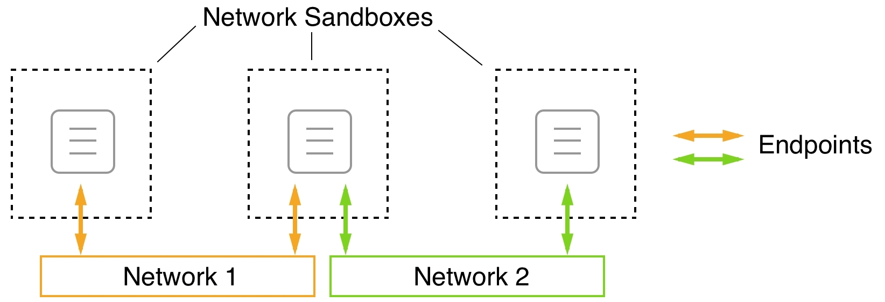

Docker CNM

CNM 包含三个元素——沙箱、端点和网络：

+   **沙箱：** 沙箱完美地将容器与外部世界隔离。禁止任何入站网络连接进入沙箱容器。但如果容器与外界完全无法通信，它在系统中的价值是非常有限的。为了解决这个问题，我们引入了第二个元素——端点。

+   **端点：** 端点是一个受控的网关，用于将外部世界连接到网络沙箱，从而保护容器。端点将网络沙箱（而非容器）与模型的第三个元素——网络连接起来。

+   **网络：** 网络是数据包传输的路径，负责将通信实例的数据包从端点传输到端点，最终从一个容器传输到另一个容器。

需要注意的是，网络沙箱可以有零到多个端点，或者换句话说，生活在网络沙箱中的每个容器可以**既**不连接任何网络，也可以同时连接多个不同的网络。在前面的图示中，三个 **网络沙箱** 中的中间一个通过 **端点** 同时连接了 **网络 1** 和 **网络 2**。

这个网络模型非常通用，并没有指定相互通信的容器到底在哪个位置运行。所有容器可以，例如，运行在同一个主机上（本地），或者分布在多个主机的集群中（全球）。

当然，CNM 只是描述容器间网络如何工作的模型。为了能够在我们的容器中使用网络，我们需要 CNM 的实际实现。对于本地和全球范围，我们有多个 CNM 的实现。下表中，我们简要概述了现有的实现及其主要特点。该列表没有特定顺序：

| **网络** | **公司** | **范围** | **描述** |
| --- | --- | --- | --- |
| 桥接 | Docker | 本地 | 基于 Linux 桥接的简单网络，允许在单一主机上进行网络通信 |
| Macvlan | Docker | 本地 | 在单个物理主机接口上配置多个第二层（即 MAC）地址 |
| Overlay | Docker | 全球 | 基于 **虚拟扩展局域网** (**VXLan**) 的多节点容器网络 |
| Weave Net | Weaveworks | 全球 | 简单、弹性、多主机 Docker 网络 |
| Contiv Network Plugin | Cisco | 全球 | 开源容器网络 |

所有不是由 Docker 直接提供的网络类型都可以作为插件添加到 Docker 主机中。

# 网络防火墙

Docker 一直秉持“安全第一”的理念。这一哲学直接影响了单主机和多主机 Docker 环境中网络的设计和实现。软件定义的网络既易于创建，又成本低廉，但它们完美地为附加到该网络上的容器与其他非附加容器以及外部世界之间设置了防火墙。所有属于同一网络的容器可以自由通信，而其他容器则无法做到这一点。

在下图中，我们有两个网络，分别叫做 **front** 和 **back**。**c1** 和 **c2** 容器附加到前端网络，**c3** 和 **c4** 容器附加到后端网络。**c1** 和 **c2** 可以自由地互相通信，**c3** 和 **c4** 也是如此。但 **c1** 和 **c2** 不能与 **c3** 或 **c4** 通信，反之亦然：

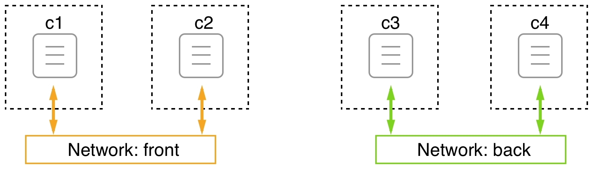

Docker 网络

现在，假设我们有一个由三个服务组成的应用程序：**webAPI**、**productCatalog** 和 **database**。我们希望 **webAPI** 能够与 **productCatalog** 通信，但不能与 **database** 通信，并且我们希望 **productCatalog** 能够与 **database** 服务进行通信。我们可以通过将 **webAPI** 和数据库放置在不同的网络上，并将 **productCatalog** 附加到这两个网络上来解决这个问题，如下图所示：

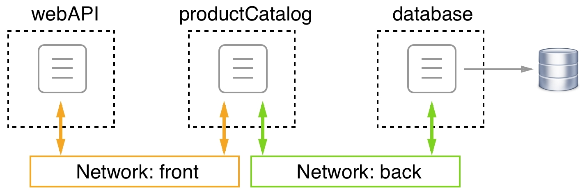

容器附加到多个网络

由于创建 SDN 网络的成本较低，并且每个网络通过将资源与未经授权的访问隔离来提供额外的安全性，因此强烈建议您设计和运行应用程序，使其使用多个网络，并且仅在需要互相通信的服务才运行在同一网络上。在前面的示例中，**webAPI** 组件根本不需要直接与 **database** 服务通信，因此我们将它们放在不同的网络上。如果最坏的情况发生，黑客入侵了 **webAPI**，他们也无法直接从那里访问 **database**，除非他们也侵入了 **productCatalog** 服务。

# 使用桥接网络

Docker 桥接网络是我们将要详细了解的容器网络模型的**第一种**实现。该网络实现基于 Linux 桥接。当 Docker 守护进程首次运行时，它会创建一个 Linux 桥接并将其命名为 `docker0`。这是默认行为，可以通过更改配置进行更改。Docker 然后创建一个使用这个 Linux 桥接的网络，并将网络命名为 `bridge`。所有在 Docker 主机上创建的容器，如果我们没有显式绑定到另一个网络，将自动附加到这个桥接网络。

为了验证我们确实在主机上定义了一个名为 `bridge` 的 `bridge` 类型的网络，我们可以使用以下命令列出主机上的所有网络：

```
$ docker network ls
```

这应该会输出类似以下内容的结果：

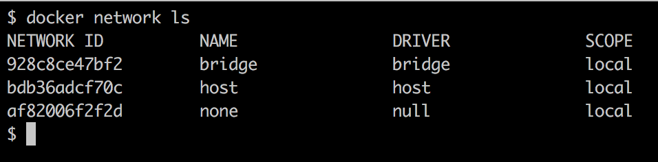

列出默认可用的所有 Docker 网络

在你的情况下，ID 会不同，但输出的其余部分应该是相同的。我们确实有一个名为`bridge`的网络，使用`bridge`驱动程序。`local`范围意味着这种类型的网络仅限于单一主机，无法跨多个主机。在第十三章《Docker Swarm 简介》中，我们还将讨论具有全局范围的其他网络类型，这些网络可以跨整个主机集群。

现在，让我们深入了解一下这个`bridge`网络的详细情况。为此，我们将使用 Docker 的`inspect`命令：

```
$ docker network inspect bridge
```

执行时，这将输出关于相关网络的大量详细信息。该信息应该如下所示：

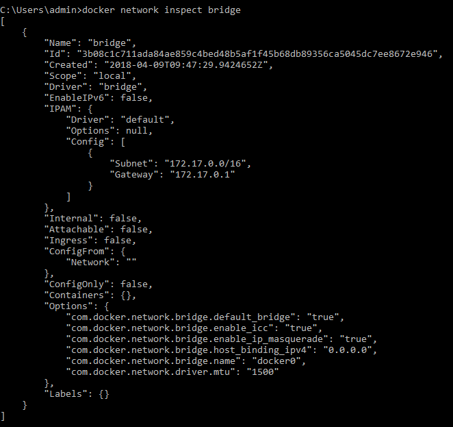

执行`inspect`命令后生成的输出

我们在列出所有网络时看到了`ID`、`Name`、`Driver`和`Scope`值，这些内容并不新鲜。但让我们来看看**IP 地址管理**（**IPAM**）模块。IPAM 是一种用于追踪计算机上使用的 IP 地址的软件。`IPAM`模块的重要部分是`Config`节点，其包含`Subnet`和`Gateway`的值。桥接网络的子网默认定义为`172.17.0.0/16`。这意味着，所有连接到此网络的容器都会从给定的地址范围内由 Docker 分配一个 IP 地址，范围为`172.17.0.2`到`172.17.255.255`。`172.17.0.1`地址被保留给该网络的路由器，在这种类型的网络中，Linux 桥接器承担了路由器的角色。我们可以预期，第一个由 Docker 连接到此网络的容器将获得`172.17.0.2`地址。所有后续容器将分配更高的地址；以下图示说明了这一点：

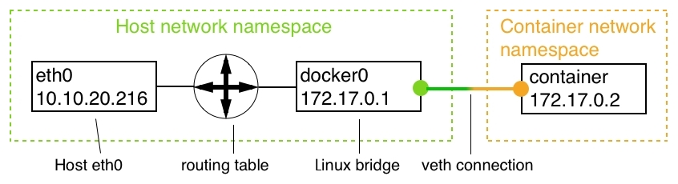

桥接网络

在上述图中，我们可以看到主机的网络命名空间，其中包括主机的**eth0**端点，如果 Docker 主机运行在裸机上，它通常是一个网络接口卡（NIC），如果 Docker 主机是虚拟机，则是一个虚拟 NIC。所有到主机的流量都通过**eth0**。**Linux**桥接器负责在主机网络和桥接网络的子网之间路由网络流量。

默认情况下，只允许出口流量，所有入口流量都被阻止。这意味着，虽然容器化应用可以访问互联网，但它们无法被外部流量访问。每个连接到网络的容器都会与桥接器建立自己的**虚拟以太网**（**veth**）连接。下图展示了这一过程：

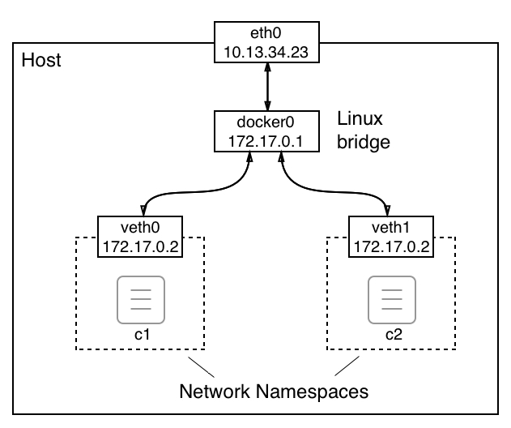

桥接网络的详细信息

上述图示展示了从**主机**的角度看这个世界。我们将在本节后面讨论从容器内部看这个情况。

我们不仅仅局限于`bridge`网络，因为 Docker 允许我们定义自己的自定义桥接网络。这不仅仅是一个“很好”用的功能，而是一个推荐的最佳实践——不要让所有容器都运行在同一个网络上。相反，我们应该使用额外的桥接网络来进一步隔离那些不需要相互通信的容器。要创建一个名为`sample-net`的自定义桥接网络，可以使用以下命令：

```
$ docker network create --driver bridge sample-net
```

如果我们这样做，就可以检查 Docker 为这个新的自定义网络创建了什么子网，如下所示：

```
$ docker network inspect sample-net | grep Subnet
```

这将返回以下值：

```
"Subnet": "172.18.0.0/16",
```

显然，Docker 刚刚将下一个可用的 IP 地址块分配给了我们新的自定义桥接网络。如果因为某些原因，我们希望在创建网络时指定自己的子网范围，可以通过使用`--subnet`参数来实现：

```
$ docker network create --driver bridge --subnet "10.1.0.0/16" test-net
```

为了避免因重复 IP 地址而产生冲突，请确保避免创建具有重叠子网的网络。

现在我们已经讨论了桥接网络是什么以及如何创建自定义桥接网络，我们希望了解如何将容器附加到这些网络。首先，让我们交互式地运行一个 Alpine 容器，而不指定要附加的网络：

```
$ docker container run --name c1 -it --rm alpine:latest /bin/sh
```

在另一个终端窗口中，我们来检查一下`c1`容器：

```
$ docker container inspect c1
```

在庞大的输出中，我们暂时集中注意力在提供网络相关信息的部分。这可以在`NetworkSettings`节点下找到。我已在以下输出中列出：

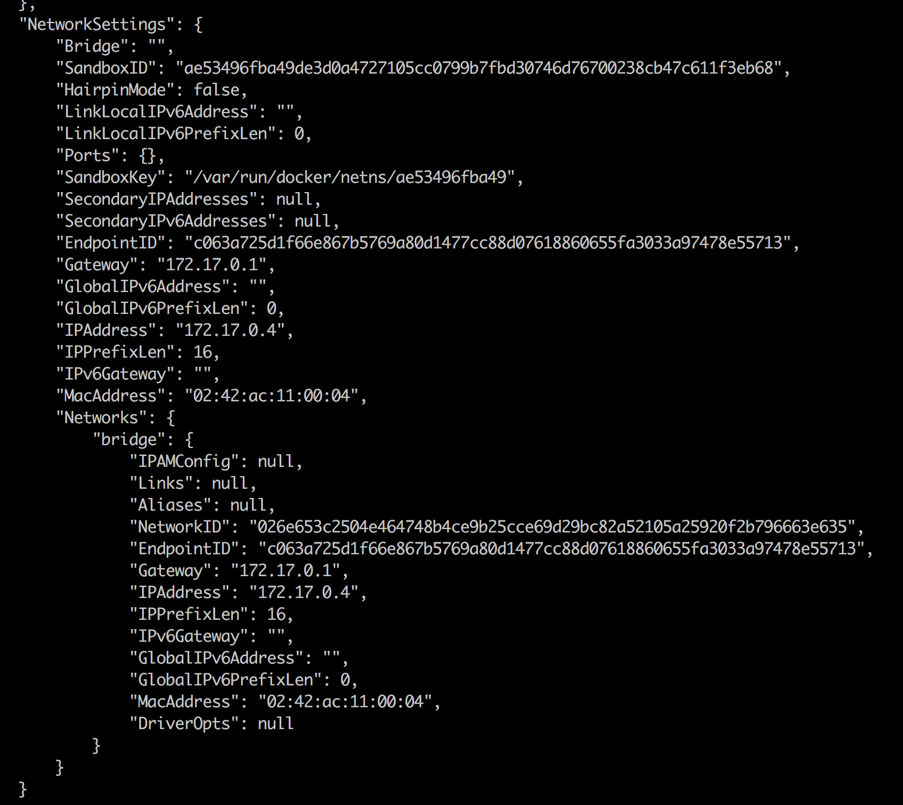

容器元数据的 NetworkSettings 部分

在前面的输出中，我们可以看到容器确实附加到了`bridge`网络，因为`NetworkID`等于`026e65...`，从前面的代码中可以看到，这是`bridge`网络的 ID。我们还可以看到，容器如预期地获得了`172.17.0.4`的 IP 地址，并且网关位于`172.17.0.1`。请注意，容器还关联了一个`MacAddress`。这很重要，因为 Linux 桥接使用`MacAddress`进行路由。

到目前为止，我们是从容器的网络命名空间外部来处理这个问题的。现在，让我们看看当我们不仅在容器内部，而且在容器的网络命名空间内部时，情况如何。在`c1`容器内，我们使用`ip`工具检查发生了什么。运行`ip addr`命令并观察生成的输出，如下所示：

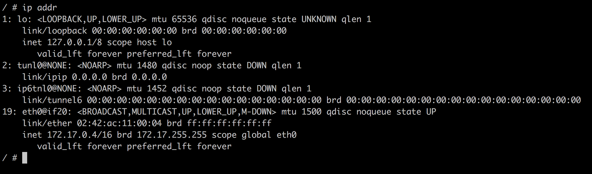

容器命名空间，正如通过 IP 工具所看到的那样

上述输出中有一个有趣的部分是数字`19`，即`eth0`端点。Linux 桥接在容器命名空间外创建的`veth0`端点映射到容器内的`eth0`。Docker 始终将容器网络命名空间的第一个端点映射为`eth0`，从命名空间内部可以看到这一点。如果网络命名空间附加到其他网络，则该端点将映射到`eth1`，以此类推。

由于此时我们并不关心除`eth0`以外的任何端点，我们本可以使用命令的更具体变体，这将为我们提供以下输出：

```
/ # ip addr show eth0
195: eth0@if196: <BROADCAST,MULTICAST,UP,LOWER_UP,M-DOWN> mtu 1500 qdisc noqueue state UP
 link/ether 02:42:ac:11:00:02 brd ff:ff:ff:ff:ff:ff
 inet 172.17.0.2/16 brd 172.17.255.255 scope global eth0
 valid_lft forever preferred_lft forever
```

在输出中，我们还可以看到 Docker 为该容器网络命名空间分配了什么 MAC 地址（`02:42:ac:11:00:02`）和 IP 地址（`172.17.0.2`）。

我们还可以通过使用`ip route`命令获取一些关于请求路由的信息：

```
/ # ip route
default via 172.17.0.1 dev eth0
172.17.0.0/16 dev eth0 scope link src 172.17.0.2
```

该输出告诉我们，所有到网关`172.17.0.1`的流量都通过`eth0`设备路由。

现在，让我们在同一网络上运行另一个名为`c2`的容器：

```
$ docker container run --name c2 -d alpine:latest ping 127.0.0.1
```

`c2`容器也将连接到`bridge`网络，因为我们没有指定其他网络。它的 IP 地址将是子网中下一个空闲的 IP，即`172.17.0.3`，我们可以通过以下测试来验证：

```
$ docker container inspect --format "{{.NetworkSettings.IPAddress}}" c2
172.17.0.3
```

现在，我们有两个容器连接到`bridge`网络。我们可以再次尝试检查此网络，以便在输出中找到连接到该网络的所有容器列表：

```
$ docker network inspect bridge
```

此信息可以在`Containers`节点下找到：

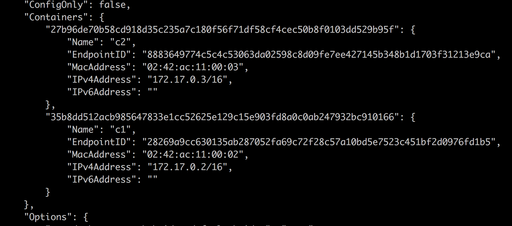

Docker 网络检查 bridge 命令的容器部分输出

再次为了可读性，我们已经缩短了输出，仅保留相关部分。

现在，我们创建两个附加到`test-net`的额外容器，`c3`和`c4`。为此，我们将使用`--network`参数：

```
$ docker container run --name c3 -d --network test-net \
 alpine:latest ping 127.0.0.1
$ docker container run --name c4 -d --network test-net \
 alpine:latest ping 127.0.0.1
```

让我们检查`network test-net`并确认容器`c3`和`c4`确实连接到了它：

```
$ docker network inspect test-net
```

这将为我们提供以下`Containers`部分的输出：

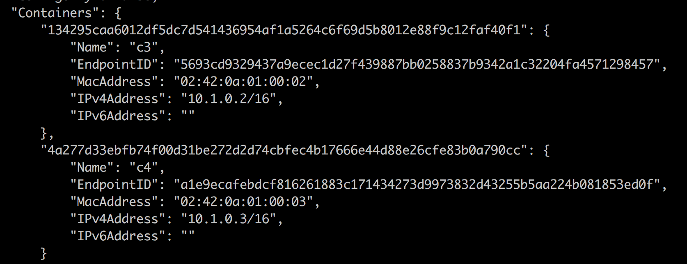

Docker 网络检查命令 test-net 中的容器部分

接下来我们要问自己的是，`c3`和`c4`容器是否可以自由通信。为了证明这一点，我们可以通过`exec`进入`c3`容器：

```
$ docker container exec -it c3 /bin/sh
```

一旦进入容器，我们可以尝试通过名称和 IP 地址 ping 容器`c4`：

```
/ # ping c4
PING c4 (10.1.0.3): 56 data bytes
64 bytes from 10.1.0.3: seq=0 ttl=64 time=0.192 ms
64 bytes from 10.1.0.3: seq=1 ttl=64 time=0.148 ms
...
```

以下是使用`c4`的 IP 地址进行 ping 的结果：

```
/ # ping 10.1.0.3
PING 10.1.0.3 (10.1.0.3): 56 data bytes
64 bytes from 10.1.0.3: seq=0 ttl=64 time=0.200 ms
64 bytes from 10.1.0.3: seq=1 ttl=64 time=0.172 ms
...
```

无论哪种情况，答案都向我们确认，连接到同一网络的容器之间的通信正在按预期工作。我们甚至能够使用容器名称进行连接，表明 Docker DNS 服务在此网络内提供的名称解析功能正常工作。

现在，我们希望确保`bridge`和`test-net`网络彼此隔离。为了演示这一点，我们可以尝试从`c3`容器 ping`c2`容器，可以通过容器的名称或 IP 地址：

```
/ # ping c2
ping: bad address 'c2'
```

以下是使用`c2`容器的 IP 地址进行 ping 操作的结果：

```
/ # ping 172.17.0.3
PING 172.17.0.3 (172.17.0.3): 56 data bytes 
^C
--- 172.17.0.3 ping statistics ---
43 packets transmitted, 0 packets received, 100% packet loss
```

上述命令一直挂起，我不得不通过*Ctrl*+*C*终止命令。从 ping`c2`的输出中，我们还可以看到名称解析在网络之间无法工作。这是预期的行为。网络为容器提供了额外的隔离层，因此也增强了安全性。

之前，我们了解到一个容器可以连接到多个网络。现在，我们将同时把`c5`容器连接到`sample-net`和`test-net`网络：

```
$ docker container run --name c5 -d \
 --network sample-net \
 --network test-net \
 alpine:latest ping 127.0.0.1
```

现在，我们可以测试`c5`是否可以从`c2`容器访问，类似于我们之前测试`c4`和`c2`容器时的情况。结果将显示连接确实有效。

如果我们想删除一个现有的网络，可以使用`docker network rm`命令，但请注意，我们不能不小心删除已连接容器的网络：

```
$ docker network rm test-net
Error response from daemon: network test-net id 863192... has active endpoints
```

在继续之前，让我们清理并移除所有容器：

```
$ docker container rm -f $(docker container ls -aq)
```

现在，我们可以删除我们创建的两个自定义网络：

```
$ docker network rm sample-net
$ docker network rm test-net 
```

或者，我们可以使用`prune`命令删除所有没有容器连接的网络：

```
$ docker network prune --force
```

我在这里使用了`--force`（或`-f`）参数，以防止 Docker 重新确认我是否真的要删除所有未使用的网络。

# 主机和空网络

在这一部分，我们将介绍两种预定义的、具有一定独特性的网络类型：`host`网络和`null`网络。我们先从前者开始。

# 主机网络

有时我们需要在主机的网络命名空间中运行一个容器。这在我们需要在容器中运行一些用于分析或调试主机网络流量的软件时可能是必要的。但请记住，这些是非常特定的场景。在容器中运行业务软件时，永远没有理由将相关容器连接到主机网络。出于安全原因，强烈建议你不要在生产环境或类似生产的环境中运行任何连接到`host`网络的容器。

也就是说，*我们如何在主机的网络命名空间中运行一个容器？* 只需将容器连接到`host`网络即可：

```
$ docker container run --rm -it --network host alpine:latest /bin/sh
```

如果我们使用`ip`工具分析容器内部的网络命名空间，我们会看到与直接在主机上运行`ip`工具时完全相同的结果。例如，如果我检查主机上的`eth0`设备，我得到如下信息：

```
/ # ip addr show eth0
2: eth0: <BROADCAST,MULTICAST,UP,LOWER_UP> mtu 1500 qdisc pfifo_fast state UP qlen 1000
    link/ether 02:50:00:00:00:01 brd ff:ff:ff:ff:ff:ff
    inet 192.168.65.3/24 brd 192.168.65.255 scope global eth0
       valid_lft forever preferred_lft forever
    inet6 fe80::c90b:4219:ddbd:92bf/64 scope link
       valid_lft forever preferred_lft forever
```

在这里，我可以看到`192.168.65.3`是主机被分配的 IP 地址，并且显示的 MAC 地址也与主机的 MAC 地址相对应。

我们还可以检查路由，得到如下（简化版）：

```
/ # ip route
default via 192.168.65.1 dev eth0 src 192.168.65.3 metric 202
10.1.0.0/16 dev cni0 scope link src 10.1.0.1
127.0.0.0/8 dev lo scope host
172.17.0.0/16 dev docker0 scope link src 172.17.0.1
...
192.168.65.0/24 dev eth0 scope link src 192.168.65.3 metric 202
```

在你继续阅读本章的下一部分之前，我想再次指出，使用`host`网络是危险的，并且如果可能的话需要避免使用。

# 空网络

有时候，我们需要运行一些应用服务或任务，这些任务完全不需要任何网络连接。强烈建议将这些应用运行在一个连接到`none`网络的容器中。这个容器将完全隔离，因此避免了任何外部访问。让我们运行一个这样的容器：

```
$ docker container run --rm -it --network none alpine:latest /bin/sh
```

一旦进入容器，我们可以验证没有`eth0`网络端点可用：

```
/ # ip addr show eth0
ip: can't find device 'eth0'
```

也没有可用的路由信息，我们可以通过以下命令来演示：

```
/ # ip route
```

这不会返回任何内容。

# 运行在现有的网络命名空间中

通常，Docker 会为我们运行的每个容器创建一个新的网络命名空间。容器的网络命名空间对应于我们之前描述的容器网络模型的沙箱。我们将容器连接到一个网络时，会定义一个端点，将容器的网络命名空间与实际的网络连接起来。这样，每个网络命名空间就对应一个容器。

Docker 还为我们提供了一种额外的方式来定义容器运行的网络命名空间。在创建新容器时，我们可以指定它应该附加到（或者说包括在）一个现有容器的网络命名空间中。通过这种技术，我们可以在一个单独的网络命名空间中运行多个容器：

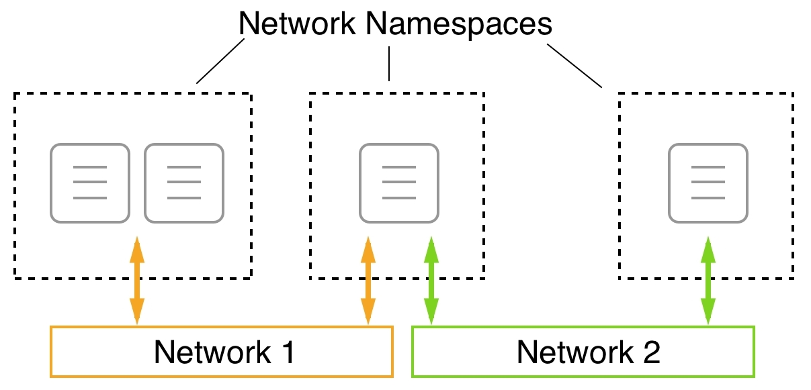

在单一网络命名空间中运行多个容器

在上面的图中，我们可以看到，在最左侧的**网络命名空间**中，我们有两个容器。这两个容器因为共享相同的命名空间，所以可以通过 localhost 互相通信。然后，网络命名空间（而不是单独的容器）被连接到**网络 1**。

当我们想要调试现有容器的网络时，这非常有用，而不需要在该容器内运行额外的进程。我们只需将一个特殊的工具容器附加到容器的网络命名空间中进行检查。Kubernetes 在创建 Pod 时也使用了这个功能。我们将在本书的第十五章，*Kubernetes 简介*中了解更多关于 Kubernetes 和 Pod 的内容。

现在，让我们演示一下这个是如何工作的：

1.  首先，我们创建一个新的桥接网络：

```
$ docker network create --driver bridge test-net
```

1.  接下来，我们运行一个连接到该网络的容器：

```
$ docker container run --name web -d \
 --network test-net nginx:alpine
```

1.  最后，我们运行另一个容器，并将其连接到我们`web`容器的网络：

```
$ docker container run -it --rm --network container:web \
alpine:latest /bin/sh
```

具体来说，注意我们如何定义网络：`--network container:web`。这告诉 Docker，我们的新容器将使用与名为`web`的容器相同的网络命名空间。

1.  由于新的容器与运行 nginx 的 Web 容器在同一个网络命名空间中，我们现在可以在本地主机上访问 nginx！我们可以通过使用 `wget` 工具来证明这一点，`wget` 是 Alpine 容器的一部分，它可以连接到 nginx。我们应该会看到如下内容：

```
/ # wget -qO - localhost
<!DOCTYPE html>
<html>
<head>
<title>Welcome to nginx!</title>
...
</html>
```

请注意，我们已将输出缩短以提高可读性。还请注意，在将两个容器附加到同一网络和将两个容器运行在同一网络命名空间之间，存在一个重要的区别。在这两种情况下，容器之间可以自由通信，但在后者的情况下，通信是通过本地主机进行的。

1.  为了清理容器和网络，我们可以使用以下命令：

```
$ docker container rm --force web
$ docker network rm test-net
```

在接下来的部分，我们将学习如何在容器主机上暴露容器端口。

# 管理容器端口

现在我们知道，如何通过将防火墙容器放置在不同的网络中，来实现容器之间的隔离；而且我们还可以让一个容器连接到多个网络。但仍然有一个问题没有解决。*我们如何将应用服务暴露到外部世界？* 想象一下，一个容器运行着一个 Web 服务器，承载着我们之前提到的 WebAPI。我们希望来自互联网的客户能够访问这个 API。我们已经设计了一个对外公开的 API。为了实现这一点，我们必须，形象地说，在防火墙中打开一个门，通过这个门将外部流量引导到我们的 API。出于安全原因，我们不想将大门完全打开；我们希望有一个单一的控制门，所有流量都通过这个门流入。

我们可以通过将容器端口映射到主机上的一个可用端口来创建这样一个“门”。我们也将其称为打开一个门，发布一个容器端口。请记住，容器和主机各自有自己的虚拟网络堆栈。因此，容器端口和主机端口是完全独立的，默认情况下它们没有任何关联。但现在我们可以将一个容器端口与一个空闲的主机端口连接，并通过这个链接引导外部流量，正如下面的图示所示：

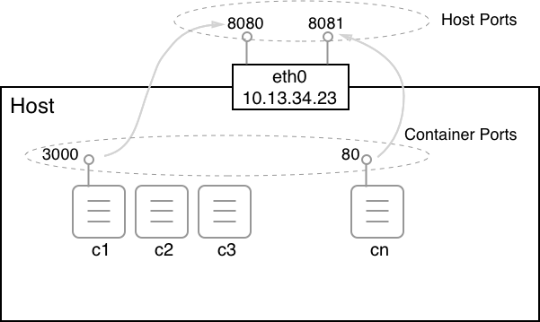

映射容器端口到主机端口

但现在，是时候展示我们如何实际将容器端口映射到主机端口了。这是在创建容器时完成的。我们有几种不同的方式来实现：

1.  首先，我们可以让 Docker 决定将容器端口映射到哪个主机端口。Docker 会从 32xxx 范围内选择一个空闲的主机端口。这种自动映射是通过使用 `-P` 参数完成的：

```
$ docker container run --name web -P -d nginx:alpine
```

上述命令在容器中运行一个 nginx 服务器。nginx 在容器内监听端口 `80`。通过 `-P` 参数，我们告诉 Docker 将所有暴露的容器端口映射到 32xxx 范围内的一个空闲端口。我们可以使用 `docker container port` 命令找出 Docker 使用的是哪个主机端口：

```
$ docker container port web
80/tcp -> 0.0.0.0:32768
```

nginx 容器只暴露了端口 `80`，我们可以看到它已经映射到了主机端口 `32768`。如果我们打开一个新的浏览器窗口并访问 `localhost:32768`，我们应该能看到以下界面：

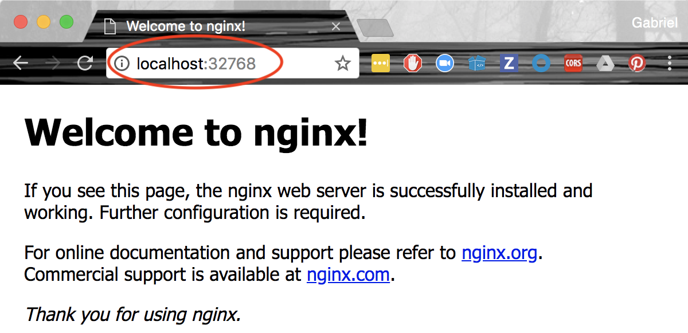

nginx 的欢迎页面

1.  另一种方法是通过检查容器来找出 Docker 正在使用的主机端口。主机端口是 `NetworkSettings` 节点的一部分：

```
$ docker container inspect web | grep HostPort
32768
```

1.  最后，获取此信息的第三种方式是列出容器：

```
$ docker container ls
CONTAINER ID    IMAGE         ...   PORTS                  NAMES
56e46a14b6f7    nginx:alpine  ...   0.0.0.0:32768->80/tcp  web
```

请注意，在上述输出中，`/tcp` 部分告诉我们该端口已为 TCP 协议开放，但并未为 UDP 协议开放。TCP 是默认协议，如果我们想明确表示要为 UDP 开放端口，则必须显式指定。映射中的 `0.0.0.0` 告诉我们，任何主机 IP 地址的流量现在都可以到达 `web` 容器的端口 `80`。

有时，我们希望将容器端口映射到一个非常特定的主机端口。我们可以通过使用 `-p` 参数（或 `--publish`）来实现。让我们看看如何通过以下命令来实现：

```
$ docker container run --name web2 -p 8080:80 -d nginx:alpine
```

`-p` 参数的值形式为 `<host port>:<container port>`。因此，在上述情况下，我们将容器端口 `80` 映射到主机端口 `8080`。一旦 `web2` 容器运行，我们可以通过浏览器访问 `localhost:8080` 来进行测试，我们应该会看到与之前自动端口映射示例中看到的相同的 nginx 欢迎页面。

当使用 UDP 协议在某个端口进行通信时，`publish` 参数将类似于 `-p 3000:4321/udp`。请注意，如果我们希望允许使用 TCP 和 UDP 协议在同一端口进行通信，那么我们必须分别为每种协议单独映射端口。

# 使用反向代理进行 HTTP 层级路由

想象一下，你的任务是将一个单体应用程序容器化。这个应用程序多年来已经演变成一个无法维护的庞然大物。即使是修改源代码中的一个小功能，也可能由于代码库中的紧密耦合而导致其他功能的崩溃。由于其复杂性，发布过程很少，并且需要整个团队参与。在发布窗口期间，应用程序必须停机，这会给公司带来大量损失，除了错失的机会，还包括他们的声誉损失。

管理层决定结束这种恶性循环，并通过将单体应用程序容器化来改善这种情况。仅这一措施就会显著减少发布之间的时间，这一点已经在业内得到了验证。在后续步骤中，公司还计划将单体应用程序中的每个功能模块拆分出来，转变为微服务。这个过程将持续进行，直到单体应用程序完全被消除。

但正是这一点让团队成员感到困惑。我们如何在不影响众多现有客户端的情况下，将这个单体应用拆解成松耦合的微服务呢？尽管单体应用的公共 API 非常复杂，但其设计结构良好。公共 URI 经精心设计，绝不应更改。例如，应用程序中有一个产品目录功能，可以通过 `https://acme.com/catalog?category=bicycles` 访问，从而查看公司提供的自行车列表。

另一方面，我们有一个 URL `https://acme.com/checkout`，可以用来启动客户购物车的结账流程，等等。我希望您能明白我们这么做的目的。

# 容器化单体应用

让我们从单体应用开始。我已经准备了一份简单的代码库，使用 Python 2.7 实现，并使用 Flask 构建公共 REST API。这个示例应用程序并不完全是一个完整的应用，只是足够复杂以进行一些重构。示例代码可以在 `ch10/e-shop` 文件夹中找到。该文件夹内有一个名为 `monolith` 的子文件夹，包含 Python 应用程序。请按照以下步骤操作：

1.  在新的终端窗口中，导航到该文件夹，安装所需的依赖项，并运行应用程序：

```
$ cd ~/fod/ch10/e-shop/monolith
$ pip install -r requirements.txt
$ export FLASK_APP=main.py 
$ flask run
```

该应用程序将在`localhost`上通过`5000`端口启动并监听：

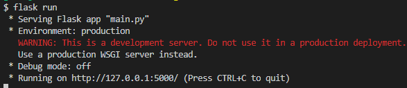

运行 Python 单体应用

1.  我们可以使用 `curl` 来测试该应用。使用以下命令检索公司提供的所有自行车列表：

```
$ curl localhost:5000/catalog?category=bicycles [{"id": 1, "name": "Mountanbike Driftwood 24\"", "unitPrice": 199}, {"id": 2, "name": "Tribal 100 Flat Bar Cycle Touring Road Bike", "unitPrice": 300}, {"id": 3, "name": "Siech Cycles Bike (58 cm)", "unitPrice": 459}]
```

你应该看到一个格式为 JSON 的三种自行车类型的列表。好的，到这里一切正常。

1.  现在，我们来修改 `hosts` 文件，添加 `acme.com` 的条目，并将其映射到 `127.0.0.1`（回环地址）。这样，我们就能模拟真实客户端通过 URL `http://acme.cnoteom/catalog?category=bicycles` 访问应用程序，而不是使用 `localhost`。在 macOS 或 Linux 上，您需要使用 sudo 编辑 `hosts` 文件。您应该在 `hosts` 文件中添加如下内容：

```
127.0.0.1 acme.com 
```

1.  保存您的更改，并通过 ping `acme.com` 来验证是否成功：

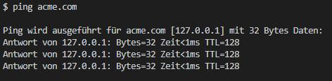

通过 `hosts` 文件将 `acme.com` 映射到回环地址

在 Windows 上，您可以通过例如以管理员身份运行记事本，打开 `c:\Windows\System32\Drivers\etc\hosts` 文件并进行修改来编辑该文件。

做完这些后，就该将应用程序容器化了。我们需要在应用程序中做的唯一更改是确保应用程序的 Web 服务器监听在`0.0.0.0`上，而不是`localhost`。

1.  我们可以通过修改应用程序并在 `main.py` 文件末尾添加以下启动逻辑来轻松完成这项任务：

```
if __name__ == '__main__':
    app.run(host='0.0.0.0', port=5000)
```

然后，我们可以通过 `python main.py` 启动应用程序。

1.  现在，向 `monolith` 文件夹中添加一个 `Dockerfile`，并将以下内容填入其中：

```
FROM python:3.7-alpine
WORKDIR /app
COPY requirements.txt ./
RUN pip install -r requirements.txt
COPY . .
EXPOSE 5000
CMD python main.py
```

1.  在你的终端窗口中，从巨石文件夹中，执行以下命令来构建应用程序的 Docker 镜像：

```
$ docker image build -t acme/eshop:1.0 .
```

1.  在镜像构建完成后，尝试运行该应用程序：

```
$ docker container run --rm -it \
 --name eshop \
 -p 5000:5000 \
 acme/eshop:1.0
```

注意，现在在容器中运行的应用程序输出与直接在主机上运行应用程序时的输出是无法区分的。我们现在可以通过使用两个 `curl` 命令来访问目录和结账逻辑，测试应用程序是否像以前一样工作：

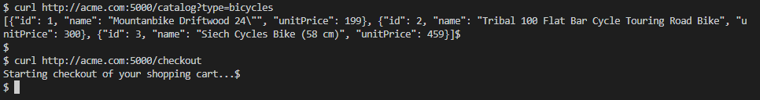

在容器中运行时测试巨石

显然，即使使用正确的 URL，即`http://acme.com`，该巨石仍然以与之前完全相同的方式工作。太好了！现在，让我们将巨石的一部分功能拆分为一个 Node.js 微服务，并将其单独部署。

# 提取第一个微服务

团队经过一些头脑风暴后，决定产品 `catalog` 是从巨石中提取的第一个功能的一个好候选者，它既紧密相关，又足够独立。于是他们决定将产品目录作为一个 Node.js 微服务来实现。

你可以在项目文件夹中的 `catalog` 子文件夹中找到他们编写的代码和 `Dockerfile`，也就是 `e-shop` 文件夹。这是一个简单的 Express.js 应用程序，复现了之前在巨石中提供的功能。让我们开始吧：

1.  在你的终端窗口中，从 `catalog` 文件夹中，构建这个新微服务的 Docker 镜像：

```
$ docker image build -t acme/catalog:1.0 .
```

1.  然后，从刚刚构建的新镜像运行一个容器：

```
$ docker run --rm -it --name catalog -p 3000:3000 acme/catalog:1.0
```

1.  在另一个终端窗口中，尝试访问微服务，并验证它返回的数据是否与巨石相同：

```
$ curl http://acme.com:3000/catalog?type=bicycle
```

请注意，与在巨石中访问相同功能时的 URL 相比，URL 有哪些不同。这里，我们正在访问微服务的端口是 `3000`（而不是 `5000`）。但是我们说过，我们不想改变访问我们电商应用的客户端。那么我们该怎么做呢？幸运的是，像这种问题是有解决方案的。我们需要重新路由传入请求。我们将在下一部分展示如何操作。

# 使用 Traefik 重新路由流量

在上一部分中，我们意识到我们需要将以 `http://acme.com:5000/catalog` 开头的目标 URL 的传入流量重新路由到一个替代 URL，例如 `product-catalog:3000/catalog`。我们将使用 Traefik 来完成这一操作。

Traefik 是一个云原生边缘路由器，且是开源的，这对于我们的特定情况非常适用。它甚至有一个漂亮的 Web UI，你可以用来管理和监控你的路由。Traefik 可以与 Docker 非常简便地结合使用，稍后我们将看到这一点。

为了与 Docker 很好地集成，Traefik 依赖于每个容器或服务中的元数据。这些元数据可以通过包含路由信息的标签的形式应用。

首先，让我们看一下如何运行目录服务：

1.  这里是 Docker `run` 命令：

```
$ docker container run --rm -d \
 --name catalog \
 --label traefik.enable=true \
 --label traefik.port=3000 \
 --label traefik.priority=10 \
 --label traefik.http.routers.catalog.rule="Host(\"acme.com\") && PathPrefix(\"/catalog\")" \
 acme/catalog:1.0
```

1.  让我们快速看一下我们定义的四个标签：

+   +   `traefik.enable=true`：这告诉 Traefik 这个特定的容器应该包含在路由中（默认值是 `false`）。

    +   `traefik.port=3000`：路由器应该将请求转发到端口 `3000`（这是 Express.js 应用程序正在监听的端口）。

    +   `traefik.priority=10`：为这个路由设置较高的优先级。稍后我们会看到为什么。

    +   `traefik.http.routers.catalog.rule="Host(\"acme.com\") && PathPrefix(\"/catalog\")"`：此路由必须包含主机名 `acme.com`，且路径必须以 `/catalog` 开头，才能重定向到此服务。例如，`acme.com/catalog?type=bicycles` 将符合此规则。

请注意第四个标签的特殊形式。其一般形式为 `traefik.http.routers.<service name>.rule`。

1.  现在，让我们来看一下如何运行 `eshop` 容器：

```
$ docker container run --rm -d \
    --name eshop \
    --label traefik.enable=true \
    --label traefik.port=5000 \
    --label traefik.priority=1 \
    --label traefik.http.routers.eshop.rule="Host(\"acme.com\")" \
    acme/eshop:1.0
```

在这里，我们将任何匹配的请求转发到端口 `5000`，对应 `eshop` 应用程序监听的端口。请注意优先级，它设置为 `1`（低）。这与 `catalog` 服务的高优先级结合使用，允许我们将所有以 `/catalog` 开头的 URL 过滤并重定向到 `catalog` 服务，而其他所有 URL 都将转发到 `eshop` 服务。

1.  现在，我们终于可以运行 Traefik 作为边缘路由器，它将在我们的应用程序前面作为反向代理。我们可以通过以下方式启动它：

```
$ docker run -d \
 --name traefik \
 -p 8080:8080 \
 -p 80:80 \
 -v /var/run/docker.sock:/var/run/docker.sock \
 traefik:v2.0 --api.insecure=true --providers.docker

```

注意我们是如何将 Docker 套接字挂载到容器中，以便 Traefik 能与 Docker 引擎交互。我们可以将 Web 流量发送到 Traefik 的端口 `80`，然后根据参与容器元数据中的路由定义规则重新路由流量。此外，我们还可以通过端口 `8080` 访问 Traefik 的 Web UI。

现在，一切都已运行，即单体应用、名为 `catalog` 的第一个微服务和 Traefik，我们可以测试是否一切按预期工作。再次使用 `curl` 来进行测试：

```
$ curl http://acme.com/catalog?type=bicycles
$ curl http://acme.com/checkout
```

正如我们之前提到的，现在我们将所有流量发送到端口 `80`，这是 Traefik 监听的端口。这个代理将把流量重新路由到正确的目标。

在继续之前，停止所有容器：

```
$ docker container rm -f traefik eshop catalog
```

这一章到此为止。

# 总结

在这一章中，我们学习了如何在单个主机上运行的容器相互通信。首先，我们了解了 CNM，它定义了容器网络的要求，然后我们研究了几种 CNM 实现，例如桥接网络。接着，我们详细了解了桥接网络的功能，以及 Docker 提供的有关网络和附加到这些网络的容器的信息。我们还学习了从容器内外两种视角进行观察的方法。最后，我们介绍了 Traefik，作为为我们的应用程序提供应用级路由的手段。

在下一章中，我们将介绍 Docker Compose。我们将学习如何创建一个由多个服务组成的应用程序，每个服务运行在一个容器中，以及 Docker Compose 如何使我们能够使用声明性方法轻松构建、运行和扩展这样的应用程序。

# 问题

为了评估你从本章学到的技能，请尝试回答以下问题：

1.  命名 **容器网络模型** (**CNM**) 的三个核心元素。

1.  如何创建一个自定义的桥接网络，例如 `frontend`？

1.  如何运行两个附加到 `frontend` 网络的 `nginx:alpine` 容器？

1.  对于 `frontend` 网络，获取以下内容：

    +   所有附加容器的 IP 地址

    +   与网络关联的子网

1.  `host` 网络的目的是什么？

1.  请列举一个或两个适合使用 `host` 网络的场景。

1.  `none` 网络的目的是什么？

1.  在哪些场景下应该使用 `none` 网络？

1.  为什么我们要将反向代理如 Traefik 与我们的容器化应用程序一起使用？

# 进一步阅读

以下是一些更详细描述本章内容的文章：

+   Docker 网络概述: [`dockr.ly/2sXGzQn`](http://dockr.ly/2sXGzQn)

+   容器网络: [`dockr.ly/2HJfQKn`](http://dockr.ly/2HJfQKn)

+   什么是桥接？: [`bit.ly/2HyC3Od`](https://bit.ly/2HyC3Od)

+   使用桥接网络: [`dockr.ly/2BNxjRr`](http://dockr.ly/2BNxjRr)

+   使用 Macvlan 网络: [`dockr.ly/2ETjy2x`](http://dockr.ly/2ETjy2x)

+   使用主机网络进行网络连接: [`dockr.ly/2F4aI59`](http://dockr.ly/2F4aI59)
