# Docker Swarm 介绍

在上一章中，我们介绍了编排工具。就像乐队指挥一样，编排工具确保我们的容器化应用服务能够和谐地协同工作，并共同为一个共同的目标作出贡献。这些编排工具承担着许多责任，我们已进行了详细讨论。最后，我们简要概述了市场上最重要的容器编排工具。

本章介绍了 Docker 的原生编排工具 SwarmKit。它详细阐述了 SwarmKit 用于在本地或云中集群中部署和运行分布式、弹性、强健且高度可用的应用程序的所有概念和对象。本章还介绍了 SwarmKit 如何通过使用 **软件定义网络** (**SDN**) 来隔离容器，从而确保应用程序的安全性。此外，本章演示了如何在云中安装一个高可用的 Docker Swarm。它介绍了路由网格，该网格提供第 4 层路由和负载均衡。最后，它演示了如何将由多个服务组成的第一个应用程序部署到 Swarm 上。

本章我们将讨论以下主题：

+   Docker Swarm 架构

+   Swarm 节点

+   堆栈、服务和任务

+   多主机网络

+   创建一个 Docker Swarm

+   部署第一个应用程序

+   Swarm 路由网格

完成本章后，你将能够做到以下几点：

+   在白板上勾画出高可用 Docker Swarm 的关键部分

+   用两三句话向感兴趣的外行解释什么是（Swarm）服务

+   在 AWS、Azure 或 GCP 中创建一个高可用的 Docker Swarm，包括三个管理节点和两个工作节点

+   成功地在 Docker Swarm 上部署一个复制服务，例如 Nginx

+   扩展和缩减运行中的 Docker Swarm 服务

+   获取复制的 Docker Swarm 服务的聚合日志

+   为至少包含两个交互服务的示例应用程序编写一个简单的堆栈文件

+   将一个堆栈部署到 Docker Swarm 中

# Docker Swarm 架构

从 30,000 英尺的高度看，Docker Swarm 的架构由两个主要部分组成——一个由奇数个管理节点组成的 Raft 共识组，以及一个通过 Gossip 网络相互通信的工作节点组，也叫做控制平面。下图展示了这一架构：


Docker Swarm 的高层架构

**管理**节点管理 Swarm，而 **工作**节点执行部署到 Swarm 中的应用程序。每个 **管理**节点在其本地的 Raft 存储中都有完整的 Swarm 状态副本。管理节点之间同步通信，且它们的 Raft 存储始终保持同步。

另一方面，工作节点为了可扩展性原因异步地彼此通信。在一个 Swarm 中可以有数百甚至数千个工作节点。现在，我们已经对 Docker Swarm 是什么有了高层次的概述，让我们更详细地描述 Docker Swarm 的所有单个元素。

# Swarm 节点

一个 Swarm 是一组节点。我们可以将一个节点分类为物理计算机或虚拟机（**VM**）。如今，物理计算机通常被称为裸机。人们说“我们在裸机上运行”以区分于在虚拟机上运行。

当我们在这样的节点上安装 Docker 时，我们称此节点为 Docker 主机。以下图示更清楚地说明了节点和 Docker 主机的区别：

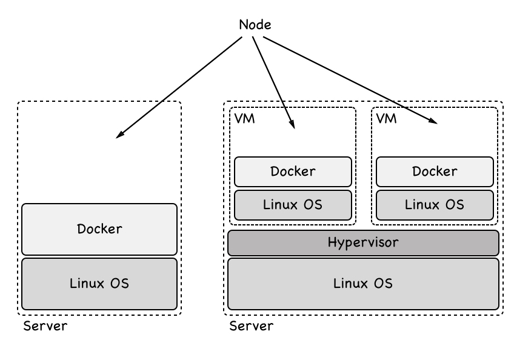

Docker Swarm 节点的裸机和虚拟机类型

要成为 Docker Swarm 的成员，一个节点必须是 Docker 主机。Docker Swarm 中的节点可以担任两种角色之一。它可以是管理节点，或者可以是工作节点。管理节点如其名，管理 Swarm。工作节点则执行应用程序工作负载。

技术上，管理节点也可以是工作节点，因此可以运行应用工作负载，尽管这不被推荐，特别是如果 Swarm 是运行关键应用程序的生产系统。

# Swarm 管理员

每个 Docker Swarm 至少需要包括一个管理节点。出于高可用性的考虑，我们在 Swarm 中应该有多个管理节点。对于生产或类似生产环境尤其如此。如果有多个管理节点，则这些节点使用 Raft 共识协议协同工作。Raft 共识协议是一种标准协议，当多个实体需要一起工作并始终需要达成一致时，经常使用这种协议来决定下一步执行的活动。

为了良好运作，Raft 共识协议要求在所谓的共识组中有奇数个成员。因此，我们应该始终有 1、3、5、7 等管理节点。在这样一个共识组中，总会有一个领导者。在 Docker Swarm 的情况下，首个启动 Swarm 的节点最初成为领导者。如果领导者离开，剩余的管理节点将选举新的领导者。共识组中的其他节点称为跟随者。

现在，让我们假设由于维护原因关闭当前的领导者节点。剩余的管理节点将选举新的领导者。当先前的领导节点重新上线时，它现在将成为跟随者。新的领导者仍然保持领导地位。

共识组的所有成员都同步地相互通信。每当共识组需要做出决策时，领导节点会要求所有跟随节点达成一致。如果大多数管理节点给出肯定的答案，那么领导节点就会执行任务。这意味着，如果我们有三个管理节点，那么至少有一个跟随节点必须同意领导节点的决策。如果我们有五个管理节点，那么至少有两个跟随节点必须同意。

由于所有的管理节点跟随节点必须与领导节点同步通信以做出集群决策，因此随着管理节点数量的增加，决策过程会变得越来越慢。Docker 的推荐做法是在开发、演示或测试环境中使用一个管理节点。在小型到中型的 Swarm 中使用三个管理节点，在大型到超大规模的 Swarm 中使用五个管理节点。使用超过五个管理节点的 Swarm 几乎从未被证明是合理的。

管理节点不仅负责管理 Swarm，还负责维护 Swarm 的状态。*那我们到底是什么意思呢？* 当我们谈论 Swarm 的状态时，我们指的是有关它的所有信息——例如，*Swarm 中有多少个节点，以及* *每个节点的属性是什么，比如名称或 IP 地址*。我们还指的是哪些容器正在 Swarm 中的哪些节点上运行，等等。另一方面，Swarm 的状态中不包括由运行在 Swarm 容器中的应用服务生成的数据。这被称为应用数据，并且绝对不属于由管理节点管理的状态：

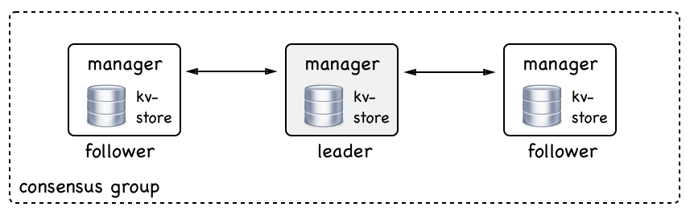

一个 Swarm 管理节点共识组

所有 Swarm 的状态都存储在每个**管理节点**上的高性能键值存储（**kv-store**）中。没错，每个**管理节点**都存储整个 Swarm 状态的完整副本。这种冗余使得 Swarm 具有高度可用性。如果一个**管理节点**宕机，剩余的**管理节点**都能随时访问完整的状态。

如果一个新的**管理节点**加入共识组，那么它会将 Swarm 状态与现有的组成员同步，直到它拥有完整的副本。在典型的 Swarm 中，这种复制通常非常快速，但如果 Swarm 很大，并且上面运行着许多应用程序，这可能会需要一些时间。

# Swarm 工作节点

正如我们之前提到的，Swarm 工作节点是用来托管和运行包含实际应用服务的容器的，这些服务是我们希望在集群中运行的。它们是 Swarm 的主力军。从理论上讲，一个管理节点也可以是工作节点。但是，正如我们已经说过的那样，这在生产系统中并不推荐。在生产系统中，我们应该让管理节点保持管理节点的角色。

工作节点通过所谓的控制平面进行通信。它们使用 gossip 协议进行通信，这种通信是异步的，这意味着在任何给定的时刻，不一定所有工作节点都能完美同步。

现在，您可能会问——*工作节点交换哪些信息？* 这些信息大多数是用于服务发现和路由的信息，也就是说，关于哪些容器在节点上运行等信息：

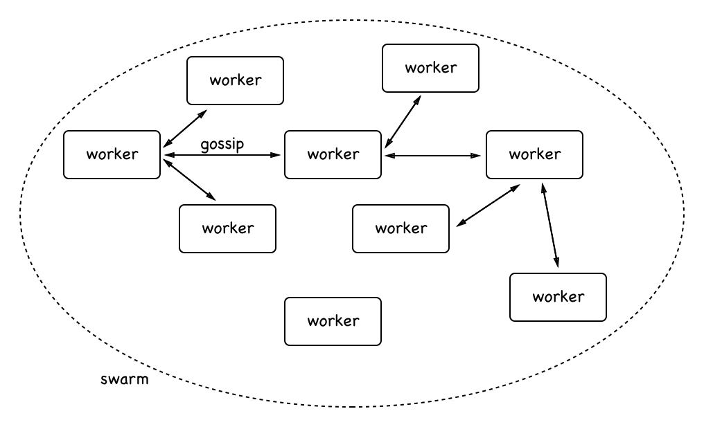

工作节点之间的通信

在上面的图中，您可以看到工作节点是如何相互通信的。为了确保在大规模 Swarm 中，gossip 协议能够良好扩展，每个**工作**节点只与三个随机邻居同步其自身状态。对于熟悉大 O 表示法的人来说，这意味着使用 gossip 协议同步**工作**节点的过程具有 O(0) 级别的扩展性。

**工作**节点可以说是被动的。它们除了运行由管理节点分配的工作负载外，几乎不会主动执行其他操作。尽管如此，**工作**节点会确保以最佳能力运行这些工作负载。在本章后续部分，我们将进一步了解管理节点分配给工作节点的具体工作负载。

# 堆栈、服务和任务

使用 Docker Swarm 相较于单一 Docker 主机时，会有范式上的变化。我们不再讨论运行进程的单个容器，而是抽象成服务，代表每个进程的副本集，通过这种方式，服务可以实现高可用性。我们也不再讨论带有固定名称和 IP 地址的单个 Docker 主机了；现在我们谈论的是将服务部署到的主机集群。我们不再关心单一主机或节点，不再给它赋予有意义的名称；每个节点对我们来说只是一个数字。我们也不再关心单个容器以及它们部署的位置，我们只关心通过服务定义的期望状态。我们可以通过以下图示来描述这一点：

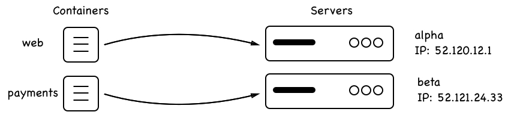

容器部署到知名服务器

与前面图示中将**web**容器部署到 IP 地址为`52.120.12.1`的**alpha**服务器，将**payments**容器部署到 IP 为`52.121.24.33`的**beta**服务器不同，在新的服务和 Swarm（或更广泛地说，集群）范式下，我们进行了转变：

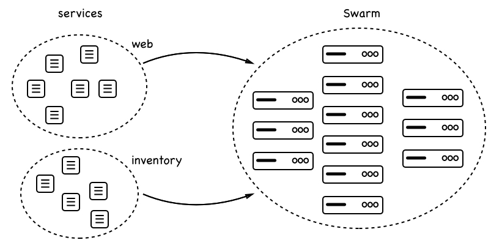

服务部署到 Swarm 集群

在前面的图中，我们看到一个**web**服务和一个**inventory**服务都部署到了一个由多个节点组成的**Swarm**中。每个服务都有一定数量的副本：**web**有六个副本，**inventory**有五个副本。我们并不关心副本运行在哪个节点上；我们只关心请求的副本数量总是能在**Swarm**调度器决定的任何节点上运行。

# 服务

Swarm 服务是一个抽象的概念。它是我们希望在 Swarm 中运行的应用或应用服务的期望状态的描述。Swarm 服务就像一个清单，描述了以下内容：

+   服务的名称

+   用于创建容器的镜像

+   要运行的副本数量

+   服务容器所附加的网络

+   应该映射的端口

拥有这个服务清单后，Swarm 管理器会确保当实际状态偏离期望状态时，始终将其协调一致。因此，如果例如，某个服务的一个实例崩溃，那么 Swarm 管理器上的调度器会在一个有空闲资源的节点上调度该服务的新实例，从而重新建立期望的状态。

# 任务

我们已经了解到，一个服务对应于应用服务应始终处于的期望状态的描述。该描述的一部分是服务应该运行的副本数量。每个副本由一个任务表示。在这方面，Swarm 服务包含一组任务。在 Docker Swarm 中，任务是部署的最小单位。每个服务的任务都由 Swarm 调度器部署到一个工作节点上。任务包含工作节点需要的所有信息，用于根据镜像（这是服务描述的一部分）运行容器。在任务和容器之间，存在一一对应的关系。容器是运行在工作节点上的实例，而任务是作为 Swarm 服务一部分的容器描述。

# 栈

现在我们已经对**Swarm**服务是什么以及任务是什么有了很好的了解，我们可以介绍栈的概念。栈用于描述一组相关的 Swarm 服务，这些服务通常因为它们是同一个应用程序的一部分而相关。从这个意义上说，我们也可以说栈描述了一个由一个或多个我们希望在 Swarm 上运行的服务组成的应用程序。

通常，我们在一个文本文件中以声明性方式描述一个栈，该文件使用 YAML 格式并且采用与已知的 Docker Compose 文件相同的语法。由此产生了一种情况，人们有时会说栈是由一个`docker-compose`文件描述的。更准确的说法应该是：栈是在一个栈文件中描述的，该文件使用与`docker-compose`文件类似的语法。

让我们尝试通过下面的图示来说明 Stack、服务和任务之间的关系，并将其与典型的 Stack 文件内容连接起来：

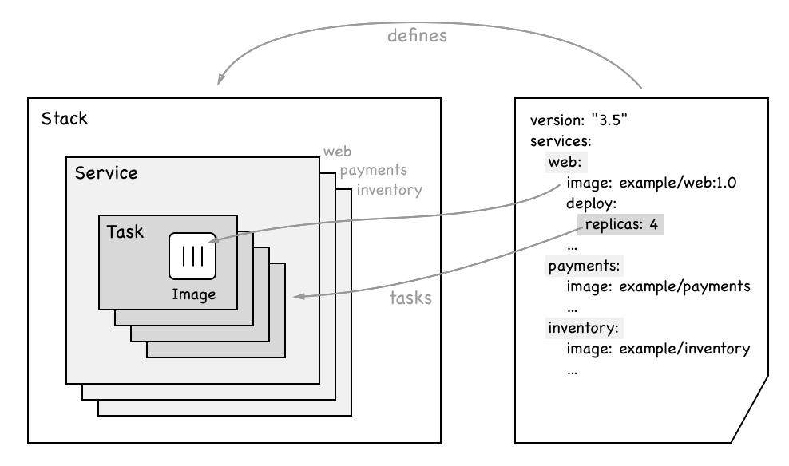

显示 Stack、服务和任务之间关系的图表

在前面的图表中，右侧展示了一个示例**Stack**的声明式描述。**Stack**由三个服务组成，分别是**web**、**payments**和**inventory**。我们还可以看到，**web**服务使用的是**example/web:1.0**镜像，并且有四个副本。

在图表的左侧，我们可以看到**Stack**包含了三个提到的服务。每个服务依次包含了一组**Tasks**，数量与副本数相同。以**web**服务为例，我们有四个**Tasks**。每个**Task**包含一个**Image**的名称，容器将在该**Task**被调度到 Swarm 节点时从中实例化。

# 多主机网络

在第十章，*单主机网络*中，我们讨论了容器如何在单个 Docker 主机上进行通信。现在，我们有一个由多个节点或 Docker 主机组成的 Swarm。位于不同节点上的容器需要能够互相通信。有许多技术可以帮助我们实现这一目标。Docker 选择为 Docker Swarm 实现一个**覆盖网络**驱动程序。这个**覆盖网络**使得附加到同一**覆盖网络**的容器可以相互发现并自由通信。以下是**覆盖网络**工作原理的示意图：

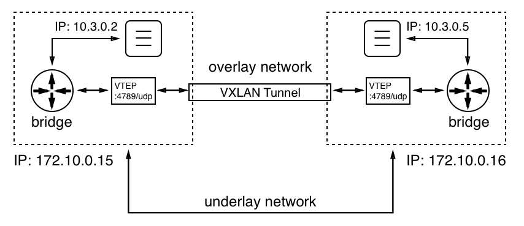

覆盖网络

我们有两个节点或 Docker 主机，IP 地址分别为`172.10.0.15`和`172.10.0.16`。我们选择的 IP 地址值并不重要；重要的是这两个主机有不同的 IP 地址，并通过物理网络（网络电缆）连接在一起，这个网络被称为**underlay network**。

在左侧节点上，我们有一个容器，IP 地址为`10.3.0.2`，在右侧节点上，则有另一个容器，IP 地址为`10.3.0.5`。现在，前一个容器想要与后一个容器通信。*这怎么实现呢？* 在第十章，*单主机网络*中，我们已经看到了当两个容器位于同一节点时，如何通过 Linux 桥接实现通信。但 Linux 桥接仅限于本地操作，不能跨节点工作。所以，我们需要另一个机制，Linux VXLAN 来解决这个问题。VXLAN 在 Linux 中早在容器出现之前就已经可用了。

当左侧容器发送数据包时，**bridge**会意识到数据包的目标不在此主机上。现在，每个参与覆盖网络的节点都获得一个所谓的**VXLAN 隧道端点**（**VTEP**）对象，它拦截数据包（此时数据包是 OSI 第 2 层数据包），并将其包装在一个包含目标容器所在主机 IP 地址的头信息中（这使它成为 OSI 第 3 层数据包），然后通过**VXLAN 隧道**发送。隧道另一侧的**VTEP**会解包数据包并将其转发到本地桥接器，桥接器再将其转发给目标容器。

覆盖驱动程序包含在 SwarmKit 中，在大多数情况下，它是 Docker Swarm 推荐的网络驱动程序。还有其他由第三方提供的支持多节点的网络驱动程序，可以作为插件安装到每个参与的 Docker 主机上。经过认证的网络插件可以从 Docker 商店获取。

# 创建一个 Docker Swarm

创建一个 Docker Swarm 几乎是微不足道的。它非常简单，以至于如果你知道什么是编排工具，似乎不真实。但这确实是真的，Docker 做得非常出色，使得 Swarm 的使用既简单又优雅。与此同时，Docker Swarm 已经在大型企业的使用中证明了它的稳健性和可扩展性。

# 创建本地单节点 Swarm

所以，不再需要想象——让我们展示如何创建一个 Swarm。在最简单的形式下，一个完全功能的 Docker Swarm 仅由一个节点组成。如果你使用的是 Docker for Mac 或 Windows，甚至是 Docker Toolbox，那么你的个人电脑或笔记本电脑就是这样的一个节点。因此，我们可以从这里开始，并展示 Swarm 的一些最重要的功能。

让我们初始化一个 Swarm。在命令行中，只需输入以下命令：

```
$ docker swarm init
```

在短短的时间后，你应该能看到类似于以下截图的内容：

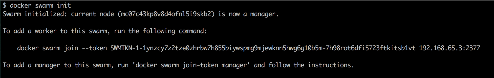

Docker Swarm 初始化命令的输出

现在我们的计算机是一个 Swarm 节点。它的角色是管理者，并且是领导者（在管理者中是领导者，这很合理，因为目前只有一个管理者）。虽然执行`docker swarm init`只用了非常短的时间，但这个命令在这段时间内做了很多事情。以下是其中的一些：

+   它创建了一个根**证书授权机构**（**CA**）。

+   它创建了一个键值存储，用于存储整个 Swarm 的状态。

现在，在前面的输出中，我们可以看到一个可以用来将其他节点加入我们刚创建的 Swarm 的命令。该命令如下：

```
$ docker swarm join --token <join-token> <IP address>:2377
```

在这里，我们有以下内容：

+   `<join-token>` 是 Swarm 领导者在初始化 Swarm 时生成的令牌。

+   `<IP 地址>` 是领导者的 IP 地址。

尽管我们的集群保持简单，因为它只有一个成员，但我们仍然可以要求 Docker CLI 列出 Swarm 中的所有节点。这看起来类似于以下截图：

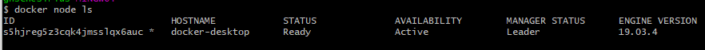

列出 Docker Swarm 中的节点

在这个输出中，我们首先看到分配给节点的`ID`。紧随其后的星号（`*`）表示这是执行`docker node ls`命令的节点——基本上说明这是活动节点。接下来，我们可以看到节点的（人类可读的）名称、状态、可用性和管理状态。如前所述，Swarm 的第一个节点自动成为领导者，在前面的截图中有标示。最后，我们看到正在使用的 Docker 引擎版本。

若要获取更多关于节点的信息，我们可以使用`docker node inspect`命令，如下图所示：

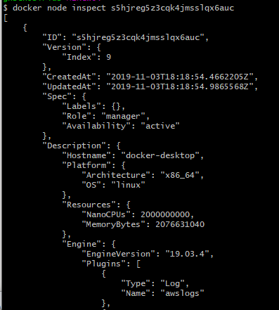

docker node inspect 命令的截断输出

该命令生成了大量信息，因此我们只展示了截断后的输出。例如，当你需要排查故障节点时，这些输出信息可能会很有用。

# 在 VirtualBox 或 Hyper-V 中创建本地 Swarm

有时候，一个单节点的 Swarm 是不够的，但我们没有或不想使用账户在云中创建 Swarm。在这种情况下，我们可以在 VirtualBox 或 Hyper-V 中创建本地 Swarm。在 VirtualBox 中创建 Swarm 稍微简单一些，但如果你使用的是 Windows 10 并且运行 Docker for Windows，那么你不能同时使用 VirtualBox。这两个虚拟机管理程序是互斥的。

假设我们在笔记本电脑上安装了 VirtualBox 和`docker-machine`。然后，我们可以使用`docker-machine`列出所有当前已定义且可能在 VirtualBox 中运行的 Docker 主机：

```
$ docker-machine ls
NAME ACTIVE DRIVER STATE URL SWARM DOCKER ERRORS
default - virtualbox Stopped Unknown
```

在我的情况下，我已经定义了一个名为`default`的虚拟机，它当前处于停止状态。我可以通过执行`docker-machine start default`命令轻松启动虚拟机。这个命令需要一些时间，并将产生以下（简化）输出：

```
$ docker-machine start default
Starting "default"...
(default) Check network to re-create if needed...
(default) Waiting for an IP...
Machine "default" was started.
Waiting for SSH to be available...
Detecting the provisioner...
Started machines may have new IP addresses. You may need to re-run the `docker-machine env` command.
```

现在，如果我再次列出我的虚拟机，我应该能看到以下截图：

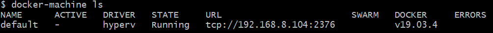

Hyper-V 中运行的所有虚拟机列表

如果我们还没有名为`default`的虚拟机，可以使用`create`命令轻松创建一个：

```
docker-machine create --driver virtualbox default
```

这将产生以下输出：

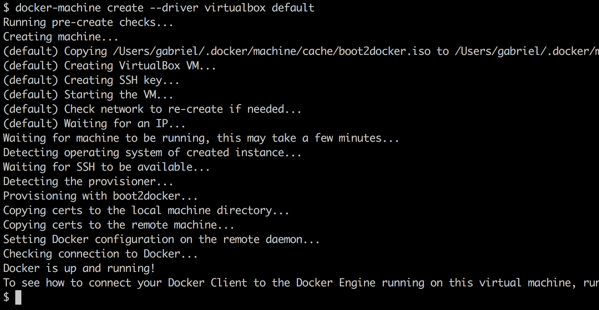

docker-machine create 的输出

我们可以从上述输出中看到，`docker-machine`是如何从 ISO 镜像创建虚拟机，定义 SSH 密钥和证书，并将其复制到虚拟机和本地`~/.docker/machine`目录中，稍后我们将使用它，当我们想通过 Docker CLI 远程访问这个虚拟机时。同时，它还为新虚拟机配置了一个 IP 地址。

我们使用`docker-machine create`命令，并带有`--driver virtualbox`参数。docker-machine 也可以与其他驱动程序一起使用，比如 Hyper-V、AWS、Azure、DigitalOcean 等。有关更多信息，请参阅`docker-machine`的文档。默认情况下，新虚拟机将分配 1 GB 的内存，这足够将此虚拟机用作开发或测试 Swarm 的节点。

如果你使用的是 Windows 10 并且安装了 Docker Desktop，可以改用`hyperv`驱动程序。为了成功运行，你需要以管理员身份运行。此外，你还需要先在 Hyper-V 中定义一个外部虚拟交换机。你可以使用 Hyper-V 管理器来完成这个操作。命令的输出将与`virtualbox`驱动程序的输出非常相似。

现在，让我们为五节点 Swarm 创建五个虚拟机。我们可以使用一些脚本来减少手动操作：

```
$ for NODE in `seq 1 5`; do
  docker-machine create --driver virtualbox "node-${NODE}"
done
```

`docker-machine`现在将创建五个虚拟机，命名为`node-1`到`node-5`。这可能需要几分钟时间，所以这是一个很好的机会去泡一杯热茶。在虚拟机创建完成后，我们可以列出它们：

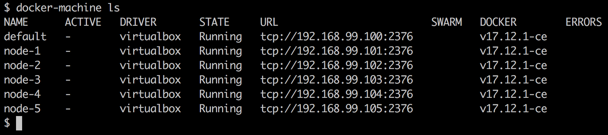

我们需要的所有虚拟机列表

现在，我们准备好构建 Swarm 了。从技术上讲，我们可以 SSH 进入第一个虚拟机`node-1`并初始化 Swarm，然后再 SSH 进入所有其他虚拟机，将它们加入 Swarm 领导节点。但这样效率不高。让我们再次使用一个脚本来完成所有繁重的工作：

```
# get IP of Swarm leader
$ export IP=$(docker-machine ip node-1)
# init the Swarm
$ docker-machine ssh node-1 docker swarm init --advertise-addr $IP
# Get the Swarm join-token
$ export JOIN_TOKEN=$(docker-machine ssh node-1 \
    docker swarm join-token worker -q)
```

现在我们有了 Swarm 领导者的加入令牌和 IP 地址，我们可以让其他节点加入 Swarm，如下所示：

```
$ for NODE in `seq 2 5`; do
  NODE_NAME="node-${NODE}"
  docker-machine ssh $NODE_NAME docker swarm join \
        --token $JOIN_TOKEN $IP:2377
done
```

为了使 Swarm 具备高可用性，我们现在可以将`node-2`和`node-3`等提升为管理节点：

```
$ docker-machine ssh node-1 docker node promote node-2 node-3
Node node-2 promoted to a manager in the swarm.
Node node-3 promoted to a manager in the swarm.
```

最后，我们可以列出 Swarm 的所有节点：

```
$ docker-machine ssh node-1 docker node ls
```

我们应该会看到如下内容：

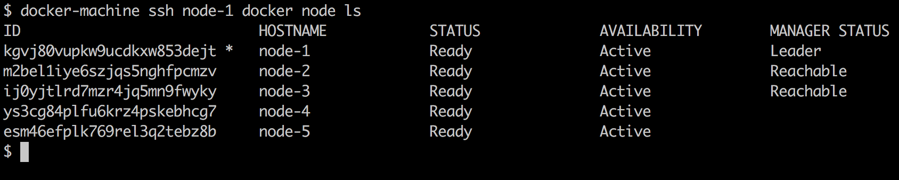

VirtualBox 上 Docker Swarm 的所有节点列表

这证明我们刚刚在本地笔记本电脑或工作站上创建了一个高可用的 Docker Swarm。现在让我们将所有代码片段组合起来，使整个过程更加稳健。脚本将如下所示：

```
alias dm="docker-machine"
for NODE in `seq 1 5`; do
  NODE_NAME=node-${NODE}
  dm rm --force $NODE_NAME
  dm create --driver virtualbox $NODE_NAME
done
alias dms="docker-machine ssh"
export IP=$(docker-machine ip node-1)
dms node-1 docker swarm init --advertise-addr $IP;
export JOIN_TOKEN=$(dms node-1 docker swarm join-token worker -q);
for NODE in `seq 2 5`; do
  NODE_NAME="node-${NODE}"
  dms $NODE_NAME docker swarm join --token $JOIN_TOKEN $IP:2377
done;
dms node-1 docker node promote node-2 node-3
```

上述脚本首先删除（如果存在）并重新创建五个名为`node-1`到`node-5`的虚拟机，然后在`node-1`上初始化 Swarm。之后，剩下的四个虚拟机将加入 Swarm，最后，`node-2`和`node-3`被提升为管理节点，以使 Swarm 具备高可用性。整个脚本执行时间不到 5 分钟，并且可以根据需要重复运行。完整脚本可以在仓库中的`docker-swarm`子文件夹里找到，名为`create-swarm.sh`。

强烈推荐的一种最佳实践是始终编写脚本，从而实现操作的自动化。

# 使用 Play with Docker 生成 Swarm

为了无需在本地计算机上安装或配置任何东西即可实验 Docker Swarm，我们可以使用**Play with Docker**（**PWD**）。PWD 是一个可以通过浏览器访问的网站，它让我们能够创建一个由最多五个节点组成的 Docker Swarm。正如名字所暗示的，它确实是一个游乐场，我们可以在其中玩耍，而且每次会话的使用时间限制为四小时。我们可以开启任意数量的会话，但每个会话都会在四小时后自动结束。除此之外，它是一个功能齐全的 Docker 环境，适合用来摆弄 Docker 或演示某些功能。

现在让我们访问该站点。在浏览器中，进入网站[`labs.play-with-docker.com`](https://labs.play-with-docker.com)。你将看到一个欢迎和登录界面。使用你的 Docker ID 登录。成功登录后，你将看到如下截图所示的界面：

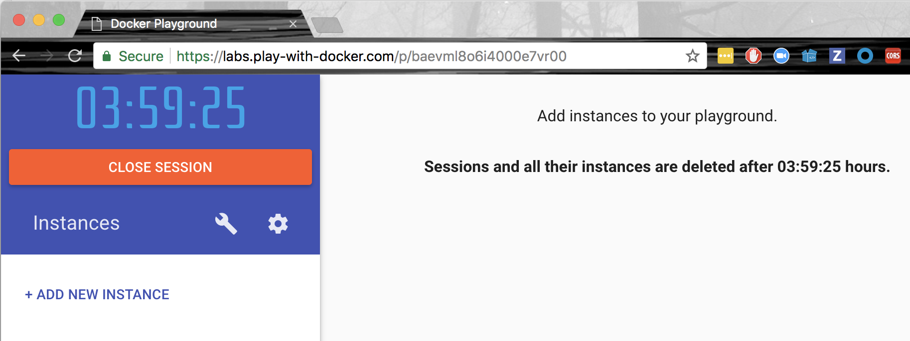

Docker 操作窗口

如我们立刻看到的那样，有一个大计时器从四小时开始倒计时。这是我们在本次会话中剩余的时间。此外，我们看到一个+ ADD NEW INSTANCE 链接。点击它可以创建一个新的 Docker 主机。完成后，你的屏幕应该看起来像下图：

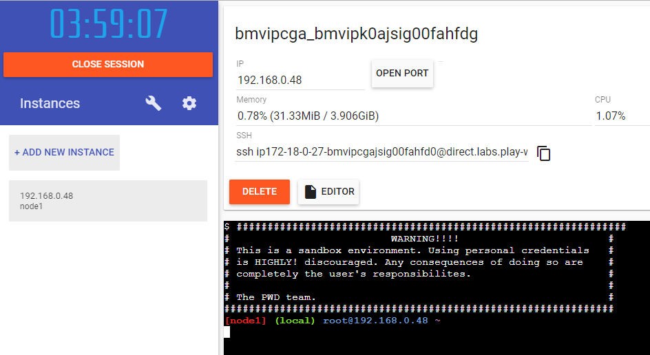

带有一个新节点的 PWD

在左侧，我们可以看到新创建的节点，它的 IP 地址是(`192.168.0.48`)，节点名称是(`node1`)。右侧显示了有关这个新节点的一些附加信息，屏幕的上半部分是这些信息，下半部分是一个终端。是的，这个终端用于在我们刚创建的节点上执行命令。这个节点已经安装了 Docker CLI，因此我们可以在其上执行所有熟悉的 Docker 命令，例如`docker version`。试试看吧。

但现在我们想要创建一个 Docker Swarm。请在浏览器的终端中执行以下命令：

```
$ docker swarm init --advertise-addr=eth0
```

前面命令生成的输出与我们之前在工作站上使用单节点集群以及在使用 VirtualBox 或 Hyper-V 的本地集群中进行的实验所得到的结果相同。重要的信息再次是我们要使用的`join`命令，用来将额外的节点加入到我们刚刚创建的集群中。

你可能注意到，这次我们在 Swarm 的`init`命令中指定了`--advertise-addr`参数。*为什么这里需要这样做？*原因是，PWD 生成的节点有多个 IP 地址与之关联。我们可以通过在节点上执行`ip a`命令轻松验证这一点。该命令会显示出确实存在`eth0`和`eth1`两个端点。因此，我们必须明确指定新 Swarm 管理节点要使用哪一个。在我们的例子中，是`eth0`。

通过点击`+ ADD NEW INSTANCE`链接四次，在 PWD 中创建另外四个节点。新的节点将被命名为`node2`、`node3`、`node4`和`node5`，并会在左侧列出。如果你点击左侧的一个节点，右侧将显示该节点的详细信息以及该节点的终端窗口。

选择每个节点（2 到 5），并在相应的终端中执行从领导节点（`node1`）复制的`docker swarm join`命令：

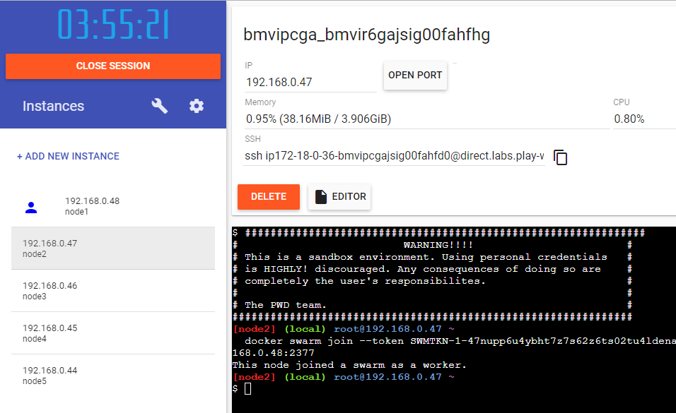

将节点加入 PWD 中的 Swarm

一旦将所有四个节点加入 Swarm，切换回`node1`并列出所有节点，结果不出所料如下所示：

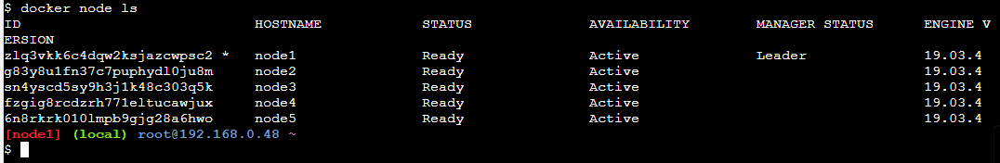

在 PWD 中列出 Swarm 的所有节点

仍然在`node1`上，我们现在可以提升，例如，将`node2`和`node3`提升，以使 Swarm 具有高可用性：

```
$ docker node promote node2 node3
Node node2 promoted to a manager in the swarm.
Node node3 promoted to a manager in the swarm.
```

至此，我们在 PWD 上的 Swarm 已经准备好接受工作负载。我们已经创建了一个高度可用的 Docker Swarm，包含三个管理节点，组成一个 Raft 共识组，以及两个工作节点。

# 在云中创建 Docker Swarm

到目前为止，我们创建的所有 Docker Swarm 都非常适合用于开发、实验或演示。如果我们想要创建一个可以作为生产环境使用的 Swarm，在这个环境中我们运行我们的关键任务应用程序，那么我们就需要在云中或本地创建一个——我很想说——真正的 Swarm。本书将演示如何在 AWS 上创建 Docker Swarm。

创建 Swarm 的一种方式是使用**docker-machine**（**DM**）。DM 为 AWS 提供了一个驱动程序。如果我们有 AWS 账户，我们需要 AWS 访问密钥 ID 和 AWS 秘密访问密钥。我们可以将这两个值添加到名为`~/.aws/configuration`的文件中。它应该如下所示：

```
[default]
aws_access_key_id = AKID1234567890
aws_secret_access_key = MY-SECRET-KEY
```

每次我们运行`docker-machine create`时，DM 都会在该文件中查找这些值。有关如何获得 AWS 账户以及如何获取两个密钥的详细信息，请参阅此链接：[`dockr.ly/2FFelyT`](http://dockr.ly/2FFelyT)。

一旦我们有了 AWS 账户，并且将访问密钥存储在配置文件中，就可以开始构建我们的 Swarm。所需的代码与我们在 VirtualBox 上为本地机器创建 Swarm 时使用的代码完全相同。让我们从第一个节点开始：

```
$ docker-machine create --driver amazonec2 \
 --amazonec2-region us-east-1 aws-node-1
```

这将会在请求的区域（在我的例子中是`us-east-1`）创建一个名为`aws-node-1`的 EC2 实例。前面命令的输出如下图所示：

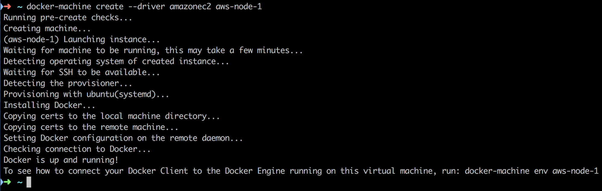

在 AWS 上使用 DM 创建一个 Swarm 节点

它看起来与我们在使用 VirtualBox 时已经熟悉的输出非常相似。现在，我们可以配置我们的终端以便远程访问这个 EC2 实例：

```
$ eval $(docker-machine env aws-node-1)
```

这将根据 Docker CLI 配置相应的环境变量：

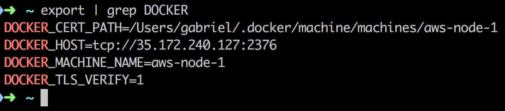

Docker 用于启用对 AWS EC2 节点远程访问的环境变量

出于安全原因，**传输层安全性**（**TLS**）用于我们的 CLI 和远程节点之间的通信。为此所需的证书已由 DM 复制到我们为环境变量 `DOCKER_CERT_PATH` 指定的路径中。

我们现在在终端中执行的所有 Docker 命令，将会在 AWS 上的 EC2 实例中远程执行。让我们尝试在这个节点上运行 Nginx：

```
$ docker container run -d -p 8000:80 nginx:alpine
```

我们可以使用 `docker container ls` 来验证容器是否正在运行。如果是的话，那我们可以使用 `curl` 来测试它：

```
$ curl -4 <IP address>:8000
```

这里，`<IP 地址>` 是 AWS 节点的公网 IP 地址；在我的例子中是 `35.172.240.127`。可惜，这个方法不起作用；前面的命令超时了：

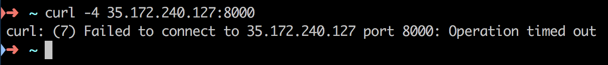

访问 AWS 节点上的 Nginx 时超时

之所以如此，是因为我们的节点属于 AWS **安全组**（**SG**）。默认情况下，SG 内部的对象访问是被拒绝的。因此，我们必须找出我们的实例属于哪个 SG，并显式地配置访问权限。通常，我们会使用 AWS 控制台来完成这项工作。进入 EC2 控制面板，并在左侧选择实例。找到名为 `aws-node-1` 的 EC2 实例并选择它。在详情视图中，在“安全组”下，点击名为 docker-machine 的链接，如下图所示：

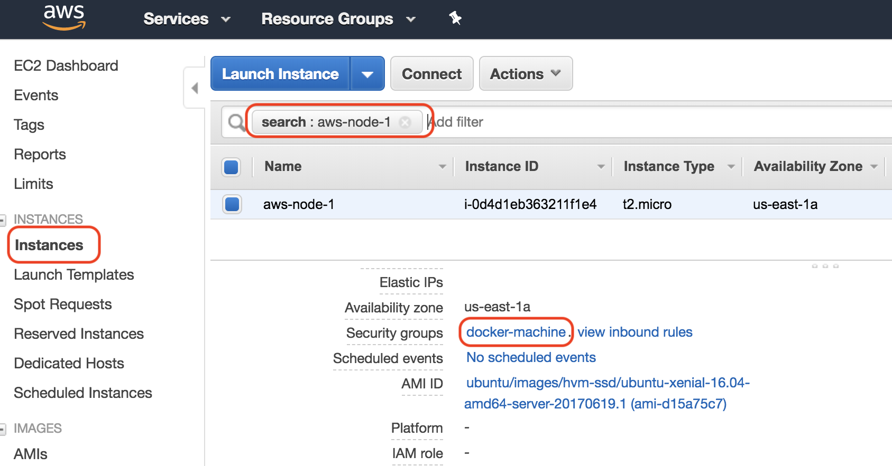

定位我们的 Swarm 节点所属的 SG

这将把我们带到 SG 页面，默认选中 `docker-machine` SG。在详情部分的“入站”选项卡下，为你的 IP 地址（工作站的 IP 地址）添加一条新规则：

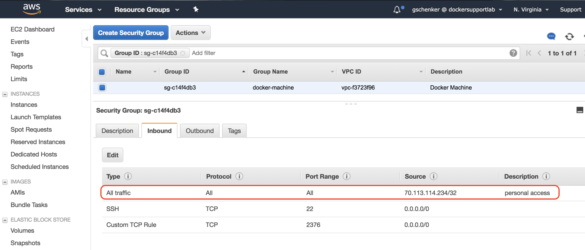

开放 SG 访问权限给我们的计算机

在前面的截图中，IP 地址 `70.113.114.234` 恰好是分配给我个人工作站的 IP 地址。我已经启用了来自这个 IP 地址的所有入站流量到 `docker-machine` SG。请注意，在生产系统中，你应该非常小心开放哪些 SG 端口给公众访问。通常，只有 `80` 和 `443` 端口用于 HTTP 和 HTTPS 访问，其他的端口都是潜在的黑客入侵点。

你可以通过像 [`www.whatismyip.com/`](https://www.whatismyip.com/) 这样的服务获取你自己的 IP 地址。现在，如果我们再次执行 `curl` 命令，将会返回 Nginx 的欢迎页面。

在离开 SG 之前，我们应该向其添加另一条规则。Swarm 节点需要能够通过 TCP 和 UDP 在端口 `7946` 和 `4789` 上自由通信，并通过 TCP 在端口 `2377` 上通信。我们现在可以添加五条符合这些要求的规则，其中源是 SG 本身，或者我们只定义一条粗略的规则，允许 SG 内部的所有入站流量（在我的情况下是 `sg-c14f4db3`）：

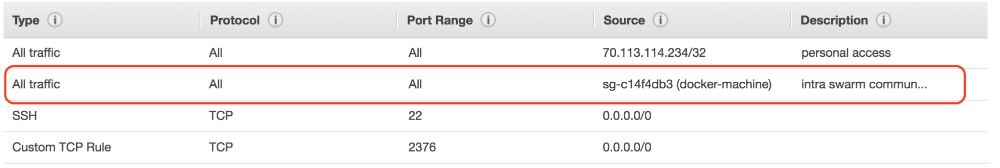

启用 Swarm 内部通信的 SG 规则

现在，让我们继续创建其余的四个节点。我们可以再次使用脚本来简化这个过程：

```
$ for NODE in `seq 2 5`; do
 docker-machine create --driver amazonec2 \
 --amazonec2-region us-east-1 aws-node-${NODE}
done
```

节点配置完成后，我们可以通过 DM 列出所有节点。在我的情况下，我看到的是：

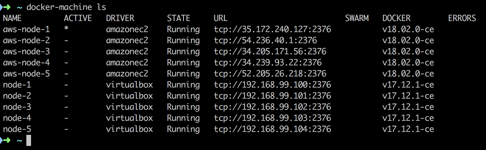

DM 创建的所有节点列表

在上面的截图中，我们可以看到最初在 VirtualBox 中创建的五个节点和在 AWS 上创建的五个新节点。显然，AWS 上的节点正在使用新版 Docker；此处版本为`18.02.0-ce`。我们在`URL`列中看到的 IP 地址是我 EC2 实例的公共 IP 地址。

因为我们的 CLI 仍然配置为远程访问`aws-node-1`节点，我们可以像下面这样运行`swarm init`命令：

```
$ docker swarm init
```

要获取加入令牌，请执行以下操作：

```
$ export JOIN_TOKEN=$(docker swarm join-token -q worker)
```

要获取领导者的 IP 地址，请使用以下命令：

```
$ export LEADER_ADDR=$(docker node inspect \
 --format "{{.ManagerStatus.Addr}}" self)
```

有了这些信息，我们现在可以将其他四个节点加入 Swarm 领导者：

```
$ for NODE in `seq 2 5`; do
 docker-machine ssh aws-node-${NODE} \
 sudo docker swarm join --token ${JOIN_TOKEN} ${LEADER_ADDR}
done
```

实现相同目标的另一种方式是，无需 SSH 进入单个节点，而是每次访问不同的节点时重新配置我们的客户端 CLI：

```
$ for NODE in `seq 2 5`; do
 eval $(docker-machine env aws-node-${NODE})
 docker swarm join --token ${JOIN_TOKEN} ${LEADER_ADDR}
done
```

最后一步，我们希望将节点`2`和`3`提升为管理节点：

```
$ eval $(docker-machine env node-1)
$ docker node promote aws-node-2 aws-node-3
```

然后我们可以列出所有 Swarm 节点，如下图所示：

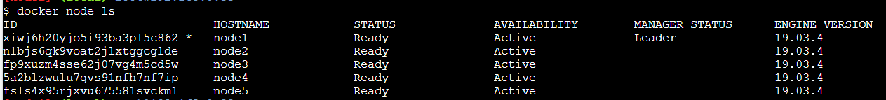

我们云中 Swarm 的所有节点列表

因此，我们在云中运行了一个高可用的 Docker Swarm。为了清理云中的 Swarm 并避免不必要的费用，我们可以使用以下命令：

```
$ for NODE in `seq 1 5`; do
 docker-machine rm -f aws-node-${NODE}
done
```

# 部署第一个应用

我们已经在不同的平台上创建了一些 Docker Swarm。创建之后，Swarm 在任何平台上表现相同。我们在 Swarm 上部署和更新应用的方式不依赖于平台。避免在使用 Swarm 时被厂商锁定一直是 Docker 的主要目标之一。准备好 Swarm 的应用可以轻松地从本地 Swarm 迁移到基于云的 Swarm。甚至在技术上，也可以将部分 Swarm 部署在本地，另一部分在云中运行。它是可行的，但我们当然需要考虑到地理上距离较远的节点之间可能会因为较高延迟带来的副作用。

现在我们已经搭建了一个高可用的 Docker Swarm，接下来是时候在其上运行一些工作负载了。我使用的是通过 docker-machine 创建的本地 Swarm。我们将首先创建一个单一的服务。为此，我们需要通过 SSH 连接到其中一个管理节点。我选择了`node-1`：

```
$ docker-machine ssh node-1
```

# 创建一个服务

服务可以作为堆栈的一部分创建，也可以直接使用 Docker CLI 创建。我们首先来看一个定义单个服务的示例堆栈文件：

```
version: "3.7"
services:
  whoami:
    image: training/whoami:latest
    networks:
      - test-net
    ports:
      - 81:8000
    deploy:
      replicas: 6
      update_config:
        parallelism: 2
        delay: 10s
      labels:
        app: sample-app
        environment: prod-south

networks:
  test-net:
    driver: overlay
```

在上面的示例中，我们可以看到名为`whoami`的服务的期望状态：

+   它基于`training/whoami:latest`镜像。

+   服务的容器附加到`test-net`网络。

+   容器端口`8000`映射到端口`81`。

+   它运行着六个副本（或任务）

+   在滚动更新过程中，单独的任务按两两个批次进行更新，每个成功批次之间有 10 秒的延迟。

+   该服务（及其任务和容器）被分配了两个标签`app`和`environment`，分别对应值`sample-app`和`prod-south`

我们可以为一个服务定义更多的设置，但前面提到的那些是一些比较重要的设置。大多数设置都有有意义的默认值。例如，如果我们没有指定副本数，Docker 会默认为`1`。服务的名称和镜像当然是必填项。请注意，服务的名称在 Swarm 中必须是唯一的。

要创建上述服务，我们使用`docker stack deploy`命令。假设前述内容存储的文件名为`stack.yaml`，我们有以下内容：

```
$ docker stack deploy -c stack.yaml sample-stack
```

在这里，我们创建了一个名为`sample-stack`的堆栈，其中包含一个服务`whoami`。我们可以列出 Swarm 中的所有堆栈，应该会得到如下输出：

```
$ docker stack ls
NAME             SERVICES
sample-stack     1
```

如果我们列出在 Swarm 中定义的服务，将得到以下输出：

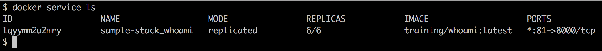

在 Swarm 中运行的所有服务列表

在输出中，我们可以看到目前只有一个服务在运行，这是预期中的情况。该服务有一个`ID`。与您迄今为止用于容器、网络或卷的 ID 格式不同，`ID` 是字母数字形式的（在后者情况下，它通常是`sha256`）。我们还可以看到服务的`NAME`是我们在堆栈文件中定义的服务名称和堆栈名称的组合，堆栈名称作为前缀使用。这是有道理的，因为我们希望能够使用相同的堆栈文件，将多个不同名称的堆栈部署到我们的 Swarm 中。为了确保服务名称的唯一性，Docker 决定将服务名称和堆栈名称结合起来。

在第三列中，我们可以看到模式是`replicated`。`REPLICAS`的数量显示为`6/6`，这告诉我们，六个请求的`REPLICAS`都在运行。这与期望状态相符。在输出中，我们还可以看到服务使用的镜像和服务的端口映射。

# 检查服务及其任务

在上面的输出中，我们无法看到已创建的`6`个副本的详细信息。为了深入了解，我们可以使用`docker service ps`命令。如果我们对我们的服务执行这个命令，将得到以下输出：

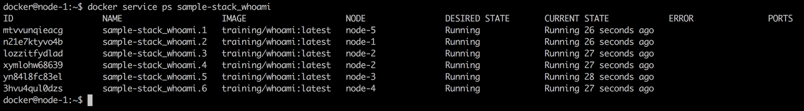

whoami 服务的详细信息

在上面的输出中，我们可以看到六个任务的列表，这些任务对应于我们`whoami`服务请求的六个副本。在`NODE`列中，我们还可以看到每个任务已部署到哪个节点。每个任务的名称是服务名称和递增索引的组合。还请注意，类似于服务本身，每个任务都会被分配一个字母数字 ID。

在我的情况下，显然任务 2，名称为`sample-stack_whoami.2`，已部署到`node-1`，这是我们 Swarm 的领导节点。因此，我应该能在该节点上找到一个正在运行的容器。让我们看看如果列出`node-1`上所有运行的容器会得到什么：

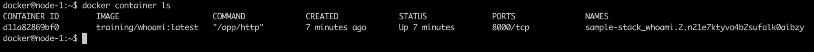

node-1 上的容器列表

正如预期的那样，我们找到了一个来自`training/whoami:latest`镜像的容器，容器的名称是其父任务名称和 ID 的组合。我们可以尝试可视化在部署示例堆栈时生成的所有对象的层级结构：

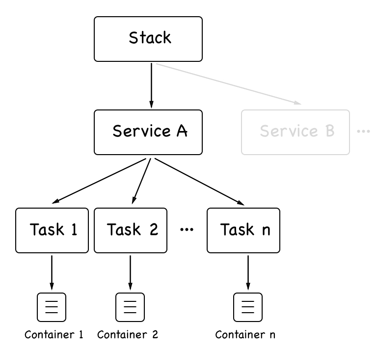

Docker Swarm 堆栈的对象层级结构

**堆栈**可以由一个或多个服务组成。每个服务都有一组任务。每个任务与一个容器一一对应。堆栈和服务在 Swarm 管理节点上创建并存储。然后，任务会调度到 Swarm 工作节点，工作节点在其上创建相应的容器。我们还可以通过检查服务获取更多信息。执行以下命令：

```
$ docker service inspect sample-stack_whoami
```

这提供了关于服务所有相关设置的丰富信息。这包括我们在`stack.yaml`文件中明确定义的设置，也包括那些我们未指定的，因此被分配了默认值的设置。我们不会在这里列出完整的输出，因为它太长，但我鼓励读者在自己的机器上查看。我们将在*The swarm routing mesh*部分更详细地讨论其中的一部分信息。

# 服务日志

在前面的章节中，我们处理了容器生成的日志。在这里，我们专注于服务。请记住，最终，一个具有多个副本的服务有多个容器在运行。因此，如果我们要求服务返回日志，Docker 会返回属于该服务的所有容器日志的汇总。事实上，如果我们使用`docker service logs`命令，正是这样得到的：

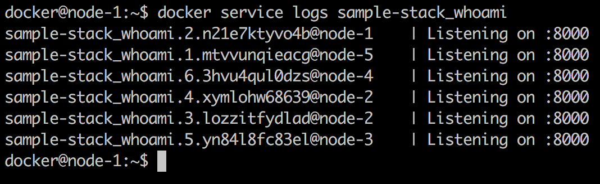

whoami 服务的日志

目前日志中没有太多信息，但足以讨论我们得到的内容。每行日志的第一部分总是包含容器的名称和该日志条目来源的节点名称。然后，使用竖线（`|`）分隔，我们得到了实际的日志条目。因此，如果我们直接要求查看列表中第一个容器的日志，我们只会得到一条日志条目，这时看到的值将是`Listening on :8000`。

我们通过`docker service logs`命令获得的汇总日志并没有按照特定的顺序排列。所以，如果事件的关联发生在不同的容器中，你应该在日志输出中添加一些信息以使这种关联成为可能。通常，这对于每个日志条目来说是一个时间戳。但这必须在源头完成；例如，生成日志条目的应用程序需要确保添加时间戳。

我们还可以通过提供任务 ID 而不是服务 ID 或名称，查询服务中单个任务的日志。所以，查询任务 2 的日志给我们以下输出：

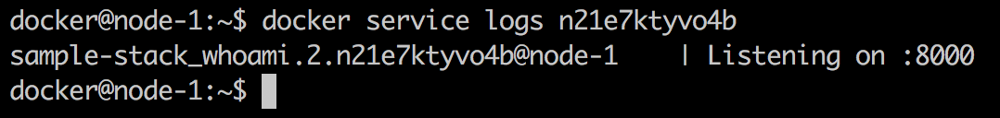

单个任务的 whoami 服务日志

# 调整期望状态

我们已经了解到，Swarm 服务是我们希望应用程序或应用程序服务运行的期望状态的描述或清单。现在，让我们看看如果我们做一些导致服务的实际状态与期望状态不同的操作，Docker Swarm 如何调整这个期望状态。最简单的方法是强制终止服务的某个任务或容器。

让我们对在`node-1`上调度的容器执行此操作：

```
$ docker container rm -f sample-stack_whoami.2.n21e7ktyvo4b2sufalk0aibzy
```

如果我们这样做，然后紧接着运行`docker service ps`，我们将看到以下输出：

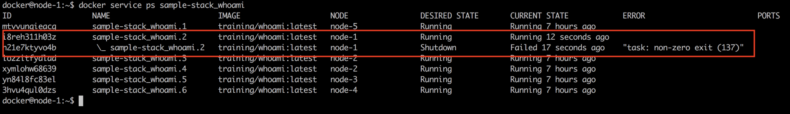

Docker Swarm 在一个任务失败后调整期望状态

我们看到任务 2 因退出代码`137`失败，并且 Swarm 立即通过在具有空闲资源的节点上重新调度失败的任务来调整期望状态。在这种情况下，调度程序选择了与失败任务相同的节点，但这并不总是如此。因此，在没有我们干预的情况下，Swarm 完全解决了问题，并且由于服务以多个副本运行，服务始终没有中断。

让我们尝试另一个故障场景。这一次我们将关闭整个节点，并观察 Swarm 如何反应。我们选择`node-2`，因为它上面运行着两个任务（任务 3 和任务 4）。为此，我们需要打开一个新的终端窗口，并使用`docker-machine`停止`node-2`：

```
$ docker-machine stop node-2
```

回到`node-1`，我们现在可以再次运行`docker service ps`来查看发生了什么：

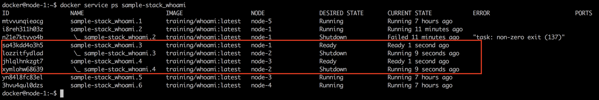

Swarm 重新调度失败节点的所有任务

在前面的截图中，我们可以看到，任务 3 立即被重新调度到`node-1`，而任务 4 则被重新调度到`node-3`。即使是这种更为剧烈的故障，Docker Swarm 也能优雅地处理。

需要注意的是，如果`node-2`在 Swarm 中重新上线，之前在其上运行的任务不会自动转移回该节点。但该节点现在已准备好处理新的工作负载。

# 删除服务或堆栈

如果我们想从 Swarm 中删除特定的服务，可以使用`docker service rm`命令。另一方面，如果我们想从 Swarm 中移除一个堆栈，我们类似地使用`docker stack rm`命令。此命令将删除堆栈定义的所有服务。对于`whoami`服务的情况，它是通过使用堆栈文件创建的，因此我们将使用后者命令：

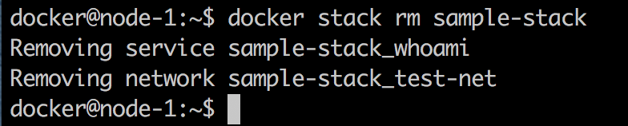

移除堆栈

上述命令将确保终止堆栈每个服务的所有任务，并通过首先发送`SIGTERM`，然后如果不成功，在超时 10 秒后发送`SIGKILL`来停止相应的容器。

值得注意的是，已停止的容器未从 Docker 主机中移除。因此，建议定期在工作节点上清理容器以回收未使用的资源。用`docker container purge -f`来实现这一目的。

问题：为什么将已停止或崩溃的容器留在工作节点上而不自动删除它们是有意义的？

# 部署多服务堆栈

在第十一章，*Docker Compose*，我们使用了一个由 Docker Compose 文件声明描述的由两个服务组成的应用程序。我们可以使用这个 Compose 文件作为模板创建一个堆栈文件，允许我们将相同的应用程序部署到 Swarm 中。我们的堆栈文件`pet-stack.yaml`的内容如下：

```
version: "3.7"
services:
 web:
   image: fundamentalsofdocker/ch11-web:2.0
   networks:
   - pets-net
   ports:
   - 3000:3000
   deploy:
     replicas: 3
 db:
   image: fundamentalsofdocker/ch11-db:2.0
   networks:
   - pets-net
   volumes:
   - pets-data:/var/lib/postgresql/data

volumes:
 pets-data:

networks:
 pets-net:
 driver: overlay
```

我们要求`web`服务有三个副本，并且两个服务都连接到覆盖网络`pets-net`。我们可以使用`docker stack deploy`命令部署此应用程序：

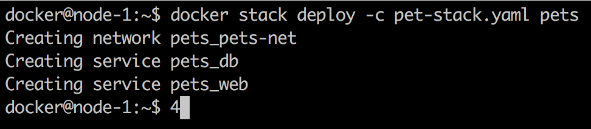

部署宠物堆栈

Docker 创建了`pets_pets-net`覆盖网络，然后是两个服务`pets_web`和`pets_db`。然后我们可以列出`pets`堆栈中的所有任务：

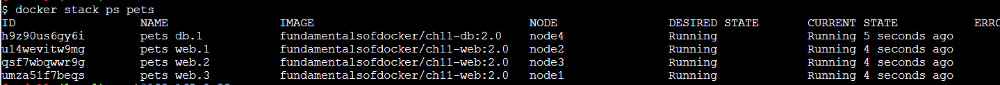

列出宠物堆栈中的所有任务

最后，让我们使用`curl`测试应用程序。确实，应用程序按预期工作：

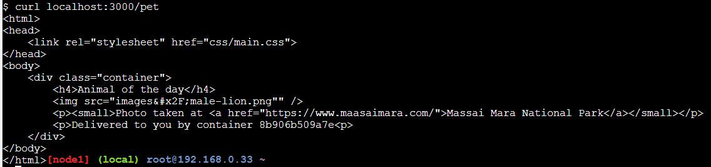

使用 curl 测试宠物应用程序

容器 ID 在输出中，显示为`Delivered to you by container 8b906b509a7e`。如果多次运行`curl`命令，ID 应在三个不同的值之间循环。这些是我们请求`web`服务的三个容器（或副本）的 ID。

完成后，我们可以使用`docker stack rm pets`删除堆栈。

# Swarm 路由网格

如果你一直在关注，那么你可能会注意到上一部分有一个有趣的现象。我们部署了`pets`应用程序，结果在`node-1`、`node-2`和`node-3`三个节点上安装了`web`服务的实例。然而，我们能够通过`localhost`访问`node-1`上的`web`服务，并且从那里访问每个容器。*这怎么可能？* 其实这是由于所谓的 Swarm 路由网格。路由网格确保当我们发布一个服务的端口时，这个端口会在 Swarm 的所有节点上发布。因此，任何节点上的网络流量，只要请求使用特定的端口，都会通过路由网格转发到服务的某个容器上。我们来看一下下面的图，看看它是如何工作的：


Docker Swarm 路由网格

在这种情况下，我们有三个节点，分别称为**Host A**、**Host B**和**Host C**，它们的 IP 地址分别是`172.10.0.15`、`172.10.0.17`和`172.10.0.33`。在图的左下角，我们看到创建**web**服务的命令，服务包含两个副本。相应的任务已被调度到**Host B**和**Host C**上。任务 1 被分配到**Host B**，而任务 2 被分配到**Host C**。

当在 Docker Swarm 上创建一个服务时，它会自动分配一个**虚拟 IP**（**VIP**）地址。这个 IP 地址在服务的整个生命周期内都是稳定且保留的。假设在我们的案例中，VIP 为`10.2.0.1`。

如果现在来自外部**负载均衡器**（**LB**）的请求针对我们的 Swarm 节点的端口`8080`，那么该请求将由该节点上的 Linux**IP 虚拟服务器**（**IPVS**）服务处理。该服务会在 IP 表中查找端口`8080`，并找到它对应的是**web**服务的 VIP。现在，由于 VIP 并不是实际的目标，IPVS 服务将进行负载均衡，将请求转发到与该服务关联的任务的 IP 地址。在我们的案例中，它选择了任务 2，对应的 IP 地址是`10.2.0.3`。最后，**入口**网络（**Overlay**）被用来将请求转发到**Host C**上的目标容器。

需要注意的是，外部请求被**外部负载均衡器**（**External LB**）转发到哪个 Swarm 节点并不重要。路由网格总是会正确处理请求，并将其转发到目标服务的其中一个任务。

# 总结

在本章中，我们介绍了 Docker Swarm，它是仅次于 Kubernetes 的第二大最流行的容器编排工具。我们探讨了 Swarm 的架构，讨论了 Swarm 中运行的各种资源类型，如服务、任务等，并且我们在 Swarm 中创建了服务并部署了由多个相关服务组成的应用程序。

在下一章，我们将探讨如何将服务或应用程序部署到 Docker Swarm 中，并实现零停机时间和自动回滚功能。我们还将介绍如何使用密钥来保护敏感信息。

# 问题

为了评估您的学习进度，请回答以下问题：

1.  如何初始化一个新的 Docker Swarm？

    A. `docker init swarm`

    B. `docker swarm init --advertise-addr <IP 地址>`

    C. `docker swarm join --token <join token>`

1.  如果您想从 Docker Swarm 中移除一个工作节点，需要哪些步骤？

1.  如何创建一个名为 `front-tier` 的覆盖网络？使该网络可连接。

1.  如何使用 `nginx:alpine` 镜像创建一个名为 `web` 的服务，包含五个副本，在入口网络上暴露端口 `3000`，并连接到 `front-tier` 网络？

1.  如何将网页服务缩放至三个实例？

# 深入阅读

请查阅以下链接，获取有关选定主题的更深入信息：

+   AWS EC2 示例 [`dockr.ly/2FFelyT`](http://dockr.ly/2FFelyT)

+   Raft 共识算法 [`raft.github.io/`](https://raft.github.io/)

+   谣言协议 [`en.wikipedia.org/wiki/Gossip_protocol`](https://en.wikipedia.org/wiki/Gossip_protocol)

+   VXLAN 和 Linux [`vincent.bernat.ch/en/blog/2017-vxlan-linux`](https://vincent.bernat.ch/en/blog/2017-vxlan-linux)
