# 第十六章：Kubernetes 简介

在上一章中，我们学习了 SwarmKit 如何通过滚动更新实现零停机部署。我们还介绍了 Docker 配置，它用于在集群中存储非敏感数据，并使用这些数据配置应用服务，以及 Docker 机密，它用于与在 Docker Swarm 中运行的应用服务共享机密数据。

本章中，我们将介绍 Kubernetes。Kubernetes 目前是容器编排领域的领头羊。我们将从 Kubernetes 集群架构的高层次概述开始，然后讨论 Kubernetes 中用于定义和运行容器化应用程序的主要对象。

本章涵盖以下内容：

+   Kubernetes 架构

+   Kubernetes 主节点

+   集群节点

+   MiniKube 简介

+   Docker for Desktop 中的 Kubernetes 支持

+   Pod 简介

+   Kubernetes ReplicaSet

+   Kubernetes 部署

+   Kubernetes 服务

+   基于上下文的路由

+   将 SwarmKit 与 Kubernetes 进行比较

完成本章后，你将能够完成以下任务：

+   在餐巾纸上绘制 Kubernetes 集群的高层架构

+   解释 Kubernetes Pod 的三到四个主要特性

+   用两到三句话描述 Kubernetes ReplicaSets 的作用

+   解释 Kubernetes 服务的两到三项主要职责

+   在 Minikube 中创建一个 Pod

+   配置 Docker for Desktop，以便使用 Kubernetes 作为编排器

+   在 Docker for Desktop 中创建一个部署

+   创建一个 Kubernetes 服务，将应用服务暴露到集群的内部（或外部）

# 技术要求

本章的代码文件可以在 GitHub 上找到，链接：[`github.com/PacktPublishing/Learn-Docker---Fundamentals-of-Docker-19.x-Second-Edition`](https://github.com/PacktPublishing/Learn-Docker---Fundamentals-of-Docker-19.x-Second-Edition)。或者，如果你按照第二章《设置工作环境》的描述，将本书附带的 GitHub 仓库克隆到你的计算机上，你可以在`~/fod-solution/ch15`找到代码。

# Kubernetes 架构

一个 Kubernetes 集群由一组服务器组成。这些服务器可以是虚拟机（VM）或物理服务器，后者也称为*裸金属*。集群的每个成员都有两个角色之一。它要么是 Kubernetes 主节点，要么是（工作）节点。前者用于管理集群，而后者将运行应用程序工作负载。我把工作节点放在括号中，因为在 Kubernetes 术语中，只有在讨论运行应用程序工作负载的服务器时，才会提到节点。但在 Docker 术语和 Swarm 中，相应的概念是*工作节点*。我认为“工作节点”的概念比简单的*节点*更能描述服务器的角色。

在集群中，你会有一个小而奇数的 master 节点，以及根据需要数量的 worker 节点。小型集群可能只有几个 worker 节点，而更现实的集群可能有几十个甚至上百个 worker 节点。从技术上讲，集群中 worker 节点的数量没有限制；但实际上，当处理成千上万个节点时，某些管理操作可能会显著变慢。集群中的所有成员需要通过一个物理网络连接，这就是所谓的**底层网络**。

Kubernetes 为整个集群定义了一个扁平网络。Kubernetes 本身并不提供任何内建的网络实现，而是依赖于第三方的插件。Kubernetes 只是定义了**容器网络接口**（**CNI**），并将实现留给其他人。CNI 非常简单，基本上规定了集群中运行的每个 pod 必须能够访问集群中运行的任何其他 pod，且中间不能发生**网络地址转换**（**NAT**）。集群节点与 pod 之间也必须满足相同的要求，即直接在集群节点上运行的应用或守护进程必须能够访问集群中的每个 pod，反之亦然。

以下图示展示了 Kubernetes 集群的高级架构：

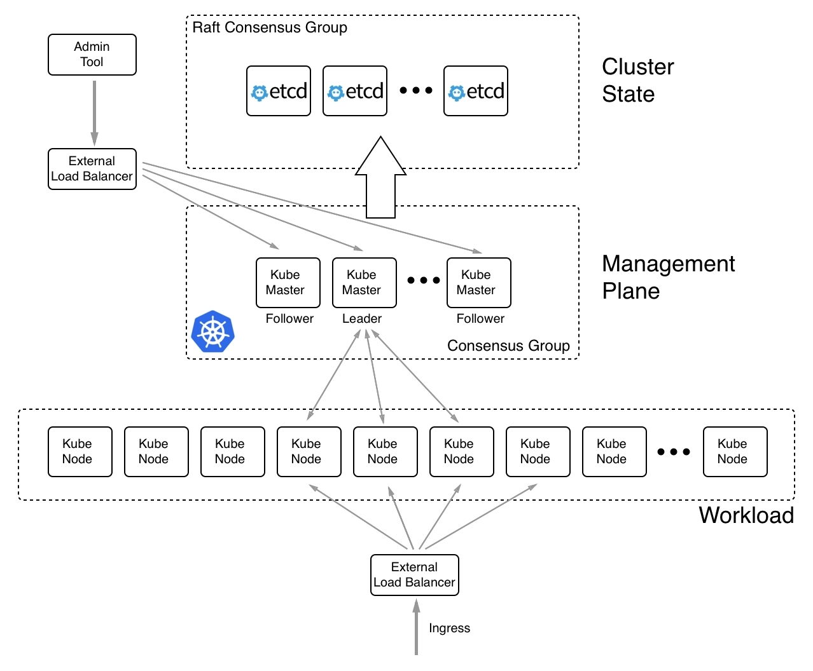

Kubernetes 的高级架构图

上面的图解说明如下：

+   在顶部中间，我们有一个**etcd**节点集群。**etcd**是一个分布式的键值存储，在 Kubernetes 集群中，用于存储集群的所有状态。**etcd**节点的数量必须是奇数，这是 Raft 共识协议的要求，该协议规定哪些节点用于相互协调。当我们谈论**集群状态**时，并不包括在集群中运行的应用所生产或消耗的数据；而是指集群拓扑结构、运行的服务、网络设置、使用的密钥等所有信息。也就是说，这个**etcd**集群对于整个集群至关重要，因此，在生产环境或任何需要高可用性的环境中，我们绝不应该只运行一个**etcd**服务器。

+   然后，我们有一个 Kubernetes **主** 节点的集群，它们之间也会形成一个 **共识** **组**，类似于 **etcd** 节点。主节点的数量也必须是奇数。我们可以用单个主节点运行集群，但在生产环境或关键任务系统中永远不应这样做。此时，我们应该始终至少有三个主节点。由于主节点用于管理整个集群，所以我们也在讨论管理平面。主节点使用 **etcd** 集群作为其后备存储。将 **负载均衡器**（**LB**）放置在主节点前面，并使用一个众所周知的 **完全合格域名**（**FQDN**），例如 `https://admin.example.com`，是一种良好的实践。所有用于管理 Kubernetes 集群的工具应通过这个 LB 访问，而不是直接使用某个主节点的公共 IP 地址。这在前述图的左上方有所展示。

+   在图的底部，我们有一个 **工作** 节点的集群。节点的数量可以低至一个，没有上限。Kubernetes 主节点和工作节点之间相互通信。这是一种双向通信形式，不同于我们在 Docker Swarm 中所知的通信方式。在 Docker Swarm 中，只有管理节点与工作节点进行通信，反之则不行。所有访问集群中运行的应用程序的入口流量应通过另一个 **负载均衡器**。这就是应用程序 **负载** **均衡器** 或反向代理。我们绝不希望外部流量直接访问任何工作节点。

现在我们对 Kubernetes 集群的高层架构有了一个大致了解，接下来我们深入探讨 Kubernetes 主节点和工作节点。

# Kubernetes 主节点

Kubernetes 主节点用于管理 Kubernetes 集群。以下是该主节点的高层次示意图：

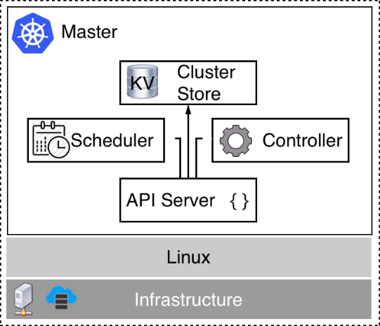

Kubernetes 主节点

在前述图的底部，我们有 **基础设施**，它可以是本地或云端的虚拟机，也可以是本地或云端的服务器（通常称为裸机服务器）。目前，Kubernetes 主节点仅能运行在 **Linux** 系统上。主流的 Linux 发行版，如 RHEL、CentOS 和 Ubuntu，均得到支持。在这台 Linux 机器上，我们至少运行以下四个 Kubernetes 服务：

+   **API 服务器**：这是访问 Kubernetes 的网关。所有列出、创建、修改或删除集群中任何资源的请求都必须经过此服务。它暴露一个 REST 接口，工具如 `kubectl` 使用这个接口来管理集群和集群中的应用程序。

+   **控制器**：控制器，或者更准确地说是控制器管理器，是一个控制循环，它通过 API 服务器观察集群的状态，并进行更改，试图将当前状态或有效状态与期望状态对齐，如果它们之间存在差异。

+   **调度器**：调度器是一个服务，尽力在考虑各种边界条件（如资源需求、策略、服务质量要求等）的情况下，将 Pod 调度到工作节点上。

+   **集群存储**：这是一个 etcd 实例，用于存储集群状态的所有信息。

更准确地说，作为集群存储使用的 etcd 并不一定需要安装在与其他 Kubernetes 服务相同的节点上。有时，Kubernetes 集群被配置为使用独立的 etcd 服务器集群，如前一部分的架构图所示。但选择使用哪种变体是一个高级管理决策，超出了本书的范围。

我们至少需要一个主节点，但为了实现高可用性，我们需要三个或更多的主节点。这与我们在 Docker Swarm 中学到的管理节点非常相似。在这方面，Kubernetes 的主节点相当于 Swarm 的管理节点。

Kubernetes 主节点从不运行应用工作负载。它们的唯一目的是管理集群。Kubernetes 主节点构建一个 Raft 一致性协议组。Raft 协议是一个标准协议，用于需要集体决策的情况。它被许多著名的软件产品使用，如 MongoDB、Docker SwarmKit 和 Kubernetes。关于 Raft 协议的更深入讨论，请参见 *进一步阅读* 部分的链接。

正如我们在前一部分提到的，Kubernetes 集群的状态存储在 etcd 中。如果 Kubernetes 集群需要高度可用，那么 etcd 也必须配置为高可用模式，这通常意味着我们至少有三个 etcd 实例在不同的节点上运行。

我们再一次强调，整个集群的状态存储在 etcd 中。这包括所有集群节点的信息、所有副本集、部署、机密、网络策略、路由信息等。因此，确保我们有一个稳健的备份策略来保护这个键值存储至关重要。

现在，让我们来看看那些将运行集群实际工作负载的节点。

# 集群节点

集群节点是 Kubernetes 调度应用工作负载的节点。它们是集群的主力军。一个 Kubernetes 集群可以拥有少量、几十个、几百个甚至几千个集群节点。Kubernetes 从一开始就为了高扩展性而构建。别忘了，Kubernetes 是以 Google Borg 为模型的，后者已经运行了数万个容器多年：

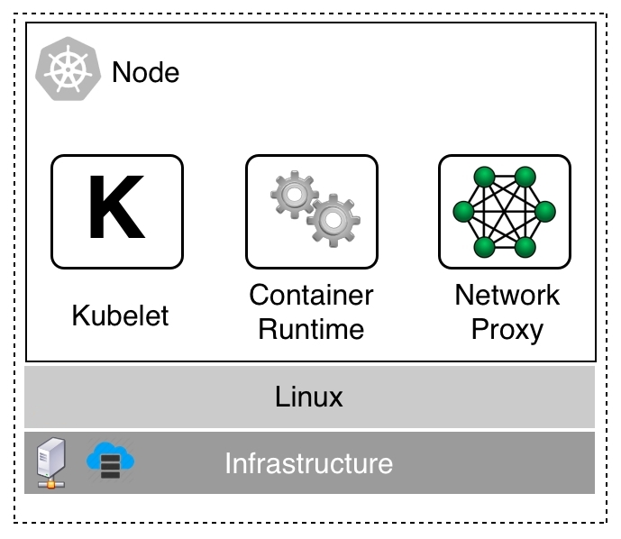

Kubernetes 工作节点

一个工作节点可以运行在虚拟机、裸金属、内部服务器或云环境中。最初，工作节点只能在 Linux 上配置。但是从 Kubernetes 1.10 版本开始，工作节点也可以运行在 Windows Server 上。拥有一个包含 Linux 和 Windows 工作节点的混合集群是完全可以的。

在每个节点上，我们需要运行三个服务，具体如下：

+   **Kubelet**：这是第一个也是最重要的服务。Kubelet 是主要的节点代理。kubelet 服务使用 Pod 规范确保对应 Pod 的所有容器都在运行且健康。Pod 规范是用 YAML 或 JSON 格式编写的文件，它们声明性地描述一个 Pod。我们将在下一节中了解什么是 Pod。PodSpec 主要通过 API 服务器提供给 kubelet。

+   **容器运行时**：在每个工作节点上需要存在的第二个服务是容器运行时。Kubernetes 从版本 1.9 开始默认使用`containerd`作为其容器运行时。在此之前，它使用的是 Docker 守护进程。还可以使用其他容器运行时，例如 rkt 或 CRI-O。容器运行时负责管理和运行 Pod 的各个容器。

+   **kube-proxy**：最后是 kube-proxy。它作为守护进程运行，是一个简单的网络代理和负载均衡器，用于管理该节点上运行的所有应用服务。

现在，我们已经了解了 Kubernetes 的架构以及主节点和工作节点的概念，是时候介绍我们可以用来开发面向 Kubernetes 应用的工具了。

# Minikube 简介

Minikube 是一个在 VirtualBox 或 Hyper-V（也支持其他虚拟化程序）中创建单节点 Kubernetes 集群的工具，适用于容器化应用开发。在第二章《设置工作环境》中，我们学习了如何在 macOS 或 Windows 笔记本上安装 Minikube 和`kubectl`。如前所述，Minikube 是一个单节点 Kubernetes 集群，因此该节点既是 Kubernetes 主节点也是工作节点。

让我们通过以下命令确保 Minikube 正在运行：

```
$ minikube start
```

一旦 Minikube 准备就绪，我们可以使用`kubectl`访问其单节点集群。我们应该看到类似如下的内容：

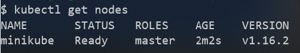

列出 Minikube 中的所有节点

正如我们之前提到的，我们有一个名为`minikube`的单节点集群。Minikube 使用的 Kubernetes 版本在我这里是`v1.16.2`。

现在，让我们尝试将一个 Pod 部署到这个集群。现在不必担心 Pod 是什么；我们将在本章后面深入探讨它的所有细节。暂时，先按原样理解它即可。

我们可以使用`labs`文件夹下`ch15`子文件夹中的`sample-pod.yaml`文件来创建这样的 Pod。它的内容如下：

```
apiVersion: v1
kind: Pod
metadata:
  name: nginx
spec:
  containers:
  - name: nginx
    image: nginx:alpine
    ports:
    - containerPort: 80
    - containerPort: 443
```

使用以下步骤来运行 Pod：

1.  首先，导航到正确的文件夹：

```
$ cd ~/fod/ch15
```

1.  现在，让我们使用名为`kubectl`的 Kubernetes 命令行工具来部署这个 Pod：

```
$ kubectl create -f sample-pod.yaml
pod/nginx created
```

如果我们现在列出所有 Pod，应该会看到如下内容：

```
$ kubectl get pods
NAME    READY   STATUS    RESTARTS   AGE
nginx   1/1     Running   0          51s
```

1.  为了能够访问这个 Pod，我们需要创建一个服务。我们使用`sample-service.yaml`文件，它的内容如下：

```
apiVersion: v1
kind: Service
metadata:
  name: nginx-service
spec:
  type: LoadBalancer
  ports:
  - port: 8080
    targetPort: 80
    protocol: TCP
  selector:
    app: nginx
```

1.  再次强调，此时不必担心服务的具体含义。我们稍后会解释。现在让我们创建这个服务：

```
$ kubectl create -f sample-service.yaml
```

1.  现在，我们可以使用 `curl` 来访问该服务：

```
$ curl -4 http://localhost
```

我们应该会收到 Nginx 欢迎页面的回应。

1.  在继续之前，请删除你刚刚创建的两个对象：

```
$ kubectl delete po/nginx
$ kubectl delete svc/nginx-service
```

# Docker for Desktop 中的 Kubernetes 支持

从版本 18.01-ce 开始，Docker for macOS 和 Docker for Windows 开始支持开箱即用的 Kubernetes。希望将其容器化应用部署到 Kubernetes 的开发者可以使用这个协调器，而不是 SwarmKit。Kubernetes 支持默认是关闭的，必须在设置中启用。第一次启用 Kubernetes 时，Docker for macOS 或 Windows 将需要一些时间来下载创建单节点 Kubernetes 集群所需的所有组件。与 Minikube 相比，尽管 Minikube 也是一个单节点集群，但 Docker 工具提供的版本使用了所有 Kubernetes 组件的容器化版本：

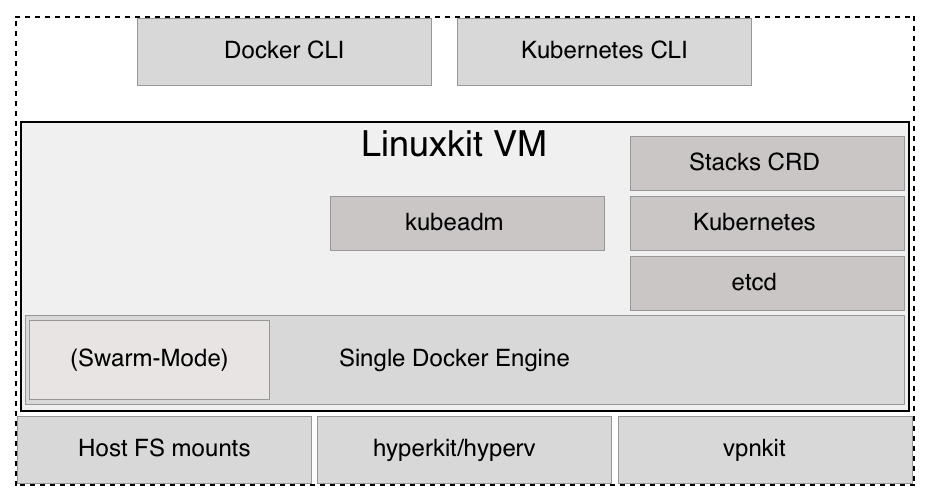

macOS 和 Windows 上的 Docker Kubernetes 支持

上面的图表大致展示了 Kubernetes 支持是如何被添加到 Docker for macOS 和 Windows 中的。Docker for macOS 使用 hyperkit 来运行基于 LinuxKit 的虚拟机。Docker for Windows 使用 Hyper-V 来实现相同的效果。在虚拟机内，安装了 Docker 引擎。引擎的一部分是 SwarmKit，它启用了 **Swarm-Mode**。Docker for macOS 或 Windows 使用 **kubeadm** 工具来设置和配置虚拟机中的 Kubernetes。以下三个事实值得一提：Kubernetes 将其集群状态存储在 **etcd** 中，因此我们在这个虚拟机上运行了 **etcd**。接着，我们有了组成 Kubernetes 的所有服务，最后还有一些支持将 Docker 堆栈从 **Docker CLI** 部署到 Kubernetes 的服务。这个服务不是 Kubernetes 官方发行版的一部分，但它是 Docker 特有的。

所有 Kubernetes 组件都在 **LinuxKit VM** 中的容器中运行。这些容器可以通过 Docker for macOS 或 Windows 中的设置来隐藏。在本节稍后，我们将提供一份完整的 Kubernetes 系统容器列表，如果你启用了 Kubernetes 支持，它们将会在你的笔记本电脑上运行。为了避免重复，从现在开始，我将只提到 Docker for Desktop，而不是 Docker for macOS 或 Docker for Windows。我要说的内容同样适用于这两个版本。

启用 Kubernetes 的 Docker for Desktop 相较于 Minikube 的一个大优点是，前者允许开发者使用单一工具来构建、测试和运行针对 Kubernetes 的容器化应用。甚至可以通过 Docker Compose 文件将多服务应用部署到 Kubernetes 中。

现在，让我们动手操作一下：

1.  首先，我们需要启用 Kubernetes。在 macOS 上，点击菜单栏中的 Docker 图标；在 Windows 上，进入命令托盘并选择“首选项”。在弹出的对话框中，选择 Kubernetes，如下图所示：

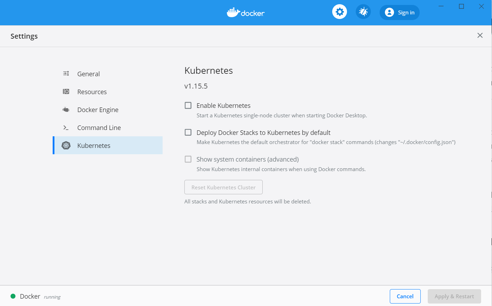

在 Docker for Desktop 中启用 Kubernetes

1.  然后，勾选“启用 Kubernetes”复选框。同时，勾选“默认将 Docker 堆栈部署到 Kubernetes”以及“显示系统容器（高级）”复选框。接着，点击“应用并重启”按钮。Kubernetes 的安装和配置需要几分钟时间。现在，正是休息一下，享受一杯好茶的时刻。

1.  安装完成后（Docker 会通过在设置对话框中显示绿色状态图标来通知我们），我们可以进行测试。由于现在我们有两个 Kubernetes 集群在笔记本上运行，即 Minikube 和 Docker for Desktop，因此我们需要配置 `kubectl` 来访问后者。

首先，让我们列出所有的上下文：

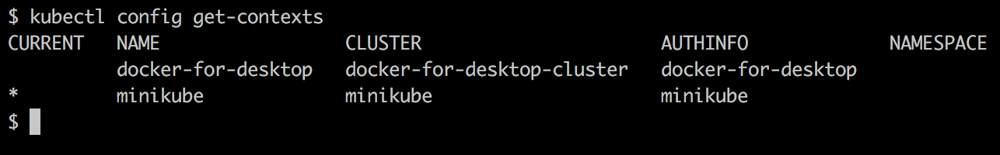

kubectl 的上下文列表

在这里，我们可以看到，在我的笔记本上，我有之前提到的两个上下文。当前，Minikube 上下文仍然处于活动状态，通过 `CURRENT` 列中的星号标记。我们可以使用以下命令切换到 `docker-for-desktop` 上下文：

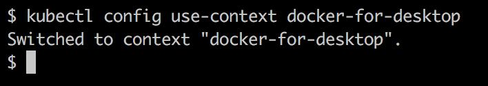

更改 Kubernetes CLI 的上下文

现在，我们可以使用 `kubectl` 访问 Docker for Desktop 刚刚创建的集群。我们应该看到如下内容：

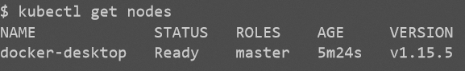

Docker for Desktop 创建的单节点 Kubernetes 集群

好的，这看起来很熟悉。它与我们在使用 Minikube 时看到的几乎相同。我的 Docker for Desktop 正在使用的 Kubernetes 版本是 `1.15.5`。我们还可以看到该节点是主节点。

如果我们列出当前在 Docker for Desktop 上运行的所有容器，我们会看到下图所示的列表（注意，我使用了 `--format` 参数来输出容器的 `Container ID` 和 `Names`）：

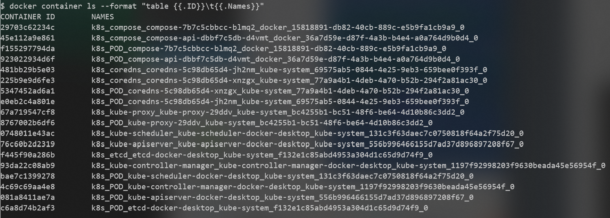

Kubernetes 系统容器

在前面的列表中，我们可以识别出所有现在熟悉的 Kubernetes 组成部分，如下所示：

+   API 服务器

+   etcd

+   Kube 代理

+   DNS 服务

+   Kube 控制器

+   Kube 调度器

还有一些容器名称中包含 `compose` 的。这些是 Docker 特定的服务，允许我们将 Docker Compose 应用部署到 Kubernetes 上。Docker 会翻译 Docker Compose 语法，并隐式创建必要的 Kubernetes 对象，例如部署、Pod 和服务。

通常，我们不希望把这些系统容器和其他容器混在一起。因此，我们可以在 Kubernetes 设置中取消勾选“显示系统容器（高级）”复选框。

现在，让我们尝试将一个 Docker Compose 应用部署到 Kubernetes。进入我们 `~/fod` 文件夹中的 `ch15` 子文件夹。我们使用 `docker-compose.yml` 文件作为堆栈来部署该应用：

```
$ docker stack deploy -c docker-compose.yml app
```

我们应该看到以下内容：

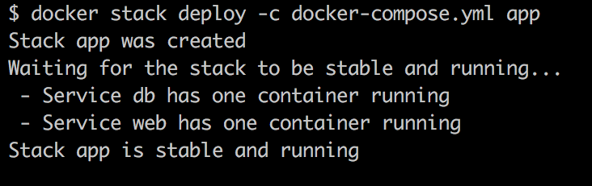

部署堆栈到 Kubernetes

我们可以测试应用，例如使用 `curl`，并且我们会看到它按照预期运行：

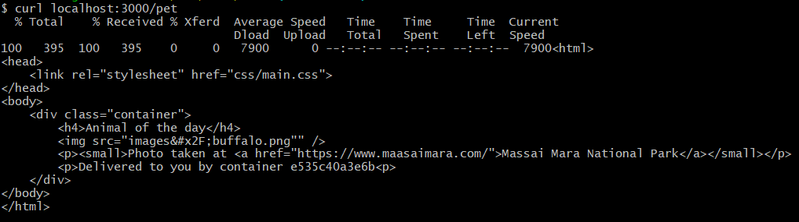

宠物应用在 Kubernetes 上运行，使用 Docker for Desktop

现在，让我们来看一下当我们执行 `docker stack deploy` 命令时，Docker 究竟做了什么。我们可以使用 `kubectl` 来查看：

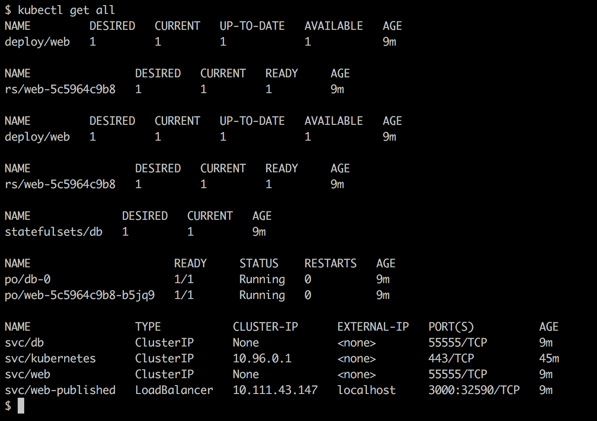

列出通过 docker stack deploy 创建的所有 Kubernetes 对象

Docker 为 `web` 服务创建了一个部署，并为 `db` 服务创建了一个有状态集。它还自动为 `web` 和 `db` 创建了 Kubernetes 服务，以便它们可以在集群内访问。它还创建了 Kubernetes 的 `svc/web-published` 服务，用于外部访问。

这至少可以说是非常酷的，并且大大减少了开发过程中对于 Kubernetes 作为编排平台的团队的摩擦。

在继续之前，请从集群中删除该堆栈：

```
$ docker stack rm app
```

此外，确保将 `kubectl` 的上下文重置为 Minikube，因为我们将在本章中使用 Minikube 进行所有示例：

```
$ kubectl config use-context minikube
```

现在，我们已经了解了可以用来开发最终将在 Kubernetes 集群中运行的应用程序的工具，是时候了解用于定义和管理这类应用程序的所有重要 Kubernetes 对象了。我们将从 Pod 开始。

# Pod 介绍

与 Docker Swarm 中可能做到的不同，你不能直接在 Kubernetes 集群中运行容器。在 Kubernetes 集群中，你只能运行 Pod。Pod 是 Kubernetes 中部署的基本单元。Pod 是一个抽象，它包含一个或多个共同部署的容器，这些容器共享相同的内核命名空间，例如网络命名空间。在 Docker SwarmKit 中没有等效概念。多个容器可以共同部署并共享相同的网络命名空间，这是一个非常强大的概念。下面的图示展示了两个 Pod：

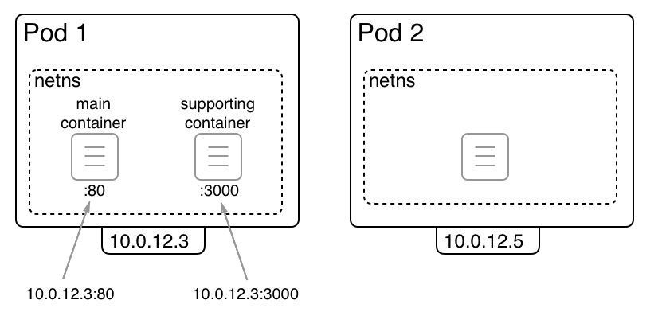

Kubernetes Pod

在上面的图示中，我们有两个 Pod，**Pod 1** 和 **Pod 2**。第一个 Pod 包含两个容器，而第二个 Pod 仅包含一个容器。每个 Pod 都会获得 Kubernetes 分配的唯一 IP 地址，这些 IP 地址在整个 Kubernetes 集群中都是唯一的。在我们的例子中，这些 IP 地址为：`10.0.12.3` 和 `10.0.12.5`。它们都属于 Kubernetes 网络驱动程序管理的私有子网。

一个 Pod 可以包含一个或多个容器。所有这些容器共享相同的 Linux 内核命名空间，特别是它们共享网络命名空间。这通过围绕容器的虚线矩形来表示。由于所有在同一 Pod 中运行的容器共享网络命名空间，因此每个容器需要确保使用自己独特的端口，因为在单个网络命名空间中不允许端口重复。在这种情况下，在**Pod 1**中，**主容器**使用端口`80`，而**辅助容器**使用端口`3000`。

来自其他 Pod 或节点的请求可以使用 Pod 的 IP 地址和相应的端口号来访问单独的容器。例如，你可以通过`10.0.12.3:80`访问在**Pod 1**的主容器中运行的应用。

# 比较 Docker 容器网络与 Kubernetes Pod 网络

现在，让我们比较 Docker 的容器网络与 Kubernetes 的 Pod 网络。在下图中，左边是 Docker 容器网络，右边是 Kubernetes Pod 网络：

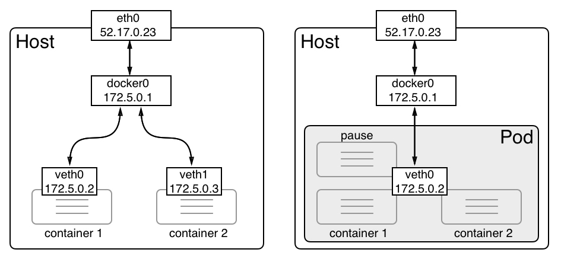

在 Pod 中的容器共享相同的网络命名空间

当创建 Docker 容器且未指定特定网络时，Docker 引擎会创建一个**虚拟以太网**（**veth**）端点。第一个容器获得**veth0**，下一个容器获得**veth1**，依此类推。这些虚拟以太网端点连接到 Docker 在安装时自动创建的 Linux 桥接**docker0**。流量从**docker0**桥接路由到每个连接的**veth**端点。每个容器都有自己的网络命名空间。没有两个容器使用相同的命名空间。这是故意设置的，用来隔离容器内运行的应用程序。

对于 Kubernetes Pod，情况有所不同。在创建新 Pod 时，Kubernetes 首先创建一个所谓的**pause**容器，唯一目的是创建和管理 Pod 与所有容器共享的命名空间。除此之外，它没有任何实际作用，只是处于睡眠状态。**pause**容器通过**veth0**连接到**docker0**桥接网络。任何后续的容器都会使用 Docker 引擎的一个特殊功能，允许它重用现有的网络命名空间。实现这个功能的语法如下所示：

```
$ docker container create --net container:pause ... 
```

重要部分是`--net`参数，其值为`container:<container name>`。如果我们以这种方式创建一个新容器，那么 Docker 不会创建一个新的 veth 端点；容器将使用与`pause`容器相同的端点。

另一个重要的后果是多个容器共享相同的网络命名空间，它们相互通信的方式。让我们考虑以下情况：一个 Pod 包含两个容器，一个监听`80`端口，另一个监听`3000`端口：

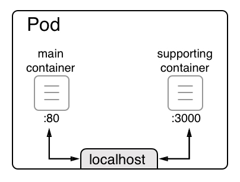

Pod 中的容器通过 localhost 进行通信

当两个容器使用相同的 Linux 内核网络命名空间时，它们可以通过 localhost 进行通信，就像在同一主机上运行的两个进程可以通过 localhost 相互通信一样。这个过程在上面的图示中有所展示。从`main`容器来看，它内部的容器化应用程序可以通过`http://localhost:3000`访问到支持容器中运行的服务。

# 共享网络命名空间

在这些理论之后，你可能会想知道 Kubernetes 是如何实际创建一个 pod 的。Kubernetes 仅使用 Docker 提供的功能。那么，*这个网络命名空间是如何共享的？*首先，Kubernetes 会创建之前提到的所谓`pause`容器。这个容器的唯一功能就是为该 pod 保留内核命名空间并保持它们存活，即使 pod 内部没有其他容器在运行。我们来模拟一下创建一个 pod 的过程。首先创建`pause`容器，并使用 Nginx 来实现这个目的：

```
$ docker container run -d --name pause nginx:alpine
```

现在，我们添加第二个容器，名为`main`，并将其连接到与`pause`容器相同的网络命名空间：

```
$ docker container run --name main -dit \
 --net container:pause \
 alpine:latest /bin/sh
```

由于`pause`和示例容器都属于同一个网络命名空间，它们可以通过`localhost`互相访问。为了展示这一点，我们需要进入`main`容器执行`exec`命令：

```
$ docker exec -it main /bin/sh
```

现在，我们可以测试连接到在`pause`容器中运行并监听端口`80`的 Nginx。以下是如果使用`wget`工具进行此操作时我们得到的结果：

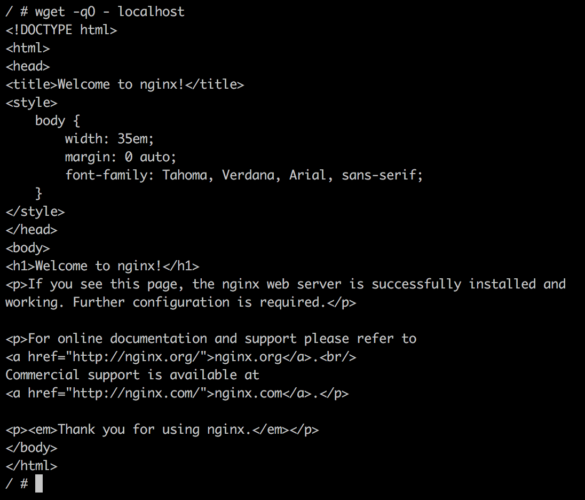

两个容器共享相同的网络命名空间

输出显示我们确实可以通过`localhost`访问到 Nginx。这证明了这两个容器共享相同的命名空间。如果这还不够，我们可以使用`ip`工具在两个容器内展示`eth0`，结果会完全相同，具体来说，是相同的 IP 地址，这也是 pod 的一个特点，其中所有容器共享相同的 IP 地址：

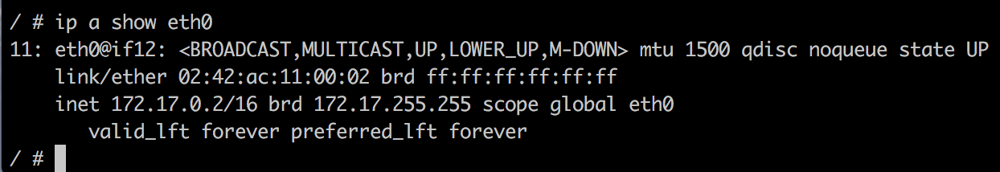

使用`ip`工具显示 eth0 的属性

如果我们检查`bridge`网络，我们可以看到只有`pause`容器被列出。另一个容器没有在`Containers`列表中出现，因为它正在重用`pause`容器的端点：

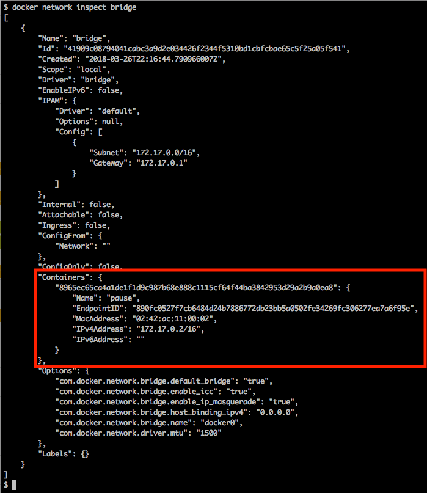

检查 Docker 默认的 bridge 网络

接下来，我们将查看 pod 的生命周期。

# Pod 生命周期

在本书前面，我们学习了容器有一个生命周期。一个容器会被初始化、运行，最终退出。当容器退出时，它可以以退出码为零的方式优雅地退出，或者它可能会因为错误而终止，这相当于一个非零的退出码。

类似地，pod 也有生命周期。由于一个 pod 可以包含多个容器，因此它的生命周期比单一容器要复杂一些。pod 的生命周期可以通过以下图示来展示：

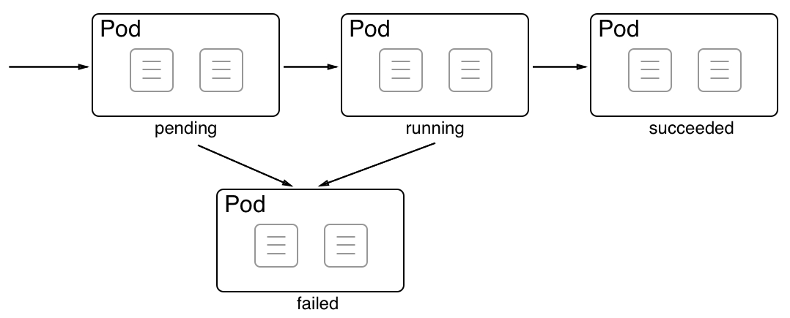

Kubernetes Pod 的生命周期

当在集群节点上创建一个**Pod**时，它首先进入**待处理**状态。一旦 Pod 的所有容器都启动并正常运行，Pod 就会进入**运行中**状态。只有当所有容器都成功运行时，Pod 才会进入这个状态。如果 Pod 被要求终止，它将请求所有容器终止。如果所有容器都以退出代码零终止，那么 Pod 将进入**成功**状态。这是理想的情况。

现在，让我们看看一些导致 Pod 处于**失败**状态的场景。有三种可能的情况：

+   如果在 Pod 启动期间，至少有一个容器无法运行并失败（即以非零退出代码退出），Pod 将从**待处理**状态进入**失败**状态。

+   如果 Pod 处于运行中状态，且其中一个容器突然崩溃或以非零退出代码退出，那么 Pod 将从**运行中**状态转变为**失败**状态。

+   如果 Pod 被要求终止，并且在关闭期间，至少有一个容器以非零退出代码退出，那么 Pod 也会进入**失败**状态。

现在，让我们看看 Pod 的规格。

# Pod 规格

在 Kubernetes 集群中创建 Pod 时，我们可以使用命令式或声明式的方法。我们在本书早些时候讨论了这两种方法的区别，但为了重述最重要的方面，使用声明式方法意味着我们编写一个描述我们希望实现的最终状态的清单。我们将省略编排器的细节。我们希望实现的最终状态也称为**期望状态**。通常，在所有已建立的编排器中，声明式方法是强烈推荐的，Kubernetes 也不例外。

因此，在本章中，我们将专注于声明式方法。Pod 的清单或规格可以使用 YAML 或 JSON 格式编写。在本章中，我们将专注于 YAML，因为它对我们人类来说更易于阅读。让我们看看一个示例规格。以下是`pod.yaml`文件的内容，该文件可以在我们的`labs`文件夹中的`ch12`子文件夹中找到：

```
apiVersion: v1
kind: Pod
metadata:
  name: web-pod
spec:
  containers:
  - name: web
    image: nginx:alpine
    ports:
    - containerPort: 80
```

Kubernetes 中的每个规范都以版本信息开头。Pod 已经存在了一段时间，因此 API 版本是`v1`。第二行指定了我们想要定义的 Kubernetes 对象或资源的类型。显然，在这种情况下，我们想要指定一个`Pod`。接下来是包含元数据的块。最基本的是，我们需要为 Pod 命名。这里，我们将其命名为`web-pod`。接下来的块是`spec`块，其中包含 Pod 的规范。最重要的部分（也是这个简单示例中的唯一部分）是列出所有属于该 Pod 的容器。这里我们只有一个容器，但也可以有多个容器。我们为容器选择的名称是`web`，容器镜像是`nginx:alpine`。最后，我们定义了容器暴露的端口列表。

一旦我们编写了这样的规范，我们可以使用 Kubernetes CLI `kubectl`将其应用到集群中。在终端中，导航到`ch15`子文件夹并执行以下命令：

```
$ kubectl create -f pod.yaml
```

这将响应`pod "web-pod" created`。然后，我们可以使用`kubectl get pods`列出集群中的所有 Pods：

```
$ kubectl get pods
NAME      READY   STATUS    RESTARTS   AGE
web-pod   1/1     Running   0          2m
```

正如预期的那样，我们有一个处于运行状态的 Pod，Pod 的名称是`web-pod`，如前所定义。我们可以使用`describe`命令获取关于运行中 Pod 的更详细信息：

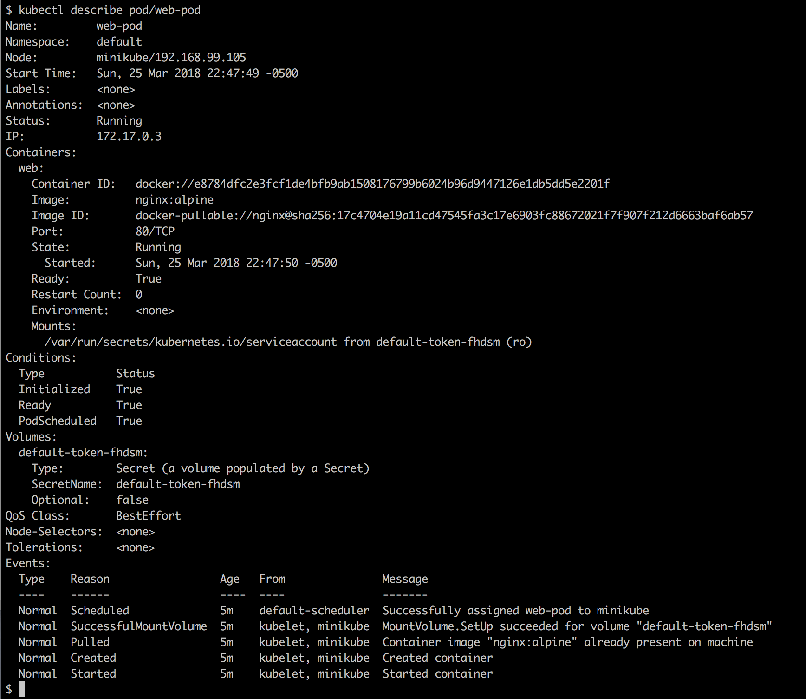

描述集群中运行的 Pod

请注意前面`describe`命令中的`pod/web-pod`标记。还有其他变体，例如`pods/web-pod`、`po/web-pod`。`pod`和`po`是`pods`的别名。`kubectl`工具定义了许多别名，让我们的工作变得更轻松。

`describe`命令提供了关于 Pod 的大量有价值的信息，其中最重要的是影响此 Pod 的事件列表。该列表显示在输出的末尾。

`Containers`部分的信息与我们在`docker container inspect`输出中看到的信息非常相似。

我们还可以看到一个`Volumes`部分，其中有一个`Secret`类型的条目。我们将在下一章讨论 Kubernetes 秘密。另一方面，卷将在下文讨论。

# Pods 和卷

在第五章中，*数据卷和配置*，我们了解了卷及其目的：访问和存储持久数据。由于容器可以挂载卷，Pod 也可以如此。实际上，真正挂载卷的是 Pod 内的容器，但这只是一个语义上的细节。首先，让我们看看如何在 Kubernetes 中定义一个卷。Kubernetes 支持多种类型的卷，因此我们不会深入探讨太多细节。我们只需通过定义一个名为`my-data-claim`的`PersistentVolumeClaim`来隐式创建一个本地卷：

```
apiVersion: v1
kind: PersistentVolumeClaim
metadata:
  name: my-data-claim
spec:
  accessModes:
    - ReadWriteOnce
  resources:
    requests:
      storage: 2Gi
```

我们已定义了一个请求 2GB 数据的声明。让我们创建这个声明：

```
$ kubectl create -f volume-claim.yaml
```

我们可以使用`kubectl`列出该声明（`pvc`是`PersistentVolumeClaim`的快捷方式）：

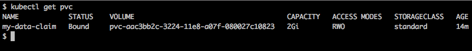

集群中的持久存储声明对象列表

在输出中，我们可以看到声明隐式创建了一个名为`pvc-<ID>`的卷。现在我们已经准备好在 pod 中使用声明创建的卷。让我们使用之前使用过的 pod 规格的修改版本。我们可以在`ch12`文件夹中的`pod-with-vol.yaml`文件中找到这个更新后的规格。让我们详细查看这个规格：

```
apiVersion: v1
kind: Pod
metadata:
  name: web-pod
spec:
  containers:
  - name: web
    image: nginx:alpine
    ports:
    - containerPort: 80
    volumeMounts:
    - name: my-data
      mountPath: /data
  volumes:
  - name: my-data
    persistentVolumeClaim:
      claimName: my-data-claim
```

在最后四行的`volumes`块中，我们定义了一个我们希望在此 pod 中使用的卷列表。我们在这里列出的卷可以被 pod 中的任何容器使用。在我们的特定案例中，我们只有一个卷。我们指定了一个名为`my-data`的卷，它是一个持久卷声明，其声明名称就是我们刚刚创建的名称。然后，在容器规格中，我们有一个`volumeMounts`块，在这里我们定义了我们想要使用的卷，以及卷将挂载到容器内部的（绝对）路径。在我们的案例中，我们将卷挂载到容器文件系统中的`/data`文件夹。现在让我们创建这个 pod：

```
$ kubectl create -f pod-with-vol.yaml
```

然后，我们可以`exec`进入容器，通过导航到`/data`文件夹，创建一个文件并退出容器，以此来双重检查卷是否已经挂载：

```
$ kubectl exec -it web-pod -- /bin/sh
/ # cd /data
/data # echo "Hello world!" > sample.txt
/data # exit
```

如果我们没错的话，那么这个容器中的数据必须超出 pod 生命周期而持续存在。因此，让我们删除 pod，然后重新创建它，再进入容器以确保数据仍然存在。结果如下：

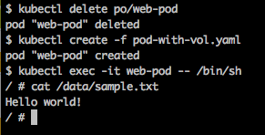

存储在卷中的数据在 pod 重建后依然存在

现在我们对 pod 有了充分的了解，让我们看看如何在 ReplicaSets 的帮助下管理这些 pod。

# Kubernetes ReplicaSet

在具有高可用性要求的环境中，单个 pod 是不够的。*如果 pod 崩溃怎么办？* *如果我们需要更新 pod 内运行的应用程序，但无法承受任何服务中断怎么办？* 这些问题以及其他问题表明，仅有 pod 还不够，我们需要一个可以管理同一 pod 的多个实例的更高级别概念。在 Kubernetes 中，**ReplicaSet**用于定义和管理这样一个运行在不同集群节点上的相同 pod 集合。除了其他内容之外，ReplicaSet 定义了 pod 内运行的容器使用哪些容器镜像，以及集群中将运行多少个 pod 实例。这些属性和许多其他属性被称为期望状态。

ReplicaSet 负责在任何时候都保持期望状态一致，如果实际状态偏离了期望状态。下面是一个 Kubernetes ReplicaSet：

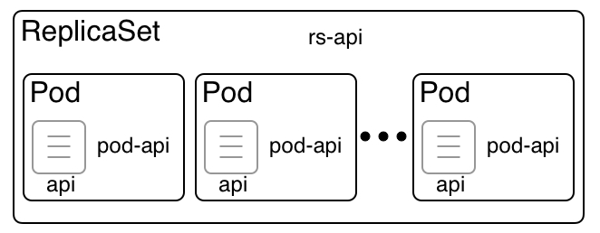

Kubernetes ReplicaSet

在前面的图示中，我们可以看到一个名为 **rs-api** 的 **ReplicaSet**，它管辖着多个 pods。这些 pods 被称为 **pod-api**。**ReplicaSet** 负责确保在任何时候，都有预定数量的 pod 正在运行。如果其中一个 pod 因为某种原因崩溃，**ReplicaSet** 会在一个有空闲资源的节点上调度一个新的 pod。如果 pod 的数量超过预期，**ReplicaSet** 会终止多余的 pods。通过这一点，我们可以说 **ReplicaSet** 保证了一个自愈和可扩展的 pod 集合。**ReplicaSet** 可以容纳的 pod 数量没有上限。

# ReplicaSet 规格

类似于我们关于 pods 学到的内容，Kubernetes 还允许我们通过命令式或声明式的方式定义和创建 `ReplicaSet`。由于声明式的方法在大多数情况下是最推荐的，因此我们将集中讨论这一方法。以下是一个 Kubernetes `ReplicaSet` 的示例规格：

```
apiVersion: apps/v1
kind: ReplicaSet
metadata:
  name: rs-web
spec:
  selector:
    matchLabels:
      app: web
  replicas: 3
  template: 
    metadata:
      labels:
        app: web
    spec:
      containers:
      - name: nginx
        image: nginx:alpine
        ports:
        - containerPort: 80
```

这看起来与我们之前介绍的 pod 规格非常相似。那么，让我们集中注意力在这些不同之处上。首先，在第 2 行，我们有 `kind`，之前是 `Pod`，现在是 `ReplicaSet`。然后，在第 6 到第 8 行，我们有一个选择器，它决定了哪些 pods 将成为 `ReplicaSet` 的一部分。在这种情况下，选择的是所有标签为 `app` 且值为 `web` 的 pods。接着，在第 9 行，我们定义了我们希望运行多少个 pod 副本；在这个例子中是三个。最后，我们有 `template` 部分，它首先定义了 `metadata`，然后是 `spec`，它定义了运行在 pod 内的容器。在我们的例子中，我们有一个使用 `nginx:alpine` 镜像并暴露 `80` 端口的容器。

其中非常重要的元素是副本数和选择器，它指定了由 `ReplicaSet` 管辖的 pod 集合。

在我们的 `ch15` 文件夹中，我们有一个名为 `replicaset.yaml` 的文件，其中包含了前面的规格。让我们使用这个文件来创建 `ReplicaSet`：

```
$ kubectl create -f replicaset.yaml
replicaset "rs-web" created
```

如果我们列出集群中的所有 ReplicaSets，我们将得到以下内容（`rs` 是 `replicaset` 的缩写）：

```
$ kubectl get rs
NAME     DESIRED   CURRENT   READY   AGE
rs-web   3         3         3       51s
```

在前面的输出中，我们可以看到我们有一个名为 `rs-web` 的单一 ReplicaSet，其期望的状态是三个（pod）。当前状态也显示有三个 pod，并告诉我们这三个 pod 都已经准备好。我们还可以列出系统中所有的 pods。这将产生以下输出：

```
$ kubectl get pods
NAME           READY   STATUS    RESTARTS   AGE
rs-web-6qzld   1/1     Running   0          4m
rs-web-frj2m   1/1     Running   0          4m
rs-web-zd2kt   1/1     Running   0          4m
```

在这里，我们可以看到我们预期的三个 pod。每个 pod 的名称使用了 ReplicaSet 的名称，并为每个 pod 附加了一个唯一的 ID。在 `READY` 列中，我们可以看到 pod 中定义了多少个容器，以及其中有多少个容器已经准备好。在我们的例子中，每个 pod 只有一个容器，并且每个容器都已经准备好。因此，pod 的整体状态是 `Running`。我们还可以看到每个 pod 被重启的次数。在我们的例子中，我们没有任何重启。

# 自愈

现在，让我们通过随机终止其一个 pod 来测试 **自愈** `ReplicaSet` 的神奇能力，并观察发生了什么。让我们删除上面列表中的第一个 pod：

```
$ kubectl delete po/rs-web-6qzld
pod "rs-web-6qzld" deleted
```

现在，让我们再次列出所有 pod。我们期望只看到两个 pod，*对吗*？错了：

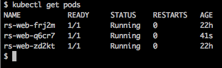

删除 pod 后 ReplicaSet 中的 pod 列表

好的；显然，列表中的第二个 pod 已被重新创建，从 `AGE` 列中可以看出这一点。这就是自动修复的表现。让我们看看如果描述 ReplicaSet 会发现什么：

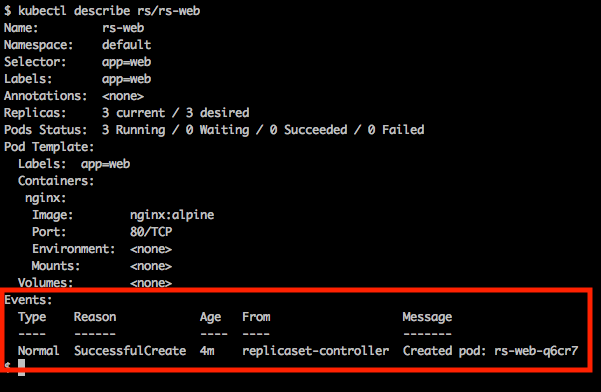

描述 ReplicaSet

的确，我们在 `Events` 中发现一条记录，告诉我们 `ReplicaSet` 创建了一个新的 pod，名为 `rs-web-q6cr7`。

# Kubernetes 部署

Kubernetes 非常重视单一职责原则。所有 Kubernetes 对象都被设计为只做一件事，而且做这件事做得非常好。在这方面，我们需要理解 Kubernetes **ReplicaSets** 和 **Deployments**。正如我们所了解的，**ReplicaSet** 负责实现并协调应用服务的期望状态。这意味着 **ReplicaSet** 管理一组 pod。

**Deployment** 在 **ReplicaSet** 上增强了滚动更新和回滚功能。在 Docker Swarm 中，Swarm 服务结合了 **ReplicaSet** 和 **Deployment** 的功能。在这方面，SwarmKit 比 Kubernetes 更加单一化。下图展示了 **Deployment** 与 **ReplicaSet** 的关系：


Kubernetes 部署

在上面的图示中，**ReplicaSet** 定义并管理一组相同的 pod。**ReplicaSet** 的主要特点是它是 **自愈的**、**可扩展的**，并且始终尽力协调 **期望** **状态**。Kubernetes 部署（Deployment）则在此基础上添加了滚动更新和回滚功能。在这方面，部署实际上是对 ReplicaSet 的一个封装对象。

我们将在第十六章中了解更多关于滚动更新和回滚的内容，*使用 Kubernetes 部署、更新和保护应用程序*。

在接下来的部分，我们将了解更多关于 Kubernetes 服务的内容，以及它们如何实现服务发现和路由。

# Kubernetes 服务

一旦我们开始处理由多个应用服务组成的应用程序，我们就需要服务发现。下图说明了这个问题：

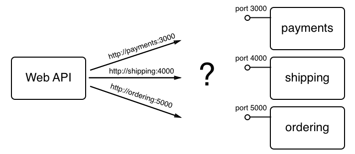

服务发现

在前面的图示中，我们有一个需要访问其他三个服务的**Web API**服务：**支付**、**运输**和**订单**。**Web API**永远不需要关心如何以及在哪里找到这三个服务。在 API 代码中，我们只想使用我们希望访问的服务名称和其端口号。一个示例是以下 URL `http://payments:3000`，用于访问支付服务的一个实例。

在 Kubernetes 中，支付应用服务由一个副本集（ReplicaSet）中的多个 Pod 表示。由于高度分布式系统的特点，我们不能假设 Pod 拥有稳定的端点。Pod 可能随时创建或销毁。但是，如果我们需要从内部或外部客户端访问相应的应用服务，那就成了一个问题。如果我们不能依赖 Pod 的端点稳定性，*那我们还能做些什么呢？*

这时，Kubernetes 服务派上用场。它们旨在为副本集（ReplicaSets）或部署（Deployments）提供稳定的端点，具体如下：

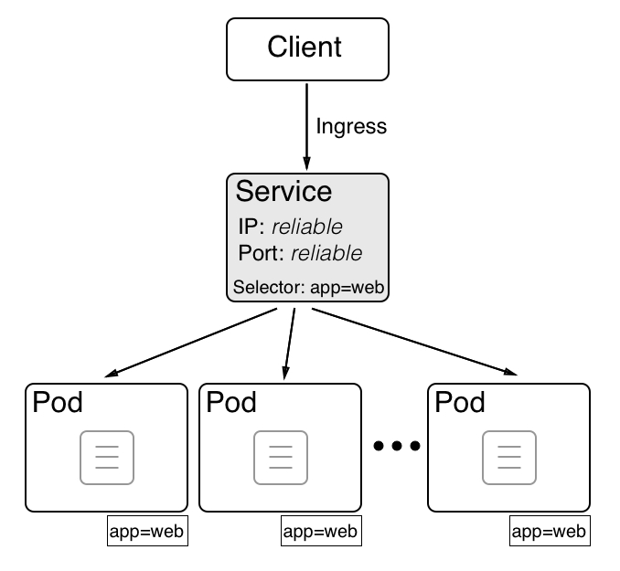

Kubernetes 服务为客户端提供稳定的端点

在前面的图示中，我们可以看到中间部分的 Kubernetes **服务**。它提供了一个**可靠**的集群范围内的 **IP** 地址，也称为**虚拟 IP**（**VIP**），以及一个**可靠的**、在整个集群中唯一的**端口**。Kubernetes 服务代理的 Pod 是由服务规范中定义的**选择器**决定的。选择器始终基于标签。每个 Kubernetes 对象都可以被分配零到多个标签。在我们的例子中，**选择器**是**app=web**；即，所有具有名为 app 且值为 web 的标签的 Pod 都会被代理。

在下一节中，我们将深入了解基于上下文的路由以及 Kubernetes 如何减轻这一任务。

# 基于上下文的路由

我们经常需要为我们的 Kubernetes 集群配置基于上下文的路由。Kubernetes 为我们提供了多种方式来实现这一点。目前，首选且最具可扩展性的方法是使用 **IngressController**。下图试图说明这个 IngressController 是如何工作的：

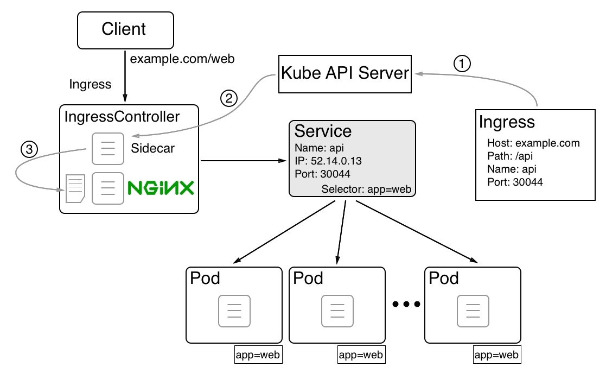

使用 Kubernetes Ingress 控制器的基于上下文的路由

在前面的图示中，我们可以看到使用 **IngressController**（如 Nginx）时，基于上下文（或第七层）路由是如何工作的。这里我们部署了一个名为 **web** 的应用服务。该应用服务的所有 Pod 都有如下标签：**app=web**。然后，我们有一个名为 **web** 的 Kubernetes 服务，它为这些 Pod 提供稳定的端点。该服务有一个（虚拟）**IP** 地址 `52.14.0.13`，并暴露端口 `30044`。也就是说，如果一个请求访问 Kubernetes 集群中任何节点的名称为 **web** 且端口为 `30044`，它会被转发到该服务。然后，服务将请求负载均衡到其中一个 Pod 上。

到目前为止，一切顺利，*但是如何将客户端发来的入口请求路由到我们的 web 服务的 `http[s]://example.com/web` URL？*首先，我们必须定义从基于上下文的请求到对应 `<service name>/<port>` 请求的路由。这是通过 **Ingress** 对象完成的：

1.  在 **Ingress** 对象中，我们定义 **Host** 和 **Path** 作为源和（服务）名称，并将端口定义为目标。当 Kubernetes API 服务器创建这个 Ingress 对象时，作为侧车运行的一个进程会在 `IngressController` 中拾取这一变化。

1.  该过程修改了 Nginx 反向代理的配置文件。

1.  通过添加新路由，Nginx 会被要求重新加载其配置，这样就能够正确地将任何传入的请求路由到 `http[s]://example.com/web`。

在下一节中，我们将通过对比各个编排引擎的主要资源，来比较 Docker SwarmKit 和 Kubernetes。

# 比较 SwarmKit 与 Kubernetes

现在我们已经了解了 Kubernetes 中最重要资源的许多细节，接下来可以通过对比 SwarmKit 和 Kubernetes 的关键资源来加深理解。我们来看一下：

| **SwarmKit** | **Kubernetes** | **描述** |
| --- | --- | --- |
| Swarm | Cluster | 由相应编排工具管理的一组服务器/节点。 |
| Node | Cluster member | 单一主机（物理或虚拟），是 Swarm/集群的成员。 |
| Manager node | Master | 管理 Swarm/集群的节点。这是控制平面。 |
| Worker node | Node | 运行应用工作负载的 Swarm/集群成员节点。 |
| Container | Container** | 运行在节点上的容器镜像实例。**注意：在 Kubernetes 集群中，我们不能直接运行容器。 |
| Task | Pod | 在节点上运行的服务（Swarm）或 ReplicaSet（Kubernetes）的实例。任务管理一个单一的容器，而 Pod 包含一个或多个容器，它们共享同一个网络命名空间。 |
| Service | ReplicaSet | 定义并协调由多个实例组成的应用服务的期望状态。 |
| Service | Deployment | 部署是一个增强了滚动更新和回滚功能的 ReplicaSet。 |
| Routing Mesh | Service | Swarm 路由网格通过 IPVS 提供 L4 路由和负载均衡。Kubernetes 服务是一个抽象，定义了一个逻辑上的 Pod 集合，并有一个策略可以用于访问它们。它是一组 Pods 的稳定端点。 |
| Stack | Stack ** | 由多个（Swarm）服务组成的应用的定义。**注意：虽然堆栈在 Kubernetes 中不是原生支持的，但 Docker 的工具 Docker for Desktop 会将其转换为部署到 Kubernetes 集群。 |
| 网络 | 网络策略 | Swarm **软件定义网络**（**SDN**）用于为容器设置防火墙。Kubernetes 仅定义了一个平面的网络。每个 pod 都可以访问其他所有 pod 和/或节点，除非显式定义了网络策略来限制 pod 之间的通信。 |

# 总结

在本章中，我们学习了 Kubernetes 的基础知识。我们概述了它的架构，并介绍了用于定义和运行 Kubernetes 集群中应用程序的主要资源。我们还介绍了 Minikube 和 Docker for Desktop 中的 Kubernetes 支持。

在下一章中，我们将把应用程序部署到 Kubernetes 集群中。然后，我们将使用零停机策略更新该应用程序的一个服务。最后，我们将使用秘密在 Kubernetes 中运行的应用程序服务中处理敏感数据。敬请关注！

# 问题

请回答以下问题以评估你的学习进度：

1.  用简短的几句话解释 Kubernetes master 的角色。

1.  列出每个 Kubernetes（工作）节点上需要存在的元素。

1.  我们不能在 Kubernetes 集群中运行单独的容器。

A. 是

B. 否

1.  解释为什么 pod 中的容器可以使用`localhost`进行相互通信。

1.  pod 中所谓的暂停容器的目的是什么？

1.  Bob 告诉你：“我们的应用程序由三个 Docker 镜像组成：`web`、`inventory`和`db`。由于我们可以在 Kubernetes pod 中运行多个容器，因此我们打算将应用程序的所有服务部署到单个 pod 中。”列出三个到四个原因，说明为什么这是一个糟糕的主意。

1.  用你自己的话解释为什么我们需要 Kubernetes ReplicaSets。

1.  在哪些情况下我们需要 Kubernetes 部署？

1.  列出至少三种 Kubernetes 服务，并解释它们的目的及其区别。

# 进一步阅读

以下是包含有关本章讨论的各种主题的更详细信息的文章列表：

+   Raft 共识算法: [`raft.github.io/`](https://raft.github.io/)

+   Docker Compose 和 Kubernetes 与 Docker for Desktop: [`dockr.ly/2G8Iqb9`](https://dockr.ly/2G8Iqb9)

+   Kubernetes 文档: [`kubernetes.io/docs/home/`](https://kubernetes.io/docs/home/)
