# 第十七章：使用 Kubernetes 部署、更新和保护应用程序

在上一章中，我们学习了容器编排工具 Kubernetes 的基础知识。我们对 Kubernetes 的架构有了高层次的了解，并学到了许多关于 Kubernetes 用来定义和管理容器化应用程序的重要对象。

在本章中，我们将学习如何将应用程序部署、更新和扩展到 Kubernetes 集群中。我们还将解释如何实现零停机部署，以便无干扰地更新和回滚关键任务应用程序。最后，我们将介绍 Kubernetes secrets，作为配置服务和保护敏感数据的手段。

本章涵盖以下内容：

+   部署第一个应用程序

+   定义活跃性和就绪性

+   零停机部署

+   Kubernetes secrets

完成本章内容后，你将能够完成以下任务：

+   将多服务应用程序部署到 Kubernetes 集群中

+   为你的 Kubernetes 应用程序服务定义活跃性和就绪性探针

+   在 Kubernetes 中更新应用程序服务而不造成停机

+   在 Kubernetes 集群中定义 secrets

+   配置应用程序服务以使用 Kubernetes secrets

# 技术要求

在本章中，我们将在本地计算机上使用 Minikube。关于如何安装和使用 Minikube 的详细信息，请参见第二章，*设置工作环境*。

本章的代码可以在此处找到：[`github.com/PacktPublishing/Learn-Docker---Fundamentals-of-Docker-19.x-Second-Edition/tree/master/ch16/probes`](https://github.com/PacktPublishing/Learn-Docker---Fundamentals-of-Docker-19.x-Second-Edition/tree/master/ch16/probes)。

请确保你已经克隆了本书的 GitHub 仓库，具体步骤请参见第二章，*设置工作环境*。

在终端中，导航到`~/fod/ch16`文件夹。

# 部署第一个应用程序

我们将把我们在第十一章，*Docker Compose*中首次介绍的宠物应用程序，部署到 Kubernetes 集群中。我们的集群将是 Minikube，它是一个单节点集群。尽管如此，从部署的角度来看，集群的大小和所在位置无关，是否位于云端、公司数据中心，或者个人工作站上都不重要。

# 部署 Web 组件

作为提醒，我们的应用程序由两个应用程序服务组成：基于 Node 的 Web 组件和后台的 PostgreSQL 数据库。在上一章中，我们学到我们需要为每个要部署的应用程序服务定义一个 Kubernetes Deployment 对象。首先我们为 Web 组件定义它。正如本书中一贯的做法，我们将选择声明式的方式来定义我们的对象。以下是定义 Web 组件的 Deployment 对象的 YAML：

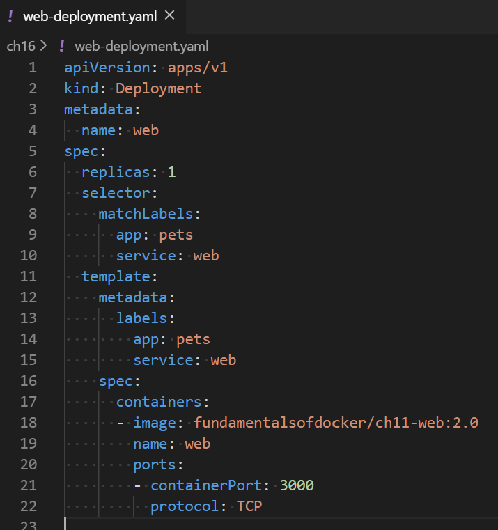

Kubernetes 部署定义（web 组件）

上述部署定义可以在 `~/fod/ch16` 文件夹中的 `web-deployment.yaml` 文件中找到。代码行如下：

+   在第 `4` 行：我们为 `Deployment` 对象定义了名称 `web`。

+   在第 `6` 行：我们声明要运行一个 `web` 组件实例。

+   从第 `8` 行到第 `10` 行：我们定义了哪些 pods 会成为我们部署的一部分，即那些拥有 `app` 和 `service` 标签，标签值分别为 `pets` 和 `web` 的 pods。

+   在第 `11` 行：在从第 `11` 行开始的 pod 模板中，我们定义了每个 pod 都会应用 `app` 和 `service` 标签。

+   从第 `17` 行：我们定义了将在 pod 中运行的唯一容器。该容器的镜像为我们熟知的 `fundamentalsofdocker/ch11-web:2.0` 镜像，容器的名称为 `web`。

+   `ports`：最后，我们声明容器暴露 `3000` 端口供 TCP 类型的流量使用。

请确保已经将 kubectl 的上下文设置为 Minikube。有关如何设置的详细信息，请参见 第二章，*设置工作环境*。

我们可以使用 kubectl 部署这个 Deployment 对象：

```
$ kubectl create -f web-deployment.yaml
```

我们可以使用 Kubernetes CLI 再次确认部署是否已创建。我们应该看到以下输出：

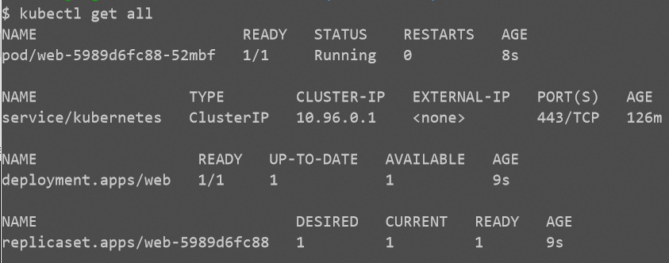

列出在 Minikube 上运行的所有资源

在前面的输出中，我们可以看到 Kubernetes 创建了三个对象——部署（deployment）、相应的 ReplicaSet 和一个单独的 pod（记住我们指定了只需要一个副本）。当前状态与这三个对象的期望状态一致，所以到目前为止一切正常。

现在，网络服务需要向公众公开。为此，我们需要定义一个 `NodePort` 类型的 Kubernetes 服务对象。以下是定义，可以在 `~/fod/ch16` 文件夹中的 `web-service.yaml` 文件中找到：

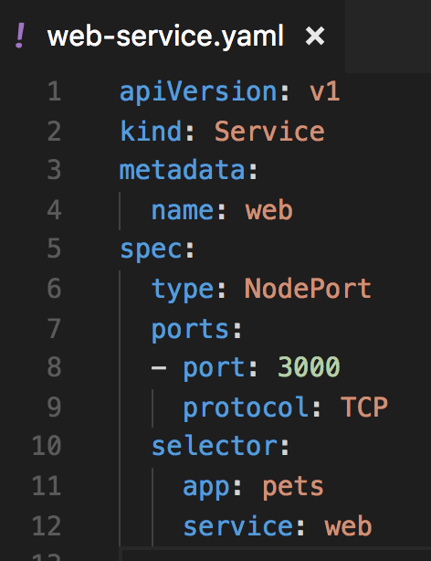

定义 web 组件的 Service 对象

上述代码行如下：

+   在第 `4` 行：我们将此 Service 对象的 `name` 设置为 `web`。

+   在第 `6` 行：我们定义了正在使用的 Service 对象的 `type`。由于 web 组件必须能够从集群外部访问，因此不能使用 `ClusterIP` 类型的 Service 对象，必须是 `NodePort` 或 `LoadBalancer` 类型。我们在上一章已经讨论了各种 Kubernetes 服务类型，因此这里不再详细讲解。在我们的示例中，我们使用的是 `NodePort` 类型的服务。

+   在第`8`行和第`9`行：我们指定要通过`TCP`协议公开`3000`端口供访问。Kubernetes 会自动将容器端口`3000`映射到 30,000 到 32,768 范围内的一个空闲主机端口。Kubernetes 实际选择的端口可以通过`kubectl get service`或`kubectl describe`命令在服务创建后确定。

+   从第`10`行到`12`行：我们定义了该服务将作为稳定端点的 Pod 的过滤条件。在这种情况下，它是所有具有`app`和`service`标签，分别为`pets`和`web`值的 Pod。

现在我们已经有了这个 Service 对象的规范，可以使用`kubectl`创建它：

```
$ kubectl create -f web-service.yaml
```

我们可以列出所有服务，查看上一个命令的结果：

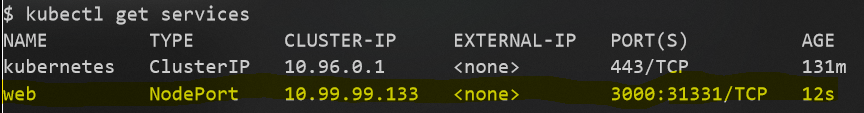

为 Web 组件创建的 Service 对象

在上面的输出中，我们可以看到一个名为`web`的服务已经被创建。此服务分配了一个唯一的`clusterIP`，值为`10.99.99.133`，并且容器端口`3000`已经在所有集群节点的`31331`端口上进行了发布。

如果我们想测试这个部署，我们需要找出 Minikube 的 IP 地址，然后使用该 IP 地址访问我们的 Web 服务。以下是我们可以用来执行此操作的命令：

```
$ IP=$(minikube ip)
$ curl -4 $IP:31331/
Pets Demo Application
```

好的，响应是`Pets Demo Application`，这是我们期望的。Web 服务已经在 Kubernetes 集群中启动并运行。接下来，我们要部署数据库。

# 部署数据库

数据库是一个有状态组件，必须与无状态组件（例如我们的 Web 组件）不同地进行处理。我们在第九章《*分布式应用架构*》和第十二章《*调度器*》中详细讨论了分布式应用架构中有状态和无状态组件之间的区别。

Kubernetes 为有状态组件定义了一种特殊类型的`ReplicaSet`对象。这个对象叫做`StatefulSet`。我们将使用这种对象来部署我们的数据库。其定义可以在`~fod/ch16/db-stateful-set.yaml`文件中找到。具体内容如下：

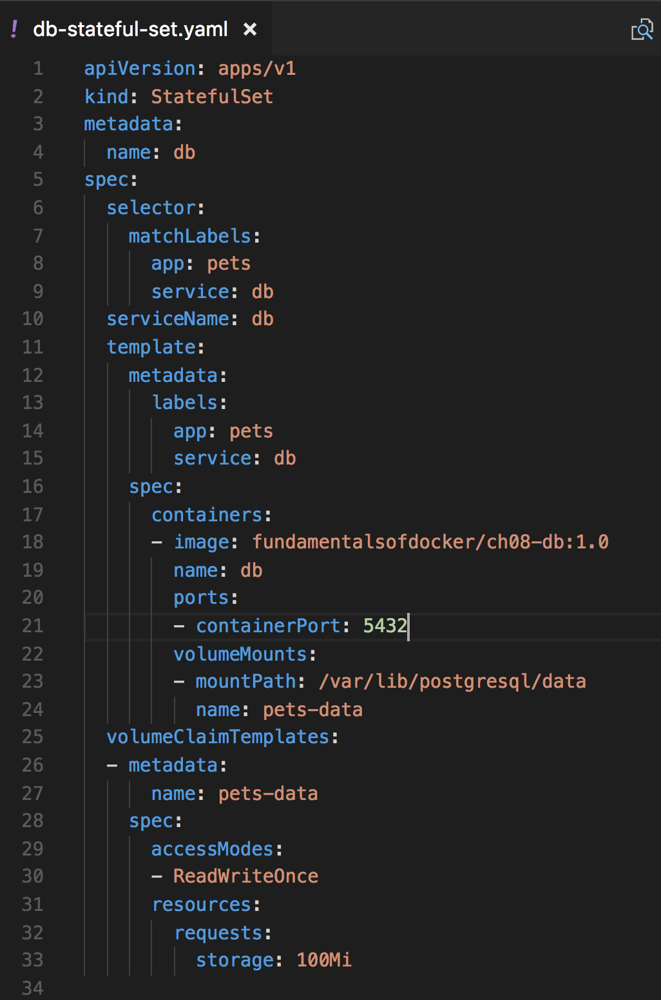

数据库组件的 StatefulSet

好吧，这看起来有点吓人，但实际上并不是。由于我们还需要定义一个卷来存储 PostgreSQL 数据库的数据，这比定义 `web` 组件的部署稍长一些。卷声明定义在第`25`行到`33`行。我们想创建一个名为`pets-data`的卷，最大大小为`100 MB`。在第`22`行到`24`行，我们使用这个卷并将其挂载到容器的`/var/lib/postgresql/data`路径下，这是 PostgreSQL 期望的位置。在第`21`行，我们还声明 PostgreSQL 在端口`5432`监听。

和往常一样，我们使用`kubectl`来部署`StatefulSet`：

```
$ kubectl create -f db-stateful-set.yaml
```

现在，如果我们列出集群中的所有资源，我们将能够看到已创建的附加对象：

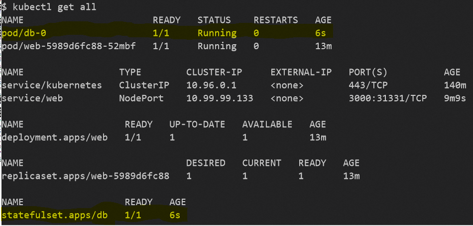

`StatefulSet`及其 pod

在这里，我们可以看到一个`StatefulSet`和一个 pod 已经创建。对于这两个对象，当前状态与期望状态相符，因此系统是健康的。但这并不意味着此时 Web 组件可以访问数据库。到目前为止，服务发现尚未生效。记住，Web 组件想要在名为`db`的服务下访问数据库。

为了使服务发现能够在集群内部工作，我们还必须为数据库组件定义一个 Kubernetes 服务对象。由于数据库应该只能从集群内部访问，我们需要的服务对象类型是`ClusterIP`。以下是该规范，可以在`~/fod/ch16/db-service.yaml`文件中找到：

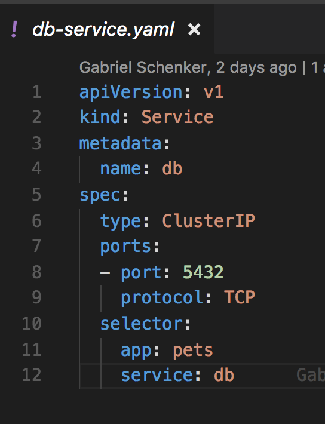

定义数据库的 Kubernetes 服务对象

数据库组件将由这个`Service`对象表示，它可以通过`db`这个名字访问，这个名字在第`4`行定义。数据库组件不需要公开访问，因此我们决定使用`ClusterIP`类型的`Service`对象。第`10`到`12`行的选择器定义了该服务表示所有具有相应标签的 pod 的稳定端点，也就是`app: pets`和`service: db`。

让我们使用以下命令来部署该服务：

```
$ kubectl create -f db-service.yaml
```

现在，我们应该准备好测试应用程序了。这次我们可以使用浏览器来欣赏美丽的动物图片：

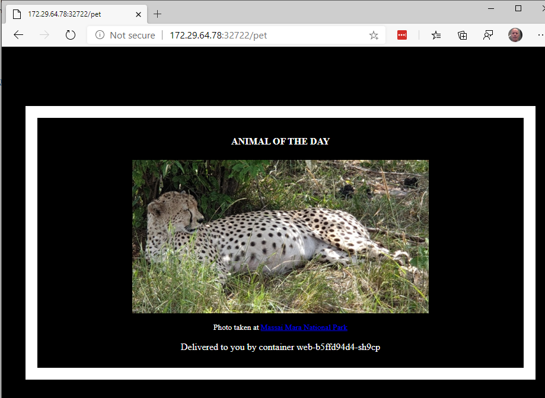

测试在 Kubernetes 中运行的宠物应用程序

`172.29.64.78`是我的 Minikube 的 IP 地址。使用`minikube ip`命令可以验证您的地址。端口号`32722`是 Kubernetes 自动为我的`web`服务对象选择的端口。请将此数字替换为 Kubernetes 分配给您服务的端口。您可以通过使用`kubectl get services`命令来获取该端口号。

现在，我们已经成功将宠物应用程序部署到 Minikube，这是一个单节点的 Kubernetes 集群。我们为此定义了四个工件，具体如下：

+   Web 组件的`Deployment`和`Service`对象

+   数据库组件的`StatefulSet`和`Service`对象

要从集群中移除应用程序，我们可以使用以下小脚本：

```
kubectl delete svc/web
kubectl delete deploy/web
kubectl delete svc/db
kubectl delete statefulset/db
```

接下来，我们将精简部署。

# 精简部署

到目前为止，我们已经创建了需要部署到集群的四个工件。这只是一个非常简单的应用，包含两个组件。想象一下，如果应用更加复杂，维护将变得非常麻烦。幸运的是，我们有几种方法可以简化部署。我们将在这里讨论的方法是将构成 Kubernetes 应用的所有组件定义放在一个文件中。

本书范围之外的其他解决方案包括使用包管理器，例如 Helm。

如果我们有一个由多个 Kubernetes 对象（如 `Deployment` 和 `Service` 对象）组成的应用，那么我们可以将它们全部放在一个文件中，并用三个破折号分隔每个对象定义。例如，如果我们想将 `web` 组件的 `Deployment` 和 `Service` 定义放在一个文件中，文件内容将如下所示：

```
apiVersion: extensions/v1beta1
kind: Deployment
metadata:
  name: web
spec:
  replicas: 1
  selector:
    matchLabels:
      app: pets
      service: web
  template:
    metadata:
      labels:
        app: pets
        service: web
    spec:
      containers:
      - image: fundamentalsofdocker/ch11-web:2.0
        name: web
        ports:
        - containerPort: 3000
          protocol: TCP
---
apiVersion: v1
kind: Service
metadata:
  name: web
spec:
  type: NodePort
  ports:
  - port: 3000
    protocol: TCP
  selector:
    app: pets
    service: web
```

在这里，我们已经将 `pets` 应用的四个对象定义收集在 `~/fod/ch16/pets.yaml` 文件中，我们可以一次性部署该应用。

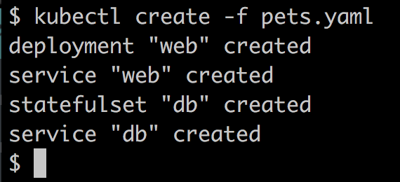

使用一个脚本来部署宠物应用

同样，我们创建了一个名为`~/fod/ch16/remove-pets.sh`的脚本，用于从 Kubernetes 集群中删除所有与宠物应用相关的文件。

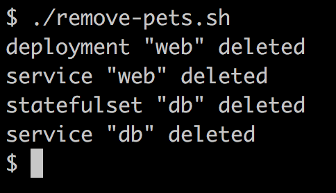

从 Kubernetes 集群中删除宠物

通过这一点，我们已经将第十一章中介绍的*Docker Compose*宠物应用程序，定义了部署该应用到 Kubernetes 集群所需的所有 Kubernetes 对象。在每个步骤中，我们都确保达到了预期的结果，一旦所有工件存在于集群中，我们展示了正在运行的应用。

# 定义存活性和就绪性

像 Kubernetes 和 Docker Swarm 这样的容器编排系统使得部署、运行和更新高度分布式的关键任务应用程序变得更加容易。编排引擎自动化了许多繁琐的任务，例如扩展、确保始终保持期望的状态等。

但是，编排引擎并不能自动做所有事情。有时，我们开发者需要为引擎提供一些只有我们才能了解的信息。那么，我是什么意思呢？

我们来看一个单一的应用服务。假设它是一个微服务，称之为**服务 A**。如果我们在 Kubernetes 集群上运行容器化的服务 A，那么 Kubernetes 可以确保我们在服务定义中要求的五个实例始终在运行。如果其中一个实例崩溃，Kubernetes 可以迅速启动一个新实例，从而保持期望状态。但是，如果某个服务的实例没有崩溃，而是处于不健康状态，或者只是尚未准备好处理请求呢？显然，Kubernetes 应该知道这两种情况。但它做不到，因为从应用服务的角度来看，健康或不健康是编排引擎无法知晓的。只有我们这些应用开发人员才能知道何时我们的服务是健康的，何时它是不健康的。

比如，应用服务可能正在运行，但由于某些 bug，它的内部状态可能已经被破坏，可能处于死循环或死锁状态。类似地，只有我们这些应用开发人员知道我们的服务是否已准备好工作，或者它是否仍在初始化阶段。尽管强烈建议将微服务的初始化阶段尽可能缩短，但如果某个服务需要较长时间才能准备好工作，这种情况通常是无法避免的。然而，处于初始化状态并不等同于不健康状态。初始化阶段是微服务或任何其他应用服务生命周期中的预期部分。

因此，Kubernetes 不应尝试在我们的微服务处于初始化阶段时杀死它。如果我们的微服务不健康，Kubernetes 应该尽快将其终止，并替换为一个新的实例。

Kubernetes 有一个探针的概念，用来提供编排引擎和应用开发人员之间的连接。Kubernetes 使用这些探针来获取更多关于应用服务内部状态的信息。探针是在每个容器内部本地执行的。这里有一个用于服务健康（也叫存活状态）的探针，一个启动探针，以及一个用于服务就绪性的探针。我们依次来看它们。

# Kubernetes 存活探针

Kubernetes 使用存活探针来决定何时需要杀死一个容器，并启动另一个实例来替代它。由于 Kubernetes 在 pod 级别进行操作，如果 pod 中的至少一个容器报告为不健康，则该 pod 会被终止。换句话说，只有当 pod 中的所有容器都报告为健康时，pod 才被认为是健康的。

我们可以在 pod 的规范中定义存活探针，示例如下：

```
apiVersion: v1
kind: Pod
metadata:
 ...
spec:
 containers:
 - name: liveness-demo
 image: postgres:12.10
 ...
 livenessProbe:
 exec:
 command: nc localhost 5432 || exit -1
 initialDelaySeconds: 10
 periodSeconds: 5
```

相关部分位于`livenessProbe`部分。首先，我们定义 Kubernetes 将在容器内执行的命令作为探针。在我们的例子中，我们有一个 PostgreSQL 容器，并使用`netcat` Linux 工具通过 TCP 探测端口`5432`。当 Postgres 监听该端口时，`nc localhost 5432`命令会成功。

另外两个设置，`initialDelaySeconds`和`periodSeconds`，定义了 Kubernetes 在启动容器后需要等待多长时间才会执行第一次探针，以及之后执行探针的频率。在我们的案例中，Kubernetes 在执行第一次探针之前等待 10 秒，然后每 5 秒执行一次探针。

也可以探测 HTTP 端点，而不是使用命令。假设我们正在运行一个微服务，镜像为`acme.com/my-api:1.0`，该 API 有一个名为`/api/health`的端点，如果微服务健康，它返回状态`200 (OK)`，如果不健康，则返回`50x (Error)`。在这种情况下，我们可以按如下方式定义活跃性探针：

```
apiVersion: v1
kind: Pod
metadata:
  ...
spec:
  containers:
  - name: liveness
    image: acme.com/my-api:1.0
    ...
    livenessProbe:
 httpGet:
 path: /api/health
 port: 3000
 initialDelaySeconds: 5
 periodSeconds: 3
```

在前面的代码片段中，我定义了活跃性探针，使用 HTTP 协议并执行一个`GET`请求，访问本地主机端口`5000`上的`/api/health`端点。记住，探针是在容器内部执行的，这意味着我可以使用 localhost。

我们还可以直接使用 TCP 协议探测容器上的端口。但等一下——难道我们在第一个示例中没有做过这件事吗？是的，你说得对，我们做过。但是我们必须依赖容器中存在`netcat`工具来执行这一操作。我们不能假设这个工具总是存在。因此，依赖 Kubernetes 默认为我们执行基于 TCP 的探测是更为可取的。修改后的 Pod 配置如下：

```
apiVersion: v1kind: Pod
metadata:
 ...
spec:
 containers:
 - name: liveness-demo
   image: postgres:12.10
   ...
 livenessProbe:
 tcpSocket:
 port: 5432
 initialDelaySeconds: 10
 periodSeconds: 5
```

这看起来非常相似。唯一的变化是探针的类型从`exec`改为`tcpSocket`，并且我们不再提供命令，而是提供要探测的`port`。

让我们试试看：

1.  导航到`~/fod/ch16/probes`文件夹，并使用以下命令构建 Docker 镜像：

```
$ docker image build -t fundamentalsofdocker/probes-demo:2.0 .
```

1.  使用`kubectl`部署在`probes-demo.yaml`中定义的示例 Pod：

```
$ kubectl apply -f probes-demo.yaml
```

1.  描述 Pod 并特别分析输出的日志部分：

```
$ kubectl describe pods/probes-demo
```

在前半分钟左右，你应该看到以下输出：

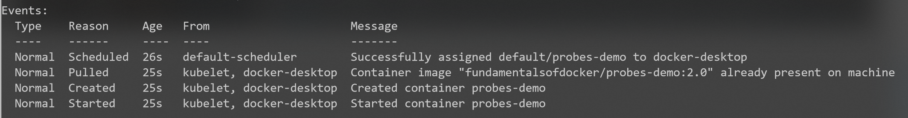

健康 Pod 的日志输出

1.  等待至少 30 秒，然后再次描述 Pod。这时，你应该看到以下输出：

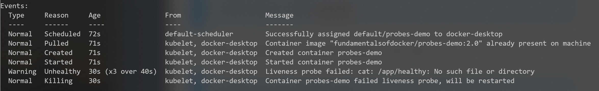

Pod 在状态变为`Unhealthy`后的日志输出

最后的两行表示探针失败，并且 Pod 将被重启。

如果你查看 Pod 列表，你会看到 Pod 已经重启了若干次：

```
$ kubectl get pods
NAME         READY   STATUS    RESTARTS   AGE
probes-demo  1/1     Running   5          7m22s
```

当你完成示例后，使用以下命令删除 Pod：

```
$ kubectl delete pods/probes-demo
```

接下来，我们将查看 Kubernetes 的就绪探针。

# Kubernetes 就绪探针

Kubernetes 使用就绪探针来决定服务实例，即容器，何时准备好接收流量。现在我们都知道，Kubernetes 部署并运行的是 Pod，而不是容器，所以讨论 Pod 的就绪性是更有意义的。只有当 Pod 中的所有容器都报告为就绪时，Pod 才被认为是就绪的。如果 Pod 报告为未就绪，Kubernetes 会将其从服务负载均衡器中移除。

就绪探针的定义与存活探针完全相同：只需将 Pod 规格中的 `livenessProbe` 键更改为 `readinessProbe`。以下是使用我们之前 Pod 规格的示例：

```
 ...
spec:
 containers:
 - name: liveness-demo
   image: postgres:12.10
   ...
   livenessProbe:
     tcpSocket:
       port: 5432
     failureThreshold: 2
     periodSeconds: 5

   readinessProbe:
 tcpSocket:
 port: 5432
 initialDelaySeconds: 10
 periodSeconds: 5
```

请注意，在这个示例中，我们实际上不再需要为存活探针设置初始延迟，因为我们现在已经有了就绪探针。因此，我将存活探针的初始延迟项替换为一个叫做 `failureThreshold` 的项，它表示在容器被认为不健康之前，Kubernetes 应该重复探测多少次失败。

# Kubernetes 启动探针

Kubernetes 通常需要知道服务实例何时启动。如果我们为容器定义了启动探针，则只要容器的启动探针没有成功，Kubernetes 就不会执行存活探针或就绪探针。一旦容器的所有启动探针都成功，Kubernetes 就会开始对 Pod 中的容器执行存活探针和就绪探针。

既然我们已经有了存活探针和就绪探针，什么时候需要使用启动探针呢？可能会有一些情况，我们需要考虑异常长的启动和初始化时间，例如将遗留应用程序容器化。我们技术上可以配置就绪探针或存活探针来应对这种情况，但那样就违背了这些探针的目的。后者的探针旨在为 Kubernetes 提供关于容器健康状态和可用性的快速反馈。如果我们配置了较长的初始延迟或时间段，那么这将与预期结果相悖。

不出所料，启动探针的定义与就绪探针和存活探针完全相同。以下是一个示例：

```
spec:
  containers:
    ..
    startupProbe:
 tcpSocket:
 port: 3000
 failureThreshold: 30
 periodSeconds: 5
  ...
```

确保你定义的 `failureThreshold * periodSeconds` 结果足够大，以考虑最坏的启动时间。

在我们的示例中，最大启动时间不应超过 150 秒。

# 零停机部署

在关键任务环境中，确保应用程序始终在线和运行至关重要。现在我们不能再容忍任何停机时间。Kubernetes 提供了多种手段来实现这一目标。在集群中执行一个不会导致停机的应用程序更新被称为零停机部署。在这一部分中，我们将介绍实现这一目标的两种方式，具体如下：

+   滚动更新

+   蓝绿部署

让我们先从滚动更新开始讨论。

# 滚动更新

在上一章中，我们了解到 Kubernetes 的 Deployment 对象与 ReplicaSet 对象的区别在于，它在后者的功能基础上增加了滚动更新和回滚功能。让我们通过 Web 组件来演示这一点。显然，我们将需要修改 Web 组件的清单或描述。

我们将使用与前一部分相同的部署定义，但有一个重要区别——我们将运行五个 Web 组件的副本。以下定义也可以在 `~/fod/ch16/web-deploy-rolling-v1.yaml` 文件中找到：

```
apiVersion: apps/v1
kind: Deployment
metadata:
  name: web
spec:
  replicas: 5
  selector:
    matchLabels:
      app: pets
      service: web
  template:
    metadata:
      labels:
        app: pets
        service: web
    spec:
      containers:
      - image: fundamentalsofdocker/ch11-web:2.0
        name: web
        ports:
        - containerPort: 3000
          protocol: TCP
```

现在，我们可以像往常一样创建该部署，同时创建使我们组件可访问的服务：

```
$ kubectl create -f web-deploy-rolling-v1.yaml
$ kubectl create -f web-service.yaml
```

一旦我们部署了 pods 和服务，就可以通过以下命令测试我们的 Web 组件：

```
$ PORT=$(kubectl get svc/web -o yaml | grep nodePort | cut -d' ' -f5)
$ IP=$(minikube ip)
$ curl -4 ${IP}:${PORT}/
Pets Demo Application
```

正如我们所见，应用程序正在运行并返回预期的消息：`Pets Demo Application`。

现在，我们的开发人员已经创建了 Web 组件的 2.1 版本。新版本的 `web` 组件代码可以在 `~/fod/ch16/web` 文件夹中找到，唯一的变化位于 `server.js` 文件的 `12` 行：

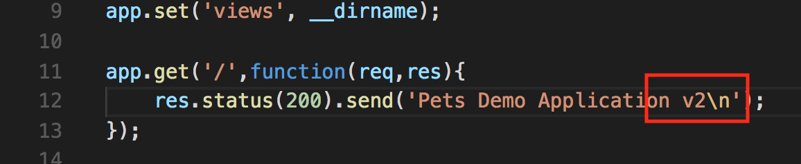

Web 组件版本 2.0 的代码更改

开发人员已按照以下方式构建了新的镜像：

```
$ docker image build -t fundamentalsofdocker/ch16-web:2.1 web
```

随后，他们将镜像推送到 Docker Hub，如下所示：

```
$ docker image push fundamentalsofdocker/ch16-web:2.1
```

现在，我们想要更新 Web Deployment 对象中 pods 使用的镜像。我们可以通过使用 `kubectl` 的 `set image` 命令来实现：

```
$ kubectl set image deployment/web \
 web=fundamentalsofdocker/ch16-web:2.1
```

如果我们再次测试应用程序，我们将得到确认，证明更新确实已经发生：

```
$ curl -4 ${IP}:${PORT}/
Pets Demo Application v2
```

现在，我们如何知道在此次更新过程中没有出现停机时间？更新是否确实以滚动方式进行？滚动更新到底是什么意思？让我们来调查一下。首先，我们可以通过使用 `rollout status` 命令，从 Kubernetes 获取确认，证明部署确实已发生并且成功：

```
$ kubectl rollout status deploy/web
deployment "web" successfully rolled out
```

如果我们使用 `kubectl describe deploy/web` 描述部署 Web 组件，我们将在输出的末尾看到以下事件列表：

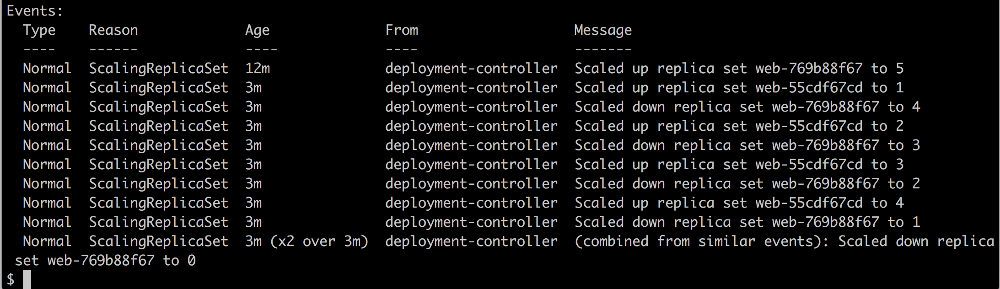

在 Web 组件部署描述的输出中找到的事件列表

第一个事件告诉我们，当我们创建部署时，创建了一个名为 `web-769b88f67` 的 ReplicaSet，包含五个副本。然后，我们执行了更新命令。列表中的第二个事件告诉我们，这意味着创建了一个名为 `web-55cdf67cd` 的新 ReplicaSet，最初只有一个副本。因此，在那个特定时刻，系统中存在六个 pods：五个初始 pods 和一个新的版本的 pod。但是，由于 Deployment 对象的期望状态要求我们只有五个副本，Kubernetes 现在将旧的 ReplicaSet 缩减为四个副本，我们可以在第三个事件中看到这一点。

然后，新创建的 ReplicaSet 再次扩展到两个实例，随后，旧的 ReplicaSet 缩减到三个实例，以此类推，直到我们拥有五个新实例，所有旧实例都被停用。虽然我们无法看到具体的时间（除了 3 分钟）发生了什么，但事件的顺序告诉我们，整个更新是以滚动方式进行的。

在短时间内，一些对 web 服务的调用会得到来自旧版本组件的响应，而另一些调用则会得到新版本组件的响应，但在任何时候，服务都不会宕机。

我们还可以列出集群中的 ReplicaSet 对象，从而确认我在前面部分所说的内容：

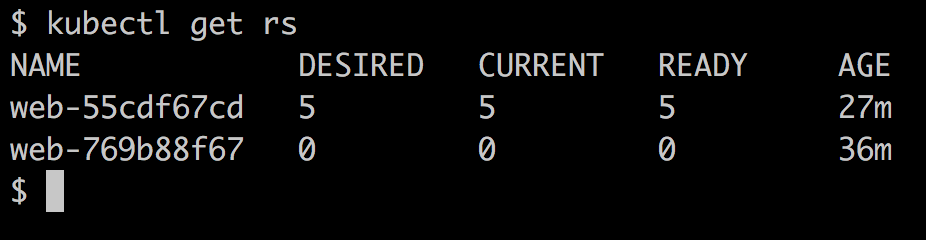

列出集群中的所有 ReplicaSet 对象

在这里，我们可以看到新的 ReplicaSet 有五个实例正在运行，而旧的 ReplicaSet 已缩减到零实例。旧的 ReplicaSet 对象仍然存在的原因是 Kubernetes 提供了回滚更新的可能性，在这种情况下，它会重用该 ReplicaSet。

为了回滚图像更新，以防新代码中出现了某些未被发现的 bug，我们可以使用`rollout undo`命令：

```
$ kubectl rollout undo deploy/web
deployment "web"
$ curl -4 ${IP}:${PORT}/
Pets Demo Application
```

我在前面的代码片段中也列出了使用`curl`的测试命令，以验证回滚确实已经发生。如果我们列出 ReplicaSets，我们将看到以下输出：

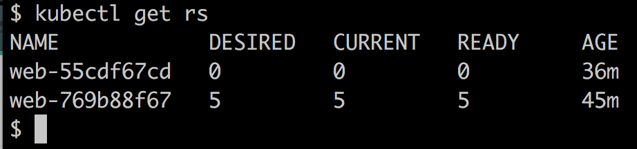

回滚后列出 ReplicaSet 对象

这确认了旧的 ReplicaSet（`web-769b88f67`）对象已被重用，并且新的 ReplicaSet 已缩减到零实例。

然而，有时我们无法或不希望容忍旧版本与新版本共存的混合状态。我们希望采用*全有或全无*的策略。这时蓝绿部署就派上用场了，我们接下来将讨论这一点。

# 蓝绿部署

如果我们希望对宠物应用的组件 web 进行蓝绿部署，那么我们可以通过创造性地使用标签来实现。首先，让我们回顾一下蓝绿部署的工作原理。以下是大致的步骤说明：

1.  将 web 组件的第一个版本部署为`blue`。我们将通过为 pod 打上`color: blue`标签来实现这一点。

1.  为这些具有`color: blue`标签的 pod 部署 Kubernetes 服务，在选择器部分进行配置。

1.  现在，我们可以部署 web 组件的版本 2，不过这次 pod 的标签为`color: green`。

1.  我们可以测试绿色版本的服务，检查其是否按预期工作。

1.  现在，我们通过更新 web 组件的 Kubernetes 服务，将流量从蓝色切换到绿色。我们修改选择器，使其使用`color: green`标签。

让我们为版本 1 定义一个 Deployment 对象，蓝色：

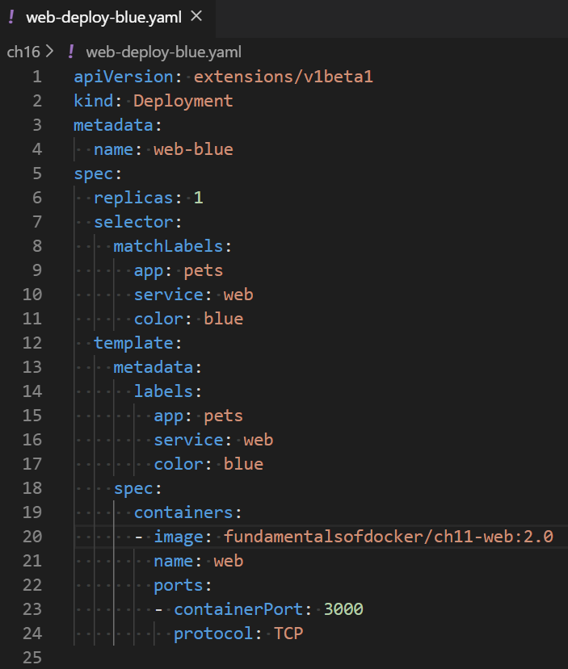

为 web 组件指定蓝色部署

前面的定义可以在 `~/fod/ch16/web-deploy-blue.yaml` 文件中找到。请注意第 `4` 行，我们在此定义了部署名称为 `web-blue`，以便与即将到来的部署 `web-green` 区分开来。还要注意，我们在第 `11` 行和 `17` 行添加了标签 `color: blue`。其他部分保持不变。

现在，我们可以定义 web 组件的 Service 对象。它将与之前使用的相同，但有一个小的变化，如下截图所示：

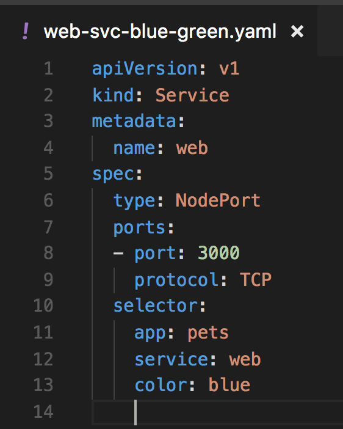

支持蓝绿部署的 Kubernetes 服务

关于我们在本章早些时候使用的服务定义，唯一的区别是第 `13` 行，它向选择器中添加了 `color: blue` 标签。我们可以在 `~/fod/ch16/web-svc-blue-green.yaml` 文件中找到前面的定义。

然后，我们可以使用以下命令部署蓝色版本的 web 组件：

```
$ kubectl create -f web-deploy-blue.yaml
$ kubectl create -f web-svc-blue-green.yaml
```

一旦服务启动并运行，我们就可以确定其 IP 地址和端口号并进行测试：

```
$ PORT=$(kubectl get svc/web -o yaml | grep nodePort | cut -d' ' -f5)
$ IP=$(minikube ip)
$ curl -4 ${IP}:${PORT}/
Pets Demo Application
```

正如预期的那样，我们得到了响应 `Pets Demo Application`。现在，我们可以部署绿色版本的 web 组件。其 Deployment 对象的定义可以在 `~/fod/ch16/web-deploy-green.yaml` 文件中找到，如下所示：

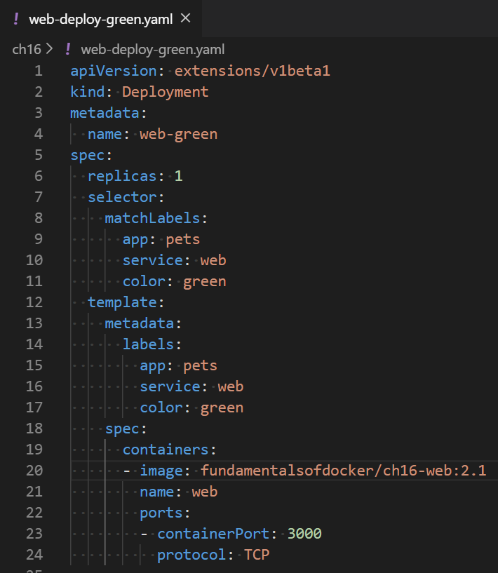

为 web 组件指定绿色部署

有趣的行如下：

+   行 `4`：命名为 `web-green`，以区别于 `web-blue`，并允许并行安装

+   行 `11` 和 `17`：具有 `green` 颜色

+   行 `20`：现在使用版本 `2.1` 的镜像

现在，我们准备部署此绿色版本的服务。它应与蓝色服务分开运行：

```
$ kubectl create -f web-deploy-green.yaml
```

我们可以通过以下方式确保两个部署共存：

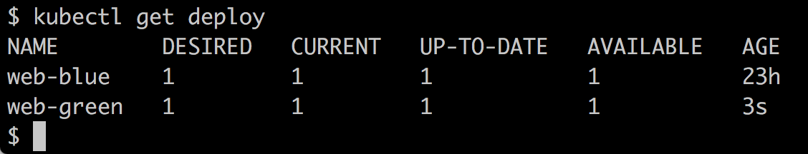

显示集群中运行的 Deployment 对象列表

正如预期的那样，我们同时运行着蓝色和绿色版本。我们可以验证蓝色仍然是活动服务：

```
$ curl -4 ${IP}:${PORT}/
Pets Demo Application
```

现在进入有趣的部分。我们可以通过编辑现有的 web 组件服务来切换流量，从蓝色版本切换到绿色版本。为此，执行以下命令：

```
$ kubectl edit svc/web
```

将标签 color 的值从 `blue` 改为 `green`，然后保存并退出编辑器。Kubernetes CLI 会自动更新服务。当我们再次查询 web 服务时，我们会得到如下结果：

```
$ curl -4 ${IP}:${PORT}/
Pets Demo Application v2
```

这确认了流量确实切换到了绿色版本的 web 组件（请注意响应中的 `curl` 命令末尾的 `v2`）。

如果我们发现绿色部署出现问题，新版本有缺陷，我们可以通过编辑服务 web 并将标签颜色值替换为蓝色，轻松切换回蓝色版本。这种回滚是即时的并且应始终有效。然后，我们可以移除有问题的绿色部署并修复组件。当我们修复问题后，我们可以再次部署绿色版本。

一旦绿色版本的组件按预期运行并表现良好，我们可以停用蓝色版本：

```
$ kubectl delete deploy/web-blue
```

当我们准备部署新版本 3.0 时，该版本将成为蓝色版本。我们相应地更新`~/fod/ch16/web-deploy-blue.yaml`文件并部署它。然后，我们将服务 web 从`green`切换到`blue`，依此类推。

我们已经成功地展示了如何在 Kubernetes 集群中的 pets 应用程序的 web 组件中实现蓝绿部署。

# Kubernetes 秘密信息

有时，我们希望在 Kubernetes 集群中运行的服务必须使用诸如密码、秘密 API 密钥或证书等保密数据。我们希望确保这些敏感信息只能被授权或专用服务查看。集群中运行的所有其他服务都不应访问这些数据。

出于这个原因，引入了 Kubernetes 秘密信息。秘密信息是一对键值对，其中键是秘密信息的唯一名称，值是实际的敏感数据。秘密信息存储在 etcd 中。可以配置 Kubernetes，使秘密信息在休息时（即在 etcd 中）和传输时（即在传输到使用此秘密信息的服务的工作节点的主节点之间时）进行加密。

# 手动定义秘密信息

我们可以像在 Kubernetes 中创建任何其他对象一样，声明性地创建一个秘密信息。以下是这种秘密信息的 YAML 示例：

```
apiVersion: v1
kind: Secret
metadata:
  name: pets-secret
type: Opaque
data:
  username: am9obi5kb2UK
  password: c0VjcmV0LXBhc1N3MHJECg==
```

前述定义可以在`~/fod/ch16/pets-secret.yaml`文件中找到。现在，你可能想知道这些值是什么。这些是真实的（未加密）值吗？不，它们不是。它们也不是真正的加密值，而只是 Base64 编码的值。因此，它们并不是真正安全的，因为 Base64 编码的值可以很容易地还原为明文值。我是如何获取这些值的？很简单：按照以下步骤操作：

1.  使用`base64`工具如下编码值：

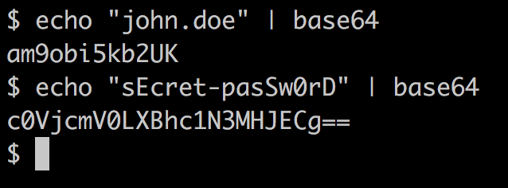

为秘密信息创建 Base64 编码值

1.  使用上述值，我们可以创建秘密信息并描述它：

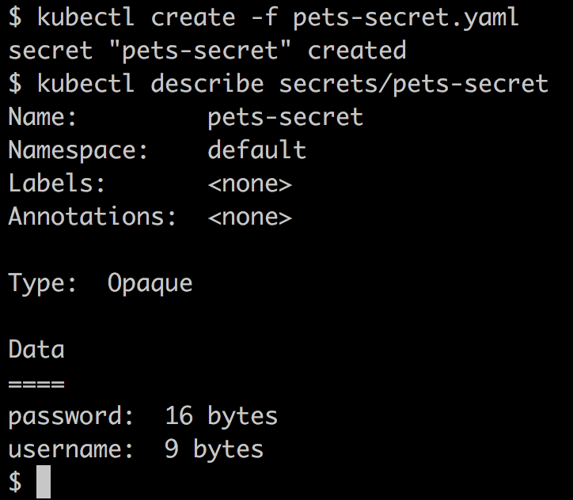

创建和描述 Kubernetes 秘密信息

1.  在秘密信息的描述中，值被隐藏，只给出它们的长度。所以，现在秘密安全了吗？不，实际上并没有。我们可以轻松地使用`kubectl get`命令解码这个秘密信息。

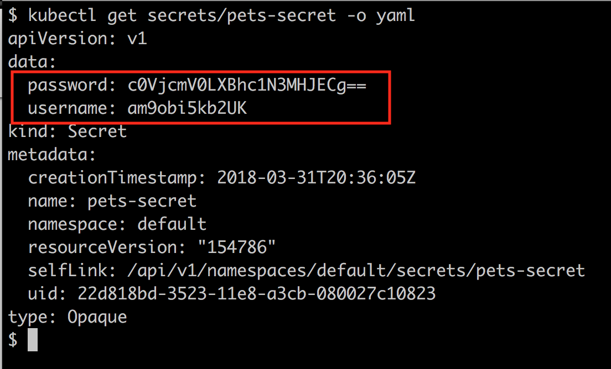

Kubernetes 秘密信息解码

如我们在前面的截图中所见，我们已恢复了原始的秘密值。

1.  解码之前获得的值：

```
$ echo "c0VjcmV0LXBhc1N3MHJECg==" | base64 --decode
sEcret-pasSw0rD
```

因此，结果是这种创建 Kubernetes 的方法不能在开发环境之外的任何环境中使用，因为我们处理的是非敏感数据。在所有其他环境中，我们需要一种更好的方式来处理秘密。

# 使用 kubectl 创建秘密

定义秘密的更安全方式是使用`kubectl`。首先，我们创建包含 base64 编码的秘密值的文件，类似于我们在前一节中所做的，但这次我们将值存储在临时文件中：

```
$ echo "sue-hunter" | base64 > username.txt
$ echo "123abc456def" | base64 > password.txt
```

现在，我们可以使用`kubectl`从这些文件创建一个秘密，如下所示：

```
$ kubectl create secret generic pets-secret-prod \
 --from-file=./username.txt \
 --from-file=./password.txt
secret "pets-secret-prod" created
```

然后，秘密可以像手动创建的秘密一样使用。

你可能会问，为什么这种方法比另一种方法更安全？首先，没有定义秘密的 YAML 文件存储在某些源代码版本控制系统中（如 GitHub），这些系统许多人都有访问权限，因此可以查看并解码秘密。只有被授权知道秘密的管理员才能看到这些值，并用它们直接在（生产）集群中创建秘密。集群本身受角色访问控制保护，因此无授权人员无法访问它，也无法解码集群中定义的秘密。

现在，让我们看看如何实际使用我们定义的秘密。

# 在 Pod 中使用秘密

假设我们要创建一个`Deployment`对象，其中`web`组件使用我们在前一节中介绍的秘密`pets-secret`。我们可以使用以下命令在集群中创建秘密：

```
$ kubectl create -f pets-secret.yaml
```

在`~/fod/ch16/web-deploy-secret.yaml`文件中，我们可以找到`Deployment`对象的定义。我们不得不将从`23`行开始的部分添加到原始的`Deployment`对象定义中：

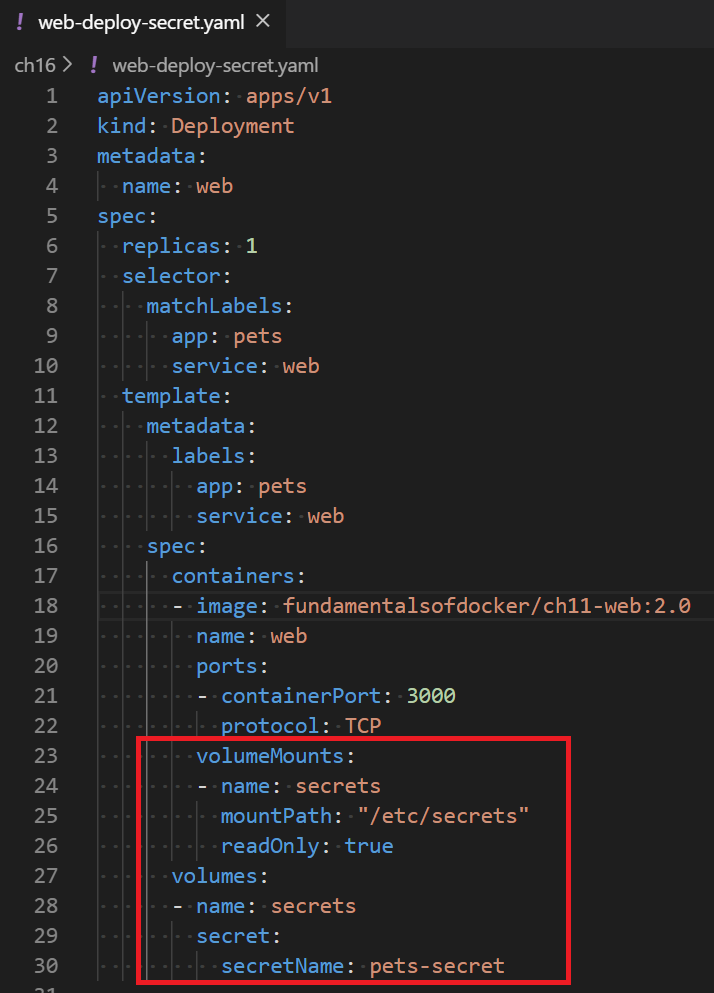

带有秘密的`web`组件的`Deployment`对象

在`27`至`30`行中，我们定义了一个名为`secrets`的卷，来自我们的秘密`pets-secret`。然后，我们如`23`至`26`行所述，在容器中使用该卷。我们将秘密挂载到容器文件系统的`/etc/secrets`目录，并且以只读模式挂载该卷。因此，秘密值将作为文件提供给容器，存放在该文件夹中。这些文件的名称将对应于键名，文件的内容将是相应键的值。这些值将以未加密的形式提供给容器内运行的应用程序。

在我们的案例中，由于我们在秘密中有`username`和`password`键，因此我们将在容器文件系统中的`/etc/secrets`文件夹中找到两个文件，分别命名为`username`和`password`。`username`文件应该包含值`john.doe`，`password`文件应该包含值`sEcret-pasSw0rD`。以下是确认信息：

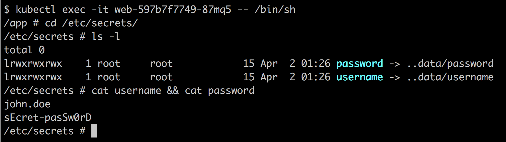

确认密钥在容器内部可用

在前面输出的`1`行，我们`exec`进入运行 Web 组件的容器。然后，在`2`到`5`行中，我们列出了`/etc/secrets`文件夹中的文件，最后，在`6`到`8`行中，我们显示了这两个文件的内容，不出所料，显示了明文的密钥值。

由于任何用任意语言编写的应用程序都可以读取简单文件，因此使用密钥的机制非常向后兼容。即使是旧的 Cobol 应用程序也能从文件系统中读取明文文件。

然而，有时应用程序需要密钥在环境变量中可用。让我们看看 Kubernetes 在这种情况下为我们提供了什么。

# 环境变量中的密钥值

假设我们的 Web 组件需要在环境变量`PETS_USERNAME`中获取用户名，在`PETS_PASSWORD`中获取密码。如果是这样，我们可以修改我们的部署 YAML，使其如下所示：

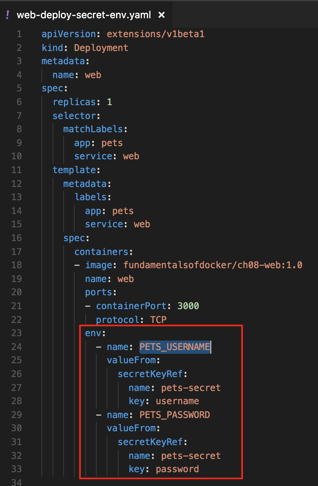

部署映射密钥值到环境变量

在`23`到`33`行中，我们定义了两个环境变量，`PETS_USERNAME`和`PETS_PASSWORD`，并将`pets-secret`的相应键值对映射到这些环境变量中。

请注意，我们不再需要卷；相反，我们直接将`pets-secret`的各个密钥映射到容器内部有效的相应环境变量。以下命令序列显示了密钥值确实可以在容器内部通过相应的环境变量访问：

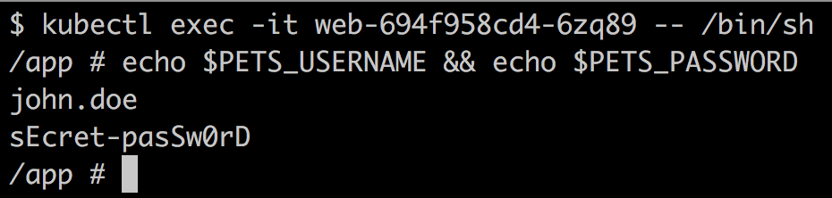

密钥值映射到环境变量

在本节中，我们向您展示了如何在 Kubernetes 集群中定义密钥，并如何在作为部署一部分的容器中使用这些密钥。我们展示了两种密钥映射到容器中的方式，第一种是使用文件，第二种是使用环境变量。

# 小结

本章中，我们学习了如何将应用程序部署到 Kubernetes 集群中，以及如何为该应用程序设置应用级路由。此外，我们还学习了如何在不导致停机的情况下更新 Kubernetes 集群中运行的应用服务。最后，我们使用密钥为运行在集群中的应用服务提供敏感信息。

在下一章中，我们将学习用于监控在 Kubernetes 集群上运行的单个服务或整个分布式应用程序的不同技术。我们还将学习如何在不更改集群或服务运行的集群节点的情况下，排除在生产环境中运行的应用服务的问题。敬请期待。

# 问题

为了评估您的学习进度，请回答以下问题：

1.  你有一个由两个服务组成的应用程序，第一个是 Web API，第二个是数据库，例如 Mongo DB。你想将此应用程序部署到 Kubernetes 集群中。简短地解释一下你会如何进行。

1.  用你自己的话描述建立应用程序的第七层（或应用层）路由所需的组件。

1.  列出实现简单应用服务的蓝绿部署所需的主要步骤。避免过多细节。

1.  列举通过 Kubernetes secrets 提供给应用服务的三种或四种信息类型。

1.  命名 Kubernetes 创建 secret 时接受的源。

# 进一步阅读

以下是一些提供关于本章讨论主题的额外信息的链接：

+   执行滚动更新：[`bit.ly/2o2okEQ`](https://bit.ly/2o2okEQ)

+   蓝绿部署：[`bit.ly/2r2IxNJ`](https://bit.ly/2r2IxNJ)

+   Kubernetes 中的 secrets：[`bit.ly/2C6hMZF`](https://bit.ly/2C6hMZF)
