# 在云中运行容器化应用

在上一章中，我们学习了如何在生产环境中部署、监控和排除应用故障。

在本章中，我们将概述一些在云中运行容器化应用的流行方式。我们将探讨自托管和托管解决方案，并讨论它们的优缺点。微软 Azure 和谷歌云引擎等供应商提供的完全托管服务也将简要讨论。

本章我们将讨论以下主题：

+   在**亚马逊网络服务**（**AWS**）上部署并使用 Docker **企业版**（**EE**）

+   探索微软的**Azure Kubernetes 服务**（**AKS**）

+   了解**谷歌 Kubernetes 引擎**（**GKE**）

阅读完本章后，您将能够执行以下操作：

+   在 AWS 中使用 Docker EE 创建一个 Kubernetes 集群

+   在 AWS 的 Docker EE 集群中部署并运行一个简单的分布式应用

+   在微软的 AKS 上部署并运行一个简单的分布式应用

+   在 GKE 上部署并运行一个简单的分布式应用

# 技术要求

本章我们将使用 AWS、微软 Azure 和谷歌云。因此，需要为每个平台准备一个账户。如果您没有现有账户，可以申请这些云服务提供商的试用账户。

我们还将使用来自 GitHub 的`labs`仓库中`~/fod-solution/ch18`文件夹中的文件，链接为：[`github.com/PacktPublishing/Learn-Docker---Fundamentals-of-Docker-19.x-Second-Edition/tree/master/ch18`](https://github.com/PacktPublishing/Learn-Docker---Fundamentals-of-Docker-19.x-Second-Edition/tree/master/ch18)。

# 在 AWS 上部署和使用 Docker EE

在本节中，我们将安装 Docker **统一控制平面**（**UCP**）3.0 版本。UCP 是 Docker 企业版的一部分，支持 Docker Swarm 和 Kubernetes 两种编排引擎。UCP 可以在云中或本地安装，甚至可以在混合云环境中使用 UCP。

要尝试此操作，您需要一个有效的 Docker EE 许可证，或者您可以在 Docker Store 申请一个免费测试许可证。

# 配置基础设施

在本节中，我们将设置安装 Docker UCP 所需的基础设施。如果您对 AWS 有所了解，这一步相对简单。我们通过以下步骤来完成：

1.  在 AWS 中使用 Ubuntu 16.04 服务器 AMI 创建一个**自动扩展组**（**ASG**）。配置该 ASG 包含三个`t2.xlarge`大小的实例。以下是结果：

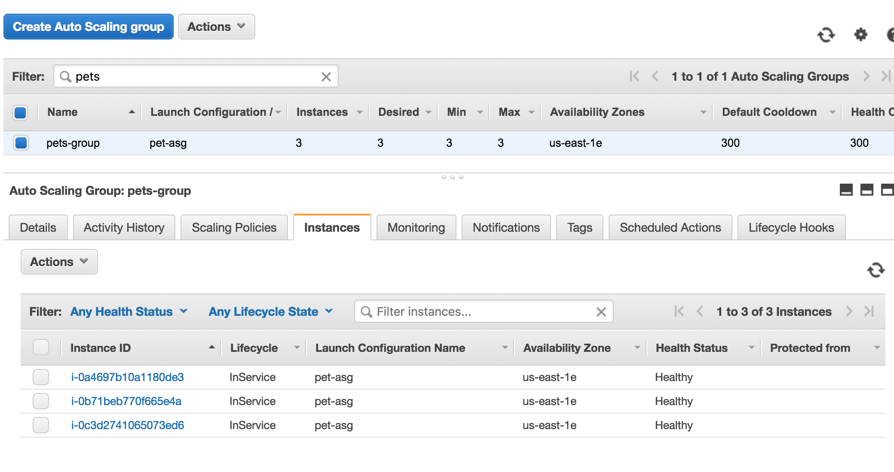

AWS 上的 ASG 为 Docker EE 准备就绪

一旦 ASG 创建完成，在继续之前，我们需要稍微开放**安全组**（**SG**），以便能够通过 SSH 从我们的笔记本电脑访问它，并且**虚拟机**（**VMs**）之间能够相互通信。

1.  转到您的安全组（SG）并添加两个新的入站规则，具体如下所示：

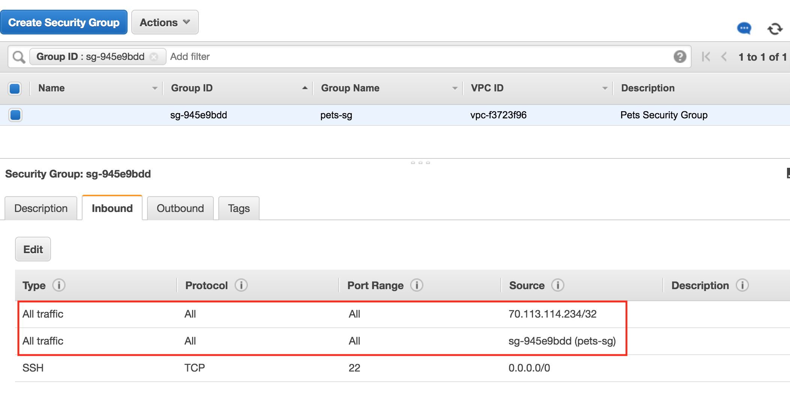

AWS 安全组（SG）设置

在之前的截图中，第一个规则允许任何来自我个人笔记本（IP 地址为`70.113.114.234`）的流量访问安全组中的任何资源。第二个规则允许安全组内部的所有流量。这些设置不适合用于生产环境，因为它们过于宽松。但是在这个演示环境中，它们非常有效。

接下来，我们将展示如何在刚才准备好的虚拟机上安装 Docker。

# 安装 Docker

在配置好集群节点后，我们需要在每个节点上安装 Docker。通过以下步骤可以轻松完成：

1.  SSH 连接到所有三个实例并安装 Docker。使用下载的密钥，SSH 连接到第一台机器：

```
$ ssh -i pets.pem ubuntu@<IP address>
```

这里，`<IP 地址>`是我们想要 SSH 连接的虚拟机的公网 IP 地址。

1.  现在我们可以安装 Docker。有关详细说明，请参考[`dockr.ly/2HiWfBc`](https://dockr.ly/2HiWfBc)。我们在`~/fod/ch18/aws`文件夹中有一个名为`install-docker.sh`的脚本，可以使用这个脚本进行安装。

1.  首先，我们需要将`labs` GitHub 仓库克隆到虚拟机：

```
$ git clone https://github.com/PacktPublishing/Learn-Docker---Fundamentals-of-Docker-19.x-Second-Edition.git ~/fod
$ cd ~/fod/ch18/aws
```

1.  然后，我们运行脚本来安装 Docker：

```
$ ./install-docker.sh
```

1.  脚本完成后，我们可以通过`sudo docker version`来验证 Docker 是否已正确安装。为另外两台虚拟机重复之前的步骤。

`sudo` 只在下次打开此虚拟机的 SSH 会话时才需要，因为我们已经将`ubuntu`用户添加到`docker`组。所以，我们需要退出当前的 SSH 会话并重新连接。这时，`sudo` 不应该与`docker`一起使用。

接下来，我们将展示如何在刚才准备的基础设施上安装 Docker UCP。

# 安装 Docker UCP

我们需要设置一些环境变量，具体如下：

```
$ export UCP_IP=<IP address>
$ export UCP_FQDN=<FQDN>
$ export UCP_VERSION=3.0.0-beta2
```

这里，`<IP 地址>`和`<FQDN>`分别是我们在 UCP 中安装的 AWS EC2 实例的公网 IP 地址和公有 DNS 名称。

之后，我们可以使用以下命令下载 UCP 需要的所有镜像：

```
$ docker run --rm docker/ucp:${UCP_VERSION} images --list \
 | xargs -L 1 docker pull
```

最后，我们可以安装 UCP：

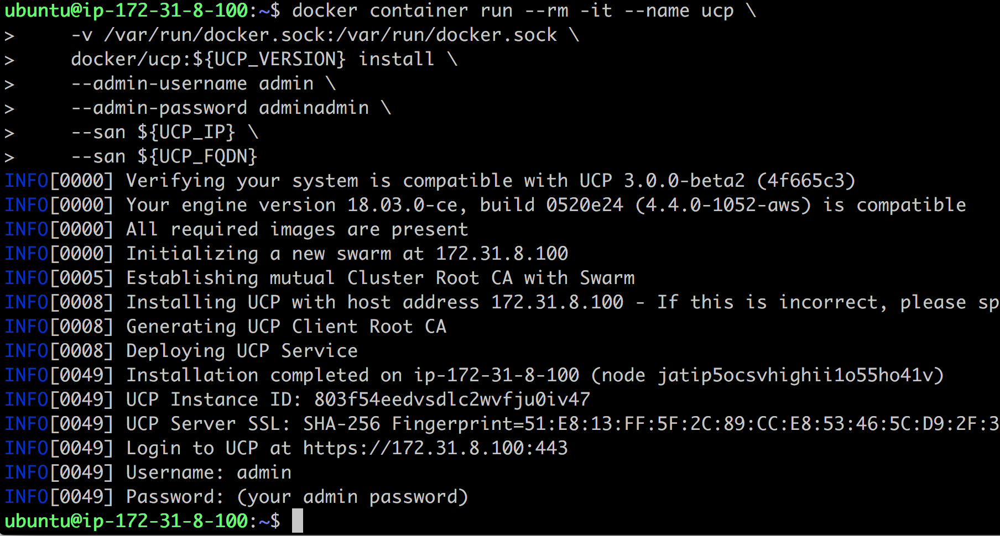

在 AWS 的虚拟机（VM）上安装 UCP 3.0.0-beta2

现在，我们可以打开浏览器窗口并导航到`https://<IP 地址>`。使用用户名`admin`和密码`adminadmin`登录。当系统要求提供许可证时，上传你的许可证密钥，或者点击链接获取试用许可证。

登录后，在左侧的共享资源（Shared Resources）部分，选择节点（Nodes），然后点击添加节点（Add Node）按钮：

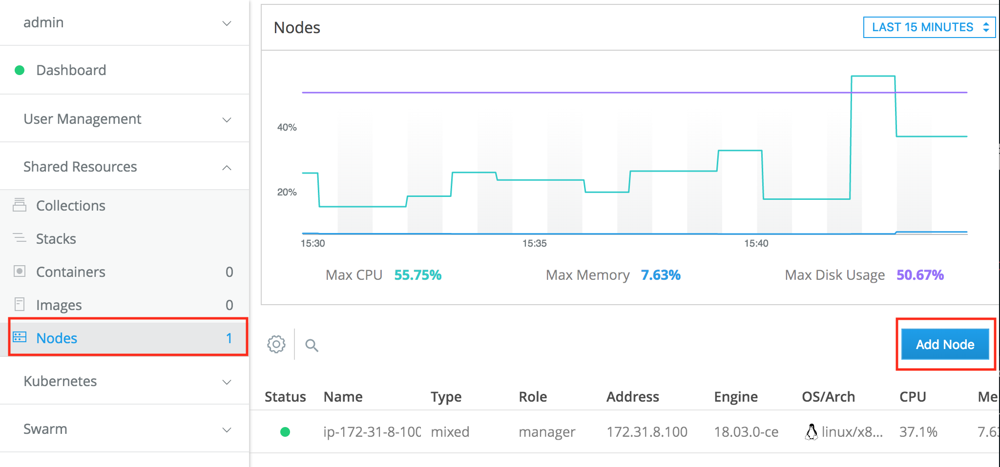

向 UCP 添加新节点

在随后的添加节点（Add Node）对话框中，确保节点类型选择为 Linux，并且选择了工作节点（Worker）角色。然后，复制对话框底部的`docker swarm join`命令。通过 SSH 连接到你创建的另外两个虚拟机，并运行此命令，让相应的节点作为工作节点加入 Docker swarm：

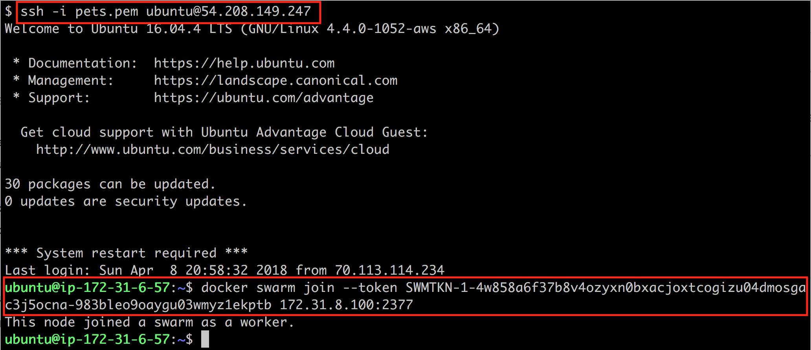

将节点作为工作节点加入 UCP 集群

返回到 UCP 的 Web 界面，你应该可以看到我们现在有三个节点已准备好，如下所示：

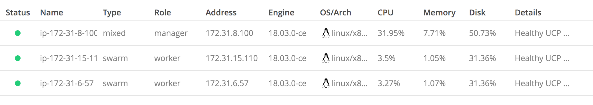

UCP 集群中的节点列表

默认情况下，工作节点被配置为只能运行 Docker Swarm 工作负载。不过，这可以在节点详情中更改。在此，有三种设置方式：仅 Swarm、仅 Kubernetes 或混合工作负载。让我们从 Docker Swarm 作为编排引擎开始，并部署我们的宠物应用程序。

# 使用远程管理员管理 UCP 集群

为了能够从笔记本电脑远程管理 UCP 集群，我们需要从 UCP 创建并下载一个所谓的**客户端捆绑包**。请按照以下步骤操作：

1.  在 UCP Web UI 中，在左侧的 admin 下，选择我的个人资料（My Profile）选项。

1.  在随后的对话框中，选择“新客户端捆绑包”（New Client Bundle）选项，然后点击“生成客户端捆绑包”（Generate Client Bundle）：

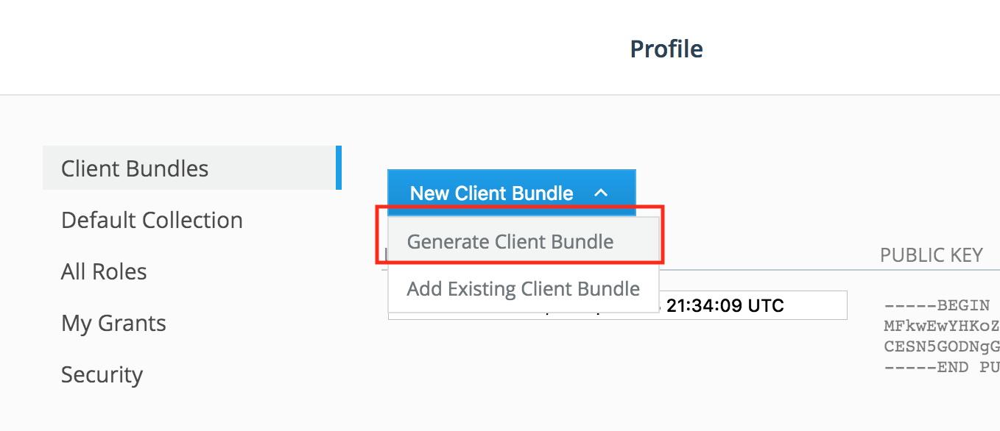

生成并下载 UCP 客户端捆绑包

1.  找到你下载的捆绑包，并解压它。

1.  在一个新的终端窗口中，导航到该文件夹，并加载 `env.sh` 文件：

```
$ source env.sh
```

你应该会看到类似以下的输出：

```
Cluster "ucp_34.232.53.86:6443_admin" set.
User "ucp_34.232.53.86:6443_admin" set.
Context "ucp_34.232.53.86:6443_admin" created.
```

现在，我们可以通过例如列出集群中所有节点来验证是否能够远程访问 UCP 集群：

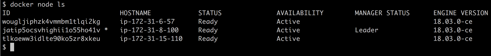

列出我们远程 UCP 集群的所有节点

在接下来的部分中，我们将学习如何使用 Docker Swarm 作为编排引擎将宠物应用程序作为堆栈部署。

# 部署到 Docker Swarm

现在是时候将我们的分布式应用程序部署到由 Docker Swarm 编排的集群中了。请按照以下步骤进行：

1.  在终端中，导航到 `~/fod/ch18/ucp` 文件夹，并使用 `stack.yml` 文件创建 `pets` 堆栈：

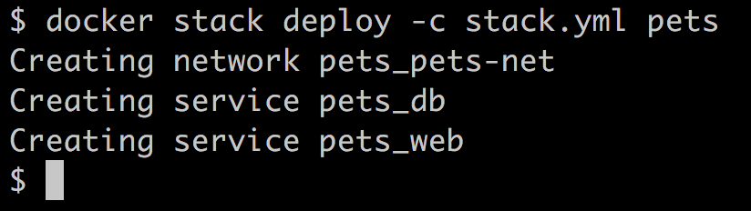

将宠物堆栈部署到 UCP 集群

1.  在 UCP Web UI 中，我们可以验证堆栈是否已创建：

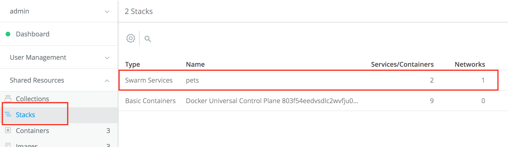

UCP Web UI 中的宠物堆栈列表

1.  要测试应用程序，我们可以在主菜单中的服务（Services）下，点击 Swarm。集群中运行的服务列表将如下所示：

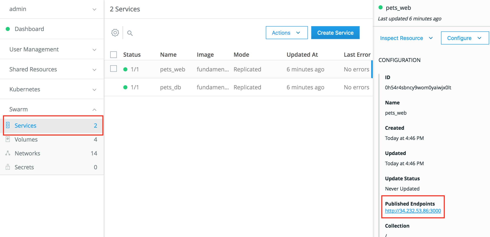

宠物堆栈的“web”服务详细信息

在前面的截图中，我们看到我们的两个服务，`web` 和 `db`，它们属于 `pets` 堆栈。如果我们点击 `web` 服务，其详细信息会显示在右侧。在那里，我们可以找到一个条目，“已发布的端点”（Published Endpoints）。

1.  点击链接，我们的`pets`应用程序应该会在浏览器中显示。

完成后，用以下命令从控制台中删除堆栈：

```
$ docker stack rm pets
```

或者，你可以尝试从 UCP Web UI 中删除该堆栈。

# 部署到 Kubernetes

从你之前用来远程访问 UCP 集群以部署宠物应用程序的终端，现在我们可以尝试使用 Kubernetes 作为编排引擎，将宠物应用程序部署到 UCP 集群。

确保你仍然在 `~/fod/ch18/ucp` 文件夹中。使用 `kubectl` 部署宠物应用程序。首先，我们需要测试是否能通过 Kubernetes CLI 获取集群的所有节点：

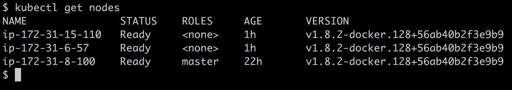

使用 Kubernetes CLI 获取 UCP 集群的所有节点

显然，我的环境配置正确，`kubectl` 确实可以列出 UCP 集群中的所有节点。这意味着我现在可以使用 `pets.yaml` 文件中的定义来部署宠物应用程序：

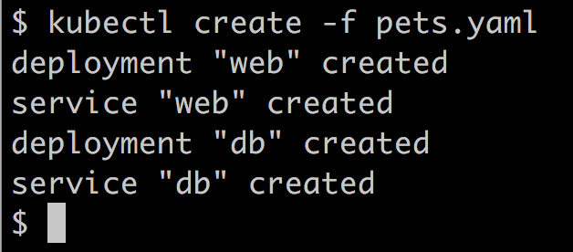

使用 Kubernetes CLI 在 UCP 集群中创建宠物应用程序

我们可以使用 `kubectl get all` 列出创建的对象。然后，在浏览器中，我们可以访问 `http://<IP 地址>:<端口>` 来访问宠物应用程序，其中 `<IP 地址>` 是 UCP 集群节点之一的公共 IP 地址，`<端口>` 是由 `web` Kubernetes 服务发布的端口。

我们在 AWS ASG 中创建了一个由三台虚拟机组成的集群，并在它们上安装了 Docker 和 UCP 3.0。然后，我们将著名的宠物应用程序部署到 UCP 集群中，一次使用 Docker Swarm 作为编排引擎，另一次使用 Kubernetes。

Docker UCP 是一个平台无关的容器平台，提供安全的企业级软件供应链，支持任何云环境、本地环境、裸金属或虚拟化环境。它甚至在编排引擎方面提供了选择自由，用户可以在 Docker Swarm 和 Kubernetes 之间进行选择。还可以在同一集群中同时运行两个编排器中的应用程序。

# 探索 Microsoft 的 Azure Kubernetes 服务（AKS）

要在 Azure 上试验 Microsoft 的容器相关服务，我们需要一个 Azure 账户。你可以创建一个试用账户或使用现有账户。你可以在这里获取免费的试用账户：[`azure.microsoft.com/en-us/free/`](https://azure.microsoft.com/en-us/free/)。

Microsoft 在 Azure 上提供了不同的容器相关服务。最容易使用的可能是 Azure 容器实例，它承诺是运行容器在 Azure 中的最快、最简单的方式，无需配置虚拟机，也无需采用更高级的服务。如果你只想在托管环境中运行单个容器，这项服务非常有用。设置过程非常简单。在 Azure 门户（[portal.azure.com](http://portal.azure.com)）中，首先创建一个新的资源组，然后创建一个 Azure 容器实例。你只需填写一个简短的表单，填写容器名称、使用的镜像和要打开的端口等属性。容器可以通过公共或私有 IP 地址提供，并且如果容器崩溃，它将自动重启。还提供了一个不错的管理控制台，例如用来监控资源消耗（如 CPU 和内存）。

第二个选择是**Azure 容器服务**（**ACS**），它提供了一种简化创建、配置和管理预先配置好的虚拟机集群（用于运行容器化应用程序）的方法。ACS 使用 Docker 镜像，并提供三种编排器供选择：Kubernetes、Docker Swarm 和 DC/OS（由 Apache Mesos 提供支持）。微软声称，他们的服务可以扩展到数万个容器。ACS 是免费的，您只需为计算资源付费。

在本节中，我们将集中讨论最受欢迎的 Kubernetes 基础的服务。它叫做 AKS，可以在此找到：[`azure.microsoft.com/en-us/services/kubernetes-service/`](https://azure.microsoft.com/en-us/services/kubernetes-service/)。AKS 让您可以轻松将应用程序部署到云端，并在 Kubernetes 上运行它们。所有困难且繁琐的管理任务都由微软处理，您可以全身心地专注于应用程序。这意味着您永远不需要处理诸如安装和管理 Kubernetes、升级 Kubernetes 或升级 Kubernetes 节点底层操作系统等任务。所有这些都由微软 Azure 的专家处理。此外，您永远不需要处理`etc`或 Kubernetes 主节点。这一切对您来说都是隐藏的，您唯一需要与之交互的是运行应用程序的 Kubernetes 工作节点。

# 准备 Azure CLI

话虽如此，开始吧。我们假设你已经创建了一个免费试用账户，或者正在使用 Azure 上的现有账户。有多种方式可以与 Azure 账户进行交互。我们将使用在本地计算机上运行的 Azure CLI。我们可以选择在计算机上本地下载并安装 Azure CLI，或者在本地的 Docker for Desktop 容器内运行它。由于本书内容全是关于容器的，所以我们选择后一种方法。

最新版本的 Azure CLI 可以在 Docker Hub 上找到。让我们拉取它：

```
$ docker image pull mcr.microsoft.com/azure-cli:latest
```

我们将从这个 CLI 运行一个容器，并在该容器内的 Shell 中执行所有后续命令。现在，我们需要克服一个小问题。这个容器中不会安装 Docker 客户端。但是我们也需要运行一些 Docker 命令，因此我们必须创建一个从前一个镜像派生的自定义镜像，其中包含 Docker 客户端。为了做到这一点，我们需要的`Dockerfile`文件可以在`~/fod/ch18`文件夹中找到，内容如下：

```
FROM mcr.microsoft.com/azure-cli:latest
RUN apk update && apk add docker
```

在第二行，我们只是使用 Alpine 包管理器`apk`来安装 Docker。然后，我们可以使用 Docker Compose 构建并运行这个自定义镜像。相应的`docker-compose.yml`文件如下所示：

```
version: "2.4"
services:
    az:
        image: fundamentalsofdocker/azure-cli
        build: .
        command: tail -F anything
        working_dir: /app
        volumes:
            - /var/run/docker.sock:/var/run/docker.sock
            - .:/app
```

请注意用于保持容器运行的命令，以及在`volumes`部分挂载 Docker 套接字和当前文件夹的设置。

如果你在 Windows 上运行 Docker for Desktop，那么你需要定义`COMPOSE_CONVERT_WINDOWS_PATHS`环境变量才能挂载 Docker 套接字。使用

从 Bash shell 中使用`export COMPOSE_CONVERT_WINDOWS_PATHS=1`，或者在运行 PowerShell 时使用`$Env:COMPOSE_CONVERT_WINDOWS_PATHS=1`。有关更多详细信息，请参阅以下链接：[`github.com/docker/compose/issues/4240`](https://github.com/docker/compose/issues/4240)。

现在，让我们构建并运行这个容器：

```
$ docker-compose up --build -d
```

然后，让我们进入`az`容器，并使用以下命令在其中运行 Bash shell：

```
$ docker-compose exec az /bin/bash

bash-5.0#
```

我们将发现自己在容器内运行的是 Bash shell。让我们首先检查 CLI 的版本：

```
bash-5.0# az --version
```

这应该会生成类似于此的输出（简化版）：

```
azure-cli 2.0.78
...
Your CLI is up-to-date.
```

好的，我们运行的版本是`2.0.78`。接下来，我们需要登录到我们的账户。执行以下命令：

```
bash-5.0# az login
```

你将看到以下提示信息：

```
To sign in, use a web browser to open the page https://microsoft.com/devicelogin and enter the code <code> to authenticate.
```

按照指示操作并通过浏览器登录。一旦成功验证了你的 Azure 帐户，你可以返回终端，应该已经登录，输出中会有相关信息：

```
[
  {
    "cloudName": "AzureCloud",
    "id": "<id>",
    "isDefault": true,
    "name": "<account name>",
    "state": "Enabled",
    "tenantId": "<tenant-it>",
    "user": {
      "name": "xxx@hotmail.com",
      "type": "user"
    }
  }
]
```

现在，我们准备好将容器镜像首先迁移到 Azure。

# 在 Azure 上创建一个容器注册表

首先，我们创建一个名为`animal-rg`的新资源组。在 Azure 中，资源组用于逻辑地分组一组相关的资源。为了获得最佳的云体验并保持低延迟，选择一个靠近你的数据中心非常重要。你可以使用以下命令列出所有区域：

```
bash-5.0# az account list-locations 
[
  {
    "displayName": "East Asia",
    "id": "/subscriptions/186760ad-9152-4499-b317-c9bff441fb9d/locations/eastasia",
    "latitude": "22.267",
    "longitude": "114.188",
    "name": "eastasia",
    "subscriptionId": null
  },
  ...
]
```

这将给你一个相当长的列表，列出所有你可以选择的区域。使用`name`，例如`eastasia`，来识别你选择的区域。在我的案例中，我将选择`westeurope`。请注意，并非所有列出的地点都适用于资源组。

创建资源组的命令很简单；我们只需要为该组指定名称和位置：

```
bash-5.0# az group create --name animals-rg --location westeurope

{
  "id": "/subscriptions/186760ad-9152-4499-b317-c9bff441fb9d/resourceGroups/animals-rg",
  "location": "westeurope",
  "managedBy": null,
  "name": "animals-rg",
  "properties": {    
    "provisioningState": "Succeeded"
  },
  "tags": null,
  "type": "Microsoft.Resources/resourceGroups"
}
```

确保你的输出显示`"provisioningState": "Succeeded"`。

在生产环境中运行容器化应用时，我们希望确保能够从容器注册表中自由下载相应的容器镜像。到目前为止，我们一直从 Docker Hub 下载镜像。但这通常不可行。出于安全原因，生产系统的服务器通常无法直接访问互联网，因此无法访问 Docker Hub。让我们遵循这一最佳实践，并假设我们的 Kubernetes 集群在创建时也有相同的限制。

那么，我们该怎么办呢？解决方案是使用一个靠近我们的集群并且位于相同安全上下文中的容器镜像注册表。在 Azure 中，我们可以创建一个**Azure 容器注册表**（**ACR**）并在那里托管我们的镜像。让我们首先创建这样的注册表：

```
bash-5.0# az acr create --resource-group animals-rg --name <acr-name> --sku Basic
```

请注意，`<acr-name>`需要是唯一的。在我的情况下，我选择了名称`fodanimalsacr`。输出（简化版）如下：

```
{
 "adminUserEnabled": false,
 "creationDate": "2019-12-22T10:31:14.848776+00:00",
 "id": "/subscriptions/186760ad...",
 "location": "westeurope",
 "loginServer": "fodanimalsacr.azurecr.io",
 "name": "fodanimalsacr",
 ...
 "provisioningState": "Succeeded",
```

成功创建容器注册表后，我们需要使用以下命令登录该注册表：

```
bash-5.0# az acr login --name <acr-name> 
Login Succeeded
WARNING! Your password will be stored unencrypted in /root/.docker/config.json.
Configure a credential helper to remove this warning. See
https://docs.docker.com/engine/reference/commandline/login/#credentials-store
```

一旦成功登录到 Azure 上的容器注册表，我们需要正确标记我们的容器，以便之后能够推送到 ACR。接下来将描述如何标记和推送镜像到 ACR。

# 将我们的镜像推送到 ACR

一旦成功登录到 ACR，我们可以标记我们的镜像，以便它们可以被推送到注册表。为此，我们需要获取我们的 ACR 实例的 URL。我们可以使用以下命令来完成：

```
$ az acr list --resource-group animals-rg \
 --query "[].{acrLoginServer:loginServer}" \
 --output table

AcrLoginServer
------------------------
fodanimalsacr.azurecr.io
```

现在我们使用前面的 URL 来标记我们的镜像：

```
bash-5.0# docker image tag fundamentalsofdocker/ch11-db:2.0 fodanimalsacr.azurecr.io/ch11-db:2.0
bash-5.0# docker image tag fundamentalsofdocker/ch11-web:2.0 fodanimalsacr.azurecr.io/ch11-web:2.0
```

然后，我们可以将它们推送到我们的 ACR：

```
bash-5.0# docker image push fodanimalsacr.azurecr.io/ch11-db:2.0
bash-5.0# docker image push fodanimalsacr.azurecr.io/ch11-web:2.0
```

为了双重检查我们的镜像是否确实在 ACR 中，我们可以使用以下命令：

```
bash-5.0# az acr repository list --name <acr-name> --output table 
Result
--------
ch11-db
ch11-web

```

确实，我们刚刚推送的两个镜像已经列出。这样，我们就可以准备创建我们的 Kubernetes 集群了。

# 创建 Kubernetes 集群

再次，我们将使用自定义的 Azure CLI 来创建 Kubernetes 集群。我们必须确保集群能够访问我们刚刚创建的 ACR 实例，而该实例是我们容器镜像所在的地方。因此，创建一个名为 `animals-cluster` 并具有两个工作节点的集群的命令如下：

```
bash-5.0# az aks create \
 --resource-group animals-rg \
 --name animals-cluster \
 --node-count 2 \
 --generate-ssh-keys \
 --attach-acr <acr-name>
```

这个命令需要一些时间，但几分钟后，我们应该会收到一个 JSON 格式的输出，显示新创建的集群的所有详细信息。

要访问集群，我们需要 `kubectl`。我们可以使用以下命令轻松地在 Azure CLI 容器中安装它：

```
bash-5.0# az aks install-cli
```

安装好 `kubectl` 后，我们需要必要的凭据，以便使用该工具在 Azure 上操作我们的新 Kubernetes 集群。我们可以通过以下命令获取必要的凭据：

```
bash-5.0# az aks get-credentials --resource-group animals-rg --name animals-cluster 
Merged "animals-cluster" as current context in /root/.kube/config
```

在前面的命令成功执行后，我们可以列出我们集群中的所有节点：

```
bash-5.0# kubectl get nodes NAME                                STATUS   ROLES   AGE     VERSION
aks-nodepool1-12528297-vmss000000   Ready    agent   4m38s   v1.14.8
aks-nodepool1-12528297-vmss000001   Ready    agent   4m32s   v1.14.8
```

正如预期的那样，我们有两个工作节点正在运行。那些节点上运行的 Kubernetes 版本是 `1.14.8`。

我们现在已经准备好将应用程序部署到这个集群了。在接下来的部分中，我们将学习如何执行这个操作。

# 将我们的应用程序部署到 Kubernetes 集群

要部署应用程序，我们可以使用 `kubectl apply` 命令：

```
bash-5.0# kubectl apply -f animals.yaml 
```

前面的命令执行后的输出应该类似于这样：

```
deployment.apps/web created
service/web created
deployment.apps/db created
service/db created
```

现在，我们想要测试应用程序。记得我们为 web 组件创建了一个类型为 `LoadBalancer` 的服务。该服务将应用程序暴露到互联网。这一过程可能需要一些时间，因为 AKS 等任务需要为该服务分配一个公共 IP 地址。我们可以通过以下命令来观察这一过程：

```
bash-5.0# kubectl get service web --watch
```

请注意前面命令中的 `--watch` 参数。它允许我们随着时间的推移监控命令的进度。最初，我们应该看到类似以下的输出：

```
NAME TYPE        CLUSTER-IP  EXTERNAL-IP  PORT(S)         AGE
web LoadBalancer 10.0.124.0  <pending>    3000:32618/TCP  5s
```

公共 IP 地址显示为待定。几分钟后，这应该会变成如下所示：

```
NAME TYPE        CLUSTER-IP  EXTERNAL-IP    PORT(S)         AGE
web LoadBalancer 10.0.124.0  51.105.229.192 3000:32618/TCP  63s
```

我们的应用程序现在已经准备好，可以通过 IP 地址 `51.105.229.192` 和端口号 `3000` 进行访问。请注意，负载均衡器将内部端口 `32618` 映射到外部端口 `3000`；这是我第一次没有注意到的。

让我们查看一下。在新浏览器标签页中，访问 `http://51.105.229.192:3000/pet`，你应该能看到我们熟悉的应用程序：

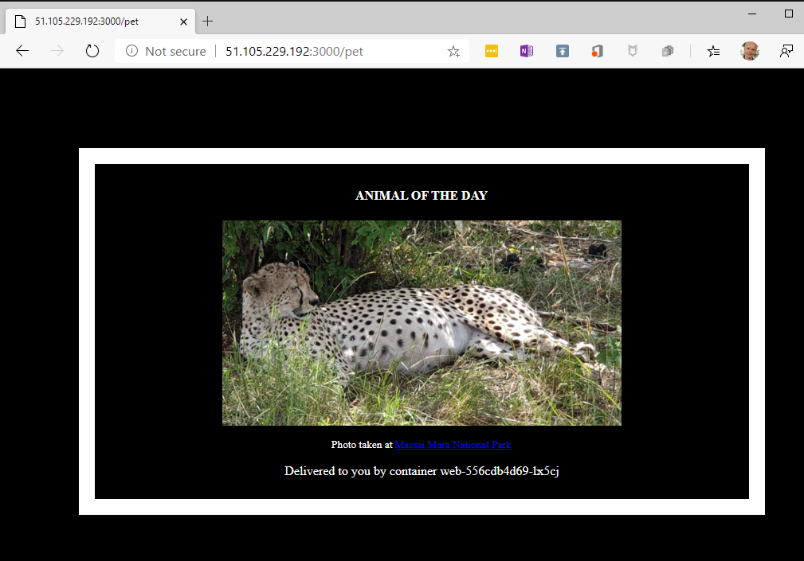

我们在 AKS 上运行的示例应用程序

至此，我们已成功将我们的分布式应用程序部署到托管在 Azure 上的 Kubernetes 中。我们不需要担心安装或管理 Kubernetes；可以专注于应用程序本身。

现在我们已经完成了应用程序的实验，应该记得删除 Azure 上的所有资源，以避免产生不必要的费用。我们可以通过删除资源组来删除所有资源，操作如下：

```
bash-5.0# az group delete --name animal-rg --yes --no-wait 
```

Azure 在容器工作负载方面有一些引人注目的产品，而且由于 Azure 主要提供开源的编排引擎，如 Kubernetes、Docker Swarm、DC/OS 和 Rancher，因此锁定效应不像 AWS 那样明显。从技术角度来说，如果我们最初在 Azure 上运行我们的容器化应用程序，之后决定迁移到其他云提供商，我们仍然可以保持灵活性。成本也应保持在可控范围内。

值得注意的是，当你删除资源组时，AKS 集群使用的 Azure Active Directory 服务主体不会被删除。有关如何删除服务主体的详细信息，请参阅在线帮助。

下一项是 Google 的 Kubernetes 引擎。

# 理解 GKE

Google 是 Kubernetes 的发明者，并且至今仍是其背后的推动力。因此，你可以预期 Google 在托管 Kubernetes 方面有强有力的产品。现在让我们一探究竟。要继续，你需要拥有一个 Google Cloud 帐户，或者在此创建一个测试帐户：[`console.cloud.google.com/freetrial`](https://console.cloud.google.com/freetrial)。继续以下步骤：

1.  在主菜单中选择 Kubernetes 引擎。第一次选择时，可能需要一些时间来初始化 Kubernetes 引擎。

1.  接下来，创建一个新项目并命名为 `massai-mara`；这可能需要一点时间。

1.  准备好后，我们可以通过点击弹窗中的创建集群来创建一个集群。

1.  在表单左侧选择**你的第一个集群**模板。

1.  将集群命名为`animals-cluster`，选择离你最近的区域或可用区，保持创建 Kubernetes 集群表单中的所有其他设置为默认值，然后点击表单底部的创建按钮。

它将再次花费一些时间为我们配置集群。一旦集群创建完成，我们可以通过点击视图右上角的 Shell 图标来打开 Cloud Shell。这应该看起来像下面的截图：

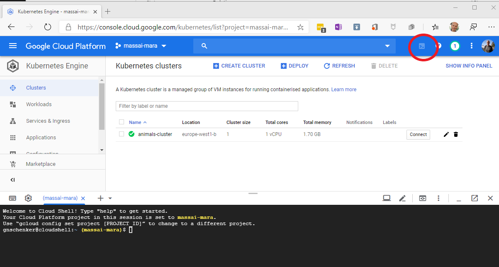

在 GKE 中准备好第一个 Kubernetes 集群并打开 Cloud Shell

现在我们可以使用以下命令将我们的`labs` GitHub 仓库克隆到此环境中：

```
$ git clone https://github.com/PacktPublishing/Learn-Docker---  Fundamentals-of-Docker-19.x-Second-Edition.git ~/fod
$ cd ~/fod/ch18/gce
```

我们现在应该在当前文件夹中找到一个 `animals.yaml` 文件， 可以用它将动物应用程序部署到我们的 Kubernetes 集群中。看看这个文件：

```
$ less animals.yaml
```

它的内容几乎与我们在前一章中使用的文件相同。两个不同之处在于：

+   我们使用的是类型为 `LoadBalancer` 的服务（而不是 `NodePort`）来公开暴露 `web` 组件。

+   我们没有为 PostgreSQL 数据库使用卷，因为在 GKE 上正确配置 StatefulSets 比在 Minikube 中更复杂。这样做的后果是，如果 `db` pod 崩溃，我们的动物应用程序将无法保存状态。如何在 GKE 上使用持久卷超出了本书的范围。

另外，请注意，我们没有使用 Google 容器注册中心来托管容器镜像，而是直接从 Docker Hub 拉取它们。这非常简单，类似于我们在 AKS 部分学到的内容，在 Google Cloud 中创建这样一个容器注册中心也很容易。

在继续之前，我们需要设置 `gcloud` 和 `kubectl` 凭证：

```
$ gcloud container clusters get-credentials animals-cluster --zone europe-west1-b 
Fetching cluster endpoint and auth data.
kubeconfig entry generated for animals-cluster.
```

做完这些之后，就可以部署应用程序了：

```
$ kubectl create -f animals.yaml 
deployment.apps/web created
service/web created
deployment.apps/db created
service/db created
```

一旦对象创建完成，我们可以观察 `LoadBalancer` 服务 `web`，直到它分配一个公共 IP 地址：

```
$ kubectl get svc/web --watch NAME   TYPE           CLUSTER-IP   EXTERNAL-IP     PORT(S)          AGE
web    LoadBalancer   10.0.5.222   <pending>       3000:32139/TCP   32s
web    LoadBalancer   10.0.5.222   146.148.23.70   3000:32139/TCP   39s
```

输出的第二行显示的是创建负载均衡器仍在等待中的情况，第三行则给出了最终状态。按 *Ctrl* + *C* 退出 `watch` 命令。显然，我们已经分配了公共 IP 地址 `146.148.23.70`，端口是 `3000`。

然后，我们可以使用这个 IP 地址并访问 `http://<IP 地址>:3000/pet`，此时应该会看到熟悉的动物图片。

完成应用程序的操作后，删除 Google Cloud 控制台中的集群和项目，以避免不必要的费用。

我们已经在 GKE 中创建了托管的 Kubernetes 集群。然后，我们使用通过 GKE 门户提供的 Cloud Shell，首先克隆了我们的 `labs` GitHub 仓库，然后使用 `kubectl` 工具将动物应用程序部署到 Kubernetes 集群中。

当考虑托管的 Kubernetes 解决方案时，GKE 是一个非常有吸引力的选择。它让启动变得非常简单，并且由于 Google 是 Kubernetes 背后的主要推动力，我们可以放心地使用 Kubernetes 的全部功能。

# 总结

在本书的最后一章，你首先了解了如何安装和使用 Docker 的 UCP，这是 Docker 在 AWS 上的企业级产品的一部分。然后，你学会了如何在 AKS 中创建托管的 Kubernetes 集群并运行动物应用程序，接着是 Google 自己的托管 Kubernetes 解决方案 GKE。

我很荣幸您选择了这本书，我也要感谢您与我一同走过这段旅程，在这段旅程中我们一起探讨了 Docker 容器及容器编排引擎。我希望这本书能成为您学习旅程中的宝贵资源。祝愿您在当前和未来的项目中使用容器时取得成功！

# 问题

为了评估您的知识，请回答以下问题：

1.  给出在 AWS 上配置和运行 Docker UPC 所需任务的高级描述。

1.  列举选择托管 Kubernetes 服务（如微软的 AKS 或谷歌的 GKE）来运行应用程序的一些原因。

1.  在使用托管 Kubernetes 解决方案（如 AKS 或 GKE）时，列出两个考虑将容器镜像托管在相应云服务提供商的容器注册表中的理由。

# 进一步阅读

以下文章为您提供了一些与本章讨论的主题相关的更多信息：

+   在 Linux 服务器上安装独立的 Docker EE 组件，请参见 [`dockr.ly/2vH5dpN`](https://dockr.ly/2vH5dpN)

+   Azure 容器服务 (AKS) 相关信息请见 [`bit.ly/2JglX9d`](https://bit.ly/2JglX9d)

+   Google Kubernetes Engine 相关信息请见 [`bit.ly/2I8MjJx`](https://bit.ly/2I8MjJx)
