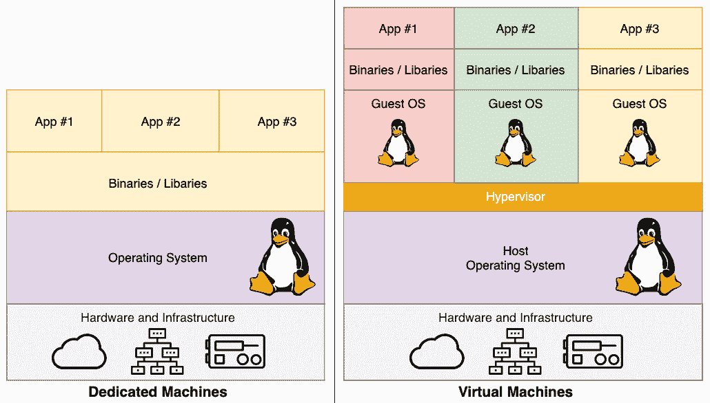
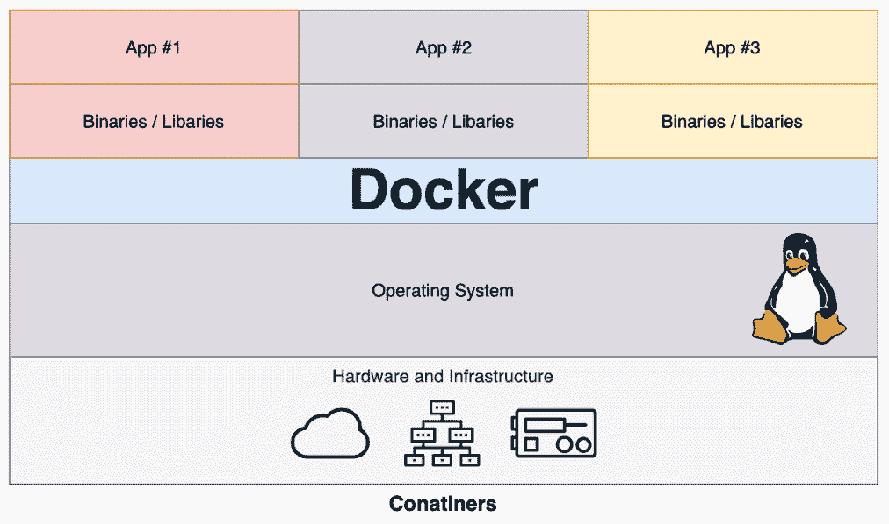

*第一章*

# 第一章：Docker 概述

欢迎来到 *《精通 Docker，第四版》*！本章将涵盖你应该已经掌握的 **Docker** 基础知识。如果你现在还没有掌握必要的知识，本章将帮助你尽快跟上，以免后续章节显得太难。

到书籍结束时，你将成为一个 Docker 大师，能够在你的环境中实现 Docker，构建和支持基于 Docker 的应用程序。

本章我们将回顾以下内容：

+   理解 Docker

+   专用主机、虚拟机和 Docker 安装器/安装之间的区别

+   Docker 命令

+   Docker 和容器生态系统

# 技术要求

本章我们将讨论如何在本地安装 Docker。为此，你需要一台运行以下三种操作系统之一的主机：

+   macOS High Sierra 及以上版本

+   Windows 10 专业版

+   Ubuntu 18.04 及以上版本

+   查看以下视频，看看代码实际效果：[`bit.ly/35fytE3`](https://bit.ly/35fytE3)

# 理解 Docker

在我们开始安装 Docker 之前，让我们先了解一下 Docker 技术旨在解决的问题。

## 开发者

Docker 背后的公司，也叫做 Docker，一直将该程序描述为解决“*它在我的机器上能运行*”问题。这个问题可以通过一张基于“灾难女孩”模因的图片来总结，图片上简单写着“*在开发中运行正常，现在是运维的问题*”的标语，几年前开始在各种演示、论坛和 Slack 渠道中出现。虽然它很有趣，但不幸的是，它是一个过于真实的问题，我个人也曾深受其害，下面我们来看一个例子，理解这个问题是什么意思。

### 问题

即使在遵循**DevOps**最佳实践的世界中，开发者的工作环境与最终的生产环境不匹配的情况仍然屡见不鲜。

例如，使用 **macOS** 版本的开发者，假设他们使用的是 **PHP**，可能不会运行与托管生产代码的 **Linux 服务器** 相同的版本。即使版本相同，你还必须应对配置和运行该版本的整体环境的差异，比如不同操作系统版本之间处理文件权限的方式差异，仅举一个潜在问题。

当开发者将代码部署到主机时，一切问题往往爆发出来，这时候该怎么办？是让生产环境配置与开发者的机器一致，还是开发者只在与生产环境匹配的环境中进行工作？

在理想的世界里，一切应该保持一致，从开发者的笔记本电脑到生产服务器；然而，这种乌托邦理想传统上一直很难实现。每个人都有自己的工作方式和个人偏好——在一个工程师负责系统的情况下，强制在多个平台之间保持一致就已经足够困难，更别提一个由数百个开发人员组成的团队在一起合作了。

Docker 解决方案

使用 Docker for Mac 或 Docker for Windows，开发者可以快速将他们的代码封装在一个容器中，该容器是他们自己定义的或在与系统管理员或运维团队合作时创建的**Dockerfile**。我们将在*第二章*《构建容器镜像》中介绍这一点，同时也会详细讲解**Docker Compose**文件，相关内容将在*第五章*《Docker Compose》中进一步探讨。

程序员可以继续使用他们选择的**集成开发环境**（**IDE**），并在处理代码时保持他们的工作流。正如我们将在本章的后续部分看到的那样，安装和使用 Docker 并不难；考虑到过去即使在有自动化的情况下维持一致的环境也是一项繁琐的工作，Docker 现在感觉有点太简单——几乎像是在作弊。

## 操作符

我在运维工作中已经多年，尽管不愿意承认，但以下问题经常出现。

### 问题

假设你负责管理五台服务器：三台负载均衡的 Web 服务器和两台数据库服务器，它们以主从配置专门运行应用程序 1。你使用一个工具，例如**Puppet**或**Chef**，来自动管理这五台服务器上的软件栈和配置。

一切进展顺利，直到你被告知需要在与应用程序 1 运行的同一台服务器上部署应用程序 2。乍一看，这似乎不是问题——你可以调整 Puppet 或 Chef 配置来添加新用户、添加虚拟主机、拉取最新的代码等等。然而，你注意到应用程序 2 需要比应用程序 1 运行的版本更新的软件。

更糟糕的是，你已经知道应用程序 1 完全拒绝与新软件栈兼容，而应用程序 2 又不支持向后兼容。

传统上，这让你面临几个选择，每个选择都以不同的方式加剧问题：

+   请求更多的服务器？虽然这个传统方案可能是最安全的技术解决方案，但它并不自动意味着会有足够的预算来增加资源。

+   重新架构解决方案？从负载均衡器或复制中移除一个 Web 服务器和数据库服务器，并使用应用程序 2 的软件栈重新部署它们，从技术角度来看，似乎是下一个最简单的选择。然而，你正在为应用程序 2 引入单点故障，并减少了应用程序 1 的冗余：你最初之所以运行三台 Web 服务器和两台数据库服务器，可能是有原因的。

+   尝试在你的服务器上并行安装新的软件栈？这当然是可行的，可能看起来是一个不错的短期计划，可以让项目迅速推出，但这可能会让你陷入如同纸牌屋般的困境，当需要为任一软件栈打上第一个关键的安全补丁时，一切都可能崩塌。

### Docker 解决方案

这就是 Docker 展现其优势的地方。如果你的应用程序 1 正在三个 Web 服务器上的容器中运行，你可能已经不止在运行三个容器；实际上，你可能已经在运行六个容器，容器的数量翻倍，允许你进行应用程序的滚动部署，而不会减少应用程序 1 的可用性。

在这个环境中部署应用程序 2 就像只是简单地在你的三个主机上启动更多容器，然后通过负载均衡器将流量路由到新部署的应用程序一样。因为你只是部署容器，所以不需要担心在同一服务器上部署、配置和管理两个版本的相同软件栈的物流问题。

我们将在*第五章*中通过一个具体示例讲解这一场景，*Docker Compose*。

## 企业

企业面临与开发者和运维人员相同的问题，因为它们同时拥有这两种职业；然而，它们在更大规模上拥有这两个实体，并且涉及的风险也更大。

### 问题

由于风险以及任何停机可能导致销售损失或影响声誉，企业在发布之前需要测试每个部署。这意味着新功能和修复将被搁置，直到以下事项发生：

+   测试环境被启动并配置好。

+   应用程序已部署到新启动的环境中。

+   执行测试计划，并调整应用程序和配置，直到测试通过。

+   提出变更请求，提交并讨论，最终将更新后的应用程序部署到生产环境中。

这个过程可能需要几天、几周，甚至几个月的时间，具体取决于应用程序的复杂性和更改所引入的风险。尽管这个过程对于确保企业在技术层面上的连续性和可用性是必需的，但它可能会在业务层面上增加风险。如果你的新功能被卡在这一持有状态，而竞争对手提前发布了类似的功能，甚至是完全相同的功能，怎么办？

这种情况可能对销售和声誉造成的损害，与该过程最初被引入以保护你免受的停机损失一样严重。

### Docker 解决方案

Docker 并没有消除像刚才描述的那样的流程存在或被遵循的必要性。然而，正如我们已经提到的，它确实使事情变得更加轻松，因为你已经在持续工作。这意味着开发人员一直在使用与生产环境中运行的相同容器配置进行工作。这意味着将该方法应用于你的测试就不会是太大的步骤。

例如，当开发人员检查他们在本地开发环境中知道可以正常运行的代码时（因为他们一直在该环境中进行工作），你的测试工具可以启动相同的容器来运行自动化测试。使用过的容器可以被删除，以便为下一轮测试释放资源。这意味着，突然之间，你的测试过程和流程变得更加灵活，你可以继续重用相同的环境，而不是为下一轮测试重新部署或重新映像服务器。

这个流程的简化可以延伸到让你的新应用容器推送到生产环境中。

这个过程完成得越快，你就越能自信地推出新功能或修复，保持在竞争前沿。

所以，我们知道 Docker 是为了解决什么问题而开发的。接下来我们需要讨论的是 Docker 到底是什么，它做了什么。

专用主机、虚拟机和 Docker 之间的差异

Docker 是一种容器管理系统，帮助我们更轻松、普遍地高效管理**Linux 容器**（**LXC**）。这让你可以在笔记本上的虚拟环境中创建镜像，并对其运行命令。你在这些本地运行的环境中对容器执行的操作，将与它们在生产环境中运行时所执行的命令或操作相同。

这有助于你在从开发环境（例如本地机器上的环境）转到生产环境（服务器上的环境）时，不必做出不同的操作。现在，让我们来看看 Docker 容器和典型虚拟机环境之间的区别：



图 1.1 – 在虚拟机环境中运行的应用程序

如你所见，在一台专用机器上，我们有三个应用程序，它们共享相同的橙色软件栈。运行虚拟机使我们能够运行三个应用程序，运行两种完全不同的软件栈。以下图表展示了在 Docker 容器中运行的同三个应用程序：



图 1.2 – 运行在 Docker 上的应用程序

这个图表为我们提供了 Docker 最重要的关键好处的深刻见解，即每次我们需要启动一个新容器时，不需要一个完整的操作系统，这大大减少了容器的整体大小。由于几乎所有版本的 Linux 都使用标准内核模型，Docker 依赖于使用主机操作系统的 Linux 内核作为其构建的操作系统，例如 Red Hat、CentOS 和 Ubuntu。

出于这个原因，你几乎可以将任何 Linux 操作系统作为主机操作系统，并能够在主机上叠加其他基于 Linux 的操作系统。也就是说，你的应用程序会误以为一个完整的操作系统已经安装——但实际上，我们只安装了二进制文件，例如一个包管理器，以及比如 Apache/PHP 和运行应用程序所需的库，这样就足够让你的应用程序运行。

例如，在之前的图示中，我们可以让 Red Hat 为橙色应用程序提供支持，而 Debian 为绿色应用程序提供支持，但实际上并不需要在主机上安装 Red Hat 或 Debian。因此，Docker 的另一个好处是它创建镜像时的大小。它们的构建没有包含最重要的部分：内核或操作系统。这使得它们非常小、紧凑，且易于传输。

# Docker 安装

安装程序是你在本地机器和服务器环境中开始使用 Docker 时需要的第一批软件之一。首先，我们来看看你可以在哪些环境中安装 Docker：

+   Linux（各种 Linux 发行版）

+   macOS

+   Windows 10 专业版

此外，你还可以在公共云上运行它们，比如 Amazon Web Services、Microsoft Azure 和 DigitalOcean 等。通过之前列出的每个安装程序，Docker 在操作系统上的工作方式有所不同。例如，Docker 在 Linux 上本地运行。然而，如果你使用的是 macOS 或 Windows 10，它的运行方式会有所不同，因为它依赖于 Linux。

让我们快速看看如何在运行 Ubuntu 18.04 的 Linux 桌面上安装 Docker，然后在 macOS 和 Windows 10 上进行安装。

## 在 Linux 上安装 Docker

如前所述，这是我们将要讨论的三个系统中最简单的安装方法。我们将在 Ubuntu 18.04 上安装 Docker；然而，不同的 Linux 发行版有各自的包管理器，它们的安装方式会稍有不同。有关其他 Linux 发行版安装的详细信息，请参阅 *进一步阅读* 部分。要安装 Docker，只需在终端会话中运行以下命令：

```
$ curl -sSL https://get.docker.com/ | sh
$ sudo systemctl start docker
```

系统会要求你将当前用户添加到 Docker 组中。为此，请运行以下命令，确保将用户名替换为你自己的用户名：

```
$ sudo usermod -aG docker username
```

这些命令将从 Docker 官方下载、安装并配置最新版本的 Docker。编写本文时，官方安装脚本安装的 Linux 操作系统版本是 19.03。

运行以下命令应确认 Docker 已安装并正在运行：

```
 $ docker version
```

你应该会看到类似如下的输出：


图 1.3 – 显示系统上安装的 Docker 版本的 `docker version` 命令输出

我们将在后续章节中使用一个支持工具，它作为 Docker for macOS 或 Windows 10 安装程序的一部分进行安装。

为了确保我们在后续章节中能顺利使用该工具，我们应该现在就安装它。这个工具叫做`1.25.4`——在以下代码块中的命令中将版本号替换为你安装时的最新版本：

```
$ COMPOSEVERSION=1.25.4
$ curl -L https://github.com/docker/compose/releases/
download/$COMPOSEVERSION/docker-compose-`uname -s`-`uname -m` 
>/tmp/docker-compose
$ chmod +x /tmp/docker-compose
$ sudo mv /tmp/docker-compose /usr/local/bin/docker-compose
```

安装完成后，你应该能够运行以下两个命令来确认软件版本是否正确：

```
$ docker-compose version
```

现在我们知道如何在 Linux 上安装它，接下来让我们看看如何在 macOS 上安装它。

## 在 macOS 上安装 Docker

与命令行的 Linux 安装不同，Docker for Mac 提供了一个图形化安装程序。

提示

在下载之前，你应该确保你正在运行至少是 Apple macOS X Yosemite 10.10.3，因为这是运行我们将在本书中讨论的 Docker 版本的最低操作系统要求。如果你正在使用更旧的版本，情况也并非全无希望；你仍然可以运行 Docker。请参阅本章的 *较旧操作系统* 部分。

让我们在 macOS 上安装 Docker：

1.  访问 Docker 商店：[`hub.docker.com/editions/community/docker-ce-desktop-mac`](https://hub.docker.com/editions/community/docker-ce-desktop-mac)。

1.  点击 **获取 Docker** 链接。

1.  下载完成后，你应该会得到一个 `DMG` 文件。双击它会挂载映像，打开桌面上挂载的映像后，你应该会看到类似如下的界面：

    ](img/image004.jpg)

    图 1.4 – macOS 上 Docker 安装程序的拖拽界面

1.  将 **Docker** 图标拖动到 **应用程序** 文件夹后，双击图标，系统会询问您是否要打开已下载的应用程序。

1.  点击 **是** 将打开 Docker 安装程序，并显示以下提示：

    图 1.5 – Docker 安装程序提示

1.  点击 **确定** 后，将弹出一个对话框，询问您的密码。输入密码后，您应该会在屏幕左上角的图标栏中看到 Docker 图标。

1.  点击图标并选择 **关于 Docker**，您应该会看到类似以下内容：

    图 1.6 – 关于 Docker 界面

1.  您还可以运行以下命令，检查与 Docker 引擎一起安装的 Docker Compose 版本：

    ```
    $ docker-compose version
    ```

现在我们已经了解了如何在 macOS 上安装 Docker，让我们继续进行在最后一个操作系统上的安装：Windows 10 专业版。

## 在 Windows 10 专业版上安装 Docker

和 Docker for Mac 一样，Docker for Windows 使用图形化安装程序。

重要提示

在下载之前，您应该确保自己运行的是 Microsoft Windows 10 专业版或企业版 64 位版本。如果您运行的是较旧版本或不受支持的 Windows 10 版本，仍然可以运行 Docker；有关更多信息，请参阅本章中的 *旧版操作系统* 部分。Docker for Windows 之所以有此要求，是因为它依赖于 Hyper-V。Hyper-V 是 Windows 的本地虚拟机管理程序，允许您在 Windows 机器上运行 x86-64 虚拟机，无论是 Windows 10 专业版还是 Windows Server。它甚至是 Xbox One 操作系统的一部分。

让我们为 Windows 安装 Docker：

1.  从 Docker 商店下载适用于 Windows 的 Docker 安装程序：[`hub.docker.com/editions/community/docker-ce-desktop-windows`](https://hub.docker.com/editions/community/docker-ce-desktop-windows)。

1.  点击 **获取 Docker** 按钮下载安装程序。

1.  下载完成后，运行安装包，您将看到以下界面：

    图 1.7 – Docker for Windows 安装程序配置界面

1.  保持默认配置，然后点击 **确定**。这将触发安装所有运行 Docker 所需的组件：

    图 1.8 – Docker 安装进度

1.  安装完成后，您将被提示重启。为此，只需点击 **关闭并重启** 按钮：

    图 1.9 – Docker 安装完成确认界面

1.  一旦你的机器重启，你应该会在屏幕右下角的图标托盘中看到 Docker 图标。点击它并从菜单中选择**关于 Docker**，将显示以下内容：

    图 1.10 – Docker 关于我页面

1.  打开 PowerShell 窗口，输入以下命令：

    ```
    $ docker version
    ```

    这也应该会显示与 Mac 和 Linux 版本相似的输出：


](img/image010.jpg)

图 1.11 – docker version 命令的输出

同样，你也可以运行以下命令来检查与 Docker Engine 一起安装的 Docker Compose 和 Docker Machine 的版本：

```
$ docker-compose version
```

你应该会看到与 macOS 和 Linux 版本类似的输出。正如你可能已经开始发现的那样，一旦安装了这些包，它们的使用方法会非常相似。当我们进入本章的*使用 Docker 命令*部分时，你会看到这一点。

## 较旧的操作系统

如果你在 Mac 或 Windows 上运行的操作系统版本不够新，那么你需要使用 Docker Toolbox。可以参考运行以下命令时输出的内容：

```
$ docker version
```

在我们至今所做的所有三个安装中，它显示了两个不同的版本，一个是客户端版本，另一个是服务器版本。可以预见，Linux 版本显示客户端和服务器的架构都是 Linux；然而，你可能会注意到 Mac 版本显示客户端运行在 Darwin 上，这是 Apple 的类 Unix 内核，而 Windows 版本显示的是 Windows。不过，两个服务器版本显示的架构都是 Linux，那这又是怎么回事呢？

这是因为无论是 Mac 版本还是 Windows 版本的 Docker，都会下载并在后台运行一个虚拟机，而这个虚拟机运行的是基于 Alpine Linux 的一个小型轻量级操作系统。这个虚拟机使用 Docker 的库，连接到你选择的环境的内置虚拟化管理程序。

对于 macOS，这是内置的**Hypervisor.framework**，而对于 Windows，如我们之前提到的，它是**Hyper-V**。

为了确保没有人错过 Docker 体验，对于较旧版本的 macOS 和不受支持的 Windows 版本，有一种不使用这些内置虚拟化管理程序的 Docker 版本。这些版本使用**VirtualBox**作为虚拟化管理程序，来运行 Linux 服务器，供本地客户端连接。

重要提示

VirtualBox 是由 Oracle 开发的开源 x86 和 AMD64/Intel64 虚拟化产品。它支持在 Windows、Linux、Macintosh 和 Solaris 主机上运行，并支持多种 Linux、Unix 和 Windows 客户操作系统。

欲了解有关 Docker Toolbox 的更多信息，请访问项目官网：[`github.com/docker/toolbox/`](https://github.com/docker/toolbox/)，你还可以从发布页面下载适用于 macOS 和 Windows 的安装程序。

重要提示

本书假设你已经在 Linux 上安装了最新版本的 Docker，或者使用了 Docker for Mac 或 Docker for Windows。虽然使用 Docker Toolbox 安装的 Docker 应该也能支持本书中的命令，但在将本地机器的数据挂载到容器时，可能会遇到文件权限和所有权方面的问题。

现在你已经在选择的系统上启动并运行 Docker，让我们开始探索一些必要的命令，以便高效使用 Docker。

# 使用 Docker 命令

你应该已经熟悉这些 Docker 命令。然而，值得一遍遍地过一遍，确保你了解所有的命令。我们将从一些常用命令开始，然后看一下用于 Docker 镜像的命令。接着，我们将深入了解用于容器的命令。

提示

不久前，Docker 对其命令行客户端进行了重构，将命令分为更合逻辑的组别，因为客户端提供的功能数量激增，导致一些命令开始交叉重叠。本书中我们将使用这种结构，而不是客户端中仍然存在的一些简写命令。

我们将要查看的第一个命令是最有用的命令之一，既适用于 Docker，也适用于你使用的任何命令行工具——`help`命令。它只需这样运行：

```
$ docker help
```

这个命令会给你列出所有 Docker 命令的完整列表，并简要描述每个命令的功能。我们将在*第四章*《管理容器》中更详细地探讨这一点。对于某个特定命令的进一步帮助，你可以运行以下命令：

```
$ docker <COMMAND> --help
```

接下来，让我们运行`hello-world`容器。只需运行以下命令即可：

```
$ docker container run hello-world
```

无论你在哪个主机上运行 Docker，Linux、macOS 还是 Windows 上都会发生相同的事情。Docker 会下载`hello-world`容器镜像并执行它，执行完毕后，容器会停止。

你的终端会话应该如下所示：


图 1.12 – docker container run hello-world 的输出

让我们尝试一些更具冒险性的操作——通过运行以下两个命令来下载并运行一个 NGINX 容器：

```
$ docker image pull nginx
$ docker container run -d --name nginx-test -p 8080:80 nginx
```

重要提示

NGINX 是一个开源的 Web 服务器，可以用作负载均衡器、邮件代理、反向代理，甚至是 HTTP 缓存。

第一个命令下载了 NGINX 容器镜像，第二个命令在后台启动了一个名为`nginx-test`的容器，使用我们拉取的`nginx`镜像。它还将主机上的`8080`端口映射到容器中的`80`端口，使得我们可以通过本地浏览器访问[`localhost:8080/`](http://localhost:8080/)。

正如你从以下截图中看到的，命令和结果在所有三种操作系统中完全相同。这里我们有 Linux：


图 1.13 – 在 Linux 上运行 docker image pull nginx 的输出

重要提示

你可能会注意到，Linux 和 macOS 的屏幕乍一看似乎很相似。那是因为我正在使用一台远程的 Linux 服务器，稍后我们会更详细地探讨如何实现这一点。

这是在 macOS 上的结果：


图 1.14 – 在 macOS 上运行 docker image pull nginx 的输出

而这就是它在 Windows 上的样子：


图 1.15 – 在 Windows 上运行 docker image pull nginx 的输出

在接下来的三章中，我们将更详细地了解如何使用 Docker 命令行客户端。目前，让我们暂停并通过运行以下命令停止并移除我们的 `nginx-test` 容器：

```
$ docker container stop nginx-test
$ docker container rm nginx-test
```

如你所见，在我们安装了 Docker 的三个主机上运行一个简单的 NGINX 容器的体验是完全相同的。正如我相信你可以想象的那样，如果没有像 Docker 这样的工具，在这三种平台上实现这一点将是一个挑战，并且在每个平台上的体验也会大不相同。传统上，这一直是导致本地开发环境差异的原因之一，因为人们需要下载特定平台的安装程序并为其配置服务。而且，在某些情况下，不同平台之间可能存在功能差异。

现在我们已经掌握了 Docker 命令的基础，让我们拓宽视野，看看它的容器生态系统。

# Docker 和容器生态系统

如果你一直在关注 Docker 和容器的发展，你会注意到，过去几年里，Docker 网站上的信息逐渐从关于容器是什么的头条，转向了更多关注 Docker 作为一家公司所提供的服务。

这一变化的核心驱动力之一是，传统上，所有东西都被统称为“Docker”，这会让人感到困惑。现在，由于人们不再需要太多地了解容器是什么或 Docker 可以解决什么问题，公司需要开始尝试与涌现出来的各种支持容器技术的竞争者区分开来。

所以，让我们尝试解开 Docker 的所有内容，这包括以下几点：

+   **开源项目**：Docker 启动了几个开源项目，现在由一个庞大的开发者社区维护。

+   **Docker, Inc**：这是支持和开发核心 Docker 工具的公司。

+   **Docker CE 和 Docker EE**：这是建立在开源组件之上的核心 Docker 工具集。

我们将在后面的章节中进一步讨论一些第三方服务。同时，让我们更详细地了解每一个，首先从开源项目开始。

## 开源项目

Docker 公司在过去几年中将其核心项目开源并捐赠给了各种开源基金会和社区。这些项目包括以下内容：

+   **Moby 项目**是 Docker 引擎的上游项目，它提供了组建一个功能齐全的容器系统所需的所有组件。

+   **Runc**是一个命令行接口，用于创建和配置容器，并已构建为 OCI 规范。

+   **Containerd**是一个易于嵌入的容器运行时。它也是 Moby 项目的核心组件。

+   **LibNetwork**是一个 Go 库，为容器提供网络功能。Notary 是一个客户端和服务器，旨在为签名的容器镜像提供信任系统。

+   **HyperKit**是一个工具包，允许你将虚拟机管理程序功能嵌入到自己的应用程序中；目前，它仅支持 macOS 和 Hypervisor 框架。

+   **VPNKit**为 HyperKit 提供 VPN 功能。

+   **DataKit**允许你使用类似 Git 的工作流程来编排应用程序数据。

+   **SwarmKit**是一个工具包，使你能够使用与 Docker Swarm 相同的 Raft 共识算法构建分布式系统。

+   **LinuxKit**是一个框架，允许你开发和编译一个小型的可移植 Linux 操作系统，用于运行容器。

+   **InfraKit**是一组工具，你可以使用它来定义运行**LinuxKit**生成的发行版的基础设施。

单独使用这些组件，你可能永远不会使用它们；然而，上述每个项目都是由 Docker 公司维护的工具的一部分。我们将在最后一章中详细介绍这些项目。

## Docker 公司。

Docker 公司成立之初开发了**Docker 社区版**（**Docker CE**）和**Docker 企业版**（**Docker EE**）。它还曾为 Docker EE 提供基于 SLA 的支持服务，并向希望将现有应用程序容器化并将其作为 Docker 的**现代化传统应用程序**（**MTA**）计划的一部分的公司提供咨询服务。

你会注意到，我在前一句话中使用了很多过去时态。这是因为在 2019 年 11 月，Docker 公司进行了重组，并将其平台业务出售给了一家名为 Mirantis Inc.的公司。它们从 Docker 公司收购了以下资产：

+   **Docker 企业版**，包括 Docker EE

+   **Docker 受信注册表**

+   **Docker 统一控制平面**

+   **Docker CLI**

Mirantis Inc.是一家总部位于加利福尼亚的公司，专注于开发和支持**OpenStack**和**Kubernetes**基础的解决方案。它是非营利性企业实体 OpenStack 基金会的创始人之一，并且在为企业级客户提供支持方面拥有丰富的经验。

前 Docker 公司首席执行官 Rob Bearden，在宣布辞职后不久被引用说：

“在与管理团队和董事会进行了彻底分析后，我们确定 Docker 拥有两个非常不同的业务：一个是活跃的开发者业务，另一个是不断发展的企业业务。我们还发现，产品和财务模式大不相同。这导致了我们决定重组公司，将两者分开，这是对客户最有利的做法，也有助于 Docker 行业内领先的技术蓬勃发展。”

现在，企业业务由 Mirantis Inc. 负责，Docker, Inc. 专注于通过 Docker Desktop 和 Docker Hub 提供更好的开发者工作流程，这使得用户能够避免供应商锁定的威胁。

## Docker CE 和 Docker EE

Docker, Inc. 提供并支持了许多工具。我们已经提到了一些，其他的我们将在后续章节中讲解。在结束本章之前，我们应该对将要使用的工具有一个大致了解。其中最重要的工具是核心 Docker 引擎。

这是 Docker 的核心，所有我们将要介绍的其他工具都依赖于它。我们在本章的 Docker 安装和 Docker 命令部分中已经使用了它。目前有两个版本的 Docker 引擎；其中 Docker EE 由 Mirantis Inc. 维护，Docker CE 由我们使用。在本书中，我们将使用 Docker CE。

除了稳定版的 Docker CE，Docker 还将通过夜间仓库（正式为 Docker CE Edge）提供 Docker 引擎的夜间构建版本，并通过 Edge 渠道提供 Docker for Mac 和 Docker for Windows 的每月构建版本。

还有以下工具：

+   **Docker Compose**：一个允许您定义和共享多容器定义的工具；在 *第五章* 中详细介绍了 *Docker Compose*。

+   **Docker Machine**：一个在多个平台上启动 Docker 主机的工具；我们将在 *第六章* 中介绍 *管理容器*。

+   **Docker Hub**：一个用于存储您的 Docker 镜像的仓库，接下来的三章将详细介绍。

+   **Docker Desktop（Mac）**：我们在本章中已经涵盖了 Docker for Mac。

+   **Docker 桌面版（Windows）**：我们在本章中已经涵盖了 Docker for Windows。

+   **Docker Swarm**：一个多主机感知的编排工具，在 *第八章* 中详细介绍 *Docker Swarm*。现在由 Mirantis Inc. 负责维护。

# 总结

在本章中，我们介绍了一些您应该已经知道（或现在已经知道）的基本信息，为接下来的章节做准备。我们讲解了 Docker 的基础知识，以及与其他主机类型的对比。我们讲解了安装程序、它们在不同操作系统中的运行方式以及如何通过命令行控制它们。请务必查看安装程序的要求，确保您使用适合您操作系统的版本。

然后，我们简单介绍了如何使用 Docker，并执行了一些基本命令来帮助你入门。我们将在未来的章节中详细讨论所有管理命令，深入了解它们是什么，以及如何和何时使用它们。最后，我们讨论了 Docker 生态系统以及不同工具的职责。

在下一章，我们将探讨如何构建基础容器，并深入研究 Dockerfile 以及存储镜像的位置，还会介绍如何使用环境变量和 Docker 卷。

# 问题

1.  你可以从哪里下载 Docker Desktop（Mac）和 Docker Desktop（Windows）？

1.  我们使用了什么命令来下载 NGINX 镜像？

1.  哪个开源项目是核心 Docker 引擎的上游项目？

1.  现在哪个公司在维护 Docker Enterprise？

1.  你会运行哪个命令来获取更多关于 Docker 容器子集命令的信息？

# 进一步阅读

这些是参与维护 Docker 的公司：

+   Docker, Inc.：[`docker.com`](http://docker.com)

+   Mirantis Inc.：[`www.mirantis.com`](https://www.mirantis.com)

+   Docker 重组：[`www.computerweekly.com/news/252473956/Docker-restructure-sees-enterprise-platform-business-sold-to-open-source-cloud-firm-Mirantis`](https://www.computerweekly.com/news/252473956/Docker-restructure-sees-enterprise-platform-business-sold-to-open-source-cloud-firm-Mirantis)

在本章中，我们提到了以下虚拟化管理程序：

+   macOS 虚拟化框架：[`developer.apple.com/documentation/hypervisor`](https://developer.apple.com/documentation/hypervisor)

+   Hyper-V：[`docs.microsoft.com/en-us/virtualization/hyper-v-on-windows/quick-start/enable-hyper-v`](https://docs.microsoft.com/en-us/virtualization/hyper-v-on-windows/quick-start/enable-hyper-v)

有关如何在其他 Linux 发行版上安装的详细信息，请查看 Docker 文档中的安装 Docker 引擎页面：[`docs.docker.com/engine/install/`](https://docs.docker.com/engine/install/)。

我们引用了以下 Docker 的博客文章：

+   Docker CLI 重组博客文章：[`www.docker.com/blog/whats-new-in-docker-1-13/`](https://www.docker.com/blog/whats-new-in-docker-1-13/)

+   Docker 扩展支持公告：[`www.docker.com/blog/extending-support-cycle-docker-community-edition/`](https://www.docker.com/blog/extending-support-cycle-docker-community-edition/)

接下来，我们讨论了以下开源项目：

+   Moby 项目：[`mobyproject.org`](https://mobyproject.org)

+   Runc：[`github.com/opencontainers/runc`](https://github.com/opencontainers/runc)

+   Containerd：[`containerd.io`](https://containerd.io)

+   LibNetwork：[`github.com/moby/libnetwork`](https://github.com/moby/libnetwork)

+   Notary：[`github.com/theupdateframework/notary`](https://github.com/theupdateframework/notary)

+   HyperKit：[`github.com/moby/hyperkit`](https://github.com/moby/hyperkit)

+   VPNKit: [`github.com/moby/vpnkit`](https://github.com/moby/vpnkit)

+   DataKit: [`github.com/moby/datakit`](https://github.com/moby/datakit)
