*第二章*

# 构建容器镜像

在本章中，你将开始构建容器镜像。我们将介绍使用原生 Docker 工具定义和构建镜像的五种不同方式。

我们将讨论你可以用来定义和构建自己镜像的推荐方法，以及一种虽然不是最佳实践，但也有其用处的方法。

我们将覆盖以下主题：

+   介绍 Dockerfile

+   构建 Docker 镜像

让我们开始吧！

# 技术要求

在本章中，我们将使用 Docker 安装来构建镜像。一些支持命令，虽然较少且间隔较远，可能仅适用于 macOS 和基于 Linux 的操作系统。

查看以下视频，查看实际代码：[`bit.ly/3h7oDX5`](https://bit.ly/3h7oDX5)

提示

虽然本章中的截图将来自我偏好的操作系统 macOS，但我们将运行的 Docker 命令将在我们已经安装 Docker 的所有三个操作系统上运行。

# 介绍 Dockerfile

在本节中，我们将深入讨论 Dockerfile，并介绍其使用中的最佳实践。那么，什么是 Dockerfile 呢？

`docker image build` 命令，我们将接下来讨论，它用于组装容器镜像。

一个 Dockerfile 看起来如下所示：

```
FROM alpine:latest
LABEL maintainer=”Russ McKendrick <russ@mckendrick.io>”
LABEL description=”This example Dockerfile installs NGINX.”
RUN apk add --update nginx && \
    rm -rf /var/cache/apk/* && \
    mkdir -p /tmp/nginx/
COPY files/nginx.conf /etc/nginx/nginx.conf
COPY files/default.conf /etc/nginx/conf.d/default.conf
ADD files/html.tar.gz /usr/share/nginx/
EXPOSE 80/tcp
ENTRYPOINT [“nginx”]
CMD [“-g”, “daemon off;”]
```

如你所见，即使没有解释，也很容易理解 Dockerfile 中每个步骤指示构建命令做什么。在我们继续并逐步解析前面的文件之前，我们应该简要了解一下 Alpine Linux。

`grsecurity/PaX`，它已经被补丁修复到内核中。这个版本提供了对多种潜在零日漏洞和其他漏洞的主动保护。

由于其体积小巧且功能强大，Alpine Linux 已成为 Docker 官方容器镜像的默认基础镜像。因此，我们将在本书中使用它。为了让你了解官方的 Alpine Linux 镜像有多小，我们将其与写作时可用的其他一些发行版进行比较：

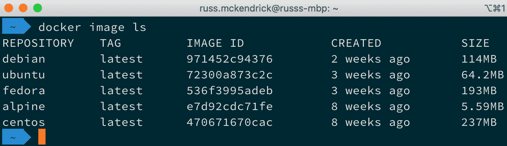

图 2.1 – 比较流行基础镜像的大小

如前面的终端输出所示，Alpine Linux 仅重 5.59 MB，相比之下，最大的镜像 CentOS 重 237 MB。Alpine Linux 的裸机安装大约为 130 MB，仍然几乎是 CentOS 容器镜像大小的一半。

## 深入审查 Dockerfile

让我们来看一下我们在前面的 Dockerfile 示例中使用的指令。我们将按照它们出现的顺序进行查看：

+   `FROM`

+   `LABEL`

+   `RUN`

+   `COPY` 和 `ADD`

+   `EXPOSE`

+   `ENTRYPOINT` 和 `CMD`

+   其他 Dockerfile 指令

## FROM

`FROM`指令告诉 Docker 你希望使用哪一个基础镜像。正如我们之前提到的，我们使用的是 Alpine Linux，所以我们只需要声明镜像的名称以及我们希望使用的发布标签。在我们的例子中，要使用最新的官方 Alpine Linux 镜像，我们只需添加`alpine:latest`。

## LABEL

`LABEL`指令可以用来为镜像添加额外的信息。这些信息可以是版本号，也可以是描述。建议你限制使用标签的数量。一个良好的标签结构可以帮助以后使用我们镜像的其他人。

然而，使用过多的标签也会导致镜像效率降低，因此我建议使用在[`label-schema.org`](http://label-schema.org%20)中详细介绍的标签结构。你可以通过以下`docker inspect`命令查看容器的标签：

```
$ docker image inspect <IMAGE_ID>
```

或者，你可以使用以下命令来仅过滤标签：

```
$ docker image inspect -f {{.Config.Labels}} <IMAGE_ID>
```

在下面的截图中，你可以看到 CentOS 镜像的标签：

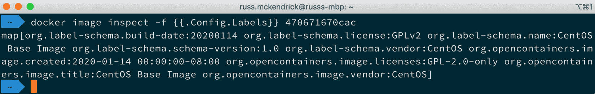

图 2.2 – 检查镜像标签

在我们的示例 Dockerfile 中，我们添加了两个标签：

`maintainer=”Russ McKendrick <russ@mckendrick.io>”`：添加一个标签，帮助镜像的最终用户识别谁在维护它。

`description=”This example Dockerfile installs NGINX.”`：添加一个简短的描述，说明镜像的功能。

通常来说，最好在你从镜像创建容器时再定义标签，而不是在构建时定义，所以最好将标签限制为仅关于镜像的元数据，其他内容不需要。

## RUN

`RUN`指令是我们与镜像互动的地方，用来安装软件、运行脚本、命令和其他任务。正如下面的`RUN`指令所示，我们实际上运行了三条命令：

```
RUN apk add --update nginx && \
    rm -rf /var/cache/apk/* && \
    mkdir -p /tmp/nginx/
```

我们三条命令中的第一条，相当于如果我们在 Alpine Linux 主机上有一个 shell 时运行以下命令：

```
$ apk add --update nginx
```

这个命令使用 Alpine Linux 的包管理器来安装 NGINX。

小贴士

我们使用`&&`运算符，确保前一条命令成功执行后再执行下一条命令。这样能让我们在 Dockerfile 中更清晰地知道每一条命令的执行情况。我们还使用了**\**，允许我们将命令分割成多行，这使得命令更加易读。

我们链中的下一条命令删除了所有临时文件，以保持镜像的最小体积：

```
$ rm -rf /var/cache/apk/*
```

我们链中的最后一条命令会创建一个路径为`/tmp/nginx/`的文件夹，这样 NGINX 在我们运行容器时就能正确启动：

```
$ mkdir -p /tmp/nginx/
```

我们也可以在我们的 Dockerfile 中使用以下内容来达到相同的效果：

```
RUN apk add --update nginx
RUN rm -rf /var/cache/apk/*
RUN mkdir -p /tmp/nginx/
```

然而，就像添加多个标签一样，这被认为是低效的，因为它可能会增加镜像的整体大小，我们应该尽量避免这种情况。虽然有一些有效的使用场景，某些命令在通过`&&`连接时效果不好，但大部分情况下，在构建镜像时应该避免这种运行命令的方式。

## COPY 和 ADD

初看之下，`COPY`和`ADD`似乎在执行相同的任务，都是用于将文件传输到镜像中。然而，它们之间存在一些重要的差异，我们将在这里讨论。

`COPY`指令是两者中更直接的一种：

```
COPY files/nginx.conf /etc/nginx/nginx.conf
COPY files/default.conf /etc/nginx/conf.d/default.conf
```

正如你可能已经猜到的，我们正在从我们构建镜像的主机上的`files`文件夹中复制两个文件。第一个文件是`nginx.conf`，这是一个最小化的 NGINX 配置文件：

```
user  nginx;
worker_processes  1;
error_log  /var/log/nginx/error.log warn;
pid        /var/run/nginx.pid;
events {
    worker_connections  1024;
}
http {
    include       /etc/nginx/mime.types;
    default_type  application/octet-stream;
    log_format  main  ‘$remote_addr - $remote_user [$time_
local] “$request” ‘
                      ‘$status $body_bytes_sent “$http_referer”
‘
                      ‘”$http_user_agent” “$http_x_forwarded_
for”’;
    access_log  /var/log/nginx/access.log  main;
    sendfile        off;
    keepalive_timeout  65;
    include /etc/nginx/conf.d/*.conf;
}
```

这将覆盖在`RUN`指令中通过 APK 安装部分安装的 NGINX 配置。

接下来的文件`default.conf`是我们可以配置的最简单的虚拟主机，包含以下内容：

```
server {
  location / {
      root /usr/share/nginx/html;
  }
}
```

同样，这将覆盖任何现有的文件。到目前为止，一切都很好！那么，为什么我们会使用`ADD`指令呢？

在我们的示例 Dockerfile 中，`ADD`指令如下所示：

```
ADD files/html.tar.gz /usr/share/nginx/
```

如你所见，我们添加了一个名为`html.tar.gz`的文件，但实际上我们在 Dockerfile 中并没有对归档文件进行任何解压操作。这是因为`ADD`会自动上传、解压并将解压后的文件夹和文件添加到我们请求的路径中，在我们这个案例中是`/usr/share/nginx/`。这为我们提供了`/usr/share/nginx/html/`作为我们定义的 Web 根目录，该目录也在我们复制到镜像中的`default.conf`文件的虚拟主机块中进行了定义。

`ADD`指令也可以用来从远程源添加内容。例如，考虑以下内容：

```
ADD https://raw.githubusercontent.com/PacktPublishing/Mastering-Docker-Fourth-Edition/master/chapter02/dockerfile-example/files/html.tar.gz /usr/share/nginx/
```

上述命令行会从`https://raw.githubusercontent.com/PacktPublishing/Mastering-Docker-Fourth-Edition/master/chapter02/dockerfile-example/files/`下载`html.tar.gz`并将文件放置在镜像中的`/usr/share/nginx/`文件夹中。

来自远程源的归档文件被视为文件，并不会被解压，这一点在使用时需要考虑到。这意味着文件必须在`RUN`指令之前被添加，以便我们手动解压文件夹，并且还需要删除`html.tar.gz`文件。

`EXPOSE`：`EXPOSE`指令让 Docker 知道当镜像运行时，定义的端口和协议将在运行时暴露。这个指令不会将端口映射到主机机器，而是打开端口以允许对容器网络中的服务进行访问。

例如，在我们的 Dockerfile 中，我们告诉 Docker 每次运行镜像时都打开`80`端口：

```
EXPOSE 80/tcp
```

使用`ENTRYPOINT`而不是`CMD`的好处是，它们可以配合使用。`ENTRYPOINT`可以单独使用，但请记住，只有在你希望容器可执行时，才应单独使用`ENTRYPOINT`。

作为参考，如果你考虑一些可能使用的`CLI`命令，你必须指定的不仅仅是`CLI`命令。你可能还需要添加一些额外的参数，让命令进行解释。这就是仅使用`ENTRYPOINT`的使用场景。

例如，如果你想在容器内部执行一个默认命令，你可以像下面的示例一样做。请确保使用一个可以保持容器运行的命令。

在这里，我们使用的是以下内容：

```
ENTRYPOINT [“nginx”]
CMD [“-g”, “daemon off;”]
```

这意味着，每当我们从镜像启动容器时，NGINX 二进制文件就会执行，这正是我们定义的入口点。然后，我们定义的`CMD`将被执行，相当于运行以下命令：

```
$ nginx -g daemon off;
```

`ENTRYPOINT`的另一个使用示例如下：

```
$ docker container run --name nginx-version dockerfile-example
-v
```

这相当于在我们的主机上运行以下命令：

```
$ nginx -v
```

注意到我们并不需要告诉 Docker 使用 NGINX。由于我们将 NGINX 二进制文件作为入口点，因此任何传递的命令都会覆盖在 Dockerfile 中定义的`CMD`指令。

这将显示我们安装的 NGINX 版本，且容器会停止运行，因为 NGINX 二进制文件仅执行以显示版本信息。我们将在构建并启动容器后查看此效果。我们继续之前，应该先了解一下我们没有在 Dockerfile 中包含的一些指令。

## 其他 Dockerfile 指令

我们的示例 Dockerfile 中没有包含一些指令。让我们在这里看看它们：

+   `USER`：`USER`指令让你指定在运行命令时使用的用户名。`USER`指令可以用于`RUN`、`CMD`或`ENTRYPOINT`指令中。此外，在`USER`指令中定义的用户必须存在，否则你的镜像构建将失败。使用`USER`指令还可能引入权限问题，不仅仅是容器本身，甚至在挂载卷时也会出现问题。

+   `WORKDIR`：`WORKDIR`指令设置工作目录，用于`USER`指令可以使用的相同指令集（`RUN`、`CMD` 和 `ENTRYPOINT`）。它还允许你使用`CMD`和`ADD`指令。

+   `ONBUILD`：`ONBUILD` 指令允许你将一组命令暂存起来，在将该镜像作为另一个容器镜像的基础镜像使用时执行。例如，如果你想将镜像提供给开发人员，并且他们都有不同的代码库需要测试，你可以使用 `ONBUILD` 指令在需要实际代码之前先为其打好基础。然后，开发人员只需将他们的代码添加到你指定的目录，当他们运行新的 Docker 构建命令时，代码就会被添加到运行中的镜像中。`ONBUILD` 指令可以与 `ADD` 和 `RUN` 指令结合使用，如以下示例所示：

```
ONBUILD RUN apk update && apk upgrade && rm -rf /var/cache/
apk/*
```

这将在每次我们的镜像作为基础镜像用于另一个容器镜像时，执行更新和软件包升级。

+   `ENV`：`ENV` 指令在镜像构建和执行时设置环境变量。这些变量可以在启动镜像时被覆盖。

## Dockerfile – 最佳实践

现在我们已经介绍了 Dockerfile 指令，让我们来看一下编写 Dockerfile 的一些最佳实践。遵循这些最佳实践可以确保你的镜像精简、一致，并且便于他人使用：

+   你应该养成使用 `.dockerignore` 文件的习惯。在本章的 *构建 Docker 镜像* 部分，我们将介绍 `.dockerignore` 文件；如果你已经习惯使用 `.gitignore` 文件，它看起来会非常熟悉。它本质上会在构建过程中忽略你在文件中指定的项。

+   记得每个文件夹中只保留一个 Dockerfile，以帮助你组织容器。

+   使用版本控制系统，如 Git，来管理你的 Dockerfile；就像其他文本文件一样，版本控制将帮助你在必要时不仅向前推进，也能向后回溯。

+   最小化每个镜像中需要安装的包数量。构建镜像时你要实现的最大目标之一就是保持镜像尽可能小且安全。不安装不必要的包将大大帮助你实现这个目标。

+   确保每个容器只运行一个应用进程。每当你需要一个新的应用进程时，最好创建一个新的容器来运行该应用。

+   保持简洁；过于复杂的 Dockerfile 会增加冗余，可能会在后期造成问题。

+   通过示例学习！Docker 官方提供了一个非常详细的风格指南，用于发布他们在 Docker Hub 上托管的官方镜像。你可以在本章末尾的 *进一步阅读* 部分找到该链接。

# 构建 Docker 镜像

在本节中，我们将介绍 `docker image build` 命令。正如人们所说，这就是实现目标的关键时刻。现在是我们构建基础的时刻，未来我们将基于此开始构建我们的镜像。我们将查看完成这个目标的不同方法。可以将其视为你之前使用虚拟机创建的模板。这将帮助你节省时间，因为它会为你完成繁重的工作；你只需创建需要添加到新镜像中的应用程序。

在使用 `docker build` 命令时，你可以使用许多开关。所以，让我们使用一个总是方便的开关。在这里，我们将使用 `docker image build` 命令的 `--help` 开关来查看我们可以做什么：

```
$ docker image build --help
```

在构建镜像时，你可以传递很多不同的标志。现在，虽然看起来有很多内容需要消化，但在所有这些选项中，我们只需要使用 `--tag` 或其简写 `-t` 来命名我们的镜像。

你可以使用其他选项来限制构建过程中 CPU 和内存的使用量。在某些情况下，你可能不希望 `build` 命令占用尽可能多的 CPU 或内存。这个过程可能会稍微慢一些，但如果你在本地机器或生产服务器上运行它，并且这是一个长时间的构建过程，你可能想要设置一个限制。还有一些选项会影响为构建镜像而启动的容器的网络配置。

通常，你不需要使用 `--file` 或 `-f` 开关，因为你会在与 Dockerfile 相同的文件夹中运行 `docker build` 命令。将 Dockerfile 保存在单独的文件夹中有助于整理文件，并保持文件命名的一致性。

还值得一提的是，虽然你可以在构建时将额外的环境变量（ENVs）作为参数传递，但它们仅在构建时使用，你的容器镜像不会继承它们。这对于传递诸如代理设置等信息非常有用，这些设置可能只适用于你的初始构建/测试环境。

`.dockerignore` 文件，正如我们之前讨论的，用于排除那些我们不希望包含在 Docker 构建中的文件或文件夹，因为默认情况下，和 Dockerfile 同一文件夹中的所有文件都会被上传。我们还讨论了将 Dockerfile 放在一个单独的文件夹中的做法，同样的做法也适用于 `.dockerignore` 文件。它应该放在与 Dockerfile 相同的位置。

将你想要在镜像中使用的所有项目保存在同一个文件夹中，有助于将 `.dockerignore` 文件中的项目数量保持到最小。

由于我们在本章的最后几节已经讨论了 Dockerfile，接下来让我们使用我们在这里讨论的示例文件来开始构建镜像。

## 使用 Dockerfile

我们将要查看的第一种构建基础容器镜像的方法是创建一个 Dockerfile。事实上，我们将使用上一节的 Dockerfile，然后执行 `docker image build` 命令来获取一个 NGINX 镜像。

所以，让我们再次查看 Dockerfile：

```
FROM alpine:latest
LABEL maintainer=”Russ McKendrick <russ@mckendrick.io>”
LABEL description=”This example Dockerfile installs NGINX.”
RUN apk add --update nginx && \
    rm -rf /var/cache/apk/* && \
    mkdir -p /tmp/nginx/
COPY files/nginx.conf /etc/nginx/nginx.conf
COPY files/default.conf /etc/nginx/conf.d/default.conf ADD files/html.tar.gz /usr/share/nginx/
EXPOSE 80/tcp
ENTRYPOINT [“nginx”]
CMD [“-g”, “daemon off;”]
```

别忘了你还需要 `default.conf`、`html.tar.gz` 和 `nginx.conf` 文件，这些文件位于 `files` 文件夹中。你可以在附带的 GitHub 仓库中找到这些文件。

所以，我们可以通过两种方式构建我们的镜像。第一种方式是通过在使用 `docker image build` 命令时指定 `--file` 开关。我们还将使用 `--tag` 开关为新镜像指定一个唯一名称：

```
$ docker image build --file <path_to_Dockerfile> --tag
<REPOSITORY>:<TAG> .
```

现在，`<REPOSITORY>` 通常是你在 Docker Hub 上注册的用户名。我们将在 *第三章*中详细讨论 *存储和分发镜像*，但现在我们将使用 `local`。`<TAG>` 是一个唯一值，允许你识别一个容器。通常，这将是一个版本号或其他描述符。

由于我们有一个名为 Dockerfile 的文件，我们也可以跳过使用 `--file` 开关。这是构建镜像的第二种方式。以下是代码：

```
$ docker image build --tag local:dockerfile-example .
```

最重要的是要记住最后的点（或句号）。这是告诉 `docker image build` 命令在当前文件夹中构建镜像。当你构建镜像时，你应该会看到类似以下的终端输出：

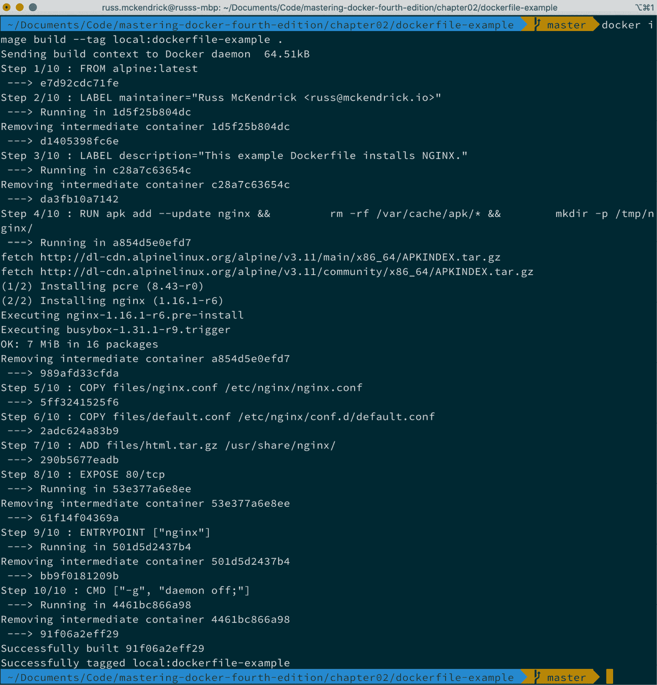

图 2.3 – 从我们的 Dockerfile 构建镜像

一旦构建完成，你应该能够运行以下命令来检查镜像是否可用，以及镜像的大小：

```
$ docker image ls
```

从以下终端输出中可以看到，我的镜像大小是 7.15 MB：

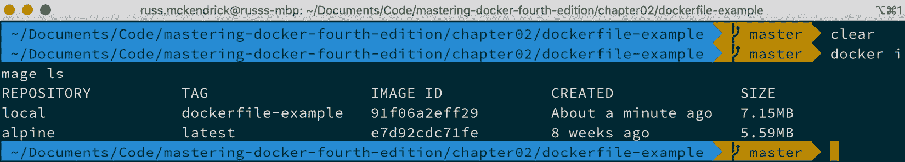

图 2.4 – 检查容器镜像的大小

你可以通过运行以下命令来启动一个带有新构建镜像的容器：

```
$ docker container run -d --name dockerfile-example -p 8080:80
local:dockerfile-example
```

这将启动一个名为 `dockerfile-example` 的容器。你可以通过以下命令检查它是否正在运行：

```
$ docker container ls
```

打开浏览器并访问 `http://localhost:8080/` 应该会显示一个非常简单的网页，页面内容如下：

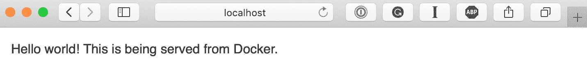

图 2.5 – 在浏览器中检查容器

接下来，我们将快速运行一些我们在本章的 *介绍 Dockerfiles* 部分中讲解过的命令，首先是以下命令：

```
$ docker container run --name nginx-version local:dockerfile-
example -v
```

从以下终端输出中可以看到，我们当前运行的是 NGINX 版本 1.16.1：

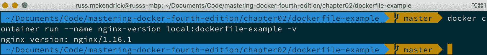

图 2.6 – 检查 NGINX 版本

我们将要运行的下一个命令会显示我们在构建时嵌入的标签。

要查看此信息，运行以下命令：

```
$ docker image inspect -f {{.Config.Labels}} local:dockerfile-
example
```

从以下输出中，你可以看到我们输入的信息：

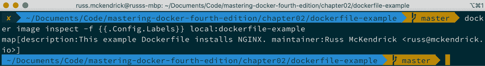

图 2.7 – 检查我们新构建镜像的标签

在我们继续之前，你可以使用以下命令停止并删除我们启动的容器：

```
$ docker container stop dockerfile-example
$ docker container rm dockerfile-example nginx-version
```

我们将在*第四章*，*管理容器*中详细讨论 Docker 容器命令。

## 使用现有容器

构建基础镜像的最简单方法是首先使用 Docker Hub 上的官方镜像之一。Docker 还将这些官方构建的 Dockerfile 保存在它们的 GitHub 仓库中。因此，你至少有两种选择可以使用别人已经创建的现有镜像。通过使用 Dockerfile，你可以清楚地看到构建中包含了哪些内容，并添加你需要的内容。如果你想稍后修改或共享，你还可以对 Dockerfile 进行版本控制。

还有一种方法可以实现这一目标；然而，这种方法不推荐使用，也不被认为是良好的实践，我强烈不建议你使用它。

提示

我只会在原型阶段使用这种方法，检查你运行的命令是否在交互式 shell 中按预期工作，然后再将它们放入 Dockerfile 中。你应该始终使用 Dockerfile。

首先，我们应该下载我们想要作为基础使用的镜像；正如我们之前所做的，我们将使用 Alpine Linux：

```
$ docker image pull alpine:latest
```

接下来，我们需要在前台运行一个容器，以便与之交互：

```
$ docker container run -it --name alpine-test alpine /bin/sh
```

一旦容器运行，你可以根据需要使用`apk`命令，或根据你的 Linux 版本使用相应的包管理命令来添加包。

例如，以下命令将安装 NGINX：

```
$ apk update
$ apk upgrade
$ apk add --update nginx
$ rm -rf /var/cache/apk/*
$ mkdir -p /tmp/nginx/
$ exit
```

安装完你需要的包后，你需要保存容器。前面一组命令中的`exit`命令将停止正在运行的容器，因为我们要脱离的 shell 进程恰好是保持容器在前台运行的进程。

你可以在以下终端输出中看到这个：

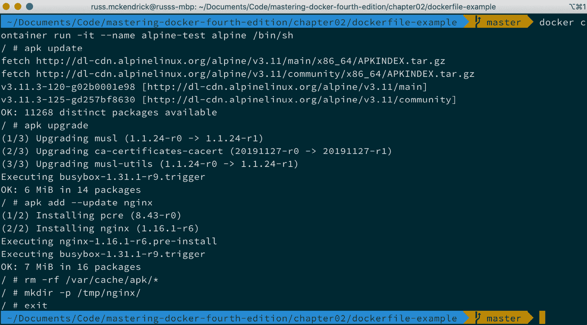

图 2.8 – 检查终端输出

提示

就在这个时候，你应该真正停止；除了我们稍后讨论的一个使用案例外，我不建议你使用前面的命令来创建和分发镜像。

所以，为了将我们停止的容器保存为镜像，你需要执行类似以下的操作：

```
$ docker container commit <container_name> <REPOSITORY>:<TAG>
```

例如，我运行了以下命令来保存我们启动并定制的容器副本：

```
$ docker container commit alpine-test local:broken-container
```

注意到我将我的镜像命名为`broken-container`了吗？因为采取这种方法的一个使用场景是，如果由于某种原因，你的容器出现问题，那么将失败的容器保存为镜像，甚至将其导出为`TAR`文件，以便与他人共享，帮助你找出问题的根本原因，这非常有用。

要保存镜像文件，只需运行以下命令：

```
$ docker image save -o <name_of_file.tar> <REPOSITORY>:<TAG>
```

所以，在我们的示例中，我运行了以下命令：

```
$ docker image save -o broken-container.tar local:broken-
container
```

这给了我一个 7.9 MB 的文件，名为`broken-container.tar`。既然我们有了这个文件，我们可以解压它并查看其结构。它将具有以下结构：

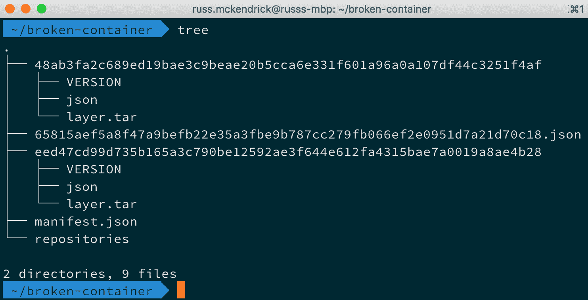

图 2.9 – JSON 文件、文件夹和 TAR 文件的集合

该镜像由一组 JSON 文件、文件夹和其他 TAR 文件组成。所有镜像都遵循这种结构，所以你可能会在想，**为什么这种方法如此糟糕？**

最大的原因是信任（正如我们之前提到的）。你的最终用户将无法轻松地查看他们正在运行的镜像中包含什么内容。你会从一个未知来源随机下载一个预打包的镜像来运行你的工作负载，而不检查该镜像是如何构建的吗？谁知道它是如何配置的，以及安装了哪些软件包！

使用 Dockerfile，你可以清楚地看到创建镜像时执行了哪些操作，但按照这里描述的方法，你根本无法看到这些内容。

另一个原因是很难为你构建一套良好的默认设置。例如，如果你按这种方式构建镜像，那么你将无法真正利用诸如`ENTRYPOINT`和`CMD`这样的功能，甚至是最基本的指令，比如`EXPOSE`。相反，用户在运行`docker container run`命令时必须定义所有所需的内容。

在 Docker 的早期，将以这种方式准备的镜像进行分发是常见做法。事实上，我自己也犯过这个错误，因为我来自运维背景，启动一个**机器**，引导它，然后创建一个金牌主镜像，这在当时是非常有意义的。幸运的是，过去几年，Docker 扩展了构建功能，现在这种选项已经不再被考虑了。

使用 scratch 作为基础

到目前为止，我们一直在使用来自 Docker Hub 的准备好镜像作为我们的基础镜像。然而，最好完全避免这种做法（有点），而是从头开始构建自己的镜像。

现在，当你通常听到“从零开始”这个短语时，它的字面意思是你从无开始。我们现在就是这种情况——你得到的完全是什么都没有，必须在此基础上构建。这可能是一个好处，因为它会保持镜像文件非常小，但如果你对 Docker 比较陌生，这可能会变得很复杂。

Docker 已经为我们做了一些艰苦的工作，并在 Docker Hub 上创建了一个名为`scratch`的空`TAR`文件；你可以在 Dockerfile 的`FROM`部分使用它。你可以以此为基础进行整个 Docker 构建，然后根据需要添加各个部分。

再次说明，我们将使用 Alpine Linux 作为镜像的基础操作系统。这样做的原因不仅是它作为 ISO、Docker 镜像和各种虚拟机镜像发布，而且整个操作系统都可以作为压缩的`TAR`文件提供。你可以在本书的 GitHub 仓库中找到下载，或者在 Alpine Linux 的下载页面找到。

若要下载副本，只需从下载页面选择合适的下载，下载页面地址为[`www.alpinelinux.org/downloads/`](https://www.alpinelinux.org/downloads/)。我使用的是**MINI ROOT FILESYSTEM**部分的`x86_64`版本。

一旦下载完成，你需要创建一个使用`scratch`的 Dockerfile，然后添加`tar.gz`文件，确保使用正确的文件，如下所示：

```
FROM scratch
ADD files/alpine-minirootfs-3.11.3-x86_64.tar.gz /
CMD [“/bin/sh”]
```

你可能在想，为什么我刚刚下载了`alpine-minirootfs-3.11.3-x86_64.tar.gz`文件？难道我不应该使用`http://dl-cdn.alpinelinux.org/alpine/v3.11/releases/x86_64/alpine-minirootfs-3.11.3-x86_64.tar.gz`吗？

记住，远程归档文件被视为文件并只是被下载。通常，这不是问题，因为我们可以通过添加一个`RUN`命令来解压文件，但由于我们使用的是`scratch`，操作系统尚未安装，这意味着没有可供`RUN`执行任何操作的命令。

现在我们有了 Dockerfile，我们可以像构建任何其他 Docker 镜像一样构建我们的镜像——通过运行以下命令：

```
$ docker image build --tag local:fromscratch .
```

这应该会给你以下输出：

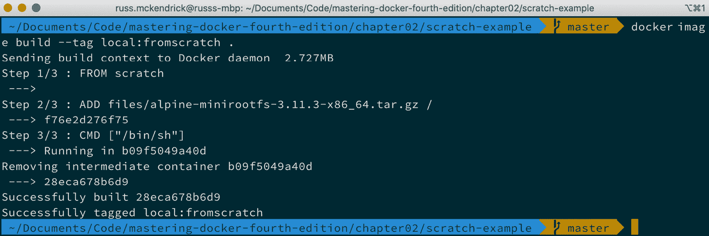

图 2.10 – 从零开始构建

你可以通过运行以下命令，将我们构建的镜像大小与其他容器镜像进行对比：

```
$ docker image ls
```

如下截图所示，我构建的镜像与我们一直在 Docker Hub 上使用的 Alpine Linux 镜像大小完全相同：

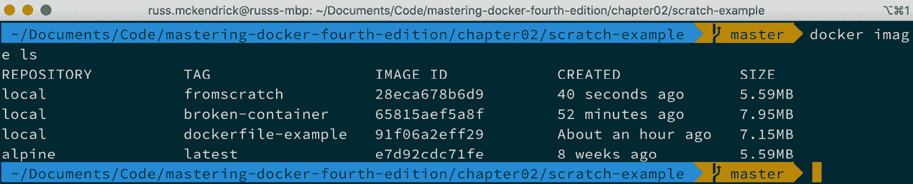

图 2.11 – 审查镜像大小

现在我们自己的镜像已经构建完成，我们可以通过运行以下命令来测试它：

```
$ docker container run -it --name alpine-test local:fromscratch
/bin/sh
```

如果你遇到错误，可能已经有一个名为`alpine-test`的容器正在运行或已创建。通过运行`docker container stop alpine-test`，然后运行`docker container rm alpine-test`来删除它。

这应该会让我们进入 Alpine Linux 镜像的 Shell。你可以通过运行以下命令来检查：

```
$ cat /etc/*release
```

这将显示容器运行的版本信息。为了了解整个过程的样子，请参见以下终端输出：

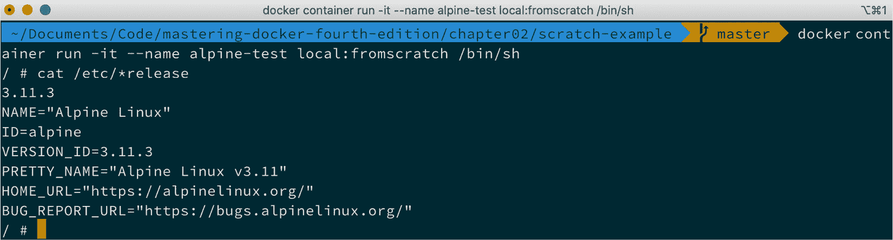

图 2.12 – 从零开始运行镜像

尽管一切看起来很简单，但这仅仅是因为 Alpine Linux 以其独特的方式打包操作系统。当你选择使用其他以不同方式打包操作系统的发行版时，情况可能会变得更加复杂。

有几种工具可以用来生成操作系统的捆绑包。我们在这里不会详细讨论如何使用这些工具，因为如果你需要考虑这种方法，你可能有一些非常具体的要求。你可以在本章末尾的*进一步阅读*部分查看工具的列表，了解更多细节。

那么，这些要求可能是什么呢？对大多数人来说，它们是遗留应用程序；例如，如果你有一个要求操作系统的应用程序，而这个操作系统不再受支持或无法从 Docker Hub 获取，但你需要一个更现代的平台来支持这个应用程序，那么会发生什么呢？好吧，你应该能够构建自己的镜像并在那里安装应用程序，从而使你能够在现代且可支持的操作系统/架构上托管你的旧遗留应用程序。

## 使用 ENVs

在本节中，我们将介绍一组非常强大的变量，称为 **ENVs** (**ENVs**)，因为你将会看到它们很多。你可以在 Dockerfile 中使用 ENVs 做很多事情。如果你熟悉编程，它们可能对你来说并不陌生。

对于像我这样的人，起初，它们看起来令人畏惧，但不要气馁。一旦你掌握了它们，它们将成为一个很好的资源。它们可以在运行容器时设置信息，这意味着你不必更新 Dockerfile 中的很多命令或你在服务器上运行的脚本。

要在 Dockerfile 中使用 ENVs，你可以使用 `ENV` 指令。`ENV` 指令的结构如下：

```
ENV <key> <value>
ENV username admin
```

或者，你也可以在键和值之间放置等号：

```
ENV <key>=<value>
ENV username=admin
```

现在，问题是，为什么有两种定义它们的方式，它们之间有什么区别？

+   在第一个示例中，你每行只能设置一个 ENV；然而，它易于阅读和跟随。

+   在第二个 ENV 示例中，你可以在同一行上设置多个环境变量，如下所示：

```
ENV username=admin database=wordpress tableprefix=wp
```

你可以使用 `docker inspect` 命令查看在镜像中设置了哪些 ENVs：

```
$ docker image inspect <IMAGE_ID>
```

现在我们知道如何在 Dockerfile 中设置它们了，让我们来看看它们的实际应用。到目前为止，我们一直在使用 Dockerfile 构建一个只安装了 NGINX 的简单镜像。现在，让我们来看看如何构建一些更具动态性的内容。

使用 Alpine Linux，我们将执行以下操作：

1.  设置一个 ENV 来定义我们希望安装的 PHP 版本。

1.  安装 Apache2 和我们选择的 PHP 版本。

1.  设置镜像，使 Apache2 能够正常启动。

1.  移除默认的 `index.html` 文件，并添加一个 `index.php` 文件，显示 `phpinfo` 命令的结果。

1.  在容器上暴露端口 80。

1.  设置 Apache，使其成为默认进程：

    信息

    请注意，PHP5 已经不再受到支持。因此，我们不得不使用较旧版本的 Alpine Linux（3.8），因为这是最后一个支持 PHP5 包的版本。

```
FROM alpine:3.8
LABEL maintainer=”Russ McKendrick <russ@mckendrick.io>”
LABEL description=”This example Dockerfile installs Apache & PHP.”
ENV PHPVERSION 7
RUN apk add --update apache2 php${PHPVERSION}-apache2 php${PHPVERSION} && \
        rm -rf /var/cache/apk/* && \
        mkdir /run/apache2/ && \
        rm -rf /var/www/localhost/htdocs/index.html && \
        echo “<?php phpinfo(); ?>” > /var/www/localhost/htdocs/index.php && \
        chmod 755 /var/www/localhost/htdocs/index.php
EXPOSE 80/tcp
ENTRYPOINT [“httpd”]
CMD [“-D”, “FOREGROUND”]
```

如你所见，我们选择了安装 PHP7；我们可以通过运行以下命令构建镜像：

```
$ docker build --tag local/apache-php:7 .
```

注意我们稍微修改了命令。这次，我们调用的是`local/apache-php`镜像，并将版本标记为`7`。通过运行之前的命令得到的完整输出如下：

```
Sending build context to Docker daemon   2.56kB
Step 1/8 : FROM alpine:3.8
 ---> c8bccc0af957
Step 2/8 : LABEL maintainer=”Russ McKendrick <russ@mckendrick.
io>”
 ---> Running in 7746dd8cabd0
Removing intermediate container 7746dd8cabd0
 ---> 9173a415ed21
Step 3/8 : LABEL description=”This example Dockerfile installs Apache & PHP.”
 ---> Running in 322e98b9c2e0
Removing intermediate container 322e98b9c2e0
 ---> aefb9450e664
Step 4/8 : ENV PHPVERSION 7
```

从前面的输出可以看到，`PHPVERSION` ENV 已经设置为数字`7`：

```
 ---> Running in 0b9e9a5d8956
Removing intermediate container 0b9e9a5d8956
 ---> 219afdf8eeb8
Step 5/8 : RUN apk add --update apache2 php${PHPVERSION}-
apache2 php${PHPVERSION} &&         rm -rf /var/cache/apk/* &&
         mkdir /run/apache2/ &&         rm -rf /var/www/
localhost/htdocs/index.html &&         echo “<?php phpinfo(); 
?>” > /var/www/localhost/htdocs/index.php &&         chmod 755 
/var/www/localhost/htdocs/index.php
 ---> Running in 36823df46b29
fetch http://dl-cdn.alpinelinux.org/alpine/v3.8/main/x86_64/
APKINDEX.tar.gz
fetch http://dl-cdn.alpinelinux.org/alpine/v3.8/community/
x86_64/APKINDEX.tar.gz
(1/14) Installing libuuid (2.32-r0)
(2/14) Installing apr (1.6.3-r1)
(3/14) Installing expat (2.2.8-r0)
(4/14) Installing apr-util (1.6.1-r3)
(5/14) Installing pcre (8.42-r0)
(6/14) Installing apache2 (2.4.41-r0)
Executing apache2-2.4.41-r0.pre-install
```

到目前为止，我们只提到过 ENV。如下所示，必要的`php7`包将开始安装：

```
(7/14) Installing php7-common (7.2.26-r0)
(8/14) Installing ncurses-terminfo-base (6.1_p20180818-r1)
(9/14) Installing ncurses-terminfo (6.1_p20180818-r1)
(10/14) Installing ncurses-libs (6.1_p20180818-r1)
(11/14) Installing libedit (20170329.3.1-r3)
(12/14) Installing libxml2 (2.9.8-r2)
(13/14) Installing php7 (7.2.26-r0)
(14/14) Installing php7-apache2 (7.2.26-r0)
Executing busybox-1.28.4-r3.trigger
OK: 26 MiB in 27 packages
Removing intermediate container 36823df46b29
```

现在所有包已安装，构建可以进行一些清理工作，然后完成：

```
 ---> 842eebf1d363
Step 6/8 : EXPOSE 80/tcp
 ---> Running in 40494d3b357f
Removing intermediate container 40494d3b357f
 ---> 074e10ff8526
Step 7/8 : ENTRYPOINT [“httpd”]
 ---> Running in a56700cae985
Removing intermediate container a56700cae985
 ---> 25b63b51f243
Step 8/8 : CMD [“-D”, “FOREGROUND”]
 ---> Running in d2c478e67c0c
Removing intermediate container d2c478e67c0c
 ---> 966dcf5cafdf
Successfully built 966dcf5cafdf
Successfully tagged local/apache-php:7
```

我们可以通过运行以下命令来检查是否一切按预期运行，启动一个使用该镜像的容器：

```
$ docker container run -d -p 8080:80 --name apache-php7 local/
apache-php:7
```

一旦启动，打开浏览器并访问`http://localhost:8080/`。你应该看到一页显示正在使用 PHP7：

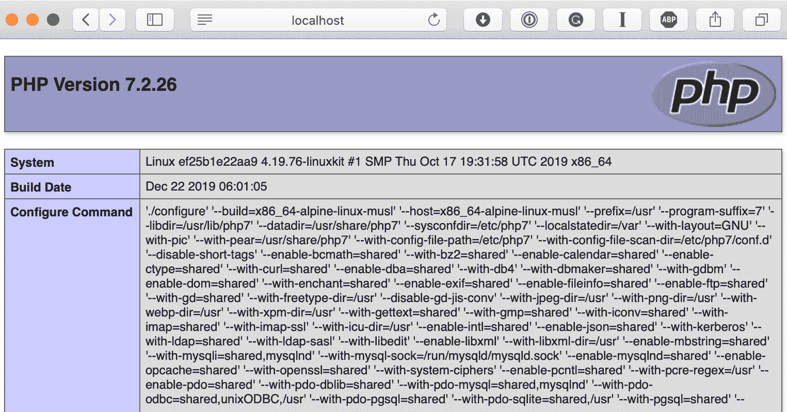

图 2.13 – 检查 PHP 版本

提示

不要被接下来的部分搞混了；没有 PHP6。你可以通过以下 RFC 和关于跳过 PHP6 投票的结果了解更多，网址是 https://wiki.php.net/rfc/php6。

现在，在你的 Dockerfile 中，将`PHPVERSION`从`7`改为`5`，然后运行以下命令构建一个新的镜像：

```
$ docker image build --tag local/apache-php:5 .
```

从以下终端输出可以看到，大部分输出是相同的，除了正在安装的包：

```
Sending build context to Docker daemon   2.56kB
Step 1/8 : FROM alpine:3.8
 ---> c8bccc0af957
Step 2/8 : LABEL maintainer=”Russ McKendrick <russ@mckendrick.
io>”
 ---> Using cache
 ---> 9173a415ed21
Step 3/8 : LABEL description=”This example Dockerfile installs
Apache & PHP.”
 ---> Using cache
 ---> aefb9450e664
Step 4/8 : ENV PHPVERSION 5
```

在这里，我们可以看到`5`已被设置为`PHPVERSION` ENV 的值。从这里开始，构建将像之前一样继续：

```
 ---> Running in d6e8dc8b70ce
Removing intermediate container d6e8dc8b70ce
 ---> 71896c898e35
Step 5/8 : RUN apk add --update apache2 php${PHPVERSION}-
apache2 php${PHPVERSION} &&         rm -rf /var/cache/apk/* &&
         mkdir /run/apache2/ &&         rm -rf /var/www/
localhost/htdocs/index.html &&         echo “<?php phpinfo();
 ?>” > /var/www/localhost/htdocs/index.php &&         chmod 755
 /var/www/localhost/htdocs/index.php
 ---> Running in fb946c0684e4
fetch http://dl-cdn.alpinelinux.org/alpine/v3.8/main/x86_64/
APKINDEX.tar.gz
fetch http://dl-cdn.alpinelinux.org/alpine/v3.8/community/
x86_64/APKINDEX.tar.gz
(1/15) Installing libuuid (2.32-r0)
(2/15) Installing apr (1.6.3-r1)
(3/15) Installing expat (2.2.8-r0)
(4/15) Installing apr-util (1.6.1-r3)
(5/15) Installing pcre (8.42-r0)
(6/15) Installing apache2 (2.4.41-r0)
Executing apache2-2.4.41-r0.pre-install
```

这里是安装 PHP5 包的地方。这是我们两个构建之间唯一的区别：

```
(7/15) Installing php5-common (5.6.40-r0)
(8/15) Installing ncurses-terminfo-base (6.1_p20180818-r1)
(9/15) Installing ncurses-terminfo (6.1_p20180818-r1)
(10/15) Installing ncurses-libs (6.1_p20180818-r1)
(11/15) Installing readline (7.0.003-r0)
(12/15) Installing libxml2 (2.9.8-r2)
(13/15) Installing php5-cli (5.6.40-r0)
(14/15) Installing php5 (5.6.40-r0)
(15/15) Installing php5-apache2 (5.6.40-r0)
Executing busybox-1.28.4-r3.trigger
OK: 48 MiB in 28 packages
Removing intermediate container fb946c0684e4
```

同样，既然包已经安装，构建将像之前一样继续，直到我们得到完整的镜像：

```
 ---> 54cbb6ef4724
Step 6/8 : EXPOSE 80/tcp
 ---> Running in 59776669f08a
Removing intermediate container 59776669f08a
 ---> e34c5c34658d
Step 7/8 : ENTRYPOINT [“httpd”]
 ---> Running in 037ecfed197c
Removing intermediate container 037ecfed197c
 ---> c50bdf3e4b02
Step 8/8 : CMD [“-D”, “FOREGROUND”]
 ---> Running in 9eccc9131ef9
Removing intermediate container 9eccc9131ef9
 ---> 7471b75e789e
Successfully built 7471b75e789e
Successfully tagged local/apache-php:5
```

我们可以通过运行以下命令启动一个容器，这次使用 9090 端口：

```
$ docker container run -d -p 9090:80 --name apache-php5 local/apache-php:5
```

再次打开浏览器，但这次访问`http://localhost:9090/`，应该会显示我们正在运行 PHP5：

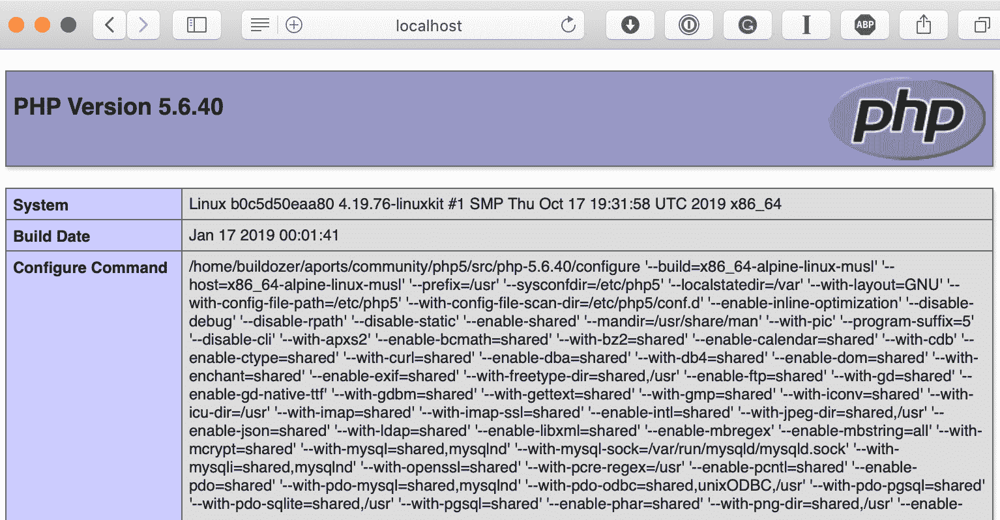

图 2.14 – 运行 PHP5

最后，你可以通过运行以下命令来比较镜像的大小：

```
$ docker image ls
```

你应该看到以下终端输出：

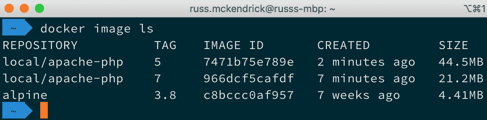

图 2.15 – 比较镜像大小

这显示 PHP7 镜像比 PHP5 镜像要小得多。我们来讨论一下在构建这两个不同的容器镜像时到底发生了什么。

那么，发生了什么呢？实际上，当 Docker 启动 Alpine Linux 镜像以创建我们的镜像时，首先做的就是设置我们定义的 ENVs，使其对容器内的所有 shell 可用。

幸运的是，Alpine Linux 中 PHP 的命名方案只需替换版本号，并保持我们需要安装的包名不变，这意味着我们运行以下命令：

```
RUN apk add --update apache2 php${PHPVERSION}-apache2 php${PHPVERSION}
```

但它实际上会被解释为以下内容：

```
RUN apk add --update apache2 php7-apache2 php7
```

对于 PHP5，它会被解释为以下内容：

```
RUN apk add --update apache2 php5-apache2 php5
```

这意味着我们不需要逐个查看整个 Dockerfile，手动替换版本号。这种方法在从远程 URL 安装软件包时尤其有用，比如软件发布页面。

以下是一个更高级的示例：一个安装和配置由 *HashiCorp* 提供的 Consul 的 Dockerfile。在这个 Dockerfile 中，我们使用环境变量（ENVs）来定义版本号和我们下载的文件的 SHA256 哈希值：

```
FROM alpine:latest
LABEL maintainer=”Russ McKendrick <russ@mckendrick.io>”
LABEL description=”An image with the latest version on Consul.”
ENV CONSUL_VERSION 1.7.1
ENV CONSUL_SHA256 09f3583c6cd7b1f748c0c012ce9b3d96de95
a6c0d2334327b74f7d72b1fa5054
RUN  apk add --update ca-certificates wget && \
     wget -O consul.zip https://releases.hashicorp.com/consul/
${CONSUL_VERSION}/consul_${CONSUL_VERSION}_linux_amd64.zip && \
     echo “$CONSUL_SHA256 *consul.zip” | sha256sum -c - && \
     unzip consul.zip && \
     mv consul /bin/ && \
     rm -rf consul.zip && \
     rm -rf /tmp/* /var/cache/apk/*
EXPOSE 8300 8301 8301/udp 8302 8302/udp 8400 8500 8600 8600/udp
VOLUME [ “/data” ]
ENTRYPOINT [ “/bin/consul” ]
CMD [ “agent”, “-data-dir”, “/data”, “-server”, “
-bootstrap-expect”, “1”, “-client=0.0.0.0”]
```

如你所见，Dockerfile 可能会变得非常复杂，使用环境变量（ENVs）有助于维护。每当 Consul 发布新版本时，我只需更新 `ENV` 行并提交到 GitHub，这会触发构建一个新镜像。如果我们配置好了，它本应如此。我们将在下一章中查看这一点。

你可能已经注意到我们在 Dockerfile 中使用了一个我们尚未讨论过的指令。别担心——我们将在*第四章*，*管理容器* 中查看 `VOLUME` 指令。

## 使用多阶段构建

在本节中，作为我们使用 Dockerfile 和构建容器镜像旅程的最后一部分，我们将研究一种相对较新的构建镜像的方法。在之前的章节中，我们介绍了通过包管理器（如 Alpine Linux 的 APK）直接将二进制文件添加到镜像中，或者在之前的示例中，通过从软件供应商下载预编译的二进制文件。

如果我们想在构建过程中编译自己的软件呢？历史上，我们不得不使用一个包含完整构建环境的容器镜像，这可能非常大。这意味着我们很可能需要拼凑出一个脚本，按照类似以下的流程运行：

1.  下载构建环境容器镜像并启动一个 `build` 容器。

1.  将源代码复制到 `build` 容器中。

1.  在 `build` 容器上编译源代码。

1.  将编译后的二进制文件从 `build` 容器中复制到外部。

1.  删除 `build` 容器。

1.  使用预编写的 Dockerfile 来构建一个镜像，并将二进制文件复制到其中。

这有很多逻辑——在理想的世界里，它应该是 Docker 的一部分。幸运的是，Docker 社区也这么认为，名为多阶段构建的功能在 Docker 17.05 中被引入。

Dockerfile 包含两个不同的构建阶段：

+   第一个阶段，名为 `builder`，使用的是 Docker Hub 上的官方 Go 容器镜像。在这里，我们安装了一个先决条件，从 GitHub 直接下载源代码，然后将其编译成静态二进制文件：

```
FROM golang:latest as builder
WORKDIR /go-http-hello-world/
RUN go get -d -v golang.org/x/net/html 
ADD https://raw.githubusercontent.com/geetarista/go-http-hello-world/master/hello_world/hello_world.go ./hello_world.go
RUN CGO_ENABLED=0 GOOS=linux go build -a -installsuffix cgo -o 
app .
FROM scratch 
COPY --from=builder /go-http-hello-world/app .
CMD [“./app”] 
```

提示

注意这里我们使用`ADD`与一个 URL，因为我们想下载源代码的未压缩版本，而不是一个压缩的存档。

由于我们的静态二进制文件具有内置的 Web 服务器，从操作系统的角度来看，我们实际上不需要任何其他东西。因此，我们能够将`scratch`用作基础镜像，这意味着我们的整个镜像只包含我们从构建镜像复制的静态二进制文件，并且完全不包含任何`builder`环境。

要构建镜像，我们只需要运行以下命令：

```
$ docker image build --tag local:go-hello-world .
```

上述命令的输出可在以下代码块中找到。有趣的部分发生在*步骤 5*和*步骤 6*之间：

```
Sending build context to Docker daemon  2.048kB
Step 1/8 : FROM golang:latest as builder
latest: Pulling from library/golang
50e431f79093: Pull complete
dd8c6d374ea5: Pull complete
c85513200d84: Pull complete
55769680e827: Pull complete
15357f5e50c4: Pull complete
9edb2e455d9d: Pull complete
ed2acfe844ed: Pull complete
Digest: sha256:d27017d27f9c9a58b361aa36126a29587ffd3b1b274af0
d583fe4954365a4a59
Status: Downloaded newer image for golang:latest
 ---> 25c4671a1478
```

现在已经拉取了构建环境容器镜像，我们可以准备环境来构建我们的代码：

```
Step 2/8 : WORKDIR /go-http-hello-world/
 ---> Running in 9c23e012e016
Removing intermediate container 9c23e012e016
 ---> ea0d7e26799e
Step 3/8 : RUN go get -d -v golang.org/x/net/html
 ---> Running in 17f173992763
get “golang.org/x/net/html”: found meta tag get.metaImport
{Prefix:”golang.org/x/net”, VCS:”git”,
 RepoRoot:”https://go.googlesource.com/net”} at
//golang.org/x/net/html?go-get=1
get “golang.org/x/net/html”: verifying non-authoritative meta
tag
golang.org/x/net (download)
Removing intermediate container 17f173992763
```

环境准备就绪后，我们可以从 GitHub 下载源代码并进行编译：

```
 ---> 68f07e01b0cf
Step 4/8 : ADD https://raw.githubusercontent.com/geetarista/go-http-hello-world/master/hello_world/hello_world.go ./hello_world.go
Downloading     393B
 ---> 4fb92adacdb0
Step 5/8 : RUN CGO_ENABLED=0 GOOS=linux go build -a -installsuffix cgo -o app .
 ---> Running in 61a82b417f60
Removing intermediate container 61a82b417f60
 ---> 502d219e6869
```

现在，我们已经将我们的编译代码作为单个可执行二进制文件，这意味着我们可以使用`scratch`创建一个新的构建镜像，并将二进制文件从先前的构建镜像复制到新的构建镜像中：

```
Step 6/8 : FROM scratch
 --->
Step 7/8 : COPY --from=builder /go-http-hello-world/app .
 ---> 2b4a6e6066e5
Step 8/8 : CMD [“./app”]
 ---> Running in c82089ea8a6b
Removing intermediate container c82089ea8a6b
 ---> 5e196ed7f699
Successfully built 5e196ed7f699
Successfully tagged local:go-hello-world
```

如您所见，我们的二进制文件已经被编译，并且包含构建环境的容器已被删除，留下了存储我们二进制文件的镜像。如果您运行以下命令，您将了解为什么不将应用程序与其构建环境一起发布是一个好主意：

```
$ docker image ls
```

下面的输出显示，`golang`镜像大小为`809MB`；加上我们的源代码和先决条件后，大小增加到`862MB`：

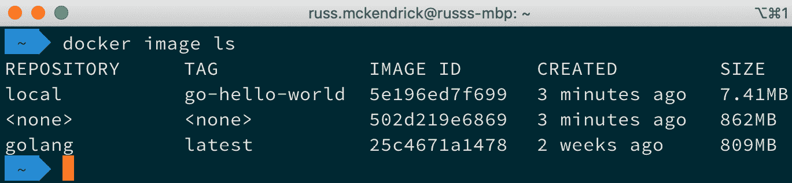

图 2.16 – 检查图像大小

但最终的镜像大小仅为`7.41MB`。我相信您会同意这节省了相当多的空间。它还遵循最佳实践，只将与我们应用程序相关的内容包含在内，并且非常非常小。

您可以通过使用以下命令启动一个容器来测试应用程序：

```
$ docker container run -d -p 8000:80 --name go-hello-world 
local:go-hello-world
```

应用程序可通过浏览器访问，并在每次加载页面时简单地递增计数器。要在 macOS 和 Linux 上测试它，您可以使用`curl`命令，如下所示：

```
$ curl http://localhost:8000/
```

这应该会给您类似以下的结果：

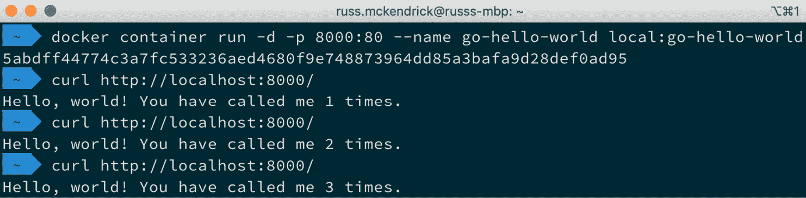

图 2.17 – 运行容器并使用 curl 调用页面

Windows 用户只需在浏览器中访问`http://localhost:8000/`。要停止并删除运行中的容器，请使用以下命令：

```
$ docker container stop go-hello-world
$ docker container rm go-hello-world
```

如您所见，使用多阶段构建是一个相对简单的过程，并且符合您应该已经开始感到熟悉的指令。

# 摘要

在本章中，我们看了 Dockerfiles，我相信您会同意它们是定义您自己的 Docker 镜像的一种简单直接的方式。

当我们深入探讨完 Dockerfile 后，我们接着看了构建镜像的五种方法。我们首先了解了**使用 Dockerfile**，因为这是构建镜像最常见的方式，并且我们将在本书的其余部分中使用它。

然后我们讨论了**使用现有容器**，因为在 Docker 刚出现时，这就是大多数人构建镜像的方式。现在它不再被视为最佳实践，只有在你需要为调试目的创建一个正在运行或崩溃容器的快照时，才应该使用。

接下来我们讨论了**使用 scratch 作为基础**。这可能是创建镜像的最简化方式，因为你实际上是从零开始。

我们接着讨论了**使用环境变量**。在这里，我们查看了如何将版本号等变量引入 Dockerfile，这样我们就不需要在多个地方更新文件。

最后，我们讨论了`scratch`容器，提供了可能最小的可用镜像。

在下一章中，现在我们知道如何使用 Dockerfile 构建镜像，我们将深入了解 Docker Hub 以及使用注册表服务的所有优点。

我们还将了解 Docker 注册表，它是开源的，这样你就可以创建和配置自己的存储镜像的地方，以及第三方托管的注册表服务，所有这些都可以用来分发你自己的容器镜像。

# 问题

1.  判断对错：`LABEL`指令在镜像构建完成后标记你的镜像。

1.  `ENTRYPOINT`和`CMD`指令有什么区别？

1.  判断对错：使用`ADD`指令时，不能下载并自动解压外部托管的压缩包。

1.  使用现有容器作为镜像基础的有效用途是什么？

1.  `EXPOSE`指令暴露什么？

# 进一步阅读

+   官方 Docker 容器镜像的指南可以在[`github.com/docker-library/official-images/`](https://github.com/docker-library/official-images/)找到。

+   一些帮助你从现有安装创建容器的工具如下：

    debootstrap：[`wiki.debian.org/Debootstrap`](https://wiki.debian.org/Debootstrap)

    yumbootstrap：[`dozzie.jarowit.net/trac/wiki/yumbootstrap`](http://dozzie.jarowit.net/trac/wiki/yumbootstrap)

    rinse：[`packages.debian.org/sid/admin/rinse`](https://packages.debian.org/sid/admin/rinse)

    Docker contrib 脚本：[`github.com/moby/moby/tree/master/contrib`](https://github.com/moby/moby/tree/master/contrib)

+   Go HTTP Hello World 应用的完整 GitHub 仓库可以在[`github.com/geetarista/go-http-hello-world`](https://github.com/geetarista/go-http-hello-world)找到。
