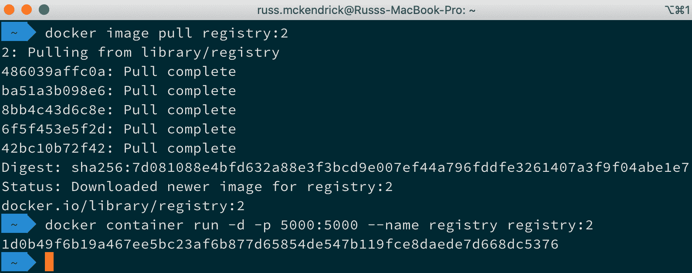

*第三章*

# 存储与分发镜像

本章将介绍多个服务，如 Docker Hub，它允许你存储镜像，以及 Docker Registry，你可以用来运行本地的 Docker 容器存储。我们将回顾这些服务之间的区别，以及何时和如何使用它们。本章还将介绍如何使用 Web 钩子设置自动构建，以及设置这些自动构建所需的所有组件。

让我们快速浏览一下本章将涵盖的主题：

+   了解 Docker Hub

+   部署你自己的 Docker 注册中心

+   审查第三方注册中心

+   查看 Microbadger

让我们开始吧！

# 技术要求

在本章中，我们将使用我们的 Docker 安装来构建镜像。如前一章所提，尽管本章中的截图来自我偏好的操作系统——macOS，但我们将运行的命令适用于前几章中涵盖的所有三种操作系统。

查看以下视频，了解代码的实际应用：[`bit.ly/3iaKo9I`](https://bit.ly/3iaKo9I)

# 了解 Docker Hub

尽管我们在前两章中介绍了 Docker Hub，但除了使用`docker image pull`命令下载远程镜像外，我们并没有与它有过太多交互。

本节将重点介绍 Docker Hub，它提供了一个免费选项，允许你只托管公开访问的镜像，还有一个订阅选项，允许你托管自己的私有镜像。我们将重点讲解 Docker Hub 的网页部分以及你可以在那里进行的管理操作。

主页可以在[`hub.docker.com`](https://hub.docker.com)找到，其中包含一个**注册**表单，并且在右上角有一个**登录**选项。如果你曾经接触过 Docker，那么你很可能已经拥有一个 Docker ID。如果没有，使用主页上的**注册**表单来创建一个。如果你已经有 Docker ID，只需点击**登录**即可。

登录后，你将看到主仪表板。

## Docker Hub 仪表板

登录 Docker Hub 后，你将被带到以下着陆页。这个页面被称为 Docker Hub 的仪表板：


图 3.1 – 初始的 Docker Hub 仪表板

从这里，你可以访问 Docker Hub 的所有其他子页面。然而，在查看这些部分之前，我们应该先谈谈仪表板。从这里，你可以查看所有的镜像，包括公共和私有镜像。它们首先按星标数排序，然后按拉取次数排序；这个顺序无法更改。

在接下来的几节中，我们将逐一介绍你在仪表板上可以看到的所有内容，从页面顶部的浅蓝色菜单开始。

### 探索

探索选项将带你查看官方 Docker 镜像列表；就像你的仪表盘一样，它们按星级和下载量排序。如下图所示，我选择了基础镜像。每个最受欢迎的官方镜像的下载量都超过了 1000 万，并且拥有成千上万的星级评分：


图 3.2 – 探索 Docker Hub

Docker Hub 现在已整合 Docker Store，让你可以在一个地方购买与 Docker 相关的所有内容，而不是从多个不同的来源访问。

### 仓库

我们将在本章的 *创建自动化构建* 部分详细讨论创建仓库的过程，因此此处不再展开细节。在这一部分，你可以管理自己的仓库。如以下截图所示，你可以快速查看有多少人已经开始使用你的仓库，以及你的镜像的下载量，同时也能查看仓库是公开还是私有：


图 3.3 – 我的 Docker 仓库列表

如你所见，这里有一个 **创建仓库** 按钮。由于我们将在 *创建自动化构建* 部分更详细地讨论这一过程，接下来我们将进入下一个选项。

### 组织

**组织**是你创建或被添加到的组织。**组织**允许你为多个协作的项目分配权限控制。每个组织都有自己的设置，例如是否默认将仓库存储为公开或私密，或者更改计划以允许不同数量的私有仓库，甚至将仓库与自己或他人拥有的仓库分开：


图 3.4 – 查看我的组织列表

你还可以通过仪表盘中的 Docker 标志下方切换或访问帐户或组织，登录时通常会看到你的用户名：


图 3.5 – 切换组织

在管理多个项目/应用的容器镜像分发时，**组织**非常有用。

### 获取帮助

这个下拉菜单是通向 Docker 管理的各种帮助和支持站点的跳板。我们快速看看这些链接将带你到哪里：

+   **文档**：此项将带你到 Docker Hub 的官方文档页面。

+   **Docker Hub**：此项将直接带你进入 Docker 社区论坛中的 Docker Hub 分类。

+   **新功能**：此项将带你查看一系列以“Docker Hub”标签标记的 Docker 博客文章。

+   **支持**：这是一个关于 Docker Hub 的常见问题解答，并提供联系支持的选项。

### 个人资料和设置

顶部菜单中的最后一个选项是关于管理您的 **个人资料**、**内容** 和 **设置**：


图 3.6 – 查看您的个人资料

设置页面允许您设置公共个人资料，包括以下选项：

+   **常规**：您可以将电子邮件地址添加到您的账户、修改密码，并配置在个人资料中显示的信息，如姓名、公司位置和链接。

+   **关联账户**：在这里，您可以关联您的 GitHub 和 Bitbucket 账户（有关此内容的更多信息将在本章的 *创建自动化构建* 部分讨论）。

+   **安全**：在这里，您可以管理个人访问令牌和最近引入的双重身份验证。

+   **默认隐私**：您希望新创建的仓库默认是公开还是私密的？您可以在这里选择。

+   **通知**：在这里，您可以注册有关您的构建和账户活动的通知。您可以提供电子邮件地址或连接到 Slack 安装。

+   **转换账户**：在这里，您可以将账户转换为组织。您可能不希望这样做；在继续执行此选项之前，请阅读页面上的警告。

+   **停用账户**：这正如您所想的那样，它的作用就是停用账户。再次提醒，在进行任何操作之前，请查看页面上的警告，因为此操作是不可撤销的。

+   **我的个人资料**：此菜单项将您带到您的公开个人资料页面；我的个人资料可以在 [`hub.docker.com/u/russmckendrick/`](https://hub.docker.com/u/russmckendrick/) 找到。

+   **我的内容**：此链接将带您查看您可能已在 Docker Hub 上订阅的容器列表。

## 创建自动化构建

在本节中，我们将讨论自动化构建。自动化构建是指您可以将其链接到您的 GitHub 或 Bitbucket 帐户，随着您在代码仓库中更新代码，Docker Hub 会自动构建镜像。我们将查看执行此操作所需的所有组件。到本节结束时，您将能够自动化您的构建。

## 设置您的代码

创建自动化构建的第一步是设置您的 GitHub 或 Bitbucket 仓库。这是您选择存储代码时的两种选项之一。例如，我将使用 GitHub，但如果您使用的是 GitHub 或 Bitbucket，设置过程是相同的。

实际上，我将使用本书随附的仓库。由于该仓库是公开的，您可以分叉它并使用自己的 GitHub 帐户跟随我所做的操作，正如以下截图所示：


图 3.7 – 分叉随附的 GitHub 仓库

在 *第二章*，*构建容器镜像* 中，我们处理了几个不同的 Dockerfile。我们将使用这些文件进行自动构建。你可能还记得，我们安装了 NGINX 并添加了一个简单的页面，页面显示 **Hello world! This is being served from Docker**。我们也有一个多阶段构建。

现在我们知道要使用哪个 Dockerfile，让我们在 Docker Hub 中设置一个仓库。

## 设置 Docker Hub

在 **Docker Hub** 中，我们将使用 **创建仓库** 按钮，该按钮可以在 **Repositories**（仓库）下找到。点击后，我们将进入一个页面，需要提供一些关于构建的信息。我们还需要选择一个来源：


图 3.8 – 在 Docker Hub 中创建仓库

如前所示截图所示，我已经将我的 GitHub 帐户与 Docker Hub 帐户关联起来。将这两个工具连接的过程很简单——我只需按照屏幕上的说明，允许 Docker Hub 访问我的 GitHub 帐户。

当连接 Docker Hub 和 GitHub 时，有两个选项：

+   **公开**：这限制了 Docker Hub 对公开可用的仓库和组织的访问。如果你使用此选项链接帐户，Docker Hub 将无法配置自动构建所需的 Web 钩子。然后，你需要从你想要创建自动构建的任何位置搜索并选择仓库。这实际上会创建一个 Web 钩子，每次对选定的 GitHub 仓库进行提交时触发。这样，就会在 Docker Hub 上创建一个新的构建。

+   **私有**：这是两个选项中推荐的一个，因为 Docker Hub 将可以访问所有你的公共和私有仓库以及组织。Docker Hub 还能够配置在设置自动构建时所需的 Web 钩子。

在上面的截图中，我选择了 `masteringdockerfourthedition`，并访问了自动构建的设置页面。在这里，我们可以选择将镜像附加到哪个 Docker Hub 配置文件，命名镜像，将其从公共镜像转换为私有镜像，描述构建，并通过点击 **点击这里自定义** 来进行自定义。

我们可以通过以下方式告知 Docker Hub 我们 Dockerfile 的位置：


图 3.9 – 这是填写完成后的表单样式

如果你正在跟随操作，我输入了以下信息：

+   `dockerfile-example`

+   `测试自动构建`

+   `Public`

然后，在 **构建设置** 下，选择 **GitHub**：

+   **组织**：选择托管你代码的 GitHub 组织。

+   `Master-Docker-Fourth-Edition`。

点击构建规则旁的 + 图标，然后输入以下内容：

+   `Branch`

+   `master`

+   `latest`

+   `Dockerfile`

+   **构建缓存**：保持此选项被选中

点击 **创建** 后，你将进入一个类似于以下的页面：


图 3.10 – 创建的仓库

现在我们定义了构建，我们可以通过点击 **构建** 来添加一些额外的配置。由于我们在 Dockerfile 中使用了官方的 Alpine Linux 镜像，我们可以将其链接到我们自己的构建中。在进行此操作时，我们还需要配置一个额外的路径。请按照以下步骤操作：

1.  点击 **配置自动构建** 按钮。然后，在配置的 **仓库链接** 部分，点击 **为基础镜像启用** 单选框，再点击 **保存** 按钮。

1.  每当发布新的官方 Alpine Linux 镜像时，这将启动一个无人值守的构建。

1.  接下来，滚动到 `./chapter02/dockerfile-example/`。这将确保 Docker 的构建服务器能够找到我们添加到 Dockerfile 中的任何文件：


图 3.11 – 将我们的仓库与 Dockerfile 连接

所以，现在，只要我们更新 GitHub 仓库，或者发布新的官方镜像，我们的镜像就会自动重建并发布。

由于这两者都不太可能立即发生，点击 **触发** 按钮，在 **构建** 页面上手动启动构建：


图 3.12 – 触发构建

你会注意到 **触发** 按钮变成了旋转图标，并且 **最新构建状态** 变为 **待处理**，如下图所示。这确认了一个构建已在后台排队：


图 3.13 – 构建正在进行

一旦你触发了构建，滚动到 **最近的构建**。这将列出该镜像的所有构建——成功的、失败的以及正在进行的。你应该看到一个构建正在进行；点击该构建将显示其日志：


图 3.14 – 查看构建进度

一旦构建完成，你应该能够通过运行以下命令切换到本地的 Docker 安装，确保如果你一直在跟随教程，请拉取你自己的镜像：

```
$ docker image pull masteringdockerfouthedition/dockerfile-example:latest
$ docker image ls
```

这些命令显示在下图中：


图 3.15 – 拉取我们新构建的镜像

你也可以使用以下命令运行 Docker Hub 创建的镜像，再次确保如果你有自己的镜像，请使用你自己的镜像：

```
$ docker container run -d -p8080:80 --name example masteringdockerthirdedition/dockerfiles-example
```

我还以完全相同的方式添加了多阶段构建。Docker Hub 对构建没有问题，如以下日志所示，日志开始提供有关 Docker 构建环境的一些信息：

```
Cloning into '.'...
Warning: Permanently added the RSA host key for IP address '140.82.114.3' to the list of known hosts.
Reset branch 'master'
Your branch is up-to-date with 'origin/master'.
KernelVersion: 4.4.0-1060-aws
Components: [{u'Version': u'18.03.1-ee-3', u'Name': u'Engine', u'Details': {u'KernelVersion': u'4.4.0-1060-aws', u'Os': u'linux', u'BuildTime': u'2018-08-30T18:42:30.000000000+00:00', u'ApiVersion': u'1.37', u'MinAPIVersion': u'1.12', u'GitCommit': u'b9a5c95', u'Arch': u'amd64', u'Experimental': u'false', u'GoVersion': u'go1.10.2'}}]
Arch: amd64
BuildTime: 2018-08-30T18:42:30.000000000+00:00
ApiVersion: 1.37
Platform: {u'Name': u''}
Version: 18.03.1-ee-3
MinAPIVersion: 1.12
GitCommit: b9a5c95
Os: linux
GoVersion: go1.10.2
```

然后，构建开始编译我们的代码，如下所示：

```
Starting build of index.docker.io/masteringdockerfouthedition/multi-stage:latest...
Step 1/8 : FROM golang:latest as builder
---> 374d57ff6662
Step 2/8 : WORKDIR /go-http-hello-world/
Removing intermediate container 63fc21e72f2b
---> 25ed949838cf
Step 3/8 : RUN go get -d -v golang.org/x/net/html
---> Running in 57072354b296
get "golang.org/x/net/html": found meta tag get.metaImport{Prefix:"golang.org/x/net", VCS:"git", RepoRoot:"https://go.googlesource.com/net"} at //golang.org/x/net/html?go-get=1
get "golang.org/x/net/html": verifying non-authoritative meta tag
golang.org/x/net (download)
Removing intermediate container 57072354b296
---> 6731fc3ade79
Step 4/8 : ADD https://raw.githubusercontent.com/geetarista/go-http-hello-world/master/hello_world/hello_world.go ./hello_world.go
---> 2129f7e7cbab
Step 5/8 : RUN CGO_ENABLED=0 GOOS=linux go build -a -installsuffix cgo -o app .
---> Running in 9d5646bf1b92
Removing intermediate container 9d5646bf1b92
---> 997b92d1a701
```

现在我们的代码已经编译完成，它将继续将应用程序二进制文件复制到最终镜像中，使用的是 `scratch`：

```
Step 6/8 : FROM scratch
--->
Step 7/8 : COPY --from=builder /go-http-hello-world/app .
---> 70eb0af7f82c
Step 8/8 : CMD ["./app"]
---> Running in 41cc8b47f714
Removing intermediate container 41cc8b47f714
---> 71fc328a30c4
Successfully built 71fc328a30c4
Successfully tagged masteringdockerfouthedition/multi-stage:latest
Pushing index.docker.io/masteringdockerfouthedition/multi-stage:latest...
Done!
Build finished
You can pull and launch a container using the image with the following commands:
$ docker image pull masteringdockerfouthedition/multi-stage
$ docker image ls
$ docker container run -d -p 8000:80 --name go-hello-world masteringdockerfouthedition/multi-stage
$ curl http://localhost:8000/
```

如下截图所示，镜像的行为与我们在本地创建时完全相同：


图 3.16 – 拉取我们的多阶段环境并启动构建

如果你启动了容器，可以使用以下命令将其删除：

```
$ docker container stop example go-hello-world 
$ docker container rm example go-hello-world
```

现在我们已经了解了自动构建，接下来我们将讨论其他将镜像推送到 Docker Hub 的方法。

## 推送你自己的镜像

在 *第二章* *构建容器镜像* 中，我们讨论了如何在不使用 Dockerfile 的情况下创建镜像。虽然这仍然不是一个好主意，应该仅在真正需要时进行，但你可以将自己的镜像推送到 Docker Hub。

小贴士

在以这种方式将镜像推送到 Docker Hub 时，请确保不要包含任何不希望公开访问的代码、文件或环境变量。

为此，我们首先需要通过运行以下命令将本地 Docker 客户端与 Docker Hub 链接起来：

```
$ docker login
```

然后，你将被提示输入你的 Docker ID 和密码。然而，如果你启用了多因素身份验证，那么你需要使用个人访问令牌而不是密码。要创建个人访问令牌，请转到 Docker Hub 中的 **设置**，点击左侧菜单中的 **安全性**，然后点击 **新建访问令牌** 按钮。根据屏幕上的说明，访问令牌只会显示一次，所以请确保记下它。将个人访问令牌视为密码的替代品，并妥善存储：


图 3.17 – 使用 Docker 客户端登录 Docker Hub

此外，如果你正在使用 Docker for Mac 或 Docker for Windows，现在会通过应用程序登录，并且应该可以从菜单中访问 Docker Hub：


图 3.18 – 在 Docker Desktop 中查看你的 Docker Hub 详情

现在我们的客户已被授权与 Docker Hub 进行交互，我们需要一个镜像来进行构建。

让我们来看一下推送我们在 *第二章* 中构建的 scratch 镜像，*构建容器镜像*。首先，我们需要构建镜像。为此，我使用以下命令：

```
$ docker build --tag masteringdockerfouthedition/scratch-example:latest .
```

如果你跟随此步骤进行操作，请将 `masteringdockerfouthedition` 替换为你自己的用户名或组织：


图 3.19 – 本地构建镜像

一旦镜像构建完成，我们可以通过运行以下命令将其推送到 Docker Hub：

```
$ docker image push masteringdockerfouthedition/scratch-example:latest
```

以下截图显示了输出结果：


图 3.20 – 推送镜像到 Docker Hub

如你所见，由于我们在构建镜像时定义了 `masteringdockerfouthedition/scratchexample:latest`，Docker 会自动将镜像上传到该位置，从而将一个新镜像添加到 `masteringdockerfouthedition` 组织中：


图 3.21 – 在 Docker Hub 中查看我们本地构建的镜像

你会注意到，在 Docker Hub 中的构建功能有限。这是因为镜像并不是由 Docker Hub 构建的，因此，它并不真正知道构建镜像时包含了哪些内容，这正是为什么这种分发镜像的方法不被推荐的原因。

现在我们已经讨论了如何分发镜像，接下来我们来看完全相反的情况，讨论认证镜像和发布者。

## Docker 认证镜像和验证发布者

你可能还记得，在*第一章*中，*Docker 概览*，我们下载了 Docker for macOS 和 Docker for Windows，以及 Docker Hub。除了作为一个单一位置来下载各种平台的 Docker CE 和 Docker EE 版本外，它现在也是查找 Docker 插件、Docker 认证镜像和来自验证发布者的镜像的首选位置：


图 3.22 – 在 Docker Hub 中探索 Docker 认证镜像

仔细查看 Docker Hub 中的**Splunk Enterprise**镜像，你可以获取关于镜像的责任人信息。它还显示这是一个认证镜像，如下图所示：


图 3.23 – 查看 Splunk Enterprise Docker Hub 镜像

正如你可能注意到的，镜像上有一个价格（免费版为 $0.00，但有一些限制），这意味着你可以通过 Docker Hub 购买商业软件，因为它内置了支付和许可功能。如果你是软件发布者，你可以通过 Docker Hub 签署并分发你自己的软件。

# 部署你自己的 Docker 注册表

在本节中，我们将介绍 Docker 注册表。Docker 注册表是一个开源应用程序，你可以在任何地方运行它并存储你的 Docker 镜像。我们将提供 Docker 注册表与 Docker Hub 的比较，以及如何在两者之间进行选择。

到本节结束时，你将学习如何运行自己的 Docker 注册表，并检查它是否适合你。

## Docker 注册表概述

如前所述，Docker 注册表是一个开源应用程序，你可以用它在你选择的平台上存储你的 Docker 镜像。这让你可以选择将它们保持 100% 私密，或者根据需要共享它们。

如果您想部署自己的 Registry，而不需要支付 Docker Hub 的所有私人功能，那么 Docker Registry 是非常有意义的。让我们来看一些 Docker Hub 和 Docker Registry 之间的对比，帮助您做出明智的决策，选择适合您的镜像存储方式。

Docker Registry 具有以下功能：

+   您可以托管并管理自己的 Registry，从中可以提供所有仓库作为私有、公共或两者的混合。

+   根据您托管的镜像数量或服务的拉取请求数量，您可以按需扩展 Registry。

+   一切都基于命令行。

使用 Docker Hub，您将能够执行以下操作：

+   获取一个基于 GUI 的界面，您可以用来管理您的镜像

+   在云中已经设置好一个位置，准备处理公共和/或私有镜像

+   不用担心管理托管所有镜像的服务器

现在我们知道了部署自己 Registry 和 Docker Hub 之间的区别，让我们来看一下部署自己 Registry 的步骤。

## 部署您自己的 Registry

正如您可能已经猜到的，Docker Registry 是作为 Docker Hub 上的镜像分发的，这使得部署它变得像运行以下命令一样简单：

```
$ docker image pull registry:2
$ docker container run -d -p 5000:5000 --name registry registry:2
```

运行这些命令应该会给您类似以下的终端输出：



图 3.24 – 部署您的 Docker Registry

这些命令将为您提供 Docker Registry 的最基本安装。让我们快速看看如何将镜像推送到它。首先，我们需要一个镜像，所以让我们重新获取 Alpine 镜像：

```
$ docker image pull alpine
```

现在我们已经获得了 Alpine Linux 镜像的副本，我们需要将其推送到本地 Docker Registry，地址为`localhost:5000`。为此，我们需要为 Alpine Linux 镜像打上本地 Docker Registry 的 URL，并且使用不同的镜像名称：

```
$ docker image tag alpine localhost:5000/localalpine
```

现在我们已经标记了镜像，可以通过运行以下命令将其推送到本地托管的 Docker Registry：

```
$ docker image push localhost:5000/localalpine
```

以下截图展示了之前命令的输出：


图 3.25 – 将镜像推送到您自己的 Docker Registry

尝试运行以下命令：

```
$ docker image ls
```

输出应该显示您有两个具有相同`IMAGE ID`的镜像：


图 3.26 – 列出镜像

在我们从本地 Docker Registry 拉取镜像之前，我们应该删除这两个本地镜像副本。我们需要使用`REPOSITORY`名称来执行此操作，而不是`IMAGE ID`，因为我们有两个来自两个位置的镜像，具有相同的 ID，而 Docker 会抛出错误：

```
$ docker image rm alpine localhost:5000/localalpine
```

现在原始镜像和已标记镜像已被删除，我们可以通过运行以下命令从本地 Docker Registry 拉取镜像：

```
$ docker image pull localhost:5000/localalpine
$ docker image ls
```

如你所见，我们现在有一个从运行在 `localhost:5000` 的 Docker Registry 中拉取的镜像副本：


图 3.27 – 从你自己的 Docker Registry 拉取

你可以通过运行以下命令停止并移除 Docker Registry：

```
$ docker container stop registry
$ docker container rm -v registry
```

现在，在启动 Docker Registry 时有很多选项和考虑因素。正如你所想，最重要的考虑因素是存储。

由于注册中心的唯一目的是存储和分发镜像，因此使用某种级别的持久性操作系统存储非常重要。Docker Registry 当前支持以下存储选项：

+   `/var/lib/registry`。

+   **Azure**：这使用 Microsoft Azure Blob 存储。

+   **GCS**：这使用 Google Cloud 存储。

+   **S3**：这使用**亚马逊简单存储服务** (**Amazon S3**)。

+   **Swift**：这是使用 OpenStack Swift。

如你所见，除了文件系统，所有支持的存储引擎都是高度可用、分布式的对象级存储形式。

## Docker 受信任注册中心

商业版**Docker 企业版** (**Docker EE**)随附的一个组件是**Docker 受信任注册中心** (**DTR**)，这两个组件现在由 Mirantis 开发和支持。可以将它看作是一个你可以在自己基础设施上托管的 Docker Hub 版本。DTR 在免费 Docker Hub 和 Docker Registry 提供的功能基础上，添加了以下特性：

+   集成到你的身份验证服务中，如 Active Directory 或 LDAP

+   在你自己的基础设施（或云）中部署，并置于防火墙之后

+   镜像签名，以确保你的镜像是受信任的

+   内置的安全扫描

+   直接从 Mirantis 获取优先支持

# 审查第三方注册中心

不仅 Docker 提供镜像注册服务；像 Red Hat 这样的公司也提供自己的注册中心，在那里你可以找到 Red Hat 容器目录，其中包含所有 Red Hat 产品的容器化版本，以及支持其 OpenShift 服务的容器。像 JFrog 的 Artifactory 这样的服务，也将私人 Docker 注册中心作为其构建服务的一部分提供。

还有其他 Registry-as-a-Service 提供商，例如 Quay（也是 Red Hat 提供的），以及来自 GitHub、亚马逊 Web 服务、微软 Azure 和 Google Cloud 的服务。

让我们快速看一下这些服务。

## GitHub Packages 和 Actions

我们要查看的第一个服务是 GitHub Packages。在这里，我们将看一下如何将容器上传到我为本书的 GitHub 仓库所做的 fork 中。首先，我们需要一个个人访问令牌。获取这个令牌，请登录到你的 GitHub 账户，进入**设置**，然后选择**开发者设置**，接着点击**个人访问令牌**。

生成一个访问令牌，命名为 `cli-package-access`，并赋予以下权限：

+   `repo`

+   `write:packages`

+   `read:packages`

+   `delete:packages`

+   `workflow`

在显示时记下 token，因为你将无法再次查看它。完成此操作后，我将我的 token 存放在用户根目录下的一个名为 `.githubpackage` 的文件中。将其放在那里意味着我每次登录时都不需要输入密码。我可以通过使用以下命令来实现：

```
$ cat ~/.githubpackage | docker login docker.pkg.github.com -u russmckendrick --password-stdin
```

登录后，我们可以构建镜像。对于这个例子，我使用了 `dockerfile-example`：

```
$ docker image build --tag docker.pkg.github.com/russmckendrick/mastering-docker-fourth-edition/dockerfile-example:latest .
```

请注意，我使用的是 `mastering-docker-fourth-edition` 仓库名称，并且全部采用小写字母。如果你尝试使用任何大写字母，Docker 会报错。

一旦构建并标记，你可以使用以下命令推送你的镜像：

```
$ docker image push docker.pkg.github.com/russmckendrick/
mastering-docker-fourth-edition/dockerfile-example:latest
```

推送后，你应该能看到现在仓库中有一个包：


图 3.28 – 查看推送到 GitHub 的包

深入查看该包将显示以下基本统计信息和下载信息：


图 3.29 – 查看更多关于该包的信息

你也可以通过运行以下命令下载镜像：

```
$ docker image pull docker.pkg.github.com/russmckendrick/
mastering-docker-fourth-edition/dockerfile-example:latest
```

由于我们的 GitHub 仓库是公开的，我们的包也将是公开的，意味着任何人都可以下载它。

所以，这就涵盖了推送一个现有镜像的过程。然而，正如我们在本章中已经提到过几次的，这其实并不推荐。幸运的是，GitHub 引入了 GitHub Actions，允许你设置自动化工作流，每当发生某个事件（比如推送到仓库）时，就会执行相应的 **操作**。

要创建 GitHub Action，请进入你的仓库并点击仓库中的 `.github/workflows/main.yml`。

在提供的空间中输入以下内容：

```
name: Create Multi Stage Docker Image CI
on: [push]
jobs:
  build_docker_image:
    runs-on: ubuntu-18.04
    steps:
    - uses: actions/checkout@v1
    - name: Build and tag image
      run: docker build -t "docker.pkg.github.com/$(echo $GITHUB_REPOSITORY | tr '[:upper:]' '[:lower:]')/multi-stage:$GITHUB_RUN_NUMBER" -f ./chapter02/multi-stage/Dockerfile ./chapter02/multi-stage/
    - name: Docker login
      run: docker login docker.pkg.github.com -u $GITHUB_ACTOR -p $GITHUB_TOKEN
      env:
        GITHUB_TOKEN: ${{secrets.GITHUB_TOKEN}}
    - name: Publish to GPR
      run: docker push "docker.pkg.github.com/$(echo $GITHUB_REPOSITORY | tr '[:upper:]' '[:lower:]')/multi-stage:$GITHUB_RUN_NUMBER"
```

如你所见，这与我们构建和标记镜像、在 GitHub Packages 进行身份验证以及推送镜像的步骤非常相似。有一些与 GitHub Actions 相关的内容，例如 `$GITHUB_REPOSITORY` 和 `$GITHUB_RUN_NUMBER` 变量，以及 `${{secrets.GITHUB_TOKEN}}`，所有这些都确保我的 Action 中没有硬编码的内容。这意味着你可以在你自己的仓库中安全地运行它。

输入后，点击 **Start commit** 按钮，输入一些细节，然后点击 **Commit new file**。一旦提交，工作流将自动开始。你可以通过返回 **Actions**，然后选择新创建的工作流和任务来查看输出：


图 3.30 – 查看我们的 GitHub Actions 构建结果

完成后，进入仓库中的 **Packages**，应该能看到一个如下所示的包：


图 3.31 – 检查我们的 GitHub Action 创建的包

如你所见，虽然这与自动化的 Docker Hub 构建几乎相同，但你对发生的事情以及构建过程本身有更多的控制权。

## Azure 容器注册表

在我们第三方容器注册表教程的下一个环节中，我们将介绍微软的 Azure 容器注册表。要创建一个，登录到你的 Microsoft Azure 账户。我们将在*第十章*中更详细地讨论 Microsoft Azure，*在公有云中运行 Docker*。

登录后，在屏幕顶部的搜索栏中输入 `容器注册表`，并从结果中选择该选项。加载 **容器注册表** 页面后，点击 **+ 添加** 按钮。你将看到如下页面：


图 3.32 – 创建我们的 Azure 容器注册表

如果你在跟着做，请输入以下信息：

+   **订阅**：选择你希望使用的订阅。

+   `masteringdocker-acr-rg`。

+   `masteringdocker`。

+   `英国南部`。

+   `启用`。

+   `基础`。这对于测试应该足够了。

我们现在将忽略加密选项，因为它们仅在使用高级 SKU 和标签时可用，所以点击 **审核 + 创建**。验证部署后，点击 **创建** 按钮。几分钟后，部署将完成。

与 GitHub Packages 一样，我们将构建并推送一个容器。为此，我们需要一些凭据。要找到这些凭据，点击 **访问密钥**，并记录下 **登录服务器**、**用户名** 和其中一个 **密码** 的详细信息：


图 3.33 – 获取我们的 Azure 容器注册表的访问密钥

与 GitHub Packages 类似，将密码保存在文本文件中。我使用的是`~/.azureacrpassword`。然后，通过运行以下命令使用 Docker 命令行客户端进行登录：

```
$ cat ~/.azureacrpassword | docker login masteringdocker.azurecr.io -u masteringdocker --password-stdin
```

现在我们已经通过身份验证，切换到 `dockerfile-example` 文件夹，该文件夹可以在本书 GitHub 仓库的 `chapter02` 文件夹中找到，然后构建、标记并推送我们的镜像：

```
$ docker image build --tag masteringdocker.azurecr.io/dockerfile-example:latest .
$ docker image push masteringdocker.azurecr.io/dockerfile-example:latest
```

推送完成后，你应该能够在主菜单的 **服务** 部分点击 **注册表** 来查看它在 Azure 容器注册表页面上的列表。选择镜像和版本。完成此操作后，你将看到类似以下内容：


图 3.34 – 在 Azure 容器注册表中查看我们的容器

当拉取镜像时，你需要确保已经对你的容器注册表进行了身份验证，因为它是一个私有服务。如果没有登录尝试拉取镜像，将会导致错误。

你还可以基于将 Dockerfile 提交到 GitHub 仓库来自动化这些构建。然而，这需要更多的操作，因为目前只能通过 Azure 的命令行工具进行配置。有关如何配置 Azure 容器注册任务的更多信息，请参阅*进一步阅读*部分。

查看 MicroBadger

MicroBadger 是一个很棒的工具，当你准备发布容器或移动图像时，它会非常有帮助。它会考虑到特定 Docker 图像中每一层的所有情况，并给出关于它的实际大小或它所占磁盘空间的输出结果。

当你访问 MicroBadger 网站 [`microbadger.com/`](https://microbadger.com/) 时，将会看到以下页面：


图 3.35 – MicroBadger 首页

你可以在 Docker Hub 上搜索图像，让 MicroBadger 提供该图像的信息。或者，如果你想提供一些示例集，或者查看更复杂的设置，你也可以加载一个示例图像集。

在这个例子中，我们将搜索我的一张图像，`russmckendrick/ab`，并选择最新的标签。默认情况下，它会始终加载最新的标签，但你也可以通过从**版本**下拉菜单中选择你想查看的标签来更改标签。如果你有例如一个预发布标签，并考虑将这个新图像推送到你的最新标签，但又想查看它对图像大小的影响，这个功能会非常有用。

如以下截图所示，MicroBadger 展示了你的图像包含多少层的信息：


图 3.36 – 在 MicroBadger 中查看我们的容器详情

通过显示每一层的大小和在图像构建过程中执行的 Dockerfile 命令，你可以看到在图像构建的哪个阶段添加了臃肿，这在减少图像大小时非常有用。

MicroBadger 的另一个伟大功能是，它让你可以将图像的基本统计数据嵌入到你的 GitHub 仓库或 Docker Hub 中。例如，以下截图展示了 `russmckendrick/ab` 的 Docker Hub 页面：


图 3.37 – 将 MicroBadger 的统计数据添加到图像的 README 文件中

如你所见，MicroBadger 显示了图像的整体大小，在这个例子中是`5.1MB`，以及图像包含的总层数，这里是`7`。MicroBadger 服务仍处于测试阶段，新的功能正在不断添加。我建议你关注它的更新。

# 总结

在本章中，我们研究了使用 Docker Hub 构建容器镜像的几种手动和自动方法。我们讨论了除了 Docker Hub 之外的各种注册中心，例如 GitHub Packages 和微软的 Azure Container Registry。

我们还研究了如何部署我们自己的本地 Docker 注册表，并讨论了部署时需要考虑的存储问题。最后，我们了解了 MicroBadger，这是一项允许我们展示远程托管容器镜像信息的服务。

所有这些意味着你现在有了一个安全分发自己容器镜像的方式，并且这种方式让你可以轻松地保持容器镜像的最新。

这很重要，因为它意味着，如果你愿意，可以通过一次构建触发所有镜像的更新，而不必手动构建和推送每个单独的镜像。

在下一章，我们将研究如何通过命令行管理我们的容器。

# 问题

1.  对错题：Docker Hub 是你唯一可以下载官方 Docker 镜像的来源。

1.  说明为什么你想将自动构建与官方 Docker Hub 镜像链接。

1.  Docker Hub 支持多阶段构建吗？

1.  对错题：在命令行登录 Docker 也会登录到桌面应用程序。

1.  如何删除共享相同`IMAGE ID`的两个镜像？

1.  Docker 注册表默认运行在哪个端口？

# 进一步阅读

关于 Docker Store、受信注册表和注册表的更多信息可以通过以下链接找到：

+   Docker Hub 发布者注册：[`store.docker.com/publisher/signup/`](https://store.docker.com/publisher/signup/)

+   Docker 注册表文档：[`docs.docker.com/registry/`](https://docs.docker.com/registry/)

+   **Docker 受信注册表**（**DTR**）：[`www.mirantis.com/software/docker/image-registry/`](https://www.mirantis.com/software/docker/image-registry/)

你可以通过以下链接找到更多关于用于 Docker 注册表的不同类型云存储的详细信息：

+   Azure Blob 存储：[`azure.microsoft.com/en-gb/services/storage/blobs/`](https://azure.microsoft.com/en-gb/services/storage/blobs/)

+   Google Cloud 存储：[`cloud.google.com/storage/`](https://cloud.google.com/storage/)

+   **亚马逊简单存储服务**（**Amazon S3**）：[`aws.amazon.com/s3/`](https://aws.amazon.com/s3/)

+   Swift：[`wiki.openstack.org/wiki/Swift`](https://wiki.openstack.org/wiki/Swift)

一些第三方注册服务可以在这里找到：

+   GitHub Actions：[`github.com/features/actions`](https://github.com/features/actions)

+   Azure 容器注册表：[`azure.microsoft.com/en-gb/services/container-registry/`](https://azure.microsoft.com/en-gb/services/container-registry/)

+   Azure 容器注册任务: [`docs.microsoft.com/zh-cn/azure/container-registry/container-registry-tutorial-quick-task`](https://docs.microsoft.com/en-gb/azure/container-registry/container-registry-tutorial-quick-task)

+   Amazon 弹性容器注册: [`aws.amazon.com/ecr/`](https://aws.amazon.com/ecr/)

+   Google Cloud 容器注册: [`cloud.google.com/container-registry`](https://cloud.google.com/container-registry)

+   Red Hat 容器目录: [`catalog.redhat.com/software/containers/explore`](https://catalog.redhat.com/software/containers/explore)

+   OpenShift: [`www.openshift.com/`](https://www.openshift.com/)

+   Red Hat 的 Quay: [`quay.io/`](https://quay.io/)

+   JFrog 的 Artifactory: [`www.jfrog.com/artifactory/`](https://www.jfrog.com/artifactory/)

最后，您可以在这里找到我的 Apache Bench 镜像的 Docker Hub 和 Microbadger 链接：

+   Apache Bench 镜像 (Docker Hub): [`hub.docker.com/r/russmckendrick/ab/`](https://hub.docker.com/r/russmckendrick/ab/)

+   Apache Bench 镜像 (Microbadger): [`microbadger.com/images/russmckendrick/ab`](https://microbadger.com/images/russmckendrick/ab)
