*第四章*

# 管理容器

到目前为止，我们一直在关注如何构建、存储和分发 Docker 镜像。现在，我们将看看如何启动容器，以及如何使用 Docker 命令行客户端来管理和与其交互。

我们将在*第一章*《Docker 概述》中使用的命令上，进行更多的细节讲解，然后深入了解可用的其他命令。一旦我们熟悉了容器命令，就会进一步探讨 Docker 网络和 Docker 卷。

本章将涵盖以下主题：

+   理解 Docker 容器命令

+   Docker 网络和卷

+   Docker Desktop 仪表盘

# 技术要求

在本章中，我们将继续使用本地的 Docker 安装。本章中的截图将来自我偏好的操作系统 macOS，但我们将运行的 Docker 命令将在我们迄今已安装 Docker 的三种操作系统上都能运行；不过，一些辅助命令（虽然极少）可能仅适用于基于 macOS 和 Linux 的操作系统。

查看以下视频，观看代码演示：[`bit.ly/3m1Wtk4`](https://bit.ly/3m1Wtk4)

# 理解 Docker 容器命令

在我们深入学习更复杂的 Docker 命令之前，让我们回顾一下并更详细地了解我们在前几章中使用的命令。

## 基础知识

在*第一章*，《Docker 概述》中，我们启动了最基本的容器——`hello-world`容器，使用以下命令：

```
$ docker container run hello-world
```

正如你可能记得的，这个命令从 Docker Hub 拉取了一个`1.84` KB 的镜像。你可以在[`hub.docker.com/images/hello-world/`](https://hub.docker.com/images/hello-world/)找到该镜像的 Docker Hub 页面，正如以下`Dockerfile`所示，它运行一个名为`hello`的可执行文件：

```
FROM scratch
COPY hello /
CMD ["/hello"]
```

`hello`可执行文件将`Hello from Docker!`文本打印到终端，然后进程退出。正如从以下终端输出的完整信息中可以看到的，`hello`二进制文件还会准确告诉你刚刚发生了哪些步骤：

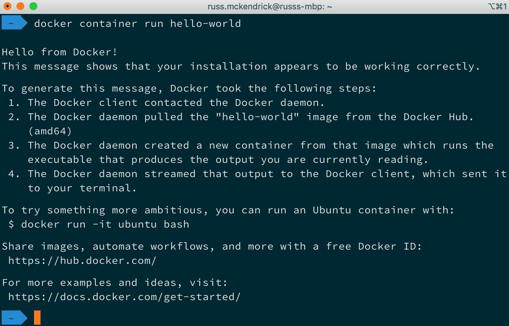

图 4.1 – 运行 hello-world

当进程退出时，我们的容器也会停止。可以通过运行以下命令来查看：

```
$ docker container ls -a
```

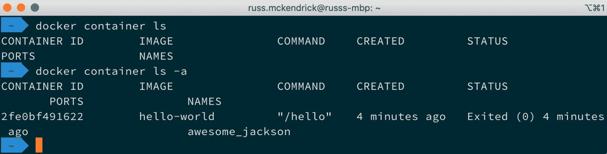

图 4.2 – 列出我们的容器

你可能会注意到，在终端输出中，我首先运行了带有和不带`-a`标志的`docker container ls`命令。`-a`是`--all`的简写，因为不带此标志运行时不会显示任何已退出的容器。

你可能已经注意到，我们不需要给容器命名。这是因为它不会存在得足够长，让我们在意它叫什么。不过，Docker 会自动为容器分配名称，在我的情况下，你可以看到它被命名为`awesome_jackson`。

在使用 Docker 时，你会注意到，如果你选择让它为容器自动生成名称，它会为你起一些非常有趣的名字。它为左边的词从一个单词列表中选取，而右边的词则来自著名科学家和黑客的名字。虽然这有点偏题，但生成这些名称的代码可以在`names-generator.go`中找到。在源代码的最后，它有如下的`if`语句：

```
if name == "boring_wozniak" /* Steve Wozniak is not boring */ { goto begin }
```

这意味着永远不会有一个名为 boring_wozniak 的容器（而且这也完全合理）。

信息：

史蒂夫·沃兹尼亚克（Steve Wozniak）是发明家、电子工程师、程序员和企业家，他与史蒂夫·乔布斯共同创办了苹果公司。他被誉为 70 年代和 80 年代个人计算机革命的先驱，绝对不无聊！

我们可以通过运行以下命令来删除一个状态为`exited`的容器，确保你将容器名称替换为你自己的容器名称：

```
$ docker container rm awesome_jackson
```

同样，在*第一章*，“*Docker 概述*”的结尾，我们通过以下命令使用官方的 NGINX 镜像启动了一个容器：

```
$ docker container run -d --name nginx-test -p 8080:80 nginx
```

如你所记得，这将下载镜像并运行它，将主机上的端口`8080`映射到容器中的端口`80`，并将其命名为`nginx-test`：

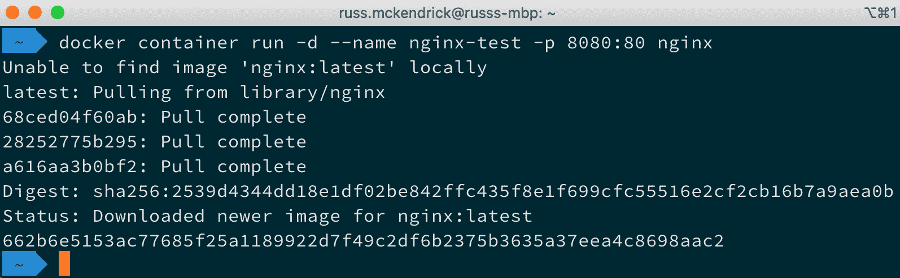

图 4.3 – 运行一个 NGINX 容器

如你所见，运行 Docker 镜像的`ls`命令显示我们现在有两个已下载并运行的镜像。以下命令向我们展示了一个正在运行的容器：

```
$ docker container ls
```

以下终端输出显示，当我运行命令时，我的容器已经运行了 5 分钟：

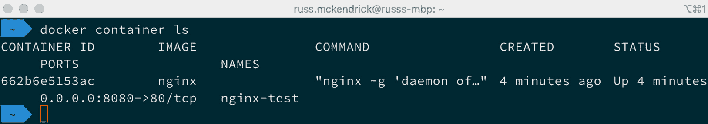

图 4.4 – 查看正在运行的容器

从我们的`docker container run`命令可以看出，我们引入了三个标志。其中一个是`-d`，它是`--detach`的简写。如果我们没有添加这个标志，容器将会在前台执行，这意味着我们的终端将会被锁住，直到我们按下*Ctrl + C*来发送中断命令。

我们可以通过运行以下命令来启动第二个 NGINX 容器，使其与我们已经启动的容器并行运行，从而看到其实际效果：

```
$ docker container run --name nginx-foreground -p 9090:80 nginx
```

启动后，打开浏览器并输入`http://localhost:9090/`。当你加载页面时，你会注意到页面访问的记录会打印到屏幕上。在浏览器中点击刷新会显示更多的访问记录，直到你在终端中按下*Ctrl + C*：

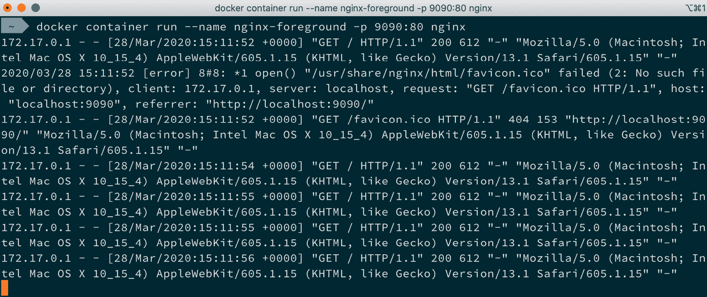

图 4.5 – 在前台运行容器时查看输出

运行`docker container ls -a`显示你有两个容器，其中一个已经退出：

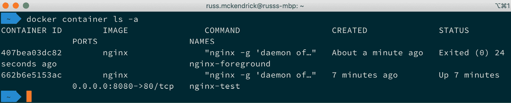

图 4.6 – 列出正在运行的容器

那么，发生了什么呢？当我们移除`detach`标志时，Docker 直接将我们连接到容器中的 NGINX 进程，这意味着我们可以查看该进程的**stdin**、**stdout**和**stderr**。当我们按下*Ctrl + C*时，我们实际上是向 NGINX 进程发送了一个终止指令。由于该进程是保持容器运行的进程，一旦没有了正在运行的进程，容器也就立即退出了。

重要提示

**标准输入** (**stdin**) 是我们的进程读取以获取来自最终用户信息的句柄。**标准输出** (**stdout**) 是进程写入正常信息的地方。**标准错误** (**stderr**) 是进程写入错误信息的地方。

你可能还注意到，在启动`nginx-foreground`容器时，我们使用`--name`标志给它起了一个不同的名字。

这是因为不能有两个容器使用相同的名称，Docker 提供了通过`CONTAINER ID 或 NAME`值与容器交互的选项。这就是名称生成器功能存在的原因：为你不想自己命名的容器分配一个随机名称，并且确保我们永远不会称 Steve Wozniak 为无聊。

最后需要提到的是，当我们启动`nginx-foreground`时，我们要求 Docker 将容器上的端口`9090`映射到主机的端口`80`。这是因为我们不能为主机上的一个端口分配多个进程，所以如果我们试图启动第二个容器并使用与第一个容器相同的端口，就会收到错误消息：

```
docker: Error response from daemon: driver failed programming external connectivity on endpoint nginx-foreground (3f5b355607f24e03f09a60ee688645f223bafe4492f807459e4a 2b83571f23f4): Bind for 0.0.0.0:8080 failed: port is already allocated.
```

此外，由于我们在前台运行容器，NGINX 进程可能会因启动失败而返回错误。

```
ERRO[0003] error getting events from daemon: net/http: request cancelled
```

然而，你可能还会注意到我们正在将端口`80`映射到容器上——为什么没有错误呢？

正如在*第一章*中解释的那样，*Docker 概述*，容器本身是隔离的资源，这意味着我们可以启动任意数量的容器并重新映射端口`80`，它们之间不会发生冲突；只有当我们希望从 Docker 主机路由到暴露的容器端口时，才会遇到问题。

让我们让 NGINX 容器继续运行，直到下一个章节，我们将探索更多与容器交互的方法。

## 与容器交互

到目前为止，我们的容器只运行了一个进程。Docker 为你提供了一些工具，能够让你既能分叉更多的进程，又能与它们进行交互，我们将在接下来的章节中介绍这些工具：

### attach

与正在运行的容器交互的第一种方式是附加到运行中的进程。我们仍然有`nginx-test`容器在运行，因此我们可以通过运行以下命令来连接到它：

```
$ docker container attach nginx-test
```

打开浏览器并访问`http://localhost:8080/`将会打印 NGINX 访问日志到屏幕上，就像我们启动`nginx-foreground`容器时一样。按下*Ctrl + C*将终止进程并将终端恢复到正常状态。然而，和之前一样，我们会终止保持容器运行的进程：

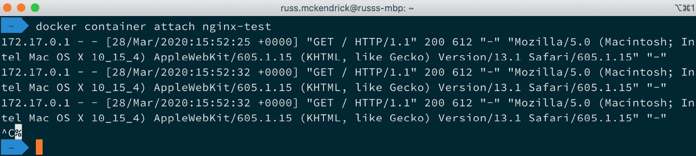

图 4.7 – 附加到我们的容器

我们可以通过运行以下命令重新启动我们的容器：

```
$ docker container start nginx-test
```

这将使容器重新启动为分离模式，意味着它再次在后台运行，因为这是容器最初启动时的状态。访问`http://localhost:8080/`将再次显示 NGINX 欢迎页面。

让我们重新附加到我们的进程，但这次添加一个额外的选项：

```
$ docker container attach --sig-proxy=false nginx-test
```

多次访问容器的 URL 然后按下*Ctrl + C*将使我们与 NGINX 进程断开连接，但这次，不是终止 NGINX 进程，而是将我们返回到终端，容器保持在分离状态，通过运行 docker container ls 可以查看：

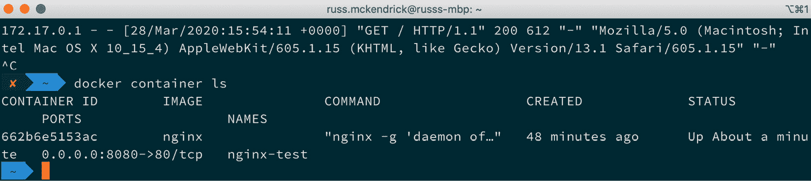

图 4.8 – 从容器断开连接

这是快速附加到运行中的容器以调试问题，同时保持容器主进程运行的好方法。

### exec

`attach`命令如果你需要连接到容器正在运行的进程很有用，但如果你需要一些更具交互性的操作呢？

你可以使用`exec`命令。这会在容器内启动一个第二个进程，允许你与之交互。例如，要查看`/etc/debian_version`文件的内容，我们可以运行以下命令：

```
$ docker container exec nginx-test cat /etc/debian_version
```

这将启动第二个进程，在这种情况下是`cat`命令，它将`/etc/debianversion`的内容打印到标准输出（stdout）。第二个进程将终止，容器将恢复到执行`exec`命令之前的状态：

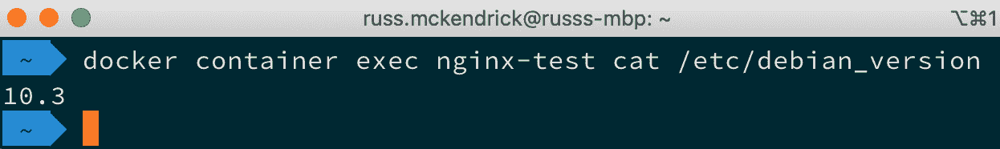

图 4.9 – 对容器执行命令

我们可以进一步执行此操作，运行以下命令：

```
$ docker container exec -i -t nginx-test /bin/bash
```

这次，我们将分叉一个 bash 进程，并使用`-i`和`-t`标志保持对容器的控制台访问。`-i`标志是`--interactive`的简写，它指示 Docker 保持`stdin`打开，以便我们可以向进程发送命令。`-t`标志是`–tty`的简写，它为会话分配一个伪终端（pseudo-TTY）。

重要提示

早期连接到计算机的用户终端被称为 **电传打字机**。虽然这些设备今天已不再使用，但缩写 TTY 仍然被用来描述现代计算中的仅文本控制台。

这意味着你可以像使用 SSH 一样与容器进行交互，仿佛你拥有一个远程终端会话：

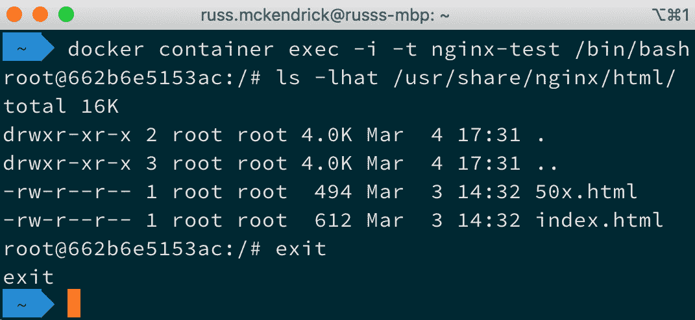

图 4.10 – 打开与容器的交互式会话

尽管这非常有用，因为你可以像操作虚拟机一样与容器进行交互，但我不建议在使用伪 TTY 时对容器进行任何更改。很可能这些更改不会持久化，并且在容器被删除时会丢失。我们将在 *第十五章*，《*Docker 工作流*》中更详细地讨论这一点。

现在我们已经介绍了如何连接和与容器交互的各种方法，接下来我们将了解 Docker 提供的一些工具，这些工具可以让你不必手动执行这些操作。

日志和进程信息

到目前为止，我们一直在连接到容器中的进程或容器本身，以查看信息。Docker 提供了我们将在本节中介绍的命令，这些命令允许你在不使用 `attach` 或 `exec` 命令的情况下查看容器的信息。

我们先来看一下如何在不需要将其置于前台运行的情况下，查看容器内进程生成的输出。

## 日志

`logs` 命令是相当直观的。它允许你与容器的 `stdout` 流进行交互，而 Docker 会在后台跟踪这些流。例如，要查看我们 `nginx-test` 容器写入的最后几条 `stdout` 条目，只需使用以下命令：

```
$ docker container logs --tail 5 nginx-test
```

命令的输出如下所示：

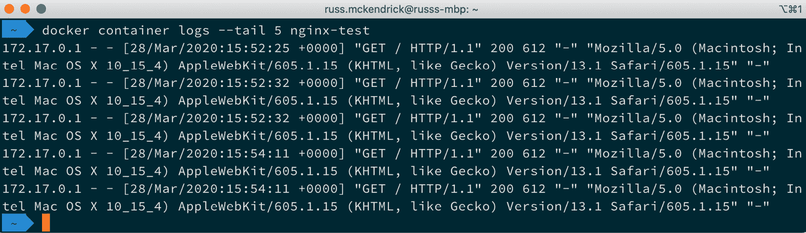

图 4.11 – 跟踪日志

要实时查看日志，我只需运行以下命令：

```
$ docker container logs -f nginx-test
```

`-f` 标志是 `--follow` 的简写。例如，我还可以通过运行以下命令查看从某个时间点以来记录的所有内容：

```
$ docker container logs --since 2020-03-28T15:52:00 nginx-test
```

命令的输出如下所示：

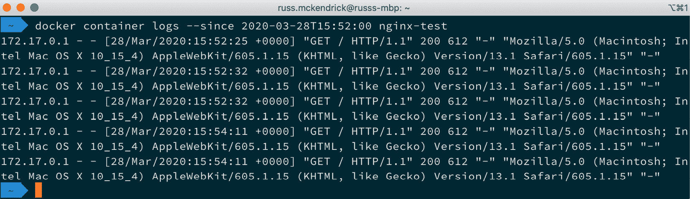

图 4.12 – 检查某个时间点之后的日志

如果你注意到访问日志中的时间戳与你搜索的时间不同，那是因为 `logs` 命令显示的是 Docker 记录的 `stdout` 时间戳，而不是容器内部的时间。一个例子是，由于 **英国夏令时（BST）**，主机与容器之间可能存在数小时的时间差。

幸运的是，为了避免混淆，你可以在 `logs` 命令中添加 `-t` 参数：

```
$ docker container logs --since 2020-03-28T15:52:00 -t nginx-test
```

`-t` 标志是 `--timestamp` 的简写；此选项会在输出前添加 Docker 捕获时间：

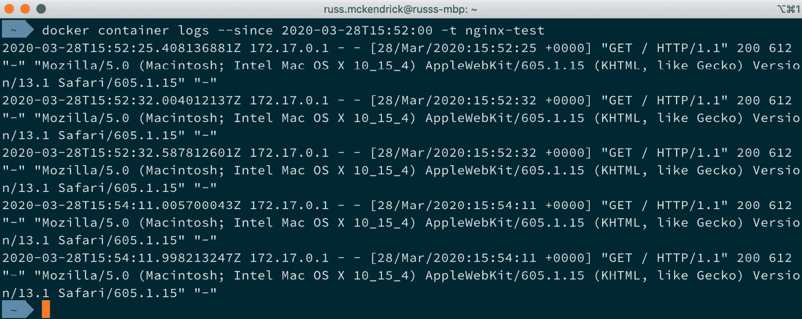

图 4.13 – 查看日志以及记录条目的时间

现在，既然我们已经查看了如何查看容器中运行的进程的输出，我们来看看如何获得关于进程本身的更多细节。

## top

`top` 命令是一个非常简单的命令；它列出了指定容器中正在运行的进程，使用方法如下：

```
$ docker container top nginx-test
```

命令的输出如下所示：

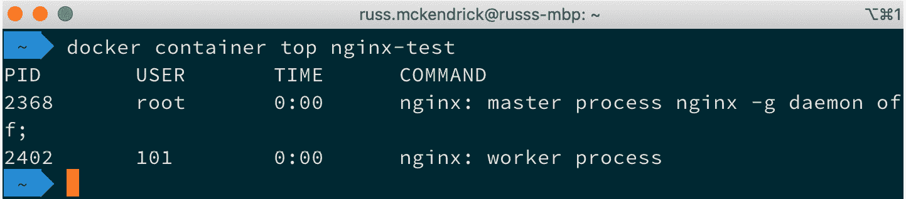

图 4.14 – 运行 top 命令

如下图所示，我们有两个进程在运行，都是 NGINX，这是预期的结果。

## stats

`stats` 命令提供了关于指定容器的实时信息，或者如果没有传递 `NAME` 或 `ID` 参数，则提供所有正在运行的容器的信息：

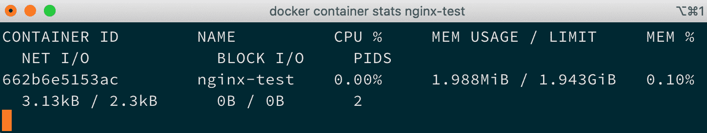

图 4.15 – 查看单个容器的实时统计信息

如下图所示，我们可以看到指定容器的 `CPU`、`RAM`、`NETWORK`、`DISK IO` 和 `PIDS` 信息：

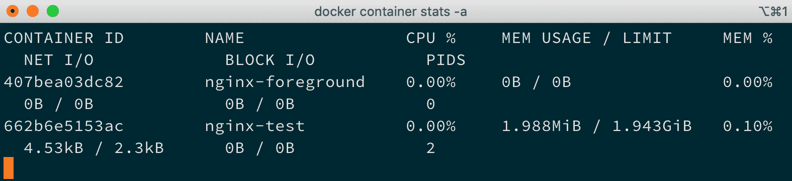

图 4.16 – 查看所有正在运行的容器的实时统计信息

然而，正如你从前面的输出中看到的，如果容器没有运行，那么没有资源被使用，因此它除了提供容器数量和资源使用情况的可视化表示外，并不会提供太多价值。

同时值得指出的是，`stats` 命令显示的信息仅为实时数据；Docker 并不会像 `logs` 命令那样记录资源利用情况并进行存储。我们将在后续章节中探讨更多关于资源利用的长期存储选项。

## 资源限制

我们运行的 `stats` 命令显示了容器的资源利用情况。默认情况下，当容器启动时，如果需要，它将被允许消耗主机上所有可用的资源。我们可以为容器消耗的资源设置限制。让我们从更新 nginx-test 容器的资源限制开始。

通常情况下，我们会在启动容器时使用 `run` 命令设置限制；例如，要将 CPU 优先级减半并设置 `128M` 的内存限制，我们可以使用以下命令：

```
$ docker container run -d --name nginx-test --cpu-shares 512 --memory 128M -p 8080:80 nginx
```

然而，我们并没有为 nginx-test 容器启动时设置任何资源限制，这意味着我们需要更新已经运行的容器。为此，我们可以使用 `update` 命令。现在，你可能会认为这只是运行以下命令：

```
$ docker container update --cpu-shares 512 --memory 128M nginx-test
```

但实际上，运行前述命令会导致错误：

```
Error response from daemon: Cannot update container 662b6e5153ac77685f25a1189922d7f49c2df6b2375b3635a37eea 4c8698aac2: Memory limit should be smaller than already set memoryswap limit, update the memoryswap at the same time
```

那么，`memoryswap`限制当前设置为何？为了找出这个信息，我们可以使用`inspect`命令来显示我们正在运行的容器的所有配置数据；只需运行以下命令：

```
$ docker container inspect nginx-test
```

如果你正在跟随操作，你会发现运行前述命令时，会显示大量的配置数据，这里无法显示所有内容。当我运行此命令时，返回了一个`199`行的`JSON`数组。我们可以使用`grep`命令仅过滤出包含`memory`的行：

```
$ docker container inspect nginx-test | grep -i memory
```

这将返回以下配置数据：

```
            "Memory": 0,
            "KernelMemory": 0,
            "KernelMemoryTCP": 0,
            "MemoryReservation": 0,
            "MemorySwap": 0,
            "MemorySwappiness": null,
```

一切都设置为`0`，那怎么`128M`会比 0 小呢？

```
$ docker container update --cpu-shares 512 --memory 128M --memory-swap 256M nginx-test
```

在资源配置的上下文中，`0`实际上是默认值，表示没有限制。请注意，每个数值后面没有`M`，这意味着我们的`update`命令应当按前述命令进行操作。

重要说明

**分页**是一种内存管理方案，内核将数据从二级存储中存储和检索，或者交换到主内存中使用。这使得进程可以超出物理内存的大小。

默认情况下，当你在`run`命令中设置`--memory`时，Docker 会将`--memory-swap size`设置为`--memory`的两倍。如果你现在运行`docker container stats nginx-test`，你应该会看到我们设置的限制：

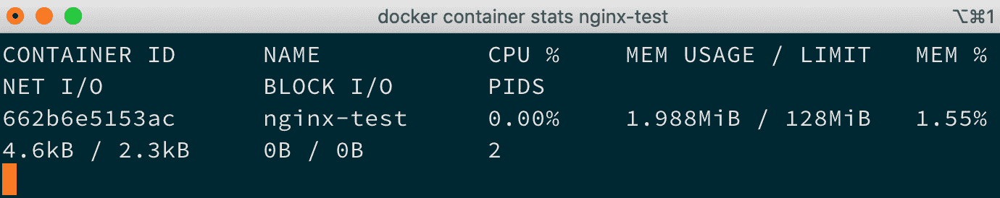

图 4.17 – 使用统计数据查看限制

此外，重新运行`docker container inspect nginx-test | grep -i memory`将显示以下变化：

```
            "Memory": 134217728,
            "KernelMemory": 0,
            "KernelMemoryTCP": 0,
            "MemoryReservation": 0,
            "MemorySwap": 268435456,
            "MemorySwappiness": null,
```

你会注意到，虽然我们定义了以 MB 为单位的数值，但在这里它们以字节显示，所以是正确的。

提示

运行`docker container inspect`时显示的值是以字节为单位，而不是兆字节（MB）。

## 容器状态和杂项命令

本节的最后部分，我们将查看容器可能的各种状态，以及我们尚未覆盖的`docker container`命令的一些剩余命令。

运行`docker container ls -a`应该会显示类似以下的终端输出：

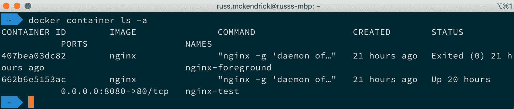

图 4.18 – 列出所有容器，包括已退出的容器

如你所见，我们有两个容器，一个状态为`Up`，另一个为`Exited`。在继续之前，让我们再启动五个容器。要快速完成此操作，运行以下命令：

```
$ for i in {1..5}; do docker container run -d --name nginx$(printf "$i") nginx; done 
```

你应该看到如下类似的输出：

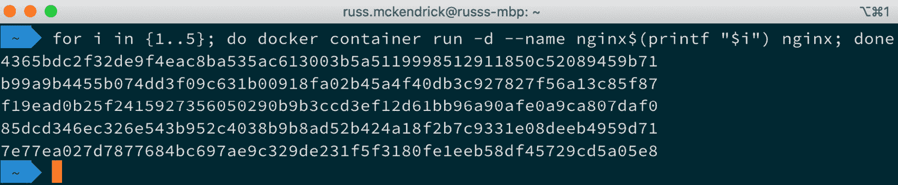

图 4.19 – 快速启动五个容器

当运行`docker container ls -a`时，你应该会看到五个新容器，命名为`nginx1`至`nginx5`：

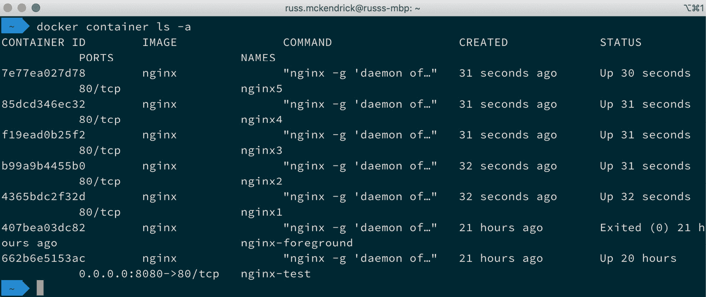

图 4.20 – 查看我们的五个新容器

现在，我们已经启动了额外的容器，让我们来看看如何查看它们的状态。

### 暂停和恢复

让我们来看一下如何暂停 `nginx1`。只需运行以下命令：

```
$ docker container pause nginx1
```

运行 `docker container ls` 会显示容器的状态为 `Up`，但也会显示为 `Paused`：

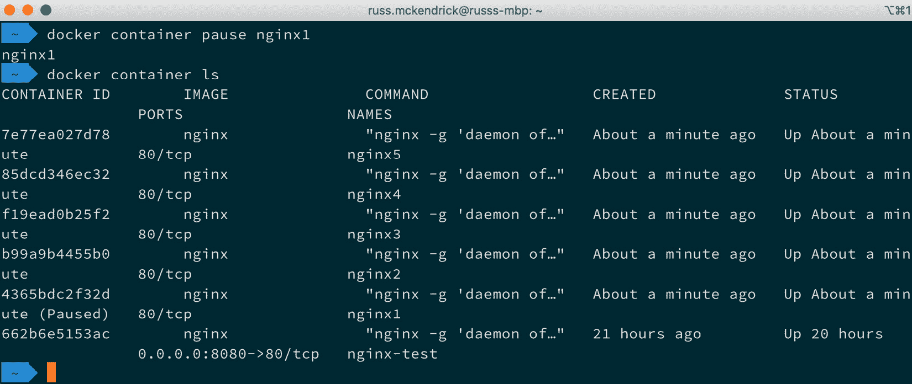

图 4.21 – 暂停容器

请注意，我们无需使用 `-a` 标志来查看容器的信息，因为该进程尚未终止；相反，它是通过 `cgroups` 冷冻机制被挂起的。使用 `cgroups` 冷冻机制时，进程并不知道它已被挂起，这意味着它可以被恢复。

如你所料，你可以使用 `unpause` 命令恢复暂停的容器，命令如下：

```
$ docker container unpause nginx1
```

这个命令很有用，特别是当你需要冻结一个容器的状态时；例如，可能有一个容器出现异常，你需要稍后进行调查，但又不希望它对其他运行中的容器造成负面影响。

现在，让我们来看看如何正确地停止和删除容器。

### 停止、启动、重启和终止

接下来，我们将介绍 `stop`、`start`、`restart` 和 `kill` 命令。我们已经使用过 `start` 命令来恢复一个状态为 `Exited` 的容器。`stop` 命令的工作方式与我们之前使用 *Ctrl + C* 从前台分离容器的方式完全相同。

运行以下命令：

```
$ docker container stop nginx2
```

通过此操作，向进程发送终止请求，称为 `SIGTERM`。如果进程在宽限期内未自行终止，则会发送一个终止信号，称为 `SIGKILL`。这将立即终止进程，不给它任何时间完成可能导致延迟的操作；例如，将数据库查询结果提交到磁盘。

由于这可能导致问题，Docker 允许你通过使用 `-t` 标志来覆盖默认的宽限期（10 秒）；这代表 `--time`。例如，运行以下命令将在发送 `SIGKILL` 命令之前等待最多 60 秒，万一需要终止进程：

```
$ docker container stop -t 60 nginx3
```

如我们所见，`start` 命令会重新启动进程；然而，与 `pause` 和 `unpause` 命令不同，进程在这种情况下会从头开始，使用最初启动它时的标志，而不是从暂停的位置继续：

```
$ docker container start nginx2 nginx3
```

`restart` 命令是以下两个命令的组合；它先停止然后启动你传递给它的 `ID` 或 `NAME` 容器。此外，和 `stop` 命令一样，你可以使用 `-t` 标志：

```
$ docker container restart -t 60 nginx4
```

最后，你也可以选择通过运行 `kill` 命令立即向容器发送 `SIGKILL` 命令：

```
$ docker container kill nginx5
```

还有一件事需要讲解，那就是删除容器。

### 删除容器

让我们通过`docker container ls -a`命令检查我们使用过的容器的状态。当我运行该命令时，我看到有两个容器的状态为`Exited`，其他的都在运行中：

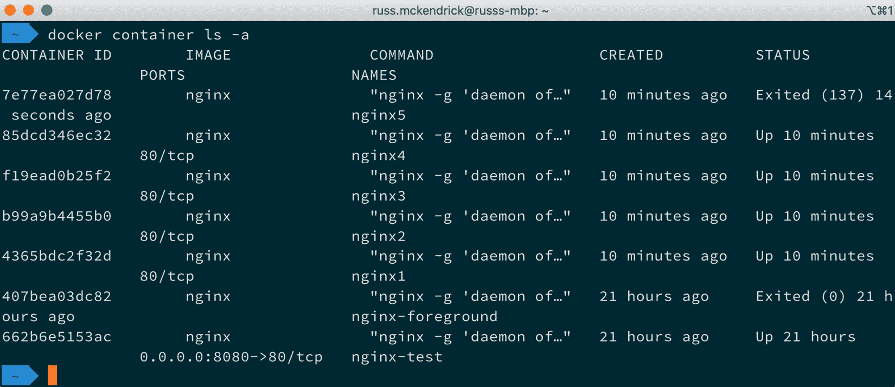

Figure 4.22 – 查看所有容器的状态

要删除这两个已退出的容器，我可以简单地运行`prune`命令：

```
$ docker container prune
```

这样做时，会弹出一个警告，询问你是否确定，如下图所示：

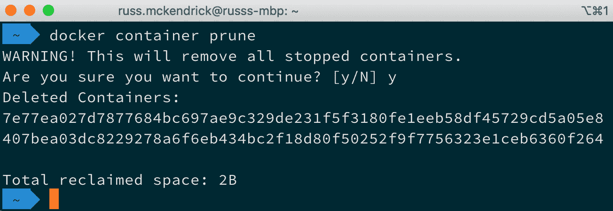

Figure 4.23 – 修剪容器

你可以使用`rm`命令选择要删除的容器，下面是一个示例：

```
$ docker container rm nginx4
```

另一种选择是将`stop`和`rm`命令连接在一起：

```
$ docker container stop nginx3 && docker container rm nginx3
```

然而，鉴于现在可以使用`prune`命令，这可能是一个过于繁琐的过程，尤其是当你正在尝试删除容器并且可能不太关心该过程是如何优雅地终止时。

随意使用你喜欢的任何方法删除剩余的容器。

在结束本章这一部分之前，我们还将查看一些不能真正归类在一起的有用命令。

### 杂项命令

本节的最后部分，我们将查看一些你在日常使用 Docker 时可能不会过多使用的命令。第一个是`create`命令。`create`命令与`run`命令非常相似，区别在于它不会启动容器，而是准备和配置容器：

```
$ docker container create --name nginx-test -p 8080:80 nginx
```

你可以通过运行`docker container ls -a`命令检查已创建容器的状态，然后使用`docker container start nginx-test`启动容器，再次检查状态：

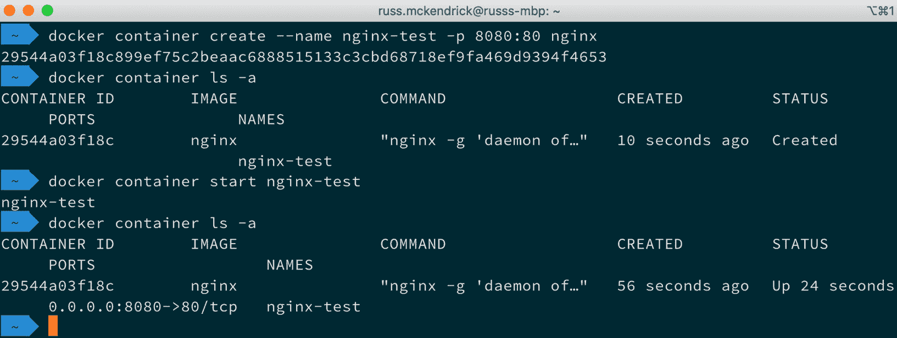

Figure 4.24 – 创建并运行容器

接下来我们将快速查看`port`命令；该命令会显示容器的`port`号以及所有端口映射：

```
$ docker container port nginx-test
```

它应该返回以下内容：

```
    80/tcp -> 0.0.0.0:8080
```

我们已经知道了这一点，因为这是我们所配置的内容。此外，端口会在`docker container ls`输出中列出。

接下来我们将快速查看的命令是`diff`命令。这个命令列出自容器启动以来所有已添加（`A`）或已更改（`C`）的文件——基本上，这是一个列出原始镜像和当前容器文件系统之间差异的文件清单。

在我们运行命令之前，先使用`exec`命令在`nginx-test`容器内创建一个空白文件：

```
$ docker container exec nginx-test touch /tmp/testing
```

现在我们在`/tmp`目录下有一个名为`testing`的文件，我们可以使用以下命令查看原始镜像和正在运行的容器之间的差异：

```
$ docker container diff nginx-test
```

这将返回一个文件列表。从以下列表中可以看到，我们的测试文件已经在那里，同时还有 NGINX 启动时创建的文件：

```
    C /run
    A /run/nginx.pid
    C /tmp
    A /tmp/testing
    C /var
    C /var/cache
    C /var/cache/nginx
    A /var/cache/nginx/client_temp
    A /var/cache/nginx/fastcgi_temp
    A /var/cache/nginx/proxy_temp
    A /var/cache/nginx/scgi_temp
    A /var/cache/nginx/uwsgi_temp
```

值得指出的是，一旦我们停止并移除容器，这些文件将会丢失。在本章的下一节中，我们将学习 Docker 卷，并了解如何持久化数据。不过，在继续之前，让我们使用`cp`命令获取我们刚刚创建的文件的副本。

为此，我们可以运行以下命令：

```
$ docker container cp nginx-test:/tmp/testing testing 
```

从命令可以看到，我们提供了容器名称，后面跟着 `:` 和我们想要复制的文件的完整路径。接下来是本地路径。在这里，你可以看到我们只是简单地将文件命名为`testing`，并且它将被复制到当前文件夹：

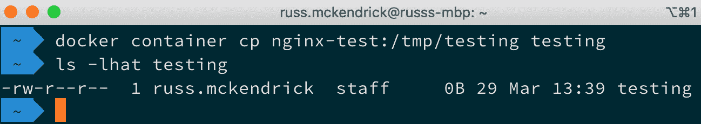

](img/Figure_4.25_B15659.jpg)

图 4.25 – 将文件复制到容器

由于文件中没有数据，让我们添加一些数据，然后将其复制回容器：

```
$ echo "This is a test of copying a file from the host machine to the container" > testing
$ docker container cp testing nginx-test:/tmp/testing
$ docker container exec nginx-test cat /tmp/testing
```

请注意，在第二个命令中，我们交换了路径的位置。这次，我们提供的是本地文件的路径以及容器名称和路径：

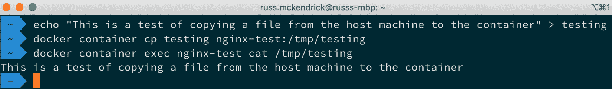

](img/Figure_4.26_B15659.jpg)

图 4.26 – 将文件及其内容复制到容器

另一个值得注意的地方是，尽管我们正在覆盖一个现有文件，但 Docker 并没有警告我们或提供回退的选项——它直接覆盖了该文件，因此在使用`docker container cp`时请小心。

如果你在跟随操作，请在继续之前使用你选择的命令移除本节中启动的任何运行中的容器。

# Docker 网络与卷

接下来，我们将使用默认驱动程序来了解 Docker 网络和 Docker 卷的基础知识。首先，我们来看一下网络。

Docker 网络

到目前为止，我们一直在一个单一的扁平共享网络上启动容器。虽然我们还没有讨论过这个问题，但这意味着我们启动的容器之间可以互相通信，而无需使用任何主机网络。

现在我们不打算详细讲解，而是通过一个示例来演示。我们将运行一个包含两个容器的应用程序；第一个容器运行 Redis，第二个容器运行我们的应用程序，它使用 Redis 容器来存储系统状态。

重要提示

Redis 是一个内存数据结构存储，可以用作数据库、缓存或消息代理。它支持不同级别的磁盘持久化。

在启动应用程序之前，让我们先下载我们将使用的容器镜像，并创建网络：

```
$ docker image pull redis:alpine
$ docker image pull russmckendrick/moby-counter
$ docker network create moby-counter
```

你应该会看到类似于以下的终端输出：

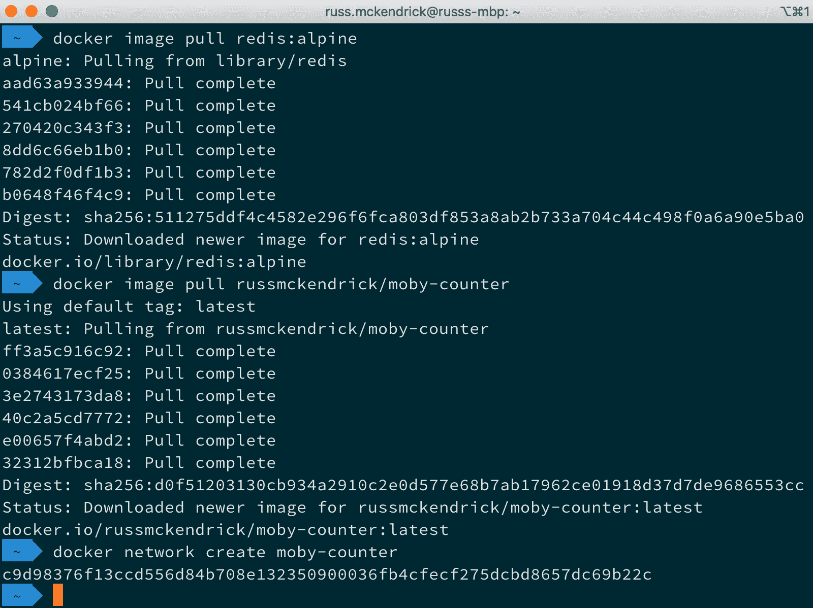

](img/Figure_4.27_B15659.jpg)

图 4.27 – 拉取我们需要的镜像并创建网络

现在我们已经拉取了镜像并创建了网络，可以启动我们的容器，从 Redis 容器开始：

```
$ docker container run -d --name redis --network moby-counter redis:alpine
```

如你所见，我们使用`--network`标志来定义我们启动容器时使用的网络。现在 Redis 容器已经启动，我们可以通过运行以下命令启动应用程序容器：

```
$ docker container run -d --name moby-counter --network moby-counter -p 8080:80 russmckendrick/moby-counter
```

再次说明，我们在`moby-counter`网络上启动了容器。这一次，我们将端口`8080`映射到容器上的端口`80`。请注意，我们不需要担心暴露 Redis 容器的任何端口。这是因为 Redis 镜像自带一些默认设置，暴露了默认端口，对我们来说是`6379`。通过运行`docker container ls`可以看到这一点：

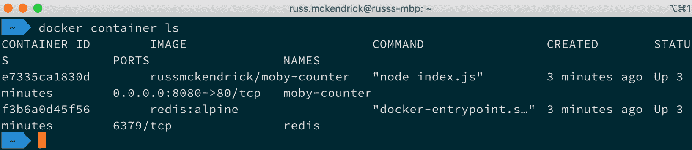

图 4.28 – 列出我们应用程序所需的容器

剩下的就是访问应用程序了。为此，请打开浏览器并访问`http://localhost:8080/`。你应该看到一个大致空白的页面，并显示**点击以添加徽标…**的消息：


图 4.29 – 我们的应用程序已准备就绪

点击页面上的任何地方都会添加 Docker 徽标，所以尽管点击：

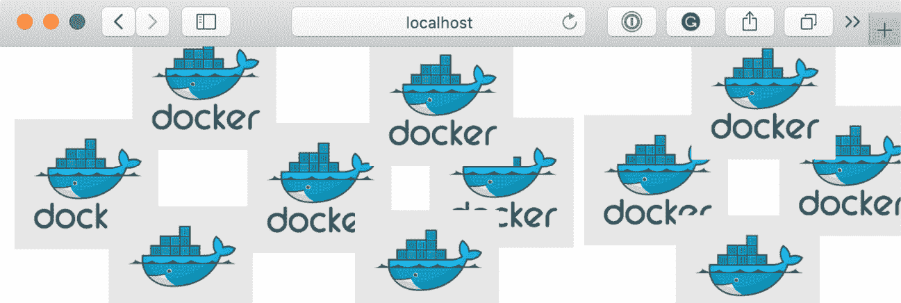

图 4.30 – 向页面添加一些徽标

那么，发生了什么？来自`moby-counter`容器的应用程序正在连接到`redis`容器，并使用该服务来存储你通过点击屏幕上每个徽标的坐标。

`moby-counter`应用程序是如何连接到`redis`容器的？嗯，在`server.js`文件中，设置了以下默认值：

```
var port = opts.redis_port || process.env.USE_REDIS_PORT || 6379
var host = opts.redis_host || process.env.USE_REDIS_HOST || 'redis'
```

这意味着`moby-counter`应用程序正在尝试连接到名为`redis`的主机，端口为`6379`。让我们尝试使用`exec`命令从`moby-counter`应用程序 ping `redis`容器，看看会得到什么结果：

```
$ docker container exec moby-counter ping -c 3 redis
```

你应该看到类似于以下输出的内容：

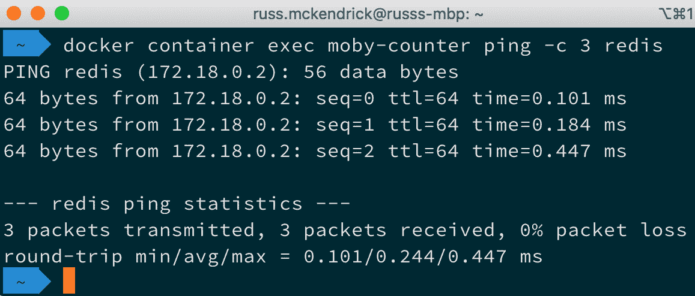

图 4.31 – 使用容器名称 ping Redis 容器

如你所见，`moby-counter`容器将`redis`解析为`redis`容器的 IP 地址，即`172.18.0.2`。你可能会想，应用程序的主机文件中是否包含了`redis`容器的条目；让我们通过以下命令来查看：

```
$ docker container exec moby-counter cat /etc/hosts
```

这将返回`/etc/hosts`的内容，在我的案例中，内容如下所示：

```
    127.0.0.1	localhost
    ::1	localhost ip6-localhost ip6-loopback
    fe00::0	ip6-localnet
    ff00::0	ip6-mcastprefix
    ff02::1	ip6-allnodes
    ff02::2	ip6-allrouters
    172.18.0.3	e7335ca1830d
```

除了末尾的条目，它实际上是解析到本地容器主机名的 IP 地址，`e7335ca1830d`是容器的 ID；没有找到`redis`的条目。接下来，让我们通过运行以下命令检查`/etc/resolv.conf`：

```
$ docker container exec moby-counter cat /etc/resolv.conf
```

这返回了我们需要的内容。如你所见，我们正在使用一个本地的`nameserver`：

```
nameserver 127.0.0.11
options ndots:0
```

让我们对 `redis` 执行 DNS 查找，目标是 `127.0.0.11`，使用以下命令：

```
$ docker container exec moby-counter nslookup redis 127.0.0.11
```

这将返回 `redis` 容器的 IP 地址：

```
    Server:    127.0.0.11
    Address 1: 127.0.0.11

    Name:      redis
    Address 1: 172.18.0.2 redis.moby-counter
```

让我们创建一个第二个网络并启动另一个应用程序容器：

```
$ docker network create moby-counter2
$ docker run -itd --name moby-counter2 --network moby-counter2 -p 9090:80 russmckendrick/moby-counter
```

现在我们已经启动了第二个应用程序容器，让我们尝试从它向 `redis` 容器发送 ping 请求：

```
$ docker container exec moby-counter2 ping -c 3 redis
```

在我的情况下，我遇到了以下错误：

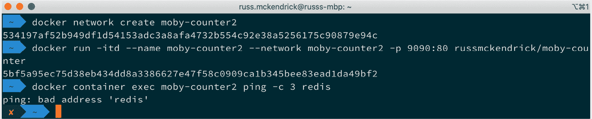

图 4.32 – 在不同网络中隔离我们的应用程序

让我们检查 `resolv.conf` 文件，看看是否已经在使用相同的 `nameserver`，如下所示：

```
$ docker container exec moby-counter2 cat /etc/resolv.conf
```

从以下输出可以看出，`nameserver` 确实已经在使用：

```
    nameserver 127.0.0.11
    options ndots:0
```

由于我们已经将 `moby-counter2` 容器启动在一个与 `redis` 容器所在的网络不同的网络中，因此我们无法解析容器的主机名：

```
$ docker container exec moby-counter2 nslookup redis 127.0.0.11
```

所以，它返回了一个错误地址：

```
    Server:    127.0.0.11
    Address 1: 127.0.0.11
    nslookup: can't resolve 'redis': Name does not resolve
```

让我们来看一下如何在第二个网络中启动第二个 Redis 服务器。正如我们之前讨论的，我们不能有两个相同名称的容器，因此我们可以创造性地命名它为`redis2`。由于我们的应用程序配置为连接到一个解析为`redis`的容器，这是否意味着我们需要对应用程序容器做出更改？不，Docker 已经帮我们解决了这个问题。

虽然我们不能有两个相同名称的容器，正如我们之前发现的那样，我们的第二个网络与第一个网络完全隔离，这意味着我们仍然可以使用 `redis` 的 DNS 名称。为了做到这一点，我们需要添加 `-network-alias` 标志，如下所示：

```
$ docker container run -d --name redis2 --network moby-counter2 --network-alias redis redis:alpine
```

如你所见，我们将容器命名为 `redis2`，但将 `--network-alias` 设置为 `redis`：

```
$ docker container exec moby-counter2 nslookup redis 127.0.0.1
```

这意味着当我们进行查找时，会看到返回正确的 IP 地址：

```
Server:    127.0.0.1
Address 1: 127.0.0.1 localhost
Name:      redis
Address 1: 172.19.0.3 redis2.moby-counter2
```

如你所见，`redis` 实际上是 `redis2.moby-counter2` 的别名，随后解析为 `172.19.0.3`。

现在，我们应该有两个应用程序在本地 Docker 主机上并排运行，分别在 `http://localhost:8080/` 和 `http://localhost:9090/` 可访问。运行 `docker network ls` 将显示所有在 Docker 主机上配置的网络，包括默认网络：

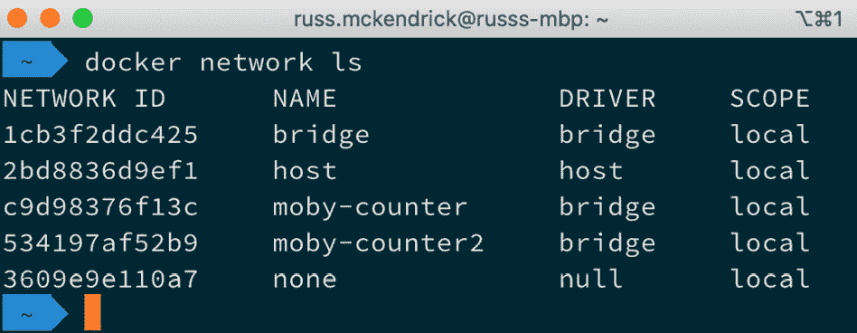

图 4.33 – 列出我们的网络

你可以通过运行以下 `inspect` 命令来了解更多关于网络配置的信息：

```
$ docker network inspect moby-counter
```

运行前面的命令会返回以下 JSON 数组。它首先提供网络的一些一般信息：

```
[
    {
        "Name": "moby-counter",
        "Id": "c9d98376f13ccd556d84b708e132350900036fb4 cfecf275dcbd8657dc69b22c",
        "Created": "2020-03-29T13:06:03.3911316Z",
        "Scope": "local",
        "Driver": "bridge",
        "EnableIPv6": false,
```

接下来是 IP 地址管理系统使用的配置。它显示了子网范围和网关 IP 地址：

```
        "IPAM": {
            "Driver": "default",
            "Options": {},
            "Config": [
                {
                    "Subnet": "172.18.0.0/16",
                    "Gateway": "172.18.0.1"
                }
            ]
        },
```

接下来是剩余的通用配置：

```
        "Internal": false,
        "Attachable": false,
        "Ingress": false,
        "ConfigFrom": {
            "Network": ""
        },
        "ConfigOnly": false,
```

然后，我们获得了关于附加到网络的容器的详细信息。这里我们可以找到每个容器的 IP 地址和 MAC 地址：

```
        "Containers": {
            "e7335ca1830da66d4bdc2915a6a35e83e 546cbde63cd97ab48bfd3ca06ae99ae": {
                "Name": "moby-counter",
                "EndpointID": "fb405fac3e0814e3ab7f1b8e2c4 2bbfe09d751982c502ff196ac794e382bbb2a",
                "MacAddress": "02:42:ac:12:00:03",
                "IPv4Address": "172.18.0.3/16",
                "IPv6Address": ""
            },
            "f3b6a0d45f56fe2a0b54beb4b89d6094aaf 42598e11c3080ef0a21b78f0ec159": {
                "Name": "redis",
                "EndpointID": "817833e6bba40c73a3a349fae 53205b1c9e19d73f3a8d5e296729ed5876cf648",
                "MacAddress": "02:42:ac:12:00:02",
                "IPv4Address": "172.18.0.2/16",
                "IPv6Address": ""
            }
        },
```

最后，我们有了配置的最后部分：

```
        "Options": {},
        "Labels": {}
    }
]
```

如你所见，它包含了关于网络地址的信息，这些信息位于 IPAM 部分，以及关于在该网络中运行的两个容器的详细信息。

重要提示

`IPAM`同时提供`DNS`和`DHCP`服务，因此每个服务都能通知对方的变化。例如，`DHCP`会为`container2`分配地址，随后`DNS`服务会更新，以便在对`container2`进行查找时返回`DHCP`分配的 IP 地址。

在进入下一节之前，我们应该删除其中一个应用程序及其关联的网络。要执行此操作，请运行以下命令：

```
$ docker container stop moby-counter2 redis2
$ docker container prune
$ docker network prune
```

这些操作将删除容器和网络，如下图所示：

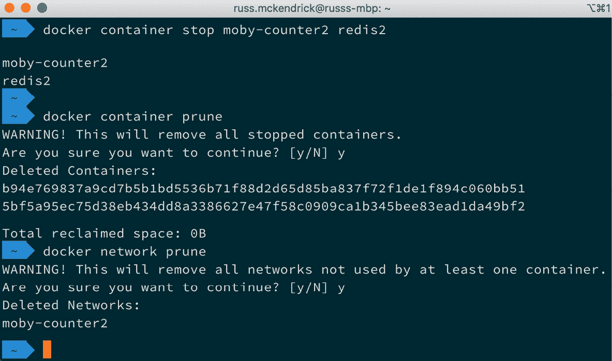

](img/Figure_4.34_B15659.jpg)

图 4.34 – 使用清理命令删除未使用的网络

正如本节开始时提到的，这仅仅是默认的网络驱动程序，这意味着我们只能在单个 Docker 主机上使用网络。 在后面的章节中，我们将学习如何在多个主机甚至提供商之间扩展我们的 Docker 网络。

现在我们已经了解了 Docker 网络的基础知识，接下来让我们看看如何为容器提供额外的存储。

## Docker 卷

如果你跟随了上一节的网络示例，你应该会看到两个容器正在运行，如下图所示：

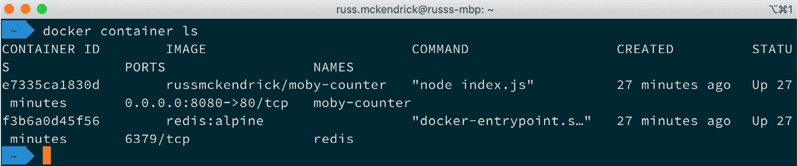

](img/Figure_4.35_B15659.jpg)

图 4.35 – 列出正在运行的容器

当你在浏览器中访问应用程序（`http://localhost:8080/`）时，你可能会看到屏幕上已经出现了 Docker 图标。让我们停止并删除 Redis 容器，然后看看会发生什么。为此，请运行以下命令：

```
$ docker container stop redis
$ docker container rm redis
```

如果你打开了浏览器，你可能会注意到 Docker 图标已经渐隐到背景中，屏幕中央出现了一个动画加载器。这基本上表示应用程序正在等待与 Redis 容器的连接重新建立：

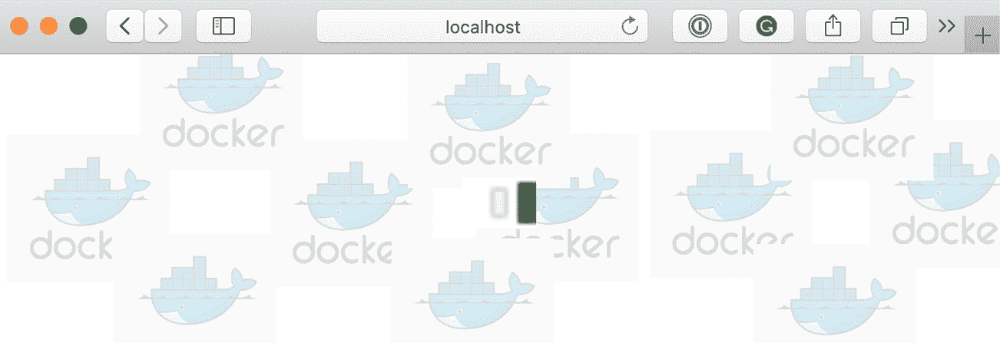

](img/Figure_4.36_B15659.jpg)

图 4.36 – 应用程序无法再连接到 Redis

使用以下命令重新启动 Redis 容器：

```
$ docker container run -d --name redis --network moby-counter redis:alpine
```

这恢复了连接。然而，当你开始与应用程序交互时，之前的图标消失了，你将看到一个空白界面。快速地在屏幕上再添加一些图标，这次它们的位置与之前不同，就像我这里所做的那样：

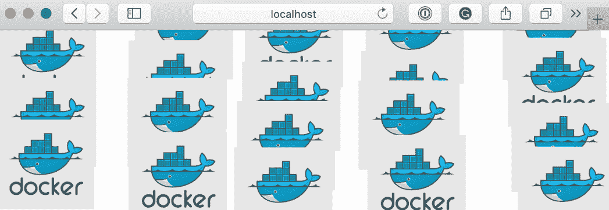

](img/Figure_4.37_B15659.jpg)

图 4.37 – 添加更多的 logo

一旦你有了一个模式，接下来我们再通过运行以下命令删除 Redis 容器：

```
$ docker container stop redis
$ docker container rm redis
```

正如我们在本章之前讨论的，丢失容器中的数据是可以预期的。然而，由于我们使用的是官方的 Redis 镜像，实际上我们并没有丢失任何数据。

我们使用的官方 Redis 镜像的 Dockerfile 如下所示：

```
FROM alpine:3.11
RUN addgroup -S -g 1000 redis && adduser -S -G redis -u 999 redis
RUN apk add --no-cache \
		'su-exec>=0.2' \
		tzdata
ENV REDIS_VERSION 5.0.8
ENV REDIS_DOWNLOAD_URL http://download.redis.io/releases/redis-5.0.8.tar.gz
ENV REDIS_DOWNLOAD_SHA f3c7eac42f433326a8d981b50dba0169 fdfaf46abb23fcda2f933a7552ee4ed7
```

前面的步骤通过添加用户组、安装一些软件包并设置环境变量来准备容器。接下来的步骤安装运行 Redis 所需的先决条件：

```
RUN set -eux; \
	\
	apk add --no-cache --virtual .build-deps \
		coreutils \
		gcc \
		linux-headers \
		make \
		musl-dev \
		openssl-dev \
	; \
	\
```

现在，Redis 的源代码已下载并复制到镜像中的正确位置：

```
	wget -O redis.tar.gz "$REDIS_DOWNLOAD_URL"; \
	echo "$REDIS_DOWNLOAD_SHA *redis.tar.gz" | sha256sum -c -; \
	mkdir -p /usr/src/redis; \
	tar -xzf redis.tar.gz -C /usr/src/redis --strip-components=1; \
	rm redis.tar.gz; \
	\
```

现在 Redis 的源代码已进入镜像，并应用了配置：

```
	grep -q '^#define CONFIG_DEFAULT_PROTECTED_MODE 1$' /usr/src/redis/src/server.h; \
	sed -ri 's!^(#define CONFIG_DEFAULT_PROTECTED_MODE) 1$!\1 0!' /usr/src/redis/src/server.h; \
	grep -q '^#define CONFIG_DEFAULT_PROTECTED_MODE 0$' /usr/src/redis/src/server.h; \
	\
```

现在，Redis 已经编译并测试完成：

```
	make -C /usr/src/redis -j "$(nproc)" all; \
	make -C /usr/src/redis install; \
	\
	serverMd5="$(md5sum /usr/local/bin/redis-server | cut -d' ' -f1)"; export serverMd5; \
	find /usr/local/bin/redis* -maxdepth 0 \
		-type f -not -name redis-server \
		-exec sh -eux -c ' \
			md5="$(md5sum "$1" | cut -d" " -f1)"; \
			test "$md5" = "$serverMd5"; \
		' -- '{}' ';' \
		-exec ln -svfT 'redis-server' '{}' ';' \
	; \
	\
```

然后移除`build`目录，并删除不再需要的软件包：

```
	rm -r /usr/src/redis; \
	\
	runDeps="$( \
		scanelf --needed --nobanner --format '%n#p' --recursive /usr/local \
			| tr ',' '\n' \
			| sort -u \
			| awk 'system("[ -e /usr/local/lib/" $1 " ]") == 0 { next } { print "so:" $1 }' \
	)"; \
	apk add --no-network --virtual .redis-rundeps $runDeps; \
	apk del --no-network .build-deps; \
	\
```

现在 Redis 已经构建，软件包和构建产物已整理好，进行最终测试。如果在这里失败，构建也会失败：

```
	redis-cli --version; \
	redis-server --version
```

在所有内容安装完毕后，最后的镜像配置就可以进行：

```
RUN mkdir /data && chown redis:redis /data
VOLUME /data
WORKDIR /data
COPY docker-entrypoint.sh /usr/local/bin/
ENTRYPOINT ["docker-entrypoint.sh"]
EXPOSE 6379
CMD ["redis-server"]
```

如果你注意到，在文件的最后部分，声明了`VOLUME`和`WORKDIR`指令；这意味着，当我们的容器启动时，Docker 实际上创建了一个卷，并从该卷中运行了`redis-server`。我们可以通过运行以下命令来验证：

```
$ docker volume ls
```

这应该至少显示两个卷，如下图所示：

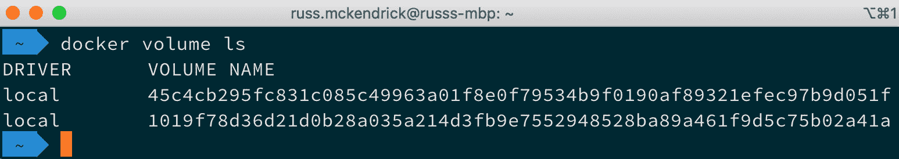

图 4.38 – 列出卷

如你所见，卷的名称并不友好。实际上，它是卷的唯一 ID。那么，我们如何在启动 Redis 容器时使用该卷呢？从 Dockerfile 中我们知道，卷被挂载到了容器内的`/data`路径，所以我们只需要告诉 Docker 在运行时使用哪个卷，并将其挂载到指定位置。

为此，运行以下命令，确保用你自己的卷 ID 替换：

```
$ docker container run -d --name redis -v 45c4cb295fc831c085c49963a01f8e0f79534b9 f0190af89321efec97b9d051f:/data -network moby-counter redis:alpine
```

如果在启动 Redis 容器后，你的应用页面仍然显示它正在尝试重新连接到 Redis 容器，你可能需要刷新浏览器。如果不行，可以通过运行`docker container restart moby-counter`重启应用容器，再刷新浏览器应该能解决问题。

你可以通过运行以下命令查看卷的内容，附加到容器并列出`/data`中的文件：

```
$ docker container exec redis ls -lhat /data
```

这将返回类似如下的内容：

```
    total 12K
    drwxr-xr-x    1 root     root        4.0K Mar 29 13:51 ..
    drwxr-xr-x    2 redis    redis       4.0K Mar 29 13:35 .
    -rw-r--r--    1 redis    redis        210 Mar 29 13:35 dump.rdb
```

你也可以移除正在运行的容器并重新启动它，不过这次使用第二个卷的 ID。正如你从浏览器中的应用程序所看到的，最初创建的两种不同模式仍然完好无损。

我们再次移除`Redis`容器：

```
$ docker container stop redis
$ docker container rm redis
```

最后，你可以用你自己的卷来覆盖默认的卷。要创建卷，我们需要使用`volume`命令：

```
$ docker volume create redis_data
```

一旦创建，我们将能够使用`redis_data`卷来存储我们的`Redis`，方法是移除当前正在运行的`redis`容器后运行以下命令：

```
$ docker container run -d --name redis -v redis_data:/data --network moby-counter redis:alpine
```

然后我们可以根据需要重新使用该卷。以下屏幕展示了卷的创建，附加到容器，然后容器被移除，最后重新附加到一个新容器：

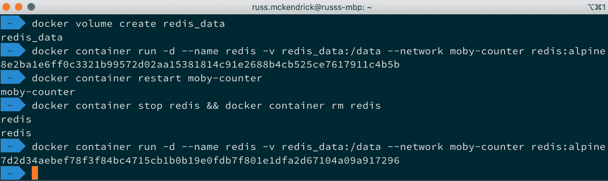

](img/Figure_4.39_B15659.jpg)

图 4.39 – 创建卷并将其附加到容器

类似于 `network` 命令，我们可以使用 `inspect` 命令查看更多关于卷的信息，如下所示：

```
$ docker volume inspect redis_data
```

上述命令将产生如下输出：

```
[
    {
        "CreatedAt": "2020-03-29T14:01:05Z",
        "Driver": "local",
        "Labels": {},
        "Mountpoint": "/var/lib/docker/volumes/redis_data/_data",
        "Name": "redis_data",
        "Options": {},
        "Scope": "local"
    }
]
```

使用本地驱动程序时，您会发现卷的体积并不大。值得注意的一点是，数据存储在 Docker 主机上的路径是`/var/lib/docker/volumes/redis_data/_data`。如果您使用的是 Docker for Mac 或 Docker for Windows，那么这个路径将指向您的 Docker 主机虚拟机，而不是您的本地机器，意味着您无法直接访问卷内的数据。

不用担心；我们将在后续章节中讨论 Docker 卷及如何与其中的数据进行交互。在整理容器、网络和卷之前，如果您正在运行 Docker Desktop，那么我们应该先看看 Docker Desktop 仪表盘。

# Docker Desktop 仪表盘

如果您正在运行 Docker for Mac 或 Docker for Windows，那么主菜单中有一个选项可以打开仪表盘，显示正在运行的容器的信息：

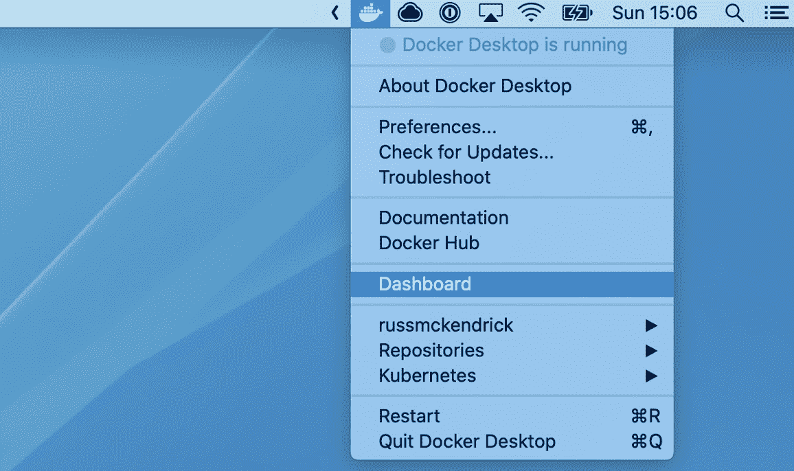

](img/Figure_4.40_B15659.jpg)

图 4.40 – 打开 Docker Desktop 仪表盘

打开后，您应该会看到如下屏幕。正如您所见，我们列出了 `redis` 和 `moby-counter` 容器：

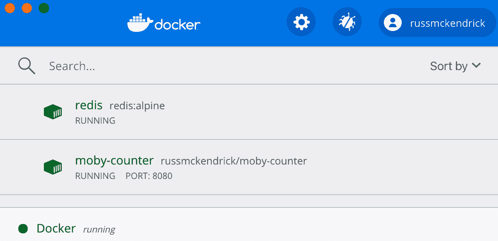

](img/Figure_4.41_B15659.jpg)

图 4.41 – 查看正在运行的容器

选择 `redis` 容器后，您将进入一个概览屏幕，默认显示 `Logs` 输出：


](img/Figure_4.42_B15659.jpg)

图 4.42 – `Logs` 输出的概览屏幕

我们从屏幕顶部开始。右侧可以看到四个蓝色图标，它们从左到右分别是：

+   **连接到容器**：这将打开您的默认终端应用程序，并连接到当前选中的容器。

+   **停止当前连接的容器**：停止后，图标将变为**启动**图标。

+   接下来是**重启图标**。点击它，您猜得没错？！它将重启当前选中的容器。

+   最后的**垃圾桶图标**将终止当前选中的容器。

接下来，我们来看一下屏幕左侧的菜单项。我们已经看过了 **Logs** 输出，它会实时更新，您也可以选择搜索日志输出。下面是 **Inspect**；它显示有关容器的一些基本信息：

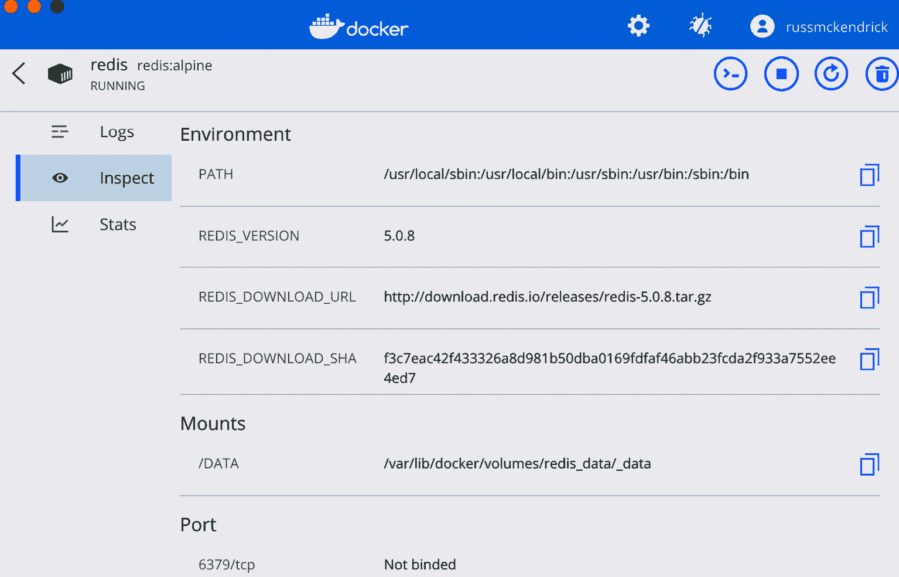

](img/Figure_4.43_B15659.jpg)

图 4.43 – 使用 inspect 获取容器信息

最后一项是`Stats`；正如你可能已经猜到的，这会给我们与`docker container stats redis`命令相同的输出：

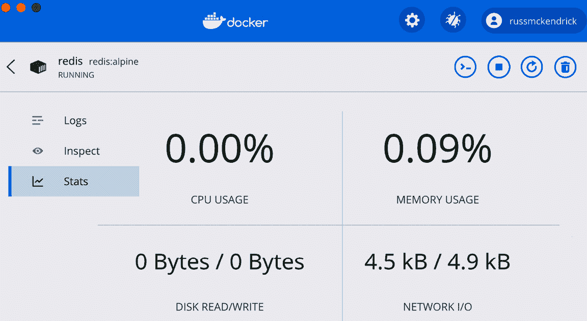

图 4.44 – 查看实时统计信息

进入`moby-counter`容器会在顶部菜单开始处添加一个额外的图标：

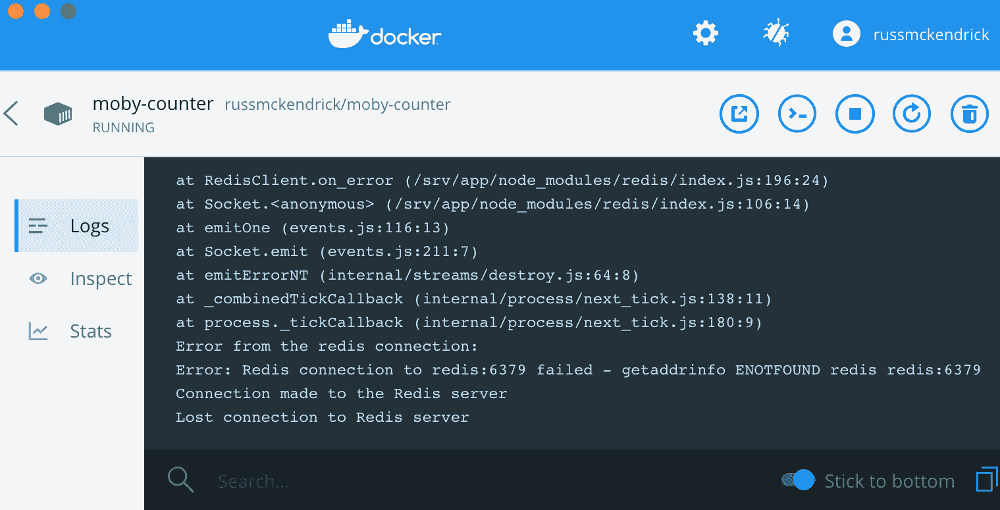

图 4.45 – 查看额外的图标

这将打开你的默认浏览器，并带你到外部暴露的端口，在这种情况下是[`localhost:8080`](http://localhost:8080)。

你已经注意到，仪表板中有一些功能，比如创建容器的能力。然而，随着新版本的发布，我相信会有更多的管理功能被添加进来。

现在，我们应该整理一下。首先，移除两个容器和网络：

```
$ docker container stop redis moby-counter
$ docker container prune
$ docker network prune
```

然后，我们可以通过运行以下命令来移除卷：

```
$ docker volume prune
```

你应该看到类似以下的终端输出：

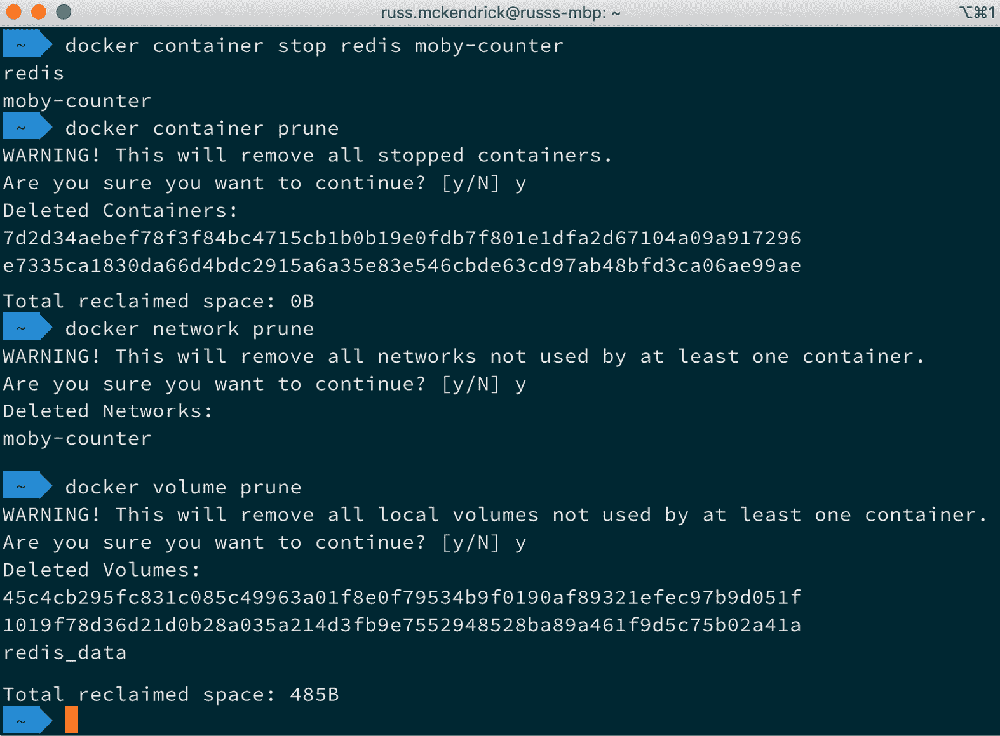

图 4.46 – 删除我们启动的所有内容

现在我们已经恢复了干净的状态，可以进入下一个章节。

# 概述

在本章中，我们学习了如何使用 Docker 命令行客户端管理单个容器，并启动在自己隔离的 Docker 网络中的多容器应用程序。我们还讨论了如何使用 Docker 卷在文件系统上持久化数据。到目前为止，在本章和前几章中，我们已经详细介绍了将来我们将在以下部分使用的大部分可用命令：

```
$ docker container [command]
$ docker network [command]
$ docker volume [command]
$ docker image [command]
```

现在我们已经涵盖了本地使用 Docker 的四个主要领域，我们可以开始学习如何创建更复杂的应用程序。在下一章中，我们将看看另一个核心 Docker 工具，称为**Docker Compose**。

# 问题

1.  要查看所有容器（包括正在运行的和已停止的容器），你需要在`docker container ls`命令后加上哪个标志？

1.  判断题：`-p 8080:80`标志会将容器上的端口`80`映射到主机上的端口`8080`。

1.  解释使用*Ctrl + C*退出已附加的容器与使用`attach`命令并加上`--sig-proxy=false`时的区别。

1.  判断题：`exec`命令将你附加到正在运行的进程。

1.  如果你已经有一个在另一个网络中运行的容器，并且该容器使用相同的 DNS 名称，应该使用哪个标志来给容器添加别名，使其响应 DNS 请求？

1.  使用哪个命令可以查看 Docker 卷的详细信息？

# 深入阅读

你可以通过以下链接了解更多关于我们在本章中讨论的一些话题：

+   名称生成器代码：[`github.com/moby/moby/blob/master/pkg/namesgenerator/names-generator.go`](https://github.com/moby/moby/blob/master/pkg/namesgenerator/names-generator.go)

+   `cgroups` 冻结功能: [`www.kernel.org/doc/Documentation/cgroup-v1/freezer-subsystem.tx`](https://www.kernel.org/doc/Documentation/cgroup-v1/freezer-subsystem.tx)

+   Redis: [`redis.io/`](https://redis.io/)
