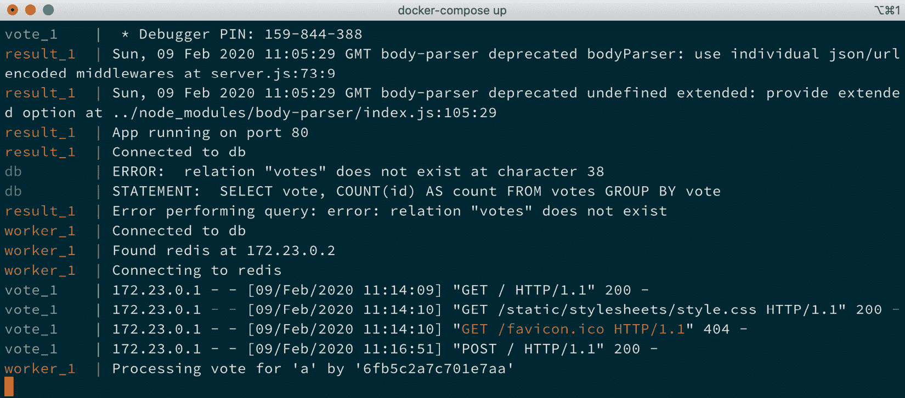

*第五章*

# 第五章：Docker Compose

在这一章中，我们将介绍另一个核心 Docker 工具，名为 Docker Compose，同时也会涉及当前正在开发中的 Docker App。

这两种工具都可以让你轻松地定义、构建和分发由多个容器组成的应用程序，使用的语法与我们在前几章中手动启动容器时使用的命令类似。

我们将把这一章分成以下几个部分：

+   探索 Docker Compose 的基础知识

+   创建我们的第一个 Docker Compose 应用程序

+   探索 Docker Compose 命令

+   使用 Docker App

# 技术要求

与前几章一样，我们将继续使用本地 Docker 安装，本章中的截图也将再次来自我偏好的操作系统 macOS。与之前一样，我们将运行的 Docker 命令将适用于我们至今已安装 Docker 的所有三种操作系统。然而，一些辅助命令，虽然很少，但可能仅适用于 macOS 和 Linux 操作系统——这些将会特别标明。

# 探索 Docker Compose 的基础知识

在 *第一章** Docker 概述* 中，我们讨论了 Docker 设计用于解决的几个问题。我们探讨了 Docker 如何应对许多开发和运维团队所面临的挑战。其中一个解决方案是通过将每个应用栈的进程隔离到一个容器中，来并行运行两个不同的应用栈。这样，你就可以在同一主机上运行两个完全不同版本的同一软件栈——比如 PHP 5.6 和 PHP 7——正如我们在 *第二章** 构建容器镜像* 中所做的那样。

在 *第四章** 管理容器* 的最后，我们启动了一个由多个容器组成的应用程序，而不是在单个容器中运行所需的软件栈。我们开始的示例应用程序 `Moby Counter` 是用 Node.js 编写的，并使用 Redis 作为后端存储键值数据，在我们的案例中是 Docker 图标在屏幕上的坐标。

为了能够运行 Moby Counter 应用程序，我们必须启动两个不同的容器，一个用于 Node.js 应用程序，一个用于 Redis。虽然因为应用程序本身非常简单，启动这些容器非常容易，但手动启动单个容器也有一些缺点。

例如，如果我希望同事部署相同的应用程序，我必须将以下命令传给他们：

```
$ docker image pull redis:alpine
$ docker image pull russmckendrick/moby-counter
$ docker network create moby-counter
$ docker container run -d --name redis --network moby-counter redis:alpine
$ docker container run -d --name moby-counter --network moby-counter -p 8080:80 russmckendrick/moby-counter
```

毋庸置疑，如果我的同事的本地机器上没有镜像，图像将在两个`docker run`命令执行时被拉取，我可以忽略前两个命令，但随着应用程序变得越来越复杂，我将不得不开始传递一组不断增长的命令和指令。

我还必须明确指出，他们必须考虑命令需要执行的顺序。此外，我的笔记还必须包括任何潜在问题的详细信息，以支持他们解决任何可能出现的问题——这可能导致我们陷入“在开发中运行良好，但在运维中出现问题”的场景，我们务必要尽量避免。

尽管 Docker 的责任应该只限于创建镜像并使用这些镜像启动容器，但 Docker 的创建者预见到了这种情况，并力求克服这一问题。多亏了 Docker，人们再也不必担心他们启动应用程序的环境不一致，因为现在可以通过镜像来进行部署。

## Orchard Laboratories

在我们讨论 Docker Compose 之前，让我们快速回顾一下 2014 年 7 月，当时 Docker 收购了一家名为 Orchard Laboratories 的英国初创公司，该公司提供了两种基于容器的产品。

两个产品中的第一个是基于 Docker 的托管平台。通过一个单一命令`orchard`，您可以启动一个主机机器，然后将您的 Docker 命令代理到新启动的主机上；例如，您将使用以下命令：

```
$ orchard hosts create
$ orchard docker run -p 6379:6379 -d orchardup/redis
```

这些命令将在 Orchard 的平台上启动一个 Docker 主机，然后是一个 Redis 容器。我说“将会”，因为当 Docker 收购 Orchard Laboratories 时，他们首先做的事情之一是停止了 Orchard 托管服务。

Orchard Laboratories 的第二个产品是一个名为 Fig 的开源命令行工具，当时 Docker 收购 Orchard Laboratories 时，他们正是看中了这一点。Fig 是用 Python 编写的，它让您可以使用一个 YAML 文件来定义多容器应用程序的结构。Fig 接收 YAML 文件并指示 Docker 按定义启动容器。

这样做的好处是，因为它是一个 YAML 文件，对于开发人员来说，在其代码库中开始使用`fig.yml`文件与其 Dockerfile 一起进行部署是非常简单的。一个典型的`fig.yml`文件如下所示：

```
web:
  image: web
  links:
   - db
  ports:
   - "8000:8000"
   - "49100:22"
db:
  image: postgres
```

要启动在`fig.yml`文件中定义的两个容器，您必须在存储`fig.yml`文件的同一文件夹内运行以下命令：

```
$ fig up
```

您可能已经注意到，我过去一直在提到 Fig，并且这是因为在 2015 年 2 月，Fig 成为了 Docker Compose。在本章的下一部分，我们将看看如何启动我们的第一个 Docker Compose 应用程序，而您将首先注意到的是，定义应用程序的语法与原始 Fig 语法非常接近。

# 制作我们的第一个 Docker Compose 应用程序

在我们安装 Docker for Mac、Docker for Windows 和 Docker for Linux 的过程中，在*第一章**《Docker 概述》*中，我们安装了 Docker Compose，所以我们不再进一步讨论它的作用，让我们尝试仅使用 Docker Compose 来启动我们在上一章末尾手动启动的两容器应用程序。

如前所述，Docker Compose 使用 YAML 文件，通常命名为`docker-compose.yml`，来定义你的多容器应用程序应该是什么样子。我们在*第四章**《容器管理》*中启动的两容器应用程序的 Docker Compose 表示如下：

```
version: "3.7"
services:
    redis:
        image: redis:alpine
        volumes:
           - redis_data:/data
        restart: always
    mobycounter:
        depends_on: 
            - redis
        image: russmckendrick/moby-counter
        ports:
            - "8080:80"
        restart: always

volumes:
    redis_data:
```

即使不逐行分析文件内容，基于我们在前几章中使用的命令，你应该能够很容易地跟踪正在发生的事情——我们将在本章的下一节中查看`docker-compose.yml`文件的内容。

要启动我们的应用程序，我们只需切换到包含`docker-compose.yml`文件的文件夹，并运行以下命令：

```
$ docker-compose up
```

从以下终端输出中可以看到，Docker Compose 启动我们的应用程序时发生了不少事情：


图 5.1 – docker-compose up 的输出

你可以在前几行中看到 Docker Compose 执行了以下操作：

+   它创建了一个名为`mobycounter_redis_data`的卷，使用的是我们在`docker-compose.yml`文件末尾定义的默认驱动程序。

+   它创建了一个名为`mobycounter_default`的网络，使用的是默认网络驱动程序——我们在任何时候都没有要求 Docker Compose 执行此操作。

+   它启动了两个容器，一个名为`mobycounter_redis_1`，另一个名为`mobycounter_mobycounter_1`。

你可能也注意到，在我们的多容器应用程序中，Docker Compose 命名空间前缀加上了`mobycounter`——它从存储我们 Docker Compose 文件的文件夹中获取了这个名称。

启动后，Docker Compose 附加到`mobycounter_redis_1`和`mobycounter_mobycounter_1`并将输出流式传输到我们的终端会话。在终端屏幕上，你可以看到`redis_1`和`mobycounter_1`开始相互交互。

当使用`docker-compose up`运行 Docker Compose 时，它将在前台运行。按下*Ctrl* + *C*将停止容器并返回对终端会话的访问。

## Docker Compose YAML 文件

在进一步了解 Docker Compose 的使用之前，我们应该深入研究一下`docker-compose.yml`文件，因为它们是 Docker Compose 的核心。

重要说明

**YAML** 是一个递归首字母缩略词，代表**YAML Ain't Markup Language**。它被许多不同的应用程序用于配置和定义结构化数据格式，且这种格式易于人类阅读。你在示例中看到的缩进非常重要，它有助于定义数据的结构。

## Moby 计数器应用

我们用来启动多容器应用的`docker-compose.yml`文件被分为三个独立的部分。

第一部分只是指定我们使用的是哪个版本的 Docker Compose 定义语言；在我们的例子中，由于我们正在运行的是最新版本的 Docker 和 Docker Compose，因此我们使用的是版本 3，如下所示：

```
version: "3.7"
```

如前所述，Docker Compose 自 2015 年以来一直存在，在此期间 Docker 客户端和引擎经历了多个不同版本。随着软件更新以包含新特性，现有功能也进行了简化以提高性能，同时一些功能被从核心 Docker 引擎中拆分或完全移除。Docker Compose 一直被维护以保持与旧版本 Docker 的兼容性。

如果在`docker-compose.yml`文件开头没有声明版本号，Docker Compose 将默认使用版本 1；这与原始的 Fig 语法非常接近，这意味着 Docker Compose 将无法读取我们的`docker-compose.yml`文件，因为容器是定义在`services`部分的，并且不支持卷、网络，甚至构建参数——这些我们将在本章后续部分详细介绍。

以下截图展示了如果我们移除版本号会发生的情况：


图 5.2 – docker-compose up 输出

如你所见，尝试在没有声明版本号的情况下运行`docker-compose up`会以错误结束，因为 Docker Compose 根本不知道如何解释我们定义的内容。

下一部分是我们定义容器的地方；这一部分是`services`部分。它的格式如下：

```
services:
----> container name:
--------> container options
------------> sub options
----> container name:
--------> container options
------------> sub options
```

如你所见，`services`声明没有任何缩进，然后每个容器有 4 个空格，每个选项有 8 个空格；进一步的选项则使用 12 个空格。空格的数量是个人选择，因为我认为这样有助于提高可读性——重要的是使用空格而不是制表符，并确保文件中的缩进保持一致，因为缩进用于清晰地定义信息块。

在我们的例子中，我们在`services`部分下定义了两个容器。在以下代码片段中，它们被分开以便于阅读：

```
services:
    redis:
        image: redis:alpine
        volumes:
           - redis_data:/data
        restart: always
    mobycounter:
        depends_on: 
            - redis
        image: russmckendrick/moby-counter
        ports:
            - "8080:80"
        restart: always
```

初看之下，定义服务的语法与使用`docker container run`命令启动容器的方式非常相似。我说“相似”是因为，虽然当你阅读定义时它完全合理，但只有在更仔细检查时你才会发现，Docker Compose 的语法与`docker container run`命令之间其实有很大的区别。

例如，使用`docker container run`命令时，没有以下这些标志：

+   `image`：这告诉 Docker Compose 下载并使用哪个镜像。当使用命令行运行 `docker container run` 时，这个选项不存在，因为你只能运行一个容器；正如我们在前面的章节中看到的，镜像总是在命令的末尾定义，不需要传递标志。

+   `volume`：这是 `--volume` 标志的等效项，但它可以接受多个卷。它只使用在 Docker Compose YAML 文件中声明的卷；稍后我们会详细讲解。

+   `depends_on`：这在执行 `docker container run` 时是行不通的，因为该命令仅针对单个容器。对于 Docker Compose，`depends_on` 用来帮助构建容器启动顺序的逻辑——例如，只有在容器 A 成功启动后才启动容器 B。

+   `ports`：这基本上是 `--publish` 标志，接受一个端口列表。

我们使用的命令中，唯一在执行 `docker container run` 时有等效标志的是 `restart`。这与使用 `--restart` 标志相同，并接受相同的输入。

我们的 Docker Compose YAML 文件的最后一部分是声明我们的卷，具体如下：

```
volumes:
    redis_data:
```

这相当于使用 Docker 命令行客户端运行 `docker volume create redis_data`。

## 示例投票应用程序

如前所述，Moby 计数器应用程序的 Docker Compose 文件是一个相当简单的示例。让我们来看看一个更复杂的 Docker Compose 文件，并了解如何引入构建容器和多个网络。

重要提示

在本书的仓库中，你会在 `chapter05` 目录下找到一个名为 `example-voting-app` 的文件夹。这是官方 Docker 示例仓库中投票应用程序的一个分支。

如你所见，如果打开 `docker-compose.yml` 文件，应用程序由五个容器、两个网络和一个卷组成。如果我们将这个应用程序可视化，它看起来大致如下：


图 5.3 – docker-compose.yml 的容器结构

忽略其他文件，因为我们将在未来章节中讨论其中的一些内容；让我们通过 `docker-compose.yml` 文件，因为其中有很多内容。请查看以下代码片段：

```
version: "3"
services:
```

如你所见，它首先通过定义版本开始，然后开始列出 `service`。我们的第一个容器名为 vote，它是一个 Python 应用程序，允许用户提交投票。从下面的定义可以看出，我们并不是下载一个包含应用程序的镜像，而是通过使用 `build` 来部署我们的应用程序，取代了 `image` 定义：

```
    vote:
        build: ./vote
        command: python app.py
        volumes:
            - ./vote:/app
        ports:
            - "5000:80"
        networks:
            - front-tier
            - back-tier
```

这里的`build`指令告诉 Docker Compose 使用位于`./vote`文件夹中的 Dockerfile 构建容器。Dockerfile 本身对于一个 Python 应用程序来说相当简单。

一旦容器启动，我们将从主机机器中挂载`./vote`文件夹到容器中，这通过传递我们要挂载的文件夹路径以及希望它挂载到容器中的位置来实现。

我们告诉容器在启动时运行`python app.py`命令；将主机机器上的`5000`端口映射到容器内的`80`端口；最后，我们还将两个网络连接到容器，一个叫`front-tier`，另一个叫`back-tier`。

`front-tier`网络将包含需要映射端口到主机机器的容器；`back-tier`网络则用于那些不需要暴露端口的容器，作为一个私有的、隔离的网络。

接下来，我们有另一个与`front-tier`网络连接的容器。该容器显示投票结果。`result`容器包含一个 Node.js 应用程序，该程序连接到 PostgreSQL 数据库（稍后我们会介绍），并在投票容器中的投票被提交时实时显示结果。与`vote`容器一样，该镜像是使用位于`./result`文件夹中的 Dockerfile 在本地构建的，如下方代码片段所示：

```
    result:
        build: ./result
        command: nodemon server.js
        volumes:
            - ./result:/app
        ports:
            - "5001:80"
            - "5858:5858"
         networks:
            - front-tier
            - back-tier
```

我们暴露了`5001`端口，这样就可以连接到该端口以查看结果。下一个也是最后一个应用容器叫做`worker`，如以下代码片段所示：

```
    worker:
        build:
            context: ./worker
        depends_on:
            - "redis"
            - "db"
        networks:
            - back-tier
```

`worker`容器运行一个.NET 应用程序，其唯一任务是连接到 Redis 并通过将投票转移到一个名为`db`的容器中的 PostgreSQL 数据库来注册每一票。该容器仍然是通过 Dockerfile 构建的，但这次我们不是传递 Dockerfile 和应用程序所在文件夹的路径，而是使用`context`。这会为`docker build`命令设置工作目录，并且还可以定义其他选项，比如标签和更改 Dockerfile 的名称。

由于此容器仅做连接`redis`和`db`容器的工作，因此不需要暴露任何端口，因为没有任何直接连接到它的东西；它也不需要与运行在`front-tier`网络上的容器进行通信，这意味着我们只需要添加`back-tier`网络。

现在，我们有了`vote`应用程序，它从最终用户那里注册投票并将其发送到`redis`容器，在那里投票会被`worker`容器处理。`redis`容器的服务定义如下所示：

```
    redis:
        image: redis:alpine
        container_name: redis
        ports: ["6379"]
        networks:
            - back-tier
```

这个容器使用官方的 Redis 镜像，并不是从 Dockerfile 构建的；我们确保端口 `6379` 可用，但仅在 `back-tier` 网络上可用。我们还指定了容器的名称，使用 `container_name` 将其设置为 `redis`。这样可以避免我们在代码中考虑 Docker Compose 默认生成的名称，因为，正如你所记得的，Docker Compose 使用文件夹名称来在自己的应用程序命名空间中启动容器。

下一个也是最后一个容器是 PostgreSQL 容器（我们之前已经提到过），名为 `db`，如下代码片段所示：

```
     db:
        image: postgres:9.4
        container_name: db
        volumes:
            - "db-data:/var/lib/postgresql/data"
        networks:
            - back-tier
```

如你所见，它与 `redis` 容器非常相似，因为我们使用的是官方镜像；然而，你可能注意到我们没有暴露端口，因为这是官方镜像的默认选项。我们还指定了容器的名称。

由于这是我们存储投票的地方，我们正在创建并挂载一个卷，作为 PostgreSQL 数据库的持久存储，如下所示：

```
volumes:
    db-data:
```

接下来，最后是我们在定义应用程序容器时所提到的两个网络：

```
networks:
    front-tier:
    back-tier:
```

运行 `docker-compose up` 会输出大量关于启动过程的反馈；第一次启动应用程序大约需要 5 分钟。如果你没有跟随并自行启动应用程序，接下来是简化版的启动过程。

提示

你可能会遇到一个错误，提示 `npm ERR! request to https://registry.npmjs.org/nodemon failed, reason: Hostname/IP doesn't match certificate's altnames`。如果遇到此错误，请以有权限写入 `/etc/hosts` 文件的用户身份运行命令 `echo "104.16.16.35 registry.npmjs.org" >> /etc/hosts`。

Docker Compose 首先创建网络，并为我们的容器准备好卷，如下所示：

```
Creating network "example-voting-app_front-tier" with the default driver
Creating network "example-voting-app_back-tier" with the default driver
Creating volume "example-voting-app_db-data" with default driver
```

然后，它构建 `vote` 容器镜像，如下所示：

```
Building vote
Step 1/7 : FROM python:2.7-alpine
2.7-alpine: Pulling from library/python
c9b1b535fdd9: Already exists
fea5c17ab132: Pull complete
5dbe995357bf: Pull complete
b6d238951af6: Pull complete
Digest: sha256:5217b150a5f7eecea55f6224440f3b5 c5f975edc32de7c0bfdf98280ed11d76c
Status: Downloaded newer image for python:2.7-alpine
```

现在，图像已经下载完毕，可以开始构建应用程序的第一部分，如下所示：

```
 ---> 7ec8514e7bc5
Step 2/7 : WORKDIR /app
 ---> Running in 7d26310faa98
Removing intermediate container 7d26310faa98
 ---> 8930ad501196
Step 3/7 : ADD requirements.txt /app/requirements.txt
 ---> 33ff980bd133
Step 4/7 : RUN pip install -r requirements.txt
 ---> Running in 999e575570ef
[lots of python build output here]
Removing intermediate container 999e575570ef
 ---> 72637119e7df
Step 5/7 : ADD . /app
 ---> 81adb9e92ce4
Step 6/7 : EXPOSE 80
 ---> Running in a5aaf5b9ed1b
Removing intermediate container a5aaf5b9ed1b
 ---> 366d2e32ceb4
Step 7/7 : CMD ["gunicorn", "app:app", "-b", "0.0.0.0:80", "--log-file", "-", "--access-logfile", "-", "--workers", "4", "--keep-alive", "0"]
 ---> Running in 212e82c06cf3
Removing intermediate container 212e82c06cf3
 ---> 4553ffa35ea4
Successfully built 4553ffa35ea4
```

镜像构建完成后，它将被标记，如下所示：

```
Successfully tagged example-voting-app_vote:latest
WARNING: Image for service vote was built because it did not already exist. To rebuild this image you must use `docker-compose build` or `docker-compose up --build`.
```

一旦 Docker Compose 构建了 `vote` 镜像，它将开始构建 `result` 镜像，如下所示：

```
Building result
Step 1/9 : FROM node:10-slim
10-slim: Pulling from library/node
619014d83c02: Pull complete
8c5d9aed65fb: Pull complete
ec6ca7c6739a: Pull complete
6da8fc40e075: Pull complete
6161f60894b2: Pull complete
Digest: sha256:10c4d19a2a2fa5ad416bddb3a4b208e 34b0d4263c3978df6aa06d9ba9687bbe8
Status: Downloaded newer image for node:10-slim
 ---> ad4ea09bf0f3
Again, now the images have been downloaded the build of the image containing the application can start:
Step 2/9 : WORKDIR /app
 ---> Running in 040efda3a918
Removing intermediate container 040efda3a918
 ---> 3d3326950331
Step 3/9 : RUN npm install -g nodemon
 ---> Running in a0ce3043aba5
[lots of nodejs build output here]
Removing intermediate container a0ce3043aba5
 ---> 925a30942e5f
Step 4/9 : COPY package*.json ./
 ---> 9fd59fddc0e8
Step 5/9 : RUN npm ci  && npm cache clean --force  && mv /app/node_modules /node_modules
 ---> Running in 3c0871538d04
[lots of nodejs build output here]
Removing intermediate container 3c0871538d04
 ---> 8db74baa1959
Step 6/9 : COPY . .
 ---> a47af934177b
Step 7/9 : ENV PORT 80
 ---> Running in 57f80f86faf0
Removing intermediate container 57f80f86faf0
 ---> e5a01939876b
Step 8/9 : EXPOSE 80
 ---> Running in 614bd7bd4ab3
Removing intermediate container 614bd7bd4ab3
 ---> 461355b7e66e
Step 9/9 : CMD ["node", "server.js"]
 ---> Running in 4c64da5f054c
Removing intermediate container 4c64da5f054c
 ---> 65c854a0b292
Successfully built 65c854a0b292
Successfully tagged example-voting-app_result:latest
WARNING: Image for service result was built because it did not already exist. To rebuild this image you must use `docker-compose build` or `docker-compose up --build`.
```

随后是从 Docker Hub 拉取 `db` 容器的 PostgreSQL 镜像，如下所示：

```
Pulling db (postgres:9.4)...
9.4: Pulling from library/postgres
619014d83c02: Already exists
7ec0fe6664f6: Pull complete
9ca7ba8f7764: Pull complete
9e1155d037e2: Pull complete
febcfb7f8870: Pull complete
8c78c79412b5: Pull complete
5a35744405c5: Pull complete
27717922e067: Pull complete
8e8ebde0a697: Pull complete
f6d85e336541: Pull complete
c802081bbe1e: Pull complete
f35abd4ea98b: Pull complete
50335e437328: Pull complete
a1c34d9ddebb: Pull complete
Digest: sha256:d6bc1739199cc52f038f54e1ab 671f5229d114fb667e9ad08add6cd66e8a9b28
Status: Downloaded newer image for postgres:9.4
```

最后，构建 `worker` 镜像，如下所示：

```
Building worker
Step 1/5 : FROM microsoft/dotnet:2.0.0-sdk
2.0.0-sdk: Pulling from microsoft/dotnet
3e17c6eae66c: Pull complete
74d44b20f851: Pull complete
a156217f3fa4: Pull complete
4a1ed13b6faa: Pull complete
18842ff6b0bf: Pull complete
e857bd06f538: Pull complete
b800e4c6f9e9: Pull complete
Digest: sha256:f4ea9cdf980bb9512523a3fb88e 30f2b83cce4b0cddd2972bc36685461081e2f
Status: Downloaded newer image for microsoft/dotnet:2.0.0-sdk
Now that the SDK images have been downloaded Docker Compose can build the application:
 ---> fde8197d13f4
Step 2/5 : WORKDIR /code
 ---> Running in ac782e4c8cb2
Removing intermediate container ac782e4c8cb2
 ---> 3881e09f0d22
Step 3/5 : ADD src/Worker /code/src/Worker
 ---> cf0468608709
Step 4/5 : RUN dotnet restore -v minimal src/Worker     && dotnet publish -c Release -o "./" "src/Worker/"
 ---> Running in ca04867b0e86
[lots of .net build output here]
  Worker -> /code/src/Worker/bin/Release/netcoreapp2.0/Worker.dll
  Worker -> /code/src/Worker/
Removing intermediate container ca04867b0e86
 ---> 190aee9b4b98
Step 5/5 : CMD dotnet src/Worker/Worker.dll
 ---> Running in 069b5806b25e
Removing intermediate container 069b5806b25e
 ---> 56c488a158bb
Successfully built 56c488a158bb
Successfully tagged example-voting-app_worker:latest
WARNING: Image for service worker was built because it did not already exist. To rebuild this image you must use `docker-compose build` or `docker-compose up --build`.
```

你可能注意到，`redis` 容器使用的 `Redis` 镜像并没有被拉取——这是因为最新版本已经下载完毕。现在，所有镜像都已经构建或拉取完毕，网络和卷也已经就绪，Docker Compose 可以启动我们的应用程序，如下所示：

```
Creating redis                       ... done
Creating db                          ... done
Creating example-voting-app_vote_1   ... done
Creating example-voting-app_result_1 ... done
Creating example-voting-app_worker_1 ... done
Attaching to db, redis, example-voting-app_worker_1, example-voting-app_vote_1, example-voting-app_result_1
```

应用程序的 `result` 部分可以通过 `http://localhost:5001` 访问。默认情况下，没有投票，且结果是 50/50，如下图所示：

![图 5.4 – 默认投票统计]

](img/Figure_5.04_B15659.jpg)

图 5.4 – 默认投票统计

应用程序的 `voting` 部分可以在 http://localhost:5000 上访问，下面是该页面的截图：


图 5.5 – 投票界面

点击 **CATS** 或 **DOGS** 其中一个选项将注册一票；你应该能够在终端中看到类似的 Docker Compose 输出，如下所示：



图 5.6 – 显示投票的 docker-compute 输出

这里有一些错误，因为 Redis 表结构只有在投票应用注册第一票时才会创建；一旦投票完成，Redis 表结构将被创建，`worker` 容器将处理这票并写入 `db` 容器。投票完成后，`result` 容器将实时更新，如下图所示：


图 5.7 – 投票后结果页面

在接下来的章节中，我们将再次查看 Docker Compose YAML 文件，当我们讨论如何启动 Docker Swarm 堆栈和 Kubernetes 集群时。现在，让我们回到 Docker Compose，看看我们可以运行的一些命令。

# 探索 Docker Compose 命令

我们已经完成了本章的一半，至今为止我们执行的唯一 Docker Compose 命令是`docker-compose up`。如果你一直在跟着操作并运行`docker container ls -a`，你会看到类似以下终端画面的内容：


图 5.8 – 执行 docker container ls -a 的输出

如你所见，我们有很多容器的状态是 `Exited`。这是因为当我们按下 *Ctrl* + *C* 返回到终端时，Docker Compose 容器被停止了。

选择一个 Docker Compose 应用，切换到包含 `docker-compose.yml` 文件的文件夹，我们将继续操作更多的 Docker Compose 命令。我将使用 **Example Vote** 应用。

up 和 ps

第一个命令是 `docker-compose up`，但这次我们将添加一个标志。在你选择的应用文件夹中，运行以下命令：

```
$ docker-compose up -d
```

这将重新启动你的应用，这次是以分离模式运行，它会将你带回终端提示符，如下所示：


图 5.9 – 执行 docker-compose up -d 的输出

一旦终端控制权返回，你应该能够使用以下命令检查容器是否在运行：

```
$ docker-compose ps
```

如下终端输出所示，你会看到所有容器的状态都是 `Up`：


图 5.10 – 执行 docker-compose ps 的输出

在运行这些命令时，Docker Compose 只会识别在 `docker-compose.yml` 文件的 `services` 部分中定义的容器；所有其他容器将被忽略，因为它们不属于我们的服务堆栈。

## config

运行以下命令将验证我们的 `docker-compose.yml` 文件：

```
$ docker-compose config
```

如果没有问题，它将打印出 Docker Compose 解释您文件的渲染副本。如果您不想查看这个输出，只想检查是否有错误，那么您可以运行以下命令：

```
$ docker-compose config -q
```

这是 `--quiet` 的简写。如果有任何错误（根据我们迄今为止的示例，应该没有），它们将如下所示：

```
ERROR: yaml.parser.ParserError: while parsing a block mapping in "./docker- compose.yml", line 1, column 1 expected <block end>, but found '<block mapping start>' in "./docker-compose.yml", line 27, column 3
```

## pull、build 和 create

接下来的两个命令将帮助您准备启动 Docker Compose 应用程序。以下命令将读取 Docker Compose YAML 文件并拉取它找到的任何镜像：

```
$ docker-compose pull
```

以下命令将执行文件中找到的任何构建指令：

```
$ docker-compose build
```

当你第一次定义基于 Docker Compose 的应用程序并希望在不启动应用程序的情况下进行测试时，这些命令非常有用。`docker-compose build` 命令也可以用来触发构建，如果用于最初构建镜像的任何 Dockerfile 有更新的话。

`pull` 和 `build` 命令只生成/拉取我们应用程序所需的镜像；它们不会配置容器本身。为此，我们需要使用以下命令：

```
$ docker-compose create
```

这将创建容器，但不会启动它们。与 `docker container create` 命令一样，容器将处于 `Exited` 状态，直到您启动它们。`create` 命令有一些有用的标志可以传递，具体如下：

+   `--force-recreate`：即使配置中没有变化，也会重新创建容器。

+   `--no-recreate`：如果容器已经存在，它不会重新创建该容器；此标志不能与前面的标志一起使用。

+   `--no-build`：即使缺少需要构建的镜像，也不会构建镜像。

+   `--build`：在创建容器之前构建镜像。

## start、stop、restart、pause 和 unpause

以下命令的工作方式与其 `docker container` 对应命令完全相同，唯一的区别是它们对所有容器产生影响：

```
$ docker-compose start
$ docker-compose stop
$ docker-compose restart
$ docker-compose pause
$ docker-compose unpause
```

可以通过传递服务名称来定位单个服务；例如，要暂停和恢复 `db` 服务，我们可以运行以下命令：

```
$ docker-compose pause db
$ docker-compose unpause db
```

现在我们知道如何停止和启动整个或部分的 Docker Compose 应用程序，我们可以看看如何查看应用程序的更多信息。

top、logs、events、exec 和 run

接下来的三个命令都为我们提供有关正在运行的容器和 Docker Compose 的反馈信息。

以下命令，与其 `docker container` 对应命令一样，显示每个 Docker Compose 启动的容器内正在运行的进程信息：

```
$ docker-compose top
```

如下所示，从终端输出中可以看到，每个容器被拆分到自己的区域：


图 5.11 – docker-compose top 的输出

如果您只想查看其中一个服务，只需在运行命令时传递其名称，如下所示：

```
$ docker-compose top db
```

以下命令会将每个正在运行的容器的日志流式传输到屏幕：

```
$ docker-compose logs
```

与 `docker container` 命令一样，您可以传递诸如 `-f` 或 `--follow` 的标志，保持流式传输直到按下 *Ctrl* + *C*。此外，您还可以通过将服务的名称附加到命令末尾，来流式传输单个服务的日志，如下所示：


图 5.12 – 日志流

`events` 命令再次类似于 `docker container` 命令的功能；它实时流式传输事件——例如我们之前讨论的其他命令触发的事件。比如，运行以下命令：

```
$ docker-compose events
```

在第二个终端窗口中运行 `docker-compose pause`，将给出以下输出：


图 5.13 – docker-compose events 的输出

这两个命令的运行方式与其 `docker container` 等效命令类似。运行以下命令：

```
$ docker-compose exec worker ping -c 3 db
```

这将在已经运行的 worker 容器中启动一个新进程，并向 `db` 容器发送三次 ping 请求，如下所示：


图 5.14 – docker-compose exec worker ping -c 3 db 的输出

`run` 命令非常有用，如果您需要在应用程序中作为一次性任务运行一个容器化的命令。例如，如果您使用像 `composer` 这样的包管理器来更新存储在卷中的项目依赖关系，您可以运行如下命令：

```
$ docker-compose run --volume data_volume:/app composer install
```

这将运行 `composer` 容器，并使用 `install` 命令，并在容器内的 `/app` 路径挂载 `data_volume`。

## scale

`scale` 命令将接收您传递给命令的服务，并将其扩展到您定义的数量。例如，要添加更多的 `worker` 容器，我只需要运行以下命令：

```
$ docker-compose scale worker=3
```

但是，这实际上会给出以下警告：

```
WARNING: The scale command is deprecated. Use the up command with the - scale flag instead.
```

我们现在应该使用的是以下命令：

```
$ docker-compose up -d --scale worker=3
```

虽然 `scale` 命令在当前版本的 Docker Compose 中可用，但它将在未来的版本中被移除。

您会注意到，我选择了扩展 `worker` 容器的数量。这是有原因的，如果您尝试运行以下命令，您将亲眼看到：

```
$ docker-compose up -d --scale vote=3
```

您会注意到，尽管 Docker Compose 创建了另外两个容器，但它们未能启动，并出现以下错误：


图 5.15 – docker-compose up -d --scale vote=3 的输出

这是因为我们不能让三个独立的容器都尝试映射到主机上的相同端口；因此，你应该始终在未显式定义端口映射的容器上使用`scale`命令。

我们最后要介绍的三个 Docker Compose 命令是删除/终止 Docker Compose 应用的命令。第一个命令通过立即停止正在运行的容器进程来停止我们的运行中的容器。这个命令是`kill`，如下面所示：

```
$ docker-compose kill
```

运行此命令时请小心，因为它不会等待容器优雅地停止，例如在运行`docker-compose stop`时，这意味着使用`docker-compose kill`命令可能会导致数据丢失。

接下来是`rm`命令；这个命令会删除状态为`exited`的容器，具体如下面所示：

```
$ docker-compose rm
```

最后，我们有`down`命令。正如你可能已经猜到的，它与运行`docker-compose up`的效果相反，如下所示：

```
$ docker-compose down
```

该命令会删除在运行`docker-compose up`时创建的容器和网络。如果你想删除所有内容，可以通过运行以下命令来实现：

```
$ docker-compose down --rmi all --volumes
```

该命令将删除你在运行`docker-compose up`命令时创建的所有容器、网络、卷和镜像（包括拉取和构建的镜像）；这包括可能在你的 Docker Compose 应用外部使用的镜像。

然而，如果镜像正在使用中，将会出现错误，并且这些镜像不会被删除，如下图所示：


图 5.16 – `docker-compose down --rmi all --volumes`的输出

从前面的输出中可以看到，有一个使用`redis`镜像的容器，即 Moby 计数器应用，因此它没有被删除。然而，`Example Vote`应用使用的所有其他镜像都被删除了，包括通过初始的`docker-compose up`命令构建的镜像和从 Docker Hub 下载的镜像。

# 使用 Docker App

在开始本节之前，我需要发出以下警告：

重要提示

我们将要讨论的这个功能非常实验性。它处于开发的初期阶段，不能被视为一个成熟的功能，而只能视为即将发布的功能的预览。

由于其实验性质，我只会介绍在 macOS 上使用 Docker App。然而，在启用它之前，我们先来讨论什么是 Docker 应用。虽然 Docker Compose 文件在与他人共享环境时非常有用，但你可能已经注意到，在本章中有一个非常关键的元素我们至今还没有提到，那就是能够像分发 Docker 镜像一样分发你的 Docker Compose 文件的能力。

Docker 已经意识到这个问题，并且目前正在开发一个名为 Docker App 的新功能，希望它能填补这个空白。

Docker App 当前是一个命令行客户端插件，可以帮助你创建可以通过 Docker Hub 或 Docker 企业注册表共享的应用程序包。该插件内置于 Docker 19.03 中，你只需打开 Docker Desktop **设置**并切换开启 **启用实验性功能**，如下所示的屏幕截图：


图 5.17 – Docker desktop 启用实验性功能屏幕

我们将使用 Moby Counter 应用程序，因为它的`docker-compose.yml`文件已经满足 Docker App 打包的前提要求，且我们正在使用 3.6 及以上版本——在我们这个例子中是 3.7。

## 定义应用程序

让我们按照以下步骤开始：

1.  我们需要创建 Docker App 配置。为此，请切换到 `mobycounter` 文件夹并运行以下命令：

    ```
    mobycounterapp.dockerapp. In that folder, there are three files, as can be seen in the following screenshot:

    ```

    # 应用程序的版本

    版本：0.1.0

    # 应用程序的名称

    名称：mobycounterapp

    # 应用程序的简短描述

    描述：

    # 包含每个维护者的姓名和邮箱的应用程序维护者列表

    维护者：

    - 名称：russ.mckendrick

    邮箱：

    ```

    ```

1.  让我们从更新 `metadata.yml` 文件开始。我将我的更新为如下内容：

    ```
    # Version of the application
    version: 0.1.0
    # Name of the application
    name: mobycounterapp
    # A short description of the application
    description: Places whales on screen wherever you click !!!
    # List of application maintainers with name and email for each
    maintainers:
      - name: Russ McKendrick
        email: russ@mckendrick.io
    ```

    上述信息将用于我们分发应用程序。最初，我们将通过 Docker Hub 进行分发，因此请确保你同意这些信息对其他人可见。

1.  现在我们有了元数据，接下来在 `parameters.yml` 文件中添加一些参数，如下所示：

    ```
    {
        "port": "8080"
    }
    ```

1.  最后，更新 `docker-compose.yml` 文件，使用我们刚刚定义的参数，如下所示：

    ```
    version: "3.7"
    services:
        redis:
            image: redis:alpine
            volumes:
               - redis_data:/data
            restart: always
        mobycounter:
            depends_on: 
                - redis
            image: russmckendrick/moby-counter
            ports:
                - "${port}:80"
            restart: always

    volumes:
        redis_data:
    ```

如你所见，我已将`${port}`添加到`docker-compose.yml`文件中。当我们启动应用程序时，值将从`parameters.yml`文件中填充。

## 验证和检查应用程序

我们可以通过运行以下命令来双重检查我们所做的更改是否正确：

```
$ docker app validate mobycounterapp.dockerapp
$ docker app inspect mobycounterapp.dockerapp
```

如果一切正常，终端输出应类似如下内容：


图 5.19 – docker app inspect mobycounterapp.dockerapp 输出

一旦我们验证了应用程序，就可以继续启动它了。

## 启动应用程序

为了能够原生启动应用程序，我们需要运行一个 Docker Swarm 集群（我们将在未来的章节中详细讲解 Docker Swarm）。实现这一目标的步骤如下：

1.  开始时运行以下命令：

    ```
    $ docker swarm init
    ```

    暂时忽略输出——我们现在不需要创建集群，只需一个节点即可。

1.  既然我们已经启用了 Docker Swarm，现在可以使用以下命令安装应用程序：

    ```
    $ docker app install mobycounterapp.dockerapp --name mobycounterapp
    ```

1.  安装完成后，你可以运行以下命令来检查应用程序的状态：

    ```
    $ docker app list
    ```

你应该看到类似下面的终端输出：


图 5.20 – docker app install 和 docker app list 的输出

该应用程序也应该可以通过`http://localhost:8080`访问。

## 推送到 Docker Hub

在应用程序运行时，我们可以将它发布到 Docker Hub。为此，请按以下步骤操作：

1.  如果你还没有登录，请通过运行以下命令进行登录：

    ```
    $ docker login
    ```

1.  登录后，运行以下命令，确保更新 Docker Hub ID（在我的情况下是 russmckendrick），用你自己的 ID 替换：

    ```
    $ docker app push mobycounterapp --platform="linux/amd64" --tag russmckendrick/mobycounterapp:0.1.0
    ```

一分钟后，你应该会看到一条消息，提示包已成功推送，如下图所示：


图 5.21 – hub.docker.com 页面

在浏览器中打开 https://hub.docker.com/应该会显示该应用程序，正如*图 5.21*所示。

## 从 Docker Hub 安装

首先，让我们创建一个临时文件夹并卸载应用程序，如下所示：

```
$ mkdir /tmp/testing
$ cd /tmp/testing
$ docker app uninstall mobycounterapp
$ docker app ls
```

如你所见，如果你正在跟随步骤进行操作，我们没有运行任何应用程序，而且我们已经改变了文件夹位置，远离了原来的`docker-compose.yml`文件和`mobycounterapp.dockerapp`文件夹，所以我们知道它们都不会被使用。

接下来，我们可以通过运行以下命令直接从 Docker Hub 检查应用程序（再次，确保将 Docker Hub ID 替换为你自己的）：

```
$ docker app inspect russmckendrick/mobycounterapp:0.1.0
```

我们应该看到与我们上次本地运行命令时相似的应用程序信息。首先，让我们使用 Docker Hub 托管版本的应用程序创建一个新的`docker-compose.yml`文件。为此，请运行以下命令：

```
$ docker app render --output docker-compose.yml russmckendrick/mobycounterapp:0.1.0
```

这将会在当前工作目录下创建一个`docker-compose.yml`文件；然后，我们可以运行以下命令：

```
$ docker-compose up -d
$ docker-compose ps
```

你会收到一个警告，提示节点正在`运行 Swarm`模式；目前可以忽略此警告。你应该能看到两个容器正在运行，并且你的应用程序再次可以通过`http://localhost:8080`访问。

接下来，让我们重新本地启动应用程序，但这次是和我们通过 Docker Compose 启动的版本一起运行。为此，请运行以下命令：

```
$ docker app install russmckendrick/mobycounterapp:0.1.0 --set port=8181 --name mobycounterapp8181 
```

如你所见，我们正在启动一个名为`mobycounterapp8181`的应用程序。我们还使用了`--set`命令来覆盖我们在`parameters.yml`文件中最初设置的默认端口`8080`，将其更改为`8181`。如果一切顺利，你应该能够通过`http://localhost:8181`访问该应用程序。

Docker App 有更多功能。然而，我们还不准备深入探讨这些功能。我们将在*第八章**, Docker Swarm* 和 *第十一章**, Docker 和 Kubernetes*中进一步介绍。

正如本节顶部所提到的，这个功能仍在积极开发中，至今我们讨论的命令和功能可能会在未来有所变化。但即使在这个开发阶段，我希望你能看到 Docker App 的优势，以及它是如何建立在 Docker Compose 打下的坚实基础上的。

总结

希望你喜欢这一章关于 Docker Compose 的内容，我也希望像我一样，你能看到它是如何从一个极其有用的第三方工具，发展成为 Docker 核心体验中一个极其重要的部分。

Docker Compose 介绍了一些关键概念，帮助你理解如何运行和管理容器。我们将在*第八章**，Docker Swarm*和*第十一章**，Docker 与 Kubernetes*中进一步探讨这些概念，在这些章节中，我们将开始讨论如何管理多个 Docker 主机以及如何将容器分布到这些主机上。

在下一章中，我们将不再讨论基于 Linux 的容器，而是快速浏览一下 Windows 容器。

# 问题

1.  Docker Compose 文件使用哪种开源格式？

1.  在我们最初的 Moby 反向 Docker Compose 文件中，哪一个标志的工作方式与 Docker 的**命令行接口**（**CLI**）完全相同？

1.  对与错：你只能使用来自 Docker Hub 的镜像来搭建 Docker Compose 文件吗？

1.  默认情况下，Docker Compose 如何决定使用哪个命名空间？

1.  要使容器在后台启动，你需要在 docker-compose up 命令中添加哪个标志？

1.  运行 Docker Compose 文件时，检查语法的最佳方法是什么？

1.  解释 Docker App 如何工作的基本原理。

# 进一步阅读

有关 Orchard Laboratories 的详细信息，请参见以下内容：

+   Orchard Laboratories 官网：[`web.archive.org/web/20171020135129/https://www.orchardup.com/`](https://web.archive.org/web/20171020135129/https://www.orchardup.com/)

+   Orchard Laboratories 加入 Docker：[`www.docker.com/blog/welcoming-the-orchard-and-fig-team/`](https://www.docker.com/blog/welcoming-the-orchard-and-fig-team/)

要查看完整的 Docker Compose 兼容性矩阵，请参见以下内容：

+   Compose 文件版本和升级：[`docs.docker.com/compose/compose-file/compose-versioning/`](https://docs.docker.com/compose/compose-file/compose-versioning/)

有关 Docker App 项目的更多信息，请参见以下内容：

+   GitHub 仓库：[`github.com/docker/app/`](http://github.com/docker/app/)

最后，以下是我们所涵盖的其他主题的一些进一步链接：

+   YAML 项目主页：[`www.yaml.org/`](http://www.yaml.org/)

+   Docker 示例仓库：[`github.com/dockersamples/`](https://github.com/dockersamples/)
