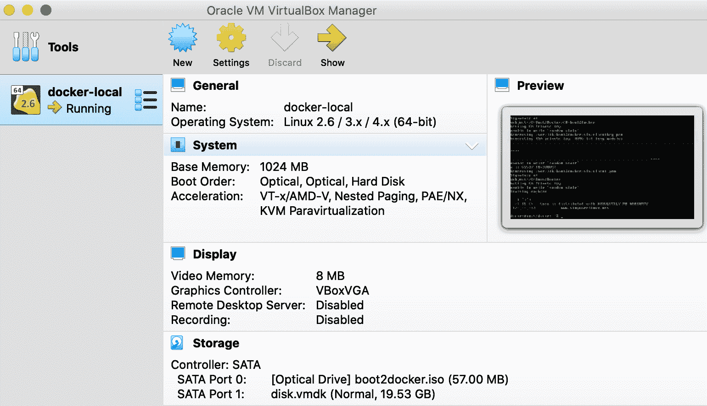
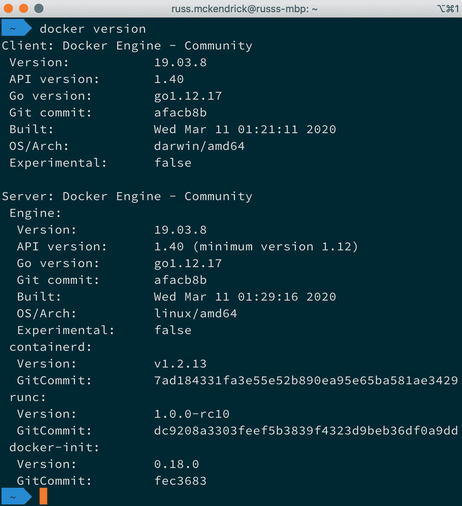
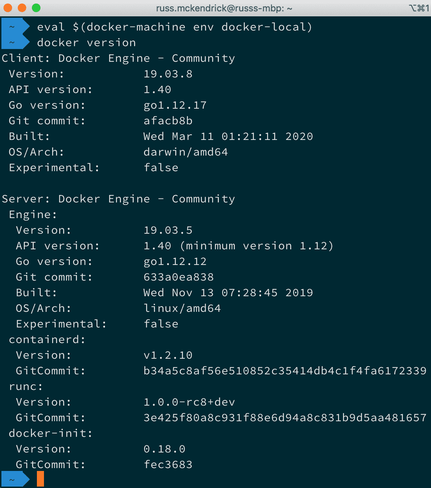
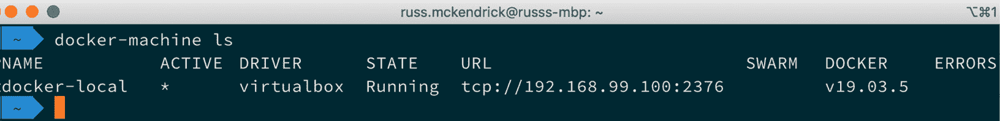
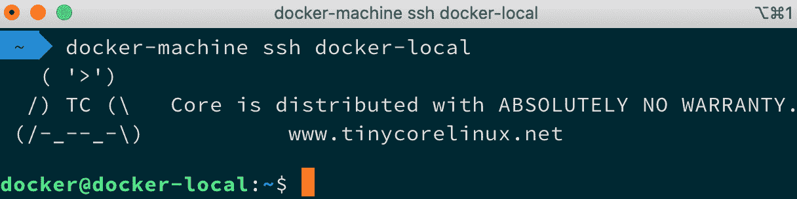
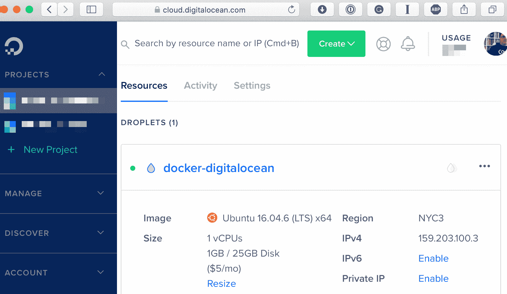
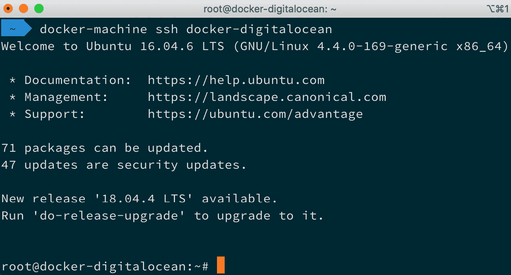
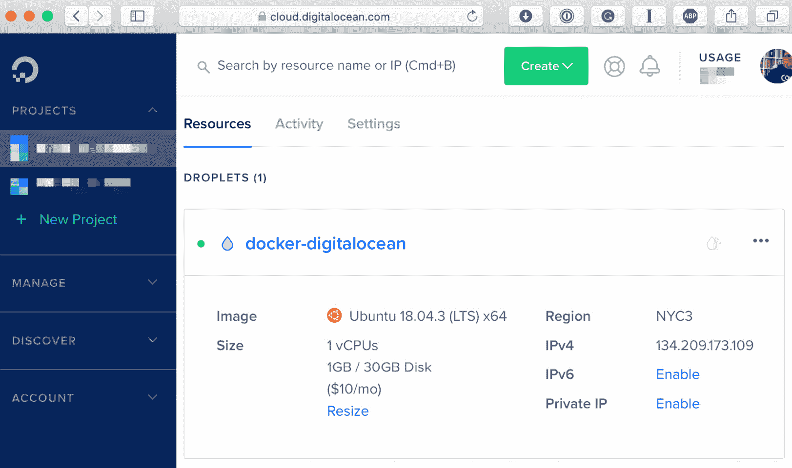
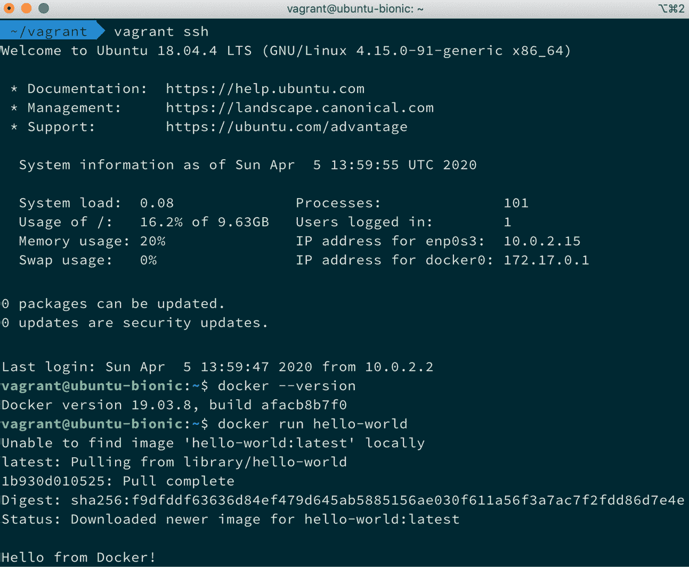
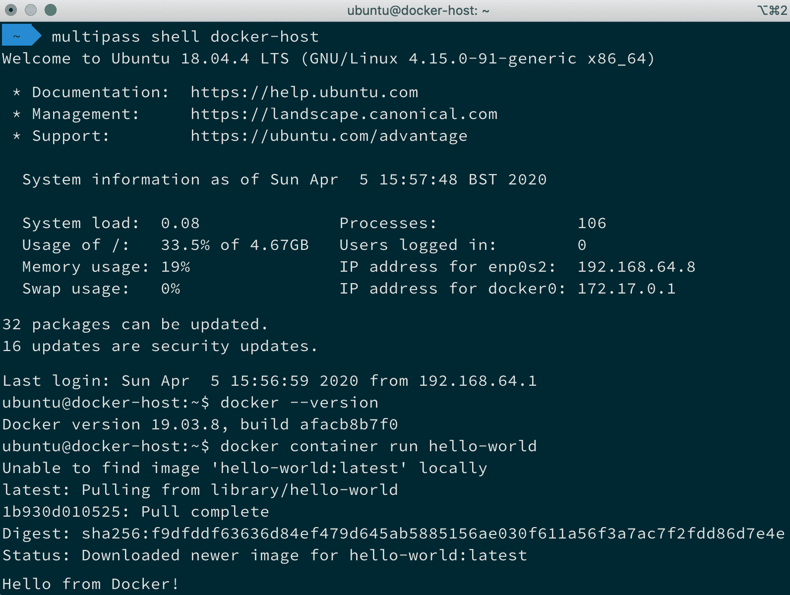

*第六章*

# Docker Machine、Vagrant 和 Multipass

本章中，我们将深入探讨 Docker Machine。它可以用于轻松启动并引导目标平台的 Docker 主机，包括本地或云环境。我们还将讨论 Vagrant 和 Multipass，它们是可以用来启动本地 Docker 主机的替代工具。

让我们来看一下本章将涵盖的内容。我们将探讨以下主题：

+   Docker Machine 简介

+   使用 Docker Machine 部署本地 Docker 主机

+   使用 Docker Machine 在云中启动 Docker 主机

+   使用 Vagrant 和 Multipass 启动本地 Docker 主机

+   介绍并使用 Multipass

# 技术要求

与前几章一样，我们将继续使用本地的 Docker 安装。再次强调，本章中的截图将来自我偏好的操作系统 macOS。我们将查看如何使用 Docker Machine 在本地通过 VirtualBox 以及在公共云中启动基于 Docker 的**虚拟机**（**VMs**），因此如果你想跟着本章的示例操作，你需要一个 DigitalOcean 账户。

如前所述，我们将运行的 Docker 命令将在我们已经安装了 Docker 的所有三大操作系统上有效。然而，一些偶尔使用的支持命令可能仅适用于基于 macOS 和 Linux 的操作系统。

查看以下视频，了解代码如何运行：[`bit.ly/2R6QQmd`](https://bit.ly/2R6QQmd)

# Docker Machine 简介

在我们挽起袖子，深入使用 Docker Machine 之前，应该先花点时间讨论一下它在整个 Docker 生态系统中所占的位置，以及它究竟是什么。

Docker Machine 最大的优势在于，它为多个公共云提供商（如**Amazon Web Services**（**AWS**）、**DigitalOcean**、**Microsoft Azure**和**Google Cloud**）以及自托管的虚拟机/云平台（包括**OpenStack**和**VMware vSphere**）提供了一致的接口，用于快速启动和配置单个 Docker 主机。能够通过单个命令并且最小化用户交互来针对所有这些技术进行操作，节省了大量时间。如果某天你需要快速访问 AWS 中的 Docker 主机，第二天又需要在 DigitalOcean 中访问，你知道你会获得一致的体验。

此外，它还允许你启动本地 Docker 主机，这对于某些操作系统（例如非专业版的 Windows 10）非常有用，因为这些操作系统由于缺乏虚拟化支持，无法原生运行 Docker。

与 Docker Compose 一样，过去它曾与 Docker for Windows 和 Docker for Mac 一起捆绑发布——然而，这一功能已经从最近的版本中去除。这是因为终端用户不再需要启动和管理单独的 Docker 主机。现在，人们更倾向于使用集群技术，如 Docker Swarm 或 Kubernetes，或者使用云服务商的原生 Docker 托管工具，所有这些内容我们将在接下来的章节中详细讨论。

重要提示

本章中我们将讨论的部分工具现在已经被视为遗留工具，并且对它们的支持已经开始逐步取消。之所以提到它们，是因为对于使用旧硬件的用户来说，这可能是他们唯一能体验 Docker 的方式。

我们将从快速讨论其中一个遗留工具开始。

## 使用 Docker Toolbox 安装 Docker Machine

如果您使用的 macOS 或 Windows 版本不支持我们在前几章中使用的 Docker for Windows 和 Docker for Mac 版本，那么您可以下载并安装 Docker Toolbox，它将安装 Docker 客户端、Docker Compose 和 Docker Machine。您可以从 [`github.com/docker/toolbox/`](https://github.com/docker/toolbox/) 下载 Docker Toolbox；但是，如果您已经在运行 Docker，请不要安装它，因为它可能会与您现有的安装产生冲突，进而造成问题。

Docker Toolbox 现在被视为遗留工具，安装的 Docker 及其支持工具的版本已经较旧；因此，我们在这里不会介绍它们的安装。

## 使用命令行安装 Docker Machine

如果您已经在运行 Docker，那么在我们开始使用 Docker Machine 之前，我们需要先安装它。以下是您需要在 macOS 和 Linux 上运行的安装 Docker Machine 的命令，从 macOS 开始：

```
$ base=https://github.com/docker/machine/releases/download/v0.16.2 &&
  curl -L $base/docker-machine-$(uname -s)-$(uname -m) >/usr/local/bin/docker-machine &&
  chmod +x /usr/local/bin/docker-machine
```

对于 Linux，您可以使用类似的命令，如下所示：

```
$ curl -L https://github.com/docker/machine/releases/download/v0.16.2/docker-machine-`uname -s`-`uname -m` >/tmp/docker-machine &&
    chmod +x /tmp/docker-machine &&
    sudo cp /tmp/docker-machine /usr/local/bin/docker-machine
```

对于 Windows，以下命令假设您已安装 Git bash：

```
$ if [[ ! -d '$HOME/bin' ]]; then mkdir -p '$HOME/bin'; fi && \
curl -L https://github.com/docker/machine/releases/download/v0.16.2/docker-machine-Windows-x86_64.exe > '$HOME/bin/docker-machine.exe' && \
chmod +x '$HOME/bin/docker-machine.exe'
```

如您所见，所有三个命令都在从项目的发布页面下载一个可执行文件。为了确保您使用的是最新版本，您可以查看 [`github.com/docker/machine/releases/`](https://github.com/docker/machine/releases/)。

现在我们已经在您选择的操作系统上安装了 Docker Machine，接下来可以开始部署运行 Docker 的虚拟机。

# 使用 Docker Machine 部署本地 Docker 主机

在我们体验云端之前，我们将通过启动 Docker Machine、使用 Oracle VirtualBox 提供虚拟机，来了解 Docker Machine 的基本操作。

重要提示

VirtualBox 是 Oracle 提供的一款免费的虚拟化产品。它允许您在多个平台和**中央处理单元**（**CPU**）类型上安装虚拟机。您可以从[`www.virtualbox.org/wiki/Downloads/`](https://www.virtualbox.org/wiki/Downloads/)下载并安装 VirtualBox。

要启动机器，您只需要运行以下命令：

```
$ docker-machine create --driver virtualbox docker-local
```

这将开始部署过程，在此过程中你将看到 Docker Machine 正在运行的任务列表。为了启动 Docker 主机，Docker Machine 启动的每个主机都会经过相同的步骤。

首先，Docker Machine 会运行一些基本检查，比如确认 VirtualBox 是否安装，并创建证书和目录结构，以便存储所有文件和虚拟机，具体如下：

```
Creating CA: /Users/russ.mckendrick/.docker/machine/certs/ca.pem
Creating client certificate: /Users/russ.mckendrick/.docker/machine/certs/cert.pem
Running pre-create checks...
(docker-local) Image cache directory does not exist, creating it at /Users/russ.mckendrick/.docker/machine/cache...
```

然后，它会检查是否存在将用于虚拟机的镜像。如果镜像不存在，系统将下载该镜像，如以下代码片段所示：

```
(docker-local) No default Boot2Docker ISO found locally, downloading the latest release...
(docker-local) Latest release for github.com/boot2docker/boot2docker is v19.03.5
(docker-local) Downloading /Users/russ.mckendrick/.docker/machine/cache/boot2docker.iso from https://github.com/boot2docker/boot2docker/releases/download/v19.03.5/boot2docker.iso...
(docker-local) 0%....10%....20%....30%....40%....50%....60%....70%....80%....90%....100%
```

一旦检查通过，它会使用所选的驱动程序创建虚拟机，如以下代码片段所示：

```
Creating machine...
(docker-local) Copying /Users/russ.mckendrick/.docker/machine/cache/boot2docker.iso to /Users/russ.mckendrick/.docker/machine/machines/docker-local/boot2docker.iso...
(docker-local) Creating VirtualBox VM...
(docker-local) Creating SSH key...
(docker-local) Starting the VM...
(docker-local) Check network to re-create if needed...
(docker-local) Found a new host-only adapter: 'vboxnet0'
(docker-local) Waiting for an IP...
Waiting for machine to be running, this may take a few minutes...
```

如你所见，Docker Machine 会为虚拟机创建一个独特的**安全外壳** (**SSH**) 密钥。这意味着你将能够通过 SSH 访问虚拟机，稍后会详细说明。一旦虚拟机启动，Docker Machine 将建立与虚拟机的连接，如以下代码片段所示：

```
Detecting operating system of created instance...
Waiting for SSH to be available...
Detecting the provisioner...
Provisioning with boot2docker...
Copying certs to the local machine directory...
Copying certs to the remote machine...
Setting Docker configuration on the remote daemon...
Checking connection to Docker...
```

如你所见，Docker Machine 会检测正在使用的操作系统，并选择适当的引导脚本来部署 Docker。一旦 Docker 安装完成，Docker Machine 会在本地主机和 Docker 主机之间生成并共享证书。然后，它会配置远程 Docker 安装进行证书认证，这意味着你的本地客户端可以连接并与远程 Docker 服务器互动。

一旦 Docker 安装完成，Docker Machine 会在你的本地主机和 Docker 主机之间生成并共享证书。然后，它会配置远程 Docker 安装以进行证书认证，这意味着你的本地客户端可以连接并与远程 Docker 服务器互动。以下代码片段进行了说明：

```
Docker is up and running!
To see how to connect your Docker Client to the Docker Engine running on this VM, run: docker-machine env docker-local
```

最后，它会检查你的本地 Docker 客户端是否能够进行远程连接，并通过给出如何配置本地客户端与新启动的 Docker 主机的指示来完成任务。

如果你打开 VirtualBox，你应该能够看到你的新虚拟机，正如以下截图所示：



图 6.1 – 在 VirtualBox 中运行的 Docker 虚拟机

接下来，我们需要配置本地 Docker 客户端，以连接到新启动的 Docker 主机；正如在启动主机时输出的内容中提到的，运行以下命令将展示如何建立连接：

```
$ docker-machine env docker-local
```

此命令返回以下内容：

```
export DOCKER_TLS_VERIFY='1'
export DOCKER_HOST='tcp://192.168.99.100:2376'
export DOCKER_CERT_PATH='/Users/russ.mckendrick/.docker/machine/machines/docker-local'
export DOCKER_MACHINE_NAME='docker-local'
# Run this command to configure your shell:
# eval $(docker-machine env docker-local)
```

这将覆盖本地 Docker 安装，通过提供新启动的 Docker 主机的 IP 地址和端口号，以及用于认证的证书路径。在输出的最后，它会给你一个命令，供你运行并配置你的终端会话以完成连接。

在我们运行命令之前，先运行 `docker version` 来获取当前设置的信息，如下所示：



图 6.2 – 检查本地安装的 Docker 版本

这基本上是我正在运行的 Docker for Mac 安装。运行以下命令，然后再次运行 `docker version`，应该会显示服务器的一些变化：

```
$ eval $(docker-machine env docker-local)
```

该命令的输出如以下截图所示：



](img/Figure_6.03_B15659.jpg)

图 6.3 – 检查新虚拟机上的 Docker 版本

如你所见，Docker Machine 启动的服务器与我们本地安装的几乎完全一致；事实上，唯一的区别是它的版本稍微落后了一些。如你所见，我的 Docker for Mac 安装中的 Docker Engine 二进制文件正在运行版本 `19.03.8`，而 Docker Machine 启动的主机则运行版本 `19.03.5`。

从这里开始，我们可以像与本地 Docker 安装一样与 Docker 主机进行交互。在我们继续启动云中的 Docker 主机之前，还有一些其他基本的 Docker Machine 命令需要了解。

第一个命令列出当前配置的 Docker 主机，显示如下：

```
$ docker-machine ls
```

命令的输出如下所示：



](img/Figure_6.04_B15659.jpg)

图 6.4 – 列出虚拟机

如你所见，它列出了机器名称、使用的驱动程序、Docker 端点**统一资源定位符**（**URL**），以及主机正在运行的 Docker 版本。

你还会注意到 `ACTIVE` 列中有一个 `*`，这表示你的本地客户端当前配置与哪个 Docker 主机进行交互。你也可以通过运行 `docker-machine active` 来查看当前活动的机器。

下一个命令使用 SSH 连接到 Docker 主机，如下所示：

```
$ docker-machine ssh docker-local
```

命令的输出如下所示：



](img/Figure_6.05_B15659.jpg)

图 6.5 – 使用 SSH 连接到虚拟机

如果你需要安装额外的软件或配置 Docker Machine 之外的内容，这一点非常有用。如果你需要查看日志等信息，它也很有用。你可以通过运行 `exit` 退出远程 shell。在返回本地机器后，你可以通过运行以下命令找到 Docker 主机的 IP 地址：

```
$ docker-machine ip docker-local
```

在本章中，我们会经常使用此命令作为其他命令的一部分来获取虚拟机的 IP 地址。还有一些命令可以获取有关 Docker 主机的更多详细信息，以下代码片段中展示了这些命令：

```
$ docker-machine inspect docker-local
$ docker-machine config docker-local
$ docker-machine status docker-local
$ docker-machine url docker-local
```

最后，还有一些命令可以停止、启动、重启和删除 Docker 主机。使用以下代码片段中的最后一个命令来删除你本地启动的主机：

```
$ docker-machine stop docker-local
$ docker-machine start docker-local
$ docker-machine restart docker-local
$ docker-machine rm docker-local
```

运行 `docker-machine rm` 命令时，会提示你确认是否真的要删除该实例，如下所示：

```
About to remove docker-local
WARNING: This action will delete both local reference and remote instance.
Are you sure? (y/n): y
Successfully removed docker-local
```

现在我们已经快速了解了基础知识，让我们尝试一些更具冒险性的操作。

# 使用 Docker Machine 启动云中的 Docker 主机

在这一节中，我们将仅查看 Docker Machine 支持的一个公共云驱动程序。如前所述，Docker Machine 提供了许多驱动程序，但其吸引力之一是它提供一致的体验，因此驱动程序之间的差异不大。

我们将使用 Docker Machine 在**DigitalOcean**上启动一个 Docker 主机。为此，我们需要一个具有必要权限的**应用程序编程接口**（**API**）访问令牌，以便访问并启动 DigitalOcean 账户中的资源。这里不解释如何生成一个，你可以按照[`www.digitalocean.com/help/api/`](https://www.digitalocean.com/help/api/)中的说明进行操作。

重要提示

使用 API 令牌启动 Docker 主机会产生费用；确保跟踪你启动的 Docker 主机。有关 DigitalOcean 定价的详细信息，请参阅[`www.digitalocean.com/pricing/`](https://www.digitalocean.com/pricing/)。此外，保持你的 API 令牌的机密性，因为它可能会被用来未经授权访问你的账户。本章中使用的所有令牌已被撤销。

我们要做的第一件事是将我们的令牌设置为环境变量，这样就不必每次都使用它了。为此，运行以下命令：

```
$ DOTOKEN=191e004d9a58b964198ab1e8253fc2de367a70fceb9847b7fd44ebf 
```

确保将 API 令牌替换为你自己的。

重要提示

由于我们需要传递给`docker-machine`命令的附加标志，我将使用`/`将命令分成多行，以提高可读性。

启动 Docker 主机的命令如下：

```
$ docker-machine create \
     --driver digitalocean \
     --digitalocean-access-token $DOTOKEN \
     docker-digitalocean
```

由于 Docker 主机是远程机器，启动、配置并使其可访问需要一些时间。从以下输出可以看到，Docker Machine 启动 Docker 主机的方式也发生了一些变化：

```
Running pre-create checks...
Creating machine...
(docker-digitalocean) Creating SSH key...
(docker-digitalocean) Creating Digital Ocean droplet...
(docker-digitalocean) Waiting for IP address to be assigned to the Droplet...
Waiting for machine to be running, this may take a few minutes...
Detecting operating system of created instance...
Waiting for SSH to be available...
Detecting the provisioner...
Provisioning with ubuntu(systemd)...
Installing Docker...
Copying certs to the local machine directory...
Copying certs to the remote machine...
Setting Docker configuration on the remote daemon...
Checking connection to Docker...
Docker is up and running!
To see how to connect your Docker Client to the Docker Engine running on this VM, run: docker-machine env docker-digitalocean
```

启动后，你应该能够在 DigitalOcean 控制面板中看到 Docker 主机，如下图所示：



图 6.6 – 在 DigitalOcean 门户中查看 Droplet

通过运行以下命令，重新配置本地客户端以连接到远程主机：

```
$ eval $(docker-machine env docker-digitalocean)
```

你还可以运行`docker version`和`docker-machine inspect docker-digitalocean`以获取关于 Docker 主机的更多信息。

最后，运行`docker-machine ssh docker-digitalocean`将通过 SSH 连接到主机。从以下输出以及你首次启动 Docker 主机时的输出可以看到，所使用的操作系统有所不同：



图 6.7 – SSH 连接到我们的 DigitalOcean 机器

你可以通过运行`exit`退出远程 shell。正如你所看到的，我们不需要告诉 Docker Machine 使用哪个操作系统、Docker 主机的大小，甚至也不需要指定在哪里启动它。这是因为每个驱动程序都有一些相当合理的默认设置。

将这些默认值添加到我们的命令中，命令看起来如下：

```
docker-machine create \
     --driver digitalocean \
     --digitalocean-access-token $DOTOKEN \
     --digitalocean-image ubuntu-16-04-x64 \
     --digitalocean-region nyc3 \
     --digitalocean-size 512mb \
     --digitalocean-ipv6 \
     --digitalocean-backups \
     --digitalocean-ssh-user root \
     --digitalocean-ssh-port 22 \
     docker-digitalocean
```

正如你所看到的，你可以自定义 Docker 主机的大小、区域和操作系统，甚至是网络。

重要说明

如果你已经启动了一个 droplet，接下来的代码片段中的命令将会报错。

假设我们想要更改操作系统和 droplet 的大小。在这种情况下，我们可以运行以下命令：

```
$ docker-machine create \
      --driver digitalocean \
      --digitalocean-access-token $DOTOKEN \
      --digitalocean-image ubuntu-18-04-x64 \
      --digitalocean-size 1gb \
      docker-digitalocean
```

正如你在 **DigitalOcean** 控制面板中看到的，这将启动一个类似以下的机器：



图 6.8 – 查看具有不同规格的 droplet

你可以通过运行以下命令来移除 DigitalOcean Docker 主机：

```
$ docker-machine rm docker-digitalocean
```

移除主机需要一两分钟时间。

重要说明

请在 DigitalOcean 控制面板中仔细检查，确保你的主机已正确终止；否则，可能会产生意外费用。

这就是我们对 Docker Machine 的介绍。在我们继续之前，让我们讨论一下它的安全性。

## Docker Machine 概述

如前所述，Docker Machine 现在被视为一个遗留工具。除了前面提到的原因——人们不再想要启动单个 Docker 主机之外，还有一些其他原因导致了方向的变化。

最重要的是安全性。正如你可能注意到的，当 Docker Machine 启动我们的 Docker 主机时，它不仅生成了一个 SSH 密钥，还生成了证书，并用这些证书配置了 Docker 服务器组件，这意味着我们的本地 Docker 客户端可以与主机交互。现在，对于本地主机来说这并不成问题；然而，在 DigitalOcean 托管的实例上，我们将 Docker 服务器暴露在互联网上。

尽管它已经被安全配置，但如果安装的 Docker 版本出现零日漏洞，我们可能会遇到一些问题，因为不受信任的第三方可能会接管我们的 Docker 安装。因此，我建议只使用 Docker Machine 快速启动一个实例，测试某些内容，然后再关闭实例。

我们将在*第十章*《在公共云中运行 Docker》和*第十三章*《在公共云中运行 Kubernetes》中，探讨一些更好的在云上运行容器化应用程序的选项。

现在，让我们看一下使用 Docker Machine 启动本地 Docker 主机的几个替代方案。

使用 Vagrant 和 Multipass 启动本地 Docker 主机

在我们完成本章之前，我们将介绍两种不同的工具，这些工具可以用来本地启动一台机器，然后为你在后续章节中实验配置一个本地的 Docker 主机。

## 介绍和使用 Vagrant

Vagrant 是**HashiCorp**出品的宿主机管理工具的鼻祖。它最早发布于 2010 年初，最初作为**Mitchell Hashimoto**的一个副项目，如今已经成为现代软件开发中一个非常重要的工具，允许开发者快速轻松地启动和移除本地虚拟机，作为开发环境使用。2014 年 5 月，Vagrant 1.6 版本发布，新增了对 Docker 的支持。

安装过程根据操作系统的不同有所差异。如果你使用的是 macOS，可以通过 Homebrew 和 Cask 来安装。使用这些工具的命令如下所示：

```
$ brew cask install vagrant
```

[Windows 和 Linux 用户可以下载](https://www.vagrantup.com/downloads.html)安装程序，下载链接为[`www.vagrantup.com/downloads.html`](https://www.vagrantup.com/downloads.html)。在这里，你可以找到适合你操作系统的 32 位和 64 位`MSI`、`deb`和`RPM`安装包，也可以选择 64 位的静态二进制文件，适用于 macOS 和 Linux，如果你不想使用包管理器的话。

Vagrant 使用`Vagrantfile`，它定义了虚拟机的配置；机器本身被打包成一种叫做 Vagrant Box 的格式——一个包含机器镜像的盒子；此外，还包括启动宿主机所需的元数据，这些宿主机可以是 VirtualBox、VMWare 或任何其他支持的虚拟化工具或云服务。Vagrant Box 通常从 Vagrant Cloud 下载，并由另一个 HashiCorp 产品**Packer**创建。

要创建一个`Vagrantfile`，你只需在你想存储 Vagrant Box 相关文件的文件夹中运行以下命令：

```
$ vagrant init ubuntu/bionic64
```

默认的`Vagrantfile`注释非常多；不过，大部分选项都被注释掉了。去掉这些注释后，Vagrantfile 应该看起来像下面这样：

```
Vagrant.configure('2') do |config|
  config.vm.box = 'ubuntu/bionic64'
end
```

如你所见，这个过程其实并不复杂，也与 Docker 没有太多关系。那么我们来修正一下。更新`Vagrantfile`，使其如下所示：

```
Vagrant.configure('2') do |config|
  config.vm.box = 'ubuntu/bionic64'
  config.vm.provision :docker
end
```

更新完成后，运行以下命令并等待：

```
$ vagrant up
```

如果你还没有下载`ubuntu/bionic64`盒子，Vagrant 会自动为你下载。下载完成后，它会在 VirtualBox 中启动一个虚拟机，这是 Vagrant 的默认提供者。你应该会看到如下输出：

```
Bringing machine 'default' up with 'virtualbox' provider...
==> default: Importing base box 'ubuntu/bionic64'...
==> default: Matching MAC address for NAT networking...
==> default: Checking if box 'ubuntu/bionic64' version '20200402.0.0' is up to date...
==> default: Setting the name of the VM: vagrant_default_1586094728360_48806
==> default: Clearing any previously set network interfaces...
==> default: Preparing network interfaces based on configuration...
    default: Adapter 1: nat
==> default: Forwarding ports...
    default: 22 (guest) => 2222 (host) (adapter 1)
==> default: Running 'pre-boot' VM customizations...
==> default: Booting VM...
```

一旦虚拟机启动，Vagrant 将通过 SSH 连接到机器，并用一个更安全的自生成密钥文件替换默认的 Vagrant 密钥文件，具体过程如下所示：

```
==> default: Waiting for machine to boot. This may take a few minutes...
    default: SSH address: 127.0.0.1:2222
    default: SSH username: vagrant
    default: SSH auth method: private key
    default:
    default: Vagrant insecure key detected. Vagrant will automatically replace
    default: this with a newly generated keypair for better security.
    default:
    default: Inserting generated public key within guest...
    default: Removing insecure key from the guest if it's present...
    default: Key inserted! Disconnecting and reconnecting using new SSH key...
==> default: Machine booted and ready!
```

现在 SSH 密钥已经安全，Vagrant 会检查虚拟机是否安装了 VirtualBox 来宾附加工具。这些工具允许虚拟机共享你本地机器的文件系统。这个过程如下所示：

```
==> default: Checking for guest additions in VM...
    default: The guest additions on this VM do not match the installed version of
    default: VirtualBox! In most cases this is fine, but in rare cases it can
    default: prevent things such as shared folders from working properly. If you see
    default: shared folder errors, please make sure the guest additions within the
    default: VM match the version of VirtualBox you have installed on
    default: your host and reload your VM.
    default:
    default: Guest Additions Version: 5.2.34
    default: VirtualBox Version: 6.1
==> default: Mounting shared folders...
    default: /vagrant => /Users/russ.mckendrick/vagrant
```

最后一步是运行我们在`Vagrantfile`中添加的配置工具，具体如下：

```
==> default: Running provisioner: docker...
    default: Installing Docker onto machine...
```

现在，我们已经有了一个安装了 Docker 的 Ubuntu 18.04（Bionic Beaver）虚拟机。要访问虚拟机，只需运行以下命令：

```
$ vagrant ssh
```

这将打开一个 SSH 会话到虚拟机。从这里，你可以像在本地运行 Docker 时一样使用它。以下是终端输出示例：



图 6.9 – 登录到我们的 Vagrant Box 并与 Docker 交互

完成虚拟机操作后，输入`exit`返回到主机机器的命令提示符，然后运行以下命令终止虚拟机：

```
$ vagrant destroy
```

这将删除与虚拟机关联的所有资源。你将看到以下消息：

```
    default: Are you sure you want to destroy the 'default' VM? [y/N] y
==> default: Forcing shutdown of VM...
==> default: Destroying VM and associated drives...
```

如果你只是希望停止虚拟机，可以使用以下命令停止和启动它：

```
$ vagrant stop
$ vagrant up
```

现在我们已经学习了如何使用 Vagrant 创建虚拟机并配置 Docker，让我们看看一个名为**Multipass**的替代方案。

# 介绍并使用 Multipass

**Multipass**是*Canonical*（Ubuntu 的开发者）提供的一款工具，用于快速启动和管理本地多个 Ubuntu 虚拟机。它与 Vagrant 的工作方式略有不同，默认情况下，它会使用操作系统的默认虚拟化程序，而不是 VirtualBox。当操作系统没有可用的虚拟化程序时，例如在非专业版 Windows 10 中，它可以回退使用 VirtualBox——稍后我们会详细说明。

要在 macOS 上安装 Multipass，可以运行以下命令，这同样使用 Homebrew 和 Cask：

```
$ brew cask install multipass
```

要在现有的 Ubuntu 桌面上安装，可以使用 Snap 包管理器，运行以下命令：

```
$ snap install multipass --classic
```

最后，若要在 Windows 上安装，你可以从 GitHub 项目的发布页面下载安装程序，在那里你还可以找到 macOS 安装程序，地址为[`github.com/canonical/multipass/releases`](https://github.com/canonical/multipass/releases)。

一旦安装完成，如果你需要在本地机器的默认虚拟化程序上使用 VirtualBox，可以运行以下命令：

```
$ multipass set local.driver=virtualbox
```

现在我们已经安装了 Multipass，并且——如果需要——配置为使用 VirtualBox，我们可以启动虚拟机并安装 Docker。要启动虚拟机，只需运行以下命令：

```
$ multipass launch --name docker-host
```

一旦启动，我们可以运行以下命令，将 Docker 引导到新创建的虚拟机上：

```
$ multipass exec docker-host -- /bin/bash -c 'curl -s https://get.docker.com | sh - && sudo usermod -aG docker ubuntu'
```

这将下载并安装 Docker 的最新社区版本。安装完成后，它将把`ubuntu`用户添加到`docker`组，这意味着连接到虚拟机后，我们将能立即使用 Docker。你将看到执行安装时的命令输出，安装完成后，你将返回到本地机器的 shell。

要连接到虚拟机，请运行以下命令：

```
$ multipass shell docker-host
```

一旦连接，你会注意到默认情况下，和我们的 Vagrant 虚拟机一样，Multipass 已下载并启动了`Ubuntu 18.04`（Bionic Beaver）虚拟机。登录后，你将能够像预期的那样运行 Docker 命令。以下截图展示了这个过程：



图 6.10 – 通过 SSH 连接到我们的 Multipass 虚拟机并与 Docker 交互

与 Vagrant 一样，完成后输入 `exit`，你将返回到本地计算机的 shell。要删除 `docker-host` 虚拟机及其所有资源，可以运行以下命令：

```
$ multipass delete docker-host --purge 
```

如果你想停止和启动虚拟机，可以使用以下命令：

```
$ multipass stop docker-host
$ multipass start docker-host
```

如你所见，使用 Multipass 是一个简单便捷的方式，可以在任何主机上本地启动和与 Ubuntu 虚拟机进行交互。

# 小结

在本章中，我们学习了如何使用 Docker Machine 在 VirtualBox 上本地创建 Docker 主机，并回顾了可以用来与 Docker Machine 启动的 Docker 主机交互和管理的命令。然后，我们了解了如何使用 Docker Machine 将 Docker 主机部署到云环境——具体来说是 **DigitalOcean**。

我们还讨论了为什么根据主机机器的年龄，使用 Docker Machine 可能不是一个好主意。因此，我们还讨论了如何使用 **Vagrant** 和 **Multipass** 启动和配置本地 Docker 主机。

在后续章节中，我们将不再仅与单一 Docker 主机交互，而是启动和运行多个 Docker 主机。然而，在此之前，我们将从 Linux 基础的容器转向 Windows 容器，并在下一章进行简要介绍。如果你没有 Windows 主机也不用担心，因为我们将使用 Vagrant 启动一个。

# 问题

1.  在运行 `docker-machine create` 时，哪个标志可以让你定义 Docker Machine 用来启动 Docker 主机的服务或提供者？

1.  对错题：运行 `docker-machine env my-host` 会重新配置本地 Docker 客户端，以便与 `my-host` 进行交互。

1.  对错题：Multipass 开箱即用地支持 Docker。

1.  请列出可以用于创建 Vagrant Boxes 的 HashiCorp 工具。

1.  解释为什么使用 Docker Machine 在云中创建 Docker 主机不再被视为最佳实践。

# 进一步阅读

有关我们在本章中使用和提到的各种工具的信息，请参见以下链接：

+   Homebrew: [`brew.sh`](https://brew.sh)

+   Cask: [`github.com/Homebrew/homebrew-cask`](https://github.com/Homebrew/homebrew-cask)

+   Git BASH for Windows: [`gitforwindows.org`](https://gitforwindows.org)

+   VirtualBox: [`www.virtualbox.org`](https://www.virtualbox.org)

+   Docker Machine: [`docs.docker.com/machine/`](https://docs.docker.com/machine/)

+   Docker Toolbox: [`docs.docker.com/toolbox/overview/`](https://docs.docker.com/toolbox/overview/)

+   DigitalOcean: [`www.digitalocean.com/`](https://www.digitalocean.com/)

+   Vagrant: [`www.vagrantup.com`](https://www.vagrantup.com)

+   Vagrant Cloud: [`app.vagrantup.com/boxes/search`](https://app.vagrantup.com/boxes/search)

+   Packer: [`packer.io`](https://packer.io)

+   HashiCorp: [`www.hashicorp.com`](https://www.hashicorp.com)

+   Multipass: [`multipass.run`](https://multipass.run)

+   Snap: [`snapcraft.io`](https://snapcraft.io)

+   Canonical: [`canonical.com`](https://canonical.com)

# **第二节**：集群与云

在这一节中，我们将应用第一部分所学的内容，聚焦于两种主要的 Docker 集群技术——Docker Swarm 和 Kubernetes，并探讨在公共云上运行容器。

本节包括以下章节：

*第七章*，*从 Linux 迁移到 Windows 容器*

*第八章*，*使用 Docker Swarm 进行集群管理*

*第九章*，*Portainer – Docker 的图形界面*

*第十章*，*在公共云中运行 Docker*

*第十一章*，*使用 Docker 和 Kubernetes 进行集群管理*

*第十二章*，*探索其他 Kubernetes 选项*

*第十三章*，*在公共云中运行 Kubernetes*
