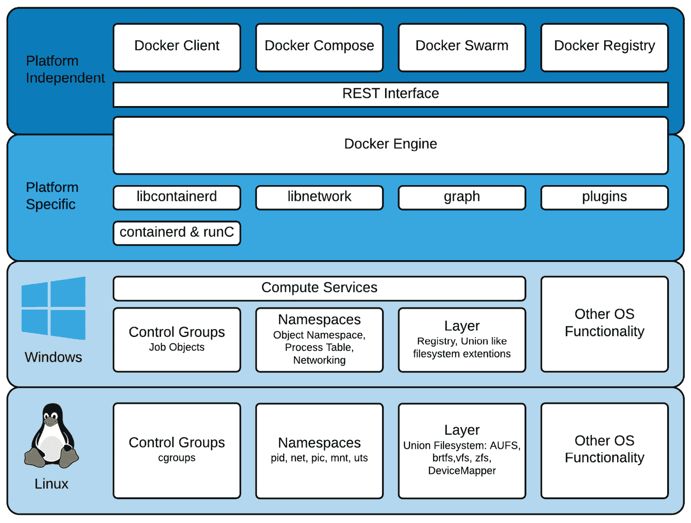
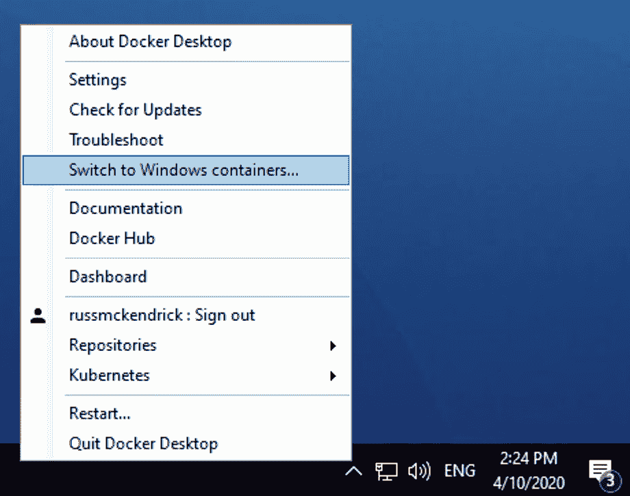
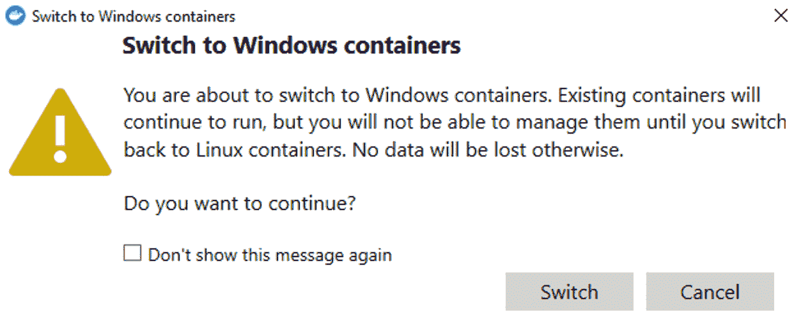
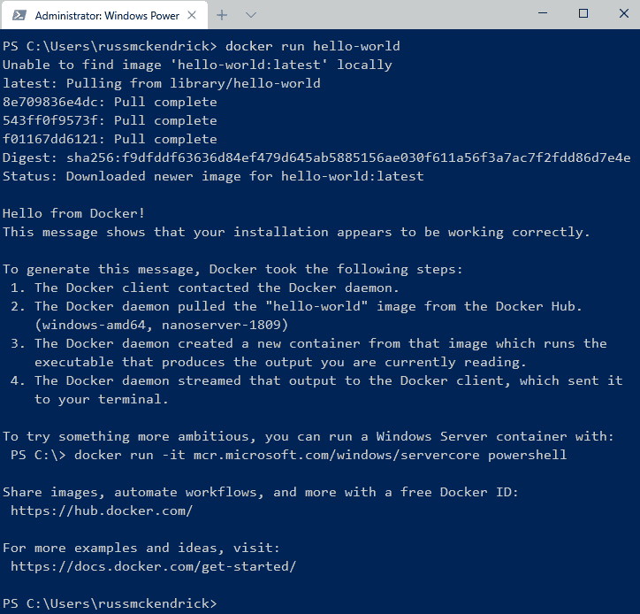
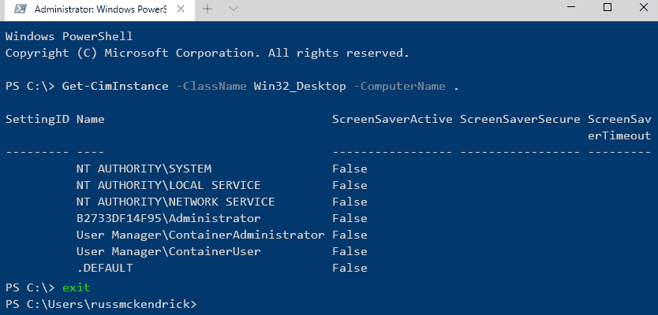
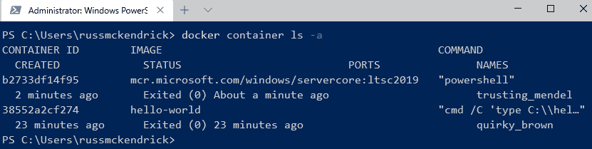
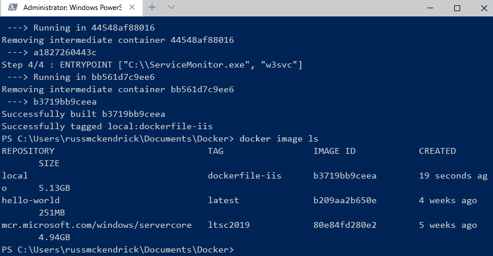
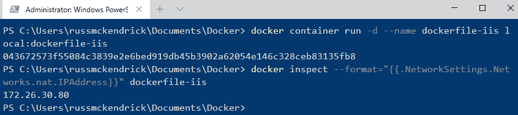
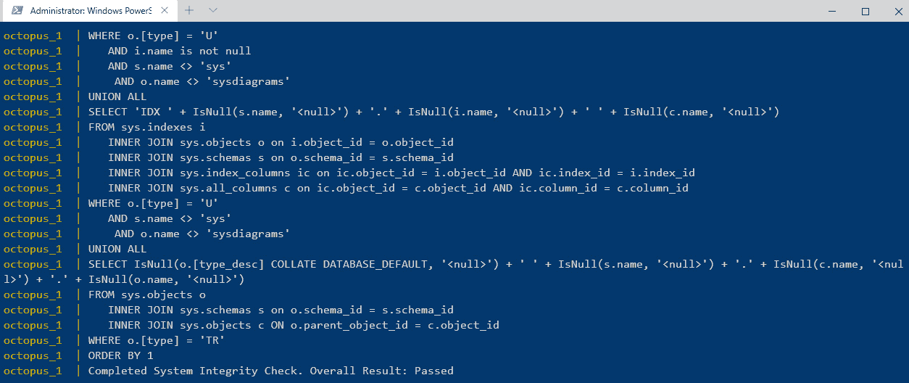
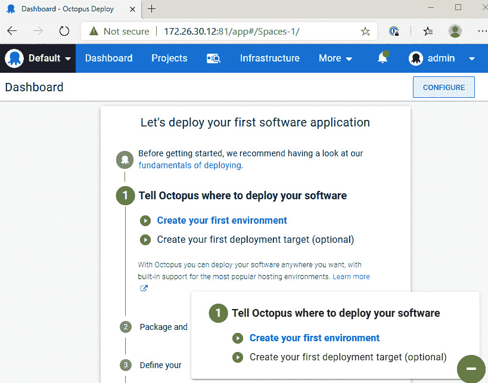

*第七章*

# 从 Linux 转向 Windows 容器

在本章中，我们将讨论并深入了解 Windows 容器。微软已经将容器作为在新硬件上部署旧应用程序的一种方式。与 Linux 容器不同，Windows 容器仅在基于 Windows 的 Docker 主机上可用。

我们将涵盖以下主题：

+   Windows 容器简介

+   为 Windows 容器设置 Docker 主机

+   运行 Windows 容器

+   一个 Windows 容器 Dockerfile

+   Windows 容器与 Docker Compose

# 技术要求

在本章中，我们将启动的容器只适用于 Windows Docker 主机。我们将使用 macOS 和 Linux 基础的机器上的 VirtualBox 和 Vagrant 来帮助启动和运行 Windows Docker 主机。

请查看以下视频，了解代码如何运行：[`bit.ly/2DEwopT`](https://bit.ly/2DEwopT)

Windows 容器简介

作为一个过去 20 年几乎每天都在使用 macOS 和 Linux 电脑及笔记本电脑，并且常常与 Linux 服务器打交道的人，再加上我唯一的 Windows 操作系统经验仅限于我拥有的 Windows XP 和 Windows 10 游戏电脑（以及工作中不得不面对的偶尔 Windows 服务器），Windows 容器的出现是一个有趣的发展。

现在，我从来不会把自己归类为 Linux/Unix 的死忠粉；然而，微软近年来的举动甚至让我感到惊讶。早在 2014 年，在其中一次 Azure 活动上，微软宣布了“Microsoft Linux”，从那以后就再也没有回头过。

自微软宣布对 Linux 表示喜爱以来，出现了一些显著的新闻：

+   Linux 是 Microsoft Azure 中的第一等公民。

+   .NET Core 是跨平台的，这意味着你可以在 Linux、macOS 和 Windows 上运行 .NET 应用程序。

+   SQL Server 已经在 Linux 上提供服务几年了。

+   你可以在 Windows 10 专业版机器上运行 Linux shell，如 Ubuntu。

+   PowerShell 已经被移植到 Linux 和 macOS。

+   它开发了跨平台工具，比如 Visual Studio Code，并将其开源。

+   它以 75 亿美元收购了 GitHub！！

很明显，曾经的微软（前 **首席执行官** (**CEO**) Steve Ballmer 曾因公开抨击开源和 Linux 社区而著名）已经不复存在。

因此，2014 年 10 月，微软宣布与 Docker 合作推动容器在 Windows 操作系统（如 Windows 10 专业版和 Windows Server 2016）上的采用，这一消息并不令人惊讶，特别是在微软公开表示对 Linux 表示喜爱几个月之后。

那么，Windows 容器到底是什么呢？

从表面上看，它们与 Linux 容器没有什么不同。微软在 Windows 内核上的工作引入了与 Linux 相同的进程隔离。而且，像 Linux 容器一样，这种隔离也扩展到沙箱文件系统，甚至是 Windows 注册表。

由于每个容器实际上是一个全新的 Windows Core 或 Windows Nano 安装，它们本身是精简版的 Windows Server 镜像（可以理解为 Windows 版的 Alpine Linux），安装管理员可以在同一主机上运行多个 docker 化的应用程序，而不必担心自定义注册表更改或要求冲突导致的问题。

加上 Docker 命令行客户端所提供的相同易用性，管理员就有了一种将遗留应用程序迁移到更现代硬件并托管操作系统的方式，而且不需要担心和管理多个运行较旧、不再受支持的 Windows 版本的**虚拟机**（**VM**）的额外负担。

Windows 容器还提供了另一层隔离。**Hyper-V 隔离**在容器启动时，将容器进程运行在一个最小化的虚拟机监控程序（hypervisor）中，这进一步将容器进程与主机机器隔离。然而，每个使用 Hyper-V 隔离运行的容器都需要额外的资源，并且这些容器的启动时间也会增加，因为在容器启动之前需要先启动虚拟机监控程序。

虽然 Hyper-V 隔离确实使用了微软的虚拟机监控程序（它可以在 Windows Server、桌面版和 Xbox One 系统软件中找到），但你无法使用标准的 Hyper-V 管理工具来管理 Hyper-V 隔离的容器。你必须使用 Docker。

毕竟，微软在启用 Windows 内核中的容器功能方面付出了大量的工作和努力，为什么他们会选择 Docker，而不是仅仅创建自己的容器管理工具呢？

Docker 已经凭借一组经过验证的**应用程序编程接口**（**API**）和庞大的社区，确立了其作为管理容器的首选工具的地位。同时，Docker 还是一个开源应用程序，这意味着微软不仅可以将其适配到 Windows 上，还可以为其开发做出贡献。

下图概述了 Docker 在 Windows 上的工作原理：



图 7.1 – Docker 在 Windows 上的概述

注意我说的是 Docker *在* Windows 上，而不是 Docker *为* Windows；它们是完全不同的产品。Docker 在 Windows 上是与 Windows 内核交互以提供 Windows 容器的 Docker 引擎和客户端的本地版本。而 Docker 为 Windows 提供的是一种尽可能原生的体验，允许开发者在桌面上同时运行 Linux 和 Windows 容器。

现在，让我们来看看如何准备主机，以便我们可以运行 Windows 容器。

# 为 Windows 容器设置 Docker 主机

如您所料，您将需要访问运行 Docker 的 Windows 主机。如果您没有运行 Windows 10 专业版机器，别担心；您也可以在 macOS 和 Linux 上实现这一目标。在我们讨论这些方法之前，先看看如何在 Windows 10 专业版上使用 Docker for Windows 启动 Windows 容器。

## 启用 Windows 容器支持（Windows 10 专业版）

Windows 10 专业版开箱即用支持 Windows 容器。然而，默认情况下，它配置为运行 Linux 容器。要从运行 Linux 容器切换到 Windows 容器，请右键点击系统托盘中的**Docker**图标，并从菜单中选择**切换到 Windows 容器…**，如下图所示：



图 7.2 – 切换到 Windows 容器

这将弹出以下提示：



图 7.3 – 关于 Linux 容器的一个重要说明

点击**切换**按钮，几秒钟后，您将开始管理 Windows 容器。您可以通过在主机上打开命令提示符并运行以下命令来查看：

```
$ docker version
```

从以下输出可以看到这一点：


图 7.4 – 检查运行 `docker version` 输出

Docker 引擎的版本为 `OS/Arch of windows/amd64`，而不是我们之前习惯看到的 `linux/amd64` 版本。所以，这涵盖了 Windows 10 专业版。那么像我这样喜欢 macOS 或 Linux 的人怎么办呢？

## 在 MacOS 和 Linux 上开始运行

要在 macOS 和 Linux 机器上访问 Windows 容器，我们将使用 Stefan Scherer 汇总的优秀资源。在本书附带的仓库的 `chapter07` 文件夹中，有一个 Stefan 的 `docker-windows-box` 仓库的分支版本作为 Git 子模块，其中包含所有您需要的文件，可以帮助您在 macOS 上启动并运行 Windows 容器。

要查看这个分支版本，您需要在仓库文件夹内运行以下命令：

```
$ git submodule update --init --recursive
```

最后，在我们开始启动虚拟机之前，您将需要以下工具：HashiCorp 的 Vagrant 和 Oracle 的 VirtualBox，我们在上一章中已经讲解过。

但是，我们确实需要安装一个`vagrant`插件。为此，请运行以下命令：

```
$ vagrant plugin install vagrant-reload
```

插件安装完成后，我们可以通过打开终端，进入`chapter07/docker-machine`仓库文件夹，并运行以下命令来开始在 Windows 上使用 Docker：

```
$ vagrant up
```

这将下载一个 VirtualBox Windows Server 2019 `Core Eval` 镜像，其中包含启动并运行 Windows 容器所需的一切。下载文件大约有 6 **GB**，所以请确保你有足够的带宽和磁盘空间来运行该镜像。

Vagrant 将启动镜像并配置虚拟机上的 Docker，同时还会设置一些其他合理的默认值，例如 Atom **集成开发环境**（**IDE**）、Docker Compose、Docker Machine 和 Git。一旦虚拟机启动，打开你首选的 Microsoft **远程桌面协议**（**RDP**）客户端，然后运行以下命令：

```
$ vagrant rdp
```

如果提示输入密码，请输入 `vagrant`，你将登录到新启动的 Windows 2019 Server 环境，并且已安装并准备好运行 Docker for Windows 所需的所有工具。

此外，如果你不想在本地运行某些东西，可以在 Azure 中运行一个 Windows 10 专业版实例，它已启用所有必要的组件来支持 Docker for Windows，这正如上一节所讨论的那样，它允许你运行 Windows 容器，接下来我们将讨论这个问题。

# 运行 Windows 容器

正如本章第一部分已经暗示的那样，使用 Docker 命令行客户端启动和与 Windows 容器交互，与我们之前所做的操作没有区别。让我们通过运行 `hello-world` 容器来测试一下，如下所示：

```
$ docker container run hello-world
```

就像之前一样，这将下载 `hello-world` 容器并返回一条消息，如下所示的屏幕截图所示：



图 7.5 – 运行基于 Windows 的 hello-world 容器

这次唯一的区别是，Docker 拉取的不是 Linux 镜像，而是基于 `nanoserver-sac2016` 镜像的 `windows-amd64` 版本。

现在，让我们看一下如何在前台运行一个容器，这次运行 PowerShell，如下所示：

```
$ docker pull mcr.microsoft.com/windows/servercore
$ docker container run -it mcr.microsoft.com/windows/servercore:ltsc2019 powershell
```

一旦你的 shell 启动，运行以下命令将显示计算机名称，即容器 ID：

```
$ Get-CimInstance -ClassName Win32_Desktop -ComputerName .
```

你可以在以下屏幕截图中看到前面命令的完整终端输出：



图 7.6 – 在容器中运行 PowerShell

一旦你通过运行 `exit` 退出 PowerShell，你可以通过运行以下命令来查看容器 ID：

```
$ docker container ls -a
```

你可以在以下屏幕截图中看到预期的输出：



图 7.7 – 检查容器

现在，让我们来看一下构建一个比运行 PowerShell 更具冒险性的镜像——我们来安装一个 web 服务器。

# 一个 Windows 容器 Dockerfile

Windows 容器镜像使用与 Linux 容器相同格式的 Dockerfile 命令。以下 Dockerfile 将在容器中下载、安装并启用 **Internet Information Services** (**IIS**) Web 服务器：

```
# escape=`
FROM mcr.microsoft.com/windows/servercore:ltsc2019
RUN powershell -Command `
    Add-WindowsFeature Web-Server; `
    Invoke-WebRequest -UseBasicParsing -Uri “https://dotnetbinaries.blob.core.windows.net/servicemonitor/2.0.1.10/ServiceMonitor.exe” -OutFile “C:\ServiceMonitor.exe”
EXPOSE 80
ENTRYPOINT [“C:\\ServiceMonitor.exe”, “w3svc”]
```

你可以使用以下命令来构建镜像：

```
$ docker image build --tag local:dockerfile-iis .
```

构建完成后，运行 `docker image ls` 应该会显示以下内容：



](img/image_00_0081.jpg)

图 7.8 – 构建并列出我们的镜像

关于 Windows 容器镜像，你首先会注意到的是它们非常大。使用以下命令运行容器将启动 IIS 镜像：

```
$ docker container run -d --name dockerfile-iis local:dockerfile-iis
```

你可以通过打开浏览器来查看新启动的容器。不过，直接访问 `http://localhost:8080/` 是无法工作的，因为我们没有提供任何端口。回想一下，我们是在 Windows 上运行 Docker，因此容器是直接在宿主机上运行的。因此，不需要使用 localhost 或映射端口，因为我们可以直接在容器宿主机上访问容器的 **网络地址转换** (**NAT**) **互联网协议** (**IP**)。

要查找 NAT IP 地址，你可以使用以下命令：

```
$ docker container inspect --format=”{{.NetworkSettings.Networks.nat.IPAddress}}” dockerfile-iis
```

这将输出类似以下内容：



](img/image_00_0091.jpg)

图 7.9 – 运行我们的 Windows 容器镜像

这将给你一个 IP 地址。要访问 IIS，我们只需将 IP 地址放入运行在 Windows 主机上的浏览器中。在这种情况下，使用 `http://172.26.30.80/`。你应该看到以下默认的保持页面：


](img/image_00_0101.jpg)

图 7.10 – IIS Web 服务器在容器中运行

要停止并移除我们迄今为止启动的容器，请运行以下命令：

```
$ docker container stop dockerfile-iis
$ docker container prune
```

到目前为止，我相信你会同意，使用 Docker 与 Linux 容器的体验没有什么不同。

# Windows 容器与 Docker Compose

本章的最后部分，我们将探讨如何在 Windows Docker 主机上使用 Docker Compose。正如你可能已经猜到的，使用的命令与我们在 *第五章* 中运行的命令没有太大区别，*Docker Compose*。

在仓库的 `chapter07` 文件夹中，你将找到一个 `docker-compose.yml` 文件，内容如下：

```
version: ‘2.1’
services:
  db:
    image: microsoft/mssql-server-windows-express
    environment:
      sa_password: “${SA_PASSWORD}”
      ACCEPT_EULA: “${SQL_SERVER_ACCEPT_EULA}”
    healthcheck:
      test: [ “CMD”, “sqlcmd”, “-U”, “sa”, “-P”, “${SA_PASSWORD}”, “-Q”, “select 1” ]
      interval: 10s
      retries: 10
  octopus:
    image: octopusdeploy/octopusdeploy:${OCTOPUS_VERSION}
    environment:
      ADMIN_USERNAME: “${OCTOPUS_ADMIN_USERNAME}”
      ADMIN_PASSWORD: “${OCTOPUS_ADMIN_PASSWORD}”
      SQLDBCONNECTIONSTRING: “${DB_CONNECTION_STRING}”
      ACCEPT_EULA: “${OCTOPUS_ACCEPT_EULA}”
      ADMIN_EMAIL: “${ADMIN_EMAIL}”
    ports:
     - “1322:8080”
    depends_on:
      db:
        condition: service_healthy
    stdin_open: true
    volumes:
      - “./Repository:C:/Repository”
      - “./TaskLogs:C:/TaskLogs”
networks:
  default:
    external:
      name: nat
```

还有一个支持的 `.env` 文件——这个文件被 Docker Compose 用来填充 Docker Compose 文件中的变量，应该与 `docker-compose.yml` 文件放在同一文件夹中，如下所示：

```
SA_PASSWORD=N0tS3cr3t!
OCTOPUS_VERSION=2019.13.4
DB_CONNECTION_STRING=Server=db,1433;Initial Catalog=Octopus;Persist Security Info=False;User ID=sa;Password=N0tS3cr3t!;MultipleActiveResultSets=False;Connection Timeout=30;
OCTOPUS_ADMIN_USERNAME=admin
OCTOPUS_ADMIN_PASSWORD=Passw0rd123
ADMIN_EMAIL=
OCTOPUS_ACCEPT_EULA=Y
SQL_SERVER_ACCEPT_EULA=Y
```

如你所见，它使用了与我们之前看过的 Docker Compose 文件相同的结构、标志和命令，唯一的区别是我们使用的是为 Windows 容器设计的 Docker Hub 镜像。该 Docker Compose 文件将下载 Microsoft `database` 和 Octopus Deploy (`octopus`)。要拉取所需的镜像，只需运行以下命令：

```
$ docker-compose pull
```

然后，一旦拉取完成，我们需要创建启动 Octopus Deploy 所需的文件夹，使用以下命令，在与 `docker-compose.yml` 文件相同的文件夹中执行：

```
$ mkdir Repository
$ mkdir TaskLogs
```

最后，我们可以通过运行以下命令启动 Octopus Deploy：

```
$ docker-compose --project-name Octopus up -d
```

Octopus 启动大约需要 10 分钟。我建议运行以下命令来查看容器日志，以确保 Octopus Deploy 已经启动并运行：

```
$ docker-compose --project-name Octopus logs -f
```

你应该在日志输出中看到消息 `Completed System Integrity Check. Overall Result: Passed`，其输出应类似以下内容：



图 7.11 – 观察我们容器的输出

和之前一样，你可以使用以下命令来查找 Windows 上的 IP 地址：

```
$ docker inspect -f “{{ .NetworkSettings.Networks.nat.IPAddress }}” octopus_octopus_1
```

一旦你获取到 IP 地址，对于我来说是 `172.26.30.12`，打开浏览器并访问端口 `81` 的管理员界面。对于我来说，地址是 `http://172.26.30.12:81/`。这应该会显示一个登录提示——在这里，输入用户名 `admin`，密码是 `Passw0rd123`。登录后，你应该会看到类似以下内容：



图 7.12 – Octopus Deploy 启动并运行

当你准备好时，可以通过运行以下命令来删除容器：

```
$ docker-compose --project-name Octopus down --rmi all --volumes
```

在我们结束之前，需要注意几点——首先是 `.env` 文件的使用。如前所述，这可以避免我们在 Docker Compose 文件中使用硬编码的变量；所以，如果你使用过它们，千万不要像我一样将其提交到 Git 仓库。其次，你可能已经注意到，在我们运行 `docker-compose` 命令时，传递了 `--project-name Octopus` 参数。这意味着，当我们启动项目时，应用程序不会继承 Docker Compose 文件所在文件夹的名称，而是会以 `octopus` 为前缀。

# 总结

在本章中，我们简要介绍了 Windows 容器。如你所见，得益于微软将 Docker 作为 Windows 容器的管理工具，使用过 Docker 管理 Linux 容器的人会对这种体验感到非常熟悉。

在下一章中，我们将介绍 Docker Swarm。这将是我们第一次从单个 Docker 主机转向一组主机集群。

# 问题

1.  Docker 在 Windows 上引入了哪个额外的隔离层？

1.  你会使用哪个命令来查找 Windows 容器的 NAT IP 地址？

1.  判断对错：Docker 在 Windows 上引入了一组额外的命令，你需要使用这些命令来管理你的 Windows 容器。

# 进一步阅读

你可以在本章提到的主题中找到更多信息，如下所示：

+   Docker 和微软合作公告：[`blog.docker.com/2014/10/docker-microsoft-partner-distributed-applications/`](https://blog.docker.com/2014/10/docker-microsoft-partner-distributed-applications/)

+   Windows Server 和 Docker——将 Docker 和容器引入 Windows 背后的内部机制：[`www.youtube.com/watch?v=85nCF5S8Qok`](https://www.youtube.com/watch?v=85nCF5S8Qok)

+   Stefan Scherer 在 GitHub 上: [`github.com/stefanScherer/`](https://github.com/stefanScherer/)

+   Octopus Deploy: [`octopus.com`](https://octopus.com)
