# 第八章：使用 Docker Swarm 进行集群管理

在本章中，我们将介绍 Docker Swarm。通过 Docker Swarm，您可以创建和管理 Docker 集群。Swarm 可用于在多个主机上分发容器，并具有扩展容器的能力。

我们将讨论以下主题：

+   介绍 Docker Swarm

+   创建和管理一个 swarm

+   Docker Swarm 服务和堆栈

+   负载均衡、覆盖网络与调度

# 技术要求

和前几章一样，我们将继续使用本地的 Docker 安装。本章中的截图将来自我偏好的操作系统 macOS。与之前一样，我们将运行的 Docker 命令适用于目前已安装 Docker 的所有三种操作系统。不过，少数支持命令可能仅适用于基于 macOS 和 Linux 的操作系统。

查看以下视频，看看代码如何运行：[`bit.ly/334RE0A`](https://bit.ly/334RE0A)

# 介绍 Docker Swarm

在深入之前，我需要提到，Docker Swarm 有两个非常不同的版本。曾经有一个独立版 Docker Swarm——它在 Docker `1.12` 之前被支持，但现在已经不再积极开发；然而，您可能会在一些旧文档中看到它的提及。由于 Docker 在 2017 年第一季度结束了对 `1.11.x` 版本的支持，因此不推荐安装独立版 Docker Swarm。

Docker 版本 `1.12` 引入了 Docker Swarm 模式。这将独立 Docker Swarm 版本中的所有功能集成到核心 Docker 引擎中，并增加了大量新功能。由于本书讨论的是 Docker 19.03 及更高版本，我们将使用 Docker Swarm 模式，接下来我们将称之为 Docker Swarm。

由于您已安装支持 Docker Swarm 的 Docker 版本，因此无需额外操作来安装 Docker Swarm。您可以通过运行以下命令来验证 Docker Swarm 是否已在您的安装中启用：

```
$ docker swarm --help
```

运行该命令时，您应该看到如下的终端输出：

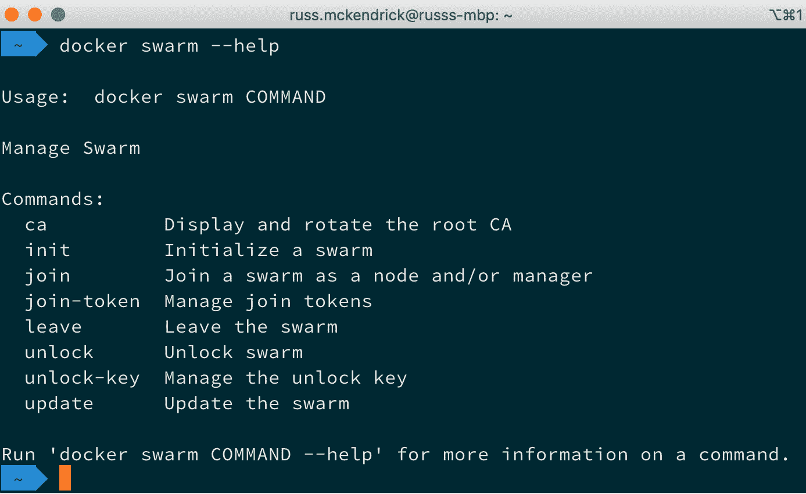

图 8.1 – 查看帮助

如果遇到错误，请确保您正在运行 Docker 19.03 或更高版本，我们在*第一章*中已经介绍了该版本的安装，*Docker 概述*。现在我们知道 Docker 客户端支持 Docker Swarm，那么我们所说的 Swarm 是什么意思？

**Swarm** 是一组运行 Docker 的主机，它们被配置为相互交互并组成集群。一旦配置完成，你就可以像在单个主机上操作一样使用我们之前执行过的所有命令，同时让 Docker Swarm 根据部署策略决定容器的最适合运行主机。Docker Swarm 由两种类型的主机组成。我们现在来看一下这两种主机。

## Docker Swarm 集群中的角色

Docker Swarm 中涉及哪些角色？让我们来看一下在 Docker Swarm 集群中运行时，主机可以担任的两种角色。

### Swarm 管理器

**Swarm 管理器** 是一个主机，它是所有 Swarm 主机的中央管理点。Swarm 管理器是你发出所有命令以控制这些节点的地方。你可以在节点之间切换，加入节点，移除节点，并操作这些主机。

每个集群可以运行多个 Swarm 管理器。对于生产环境，建议至少运行五个 Swarm 管理器；这样我们的集群在出现最多两个 Swarm 管理器节点故障之前不会出现错误。Swarm 管理器使用 *Raft 共识算法*（详见 *进一步阅读* 部分）来保持所有管理节点之间的一致状态。

### Swarm 工作节点

Swarm 工作节点，之前我们提到的 Docker 主机，就是运行 Docker 容器的那些节点。Swarm 工作节点由 Swarm 管理器进行管理，并在下图中展示：

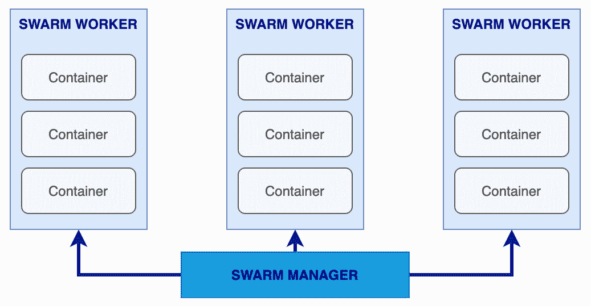

图 8.2 – Swarm 工作节点概览

这是一张所有 Docker Swarm 组件的示意图。我们看到 Docker Swarm 管理器与每个拥有 Docker Swarm 工作节点角色的主机进行通信。工作节点之间确实有一定的连接，我们稍后会进一步了解。

# 创建和管理 Swarm

现在让我们来看一下如何使用 Swarm，并执行以下任务：

+   创建集群

+   加入工作节点

+   列出节点

+   管理集群

## 创建集群主机

让我们从创建一个包含三台机器的集群开始。由于我们将在本地机器上创建一个多节点集群，我们将使用之前在 *第六章* 中讲到的 Multipass，Docker Machine，Vagrant 和 Multipass，通过运行以下命令来启动主机：

```
$ multipass launch -n node1
$ multipass launch -n node2
$ multipass launch -n node3
```

这应该会为我们创建三个节点；你可以通过运行以下命令来检查：

```
$ multipass list
```

你应该能看到类似以下的输出：

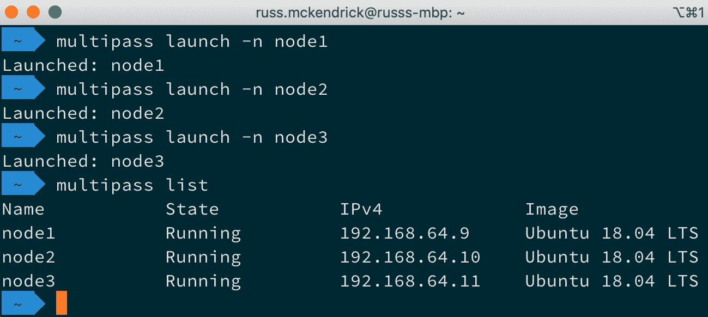

图 8.3 – 使用 Multipass 启动节点

你可能还记得上次使用 Multipass 时，启动一个主机并不意味着 Docker 已经安装；所以，现在，让我们安装 Docker，并将`ubuntu`用户添加到`docker`组中，这样当我们使用`multipass exec`时，就不需要切换用户了。为此，请运行以下三条命令：

```
$ multipass exec node1 -- \
	/bin/bash -c 'curl -s https://get.docker.com | sh - && sudo usermod -aG docker ubuntu'
$ multipass exec node2 -- \
	/bin/bash -c 'curl -s https://get.docker.com | sh - && sudo usermod -aG docker ubuntu'
$ multipass exec node3 -- \
	/bin/bash -c 'curl -s https://get.docker.com | sh - && sudo usermod -aG docker ubuntu'
```

现在我们的三个集群节点已经准备就绪，我们可以继续进行下一步，即将 Swarm 管理节点添加到集群中。

## 将 Swarm 管理节点添加到集群

让我们启动我们的 Swarm 管理节点。为此，我们将把一些 Docker Machine 命令的结果传递给我们的主机。在创建 Swarm 管理节点之前，我们需要获取`node1`的 IP 地址，因为它将成为我们的 Swarm 管理节点。如果你使用的是 macOS 或 Linux，可以通过运行以下命令设置一个环境变量：

```
$ IP=$(multipass info node1 | grep IPv4 | awk '{print $2}')
```

如果你使用的是 Windows 10，请运行`multipass list`并记下`node1`的 IP 地址。

用于创建我们管理节点的命令在以下代码片段中显示（如果你正在使用 Windows，请将`$IP`替换为你记下的 IP 地址）：

```
$ multipass exec node1 -- \
	/bin/bash -c 'docker swarm init --advertise-addr $IP:2377 --listen-addr $IP:2377'
```

你应该收到类似以下的消息：

```
Swarm initialized: current node (92kts1c9x17gbqv3in9t1w4qm) is now a manager.
To add a worker to this swarm, run the following command:
    docker swarm join --token SWMTKN-1-4s8vpkileg2l2sicpyay5fojhis9jygb8mv04tsy9jmeqmzhk8-4cp4hp0i1qjqpuln6q3ytprtc 192.168.64.9:2377
To add a manager to this swarm, run 'docker swarm join-token manager' and follow the instructions.
```

从输出中可以看到，一旦你的管理节点初始化完成，你将获得一个唯一的令牌。

在前面的示例中，完整的令牌是：

```
SWMTKN-1-4s8vpkileg2l2sicpyay5fojhis9jygb8mv04tsy9jmeqmzhk8-4cp4hp0i1qjqpuln6q3ytprtc.
```

这个令牌将用于工作节点进行身份验证，并加入我们的集群。

## 将 Swarm 工作节点加入集群

现在是时候将我们的两个工作节点（`node2`和`node3`）添加到集群中了。首先，让我们设置一个环境变量来保存我们的令牌，确保你将令牌替换为在初始化管理节点时收到的令牌，如下所示：

```
$ SWARM_TOKEN=$(multipass exec node1 -- /bin/bash -c 'docker swarm join-token --quiet worker')
```

同样，Windows 用户需要记下令牌，并且在接下来的命令中，需要将`$SWARM_TOKEN`和`$IP`分别替换为他们的实际值。

现在，我们可以运行以下命令将`node2`添加到集群：

```
$ multipass exec node2 -- \
	/bin/bash -c 'docker swarm join --token $SWARM_TOKEN $IP:2377'
```

对于`node3`，你需要运行以下命令：

```
$ multipass exec node3 -- \
	/bin/bash -c 'docker swarm join --token $SWARM_TOKEN $IP:2377'
```

每次操作，你都应该收到确认信息，表示你的节点已经加入集群，如以下截图所示：

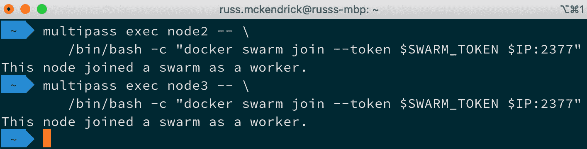

图 8.4 – 将工作节点添加到集群

## 列出节点

你可以通过运行以下命令来检查 Swarm：

```
$ multipass exec node1 -- /bin/bash -c 'docker node ls'
```

这将连接到`node1`，我们已经将其配置为 Swarm 主节点，并查询构成我们集群的所有节点。

你应该看到所有三个节点都被列出，如以下截图所示：

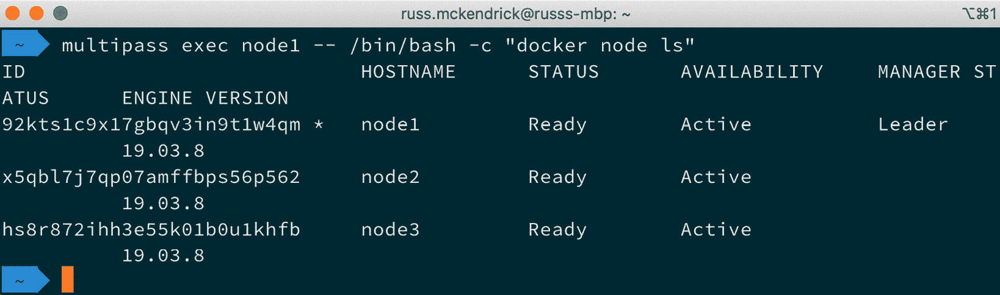

图 8.5 – 列出集群节点

现在，我们将从本地机器上的 Docker 客户端切换到`node1`上的 Docker 客户端。要连接到`node1`的 Shell，我们只需运行以下命令：

```
$ multipass shell node1
```

这将把我们留在`node1`的命令行提示符下，准备开始使用我们的集群。

# 管理集群

让我们看看如何管理我们正在创建的所有集群节点。

你管理集群中容器的方式只有两种——这两种方式是使用`docker service`和`docker stack`命令，我们将在本章的下一部分中介绍这两种方式。

在我们查看如何在集群中启动容器之前，让我们先看一下如何管理集群本身，从了解如何获取集群的更多信息开始。

## 查找集群信息

正如我们已经看到的，我们可以使用安装在`node1`上的 Docker 客户端列出集群中的节点。要获取更多信息，我们只需在`node1`的命令行中输入以下内容：

```
$ docker info
```

这将提供关于主机的大量信息，如下所示（我已经截断了输出）：

```
Server:
 Containers: 0
 Images: 0
 Server Version: 19.03.8
 Swarm: active
  NodeID: 92kts1c9x17gbqv3in9t1w4qm
  Is Manager: true
  ClusterID: k65y4ke5rmup1n74z9lb9gerx
  Managers: 1
  Nodes: 3
  Default Address Pool: 10.0.0.0/8
  SubnetSize: 24
```

如你所见，在`Swarm`部分有集群的信息；然而，我们只能对当前配置为与之通信的主机运行`docker info`命令。幸运的是，`docker node`命令是集群感知的，所以我们可以使用它来获取集群中每个节点的信息。

提示

使用`docker node inspect`命令的`--pretty`标志可以将输出以易读的格式呈现。如果省略`--pretty`，Docker 将返回包含查询结果的原始`JSON`对象，这些查询是`inspect`命令针对集群运行的。

以下是我们需要运行的命令，以获取关于`node1`的信息：

```
$ docker node inspect node1 –pretty
```

这应该会提供有关我们 Swarm 管理节点的以下信息：

```
ID:			92kts1c9x17gbqv3in9t1w4qm
Hostname:              	node1
Joined at:             	2020-04-12 14:00:02.218330889 +0000 utc
Status:
 State:			Ready
 Availability:         	Active
 Address:		192.168.64.9
Manager Status:
 Address:		192.168.64.9:2377
 Raft Status:		Reachable
 Leader:		Yes
Platform:
 Operating System:	linux
 Architecture:		x86_64
Resources:
 CPUs:			1
 Memory:		985.7MiB
Plugins:
 Log:		awslogs, fluentd, gcplogs, gelf, journald, json-file, local, logentries, splunk, syslog
 Network:		bridge, host, ipvlan, macvlan, null, overlay
 Volume:		local
Engine Version:		19.03.8
```

运行相同的命令，但这次针对其中一个工作节点，命令如下：

```
$ docker node inspect node2 --pretty
```

这将给我们类似的信息，如下所示：

```
ID:			x5qbl7j7qp07amffbps56p562
Hostname:              	node2
Joined at:             	2020-04-12 14:10:15.08034922 +0000 utc
Status:
 State:			Ready
 Availability:         	Active
 Address:		192.168.64.10
Platform:
 Operating System:	linux
 Architecture:		x86_64
Resources:
 CPUs:			1
 Memory:		985.7MiB
Plugins:
 Log:		awslogs, fluentd, gcplogs, gelf, journald, json-file, local, logentries, splunk, syslog
 Network:		bridge, host, ipvlan, macvlan, null, overlay
 Volume:		local
Engine Version:		19.03.8
```

但正如你所看到的，关于管理节点功能状态的信息缺失。这是因为工作节点不需要知道管理节点的状态；它们只需要知道它们被允许接收来自管理节点的指令。

这样，我们可以看到关于此主机的详细信息，例如容器数量、主机上的镜像数量、**中央处理单元**（**CPU**）和内存信息，以及其他有趣的信息。

现在我们知道如何获取构成我们集群的节点信息后，让我们来看一下如何提升节点在集群中的角色。

## 提升一个工作节点

假设你想对单个管理节点进行一些维护，但你希望保持集群的可用性。没问题——你可以将一个工作节点提升为管理节点。

在我们的本地三节点集群已经启动并运行的情况下，让我们将`node2`提升为新的管理节点。为此，运行以下命令：

```
$ docker node promote node2
```

执行命令后，你应该会收到一条确认消息，表示你的节点已经被提升，消息如下：

```
Node node2 promoted to a manager in the swarm.
```

通过运行以下命令列出节点：

```
$ docker node ls
```

这应该会显示出你现在有两个节点在`MANAGER STATUS`列中显示内容，如下图所示：

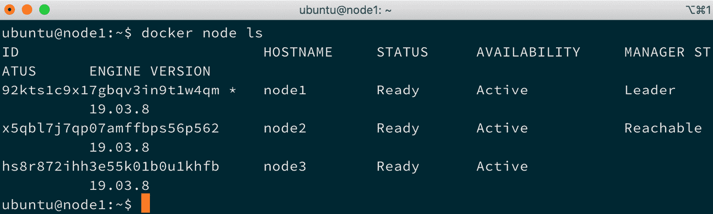

图 8.6 – 检查集群中节点的状态

我们的`node1`节点仍然是主要的管理节点，不过。让我们来处理一下这个问题，将其角色从管理节点切换为工作节点。

## 降级管理节点

你可能已经猜到如何操作了，要将管理节点降级为工作节点，你只需运行以下命令：

```
$ docker node demote node1
```

再次，你将收到即时反馈，显示以下内容：

```
Manager node1 demoted in the swarm.
```

现在我们已经降级了节点，你可以通过运行以下命令来检查集群中节点的状态：

```
$ docker node ls
```

由于我们连接的是`node1`，即刚被降级的节点，你将收到以下消息：

```
Error response from daemon: This node is not a swarm manager. Worker nodes can't be used to view or modify cluster state. Please run this command on a manager node or promote the current node to a manager.
```

要连接到我们的新 Swarm 管理节点，我们需要通过 SSH 连接到`node2`。为此，我们只需断开与`node1`的连接，并通过运行以下命令连接到`node2`：

```
$ exit
$ multipass shell node2
```

现在我们再次连接到一个管理节点，请按以下方式重新运行：

```
$ docker node ls
```

它应该如预期那样列出节点，以下截图展示了这一点：

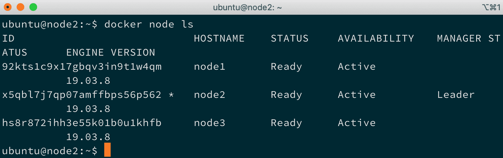

图 8.7 – 检查集群中节点的状态

一切都很顺利，但我们怎么才能将一个节点移出集群，以便对其进行维护呢？现在让我们看看如何排空一个节点。

## 节点排空

为了临时将一个节点从集群中移除以便进行维护，我们需要将节点的状态设置为`Drain`。让我们看看如何排空我们原先的管理节点。为此，我们需要运行以下命令：

```
$ docker node update --availability drain node1
```

这将停止任何新任务的执行，例如启动或执行新容器，针对我们正在排空的节点。一旦新任务被阻止，所有正在运行的任务将从我们正在排空的节点迁移到状态为`Active`的节点。

从下面的终端输出可以看到，现在列出的节点显示`node1`在`AVAILABILITY`列中的状态是`Drain`：

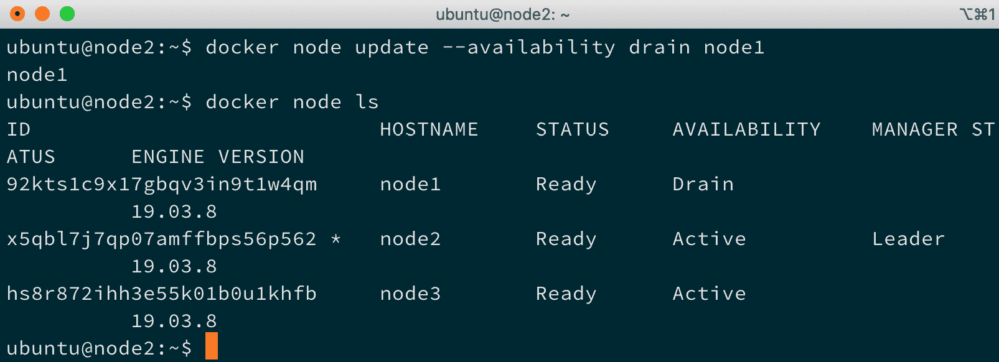

图 8.8 – 检查我们集群的状态

现在我们的节点不再接受新任务，所有正在运行的任务都已迁移到剩余的两个节点，我们可以安全地进行维护，例如重启主机。要重启`node1`，在你的主机第二窗口中运行以下两个命令：

```
$ multipass shell node1
$ sudo reboot
```

一旦主机重新启动，在`node2`上运行此命令：

```
$ docker node ls
```

它应该显示该节点的`AVAILABILITY`状态为`Drain`。要将节点重新加入集群，只需通过在`node2`上运行以下命令将`AVAILABILITY`状态更改为`Active`：

```
$ docker node update --availability active node1
```

从下面的终端输出可以看到，我们的节点现在处于活动状态，意味着可以在其上执行新任务：

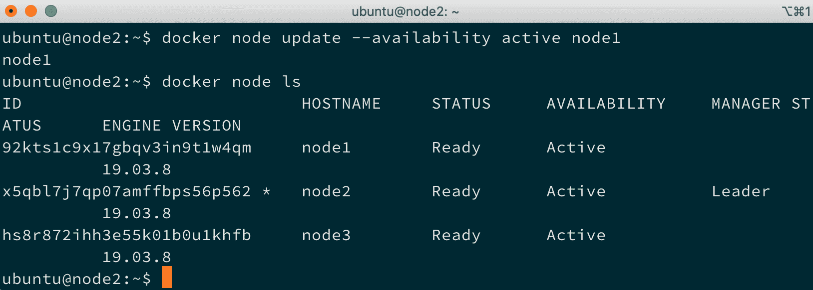

图 8.9 – 检查我们集群的状态

现在我们已经了解如何创建和管理 Docker Swarm 集群，我们应该看看如何执行一些任务，比如创建和扩展服务或启动堆栈。

# Docker Swarm 服务和堆栈

到目前为止，我们已经看过以下命令：

```
$ docker swarm <command>
$ docker node <command>
```

这两个命令允许我们从现有的 Docker 主机集合中启动并管理 Docker Swarm 集群。接下来我们要看的是以下两个命令：

```
$ docker service <command>
$ docker stack <command>
```

`service`和`stack`命令允许我们执行任务，进而启动、扩展和管理我们 Swarm 集群中的容器。

## 服务

`service`命令是一种启动容器的方式，它利用了 Swarm 集群的优势。我们来看一下如何在 Swarm 集群上启动一个非常基础的单容器服务。

提示

别忘了，`docker`命令需要从你当前的 Swarm 管理节点执行。如果你跟随的话，应该是`node2`。

为此，请运行以下命令：

```
$ docker service create \
    --name cluster \
    --constraint 'node.role == worker' \
    -p:80:80/tcp \
    russmckendrick/cluster
```

这将创建一个名为`cluster`的服务，该服务由一个容器组成，容器的端口`80`从容器映射到主机机器，并且仅在具有`worker`角色的节点上运行。

在我们深入了解如何使用该服务之前，我们可以先检查它是否在浏览器中工作。为此，我们需要知道我们两个工作节点的 IP 地址。首先，我们需要通过运行以下命令来确认哪些是工作节点：

```
$ docker node ls
```

一旦我们知道每个节点的角色，你可以通过在主机机器上的第二个终端窗口中运行以下命令来找到节点的 IP 地址：

```
$ multipass list
```

查看以下终端输出：

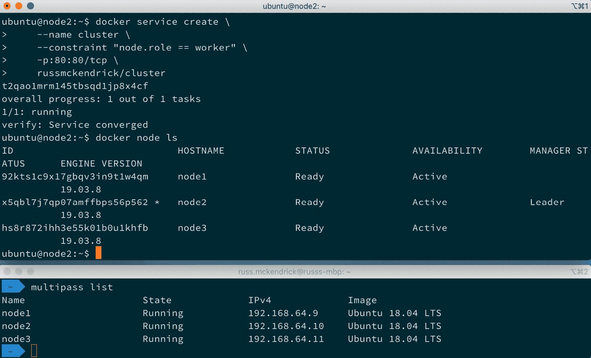

图 8.10 – 创建服务并检查节点的 IP 地址

我的工作节点是`node1`和`node3`，它们的 IP 地址分别是`192.168.64.9`和`192.168.64.11`。

在浏览器中访问你的工作节点的任一 IP 地址，例如 http://192.168.64.9/ 或 http://192.168.64.11/，将显示`russmckendrick/cluster`应用程序的输出，这包括 Docker Swarm 图形和提供页面的容器的主机名。以下截图中做了说明：

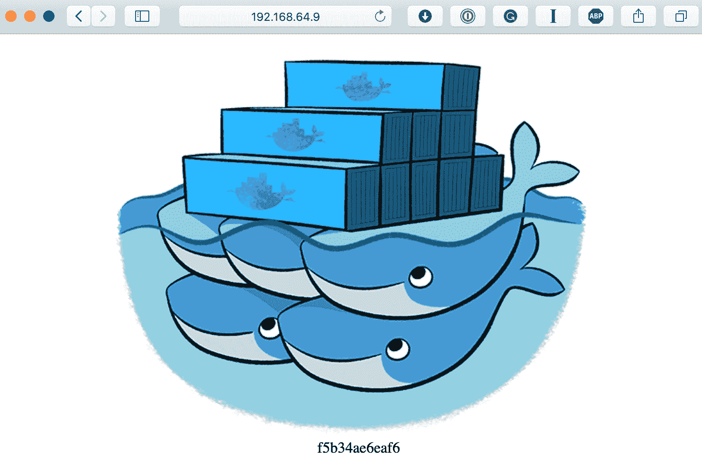

图 8.11 – 我们的集群应用

现在我们的服务已经在集群中运行，我们可以开始获取更多关于它的信息。首先，我们可以通过运行以下命令再次列出服务：

```
$ docker service ls
```

在我们的案例中，这应该返回我们启动的单个服务，名为`cluster`，如下截图所示：

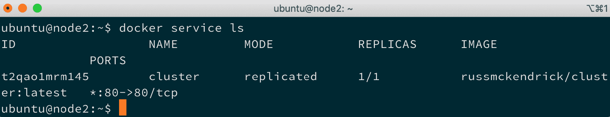

图 8.12 – 列出服务

如你所见，这是一个`inspect`命令，如下所示：

```
$ docker service inspect cluster --pretty
```

这将返回有关服务的详细信息，如下截图所示：

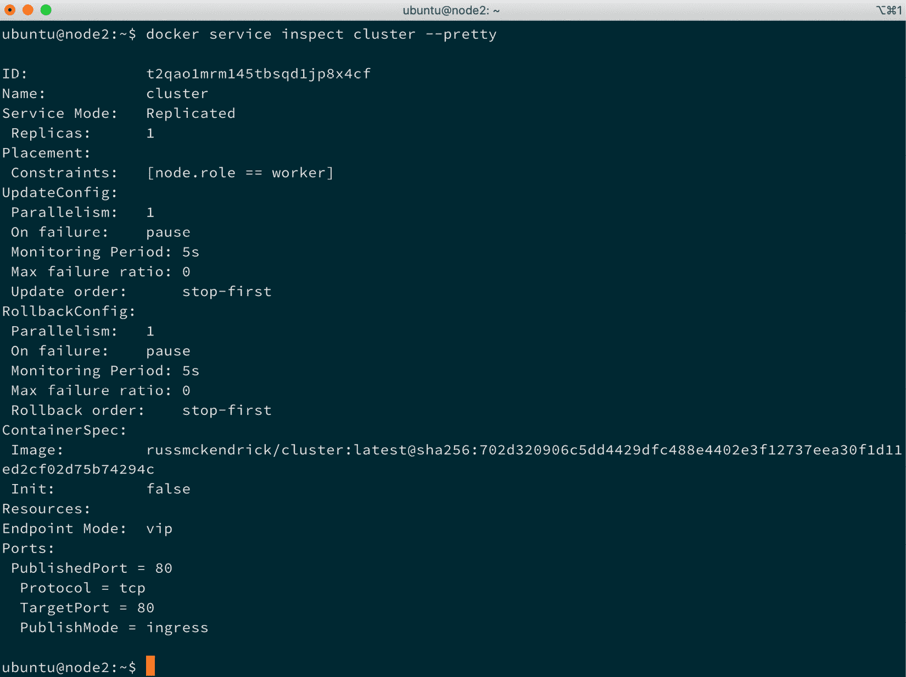

图 8.13 – 获取服务信息

您可能已经注意到，到目前为止，我们并不需要担心我们的两个工作节点中哪个节点正在运行服务。这是 Docker Swarm 的一个非常重要的功能，它完全消除了您需要担心单个容器位置的需求。

在我们查看如何扩展服务之前，我们可以快速查看我们的单个容器运行在哪个主机上，方法是执行以下命令：

```
$ docker node ps
$ docker node ps node1
$ docker node ps node3
```

这将列出在每个主机上运行的容器。默认情况下，它将列出命令所针对的主机，在我的情况下是`node1`，如下所示的屏幕截图：

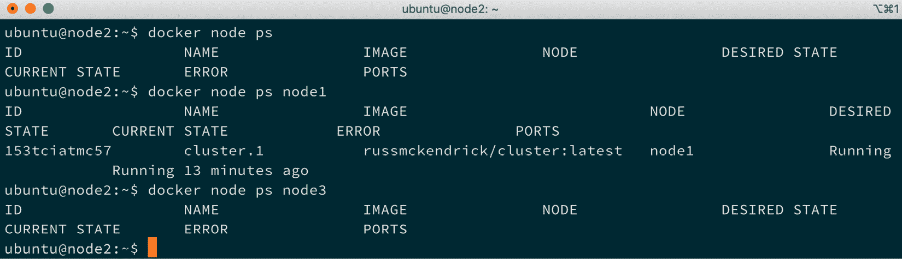

图 8.14 – 查找我们的服务运行在哪个节点上

让我们看一下如何将服务扩展为六个实例的应用容器。运行以下命令来扩展并检查我们的服务：

```
$ docker service scale cluster=6
$ docker service ls
$ docker node ps node1
$ docker node ps node3
```

我们只检查了两个节点，因为我们最初告诉我们的服务在工作节点上启动。正如您从以下终端输出中看到的，我们现在在每个工作节点上都有三个容器在运行：

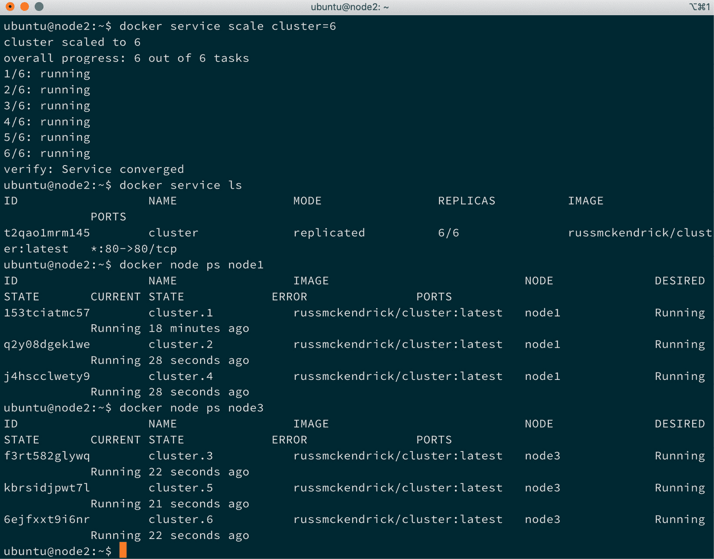

图 8.15 – 检查容器在我们的节点上的分布

在我们继续查看堆栈之前，让我们先删除我们的服务。为此，请运行以下命令：

```
$ docker service rm cluster
```

这将删除所有容器，同时将下载的图像保留在主机上。

## 堆栈

使用 Swarm 服务，完全有可能创建相当复杂、高可用的多容器应用程序。在非 Swarm 集群中，手动启动应用程序的每一部分容器集可能会变得有些繁琐，并且也使共享服务变得困难。为此，Docker 创建了一个功能，允许您在 Docker Compose 文件中定义您的服务。

以下的 Docker Compose 文件，名为`docker-compose.yml`，将创建与我们在`services`部分启动的服务相同的服务：

```
version: '3'
services:
  cluster:
    image: russmckendrick/cluster
    ports:
      - '80:80'
    deploy:
      replicas: 6
      restart_policy:
        condition: on-failure
      placement:
        constraints:
          - node.role == worker
```

正如您所看到的，堆栈可以由多个服务组成，每个服务都在 Docker Compose 文件的`services`部分中定义。

除了普通的 Docker Compose 命令，您还可以添加一个`deploy`部分；在这里，您可以定义与堆栈的 Swarm 元素相关的一切。

在之前的示例中，我们说过我们希望有六个副本，并且这些副本应分布在我们的两个工作节点上。同时，我们更新了默认的重启策略，您在检查前一部分中的服务时看到过，它显示为`paused`，这样如果容器变得无响应，它会始终被重新启动。

要启动我们的堆栈，请将之前的内容复制到`docker-compose.yml`文件中，然后运行以下命令：

```
$ docker stack deploy --compose-file=docker-compose.yml cluster
```

Docker 将—就像启动 Docker Compose 容器时一样—创建一个新的网络，然后在其上启动你的服务。你可以通过运行以下命令来检查堆栈的状态：

```
$ docker stack ls
```

这将显示一个服务已被创建。你可以通过运行以下命令获取由 `stack` 创建的服务的详细信息：

```
$ docker stack services cluster
```

最后，运行以下命令将显示堆栈中容器的运行位置：

```
$ docker stack ps cluster
```

请查看以下终端输出：

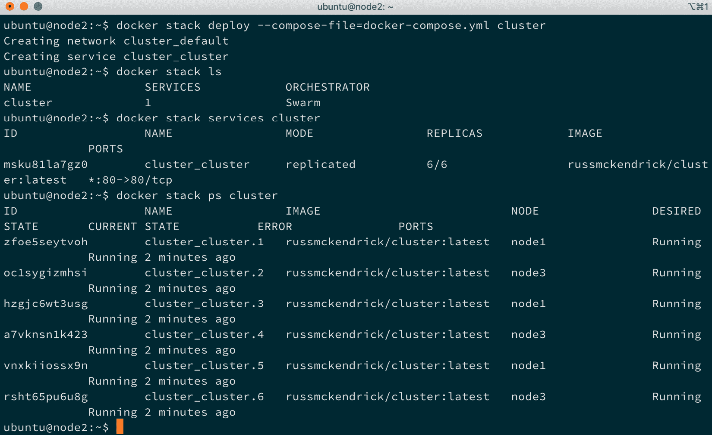

图 8.16 – 部署我们的堆栈

同样，你将能够使用节点的 IP 地址访问堆栈，系统将会将你路由到其中一个正在运行的容器。要删除堆栈，只需运行以下命令：

```
$ docker stack rm cluster
```

这将删除堆栈启动时创建的所有服务和网络。

## 删除一个 Swarm 集群

在继续之前，由于接下来的部分不再需要它，你可以通过运行以下命令删除你的 Swarm 集群：

```
$ multipass delete --purge node1
$ multipass delete --purge node2
$ multipass delete --purge node3
```

如果你因某种原因需要重新启动 Swarm 集群，只需按照本章开头的说明重新创建集群。

# 负载均衡、覆盖网络和调度

在接下来的几个部分中，我们查看了启动服务和堆栈的过程。要访问我们启动的应用程序，我们可以使用集群中任何主机的 IP 地址；这是怎么实现的呢？

## 入口负载均衡

Docker Swarm 内置了一个入口负载均衡器，使我们能够轻松地将流量分配到我们面向公共的容器。

这意味着你可以将 Swarm 集群中的应用程序暴露给外部服务——例如，像 Amazon **Elastic Load Balancer**（**ELB**）这样的外部负载均衡器——并且你知道，无论当前哪个主机托管容器，您的请求都会被路由到正确的容器，如下图所示：

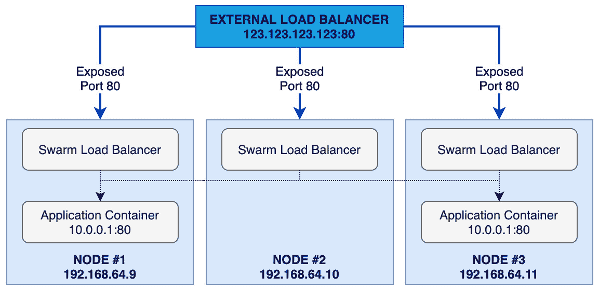

图 8.17 – Swarm 集群中负载均衡的概述

这意味着我们的应用程序可以扩展、缩减、故障或更新，所有这些都无需重新配置外部负载均衡器与各个容器通信，因为 Docker Swarm 会为我们处理这些。

## 网络覆盖

在我们的示例中，我们启动了一个运行单个应用程序的简单服务。假设我们想在应用程序中添加一个数据库层，通常这是网络中的一个固定点；我们该怎么做呢？

Docker Swarm 的网络覆盖层扩展了你在多个主机上启动容器的网络，这意味着每个服务或堆栈都可以在其自己的隔离网络中启动。这意味着我们的数据库容器（运行 MongoDB）将可以通过端口 `27017` 访问所有在同一覆盖网络上运行的其他容器，无论这些容器运行在哪个主机上。

你可能会在心里想：*等一下，这是不是意味着我需要将 IP 地址硬编码到我的应用配置中？* 嗯，这与 Docker Swarm 想要解决的问题不太匹配，所以答案是否定的，你不需要这样做。

每个覆盖网络都有自己的内建 `mongodb:27017`，它将连接到我们的 MongoDB 容器。

这将使我们的图表如下所示：

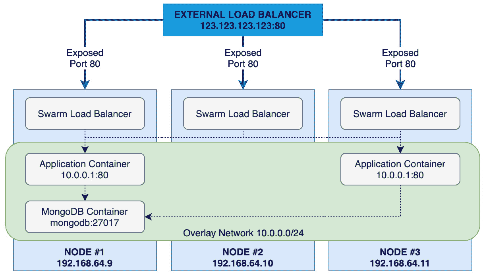

图 8.18 – Docker Swarm 集群中覆盖网络的概述

在采用这种模式时，你需要考虑一些其他因素，但我们将在*第十五章*中讨论这些问题，*Docker 工作流*。

## 调度

在写作时，Docker Swarm 中只有一种调度策略，叫做 **spread**。该策略的作用是将任务调度到负载最轻的节点，该节点满足你在启动服务或堆栈时定义的约束条件。通常情况下，你不需要为你的服务添加太多约束。

Docker Swarm 当前不支持的一项功能是亲和性和反亲和性规则。虽然可以通过使用这种约束来规避，但我建议你不要过于复杂化事情，因为在定义服务时，如果施加太多约束，很容易导致主机过载或创建单点故障。

# 总结

在本章中，我们探讨了 Docker Swarm。我们了解了如何安装 Docker Swarm 以及构成 Docker Swarm 的各个组件。我们还探讨了如何使用 Docker Swarm，加入、列出和管理 Swarm 管理节点和工作节点。我们回顾了 `service` 和 `stack` 命令及其使用方法，并讲解了 Swarm 内置的入口负载均衡器、覆盖网络和调度器。

目前，Docker Swarm 在写作时处于一个有趣的状态，因为 Docker Swarm 是 Mirantis 在收购 Docker 企业版时获得的技术之一，尽管 Mirantis 表示他们将在 2 年内为现有的 Docker Swarm 集群提供支持（这是在 2019 年 11 月），但他们并没有提供关于 Docker Swarm 未来发展的更多信息。

这并不令人惊讶，因为 Mirantis 在另一种容器集群 Kubernetes 上做了很多工作，而我们将在*第十一章*中讨论它，*Docker 和 Kubernetes*。在此之前，在下一章中，我们将看一下 Docker 的**图形用户界面**（**GUI**）——**Portainer**。

# 问题

1.  判断题：你应该使用独立的 Docker Swarm 运行 Docker Swarm，而不是使用内置的 Docker Swarm 模式。

1.  在启动 Docker Swarm 管理节点后，您需要哪些两项内容来将工作节点添加到 Docker Swarm 集群？

1.  你会使用哪个命令来查找 Docker Swarm 集群中每个节点的状态？

1.  你会在 Swarm 管理节点上为 `docker node inspect` 命令添加哪个标志，以使其更易读？

1.  如何将一个节点提升为管理节点？

1.  你可以使用哪个命令来缩放你的服务？

# 进一步阅读

关于 Raft 共识算法的详细解释，我推荐阅读一份优秀的演讲《*数据的秘密生活*》，可以在[`thesecretlivesofdata.com/raft/`](http://thesecretlivesofdata.com/raft/)找到。它通过一个易于跟随的动画解释了在管理节点上发生的所有后台过程。
