*第十一章*

# 第十一章：Docker 与 Kubernetes

在本章中，我们将深入了解 Kubernetes。与 Docker Swarm 类似，你可以使用 Kubernetes 创建和管理运行容器化应用程序的集群。

本章将讨论以下内容：

+   Kubernetes 简介

+   在 Docker Desktop 中启用 Kubernetes

+   使用 Kubernetes 和 Docker Desktop

+   Kubernetes 与其他 Docker 工具

# 技术要求

Docker 中的 Kubernetes 仅支持 Docker for Mac 和 Docker for Windows 桌面客户端。如果你使用的是 Linux 系统，那么在下一章*第十二章**，发现更多 Kubernetes 选项*中，我们将探讨一些对你有帮助的选项。

与之前的章节一样，我将使用我偏好的操作系统——macOS。和以前一样，一些支持命令虽然较少且不常用，但可能仅适用于 macOS。

查看以下视频，了解代码的实际操作：[`bit.ly/3m1WRiw`](https://bit.ly/3m1WRiw)

# Kubernetes 简介

如果你曾经考虑过研究容器，你可能在某个时刻遇到过 Kubernetes，因此在我们在 Docker 桌面安装中启用它之前，让我们先回顾一下 Kubernetes 的起源。

**Kubernetes**，发音为**koo-ber-net-eez**，源自希腊语，意为船舶的舵手或船长。

信息

Kubernetes 团队采用的缩写方式叫做数字缩写（numeronym），这种方式在 80 年代被提出，至今仍在使用。更多信息请参见[`en.wikipedia.org/wiki/Numeronym`](https://en.wikipedia.org/wiki/Numeronym)。

Kubernetes，也叫**K8s**——K8s 中的 8 代表字母 K 和 S 之间的字母数量，即‘ubernete’部分——是一个开源项目，源自 Google，允许你自动化容器化应用程序的部署、管理和扩展。

## Google 容器简史

Google 已经在 Linux 容器解决方案方面工作了相当长一段时间。它于 2006 年开始了这项工作，首先研究了名为**Control Groups**（**cgroups**）的 Linux 内核功能。该功能在 2008 年随 2.6.24 版本合并进 Linux 内核。

该功能允许你隔离资源，例如 CPU、RAM、网络和磁盘 I/O，或者一个或多个进程。Control Groups 仍然是 Linux 容器的核心要求，不仅 Docker 使用它，其他容器工具也使用它。

接下来，Google 尝试了一个名为**lmctfy**的容器堆栈，**lmctfy**是**Let Me Contain That For You**的缩写，它是**LXC**工具和库集合的替代方案。它是 Google 内部工具集的开源版本，Google 用它来管理应用程序中的容器。

下次 Google 因容器使用而登上新闻的时刻是在 2014 年 5 月 *Joe Beda* 在 *Gluecon* 上的演讲中。在演讲中，Beda 揭示了 Google 几乎所有的工作都基于容器，并且每周会启动大约 20 亿个容器。并且指出，这个数字并不包括任何长期运行的容器，也就是说这些容器只会在短时间内激活。然而，通过快速计算，Google 平均每秒启动大约 3,000 个容器！

在演讲的后半部分，Beda 提到 Google 正在使用一个调度器，这样他们就不需要手动管理每周 20 亿个容器，甚至不必担心容器的启动位置，以及在一定程度上，每个容器的可用性。

Google 还发布了一篇名为 *在 Google 使用 Borg 进行大规模集群管理* 的论文。这篇论文不仅让 Google 外部的人知道了他们使用的调度器的名字——**Borg**，还详细介绍了他们在设计调度器时所做的设计决策。

论文提到，除了他们的内部工具外，Google 还将面向客户的应用程序，如 Google Docs、Google Mail 和 Google Search，运行在由 Borg 管理的容器集群中。

**Borg** 这个名字来源于《星际迷航：下一代》中的外星种族 Borg。在该剧中，Borg 是一种赛博生命体，他们的文明建立在名为集体意识的蜂巢思维基础上。这使得他们不仅能够共享相同的思想，而且通过亚空间网络，确保每个集体成员都能从集体意识中获得指导和监督。我相信你会同意，Borg 种族的特征与我们希望容器集群运行的方式非常契合。

Borg 在 Google 内部运行了几年，最终被一个更现代的调度器 Omega 所取代。就在这时，Google 宣布将会把 Borg 的一些核心功能提取出来，并以新的开源项目形式进行再现。这个项目在内部被称为**Seven**，由几位 Borg 的核心贡献者共同开发。它的目标是创建一个更加友好的 Borg 版本，避免与 Google 内部的程序和工作方式过于紧密地绑定。

**Seven** 这个名字来源于 *星际迷航：航海家号* 中的角色 Seven of Nine，她是一个从集体中脱离出来的 Borg，最终在首次公开提交时，它被命名为 **Kubernetes**。

既然我们了解了 Kubernetes 的由来，现在可以更深入地探讨 Kubernetes 是什么。

## Kubernetes 概述

项目的大部分内容，写作时占比 90.7%，是用 Go 编写的，这并不奇怪，因为 Go 是 Google 内部开发的编程语言，在 2011 年开源。项目的其余部分由 Python、Shell 辅助脚本和 HTML 文档组成。

一个典型的 Kubernetes 集群由承担主控或节点角色的服务器组成。你也可以运行一个独立的安装，既承担主控角色也承担节点角色。

主控角色是魔法发生的地方，它是集群的大脑。它负责决定在哪些位置启动 pods，并监控集群本身以及集群内运行的 pods 的健康状态。我们将在讨论完这两个角色后再讨论 pods。

通常，部署到被赋予主控角色的主机上的核心组件如下：

+   `kube-apiserver`：该组件暴露了主要的 Kubernetes API。它被设计为水平扩展，这意味着你可以不断添加更多实例来使你的集群高度可用。

+   `etcd`：这是一个高可用的一致性键值存储。它用于存储集群的状态。

+   `kube-scheduler`：该组件负责决定 pods 启动的位置。

+   `kube-controller-manager`：该组件运行控制器。这些控制器在 Kubernetes 中有多个功能，如监控节点、关注复制、管理端点以及生成服务账户和令牌。

+   `cloud-controller-manager`：该组件负责管理与第三方云交互的各类控制器，以启动和配置支持服务。

现在我们已经涵盖了管理组件，我们需要讨论它们所管理的内容。一个节点由以下元素组成：

+   `kubelet`：该代理运行在集群中的每个节点上，它是管理者与节点交互的手段。它还负责管理 pods。

+   `kube-proxy`：该组件管理节点和 pods 的请求和流量的路由。

+   `container runtime`：这可以是 Docker、CRI-O 或任何其他符合 OCI 标准的运行时。

你可能已经注意到，我到目前为止并没有提到容器。这是因为 Kubernetes 实际上并不直接与容器交互；它与 pod 进行通信。可以把 pod 看作是一个完整的应用程序，有点像我们之前使用 Docker Compose 启动由多个容器组成的应用程序。

## Docker 是如何与 Kubernetes 配合的？

Docker 与 Kubernetes 的关系是多种多样的。首先，Docker 这个容器引擎以某种方式驱动了许多 Kubernetes 的安装，例如作为 Docker 或 ContainerD。

然而，Kubernetes 最初被视为 Docker Swarm 的竞争技术，后者是 Docker 自己的集群技术。然而，在过去几年中，Kubernetes 已经基本成为容器集群/编排的事实标准。

所有主要的云服务提供商都提供 Kubernetes 服务。我们有以下几个选择：

+   **Google Cloud**: **Google Kubernetes 引擎** (**GKE**)

+   **Microsoft Azure**: **Azure Kubernetes 服务** (**AKS**)

+   **Amazon Web Services**: **Amazon 弹性容器服务 for Kubernetes** (**EKS**)

+   **IBM**: **IBM 云 Kubernetes 服务**

+   **Oracle Cloud**: **Oracle 容器引擎 for Kubernetes**

+   **DigitalOcean**: **DigitalOcean 上的 Kubernetes**

乍一看，所有主要支持 Kubernetes 的主要参与者似乎并不像看上去那么重要。但是，请考虑到我们现在知道了在多个平台上部署我们容器化应用程序的一致方式。传统上，这些平台一直是封闭的生态系统，并且与它们交互的方式非常不同。

当 Docker 在 DockerCon Europe 的 2017 年 10 月发布桌面版本支持 Kubernetes 的消息初听起来让人吃惊，但当风波平息后，这一消息就变得合情合理了。为开发者提供一个环境，他们可以在本地使用 Docker for Mac 和 Docker for Windows 开发应用程序，然后使用 Docker Enterprise Edition 部署和管理他们自己的 Kubernetes 集群，或者使用之前提到的云服务，这与我们在 *第一章* 中讨论的解决 '在我的机器上可运行' 问题非常契合，*Docker 概述*。

现在让我们看看如何在 Docker 软件中启用支持并开始使用它。

在 Docker Desktop 中启用 Kubernetes

Docker 已经使安装过程变得极其简单。要启用 Kubernetes 支持，您只需打开 **Preferences** 并点击 **Kubernetes** 选项卡：

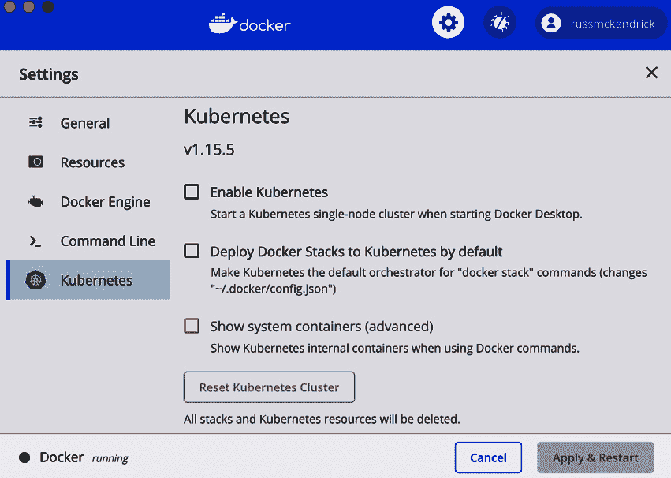

图 11.1 – Docker for Mac 中的 Kubernetes 首选项

如您所见，有三个选项。勾选 **Enable Kubernetes** 框，并选择 **Deploy Docker Stacks to Kubernetes by default**。暂时不要勾选 **Show systems containers (advanced)**；我们稍后会更详细地讨论这一点。

单击 **Apply & Restart** 将会做如其字，重启 Docker 并启用 Kubernetes：

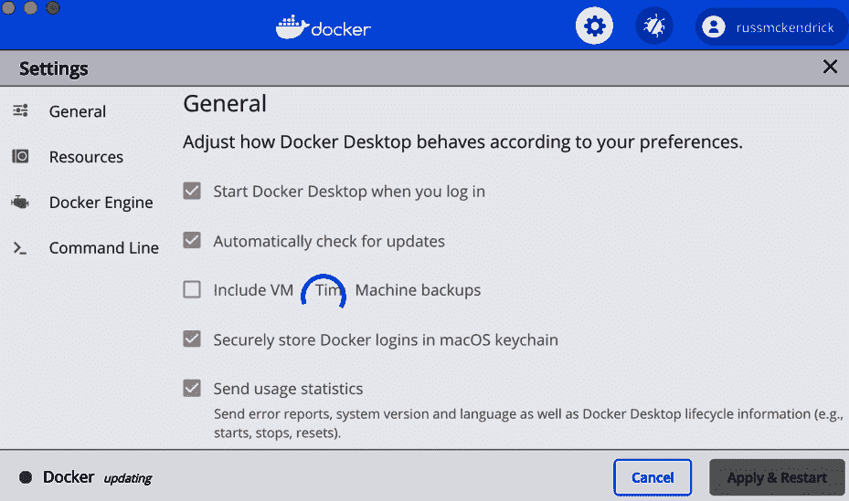

图 11.2 – 在 Docker for Mac 上启用 Kubernetes

Docker 将花一点时间下载、配置和启动集群。完成后，您应该在设置窗口的左下角看到 Docker 和 Kubernetes 列表。两者旁边应该有一个绿点，表示服务正在运行：


图 11.3 – Kubernetes 在 Docker for Mac 上成功启用

打开终端并运行以下命令：

```
$ docker container ls -a
```

这应该表明没有运行任何异常的内容。执行以下命令：

```
$ docker image ls
```

同样，这没有显示任何有用的信息；然而，正如你可能猜到的那样，在 **设置** 窗口中勾选 **显示系统容器（高级）** 选项将会改变这一点。现在勾选它并重新执行以下命令：

```
$ docker container ls -a
```

由于执行前面的命令时输出内容较多，以下截图仅显示容器的名称。为此，我执行了以下命令：

```
$ docker container ls --format {{.Names}}
```

执行命令后，我得到如下结果：

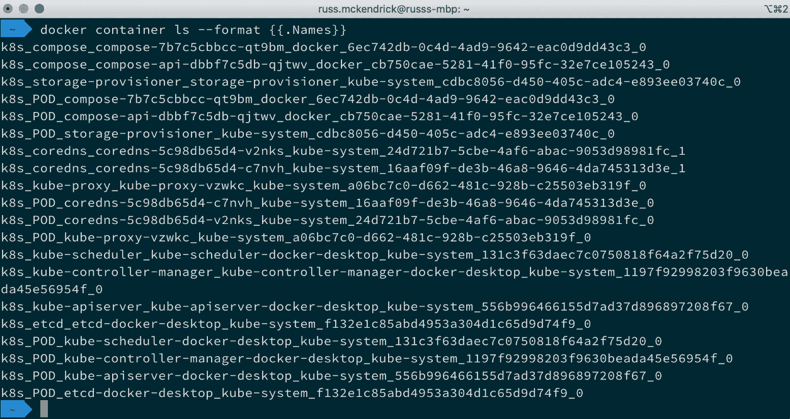

图 11.4 – 列出构成我们 Kubernetes 安装的容器

有 20 个运行中的容器，这就是你可以选择隐藏它们的原因。如你所见，几乎所有我们在上一节中讨论的组件都已覆盖，此外还有一些额外的组件，它们提供了与 Docker 的集成。

执行以下命令：

```
$ docker image ls
```

它仍然不列出任何镜像，尽管我们通过运行以下命令可以获取正在使用的镜像列表：

```
$ docker container ls --format {{.Image}}
```

从以下输出中可以看到，镜像来自 Docker 和 Google 容器注册中心（k8s.gcr.io）提供的官方 Kubernetes 镜像，也有一些是本地构建的镜像：

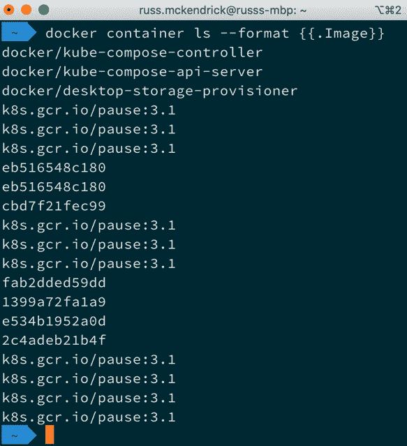

图 11.5 – 查看用于支持 Kubernetes 安装的镜像

暂时建议取消勾选 **显示系统容器（高级）** 选项，因为我们不需要每次查看运行中的容器时都看到 20 个容器的列表。

另一个需要注意的事项是，Docker 应用中的 **Kubernetes** 菜单项现在已有内容。此菜单可用于在 Kubernetes 集群之间切换。由于当前只有一个集群处于活动状态，因此仅列出一个集群：

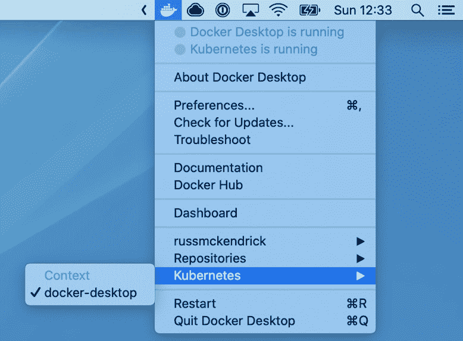

图 11.6 – 检查 Kubernetes 菜单项

现在我们已经启动并运行了本地 Kubernetes 集群，可以开始使用它。

# 使用 Kubernetes 和 Docker Desktop

现在我们已经在 Docker 桌面安装上启动了 Kubernetes 集群，可以开始与其交互。首先，我们将查看与 Docker 桌面组件一起安装的命令行工具 `kubectl`。

如前所述，`kubectl` 是与 Docker 一起安装的。以下命令将显示有关客户端以及它连接的集群的一些信息：

```
$ kubectl version
```

和运行 `docker version` 时一样，这应该为你提供关于客户端和服务器的信息：

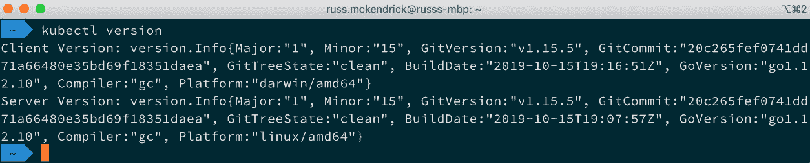

图 11.7 – 检查客户端和服务器的版本

接下来，我们可以运行以下命令查看 `kubectl` 是否能看到我们的节点：

```
$ kubectl get nodes
```

由于我们只有一个节点，所以我们应该只看到一个被列出：

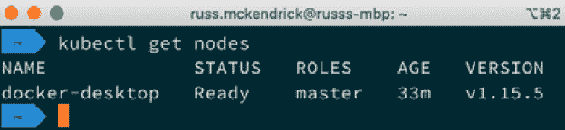

图 11.8 – 列出我们的节点

现在我们的客户端与节点进行交互，我们可以通过运行以下命令查看 Kubernetes 默认配置的命名空间：

```
$ kubectl get namespaces
```

然后我们可以使用以下命令查看某个命名空间内的 Pod：

```
$ kubectl get pods --namespace kube-system 
```

接下来是我运行前面命令时收到的终端输出：

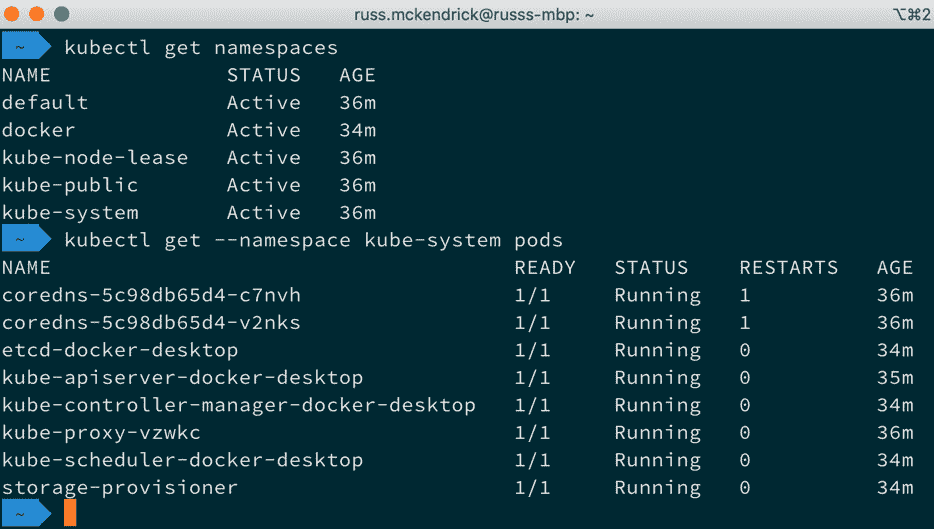

图 11.9 – 检查命名空间

Kubernetes 中的命名空间是隔离集群内资源的好方法。如从终端输出中看到的，我们的集群内有四个命名空间。`default` 命名空间通常是空的。还有两个命名空间用于主要的 Kubernetes 服务：`docker` 和 `kube-system`。这些包含了组成我们集群的 Pod，最后一个命名空间 `kube-public`，和默认命名空间一样，也是空的。

在我们启动自己的 Pod 之前，先快速看看我们如何与正在运行的 Pod 进行交互，从如何获取关于 Pod 更多信息开始：

```
$ kubectl describe pods kube-scheduler-docker-desktop 
--namespace kube-system 
```

前面的命令将打印出 `kube-scheduler-docker-desktop` Pod 的详细信息。你可能会注意到，我们必须通过 `--namespace` 标志传递命名空间。如果不这样做，`kubectl` 会默认为默认命名空间，而那里并没有名为 `kube-scheduler-docker-desktop` 的 Pod 在运行。

命令的完整输出显示在这里，从一些关于 Pod 的基本信息开始：

```
Name:                 kube-scheduler-docker-desktop
Namespace:            kube-system
Priority:             2000000000
Priority Class Name:  system-cluster-critical
Node:                 docker-desktop/192.168.65.3
Start Time:           Sun, 03 May 2020 12:11:02 +0100
```

和 Docker 一样，你可以为 Pod 应用标签。以下截图展示了这一点，并附带了一些关于 Pod 的详细信息：

```
Labels:               component=kube-scheduler
                      tier=control-plane
Annotations:          kubernetes.io/config.hash: 131c3f63daec7c
0750818f64a2f75d20
                      kubernetes.io/config.mirror: 131c3f63daec
7c0750818f64a2f75d20
                      kubernetes.io/config.seen: 
2020-05-03T11:10:56.315367593Z
                      kubernetes.io/config.source: file
Status:               Running
IP:                   192.168.65.3
```

接下来是有关运行在 Pod 中的容器的信息。这里的信息从基本信息开始，如容器 ID、镜像和端口：

```
Containers:
  kube-scheduler:
    Container ID:  docker://1b7ca730cd85941a5550d816239edc14953
f07b98763751ecb1caf7dfcced087
    Image:         k8s.gcr.io/kube-scheduler:v1.15.5
    Image ID:      docker-pullable://k8s.gcr.io/kube-scheduler@
sha256:ec985e27f41e3ceec552440502dbfa723924d5e6d72fc9193d140972
e24b8b77
    Port:          <none>
    Host Port:     <none>
```

接着，我们进入容器内运行的命令：

```
    Command:
      kube-scheduler
      --bind-address=127.0.0.1
      --kubeconfig=/etc/kubernetes/scheduler.conf
      --leader-elect=true
```

现在我们看它的当前状态：

```
    State:          Running
      Started:      Sun, 03 May 2020 12:11:03 +0100
    Ready:          True
    Restart Count:  0
```

然后我们可以看到一些关于其使用情况的信息：

```
    Requests:
      cpu:        100m
    Liveness:     http-get http://127.0.0.1:10251/healthz 
delay=15s timeout=15s period=10s #success=1 #failure=8
    Environment:  <none>
    Mounts:
      /etc/kubernetes/scheduler.conf from kubeconfig (ro)
```

接下来，我们回到关于 Pod 的信息。在这里，我们可以看到当前状态：

```
Conditions:
  Type              Status
  Initialized       True
  Ready             True
  ContainersReady   True
  PodScheduled      True
```

然后，我们可以看到关于 Pod 挂载的卷以及一些其他选项，如**服务质量**（**QoS**）的详细信息：

```
Volumes:
  kubeconfig:
    Type:          HostPath (bare host directory volume)
    Path:          /etc/kubernetes/scheduler.conf
    HostPathType:  FileOrCreate
QoS Class:         Burstable
Node-Selectors:    <none>
Tolerations:       :NoExecute
```

最后，你可以看到列出的事件：

```
Events:
  Type    Reason   Age   From                     Message
  ----    ------   ----  ----                     -------
  Normal  Pulled   39m   kubelet, docker-desktop  Container 
image 'k8s.gcr.io/kube-scheduler:v1.15.5' already present on 
machine
  Normal  Created  39m   kubelet, docker-desktop  Created 
container kube-scheduler
  Normal  Started  39m   kubelet, docker-desktop  Started 
container kube-scheduler
```

如你所见，这里有大量关于 Pod 的信息，包括容器列表；我们只有一个名为 `kube-scheduler` 的容器。我们可以看到容器 ID、使用的镜像、容器启动时的标志，以及 Kubernetes 调度器用于启动和维护 Pod 的数据。

现在我们知道了容器名称，可以开始与之交互。例如，运行以下命令将打印出我们唯一容器的日志：

```
$ kubectl logs kube-scheduler-docker-desktop -c kube-scheduler 
--namespace kube-system 
```

我得到了以下输出：

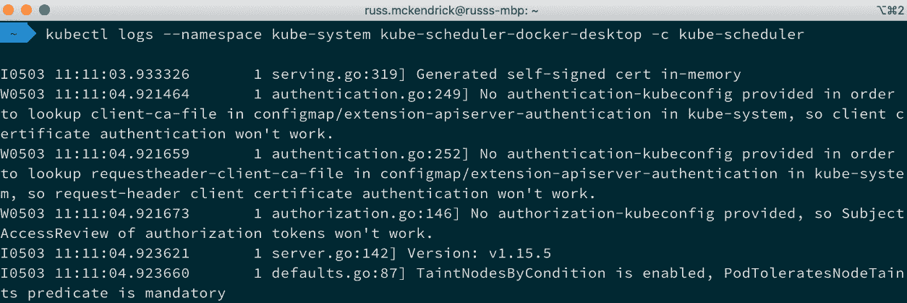

图 11.10 – 检查 pod 中容器的日志

运行以下命令将获取 pod 中每个容器的日志：

```
$ kubectl logs --namespace kube-system kube-scheduler-docker-
desktop
```

与 Docker 类似，你也可以在你的 pod 和容器上执行命令。

提示

请确保在以下两个命令中的`--`后加上空格。如果不加空格，将会导致错误。

例如，以下命令将运行`uname -a`命令：

```
$ kubectl exec --namespace kube-system kube-scheduler-docker-
desktop -c kube-scheduler -- uname -a
$ kubectl exec --namespace kube-system kube-scheduler-docker-
desktop -- uname -a
```

同样，我们可以选择在指定容器上运行命令，或者在 pod 内的所有容器上运行命令：

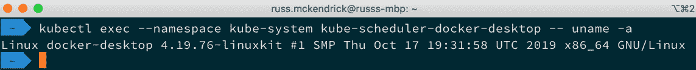

图 11.11 – 在 pod 中运行一个命令跨所有容器

让我们通过安装并登录基于 Web 的仪表板，进一步了解我们的 Kubernetes 集群。

尽管这在 Docker 中默认没有安装，但通过 Kubernetes 项目提供的定义文件安装非常简单。我们只需要运行以下命令：

```
$ kubectl apply -f https://raw.githubusercontent.com/
kubernetes/dashboard/v2.0.0/aio/deploy/recommended.yaml
```

一旦你运行命令，你应该看到类似以下的输出：

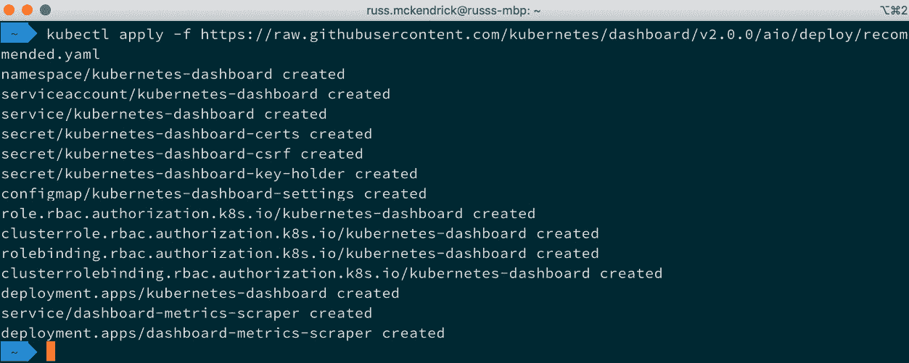

图 11.12 – 部署基于 Web 的仪表板

一旦服务和部署创建完成，启动过程将需要几分钟。你可以通过运行以下命令来检查状态：

```
$ kubectl get namespaces
$ kubectl get deployments --namespace kubernetes-dashboard
$ kubectl get services --namespace kubernetes-dashboard
```

一旦你的输出类似于以下内容，仪表板应该已安装并准备就绪：

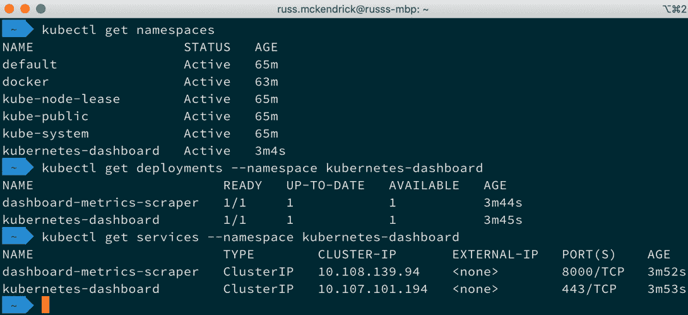

图 11.13 – 检查部署状态

你可能已经注意到，仪表板有自己的命名空间，叫做`kubernetes-dashboard`。现在我们已经让仪表板运行起来，我们将找到访问它的方法。我们可以使用`kubectl`中的内建代理服务来实现。只需运行以下命令来启动它：

```
$ kubectl proxy
```

这将打开一个长时间运行的前台进程：

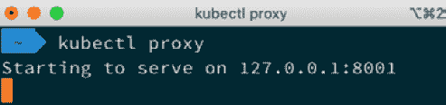

图 11.14 – 启动代理服务

现在代理服务已在运行，打开浏览器并访问 [`127.0.0.1:8001/version/`](http://127.0.0.1:8001/version/) 将显示集群的一些信息：

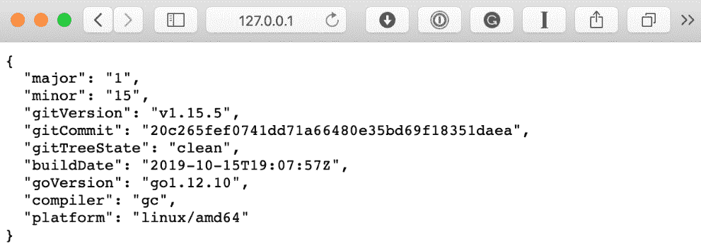

图 11.15 – 集群信息

但是，我们想要看到的是仪表板。可以通过以下 URL 访问它：

[`localhost:8001/api/v1/namespaces/kubernetes-dashboard/services/https:kubernetes-dashboard:/proxy/`](http://localhost:8001/api/v1/namespaces/kubernetes-dashboard/services/https:kubernetes-dashboard:/proxy/)

你应该看到类似于以下的屏幕：

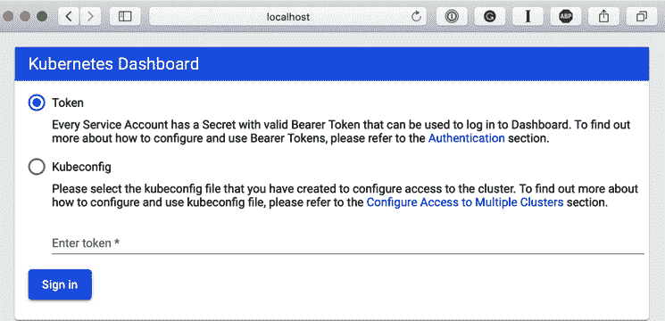

图 11.16 – 仪表板登录界面

如你所见，它要求我们登录；然而，我们还没有创建任何凭证，所以现在让我们创建凭证。

信息

服务账户是一个系统账户，通常使用令牌来验证 Kubernetes API 并执行操作。服务账户可以用于在 Kubernetes 集群内运行的服务，也可以用于我们这种场景，即用户希望使用 API 令牌访问仪表板。

打开一个新的终端窗口并输入以下命令来创建服务账户：

```
$ kubectl create serviceaccount dashboard-admin-sa
```

服务账户将在默认命名空间中创建；然而，这不会是一个问题，因为我们现在将通过运行以下命令为服务账户分配 `cluster-admin` 角色：

```
$ kubectl create clusterrolebinding dashboard-admin-sa --clusterrole=cluster-admin --serviceaccount=default:dashboard-admin-sa
```

这应该已经创建了一个密钥，我们可以通过运行以下命令找到密钥的名称：

```
$ kubectl get secrets
```

以下终端输出展示了至今为止所采取的步骤：

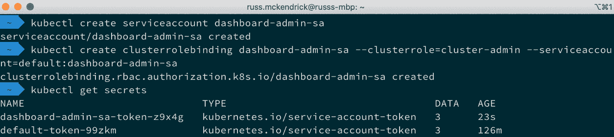

图 11.17 – 创建服务账户、分配权限并查看密钥

现在，我们的服务账户已经创建，权限已经正确设置，并且我们知道了密钥的名称（你的密钥名称会有所不同，因为密钥名称会附加一个五个字符的随机字符串），我们可以获取需要的令牌副本以便登录。

我们只需运行以下命令，确保将密钥名称更新为你自己的：

```
$ kubectl describe secret dashboard-admin-sa-token-z9x4g
```

这应该会给你类似于以下的终端输出：

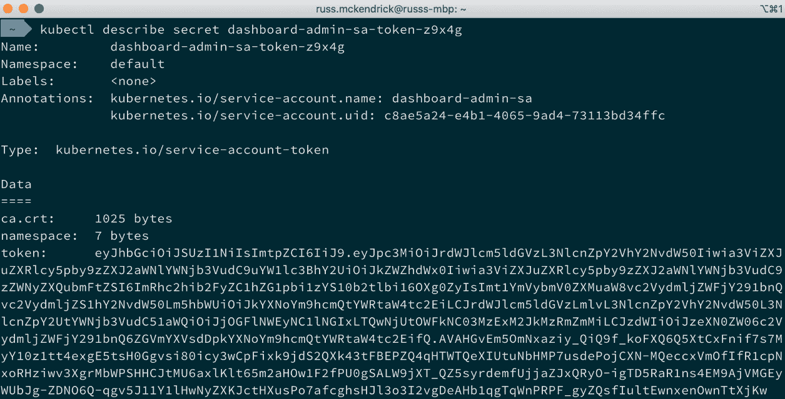

图 11.18 – 查看密钥

记下令牌并将其输入仪表板登录页面中提供的令牌框中，然后点击**登录**按钮。登录后，你将看到类似以下页面的内容：

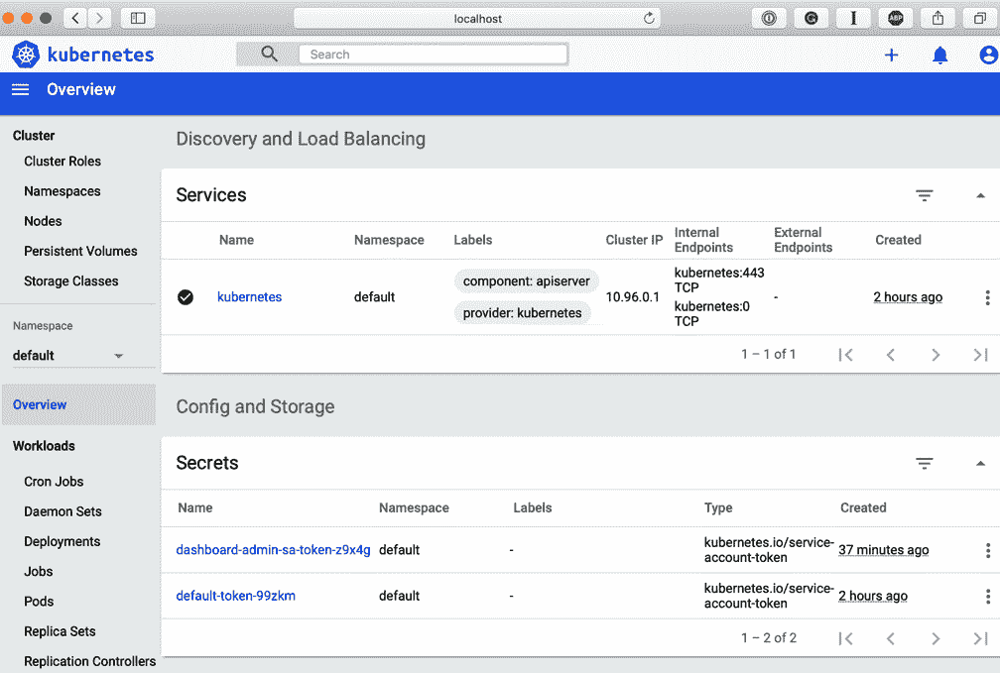

图 11.19 – 仪表板首次登录

如你所见，仪表板使用的是`default`命名空间。默认情况下，点击命名空间名称将打开一个下拉列表，显示所有可用的命名空间。现在，从列表顶部选择**所有命名空间**，你会注意到视图发生了变化，概览页面上显示了更多的信息。

现在我们的集群已经启动并运行，我们可以开始启动一些示例应用程序了。

# Kubernetes 和其他 Docker 工具

当我们启用 Kubernetes 时，我们选择了 `docker stack` 命令以在 Docker Swarm 中启动我们的 Docker Compose 文件，正如你可能已经猜到的那样，运行这些相同的命令现在将会在我们的 Kubernetes 集群中启动我们的堆栈。

我们使用的 Docker Compose 文件如下所示：

```
version: '3'
services:
  cluster:
    image: russmckendrick/cluster
    ports:
      - '80:80' deploy:
    replicas: 6
    restart_policy:
      condition: on-failure
    placement:
      constraints:
        - node.role == worker
```

在我们启动 Kubernetes 上的应用程序之前，我们需要做一个小调整，移除 `placement`，这使得我们的文件看起来像以下内容：

```
version: '3'
services:
  cluster:
    image: russmckendrick/cluster
    ports:
      - '80:80' deploy:
    replicas: 6
    restart_policy:
      condition: on-failure
```

一旦文件编辑完成，运行以下命令将启动堆栈：

```
$ docker stack deploy --compose-file=docker-compose.yml cluster
```

如你所见，Docker 会等待堆栈可用后才返回到命令提示符：

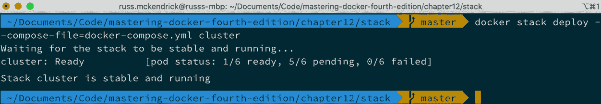

图 11.20 – 启动堆栈

我们还可以运行与启动 Docker Swarm 集群时查看堆栈信息相同的命令：

```
$ docker stack ls
$ docker stack services cluster
$ docker stack ps cluster
```

终端输出给出了与我们使用 Docker Swarm 集群启动堆栈时类似的输出：

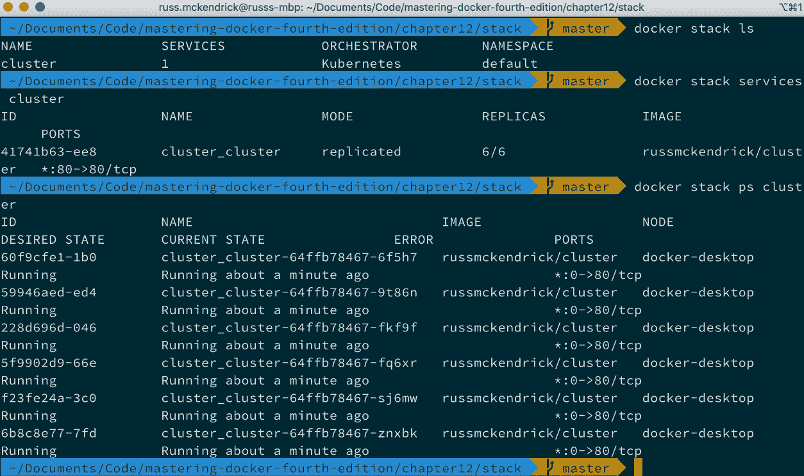

图 11.21 – 运行 Docker 堆栈命令

然而，请注意，在写作时，似乎`docker stack services`返回了错误，这个问题是由于 Docker 随附的 Kubernetes 版本更新后引入的。

我们还可以使用`kubectl`查看详细信息：

```
$ kubectl get deployments
$ kubectl get services
```

您可能已经注意到，这次我们不需要提供命名空间。这是因为我们的堆栈是在默认命名空间中启动的：

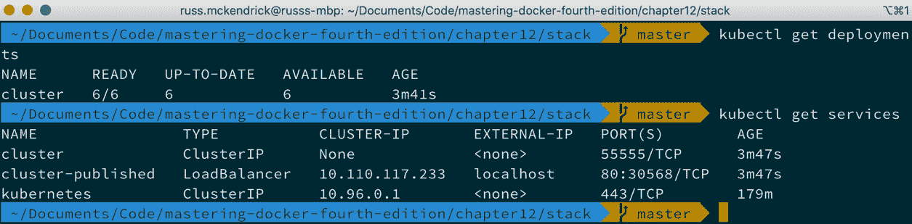

图 11.22 – 查看部署和服务的详细信息

同时，当列出服务时，显示了`localhost`和端口为`80`。

在浏览器中打开`http://localhost/`，显示应用程序：

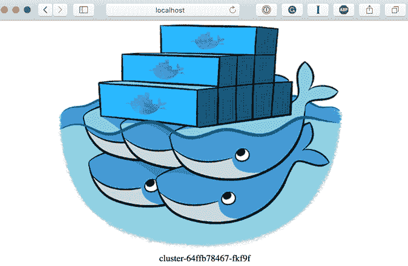

图 11.23 – 查看在 Kubernetes 中运行的集群应用程序

如果您仍然打开着仪表盘，可以探索您的堆栈，甚至打开终端连接到某个容器：

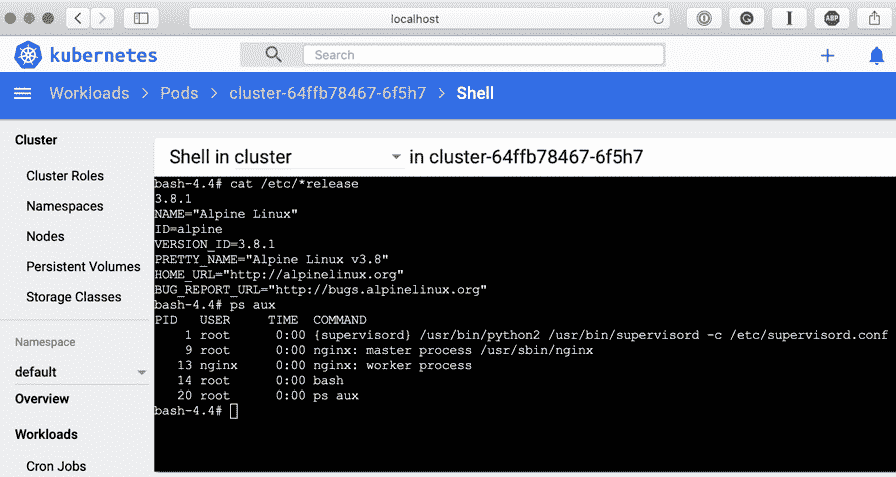

图 11.24 – 打开终端连接到容器

这是通过选择集群部署的六个 Pod 中的一个，然后点击下图中突出显示的**进入 Pod**按钮完成的：

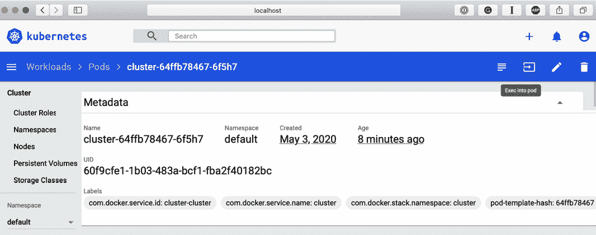

图 11.25 – 进入 Pod

您可以通过运行以下命令来删除堆栈：

```
$ docker stack rm cluster
```

还有一件事…您可能会想，“太好了，我可以在任何 Kubernetes 集群中运行我的 Docker Compose 文件。”但这并不完全准确。

如前所述，当我们第一次启用 Kubernetes 时，会启动一些仅限 Docker 的组件。这些组件确保 Docker 尽可能紧密地集成。然而，由于这些组件在非 Docker 管理的集群中不存在，因此您将无法使用`docker stack`命令。

但幸运的是，并不是一切都失去了。有一个名为**Kompose**的工具，它是 Kubernetes 项目的一部分，可以将 Docker Compose 文件实时转换为 Kubernetes 定义文件。

要在 macOS 上使用 Homebrew 安装 Kompose，请运行以下命令：

```
$ brew install kompose
```

Windows 10 用户可以使用 Chocolatey。

信息

在 Linux 机器上使用`yum`或`apt-get`，在 macOS 上使用`brew`。

要使用 Chocolatey 安装 Kompose，您可以运行以下命令：

```
$ choco install kubernetes-kompose
```

安装完成后，您可以通过运行以下命令启动您的 Docker Compose 文件：

```
$ kompose up
```

您将得到类似以下输出的结果：

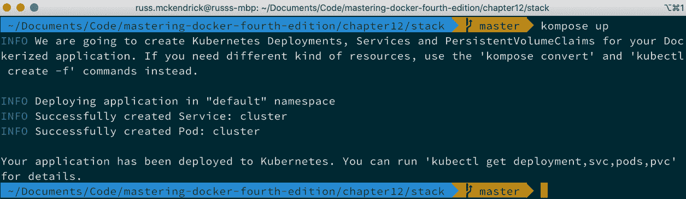

图 11.26 – 运行 kompose up

如输出所示，运行以下命令将显示我们刚刚启动的服务和 Pod 的详细信息：

```
$ kubectl get deployment,svc,pods,pvc
```

如你所见，我们的 Docker Compose 应用程序已经启动并运行：

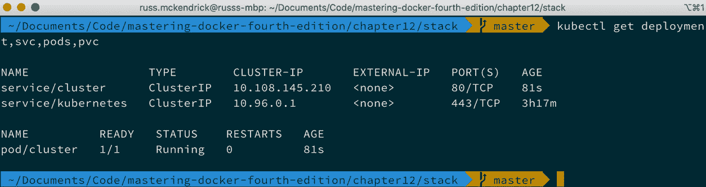

图 11.27 – 检查应用程序的状态

你可以通过运行以下命令来删除服务和 Pod：

```
$ kompose down
```

这样你应该能得到类似以下内容：

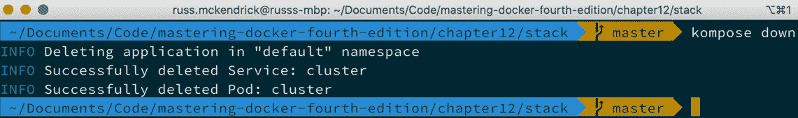

图 11.28 – 运行 kompose down

虽然你可以使用 `kompose up` 和 `kompose down`，但我建议你生成 Kubernetes 定义文件并根据需要进行调整。为此，只需运行以下命令：

```
$ kompose convert
```

你会注意到，执行此命令会生成两个文件：

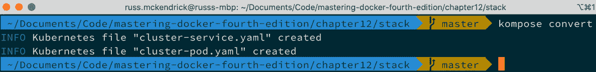

图 11.29 – 运行 kompose convert

你将能够看到 Docker Compose 文件和生成的两个文件之间的明显差异。`cluster-pod.yaml` 文件看起来如下：

```
apiVersion: v1
kind: Pod
metadata:
  creationTimestamp: null
  labels:
    io.kompose.service: cluster
  name: cluster
spec:
  containers:
  - image: russmckendrick/cluster
    name: cluster
    ports:
    - containerPort: 80
    resources: {}
  restartPolicy: OnFailure
status: {}
And the cluster-service.yaml file contains the following:
apiVersion: v1
kind: Service
metadata:
  annotations:
    kompose.cmd: kompose convert
    kompose.version: 1.21.0 ()
  creationTimestamp: null
  labels:
    io.kompose.service: cluster
  name: cluster
spec:
  ports:
  - name: '80'
    port: 80
    targetPort: 80
  selector:
    io.kompose.service: cluster
status:
  loadBalancer: {}
```

你可以通过运行以下命令来启动这些文件：

```
$ kubectl create -f cluster-pod.yaml
$ kubectl create -f cluster-service.yaml
$ kubectl get deployment,svc,pods,pvc
```

如果你没有跟着一起操作，以下截图显示了终端的输出：

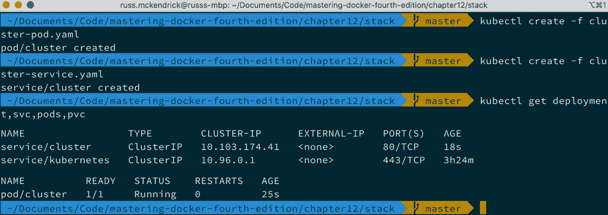

图 11.30 – 使用 cluster-pod.yaml 和 cluster-service.yaml 启动应用程序

要删除集群 Pod 和服务，我们只需运行以下命令：

```
$ kubectl delete service/cluster pod/cluster
```

虽然我们将在接下来的两章中继续使用这个方法，但你可能想要在 Docker 桌面版中禁用 Kubernetes 集成，因为它在主机空闲时会对机器带来轻微的负担。要做到这一点，只需取消勾选**启用 Kubernetes**。当你点击**应用**时，Docker 将停止所有需要运行 Kubernetes 的容器；但它不会删除镜像，这样当你重新启用时，启动的时间不会太长。

# 总结

在本章中，我们从 Docker 桌面版软件的角度看待 Kubernetes。Kubernetes 远不止我们在本章中所涉及的内容，请不要认为这就是全部。在讨论了 Kubernetes 的起源后，我们介绍了如何使用 Docker for Mac 或 Docker for Windows 在本地计算机上启用 Kubernetes。

然后我们讨论了 kubectl 的一些基本用法，接着介绍了如何使用 `docker stack` 命令来启动我们的应用程序，方法与 Docker Swarm 中相同。

本章最后，我们讨论了 Kompose，这是 Kubernetes 项目中的一个工具。它帮助你将 Docker Compose 文件转换为 Kubernetes 兼容格式，让你能够提前开始将应用程序迁移到纯 Kubernetes 环境中。

虽然我们在本章中一直提到 Kubernetes 集群，但实际上我们一直在运行一个单节点集群，这实际上根本算不上集群。

在下一章，我们将探讨如何在本地启动 Kubernetes 的更多选项。这里，我们将欢迎 Linux 用户的回归，并且还将查看启动多个节点的选项。

# 问题

1.  判断题：当执行`docker image ls`命令时，结果是什么？

1.  哪个命名空间托管着用于运行 Kubernetes 并启用 Docker 支持的容器？

1.  你会运行哪个命令来查看运行在 Pod 中的容器的详细信息？

1.  你会使用哪个命令来启动 Kubernetes 定义的 YAML 文件？通常，`kubectl proxy`命令会在你的本地机器上打开哪个端口？

1.  Google 容器编排平台的原始名称是什么？

# 进一步阅读

本章开始时提到的一些 Google 工具、演示文稿和白皮书可以在这里找到：

+   cgroups：[`man7.org/linux/man-pages/man7/cgroups.7.html`](http://man7.org/linux/man-pages/man7/cgroups.7.html)

+   lmctfy：[`github.com/google/lmctfy/`](https://github.com/google/lmctfy/)

+   Joe Beda 在 GluCon 上的《大规模容器管理》幻灯片：[`slides.eightypercent.net/GlueCon%202014%20-%20Containers%20At%20Scale.pdf`](http://slides.eightypercent.net/GlueCon%202014%20-%20Containers%20At%20Scale.pdf)

+   Google 的大规模集群管理与 Borg：[`ai.google/research/pubs/pub43438`](https://ai.google/research/pubs/pub43438)

+   LXC：[`linuxcontainers.org/`](https://linuxcontainers.org/)

你可以在这里找到本章提到的云服务的详细信息：

+   **Google Kubernetes Engine**（**GKE**）：[`cloud.google.com/kubernetes-engine`](https://cloud.google.com/kubernetes-engine)

+   **Azure Kubernetes Service**（**AKS**）：[`azure.microsoft.com/en-gb/services/kubernetes-service/`](https://azure.microsoft.com/en-gb/services/kubernetes-service/)

+   亚马逊**弹性容器服务（Kubernetes）**（**Amazon EKS**）：[`aws.amazon.com/eks/`](https://aws.amazon.com/eks/)

+   IBM Cloud Kubernetes 服务：[`www.ibm.com/cloud/container-service`](https://www.ibm.com/cloud/container-service)

+   Oracle 容器引擎（Kubernetes）：[`cloud.oracle.com/containers/kubernetes-engine`](https://cloud.oracle.com/containers/kubernetes-engine)

+   DigitalOcean 上的 Kubernetes：[`www.digitalocean.com/products/kubernetes/`](https://www.digitalocean.com/products/kubernetes/)

你可以在这里找到 Docker 关于 Kubernetes 支持的公告：

+   Docker 平台和 Moby 项目添加了 Kubernetes：[`www.docker.com/blog/top-5-blogs-2017-docker-platform-moby-project-add-kubernetes/`](https://www.docker.com/blog/top-5-blogs-2017-docker-platform-moby-project-add-kubernetes/)

最后，Kompose 的主页可以在这里找到：

+   Kompose：[`kompose.io/`](http://kompose.io/)
