*第十二章*

# 第十二章：探索其他 Kubernetes 选项

在这一章中，我们将讨论使用 Docker 内建支持来运行您自己的本地 Kubernetes 单节点和多节点集群的替代方案。

我们将讨论并查看以下工具：

+   Minikube

+   **Kind**（**Kubernetes in Docker**）

+   MicroK8s

+   K3s

# 技术要求

我们将使用我们在*第六章*中讨论的工具之一，*Docker Machine、Vagrant 和 Multipass*，以及一些可以用于引导您本地 Kubernetes 安装的独立工具。

再次提醒，本章中的截图将来自我偏好的操作系统——macOS

查看以下视频，看看代码实际操作：[`bit.ly/3byY104`](https://bit.ly/3byY104)。

# 使用 Minikube 部署 Kubernetes

在我们讨论的所有 Kubernetes 集群安装器中，Minikube 排在第一位。它最初于 2016 年 5 月发布，是我们在本章中讨论的工具中最古老的一个。

在我们讨论安装 Minikube 之前，或许我们应该先讨论一下为什么最初需要它。

在最初发布时，Kubernetes `1.2`已经发布了几个月，而距离 Kubernetes `1.0` 的发布几乎已经过去了一年。

尽管自最初发布以来，安装 Kubernetes 已变得更加简单，但它通常仍然归结为一堆安装脚本和逐步指令，这些指令大多数是为了引导使用云服务提供商 API 或命令行工具的云托管集群而设计的。

如果您想在本地进行开发目的的安装，那么您必须从现有脚本中拼凑出安装程序，或者下载一个 Vagrant box，在这种情况下，您需要信任该 box 的作者，认为他们按照**云原生计算基金会**（**CNCF**）所提倡的最佳实践来构建它，这样可以确保集群之间的一致性。

尽管 Minikube 最初是作为在 Linux 和 macOS 主机上创建本地 Kubernetes 节点的方式开始的，但很快就加入了 Windows 支持，且该项目已经发展成为 Kubernetes 项目中的一个重要组成部分，因为它是许多人第一次接触 Kubernetes 的途径，并且它是官方 Kubernetes 文档的一部分。

现在我们对 Minikube 的背景有了一些了解，让我们看看如何安装它并启动一个单节点集群。

## 安装 Minikube

Minikube 设计用于运行一个单一的二进制文件，像 Kubernetes 本身一样，它是用 Go 编写的，这意味着它可以轻松编译并在我们在本书中讨论的三个平台上运行。首先，让我们看看如何在 macOS 上安装 Minikube。

### 在 macOS 上安装 Minikube

在我们前面的章节中讨论 macOS 上的软件和工具安装时，我们提到了并使用了 Homebrew。

安装 Minikube 的方式是这样的，这意味着你可以通过一个简单的命令来安装，正如你可能已经猜到的那样，命令如下：

```
$ brew install minikube
```

安装完成后，你可以通过运行以下命令验证一切是否按预期工作：

```
$ minikube version
```

这将输出已安装的 Minikube 版本以及该版本编译时的提交 ID。

### 在 Windows 10 上安装 Minikube

与 macOS 上的 Homebrew 类似，在 Windows 上谈到包管理器时，首选的是 Chocolatey。如果你已经安装了它，可以使用以下命令安装 Minikube：

```
$ choco install minikube
```

如果你没有使用 Chocolatey，那么可以从 [`storage.googleapis.com/minikube/releases/latest/minikube-installer.exe`](https://storage.googleapis.com/minikube/releases/latest/minikube-installer.exe) 下载 Windows 安装程序。

一旦 Minikube 安装完成，你可以运行以下命令：

```
$ minikube version
```

这将确认已安装的版本和提交信息。

### 在 Linux 上安装 Minikube

根据你所运行的 Linux 版本，安装 Minikube 的方式有所不同。

提示

在执行接下来的命令之前，请查看 GitHub 上的项目发布页面，确认要安装哪个版本的 Minikube。该页面可以在 [`github.com/kubernetes/minikube/releases/`](https://github.com/kubernetes/minikube/releases/) 找到。写本文时，最新发布的版本是 1.9.2-0，因此本说明将使用该版本。

如果你正在运行基于 Debian 的系统，比如 Ubuntu 或 Debian 本身，那么你可以使用以下命令下载并安装 `.deb` 包：

```
$ MK_VER=1.9.2-0
$ curl -LO https://storage.googleapis.com/minikube/releases/
latest/minikube_$MK_VER_amd64.deb
$ sudo dpkg -i minikube_$MK_VER _amd64.deb
```

如果你正在运行基于 RPM 的系统，如 CentOS 或 Fedora，你可以使用以下命令：

```
$ MK_VER=1.9.2-0
$ curl -LO https://storage.googleapis.com/minikube/releases/
latest/minikube-$MK_VER.x86_64.rpm
sudo rpm -ivh minikube-$MK_VER.x86_64.rpm
```

最后，如果你不想使用包管理器，你可以使用以下命令下载最新的静态二进制文件：

```
$ curl -LO https://storage.googleapis.com/minikube/releases/
latest/minikube-linux-amd64
$ sudo install minikube-Linux-amd64 /usr/local/bin/minikube
```

无论你选择了哪种方式来安装 Minikube，你可以运行以下命令确认一切是否已经安装并按预期工作：

```
$ minikube version
```

同样，这将确认已安装的版本和它的编译提交。

### Minikube 驱动程序

如前所述，Minikube 是一个独立的静态二进制文件，帮助你在本地机器上启动一个 Kubernetes 节点；它通过与多个虚拟化管理程序交互来实现这一功能。在我们开始使用 Minikube 之前，先快速了解一下可选项：

+   **Docker (macOS、Windows 和 Linux)**：此驱动程序使用 Docker Machine 启动容器来托管 Kubernetes 节点。在 Linux 上，它只会使用容器，而在 macOS 和 Windows 上，它也会启动一个小型虚拟机，并在其中部署容器。

+   **VirtualBox (macOS、Windows 和 Linux)**：这个驱动程序适用于三种操作系统，它会启动一个虚拟机，然后配置你的节点。

+   **HyperKit (macOS)**：它使用 macOS 内置的虚拟化管理程序来托管一个虚拟机，在这个虚拟机中配置你的节点。

+   **Hyper-V (Windows 10 Pro)**：此驱动程序使用 Windows 10 专业版内置的本地虚拟化程序来托管一个虚拟机，在其中启动并配置你的节点。

+   **KVM2 (Linux)**：此驱动程序使用 **（基于内核的虚拟机 KVM）** 启动虚拟机。

+   **Podman (Linux)**：此实验性驱动程序使用一个名为 Podman 的 Docker 替代品来启动构成集群的容器。

+   **Parallels (macOS)**：使用仅限 macOS 的 Parallels 来托管一个虚拟机，在其中启动并配置你的节点。

+   **VMware (macOS)**：使用仅限 macOS 的 VMware Fusion 来托管一个虚拟机，在其中启动并配置你的节点。

+   **None (Linux)**：这个最终选项不使用在本地虚拟化程序中启动的容器和虚拟机；它直接在你运行的宿主机上安装集群节点。

如果你已经读到这里，那么你应该已经在宿主机上安装了上述提到的至少一个驱动程序的先决条件。Minikube 足够智能，可以判断出宿主机上最适合使用的驱动程序，因此我们可以继续进行，而不用担心会出现问题。

然而，如果因为找不到所选宿主操作系统的支持驱动程序而导致错误，请参阅 *进一步阅读* 部分，获取每个先前项目的链接。

提示

如果你发现没有支持的驱动程序安装，我建议安装 VirtualBox，因为它比所有驱动程序的要求和复杂性都要低。

现在我们已经安装了 Minikube，并且了解了它需要的驱动程序来启动并配置你的集群节点，我们可以开始工作并启动我们的集群节点。

使用 Minikube 启动集群节点

无论你的宿主操作系统是什么，使用 Minikube 启动 Kubernetes 集群节点只需要一个简单的命令：

```
$ minikube start
```

当你第一次运行命令时，在检测到本地配置后，可能需要几分钟的时间，因为它必须下载并配置各种支持工具、虚拟机镜像和容器（取决于它使用的驱动程序）。

你可能还会发现，它在安装过程中会要求输入密码，用于需要提升权限的部分。这个步骤是一次性的，一旦你启动了初始 Kubernetes 集群节点，之后的集群节点启动应该会更快。

以下是我的初始 Minikube 集群节点启动的终端输出：

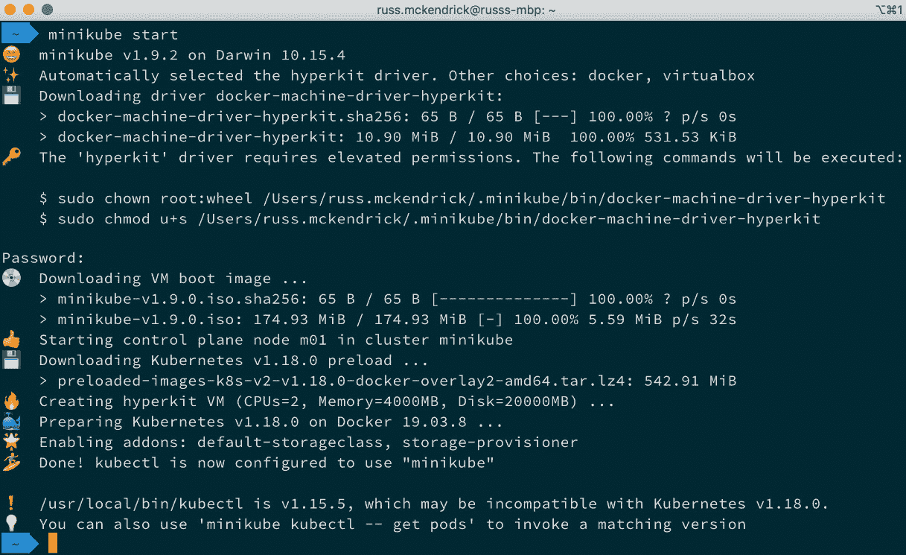

图 12.1 – 在 macOS 上启动 Kubernetes 集群节点

一旦集群节点启动并运行，你可能会注意到输出底部的消息，提示 `kubectl` 的版本已过时，并且可能与在 Minikube 启动的集群节点上安装的 Kubernetes 版本不兼容。

幸运的是，您可以通过在 `kubectl` 命令前加上 `minikube`，并在后面加上 `–` 来解决此问题。这将下载并安装与 `kubectl` 兼容的版本，但它将在我们的 Minikube 工作空间中被隔离：

```
$ minikube kubectl -- get pods
```

您应该看到类似以下的输出：

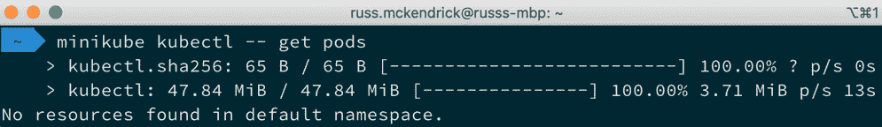

图 12.2 – 使用 Minikube 初始化兼容版本的 kubectl

那么，为什么我们一开始会收到这个消息呢？好吧，Mac 版 Docker 的安装包中捆绑了一个支持 Docker 本地支持的 Kubernetes 版本的 `kubectl`，而该版本的 Kubernetes 在写作时是版本 `1.15.5`，而 Minikube 拉取的是 Kubernetes 的最新稳定版本 `1.18.0`。

使用 Minikube 而不是本地 Docker 支持的 Kubernetes 的一个优势是，您可以运行不同版本的 Kubernetes，并通过在 `kubectl` 命令前加上 `minikube`，并在后面加上 `--`，轻松隔离与不同版本交互所需的支持工具版本。

当您需要测试应用程序在更新生产 Kubernetes 集群时如何反应时，这非常有用。

## 与您的 Kubernetes 集群节点交互

现在我们已经启动了集群节点，我们可以运行一些常见命令并启动一个测试应用程序。

首先，让我们获取一些关于集群节点的信息。在*第十一章**, Docker 和 Kubernetes*中，我们运行了以下命令来获取集群节点和命名空间的信息：

```
$ kubectl get nodes
$ kubectl get namespaces
```

让我们再次运行这些命令，记得在每个命令前加上 `minikube`，并在后面加上 `--`，使其看起来像这样：

```
$ minikube kubectl -- get nodes
$ minikube kubectl -- get namespaces
$ minikube kubectl -- get --namespace kube-system pods
```

请查看以下终端输出：

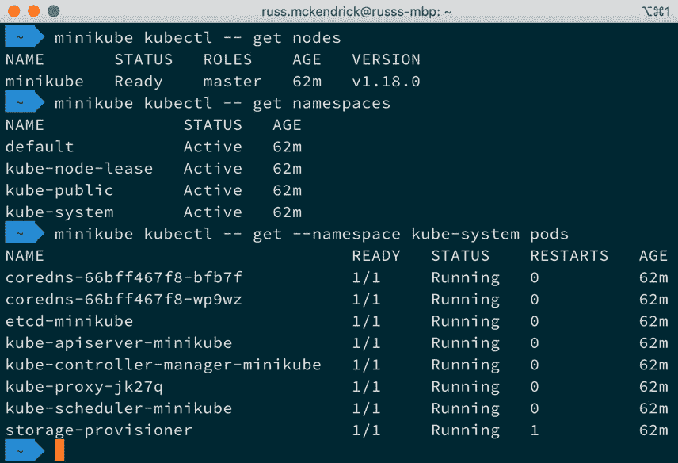

图 12.3 – 获取集群节点信息

当我们运行这些命令时，输出结果与在*第十一章*中执行等效命令时得到的结果类似，*Docker 和 Kubernetes*，尽管列出的 `kube-system` 命名空间中的 pods 不同。

接下来，我们可以通过运行以下命令来启动一个测试应用程序：

```
$ minikube kubectl -- create deployment hello-node --image=k8s.
gcr.io/echoserver:1.4
```

部署创建完成后，您可以运行以下命令查看其状态和相关的 pod：

```
$ minikube kubectl -- get deployments
$ minikube kubectl -- get pods
```

您应该看到类似以下的终端输出：

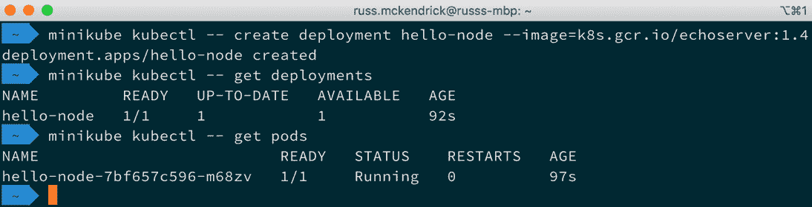

图 12.4 – 启动应用程序部署并检查状态

现在我们的应用程序部署已启动，我们需要一种与其交互的方式。为此，我们可以运行以下命令，这将启动一个位于端口 `8080` 的负载均衡器服务：

```
$ minikube kubectl -- expose deployment hello-node 
--type=LoadBalancer --port=8080
```

一旦服务被暴露，我们可以运行以下命令获取更多正在运行的服务信息：

```
$ minikube kubectl -- get services
```

如果我们的集群节点托管在公共云上，命令将告诉我们服务的外部 IP 地址。然而，当我们运行命令时，得到如下输出：

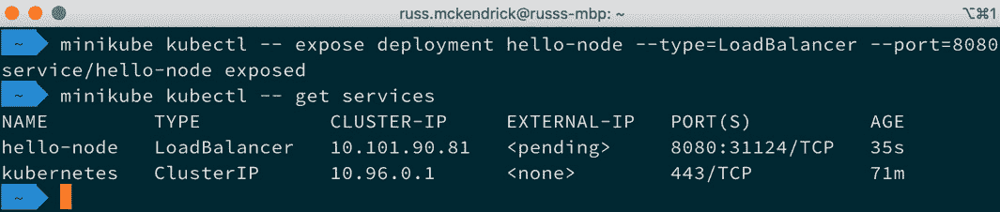

图 12.5 – 在 8080 端口公开服务

如您所见，`EXTERNAL-IP` 显示为 `<pending>`，那么我们如何访问我们部署的应用程序呢？

为此，我们需要使用以下命令：

```
$ minikube service hello-node
```

该命令将打开 `hello-node` 服务在您机器的默认浏览器中，并在终端中打印出您可以访问该服务的 URL：

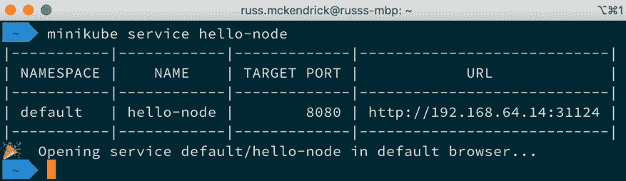

图 12.6 – 打开 hello-node 服务

`hello-node` 应用程序只是回显浏览器发送的请求头：

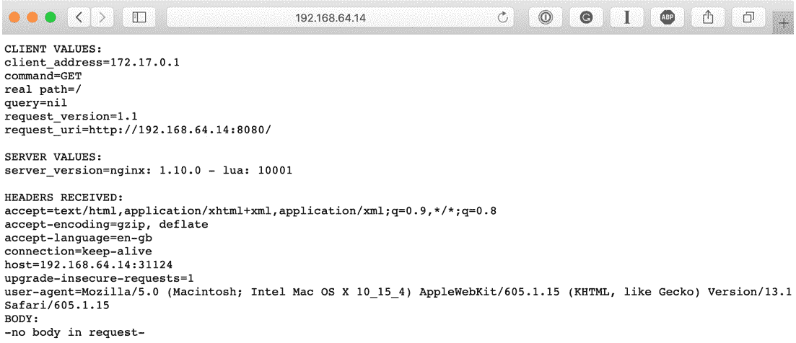

图 12.7 – 在浏览器中查看 hello-node 应用程序

在我们完成对 Minikube 的查看之前，我们应该看看如何启动我们在前几章中运行的集群应用程序。为此，运行以下命令来创建部署，公开服务，并获取正在运行的 Pod 和服务的一些信息：

```
$ minikube kubectl -- create deployment cluster 
--image=russmckendrick/cluster:latest
$ minikube kubectl -- expose deployment cluster 
--type=LoadBalancer --port=80
$ minikube kubectl -- get svc,pods
```

启动后，我们可以通过运行以下命令列出集群节点上所有公开服务的 URL：

```
$ minikube service list
```

在浏览器中打开集群服务的 URL 应该会显示应用程序，如预期所示：

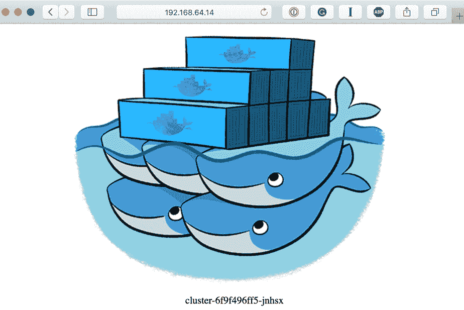

图 12.8 – 在浏览器中查看集群应用程序

在我们继续下一个工具之前，让我们快速查看一下其他一些 Minikube 命令。

## 管理 Minikube

我们可以使用一些其他命令来管理我们的集群节点。其中第一个命令允许您快速访问 Kubernetes 仪表盘。

### Minikube 仪表盘

使用 Minikube 访问 Kubernetes 仪表盘稍微简单一点；事实上，它只需要一个命令：

```
$ minikube dashboard
```

这将启用仪表盘，启动代理，并在您的默认浏览器中打开仪表盘：

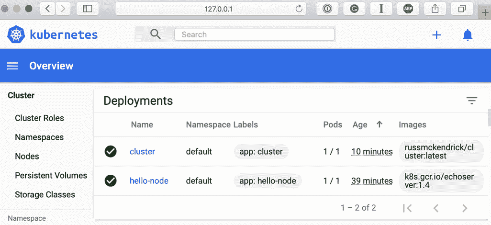

图 12.9 – 查看 Kubernetes 仪表盘

这次不需要额外配置认证工作。此外，您可以使用以下命令直接获取访问仪表盘所需的 URL：

```
$ minikube dashboard
```

这将返回类似如下的输出：

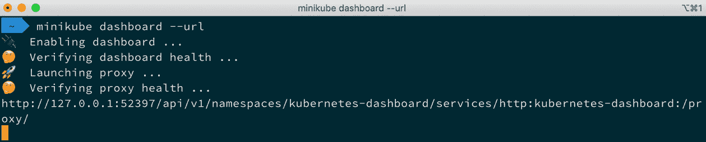

图 12.10 – 获取仪表盘 URL

现在让我们来看一下如何启动不同版本的 Kubernetes。

### Minikube 启动时使用的 Kubernetes 版本

当我们第一次启动集群节点时，我提到过可以启动一个运行不同版本 Kubernetes 的集群节点。使用以下命令，我们可以启动一个运行 Kubernetes `v1.15.5` 的第二个集群节点，这也是 Docker for Mac 当前支持的版本：

```
$ minikube start --kubernetes-version=1.15.5 -p node2
```

这个命令应该会显示类似于我们最初启动集群节点时所看到的输出：

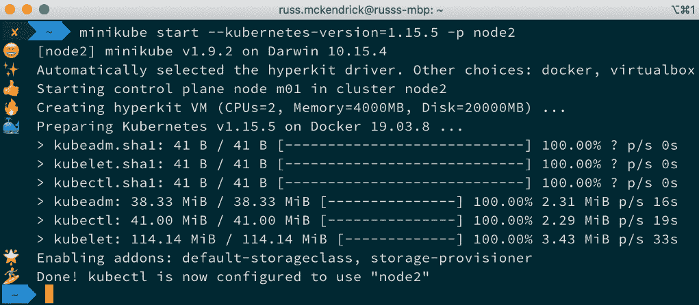

图 12.11 – 在第二个集群节点上安装 Kubernetes v1.15.5

如你所见，这个过程相当简单，这次我们没有收到关于本地安装的 `kubectl` 可能存在兼容性问题的警告。

我们可以通过运行以下命令查看不同的集群节点：

```
$ minikube profile list
```

这将列出可用的集群节点。要检查当前使用的是哪个节点，请运行以下命令：

```
$ minikube profile
```

要切换到其他集群节点，请运行此命令：

```
$ minikube profile node2
```

确保使用你想要切换到的集群节点名称：

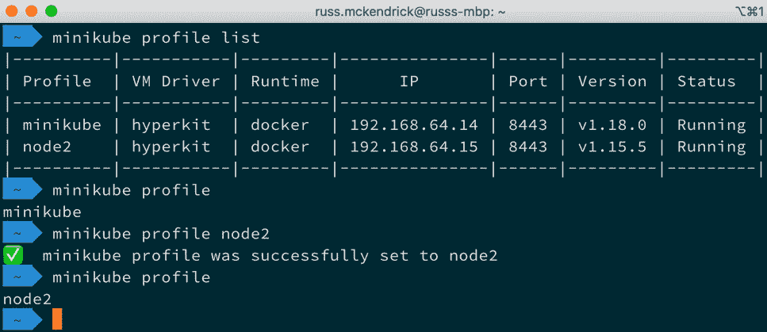

图 12.12 – 切换集群节点

现在我们可以切换集群节点，那如何访问这些节点呢？

### Minikube SSH

虽然你不需要直接访问集群节点，但你可以运行这个命令以获取当前选定集群节点的 Shell 访问权限：

```
$ minikube ssh
```

如果你想了解背后的原理，这个命令非常有用。

### Minikube 停止并删除

我们接下来要看的最后一组命令是停止集群节点或完全移除它们的命令；你可能已经猜到，停止节点的命令是：

```
$ minikube stop
```

这将停止当前选定的集群节点，可以通过以下命令轻松重新启动：

```
$ minikube start
```

你可以添加 `-p <profile name>` 来停止或启动另一个集群节点。要移除集群节点，你可以运行这个命令：

```
$ minikube delete
```

这将移除当前选定的集群节点。同样，你可以添加 `-p <profile name>` 来与其他集群节点交互。运行以下命令将删除所有集群节点：

```
$ minikube delete --all 
```

运行 `minikube delete` 命令时没有警告或“确定吗？”的提示，因此请小心操作。

## Minikube 概览

正如我相信你会同意的，Minikube 选项丰富，使用起来非常简便。由于它是 Kubernetes 项目的一部分，你会发现它总是提供比在 Docker for Mac 或 Docker for Windows 上启用 Kubernetes 更为最新的 Kubernetes 体验，并且它还支持 Linux。

最后，你还可以获得一个更接近 CNCF 兼容的 Kubernetes 集群环境，这个环境运行在公共云上，我们将在 *第十三章* 中详细讲解，*在公共云中运行 Kubernetes*。

Minikube 采用类似于 Docker 的方法，通过部署一个小型托管虚拟机来运行你的环境。我们接下来要介绍的工具，采用了一种更现代的、在撰写时仍为实验性的方式来运行 Kubernetes。

# 使用 kind 部署 Kubernetes

接下来我们要介绍的工具是 Kind，**Kubernetes in Docker**的缩写。正如其名字所示，它就是将 Kubernetes 集群节点压缩成一个容器。Kind 是一个非常新的项目——事实上，它在写作时仍在进行大量活跃的开发。因此，我们不会花太多时间在它上面。

## 安装 Kind

和 Minikube 一样，Kind 作为一个单独的静态二进制文件进行分发——这意味着它的安装过程非常相似。

要在 macOS 上安装它，我们需要运行以下命令：

```
$ brew install kind
```

在 Windows 上，运行以下命令：

```
$ choco install kind
```

最后，在 Linux 上，你可以运行以下命令：

```
$ KIND_VER=v0.8.1
$ curl -LO https://kind.sigs.k8s.io/dl/$KIND_VER/kind-$(uname)-
amd64
$sudo install kind-$(uname)-amd64 /usr/local/bin/kind
```

你可以在[`github.com/kubernetes-sigs/kind/releases/`](https://github.com/kubernetes-sigs/kind/releases/)找到确认版本号的发布页面。

由于我们已经安装了 Docker，我们不需要担心驱动程序、虚拟机管理程序或任何其他支持虚拟机的内容，因为 Kind 将直接使用我们本地的 Docker 安装。

## 启动 Kind 集群

一旦安装了 Kind 二进制文件，启动集群节点是一个非常简单的过程；只需运行以下命令：

```
$ kind create cluster
```

如下所示的终端输出将下载必要的镜像，并配置集群以及在本地 Docker 主机上创建一个上下文，以便你可以使用`kubectl`与集群节点交互：

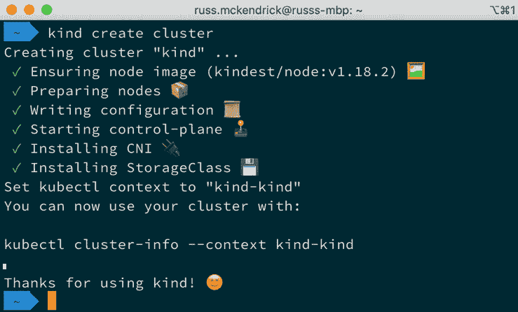

图 12.13 – 使用 Kind 启动集群节点

现在我们的集群节点已经启动并运行，我们来做点什么吧。

## 与你的 Kubernetes 集群节点交互

现在我们的集群节点已经启动并运行，我们可以像本章前面部分那样重新运行命令并启动一个测试应用程序。

这次，我们将使用 Docker 主机上的`kubectl`命令，而不是使用包装器；然而，我们会添加一个上下文，以确保使用我们的 Kind Kubernetes 节点集群。这意味着我们需要运行的命令如下所示：

```
$ kubectl --context kind-kind get nodes
$ kubectl --context kind-kind get namespaces
$ kubectl --context kind-kind get --namespace kube-system pods
```

如下所示的终端输出中，我们再次看到与上次查询节点、命名空间和系统 Pod 时类似的输出：

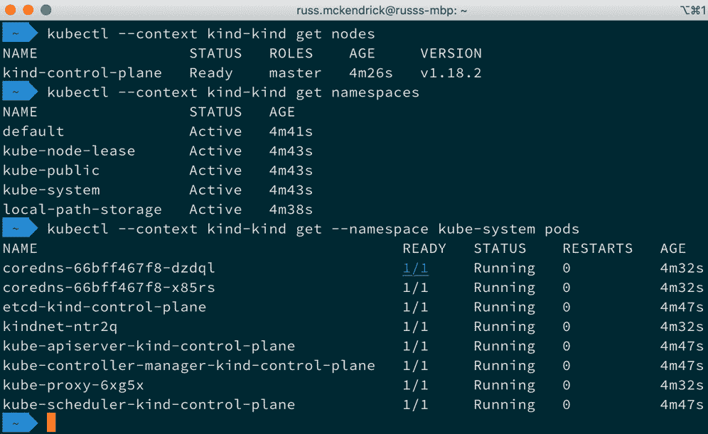

图 12.14 – 查看节点、命名空间和系统 Pod

接下来，让我们再次部署**hello-node**应用程序，使用以下命令：

```
$ kubectl --context kind-kind create deployment hello-node 
--image=k8s.gcr.io/echoserver:1.4
$ kubectl --context kind-kind get deployments
$ kubectl --context kind-kind get pods
$ kubectl --context kind-kind expose deployment hello-node 
--type=LoadBalancer --port=8080
$ kubectl --context kind-kind get services
```

到目前为止一切顺利，你可能在想，但不幸的是，使用当前配置的安装过程只能进行到这一步——虽然我们可以部署 Pod 和服务，但 Kind 目前默认并不附带 Ingress 控制器。

要启用 Ingress 控制器，我们首先需要删除我们的集群。为此，运行以下命令：

```
$ kind delete cluster 
```

一旦集群被删除，我们可以重新启动它，并启用 Ingress 配置。配置内容太长，无法在此列出，但你可以在随书附带的仓库中的 `chapter12/kind` 文件夹中找到一份副本。要使用配置启动集群，请在终端中切换到 `chapter12/kind` 文件夹，并运行以下命令：

```
$ kind create cluster --config cluster-config.yml
```

启动后，下一步是启用 NGINX Ingress 控制器。你需要执行以下命令来完成这一步：

```
$ kubectl --context kind-kind apply -f https://raw.
githubusercontent.com/kubernetes/ingress-nginx/master/deploy/
static/provider/kind/deploy.yaml
```

这将配置集群使用 NGINX Ingress 控制器。控制器本身需要一两分钟才能启动——你可以通过运行以下命令检查其状态：

```
$ kubectl --context kind-kind get --namespace ingress-nginx 
pods
```

当 `Ingress-nginx-controller` pod 准备好并正在运行时，你可以使用 `chapter12/kind` 文件夹中的 `hello-node.yml` 文件重新启动 `hello-node` 应用程序，命令如下：

```
$ kubectl --context kind-kind apply -f hello-node.yml
```

启动后，你应该可以访问 `hello-node` 应用程序，网址为 [`localhost/hello-node/`](http://localhost/hello-node/)，如下图所示：

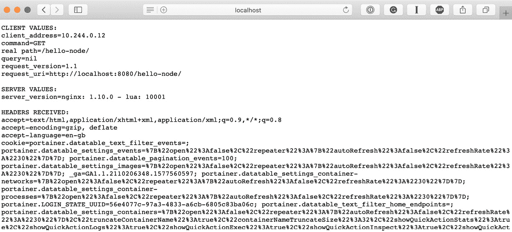

](img/image_00_0152.jpg)

图 12.15 – hello-node 应用程序的输出

完成后，你可以使用 `kind delete cluster` 命令删除集群。

## Kind 总结

所以，你可能会想，Kind 的意义何在——为什么你会想要在一个容器中运行一个 Kubernetes 集群呢？其实，它的主要用途是测试 Kubernetes 本身；不过，它也可以用于测试部署，作为持续交付或持续部署流水线的一部分，在这里你需要测试 Kubernetes 定义文件是否按预期工作，并且你的应用程序能够无问题地启动。

目前，Kind 可能在开发中过于缓慢且过于笨重，无法用于开发。

让我们进入下一个工具，它将我们带回到运行虚拟机来部署本地 Kubernetes 集群的场景。

# 使用 MicroK8s 部署 Kubernetes

接下来，我们来看看由 Canonical 提供的 MicroK8s，正如你可能还记得的 *第六章*，*Docker Machine, Vagrant 和 Multipass*，他们是 Multipass 和 Ubuntu Linux 发行版的创始人。

MicroK8s 项目的口号是提供一个轻量级的 Kubernetes 节点，默认启用的仅是最少的基本服务，同时可以根据需要通过插件提供额外服务。

## 安装 MicroK8s

与 Minikube 和 Kind 不同，MicroK8s 的独立二进制文件仅适用于基于 Linux 的机器。由于这个原因，我们将使用 Multipass 启动虚拟机，并将其作为我们的安装目标。

启动虚拟机，我们需要运行以下命令：

```
$ multipass launch --name microk8s
```

一旦虚拟机启动并运行，我们可以通过以下命令启用并安装 MicroK8s：

```
$ multipass exec microk8s -- \
	/bin/bash -c 'sudo snap install microk8s --classic'
```

安装完成后，MicroK8s 启动并准备好使用需要一些时间。运行以下命令来轮询状态并检查 MicroK8s 是否已启动：

```
$ multipass exec microk8s -- \
	/bin/bash -c 'sudo microk8s status --wait-ready'
```

接下来，默认情况下 MicroK8s 是一个最小的 Kubernetes 集群节点，我们需要启用 `dns` 和 `Ingress` 插件，这将允许我们在启动应用程序时访问它们：

```
$ multipass exec microk8s -- \
	/bin/bash -c 'sudo microk8s enable dns ingress'
```

一旦启用，我们需要在主机上获取配置的最后一步。为此，请运行以下命令：

```
$ multipass exec microk8s -- \
	/bin/bash -c 'sudo microk8s.config' > microk8s.yml
```

这将在我们的主机当前目录留下一个名为 `microk8s.yml` 的文件。现在，我们可以在运行 `kubectl` 时使用此配置来访问我们新启动和配置的 MicroK8s Kubernetes 集群节点。

## 与您的 Kubernetes 集群节点进行交互

现在我们的集群节点已经启动并运行，我们可以重新运行命令并启动一个测试应用程序，就像我们在本章的前一节中所做的那样。

如前所述，这次我们将在主机上使用 `kubectl` 命令，并传递标志以确保它使用 `microk8s.yml` 配置文件。这意味着我们需要运行的命令如下所示：

```
$ kubectl --kubeconfig=microk8s.yml get nodes
$ kubectl --kubeconfig=microk8s.yml get namespaces
$ kubectl --kubeconfig=microk8s.yml get --namespace kube-system 
pods 
```

正如您从以下终端输出中可以看到的那样，我们再次看到类似于上次查询节点和命名空间直到系统 pod 的输出：

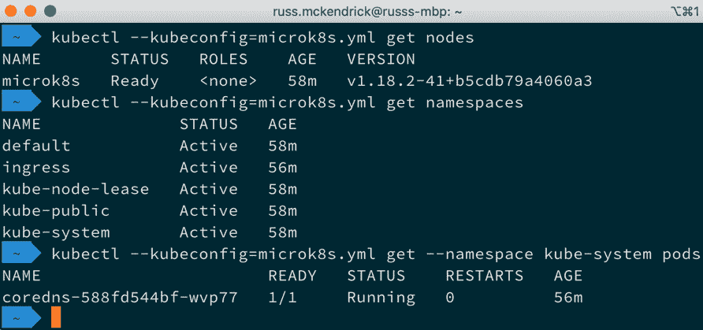

图 12.16 – 查看节点、命名空间和系统 pod

之所以看不到 `coredns` 之外的任何 Pod 是因为我们下载的配置所附带的用户没有必要的权限。尽管如此，这对我们来说并不是问题，因为我们不需要触及那些 pod。

接下来，我们可以启动 `hello-node` 应用程序。这次，我们将直接从 GitHub 存储库中使用 YAML 文件，运行以下命令：

```
$ kubectl --kubeconfig=microk8s.yml apply -f https://raw.
githubusercontent.com/PacktPublishing/Mastering-Docker-Fourth-
Edition/master/chapter12/kind/hello-node.yml
```

我们使用这个文件的原因是它具有 Ingress 控制器的定义，这意味着我们只需获取 MicroK8s 集群节点的 IP 地址，然后在浏览器中输入该 URL。要获取 IP 地址，请运行以下命令：

```
$ multipass info microk8s
```

一旦您知道 IP 地址，应该列为 IPv4，打开浏览器并转到 `https://<IP Address>/hello-node/`。在我的情况下，URL 是 `https://192.168.64.16/hello-node/`。您会注意到，这次我们使用的是 HTTPS 而不是 HTTP。这是因为我们启用的 Ingress 控制器安装了自签名证书，并将所有流量重定向到 HTTPS。根据浏览器设置，可能会要求您在访问页面时接受或安装证书。

完成后，您可以使用 `multipass delete --purge microk8s` 命令删除集群节点。还要记得删除 `microk8s.yml` 文件。一旦删除集群，如果要重新启动它，配置文件将不起作用。

## MicroK8s 总结

MicroK8s 兑现了它的小巧、轻量，但仍然功能强大且可扩展的 Kubernetes 集群控制器的承诺。结合 Multipass，您可以轻松启动一个虚拟机，并快速在本地工作站引导 Kubernetes 集群节点。

此外，Canonical 确保了 MicroK8s 不仅仅是为了本地使用；集群节点本身可以被视为生产就绪，这意味着它非常适合在边缘计算和物联网设备上运行 Kubernetes——这两种设备通常规格较低，通常只会运行单个节点。

我们要查看的最后一个工具将允许我们在本地运行多个 Kubernetes 节点，让我们更接近生产环境的样子。

# 使用 K3s 部署 Kubernetes

我们要查看的最终工具是 Rancher 的 K3s。像 MicroK8s 一样，K3s 是一个轻量级的 Kubernetes 发行版，专为边缘计算和物联网设备设计。这使得它同样非常适合本地开发，因为 K3s 也是一个认证的 Kubernetes 发行版——就像 Docker、Kind 和 MicroK8s 一样。

重要提示

你可能会想，为什么它叫 K3s。背后有一定的逻辑。Rancher 设计 K3s 的主要目标是创造一个内存占用只有传统 Kubernetes 发行版一半的工具，因此他们决定既然 Kubernetes 是一个 10 个字母的词，并且以 K8s 样式呈现，那么他们的发行版将会缩小一半——5 个字母——因此，K3s 也采用了这样的命名方式。然而，K3s 并没有长形式，也没有官方发音。

最后，K3s 支持多节点集群，因此我们将学习如何构建一个三节点集群。本章这一部分的命令将覆盖 macOS 和 Linux 系统，因为我们将创建环境变量并使用非 Windows 工具，以尽可能简化安装过程。

## 安装 K3s

像 MicroK8s 一样，我们将使用 Multipass 来启动我们的主机。为此，请运行以下命令：

```
$ multipass launch --name k3smaster
$ multipass launch --name k3snode1
$ multipass launch --name k3snode2
```

一旦我们启动了三台虚拟机，就可以通过运行以下命令来配置主节点：

```
$ multipass exec k3smaster -- \
	/bin/bash -c 'curl -sfL https://get.k3s.io | K3S_KUBECONFIG_
MODE='644' sh -'
```

一旦我们的主节点启动并运行，我们需要一些信息来引导剩余的两个节点。

我们需要的第一条信息是主节点的 URL。要创建环境变量，我们可以运行以下命令：

```
$ K3SMASTER='https://$(multipass info k3smaster | grep 'IPv4' |
 awk -F' ' '{print $2}'):6443'
```

现在我们有了主节点的 URL，接下来我们需要获取访问令牌。为此，请运行以下命令：

```
$ K3STOKEN='$(multipass exec k3smaster -- /bin/bash -c 'sudo 
cat /var/lib/rancher/k3s/server/node-token')'
```

现在我们有了引导节点所需的两条信息，可以运行以下两个命令：

```
$ multipass exec k3snode1 -- \
	/bin/bash -c 'curl -sfL https://get.k3s.io | K3S_
URL=${K3SMASTER} K3S_TOKEN=${K3STOKEN} sh -'
$ multipass exec k3snode2 -- \
	/bin/bash -c 'curl -sfL https://get.k3s.io | K3S_
URL=${K3SMASTER} K3S_TOKEN=${K3STOKEN} sh -'
```

现在我们应该已经配置好三台节点，剩下的就是配置我们的本地`kubectl`，以便它能够与集群节点进行交互。我们需要做的第一件事是将配置复制到本地机器。为此，请运行以下命令：

```
$ multipass exec k3smaster -- \
	/bin/bash -c 'sudo cat /etc/rancher/k3s/k3s.yaml' > 
${HOME}/.kube/k3s.yml
```

如果我们按原样使用配置文件，那么它会失败，因为默认情况下，K3s 配置为仅在本地主机上通信，因此要更新这一点，运行以下命令：

```
$ sed -ie s,https://127.0.0.1:6443,${K3SMASTER},g ${HOME}/.
kube/k3s.yml
```

如你所见，这将用我们本地 `k3s.yml` 配置文件中的 `${K3SMASTER}` 值替换 [`127.0.0.1:6443`](https://127.0.0.1:6443)。替换后，我们可以配置 `kubectl` 使用我们的 `k3s.yml` 配置文件，以便在接下来的终端会话中运行以下命令：

```
$ export KUBECONFIG=${HOME}/.kube/k3s.yml
```

现在，通过我们的本地 kubectl 二进制文件访问集群后，我们可以启动我们的应用程序。

## 与你的 Kubernetes 集群节点进行交互

现在我们的集群节点已经启动并运行，我们可以重新运行命令，并像在本章前面的部分那样启动测试应用程序。这次，鉴于我们已经配置 `kubectl` 使用我们的 `k3s.yml` 配置文件，我们只需运行以下命令：

```
$ kubectl get nodes
$ kubectl get namespaces
$ kubectl get --namespace kube-system pods 
```

这将给你类似以下的终端输出：

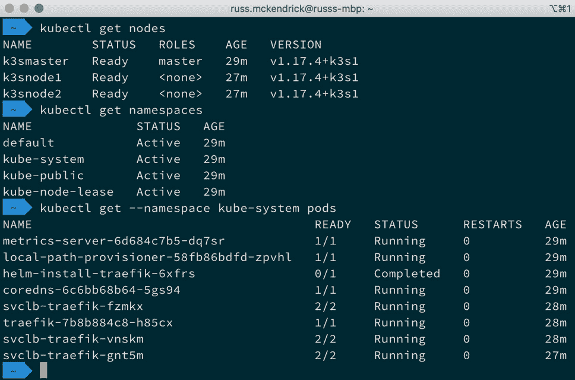

图 12.17 – 查看节点、命名空间和系统 pod

接下来，启动 `hello-node` 应用程序，这次使用以下命令：

```
$ kubectl create deployment hello-node --image=k8s.gcr.io/
echoserver:1.4
$ kubectl expose deployment hello-node --type=LoadBalancer 
--port=8080
$ kubectl get services
```

这将给你以下输出，如你所见，我们有任何`EXTERNAL-IP`和`PORT(S)`：

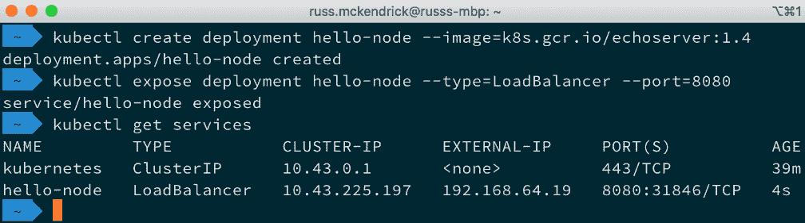

图 12.18 – 启动并暴露 hello-node 应用程序

添加第二端口的 IP 地址应该会给你访问应用程序的 URL，例如，我访问了[`192.168.64.19:31846/`](http://192.168.64.19:31846/)，并展示了`hello-node`应用程序。

接下来，让我们用以下命令启动我们的 `cluster` 应用程序：

```
$ kubectl create deployment cluster --image=russmckendrick/cluster:latest
$ kubectl expose deployment cluster --type=LoadBalancer --port=80
$ kubectl get services
```

你可能会注意到这次在 `EXTERNAL-IP` 中，它显示 `<pending>`：

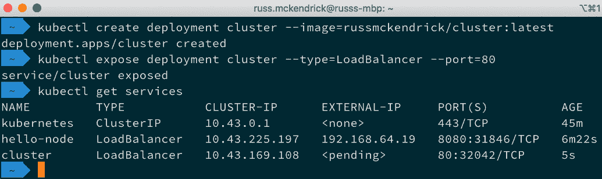

图 12.19 – 启动并暴露集群应用程序

你不必担心这个；只需使用第二端口和另一个服务器暴露的外部 IP。这给了我一个访问`cluster`应用程序的 URL，[`192.168.64.19:32042/`](http://192.168.64.19:32042/)。

你还可以使用以下命令扩展集群应用程序：

```
$ kubectl get deployment/cluster
$ kubectl scale --replicas=3 deployment/cluster
$ kubectl get deployment/cluster
```

如果你没有跟上，终端输出看起来像下面这样：

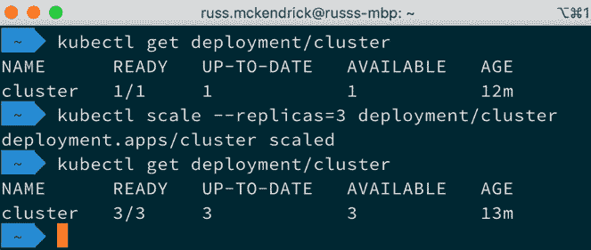

图 12.20 – 扩展集群应用程序

在我们结束之前，鉴于我们还有更多节点要探索，先安装 Kubernetes 仪表板。为此，从你的主机运行以下命令。首先需要获取仪表板的当前版本。为此，运行以下命令：

```
$ GITHUB_URL=https://github.com/kubernetes/dashboard/releases
$ VERSION_KUBE_DASHBOARD=$(curl -w '%{url_effective}' -I -L -s 
-S ${GITHUB_URL}/latest -o /dev/null | sed -e 's|.*/||')
```

现在我们已经将当前版本设置为环境变量，可以运行以下命令启动仪表板，添加用户并配置用户的访问权限：

```
$ kubectl create -f 'https://raw.githubusercontent.com/
kubernetes/dashboard/${VERSION_KUBE_DASHBOARD}/aio/deploy/
recommended.yaml'
$ kubectl create -f 'https://raw.githubusercontent.com/
PacktPublishing/Mastering-Docker-Fourth-Edition/master/
chapter12/k3s/dashboard.admin-user.yml'
$ kubectl create -f 'https://raw.githubusercontent.com/
PacktPublishing/Mastering-Docker-Fourth-Edition/master/
chapter12/k3s/dashboard.admin-user-role.yml'
```

安装了仪表板并配置了用户后，我们可以通过运行以下命令来获取登录仪表板所需的访问令牌：

```
$ kubectl -n kubernetes-dashboard describe secret admin-user-
token | grep ^token
```

记下令牌，因为我们稍后需要它。在访问仪表板之前，我们需要做的最后一件事是通过运行以下命令启动 Kubernetes 代理服务：

```
$ kubectl proxy
```

在代理服务器运行时，打开 [`localhost:8001/api/v1/namespaces/kubernetes-dashboard/services/https:kubernetes-dashboard:/proxy/`](http://localhost:8001/api/v1/namespaces/kubernetes-dashboard/services/https:kubernetes-dashboard:/proxy/) 在你喜欢的浏览器中，输入你记下的令牌，然后登录：

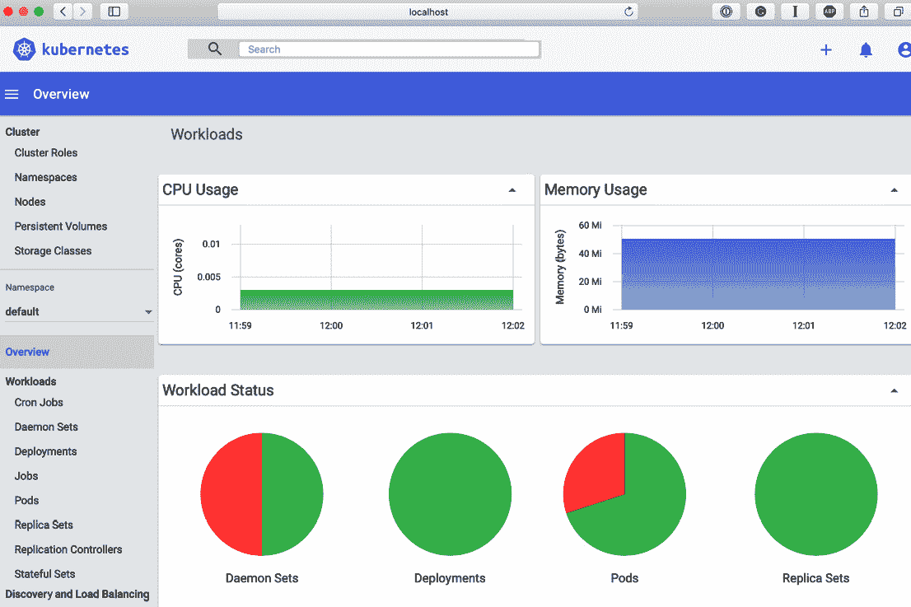

图 12.21 – 在我们的 K3s 节点集群上打开 Kubernetes 仪表板

一旦你完成了 K3s 集群的使用，你可以通过 `the multipass delete --purge k3smaster k3snode1 k3snode2` 命令删除它。

## 还有一件事 – K3d

最后，Rancher 也提供了 K3d。像 Kind 一样，这是一个包含整个 Kubernetes 发行版的单一容器，这意味着你不仅可以将 K3s 用作本地开发环境，而且也很容易将其引入到 CI/CD 流水线中。

在总结 K3s 之前，让我们非常快速地了解一下如何在 macOS 和 Linux 主机上启动 K3d，先从 Linux 开始。要安装 `k3d` 命令，运行以下命令：

```
$ curl -s https://raw.githubusercontent.com/rancher/k3d/master/
install.sh | bash
```

或者，如果你使用的是 macOS，你可以通过 Homebrew 安装它，使用以下命令：

```
$ brew install k3d
```

一旦安装了 K3d（我安装的是 1.7 版本），我们将要查看四个命令：

+   `k3d cluster create k3s-default`：此命令将创建一个名为 **k3s-default** 的 K3d 驱动的 Kubernetes 集群。

+   `k3d kubeconfig merge k3s-default --switch-context`：这将配置你的本地 `kubectl` 使其与 **k3s-default** 集群通信。

现在你已经启动了一个集群，你可以像与其他 Kubernetes 集群一样与它互动，例如，通过运行以下命令：

```
$ kubectl get nodes
$ kubectl get namespaces
$ kubectl cluster-info
```

这将输出以下内容：

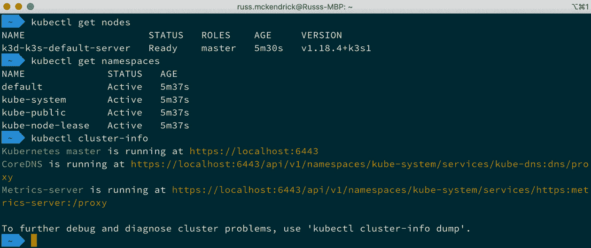

图 12.22 – 在我们的 K3d 集群上运行命令

+   `k3dcluster delete k3s-default` 是我们将要查看的四个命令中的最后一个，正如你可能猜到的，这个命令会删除集群。

K3d 正在积极开发中。事实上，K3d 包装器的完整重写刚刚完成，所以如果前面的命令（针对新版本 3）不工作，尝试以下命令，这些命令是针对旧版本的：

```
$ k3d create
$ export KUBECONFIG='$(k3d get-kubeconfig --name='k3s-
default')': This will configure your local kubectl to talk to 
the k3s-default cluster.
$ k3d delete
```

想要获取关于 K3d 开发的最新消息，可以查看项目的 GitHub 页面，链接在本章的*进一步阅读*部分中。

## K3s 概述

像 MicroK8s 一样，K3s 实现了它作为轻量级 Kubernetes 发行版的承诺。

就个人而言，我认为 K3s 更好，因为它比 MicroK8s 更像一个完整的 Kubernetes 发行版。

K3s 另一个优点是，部署本地多节点集群是一种相对轻松的体验。这将使你的本地开发环境更接近生产环境，尽管 Minikube 也允许你启动多节点集群，但其功能仍处于初期阶段，尚未准备好供公众使用。

# 总结

在本章中，我们介绍了四种不同的工具，用于启动单节点和多节点的 Kubernetes 集群。我们发现，虽然启动每个集群的方法略有不同，但一旦集群启动并运行，你会发现使用标准的 Kubernetes 工具（如 `kubectl`）与它们交互时，体验大致一致。

此时，我应该坦白一下：我们在本章中介绍的四个工具中的两个，实际上并没有像传统意义上的 Docker 那样使用 Docker——MicroK8s 和 K3s 实际上使用的是 **containerd**。

正如你可能从 *第一章*《*Docker 概述*》中回忆的那样，**containerd** 是一个易于嵌入的容器运行时。它最初由 Docker Inc. 开发，但该项目已捐赠给 **云原生计算基金会** (**CNCF**)——它是 Moby 项目的容器运行时，而 Docker 使用 Moby 作为其上游项目。

它不仅小巧轻便，还提供了完整的 OCI 镜像和 OCI 运行时规范支持，这意味着它与 Docker 镜像及 Docker 运行容器的方式完全兼容。

在下一章中，我们将不再在本地运行 Kubernetes，而是将集群带入云端。

# 问题

1.  对错题：Kind 推荐用于生产环境使用吗？

1.  请列举出本章中至少两个能够在 Docker 容器中运行的工具。

1.  如果你有一个 ARM 架构的 IoT 设备，你可以使用本章中介绍的哪两个 Kubernetes 发行版？

# 深入阅读

本章开头提到的部分 Google 工具、演示文稿和白皮书可以在这里找到：

+   Minikube: [`minikube.sigs.k8s.io/`](https://minikube.sigs.k8s.io/)

+   Kind: [`kind.sigs.k8s.io/`](https://kind.sigs.k8s.io/)

+   MicroK8s: [`microk8s.io/`](https://microk8s.io/)

+   K3s: [`k3s.io/`](https://k3s.io/)

+   K3d: [`github.com/rancher/k3d`](https://github.com/rancher/k3d)

+   containerd: [`containerd.io/`](https://containerd.io/)

+   OCI 镜像和运行时规范: [`www.opencontainers.org/`](https://www.opencontainers.org/)

+   认证的 Kubernetes 发行版: [`www.cncf.io/certification/software-conformance/`](https://www.cncf.io/certification/software-conformance/)
