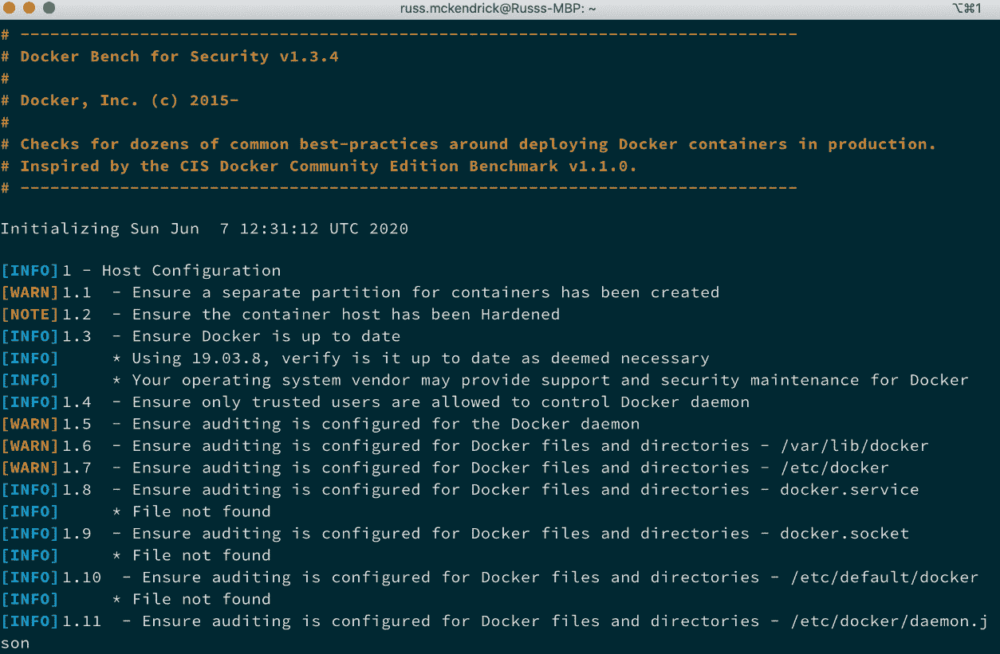
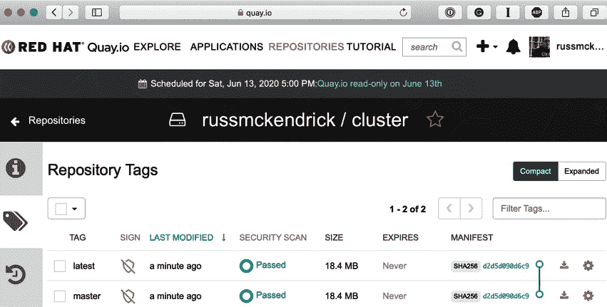
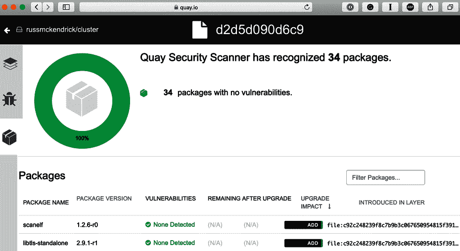
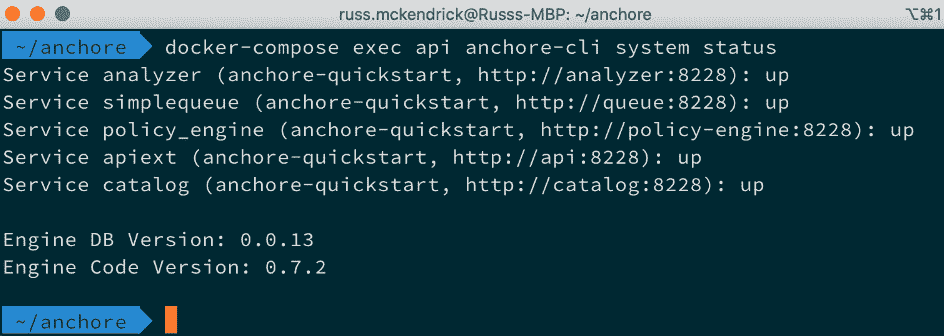
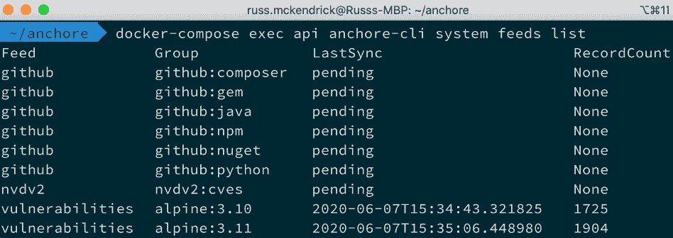
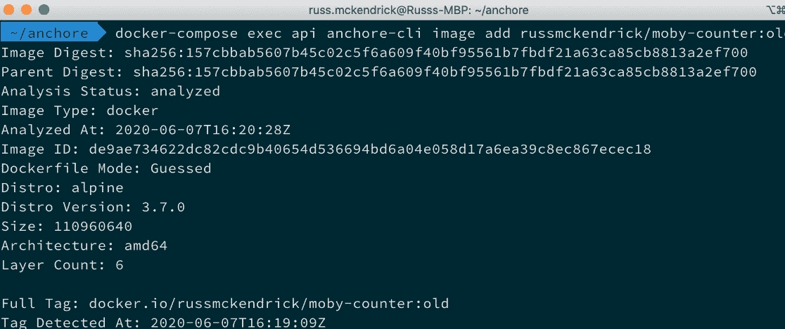
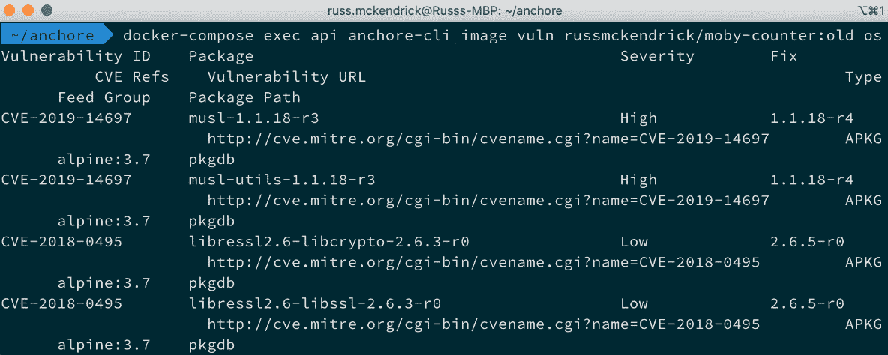

*第十四章*

# Docker 安全性

在本章中，我们将重点讨论 Docker 安全性，这是当今每个人都关注的话题。我们将把本章分成以下五个部分：

+   容器考虑因素

+   Docker 命令

+   最佳实践

+   Docker Bench 安全性 "应用程序"

+   第三方安全服务

# 技术要求

在本章中，我们将使用 Docker Desktop，并且将使用 Multipass 启动一个 Docker 主机，随后在其上启动一些配置不当的容器。和之前的章节一样，我将使用我偏好的操作系统，即 macOS。

和之前一样，我们将运行的 Docker 命令适用于我们至今已安装 Docker 的所有三种操作系统。然而，某些辅助命令（虽然很少见）可能只适用于 macOS 和基于 Linux 的操作系统。

查看以下视频，看看代码的实际操作：[`bit.ly/3m8ubVd`](https://bit.ly/3m8ubVd)

# 容器考虑因素

当 Docker 首次发布时，有很多关于 Docker 与虚拟机对比的讨论。我记得曾在杂志上阅读相关文章，在 Reddit 上评论线程，并阅读无数的博客文章。在 Docker 的 alpha 和 beta 版本的早期，人们曾像对待虚拟机一样使用 Docker 容器，因为当时并没有其他参考点，我们把它们看作是微型虚拟机。

过去，我会启用 SSH，在容器中运行多个进程，甚至通过启动容器并运行命令来安装我的软件栈，从而创建我的容器镜像。我们在 *第二章*《构建容器镜像》中讨论过，你不应该在容器上安装、配置和导出 SSH，因为这被视为一种不良做法，而 Docker 提供了不需要使用 SSH 就能访问容器的方法。

所以，与其讨论容器与虚拟机的对比，不如看看在运行容器时需要做的一些考虑事项，而不是虚拟机。

## 优势

当你启动一个 Docker 容器时，Docker 引擎在后台做了很多工作。Docker 引擎启动容器时执行的其中一项任务是设置命名空间和控制组。这意味着什么呢？通过设置命名空间，Docker 将每个容器中的进程进行隔离，不仅与其他容器隔离，还与宿主系统隔离。控制组确保每个容器获得自己的资源份额，例如 CPU、内存和磁盘 `I/O`。更重要的是，它们确保一个容器不会耗尽 Docker 主机上的所有资源。

正如我们在*第四章**《容器管理》*中看到的那样，能够在 Docker 控制的网络中启动容器意味着你可以在应用层隔离你的容器；应用程序 A 的所有容器将无法在网络层访问应用程序 B 的容器。

此外，通过使用默认的网络驱动程序，这种网络隔离可以在单个 Docker 主机上运行，或者通过使用 Docker Swarm 内置的多主机网络驱动程序，或者使用 Weave 提供的 Weave Net 驱动程序，可以跨多个 Docker 主机进行。

最后，我认为 Docker 相较于典型虚拟机的最大优势之一是你不需要登录到容器中。Docker 正在尽最大努力避免你需要登录容器来管理它正在运行的进程。通过诸如 `docker container exec`、`docker container top`、`docker container logs` 和 `docker container stats` 等命令，你可以在不暴露任何多余服务的情况下完成所需的所有操作。

## 你的 Docker 主机

当你处理虚拟机时，你可以控制谁有权访问哪台虚拟机。假设你只希望**用户 1**，一个开发人员，能够访问开发环境的虚拟机。

然而，**用户 2** 是负责开发和生产环境的操作员，因此他们需要访问所有虚拟机。大多数虚拟机管理工具允许你为虚拟机授予基于角色的访问权限。

使用 Docker 时，你处于一个轻微的劣势，因为任何能够访问你主机上 Docker Engine 的人，无论是通过被授予 sudo 权限，还是通过将其用户添加到 Docker Linux 组，都将能够访问你在该主机上运行的所有 Docker 容器。

它们可以运行新容器，可以停止现有容器，还可以删除镜像。小心你向谁授予访问主机上 Docker Engine 的权限。因为他们基本上掌握了所有容器的控制权。知道这一点后，建议仅将 Docker 主机用于 Docker，避免将其他服务与 Docker 主机混合使用。

## 镜像信任

如果你运行虚拟机，通常你会自己从零开始设置它们。由于下载的体积较大（并且启动它也需要一些努力），你很可能不会下载一个由互联网上某个随机人创建的预构建机器镜像。通常，如果你这样做，那会是一个来自受信软件供应商的预构建虚拟设备。

因此，你将知道虚拟机内部的内容以及没有的内容，因为你负责构建和维护它。

Docker 的吸引力之一是它的易用性；然而，这种易用性可能会让人忽视一个非常关键的安全问题——你知道容器内正在运行什么吗？

我们在前面的章节中已经提到了镜像的信任问题。例如，我们提到过不发布或下载未使用 Dockerfile 定义的镜像，也不将自定义代码或秘密（等）直接嵌入到您推送到 Docker Hub 的镜像中。

虽然容器具备命名空间、控制组和网络隔离的保护机制，但我们讨论了如何不慎下载镜像可能会引入安全隐患和风险。例如，运行未打补丁的合法容器软件可能会对您的应用程序和数据的可用性带来风险。

现在我们已经介绍了一些基本原则，让我们看看可以用于增强安全性并查看您可能使用的镜像信息的 Docker 命令。

# Docker 命令

我们将要查看两条命令。第一条是 `docker container run` 命令，您可以看到在该命令下可以利用的一些项。第二条是 `docker container diff` 命令，您可以使用它查看您计划使用的镜像已经发生了什么变化。

让我们看看如何使用这两个命令来帮助加固我们的容器安全。

## Docker 运行命令

在 `docker run` 命令方面，我们将主要关注一个选项，它允许您将容器内的所有内容设置为只读，而不是指定某个目录或卷。这有助于限制恶意“应用程序”造成的损害，因为它们也可能通过更新二进制文件劫持一个脆弱的应用程序。

让我们看看如何启动一个只读容器，然后逐步解析它的作用，如下所示：

```
$ docker container run -d --name mysql --read-only -v /
var/lib/mysql -v /tmp -v /var/run/mysqld -e MYSQL_ROOT_
PASSWORD=password mysql
```

在这里，我们运行一个 MySQL 容器并将整个容器设置为只读，除了以下文件夹：

+   `/var/lib/mysql`

+   `/var/run/mysqld`

+   `/tmp`

这些将被创建为三个独立的卷，并以读写方式挂载。如果您没有添加这些卷，MySQL 将无法启动，因为它需要读写访问权限来创建 `/var/run/mysqld` 中的套接字文件、`/tmp` 中的一些临时文件，以及最终在 `/var/lib/mysql` 中的数据库文件。

容器内的其他位置将无法进行写入。如果您尝试运行以下命令，它将失败：

```
$ docker container exec mysql touch /trying_to_write_a_file
```

上述命令会给出以下信息：

```
touch: cannot touch '/trying_to_write_a_file': Read-only file 
system
```

如果您希望控制容器的写入位置（或不允许写入的位置），这将非常有用。务必明智地使用此功能，并进行彻底测试，因为当“应用程序”无法写入某些位置时可能会产生后果。

与之前的命令类似，使用 `docker container run` 时，我们将所有内容设置为只读（除非指定了某个卷），我们也可以做到相反的操作，只将一个单独的卷（如果使用多个 `-v` 参数，更多卷也可以）设置为只读。

关于卷需要记住的一点是，当你在容器中使用并挂载一个卷时，它会作为一个空卷覆盖容器内的目录，除非你使用`--volumes-from`开关或在容器启动后以其他方式向容器添加数据；例如，你可能会使用如下命令（此命令将无法运行）：

```
$ docker container run -d -v /local/path/to/html/:/var/www/
html/:ro nginx
```

这将把 Docker 主机上的`/local/path/to/html/`挂载到`/var/www/html/`，并将其设置为只读模式。如果你不希望正在运行的容器写入卷以保持数据或配置文件不被更改，这将非常有用。

## Docker 的`diff`命令

让我们再次查看`docker diff`命令；因为它涉及容器的安全性方面，你可能想使用托管在 Docker Hub 或其他相关仓库上的镜像。

请记住，任何能够访问你 Docker 主机和 Docker 守护进程的人，都能够访问你所有正在运行的 Docker 容器。换句话说，如果你没有监控措施，某人可能会针对你的容器执行命令并做出恶意行为。

让我们来看一下我们在前一节中启动的 MySQL 容器：

```
$ docker container diff mysql
```

你会注意到没有返回任何文件。这是为什么呢？

`docker diff`命令告诉你自容器启动以来镜像的变化。在前面的部分，我们以只读模式启动了 MySQL 容器，并挂载了卷，以便 MySQL 能够进行读写操作——这意味着我们下载的镜像和正在运行的容器之间没有文件差异。

停止并删除 MySQL 容器，然后运行以下命令修剪卷：

```
$ docker container stop mysql
$ docker container rm mysql
$ docker volume prune
```

然后，重新启动相同的容器，但去掉只读标志和卷挂载；这样会得到不同的情况，具体如下：

```
$ docker container run -d --name mysql -e MYSQL_ROOT_
PASSWORD=password mysql
$ docker container exec mysql touch /trying_to_write_a_file
$ docker container diff mysql
```

正如你所见，已经创建了两个文件夹，并且添加了几个文件：

```
C /run
C /run/mysqld
A /run/mysqld/mysqld.pid
A /run/mysqld/mysqld.sock
A /run/mysqld/mysqld.sock.lock
A /run/mysqld/mysqlx.sock
A /run/mysqld/mysqlx.sock.lock
A /trying_to_write_a_file
```

这是一个很好地发现容器内任何异常或意外情况的方法。现在我们已经了解了如何更安全地启动容器，接下来让我们讨论一些可以应用的其他最佳实践。

# 最佳实践

在本节中，我们将探讨与 Docker 相关的最佳实践。我们之前的一些章节已经提到过其中的部分内容。接下来，我们将讨论**互联网安全中心**指南，它详细记录了如何正确地保护你 Docker 环境的各个方面。

## Docker 最佳实践

在深入探讨《互联网安全中心指南》之前，让我们先回顾一些使用 Docker 的最佳实践，如下所示：

+   **每个容器只启动一个应用程序**：Docker 就是为此设计的，它让一切变得更加简单。最终，这种隔离性正是我们之前讨论的关键所在。

+   **只安装必要的软件**：正如我们在前几章中提到的，如果你必须安装更多的服务来支持容器应运行的唯一进程，我建议你重新审视这些原因。这不仅有助于保持镜像的小巧和可移植性，还能减少潜在的攻击面。

+   **审查谁能访问你的 Docker 主机**：记住，任何拥有 root 或 sudo 权限的人都可以访问你的 Docker 主机，操作主机上所有的镜像和正在运行的容器，并且能够启动新的容器。

+   **始终使用最新版本的 Docker**：这将确保所有的安全漏洞都已经修补，并且你也可以使用到最新的功能。虽然更新安全问题，使用社区版可能会带来由于功能变化或新增功能所引发的问题。如果这对你来说是个问题，那么你可能需要查看 Docker 提供的 LTS 企业版。

+   **如果需要帮助，利用可用资源**：Docker 社区庞大且极为友好。在规划 Docker 环境和评估平台时，利用他们的网站、文档和 Slack 聊天室。有关如何访问 Slack 和社区其他部分的信息，请参见 *第十六章*，*与 Docker 的下一步*。

## 互联网安全中心基准

**互联网安全中心**（CIS）是一个独立的非营利组织，旨在提供安全的在线体验。他们发布的基准和控制措施被视为 IT 各个方面的最佳实践。

Docker 的 CIS 基准可以免费下载。你应该注意到，它目前是一本 257 页的 PDF，发布在创意共享许可下，涵盖了 Docker CE 18.09 及更高版本。

当你实际运行扫描并得到需要修复（或建议修复）的结果时，你将参考本指南（在本章的下一部分）。该指南分为以下几个部分：

+   **主机配置**：本指南的这一部分涉及 Docker 主机的配置。这是 Docker 环境中运行所有容器的地方，因此，保持其安全性至关重要。这是防御攻击者的第一道防线。

+   **Docker 守护进程配置**：本指南的这一部分提供了确保 Docker 守护进程安全运行的建议。你对 Docker 守护进程配置的每一项操作都会影响到每个容器。这里是你可以附加到 Docker 守护进程的开关，之前我们已经提到过，并且接下来在我们运行工具时，你将会看到相关项。

+   **Docker 守护进程配置文件**：本部分指南处理 Docker 守护进程使用的文件和目录。这些包括权限设置和所有权。有时，这些区域可能包含一些你不希望他人知道的信息，而这些信息可能是以纯文本格式存储的。

+   **容器镜像/运行时和构建文件**：本部分指南包含了有关保护容器镜像和构建文件的信息。第一部分涉及镜像，包括基础镜像，以及使用的构建文件。正如我们之前所述，你需要对自己使用的镜像非常确定，不仅仅是基础镜像，还包括 Docker 环境中的任何方面。本节将涵盖你在创建自己基础镜像时应遵循的事项。

+   **容器运行时**：这一部分原本是后面章节的一部分，但已被移到 CIS 指南中的独立章节。容器运行时涉及很多与安全相关的内容。请小心使用的运行时变量。在某些情况下，攻击者可能会利用这些变量达到自己的目的，而你可能认为它们有利于自己。如果在容器中暴露过多内容，比如将应用程序的密钥和数据库连接作为环境变量暴露出来，可能不仅会危及容器的安全，还会危及 Docker 主机以及在该主机上运行的其他容器的安全。

+   **Docker 安全操作**：本部分指南涵盖了涉及部署的安全领域，这些项目与 Docker 最佳实践紧密相关。因此，遵循这些建议是最好的做法。

# Docker Bench Security 应用程序

在本节中，我们将介绍可以安装和运行的 Docker Bench Security 应用程序。该工具将检查以下内容：

+   主机配置

+   Docker 守护进程配置文件

+   容器镜像和构建文件

+   容器运行时

+   Docker 安全操作 Docker Swarm 配置

看起来很熟悉吗？应该是的，因为这些项目正是我们在上一节中审查过的内容，只不过它们已经被整合到一个应用程序中，帮你完成了许多繁重的工作。它会展示你配置中出现的警告，并提供其他配置项的信息，甚至包括通过测试的项。

现在，我们将介绍如何运行该工具、一个实际示例，以及该过程的输出意味着什么。

### 在 macOS 上运行 Docker 工具和在 Windows 上运行 Docker 工具

运行该工具非常简单。它已经打包在一个 Docker 容器中了。虽然你可以获取源代码并自定义输出或以某种方式处理它（比如通过邮件发送输出），但默认配置可能已经足够满足你的需求。

该工具的 GitHub 项目可以在 [`github.com/docker/docker-bench-security/`](https://github.com/docker/docker-bench-security/) 找到，要在 macOS 或 Windows 机器上运行此工具，只需将以下内容复制并粘贴到你的终端中。以下命令缺少检查 `systemd` 所需的行，因为 Moby Linux（Docker for macOS 和 Docker for Windows 的底层操作系统）并不运行 `systemd`。当我们在 Ubuntu Docker 主机上运行容器时，我们将查看一个基于 `systemd` 的系统：

```
docker container run -it --net host --pid host \
	--cap-add audit_control \
	-e DOCKER_CONTENT_TRUST=$DOCKER_CONTENT_TRUST \
	-v /var/lib:/var/lib \
	-v /var/run/docker.sock:/var/run/docker.sock \
	-v /etc:/etc \
	--label docker_bench_security \
	docker/docker-bench-security
```

一旦镜像下载完成，它会启动并立即开始审计你的 Docker 主机，打印出审计结果，具体如下面的截图所示：



图 14.1 – 运行 Docker Bench 安全检查

如你所见，有一些警告 **[WARN]**，还有提示 **[NOTE]** 和信息 **[INFO]**；然而，由于该主机由 Docker 管理，正如你所预期的那样，问题并不严重，不需要过多担心。

### 运行在 Ubuntu Linux 上

在详细查看审计输出之前，我将使用 `multipass` 启动一个纯净的 Ubuntu 服务器，并通过运行以下命令使用官方安装程序进行 Docker 的清洁安装：

```
$ multipass launch --name docker-host
$ multipass exec docker-host -- /bin/bash -c 'curl -s https://
get.docker.com | sh - && sudo usermod -aG docker ubuntu'
$ multipass shell docker-host
```

安装完成后，我将启动几个容器，它们的设置都不太合理。我将从 Docker Hub 启动以下两个容器：

```
$ docker container run -d --name root-nginx -v /:/mnt nginx
$ docker container run -d --name priv-nginx --privileged=true 
nginx
```

然后，我将构建一个基于 Ubuntu 16.04 的自定义镜像，并通过以下 `Dockerfile` 运行 SSH：

```
FROM ubuntu:16.04
RUN apt-get update && apt-get install -y openssh-server
RUN mkdir /var/run/sshd
RUN echo 'root:screencast' | chpasswd
RUN sed -i 's/PermitRootLogin prohibit-password/PermitRootLogin
 yes/' /etc/ssh/sshd_config
RUN sed 's@session\s*required\s*pam_loginuid.so@session 
optional pam_loginuid.so@g' -i /etc/pam.d/sshd
ENV NOTVISIBLE 'in users profile'
RUN echo 'export VISIBLE=now' >> /etc/profile
EXPOSE 22
CMD ['/usr/sbin/sshd', '-D']
```

我将使用以下命令构建并启动前面的 Dockerfile：

```
$ docker image build --tag sshd .
$ docker container run -d -P --name sshd sshd
```

如你所见，在这张图片中，我们将主机的根文件系统以完全读/写权限挂载在 `root-nginx` 容器中。我们还在 `priv-nginx` 中以扩展权限运行，最后，在 `sshd` 中运行 SSH。

重要提示

请务必在此测试之外运行前面的 Dockerfile 或容器；我们故意启动不遵循最佳实践的容器，以便从扫描中获取结果。

为了开始在我们的 Ubuntu Docker 主机上进行审计，我运行了以下命令：

```
$ docker container run -it --net host --pid host \
    --cap-add audit_control \
    -e DOCKER_CONTENT_TRUST=$DOCKER_CONTENT_TRUST \
    -v /var/lib:/var/lib \
    -v /var/run/docker.sock:/var/run/docker.sock \
    -v /usr/lib/systemd:/usr/lib/systemd \
    -v /etc:/etc --label docker_bench_security \
    docker/docker-bench-security
```

由于我们运行的操作系统支持 `systemd`，我们将 `/usr/lib/systemd` 挂载以便进行审计。

有很多输出内容需要消化，但这些都意味着什么呢？让我们一起来看看并逐一解析每个部分。

### 理解输出内容

我们将看到四种类型的输出，具体如下：

+   `[PASS]`：这些项目是稳健且无问题的，可以继续使用。它们无需任何关注，但阅读它们会让你心里暖暖的。越多越好！

+   `[WARN]`：这些是需要修复的项目。我们不希望看到这些。

+   `[INFO]`：这些是你应该检查并修复的项目，如果你认为它们与你的设置和安全需求相关的话。

+   `[NOTE]`：这些是最佳实践建议。

如前所述，审计涵盖了七个主要部分，如下所示：

+   主机配置

+   Docker 守护进程配置

+   Docker 守护进程配置文件

+   容器镜像和构建文件

+   容器运行时

+   Docker 安全操作

+   Docker Swarm 配置

让我们看看在每个扫描部分中看到的内容。这些扫描结果来自一个默认的 Ubuntu Docker 主机，当前系统没有做任何调整。我们将重点关注每个部分中的`[WARN]`项。

运行时可能会出现其他警告，但这些是大多数人（如果不是所有人）初次使用时会遇到的警告。

#### 主机配置

我的主机配置中有五个`[WARN]`状态项，如下所示：

```
[WARN] 1.1  - Ensure a separate partition for containers has
 been created
```

默认情况下，Docker 在主机机器上使用`/var/lib/docker`来存储所有文件，包括所有镜像、容器和由默认驱动程序创建的卷。这意味着该文件夹可能会迅速增长。由于我的主机机器只运行一个分区（并且取决于容器的操作），这可能会填满整个硬盘，从而使我的主机无法使用：

```
[WARN] 1.5  - Ensure auditing is configured for the Docker 
daemon
[WARN] 1.6  - Ensure auditing is configured for Docker files 
and directories - /var/lib/docker
[WARN] 1.7  - Ensure auditing is configured for Docker files 
and directories - /etc/docker
[WARN] 1.10  - Ensure auditing is configured for Docker files 
and directories - /etc/default/docker
```

这些警告被触发是因为`auditd`未安装，且没有为 Docker 守护进程及相关文件配置审计规则；有关`auditd`的更多信息，请参阅博客文章：[`www.linux.com/topic/desktop/customized-file-monitoring-auditd/`](https://www.linux.com/topic/desktop/customized-file-monitoring-auditd/)。

#### Docker 守护进程配置

我的 Docker 守护进程配置标记了七个`[WARN]`状态项，如下所示：

```
[WARN] 2.1  - Ensure network traffic is restricted between 
containers on the default bridge
```

默认情况下，Docker 允许在同一主机上的容器之间不受限制地传递流量。你可以更改此行为；有关 Docker 网络的更多信息，请参阅：[`docs.docker.com/network/`](https://docs.docker.com/network/)：

```
[WARN] 2.8  - Enable user namespace support
```

默认情况下，用户命名空间没有被重新映射。尽管可以进行映射，但这目前可能会导致与多个 Docker 功能相关的问题；有关已知限制的详细信息，请参阅：[`docs.docker.com/engine/reference/commandline/dockerd/`](https://docs.docker.com/engine/reference/commandline/dockerd/)：

```
[WARN] 2.11  - Ensure that authorization for Docker client commands is enabled
```

Docker 的默认安装允许不受限制地访问 Docker 守护进程；你可以通过启用授权插件来限制访问仅限于经过认证的用户。详细信息请参阅：[`docs.docker.com/engine/extend/plugins_authorization/`](https://docs.docker.com/engine/extend/plugins_authorization/)：

```
[WARN] 2.12  - Ensure centralized and remote logging is configured
```

由于我只运行一个主机，我没有使用像`rsyslog`这样的服务将我的 Docker 主机日志传送到中央服务器，也没有在 Docker 守护进程上配置日志驱动程序；有关更多详细信息，请参阅：[`docs.docker.com/config/containers/logging/configure/`](https://docs.docker.com/config/containers/logging/configure/)：

```
[WARN] 2.14  - Ensure live restore is Enabled
```

`--live-restore`标志启用 Docker 守护进程无状态容器的完全支持；这意味着，当守护进程关闭时，容器不会停止运行，而是继续运行，并且在重启后能够正确重新连接到容器。

默认情况下未启用此功能，这是由于向后兼容性问题。有关更多详细信息，请参阅 [`docs.docker.com/config/containers/live-restore/`](https://docs.docker.com/config/containers/live-restore/%20)：

```
[WARN] 2.15  - Ensure Userland Proxy is Disabled
```

你的容器可以通过两种方式连接到外部世界：使用发夹 NAT 或用户空间代理。对于大多数安装，发夹 NAT 模式是首选模式，因为它利用了 iptables，并且性能更好。在此不可用时，Docker 会使用用户空间代理。大多数现代操作系统上的 Docker 安装都支持发夹 NAT。有关如何禁用用户空间代理的详细信息，请参阅 [`docs.docker.com/config/containers/container-networking/`](https://docs.docker.com/config/containers/container-networking/)：

```
[WARN] 2.18  - Ensure containers are restricted from acquiring 
new privileges
```

通过设置 `suid` 或 `sgid` 位，阻止容器内的进程可能获得额外的权限；这可以限制任何尝试访问特权二进制文件的危险操作的影响。

#### Docker 守护进程配置文件

在本节中没有 `[WARN]` 状态，这是预期的，因为 Docker 是通过 Docker 安装程序部署的。

#### 容器镜像和构建文件

我在容器镜像和构建文件中发现了三个 `[WARN]` 状态；你可能注意到，多行警告在状态后会以 `*` 为前缀：

```
[WARN] 4.1  - Ensure a user for the container has been created
[WARN]      * Running as root: sshd
[WARN]      * Running as root: priv-nginx
[WARN]      * Running as root: root-nginx
```

我正在运行的容器中的进程都以 root 用户身份运行；这是大多数容器的默认行为。有关更多信息，请参阅 [`docs.docker.com/engine/security/security/`](https://docs.docker.com/engine/security/security/)：

```
[WARN] 4.5  - Ensure Content trust for Docker is Enabled
```

启用 Docker 的内容信任可以确保你拉取的容器镜像的来源，因为当你推送镜像时，它们会被数字签名；这意味着你总是运行你打算运行的镜像。有关内容信任的更多信息，请参阅 [`docs.docker.com/engine/security/trust/content_trust/`](https://docs.docker.com/engine/security/trust/content_trust/)：

```
[WARN] 4.6  - Ensure HEALTHCHECK instructions have been added 
to the container image
[WARN]      * No Healthcheck found: [sshd:latest]
[WARN]      * No Healthcheck found: [nginx:latest]
[WARN]      * No Healthcheck found: [ubuntu:16.04]
```

在构建镜像时，可以设置 `HEALTHCHECK`；这确保当从你的镜像启动容器时，Docker 会定期检查容器的状态，如果需要，它会重启或重新启动容器。更多详情请参阅 [`docs.docker.com/engine/reference/builder/#healthcheck`](https://docs.docker.com/engine/reference/builder/#healthcheck)。

#### 容器运行时

由于在启动我们审核的 Docker 主机上的容器时有些不太谨慎，我们知道这里会有很多漏洞，总共有 11 个：

```
[WARN] 5.2  - Ensure SELinux security options are set, if 
applicable
[WARN]      * No SecurityOptions Found: sshd
[WARN]      * No SecurityOptions Found: root-nginx
```

前述的漏洞是一个假阳性——我们并没有运行 SELinux，因为这是一个 Ubuntu 系统，而 SELinux 仅适用于基于 Red Hat 的系统。相反，5.1 向我们展示了结果，即一个 `[PASS]`，这是我们希望看到的：

```
[PASS] 5.1 - Ensure AppArmor Profile is Enabled
```

下一个 `[WARN]` 状态是我们自己造成的，如下所示：

```
[WARN] 5.4  - Ensure privileged containers are not used
[WARN]      * Container running in Privileged mode: priv-nginx
```

以下内容也是我们自己造成的：

```
[WARN] 5.6  - Ensure ssh is not run within containers
[WARN]      * Container running sshd: sshd
```

这些可以安全忽略；应该非常少见需要启动运行在 `Privileged mode` 模式下的容器。只有当你的容器需要与 Docker 主机上的 Docker 引擎进行交互时才需要这种模式；例如，当你运行 GUI（如 Portainer）时，我们在 *第九章* 中讨论过，*Portainer - Docker 的图形界面*。

我们还讨论过你不应该在容器中运行 SSH。有一些用例，比如在特定网络中运行跳板主机；但这些应该是例外。

接下来的两个 `[WARN]` 状态被标记，因为在 Docker 中，默认情况下，所有运行中的容器会平等地共享 Docker 主机上的资源；为容器设置内存和 CPU 优先级限制将确保你希望具有更高优先级的容器不会被较低优先级的容器饿死资源：

```
[WARN] 5.10  - Ensure memory usage for container is limited
[WARN]      * Container running without memory restrictions: 
sshd
[WARN]      * Container running without memory restrictions: 
priv-nginx
[WARN]      * Container running without memory restrictions: 
root-nginx
[WARN] 5.11  - Ensure CPU priority is set appropriately on the 
container
[WARN]      * Container running without CPU restrictions: sshd
[WARN]      * Container running without CPU restrictions: priv-
nginx
[WARN]      * Container running without CPU restrictions: root-
nginx
```

正如我们在本章前面讨论过的那样，如果可能的话，你应该以只读方式启动容器，并挂载你知道需要写入数据的卷：

```
[WARN] 5.12  - Ensure the container's root filesystem is 
mounted as read only
[WARN]      * Container running with root FS mounted R/W: sshd
[WARN]      * Container running with root FS mounted R/W: priv-
nginx
[WARN]      * Container running with root FS mounted R/W: root-
nginx
```

提出以下标志的原因是我们没有告诉 Docker 将我们暴露的端口绑定到 Docker 主机上的特定 IP 地址：

```
[WARN] 5.13  - Ensure incoming container traffic is binded to a 
specific host interface
[WARN]      * Port being bound to wildcard IP: 0.0.0.0 in sshd
```

由于我的测试 Docker 主机只有一个网络接口卡，这不是一个大问题。然而，如果我的 Docker 主机有多个接口，那么该容器将暴露给所有网络，如果我有外部和内部网络，这可能会成为问题。更多细节请参考 [`docs.docker.com/network/`](https://docs.docker.com/network/)：

```
[WARN] 5.14  - Ensure 'on-failure' container restart policy is 
set to '5'
[WARN]      * MaximumRetryCount is not set to 5: sshd
[WARN]      * MaximumRetryCount is not set to 5: priv-nginx
[WARN]      * MaximumRetryCount is not set to 5: root-nginx
```

尽管我没有使用 `--restart` 标志启动我的容器，但 `MaximumRetryCount` 没有默认值。这意味着，如果一个容器反复失败，它会安稳地继续尝试重启。这可能会对 Docker 主机产生负面影响；设置 `MaximumRetryCount` 为 `5` 将意味着容器在放弃之前会尝试重启五次：

```
[WARN] 5.25  - Ensure the container is restricted from 
acquiring additional privileges
[WARN]      * Privileges not restricted: sshd
[WARN]      * Privileges not restricted: priv-nginx
[WARN]      * Privileges not restricted: root-nginx
```

默认情况下，Docker 不会限制进程或其子进程通过 `suid` 或 `sgid` 位获得新权限。要了解如何停止这种行为的细节，请参考 [`www.projectatomic.io/blog/2016/03/no-new-privs-docker/`](https://www.projectatomic.io/blog/2016/03/no-new-privs-docker/)：

```
[WARN] 5.26  - Ensure container health is checked at runtime
[WARN]      * Health check not set: sshd
[WARN]      * Health check not set: priv-nginx
[WARN]      * Health check not set: root-nginx
```

再次说明，我们没有使用任何健康检查，这意味着 Docker 不会定期检查容器的状态。要查看引入此功能的拉取请求的 GitHub 问题，请参考 [`github.com/moby/moby/pull/22719`](https://github.com/moby/moby/pull/22719)：

```
[WARN] 5.28  - Ensure PIDs cgroup limit is used
[WARN]      * PIDs limit not set: sshd
[WARN]      * PIDs limit not set: priv-nginx
[WARN]      * PIDs limit not set: root-nginx
```

潜在地，攻击者可以通过在你的容器内输入一个命令触发 fork bomb，这可能会崩溃你的 Docker 主机，而恢复的唯一方法就是重启主机。你可以通过使用 `--pids-limit` 参数来防止这种情况。有关更多信息，请参见 [`github.com/moby/moby/pull/18697`](https://github.com/moby/moby/pull/18697)。

#### Docker 安全操作

本节包括有关最佳实践的 `[INFO]` 信息，如下所示：

```
[INFO] 6.1  - Avoid image sprawl
[INFO]      * There are currently: 4 images
[INFO] 6.2  - Avoid container sprawl
[INFO]      * There are currently a total of 4 containers, with 
4 of them currently running
```

#### Docker Swarm 配置

本节包括 `[PASS]` 信息，因为我们没有在主机上启用 Docker Swarm。

### 移除 Multipass 机器

一旦你完成了对 Ubuntu 服务器的操作，你可以运行以下命令来移除它：

```
$ multipass delete docker-host –purge
```

记住，运行上述命令时不会出现任何警告；它会立即删除正在运行的机器。

### 总结 Docker Bench

正如你所见，通过对 Docker 主机运行 Docker Bench，能更好地了解你的 Docker 主机在 CIS Docker 基准测试中的表现；这显然比手动检查 257 页文档中的每个测试更为高效。

现在我们已经介绍了如何评估和保护 Docker 主机，接下来快速讨论一下如何保护镜像。

# 第三方安全服务

在我们结束本章之前，我们将看看一些第三方服务，它们可以帮助你评估镜像的漏洞。

## Quay

Quay 是由 Red Hat 提供的镜像注册中心，类似于 Docker Hub/Registry；不同之处在于，Quay 在镜像推送/构建后，会对每个镜像执行安全扫描。

你可以通过查看所选镜像的**Repository Tags**来查看扫描结果。在这里，你会看到一个**Security Scan**的列。如以下截图所示，在我们创建的示例镜像中，没有发现任何问题：



图 14.2 – Quay 上通过的安全扫描

点击 **Passed** 会将你带到更详细的漏洞报告页面，展示图像中检测到的任何漏洞。由于目前没有漏洞（这是好事），此页面不会显示太多信息。然而，点击左侧菜单中的 **Packages** 图标，我们将看到扫描所发现的软件包列表。

对于我们的测试镜像，它发现了 34 个没有漏洞的软件包，所有这些软件包都显示在这里，并确认了软件包的版本及其如何被引入镜像：



图 14.3 – 所有已安装包的列表

正如你也可以看到，Quay 正在扫描我们公开的镜像，该镜像托管在 Quay 提供的免费开源计划中。安全扫描是 Quay 所有计划的标准配置。

## Clair

Clair 是 Red Hat 的一个开源项目。本质上，它是一个为托管版 Quay 和商业支持的企业版提供静态分析功能的服务。

它的工作原理是创建以下漏洞数据库的本地镜像：

+   Debian 安全漏洞追踪器：[`security-tracker.debian.org/tracker/`](https://security-tracker.debian.org/tracker/)

+   Ubuntu CVE 追踪器：[`launchpad.net/ubuntu-cve-tracker/`](https://launchpad.net/ubuntu-cve-tracker/%20)

+   Red Hat 安全数据：[`www.redhat.com/security/data/metrics/`](https://www.redhat.com/security/data/metrics/)

+   Oracle Linux 安全数据：[`linux.oracle.com/security/`](https://linux.oracle.com/security/)

+   Alpine SecDB：[`git.alpinelinux.org/cgit/alpine-secdb/`](https://git.alpinelinux.org/cgit/alpine-secdb/)

+   NIST NVD：[`nvd.nist.gov/`](https://nvd.nist.gov/)

一旦它镜像了数据源，它会挂载镜像的文件系统，然后执行安装包的扫描，将其与前面数据源中的签名进行比较。

Clair 不是一个简单的服务；它仅有一个 API 驱动的接口，并没有默认随 Clair 提供的华丽的基于 Web 的或命令行工具。API 的文档可以在 [`app.swaggerhub.com/apis/coreos/clair/3.0`](https://app.swaggerhub.com/apis/coreos/clair/3.0) 找到。

安装说明可以在项目的 GitHub 页面找到，网址是 [`github.com/quay/clair/`](https://github.com/quay/clair/)。

此外，你还可以在 Clair 的集成页面找到支持 Clair 的工具列表，网址是 [`github.com/quay/clair/blob/master/Documentation/integrations.md`](https://github.com/quay/clair/blob/master/Documentation/integrations.md)。

在结束之前，我们还有一个工具需要介绍，它是我们可以在本地运行的工具。

## Anchore

我们将要介绍的最终工具是 Anchore。它有多个版本；有基于云的版本和一个“本地”企业版本，二者都带有完整的基于 Web 的图形界面。还有一个版本可以与 Jenkins 集成，此外还有一个开源的命令行扫描工具，这就是我们现在要介绍的内容。

这个版本作为 Docker Compose 文件分发，因此我们将首先创建所需的文件夹，并下载 Docker Compose 文件：

```
$ mkdir anchore
$ cd anchore
$ curl https://docs.anchore.com/current/docs/engine/quickstart/
docker-compose.yaml -o docker-compose.yaml
```

现在我们已经完成了基本配置，你可以拉取镜像并启动容器，具体步骤如下：

```
$ docker-compose pull
$ docker-compose up -d
```

在与我们的 Anchore 部署交互之前，我们需要命令行客户端。幸运的是，我们下载的 Docker Compose 文件自带一个配置好的客户端容器：

```
$ docker-compose exec api anchore-cli system status
```

这将显示你安装的整体状态；从你第一次启动开始，可能需要一两分钟，才能显示所有内容正常运行：



图 14.4 – 检查 Anchore 引擎的状态

下一个命令显示了 Anchore 在数据库同步中的位置：

```
$ docker-compose exec api anchore-cli system feeds list
```

正如你在以下截图中看到的，我的安装目前正在同步数据库。这个过程可能需要几个小时；但是，对于我们的示例，我们将扫描一个基于 Alpine Linux 的数据库，这些是第一个下载的数据库：



图 14.5 – 检查源下载状态

接下来，我们需要获取一个镜像进行扫描；让我们获取一个旧的镜像，如下所示：

```
$ docker-compose exec api anchore-cli image add russmckendrick/
moby-counter:old
```

执行初始扫描可能需要一两分钟；你可以通过运行以下命令来检查状态：

```
$ docker-compose exec api anchore-cli image list
```

稍等一会，状态应从**分析中**更改为**已分析**：

```
$ docker-compose exec api anchore-cli image add russmckendrick/
moby-counter:old
```

这将显示镜像的概览，如下所示：



图 14.6 – 查看已分析镜像的信息

你可以通过运行以下命令来查看问题列表（如果有的话）：

```
$ docker-compose exec api anchore-cli image vuln 
russmckendrick/moby-counter:old os
```

正如你在以下截图中看到的，每个列出的包都有当前版本、CVE 问题的链接，并确认了修复该问题的版本号：



图 14.7 – 审查 Anchore 查找到的漏洞

你可以使用以下命令来移除 Anchore 容器和数据库卷：

```
$ docker-compose stop
$ docker-compose rm
$ docker volume rm anchore_anchore-db-volume
```

另外，别忘了删除我们在本节开始时创建的`anchore`文件夹。

# 总结

本章我们介绍了 Docker 安全性的几个方面。首先，我们查看了运行容器时（与典型虚拟机相比）在安全性方面必须考虑的一些问题。我们查看了 Docker 主机的优势，接着讨论了镜像信任。然后，我们了解了可以用于安全目的的 Docker 命令。

我们启动了一个只读容器，以便最小化潜在的入侵者在我们运行的容器中可能造成的损害。由于并非所有“应用程序”都适合在只读容器中运行，我们随后查看了如何追踪自镜像启动以来所做的更改。在排查任何问题时，能够轻松发现运行时在文件系统上所做的更改总是非常有用的。

接下来，我们讨论了互联网安全中心（Center for Internet Security）针对 Docker 的指导方针。该指南将帮助你设置 Docker 环境的多个方面。最后，我们查看了 Docker Bench Security。我们了解了如何启动并运行它，并演示了输出结果的示例。随后，我们分析了输出内容并解释其含义。请记住该应用程序涵盖的七个项目：主机配置、Docker 守护进程配置、Docker 守护进程配置文件、容器镜像和构建文件、容器运行时、Docker 安全操作和 Docker Swarm 配置。

在下一章中，我们将探讨 Docker 如何融入你现有的工作流程，以及一些与容器协作的新方式。

# 问题

1.  启动容器时，如何使整个容器或部分容器为只读模式？

1.  每个容器应该运行多少个进程？

1.  检查你的 Docker 安装是否符合 CIS Docker 基准测试的最佳方法是什么？

1.  运行 Docker Bench Security 应用程序时，应该挂载什么？

1.  判断正误：Quay 仅支持对私有镜像进行扫描

# 进一步阅读

欲了解更多信息，请访问网站 [`www.cisecurity.org/`](https://www.cisecurity.org/)。Docker 基准测试可以在 [`www.cisecurity.org/benchmark/docker/`](https://www.cisecurity.org/benchmark/docker/) 找到。
