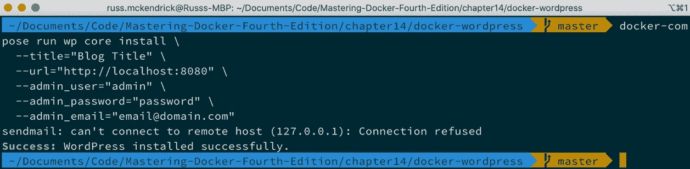

*第十五章*

# Docker 工作流

到目前为止，您应该已经在思考如何将 Docker 引入到您的日常工作流程中。在本章中，我们将把所有部分整合在一起，这样您就可以在本地开发环境中开始使用 Docker。我们还将讨论在规划生产环境时需要考虑的一些事项。

本章将涉及以下主题，所有这些都将在我们之前章节所学内容的基础上展开：

+   用于开发的 Docker

+   监控 Docker 和 Kubernetes

+   生产环境是什么样的？

# 技术要求

在本章中，我们将在桌面上使用 Docker。与之前的章节一样，我将使用我偏好的操作系统，即 macOS。我们将运行的 Docker 命令适用于我们已经安装 Docker 的所有三种操作系统；然而，某些支持命令——虽然不多——可能仅适用于基于 macOS 和 Linux 的操作系统。

# 用于开发的 Docker

我们将通过讨论 Docker 如何帮助开发人员来开始了解工作流。回到*第一章*的开头，*Docker 概述*部分，我们讨论的第一个话题之一是开发人员和“只在我机器上能运行”的问题。到目前为止，我们还没有完全解决这个问题，现在让我们来解决它。

在本节中，我们将讨论如何在本地计算机上使用 Docker for macOS 或 Docker for Windows 以及 Docker Compose 开发 WordPress 项目。

目标是启动一个 WordPress 安装，您可以通过以下步骤来实现：

1.  下载并安装 WordPress。

1.  允许桌面编辑器（如 Atom、Visual Studio Code 或 Sublime Text）从本地计算机访问 WordPress 文件。

1.  使用**WordPress 命令行**工具（**WPCLI**）配置和管理 WordPress。这样，您可以停止、启动甚至删除容器而不会丢失工作。

在启动 WordPress 安装之前，让我们看一下 Docker Compose 文件，您可以在随附的仓库中的`chapter14/docker-wordpress`文件夹中找到它：

```
version: '3'
services:
```

我们将启动四个不同的服务，从`web`开始：

```
  web:
    image: nginx:alpine
    ports:
      - '8080:80'
    volumes:
      - './wordpress/web:/var/www/html'
      - './wordpress/nginx.conf:/etc/nginx/conf.d/default.conf'
    depends_on:
      - wordpress
```

紧接着是`wordpress`服务：

```
  wordpress:
    image: wordpress:php7.2-fpm-alpine
    volumes:
      - './wordpress/web:/var/www/html'
    depends_on:
      - mysql
```

接下来，我们来看一下`mysql`数据库服务：

```
  mysql:
      image: mysql:5
      environment:
        MYSQL_ROOT_PASSWORD: 'wordpress'
        MYSQL_USER: 'wordpress'
        MYSQL_PASSWORD: 'wordpress'
        MYSQL_DATABASE: 'wordpress'
      volumes:
        - './wordpress/mysql:/var/lib/mysql'
```

最后，我们有一个名为`wp`的辅助服务：

```
  wp:
    image: wordpress:cli-2-php7.2
    volumes:
      - './wordpress/web:/var/www/html'
      - './wordpress/export:/export'
```

我们可以使用`PMSIpilot`的`docker-compose-viz`工具来可视化 Docker Compose 文件。

要实现此操作，请在与`docker-compose.yml`文件相同的文件夹中运行以下命令：

```
$ docker container run --rm -it --name dcv -v $(pwd):/input 
pmsipilot/docker-compose-viz render -m image docker-compose.yml
```

这将输出一个名为`docker-compose.png`的文件，您应该会看到类似这样的内容：


图 15.1：运行 docker-compose-viz 时我们 WordPress Docker Compose 文件的输出

第一个服务叫做 web。这个服务是我们四个服务中唯一暴露给主机网络的，它作为我们 WordPress 安装的前端。它运行的是来自[`store.docker.com/images/nginx/`](https://store.docker.com/images/nginx/)的官方 NGINX 镜像，并执行两个角色。看看 NGINX 配置，看看你是否能猜出它们是什么：

```
server {
  server_name _;
  listen 80 default_server;
  root /var/www/html;
  index index.php index.html;
  access_log /dev/stdout;
  error_log /dev/stdout info;
  location / { 
    try_files $uri $uri/ /index.php?$args; 
  }
  location ~ .php$ {
    include fastcgi_params;
    fastcgi_pass wordpress:9000;
    fastcgi_index index.php;
    fastcgi_param SCRIPT_FILENAME    $document_root$fastcgi_script_name;
    fastcgi_buffers 16 16k;
    fastcgi_buffer_size 32k; 
  }
}
```

你可以看到，我们除了 PHP 内容外，所有内容都通过 NGINX 从`/var/www/html/`提供，这些内容是通过 NGINX 从主机挂载的，所有针对 PHP 文件的请求都被代理到我们的第二个服务，名为`wordpress`，端口为`9000`。NGINX 配置本身是从主机挂载到`/etc/nginx/conf.d/default.conf`。

这意味着我们的 NGINX 容器充当静态内容的 Web 服务器，这是第一个角色；同时，它也充当了通往 WordPress 容器的代理，处理动态内容，这是容器承担的第二个角色——你猜对了吗？

第二个服务是`wordpress`。这是来自[`hub.docker.com/images/wordpress`](https://hub.docker.com/images/wordpress)的官方 WordPress 镜像，我使用的是`php7.2-fpm-alpine`标签。这让我们能够在 PHP 7.2 上运行一个 WordPress 安装，使用基于 Alpine Linux 的`PHP-FPM`。

重要提示

**PHP FastCGI 处理器管理器**（**PHP-FPM**）是一个具有许多优秀功能的 PHP FastCGI 实现。对我们而言，它允许 PHP 作为一个服务运行，我们可以将其绑定到一个端口并传递请求；这与 Docker 每个容器运行一个单独服务的方法相契合。

我们正在挂载与我们为 web 服务使用的相同的 web 根目录，在主机上是`wordpress/web`，在服务上是`/var/www/html/`。首先，主机上的文件夹将是空的；然而，一旦 WordPress 服务启动，它会检测到没有核心的 WordPress 安装，并将其复制到该位置，从而有效地引导我们的 WordPress 安装并将其复制到主机上，准备好供我们开始工作。

第三个服务是 MySQL，使用官方的 MySQL 镜像，可以在[`hub.docker.com/images/mysql`](https://hub.docker.com/images/mysql)找到，它是我们使用的四个镜像中唯一没有使用 Alpine Linux 的（来吧 MySQL，赶紧发布一个基于 Alpine Linux 的镜像吧！）。它使用的是`debian:buster-slim`。

我们传递了一些环境变量，以便在容器第一次运行时创建数据库、用户名和密码；如果你以后将这个作为项目的基础，密码是你应该更改的内容。

与 web 和 `wordpress` 容器一样，我们也从主机上挂载了一个文件夹。在这种情况下，是`wordpress/mysql`，我们将其挂载到`/var/lib/mysql/`，这是 MySQL 存储其数据库和相关文件的默认文件夹。

第四个也是最后一个服务被简单地称为`wp`。它与其他三个服务不同：当执行此服务时，它会立即退出，因为容器内没有长时间运行的进程。与长时间运行的进程不同，我们只有一个单一进程，用于与 WordPress 安装进行交互和管理。

在容器中运行此工具的优点是，我们运行命令行工具的环境与主`wordpress`容器完全匹配。

你会注意到，我们像在 web 和 WordPress 中一样挂载了 web 根目录，这意味着容器可以完全访问我们的 WordPress 安装，并且还有一个名为`/export`的第二个挂载；一旦我们配置好 WordPress，我们将更详细地查看这一点。

要启动 WordPress，我们只需运行以下命令来拉取镜像：

```
$ docker-compose pull
```

这将拉取镜像并启动 web、`wordpress`和`mysql`服务，并准备`wp`服务。在服务启动之前，我们的`wordpress`文件夹看起来像这样：


图 15.2：启动 WordPress 之前

如你所见，那里只有**nginx.conf**，它是 Git 仓库的一部分。然后，我们可以使用以下命令来启动容器并检查它们的状态：

```
$ docker-compose up -d
$ docker-compose ps
```

你的终端输出应该类似于以下屏幕：


图 15.3：启动并检查 WordPress 安装的状态

你应该看到在`wordpress`文件夹中创建了三个文件夹：`export`、`mysql`和`web`。另外，请记住，我们期望`dockerwordpress_wp_1`的退出状态为`Exit 1`，所以这没问题：


图 15.4：检查启动 WordPress 后创建的文件夹

打开浏览器并访问`http://localhost:8080/`，应该会显示标准的 WordPress 预安装欢迎页面，你可以选择安装时使用的语言：


图 15.5：WordPress 设置页面

不要点击**继续**，因为它会带你进入图形界面安装的下一屏。相反，返回到你的终端。

我们不打算使用图形界面（GUI）来完成安装，而是使用`wp-cli`。这有两个步骤。第一步是创建`wp-config.php`文件。为此，运行以下命令：

```
$ docker-compose run wp core config \
    --dbname=wordpress \
    --dbuser=wordpress \
    --dbpass=wordpress \
    --dbhost=mysql \
    --dbprefix=wp_
```

正如你将在以下终端输出中看到的，在我运行命令之前，我只有 `wp-config-sample.php` 文件，这是 WordPress 核心自带的文件。然后，在运行命令之后，我得到了我自己的 `wp-config.php` 文件：


图 15.6：使用 wp-cli 创建 wp-config.php 文件

你会注意到，在命令中，我们传递了在 Docker Compose 文件中定义的数据库详情，并告知 WordPress 它可以通过 `mysql` 地址连接到数据库服务。

现在我们已经配置了数据库连接信息，我们需要配置我们的 WordPress 站点，并创建一个管理员用户并设置密码。为此，请运行以下命令：

```
$ docker-compose run wp core install \
    --title='Blog Title' \
    --url='http://localhost:8080' \
    --admin_user='admin' \
    --admin_password='password' \
    --admin_email='email@domain.com'
```

运行此命令会在电子邮件服务中产生错误；不要担心这个信息，因为这只是一个本地开发环境。我们不太担心 WordPress 安装中的电子邮件发送：



图 15.7：使用 cp-cli 配置 WordPress

我们已经使用 wp-cli 在 WordPress 中配置了以下内容：

+   我们的 URL 是 **http://localhost:8080**。

+   我们的站点标题应该是**博客标题**。

+   我们的管理员用户名是 **admin**，密码是 **password**，用户的电子邮件地址是 **email@domain.com**。

返回浏览器并输入 `http://localhost:8080/` 应该会展示一个原生的 WordPress 站点：


图 15.8：默认的 WordPress 站点

在我们进一步操作之前，先稍微自定义一下我们的安装，首先安装并启用 **JetPack** 插件：

```
$ docker-compose run wp plugin install jetpack –activate
```

命令的输出如下：


图 15.9：安装 JetPack 插件

然后，`install` 并启用 **Sydney** 主题：

```
$ docker-compose run wp theme install sydney --activate
```

命令的输出如下：


图 15.10：安装 Sydney 主题

刷新我们的 WordPress 页面 `http://localhost:8080/` 应该会显示类似如下内容：


图 15.11：查看更新主题后的站点

在我们打开 IDE 之前，使用以下命令销毁运行我们 WordPress 安装的容器：

```
$ docker-compose down
```

命令的输出如下：


图 15.12：停止并移除正在运行 WordPress 的容器

由于我们的整个 WordPress 安装，包括所有文件和数据库，都存储在本地机器上，我们应该能够运行以下命令来恢复到我们停留的位置：

```
$ docker-compose up -d
```

一旦确认它已按预期启动并运行，可以访问`http:// localhost:8080/`，然后在桌面编辑器中打开`docker-wordpress`文件夹。我使用的是 Visual Studio Code。

在编辑器中，打开`wordpress/web/wp-blog-header.php`文件，在开头的 PHP 语句中添加以下行，并保存：

```
echo 'Testing editing in the IDE';
```

文件应该像下面这样：


图 15\. 13：在 Visual Studio Code 中编辑 wp-blog-header.php

保存后，刷新浏览器。你应该能在页面最底部看到消息**测试 IDE 中的编辑功能**（以下屏幕已缩放；如果你在屏幕上跟随操作，可能较难找到该消息，因为文字很小）：


图 15.14：查看我们在页面上的编辑

我们最后要查看的是为什么我们将`wordpress/export`文件夹挂载到`wp`容器上。

正如本章前面提到的，你其实不应该随便修改`wordpress/mysql`文件夹的内容；这也包括共享它。虽然如果你将项目文件夹压缩并传给同事可能能工作，但这并不被认为是最佳实践。因此，我们将导出文件夹挂载到容器中，以便使用 WPCLI 进行数据库转储和导入。

为此，执行以下命令：

```
$ docker-compose run wp db export --add-drop-table /export/
wordpress.sql
```

根据你运行的 Docker 版本，你可能在执行前述命令时遇到权限拒绝错误；如果遇到，请改用以下命令：

```
$ docker-compose run wp db export --add-drop-table /var/www/
html/wordpress.sql
```

这样会将数据库转储复制到`wordpress/wordpress`目录，而不是`wordpress/export`。之所以这样做，是因为不同的主机操作系统处理本地文件的创建方式不同，这可能会导致容器内的权限问题。

以下终端输出展示了导出操作的过程，以及执行命令前后`wordpress/export`的内容，最后是 MySQL 转储文件的顶部几行：


图 15.15：导出 WordPress 数据库

如果我在开发过程中犯了个错误，意外地破坏了部分数据库，我可以通过运行以下命令恢复到我之前备份的数据库：

```
$ docker-compose run wp db import /export/wordpress.sql
```

命令的输出结果如下：


图 15.16：导入 WordPress 数据库

如您所见，我们已经安装了 WordPress，并使用 WordPress 命令行工具 `wp-cli` 和网页浏览器进行交互，编辑了代码，备份并恢复了数据库，所有这些都不需要在本地机器上安装或配置 `NGINX`、`PHP`、`MySQL` 或 `wp-cli`。我们也没有需要登录到容器中。通过将宿主机的卷挂载进去，当我们拆卸 WordPress 容器时，内容是安全的，我们没有丢失任何工作。

此外，如果需要，我们可以轻松地将项目文件夹的副本传递给一位安装了 Docker 的同事，通过一条命令，他们就能在完全相同的环境中运行我们的代码，就像我们自己安装的环境一样。

提示

如果您愿意，您可以通过运行 `docker-compose down` 停止并删除您的 WordPress 容器。如果您正在跟随本书，您可能想保留 WordPress 以便在下一个章节中监控运行中的容器。

最后，由于我们使用的是来自 Docker Hub 的官方镜像，我们知道可以安全地将其部署到生产环境，因为它们是按照 Docker 的最佳实践构建的。

您可能会发现一个非常实用的功能，那就是 Docker 能与您选择的 IDE 集成得如此顺畅。在前面的几页中，当我们编辑 `wp-blog-header.php` 文件时，您可能注意到左侧出现了 Docker 图标。在我们结束本章节之前，让我们快速讨论一下微软是如何将 Docker 支持集成到 Visual Studio Code 中的，接下来我们将简称其为 VS Code。

首先，您需要安装 VS Code，您可以在[`code.visualstudio.com/`](https://code.visualstudio.com/)找到它，并安装 Microsoft 的 Docker 扩展，您可以在 Visual Studio 市场上找到该扩展：[`marketplace.visualstudio.com/items?itemName=ms-azuretools.vscode-docker`](https://marketplace.visualstudio.com/items?itemName=ms-azuretools.vscode-docker)。

您会注意到这个扩展并不会直接出现在您的面前。这是因为它与 VS Code 深度集成——例如，如果您右键点击资源管理器中的`docker-compose.yml`文件，您会发现菜单中有一些选项，允许您与 Docker Compose 进行交互：


图 15.17：从 VS Code 运行 Docker Compose

点击左侧的**Docker**图标将弹出一个列表，显示正在运行的容器、可用的镜像、您连接的注册表、网络和卷：


图 15.18：查看您正在运行的容器

右键点击容器，您可以选择使用 VS Code 内置的终端连接到正在运行的容器：


图 15.19：使用内置终端附加到容器

从 Git 仓库中打开与本书配套的文件夹，在 VS Code 中按下*CMD +Shift + P*将打开 VS Code 中的命令提示符。从这里，输入 `Dockerfile` 文件，并询问你想要构建哪个：


图 15.20：选择一个 Dockerfile 进行构建

构建完成后，你的镜像将在 Docker 部分列出，你可以右键点击标签并将其推送到你连接的任何注册表：


图 15.21：推送我们新构建的镜像

你也可以运行容器。一旦容器运行，你可以右键点击它并选择**在浏览器中打开**，直接进入应用程序：


图 15.22：在浏览器中打开运行中的容器

VS Code Docker 扩展的最终技巧是一个非常有用的功能。假设你有一个没有 `Dockerfile` 的仓库——例如，可以在 [`github.com/go-training/helloworld/`](https://github.com/go-training/helloworld/) 找到的 Go Training `helloworld` 仓库，它没有 `Dockerfile` 或 `docker-compose.yml` 文件。下载该仓库并在 VS Code 中打开它。

打开后，按下*CMD +Shift + P*，输入 `Add Docker`，然后选择 `3000`。点击 `Dockerfile` 后，将打开如下内容：


图 15.23：VS Code 生成的多阶段 Dockerfile

你还会注意到一个 `docker-compose.yml` 文件以及一个 `.dockerignore` 文件和其他几个文件已被生成。从这里，你可以构建镜像，然后运行它。我建议使用**交互式运行**选项，因为应用程序所做的只是打印**Hello World!**然后退出，如下图所示：


图 15.24：运行应用程序

正如你肯定已经看到的，Docker 与 VS Code 的集成非常强大，使你可以在 VS Code 中运行我们在前几章中介绍的几乎所有 Docker 命令。其他 IDE 也有类似的扩展。相关链接在*进一步阅读*部分。

## Docker 和 Azure DevOps

在*第三章**，存储和分发镜像*的*审查第三方注册表*部分，我们介绍了如何使用 GitHub 来托管和构建我们的容器镜像。我们还讨论了 Azure 容器注册表。

为了结束本章这一部分，我们将快速了解如何配置一个 Azure DevOps 管道，该管道构建我们在*第二章*《构建容器镜像》中介绍的多阶段 Dockerfile。

在我们配置管道之前，先来讨论一下 Azure DevOps 是什么。它是 Microsoft 提供的一项服务，具有以下功能：

+   版本控制

+   报告

+   需求管理

+   项目管理

+   自动构建

+   测试

+   发布管理

这看起来可能是很多不同的服务，的确如此，但 Azure DevOps 就是那种能够将各种 Microsoft 服务（包括 Microsoft Azure 生态系统中的服务）以及编程语言（如 .NET）和工具（如 Visual Studio）紧密结合在一起的粘合剂。涵盖所有内容将占用整本书的篇幅；事实上，关于这个主题已有几本书，因此我们将只介绍构建容器并将其推送到 Docker Hub 所需的基本功能。

开始使用 Azure DevOps 的唯一要求是拥有一个账户——要免费注册，请访问[`dev.azure.com/`](https://dev.azure.com/%20)，并按照屏幕上的提示操作。创建账户后，点击 **+ 新建项目** 按钮。

当你进入 **创建新项目** 页面时，会看到可以填写 **项目名称** 和 **描述** 的选项，并选择 **可见性**；默认情况下，项目是 **私有的**，但你也可以将其设置为 **公开**。

填写完详细信息后，点击 **创建**。我建议将项目设置为 **私有**。

创建项目后，点击位于左侧菜单最底部的 **项目设置** 选项。当 **项目设置** 页面加载完毕后，点击 **服务连接**，它位于 **管道** 下方。

从这里，点击 **创建服务连接** 按钮，从显示的服务列表中选择 **Docker Registry**。

在此，选择 **Docker Hub** 旁边的单选图标，输入你的 Docker ID，然后输入你的 **Docker 密码**。如果你的 Docker Hub 账户启用了多重身份验证（我强烈建议你配置此项），那么你将需要一个用户访问令牌——我们在*第三章*《存储和分发镜像》一节中讲解过这个问题：


图 15.25：设置与 Docker Hub 的服务连接

输入详细信息后，点击 **验证** 按钮，如果你输入的详情正确，将显示一个绿色勾号。在点击 **验证并保存** 按钮之前，你需要输入一个 **服务连接名称**；我输入的是 **Docker**，但你可以随意选择，只需记住它，因为稍后我们将需要用到。

接下来，您需要一个包含 `Dockerfile` 和名为 `azure-pipelines.yml` 的文件的 Git 仓库—您可以 fork [`github.com/russmckendrick/DevOpsContainerBuild`](https://github.com/russmckendrick/DevOpsContainerBuild) 中的示例仓库。

一旦获得您的仓库，返回到 Azure DevOps 项目，然后点击左侧菜单中的**Pipelines**，此时您将看到如下界面：


](img/Figure_15.26_B15659.jpg)

图 15.26：第一次查看 Pipelines 页面

如您所猜测，您需要点击**创建管道**，这会要求您输入几个信息项：

1.  **您的代码在哪里？** 请选择 GitHub。您会注意到旁边有 YAML。我们将在管道配置完成后讨论 YAML 文件。

1.  按照屏幕上的指示将 Azure DevOps 与您的 GitHub 账户链接。一旦链接完成，系统会要求您**选择一个仓库**。请选择您之前 fork 的仓库。

1.  如果`azure-pipelines.yml`文件没有被自动选中并且您停留在**配置**界面上，请点击**现有 Azure Pipelines YAML 文件**选项，从下拉列表中选择文件，然后点击**继续**。

1.  **审核** 页面为您提供了**审核您的管道 YAML** 文件的选项，还可以选择**运行**它；不过，在此之前，请点击**变量**。

1.  我们需要添加两个变量。第一个变量将让管道知道我们在本节中配置的 Docker Hub 服务连接的名称，第二个变量将让管道知道我们希望 Azure DevOps 管道将构建好的镜像推送到的 Docker Hub 仓库名称。

1.  点击 `Docker` 中的 `targetRegistry`，然后点击 `targetRepo`，接着为 `russmckendrick/AzureDevOpsBuild` 设置值。点击**确定**，然后点击**保存**。保存后，点击**运行**按钮触发构建。

`azure-pipeline.yml` 文件如下所示。首先，我们有 **触发器** 配置；该配置设置为 **master**，意味着每当主分支更新时，都会触发构建：

```
trigger:
- master
```

接下来是**pool**。这告诉 Azure DevOps 在管道执行时启动哪个虚拟镜像；如您所见，我们使用的是 Ubuntu：

```
pool:
  vmImage: 'ubuntu-latest'
```

`azure-pipeline.yml` 文件的其余部分是构建 `Docker@2` 任务，用于登录到 Docker Hub：

```
steps:
- task: 'Docker@2'
  displayName: 'Login to Docker Hub'
  inputs:
    command: 'login'
    containerRegistry: '$(targetRegistry)'
```

我们正在使用在设置管道时定义的变量 `$(targetRegistry)`。这会告诉任务使用哪个服务连接。下一个任务是构建并推送我们的容器镜像：

```
- task: Docker@2
  displayName: 'Build & Push container'
  inputs:
    command: 'buildAndPush'
    containerRegistry: '$(targetRegistry)'
    repository: '$(targetRepo)'
    tags: |
      latest
```

如您所见，语法非常易于理解。我们还使用了第二个变量 `$(targetRepo)` 来定义我们希望推送到的目标镜像仓库。最后一个任务是退出 Docker Hub：

```
- task: 'Docker@2'
  displayName: 'Logout of Docker Hub'
  inputs:
    command: 'logout'
    containerRegistry: '$(targetRegistry)'
```

最后一项任务可能不太需要，因为在 Azure DevOps 启动构建镜像时，虚拟机会在构建完成后被终止，如果构建过程中发生任何错误，虚拟机也会被终止，因此我们不必担心虚拟机被重复使用或我们的登录被第三方访问。

完成的管道运行大致如下：


图 15.27：已完成的管道运行

完成后，你应该能够在你的 Docker Hub 账户中看到新构建的容器。如前所述，在我们开始配置 Azure DevOps 管道之前，我们几乎只触及了 Azure DevOps 能做的事情；有关 Azure DevOps 的一些有趣链接，请参阅本章的*进一步阅读*部分。

接下来，我们将看看如何监控我们的容器和 Docker 主机。

# 监控 Docker 和 Kubernetes

在*第四章*，*管理容器*一章中，我们讨论了`docker container top`和`docker container stats`命令。你可能记得，这两个命令仅显示实时信息——没有保存历史数据。

如果你正在调试一个正在运行的问题，或者想快速了解容器内部发生了什么，这非常有用；然而，如果你需要回顾一个问题，这就不太有帮助了。例如，你可能已配置容器在变得无响应时重启。虽然这有助于应用程序的可用性，但如果你需要查看容器为什么变得无响应，它帮助不大。

在 GitHub 仓库的 `/chapter14` 文件夹中，有一个名为 `prometheus` 的文件夹，里面有一个 Docker Compose 文件，该文件在两个网络上启动了三个不同的容器。我们不直接查看 Docker Compose 文件本身，而是来看一下可视化效果：


图 15.28：Prometheus Docker Compose 文件的可视化

你可以通过运行以下命令自行生成这个：

```
$ docker container run --rm -it --name dcv -v $(pwd):/input 
pmsipilot/docker-compose-viz render -m image docker-compose.yml
```

如你所见，事情正在发生变化。我们正在运行的三个服务如下：

+   Cadvisor

+   Prometheus

+   Grafana

在我们启动并配置 Docker Compose 服务之前，我们应该先讨论每个服务的必要性，从 `cadvisor` 开始：

`cadvisor` 服务是一个由 Google 发布的项目。如图中所示的 Docker Hub 用户名，我们正在使用的服务部分在 Docker Compose 文件中如下所示：

```
  cadvisor:
    image: google/cadvisor:latest
    container_name: cadvisor
    volumes:
      - /:/rootfs:ro
      - /var/run:/var/run:rw
      - /sys:/sys:ro
      - /var/lib/docker/:/var/lib/docker:ro
    restart: unless-stopped
    expose:
      - 8080
    networks:
      - back
```

我们正在挂载宿主机的各种文件系统部分，以便 `cadvisor` 访问我们的 Docker 安装，方式与我们在 *第九章* 中的 *Portainer* – *Docker 图形用户界面* 相似。这样做的原因是，在我们的案例中，我们将使用 `cadvisor` 来收集容器的统计信息。虽然它可以作为独立的容器监控服务使用，但我们不希望公开暴露 `cadvisor` 容器。相反，我们仅将其提供给我们 Docker Compose 堆栈中的其他容器，在后台网络中使用。

`cadvisor` 服务是一个自包含的 Docker 容器状态命令的 Web 前端，能够显示图表，并允许你通过简洁的界面从 Docker 主机深入到容器中；但是，它不会保留超过五分钟的数据指标。

由于我们试图记录的指标可能会在几小时甚至几天后才能获取，只有五分钟的指标数据意味着我们需要使用额外的工具来记录它所处理的指标。`cadvisor` 服务以结构化数据的形式暴露我们希望记录在容器中的信息，访问地址为 `http://cadvisor:8080/metrics/`。

稍后我们会看为什么这很重要。`cadvisor` 端点会被我们的下一个服务 `prometheus` 自动抓取。这是大多数重负载处理的地方。`prometheus` 是一个由 SoundCloud 编写并开源的监控工具：

```
  prometheus:
    image: prom/prometheus
    container_name: prometheus
    volumes:
      - ./prometheus/prometheus.yml:/etc/prometheus/prometheus.
yml
      - prometheus_data:/prometheus
    restart: unless-stopped
    expose:
      - 9090
    depends_on:
      - cadvisor
    networks:
      - back
```

如前面服务定义所示，我们挂载了一个名为 `./prometheus/prometheus.yml` 的配置文件和一个名为 `prometheus_data` 的数据卷。该配置文件包含了我们希望抓取的数据源信息，正如以下配置所示：

```
global:
  scrape_interval:     15s 
  evaluation_interval: 15s
  external_labels:
      monitor: 'monitoring'
rule_files:
scrape_configs:
  - job_name: 'prometheus'
    static_configs:
      - targets: ['localhost:9090']
  - job_name: 'cadvisor'
    static_configs:
      - targets: ['cadvisor:8080']
```

我们指示 Prometheus 每 15 秒抓取一次我们的端点数据。端点在 `scrape_configs` 部分定义，如你所见，我们在那里定义了 `cadvisor` 和 Prometheus 本身。我们创建并挂载 `prometheus_data` 数据卷的原因是 Prometheus 将存储我们所有的指标数据，因此我们需要确保其安全。

本质上，Prometheus 是一个时间序列数据库。它获取抓取的数据，处理数据以找到指标名称和值，然后将其与时间戳一起存储。

Prometheus 还带有一个强大的查询引擎和 API，使其成为这类数据的完美数据库。虽然它确实具备基本的图表绘制功能，但建议使用 *Grafana*，这也是我们最终的服务，并且是唯一公开暴露的服务。

*Grafana* 是一个开源工具，用于显示监控图表和指标分析，它允许你使用时间序列数据库（如 Graphite、InfluxDB 以及 Prometheus）来创建仪表盘。还有其他可作为插件提供的后端数据库选项。

Grafana 的 Docker Compose 定义遵循与我们其他服务类似的模式：

```
  grafana:
    image: grafana/grafana
    container_name: grafana
    volumes:
      - grafana_data:/var/lib/grafana
      - ./grafana/provisioning/:/etc/grafana/provisioning/
    env_file:
      - ./grafana/grafana.config
    restart: unless-stopped
    ports:
      - 3000:3000
    depends_on:
      - prometheus
    networks:
      - front
      - back
```

我们使用`grafana_data`卷来存储 Grafana 自身的内部配置数据库，而不是将环境变量存储在 Docker Compose 文件中，而是从一个名为`./grafana/grafana.config`的外部文件加载它们。

变量如下所示：

```
GF_SECURITY_ADMIN_USER=admin
GF_SECURITY_ADMIN_PASSWORD=password
GF_USERS_ALLOW_SIGN_UP=false
```

如你所见，我们在这里设置了用户名和密码，因此将它们放在外部文件中意味着你可以在不编辑核心 Docker Compose 文件的情况下更改这些值。

现在我们知道了这三个服务各自的角色，接下来让我们启动它们。

为此，只需从`prometheus`文件夹中运行以下命令：

```
$ docker-compose pull
$ docker-compose up -d
```

这将创建一个网络和卷，并从 Docker Hub 拉取镜像。然后，它将启动三个服务：


](img/Figure_15.29_B15659.jpg)

图 15.29：运行 docker-compose up -d 启动我们的 Prometheus 应用

你可能会立刻想进入 Grafana 仪表盘。如果你这么做，你什么也看不见，因为 Grafana 需要几分钟来初始化。你可以通过查看日志来跟踪它的进度：

```
$ docker-compose logs -f grafana
```

命令的输出如下所示：


](img/Figure_15.30_B15659.jpg)

图 15.30：检查日志以查看 Grafana 是否准备就绪

一旦你看到`HTTP Server Listen`消息，Grafana 将可用。从 Grafana 版本`5`开始，你可以导入数据源和仪表盘，这就是我们将`./grafana/provisioning/`文件夹从主机挂载到`/etc/grafana/provisioning/`的原因。

这个文件夹包含自动配置 Grafana 与我们 Prometheus 服务对接并导入仪表盘的配置，该仪表盘将显示 Prometheus 从`cadvisor`抓取的数据。

打开浏览器并输入[`localhost:3000/`](http://localhost:3000/)，你应该会看到登录界面：


](img/Figure_15.31_B15659.jpg)

图 15.31：Grafana 登录页面

使用`admin`和`password`登录。一旦登录，如果你已经配置了数据源，你应该看到以下页面：


](img/Figure_15.32_B15659.jpg)

图 15.32：登录到 Grafana

如你所见，**添加你的第一个数据源**和**创建你的第一个仪表盘**的初步步骤已经完成。点击左上角的**主页**按钮会弹出一个菜单，列出可用的仪表盘：


](img/Figure_15.33_B15659.jpg)

图 15.33：查看可用的仪表盘

如你所见，我们有一个名为**Docker Monitoring**的仪表盘。点击它会带你到以下页面：


](img/Figure_15.34_B15659.jpg)

图 15.34：Docker Monitoring 仪表盘

如你在屏幕右上角的时间信息中所看到的，默认情况下，它显示的是过去五分钟的数据。点击它可以更改时间范围的显示。例如，以下屏幕显示的是过去 15 分钟的数据，这显然比 `cadvisor` 记录的五分钟更多：


图 15.35：查看 15 分钟的数据

我已经提到过，这是一个复杂的解决方案；最终，Docker 会扩展最近内建的 Prometheus 端点，目前它仅暴露 Docker 引擎的信息，而不包括容器本身。有关内建端点的更多信息，请查看官方 Docker 文档，链接是 [`docs.docker.com/config/daemon/prometheus/`](https://docs.docker.com/config/daemon/prometheus/)。

目前有其他的监控解决方案；它们大多数以第三方**软件即服务**（**SaaS**）的形式存在。正如你从*进一步阅读*部分的服务列表中看到的那样，市面上有一些已经成熟的监控解决方案。事实上，你可能已经在使用它们，因此在扩展配置时，考虑到这些解决方案来监控你的容器会非常容易。

*那 Kubernetes 呢？*你可能会问。我已经提到过，Prometheus 最初是由*SoundCloud*开发的，但它也是第一个被捐赠给**云原生计算基金会**（**CNCF**）的 Kubernetes 以外的项目之一。

这意味着 Kubernetes 和外部服务（如 Azure AKS）中支持 Prometheus——例如，Azure Monitor 与 Prometheus 有无缝集成。

为了演示这一点，请查看 Azure Friday 的演讲 *如何使用 Prometheus 监控 Azure Monitor 中的容器*，由*Keiko Harada 与 Scott Hanselman* 主讲，视频可以在 Microsoft Azure YouTube 频道找到，链接是 [`www.youtube.com/watch?v=5ARJ6DzqTYE`](https://www.youtube.com/watch?v=5ARJ6DzqTYE)。

# 生产环境是什么样的？

本章的最后部分，我们将讨论生产环境应该是什么样的。这个部分不会像你想象的那样长，因为可用的选项实在太多，无法一一覆盖。你也应该已经根据前面的部分和章节，形成了一个关于什么最适合你的良好概念。

相反，我们将讨论在规划你的环境时，你应该问自己的一些问题。

## 你的 Docker 主机

Docker 主机是你环境中的关键组件。如果没有这些，你就没有地方运行你的容器。正如我们在前面章节中看到的，运行 Docker 主机时有一些需要考虑的事项。

你需要首先考虑的一点是，如果你的主机正在运行 Docker，它们不应该运行任何其他服务。

### 进程混合

你应该抵制在现有主机上快速安装 Docker 并启动容器的诱惑。这不仅可能对安全性产生影响，因为在单个主机上混合了隔离和非隔离的进程，还可能导致性能问题，因为你无法为非容器化应用程序添加资源限制，这意味着它们可能会对正在运行的容器产生负面影响。

### 多个隔离的 Docker 主机

如果你有超过几个 Docker 主机，你打算如何管理它们？运行像 Portainer 这样的工具很好，但当尝试管理超过几个主机时，它可能会变得麻烦。此外，如果你运行多个隔离的 Docker 主机，你就没有将容器在主机之间移动的选项。

当然，你可以使用像 Weave Net 这样的工具，将容器网络跨多个独立的 Docker 主机进行扩展。根据你的托管环境，你也许有机会在外部存储上创建卷，并在需要时将其呈现给 Docker 主机，但你实际上是在创建一个手动过程，用来管理容器在主机之间的迁移。

### 路由到你的容器

如果你有多个主机，你需要考虑如何在容器之间路由请求。

例如，如果你有一个外部负载均衡器，比如 AWS 中的 ELB，或者一个位于本地集群前面的专用设备，你是否能够动态地为流量添加路由，将流量从负载均衡器上的端口 **x** 路由到 Docker 主机上的端口 **y**，然后将流量路由到你的容器？

如果你有多个容器都需要在相同的外部端口上进行访问，你打算如何处理？

你是否需要安装代理，比如 Traefik、HAProxy 或 NGINX，用于根据虚拟主机（基于域名或子域名）来接收并路由请求，而不是仅仅使用基于端口的路由？

## 集群

我们在前一节中讨论的许多问题可以通过引入集群工具来解决，比如 Docker Swarm 和 Kubernetes。我们快速讨论一下，在评估集群技术时，你应该问自己的一些问题。

### 兼容性

即使一个应用程序在开发人员的本地 Docker 安装上运行良好，你也需要能够保证，当你将应用程序部署到比如 Kubernetes 集群时，它能够以相同的方式运行。

十有八九，你不会遇到问题，但你确实需要考虑应用程序如何与同一应用程序集内的其他容器进行内部通信。

### 参考架构

是否有适用于你所选择的集群技术的参考架构？在部署集群时最好先检查一下。总有一些最佳实践指南，与你拟议的环境非常接近或完全匹配。毕竟，没有人希望创建一个大的单点故障。

另外，推荐的资源有哪些？部署一个有五个管理节点和一个 Docker 主机的集群是没有意义的，就像部署五个 Docker 主机和一个管理服务器一样没有意义，因为这样你有一个很大的单点故障。

你的集群技术支持哪些辅助技术（例如远程存储、负载均衡器和防火墙）？

### 集群通信

集群与管理主机或 Docker 主机通信时有什么要求？你是否需要一个内部或独立的网络来隔离集群流量？

你是否可以轻松地将一个集群成员锁定为仅限于你的集群？集群通信是否加密？关于你的集群有哪些信息可能被暴露？这会使其成为黑客的目标吗？

集群需要访问哪些外部 API，比如你的公共云提供商？任何 API/访问凭证是如何安全存储的？

## 镜像注册表

你的应用程序是如何打包的？你是否已经将代码嵌入到镜像中？如果是，你是否需要托管一个私有的本地镜像注册表，还是可以接受使用外部服务，例如 Docker Hub、**Docker Trusted Registry**（**DTR**）或 Quay？

如果你需要托管自己的私有注册表，应该将它放在你的环境中的哪里？谁有权限访问？它能否与目录提供商（例如 Active Directory 安装）连接？

# 总结

在本章中，我们查看了几种不同的 Docker 工作流，并学习了如何为容器和 Docker 主机设置一些监控。

当涉及到自己的环境时，你能做的最好的事情就是建立一个概念验证，并尽力覆盖你能想到的所有灾难场景。你可以通过使用云服务提供商提供的容器服务或寻找一个好的参考架构来提前开始，这两者都能减少你的试错率。

在下一章中，我们将探讨在容器世界中，你的下一步可能是什么。

# 问题

1.  哪个容器为我们的 WordPress 网站提供服务？

1.  为什么 `wp` 容器没有保持运行？

1.  `cadvisor` 会保留多少分钟的指标数据？

1.  哪个 Docker Compose 命令可以用来删除与应用程序相关的所有内容？

# 深入阅读

你可以在以下网站找到我们在本章中使用的软件的详细信息：

+   WordPress: [`wordpress.org/`](http://wordpress.org/)

+   WP-CLI: [`wp-cli.org/`](https://wp-cli.org/)

+   PHP-FPM: [`php-fpm.org/`](https://php-fpm.org/)

+   Cadvisor: [`github.com/google/cadvisor/`](https://github.com/google/cadvisor/)

+   Prometheus: [`prometheus.io/`](https://prometheus.io/)

+   Grafana: [`grafana.com/`](https://grafana.com/)

+   Prometheus 数据模型: [`prometheus.io/docs/concepts/data_model/`](https://prometheus.io/docs/concepts/data_model/)

+   Traefik: [`containo.us/traefik/`](https://containo.us/traefik/)

+   HAProxy: [`www.haproxy.org/`](https://www.haproxy.org/)

+   NGINX: [`nginx.org/`](https://nginx.org/)

有关 Docker 和 Azure DevOps 的更多信息，请访问以下链接：

+   Azure DevOps Docker 构建任务: [`docs.microsoft.com/en-us/azure/devops/pipelines/tasks/build/docker?view=azure-devops`](https://docs.microsoft.com/en-us/azure/devops/pipelines/tasks/build/docker?view=azure-devops)

+   Azure DevOps Docker Compose 构建任务: [`docs.microsoft.com/en-us/azure/devops/pipelines/tasks/build/docker-compose?view=azure-devops`](https://docs.microsoft.com/en-us/azure/devops/pipelines/tasks/build/docker-compose?view=azure-devops)

+   Azure DevOps 和 Azure 容器注册表: [`docs.microsoft.com/en-us/azure/devops/pipelines/ecosystems/containers/acr-template?view=azure-devops`](https://docs.microsoft.com/en-us/azure/devops/pipelines/ecosystems/containers/acr-template?view=azure-devops)

+   Packt Publishing 上的 Azure DevOps 书籍: [`www.packtpub.com/catalogsearch/result/?q=Azure%20DevOps`](https://www.packtpub.com/catalogsearch/result/?q=Azure%20DevOps)

其他外部托管的 Docker 监控平台包括以下内容：

+   Sysdig Cloud: [`sysdig.com/`](https://sysdig.com/)

+   Datadog: [`docs.datadoghq.com/agent/docker/?tab=standard`](https://docs.datadoghq.com/agent/docker/?tab=standard%20)

+   SignalFx: [`signalfx.com/docker-monitoring/`](https://signalfx.com/docker-monitoring/)

+   New Relic: [`newrelic.com/partner/docker`](https://newrelic.com/partner/docker)

+   Sematext: [`sematext.com/docker/`](https://sematext.com/docker/)

还有其他自托管选项，例如以下内容：

+   Elastic Beats: [`www.elastic.co/products/beats`](https://www.elastic.co/products/beats)

+   Sysdig: [`sysdig.com/opensource/`](https://sysdig.com/opensource/)

+   Zabbix: [`github.com/monitoringartist/zabbix-docker-monitoring`](https://github.com/monitoringartist/zabbix-docker-monitoring)

以下列表显示了一些其他 IDE 的扩展：

+   Atom Docker 包: [`atom.io/packages/docker`](https://atom.io/packages/docker)

+   Sublime Text Docker 插件: [`github.com/domeide/sublime-docker`](https://github.com/domeide/sublime-docker)

+   Jetbrains Docker 支持: [`www.jetbrains.com/help/idea/docker.html`](https://www.jetbrains.com/help/idea/docker.html)
