# 第一章：使用 Puppet 安装 Docker

在本章中，我们将设置我们的开发环境，以便开发第一个容器应用程序。为此，我们将使用 Vagrant。在第一个话题中，我们将介绍如何安装 Vagrant。我们将了解如何使用 Puppet 作为提供者构建 Vagrantfile。我们还将探讨如何通过 puppetfile 和 r10k 从 Puppet Forge 获取 Puppet 模块。在最后一个话题中，我们将使用 Puppet 在 Centos 7 环境中安装 Docker。本章我们将涵盖以下主题：

+   安装 Vagrant

+   Puppet Forge 介绍

+   安装 Docker

# 安装 Vagrant

你可能会问，为什么我们要使用 Vagrant 作为开发环境？

Vagrant 是 Puppet 开发的必备工具。能够在几分钟内为本地开发创建环境，这一想法是 Vagrant 初期版本的革命性特点。如今，Vagrant 已经发展迅速，支持多个提供者，如 Chef 和 Salt。并且支持多种虚拟化后端，如 VirtualBox、VMware Workstation/Fusion、KVM，我们将使用 VirtualBox 和 Puppet 作为提供者。

## 安装

让我们安装 Vagrant。首先，我们需要我们的虚拟化后端，所以我们先下载并安装 VirtualBox。在撰写本书时，我们使用的是 VirtualBox 5.0.10 r104061。如果你在阅读本书时发现版本已经过时，只需下载最新版本即可。

你可以从[`www.virtualbox.org/wiki/Downloads`](https://www.virtualbox.org/wiki/Downloads)下载 VirtualBox。选择适合你操作系统的版本，如下图所示：

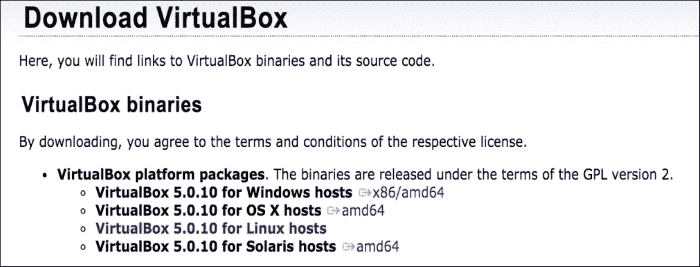

下载完安装包后，按照适合你操作系统的安装过程进行操作。

### VirtualBox

按照以下步骤在 Mac OSX 上安装 Vagrant：

1.  前往你的 `Downloads` 文件夹，双击 `VirtualBox.xxx.xxx.dmg`。接下来会弹出以下安装框：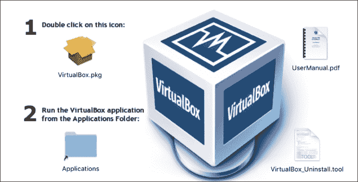

1.  然后，点击 `VirtualBox.pkg`。继续进入下一步，如下图所示：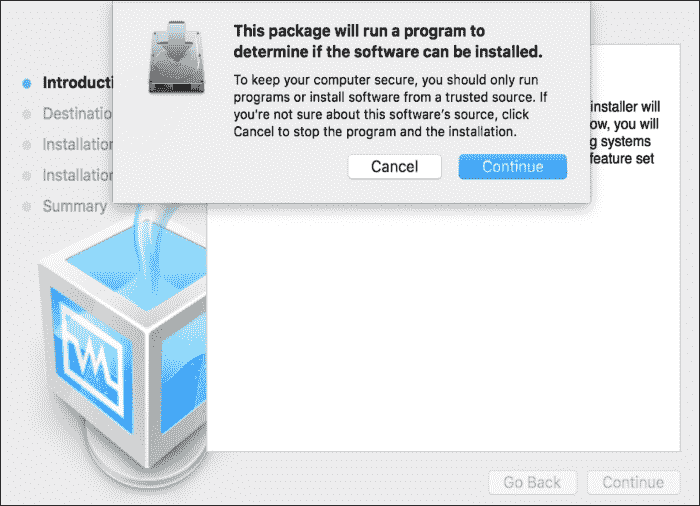

    安装程序将检查该软件是否与 Mac OSX 版本兼容。

1.  然后，点击 **继续**。检查通过后，我们可以进入下一步：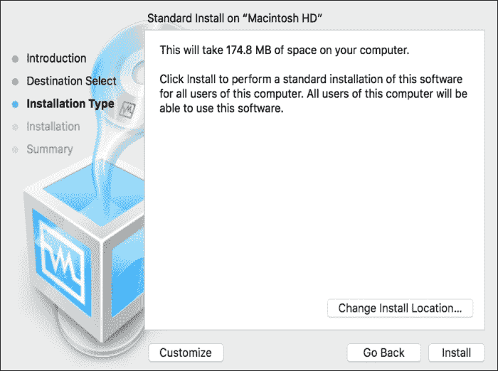

1.  接下来，选择默认的安装位置并点击 **安装**。

1.  接着，输入你的管理员密码并点击 **安装软件**：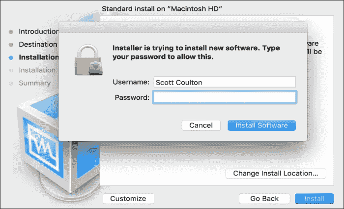

安装现在已经完成。下图显示了完成安装后的屏幕界面：

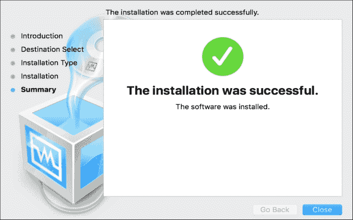

现在我们已经有了虚拟化后端，可以安装 Vagrant 了：

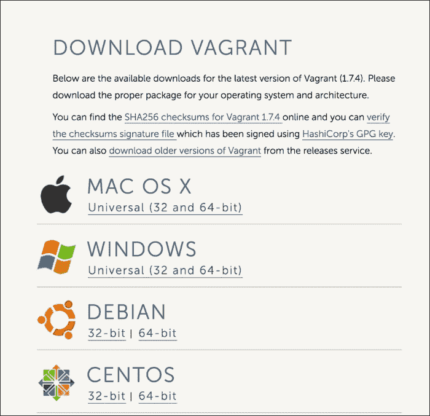

### 注意

在撰写本书时，我们将使用 Vagrant 1.7.4；如果该版本不再是最新版本，请下载最新版本。您可以在 [`www.vagrantup.com/downloads.html`](https://www.vagrantup.com/downloads.html) 找到该版本的 Vagrant。再次提醒，请下载适用于您操作系统的安装包。

### Vagrant

在这里，我们将进行一个标准安装。请按照以下步骤进行操作：

1.  转到您下载 `vagrant.1.7.4.dmg` 的文件夹，双击安装程序。然后，您将看到以下弹窗：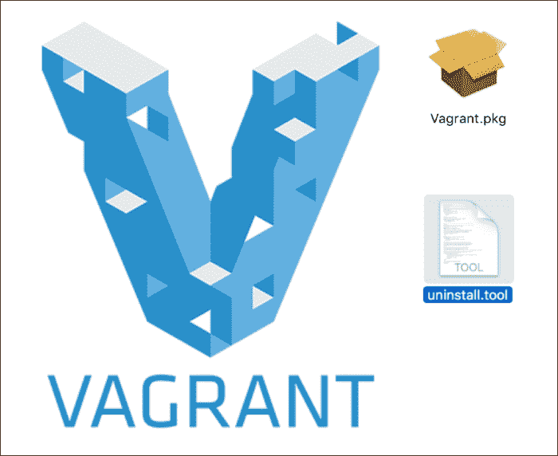

1.  双击 `vagrant.pkg`。

1.  然后，在下一个对话框中，点击 **继续**：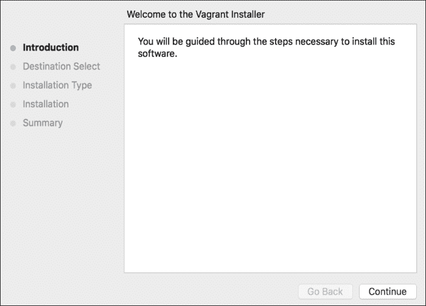

1.  然后，点击 **安装** 按钮：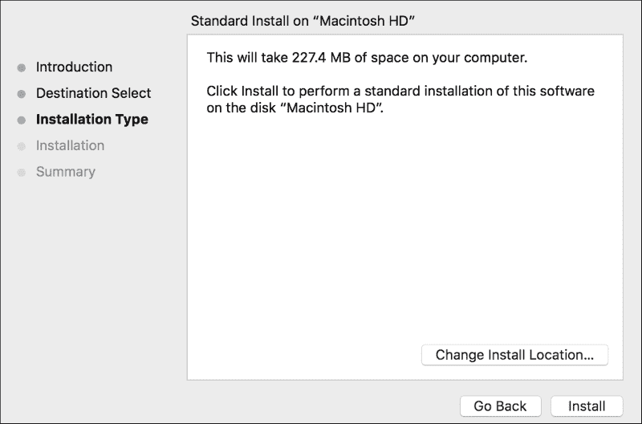

1.  在给定的字段中输入您的管理员密码：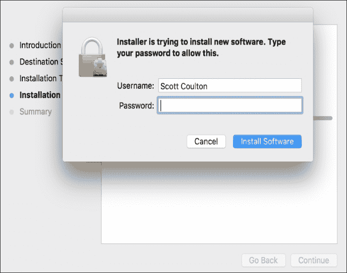

1.  安装完成后，打开您的终端应用程序。在命令提示符中输入 `vagrant`。然后，您应该会看到以下截图：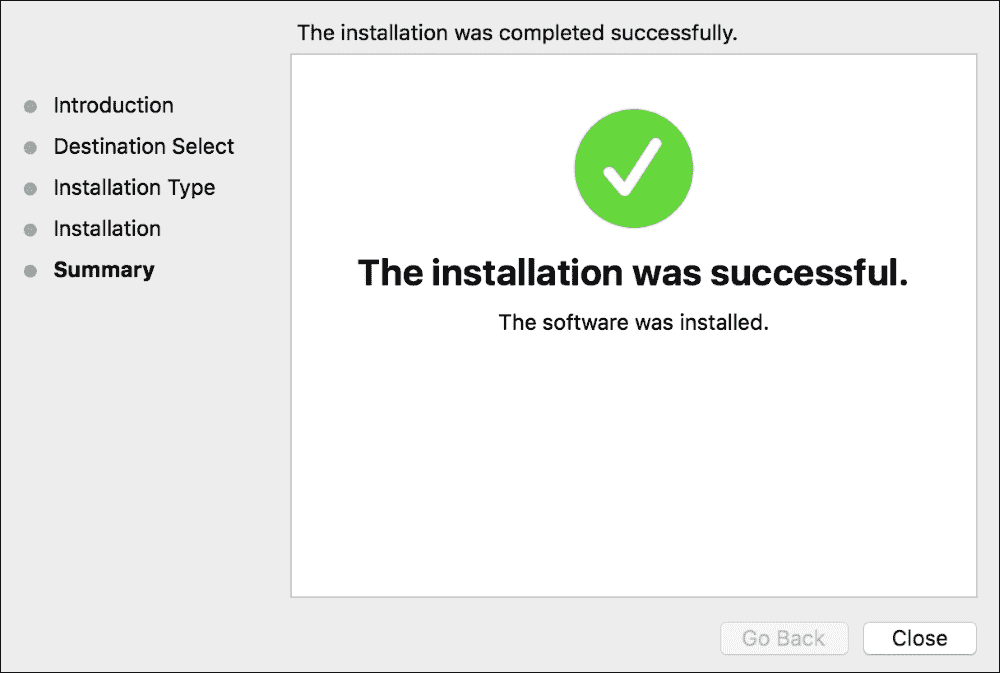

## Vagrantfile

现在我们已经有了一个完全工作的 Vagrant 环境，我们可以开始查看 Vagrant 是如何工作的，以及我们如何为我们的机器进行配置。由于本书并不是关于 Vagrant 的，所以我们不会从头编写一个 Vagrantfile。相反，我已经创建了一个我们将在全书中使用的 Vagrantfile：

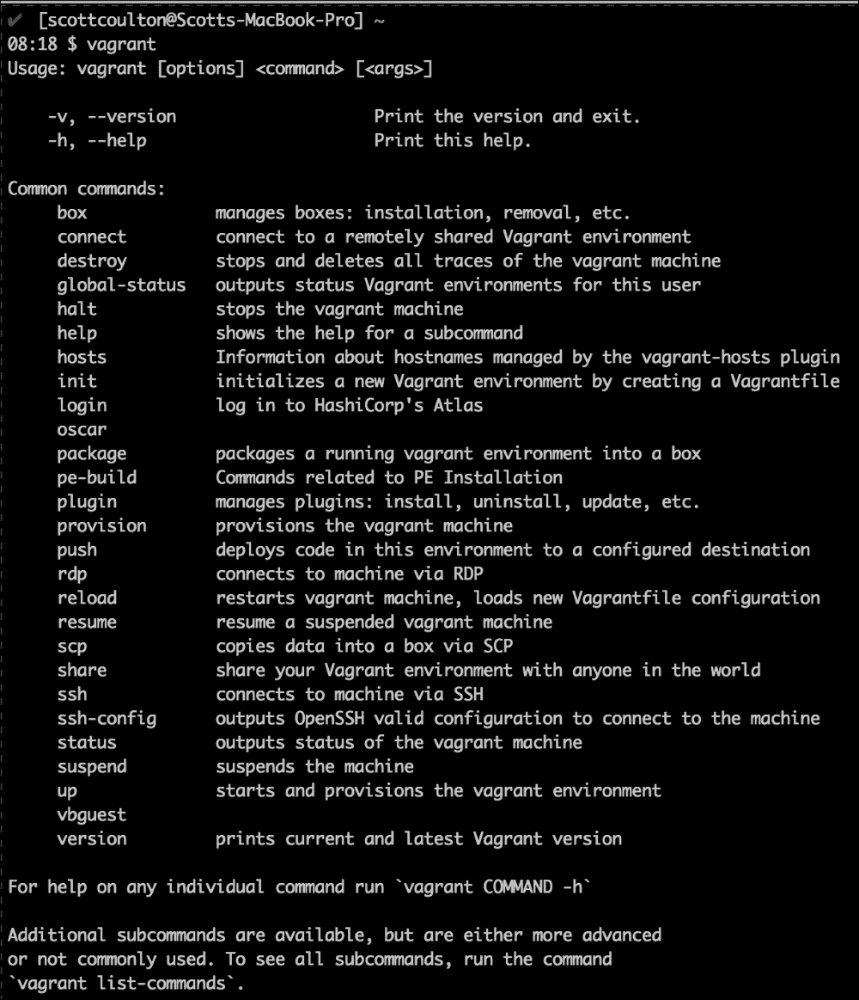

### 注意

您可以从 [`github.com/scotty-c/vagrant-template`](https://github.com/scotty-c/vagrant-template) 下载或 Git 拉取该仓库。

让我们来看一下 Vagrantfile 的构建：

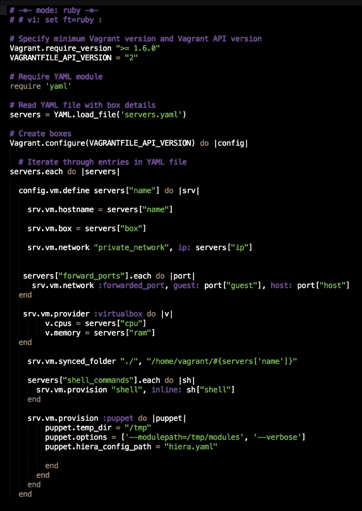

正如前面的截图所示，Vagrantfile 实际上是一个 Ruby 文件。由于它是 Ruby 文件，我们可以利用 Ruby 来使我们的代码优雅且高效。因此，在这个 Vagrantfile 中，我们提取了所有底层配置，并用几个参数替代它们。为什么我们要这么做？原因是将逻辑与配置分离，并且通过迭代配置来避免代码重复。那么，所有的配置都存储在哪里呢？答案是 `servers.yaml` 文件。在这个文件中，我们设置了我们想要部署的 Vagrant box、box 的 CPU 数量、内部网络的 IP、主机名、来宾与主机之间的转发端口、内存以及我们需要用来准备环境供 Puppet 运行的 bash 命令的 shell 提供者，例如，从 Puppet Forge 下载模块及其依赖项：

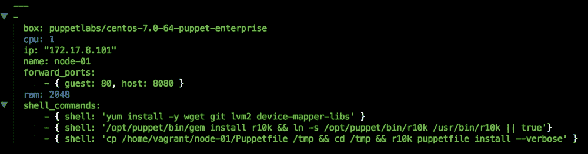

这种方法的好处还在于，任何使用 Vagrantfile 的开发者都不需要实际修改 Vagrantfile 中的逻辑。他们只需要更新`servers.yaml`中的配置。随着我们继续本书的内容，我们将一起工作仓库中的其他文件，比如`Puppetfile`、`hieradata`和`manifests`。现在我们已经设置好了 Vagrant 环境，接下来让我们看看如何从 Puppet Forge 获取我们的 Puppet 模块。

# 欢迎来到 Puppet Forge

在本主题中，我们将学习如何从 Puppet Forge 查找模块。接着，我们将看到如何通过 puppetfile 和 r10k 拉取这些模块及其依赖项。这为我们最后一个主题——*使用 Puppet 安装 Docker*奠定基础。

## Puppet Forge

Puppetlabs 及其产品的一大亮点是其社区。如果你有机会参加 PuppetConf 或 Puppet Camp，无论你住在哪个地方，我都强烈推荐你参加。那里会有丰富的知识，你还能结识到一些非常棒的人。

Puppet Forge 是由 puppetlabs 运行的一个网站。它是其他 Puppet 开发者发布已准备好使用的模块的地方。你可能会问，GitHub 呢？难道不能从那里获取模块吗？当然可以。从 Puppet Forge 和 GitHub 的区别在于，Puppet Forge 是模块的稳定版本，而 GitHub 是贡献模块的地方，也就是说，是用来创建 pull request 的地方。

### 注意

你可以在[Puppet Forge](https://forge.puppetlabs.com/)找到 Puppet Forge。

以下截图显示了 Puppet Forge 的首页：

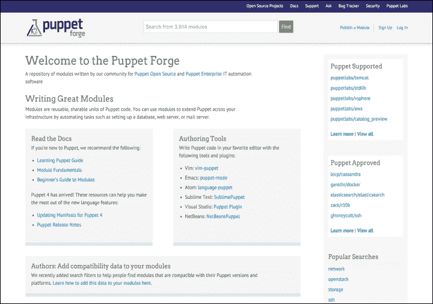

现在我们已经了解了 Puppet Forge，接下来让我们利用它来查找我们将用来构建环境的 Docker 模块。

### 注意

我们将使用 garethr/docker Docker 模块，你可以在[Puppet Forge](https://forge.puppetlabs.com/garethr/docker)上找到它。

现在我们已经选择了模块，可以继续设置我们的 puppetfile：

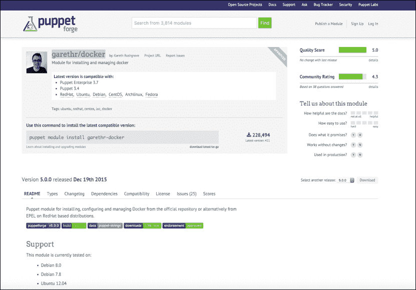

## 创建我们的 puppetfile

在前一个主题中，我们使用 Git 克隆了 Vagrant 模板。在那个仓库中，也有一个 puppetfile。puppetfile 作为我们模块的控制文件，它会列出所有我们需要的模块（在这个例子中，就是安装 Docker）。r10k 随后会引用 puppetfile，将模块从 Puppet Forge 拉取到我们环境的目录中。

由于模块之间有依赖关系，我们需要确保在 puppetfile 中捕捉到它们。对于 Docker 模块，我们有三个依赖项：**puppetlabs/stdlib (>= 4.1.0)**、**puppetlabs/apt (>= 1.8.0 <= 3.0.0)** 和 **stahnma/epel (>= 0.0.6)**，如下面的截图所示。

现在，我们知道了构建 Docker 环境所需的所有模块。我们只需要将它们添加到我们的 puppetfile 中。

以下截图是 puppetfile 应该是什么样子的示例：

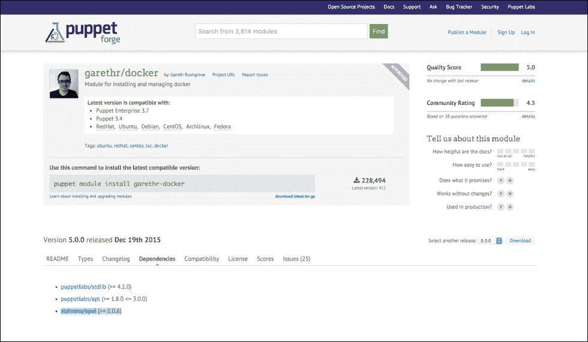

现在，当我们运行 `vagrant up` 时，r10k 将从 Puppet Forge 拉取模块。我们在 `servers.yaml` 的第 13 行调用 r10k，使用 `r10k puppetfile install—verbose` 命令。以下截图显示了该命令的输出：

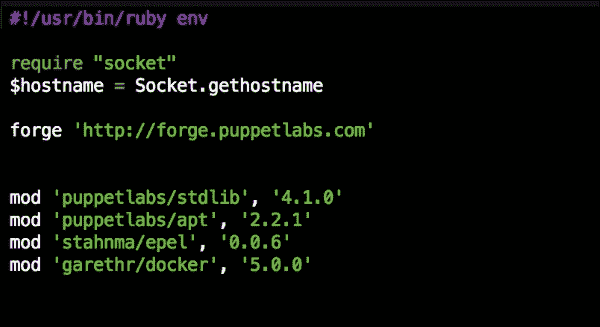

如果成功，终端将显示以下输出：

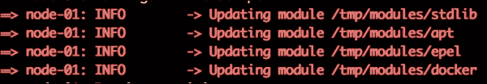

现在我们已经设置好 puppetfile，就可以安装 Docker 了。

# 安装 Docker

本节中，我们将结合 Vagrant 仓库中的所有配置和对 Puppet Forge 的了解，创建 Docker 环境。

## 设置我们的清单

安装 Docker 的第一步是将我们的清单设置为在节点上包含 Docker 类。为此，让我们进入我们的 Vagrant 仓库。在该仓库中，`manifests` 目录下有一个名为 `default.pp` 的文件。我们需要编辑该文件，以包含 Docker 类 `node 'node-01' { include docker}`。现在我们可以保存该文件，并准备好运行我们的环境。

第一步是打开终端并切换到 Vagrant 仓库的根目录。然后，我们需要输入 `vagrant up` 命令：

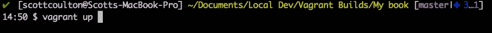

现在，我们将得到 CentOS 7 环境。安装 r10k 后，运行 Puppet 并应用 Docker 类。根据你的笔记本和网络连接，这个过程大约需要 4 分钟。如果环境成功配置，你将看到以下输出：

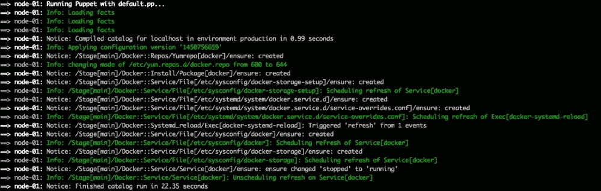

我们还可以通过 SSH 登录到环境中来验证 Docker 是否安装成功。我们可以使用 `vagrant ssh` 命令进行登录。登录后，我们将使用 `sudo -i` 提升为 root 用户。现在，让我们通过 `docker` 命令检查 Docker 是否已经安装。

你将在终端看到以下输出：

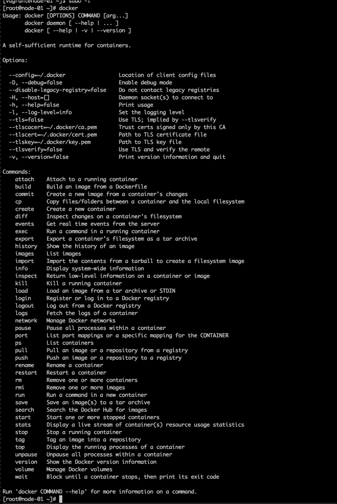

# 总结

在本章中，我们讲解了如何使用 Puppet 创建 Docker 开发环境。我们首先安装了 Vagrant 和 VirtualBox，然后介绍了 Puppet Forge，讲解了如何搜索模块及其依赖项。接着，我们将依赖项映射到 puppetfile 中。我们简要介绍了 r10k，这是从 Puppet Forge 到我们环境的传输机制。最后，我们使用 Puppet 构建了我们的环境。

在下一章中，我们将介绍如何访问 Docker Hub 并拉取公共镜像。
