# 第二章：与 Docker Hub 的工作

在本章中，我们将了解 Docker Hub，它是什么，如何注册账号，如何拉取镜像，如何推送镜像，以及自动化镜像构建。这将为我们在需要与官方镜像打交道时打下一个良好的基础。

在本章中，我们将涵盖以下主题：

+   什么是 Docker Hub？

+   自动化构建

+   使用官方镜像

# 使用 Docker Hub

在本节中，我们将讨论 Docker Hub，它的用途是什么，提供了哪些功能，最后它与其他仓库网站（如 GitHub 或 Puppet Forge）有何不同。接下来，我们将创建一个账号并探索我们的账户设置。之后，我们将查看官方镜像，为下一个主题打下坚实的基础。

## Docker Hub 概述

在上一章中，我们看了 Puppet 的仓库服务，也就是社区称之为 The Forge（[`forge.puppetlabs.com/`](https://forge.puppetlabs.com/)）。现在，让我们来看一下 Docker 的仓库服务——Docker Hub。我们可以在[`hub.docker.com/`](https://hub.docker.com/)找到 Docker Hub。

以下截图显示了屏幕的样子：

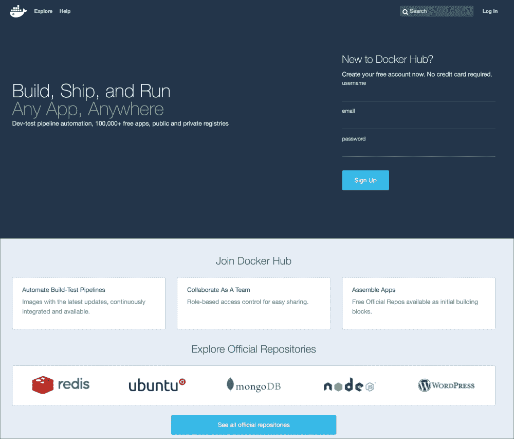

在 Docker Hub 中，有两种类型的镜像：

+   官方镜像

+   开发者创建的镜像

首先，我们将讨论官方镜像。在 Docker Hub 上，你几乎可以获取到任何主流操作系统或应用程序的官方镜像。因此，对于你作为开发者的好处是，安装应用程序的工作已经为你完成，从而节省了时间和精力。这使你能够将时间集中在开发上。让我们看一个例子——我们将使用 golang。

首先，我们将在首页右上角的搜索框中搜索 golang，如下图所示：

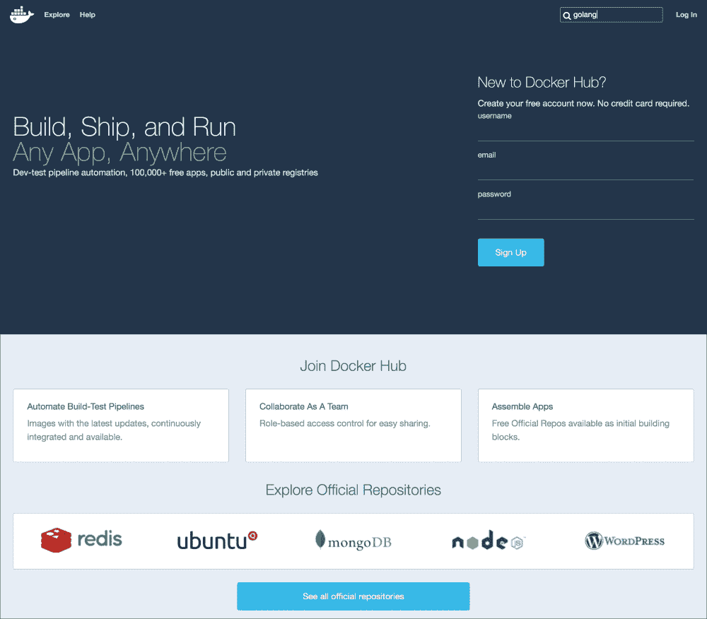

我们的搜索将返回以下结果：

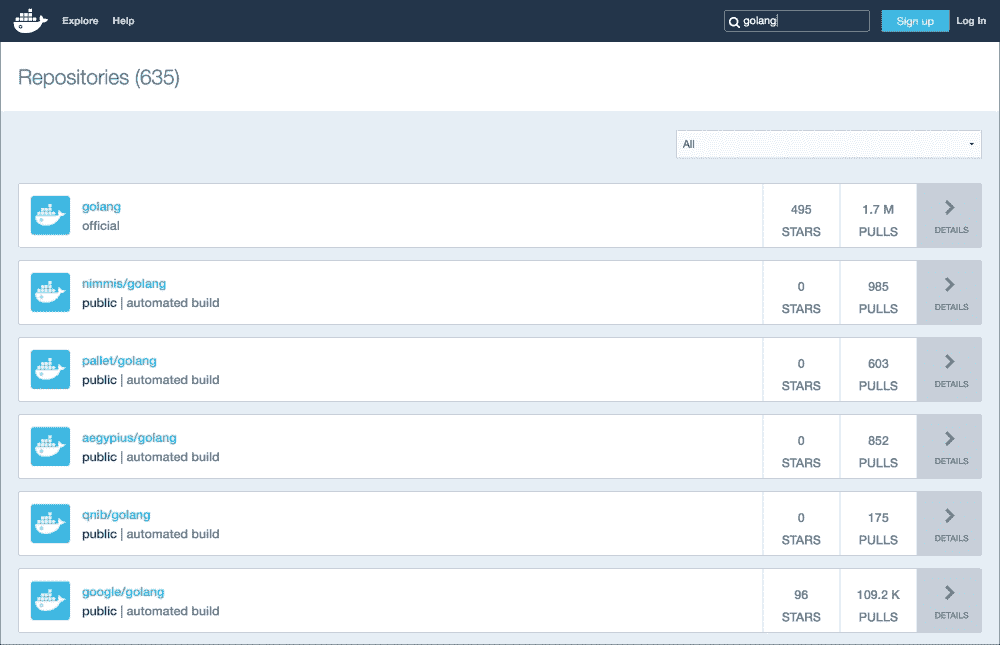

我们将点击 golang 的官方版本，如下图所示：

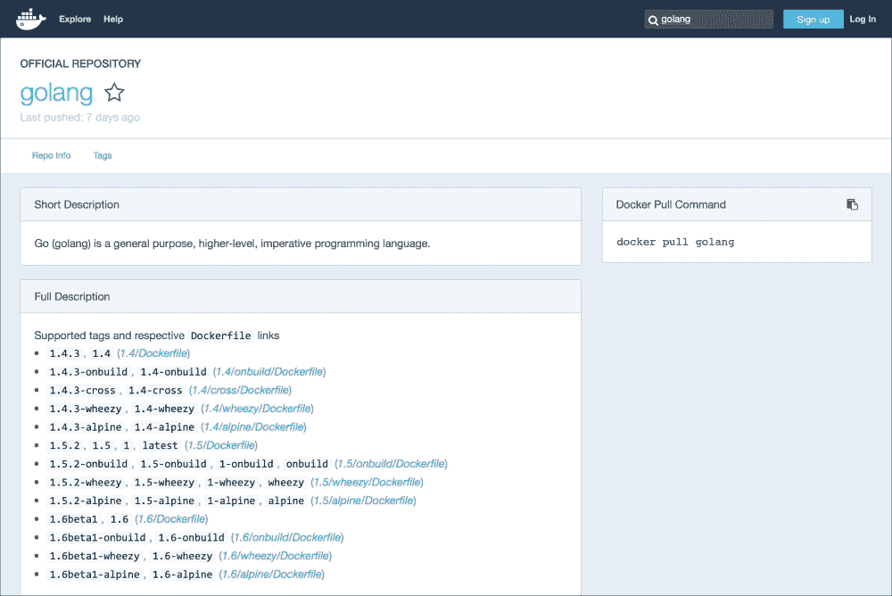

如我们在前面的截图中看到的，这个仓库为我们提供了很多选择。所以，我们可以使用多个不同版本的 golang，甚至在多个不同的操作系统上使用。所以，构建一个 golang 应用程序，我们只需要选择一个镜像。在我们的 Dockerfile 中，我们将使用以下镜像：


然后，我们将在 Dockerfile 中使用`COPY`方法将代码放入构建时的容器中。最后，我们将运行以下截图所示的命令来构建我们的容器：


如你所见，构建我们的应用非常简单，几乎所有开发时间都可以专注于实际应用程序的开发。这将提高我们的生产力，并大大加快将应用推向生产环境的速度。在这个敏捷至上的时代，不看到这种好处简直是不理智的。

Docker Hub 上的第二类镜像是由开发者开发并开源的，且由他们个人维护。判断一个镜像是否为官方镜像，或者是否由个人开发，最简单的方法就是查看镜像的名称。在我们上一个例子中，我们看到了 golang 镜像，它的名称是 `golang`。现在，让我们来看一下我开源的一个容器。作为示例，我们来看一下我的 `consul` 镜像。如果你想使用我的镜像，你可以调用 `scottyc/consul`。如你所见，镜像名称不同，因为它包含了作者名称 `scottyc`，然后是镜像名称 `consul`。现在，你可以看到官方镜像和个人作者镜像之间的命名规则差异。

现在我们已经介绍了在 Docker Hub 上托管的不同镜像，接下来我们可以讲解如何将镜像上传到 Docker Hub。上传镜像有两种不同的方式。无论哪种方式，我们都需要一个 Docker Hub 账户，接下来我们会在下一节讲解如何创建账户。

第一种方式是本地构建镜像，然后使用 `docker push` 命令进行推送。第二种方式是使用自动构建，这是 Docker 内置的一个非常棒的功能，支持在 Docker Hub 上自动构建镜像。我们稍后会更详细地讲解这个过程。从高层次来看，这是一个**CD**（**持续交付**）流程，通过存储在 GitHub 或 Bitbucket 公共仓库中的 Dockerfile 来构建镜像。

## 创建 Docker Hub 账户

在本节中，我们将创建一个 Docker Hub 账户，并查看如何手动登录到 Docker 守护进程（我们将在下一章讲解如何通过 Puppet 完成此操作）。那么，我们开始吧。首先，我们需要访问 Docker Hub（[`hub.docker.com/`](https://hub.docker.com/)），然后在页面右侧填写表单。只需将 **yourusername** 替换为你想要的用户名，**you@youremail.com** 替换为你的电子邮件地址，当然，输入一个安全的密码：

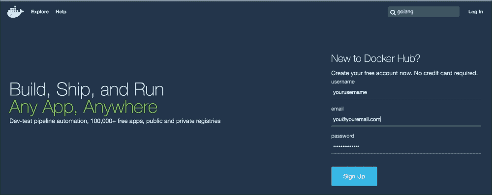

填写完表单后，前往你的电子邮件账户，确认你的账户。这会将你重定向到 Docker 登录页面。登录后，你应该会看到如下网页：

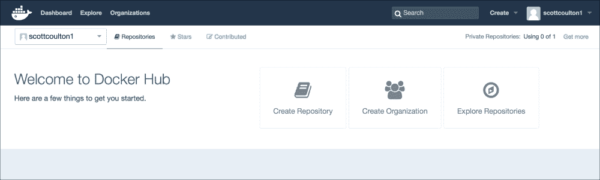

现在我们已经有了一个账户，接下来让我们登录到我们的守护进程。我们可以通过 `vagrant ssh` 重新登录到 Docker vagrant 环境。接着，我们将切换到 root 用户（`sudo –i`），然后输入 `docker login` 命令：

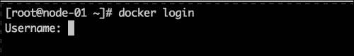

输入我们刚才创建的用户名：

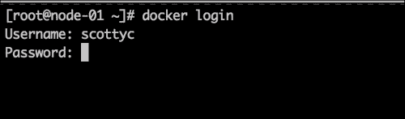

然后，输入你的密码：

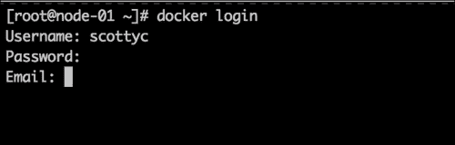

完成后，输入你的电子邮件 ID。完成后，你应该看到以下输出：

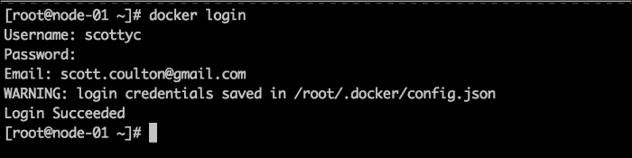

你现在已经成功登录 Docker 守护进程。

## 探索官方镜像

本主题将简要概述如何在 Docker Hub 上搜索镜像。有两种方法可以做到这一点：

+   通过 Docker Hub 网站

+   通过命令行

首先让我们看看网站。如果你还记得，在我们的 Golang 示例中，我们已经使用了 Web 界面来搜索镜像。我们再来看一个例子。在这个例子中，我们将搜索 Bitbucket，Atlassian 的 Git 服务器。所以，我们将返回到 Docker Hub ([`hub.docker.com/`](https://hub.docker.com/))，并在搜索框中输入 `bitbucket`：

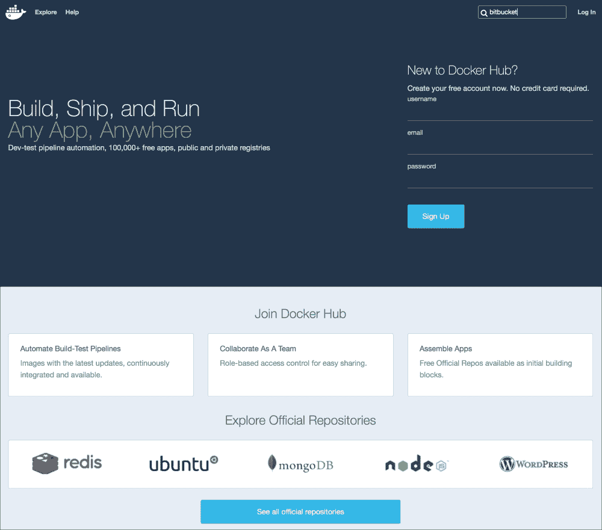

我们的搜索将返回以下结果：

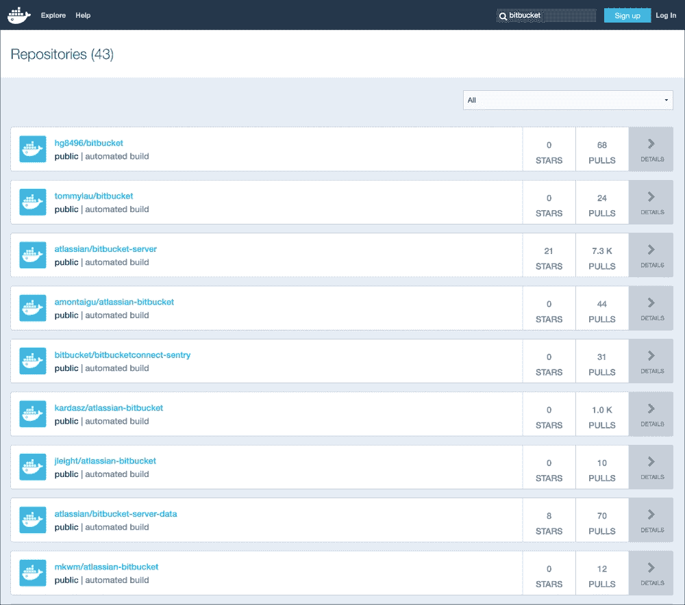

从上面的截图中可以看到，我们得到了 43 个结果。那么，我们应该寻找哪些标准来选择正确的镜像呢？我们总是会寻找以下三点：

+   我们检查拉取次数。使用人数越多，镜像运行时出现问题的可能性就越小。

+   我们还检查 Docker 官方的评分系统：一个仓库有多少颗星。星星是由社区中的其他成员在他们喜欢某个镜像时授予的，这与 GitHub 上的星标系统非常相似。

+   我们检查仓库中是否有 Dockerfile。这让你对镜像是如何构建的有了安心感。你可以看到为完成构建而执行的所有命令。

使用这三项指标，我们来挑选一个镜像。看着这些结果，**atlassian/bitbucket-server** 看起来不错，拥有 21 颗星和 7.3k 次拉取。所以，让我们点击这个仓库并查看是否有 Dockerfile：

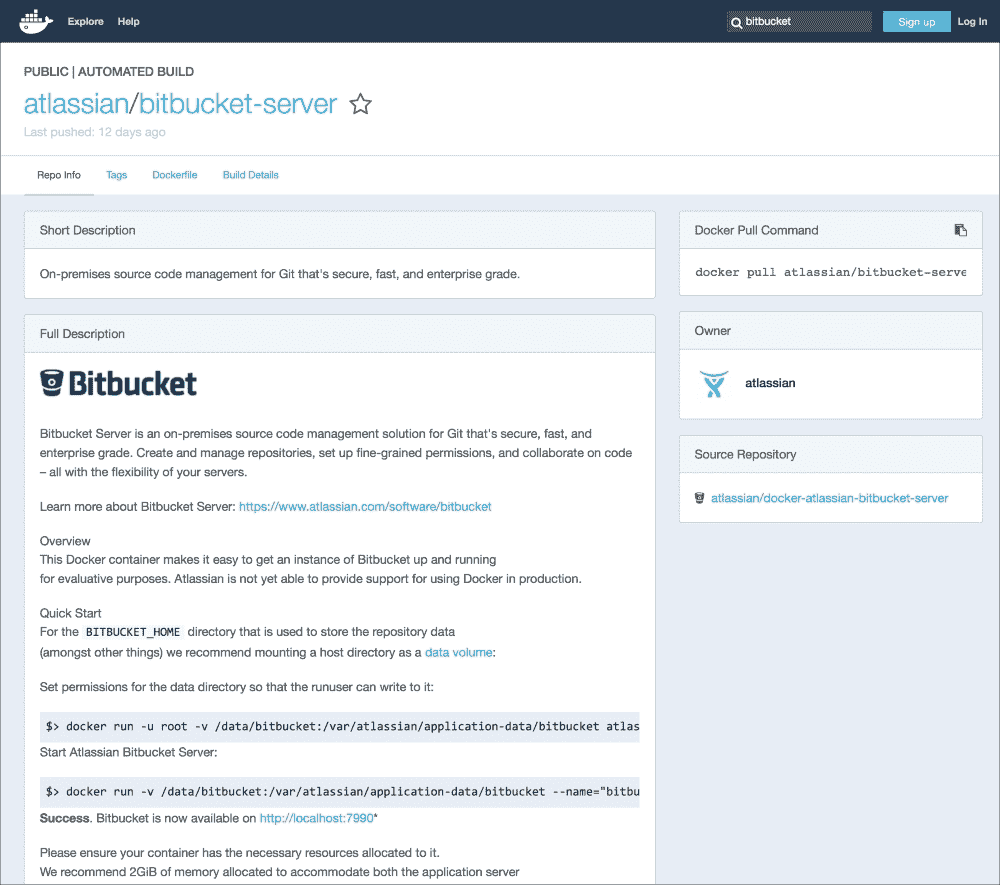

如果我们点击主镜像标题下的 **Dockerfile** 标签，它会带我们到 Dockerfile 页面。并非每个仓库都有 Dockerfile；然而，这并不意味着它是一个不好的镜像。这只是意味着在将其用于生产之前需要更多的测试。一些作者，比如来自 Docker 的 *Jess (Jessie Frazelle)*，把他们的 Dockerfile 放在 GitHub 页面上。她在 Docker Hub 上有很棒的镜像，Dockerfiles 可以在 [`github.com/jfrazelle/dockerfiles`](https://github.com/jfrazelle/dockerfiles) 找到。好了，回到我们的例子。如你所见，以下截图中有一个 Dockerfile：

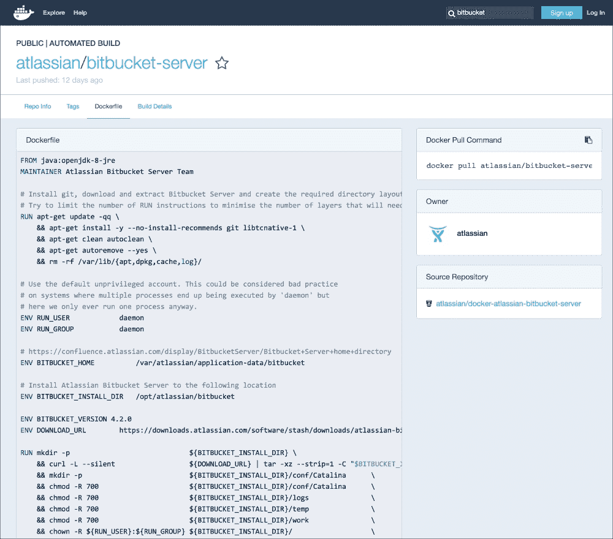

所以，我觉得这是赢家！！！

现在，让我们从命令行进行相同的搜索。在命令行中输入 `docker search bitbucket`，搜索将返回以下结果：

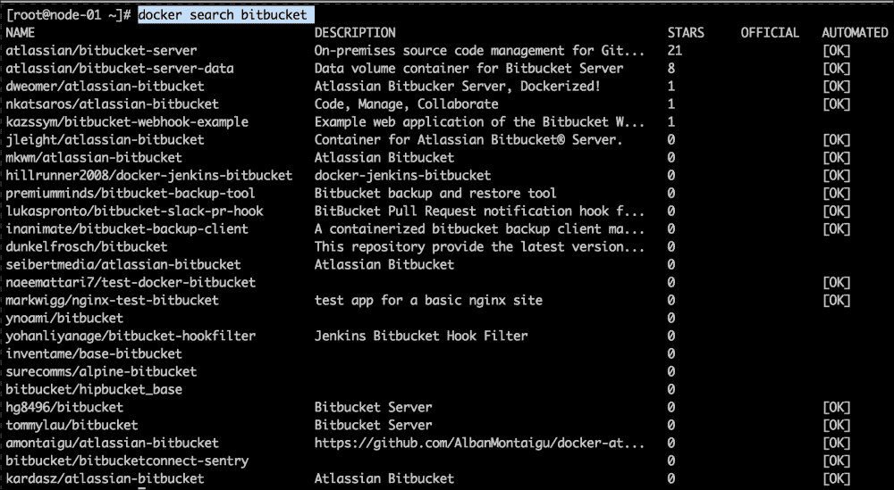

如你所见，它返回了相同的信息，唯一缺少的是拉取次数。同样，似乎我们将使用 **atlassian/bitbucket-server**。

# Docker Hub 中的自动构建

在本节中，我们将概述自动化构建如何工作，并演示如何通过推送方法将镜像发布到 Docker Hub。

## 自动化构建

在 Docker Hub 中，我们有两种方式来发布镜像：通过简单的推送方法或通过自动化构建。在本节中，我们将介绍自动化构建。首先，我们将看一下自动化构建的流程。在本示例中，我们将使用 GitHub，但你也可以使用 Bitbucket。因此，我们需要做的第一件事是将我们的 Docker Hub 账户与 GitHub 账户关联。可以通过导航至**设置** | **已连接账户与服务**来完成：

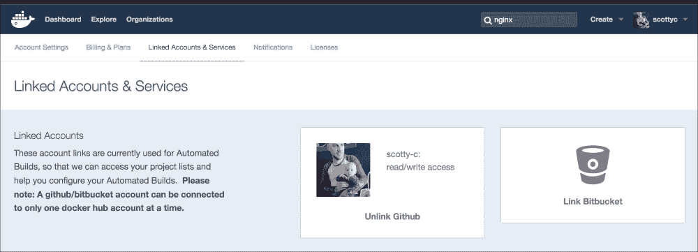

只需按照提示连接账户即可。

完成此步骤后，接下来我们需要访问我们的 GitHub 账户并创建一个仓库。我将使用我已经设置好的仓库：

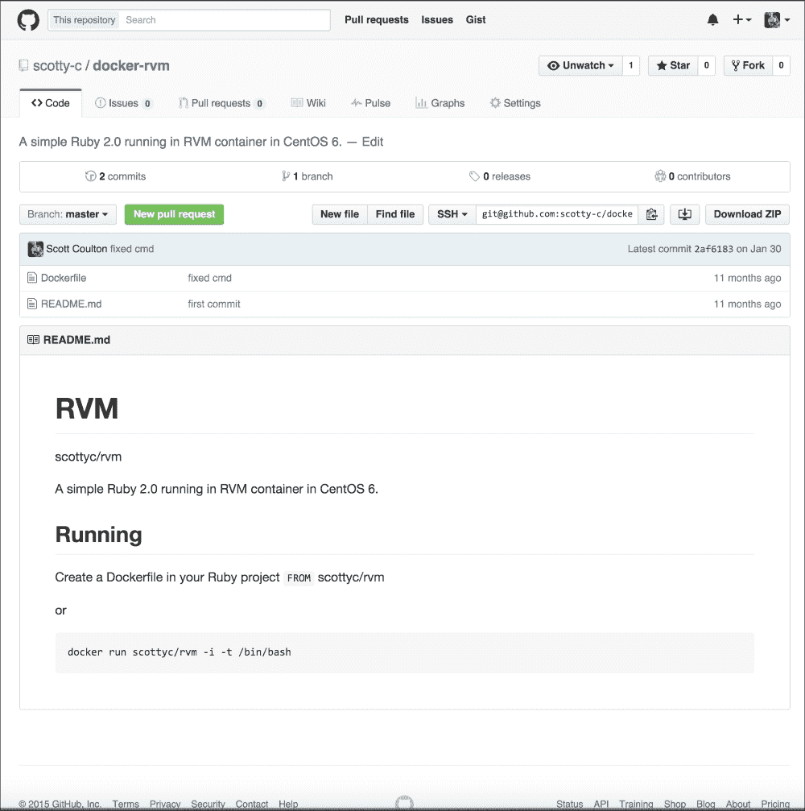

正如你在前面的截图中看到的，仓库包含一个 Dockerfile。现在，让我们看看在 Docker Hub 上查看同一个仓库的情况：

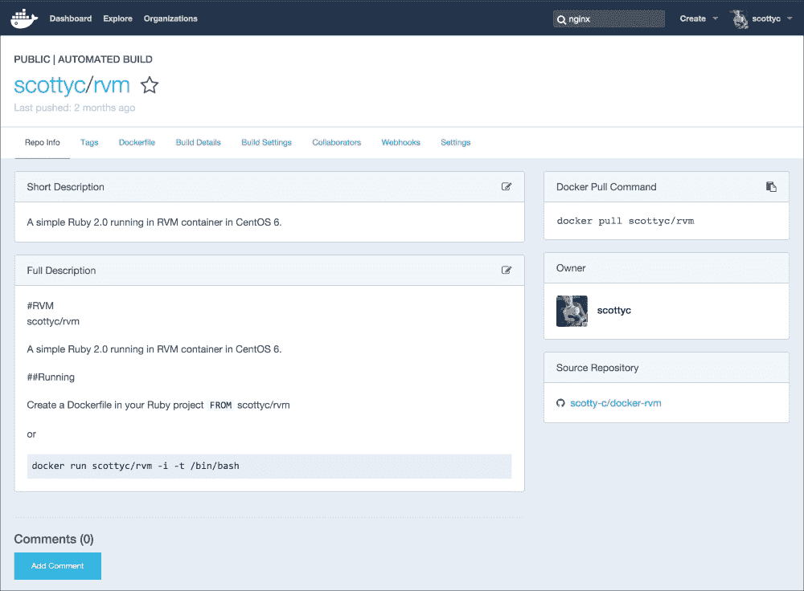

接下来，我们将查看**构建详情**选项卡：

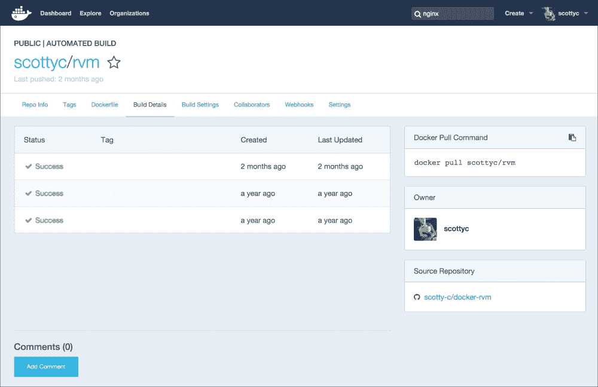

那么，这个构建是如何自动化的呢？其实很简单。每次我们向 GitHub 仓库提交更改时，它都会触发 Docker Hub 的 Webhooks。当 Docker Hub 接收到触发时，它会抓取 Dockerfile 并构建镜像。Docker Hub 会处理每次构建时的版本号等事宜。所以，总的来说，自动化构建就是这样工作的。

## 推送到 Docker Hub

这是一种将镜像推送到 Docker Hub 的相对简单方法，但缺点是没有自动化构建过程，且 Dockerfile 不会自动放入 Docker Hub 仓库。因此，在本示例中，我们假设我们已经创建了一个名为 `scottyc/super_app` 的镜像。要将其推送到 Docker Hub，我们只需在终端输入 `docker push scottyc/super_app`。请注意，在推送时，Docker 守护进程需要登录。

# 使用官方镜像

现在我们已经了解了 Docker Hub 如何为我们提供镜像，接下来让我们看看如何通过三种方法将它们集成到我们的代码中。第一种方法是 Dockerfile，第二种是 `docker-compose.yaml` 文件，最后一种是直接集成到 Puppet 清单中。

## Dockerfile

在本节中，我们将展示如何在基础 Dockerfile 中使用 nginx。在 Dockerfile 中，我们需要添加几个元素。第一个是作为我们应用程序基础的镜像；对我们而言，它是 nginx。第二个是维护者。它应该看起来像以下截图所示：

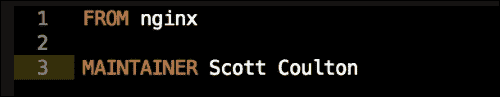

由于基础 nginx 镜像已经暴露了 80 和 443 端口，我们在 Dockerfile 中无需进行该配置。接下来，我们将添加一个简单的 `run` 命令，用于更新容器中的软件包。由于它的基础操作系统是 Debian，我们将添加如下截图中第 **5** 行所示的命令：

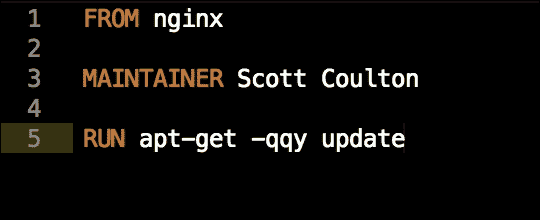

由于我们正在构建一个简单的应用程序，这就是我们将在 Dockerfile 中添加的所有内容。Dockerfile 还有很多配置选项可以使用。

### 注意

如果你想了解更多关于 Dockerfile 的内容，可以访问 [`docs.docker.com/engine/reference/builder/`](https://docs.docker.com/engine/reference/builder/)。

现在，让我们构建我们的镜像。你会注意到，我们的 Vagrant 仓库中的 `server.yaml` 已经将端口 `80` 转发到了端口 `8080`，所以我们无需在这里做任何更改。将我们创建的 Dockerfile 复制到你的 Vagrant 仓库的根目录中。然后，从终端使用 `vagrant up` 启动我们的 vagrant box。接着，当 box 启动后，使用 `vagrant ssh` 连接。让我们切换到 root 用户（`sudo -i`）。然后，如果我们切换到 `/vagrant` 目录，我们应该能看到我们的 Dockerfile。现在，使用命令 `docker build -t YOUR AUTHOR NAME/nginx .` 构建我们的镜像（请注意，命令中的 `.` 是命令的一部分）。你将在终端中看到以下输出：

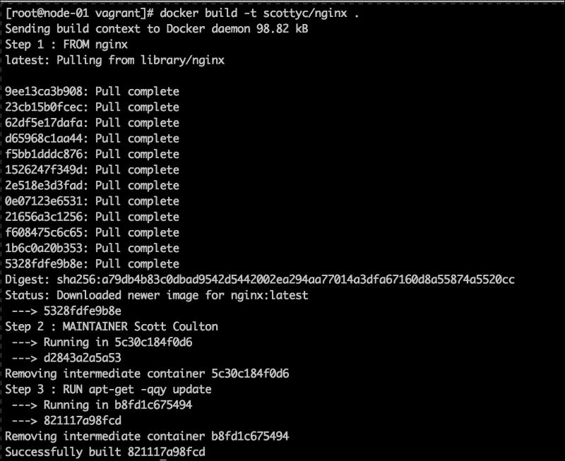

接下来，让我们测试我们的镜像并通过以下命令启动一个容器：

```
docker run -d -p 80:80 --name=nginx YOUR AUTHOR NAME/nginx

```

如果成功，我们应该能在浏览器中看到 nginx 默认页面，网址为 `127.0.0.1:8080`，如下所示：

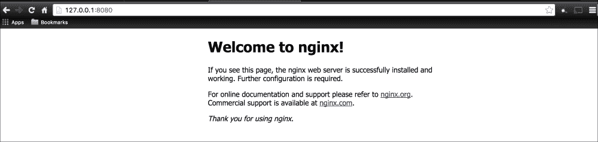

## Docker Compose

现在，我们将使用 Docker Compose 部署相同的 nginx 镜像。在本节中，我们将简要介绍 Docker Compose 以便理解这项技术。在本书的另一章节中，我们会更深入地探讨它。首先，我们需要安装 Docker Compose。

### 提示

在写这本书时，我的 pull request 仍然是开放的，所以我们必须使用 Gareth 模块的我的分支。

为此，让我们修改 Vagrant 仓库中的 puppetfile，使用下方截图中显示的命令：

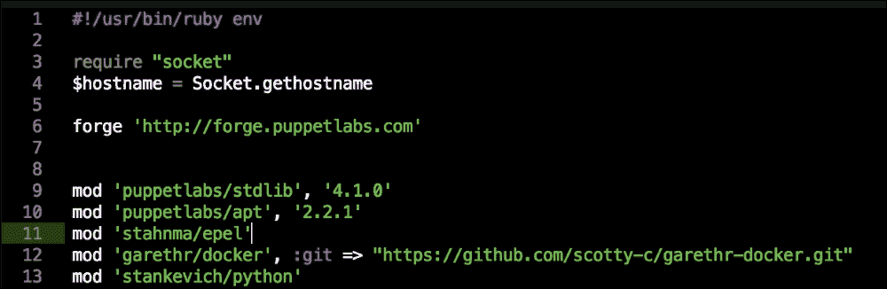

所以，在 Puppetfile 中，我们添加了一个新的模块依赖项 `stankevich/python`，因为 Docker Compose 是用 Python 编写的。我们还更新了 `epel` 模块以使用最新版本。为了获得一个全新的工作环境，我们将在终端中运行命令 `vagrant destroy && vagrant up`。一旦 box 启动，我们将使用 `vagrant ssh` 然后切换到 root 用户（`sudo -i`）。接着，我们会切换到 `/vagrant` 目录并输入 `docker-compose`。

如果构建成功，我们将看到以下界面：

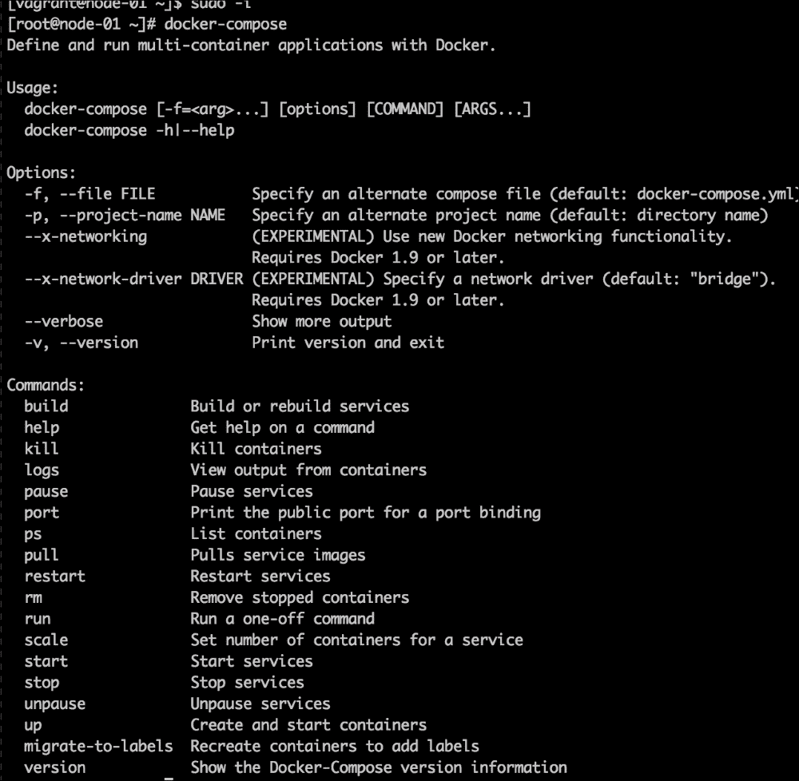

现在，让我们创建 `docker-compose.yaml` 文件：

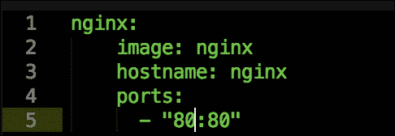

如你所见，我们使用了官方镜像，并给容器命名为 `nginx`，再次暴露了端口 **80:80** 以便访问 nginx 页面。因此，如果我们将 `docker-compose.yml` 文件复制到 Vagrant 目录的根目录，登录到我们的 vagrant box 并切换到 root 用户（`vagrant ssh`，然后 `sudo -i`），我们将能够再次切换到 `/vagrant` 目录。现在，运行 `docker-compose up -d`。运行后，我们将看到以下输出：

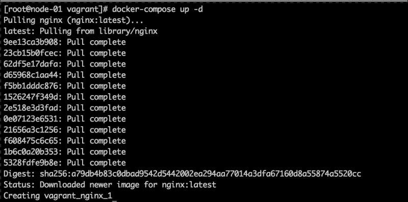

然后我们可以打开我们的网页浏览器，访问`127.0.0.1:8080`，看到 nginx 页面：


### 注意

如果你想了解更多关于 Docker Compose 的内容，可以访问[`docs.docker.com/compose/`](https://docs.docker.com/compose/)。

## Puppet 清单

在本节中，我们将通过一个简单的 Puppet 清单来构建相同的 nginx 容器。这仅仅是一个概念验证。在下一章中，我们将编写一个完整的模块。这只是为了给我们一个基础，理解 Puppet 是如何与 Docker 互动的。所以，在我们的 Vagrant 仓库中，让我们修改`manifest/default.pp`。文件应包含以下代码：

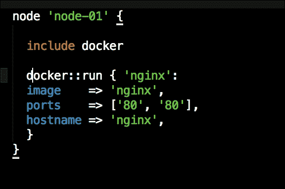

然后我们将在 Vagrant 仓库的根目录打开终端，并运行`vagrant provision`。请注意，此时应没有其他容器在运行。你将看到以下输出，显示 Puppet 已经配置了一个名为 nginx 的 Docker 容器：

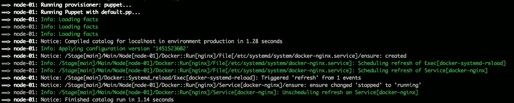

然后我们可以再次检查我们的浏览器，访问`127.0.0.1:8080`。我们将再次看到 nginx 页面：


# 总结

在本章中，我们详细介绍了 Docker Hub 生态系统。我们讨论了什么是官方镜像，自动构建是如何工作的，当然还有如何以三种不同的方式使用镜像。完成本章后，我们现在拥有了使用 Puppet 构建第一个应用的工具。

在下一章中，我们将编写第一个 Puppet 模块来创建一个 Docker 容器，并编写 rspec-puppet 单元测试，确保我们的模块能够按照预期工作。
