# 第四章：构建多容器应用程序

在之前的几个章节中，我们用 Puppet 和 Docker 构建了一些很酷的东西，过程都很简单。现在，我们进入了更复杂的话题，例如如何保持状态以及为什么要在容器中保持状态。Docker 与微服务架构紧密结合，容器通常只是接收数据并将其转换为输出，供下游应用或数据源使用。因此，容器本身并不保持任何状态。Docker 并不局限于这种应用场景。在本章中，我们将通过构建一个完全功能的 Bitbucket 服务器并使用独立的 Postgres 后端来证明这一点。我们将把有状态的数据挂载到底层主机，并将应用程序与该状态解耦。

构建 Bitbucket 的另一个好处是，你可以将其用作你家里的 Git 服务器，以确保所有未来的模块都在源代码控制中。Atlassian 提供了一个 $10 美元的许可，供初创公司或开发人员使用，最多支持 10 个用户，这是个超值的优惠。

在本章中，我们将使用标准的清单资源和 Docker Compose 来构建应用程序。在开始编写代码之前，我们先聊一下如何将应用程序的状态与应用程序本身解耦。以下是我们将在本章中讨论的主题：

+   解耦状态

+   Docker_bitbucket（清单资源）

+   Docker_bitbucket（Docker Compose）

# 解耦状态

本主题我们将讨论容器中的状态。在这个话题中，我们将探讨一些理论内容，但不用担心，我们将在编写模块时将这些理论付诸实践。我们需要理解有状态与无状态的理论背景，这样在未来编写自己的 Puppet 模块以部署 Docker 时，你可以做出关于状态的正确设计选择。

## 有状态与无状态

在前一部分中，我们简要讨论了有状态与无状态的话题，现在让我们深入探讨这一主题。我们来看两个示例应用程序：一个有状态，一个无状态。首先，我们从一个 redis 容器开始。它的任务是作为 activemq 的后台存储。使用队列的应用程序包含逻辑，用于检查消息是否已被接收并期待回应。如果失败，它将重试发送该消息。因此，队列本身是无状态的。我们将 redis 用作缓存。redis 容器不需要保持状态，因为它保存的信息是暂时的。如果容器发生故障，我们只需重启一个新容器，它将再次缓存队列。

现在，看看一个需要状态的容器，以及我们保持状态的选项。在这个应用程序中，我们将构建两个容器。一个是 Bitbucket 本身，另一个是用作后台数据库的 Postgres。因此，这两个容器都需要状态。首先，我们来看 Bitbucket。如果我们不给 Bitbucket 服务器状态，每次重启容器时，所有通过 Git 检入的项目都会丢失。显然，这不是一个可行的解决方案。现在，让我们看一下我们可以用来给容器赋予状态的选项。首先，我们可以在 Dockerfile 中添加卷：

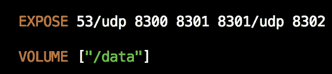

这将赋予容器状态；我们可以重启应用程序，所有数据都会保留，这很好。这正是我们想要的。但这种方法也有一个缺点。卷位于容器内部，未与应用程序解耦。因此，当我们遇到问题时，主要的操作问题是需要更新容器中应用程序的版本。由于所有数据都存储在容器内，我们不能直接拉取最新版本。因此，我们只能使用现有的选项。现在，让我们来看一下如何将本地文件夹映射到容器中。我们通过使用 `/data:/var/atlassian/application-data/bitbucket` 来实现。冒号左侧是运行 Docker 守护进程的本地主机，右侧是容器。

Docker 使用完全限定路径，因此它将创建 `/data` 目录。现在，我们已经将应用程序与数据解耦。如果我们想更新 Bitbucket 的版本，我们只需要在 Puppet 代码中将 `image` 标签更改为新版本，然后运行 Puppet。完成后，新的 Bitbucket 版本将与现有数据一起启动。使用这种方法也有一定的代价。我们现在已经将容器与一个主机绑定。如果你使用的是 Kubernetes 或 Docker Swarm 等调度器，这可能不是最佳选择。这个问题已经被 Docker 引擎 1.8 及以上版本中新增的卷驱动程序解决了。该驱动程序允许我们创建存储对象，这些对象位于引擎运行的主机之外。

### 注意

这超出了本书的范围，但如果你想深入了解这项技术，我推荐你访问 [`clusterhq.com/flocker/introduction/`](https://clusterhq.com/flocker/introduction/)。现在，我们对有状态与无状态容器有了清晰的理解。让我们开始有趣的部分，开始编码吧！

# Docker_bitbucket（清单资源）

在本节中，我们将编写一个模块，用于安装 Atlassian 的 Bitbucket。该应用将由两个容器组成，其中一个将是我们前面提到的 Postgres 容器。我们实际上将调整该容器以增强后端安全性，使其仅对 Bitbucket 可访问。然后，我们将运行 Bitbucket 容器，配置它的运行用户，接着将主机系统的文件系统映射到容器中。

## 创建我们的模块骨架

这将是一个快速的回顾，因为我们在上一章已经讲解过了。如果你仍然对这个步骤感到不太舒服，我建议你再回顾一下上一章，直到你对整个过程有一个很好的理解。

所以，我们将打开终端并切换目录，或者使用`cd`命令进入 Vagrant 仓库的根目录。然后，我们将输入`vagrant up`，当虚拟机启动后，我们使用`vagrant ssh`通过 SSH 连接到它。接下来的步骤是切换到 root 用户（`sudo -i`）。现在我们是 root 用户了，让我们切换到`/vagrant`目录，该目录会映射回我们的本地机器。接着，我们将执行`puppet module generate <AUTHOR>-docker_bitbucket`命令。再说一次，还有一些我们需要调整的内容，但它们在上一章中已经讲过了，因此这里就不重复了。当你完成了剩余的任务，你就可以继续进入下一章。

## 让我们开始编码

现在，我们已经有了模块骨架，并且将它移到了我们 Vagrant 环境根目录下的`modules`文件夹中。我们需要添加两个新文件：`install.pp`和`params.pp`。我们的模块应如以下截图所示：

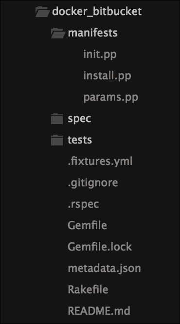

在这个例子中，我们有一些新的内容，因此我在这个示例中没有使用`params.pp`。这给了你一个很好的机会，去应用上一章学到的知识。所以，现在我们将保持`params.pp`为空。既然我们没有在`init.pp`中放置参数，那我们先来看一下它：

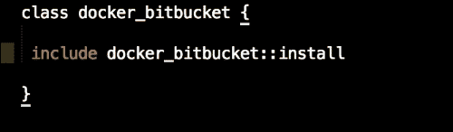

如前面的截图所示，我们只调用了`docker_bitbucket::install`类。现在我们可以继续处理较大的`install.pp`类。同样，我们将把它分为三部分，这样更容易解释该类的逻辑。我们来看第一部分，内容如下：

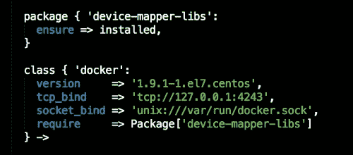

在该类的顶部部分，我们正在安装`device-mapper-libs`软件包。这是 RHEL 系列和 Docker 的先决条件。接下来我们声明的是 Docker 类。在这个资源中，我们定义了要安装的 Docker 版本、Docker 将使用的 TCP 绑定地址，以及最后 Docker 将绑定的 Unix 套接字。这与我们在上一章中定义 Docker 守护进程时使用的配置相同。在进入 Docker 调度器之前，这部分内容会保持相对静态。现在我们继续讨论 Postgres：

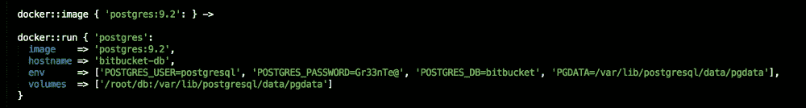

首先，我们将定义我们希望使用的 Postgres 镜像。对于本示例，我们使用的是 Postgres 9.2。因此，从 Docker Hub 中正确的标签是`postgres:9.2`。现在，让我们来看一下`docker::run`类；这是定义 Postgres 所有配置的地方。所以，你可以看到我们调用的是在前面的资源中设置的镜像`postgres:9.2`。接着，我们将主机名设置为`bitbucket-db`。这个设置非常重要，所以我们将其记住以备后用。

让我们看看`env`资源声明，因为那里有一些内容。在这一行中，我们声明了 Postgres 的用户、数据库密码、我们将与 Bitbucket 连接的数据库名称，以及最后 Postgres 存储数据库的路径。最后，我们声明了我们的卷为`/root/db:/var/lib/postgresql/data/pgdata`。

如前所述，冒号左边是映射到本地机器，右边是映射到容器。有两个主要的要点需要注意。首先，`/root/db`文件夹是任意的，在生产环境中不会使用。第二，你会注意到冒号左边的`/var/lib/postgresql/data/pgdata`文件夹和`env`中的值`PGDATA`是相同的。这并非巧合；这个文件夹保存了我们关心的唯一状态：实际的数据库。这是我们将保留的唯一状态，别无他物。你会注意到，我们没有暴露这个容器的任何端口。这样做是有意为之。我们将把我们的 Bitbucket 容器与 Postgres 容器链接起来。链接是什么意思？这意味着默认情况下，Postgres 镜像会暴露端口 5432。我们将使用这个端口来连接我们的数据库。通过链接容器，只有 Bitbucket 容器可以访问 5432 端口；如果我们暴露了端口（`5432:5432`），那么任何能够访问主机实例的应用都可以访问该端口。因此，链接要更安全。我们需要记住从这一部分代码中提取几个内容以备后用：主机名和整个`env`行。现在，我们继续看 Bitbucket 容器：

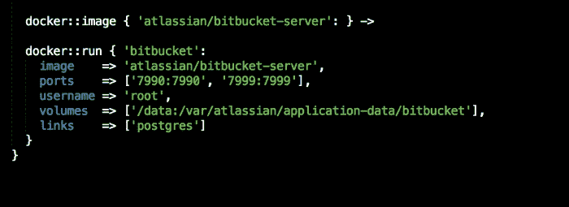

如你在前面的截图中看到的，镜像资源是相同的，但是我们不是调用 Postgres，而是调用`atlassian/bitbucket-server`。接下来我们将声明的资源是端口资源。你会注意到我们声明了两个端口`7990:7990`，这是我们访问 Web UI 的端口，和`7999:7999`，这是 Bitbucket 用于 SSH 的端口。我们将用户名设置为`root`。这是 Atlassian 文档中推荐的做法（[`hub.docker.com/r/atlassian/bitbucket-server/`](https://hub.docker.com/r/atlassian/bitbucket-server/)）。

接下来，我们将映射我们的卷驱动器。在这种情况下，我们只会映射 Bitbucket 的数据目录。这里存储着所有我们的 Git 仓库、用户信息等。再次强调，`/data`是一个任意位置；你可以选择任何你喜欢的位置。需要注意的重要位置是在冒号左侧的`/var/atlassian/application-data/bitbucket`。

最后，我们将链接我们的两个容器。链接容器的另一个好处是，Docker 守护进程会将它们的主机名和 IP 地址写入两个容器的`/etc/hosts`文件中。因此，容器之间可以毫无问题地互相通信。无需担心 IP 地址，因为它是任意的，并由 Docker 守护进程处理。现在，我们已经写好了模块，可以开始构建应用程序了。

## 运行我们的模块

我们需要做的第一件事是转发正确的端口到我们的`servers.yml`文件中，这样我们才能访问转发给 Bitbucket 的端口。为此，我们需要修改文件，使其看起来像下面的截图所示：

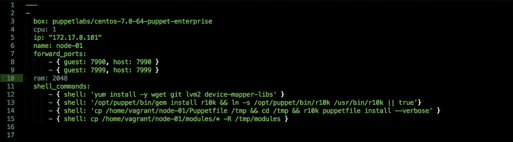

所以，打开我们的终端并将目录切换到 Vagrant 仓库的根目录，然后运行`vagrant up`。你应该会看到如下输出：

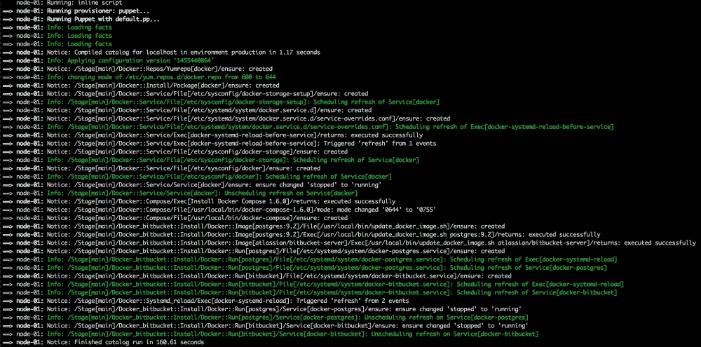

现在我们的应用程序已经构建完成，我们可以访问`http://127.0.0.1:7990`。我们应该看到以下页面：

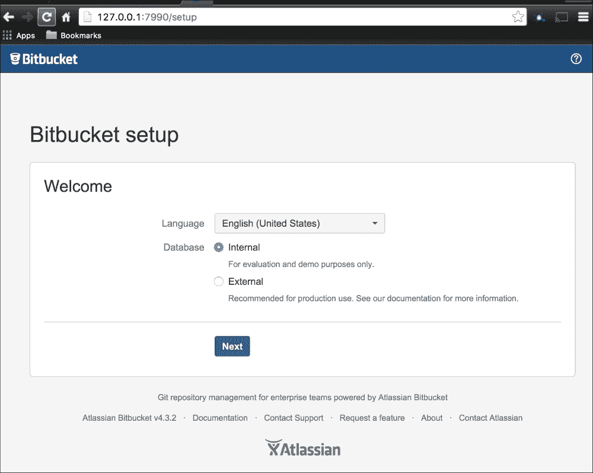

在本节之前，我们已经记住了关于我们的 Postgres 安装的一些细节。现在是时候使用它们了，接下来我们开始吧。我们需要做的第一件事是使用外部数据库。接下来我们需要选择的配置项是数据库类型。当然，我们将选择 Postgres。

主机名将设置为`bitbucket-db`容器的主机名，端口是`5432`，数据库名称是我们在代码中设置的`bitbucket`。我们将使用 PostgreSQL 作为用户名，密码将是`Gr33nTe@`。请参见以下截图以了解更多：

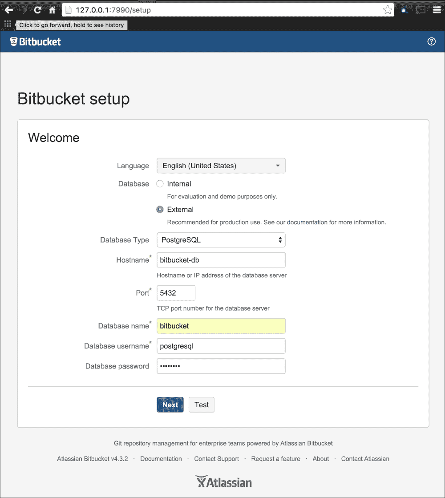

接下来，点击**测试**按钮，我们应该会看到**成功建立数据库连接**的消息，如下图所示：

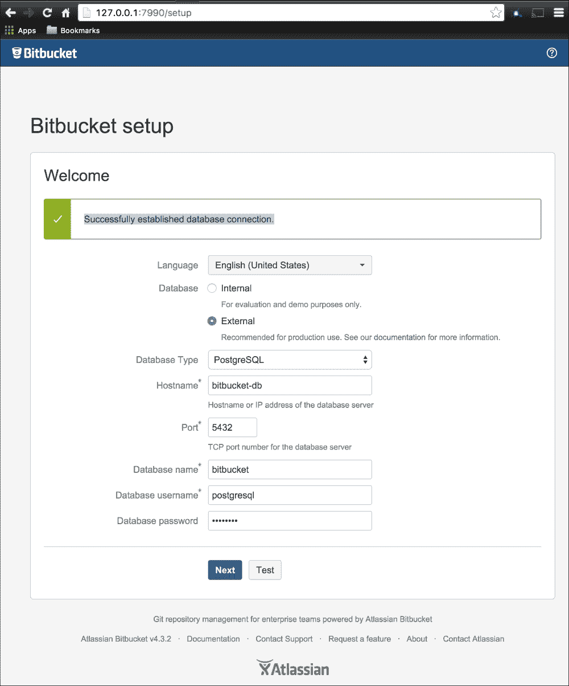

我会让你完成其余的设置。但我们刚刚设置的并不简单，现在我们已经有了一个非常坚实的基础，可以继续进行更复杂的应用程序开发。

# Docker_bitbucket（Docker Compose）

本节中，我们将构建相同的 Bitbucket 应用程序。不同之处在于，这次我们将使用`docker-compose`作为`.erb`文件，而不是在清单中的资源声明。

## 让我们编码——第二次

在上一个主题中，我们讲解了很多幕后发生的事情。本主题将不再重复之前的内容，因此本章内容将专注于代码。我们会保持`init.pp`和`params.pp`与上一个主题中的一致。所以，让我们直接跳到`install.pp`。它看起来将与上一章的`install.pp`非常相似：

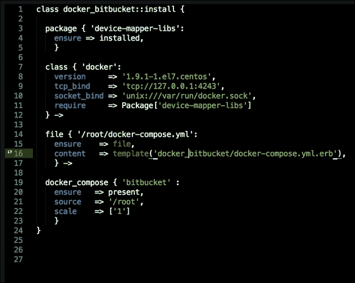

所有的“魔法”都发生在我们的模板文件中。所以，让我们跳到位于我们模块根目录`templates`文件夹中的`.erb`文件：

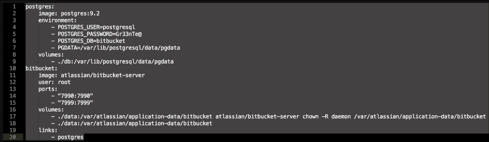

如您在前面的截图中看到的我们`.erb`文件，所有配置都很熟悉。与我们在上一个主题中讲解的内容完全相同，没有任何变化。

## 运行我们的模块 – 第 2 次

让我们打开终端，将目录切换到 Vagrant 仓库的根目录，并运行`vagrant up`。您应该会看到以下输出：

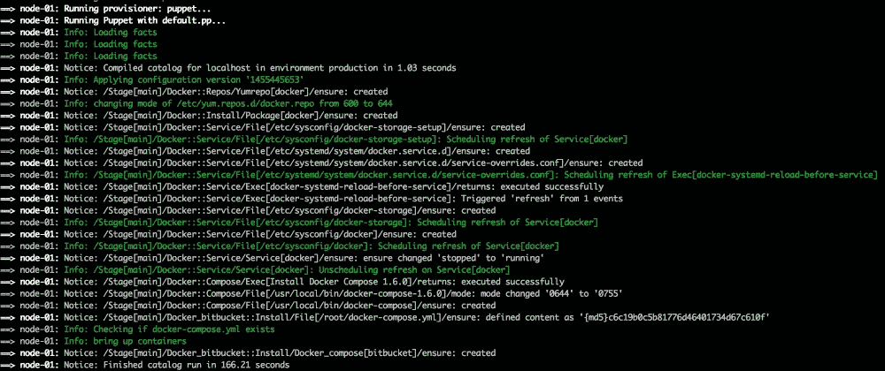

现在，让我们访问`http://127.0.0.1:7990`，应该会看到以下页面：

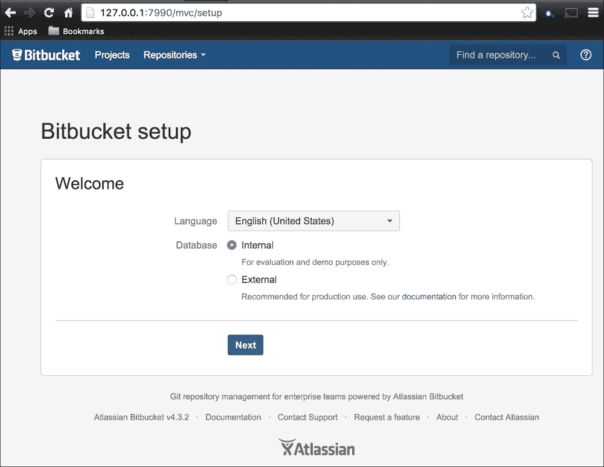

只需按照前面主题中的相同设置来配置 Bitbucket。您可以使用试用许可证来尝试该应用程序，或者正如我之前提到的，可以在[`bitbucket.org/product/pricing?tab=server-pricing`](https://bitbucket.org/product/pricing?tab=server-pricing)找到一个开发/启动许可证，$10 的许可证费用将捐赠给慈善机构。

# 总结

通过构建一个多容器应用程序，我们学到了很多内容。我们首先了解了有状态和无状态容器，拥有状态的优缺点，以及我们需要做出哪些设计选择来保持状态。接着，我们看了链接容器以及它们如何通过各自的主机文件进行相互通信。本章的所有内容都为我们提供了必要的知识，以便进一步探索服务发现和容器调度等主题。
