# 第五章：配置服务发现与 Docker 网络

在本章中，我们将讨论在使用容器时的两个非常重要的话题。首先，我们将探讨什么是服务发现，为什么我们需要它，以及不同类型的服务发现。第二个话题是 Docker 网络。运行容器网络有很多种方式。这里有一些很棒的技术，比如 CoreOS 项目的 flannel（[`coreos.com/flannel/docs/latest/`](https://coreos.com/flannel/docs/latest/)）。还有 Weave Works 的 Weave（[`weave.works/`](http://weave.works/)），但是我们将使用 Docker 引擎 1.9.1 版本中发布的原生 Docker 网络栈。

# 服务发现

这是容器世界中一个相当重要的话题，特别是当我们开始进入多节点应用程序和 Docker 调度器时。问题是，什么是服务发现？它仅限于容器吗？在我们的 Puppet 模块中，哪些服务发现类型可以帮助我们做出明智的设计选择？

## 理论

当我们开始处理多节点应用程序时，服务发现至关重要，因为它使得我们的应用程序可以在节点之间移动时相互通信。因此，正如你所看到的，在容器的世界里，这个问题非常重要。当选择一个服务发现后端时，我们有几个选择。这个领域中的两个大名鼎鼎的名字是**etcd**（[`coreos.com/etcd/`](https://coreos.com/etcd/)），它同样来自 CoreOS，以及来自 HashiCorp 的**Consul**（[`www.consul.io/`](https://www.consul.io/)）。

你可能还记得我们已经编写了一个 `consul` 模块。因此，在本章中，我们将选择相同的模块，因为我们已经有了现成的代码。首先，让我们来看一下 Consul 的架构，以便我们理解后端是如何工作的，它如何处理故障，以及通过配置 Consul，我们可以获得哪些选项。

那么，让我们来谈谈 Consul 是如何工作的。在 Consul 中，我们可以为服务器提供两种类型的配置。第一种是服务器角色，第二种是代理角色。虽然这两者有交互作用，但它们服务于不同的目的。让我们先深入了解服务器角色。服务器的角色是参与 RAFT 法定人数；这就是维护集群状态的任务。在 Consul 中，我们有数据中心的概念。你可能会问，什么是数据中心？它是由一组逻辑服务器和代理组成的。例如，如果你在 AWS 上，数据中心可以是一个可用区（AZ）或甚至一个虚拟私有云（VPC）。Consul 允许数据中心之间进行连接；服务器的角色是负责数据中心之间的通信。Consul 使用传播协议（gossip protocol）来实现这一点。服务器还持有键/值存储，并使用 Serf 协议在服务器之间复制它。让我们来看一下我们讨论过的图示：

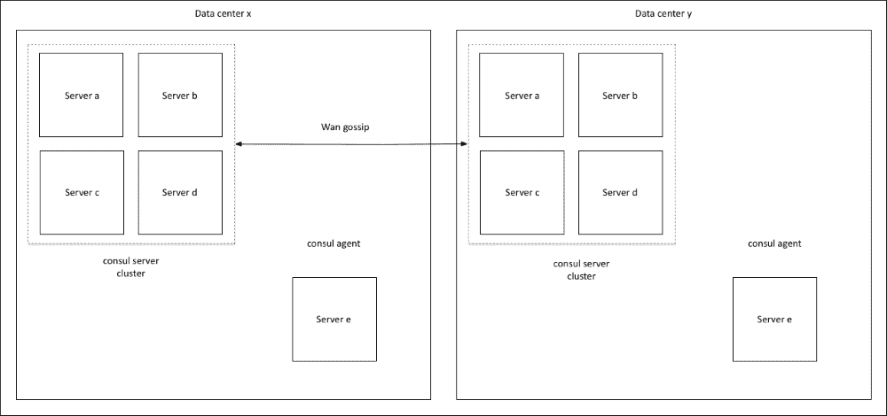

代理的角色是向服务器报告机器的状态以及可能分配给它的健康检查。同样，Consul 将使用 serf 协议来传递通信。

现在我们已经理解了 Consul 在后台所做的工作，让我们来看一下它有哪些功能，可以在我们的 Puppet 模块中利用。我们将首先利用的功能是 DNS 服务发现。在容器环境中，这是非常重要的。随着我们的容器在节点间迁移，我们需要知道如何连接到它们。DNS 服务发现非常巧妙地解决了这个问题。那么，让我们来看一个示例来理解这一点。

在这个示例中，我们有一个 **mario** 服务，并且有一个包含三个节点的 **Docker swarm 集群**。当我们访问 Docker API 并由 swarm 调度容器时，我们并不知道 **mario** 会在哪个节点上启动。但是，我们有其他服务需要在 **mario** 启动后尽快找到它。如果我们告诉其他服务，**mario** 实际上位于 **mario.service.consul**，那么无论容器在哪个节点上启动，它都会将 **mario.service.consul** 解析到正确的地址。请参见以下图示，了解更多细节：

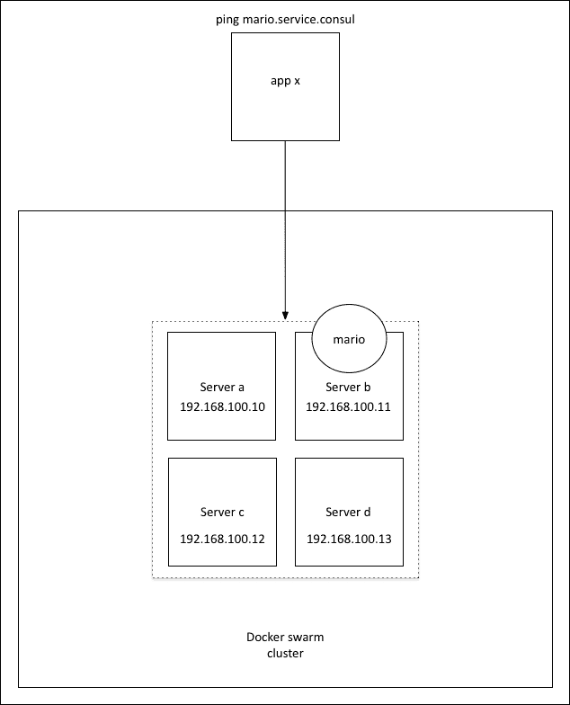

在这种情况下，如果我们 ping **mario.service.consul**，我们会得到 **192.168.100.11**。根据我们在 swarm 中的调度配置，如果 **Server b** 失败，**mario.service.consul** 可能会转移到 **Server d**。因此，**mario.service.consul** 的响应现在将来自 **192.168.100.13**。这一切无需人工干预，对应用程序来说是无缝的。这就是我们在本章中看到的有关服务发现的所有理论；后续章节中我们会涵盖更多内容。现在，让我们开始编写一些代码。

## 服务发现模块

在本模块中，我们将编写一个使用 consul 作为 DNS 服务发现后端的模块。由于我们已经有了一个 consul 模块，因此我们不会从头开始，而是向现有模块中添加新功能。我们将再次使用清单和 Docker Compose 来编写模块。那么，让我们从清单开始。

我们的文件夹结构应该如下所示：

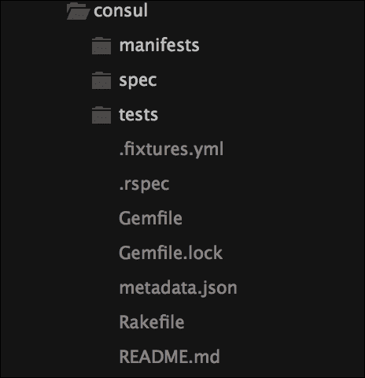

让我们直接跳到 `install.pp`。在不做任何更改的情况下，它应该看起来像下面的截图：

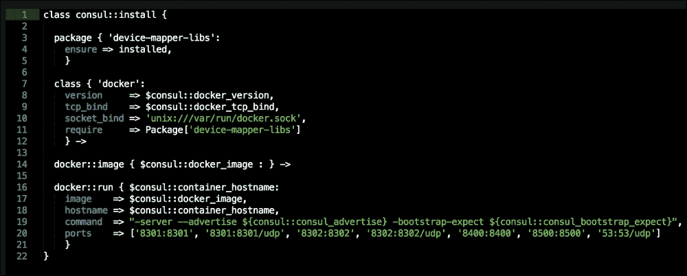

现在，我们要添加一个额外的容器，它将作为我们 DNS 服务发现解决方案的一部分。我们需要一个东西来在容器启动时将其注册到 Consul。为此，我们将使用一个名为 **registrator** 的 Golang 应用程序（[`github.com/gliderlabs/registrator`](https://github.com/gliderlabs/registrator)）。这是一个非常棒的应用，我已经使用它超过一年，效果非常稳定。所以，让我们修改 `params.pp` 文件，允许新容器的加入。目前，`params.pp` 文件的内容如下所示：

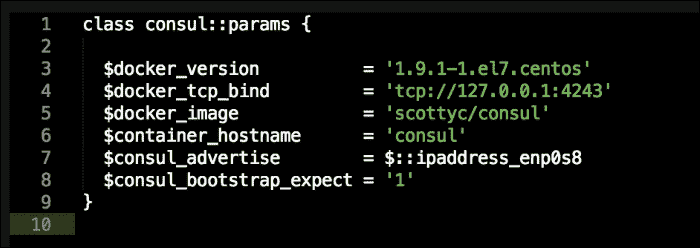

我们要做的第一件事是修改 `docker_image` 和 `container_hostname` 参数。由于我们已经使用了 `consul_xxx` 的命名惯例，所以可以继续使用：

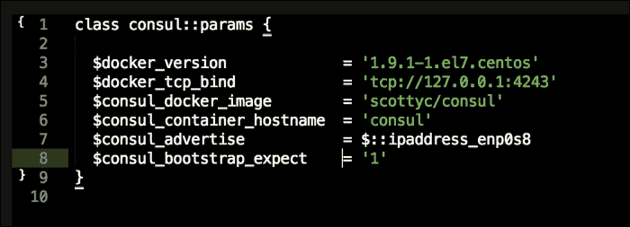

现在，我们来添加 registrator 的参数：

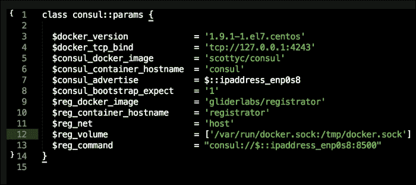

如你所见，我们已经为镜像添加了 `$reg_docker_image = 'gliderlabs/registrator'` 参数，并为主机名添加了 `$reg_container_hostname = 'registrator'` 参数。我们告诉容器监听主机的 `$reg_net = 'host'` 网络。接下来的参数需要一些解释。registrator 将 Docker 守护进程绑定的 Unix 套接字映射到它自己的 Unix 套接字。这是为了监听任何新启动的服务，并将其注册到 Consul 以便进行发现。如你所见，我们使用 `$reg_volume = ['/var/run/docker.sock:/tmp/docker.sock']` 来实现这一点。最后一个参数告诉 registrator 如何找到 `consul`。我们将通过 `$reg_command = "consul://$::ipaddress_enp0s8:8500"` 来设置这个参数。现在，让我们转到 `init.pp` 文件。

我们的 `init.pp` 文件应该如下所示：

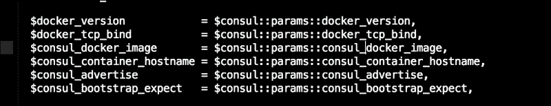

让我们添加新的参数，如下图所示：

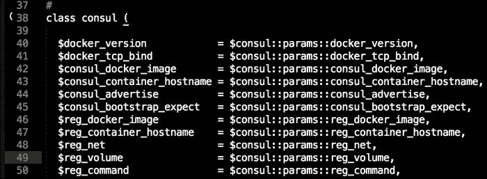

现在我们已经设置好了所有参数，可以进入 `install.pp` 文件，添加代码来安装 registrator：

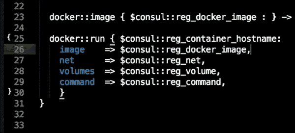

如前面截图所示，我们在文件底部添加了一段新的代码块。这与我们配置 Consul 的代码类似；不过，有一些不同的参数。我们之前已经讲解过这些内容，所以不再重复。既然我们对模块做了一些修改，我们应该在 Vagrant 中运行它，检查是否存在任何问题。在我们运行 Vagrant 之前，我们需要更改 Vagrant 仓库根目录下的 `servers.yaml` 文件，以便让我们可以访问 Consul 的 `8500` 端口。我们可以通过以下代码更改来实现这一点：

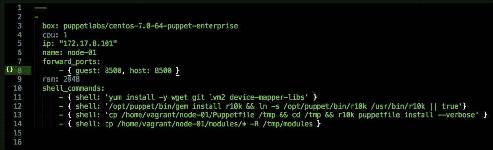

现在，让我们打开终端并将目录切换到 Vagrant 仓库的根目录。从那里，我们只需要执行 `vagrant up` 命令。终端的输出应如下面的截图所示：

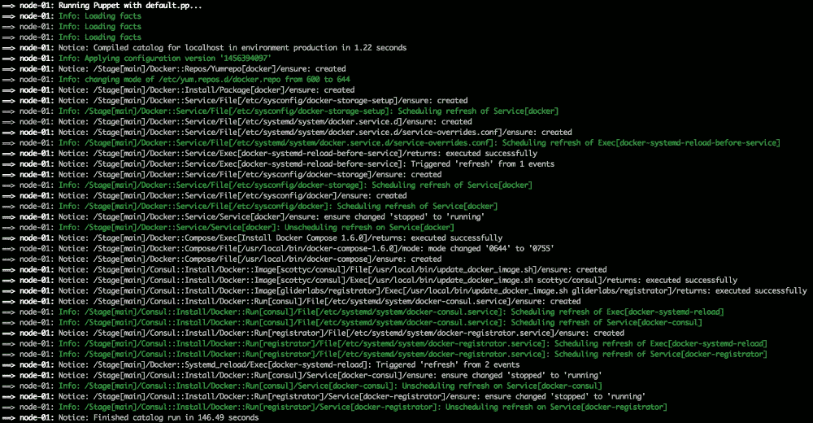

之后，让我们打开浏览器，访问 `127.0.0.1:8500`：

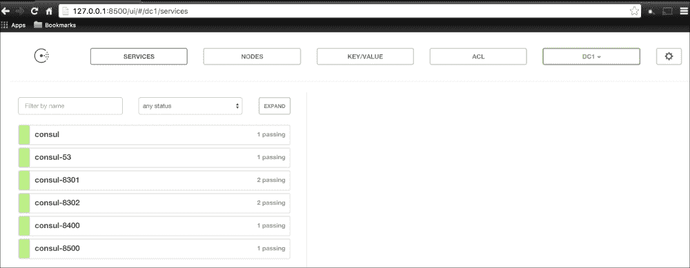

你会注意到，现在在 Consul 网页界面中列出了更多的服务，而不是我们在上一章运行模块时看到的那些。这是因为现在，registrator 正在监听 Unix 套接字，并且任何与主机端口映射的容器都会被注册。所以，好消息是我们的模块正在工作。接下来，让我们往模块中添加一个应用程序。

最简单的方法是向我们的节点添加另一个容器模块。接下来，让我们添加我们的 `bitbucket` 模块。我们通过向 `manifests` 目录中的 `default.pp` 文件添加类来实现：

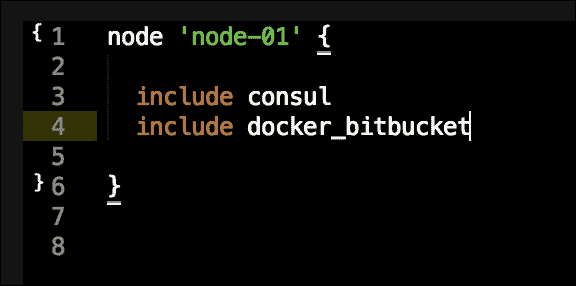

我们还需要对 `bitbucket` 模块进行一些快速修改，以避免重复声明错误。请注意，这不是你在生产环境中会做的事。但对我们测试实验室来说，这已经足够了。我们需要注释掉如下面截图所示的顶部代码块：

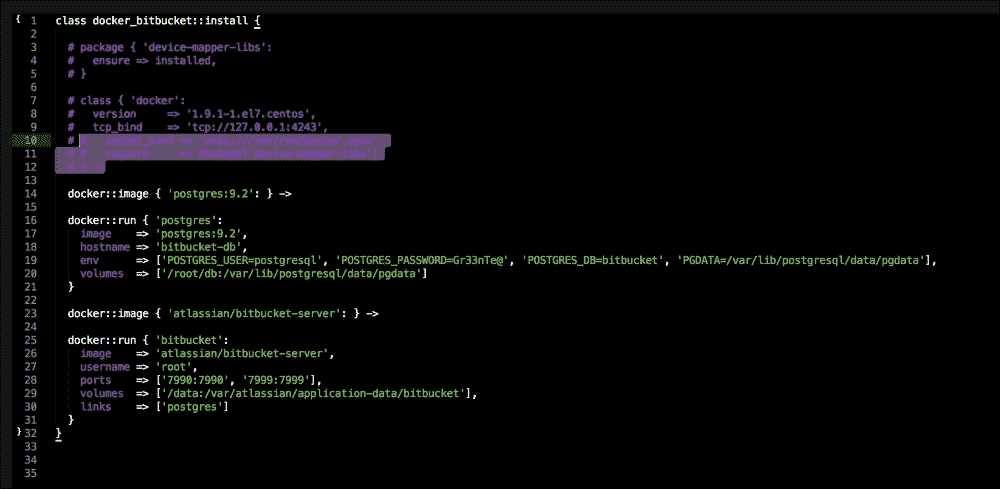

我们甚至可以注释掉如下面截图所示的代码：

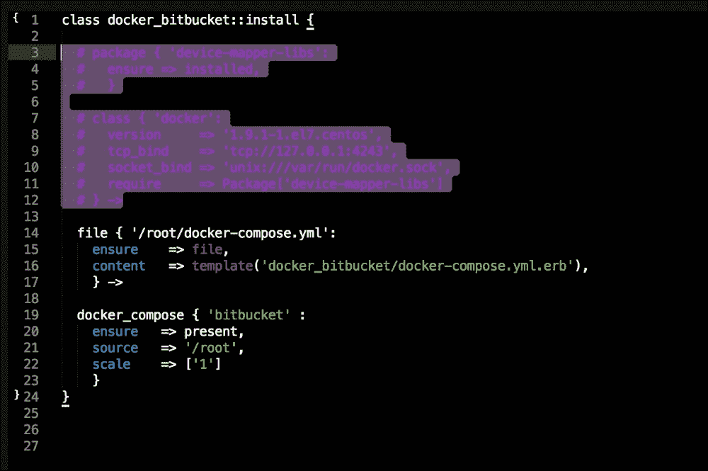

这取决于你是否使用了 `manifest` 模块或 `compose` 模块。我使用的是 `compose` 模块。

接下来，让我们回到终端并在 Vagrant 仓库的根目录下执行 `vagrant provision` 命令。终端的输出应如下面的截图所示：

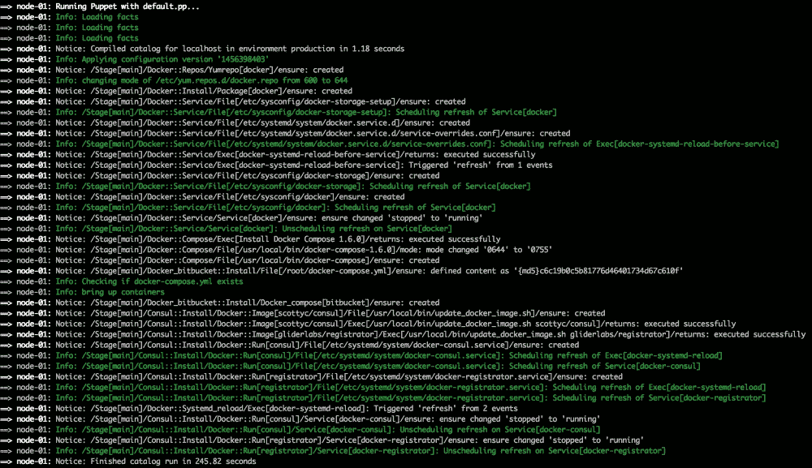

现在，让我们再看看浏览器。我们可以看到我们的 `bitbucket` 服务已经注册，如下图所示：

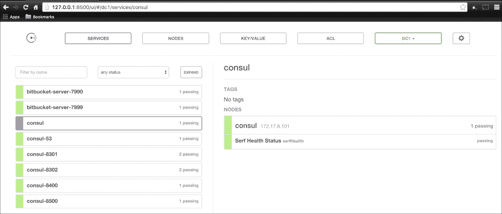

我们已经使服务发现功能正常工作；但是，我们仍然需要在我们的模块中添加另一个类，用于 DNS 服务发现。接下来，让我们回到我们的 `consul` 模块。我们将添加一个名为 `package.pp` 的新文件。在这个文件中，我们将安装 bind 包并添加两个模板，一个用于配置 `named.conf`，另一个用于配置 `/etc/` 目录下的 `consul.conf`。让我们开始编码。首先，我们需要做的是在模块的 `manifests` 目录中创建我们的 `package.pp` 文件：

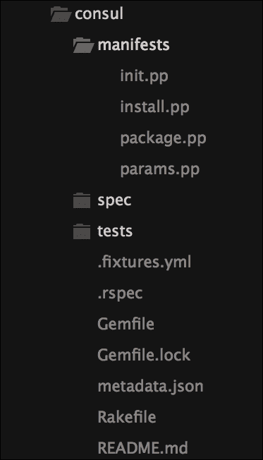

我们将向文件中添加以下代码：

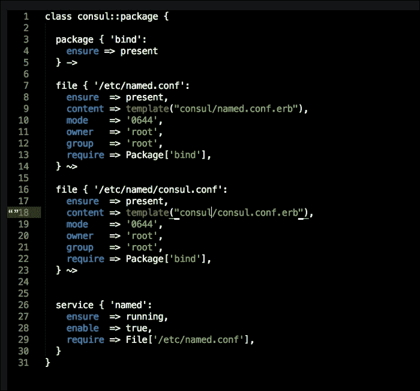

现在，让我们创建一个 `templates` 文件夹。在这个示例中，我们没有对文件进行参数化，而在生产环境中你会这么做。这就是我们使用 `templates` 文件夹而不是文件的原因：

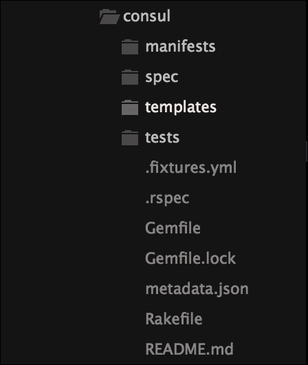

现在，让我们创建一个名为`named.conf.erb`的文件，并添加以下代码：

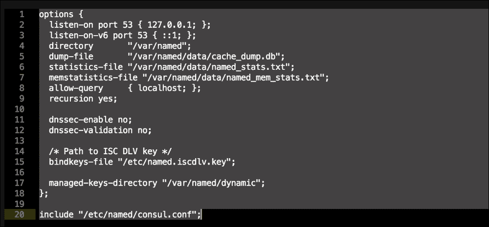

这段代码仅仅是将我们的 DNS 解析器设置为监听`127.0.0.1`。记住，我们已经在 Consul 容器上设置了端口转发，将端口`53`转发。这就是主机如何连接到容器的方式。最后，它会调用我们下一个模板文件`/etc/named/consul.conf`。让我们现在创建它：

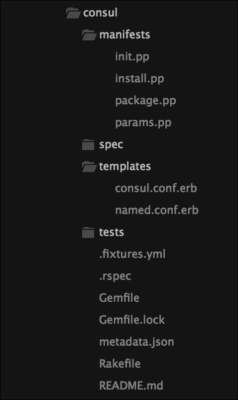

我们将添加的代码如下：

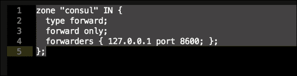

你会注意到我们正在转发端口`8600`，这是 Consul 用于 DNS 流量的端口，并且移除了端口`53`。由于 TCP 绑定将使用端口`53`，我们将请求转发到`8600`，如下面的代码所示：

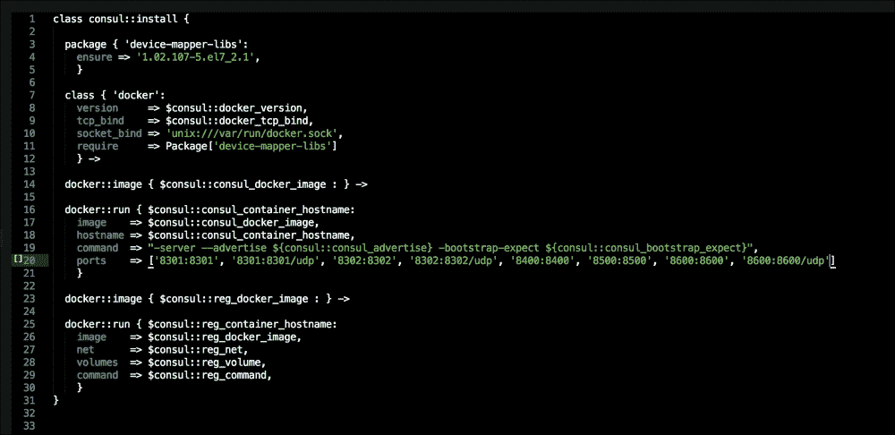

在运行 Puppet 之前，我们需要再做一次更改。我们需要将`package.pp`的新代码添加到`init.pp`文件中。我们可以这样做：

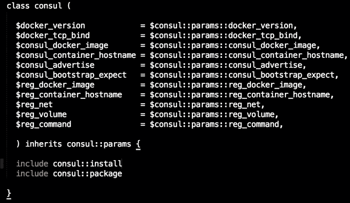

现在，我们可以运行我们的模块了。让我们打开终端并切换到我们的 Vagrant 仓库的根目录。我们将输入`vagrant up`命令，如果你已经有一个盒子在运行，只需输入`vagrant destroy -f && vagrant up`命令。现在，让我们检查 Web UI（`127.0.0.1:8500`）：

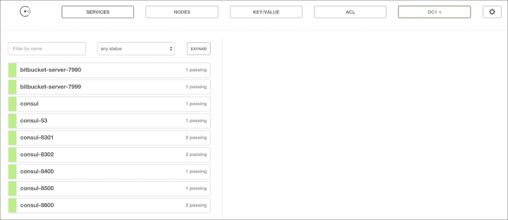

正如你在上面的截图中看到的，我们在端口`8600`上注册了一个新服务（`consul-8600`）。现在，我们需要确保我们的机器在它们的接口上监听正确的 DNS 服务器。我们将通过`servers.yaml`来完成这一操作，正如我通常会将此配置添加到 AWS 的用户数据中。你也可以使用 Puppet 来控制此配置。因此，未来你可以根据自己的环境决定配置的位置。我们要添加的行是`- { shell: 'echo -e "PEERDNS=no\nDNS1=127.0.0.1\nDNS2=8.8.8.8">>/etc/sysconfig/network-scripts/ifcfg-enp0s3 && systemctl restart network'}`。我们将按照以下截图所示的方式添加：

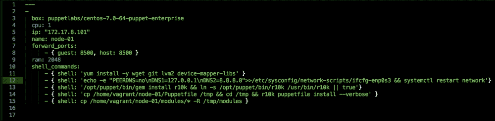

现在，让我们打开终端并输入`vagrant up`命令。如果你已经有一个盒子在运行，则输入`vagrant destroy -f && vagrant up`命令。终端输出应该如下所示：

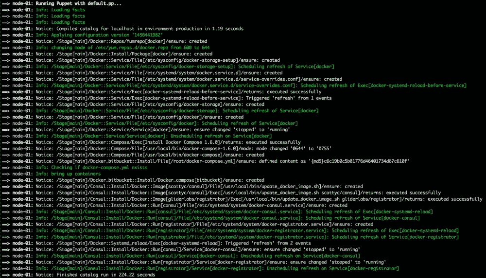

然后，我们可以使用`vagrant ssh`登录到我们的 vagrant 盒子，测试我们的 DNS 设置是否有效。我们可以通过选择一个服务并尝试 ping 它来进行测试。我们将选择`ping bitbucket-server-7990`服务，输入`ping bitbucket-server-7990.service.consul`命令，应该得到如下结果：

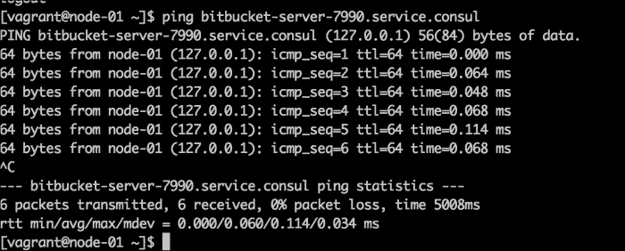

如上图所示，它返回的是回环的 echo 响应，因为该服务在本地主机上运行。如果我们在主机外部，它将返回运行服务的主机 IP 地址。现在，我们运行容器调度器，如 Docker Swarm，这些调度器有多个主机。我们现在了解了服务发现的工作原理。

现在，让我们看一下使用 Docker Compose 的情况。

为了避免重复，让我们将`init.pp`文件做成与使用`manifests`方法的模块一样。我们需要对`params.pp`文件进行一个小改动；`docker-compose`期望你传递字符串。所以，我们需要删除 `$reg_volume` 周围的括号，如下图所示：

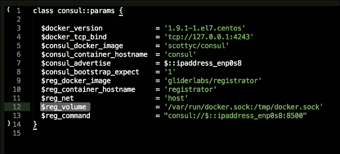

然后，我们将像之前一样添加`package.pp`文件，并为我们的`bind`配置创建两个模板。接下来，我们需要更新 `templates` 目录中的 `docker-compose.yml.erb` 文件。我们需要添加第二个容器`registrator`。我们将使用本章之前模块中的相同参数。此代码应如下图所示：

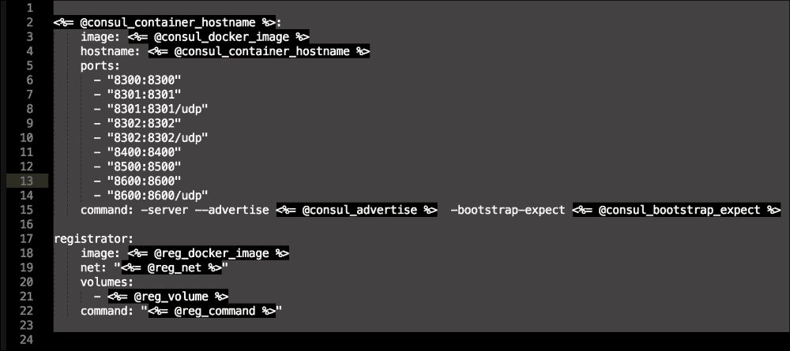

你还会注意到，我们更改了 Consul 容器的端口，就像本章前面所做的一样（我们删除了端口`53`并添加了`8600 tcp/udp`）。现在，我们可以进入终端，切换到 Vagrant 仓库的根目录，并执行`vagrant up`命令。我们的终端应显示如下图所示：

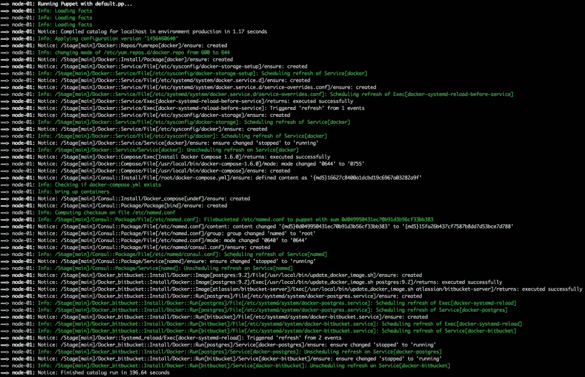

同样，我们也可以在浏览器中查看 `127.0.0.1:8500`：

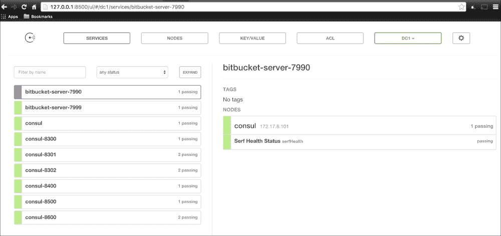

如上图所示，它看起来和本章前面部分一样。

让我们登录到我们的机器并测试我们的 DNS 服务发现。为此，输入`vagrant ssh`命令，然后 ping 一个服务。这一次，我们选择不同的服务。我们将使用`ping consul-8500.service.consul`命令。运行后，我们应该会得到以下响应：

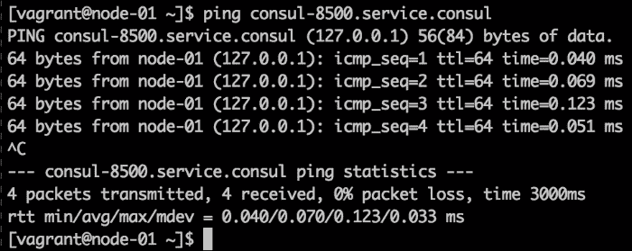

本章关于服务发现的内容就到这里。我们将在容器调度器章节中再次讨论它。

# Docker 网络

在本节中，我们将介绍 Docker 引擎自带的本地网络堆栈。通过阅读这一主题，你将能获得大量有价值的知识。我强烈建议你这么做，因为在 Docker 网络方面有很多值得探索的内容。如果你以前没有使用过 Docker 网络，建议你从[`docs.docker.com/engine/userguide/networking/dockernetworks/`](https://docs.docker.com/engine/userguide/networking/dockernetworks/)开始阅读。在这里，你可以了解不同类型的驱动程序，如何使用 VXLAN 来隔离网络，以及设计 Docker 网络时的最佳实践。我们现在将介绍基础内容，更多高级功能将在后续章节中讨论。

## 前提条件

在我们开始为网络编写代码之前，有几件事情是必须的。首先，我们需要一个键值存储。Docker 将使用这个存储来映射所有创建的容器、IP 地址和 vxlans。由于通常会有多个主机连接到一个网络，键值存储通常是分布式的，以增强其容错能力。幸运的是，我们已经建立了一个可以利用的键值存储，它当然就是 Consul。你还需要的另一个配置是在启动 Docker 引擎时传递的额外参数。这是为了让 Docker 引擎知道如何访问键值存储。这些是我们开始编码所需要的基本前提条件。

## 代码

让我们创建第一个 Docker 网络。为此，我们将添加到我们的`consul`模块。我不会为`manifests`和`docker-compose`两者重复操作，因为配置可以在两者之间移植。我将使用`docker-compose`模块作为示例。如果这是你第一次创建 Docker 网络，尝试将配置移植到两者之间将是一次有价值的练习。那么，让我们开始吧。我们只会对我们的`install.pp`文件进行更改。我们要做的第一项更改是为`docker-engine`守护进程添加额外的参数。我们通过添加以下截图所示的代码来实现：

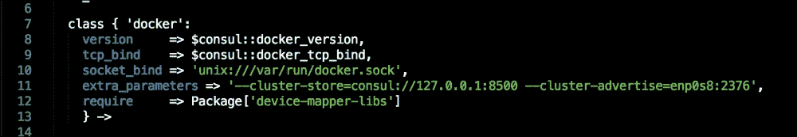

这段代码设置了我们的键值存储的地址和端口。然后，它还告诉其他机器我们在什么接口和端口上发布我们的网络。

我们接下来要添加的代码将创建网络。我们将创建一个名为`network.pp`的新文件。然后，我们将向其中添加以下截图所示的代码：

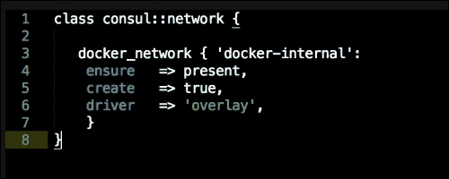

接下来，我们需要确保我们的类按照正确的顺序安装，因为 Docker 网络依赖于 Consul 的存在。如果没有 Consul，我们的目录将无法正常工作。因此，我们需要使用 Puppet 内置的`contain`功能。我们通过添加以下截图所示的代码来实现：

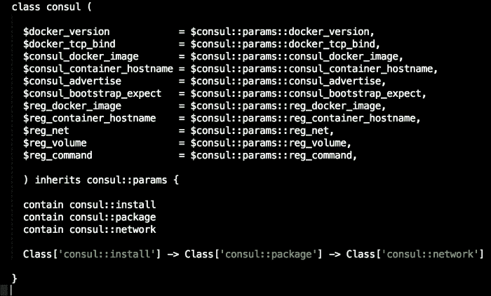

正如你看到的，我们只是在设置一个基本的网络。我们可以设置 IP 地址范围、网关等。如果我们这么做，结果将是这样的：

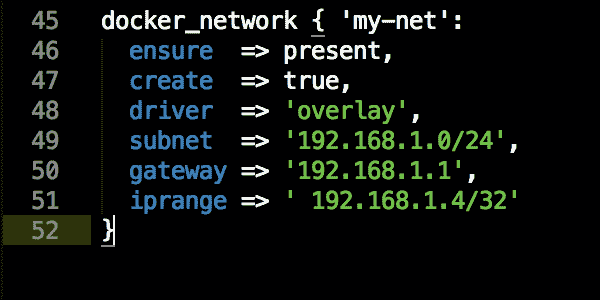

现在我们有了代码，让我们回到终端，在 Vagrant 仓库根目录下执行 `vagrant up` 命令。我们的终端输出应该像下面的截图一样：

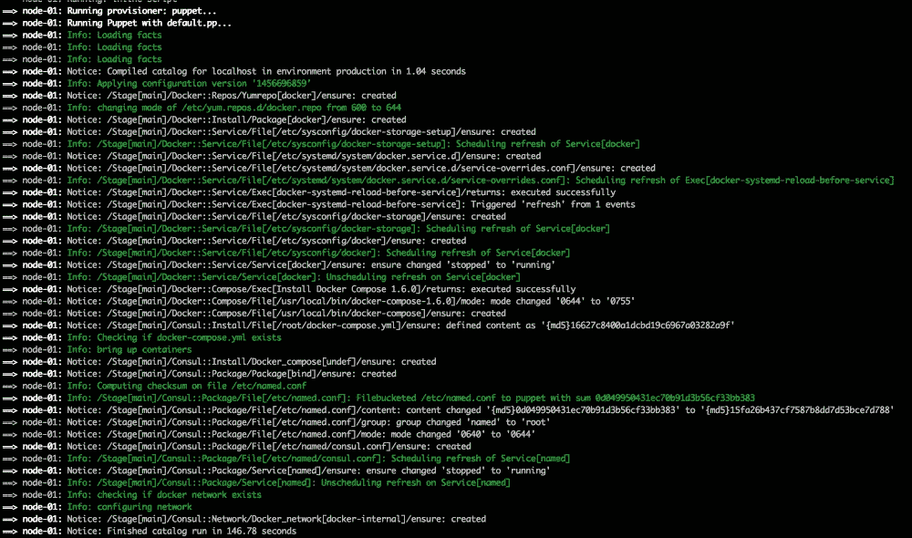

现在，我们可以通过登录到我们的 Vagrant 虚拟机（在 Vagrant 仓库根目录下执行 `vagrant ssh`）来检查我们的网络是否存在。一旦登录到虚拟机，我们需要切换到 root 用户（执行 `sudo -i`），然后发出 `docker network ls` 命令。这将列出虚拟机上可用的网络。我们要找的是使用 `overlay` 驱动的 `docker-internal` 网络：

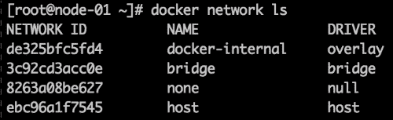

正如你从终端输出中看到的那样，我们成功了，网络已经配置好。这就是本章中关于网络配置的所有内容。在下一章中，我们将连接容器，并将我们的 Docker 网络扩展到多个主机。

# 概述

在这一章中，你学习了容器生态系统如何处理服务发现。我要强调的是，当你开始大规模使用容器时，理解这个话题将变得极为重要。在继续后续章节之前，我强烈建议你对服务发现有一个扎实的理解。我们还讨论了 Docker 网络的基础知识。别担心，在下一章中，我们将深入探讨 Docker 网络，因为我们将构建多主机应用。
