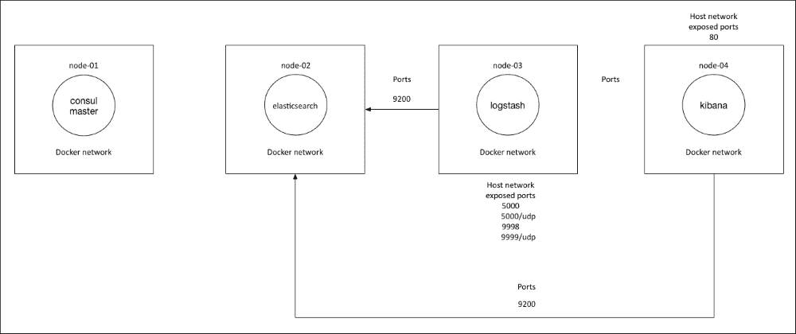

# 第六章：多节点应用

在这一章，我们将开始使用一些非常酷的东西。我们将利用到目前为止在书中学到的所有技能，并在此基础上进一步提升。在这一章，我们将部署四台服务器。我们将研究如何将 Consul 集群化，这将为我们提供一个完美的机会来进一步扩展我们的模块功能。在这一章中，我们将研究两种容器网络配置方式。首先是使用标准的主机 IP 网络，让我们的 Consul 集群在该网络上进行通信。我们还将安装 **ELK**（**Elasticsearch**、**Logstash** 和 **Kibana**）堆栈 ([`www.elastic.co/`](https://www.elastic.co/))。为此，我们将为每个产品编写一个模块。因为 Elasticsearch 是我们解决方案中的数据存储，我们希望将其隐藏，只允许 Logstash 和 Kibana 访问该应用程序。我们将通过使用本地 Docker 网络堆栈，并通过 VXLAN 隔离 Elasticsearch 来实现这一点。正如你所看到的，我们将在这一章中完成很多内容。我们将在这一章中涵盖以下主题：

+   我们解决方案的设计

+   将一切整合起来

# 我们解决方案的设计

由于解决方案中涉及很多动态部分，最好可视化我们将要编写的代码。由于这是从上一章迈出的重要一步，我们将分解解决方案。在第一个主题中，我们将查看 Consul 集群的设计。

## Consul 集群

在本设计中，我们将使用四台服务器：**node-01**、**node-02**、**node-03** 和 **node-04**。我们将使用 **node-01** 来启动我们的 Consul 集群。然后将其他三台节点作为服务器添加到集群中。它们将能够加入集群、进行投票，并复制键值存储。我们将设置一个位于 `172.17.8.0/24` 网络的 IP 网络，并将我们的容器端口映射到位于 `172.17.8.0/24` 网络上的主机端口。下图将展示网络流向：


## ELK 堆栈

现在我们已经有了 Consul 集群，我们可以看看我们的 ELK 栈将是什么样子的。首先，我们将详细了解网络的设计。该栈将连接到本地 Docker 网络。请注意，我没有列出我们的 Docker 网络的 IP 地址。这样做的原因是我们将让 Docker 守护进程选择网络地址范围。对于这个解决方案，我们不打算将任何流量路由到这个网络之外，所以让守护进程选择 IP 范围是可以的。你还会注意到 Elasticsearch 只连接到我们的 Docker 网络。这是因为我们只希望 Logstash 和 Kibana 连接。这样做是为了防止其他应用程序能够向 Elasticsearch 发送请求或查询。你会注意到，Logstash 和 Kibana 都连接到了 Docker 网络和主机网络。这样做的原因是我们希望应用程序将日志发送到 Logstash，并且我们希望能够访问 Kibana 的 Web 应用程序。



要全面了解架构，我们只需要将两个图表叠加在一起。所以，让我们开始编写代码吧！

# 将所有内容整合起来

现在我们已经看过了设计，接下来我们将把所有内容整合起来。我们将查看 Vagrant 仓库的管道更改。然后，我们会将额外的功能编码到`consul`模块中。接着，我们将运行 Vagrant 仓库，以确保 Consul 集群正常运行。在完成这项任务后，我们将构建 ELK 栈，并为每个产品构建一个模块。我们还将设置 Logstash 将日志转发到`node-03`，以便我们可以测试确保我们的 ELK 栈是正确的。让我们来深入了解一下这个。

## 服务器设置

接下来，我们将查看我们要对新的 Vagrant 仓库所做的更改。我们要查看的第一个文件是`servers.yaml`文件。我们需要做的第一件事是更改我们的基础盒子。由于我们将容器连接到本地 Docker 网络，我们的主机必须运行版本高于 3.19 的内核。我已经创建了一个预构建的 vagrant 盒子，正是这一配置。它是我们在所有其他章节中使用的 Puppetlabs 盒子，内核已更新至 4.4 版本：


正如你在前面的截图中看到的，我们对`servers.yaml`文件所做的另一个更改是我们已向`/etc/hosts`目录添加了条目。我们这样做是为了模拟传统的 DNS 基础设施。如果这是在你的生产环境中，我们就不需要添加这个配置。

现在，我们需要添加另外三个服务器。以下截图将准确显示它应该是什么样子：


所以，一旦所有服务器构建完成，我们将访问的端口是`8500`（在`node-01`上，即 Consul 的 Web UI `127.0.0.1:8500`）和`8081`（Kibana 的 Web UI `127.0.0.1:8081`）。

## Consul 集群

我们现在已经非常熟悉`consul`模块，但我们将把它提升到一个新的水平。在这一章中，我们将只使用 compose 版本。原因是当你开始处理更复杂的应用程序或需要使用`if`语句来添加逻辑时，`.erb`文件为我们提供了这样的自由。这一模块有相当多的更改。那么，让我们从`params.pp`文件重新开始：


如您所见，我们添加了两个新参数。第一个是`$consul_master_ip`，另一个是`$consul_is_master`。我们将使用它来定义哪个服务器将引导我们的 Consul 集群，哪个服务器将加入集群。我们已将**node-01**的主机名硬编码。如果这是一个生产模块，我不会硬编码主机名，它应该是一个参数，可以在 Hiera 中查找（[`docs.puppetlabs.com/hiera/3.0/`](https://docs.puppetlabs.com/hiera/3.0/)）。当我们查看`docker-compose.yml.erb`文件时，我们会再次提到这一点。其他参数应该对您来说很熟悉。

接下来，让我们看一下我们的`init.pp`文件：


正如您在这里看到的，我们没有对这个文件做太多更改，因为我们仅添加了一个布尔值（`$consul_is_master`）。然而，我们仍然需要验证输入。我们通过调用标准库函数`validate_bool`来完成这项工作。

让我们快速浏览一下`install.pp`文件：


现在，让我们来看一下`network.pp`文件：


最后，我们将查看`package.pp`文件：


如您所见，我们并没有对这些文件进行更改。现在，我们可以查看将真正部署容器逻辑的文件。接下来，我们将转到`templates`文件夹，查看我们的`docker-compose.yml.erb`文件。这是模块中大多数更改的地方。

那么，让我们来看一下文件的内容，如下图所示：


正如您所见，这个文件中的代码已被复制。我们将其分为三部分，如下图所示：


在第一块代码中，您会注意到的第一个变化是`if`语句。这是一个用于确定节点是否为 Consul 引导主节点或集群中的服务器的选择。如果您还记得我们的`params.pp`文件，我们将`node-01`设置为我们的主节点。当我们将这个类应用到节点时，如果是`node-01`，它将引导集群。我们接下来要关注的行如下：

```
command: -server --client 0.0.0.0 --advertise <%= @consul_advertise %>  -bootstrap-expect <%= @consul_bootstrap_expect %>

```

我们应该注意对比下一块代码中的相同一行：


首先，我们可以看到这是`elsif`，是`if`语句的后半部分。因此，这将是安装 Consul 到其他三个节点的代码块。它们仍然是集群中的服务器，只是没有启动集群的任务。我们可以通过以下一行代码来判断这一点：

```
command: -server -bind 0.0.0.0 --client 0.0.0.0  --advertise <%= @consul_advertise %> -join <%= @consul_master_ip %>

```

记得我们之前看过代码的第一行吗？你看到了区别吗？在第一块代码中，我们声明了`-bootstrap-expect <%= @consul_bootstrap_expect %>`，而在第二块代码中，我们声明了`-join <%= @consul_master_ip %>`。通过查看代码，我们可以判断启动顺序。最后，我们可以看到，我们声明了`<% end -%>`来结束`if`语句。

现在，让我们来看最后一段代码：


如你所见，它将部署`registrator`容器。由于这个容器位于`if`语句之外，它将部署到所有应用了`consul`类的节点上。到目前为止，我们已经取得了很大进展。在继续创建新的弹性模块之前，我们应该先检查一下模块的更改。我们最后需要更改的是`default.pp`清单文件，内容如下：


如你所见，每个节点都有一个节点声明，并且都应用了`consul`类。现在，让我们打开终端，切换到 Vagrant 仓库的根目录，并执行`vagrant up`命令。这一次，它将从 Hashicloud 下载一个新的基础框。根据你的网络连接情况，可能需要一些时间。请记住，我们需要这个新框的原因是，它具有更新的内核，可以利用本地的 Docker 网络。在上一章中，我们能够创建一个网络，但无法将容器连接到它。在本章中，我们将能做到这一点。同时，我们将构建四台服务器，所以运行 Vagrant 应该需要大约 5 分钟。一旦我们的第一台机器启动，我们就可以登录到 Consul Web UI。在那里，我们可以看到每个节点加入的进度。

如下图所示，我们的集群已经启动：


我们还可以通过查看**SERVICES**标签，检查所有服务是否已启动并稳定，如下图所示：


如下图所示，我们的第二个节点已成功加入：


以下截图显示了当我们进入**SERVICES**标签时屏幕的样子：


如你所见，我们的服务数量已经翻倍。因此，情况看起来不错。

现在，`vagrant up`命令已完成，我们的终端输出应该如下图所示：


让我们重新登录到我们的浏览器，访问 Consul UI（`127.0.0.1:8500`）。在**NODES**标签下，我们现在应该能看到所有四个节点：


我们可以看到我们的集群状态良好，因为所有四个节点的服务数量相同，都是**10**个，并且所有服务都是绿色的。我们需要检查的最后一项是我们的 DNS 服务发现。现在让我们登录到其中一台机器。我们选择**node-03**。在终端中，我们输入命令`vagrant ssh node-03`。我们需要指定节点，因为我们有多个 vagrant 主机。接下来，我们将 ping Consul 服务 8500。我们只需输入命令`ping consul-8500.service.consul`。终端输出应该像下面的截图一样：


现在它工作得非常完美。那么，让我们再检查一件事。我们需要确保我们的 Docker 网络已配置好。为此，我们需要切换到 root 目录（`sudo -i`），然后输入`docker network ls`命令，如下所示：


现在一切都已启动并运行，让我们继续进行 ELK 堆栈的配置。

## ELK 堆栈

在规划这本书时，我的一个重点是使用能够应用于现实世界的例子，以便读者能够获得一些实际价值。ELK 堆栈也不例外。ELK 堆栈是一套非常强大的应用程序，可以帮助你汇总所有的应用程序日志，以查看应用程序的健康状况。想了解更多 ELK 堆栈的信息，请访问[`www.elastic.co/`](https://www.elastic.co/)。该网站有关于所有产品的优秀文档。现在，让我们开始我们的第一个新模块。

根据我们的设计，安装 ELK 堆栈是有顺序的。由于 Logstash 和 Kibana 都依赖于 Elasticsearch，我们将首先构建 Elasticsearch。我们将在模块中使用的所有镜像都是由 Elasticsearch 构建、维护并发布的，因此我们可以确保质量是可靠的。我们首先需要做的是创建一个名为`<AUTHOR>-elasticsearch`的新模块。我们在上一章中介绍了如何创建模块，如果你不确定如何操作，可以回去阅读那一章。现在我们已经有了模块，让我们把它移到 Vagrant 仓库根目录下的模块目录中。

由于这些容器已经由 Elasticsearch 构建，这些模块将会简短明了。我们只需要向`init.pp`文件添加代码：


正如你所看到的，我们正在调用 `docker::image` 类来下载 `elasticsearch`。在 `docker::run` 类中，我们调用我们的 `elasticsearch` 容器，并且我们将只将容器绑定到 `docker-internal` Docker 网络。你会注意到我们没有绑定任何端口。这是因为，默认情况下，这个容器将暴露 9200 端口。我们只希望在 Docker 网络上暴露 9200 端口。Docker 足够智能，能够自动允许在 Docker 本地网络上暴露端口。在下一个资源中，我们只声明了 `elasticsearch` 的主机网络。我们指定了 `0.0.0.0`，因为我们不知道容器从 Docker 网络中获得的 IP 地址。由于该服务将对外界隐藏，因此这个配置是没问题的。然后，我们将映射一个持久化的驱动器来保存我们的数据。

接下来我们需要做的是将 `elasticsearch` 添加到一个节点中。根据我们的设计，我们将把 `elasticsearch` 添加到 `node-02`。我们在 `manifests` 目录下的 `default.pp` 文件中进行此操作，如下图所示：


你会注意到我使用了 `contain` 而不是 `include`。这是因为我希望确保 `consul` 类在 `elasticsearch` 类之前被应用，因为我们需要在 `elasticsearch` 启动之前，确保 Docker 网络已存在。如果网络不存在，我们的目录将无法构建，因为容器无法启动。

我们接下来要编写的模块是 `logstash`。我们的 `logstash` 模块将稍微复杂一些，因为它既会在 Docker 网络上，也会在主机网络上。我们之所以要在这两个网络上都部署它，是因为我们希望应用程序能将日志转发到 `logstash`。我们还需要 `logstash` 与 `elasticsearch` 进行通信。因此，我们还将 `logstash` 添加到 Docker 网络中。我们将以与 `elasticsearch` 相同的方式创建该模块。我们将把模块命名为 `<AUTHOR>-logstash`。接下来，让我们看一下 `init.pp` 文件中的代码，如下所示：


在这里，首先你会注意到我们正在创建一个目录。这是为了映射到容器，并且将包含我们的 `logstash.conf` 文件。接下来的声明是文件类型。这是我们的 `logstash.conf` 文件，正如我们所看到的，它是来自代码的模板。那么，在查看完 `init.pp` 文件中的其余代码后，我们再回来看它。下一行代码将从 Docker Hub 拉取我们的 `logstash` 镜像。在 `docker::run` 类中，我们将调用我们的 `logstash` 容器，使用 `logstash` 镜像，并将容器附加到我们的 `docker-internal` Docker 网络。

下一行代码将告诉`logstash`开始使用我们的`logstash.conf`文件；然后，我们会将之前在`init.pp`文件中创建的目录挂载到容器中。现在，您可以在这个模块中看到我们已经将端口暴露到主机网络。在最后一行，我们告诉`logstash`我们的 Elasticsearch 主机和端口。Logstash 是如何知道 Elasticsearch 的位置的呢？我们并没有像前面章节中那样连接容器。这与我们将 Elasticsearch 容器命名为`elasticsearch`的方式是一样的，我们的 Docker 网络内置了一个 DNS 服务器，地址是`127.0.0.11`。任何加入该网络的容器都会以其容器名称注册自己。这就是`docker-internal`网络上的服务如何互相发现的方式。

我们需要查看的最后一件事是我们在`init.pp`文件中声明的`logstash.conf`文件的模板文件。所以，在我们模块的根目录中创建一个名为`templates`的新文件夹，然后创建一个名为`logstash.conf.erb`的文件。我们将添加以下配置，以接受来自 syslog 和 Docker 的日志。

最后，在底部，我们将我们的 Elasticsearch 配置放在这里，如下截图所示：


现在，让我们按照之前在`elasticsearch`模块中做过的方式将`logstash`模块添加到`node-03`中。


再次，我们将使用`contain`而不是`include`。现在是时候继续创建我们的最后一个模块了。我们将像前两个模块一样创建它。我们将这个模块命名为`<AUTHOR>-kibana`。

在 Kibana 中，我们只会向`init.pp`文件中添加代码，如下截图所示：


如您所见，我们正在下载`kibana`镜像。在`docker::run`类中，我们使用`kibana`镜像调用我们的`kibana`容器，并将该容器连接到本地 Docker 网络。在下一行，我们将容器端口`5601`（Kibana 的默认端口）映射到主机的`80`端口。这只是为了方便我们实验室的使用。在最后一行，我们告诉`kibana`如何连接到`elasticsearch`。

让我们再次使用`contain`而不是`include`，将`kibana`添加到`node-04`：


我们现在准备好运行我们的 Vagrant 环境了。让我们打开终端并将目录切换到 Vagrant 仓库的根目录。我们将从零开始构建，所以让我们发出`vagrant destroy -f && vagrant up`命令。

这个过程大约需要 5 分钟左右，具体取决于您的互联网连接速度，请耐心等待。一旦构建完成，我们的终端应该没有错误，并且看起来像以下截图：


我们接下来要检查的是我们的 Consul Web UI（`127.0.0.1:8500`）：


在上面的截图中，你可以看到我们的 Logstash 和 Kibana 服务已经运行，但 Elasticsearch 在哪里呢？别担心，Elasticsearch 已经在那儿，只是因为我们没有将任何端口转发到主机网络，所以在 Consul 中看不到它。Registrator 只会注册具有暴露端口的服务。我们可以通过登录到 Kibana 的 Web UI (`127.0.0.1:8080`) 来确认我们的 ELK 堆栈是否配置正确：


接下来我们需要做的是点击**创建**按钮。然后，如果我们进入**发现**标签页，我们可以看到来自 Logstash 的日志：


Logstash 的日志

# 总结

在这一章中，我们学习了如何使用 Puppet 在多个节点上部署容器。我们利用了本地的 Docker 网络来隐藏服务。这在处理生产环境时是一种很好的安全实践。本章唯一的问题是我们的应用程序没有任何故障转移或弹性处理。这就是容器调度器如此重要的原因。

在下一章中，我们将深入探讨三种不同的调度器，为你提供未来做出合理设计决策所需的知识。
