# 第八章：日志记录、监控和恢复技术

在本章中，我们将研究我们的一个调度器，并在其上进行一些额外的操作任务包装。到目前为止，在本书中，我们已经涵盖了许多更为引人注目的主题；然而，监控、日志记录和自动恢复同样重要。我们希望将这些知识应用到实际工作中。从那里开始，我们可以开始看到开发和运维团队的好处。本章我们将使用 Docker Swarm 作为调度器。对于日志记录，我们将使用 ELK 堆栈，而对于监控，我们将使用 Consul。自 Docker Swarm 版本 1.1.3 以来，出现了一些很酷的功能，帮助我们使用恢复，因此我们将重点讨论这些功能。本章将涵盖以下主题：

+   日志记录

+   监控

+   恢复技术

# 日志记录

日志记录在解决方案中的重要性无可比拟。如果我们需要调试任何代码/基础设施的问题，日志是最先需要查看的地方。在容器世界中，这一点也不例外。在之前的章节中，我们构建了 ELK 堆栈。我们将再次使用它来处理所有来自容器的日志。在这个解决方案中，我们将利用到目前为止学到的大量知识。我们将使用调度器、Docker 网络，并最终使用 Consul 进行服务发现。所以，让我们来看一下这个解决方案，就像在之前的章节中一样，我们将开始编码。

## 解决方案

正如我在本章介绍部分提到的，我们将使用 Docker Swarm 来实现这个解决方案。选择 Swarm 的原因是我想强调 Swarm 的一些新特性，因为它在最近几个版本中有了显著的进展。在本章的日志记录部分，我们将部署三个容器并让 Swarm 来调度它们。我们将结合使用 Docker 网络 DNS 和 Consul 的服务发现来将所有内容连接起来。在 Swarm 中，我们将使用与上一章相同的服务器：三个成员节点和两个复制的主节点。每个节点都将是我们 Consul 集群的成员。我们将再次使用 Puppet 在主机系统上本地安装 Consul。

## 代码

在本章中，我们将基于上一章中使用的 Docker Swarm 代码进行扩展。所以，我们将快速浏览 Vagrant 仓库的基本架构，只指出与上一章的不同之处。我们将再次为本章创建一个新的 Vagrant 仓库。到现在为止，你应该已经非常熟练了。一旦新仓库设置好，打开`servers.yaml`文件。我们将向其中添加以下代码：

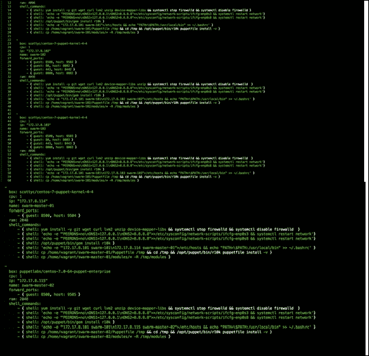

`servers.yaml`文件的代码

正如你所看到的，与上一章节相比，并没有太大的不同。有一个值得注意的地方。我们为每个服务器添加了一个新的行 `- { shell: 'echo -e "PEERDNS=no\nDNS1=127.0.0.1\nDNS2=8.8.8.8">>/etc/sysconfig/network-scripts/ifcfg-enp0s8 && systemctl restart network'}`。我们会在服务器多重主机环境下确保正确解析 DNS。

接下来我们将看一下 puppetfile 文件，如下所示：

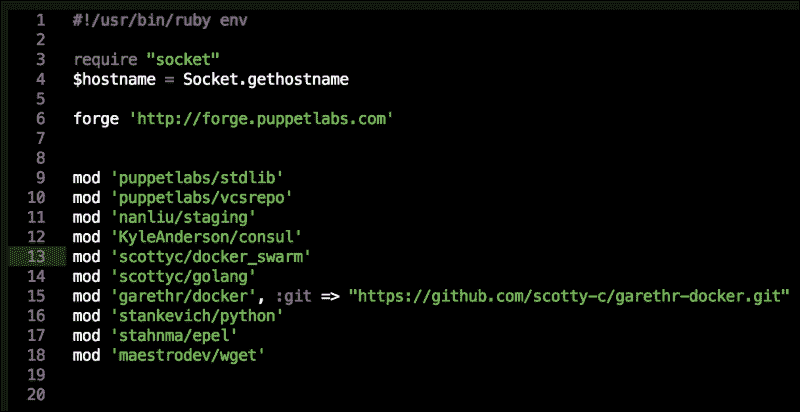

正如你从代码中看到的，与上一章节相比，并没有什么新的变化。所以，让我们转向我们模块根目录中的`heiradata/global.yml`中的 Hiera 文件：

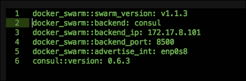

正如你从代码中看到的，我们正在将 Swarm 版本设置为`v1.1.3`，后端设置为`consul`。我们设置了 Consul 集群中第一个节点的 IP 地址，并将 Consul 端口设置为`8500`。我们将设置我们从中广播的`swarm`接口，并最后但同样重要的是，我们将设置我们的 Consul 版本为`0.6.3`。

现在，我们将创建我们的模块。我们再次调用`config`模块。一旦你创建了你的`<AUTHOR>-config`模块，请将它移动到你的 Vagrant 存储库根目录中的`modules`文件夹中。

现在我们有了我们的模块，让我们在其中添加我们的代码。我们需要在`manifests`目录下创建以下文件：`compose.pp`、`consul_config`、`dns.pp`、`run_containers.pp`和`swarm.pp`。由于在此示例中使用 Hiera，我们不需要`params.pp`。

所以，让我们按照字母顺序浏览文件。在我们的`compose.pp`文件中，我们将添加以下代码：

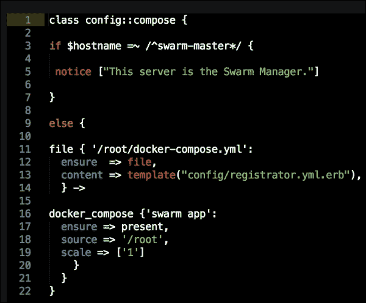

正如你从代码中看到的，我们正在将我们的`docker-compose.yml`文件添加到任何不是 Swarm 主节点的节点上。当我们查看`templates`目录时，我们将回到`docker-compose.yml`文件。接下来的文件是`consul_config.pp`，如下所示：

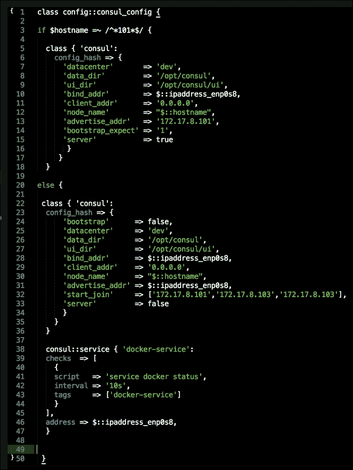

在这个文件中，我们声明了我们的 Consul 集群，并定义了引导服务器。这应该看起来很熟悉，因为这与我们在上一章节中使用的代码相同。接下来是`dns.pp`文件，如下所示：

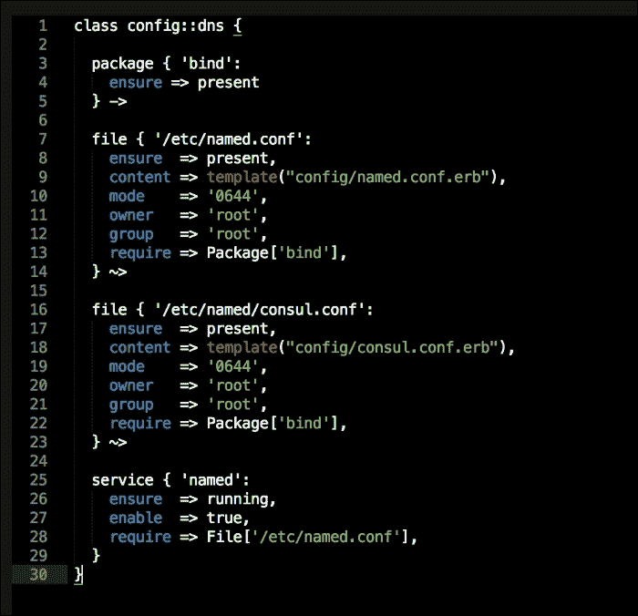

这段代码应该看起来很熟悉，因为我们在上一章节中已经使用过它。简要回顾一下，这里是设置和配置我们的绑定包，使用 Consul 作为 DNS 服务器。接下来我们将查看`init.pp`文件：

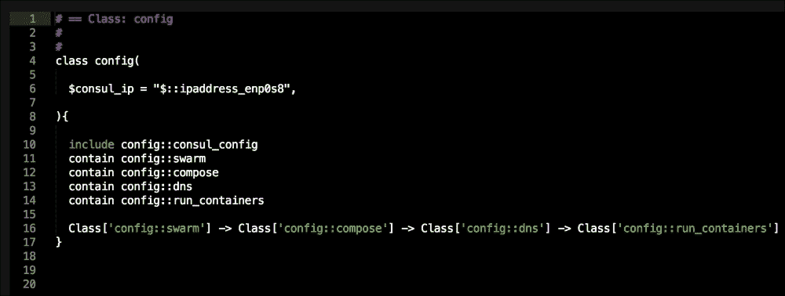

在`init.pp`文件中，我们只是在我们的模块内部排序我们的类。现在我们将转向`run_containers.pp`。这里我们将在 Swarm 集群中安排我们的 ELK 容器：

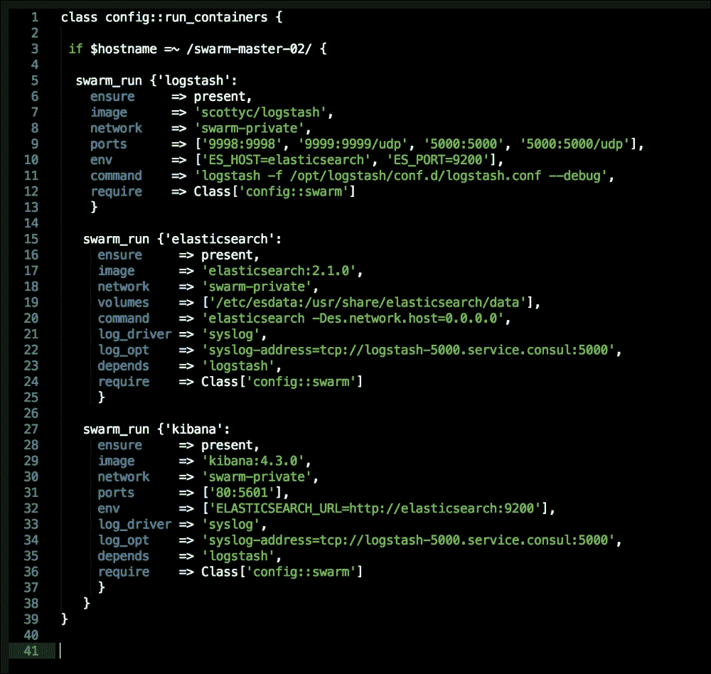

让我们详细看一下这一点，因为这里有很多新的代码。我们将使用的第一个声明是从第二个 Swarm 主节点调度容器。

下一个代码块将配置我们的`logstash`容器。我们需要首先在这个示例中有这些容器，因为我们将它们作为 syslog 服务器使用。如果在创建容器时它们无法连接到`logstash`的 TCP 端口`5000`，容器构建将失败。因此，让我们继续配置`logstash`。我们将使用我提供的容器，因为它是官方容器，并且我们已经添加了`logstash.conf`文件。接下来，我们将`logstash`添加到我们的内部`swarm-private` Docker 网络，并在所有网络上暴露`logstash`的所有端口。这样，我们就可以从任何地方将日志传输到它。之后，我们将设置`elasticsearch`的位置，然后给出启动命令。

### Logstash

在第二个代码块中，我们将安装并配置`elasticsearch`。我们将使用官方的`elasticsearch`容器（版本 2.1.0）。我们只会将`elasticsearch`添加到我们的私有 Docker 网络`swarm-private`中。我们将通过声明卷映射来保持数据持久性。我们将设置命令和参数，以便通过命令值启动`elasticsearch`。接下来，我们将设置日志驱动为 syslog，并将 syslog 服务器设置为`tcp://logstash-5000.service.consul:5000`。请注意，我们正在使用我们的 Consul 服务发现地址，因为我们在外部网络上暴露了`logstash`。最后，我们设置`logstash`的依赖关系。正如我之前提到的，syslog 服务器需要在该容器启动时可用，因此我们需要`logstash`在此容器或`kibana`之前就已经存在。说到 Kibana，让我们继续到最后一个代码块。

在我们的`kibana`容器中，我们将添加以下配置。首先，我们将使用官方的`kibana`镜像（版本 4.3.0）。我们将`kibana`添加到我们的`swarm-private`网络，以便它能够访问我们的`elasticsearch`容器。我们将把端口`5601`映射到主机网络上的`80`端口。在最后几行中，我们将以与`elasticsearch`相同的方式设置 syslog 配置。

现在，是时候处理我们的最后一个文件`swarm.pp`，内容如下：

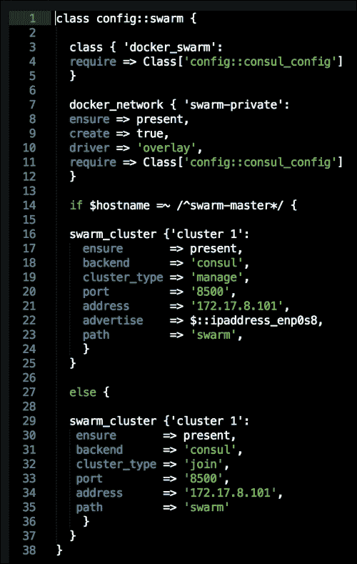

在这段代码中，我们正在配置我们的 Swarm 集群和 Docker 网络。

现在，我们将进入模块根目录下的`templates`文件夹。我们需要创建三个文件。两个文件`Consul.conf.erb`和`named.conf.erb`是用于我们的绑定配置。最后一个文件是我们的`registrator.yml.erb` Docker Compose 文件。我们将把代码添加到以下文件中。

首先，让我们看看`consul.conf.erb`的代码，内容如下：

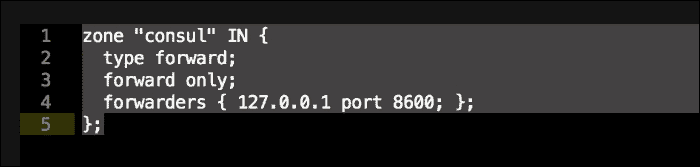

现在，让我们看看`named.conf.erb`的代码，内容如下：

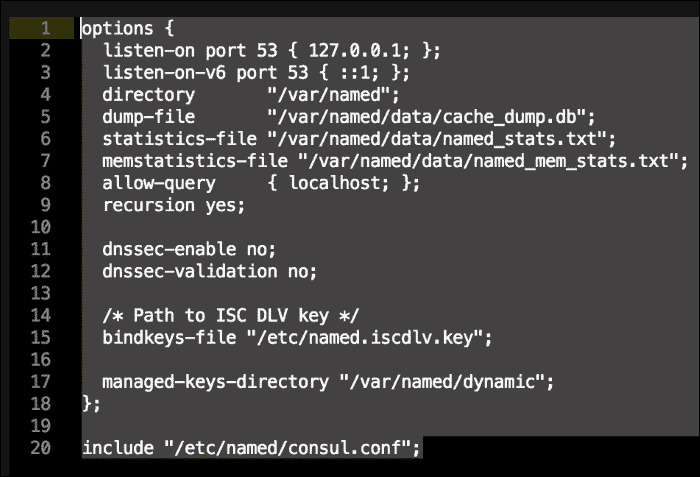

最后，让我们看看`registrator.yml.erb`的代码，内容如下：

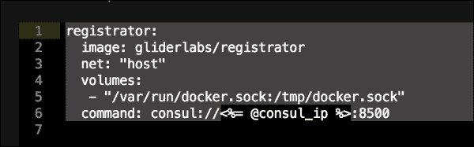

这些文件中的所有代码应该都非常熟悉，因为我们在之前的章节中已经使用过它。

现在，在运行我们的集群之前，我们只需要做最后一项配置。让我们前往 Vagrant 仓库根目录中的`manifests`文件夹中的`default.pp`清单文件。

现在，我们将向清单文件中添加相关的节点定义：

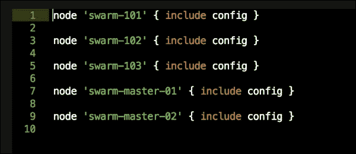

我们现在准备进入终端，切换到我们的 Vagrant 仓库根目录。像以前一样，我们将运行`vagrant up`命令。如果你还保留了上一章配置的盒子，可以运行`vagrant destroy -f && vagrant up`命令。

一旦 Vagrant 运行并且 Puppet 构建了我们的五个节点，我们就可以打开浏览器并访问`http://127.0.0.1:9501/`。此时我们应该看到以下页面：

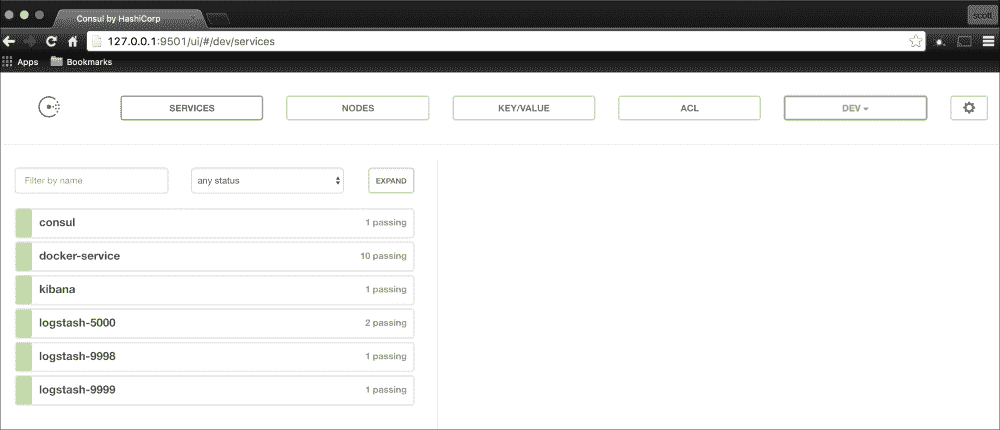

如你所见，所有我们的服务都以绿色显示，表示健康状态。接下来，我们需要找到我们的`kibana`容器运行在哪个节点上。我们将通过点击**kibana**服务来完成这一步。

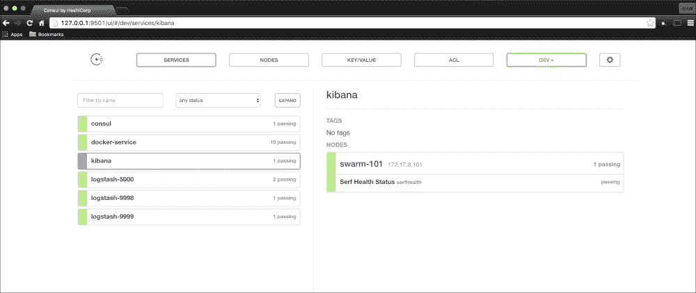

在我的示例中，**kibana**已经在**swarm-101**上启动。如果你的情况不同，不用担心，因为 Swarm 集群可能已经将容器调度到了三个节点中的任何一个。现在，我将打开一个浏览器标签，输入`127.0.0.1:8001/`，如下面的截图所示：

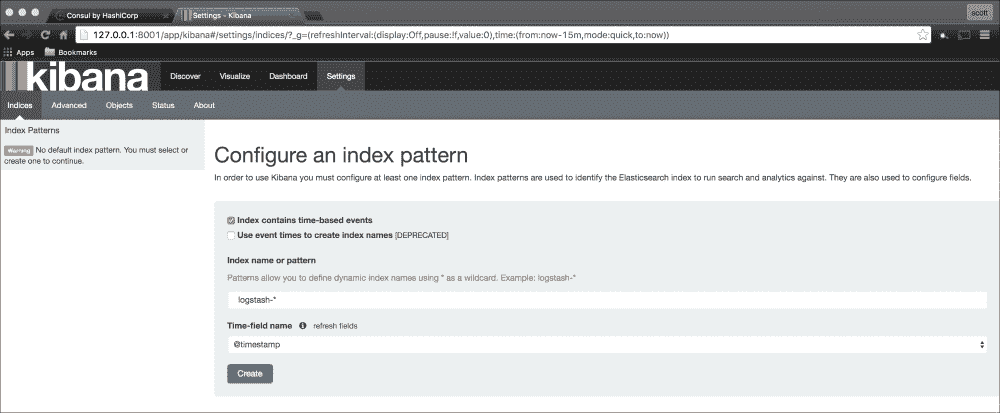

如果你的主机不同，请参考`servers.yaml`文件以获取正确的端口。

然后，我们将创建索引并点击**Discovery**标签，如截图所示，我们的日志已经进入：

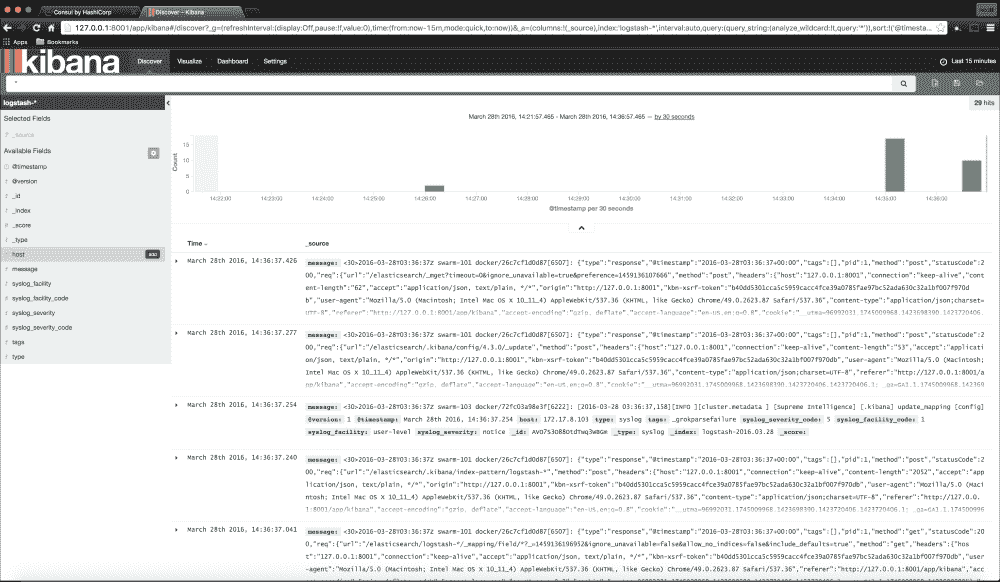

创建索引后的日志

# 监控

在容器的世界里，你可以部署几种监控级别。例如，你有传统的运维监控。比如 Nagios、Zabbix，甚至可能是像 Datadog 这样的云解决方案。这些解决方案都能很好地与 Docker 集成，并且可以通过 Puppet 进行部署。在本书中，我们假设运维团队已经完成了这一部分工作，传统监控已经就绪。我们将关注下一个监控级别。我们将集中在容器的连接性和 Swarm 集群的健康状况上。我们将在 Consul 中完成这些，并通过 Puppet 部署我们的代码。

我们关注这个级别的监控是因为我们可以根据 Consul 报告做出决策。我们是否需要扩展容器？一个 Swarm 节点是否出现故障？我们是否应该将它从集群中移除？要解决这些问题，我们需要写一本单独的书。我不会覆盖这些解决方案。我们将关注的是达到这些目标的第一步。现在，种子已经播下，你将希望进一步探索你的选项。挑战在于改变我们对监控的思维方式，以及它如何需要人类的反应性互动，这样我们就可以信任我们的代码为我们做出选择，并使我们的解决方案完全自动化。

## 使用 Consul 进行监控

使用 Consul 的一个很好的优点是，Hashicorp 在文档编写方面做得非常出色，Consul 也不例外。如果你想了解更多关于 Consul 监控选项的信息，请参考 [`www.consul.io/docs/agent/services.html`](https://www.consul.io/docs/agent/services.html) 和 [`www.consul.io/docs/agent/checks.html`](https://www.consul.io/docs/agent/checks.html) 的文档。我们将设置检查和服务。在上一章中，我们编写了一个服务来使用 Consul 监控每个节点上的 Docker 服务：

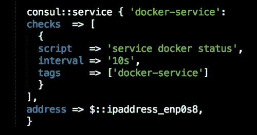

在 Consul Web UI 上，我们看到以下 Docker 服务的节点读取：

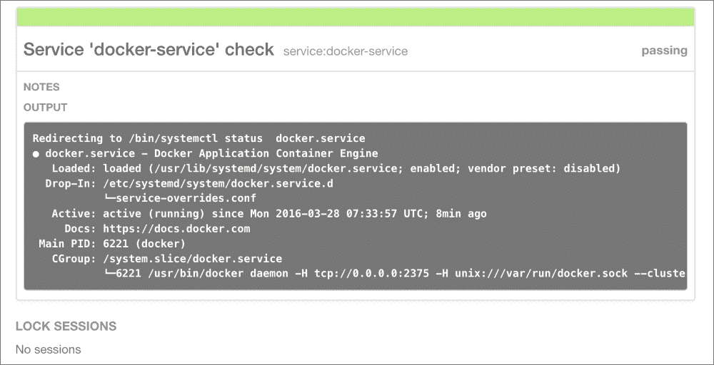

我们将把所有新的检查应用到两个 Swarm 主节点。这样做的原因是，这两个节点位于集群之外。这样的抽象化让我们无需担心容器运行在哪些节点上。你还可以从多个位置进行监控轮询。例如，在 AWS 中，你的 Swarm 主节点可能分布在多个可用区（AZ）。因此，即使丢失一个可用区，你的监控仍然可用。

因为我们将使用前一节中介绍的日志解决方案，所以我们需要检查并确保 Logstash 和 Kibana 都可用；Logstash 在端口 5000，Kibana 在端口 80。

我们将向 `consul_config.pp` 文件中的配置模块添加两个新的服务检查，如下所示：

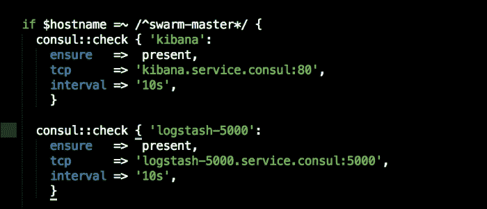

如你所见，我们为 `kibana` 和 `logstash` 都设置了 TCP 检查，并且我们将使用服务发现地址来测试连接。接下来，我们将在终端中打开并切换到 Vagrant 仓库的根目录。

现在，我们假设你的五个节点正在运行。我们将向 Vagrant 发出命令，仅为两个主节点进行配置。这个命令是 `vagrant provision swarm-master-01 && vagrant provision swarm-master-02`。然后，我们将打开浏览器并输入 `127.0.0.1:9501`。接着你可以点击**swarm-master-01**或**swarm-master-02**，选择权在你。完成后，你应该会看到如下结果：

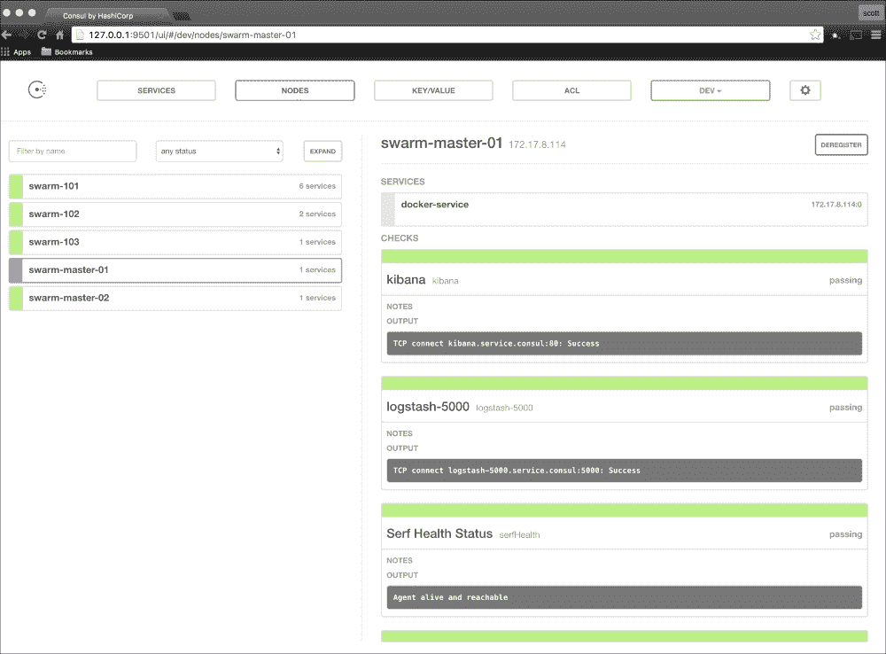

如你所见，我们的监控是成功的。接下来我们将回到代码中，为我们的 swarm master 添加一个检查，以确定其健康状况。我们将通过以下代码来实现：

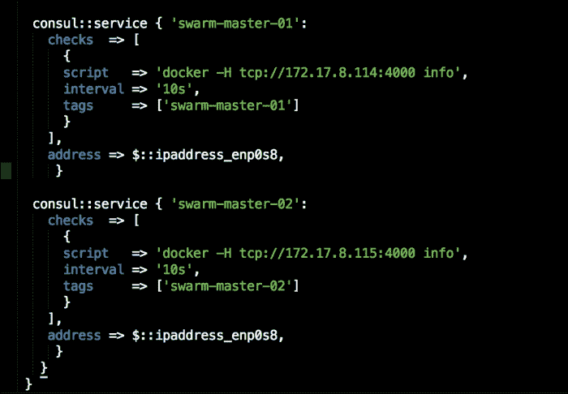

然后，我们将执行 Vagrant 提供命令，`vagrant provision swarm-master-01 && vagrant provision swarm-master-02`。接着，我们将打开浏览器并点击**swarm-master-01**或**swarm-master-02**。完成后，你应该会看到如下结果：

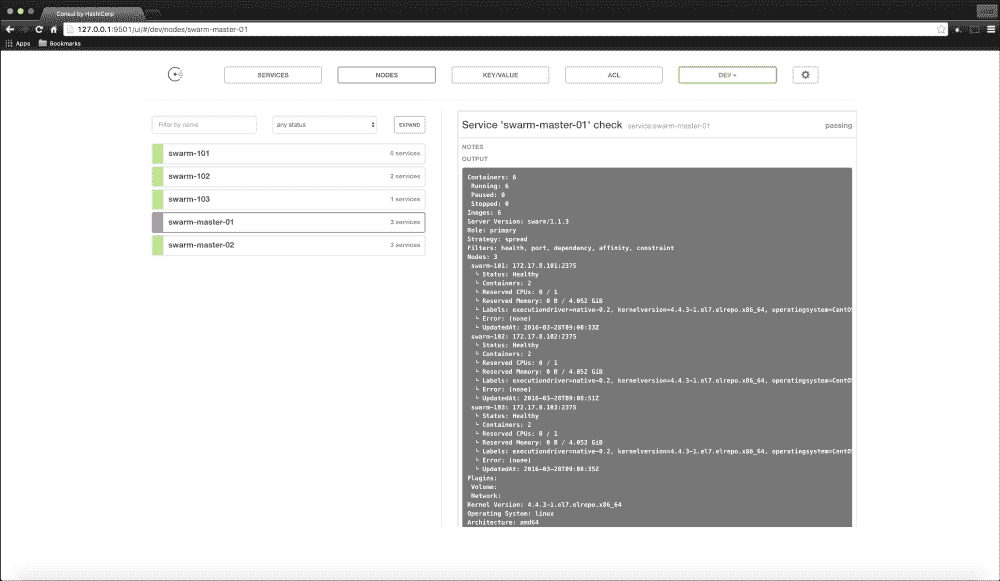

从健康检查中可以看到的信息，我们可以轻松地识别出哪个 Swarm 主节点是主节点，以及调度策略。这在你遇到问题时会非常有用。

如你所见，Consul 是一个非常实用的工具，如果你想了解我们在本章中讨论的内容，你真的可以做一些很酷的事情。

# 恢复技术

在每个解决方案中，拥有一些恢复技术是非常重要的。在容器世界中，情况也不例外。有很多种方式可以实现这一点，比如使用 HA 代理进行负载均衡，甚至使用专为此目的设计的容器化应用程序，例如 interlock（[`github.com/ehazlett/interlock`](https://github.com/ehazlett/interlock)）。如果你还没有查看过 interlock，真的是太棒了！！！根据底层应用程序的不同，我们可以使用许多不同的解决方案组合。所以在这里，我们将讨论 Docker Swarm 中的内建高可用性。从这里，你可以使用类似 interlock 的工具，确保你的容器访问没有停机时间。

## 内建高可用性

Docker Swarm 有两种类型的节点：主节点和成员节点。每种节点都有不同的内建故障保护。我们将首先看一下主节点。

在上一主题中，我们设置了健康检查，以获取有关我们的 Swarm 集群的信息。我们看到我们有一个主节点或主要的 Swarm 主节点和一个副本。Swarm 会通过 TCP 端口 4000 复制所有的集群信息。因此，为了模拟故障，我们将关闭主节点。我的主节点是 `swarm-master-01`，但你的可能不同。我们将使用已经创建的健康检查来测试故障并观察 Swarm 如何自我处理。我们将执行 `vagrant halt swarm-master-01` 命令。然后，我们会再次打开浏览器，访问我们的 Consul Web UI，`127.0.0.1:9501`。正如我们在以下截图中看到的，`swarm-master-02` 现在是主节点：

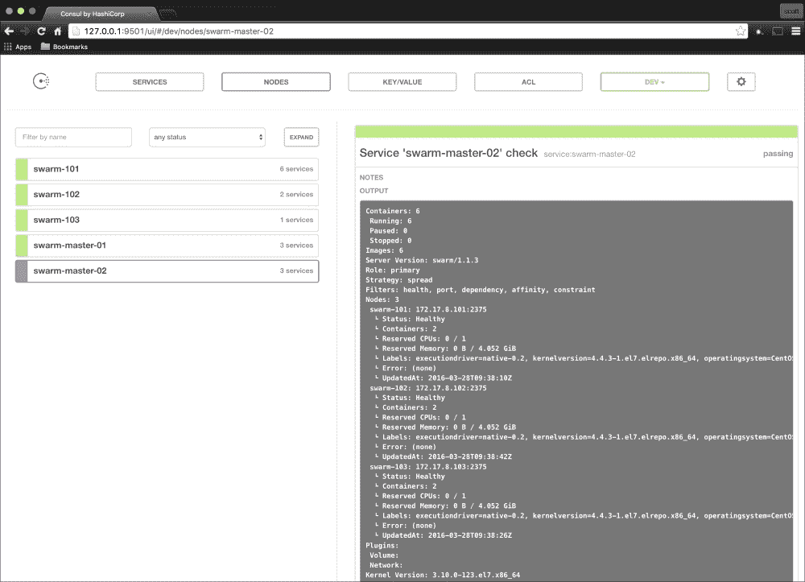

现在，我们将继续讨论在我们的 Swarm 节点高可用性（HA）下的容器重启。从版本 1.1.3 开始，Swarm 提供了一项功能，当原始节点发生故障时，容器会在健康的节点上重新启动。对此有一些规则，例如在你使用过滤规则或链接容器时。想要了解更多相关信息，可以阅读位于 [`github.com/docker/swarm/tree/master/experimental`](https://github.com/docker/swarm/tree/master/experimental) 的 Docker Swarm 文档。

为了测试这一点，我将暂停托管 Kibana 的节点。我们需要在 `kibana` 容器中添加一些代码，以便在故障时能够重启。如下截图所示，这些设置被添加到了 `env` 资源中：

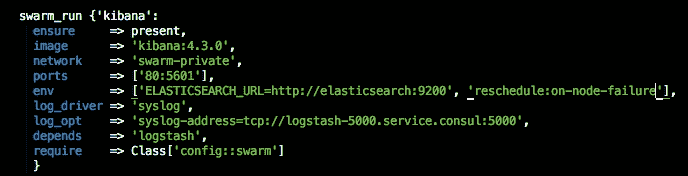

我们首先需要终止旧的容器，以便添加重启策略。我们可以通过将 **ensure** 资源设置为 **absent** 来做到这一点，然后运行 Vagrant 配置 `swarm-master-02`。

一旦 Vagrant 运行完成，我们将其恢复为**当前**状态，并运行`vagrant provision swarm-master-02`。

对我来说，我的`kibana`容器在**swarm-102**上（这可能对你来说会有所不同）。一旦该节点失败，`kibana`会在健康节点上重启。所以，让我们执行`vagrant halt swarm-102`。如果我们访问 Consul 的 URL `127.0.0.1:9501`，我们应该会看到一些节点和检查的失败，如下图所示：

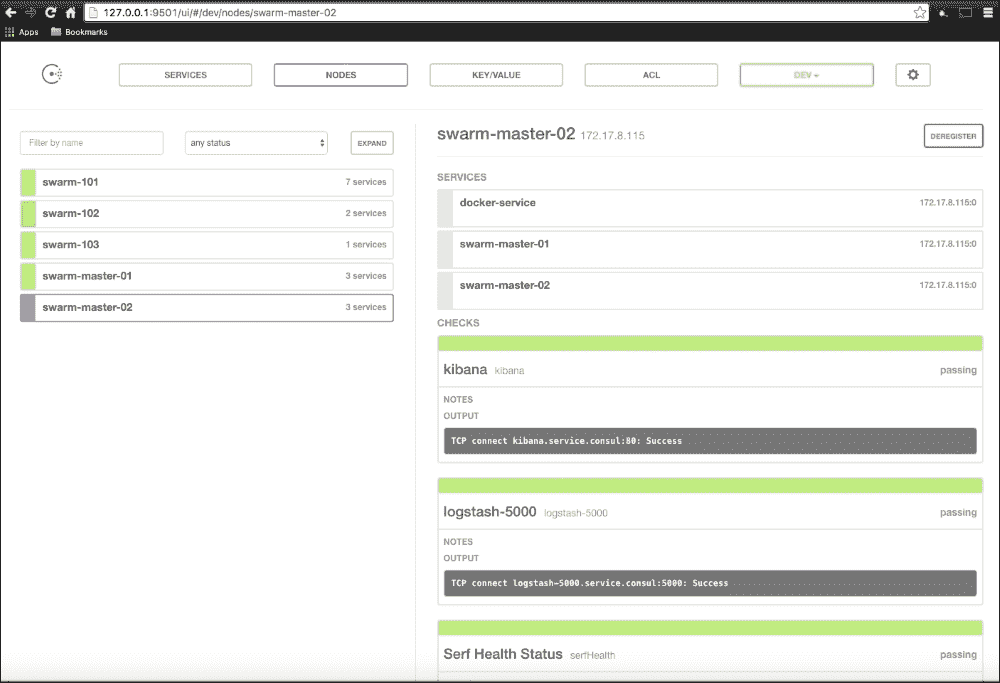

如果你等个一分钟左右，你会看到`kibana`警报恢复，并且容器在另一台服务器上启动。对我来说，`kibana`恢复在**swarm-101**上，正如你在下面的截图中看到的那样：

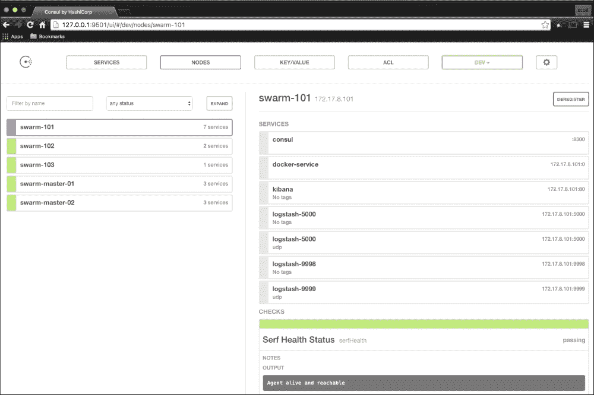

然后我们可以在浏览器中查看`kibana`。对我来说，它会在`127.0.0.1:8001`上：

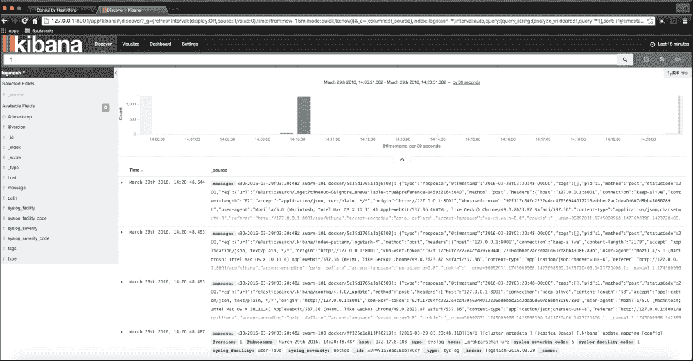

连接到 Elasticsearch 后的 Kibana

如你所见，所有的日志都在那；我们的服务发现工作得非常完美，因为容器一旦更换节点，我们的健康检查就变成了绿色。

# 总结

在这一章中，我们探讨了如何使用 Puppet 将容器环境实现自动化。我们介绍了使用 ELK 的日志解决方案。我们将 Consul 提升到了新的水平，进行了更深入的健康检查，并创建了监控集群的服务。接着我们测试了 Swarm 自带的内置高可用性功能。从我们在第二章《与 Docker Hub 合作》中的初步尝试开始，我们已经走了很长一段路。你已经完全装备好，可以将这里获得的知识应用到实际工作中了。
